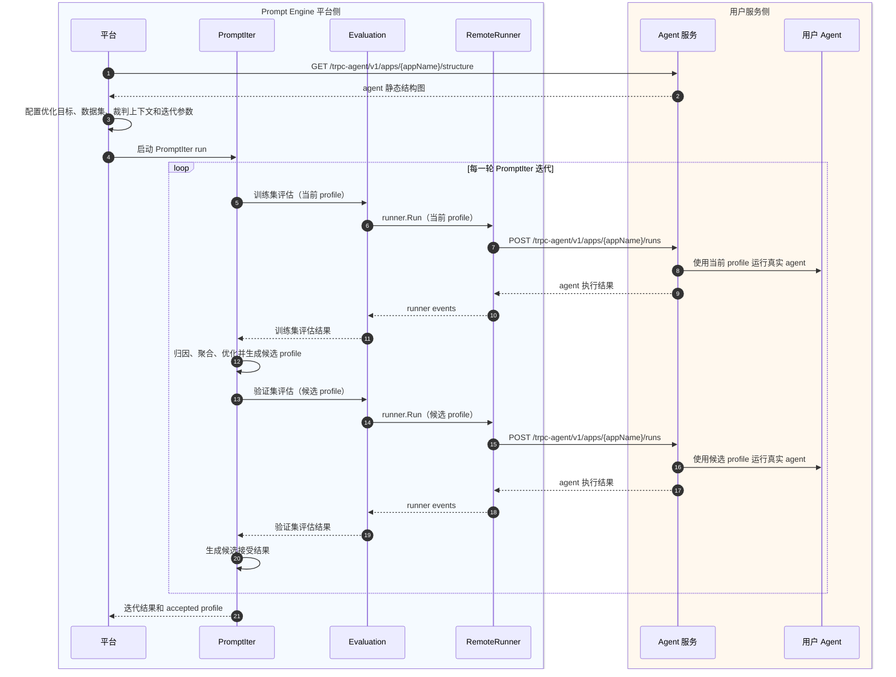

# Prompt Engine 平台化 tRPC-Agent API 接入方案

## 背景与目标

Prompt Engine 平台化 PromptIter 的目标，是把评估、反向传播、梯度聚合、优化、验证和版本发布放到平台侧完成。用户服务保留真实业务 agent、model、tool、memory、session、权限和脱敏逻辑，并通过 tRPC-Agent API 服务提供一次真实 agent run 的执行入口。

平台侧承担 [EvalSet](https://github.com/trpc-group/trpc-agent-go/blob/main/docs/mkdocs/zh/evaluation.md#评估集-evalset)、[Metric](https://github.com/trpc-group/trpc-agent-go/blob/main/docs/mkdocs/zh/evaluation.md#评估指标-evalmetric)、[PromptIter](https://github.com/trpc-group/trpc-agent-go/blob/main/docs/mkdocs/zh/promptiter.md)、[backwarder](https://github.com/trpc-group/trpc-agent-go/blob/main/docs/mkdocs/zh/promptiter.md#反向传播器-backwarder)、[aggregator](https://github.com/trpc-group/trpc-agent-go/blob/main/docs/mkdocs/zh/promptiter.md#梯度聚合器-aggregator)、[optimizer](https://github.com/trpc-group/trpc-agent-go/blob/main/docs/mkdocs/zh/promptiter.md#补丁优化器-optimizer)、裁判评估和 prompt 版本发布。用户侧新增的接入面收敛为一个 tRPC-Agent API 服务。

```text
Prompt Engine 平台负责迭代和评估，用户服务负责运行真实 agent。
```

## 角色边界

| 角色 | 职责 |
| --- | --- |
| Prompt Engine 平台 | 管理 evalset、metric、PromptIter run、候选 profile、裁判评估、结果持久化和版本发布。 |
| `trpc-agent-go` | 提供 tRPC-Agent API、用户侧 `server/trpcagent`、平台侧 `runner/trpcagent`、profile 应用语义和必要的 PromptIter/evaluation 接入能力。 |
| 用户服务 | 暴露 tRPC-Agent API 服务，运行真实业务 agent，并返回 agent 执行轨迹。 |

tRPC-Agent API 是 `trpc-agent-go` 定义的原生 Agent API。Prompt Engine 使用它做 PromptIter 远程推理；API 本身聚焦 agent 的结构导出和运行入口，PromptIter、evalset、metric、backwarder、optimizer 这些平台迭代概念留在平台和 evaluation 侧。

## 总体链路

Prompt Engine 平台先从用户服务获取 [agent 静态结构图](https://github.com/trpc-group/trpc-agent-go/blob/main/docs/mkdocs/zh/agent.md#静态结构导出)，用它识别可优化的 prompt [surface](https://github.com/trpc-group/trpc-agent-go/blob/main/docs/mkdocs/zh/agent.md#按-nodeid-覆盖运行时-surface)。PromptIter 每轮生成候选 profile 后，evaluation 通过 tRPC-Agent API 调用用户服务，在训练集和验证集上运行真实 agent。用户服务按本次 profile 执行 agent，并返回 agent 执行轨迹。平台在本地完成 metric evaluation、候选接受和版本发布。



## tRPC-Agent API

`server/trpcagent` 是用户服务侧接入层。它把用户已有 agent 和 runner 包装成 HTTP 服务，负责导出 agent 静态结构图、接收本次运行的 profile、应用 profile、调用真实业务 runner，并返回 agent 执行轨迹。

核心 HTTP 方法如下：

| Method | Path | 用途 |
| --- | --- | --- |
| `GET` | `/trpc-agent/v1/apps/{appName}/structure` | 导出 agent 静态结构图。 |
| `POST` | `/trpc-agent/v1/apps/{appName}/runs` | 执行一次 agent run。 |

URL 由用户服务地址、tRPC-Agent API base path、appName 和资源路径组成。Prompt Engine 平台保存用户服务地址和 appName，`runner/trpcagent` 按固定规则拼出调用地址。举例来说，服务地址是 `http://10.0.0.8:8080`，appName 是 `sports-agent` 时，平台访问：

```text
GET  http://10.0.0.8:8080/trpc-agent/v1/apps/sports-agent/structure
POST http://10.0.0.8:8080/trpc-agent/v1/apps/sports-agent/runs
```

`/trpc-agent/v1/apps` 是默认 base path，可通过 server option 调整。`appName` 复用框架已有 runner、session、evaluation 和 PromptIter 的 app 隔离语义。每个 appName 对应一个可执行 root agent。多业务、多环境或多 agent 场景通过平台注册多条服务地址和 appName 记录表达。

### 请求响应

`GET /trpc-agent/v1/apps/{appName}/structure` 返回 agent 静态结构图。`structure` 复用框架已有 `agent/structure.Snapshot`，用于平台识别可优化 surface，并让 PromptIter 在生成 profile 时补齐执行所需的 surface 元数据。

```json
{
  "structure": {
    "StructureID": "sports_agent_v1",
    "EntryNodeID": "planner",
    "Nodes": [
      {
        "NodeID": "planner",
        "Kind": "agent",
        "Name": "planner"
      },
      {
        "NodeID": "writer",
        "Kind": "agent",
        "Name": "writer"
      }
    ],
    "Edges": [
      {
        "FromNodeID": "planner",
        "ToNodeID": "writer"
      }
    ],
    "Surfaces": [
      {
        "SurfaceID": "writer#instruction",
        "NodeID": "writer",
        "Type": "instruction",
        "Value": {
          "Text": "Write a concise match recap."
        }
      }
    ]
  }
}
```

`POST /trpc-agent/v1/apps/{appName}/runs` 执行一次同步 agent run。请求体承载用户输入、隔离会话、本轮 profile 和运行选项。

```json
{
  "session": {
    "userId": "prompt-engine",
    "sessionId": "2f8c4b4f-4e7a-4c6f-a4d4-927fdf8a9a11"
  },
  "input": {
    "role": "user",
    "content": "match_001"
  },
  "profile": {
    "structureID": "sports_agent_v1",
    "overrides": [
      {
        "surfaceID": "writer#instruction",
        "nodeID": "writer",
        "type": "instruction",
        "value": {
          "Text": "根据比赛数据生成一段中文赛后总结。"
        }
      }
    ]
  },
  "runOptions": {
    "requestID": "req_001",
    "executionTraceEnabled": true
  }
}
```

核心字段如下：

| 字段 | 约束 | 含义 |
| --- | --- | --- |
| `session` | 必填 | runner 会话信息。`userId` 表示评估调用方身份，`sessionId` 由 evaluation service 的 `SessionIDSupplier` 生成后传给用户服务；appName 来自 URL path。 |
| `input` | 必填 | 当前用户输入，使用框架 `model.Message` 的 JSON 形态。纯文本输入使用 `content`，多模态输入使用 `content_parts`。 |
| `profile` | 可选 | 本次 run 的 surface 覆盖配置，语义和 PromptIter 的 `Profile` 一致：`structureID + overrides`，每个 override 携带 `surfaceID`、`nodeID`、`type` 和 `value`。 |
| `runOptions.requestID` | 可选 | 本次 run 的请求 ID，对应 `agent.RunOptions.RequestID` 和 `agent.WithRequestID`。调用方不传时服务端生成。 |
| `runOptions.executionTraceEnabled` | 可选 | 控制 agent 执行轨迹记录，对应 `agent.RunOptions.ExecutionTraceEnabled` 和 `agent.WithExecutionTraceEnabled`。 |

`runOptions` 只承载 `requestID` 和 `executionTraceEnabled`，不镜像完整 `agent.RunOptions`。`profile.structureID` 标识生成期使用的 structure，执行端不依赖完整 snapshot；`overrides[].surfaceID`、`nodeID` 和 `type` 共同定位运行时 surface，`value` 符合对应 surface type。

响应体返回本次 run 状态、runner events、消息摘要、agent 执行轨迹和 token 使用量。

```json
{
  "status": "completed",
  "events": [
    {
      "requestID": "req_001",
      "invocationId": "inv_002",
      "author": "writer",
      "id": "evt_001",
      "timestamp": "2026-06-28T10:00:03Z",
      "object": "chat.completion",
      "choices": [
        {
          "index": 0,
          "message": {
            "role": "assistant",
            "content": "主队在末节打出关键攻势，以 102:98 取胜。"
          }
        }
      ],
      "done": true
    },
    {
      "requestID": "req_001",
      "invocationId": "inv_001",
      "author": "planner",
      "id": "evt_002",
      "timestamp": "2026-06-28T10:00:03Z",
      "object": "runner.completion",
      "done": true
    }
  ],
  "messages": [
    {
      "role": "user",
      "content": "match_001"
    },
    {
      "role": "assistant",
      "tool_calls": [
        {
          "id": "tool_call_001",
          "type": "function",
          "function": {
            "name": "fetch_match",
            "arguments": "{\"matchId\":\"match_001\"}"
          }
        }
      ]
    },
    {
      "role": "tool",
      "tool_id": "tool_call_001",
      "tool_name": "fetch_match",
      "content": "{\"homeScore\":102,\"awayScore\":98}"
    },
    {
      "role": "assistant",
      "content": "主队在末节打出关键攻势，以 102:98 取胜。"
    }
  ],
  "executionTrace": {
    "RootAgentName": "planner",
    "RootInvocationID": "inv_001",
    "SessionID": "2f8c4b4f-4e7a-4c6f-a4d4-927fdf8a9a11",
    "StartedAt": "2026-06-28T10:00:00Z",
    "EndedAt": "2026-06-28T10:00:03Z",
    "Status": "completed",
    "Usage": {
      "prompt_tokens": 520,
      "completion_tokens": 86,
      "total_tokens": 606
    },
    "Steps": [
      {
        "StepID": "step_001",
        "InvocationID": "inv_001",
        "ParentInvocationID": "",
        "AgentName": "planner",
        "Branch": "",
        "NodeID": "planner",
        "StartedAt": "2026-06-28T10:00:00Z",
        "EndedAt": "2026-06-28T10:00:01Z",
        "PredecessorStepIDs": null,
        "AppliedSurfaceIDs": null,
        "Input": {
          "Text": "match_001"
        },
        "Output": {
          "Text": "fetch match data, then write recap"
        },
        "Usage": {
          "prompt_tokens": 180,
          "completion_tokens": 26,
          "total_tokens": 206
        },
        "Error": ""
      },
      {
        "StepID": "step_002",
        "InvocationID": "inv_002",
        "ParentInvocationID": "inv_001",
        "AgentName": "writer",
        "Branch": "",
        "NodeID": "writer",
        "StartedAt": "2026-06-28T10:00:01Z",
        "EndedAt": "2026-06-28T10:00:03Z",
        "PredecessorStepIDs": [
          "step_001"
        ],
        "AppliedSurfaceIDs": [
          "writer#instruction"
        ],
        "Input": {
          "Text": "match_001"
        },
        "Output": {
          "Text": "主队在末节打出关键攻势，以 102:98 取胜。"
        },
        "Usage": {
          "prompt_tokens": 340,
          "completion_tokens": 60,
          "total_tokens": 400
        },
        "Error": ""
      }
    ]
  }
}
```

`status` 表示本次 agent run 结果，取值为 `completed`、`incomplete`、`failed`，语义对齐 `agent/trace.TraceStatus`。HTTP 状态码表达协议调用结果；agent 自身执行失败属于一次有效调用结果，响应可以使用 `200`，并通过 `status` 和 `errorMessage` 表达失败原因。

`events` 是远端 runner 恢复本次运行事件流的权威数据，复用框架 `event.Event` 的 JSON 形态，保留 `requestID`、`parentMetadata`、`branch`、`stateDelta`、`extensions`、原始 `author` 和 response 级字段。并发 subagent、agent tool 和 transfer 等场景不能从 `messages` 反推，必须以 `events` 为准。每个 `200` run response 都必须返回 `events`，每个 event 必须带本次 run 的 `requestID`，最后一个有效事件必须是 `runner.completion`；agent 尚未产生事件流就启动失败时，服务端可以通过 error event 加 `runner.completion` 表达。已开始的事件流缺少 `runner.completion` 或出现不匹配的 `requestID` 时，属于协议错误，服务端不能补齐成有效 run response。

`messages` 是本次 agent run 的有序消息摘要。第一条消息是本次请求的 `input`，随后消息按发生顺序记录 assistant 输出、tool call 和 tool result，主要用于响应预览和兼容旧客户端。`executionTrace` 负责把本次运行和 agent 静态结构图对齐，PromptIter 归因、loss 计算、候选 profile 验证和裁判上下文选择依赖 `Steps` 中的 `NodeID`、`PredecessorStepIDs`、`AppliedSurfaceIDs`、`Input` 和 `Output`。

`executionTrace.Usage` 表示本次 run 的整体 token 使用量，`Steps[].Usage` 表示单个 step 内可归属到该 step 的 token 使用量。Usage 复用框架现有的 `model.Usage`，当模型或节点没有返回 usage 时该字段为空。

tRPC-Agent API 自有字段使用 lower camel。直接复用框架结构的字段按对应结构的 JSON 形态序列化，例如 `agent/structure.Snapshot`、PromptIter `Profile` 和 `agent/trace.Trace`。

## `runner/trpcagent`

`runner/trpcagent` 是平台侧的远程 runner 实现。它实现框架现有 `runner.Runner` 接口，把一次本地 `runner.Run` 调用转成 tRPC-Agent API 请求，再把用户服务返回的 agent 执行轨迹恢复成 evaluation 可消费的 runner event。

采用 runner 适配而不是新增 `evaluation/service/trpcagent`，是为了复用 `evaluation/service/local` 已有的 eval case 加载、session、context messages、并发、callback 和 metric evaluation 流程。tRPC-Agent API 只负责远程执行真实业务 agent，不复制 evaluation service 的推理编排逻辑。PromptIter 的候选生成、梯度聚合、优化和接受逻辑仍由 PromptIter engine 承载，[Prompt Source](https://github.com/trpc-group/trpc-agent-go/blob/main/docs/mkdocs/zh/prompt.md#langfuse-prompt-source) 的版本发布由 Prompt Engine 平台承载。

PromptIter 生成的当前 profile 或候选 profile 以结构化数据传递给 `runner/trpcagent`。`runner/trpcagent` 在调用用户服务时把本轮 profile 写入 `/runs` 请求体。用户服务按请求中的 profile 执行本次 agent run，并返回 agent 执行轨迹。平台通过这种方式下发本轮候选 prompt。

## 平台接入方式

这一节用于对齐 Prompt Engine 平台如何使用 `trpc-agent-go` 提供的框架能力，以及平台和框架之间的接入边界：平台注册用户的 tRPC-Agent API 服务并保存 agent 静态结构图；平台用 Prompt Engine manager 提供 evalset、metric 和 eval result；框架提供 `runner/trpcagent` 作为远程 runner，让 PromptIter 在平台侧继续面向 evaluation 抽象运行。平台内部的任务编排、存储、发布和 UI 形态由 Prompt Engine 平台按产品形态设计。

下面代码是平台侧编排异步 PromptIter run 时对框架能力的伪代码示意，重点是依赖关系和数据流。平台可以按自身工程结构组织任务、服务和变量命名，平台侧 evalset、metric 和 result manager 由平台实现注入。

`agentServiceTarget` 是用户服务目标，可以是 HTTP 地址，也可以是平台运行时可解析的服务发现 target，例如北极星服务 target。`runner/trpcagent` 使用 evaluation 请求里的 appName 拼出 `/trpc-agent/v1/apps/{appName}/runs`。如果 target 使用非 `http(s)` scheme，平台侧通过 `WithHTTPClient` 注入可解析该 scheme 的 transport。平台通过 `/trpc-agent/v1/apps/{appName}/structure` 获取并保存 structure snapshot，用于 PromptIter 识别可优化 surface。

平台创建、查询和取消接口分别调用 PromptIter manager 的 `Start`、`Get` 和 `Cancel`。

```go
import (
	"trpc.group/trpc-go/trpc-agent-go/evaluation"
	"trpc.group/trpc-go/trpc-agent-go/evaluation/workflow/promptiter/aggregator"
	"trpc.group/trpc-go/trpc-agent-go/evaluation/workflow/promptiter/backwarder"
	promptiterengine "trpc.group/trpc-go/trpc-agent-go/evaluation/workflow/promptiter/engine"
	promptitermanager "trpc.group/trpc-go/trpc-agent-go/evaluation/workflow/promptiter/manager"
	"trpc.group/trpc-go/trpc-agent-go/evaluation/workflow/promptiter/optimizer"
	trpcagentrunner "trpc.group/trpc-go/trpc-agent-go/runner/trpcagent"
)

// 配置 Prompt Engine 平台登记的用户服务目标。
agentServiceTarget := "polaris://trpc.example.agent.Agent"

// 创建 eval set manager，让框架从 Prompt Engine 平台读取 eval case。
evalSetManager := newPromptEngineEvalSetManager(promptEngineToken)
// 创建 metric manager，让框架从 Prompt Engine 平台读取评估指标。
metricManager := newPromptEngineMetricManager(promptEngineToken)
// 创建 eval result manager，让框架把评估结果写回 Prompt Engine 平台。
evalResultManager := newPromptEngineEvalResultManager(promptEngineToken)

// 创建调用用户 Agent 服务的远程 runner，evaluation 的 Inference 阶段会使用它。
remoteRunner, err := trpcagentrunner.New(
	appName,
	// 配置用户服务目标，runner 会结合 appName 拼出 tRPC-Agent API endpoint。
	trpcagentrunner.WithTarget(agentServiceTarget),
)
if err != nil {
	return err
}

// 读取或加载平台保存的用户服务 structure snapshot。
targetStructure, err := loadTargetStructure(ctx, agentServiceTarget, appName)
if err != nil {
	return err
}

// 创建 AgentEvaluator，PromptIter 后续通过它发起训练集和验证集评估。
agentEvaluator, err := evaluation.New(
	// 指定平台侧 appName，它会贯穿 evalset、metric、result 和 tRPC-Agent API URL 拼接。
	appName,
	// 注入 tRPC-Agent API remote runner，用于调用用户服务执行真实 agent。
	remoteRunner,
	// 注入平台 eval set manager，用于读取本轮评估用例。
	evaluation.WithEvalSetManager(evalSetManager),
	// 注入平台 metric manager，用于读取本轮评估指标。
	evaluation.WithMetricManager(metricManager),
	// 注入平台 eval result manager，用于保存每轮评估结果。
	evaluation.WithEvalResultManager(evalResultManager),
	// 注入裁判 agent。
	evaluation.WithJudgeRunner(judgeRunner),
)
if err != nil {
	return err
}

// 创建 backwarder，平台使用它根据训练集评估结果生成文本梯度。
backwarderInstance, err := backwarder.New(ctx, backwarderRunner)
if err != nil {
	return err
}
// 创建 aggregator，平台使用它聚合同一 surface 上来自多个 case 的梯度。
aggregatorInstance, err := aggregator.New(ctx, aggregatorRunner)
if err != nil {
	return err
}
// 创建 optimizer，平台使用它根据聚合后的梯度生成候选 prompt profile。
optimizerInstance, err := optimizer.New(ctx, optimizerRunner)
if err != nil {
	return err
}

// 创建 PromptIter engine。
engineInstance, err := promptiterengine.New(
	ctx,
	// 注入 evaluator，让 PromptIter 可以在每轮调用远程推理和本地评估。
	promptiterengine.WithAgentEvaluator(agentEvaluator),
	// 注入 backwarder，让 PromptIter 可以从失败或低分 case 中生成优化信号。
	promptiterengine.WithBackwarder(backwarderInstance),
	// 注入 aggregator，让 PromptIter 可以把 case 级优化信号聚合到 surface 级别。
	promptiterengine.WithAggregator(aggregatorInstance),
	// 注入 optimizer，让 PromptIter 可以生成下一轮候选 profile。
	promptiterengine.WithOptimizer(optimizerInstance),
	// 注入平台从用户服务结构接口获取的 structure snapshot。
	promptiterengine.WithStructureSnapshot(targetStructure),
)
if err != nil {
	return err
}

// 创建 PromptIter manager，平台侧 store 负责持久化 run 状态和中间结果。
managerInstance, err := promptitermanager.New(
	appName,
	engineInstance,
	// 注入平台实现的 PromptIter run store，用于保存异步 run 生命周期。
	promptitermanager.WithStore(promptIterStore),
)
if err != nil {
	return err
}

// 构造 PromptIter run 请求，平台在这里声明本次迭代要使用的数据和策略。
runRequest := &promptiterengine.RunRequest{
	// 配置训练集，PromptIter 用它计算 loss、生成梯度和产生候选 profile。
	Train: []promptiterengine.EvalSetInput{
		{
			// 指定训练集 ID，数据由 Prompt Engine eval set manager 读取。
			EvalSetID:   trainEvalSetID,
			// 指定参与本次训练的 case ID 列表。
			EvalCaseIDs: trainEvalCaseIDs,
		},
	},
	// 配置验证集，PromptIter 用它评估候选 profile 的真实效果。
	Validation: []promptiterengine.EvalSetInput{
		{
			// 指定验证集 ID，数据由 Prompt Engine eval set manager 读取。
			EvalSetID:   validationEvalSetID,
			// 指定参与本次验证的 case ID 列表。
			EvalCaseIDs: validationEvalCaseIDs,
		},
	},
	// 配置 evaluation 阶段的并发策略，影响远程推理和本地裁判评估吞吐。
	EvaluationOptions: promptiterengine.EvaluationOptions{
		// 限制同时处理的 eval case 数量，避免打满用户 Agent 服务或 judge runner。
		EvalCaseParallelism:               evalCaseParallelism,
		// 开启 case 级远程推理并发，让训练集和验证集推理更快完成。
		EvalCaseParallelInferenceEnabled:  true,
		// 开启 case 级裁判评估并发，让平台本地评估更快完成。
		EvalCaseParallelEvaluationEnabled: true,
	},
	// 配置 backward 阶段的并发策略，影响文本梯度生成速度。
	BackwardOptions: promptiterengine.BackwardOptions{
		// 开启 case 级 backward 并发，让多个低分 case 可以同时归因。
		CaseParallelismEnabled: true,
		// 限制 backward case 并发数，控制 backwarder runner 的资源消耗。
		CaseParallelism:        backwardCaseParallelism,
	},
	// 配置 aggregation 阶段的并发策略，影响多 surface 梯度聚合速度。
	AggregationOptions: promptiterengine.AggregationOptions{
		// 开启 surface 级 aggregation 并发，让多个 prompt surface 可以同时聚合。
		SurfaceParallelismEnabled: true,
		// 限制 aggregation surface 并发数，控制 aggregator runner 的资源消耗。
		SurfaceParallelism:        aggregationSurfaceParallelism,
	},
	// 配置 optimizer 阶段的并发策略，影响候选 prompt 生成速度。
	OptimizerOptions: promptiterengine.OptimizerOptions{
		// 开启 surface 级 optimizer 并发，让多个 prompt surface 可以同时优化。
		SurfaceParallelismEnabled: true,
		// 限制 optimizer surface 并发数，控制 optimizer runner 的资源消耗。
		SurfaceParallelism:        optimizerSurfaceParallelism,
	},
	// 配置候选接受策略，平台用它决定候选 profile 进入下一轮或发布流程。
	AcceptancePolicy: promptiterengine.AcceptancePolicy{
		// 设置候选 profile 的最小分数提升，让候选接受标准保持稳定。
		MinScoreGain: minScoreGain,
	},
	// 配置停止策略，平台用它控制 PromptIter run 的收敛和资源消耗。
	StopPolicy: promptiterengine.StopPolicy{
		// 设置连续拒绝候选的最大轮数，达到后结束本次 PromptIter run。
		MaxRoundsWithoutAcceptance: maxRoundsWithoutAcceptance,
		// 设置目标分数，达到后提前结束本次 PromptIter run。
		TargetScore:                &targetScore,
	},
	// 设置最大迭代轮数，作为本次 PromptIter run 的硬上限。
	MaxRounds:        maxRounds,
	// 限定本次允许优化的 surface，平台可以用它控制优化范围。
	TargetSurfaceIDs: targetSurfaceIDs,
}

// 创建异步 PromptIter run，平台创建接口返回 run.ID 和 run.Status。
run, err := managerInstance.Start(ctx, runRequest)
if err != nil {
	return err
}

// 查询异步 PromptIter run，平台查询接口返回 runDetail。
runDetail, err := managerInstance.Get(ctx, runID)
if err != nil {
	return err
}

// 取消异步 PromptIter run，平台取消接口返回成功或失败。
if err := managerInstance.Cancel(ctx, runID); err != nil {
	return err
}
```

## 用户接入方式

用户服务保留已有业务 agent、model、tool、memory 和 session 实现，新增 tRPC-Agent API 服务，把已有 runner 暴露给 Prompt Engine 平台调用。

```go
// 创建已有业务 agent。
agent := buildBusinessAgent()

// 用业务 appName 和 agent 创建 runner。
agentRunner := runner.NewRunner(appName, agent)

// 注册 appName、agent 和 runner，暴露 tRPC-Agent API handler。
trpcAgentServer, err := trpcagent.New(
	trpcagent.WithAppName(appName),
	trpcagent.WithAgent(agent),
	trpcagent.WithRunner(agentRunner),
)
if err != nil {
	return err
}

// 启动用户侧 HTTP 服务。
http.ListenAndServe(":8080", trpcAgentServer.Handler())
```

平台侧保存同一个 appName，并通过 `/trpc-agent/v1/apps/{appName}/structure` 和 `/trpc-agent/v1/apps/{appName}/runs` 调用用户服务。

## 评估能力扩展

### 裁判上下文与模板评估器

远程推理输入和裁判评估输入需要分开。tRPC-Agent API 负责把真实线上输入交给用户 agent，并返回 agent 执行产物；裁判评估使用框架提供的 [LLM 模板评估器](https://github.com/trpc-group/trpc-agent-go/blob/main/docs/mkdocs/zh/evaluation.md#llm-模板评估器)完成。

模板中的占位符保持业务语义，数据路径放在 binding source 中表达。例如模板里写 `{{match_data}}`，binding 再声明它来自某个 trace step 的 output。平台负责配置、预览和保存 binding；框架模板评估器负责解析变量、渲染模板并调用 judge。

模板评估器 Prompt 示例：

```text
你是一个严谨的裁判，请根据评分标准判断 Agent 回答的正确性。

用户输入：
{{user_input}}

Agent 回答：
{{agent_output}}

参考上下文：
{{reference_context}}

比赛数据：
{{match_data}}

评分标准：
{{rubric}}
```

trace 类来源使用结构化 selector。`nodeID` 来自 agent 静态结构图，`stepID` 用于平台样例预览后的精确选择，`occurrence` 用于同一节点多次执行时选择 `first`、`last` 或具体序号。`field` 可以扩展为 `traceStepInput`、`traceStepOutput`、`traceStep` 和 `messages`；`format` 用于声明按 `text` 或 `json` 传给裁判模板。

完整 metric 文件示例：

```json
[
  {
    "metricName": "match_recap_grounded_template",
    "evaluatorName": "llm_judge_template",
    "threshold": 0.8,
    "criterion": {
      "llmJudge": {
        "rubrics": [
          {
            "id": "groundedness",
            "type": "score",
            "description": "回答需要忠实依据比赛数据和参考上下文。",
            "content": {
              "text": "1.0 表示回答完全符合比赛数据和参考上下文；0.5 表示回答基本正确但遗漏关键信息；0 表示回答包含明显事实错误或缺少事实支撑的结论。"
            }
          }
        ],
        "sampleParallelismEnabled": true,
        "sampleParallelism": 4,
        "template": {
          "prompt": "你是一个严谨的体育内容裁判。请根据用户输入、Agent 回答、参考上下文、比赛数据和评分标准，判断 Agent 回答的正确性、完整性和事实一致性。\n\n用户输入：\n{{user_input}}\n\nAgent 回答：\n{{agent_output}}\n\n参考上下文：\n{{reference_context}}\n\n比赛数据：\n{{match_data}}\n\n评分标准：\n{{rubric}}\n\n请返回 JSON：\n{\n  \"score\": 0 到 1 之间的小数,\n  \"reason\": \"一句话说明评分原因\"\n}",
          "responseScorerName": "single_score",
          "sampleAggregatorName": "majority_vote",
          "invocationAggregatorName": "average",
          "variableBindings": [
            {
              "templateVariable": "user_input",
              "source": {
                "scope": "actual",
                "field": "userContent"
              }
            },
            {
              "templateVariable": "agent_output",
              "source": {
                "scope": "actual",
                "field": "finalResponse"
              }
            },
            {
              "templateVariable": "reference_context",
              "source": {
                "scope": "expected",
                "field": "finalResponse"
              }
            },
            {
              "templateVariable": "match_data",
              "source": {
                "scope": "actual",
                "field": "traceStepOutput",
                "selector": {
                  "nodeID": "fetch_match",
                  "occurrence": "last"
                },
                "format": "text"
              }
            },
            {
              "templateVariable": "rubric",
              "source": {
                "scope": "metric",
                "field": "rubrics",
                "format": "text"
              }
            }
          ]
        }
      }
    }
  }
]
```

`traceStepOutput`、`selector`、`format` 和 `scope=metric` 是本方案需要为模板变量来源补齐或对齐的扩展语义。平台通过这些 binding 表达裁判上下文来源；`server/trpcagent` 返回通用 agent 执行产物。

### 裁判 Agent

平台可以通过 `evaluation.WithJudgeRunner(judgeRunner)` 注入裁判 Agent，让 LLM Judge 类评估器通过 runner 获取裁判输出。裁判 Agent 可以配置 [Agent Skill](https://github.com/trpc-group/trpc-agent-go/blob/main/docs/mkdocs/zh/skill.md)，沉淀通用评分流程、业务评分经验和错误归因方法。平台维护一份通用裁判 Skill，各业务也可以维护自己的裁判 Skill。框架的 [Evolution](https://github.com/trpc-group/trpc-agent-go/blob/main/docs/mkdocs/zh/evolution.md) 能力可以用于持续改进裁判 Skill。

```go
// 加载平台维护的裁判 Skill 仓库。
judgeSkillRepo, err := skill.NewFSRepository(judgeSkillRoot)
if err != nil {
	return err
}

// 创建裁判 Agent。
judgeAgent := llmagent.New(
	"prompt-engine-judge",
	llmagent.WithModel(judgeModel),
	llmagent.WithInstruction(judgeInstruction),
	llmagent.WithSkills(judgeSkillRepo),
	llmagent.WithSkillToolProfile(llmagent.SkillToolProfileKnowledgeOnly),
	llmagent.WithSkillsLoadedContentInToolResults(true),
)

// 创建裁判 runner，并注入 AgentEvaluator。
judgeRunner := runner.NewRunner(appName+"-judge", judgeAgent)
defer judgeRunner.Close()

agentEvaluator, err := evaluation.New(
	appName,
	agentRunner,
	evaluation.WithJudgeRunner(judgeRunner),
)
if err != nil {
	return err
}
```

## MVP 边界

第一版只打通 PromptIter 远程评估需要的核心闭环：平台获取 structure snapshot，PromptIter 生成结构化 profile，`runner/trpcagent` 通过 tRPC-Agent API 调用用户服务，用户服务应用 profile 后运行真实 runner，并把 agent 执行产物返回给 evaluation。

第一版不要求 tRPC-Agent API 完全等价本地 runner。streaming、任意 `agent.RunOption` 远程透传、callback 远程触发、plugin hook 和 tool mock 远程注入可以按后续明确业务场景继续补齐。

框架需要优先保证兼容性：新增能力通过新包和新 option 接入，不改变已有本地 evaluation、runner、PromptIter 的默认行为；profile 作为结构化数据传递，不能序列化或反推 `agent.RunOption`。

## 实施与 PR 拆分

### PR 1：用户侧 tRPC-Agent API Server

Branch：`server/trpcagent-add-http-server`

PR title：`server/trpcagent: add tRPC-Agent API server`

新增用户侧 `server/trpcagent`，支持 app 注册、structure 导出和同步 run。tRPC-Agent API request/response DTO、path builder 和错误响应结构随 server 的第一个消费者一起落地，不单独提前提交空协议包。

服务端接收结构化 profile 时，需要把 PromptIter 现有的 profile 校验和 `profile -> []agent.RunOption` 编译逻辑抽成公共能力，并在本 PR 里作为真实消费者使用。PromptIter 可以在同一 PR 改为复用该 compiler，避免出现两套 profile 语义。

公共 profile 类型需要兼容现有 `promptiter.Profile` 和 `promptiter.SurfaceOverride`，避免破坏 PromptIter 已有 API。profile compiler 负责把自描述 profile 编译为本地 surface patch run option；远端 runner 透传编译后的结构化 profile，不从 surfacepatch 反推协议 payload。

该 PR 同时补齐 execution trace 的 usage 承载和采集能力，让 `executionTrace.Usage` 和 `Steps[].Usage` 与协议示例一致。该能力是新增可选字段，不改变未开启 execution trace 的默认行为。

该 PR 覆盖 structure、run、profile 校验、失败响应、trace 返回和 trace usage 的 handler 测试。

### PR 2：平台侧 Remote Runner

Branch：`runner/trpcagent-add-remote-runner`

PR title：`runner/trpcagent: add remote runner`

新增平台侧 `runner/trpcagent`，实现 `runner.Runner`；遵循 PR 1 中已经落地的 tRPC-Agent API wire 形态，把 `runner.Run` 转成 tRPC-Agent API 请求，并把响应恢复为 evaluation 可消费的 runner events。

这个 PR 支持普通远程 run 和 trace 恢复。该 PR 覆盖 fake HTTP server 契约测试，包括 URL 拼接、请求序列化、错误映射、runner completion event 和 execution trace 恢复。

### PR 3：PromptIter / Evaluation 集成

Branch：`evaluation/promptiter-pass-profile`

PR title：`evaluation/promptiter: pass structured profiles to runners`

打通 PromptIter、evaluation 和 remote runner 的结构化 profile 传递；继续保留本地 profile 编译路径，不新增 `evaluation/service/trpcagent`，远端 runner 透传 profilecompiler 生成的结构化 profile，不从 surface patch 反推协议 payload。

该 PR 需要明确平台侧 structure snapshot 的使用边界，避免要求平台持有真实业务 agent；同时对 remote runner 不支持的 run option、tool mock、plugin hook 做显式处理。

该 PR 同时补齐 template evaluator 对 trace 的变量绑定能力，至少支持文档示例需要的 `actual.traceStepOutput` 和 `metric.rubrics`，并通过 `nodeID`、`stepID` 或 `occurrence` 从 execution trace 中选择 step。

### PR 4：集成测试、示例和文档

Branch：`examples/trpcagent-add-pe-flow`

PR title：`{server/trpcagent, runner/trpcagent, docs}: add PE flow examples`

补齐 server + remote runner 的端到端用例、PromptIter 远程 runner 集成示例和接入文档。协议契约测试应在 PR 1 和 PR 2 内完成，PR 4 只负责跨包集成场景和用户接入示例。

PR 依赖顺序为 PR 1 -> PR 2 -> PR 3 -> PR 4。PR 1 在 server 消费场景中落地 tRPC-Agent API DTO，并在首次真实消费 profile 时抽出公共 compiler；PR 2 复用 PR 1 的 DTO；PR 3 等 remote runner 可用后再接入 evaluation。

首批 PR 不实现 `evaluation/service/trpcagent`、`agent/trpcagent`、streaming、任意 `agent.RunOption` 远程透传、callback 远程触发、plugin hook 和 tool mock 远程注入。这些能力如果后续有明确业务场景，再按独立 PR 补齐。

## 协作边界

`trpc-agent-go` 提供 tRPC-Agent API、用户侧 server helper、平台侧 remote runner、profile 应用语义和必要的 PromptIter/evaluation 接入能力。框架 API 使用 tRPC-Agent API、evaluation、profile、trace 等通用概念。

Prompt Engine 平台负责 prompt 管理、evalset、metric、PromptIter 调度、候选 prompt 生成、验证集评估、结果持久化和版本发布。平台使用 tRPC-Agent API 调用用户服务，并在平台进程内完成评估和迭代。平台侧主要承接 backwarder、optimizer、judge evaluation 和版本发布相关 token 消耗；业务 agent 推理消耗跟随用户服务的模型调用。

用户服务负责运行真实业务 agent。业务模型、工具、记忆、session、权限和脱敏逻辑留在用户服务内执行；Prompt Engine 平台通过 tRPC-Agent API 调用用户服务并消费执行产物。
