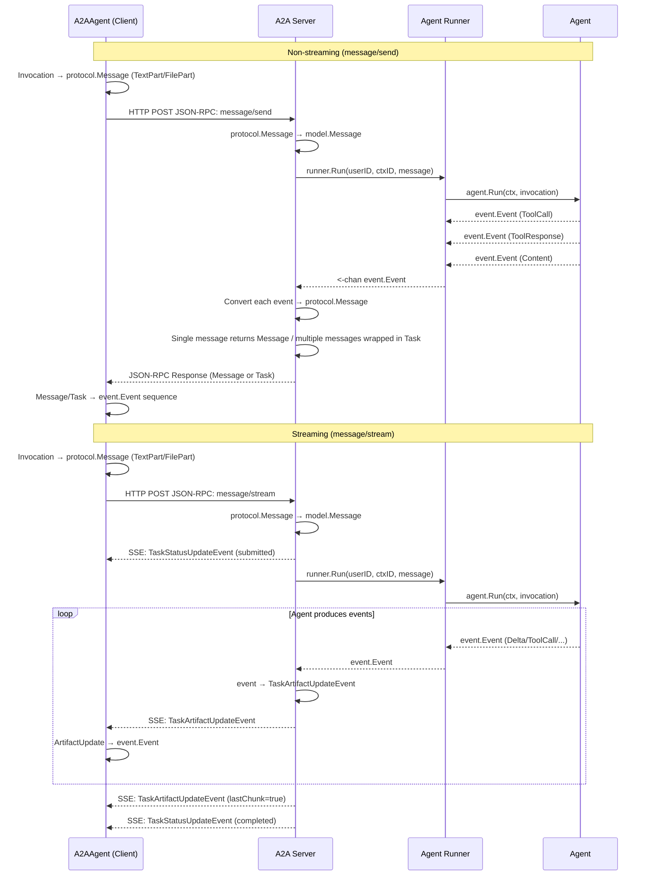
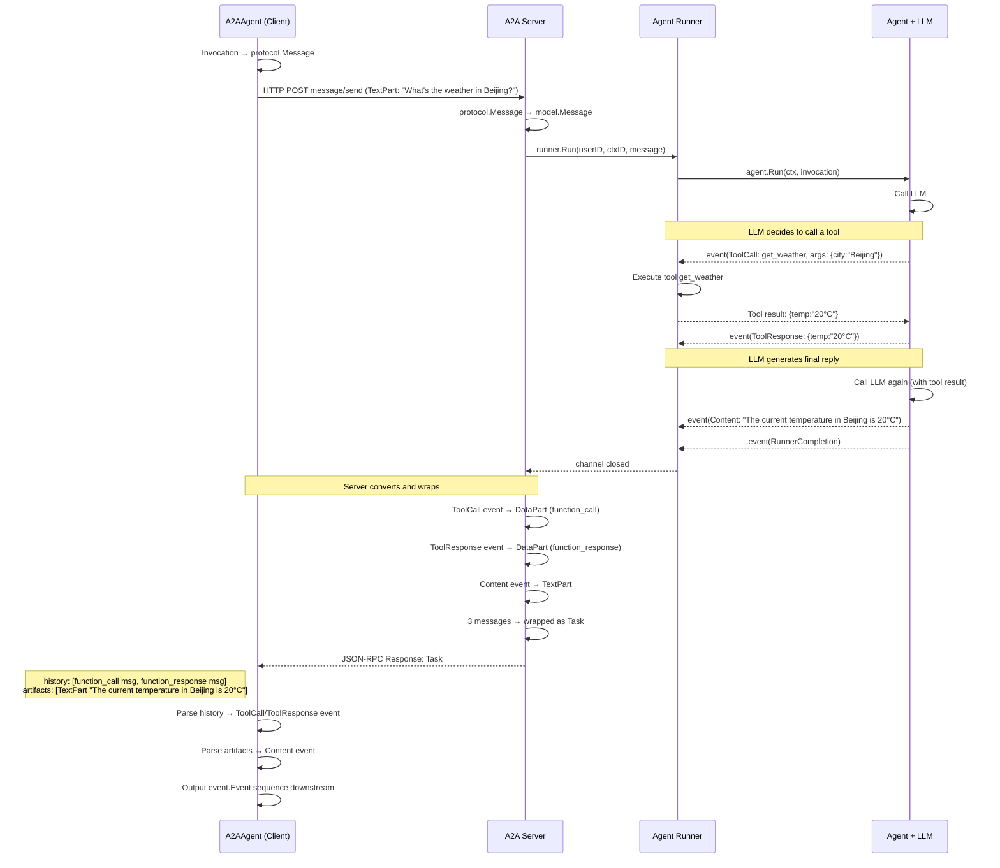
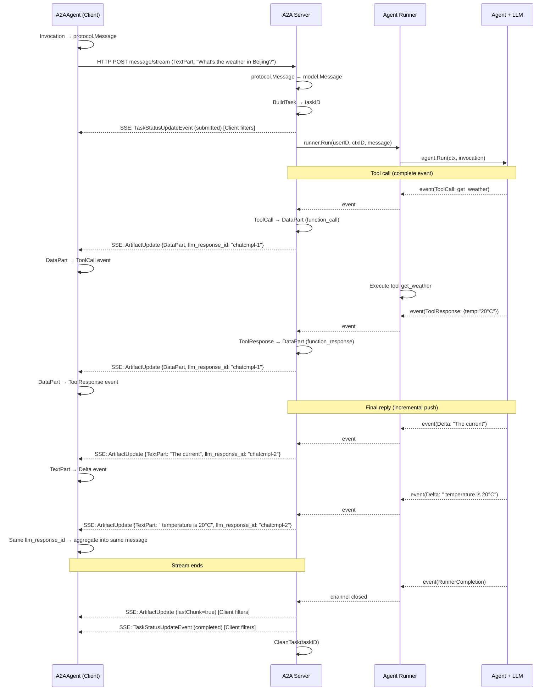

# A2A Protocol Interaction Specification

!!! note "Note"
    This document defines the extended implementation specification for the A2A protocol within the trpc-agent-go framework. Regular users do not need to read this document when using A2A Client/Server — the framework automatically handles all protocol conversion details. You only need to refer to this specification when developing a non-trpc-agent-go A2A Client/Server that interoperates with this framework.

## Background

The [A2A (Agent-to-Agent) protocol](https://a2a-protocol.org/latest/specification/) defines the basic data models (Message, Task, Part, etc.) and operation interfaces (SendMessage, StreamMessage, etc.) for inter-Agent communication. The A2A specification states its design goals at the very beginning:

> *The Agent2Agent (A2A) Protocol is an open standard designed to facilitate communication and interoperability between independent, potentially opaque AI agent systems.*
>
> *Its primary goal is to enable agents to:*
>
> - *Discover each other's capabilities.*
> - *Negotiate interaction modalities (text, files, structured data).*
> - *Manage collaborative tasks.*
> - *Securely exchange information to achieve user goals without needing access to each other's internal state, memory, or tools.*
>
> — [A2A Protocol Specification](https://a2a-protocol.org/latest/specification/)

As shown above, A2A envisions agents collaborating as "black boxes" — discovering capabilities, negotiating interaction modalities, and managing collaborative tasks, but without needing access to each other's Tools, Memory, or Internal State. Based on this design philosophy, trace data from an Agent's execution process — such as tool call chains (Function Call / Response), code execution steps, and model reasoning steps (Reasoning) — falls outside the scope of the A2A protocol, which does not define how such data should be transmitted.

However, in real-world multi-Agent orchestration scenarios, some users want to see the execution path of a remote Agent for debugging, auditing, or finer-grained coordination. To address this need, trpc-agent-go leverages the extension mechanisms reserved by the A2A protocol (`DataPart`, `Message.metadata`, etc.) to support the transmission of such data without violating the protocol specification.

This document defines the **interaction specification** of trpc-agent-go on top of the A2A protocol, serving as the standard reference for Client and Server implementations. This document will be updated as the A2A protocol evolves.

!!! info "Future Plans"
    To better align with the A2A specification's design philosophy, the cross-Agent transmission of execution process data such as tool calls will be designed as an independent **extension**, allowing users to decide whether to enable it through configuration. If you prefer to strictly follow A2A's black-box collaboration model without exposing internal execution details, simply disable it — only final results will be transmitted.

> For the complete A2A protocol specification, see: https://a2a-protocol.org/latest/specification/
>
> For the framework usage guide, see: [A2A Integration Guide](a2a.md)

---

## Version Identifier

**Current interaction specification version: `0.1`**

trpc-agent-go declares the interaction specification version through the standard A2A `AgentCard.capabilities.extensions` field, allowing the Client to detect the specification version supported by the remote Agent during discovery, enabling compatible handling during future upgrades.

This extension identifies the **Agent interaction specification** — the overall protocol-level conventions such as message encoding formats, streaming control, and metadata field definitions. The cross-Agent transmission of execution process data like tool call traces is an independent capability that will be declared and controlled through a separate extension in the future, and is not within the scope of this extension.

### Declaration in AgentCard

The AgentCard automatically generated by the A2A Server includes the following extension:

```json
{
  "capabilities": {
    "streaming": true,
    "extensions": [
      {
        "uri": "trpc-a2a-version",
        "params": {
          "version": "0.1"
        }
      }
    ]
  }
}
```

| Field          | Description                                                                          |
| -------------- | ------------------------------------------------------------------------------------ |
| `uri`          | Extension identifier, fixed as `trpc-a2a-version`                      |
| `required`     | Omitted (defaults to `false`), indicating this extension is declarative and does not require the Client to support it. Standard A2A Clients that do not recognize this extension can still perform basic interactions |
| `params.version` | Interaction specification version number, following semantic versioning (currently `0.1`) |

### Version Declaration in Requests

When the A2A Client sends a request (`message/send` or `message/stream`), it includes the interaction specification version it supports in the Message `metadata`:

```json
{
  "role": "user",
  "parts": [...],
  "metadata": {
    "interaction_spec_version": "0.1",
    "invocation_id": "...",
    "user_id": "..."
  }
}
```

| Field                         | Description                                                                          |
| ----------------------------- | ------------------------------------------------------------------------------------ |
| `interaction_spec_version`    | The interaction specification version supported by the Client; the Server can use this to determine the response encoding format |

The Server can determine the Client's capabilities based on this field:
- **Field present**: The Client is a trpc-agent-go client that supports the corresponding version of the interaction specification (e.g., tool call, reasoning content, and other extended encodings)
- **Field absent**: The Client is a standard A2A client or a client from another framework; the Server should respond using basic A2A protocol behavior

### Compatibility Strategy

- **Major version change** (e.g., `1.0` → `2.0`): Indicates incompatible protocol changes; the Client should check the version and degrade or reject
- **Minor version change** (e.g., `1.0` → `1.1`): Indicates backward-compatible extensions; the Client can safely ignore unknown fields
- When the Client does not detect this extension, it should fall back to basic A2A protocol behavior
- When the Server receives a request without `interaction_spec_version`, it should respond using basic A2A protocol behavior

---

## Overall Conversion Flow



`SendMessage` waits for the complete response before returning it all at once, while `StreamMessage` pushes incremental events in real-time via SSE. The framework automatically handles format conversion on both ends.

---

## Event Types and A2A Mapping


| Agent Event          | A2A Part Type                 | Part Metadata                 | Message Metadata               |
| -------------------- | ----------------------------- | ----------------------------- | ------------------------------ |
| Text Reply           | `TextPart`                    | —                             | `object_type: chat.completion` |
| Reasoning Content    | `TextPart`                    | `thought: true`               | Same as above                  |
| Tool Call            | `DataPart` (id/name/args)     | `type: function_call`         | `object_type: chat.completion` |
| Tool Response        | `DataPart` (id/name/response) | `type: function_response`     | `object_type: tool.response`   |
| Executable Code      | `DataPart` (code/language)    | `type: executable_code`       | `tag: code_execution_code`     |
| Code Execution Result| `DataPart` (output/outcome)   | `type: code_execution_result` | `tag: code_execution_result`   |

---

## Tool Call Transmission Flow

### Non-streaming (message/send)

The Server collects all Agent events and returns them at once. A single message is returned directly as `protocol.Message`; multiple messages are wrapped in `protocol.Task` (intermediate processes in `history`, final reply in `artifacts`).



### Streaming (message/stream)

The Server converts each Agent event in real-time to an SSE `TaskArtifactUpdateEvent` and pushes it to the Client. Tool calls and tool responses are sent as complete events, while text content is pushed incrementally.



### Client-Side Filtering Rules

- `TaskStatusUpdateEvent` (submitted/completed): Task lifecycle signals, no user content
- `TaskArtifactUpdateEvent` with `lastChunk=true`: Stream end signal or aggregated result

### Role of `llm_response_id`

The Server includes `llm_response_id` in the Metadata of each response (from the ID returned by the LLM API, such as OpenAI's `chatcmpl-xxx`). All events produced by the same LLM call share the same `llm_response_id`. When the Agent makes a second LLM call (e.g., the final reply after a tool call), the `llm_response_id` changes. The Client uses this to determine that multiple incremental events belong to the same message.

This mechanism is primarily used for message aggregation in AG-UI scenarios — AG-UI's translator uses `rsp.ID` to decide when to emit `TextMessageStart`/`TextMessageEnd` events, and a change in `llm_response_id` indicates a new message has started.

---

## Reasoning Content Transmission

Model reasoning processes (e.g., DeepSeek R1) are marked via `TextPart.metadata.thought`:


| Direction      | ReasoningContent                            | Content                          |
| -------------- | ------------------------------------------- | -------------------------------- |
| Agent → A2A   | `TextPart` + `metadata: {thought: true}`    | `TextPart` (no thought marker)   |
| A2A → Agent   | `thought=true` → restored as `ReasoningContent` | No marker → restored as `Content` |

A single Message can contain both reasoning content and formal reply as two TextParts.

---

## Metadata Specification

### Request Direction (Client → Server)


| Carrier          | Field           | Description                                        |
| ---------------- | --------------- | -------------------------------------------------- |
| HTTP Header      | `X-User-ID`    | User identifier (primary source)                   |
| HTTP Header      | `traceparent`  | W3C Trace Context (auto-injected by OpenTelemetry) |
| Message.Metadata | `invocation_id`| Client-side invocation ID for trace correlation    |
| Message.Metadata | `user_id`      | User identifier (supplementary)                    |

### Response Direction (Server → Client)


| Carrier                   | Field             | Description                                                                                          |
| ------------------------- | ----------------- | ---------------------------------------------------------------------------------------------------- |
| Message/Artifact Metadata | `object_type`    | Event business type (`chat.completion`, `tool.response`, etc.)                                       |
| Message/Artifact Metadata | `tag`            | Event tag (distinguishes code execution vs code execution result)                                    |
| Message/Artifact Metadata | `llm_response_id`| LLM response ID (used for Client-side message aggregation, e.g., OpenAI's `chatcmpl-xxx`)           |
| Part Metadata             | `type`           | Data semantic type (`function_call`, `function_response`, `executable_code`, `code_execution_result`) |
| Part Metadata             | `thought`        | Whether this is reasoning/thinking content                                                           |

---

## Network Packet Examples

### Non-streaming: Request and Response with Tool Call

**Request:**

```http
POST / HTTP/1.1
Host: agent.example.com
Content-Type: application/json
X-User-ID: user_12345
traceparent: 00-4bf92f3577b34da6a3ce929d0e0e4736-00f067aa0ba902b7-01

{
  "jsonrpc": "2.0",
  "id": "req-001",
  "method": "message/send",
  "params": {
    "message": {
      "kind": "message",
      "messageId": "msg-001",
      "role": "user",
      "contextId": "ctx-001",
      "parts": [
        { "kind": "text", "text": "What's the weather in Beijing?" }
      ],
      "metadata": {
        "invocation_id": "inv-001",
        "user_id": "user_12345"
      }
    }
  }
}
```

**Response (Task, with tool call intermediate process):**

```http
HTTP/1.1 200 OK
Content-Type: application/json

{
  "jsonrpc": "2.0",
  "id": "req-001",
  "result": {
    "id": "task-001",
    "contextId": "ctx-001",
    "status": {
      "state": "completed",
      "timestamp": "2025-01-23T10:30:00Z"
    },
    "history": [
      {
        "kind": "message",
        "messageId": "msg-tool-call",
        "role": "agent",
        "parts": [
          {
            "kind": "data",
            "data": {
              "id": "call_001",
              "type": "function",
              "name": "get_weather",
              "args": "{\"city\":\"Beijing\"}"
            },
            "metadata": { "type": "function_call" }
          }
        ],
        "metadata": {
          "object_type": "chat.completion",
          "tag": "",
          "llm_response_id": "chatcmpl-abc123"
        }
      },
      {
        "kind": "message",
        "messageId": "msg-tool-resp",
        "role": "agent",
        "parts": [
          {
            "kind": "data",
            "data": {
              "id": "call_001",
              "name": "get_weather",
              "response": "{\"temp\":\"20°C\",\"condition\":\"sunny\"}"
            },
            "metadata": { "type": "function_response" }
          }
        ],
        "metadata": {
          "object_type": "tool.response",
          "tag": "",
          "llm_response_id": "chatcmpl-abc123"
        }
      }
    ],
    "artifacts": [
      {
        "artifactId": "msg-final",
        "parts": [
          { "kind": "text", "text": "The current temperature in Beijing is 20°C, sunny." }
        ]
      }
    ]
  }
}
```

### Streaming: SSE Event Sequence with Tool Call

**Request:**

```http
POST / HTTP/1.1
Host: agent.example.com
Content-Type: application/json
X-User-ID: user_12345
Accept: text/event-stream

{
  "jsonrpc": "2.0",
  "id": "req-002",
  "method": "message/stream",
  "params": {
    "message": {
      "kind": "message",
      "messageId": "msg-002",
      "role": "user",
      "contextId": "ctx-001",
      "parts": [
        { "kind": "text", "text": "What's the weather in Beijing?" }
      ],
      "metadata": {
        "invocation_id": "inv-002",
        "user_id": "user_12345"
      }
    }
  }
}
```

**SSE Response:**

```
event: message
data: {"kind":"status-update","taskId":"task-002","contextId":"ctx-001","status":{"state":"submitted","timestamp":"2025-01-23T10:30:00Z"},"final":false}

event: message
data: {"kind":"artifact-update","taskId":"task-002","contextId":"ctx-001","artifact":{"artifactId":"chatcmpl-abc123","parts":[{"kind":"data","data":{"id":"call_001","type":"function","name":"get_weather","args":"{\"city\":\"Beijing\"}"},"metadata":{"type":"function_call"}}]},"lastChunk":false,"metadata":{"object_type":"chat.completion","tag":"","llm_response_id":"chatcmpl-abc123"}}

event: message
data: {"kind":"artifact-update","taskId":"task-002","contextId":"ctx-001","artifact":{"artifactId":"chatcmpl-abc123","parts":[{"kind":"data","data":{"id":"call_001","name":"get_weather","response":"{\"temp\":\"20°C\"}"},"metadata":{"type":"function_response"}}]},"lastChunk":false,"metadata":{"object_type":"tool.response","tag":"","llm_response_id":"chatcmpl-abc123"}}

event: message
data: {"kind":"artifact-update","taskId":"task-002","contextId":"ctx-001","artifact":{"artifactId":"chatcmpl-def456","parts":[{"kind":"text","text":"The current"}]},"lastChunk":false,"metadata":{"object_type":"chat.completion.chunk","tag":"","llm_response_id":"chatcmpl-def456"}}

event: message
data: {"kind":"artifact-update","taskId":"task-002","contextId":"ctx-001","artifact":{"artifactId":"chatcmpl-def456","parts":[{"kind":"text","text":" temperature in Beijing is 20°C, sunny."}]},"lastChunk":false,"metadata":{"object_type":"chat.completion.chunk","tag":"","llm_response_id":"chatcmpl-def456"}}

event: message
data: {"kind":"artifact-update","taskId":"task-002","contextId":"ctx-001","artifact":{"parts":[]},"lastChunk":true}

event: message
data: {"kind":"status-update","taskId":"task-002","contextId":"ctx-001","status":{"state":"completed","timestamp":"2025-01-23T10:30:05Z"},"final":true}

```

### Non-streaming: Response with Reasoning Content

```http
HTTP/1.1 200 OK
Content-Type: application/json

{
  "jsonrpc": "2.0",
  "id": "req-003",
  "result": {
    "kind": "message",
    "messageId": "msg-thinking-001",
    "role": "agent",
    "contextId": "ctx-001",
    "parts": [
      {
        "kind": "text",
        "text": "Let me analyze this step by step...",
        "metadata": { "thought": true }
      },
      {
        "kind": "text",
        "text": "The current temperature in Beijing is 20°C."
      }
    ],
    "metadata": {
      "object_type": "chat.completion",
      "tag": "",
      "llm_response_id": "chatcmpl-ghi789"
    }
  }
}
```

### Streaming: Parallel Tool Calls

Multiple tool calls are placed in the `parts` array of the same `artifact-update`:

```
event: message
data: {"kind":"artifact-update","taskId":"task-003","contextId":"ctx-001","artifact":{"artifactId":"chatcmpl-jkl012","parts":[{"kind":"data","data":{"id":"call_001","type":"function","name":"get_weather","args":"{\"city\":\"Beijing\"}"},"metadata":{"type":"function_call"}},{"kind":"data","data":{"id":"call_002","type":"function","name":"get_weather","args":"{\"city\":\"Shanghai\"}"},"metadata":{"type":"function_call"}}]},"lastChunk":false,"metadata":{"object_type":"chat.completion","tag":"","llm_response_id":"chatcmpl-jkl012"}}

event: message
data: {"kind":"artifact-update","taskId":"task-003","contextId":"ctx-001","artifact":{"artifactId":"chatcmpl-jkl012","parts":[{"kind":"data","data":{"id":"call_001","name":"get_weather","response":"{\"temp\":\"20°C\"}"},"metadata":{"type":"function_response"}},{"kind":"data","data":{"id":"call_002","name":"get_weather","response":"{\"temp\":\"22°C\"}"},"metadata":{"type":"function_response"}}]},"lastChunk":false,"metadata":{"object_type":"tool.response","tag":"","llm_response_id":"chatcmpl-jkl012"}}

```

---

## Distributed Tracing

### Trace Context Propagation

Distributed tracing is propagated through HTTP Headers, following the [W3C Trace Context](https://www.w3.org/TR/trace-context/) standard:

- **Client side**: Automatically injects the `traceparent` header into HTTP requests via OpenTelemetry's `TextMapPropagator`
- **Server side**: Automatically extracts trace context from the `traceparent` HTTP request header and injects it into `context.Context`, making it available throughout the entire call chain

### Application-Layer Tracing Fields

In addition to HTTP-layer trace context, supplementary tracing information is passed through `Message.Metadata`:

- **`invocation_id`** (Request Metadata): Identifies a single Agent invocation on the Client side; the Server can use it for log correlation
- **`llm_response_id`** (Response Metadata): Identifies the original LLM response ID; the Client uses it for message aggregation
