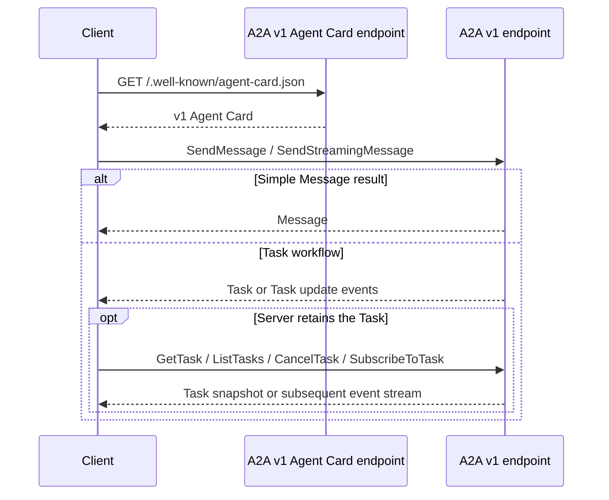
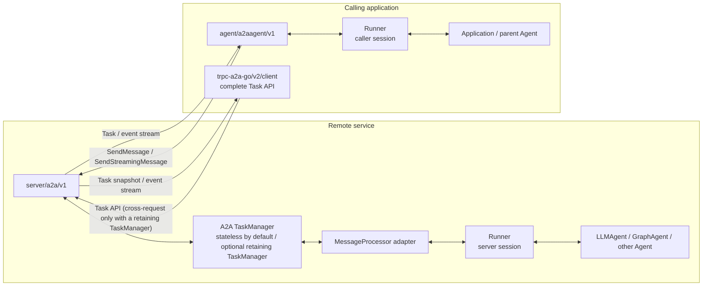
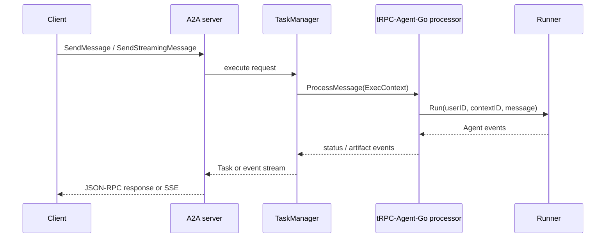

# tRPC-Agent-Go A2A v1.0 Integration and Migration Guide

This guide introduces the A2A protocol, `trpc-a2a-go`, and the tRPC-Agent-Go integration architecture from an application developer's perspective. It then covers the recommended A2A v1.0 integration, Task and multi-node deployment boundaries, the legacy A2A v0.2.x integration, and migration. For the existing v0.2.x integration guide, see [A2A Integration Guide](a2a.md).

## A2A protocol overview

A2A (Agent-to-Agent) is a protocol for discovering and calling remote AI agents. The caller does not need to know which framework, model, or tools the remote agent uses.

The main protocol concepts are:

| Concept | Meaning |
|---|---|
| Agent Card | Public description of an Agent's identity, capabilities, and how to invoke it |
| Message | One message exchanged between a user and an Agent |
| Part | Text, file, or structured data carried by a Message or Artifact |
| Task | One observable unit of work with a lifecycle and follow-up operations |
| Artifact | Output produced by a Task |
| Context ID | Conversation identity shared by multiple Messages or Tasks |
| Task ID | Identity of one Task lifecycle |

A typical A2A v1.0 interaction has two steps:

1. Fetch the remote **Agent Card** to learn its address, identity, skills, input/output modes, streaming support, and authentication requirements.
2. Send a message to an endpoint advertised by the Agent Card and receive either a direct `Message` or a tracked `Task`.



A short question may return a plain `Message`. Work that needs progress, Artifacts, interruption, cancellation, or later lookup may use a `Task`. Both are protocol results, and a Task is not a replacement for a conversation session.

A2A v1.0 supports blocking `SendMessage`, live `SendStreamingMessage`, and workflows that start work and later query, cancel, or resubscribe through the Task API. Continuing a suspended Task instead requires sending another Message with the original Task ID. The choice depends on whether the server retains the Task after the request; the [protocol usage guide](#protocol-usage-guide) summarizes the options.

### From v0.x to v1.0

The A2A protocol has evolved from the v0.x line to v1.0. The [official v1.0 announcement](https://a2a-protocol.org/latest/announcing-1.0/) explicitly states that the interaction protocol includes breaking changes. The [official migration guide](https://a2a-protocol.org/latest/whats-new-v1/) uses v0.3.0 as its comparison baseline and documents the core changes below. The legacy tRPC-Agent-Go integration implements the earlier v0.2.x protocol, which belongs to the same v0.x line that requires migration, but exact fields remain specific to each protocol version.

| Area | v0.3.0 (official migration baseline) | v1.0 |
|---|---|---|
| Part content model | `TextPart`, `FilePart`, and `DataPart` are separate types selected by `kind` | One unified `Part` carries content in its `text`, `raw`, `url`, or `data` member |
| Streaming events | Events carry `kind`, and `TaskStatusUpdateEvent` uses `final` to indicate completion | The enclosing member identifies the event type; `kind` and `final` are removed, and stream closure indicates completion |
| Enum values | Lowercase values such as `user` and `completed` | Type-prefixed values such as `ROLE_USER` and `TASK_STATE_COMPLETED` |
| Agent Card | Top-level fields primarily describe the endpoint, transport, and protocol version | `supportedInterfaces` declares the URL, binding, and protocol version and can advertise multiple interfaces |
| Operations and Tasks | Slash-delimited methods such as `message/send` and `tasks/get`, no `ListTasks`, and looser definitions for some Task behavior | Operations such as `SendMessage` and `GetTask`, a new `ListTasks` operation, and precise Message/Task return, subscription, and cancellation semantics |
| Protocol bindings | `a2a.proto` is closer to a gRPC implementation definition, with weaker equivalence guarantees across bindings | Treats `a2a.proto` as the protocol-neutral normative source and formally defines equivalent JSON-RPC, HTTP+JSON/REST, and gRPC mappings |

A2A v1.0 is therefore more than a method rename: it changes the serialization model, event discrimination, Agent discovery structure, and Task interaction semantics. Without a compatibility layer, a v1.0 server cannot directly process a v0.x client's request.

## trpc-a2a-go overview

[`trpc-a2a-go`](https://github.com/trpc-group/trpc-a2a-go) is the tRPC Go implementation of the A2A protocol. It provides protocol types and the foundations for both clients and servers.

To support incremental migration, `trpc-a2a-go` implements A2A v1.0 in a new `/v2` Go module while the original module continues to carry v0.2.x. tRPC-Agent-Go correspondingly adds `server/a2a/v1` and `agent/a2aagent/v1`; the existing `server/a2a` and `agent/a2aagent` packages will remain maintained until most users have migrated to v1.

For legacy clients that must remain operational during migration, `trpc-a2a-go/v2` provides the `compat/v0` translation layer, which tRPC-Agent-Go can explicitly enable on a new v1 server.

The package and protocol versions map as follows:

| A2A protocol | tRPC-Agent-Go Server | tRPC-Agent-Go remote Agent | `trpc-a2a-go` module |
|---|---|---|---|
| v1.0 | `server/a2a/v1` | `agent/a2aagent/v1` | `trpc-a2a-go/v2` |
| v0.2.x | `server/a2a` | `agent/a2aagent` | `trpc-a2a-go` |

The tRPC-Agent-Go `/v1` suffix means A2A protocol v1.0. The `/v2` in `trpc-a2a-go/v2` is the Go module major version. These are version names from different repositories; `/v2` does not mean A2A protocol v2.

The main layers of `trpc-a2a-go/v2` are:

| Layer | Responsibility |
|---|---|
| `protocol` | Agent Card, Message, Task, Artifact, events, and request types |
| `client` | Agent discovery, JSON-RPC calls, and SSE streams |
| `server` | Agent Card endpoints, authentication, JSON-RPC dispatch, and SSE |
| `taskmanager` | Request execution policy, Task lifecycle, retention, and event fan-out |
| `compat/v0` | Translation between the v0.2.x wire protocol and v1.0 core |

The server delegates concrete work to a `MessageProcessor`, which reads an `ExecContext` and emits one protocol event stream. The `TaskManager` consumes that stream, decides whether execution is request-bound or retained, and implements blocking, streaming, lookup, and subscription behavior. The server itself owns the Agent Card, wire protocol, routing, and middleware. The tRPC-Agent-Go integration builds on these extension boundaries.

`trpc-a2a-go` creates Tasks lazily: a `MessageProcessor` that emits only a Message creates no Task, while the first status or artifact event causes the TaskManager to create an execution-local Task. A retaining TaskManager preserves that Task after the request; the stateless TaskManager handles it only within the current request.

## tRPC-Agent-Go integration architecture

tRPC-Agent-Go supplies adapters around `trpc-a2a-go`; it does not implement a second A2A transport or Task system. This integration is a protocol boundary between local Agents and remote services, not a third local execution engine alongside LLMAgent and GraphAgent.

On the server side, the adapter turns an A2A request into a Runner invocation and converts Runner events back into A2A events, so the Runner can execute an LLMAgent, GraphAgent, or any other Agent. On the client side, `A2AAgent` presents a remote A2A service through the standard tRPC-Agent-Go Agent interface, allowing a Runner, parent Agent, or Graph node to invoke it like a local Agent.



### Capabilities provided by the A2A integration

The integration provides three groups of capabilities:

- **Publish a local Agent as an A2A service:** `server/a2a/v1` publishes the Agent Card, converts the A2A Message, context ID, user identity, and metadata into a Runner invocation, and converts Runner text, multimodal content, tool calls, status, and errors into A2A events. W3C trace context crosses the protocol boundary in HTTP headers. An LLMAgent, GraphAgent, or custom Agent can use the same Runner integration.
- **Invoke a remote service like a local Agent:** `agent/a2aagent/v1` discovers the remote Agent Card and implements the common `agent.Agent` interface. It converts a local invocation into a blocking or streaming A2A request and converts remote Messages, Tasks, Artifacts, tool calls, and errors back into tRPC-Agent-Go events.
- **Use the complete A2A Task API when needed:** `A2AAgent` wraps normal Agent invocation only. Use the `trpc-a2a-go/v2/client` methods directly when the application needs Task lookup, listing, cancellation, resubscription, or push notifications: `GetTasks` invokes the v1 `GetTask` operation, `ListTasks` invokes `ListTasks`, `CancelTasks` invokes `CancelTask`, and `ResubscribeTask` invokes `SubscribeToTask`.

The server adapter joins the `trpc-a2a-go` middleware chain and reads the Runner user ID from the `X-User-ID` request header by default. This is identity propagation, not business authorization. Production services must still authenticate callers, authorize operations, and verify Task ownership in a gateway or underlying A2A server middleware.

One `server/a2a/v1` instance binds one Agent Card and one Runner. Configuring tenant Agent Cards in the underlying `trpc-a2a-go` server does not make this adapter dispatch tenants to different Runners automatically. To host multiple Agents, route to separate service instances outside the adapter or let the Agent behind the bound Runner perform application-level routing. The latter approach does not read or preserve the protocol-level dispatch semantics of the A2A `tenant`.

### Differences from LLMAgent and GraphAgent

A2AAgent differs from local Agents as follows:

| Agent type | Primary role | Execution location | Primary state |
|---|---|---|---|
| LLMAgent | Model reasoning, tool selection, and multi-turn interaction | Current process | Runner session |
| GraphAgent | Controlled workflow execution through nodes, edges, and state transitions | Current process | Runner session plus Graph state/checkpoint |
| A2AAgent | Forwards an Agent invocation to a remote A2A service | Remote service | Caller-side Runner session; other state is managed by the remote implementation |

LLMAgent directly owns its Model, Tool, and SubAgent configuration. GraphAgent owns the workflow structure and supports checkpoints, interruption, and resume. A2AAgent does not own the remote model or tool configuration locally; its `Tools()` and `SubAgents()` are empty, and the remote service advertises its capabilities through the Agent Card. Whether the remote service retains A2A Tasks depends on its implementation; with `trpc-a2a-go`, the TaskManager makes that decision. These types compose with each other: an LLMAgent or GraphAgent can be exposed through a Runner and A2A Server, while an A2AAgent can be used as a parent Agent's SubAgent or as an Agent node in a Graph.

The distinction is not relative capability but whether execution is local or remote and whether the invocation crosses an A2A protocol boundary. A2A solves remote discovery and interoperability; LLMAgent and GraphAgent solve local reasoning and orchestration.

### State boundaries

From the server integration point of view, the default stateless TaskManager does not retain A2A Tasks across requests, so Runner sessions are the only category of cross-request state by default. A retaining memory, Redis, or custom TaskManager adds a second, independent category of state for complete A2A Task management.

When one tRPC-Agent-Go application calls another, the caller and server usually own separate Runner session stores. The A2A context ID correlates the two sides of an invocation but does not merge those stores. The following sections describe the optional A2A Task state and multi-node deployment requirements.

## A2A v1.0 integration

Use the v1 packages for new applications.

### Create a v1 Server

The v1 server takes a caller-owned Runner and an explicit Agent Card. This makes Runner ownership, session configuration, and the public A2A identity visible when the server is constructed.

```go
import (
    "trpc.group/trpc-go/trpc-agent-go/runner"
    "trpc.group/trpc-go/trpc-agent-go/session/inmemory"
    a2aserver "trpc.group/trpc-go/trpc-agent-go/server/a2a/v1"
)

agentRunner := runner.NewRunner(
    "my-app",
    llmAgent,
    runner.WithSessionService(inmemory.NewSessionService()),
)
defer agentRunner.Close()

card, err := a2aserver.NewAgentCard(
    llmAgent.Info().Name,
    llmAgent.Info().Description,
    "1.0.0",                  // Agent implementation version.
    "agent.example.com:8888", // Address advertised to clients.
    true,                     // Advertise streaming support.
    a2aserver.WithCardTools(llmAgent.Tools()...),
)
if err != nil {
    return err
}

server, err := a2aserver.New(
    a2aserver.WithRunner(agentRunner),
    a2aserver.WithAgentCard(card),
)
if err != nil {
    return err
}
return server.Start("0.0.0.0:8888")
```

The Agent Card address is used for discovery and routing. It may differ from the listen address passed to `Start`.

The built-in converters support multimodal image, audio, and file content, but `NewAgentCard` advertises only `text` input and output modes by default. To make multimodal support discoverable, explicitly declare the applicable input/output modes in the Agent Card passed to `WithAgentCard`.

The caller owns the Runner lifecycle. It must close the Runner if server construction fails or after the server stops.

### Call a remote A2A Agent

`agent/a2aagent/v1` discovers the remote Agent Card and implements the normal tRPC-Agent-Go Agent interface:

```go
import (
    "context"

    a2aagent "trpc.group/trpc-go/trpc-agent-go/agent/a2aagent/v1"
    "trpc.group/trpc-go/trpc-agent-go/model"
    "trpc.group/trpc-go/trpc-agent-go/runner"
    "trpc.group/trpc-go/trpc-agent-go/session/inmemory"
)

remoteAgent, err := a2aagent.New(
    a2aagent.WithAgentCardURL("https://agent.example.com"),
)
if err != nil {
    return err
}

remoteRunner := runner.NewRunner(
    "a2a-client",
    remoteAgent,
    runner.WithSessionService(inmemory.NewSessionService()),
)
defer remoteRunner.Close()

events, err := remoteRunner.Run(
    context.Background(),
    "user-1",
    "session-1",
    model.NewUserMessage("What time is it?"),
)
if err != nil {
    return err
}
for event := range events {
    // Handle the same tRPC-Agent-Go events produced by a local Agent.
    _ = event
}
```

The adapter maps:

- local session ID to A2A context ID;
- local user ID to the `X-User-ID` request header;
- local text and multimodal `ContentPart` input to A2A Parts;
- tool calls and results produced by the remote Runner to structured data Parts on the server, then back to local events in A2AAgent;
- remote A2A Messages, Tasks, and events back to tRPC-Agent-Go events.

Unless explicitly overridden, A2AAgent selects streaming or blocking invocation from the Agent Card. It handles one normal Agent invocation; applications that need Task lookup, cancellation, or resubscription should use the underlying `trpc-a2a-go/v2/client` directly.

### Run the normal Agent invocation example

The example uses a session-aware LLMAgent with a `current_time` tool. Configure a model first:

```bash
export OPENAI_API_KEY="<your-api-key>"
export MODEL_NAME="<your-model>"
# Set OPENAI_BASE_URL when using an OpenAI-compatible service.
```

Start the server:

```bash
cd examples
go run ./a2aagent/v1/server
```

In another terminal, start the client:

```bash
cd examples
go run ./a2aagent/v1/client
```

Ask for the current time to observe the tool call and result crossing the A2A boundary. Keeping the same session ID continues the same remote Runner session; use `/new` or `/use` to switch sessions. Add `-streaming=false` to the server to exercise blocking `SendMessage`.

### Request lifecycle

The built-in adapter implements the `trpc-a2a-go` `MessageProcessor` interface. Non-streaming and streaming requests follow the same path:



The adapter always converts Runner output through one event pipeline rather than implementing separate `MessageProcessor` paths for streaming and non-streaming requests. A successful execution typically moves through `submitted → output → completed`; a failure moves to `failed`, while suspended states such as `input-required` and `auth-required` use the same event stream.

### Default stateless TaskManager

The v1 server uses `taskmanager/stateless` by default. More precisely, the **TaskManager is stateless**; the `MessageProcessor` still executes the Runner and emits a complete Task lifecycle.

The default TaskManager:

- runs the `MessageProcessor` within the lifetime of the incoming HTTP request;
- builds an execution-local Task from status and artifact events;
- returns the terminal Task or forwards events in real time;
- discards the Task, event log, and protocol history when the request ends;
- rejects operations that must continue beyond the current request, read Task state from a later request, or suspend in `input-required` or `auth-required` while waiting for a continuation.

The underlying stateless TaskManager allows a custom `MessageProcessor` to return a direct Message, but the built-in tRPC-Agent-Go adapter starts every Runner invocation with a `submitted` Task state and ends successful invocations with `completed`. A blocking call to the default server therefore returns a terminal Task that exists only for that request. Stateless means that Tasks are not retained across requests; it does not mean that only Messages are returned.

This default is suitable for ordinary request/response Agent calls: it has no Task cleanup cost, no storage dependency, and no cross-request Task affinity. `returnImmediately=true` is rejected not because A2A cannot return an immediate Message, but because the stateless TaskManager binds execution to the current request and cannot reliably continue after the HTTP response ends. Conversation continuity still comes from the Runner session service.

### Retained Task management

Configure a retaining TaskManager when clients need asynchronous execution, Task lookup, or cancellation, resubscription, and continuation of unfinished Tasks. Push notifications must also be enabled separately on the selected TaskManager; retaining a Task does not enable push delivery automatically.

For a single-process service, use the memory TaskManager:

```go
import (
    "trpc.group/trpc-go/trpc-a2a-go/v2/taskmanager"
    memorytaskmanager "trpc.group/trpc-go/trpc-a2a-go/v2/taskmanager/memory"
)

server, err := a2aserver.New(
    a2aserver.WithRunner(agentRunner),
    a2aserver.WithAgentCard(card),
    a2aserver.WithTaskManagerBuilder(func(
        processor taskmanager.MessageProcessor,
    ) (taskmanager.TaskManager, error) {
        return memorytaskmanager.NewTaskManager(processor)
    }),
)
```

Memory Task state is process-local and is lost on restart. Terminal Tasks are not cleaned up automatically by default; production services should set a retention duration with `memorytaskmanager.WithTaskTTL(...)` when appropriate.

A retaining TaskManager gives the system two independent state categories:

| State system | Owner | Used for |
|---|---|---|
| Runner session | Each tRPC-Agent-Go application's own session service | Conversation history, application state, and multi-turn Agent context |
| A2A Task | `trpc-a2a-go` TaskManager | Protocol Task status, Artifacts, lookup, cancel, resubscribe, and push configuration |

Keeping an A2A Task does not replace the Runner session. Likewise, a durable Runner session does not make `GetTask` work after the originating request. Choose storage for conversation continuity and protocol Task operations independently.

### Multi-node deployment

The v1 adapter can run behind a load balancer, but the correct topology depends on which state features the application uses.

| Deployment | What works across replicas | Additional requirement |
|---|---|---|
| Stateless TaskManager | Blocking and streaming requests | Share the Runner session store or use session affinity when conversation context must survive node changes |
| Memory TaskManager | No Task operation crosses replicas | Route all operations for a Task to the node that owns it |
| Redis TaskManager | Shared Task snapshots, protocol history, lookup, and listing | Use the separate Redis TaskManager module and a shared Redis deployment |
| Redis with cross-node resubscribe | `SubscribeToTask` may reconnect through another replica | Enable `WithCrossNodeResubscribe(true)` on every replica |

Example Redis builder:

The Redis TaskManager is a separate Go module. Add `trpc.group/trpc-go/trpc-a2a-go/taskmanager/redis/v2` to the application first:

```bash
go get trpc.group/trpc-go/trpc-a2a-go/taskmanager/redis/v2
```

```go
import (
    redisclient "github.com/redis/go-redis/v9"
    "trpc.group/trpc-go/trpc-a2a-go/v2/taskmanager"
    redistaskmanager "trpc.group/trpc-go/trpc-a2a-go/taskmanager/redis/v2"
)

redisClient := redisclient.NewClient(&redisclient.Options{
    Addr: "redis.example.com:6379",
})

server, err := a2aserver.New(
    a2aserver.WithRunner(agentRunner),
    a2aserver.WithAgentCard(card),
    a2aserver.WithTaskManagerBuilder(func(
        processor taskmanager.MessageProcessor,
    ) (taskmanager.TaskManager, error) {
        return redistaskmanager.NewTaskManager(
            processor,
            redisClient,
            redistaskmanager.WithCrossNodeResubscribe(true),
        )
    }),
)
```

Cross-node resubscription is not distributed execution. When every replica uses an equivalent `MessageProcessor` and there is no concurrent continuation, any node that can read a suspended Task from Redis can begin its next execution round. Redis TaskManager does not provide exactly-once coordination across replicas, a global live-execution registry, or cross-node routing for live cancellation. Applications that need those guarantees still require sticky routing or a separate execution-coordination design.

Runner sessions are independent of A2A Task storage. If the server uses an in-memory session service, moving the next request to a different replica loses conversation context even when A2A Tasks are stored in Redis. Use a shared session service for a genuinely stateless service tier.

### Common v1 configuration

Common Server adapter options are:

| Option | Purpose |
|---|---|
| `WithRunner` | Set the caller-owned Runner |
| `WithAgentCard` | Set the public Agent identity and capabilities |
| `WithTaskManagerBuilder` | Replace the default stateless TaskManager |
| `WithV0Compatibility` | Serve v0.2.x methods on the v1 endpoint |
| `WithUserIDHeader` | Change the user identity header |
| `WithRunOptions` | Add Runner options to every invocation |
| `WithProcessMessageHook` | Wrap inbound A2A message processing |
| `WithResponseRewriter` | Rewrite outbound A2A events |
| `WithExtraA2AOptions` | Pass authentication, middleware, and other options to the underlying A2A server |

Common A2AAgent options are:

| Option | Purpose |
|---|---|
| `WithAgentCardURL`, `WithAgentCard` | Discover the remote Agent Card by URL or provide it directly |
| `WithEnableStreaming` | Override streaming selection from the Agent Card |
| `WithUserIDHeader` | Change the request header carrying the user identity |
| `WithTransferStateKey` | Select invocation `RuntimeState` values to transfer in Message metadata |
| `WithA2AClientExtraOptions` | Pass options to the underlying A2A client |
| `WithBuildMessageHook` | Rewrite the outbound A2A Message before sending |

Use custom converters, Part mappers, hooks, or response rewriters only when the built-in text, multimodal, tool, code-execution, and metadata mappings are insufficient.

## Legacy protocol v0.2.x integration

Existing applications can continue to use `server/a2a` and `agent/a2aagent` without the `/v1` suffix. These packages depend on the `trpc-a2a-go` root module and implement A2A v0.2.x.

These packages are in compatibility maintenance, but they remain standalone A2A adapters rather than compatibility aliases for v1. New applications should use the v1 packages directly; users who still maintain v0.2.x services or clients can continue to use the capabilities below.

### v0.2.x capability scope

| Capability | Legacy integration behavior |
|---|---|
| Publish a local Agent | `server/a2a` publishes a legacy Agent Card, handles JSON-RPC and SSE, and passes A2A requests to a Runner |
| Call a remote Agent | `agent/a2aagent` discovers the legacy Agent Card and exposes blocking or streaming calls through the standard `agent.Agent` interface |
| Runner and session | Applications can use an implicit Runner or provide an application-owned Runner; the A2A context ID becomes the server-side Runner session ID |
| Identity, state, and tracing | The user ID and W3C trace context propagate through HTTP headers, while invocation `RuntimeState` propagates through Message metadata |
| Content and event conversion | Supports text, image, audio, and file input, together with extended events for text, reasoning, tool calls, tool results, code execution, and state updates |
| Extension points | Supports hooks, custom converters, Part mappers, response rewriting, a Graph event allowlist, ADK metadata, dynamic Agent Cards, and underlying A2A options |

An `A2AAgent` does not hold the remote Model, Tools, or SubAgents locally, so its `Tools()` and `SubAgents()` are empty; the Agent Card continues to describe the remote capabilities. It can run behind a Runner, serve as a SubAgent of a parent Agent, or act as an Agent node in a Graph.

`NewAgentCard` advertises only `text` input and output modes by default, even though the built-in converter can process images, audio, and files. When a legacy service actually accepts these types, the application should provide an accurate custom Agent Card so clients do not infer the wrong capabilities from the default Card.

### Create a legacy A2A Server

The legacy server retains the convenience entry point that accepts an Agent directly. When the caller supplies neither a Runner nor a session service, the server creates a default Runner and in-memory session service:

```go
import a2aserver "trpc.group/trpc-go/trpc-agent-go/server/a2a"

server, err := a2aserver.New(
    a2aserver.WithHost("127.0.0.1:8888"),
    a2aserver.WithAgent(llmAgent, true),
)
if err != nil {
    return err
}
return server.Start("127.0.0.1:8888")
```

The Boolean argument in `WithAgent(llmAgent, true)` only declares streaming support on the generated Agent Card; it does not control Runner execution. Whether the server handles a streaming request is determined by the client's use of `message/stream`.

When the application needs to configure the session service, memory service, or Runner lifecycle itself, it can instead provide an explicit Runner and Agent Card:

```go
sessionService := sessionmemory.NewSessionService()
agentRunner := runner.NewRunner(
    llmAgent.Info().Name,
    llmAgent,
    runner.WithSessionService(sessionService),
)
defer agentRunner.Close()

card, err := a2aserver.NewAgentCard(
    llmAgent.Info().Name,
    llmAgent.Info().Description,
    "127.0.0.1:8888",
    true,
    a2aserver.WithCardTools(llmAgent.Tools()...),
)
if err != nil {
    return err
}

server, err := a2aserver.New(
    a2aserver.WithRunner(agentRunner),
    a2aserver.WithAgentCard(card),
)
```

`WithAgent` and `WithRunner` are mutually exclusive. With an explicit Runner, the application manages Runner shutdown, sessions, and memory, and it also maintains the Agent Card address, streaming capability, and skills. `WithSessionService` applies only to the legacy path in which the server creates an implicit Runner.

`WithHost` accepts a URL with a path, which becomes the base path of that A2A Server. To host multiple legacy Agents on one port, create a separate Server and Agent Card for each Runner, then attach each `Handler()` to the same HTTP mux.

### Call a legacy A2A service

The legacy remote Agent uses the package without `/v1` and can discover an Agent Card automatically from a URL:

```go
import a2aagent "trpc.group/trpc-go/trpc-agent-go/agent/a2aagent"

remoteAgent, err := a2aagent.New(
    a2aagent.WithAgentCardURL("http://127.0.0.1:8888"),
)
```

After creation, invoke it through a Runner like any other Agent:

```go
clientRunner := runner.NewRunner(
    "caller-app",
    remoteAgent,
    runner.WithSessionService(sessionmemory.NewSessionService()),
)
defer clientRunner.Close()

events, err := clientRunner.Run(
    ctx,
    "user-1",
    "session-1",
    model.NewUserMessage("What tasks can you help me with?"),
)
```

The legacy `A2AAgent` chooses between `message/send` and `message/stream` in the following priority order:

1. `agent.WithStream(...)` on the current Runner invocation.
2. `WithEnableStreaming(...)` supplied when creating the A2AAgent.
3. The remote Agent Card's streaming capability.
4. Non-streaming when none of the above declares a preference.

The Agent Card declares a server capability, while the caller can still override the choice for an individual call through either of the first two levels. If the caller forces streaming, the remote server must actually support `message/stream`.

### State, identity, and request extensions

The legacy call path writes the caller's session ID into the A2A context ID, and the server then uses that context ID as its own Runner session ID. The caller and server still have independent session stores: the protocol transfers only the identifier and does not merge conversation history between the two sides.

The caller's session user ID is sent through `X-User-ID` by default, and the server uses it as the Runner user ID. Both sides can change the header name with `WithUserIDHeader`. When that header is absent, the current legacy server creates a random `A2A_ANONYMOUS_...` principal and returns it in the HttpOnly `trpc_agent_a2a_anon` cookie; the A2A context ID remains the Runner session ID and is not used as anonymous identity. For Cookie Jar reuse and cross-instance initialization details, see the [legacy A2A guide](a2a.md). Identity propagation does not provide authentication or authorization.

`WithTransferStateKey` selects values to copy from the current invocation `RuntimeState` into Message metadata. It supports exact keys, `*`, and prefix or suffix wildcards. The server merges the Message metadata into the new invocation `RuntimeState`, with metadata values overriding values of the same name supplied through `WithRunOptions`.

Treat all transferred Message metadata as client-controlled input. Tenant, role, policy, and other authorization state must come from authenticated or immutable server-side context and must not be accepted through this transfer path.

```go
token := os.Getenv("A2A_TOKEN")

remoteAgent, err := a2aagent.New(
    a2aagent.WithAgentCardURL("https://agent.example.com:8888"),
    a2aagent.WithEnableStreaming(true),
    a2aagent.WithTransferStateKey("tenant_id", "workflow.*"),
    a2aagent.WithA2AClientExtraOptions(
        client.WithTimeout(30*time.Second),
    ),
)

events, err := clientRunner.Run(
    ctx,
    userID,
    sessionID,
    message,
    agent.WithRuntimeState(map[string]any{
        "tenant_id":      "tenant-a",
        "workflow.stage": "review",
    }),
    agent.WithA2ARequestOptions(
        client.WithRequestHeader("Authorization", "Bearer "+token),
    ),
)
```

W3C trace context propagates automatically through HTTP headers. In production, use authentication settings on the underlying client and server, or a gateway, to enforce authentication, authorization, and resource ownership; do not treat `X-User-ID` as a trusted credential.

Common legacy extension points include:

| Scenario | Configuration |
|---|---|
| Inbound and outbound metadata | `WithProcessMessageHook`, `WithBuildMessageHook` |
| Every server-side Runner invocation | `WithRunOptions` |
| Request headers, timeouts, and underlying authentication | `agent.WithA2ARequestOptions`, `WithA2AClientExtraOptions` |
| Custom Message and event conversion | `WithA2AToAgentConverter`, `WithEventToA2AConverter`, `WithCustomA2AConverter`, `WithCustomEventConverter` |
| Extended DataPart or Event Part mappings | `WithA2ADataPartMapper`, `WithEventToA2APartMapper` |
| Outbound filtering or rewriting | `WithResponseRewriter`, `WithErrorHandler` |
| Graph and ADK compatibility | `WithGraphEventObjectAllowlist`, `WithADKCompatibility` |
| Dynamic Agent Cards, authentication, and middleware | `WithExtraA2AOptions` |

The legacy packages also retain compatibility extension points such as `WithProcessorBuilder`, `WithTaskManagerBuilder`, `WithStreamingEventType`, `WithStreamingRespHandler`, and `WithStructuredTaskErrors`. They preserve existing v0 application behavior and do not represent the recommended v1 design. New code should prefer the unified v1 MessageProcessor, TaskManager, and converter extension boundaries.

The shared metadata extension for tool calls, code execution, reasoning, and `state_delta` is documented in the [A2A Protocol Interaction Specification](a2a-interaction.md). Its metadata keys and interaction version apply to both the legacy and v1 packages; its `TextPart`, `DataPart`, lowercase method, and streaming-envelope examples describe the v0.2.x wire model, while v1 carries the shared metadata through unified Parts, Messages, Artifacts, and Task update events.

### v0 Task management boundaries

The legacy server creates a memory TaskManager internally by default, but this is not equivalent to retaining Task management in v1. The built-in non-streaming adapter waits for the Runner event channel to close: it returns a Message directly when there is one result and combines multiple results into a completed Task. That completed Task is not registered as a retained Task that can later be queried through `tasks/get`.

The streaming adapter creates a Task for the current `message/stream` request, emits submitted, artifact, and completed events, and removes the Task when the event stream ends. It therefore primarily provides a Task envelope for the current SSE stream and does not promise that the Task remains queryable, cancellable, or resubscribable after the request.

The protocol client in the `trpc-a2a-go` root module still provides `GetTasks`, `CancelTasks`, `ResubscribeTask`, and push notification methods, but these operations are meaningful only when the server's processor and TaskManager actually retain and manage the corresponding Task. v0.2.x does not provide `ListTasks`. For reliable cross-request queries, continuation, multi-node storage, or cancellation, prefer migrating to v1 and configuring a memory, Redis, or custom retaining TaskManager.

The v0 wire protocol defaults `blocking` to false for `message/send`, but the built-in tRPC-Agent-Go v0 adapter's unary path still waits for the Runner to complete within the current request. Do not rely on this adapter-specific behavior when using the underlying v0 protocol client against another implementation; explicitly set `blocking=true` when the caller needs the final result.

### Legacy examples

| Example | Demonstrates |
|---|---|
| `examples/a2aagent` | Complete Server/A2AAgent setup, implicit or explicit Runner, sessions, and tool calls |
| `examples/a2aagent/customdatapart` | Custom DataPart and Event extensions |
| `examples/a2amultipath` | Hosting multiple Agents on one port with base paths |
| `examples/a2asubagent` | Using a remote A2AAgent as a coordinating Agent's SubAgent |
| `examples/a2aadk` | Interoperability with ADK tool and code-execution events |
| `examples/a2acodeexecution` | Transporting code-execution events through legacy extensions |
| `examples/graph/a2a_agent` | A remote Graph Agent and `state_delta` |

These examples support maintenance of v0.2.x applications. Do not copy their legacy-specific configuration directly into a v1 integration.

## v1.0 and v0.2.x integration differences

| Area | v0.2.x | v1.0 |
|---|---|---|
| Server input | Agent or Runner | Explicit caller-owned Runner |
| Runner lifecycle | Created implicitly by the server when given an Agent, so the caller cannot manage it directly | Created and closed by the caller |
| Agent Card | Usually derived from Agent and host | Explicit public identity and implementation version |
| Event processing | Multiple result shapes and callback-style `TaskHandler` | One `ExecContext` to one event channel |
| Streaming selection | `MessageProcessor`/API branches can select response shape | TaskManager derives non-streaming and streaming responses from the same events |
| Task lifecycle | The built-in adapter creates request-local Task envelopes and does not retain them across requests by default | TaskManager owns lazy creation, retention, and fan-out |
| Default `message/send` timing | Wire `blocking` defaults to false, while the built-in adapter's unary path still waits for the Runner | `returnImmediately` defaults to false, so send blocks |
| Wire method names | Slash-delimited, such as `message/send` | PascalCase, such as `SendMessage` |
| Task listing | Not provided | `ListTasks` |
| Multi-node Task storage | The default path does not retain Tasks; applications must supply their own processor and backend | Explicit stateless, memory, or Redis strategy |

### Serve v0 clients from a v1 Server

The v1 `trpc-a2a-go` module contains `compat/v0`, which parses the frozen v0.2.x wire types, translates them into v1 requests, calls the same TaskManager, and translates the result back.

tRPC-Agent-Go exposes this as an opt-in server option:

```go
server, err := a2aserver.New(
    a2aserver.WithRunner(agentRunner),
    a2aserver.WithAgentCard(card),
    a2aserver.WithV0Compatibility(),
)
```

Both protocol generations use the same endpoint, authentication chain, `MessageProcessor`, and TaskManager.

The raw `compat/v0` converter preserves the v0 default: an omitted `blocking` means non-blocking. The tRPC-Agent-Go compatibility option deliberately adapts only that omitted value to blocking so unchanged v0 clients can use the default request-bound TaskManager. Explicit `blocking=false` remains non-blocking.

| v0.2.x client operation | Default stateless TaskManager | Retaining TaskManager |
|---|---:|---:|
| Agent Card discovery | Supported | Supported |
| `message/send` with omitted or true `blocking` | Supported, blocks | Supported, blocks |
| `message/stream` | Supported | Supported |
| `message/send` with explicit `blocking=false` | Not supported | Supported |
| Look up a retained Task after the request | Not supported | Supported |
| Cancel a non-terminal Task | Not supported | Supported; live cancellation must reach the execution owner |
| Resubscribe to a non-terminal Task | Not supported | Supported; cross-node reconnect requires Redis resubscribe configuration |
| Push notification configuration | Not supported | Supported after push is enabled separately on the TaskManager |

The stateless TaskManager rejects an explicit non-blocking request because request-bound execution cannot continue reliably after the HTTP response ends. A streaming request must also reach a terminal state within the current request; `input-required` and `auth-required` states that need a later continuation require a retaining TaskManager.

The compatibility layer lets a legacy wire request enter the new execution path, but it does not guarantee lossless field-by-field conversion between the two data models. For example, `filename` and `mediaType` on v1 text/data Parts cannot be preserved in v0, the v0 `final` value in a streaming response is derived from v1 events, and only the first authentication scheme from a multi-scheme v0 push-notification configuration is retained in v1. Migration tests should cover real text, multimodal, tool-call, error, and Task workflows rather than checking only whether a request succeeds.

### Migration checklist

- [ ] Change server and remote Agent imports to the `/v1` packages.
- [ ] Construct and own the Runner explicitly.
- [ ] Publish a reachable Agent Card address and implementation version.
- [ ] Keep conversation state in the Runner's session service.
- [ ] Choose stateless, memory, or Redis Task management based on client needs.
- [ ] Enable `WithV0Compatibility` while v0.2.x clients remain.
- [ ] Test blocking, streaming, asynchronous, and retained Task flows separately.

## Protocol usage guide

Choose the simplest interaction that satisfies the client:

| Client need | Protocol operation | State requirement |
|---|---|---|
| Wait for one answer | Blocking `SendMessage` | Stateless is sufficient |
| Render tokens or progress live | `SendStreamingMessage` | Stateless is sufficient |
| Start work and disconnect | `SendMessage` with `returnImmediately=true` | Retaining TaskManager |
| Poll later | `GetTask` or `ListTasks` | Retaining TaskManager; terminal Tasks remain queryable |
| Reconnect to updates | `SubscribeToTask` | Non-terminal Task; Redis configuration for cross-node reconnect |
| Stop running work | `CancelTask` | Cancelable non-terminal Task and routing to the execution owner |
| Answer an Agent's follow-up question | Send a Message with the same Task ID | Retained suspended Task |

Identifier rules:

- The A2A context ID becomes the server Runner's session ID.
- `X-User-ID` becomes the Runner user ID. If it is absent, the server derives a stable user ID from the context ID.
- A Task ID identifies one A2A Task lifecycle, not a conversation session; the same Task can span multiple continuation rounds.
- A continuation for `input-required` or `auth-required` must carry the original Task ID.

Task retention alone does not make an Agent interruptible. The `MessageProcessor` or converter must emit `input-required` or `auth-required`, and the application must preserve any state needed to continue.

## More examples

The earlier v1 example uses A2AAgent for a normal Agent invocation. To observe asynchronous Task creation, lookup, and listing, run the server with the memory TaskManager and start `taskclient`:

```bash
cd examples
go run ./a2aagent/v1/server -retain-tasks

# In another terminal.
cd examples
go run ./a2aagent/v1/taskclient
```

The "Legacy examples" section above lists v0.2.x Server, A2AAgent, multi-Agent hosting, and extension-event examples.

For lower-level protocol examples, including Redis, authentication, push notifications, input-required continuation, and direct `MessageProcessor` implementations, see the [`trpc-a2a-go` examples](https://github.com/trpc-group/trpc-a2a-go/tree/v2/examples).
