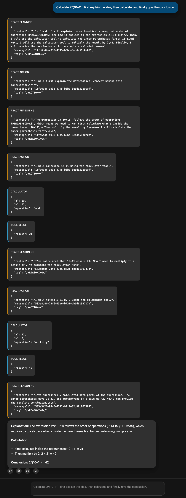

# AG-UI Guide

The AG-UI (Agent-User Interaction) protocol is maintained by the open-source [AG-UI Protocol](https://github.com/ag-ui-protocol/ag-ui) project. It enables agents built in different languages, frameworks, and execution environments to deliver their runtime outputs to user interfaces through a unified event stream. The protocol tolerates loosely matched payloads and supports transports such as SSE and WebSocket.

`tRPC-Agent-Go` ships with native AG-UI integration. It provides an SSE server implementation by default, while also allowing you to swap in a custom `service.Service` to use transports like WebSocket and to extend the event translation logic.

## Getting Started

Assuming you already have an agent, you can expose it via the AG-UI protocol with just a few lines of code:

```go
import (
    "net/http"

    "trpc.group/trpc-go/trpc-agent-go/runner"
    "trpc.group/trpc-go/trpc-agent-go/server/agui"
)

// Create the agent.
agent := newAgent()
// Build the Runner that will execute the agent.
runner := runner.NewRunner(agent.Info().Name, agent)
// Create the AG-UI server and mount it on an HTTP route.
server, err := agui.New(runner, agui.WithPath("/agui"))
if err != nil {
    log.Fatalf("create agui server failed: %v", err)
}
// Start the HTTP listener.
if err := http.ListenAndServe("127.0.0.1:8080", server.Handler()); err != nil {
    log.Fatalf("server stopped with error: %v", err)
}
```

Note: If `WithPath` is not specified, the AG-UI server mounts at `/` by default.

A complete version of this example lives in [examples/agui/server/default](https://github.com/trpc-group/trpc-agent-go/tree/main/examples/agui/server/default).

For an in-depth guide to Runners, refer to the [runner](./runner.md) documentation.

On the client side you can pair the server with frameworks that understand the AG-UI protocol, such as [CopilotKit](https://github.com/CopilotKit/CopilotKit). It provides React/Next.js components with built-in SSE subscriptions. This repository ships with two runnable web UI samples:

- [examples/agui/client/tdesign-chat](https://github.com/trpc-group/trpc-agent-go/tree/main/examples/agui/client/tdesign-chat): a Vite + React client built with TDesign that demonstrates custom events, graph interrupt approvals (human-in-the-loop), message snapshot loading, and report side panels.
- [examples/agui/client/copilotkit](https://github.com/trpc-group/trpc-agent-go/tree/main/examples/agui/client/copilotkit): a Next.js client built with CopilotKit.


## Core Concepts

### RunAgentInput

`RunAgentInput` is the request payload for the AG-UI chat route and the messages snapshot route. It describes the input and context required for a conversation run. The structure is shown below.

```go
type RunAgentInput struct {
	ThreadID       string // Conversation thread identifier. The framework uses it as `SessionID`.
	RunID          string // Run ID. Used to correlate `RUN_STARTED`, `RUN_FINISHED`, and other events.
	ParentRunID    *string // Parent run ID. Optional.
	State          any    // Arbitrary state.
	Messages       []Message // Message list. The chat route reads tail messages: `role=user` uses its content (string or multimodal array) as input; consecutive tail `role=tool` messages form the current tool-result batch.
	Tools          []Tool    // Tool definitions. Protocol field. Optional.
	Context        []Context // Context entries. Protocol field. Optional.
	ForwardedProps any    // Arbitrary forwarded properties. Typically used to carry business custom parameters.
}
```

For the full field definition, refer to [AG-UI Go SDK](https://github.com/ag-ui-protocol/ag-ui/blob/main/sdks/community/go/pkg/core/types/types.go).

Minimal request JSON example:

```json
{
    "threadId": "thread-id",
    "runId": "run-id",
    "messages": [
        {
            "role": "user",
            "content": "hello"
        }
    ],
    "forwardedProps": {
        "userId": "alice"
    }
}
```

### Real-time conversation route

The real-time conversation route handles a real-time conversation request and streams the events produced during execution to the client via SSE. The default route is `/` and can be customised with `agui.WithPath`.

For the same `SessionKey` (`AppName` + `userID` + `sessionID`), only one real-time conversation request can run at a time; repeated requests return `409 Conflict`.

Even if the client SSE connection is closed, the backend continues executing until it finishes normally (or is cancelled / times out). By default, a single request can run for up to 1 hour. You can adjust this with `agui.WithTimeout(d)`, and set it to `0` to disable the timeout; the effective deadline is the earlier of the request context deadline and `agui.WithTimeout(d)`.

A complete example is available at [examples/agui/server/default](https://github.com/trpc-group/trpc-agent-go/tree/main/examples/agui/server/default).

#### Connection close and cancellation semantics

By default, the AG-UI service decouples an Agent run from the request's cancellation signal. Even if the SSE connection is interrupted (e.g., due to a page refresh), and the request `ctx` is cancelled, the backend run will continue until it finishes normally, is actively cancelled via the cancellation route, or times out.

If you want the Agent run to stop when the request `ctx` ends (i.e., when the client disconnects or `ctx` is cancelled), you can explicitly enable this option:

```go
server, err := agui.New(
    runner,
    agui.WithPath("/agui"),
    agui.WithCancelOnContextDoneEnabled(true),
)
```

#### Multimodal user input

For `role=user` messages, `content` can also be a multimodal array. Each item is an `InputContent` fragment:

- `type: "text"` with `text`
- `type: "binary"` with `mimeType` and at least one of `url`, `data` (base64 string or base64 data URL), or `id`

Example (text + image URL):

```json
{
    "threadId": "thread-id",
    "runId": "run-id",
    "messages": [
        {
            "role": "user",
            "content": [
                { "type": "text", "text": "Describe the image." },
                { "type": "binary", "mimeType": "image/png", "url": "https://example.com/image.png" }
            ]
        }
    ]
}
```

Example (text + image data as base64 data URL):

```json
{
    "threadId": "thread-id",
    "runId": "run-id",
    "messages": [
        {
            "role": "user",
            "content": [
                { "type": "text", "text": "Describe the image." },
                { "type": "binary", "mimeType": "image/png", "data": "data:image/png;base64,iVBORw0KGgoAAAANSUhEUgAAAAEAAAABCAQAAAC1HAwCAAAAC0lEQVR42mP8/x8AAwMBAH+X1d0AAAAASUVORK5CYII=" }
            ]
        }
    ]
}
```

The `url` parameter only supports binary input of type `image/*`; for other `mimeType`s, please use `data` or `id`. The server will decode the `data` using standard base64 decoding. If you wish to send only the raw base64 string, you can remove the `data:*;base64,` prefix.

### Cancel route

If you want to interrupt a running real-time conversation, enable the cancel route with `agui.WithCancelEnabled(true)` (disabled by default). The default route is `/cancel` and can be customised with `agui.WithCancelPath`.

The cancel route uses the same request body as the real-time conversation route. To cancel successfully, you must provide the same `SessionKey` (`AppName` + `userID` + `sessionID`) as the corresponding real-time conversation request.

#### What does cancel actually stop?

Cancel stops the backend **run** that is currently executing for the same
`SessionKey` (same `AppName`, resolved `userID`, and `threadId`).

This is useful when:

- The user clicks a “Stop” button in the UI.
- The SSE connection drops but you still want to stop the backend.
- You want to enforce server-side budgets (time, cost) and interrupt runaway
  runs.

#### Minimal cancel request

In most setups, you only need:

- `threadId` (maps to `sessionID`)
- Whatever fields your `UserIDResolver` reads (often `forwardedProps.userId`)

You can also just resend the same JSON payload you used for the real-time run.

Example:

```bash
curl -X POST http://localhost:8080/cancel \
  -H 'Content-Type: application/json' \
  -d '{"threadId":"thread-id","runId":"run-id","forwardedProps":{"userId":"alice"}}'
```

Typical responses:

- `200 OK`: cancelled
- `404 Not Found`: no running run found for that `SessionKey` (already finished
  or wrong identifiers)

After a cancel succeeds, the framework does not simply discard the protocol state that is still being finalized. Instead, it continues to emit any required closing events and tries to persist buffered AG-UI events from the aggregator into `SessionService`. As a result, subsequent `/history` requests see the last valid and consistent snapshot at the moment of cancellation rather than an incomplete intermediate state. For example, partial `reasoning` text that has already been produced is kept as a string, while a `reasoning` segment that never produced any text does not appear in the snapshot. You can adjust how long this post-run finalization window is allowed to take with `agui.WithPostRunFinalizationTimeout(d)`, which defaults to `5s`.

### Message Snapshot route

Message snapshots restore conversation history when a page is initialised or after a reconnect. The feature is controlled by `agui.WithMessagesSnapshotEnabled(true)` and is disabled by default. The default route is `/history`, can be customised with `WithMessagesSnapshotPath`, and returns the event stream `RUN_STARTED → MESSAGES_SNAPSHOT → RUN_FINISHED`.

This route supports concurrent access for the same `userID + sessionID` (threadId), and you can also query the snapshot for the same session while a real-time conversation is running.

To enable message snapshots, configure the following options:

- `agui.WithMessagesSnapshotEnabled(true)` enables message snapshots;
- `agui.WithMessagesSnapshotPath` sets the custom message snapshot route, defaulting to `/history`;
- `agui.WithAppName(name)` specifies the application name as the default `AppName`;
- `agui.WithAppNameResolver(resolver)` is optional and overrides `AppName` per request;
- `agui.WithSessionService(service)` injects the `session.Service` used to look up historical events;
- `aguirunner.WithUserIDResolver(resolver)` customises how `userID` is resolved, defaulting to `"user"`.

When handling a message snapshot request, the framework extracts `threadId` as the `SessionID` from the AG-UI request body `RunAgentInput`, resolves `userID` using the custom `UserIDResolver`, prefers the `appName` returned by `AppNameResolver`, and falls back to `agui.WithAppName(name)` when the resolver returns an empty value. These values are used to build `session.Key`, read the persisted events from session storage, reconstruct the message list required by `MessagesSnapshot`, wrap it into a `MESSAGES_SNAPSHOT` event, and send matching `RUN_STARTED` and `RUN_FINISHED` events.

Example:

```go
import (
	"trpc.group/trpc-go/trpc-agent-go/server/agui"
	"trpc.group/trpc-go/trpc-agent-go/server/agui/adapter"
	aguirunner "trpc.group/trpc-go/trpc-agent-go/server/agui/runner"
	"trpc.group/trpc-go/trpc-agent-go/session/inmemory"
)

resolver := func(ctx context.Context, input *adapter.RunAgentInput) (string, error) {
    forwardedProps, ok := input.ForwardedProps.(map[string]any)
    if !ok {
        return "anonymous", nil
    }
    user, ok := forwardedProps["userId"].(string)
    if !ok || user == "" {
        return "anonymous", nil
    }
    return user, nil
}

sessionService := inmemory.NewSessionService()
server, err := agui.New(
    runner,
    agui.WithPath("/chat"),                    // Customise the real-time conversation route, defaults to "/".
    agui.WithAppName("demo-app"),              // Set AppName to scope stored history per application.
    agui.WithSessionService(sessionService),   // Set the Session Service to load historical events.
    agui.WithMessagesSnapshotEnabled(true),    // Enable message snapshots.
    agui.WithMessagesSnapshotPath("/history"), // Set the message snapshot route, defaults to "/history".
    agui.WithAGUIRunnerOptions(
        aguirunner.WithUserIDResolver(resolver), // Customise the UserID resolution logic.
    ),
)
if err != nil {
	log.Fatalf("create agui server failed: %v", err)
}
if err := http.ListenAndServe("127.0.0.1:8080", server.Handler()); err != nil {
	log.Fatalf("server stopped with error: %v", err)
}
```

You can find a complete example at [examples/agui/messagessnapshot](https://github.com/trpc-group/trpc-agent-go/tree/main/examples/agui/messagessnapshot).

The format of AG-UI's MessagesSnapshotEvent can be found at [messages](https://docs.ag-ui.com/concepts/messages).

### Translator interfaces

Before events are sent to the client, AG-UI translates internal framework events into protocol events. The core public extension interfaces are shown below:

```go
type Translator interface {
    Translate(ctx context.Context, event *event.Event) ([]aguievents.Event, error)
}

type PostRunFinalizingTranslator interface {
    Translator
    PostRunFinalizationEvents(ctx context.Context) ([]aguievents.Event, error)
}
```

`Translator` is responsible for turning internal events into AG-UI events. `PostRunFinalizingTranslator` extends it with the ability to emit any remaining protocol closing events during the finalization phase after a run ends, and to surface finalization errors when needed.

## Advanced Usage

### SSE heartbeat keepalive

In some deployment environments, a gateway, load balancer, or browser may close an SSE connection when no data is written for a long time. If your Agent run can spend long periods without emitting events, enable transport-level heartbeats with `agui.WithHeartbeatInterval(d)`:

```go
server, err := agui.New(
    runner,
    agui.WithPath("/agui"),
    agui.WithHeartbeatInterval(15*time.Second),
)
```

The server writes SSE comment frames (`:\n\n`) at the configured interval to keep the connection active. Heartbeats are disabled by default, and non-positive intervals keep them disabled.

### Custom transport

The AG-UI specification does not enforce a transport. The framework uses SSE by default, but you can implement the `service.Service` interface to switch to WebSocket or any other transport:

```go
import (
    "trpc.group/trpc-go/trpc-agent-go/runner"
    "trpc.group/trpc-go/trpc-agent-go/server/agui"
    aguirunner "trpc.group/trpc-go/trpc-agent-go/server/agui/runner"
	"trpc.group/trpc-go/trpc-agent-go/server/agui/service"
)

type wsService struct {
	path    string
	runner  aguirunner.Runner
	handler http.Handler
}

func NewWSService(runner aguirunner.Runner, opt ...service.Option) service.Service {
	opts := service.NewOptions(opt...)
	s := &wsService{
		path:   opts.Path,
		runner: runner,
	}
	h := http.NewServeMux()
	h.HandleFunc(s.path, s.handle)
	s.handler = h
	return s
}

func (s *wsService) Handler() http.Handler { /* HTTP Handler */ }

runner := runner.NewRunner(agent.Info().Name, agent)
server, _ := agui.New(runner, agui.WithServiceFactory(NewWSService))
```

### Custom translator

`translator.New` converts internal events into the standard AG-UI events. To enrich the stream while keeping the default behaviour, implement the `translator.Translator` interface introduced above and use the AG-UI `Custom` event type to carry extra data.

If your custom Translator maintains its own open streams, or simply wraps the default Translator and wants to preserve the built-in finalization behaviour on cancel and normal run completion, you should also implement `translator.PostRunFinalizingTranslator` so the framework can keep handling the closing events that need to be emitted after the run ends:

```go
import (
    "context"
    "fmt"

    aguievents "github.com/ag-ui-protocol/ag-ui/sdks/community/go/pkg/core/events"
    "trpc.group/trpc-go/trpc-agent-go/event"
    "trpc.group/trpc-go/trpc-agent-go/runner"
    "trpc.group/trpc-go/trpc-agent-go/server/agui"
    "trpc.group/trpc-go/trpc-agent-go/server/agui/adapter"
    aguirunner "trpc.group/trpc-go/trpc-agent-go/server/agui/runner"
    "trpc.group/trpc-go/trpc-agent-go/server/agui/translator"
)

type customTranslator struct {
    inner translator.Translator
}

var _ translator.PostRunFinalizingTranslator = (*customTranslator)(nil)

func (t *customTranslator) Translate(ctx context.Context, evt *event.Event) ([]aguievents.Event, error) {
    out, err := t.inner.Translate(ctx, evt)
    if err != nil {
        return nil, err
    }
    if payload := buildCustomPayload(evt); payload != nil {
        out = append(out, aguievents.NewCustomEvent("trace.metadata", aguievents.WithValue(payload)))
    }
    return out, nil
}

func (t *customTranslator) PostRunFinalizationEvents(ctx context.Context) ([]aguievents.Event, error) {
    finalizer, ok := t.inner.(translator.PostRunFinalizingTranslator)
    if !ok {
        return nil, nil
    }
    return finalizer.PostRunFinalizationEvents(ctx)
}

func buildCustomPayload(evt *event.Event) map[string]any {
    if evt == nil || evt.Response == nil {
        return nil
    }
    return map[string]any{
        "object":    evt.Response.Object,
        "timestamp": evt.Response.Timestamp,
    }
}

factory := func(ctx context.Context, input *adapter.RunAgentInput, opts ...translator.Option) (translator.Translator, error) {
    inner, err := translator.New(ctx, input.ThreadID, input.RunID, opts...)
    if err != nil {
        return nil, fmt.Errorf("create inner translator: %w", err)
    }
    return &customTranslator{inner: inner}, nil
}

runner := runner.NewRunner(agent.Info().Name, agent)
server, _ := agui.New(runner, agui.WithAGUIRunnerOptions(aguirunner.WithTranslatorFactory(factory)))
```

`PostRunFinalizationEvents` is invoked during the finalization phase after a run ends. If it returns an error, the framework will try to emit any finalization events that were already returned, and then emit a `RunError` so that problems in the finalization phase are surfaced to the client instead of being silently dropped.

For example, when using React Planner, if you want to apply different custom events to different tags, you can achieve this by implementing a custom Translator, as shown in the image below.



You can find the complete code example in [examples/agui/server/react](https://github.com/trpc-group/trpc-agent-go/tree/main/examples/agui/server/react).

### Expose source metadata for frontend grouping

When you enable inner Agent streaming, the frontend often needs to know
which translated AG-UI event came from which sub-agent so it can group tool
calls, tool results, and text output together.

Use `agui.WithEventSourceMetadataEnabled(true)` to attach compact source
metadata from the original `trpc-agent-go` event into the translated AG-UI
event's `rawEvent` field:

```go
server, err := agui.New(
    runner,
    agui.WithEventSourceMetadataEnabled(true),
)
```

The same switch is also available at lower layers if you build the stack
manually:

- `aguirunner.WithEventSourceMetadataEnabled(true)`
- `translator.WithEventSourceMetadataEnabled(true)`

After enabling it, translated AG-UI events such as `TOOL_CALL_START`,
`TOOL_CALL_ARGS`, `TOOL_CALL_END`, `TOOL_CALL_RESULT`, text events, and
activity events will carry a `rawEvent` object similar to:

```json
{
  "rawEvent": {
    "eventId": "evt-tool-call",
    "author": "member-a",
    "invocationId": "inv-1",
    "parentInvocationId": "parent-1",
    "branch": "root.member-a"
  }
}
```

`rawEvent` is optional. It only appears on AG-UI events produced by the
AG-UI translator or the AG-UI messages snapshot builder, and it is omitted
when the framework has no non-empty source metadata to expose.

On the `/history` route, the `MESSAGES_SNAPSHOT` event uses `rawEvent` as a
source index instead of a single-event payload:

```json
{
  "rawEvent": {
    "messages": {
      "assistant-1": {
        "eventId": "evt-assistant",
        "author": "member-a",
        "invocationId": "inv-1",
        "branch": "root.member-a"
      }
    },
    "toolCalls": {
      "tool-call-1": {
        "eventId": "evt-tool-call",
        "author": "member-a",
        "invocationId": "inv-1",
        "branch": "root.member-a"
      }
    }
  }
}
```

Recommended frontend usage:

- Group by `rawEvent.author` when you want a stable "which agent emitted
  this" label.
- Group by `rawEvent.branch` when you want one concrete sub-agent execution
  block per run, even if the same agent name appears multiple times.
- Keep `rawEvent.invocationId` if you need a unique execution key but do not
  want to expose the full branch string in UI state.
- When restoring history from `MESSAGES_SNAPSHOT`, read
  `rawEvent.toolCalls[toolCallId]` or `rawEvent.messages[messageId]` to
  rebuild the same grouping state before the live stream resumes.

Compatibility notes:

- The option is disabled by default.
- Enabling it is additive only: it does not change event ordering, message
  IDs, tool call IDs, or existing payload fields.
- Existing clients that ignore `rawEvent` continue to work unchanged.

### Thinking content

AG-UI uses `REASONING_*` events to carry model thinking content, making it easier for the frontend to display the thinking process before the final answer. For more details, see the official AG-UI docs: [Reasoning](https://docs.ag-ui.com/concepts/reasoning). A typical event sequence is as follows:

```text
REASONING_START
  → REASONING_MESSAGE_START
  → REASONING_MESSAGE_CONTENT
  → REASONING_MESSAGE_END
REASONING_END
```

By default, thought-provoking content is disabled. You can enable it when creating the server using `agui.WithReasoningContentEnabled`.

```go
import "trpc.group/trpc-go/trpc-agent-go/server/agui"

server, err := agui.New(runner, agui.WithReasoningContentEnabled(true))
```

### Custom `UserIDResolver`

By default every request maps to the fixed user ID `"user"`. Implement a custom `UserIDResolver` if you need to derive the user from the `RunAgentInput`:

```go
import (
    "trpc.group/trpc-go/trpc-agent-go/runner"
    "trpc.group/trpc-go/trpc-agent-go/server/agui"
    "trpc.group/trpc-go/trpc-agent-go/server/agui/adapter"
    aguirunner "trpc.group/trpc-go/trpc-agent-go/server/agui/runner"
)

resolver := func(ctx context.Context, input *adapter.RunAgentInput) (string, error) {
    forwardedProps, ok := input.ForwardedProps.(map[string]any)
    if !ok {
        return "anonymous", nil
    }
    user, ok := forwardedProps["userId"].(string)
    if !ok || user == "" {
        return "anonymous", nil
    }
    return user, nil
}

runner := runner.NewRunner(agent.Info().Name, agent)
server, _ := agui.New(runner, agui.WithAGUIRunnerOptions(aguirunner.WithUserIDResolver(resolver)))
```

### Custom `AppNameResolver`

By default, AG-UI uses `agui.WithAppName(name)` as the static `AppName` and combines it with `userID` and `threadId` to form the `SessionKey`.

If you need to switch `AppName` per request, implement `AppNameResolver` and inject it with `agui.WithAppNameResolver`. When `AppNameResolver` returns a non-empty string, it overrides `AppName` for that request. When it returns an empty string, the framework falls back to `agui.WithAppName(name)`.

The real-time conversation route, cancel route, and message snapshot route all share the same `AppName` resolution logic. Requests to `/agui`, `/cancel`, and `/history` for the same session should therefore carry the same business identifier.

When message snapshots are enabled, you still need to configure `agui.WithAppName(name)` at startup as the default value. `AppNameResolver` only provides request-level overrides.

```go
import (
    "trpc.group/trpc-go/trpc-agent-go/runner"
    "trpc.group/trpc-go/trpc-agent-go/server/agui"
    "trpc.group/trpc-go/trpc-agent-go/server/agui/adapter"
)

resolver := func(ctx context.Context, input *adapter.RunAgentInput) (string, error) {
    forwardedProps, ok := input.ForwardedProps.(map[string]any)
    if !ok || forwardedProps == nil {
        return "", nil
    }
    appName, ok := forwardedProps["appName"].(string)
    if !ok || appName == "" {
        return "", nil
    }
    return appName, nil
}

runner := runner.NewRunner(agent.Info().Name, agent)
server, _ := agui.New(
    runner,
    agui.WithAppName("default-app"),
    agui.WithAppNameResolver(resolver),
)
```

### Custom `RunOptionResolver`

By default, the AG-UI Runner does not append extra `agent.RunOption`s to the underlying `runner.Run`. Implement `RunOptionResolver`, inject it with `aguirunner.WithRunOptionResolver`, and translate client-provided configuration (for example, `modelName` or `knowledgeFilter`) from `ForwardedProps`.

```go
import (
	"trpc.group/trpc-go/trpc-agent-go/agent"
	"trpc.group/trpc-go/trpc-agent-go/runner"
	"trpc.group/trpc-go/trpc-agent-go/server/agui"
	"trpc.group/trpc-go/trpc-agent-go/server/agui/adapter"
	aguirunner "trpc.group/trpc-go/trpc-agent-go/server/agui/runner"
)

resolver := func(_ context.Context, input *adapter.RunAgentInput) ([]agent.RunOption, error) {
	if input == nil {
		return nil, errors.New("empty input")
	}
	forwardedProps, ok := input.ForwardedProps.(map[string]any)
	if !ok || forwardedProps == nil {
		return nil, nil
	}
	opts := make([]agent.RunOption, 0, 2)
	if modelName, ok := forwardedProps["modelName"].(string); ok && modelName != "" {
		opts = append(opts, agent.WithModelName(modelName))
	}
	if filter, ok := forwardedProps["knowledgeFilter"].(map[string]any); ok {
		opts = append(opts, agent.WithKnowledgeFilter(filter))
	}
	return opts, nil
}

runner := runner.NewRunner(agent.Info().Name, agent)
server, _ := agui.New(runner, agui.WithAGUIRunnerOptions(aguirunner.WithRunOptionResolver(resolver)))
```

`RunOptionResolver` executes for every incoming `RunAgentInput`. Its return value is forwarded to `runner.Run` in order. Returning an error surfaces a `RunError` to the client, while returning `nil` means no extra options are added.

### Custom `StateResolver`

By default, the AG-UI Runner does not read `RunAgentInput.State` and write it into `RunOptions.RuntimeState`.

If you want to derive RuntimeState from `state`, implement `StateResolver` and inject it with `aguirunner.WithStateResolver`. The returned map is assigned to `RunOptions.RuntimeState` before calling the underlying `runner.Run`, overriding any RuntimeState set by other options (for example, `RunOptionResolver`).

Note: returning `nil` means no override, while returning an empty map clears RuntimeState.

```go
import (
	"trpc.group/trpc-go/trpc-agent-go/server/agui"
	"trpc.group/trpc-go/trpc-agent-go/server/agui/adapter"
	aguirunner "trpc.group/trpc-go/trpc-agent-go/server/agui/runner"
)

stateResolver := func(_ context.Context, input *adapter.RunAgentInput) (map[string]any, error) {
	state, ok := input.State.(map[string]any)
	if !ok || state == nil {
		return nil, nil
	}
	return map[string]any{
		"custom_key": state["custom_key"],
	}, nil
}

server, _ := agui.New(runner, agui.WithAGUIRunnerOptions(aguirunner.WithStateResolver(stateResolver)))
```

### Observability Reporting

Attach custom span attributes in `RunOptionResolver`; the framework will stamp them onto the agent entry span automatically:

```go
import (
    "go.opentelemetry.io/otel/attribute"
    "trpc.group/trpc-go/trpc-agent-go/server/agui"
    aguirunner "trpc.group/trpc-go/trpc-agent-go/server/agui/runner"
    "trpc.group/trpc-go/trpc-agent-go/server/agui/adapter"
    "trpc.group/trpc-go/trpc-agent-go/runner"
    "trpc.group/trpc-go/trpc-agent-go/agent"
)

runOptionResolver := func(ctx context.Context, input *adapter.RunAgentInput) ([]agent.RunOption, error) {
	content, ok := input.Messages[len(input.Messages)-1].ContentString()
	if !ok {
		return nil, errors.New("last message content is not a string")
	}
	attrs := []attribute.KeyValue{
		attribute.String("trace.input", content),
	}
	forwardedProps, ok := input.ForwardedProps.(map[string]any)
	if ok {
		if scenario, ok := forwardedProps["scenario"].(string); ok {
			attrs = append(attrs, attribute.String("conversation.scenario", scenario))
		}
	}
	return []agent.RunOption{agent.WithSpanAttributes(attrs...)}, nil
}

r := runner.NewRunner(agent.Info().Name, agent)
server, err := agui.New(r,
    agui.WithAGUIRunnerOptions(
        aguirunner.WithRunOptionResolver(runOptionResolver),
    ),
)
```

Pair this with an `AfterTranslate` callback to accumulate output and write it to `trace.output`. This keeps streaming events aligned with backend traces so you can inspect both input and final output in your observability platform. 

For a Langfuse-specific example, see [examples/agui/server/langfuse](https://github.com/trpc-group/trpc-agent-go/tree/main/examples/agui/server/langfuse).

### Event Translation Callback

AG-UI provides an event translation callback mechanism, allowing custom logic to be inserted before and after the event translation process.

- `translator.BeforeTranslateCallback`: Triggered before the internal event is translated into an AG-UI event. The return value convention:
  - Return `(customEvent, nil)`: Use `customEvent` as the input event for translation.
  - Return `(nil, nil)`: Retain the current event and continue with the subsequent callbacks. If all callbacks return `nil`, the original event will be used.
  - Return an error: Terminates the current execution, and the client will receive a `RunError`.
- `translator.AfterTranslateCallback`: Triggered after the AG-UI event translation is completed and just before it is sent to the client. The return value convention:
  - Return `(customEvent, nil)`: Use `customEvent` as the final event to be sent to the client.
  - Return `(nil, nil)`: Retain the current event and continue with the subsequent callbacks. If all callbacks return `nil`, the original event will be sent.
  - Return an error: Terminates the current execution, and the client will receive a `RunError`.

Usage Example:

```go
import (
	aguievents "github.com/ag-ui-protocol/ag-ui/sdks/community/go/pkg/core/events"
	"trpc.group/trpc-go/trpc-agent-go/event"
	"trpc.group/trpc-go/trpc-agent-go/server/agui"
	aguirunner "trpc.group/trpc-go/trpc-agent-go/server/agui/runner"
	"trpc.group/trpc-go/trpc-agent-go/server/agui/translator"
)

callbacks := translator.NewCallbacks().
    RegisterBeforeTranslate(func(ctx context.Context, event *event.Event) (*event.Event, error) {
        // Logic to execute before event translation.
        return nil, nil
    }).
    RegisterAfterTranslate(func(ctx context.Context, event aguievents.Event) (aguievents.Event, error) {
        // Logic to execute after event translation.
        if msg, ok := event.(*aguievents.TextMessageContentEvent); ok {
            // Modify the message content in the event.
            return aguievents.NewTextMessageContentEvent(msg.MessageID, msg.Delta+" [via callback]"), nil
        }
        return nil, nil
    })

server, err := agui.New(runner, agui.WithAGUIRunnerOptions(aguirunner.WithTranslateCallbacks(callbacks)))
```

Event translation callbacks can be used in various scenarios, such as:

- Custom Event Handling: Modify event data or add additional business logic during the translation process.
- Monitoring and Reporting: Insert monitoring and reporting logic before and after event translation. A full example of integrating with Langfuse observability platform can be found at [examples/agui/server/langfuse](https://github.com/trpc-group/trpc-agent-go/tree/main/examples/agui/server/langfuse).

### RunAgentInput Hook

You can use `WithRunAgentInputHook` to mutate the AG-UI request before it reaches the runner. The following example reads `other_content` from `ForwardedProps` and appends it to the latest user message:

```go
import (
	"github.com/ag-ui-protocol/ag-ui/sdks/community/go/pkg/core/types"
	"trpc.group/trpc-go/trpc-agent-go/runner"
	"trpc.group/trpc-go/trpc-agent-go/server/agui"
	"trpc.group/trpc-go/trpc-agent-go/server/agui/adapter"
	aguirunner "trpc.group/trpc-go/trpc-agent-go/server/agui/runner"
)

hook := func(ctx context.Context, input *adapter.RunAgentInput) (*adapter.RunAgentInput, error) {
	if input == nil {
		return nil, errors.New("empty input")
	}
	if len(input.Messages) == 0 {
		return nil, errors.New("missing messages")
	}
	forwardedProps, ok := input.ForwardedProps.(map[string]any)
	if !ok || forwardedProps == nil {
		return input, nil
	}
	otherContent, ok := forwardedProps["other_content"].(string)
	if !ok {
		return input, nil
	}
	userMessageIndex := -1
	for i := len(input.Messages) - 1; i >= 0; i-- {
		if input.Messages[i].Role == types.RoleUser {
			userMessageIndex = i
			break
		}
	}
	if userMessageIndex < 0 {
		return input, nil
	}
	content, ok := input.Messages[userMessageIndex].ContentString()
	if !ok {
		return input, nil
	}
	input.Messages[userMessageIndex].Content = content + otherContent
	return input, nil
}

runner := runner.NewRunner(agent.Info().Name, agent)
server, _ := agui.New(runner, agui.WithAGUIRunnerOptions(aguirunner.WithRunAgentInputHook(hook)))
```

Key points:

- Returning `nil` keeps the original input object while preserving in-place edits.
- Returning a custom `*adapter.RunAgentInput` replaces the original input; returning `nil` keeps it.
- Returning an error aborts the request and the client receives a `RunError` event.

### Session Storage and Event Aggregation

When constructing the AG-UI Runner, pass in `SessionService`. Events generated by real-time conversations will be written into the session through `SessionService`, making it convenient to replay the history later via `MessagesSnapshot`.

```go
import (
	"trpc.group/trpc-go/trpc-agent-go/runner"
	"trpc.group/trpc-go/trpc-agent-go/server/agui"
	aguirunner "trpc.group/trpc-go/trpc-agent-go/server/agui/runner"
	"trpc.group/trpc-go/trpc-agent-go/session/inmemory"  
)

runner := runner.NewRunner(agent.Info().Name, agent)
sessionService := inmemory.NewSessionService()

server, err := agui.New(
    runner,
    agui.WithPath("/agui"),
    agui.WithMessagesSnapshotPath("/history"),
    agui.WithMessagesSnapshotEnabled(true),
    agui.WithAppName(appName),
    agui.WithSessionService(sessionService),
    agui.WithAGUIRunnerOptions(aguirunner.WithUserIDResolver(userIDResolver)),
)
```

In streaming response scenarios, a single reply usually consists of multiple incremental text events. Writing all of them directly into the session can put significant pressure on `SessionService`.

To address this, the framework first aggregates events and then writes them into the session. In addition, it performs a periodic flush once per second by default, and each flush writes the current aggregation result into the session. Regardless of whether a run finishes normally or is cancelled, the framework also runs one final end-of-run flush step before exit. That final step emits closing events for any protocol streams that are still open and tries to persist any remaining aggregated data. This is separate from the regular periodic flush.

* `aggregator.WithEnabled(true)` is used to control whether event aggregation is enabled. It is enabled by default. When enabled, it aggregates consecutive `TEXT_MESSAGE_CONTENT` and `REASONING_MESSAGE_CONTENT` events that share the same `messageId`. When disabled, no aggregation is performed on AG-UI events.
* `aguirunner.WithFlushInterval(time.Second)` is used to control the periodic flush interval of aggregated results. The default is 1 second. Setting it to 0 disables the periodic flush mechanism.
* `agui.WithPostRunFinalizationTimeout(5*time.Second)` limits how long the end-of-run finalization step is allowed to take. This covers both protocol closing events and persisting any buffered aggregated data. The default is `5s`. Setting it to `0` means no additional timeout is applied.

```go
import (
	"time"

	"trpc.group/trpc-go/trpc-agent-go/runner"
	"trpc.group/trpc-go/trpc-agent-go/server/agui"
	"trpc.group/trpc-go/trpc-agent-go/server/agui/aggregator"
	aguirunner "trpc.group/trpc-go/trpc-agent-go/server/agui/runner"
	"trpc.group/trpc-go/trpc-agent-go/session/inmemory"
)

runner := runner.NewRunner(agent.Info().Name, agent)
sessionService := inmemory.NewSessionService()

server, err := agui.New(
    runner,
    agui.WithPath("/agui"),
    agui.WithMessagesSnapshotPath("/history"),
    agui.WithMessagesSnapshotEnabled(true),
    agui.WithAppName(appName),
    agui.WithSessionService(sessionService),
    agui.WithFlushInterval(time.Second), // Set the periodic flush interval for aggregation results, default is 1 second.
    agui.WithPostRunFinalizationTimeout(5*time.Second), // Set the timeout for end-of-run finalization, default is 5 seconds.
    agui.WithAGUIRunnerOptions(
        aguirunner.WithUserIDResolver(userIDResolver),
        aguirunner.WithAggregationOption(aggregator.WithEnabled(true)), // Enable event aggregation, enabled by default.
    ),
)
```

If more complex aggregation strategies are required, you can implement `aggregator.Aggregator` and inject it through a custom factory. Note that although an aggregator is created separately for each session, avoiding cross-session state management and concurrency handling, the aggregation methods themselves may still be called concurrently, so concurrency must still be handled properly.

### Run Lifecycle Events in Message Snapshots

Top-level events returned by the message snapshot route describe the lifecycle of the current snapshot request. On success, the sequence is:

`RUN_STARTED → MESSAGES_SNAPSHOT → RUN_FINISHED`

By default, `MESSAGES_SNAPSHOT.messages` contains conversation messages and displayable activity messages reconstructed from the historical AG-UI track. It does not include persisted historical `RUN_STARTED`, `RUN_FINISHED`, or `RUN_ERROR` events.

To preserve historical run lifecycle state in message snapshots, enable `agui.WithMessagesSnapshotRunLifecycleEventsEnabled(true)`:

```go
server, err := agui.New(
    runner,
    agui.WithAppName(appName),
    agui.WithSessionService(sessionService),
    agui.WithMessagesSnapshotEnabled(true),
    agui.WithMessagesSnapshotRunLifecycleEventsEnabled(true),
)
```

When enabled, historical `RUN_STARTED`, `RUN_FINISHED`, and `RUN_ERROR` events are included in `MESSAGES_SNAPSHOT.messages` as messages whose `role` is `activity`. Event semantics are determined by their layer:

- messages inside `MESSAGES_SNAPSHOT.messages` whose `role` is `activity` and whose `activityType` is `RUN_*` represent persisted run lifecycle events from the historical conversation;
- top-level `RUN_STARTED`, `RUN_FINISHED`, or `RUN_ERROR` emitted by the message snapshot route represents the current snapshot request lifecycle or load failure.

With this option enabled, historical `RUN_*` messages inside `MESSAGES_SNAPSHOT` have the following shape:

```json
{
  "type": "MESSAGES_SNAPSHOT",
  "messages": [
    {
      "id": "event-id-1",
      "role": "activity",
      "activityType": "RUN_STARTED",
      "content": {
        "threadId": "thread-1",
        "runId": "run-1"
      }
    },
    {
      "id": "event-id-2",
      "role": "assistant",
      "content": "hello"
    },
    {
      "id": "event-id-3",
      "role": "activity",
      "activityType": "RUN_ERROR",
      "content": {
        "runId": "run-1",
        "message": "model call failed",
        "code": "MODEL_ERROR"
      }
    }
  ]
}
```

### Message Snapshot Continuation

By default, `/history` (the message snapshot route) returns a one-shot snapshot and closes the connection immediately. When a user refreshes or reconnects in the middle of a real-time conversation (run), or opens the page in a new tab, the snapshot alone may not cover the events that continue to be produced after the snapshot boundary. If you want to keep streaming subsequent AG-UI events after the snapshot, enable message snapshot continuation.

When enabled, after sending `MESSAGES_SNAPSHOT` the server continues streaming subsequent events over the same SSE connection until it reads `RUN_FINISHED` or `RUN_ERROR` (or reaches the continuation duration limit). The sequence becomes:

`RUN_STARTED → MESSAGES_SNAPSHOT → ...events... → RUN_FINISHED/RUN_ERROR`

Message snapshot continuation provides the following configuration options:

- `agui.WithMessagesSnapshotFollowEnabled(true)`: enables message snapshot continuation (disabled by default);
- `agui.WithMessagesSnapshotFollowMaxDuration(d)`: limits the maximum continuation duration to avoid waiting indefinitely;
- `agui.WithFlushInterval(d)`: controls how often historical events are flushed; the continuation polling interval reuses this value.

Example:

```go
import "time"

server, err := agui.New(
    runner,
    agui.WithAppName(appName),
    agui.WithSessionService(sessionService),
    agui.WithMessagesSnapshotEnabled(true),
    agui.WithMessagesSnapshotFollowEnabled(true),
    agui.WithMessagesSnapshotFollowMaxDuration(30*time.Second),
    agui.WithFlushInterval(50*time.Millisecond),
)
```

A complete example can be found at [examples/agui/server/follow](https://github.com/trpc-group/trpc-agent-go/tree/main/examples/agui/server/follow), and the frontend can refer to [examples/agui/client/tdesign-chat](https://github.com/trpc-group/trpc-agent-go/tree/main/examples/agui/client/tdesign-chat).

In a multi-instance deployment, instances must share the same `SessionService`; otherwise `/history` cannot read historical events written by other instances.

### Setting the BasePath for Routes

`agui.WithBasePath` sets the base route prefix for the AG-UI service. The default value is `/`, and it is used to mount the real-time conversation route, message snapshot route, and the cancel route (when enabled) under a unified prefix, avoiding conflicts with existing services.

`agui.WithPath`, `agui.WithMessagesSnapshotPath`, and `agui.WithCancelPath` only define sub-routes under the base path. The framework will concatenate them with the base path to form the final accessible routes.

Here’s an example of usage:

```go
import "trpc.group/trpc-go/trpc-agent-go/server/agui"

server, err := agui.New(
    runner,
    agui.WithBasePath("/agui/"),               // Set the AG-UI prefix route.
    agui.WithPath("/chat"),                    // Set the real-time conversation route, default is "/".
    agui.WithCancelEnabled(true),              // Enable the cancel route.
    agui.WithCancelPath("/cancel"),            // Set the cancel route, default is "/cancel".
    agui.WithMessagesSnapshotEnabled(true),    // Enable the message snapshot feature.
    agui.WithMessagesSnapshotPath("/history"), // Set the message snapshot route, default is "/history".
)
if err != nil {
    log.Fatalf("create agui server failed: %v", err)
}
```

In this case, the real-time conversation route will be `/agui/chat`, the cancel route will be `/agui/cancel`, and the message snapshot route will be `/agui/history`.

### GraphAgent Node Activity Events

With `GraphAgent`, a single run typically executes multiple nodes along the graph. To help the frontend highlight the active node and render Human-in-the-Loop prompts, the framework can emit node lifecycle and interrupt-related `ACTIVITY_DELTA` events. For the event format, see the [AG-UI official docs](https://docs.ag-ui.com/concepts/events#activitydelta). They are disabled by default and can be enabled when constructing the AG-UI server.

#### Node lifecycle (`graph.node.lifecycle`)

This event is disabled by default; enable it via `agui.WithGraphNodeLifecycleActivityEnabled(true)` when constructing the AG-UI server.

```go
import "trpc.group/trpc-go/trpc-agent-go/server/agui"

server, err := agui.New(
	runner,
	agui.WithGraphNodeLifecycleActivityEnabled(true),
)
```

When enabled, the server emits `ACTIVITY_DELTA` for `start` / `complete` / `error` phases with the same `activityType: graph.node.lifecycle`, and uses `/node.phase` to distinguish the phase.

For the node start phase (`phase=start`), it is emitted before a node runs and writes the current node to `/node` via `add /node`:

```json
{
  "type": "ACTIVITY_DELTA",
  "activityType": "graph.node.lifecycle",
  "patch": [
    {
      "op": "add",
      "path": "/node",
      "value": {
        "nodeId": "plan_llm_node",
        "phase": "start"
      }
    }
  ]
}
```

This event helps the frontend track progress. The frontend can treat `/node.nodeId` as the currently active node and use it to highlight the graph execution.

For the node success end phase (`phase=complete`), it is emitted after a node finishes successfully and writes the node result to `/node` via `add /node`:

```json
{
  "type": "ACTIVITY_DELTA",
  "activityType": "graph.node.lifecycle",
  "patch": [
    {
      "op": "add",
      "path": "/node",
      "value": {
        "nodeId": "plan_llm_node",
        "phase": "complete"
      }
    }
  ]
}
```

For the node failure end phase (`phase=error`, non-interrupt), it includes an error message in `/node`:

```json
{
  "type": "ACTIVITY_DELTA",
  "activityType": "graph.node.lifecycle",
  "patch": [
    {
      "op": "add",
      "path": "/node",
      "value": {
        "nodeId": "plan_llm_node",
        "phase": "error",
        "error": "node execution failed"
      }
    }
  ]
}
```

#### Interrupt (`graph.node.interrupt`)

This event is disabled by default; enable it via `agui.WithGraphNodeInterruptActivityEnabled(true)` when constructing the AG-UI server.

```go
import "trpc.group/trpc-go/trpc-agent-go/server/agui"

server, err := agui.New(
	runner,
	agui.WithGraphNodeInterruptActivityEnabled(true),
)
```

`activityType` is `graph.node.interrupt`. It is emitted when a node calls `graph.Interrupt(ctx, state, key, prompt)` and there is no available resume input. The `patch` writes the interrupt payload to `/interrupt` via `add /interrupt`, including `nodeId`, `key`, `prompt`, `checkpointId`, and `lineageId`:

```json
{
  "type": "ACTIVITY_DELTA",
  "activityType": "graph.node.interrupt",
  "patch": [
    {
      "op": "add",
      "path": "/interrupt",
      "value": {
        "nodeId": "confirm",
        "key": "confirm",
        "prompt": "Confirm continuing after the recipe amounts are calculated.",
        "checkpointId": "checkpoint-xxx",
        "lineageId": "lineage-xxx"
      }
    }
  ]
}
```

This event indicates the run is paused at the node. The frontend can render `/interrupt.prompt` as the interrupt UI and use `/interrupt.key` to decide which resume value to provide. `checkpointId` and `lineageId` can be used to resume from the correct checkpoint and correlate runs.

In multi-level GraphAgent setups, subgraph interrupts bubble up and the stream may contain multiple `graph.node.interrupt` events by default. If the client only wants to keep the outermost interrupt used for resuming, enable `agui.WithGraphNodeInterruptActivityTopLevelOnly(true)`; when enabled, only the outermost interrupt event is emitted.

```go
import "trpc.group/trpc-go/trpc-agent-go/server/agui"

server, err := agui.New(
	runner,
	agui.WithGraphNodeInterruptActivityEnabled(true),
	agui.WithGraphNodeInterruptActivityTopLevelOnly(true),
)
```

#### Resume ack (`graph.node.interrupt`)

When a run starts with resume input, the AG-UI server emits an extra `ACTIVITY_DELTA` at the beginning of the run, before any `graph.node.lifecycle` events. It uses `activityType: graph.node.interrupt`, clears the previous interrupt state by setting `/interrupt` to `null`, and writes the resume input to `/resume`. `/resume` contains `resumeMap` or `resume` plus optional `checkpointId` and `lineageId`:

```json
{
  "type": "ACTIVITY_DELTA",
  "timestamp": 1767950998788,
  "messageId": "293cec35-9689-4628-82d3-475cc91dab20",
  "activityType": "graph.node.interrupt",
  "patch": [
    {
      "op": "add",
      "path": "/interrupt",
      "value": null
    },
    {
      "op": "add",
      "path": "/resume",
      "value": {
        "checkpointId": "checkpoint-xxx",
        "lineageId": "lineage-xxx",
        "resumeMap": {
          "confirm": true
        }
      }
    }
  ]
}
```

For a complete example, see [examples/agui/server/graph](https://github.com/trpc-group/trpc-agent-go/tree/main/examples/agui/server/graph). For a client implementation, see [examples/agui/client/tdesign-chat](https://github.com/trpc-group/trpc-agent-go/tree/main/examples/agui/client/tdesign-chat).

### External Tools

Use the external tool pattern when a tool call is executed by the client, an upstream service, or another tool runtime. The full flow is:

- The agent produces a tool call, and the AG-UI event stream returns `toolCallId` and arguments.
- The caller executes the tool.
- The caller sends the tool result in a follow-up request as a `role=tool` message.
- The AG-UI server emits `TOOL_CALL_RESULT`, persists the result to session history, and passes the tool result back to the agent.

Two server-side patterns are supported: LLMAgent tool-filter mode for normal LLM conversations, and GraphAgent interrupt mode for graph-orchestrated flows.

#### LLMAgent Tool-Filter Mode

Use this mode when the AG-UI server wraps an `llmagent.Agent` directly. Register external tools with the agent so the model can produce the corresponding tool calls. Return `agent.WithToolExecutionFilter(...)` from `RunOptionResolver` to declare caller-executed tools.

The first request uses `role=user`. When the model requests a caller-executed tool call, the stream emits the assistant tool-call events (`TOOL_CALL_START`, `TOOL_CALL_ARGS`, and `TOOL_CALL_END`), and the run ends after that assistant tool-call response. The caller reads `toolCallId` and arguments from the tool call events, executes the tool, then sends a second request with `role=tool` messages.

The second request keeps the same `threadId` and uses a distinct `runId`. The tail of `messages` can contain one or more `role=tool` messages, with one tool result per `toolCallId`. Return multiple external tool results as multiple tail `role=tool` messages. The AG-UI server builds the current-turn tool-result input in tail-message order.

Code skeleton:

```go
import (
    "trpc.group/trpc-go/trpc-agent-go/agent"
    "trpc.group/trpc-go/trpc-agent-go/server/agui"
    aguiadapter "trpc.group/trpc-go/trpc-agent-go/server/agui/adapter"
    aguirunner "trpc.group/trpc-go/trpc-agent-go/server/agui/runner"
    "trpc.group/trpc-go/trpc-agent-go/tool"
)

func resolveRunOptions(
    context.Context,
    *aguiadapter.RunAgentInput,
) ([]agent.RunOption, error) {
    return []agent.RunOption{
        agent.WithToolExecutionFilter(
            tool.NewExcludeToolNamesFilter("external_note"),
        ),
    }, nil
}

server, err := agui.New(
    run,
    agui.WithAGUIRunnerOptions(
        aguirunner.WithRunOptionResolver(resolveRunOptions),
    ),
)
```

For a complete LLMAgent example, see the server implementation in [examples/agui/server/externaltool/llmagent](https://github.com/trpc-group/trpc-agent-go/tree/main/examples/agui/server/externaltool/llmagent) and the frontend client in [examples/agui/client/tdesign-chat](https://github.com/trpc-group/trpc-agent-go/tree/main/examples/agui/client/tdesign-chat).

LLMAgent request example:

First request (`role=user`):

```json
{
  "threadId": "demo-thread",
  "runId": "demo-run-1",
  "messages": [
    {
      "role": "user",
      "content": "Search and answer my question."
    }
  ]
}
```

Second request (`role=tool`):

```json
{
  "threadId": "demo-thread",
  "runId": "demo-run-2",
  "messages": [
    {
      "id": "tool-result-<toolCallIdA>",
      "role": "tool",
      "toolCallId": "<toolCallIdA>",
      "name": "<externalToolNameA>",
      "content": "first external tool output as string"
    },
    {
      "id": "tool-result-<toolCallIdB>",
      "role": "tool",
      "toolCallId": "<toolCallIdB>",
      "name": "<externalToolNameB>",
      "content": "second external tool output as string"
    }
  ]
}
```

LLMAgent event stream:

```text
First request role=user
  → RUN_STARTED
  → TOOL_CALL_START
  → TOOL_CALL_ARGS
  → TOOL_CALL_END
  → RUN_FINISHED

Second request role=tool
  → RUN_STARTED
  → TOOL_CALL_RESULT generated from each tail tool message
  → TEXT_MESSAGE_* generated after the model continues
  → RUN_FINISHED
```

#### GraphAgent Interrupt Mode

Use this mode when the external work belongs to a graph node and the backend resumes from a graph checkpoint. The graph node calls `graph.Interrupt` to wait for the caller-provided result. When the server enables `agui.WithGraphNodeInterruptActivityEnabled(true)`, the `graph.node.interrupt` event carries `lineageId` and `checkpointId`, which locate the resume point for the next request.

The first request uses `role=user`. In this flow, the LLM node emits `TOOL_CALL_START`, `TOOL_CALL_ARGS`, and `TOOL_CALL_END`; the graph then reaches the interrupting tool node, emits `ACTIVITY_DELTA graph.node.interrupt`, and closes the SSE stream after `RUN_FINISHED`. The caller reads the external tool `toolCallId`, tool arguments, `lineageId`, and `checkpointId` from the event stream.

The second request uses `role=tool`. Its `toolCallId` corresponds to the first request's tool call, `content` is the tool output string, and `forwardedProps.lineage_id` plus `forwardedProps.checkpoint_id` come from the first interrupt event. `RunOptionResolver` converts the tool result into graph resume data, commonly by passing `graph.Command{ResumeMap: ...}` to GraphAgent. The server emits `TOOL_CALL_RESULT`, persists the result to session history, then resumes from the corresponding checkpoint and continues generating the final answer.

GraphAgent defines the resume contract. The interrupted node and `ResumeMap` keys consume the returned results; one pending tool call corresponds to one tool result. Multiple external results use an explicit graph-level batch contract. When a graph mixes server-executed tools and caller-executed tools, split them into separate stages: run the internal tool-calling LLM node and built-in tools node first, then run the external tool-calling LLM node and interrupt node. This keeps internal tool execution on the normal graph tools path and keeps the interrupt node focused on caller-provided results.

Code skeleton:

```go
import (
    "trpc.group/trpc-go/trpc-agent-go/agent"
    "trpc.group/trpc-go/trpc-agent-go/graph"
    "trpc.group/trpc-go/trpc-agent-go/model"
    "trpc.group/trpc-go/trpc-agent-go/server/agui"
    aguiadapter "trpc.group/trpc-go/trpc-agent-go/server/agui/adapter"
    aguirunner "trpc.group/trpc-go/trpc-agent-go/server/agui/runner"
)

func externalToolNode(ctx context.Context, state graph.State) (any, error) {
    msgs, _ := graph.GetStateValue[[]model.Message](state, graph.StateKeyMessages)
    pendingToolCall, ok := findPendingToolCall(msgs, "external_search")
    if !ok {
        return nil, nil
    }
    resumeValue, err := graph.Interrupt(ctx, state, pendingToolCall.ID, pendingToolCall.ID)
    if err != nil {
        return nil, err
    }
    content, ok := resumeValue.(string)
    if !ok {
        return nil, fmt.Errorf("resume value for %s must be a string", pendingToolCall.ID)
    }
    return graph.State{
        graph.StateKeyMessages: graph.AppendMessages{
            Items: []model.Message{
                model.NewToolMessage(pendingToolCall.ID, "external_search", content),
            },
        },
    }, nil
}

func resolveRunOptions(
    _ context.Context,
    input *aguiadapter.RunAgentInput,
) ([]agent.RunOption, error) {
    lineageID, checkpointID, resumeMap, err := graphResumeInput(input)
    if err != nil {
        return nil, err
    }
    return []agent.RunOption{
        agent.WithRuntimeState(map[string]any{
            graph.CfgKeyLineageID:    lineageID,
            graph.CfgKeyCheckpointID: checkpointID,
            graph.StateKeyCommand: &graph.Command{ResumeMap: resumeMap},
        }),
    }, nil
}

server, err := agui.New(
    run,
    agui.WithGraphNodeInterruptActivityEnabled(true),
    agui.WithAGUIRunnerOptions(
        aguirunner.WithRunOptionResolver(resolveRunOptions),
    ),
)
```

`graphResumeInput` reads `forwardedProps.lineage_id` and `forwardedProps.checkpoint_id`, then converts consecutive tail `role=tool` messages into `ResumeMap`.

For a complete GraphAgent example, see the server implementation in [examples/agui/server/externaltool/graphagent](https://github.com/trpc-group/trpc-agent-go/tree/main/examples/agui/server/externaltool/graphagent). Frontend implementations can refer to [examples/agui/client/tdesign-chat](https://github.com/trpc-group/trpc-agent-go/tree/main/examples/agui/client/tdesign-chat).

GraphAgent request example:

First request (`role=user`):

```json
{
  "threadId": "demo-thread",
  "runId": "demo-run-1",
  "messages": [
    {
      "role": "user",
      "content": "Search and answer my question."
    }
  ]
}
```

Second request (`role=tool`):

```json
{
  "threadId": "demo-thread",
  "runId": "demo-run-2",
  "forwardedProps": {
    "lineage_id": "lineage-from-graph-node-interrupt",
    "checkpoint_id": "checkpoint-from-graph-node-interrupt"
  },
  "messages": [
    {
      "id": "tool-result-<toolCallIdA>",
      "role": "tool",
      "toolCallId": "<toolCallIdA>",
      "name": "<externalToolNameA>",
      "content": "first external tool output as string"
    },
    {
      "id": "tool-result-<toolCallIdB>",
      "role": "tool",
      "toolCallId": "<toolCallIdB>",
      "name": "<externalToolNameB>",
      "content": "second external tool output as string"
    }
  ]
}
```

If one interrupt exposes multiple pending external tool calls, include all of those tool results in this second request.

GraphAgent event stream:

```text
First request role=user
  → RUN_STARTED
  → TOOL_CALL_START
  → TOOL_CALL_ARGS
  → TOOL_CALL_END
  → ACTIVITY_DELTA graph.node.interrupt
  → RUN_FINISHED

Second request role=tool
  → RUN_STARTED
  → TOOL_CALL_RESULT generated from each tail tool message
  → ACTIVITY_DELTA graph.node.interrupt resume acknowledgement, when enabled
  → TEXT_MESSAGE_* generated after resuming
  → RUN_FINISHED
```

#### AG-UI `role=tool` Input Handling

`role=tool` request `content` is a string. `id` is used as the `TOOL_CALL_RESULT` message id; `toolCallId` maps to the internal tool result `ToolID`; `name` is the tool name. The AG-UI server reads consecutive tail `role=tool` messages as the current tool-result input batch.

When the tail contains multiple `role=tool` messages and `RunOptionResolver` also returns `agent.WithUserMessageRewriter`, AG-UI composes the user rewriter with the parsed tool-result input. The user rewriter runs first. Messages such as `role=user` and `role=assistant` returned by the user rewriter are retained before the final tool-result block. If it returns a `role=tool` message whose internal `ToolID` matches an incoming AG-UI `toolCallId`, that rewritten tool message supplies the result for that tool call. Other tool calls use the incoming `role=tool` messages. AG-UI always keeps the final tool-result block ordered by the incoming tail messages, so the last current-turn message remains the last tool result. To change the raw AG-UI request before tool-result parsing, use `WithRunAgentInputHook`.

If you want echoed `role=tool` inputs to pass through the Translator, enable `agui.WithToolResultInputTranslationEnabled(true)`. When enabled, the AG-UI server first normalizes each tool-result input into an internal event and then sends it through the Translator, as shown below.

```go
import "trpc.group/trpc-go/trpc-agent-go/server/agui"

server, err := agui.New(
    runner,
    agui.WithToolResultInputTranslationEnabled(true),
)
```

## Best Practices

Prefer the server-side tool execution path by default. Adopt the external tool pattern when a tool must run on the client side or within business services; treat that scenario as advanced usage.

### Generating Documents

If a long-form document is inserted directly into the main conversation, it can easily “flood” the dialogue, making it hard for users to distinguish between conversation content and document content. To solve this, it’s recommended to use a **document panel** to carry long documents. By defining a workflow in the AG-UI event stream — “open document panel → write document content → close document panel” — you can pull long documents out of the main conversation and avoid disturbing normal interactions. A sample approach is as follows.

1. **Backend: Define tools and constrain call order**

   Provide the Agent with two tools: **open document panel** and **close document panel**, and constrain the generation order in the prompt:
   when entering the document generation flow, execute in the following order:

   1. Call the “open document panel” tool first
   2. Then output the document content
   3. Finally call the “close document panel” tool

   Converted into an AG-UI event stream, it looks roughly like this:

   ```text
   Open document panel tool
     → ToolCallStart
     → ToolCallArgs
     → ToolCallEnd
     → ToolCallResult

   Document content
     → TextMessageStart
     → TextMessageContent
     → TextMessageEnd

   Close document panel tool
     → ToolCallStart
     → ToolCallArgs
     → ToolCallEnd
     → ToolCallResult
   ```

2. **Frontend: Listen for tool events and manage the document panel**

   On the frontend, listen to the event stream:

   * When an `open_report_document` tool event is captured: create a document panel and write all subsequent text message content into that panel.
   * When a `close_report_document` tool event is captured: close the document panel (or mark it as completed).

The effect is shown below. For a full example, refer to
[examples/agui/server/report](https://github.com/trpc-group/trpc-agent-go/tree/main/examples/agui/server/report). The corresponding client implementation lives in [examples/agui/client/tdesign-chat](https://github.com/trpc-group/trpc-agent-go/tree/main/examples/agui/client/tdesign-chat).


### Streaming Tool Execution Results

In the underlying runner event stream, a `StreamableTool` usually emits several partial `tool.response` events and then a final non-partial `tool.response` when the tool finishes. If the tool stream explicitly returns `tool.FinalResultChunk` or `tool.FinalResultStateChunk`, the runner uses it as the final result directly. Otherwise, the runner keeps merging the previous chunks using the existing merge rules. When the following option is enabled, the frontend receives activity events during tool execution and one final `TOOL_CALL_RESULT` when the tool finishes:

```go
import "trpc.group/trpc-go/trpc-agent-go/server/agui"

server, err := agui.New(
    runner,
    agui.WithStreamingToolResultActivityEnabled(true),
)
```

This option is disabled by default. When it is not enabled, the realtime event stream for a single tool call usually looks like this:

```text
RUN_STARTED
→ TOOL_CALL_START
→ TOOL_CALL_ARGS
→ TOOL_CALL_END
→ TOOL_CALL_RESULT
→ TOOL_CALL_RESULT
→ TOOL_CALL_RESULT
→ ...
→ TEXT_MESSAGE_*
→ RUN_FINISHED
```

In other words, partial `tool.response` events emitted during execution and the final `tool.response` emitted at the end are all still translated into `TOOL_CALL_RESULT` events.

When enabled, the realtime event stream for a single tool call usually looks like this:

```text
RUN_STARTED
→ TOOL_CALL_START
→ TOOL_CALL_ARGS
→ TOOL_CALL_END
→ ACTIVITY_SNAPSHOT
→ ACTIVITY_DELTA
→ ACTIVITY_DELTA
→ ...
→ TOOL_CALL_RESULT
→ TEXT_MESSAGE_*
→ RUN_FINISHED
```

- The first non-empty partial tool result chunk is translated into `ACTIVITY_SNAPSHOT`.
- Later non-empty partial chunks are translated into `ACTIVITY_DELTA`.
- These activity events always use the `activityType` `tool.result.stream`.
- Activity events from the same tool call reuse one synthetic `messageId`, so the frontend can treat them as one activity stream and keep updating the same card.
- When the tool actually finishes, AG-UI still sends exactly one final `TOOL_CALL_RESULT`.

The built-in `tool.result.stream` activity always uses this state shape:

```json
{
  "toolCallId": "call_xxx",
  "content": "Counted 1 of 3.\n"
}
```

The corresponding events usually look like this:

```json
{
  "type": "ACTIVITY_SNAPSHOT",
  "messageId": "tool-result-activity-call_xxx",
  "activityType": "tool.result.stream",
  "content": {
    "toolCallId": "call_xxx",
    "content": "Counted 1 of 3.\n"
  }
}
```

```json
{
  "type": "ACTIVITY_DELTA",
  "messageId": "tool-result-activity-call_xxx",
  "activityType": "tool.result.stream",
  "patch": [
    {
      "op": "add",
      "path": "/content",
      "value": "Counted 1 of 3.\nCounted 2 of 3.\n"
    }
  ]
}
```

For the built-in `tool.result.stream` activity, the `patch.path` in `ACTIVITY_DELTA` is fixed to `/content`, which means the patch updates the `content` field inside that activity state.

The `content` carried by each activity event is not the raw single chunk. It is the full accumulated process content built by appending non-empty partial `Content` values in the order they arrive on the server. The frontend can therefore render the latest activity state directly without concatenating strings on its own. The content of the final `TOOL_CALL_RESULT` still follows the runner's original behavior:
- If the tool stream does not contain an explicit final-result chunk, the final `TOOL_CALL_RESULT` uses the merged result produced from the previous chunks.
- If the tool stream explicitly returns `tool.FinalResultChunk` or `tool.FinalResultStateChunk`, the final `TOOL_CALL_RESULT` uses that explicit final result directly.
- In the explicit final-result case, earlier process chunks are not automatically merged into the final `TOOL_CALL_RESULT`.

On the message snapshot route, activity events rewritten from partial tool results are not written into the `SessionService` track. As a result:
- The `MESSAGES_SNAPSHOT` returned by the message snapshot route does not contain these process activity events.
- Each tool call keeps only one final `tool` message in the snapshot message list.
- The content of that final `tool` message is the same as the final `TOOL_CALL_RESULT` seen on the realtime route.
