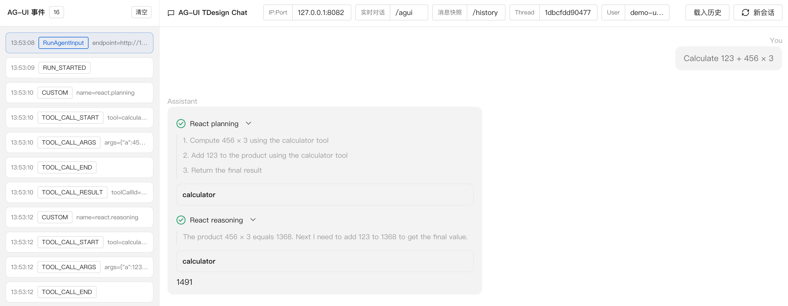

# Real-Time Conversation Route

## Core Concepts

The real-time conversation route handles a real-time conversation request and pushes the event stream produced during execution to the frontend through SSE. The default route is `/`, and it can be customized with `agui.WithPath`. To configure a shared route prefix, see [Route Prefix](index.md#route-prefix).

Note that the same `SessionKey` (`AppName` + `userID` + `sessionID`) can only have one real-time conversation request running at a time. Repeated requests return `409 Conflict`.

Even if the frontend SSE connection is closed, the backend continues running until it finishes normally, is canceled, or times out. By default, a single request can run for at most 1 hour. You can adjust this with `agui.WithTimeout(d)`, and setting it to `0` disables the timeout. The effective timeout is the smaller value between the request context deadline and `agui.WithTimeout(d)`.

For a complete code example, see [examples/agui/server/default](https://github.com/trpc-group/trpc-agent-go/tree/main/examples/agui/server/default).

## RunAgentInput Request Body

`RunAgentInput` is the request body used by AG-UI server routes. The real-time conversation, message snapshot, and cancel routes all use it to pass session and run information. The real-time conversation route mainly reads tail input from `messages`:

- When the tail message is `role=user`, it starts the run with user input.
- When the tail messages are consecutive `role=tool` messages, it continues the conversation with external tool results.

```go
type RunAgentInput struct {
	ThreadID       string          // Conversation thread ID. The framework uses it as SessionID.
	RunID          string          // Run ID, used to correlate run lifecycle events.
	ParentRunID    *string         // Parent run ID. Optional.
	State          any             // Arbitrary state that can be written into RuntimeState through StateResolver.
	Messages       []Message       // Message list used to pass the current user input or external tool results.
	Tools          []Tool          // Tool definitions. Protocol field. Optional.
	Context        []Context       // Context list. Protocol field. Optional.
	ForwardedProps any             // Arbitrary forwarded fields, usually for business-specific parameters.
}
```

For the full field definition, see the [AG-UI Go SDK](https://github.com/ag-ui-protocol/ag-ui/blob/main/sdks/community/go/pkg/core/types/types.go).

### Text Input

When starting a real-time conversation request, the tail `role=user` message in `messages` carries the current user input in string `content`. The server converts this message into the input for the current agent run.

```json
{
    "threadId": "thread-id",
    "runId": "run-id",
    "messages": [
        {
            "role": "user",
            "content": "hello"
        }
    ],
    "forwardedProps": {
        "userId": "alice"
    }
}
```

The corresponding `curl` example:

```bash
curl -N -X POST http://localhost:8080/ \
  -H 'Content-Type: application/json' \
  -d '{
    "threadId": "thread-id",
    "runId": "run-id",
    "messages": [
      {
        "role": "user",
        "content": "hello"
      }
    ],
    "forwardedProps": {
      "userId": "alice"
    }
  }'
```

### Multimodal Input

Multimodal input uses the tail `role=user` message in `messages` to represent the current user input. Unlike text input, `content` is no longer a string. It is an array of `InputContent` fragments. Each item represents one piece of input. Common types include:

- Text fragment: `type` is `"text"`, and the text content is in the `text` field.
- Binary fragment: `type` is `"binary"` and `mimeType` is required. Image input can use `url` to point to an image URL. Other binary content can use `data` to pass base64 content.

URL request body example:

```json
{
    "threadId": "thread-id",
    "runId": "run-id",
    "messages": [
        {
            "role": "user",
            "content": [
                { "type": "text", "text": "Describe this image." },
                { "type": "binary", "mimeType": "image/png", "url": "https://example.com/image.png" }
            ]
        }
    ]
}
```

DATA request body example:

```json
{
    "threadId": "thread-id",
    "runId": "run-id",
    "messages": [
        {
            "role": "user",
            "content": [
                { "type": "text", "text": "Describe this image." },
                { "type": "binary", "mimeType": "image/png", "data": "data:image/png;base64,iVBORw0KGgoAAAANSUhEUgAAAAEAAAABCAQAAAC1HAwCAAAAC0lEQVR42mP8/x8AAwMBAH+X1d0AAAAASUVORK5CYII=" }
            ]
        }
    ]
}
```

The `url` form is only used for image input. Other binary content uses `data`. When using `data`, the server decodes it with standard base64 decoding. `data` can be either a raw base64 string or a string with the `data:*;base64,` prefix.

### External Tool Result Input

After the previous event stream returns a tool call that needs external execution, the caller can request the real-time conversation route again and put one or more `role=tool` messages at the tail of `messages`. The server treats these consecutive tail tool messages as the current tool result input and passes them to the agent to continue the run.

```json
{
    "threadId": "thread-id",
    "runId": "run-id",
    "messages": [
        {
            "id": "tool-result-tool-call-id",
            "role": "tool",
            "toolCallId": "tool-call-id",
            "name": "external_tool",
            "content": "tool result"
        }
    ]
}
```

Each `role=tool` message corresponds to one tool call result. `toolCallId` associates the result with the tool call from the previous event stream, `name` is the tool name, and `content` carries the tool output as a string. `id` becomes the message id when the server returns the `TOOL_CALL_RESULT` event.

## RunAgentInput Hook

`RunAgentInput Hook` runs before the AG-UI Runner handles a request. It is used to normalize or rewrite `RunAgentInput` consistently. The real-time conversation, message snapshot, and cancel routes all use the request body after Hook processing.

The Hook receives the current `RunAgentInput` and can return the original request body, the original request body modified in place, or a new `RunAgentInput`. If you only need to parse `UserID`, `AppName`, `State`, or run options, prefer the corresponding Resolver described later.

The following example demonstrates compatibility with a legacy business field. Old requests put user input in `forwardedProps.legacy_message`. When `messages` is empty, the Hook fills in a `role=user` message.

```go
import (
	"github.com/ag-ui-protocol/ag-ui/sdks/community/go/pkg/core/types"
	"trpc.group/trpc-go/trpc-agent-go/runner"
	"trpc.group/trpc-go/trpc-agent-go/server/agui"
	"trpc.group/trpc-go/trpc-agent-go/server/agui/adapter"
	aguirunner "trpc.group/trpc-go/trpc-agent-go/server/agui/runner"
)

hook := func(ctx context.Context, input *adapter.RunAgentInput) (*adapter.RunAgentInput, error) {
	if input == nil {
		return nil, errors.New("empty input")
	}
	if len(input.Messages) > 0 {
		return input, nil
	}
	forwardedProps, ok := input.ForwardedProps.(map[string]any)
	if !ok || forwardedProps == nil {
		return input, nil
	}
	legacyMessage, ok := forwardedProps["legacy_message"].(string)
	if !ok || legacyMessage == "" {
		return input, nil
	}
	input.Messages = []types.Message{
		{
			Role:    types.RoleUser,
			Content: legacyMessage,
		},
	}
	return input, nil
}

run := runner.NewRunner(agent.Info().Name, agent)
server, _ := agui.New(run, agui.WithAGUIRunnerOptions(aguirunner.WithRunAgentInputHook(hook)))
```

Key points:

- Returning a custom `*adapter.RunAgentInput` uses the new request body for subsequent processing.
- Returning `nil` keeps the original request body. If the Hook modified the original object in place, those changes are preserved.
- Returning an error aborts the request, and the client receives a `RunError` event.

## Custom `UserIDResolver`

By default, AG-UI assigns every request to the fixed user ID `"user"`. `UserIDResolver` parses the business user identifier from `RunAgentInput`, and the parsed value participates in session lookup. The real-time conversation, message snapshot, and cancel routes reuse the same resolution logic, so related requests for the same session must resolve to the same `UserID`.

```go
import (
    "trpc.group/trpc-go/trpc-agent-go/runner"
    "trpc.group/trpc-go/trpc-agent-go/server/agui"
    "trpc.group/trpc-go/trpc-agent-go/server/agui/adapter"
    aguirunner "trpc.group/trpc-go/trpc-agent-go/server/agui/runner"
)

resolver := func(ctx context.Context, input *adapter.RunAgentInput) (string, error) {
    forwardedProps, ok := input.ForwardedProps.(map[string]any)
    if !ok {
        return "anonymous", nil
    }
    userID, ok := forwardedProps["userId"].(string)
    if !ok || userID == "" {
        return "anonymous", nil
    }
    return userID, nil
}

runner := runner.NewRunner(agent.Info().Name, agent)
server, _ := agui.New(runner, agui.WithAGUIRunnerOptions(aguirunner.WithUserIDResolver(resolver)))
```

## Custom `AppNameResolver`

`AppName` participates in session lookup together with `UserID` and `threadId`. By default, AG-UI uses the static `AppName` configured by `agui.WithAppName(name)`. To resolve the application identifier per request, implement `AppNameResolver` and inject it with `agui.WithAppNameResolver`.

When `AppNameResolver` returns a non-empty string, that value is used as the `AppName` for the request. When it returns an empty string, the framework falls back to `agui.WithAppName(name)`. The real-time conversation, message snapshot, and cancel routes reuse the same resolution logic, so related requests for the same session must resolve to the same `AppName`.

When message snapshots are enabled, configure `agui.WithAppName(name)` as the default value.

```go
import (
    "trpc.group/trpc-go/trpc-agent-go/runner"
    "trpc.group/trpc-go/trpc-agent-go/server/agui"
    "trpc.group/trpc-go/trpc-agent-go/server/agui/adapter"
)

resolver := func(ctx context.Context, input *adapter.RunAgentInput) (string, error) {
    forwardedProps, ok := input.ForwardedProps.(map[string]any)
    if !ok || forwardedProps == nil {
        return "", nil
    }
    appName, ok := forwardedProps["appName"].(string)
    if !ok || appName == "" {
        return "", nil
    }
    return appName, nil
}

runner := runner.NewRunner(agent.Info().Name, agent)
server, _ := agui.New(
    runner,
    agui.WithAppName("default-app"),
    agui.WithAppNameResolver(resolver),
)
```

## Custom `RunOptionResolver`

`RunOptionResolver` adds [`agent.RunOption`](https://github.com/trpc-group/trpc-agent-go/blob/main/agent/invocation.go) for the current agent run. It runs for every request, and the returned options only affect that run.

```go
import (
	"trpc.group/trpc-go/trpc-agent-go/agent"
	"trpc.group/trpc-go/trpc-agent-go/runner"
	"trpc.group/trpc-go/trpc-agent-go/server/agui"
	"trpc.group/trpc-go/trpc-agent-go/server/agui/adapter"
	aguirunner "trpc.group/trpc-go/trpc-agent-go/server/agui/runner"
)

resolver := func(_ context.Context, input *adapter.RunAgentInput) ([]agent.RunOption, error) {
	if input == nil {
		return nil, errors.New("empty input")
	}
	forwardedProps, ok := input.ForwardedProps.(map[string]any)
	if !ok || forwardedProps == nil {
		return nil, nil
	}
	opts := make([]agent.RunOption, 0, 2)
	if modelName, ok := forwardedProps["modelName"].(string); ok && modelName != "" {
		opts = append(opts, agent.WithModelName(modelName))
	}
	if filter, ok := forwardedProps["knowledgeFilter"].(map[string]any); ok {
		opts = append(opts, agent.WithKnowledgeFilter(filter))
	}
	return opts, nil
}

runner := runner.NewRunner(agent.Info().Name, agent)
server, _ := agui.New(runner, agui.WithAGUIRunnerOptions(aguirunner.WithRunOptionResolver(resolver)))
```

## Custom `StateResolver`

`StateResolver` converts `RunAgentInput.State` into RuntimeState for the current run. The returned map is passed to Runner as `agent.WithRuntimeState(...)` and only affects the current run.

Returning `nil` means RuntimeState is not set. Returning an empty map sets an empty RuntimeState.

```go
import (
	"trpc.group/trpc-go/trpc-agent-go/server/agui"
	"trpc.group/trpc-go/trpc-agent-go/server/agui/adapter"
	aguirunner "trpc.group/trpc-go/trpc-agent-go/server/agui/runner"
)

stateResolver := func(_ context.Context, input *adapter.RunAgentInput) (map[string]any, error) {
	state, ok := input.State.(map[string]any)
	if !ok || state == nil {
		return nil, nil
	}
	return map[string]any{
		"custom_key": state["custom_key"],
	}, nil
}

server, _ := agui.New(runner, agui.WithAGUIRunnerOptions(aguirunner.WithStateResolver(stateResolver)))
```

## Custom Translator

[Translator](index.md#translator) converts internal framework events into AG-UI events. The built-in Translator translates internal framework events into standard events defined by the AG-UI protocol, maintains streaming event state, and finalizes open streams when a run ends. A custom Translator can implement this conversion independently or wrap the built-in Translator to extend event output while preserving the default translation and finalization logic.

A custom Translator is usually injected through `aguirunner.WithTranslatorFactory`. The factory creates a Translator at the start of each run, so the Translator can maintain state within that run.

If a custom Translator generates streaming events that need to be closed when the run ends, or if it wraps the built-in Translator, implement `translator.PostRunFinalizingTranslator` so the framework can fill in the required finalization events at the end of the run.

```go
import (
    aguievents "github.com/ag-ui-protocol/ag-ui/sdks/community/go/pkg/core/events"
    "trpc.group/trpc-go/trpc-agent-go/event"
    "trpc.group/trpc-go/trpc-agent-go/runner"
    "trpc.group/trpc-go/trpc-agent-go/server/agui"
    "trpc.group/trpc-go/trpc-agent-go/server/agui/adapter"
    aguirunner "trpc.group/trpc-go/trpc-agent-go/server/agui/runner"
    "trpc.group/trpc-go/trpc-agent-go/server/agui/translator"
)

type customTranslator struct {
    inner translator.Translator
}

var _ translator.PostRunFinalizingTranslator = (*customTranslator)(nil)

func (t *customTranslator) Translate(ctx context.Context, evt *event.Event) ([]aguievents.Event, error) {
    out, err := t.inner.Translate(ctx, evt)
    if err != nil {
        return nil, err
    }
    if payload := buildCustomPayload(evt); payload != nil {
        out = append(out, aguievents.NewCustomEvent("trace.metadata", aguievents.WithValue(payload)))
    }
    return out, nil
}

func (t *customTranslator) PostRunFinalizationEvents(ctx context.Context) ([]aguievents.Event, error) {
    finalizer, ok := t.inner.(translator.PostRunFinalizingTranslator)
    if !ok {
        return nil, nil
    }
    return finalizer.PostRunFinalizationEvents(ctx)
}

func buildCustomPayload(evt *event.Event) map[string]any {
    if evt == nil || evt.Response == nil {
        return nil
    }
    return map[string]any{
        "object":    evt.Response.Object,
        "timestamp": evt.Response.Timestamp,
    }
}

factory := func(ctx context.Context, input *adapter.RunAgentInput, opts ...translator.Option) (translator.Translator, error) {
    inner, err := translator.New(ctx, input.ThreadID, input.RunID, opts...)
    if err != nil {
        return nil, fmt.Errorf("create inner translator: %w", err)
    }
    return &customTranslator{inner: inner}, nil
}

runner := runner.NewRunner(agent.Info().Name, agent)
server, _ := agui.New(runner, agui.WithAGUIRunnerOptions(aguirunner.WithTranslatorFactory(factory)))
```

`PostRunFinalizationEvents` is called during the finalization phase after the run ends. If it returns an error, the framework tries to send the finalization events already returned and sends a `RunError` to the client.

For example, when using React Planner, you can implement a custom Translator to apply different custom events to different tags, as shown below.



For the complete code example, see [examples/agui/server/react](https://github.com/trpc-group/trpc-agent-go/tree/main/examples/agui/server/react).

## Event Translation Callbacks

Event translation callbacks run custom logic before and after the built-in Translator translates a single event.

`translator.BeforeTranslateCallback` runs before an internal framework event enters the Translator and can replace the internal event used for this translation. `translator.AfterTranslateCallback` runs after an AG-UI event is generated and before it is sent to the client, and can replace the AG-UI event that will be sent.

Multiple callbacks run in registration order. The first callback that returns a non-nil event replaces the current event, and later callbacks no longer run. If all callbacks return nil, the original event is kept. If any callback returns an error, the request fails.

```go
import (
	aguievents "github.com/ag-ui-protocol/ag-ui/sdks/community/go/pkg/core/events"
	"trpc.group/trpc-go/trpc-agent-go/event"
	"trpc.group/trpc-go/trpc-agent-go/server/agui"
	aguirunner "trpc.group/trpc-go/trpc-agent-go/server/agui/runner"
	"trpc.group/trpc-go/trpc-agent-go/server/agui/translator"
)

callbacks := translator.NewCallbacks().
    RegisterBeforeTranslate(func(ctx context.Context, event *event.Event) (*event.Event, error) {
        return nil, nil
    }).
    RegisterAfterTranslate(func(ctx context.Context, event aguievents.Event) (aguievents.Event, error) {
        if msg, ok := event.(*aguievents.TextMessageContentEvent); ok {
            return aguievents.NewTextMessageContentEvent(msg.MessageID, msg.Delta+" [via callback]"), nil
        }
        return nil, nil
    })

server, err := agui.New(runner, agui.WithAGUIRunnerOptions(aguirunner.WithTranslateCallbacks(callbacks)))
```

For a complete example integrated with Langfuse observability, see [examples/agui/server/langfuse](https://github.com/trpc-group/trpc-agent-go/tree/main/examples/agui/server/langfuse).

## Connection Close Handling

By default, the SSE connection of a real-time conversation request is decoupled from the backend agent run. If a browser refresh, page close, or network interruption closes the SSE connection, the backend run does not stop immediately. It continues until it finishes normally, is canceled by the cancel route, or times out.

To cancel the backend run when the request context ends, enable `agui.WithCancelOnContextDoneEnabled(true)`.

```go
import "trpc.group/trpc-go/trpc-agent-go/server/agui"

server, err := agui.New(
    runner,
    agui.WithPath("/agui"),
    agui.WithCancelOnContextDoneEnabled(true),
)
```

## SSE Heartbeat Keepalive

Some gateways, load balancers, or browsers close SSE connections if no data is written for a long time. If an agent run may spend a long time without outputting events, enable SSE heartbeats.

```go
import "trpc.group/trpc-go/trpc-agent-go/server/agui"

server, err := agui.New(
    runner,
    agui.WithPath("/agui"),
    agui.WithHeartbeatInterval(15*time.Second),
)
```

After this is enabled, the server writes SSE comment frames `:\n\n` at the configured interval to keep the connection active. Heartbeats do not produce AG-UI events. This feature is disabled by default, and passing an interval less than or equal to 0 disables it.

## Custom Transport

The framework uses SSE to transport AG-UI event streams by default. To use WebSocket or another transport, provide a custom `service.Service`. A custom Service receives HTTP requests, calls `aguirunner.Runner`, and writes the returned AG-UI events back to the client.

```go
import (
    "trpc.group/trpc-go/trpc-agent-go/server/agui"
    aguirunner "trpc.group/trpc-go/trpc-agent-go/server/agui/runner"
	"trpc.group/trpc-go/trpc-agent-go/server/agui/service"
)

type customService struct {
    runner  aguirunner.Runner
    handler http.Handler
}

func NewCustomService(runner aguirunner.Runner, opt ...service.Option) service.Service {
	opts := service.NewOptions(opt...)
	s := &customService{
		runner: runner,
	}
	h := http.NewServeMux()
	h.HandleFunc(opts.Path, s.handle)
	s.handler = h
	return s
}

func (s *customService) handle(w http.ResponseWriter, r *http.Request) {
    // Implement custom transport handling here.
}

func (s *customService) Handler() http.Handler {
    return s.handler
}

server, err := agui.New(runner, agui.WithServiceFactory(NewCustomService))
```

## Reasoning Content

AG-UI uses `REASONING_*` events to represent reasoning content returned by the model. The frontend can display this content before the final answer. For related event definitions, see [AG-UI Reasoning](https://docs.ag-ui.com/concepts/reasoning).

Streaming reasoning content usually forms the following event sequence:

```text
REASONING_START
  → REASONING_MESSAGE_START
  → REASONING_MESSAGE_CONTENT
  → REASONING_MESSAGE_END
REASONING_END
```

The framework does not output reasoning content by default. After enabling `agui.WithReasoningContentEnabled(true)` when creating the Server, the Translator converts reasoning content returned by the model into `REASONING_*` events.

```go
import "trpc.group/trpc-go/trpc-agent-go/server/agui"

server, err := agui.New(
    runner,
    agui.WithReasoningContentEnabled(true),
)
```

## Streaming Tool Call Arguments

By default, the AG-UI server emits the complete `TOOL_CALL_START → TOOL_CALL_ARGS → TOOL_CALL_END` sequence after the model finishes producing a tool call. In other words, the frontend usually sees the tool arguments only after all arguments have been generated.

If tool arguments take noticeable time to generate, or if the frontend needs to show argument-generation progress before the tool starts running, enable streaming tool-call arguments. When enabled, the AG-UI server converts tool argument chunks produced by the model into multiple `TOOL_CALL_ARGS` events. The frontend can accumulate those chunks by `toolCallId` and render them incrementally.

This capability requires the underlying model adapter to support and enable tool call delta output. For the OpenAI adapter, enable both the model-layer and AG-UI-layer switches:

```go
import (
    "trpc.group/trpc-go/trpc-agent-go/model/openai"
    "trpc.group/trpc-go/trpc-agent-go/server/agui"
)

llm := openai.New(
    "gpt-5.5",
    openai.WithShowToolCallDelta(true), // Forward tool_calls chunks.
)

server, err := agui.New(
    runner,
    agui.WithToolCallDeltaStreamingEnabled(true),
)
```

Both switches are required:

- `openai.WithShowToolCallDelta(true)`: the OpenAI adapter stops filtering raw streaming `tool_calls` chunks and converts them into the framework's internal tool-call deltas.
- `agui.WithToolCallDeltaStreamingEnabled(true)`: the AG-UI server converts those chunks into realtime `TOOL_CALL_ARGS` events.

Other model adapters are handled the same way if they also support the framework's internal tool-call deltas.

When enabled, the realtime event stream for a single tool call usually looks like this:

```text
RUN_STARTED
→ TOOL_CALL_START
→ TOOL_CALL_ARGS
→ TOOL_CALL_ARGS
→ ...
→ TOOL_CALL_END
→ TOOL_CALL_RESULT
→ TEXT_MESSAGE_*
→ RUN_FINISHED
```

Frontend handling only needs to follow two rules:

- `TOOL_CALL_ARGS.delta` is the newly produced argument string fragment, not necessarily valid complete JSON. Accumulate it by `toolCallId` before parsing.
- `TOOL_CALL_ARGS` events for the same tool call are not guaranteed to be contiguous in the event stream. Maintain frontend state by `toolCallId`, not by adjacent events.

When the tool call ends, the AG-UI server emits `TOOL_CALL_END`. If the run is cancelled or ends with an error, the server also tries to close any still-open protocol events so the frontend does not remain in an unfinished state.

The realtime route sends each `TOOL_CALL_ARGS` chunk to the frontend. If `SessionService` is configured, adjacent `TOOL_CALL_ARGS` events with the same `toolCallId` are aggregated before they are written into the session. The message snapshot route restores the accumulated tool arguments; it does not preserve the number or boundaries of realtime chunks.

For a complete example, see [examples/agui/server/toolcall_delta](https://github.com/trpc-group/trpc-agent-go/tree/main/examples/agui/server/toolcall_delta).

## Streaming Tool Execution Results

[`StreamableTool`](../tool.md#streaming-tool-support) returns streaming intermediate results during execution and a final result when it finishes. A tool can return `tool.FinalResultChunk` or `tool.FinalResultStateChunk` in the stream to specify the final result. If neither is returned, the framework converts the received ordinary streaming intermediate results into text and concatenates them in return order as the final result.

By default, the Translator converts both streaming intermediate results and final results into `TOOL_CALL_RESULT`, so the same tool call may produce multiple `TOOL_CALL_RESULT` events.

After enabling `agui.WithStreamingToolResultActivityEnabled(true)`, streaming intermediate results are rewritten as Activity events with `activityType` set to `tool.result.stream`. When the tool finishes, the frontend still receives one final `TOOL_CALL_RESULT`.

```go
import "trpc.group/trpc-go/trpc-agent-go/server/agui"

server, err := agui.New(
    runner,
    agui.WithStreamingToolResultActivityEnabled(true),
)
```

This option is disabled by default. When it is not enabled, the real-time event stream for one tool call usually looks like this:

```text
RUN_STARTED
→ TOOL_CALL_START
→ TOOL_CALL_ARGS
→ TOOL_CALL_END
→ TOOL_CALL_RESULT
→ TOOL_CALL_RESULT
→ TOOL_CALL_RESULT
→ ...
→ TEXT_MESSAGE_*
→ RUN_FINISHED
```

When enabled, the real-time event stream for one tool call usually looks like this:

```text
RUN_STARTED
→ TOOL_CALL_START
→ TOOL_CALL_ARGS
→ TOOL_CALL_END
→ ACTIVITY_SNAPSHOT
→ ACTIVITY_DELTA
→ ACTIVITY_DELTA
→ ...
→ TOOL_CALL_RESULT
→ TEXT_MESSAGE_*
→ RUN_FINISHED
```

Streaming intermediate results are sent as complete AG-UI Activity events. The first non-empty streaming intermediate result generates `ACTIVITY_SNAPSHOT`:

```json
{
  "type": "ACTIVITY_SNAPSHOT",
  "timestamp": 1767950998788,
  "messageId": "tool-result-stream-call_xxx",
  "activityType": "tool.result.stream",
  "content": {
    "toolCallId": "call_xxx",
    "content": "Counted 1 of 3.\n"
  },
  "replace": true
}
```

Later non-empty streaming intermediate results generate `ACTIVITY_DELTA`:

```json
{
  "type": "ACTIVITY_DELTA",
  "timestamp": 1767950998799,
  "messageId": "tool-result-stream-call_xxx",
  "activityType": "tool.result.stream",
  "patch": [
    {
      "op": "add",
      "path": "/content",
      "value": "Counted 1 of 3.\nCounted 2 of 3.\n"
    }
  ]
}
```

Activity events for the same tool call use the same `messageId`, and `activityType` is fixed to `tool.result.stream`. The `patch.path` in `ACTIVITY_DELTA` is fixed to `/content`, and its `value` is the full intermediate result content accumulated by the server. The frontend can overwrite the display with the latest Activity state.

The content source of the final `TOOL_CALL_RESULT` stays unchanged. If the tool stream does not return `tool.FinalResultChunk` or `tool.FinalResultStateChunk`, the final result is built by concatenating received ordinary streaming intermediate results in order. If the stream returns either of those chunks, the final result directly uses its `Result`.

The message snapshot route does not save these streaming intermediate Activity events. When restoring history through the message snapshot route, each tool call keeps only one final `tool` message, and its content matches the final `TOOL_CALL_RESULT` from the real-time conversation route.

For a complete example, see [examples/agui/server/streamtool](https://github.com/trpc-group/trpc-agent-go/tree/main/examples/agui/server/streamtool).

## Event Source Metadata

In multi-agent or sub-agent stream forwarding scenarios, one AG-UI event stream may contain text, tool calls, tool results, and Activity events from different agent invocations. When event source metadata is enabled, the framework writes source information from internal events into the `rawEvent` field of AG-UI events. Callers can use this to identify event sources and restore frontend grouping state.

This feature is disabled by default and can be enabled with `agui.WithEventSourceMetadataEnabled(true)`:

```go
server, err := agui.New(
    runner,
    agui.WithEventSourceMetadataEnabled(true),
)
```

After this is enabled, AG-UI events generated by the Translator carry `rawEvent` when non-empty source information exists. Example:

```json
{
  "type": "TOOL_CALL_START",
  "toolCallId": "tool-call-1",
  "rawEvent": {
    "eventId": "evt-tool-call",
    "author": "member-a",
    "invocationId": "inv-1",
    "parentInvocationId": "parent-1",
    "branch": "root.member-a"
  }
}
```

`author` indicates the event author and is usually used to group by agent or member. `invocationId` identifies the current execution, `parentInvocationId` identifies the parent execution, and `branch` identifies the current execution's branch in the call chain. When the same agent name appears multiple times in a single run, `branch` can distinguish different execution branches.

The `MESSAGES_SNAPSHOT` event returned by the message snapshot route can also carry source information. In this case, `rawEvent` is not source information for one event, but a source index built by message and tool call:

```json
{
  "type": "MESSAGES_SNAPSHOT",
  "rawEvent": {
    "messages": {
      "assistant-1": {
        "eventId": "evt-assistant",
        "author": "member-a",
        "invocationId": "inv-1",
        "branch": "root.member-a"
      }
    },
    "toolCalls": {
      "tool-call-1": {
        "eventId": "evt-tool-call",
        "author": "member-a",
        "invocationId": "inv-1",
        "branch": "root.member-a"
      }
    }
  }
}
```

When restoring historical messages, use `rawEvent.messages[messageId]` to get the message source, or `rawEvent.toolCalls[toolCallId]` to get the tool call source. Source information in the index uses the same fields as `rawEvent` in real-time events, so the frontend can reuse those field semantics to restore grouping state.

## External Tools

External tools are used when tool calls are executed by the caller. The AG-UI server does not directly run these tools, but it still lets the agent generate tool calls, sends call information to the caller, receives tool results, and passes those results back to the agent to continue running.

The general flow is:

- The agent generates a tool call, and the AG-UI event stream returns `toolCallId` and arguments.
- The caller executes the tool.
- The caller sends the tool result back with a subsequent request, represented as a `role=tool` message.
- The AG-UI server sends `TOOL_CALL_RESULT`, writes it to session history, and passes the tool result to the agent to continue running.

Two server-side forms are currently supported. When directly wrapping an `llmagent.Agent`, use LLMAgent Tool-Filter mode. When external execution belongs to a GraphAgent node and must resume from a checkpoint, use GraphAgent Interrupt mode.

### LLMAgent Tool-Filter Mode

Use this mode when the AG-UI server directly wraps an `llmagent.Agent` and only some tools need to be executed by the caller. External tools are still registered with the Agent so the model can generate the corresponding tool calls. `RunOptionResolver` returns `agent.WithToolExecutionFilter(...)` to declare which tools are not executed on the server.

The first request uses `role=user`. When the model generates a tool call that must be executed by the caller, the event stream outputs `TOOL_CALL_START`, `TOOL_CALL_ARGS`, and `TOOL_CALL_END`, then ends the current run after that assistant tool-call response. The caller reads `toolCallId` and tool arguments from the event stream, executes the tool, and starts a second request with a `role=tool` message.

The second request keeps the same `threadId` and uses a new `runId`. The tail of `messages` can contain one or more `role=tool` messages, one result per `toolCallId`. The AG-UI server generates the current-turn tool result input in the order of the tail tool messages and drives the agent to continue running.

Code snippet:

```go
import (
    "trpc.group/trpc-go/trpc-agent-go/agent"
    "trpc.group/trpc-go/trpc-agent-go/server/agui"
    aguiadapter "trpc.group/trpc-go/trpc-agent-go/server/agui/adapter"
    aguirunner "trpc.group/trpc-go/trpc-agent-go/server/agui/runner"
    "trpc.group/trpc-go/trpc-agent-go/tool"
)

func resolveRunOptions(
    context.Context,
    *aguiadapter.RunAgentInput,
) ([]agent.RunOption, error) {
    return []agent.RunOption{
        agent.WithToolExecutionFilter(
            tool.NewExcludeToolNamesFilter("external_note"),
        ),
    }, nil
}

server, err := agui.New(
    run,
    agui.WithAGUIRunnerOptions(
        aguirunner.WithRunOptionResolver(resolveRunOptions),
    ),
)
```

For the complete LLMAgent example, see the server implementation in [examples/agui/server/externaltool/llmagent](https://github.com/trpc-group/trpc-agent-go/tree/main/examples/agui/server/externaltool/llmagent), and the frontend client in [examples/agui/client/tdesign-chat](https://github.com/trpc-group/trpc-agent-go/tree/main/examples/agui/client/tdesign-chat).

LLMAgent request examples:

First request (`role=user`):

```json
{
  "threadId": "demo-thread",
  "runId": "demo-run-1",
  "messages": [
    {
      "role": "user",
      "content": "Search and answer my question."
    }
  ]
}
```

Second request (`role=tool`):

```json
{
  "threadId": "demo-thread",
  "runId": "demo-run-2",
  "messages": [
    {
      "id": "tool-result-<toolCallId>",
      "role": "tool",
      "toolCallId": "<toolCallId>",
      "name": "<toolName>",
      "content": "tool output as string"
    }
  ]
}
```

LLMAgent event stream example:

```text
First request role=user
  → RUN_STARTED
  → TOOL_CALL_START
  → TOOL_CALL_ARGS
  → TOOL_CALL_END
  → RUN_FINISHED

Second request role=tool
  → RUN_STARTED
  → TOOL_CALL_RESULT generated from the tail tool message
  → TEXT_MESSAGE_* generated by the model as it continues
  → RUN_FINISHED
```

### GraphAgent Interrupt Mode

Use this mode when external execution belongs to a GraphAgent node and the backend needs to resume from a graph checkpoint. The corresponding graph node calls `graph.Interrupt` to pause execution and wait for the caller to send back the result. After the server enables `agui.WithGraphNodeInterruptActivityEnabled(true)`, the `graph.node.interrupt` event carries `lineageId` and `checkpointId`, which the caller uses to locate the resume point for the next request.

The first request uses `role=user`. The LLM node outputs `TOOL_CALL_START`, `TOOL_CALL_ARGS`, and `TOOL_CALL_END`; then the graph enters the tool node that triggers the interrupt, outputs `ACTIVITY_DELTA graph.node.interrupt`, and closes the current SSE stream after `RUN_FINISHED`. The caller gets the external tool `toolCallId`, tool arguments, `lineageId`, and `checkpointId` from the event stream.

The second request uses `role=tool`. The request's `toolCallId` corresponds to the tool call from the first request, `content` is the tool output string, and `forwardedProps.lineage_id` plus `forwardedProps.checkpoint_id` come from the `lineageId` and `checkpointId` returned by the first interrupt event. `RunOptionResolver` converts the tool result into graph resume information, usually by passing `graph.Command{ResumeMap: ...}` to GraphAgent. The server sends `TOOL_CALL_RESULT`, writes it to session history, resumes from the corresponding checkpoint, and continues generating the final answer.

The resume contract is defined by GraphAgent. The interrupted node consumes the returned result through the `ResumeMap` key. A single pending tool call corresponds to one tool result. If one interrupt contains multiple pending tool calls, their results are consumed by the graph-level `ResumeMap` contract. When a graph mixes server-executed tools and caller-executed tools, split them into separate stages so the interrupt node only handles caller-provided results while internal tool execution remains on the normal graph tools path.

Code snippet:

```go
import (
    "trpc.group/trpc-go/trpc-agent-go/agent"
    "trpc.group/trpc-go/trpc-agent-go/graph"
    "trpc.group/trpc-go/trpc-agent-go/model"
    "trpc.group/trpc-go/trpc-agent-go/server/agui"
    aguiadapter "trpc.group/trpc-go/trpc-agent-go/server/agui/adapter"
    aguirunner "trpc.group/trpc-go/trpc-agent-go/server/agui/runner"
)

func externalToolNode(ctx context.Context, state graph.State) (any, error) {
    msgs, _ := graph.GetStateValue[[]model.Message](state, graph.StateKeyMessages)
    pendingToolCall, ok := findPendingToolCall(msgs, "external_search")
    if !ok {
        return nil, nil
    }
    resumeValue, err := graph.Interrupt(ctx, state, pendingToolCall.ID, pendingToolCall.ID)
    if err != nil {
        return nil, err
    }
    content, ok := resumeValue.(string)
    if !ok {
        return nil, fmt.Errorf("resume value for %s must be a string", pendingToolCall.ID)
    }
    return graph.State{
        graph.StateKeyMessages: graph.AppendMessages{
            Items: []model.Message{
                model.NewToolMessage(pendingToolCall.ID, "external_search", content),
            },
        },
    }, nil
}

func resolveRunOptions(
    _ context.Context,
    input *aguiadapter.RunAgentInput,
) ([]agent.RunOption, error) {
    lineageID, checkpointID, resumeMap, err := graphResumeInput(input)
    if err != nil {
        return nil, err
    }
    return []agent.RunOption{
        agent.WithRuntimeState(map[string]any{
            graph.CfgKeyLineageID:    lineageID,
            graph.CfgKeyCheckpointID: checkpointID,
            graph.StateKeyCommand: &graph.Command{ResumeMap: resumeMap},
        }),
    }, nil
}

server, err := agui.New(
    run,
    agui.WithGraphNodeInterruptActivityEnabled(true),
    agui.WithAGUIRunnerOptions(
        aguirunner.WithRunOptionResolver(resolveRunOptions),
    ),
)
```

`graphResumeInput` reads `forwardedProps.lineage_id` and `forwardedProps.checkpoint_id`, then converts consecutive tail `role=tool` messages into `ResumeMap`.

For the complete GraphAgent example, see the server implementation in [examples/agui/server/externaltool/graphagent](https://github.com/trpc-group/trpc-agent-go/tree/main/examples/agui/server/externaltool/graphagent), and the frontend implementation in [examples/agui/client/tdesign-chat](https://github.com/trpc-group/trpc-agent-go/tree/main/examples/agui/client/tdesign-chat).

GraphAgent request examples:

First request (`role=user`):

```json
{
  "threadId": "demo-thread",
  "runId": "demo-run-1",
  "messages": [
    {
      "role": "user",
      "content": "Search and answer my question."
    }
  ]
}
```

Second request (`role=tool`):

```json
{
  "threadId": "demo-thread",
  "runId": "demo-run-2",
  "forwardedProps": {
    "lineage_id": "lineage-from-graph-node-interrupt",
    "checkpoint_id": "checkpoint-from-graph-node-interrupt"
  },
  "messages": [
    {
      "id": "tool-result-<toolCallId>",
      "role": "tool",
      "toolCallId": "<toolCallId>",
      "name": "<toolName>",
      "content": "tool output as string"
    }
  ]
}
```

GraphAgent event stream example:

```text
First request role=user
  → RUN_STARTED
  → TOOL_CALL_START
  → TOOL_CALL_ARGS
  → TOOL_CALL_END
  → ACTIVITY_DELTA graph.node.interrupt
  → RUN_FINISHED

Second request role=tool
  → RUN_STARTED
  → TOOL_CALL_RESULT generated from the tail tool message
  → ACTIVITY_DELTA graph.node.interrupt resume acknowledgement, when enabled
  → TEXT_MESSAGE_* generated after resuming
  → RUN_FINISHED
```

### AG-UI `role=tool` Input Handling

For the `role=tool` input request structure, see [External Tool Result Input](#external-tool-result-input). The AG-UI server reads consecutive tail `role=tool` messages from `messages` as the current tool result input batch.

If one event stream returns multiple tool calls that need caller execution, the subsequent request can place multiple `role=tool` messages at the tail of `messages` in order, one per `toolCallId`.

When `RunOptionResolver` also returns `agent.WithUserMessageRewriter`, the user rewriter runs first. Non-tool messages returned by the rewriter are retained before the final tool result block. A tool message returned by the rewriter replaces the request result for the corresponding AG-UI `toolCallId`. AG-UI places the final tool result block in the order of the tail tool messages from the request.

To echo `role=tool` input through the Translator, enable `agui.WithToolResultInputTranslationEnabled(true)`. When enabled, the AG-UI server first normalizes each tool result input into an internal event and then passes it to the Translator, as shown below.

```go
import (
    "trpc.group/trpc-go/trpc-agent-go/server/agui"
)

server, err := agui.New(
    runner,
    agui.WithToolResultInputTranslationEnabled(true),
)
```

## GraphAgent Node Activity Events

In `GraphAgent` scenarios, a single run usually executes multiple nodes in a graph. The framework can send extra Activity events so the frontend can display node execution progress and render Human-in-the-Loop interrupt state. This feature is disabled by default and can be enabled as needed when creating an AG-UI Server.

For the `ACTIVITY_DELTA` event format, see the [official AG-UI documentation](https://docs.ag-ui.com/concepts/events#activitydelta).

### Node Lifecycle (`graph.node.lifecycle`)

Node lifecycle events represent graph node execution phases. Enable them with `agui.WithGraphNodeLifecycleActivityEnabled(true)` when creating the AG-UI Server:

```go
import "trpc.group/trpc-go/trpc-agent-go/server/agui"

server, err := agui.New(
	runner,
	agui.WithGraphNodeLifecycleActivityEnabled(true),
)
```

After this is enabled, the node sends `ACTIVITY_DELTA` in the `start`, `complete`, and `error` phases. `activityType` is fixed to `graph.node.lifecycle`, and `patch` writes the current node state through `add /node`, where `phase` indicates the concrete phase and `error` only appears on failure.

Examples:

Node start phase (`phase=start`):

```json
{
  "type": "ACTIVITY_DELTA",
  "messageId": "activity-node-1",
  "activityType": "graph.node.lifecycle",
  "patch": [
    {
      "op": "add",
      "path": "/node",
      "value": {
        "nodeId": "plan_llm_node",
        "phase": "start"
      }
    }
  ]
}
```

Node successful completion phase (`phase=complete`):

```json
{
  "type": "ACTIVITY_DELTA",
  "messageId": "activity-node-2",
  "activityType": "graph.node.lifecycle",
  "patch": [
    {
      "op": "add",
      "path": "/node",
      "value": {
        "nodeId": "plan_llm_node",
        "phase": "complete"
      }
    }
  ]
}
```

Node failure completion phase (`phase=error`):

```json
{
  "type": "ACTIVITY_DELTA",
  "messageId": "activity-node-3",
  "activityType": "graph.node.lifecycle",
  "patch": [
    {
      "op": "add",
      "path": "/node",
      "value": {
        "nodeId": "plan_llm_node",
        "phase": "error",
        "error": "node execution failed"
      }
    }
  ]
}
```

The frontend can use `/node.nodeId` to locate the node and `/node.phase` to update display state. For example, highlight the node when `phase=start`, mark it as complete when `phase=complete`, and show `/node.error` when `phase=error`.

### Interrupt State (`graph.node.interrupt`)

Interrupt state events represent graph pause and resume state. Enable them with `agui.WithGraphNodeInterruptActivityEnabled(true)`:

```go
import "trpc.group/trpc-go/trpc-agent-go/server/agui"

server, err := agui.New(
	runner,
	agui.WithGraphNodeInterruptActivityEnabled(true),
)
```

When a node calls `graph.Interrupt(ctx, state, key, prompt)` and no resume input is currently available, the framework sends `ACTIVITY_DELTA`. `activityType` is fixed to `graph.node.interrupt`, and `patch` writes interrupt information through `add /interrupt`, including `nodeId`, `key`, `prompt`, `checkpointId`, and `lineageId`:

```json
{
  "type": "ACTIVITY_DELTA",
  "messageId": "activity-interrupt-1",
  "activityType": "graph.node.interrupt",
  "patch": [
    {
      "op": "add",
      "path": "/interrupt",
      "value": {
        "nodeId": "confirm",
        "key": "confirm",
        "prompt": "Confirm continuing after the recipe amounts are calculated.",
        "checkpointId": "checkpoint-xxx",
        "lineageId": "lineage-xxx"
      }
    }
  ]
}
```

This event means execution is paused at the current node. The frontend can render `/interrupt.prompt` as the interrupt prompt and use `/interrupt.key` to decide which resume value to provide. `checkpointId` and `lineageId` can locate the checkpoint to resume and correlate multiple runs.

When a new run starts with resume input, the AG-UI Server sends a resume acknowledgement at the beginning of that run's event stream, before any `graph.node.lifecycle` events. The acknowledgement also uses `activityType: graph.node.interrupt`. It first sets `/interrupt` to `null`, then writes the current resume input through `add /resume`:

```json
{
  "type": "ACTIVITY_DELTA",
  "messageId": "activity-resume-1",
  "activityType": "graph.node.interrupt",
  "patch": [
    {
      "op": "add",
      "path": "/interrupt",
      "value": null
    },
    {
      "op": "add",
      "path": "/resume",
      "value": {
        "checkpointId": "checkpoint-xxx",
        "lineageId": "lineage-xxx",
        "resumeMap": {
          "confirm": true
        }
      }
    }
  ]
}
```

When using multi-level GraphAgents, subgraph interrupts bubble up, and the event stream may contain multiple `graph.node.interrupt` events by default. If the frontend only wants to keep the outermost interrupt used for resuming, additionally enable `agui.WithGraphNodeInterruptActivityTopLevelOnly(true)`:

```go
import "trpc.group/trpc-go/trpc-agent-go/server/agui"

server, err := agui.New(
	runner,
	agui.WithGraphNodeInterruptActivityEnabled(true),
	agui.WithGraphNodeInterruptActivityTopLevelOnly(true),
)
```

For a complete example, see [examples/agui/server/graph](https://github.com/trpc-group/trpc-agent-go/tree/main/examples/agui/server/graph). For frontend rendering and approval interactions, see [examples/agui/client/tdesign-chat](https://github.com/trpc-group/trpc-agent-go/tree/main/examples/agui/client/tdesign-chat).

## Observability Reporting

Observability platforms usually need to record the input, business tags, and final output of a conversation. AG-UI can add span attributes for the current agent run through `RunOptionResolver`, and can write the final result after streaming output ends together with event translation callbacks.

On the input side, return `agent.WithSpanAttributes(...)` from `RunOptionResolver`, and the framework writes those attributes to the agent entry span:

```go
import (
    "go.opentelemetry.io/otel/attribute"
    "trpc.group/trpc-go/trpc-agent-go/server/agui"
    "trpc.group/trpc-go/trpc-agent-go/server/agui/adapter"
    aguirunner "trpc.group/trpc-go/trpc-agent-go/server/agui/runner"
    "trpc.group/trpc-go/trpc-agent-go/agent"
)

runOptionResolver := func(ctx context.Context, input *adapter.RunAgentInput) ([]agent.RunOption, error) {
    content, ok := input.Messages[len(input.Messages)-1].ContentString()
    if !ok {
        return nil, errors.New("last message content is not a string")
    }
    attrs := []attribute.KeyValue{
        attribute.String("trace.input", content),
    }
    forwardedProps, ok := input.ForwardedProps.(map[string]any)
    if ok {
        if scenario, ok := forwardedProps["scenario"].(string); ok {
            attrs = append(attrs, attribute.String("conversation.scenario", scenario))
        }
    }
    return []agent.RunOption{agent.WithSpanAttributes(attrs...)}, nil
}

server, err := agui.New(
    runner,
    agui.WithAGUIRunnerOptions(
        aguirunner.WithRunOptionResolver(runOptionResolver),
    ),
)
```

On the output side, accumulate text events in the `AfterTranslate` event translation callback, then write `trace.output` after output ends. This aligns frontend streaming events with backend traces for the same run, making it easier to inspect both input and final output in the observability platform.

For the Langfuse observability integration example, see [examples/agui/server/langfuse](https://github.com/trpc-group/trpc-agent-go/tree/main/examples/agui/server/langfuse).

## Best Practices

Prefer server-side tool execution by default. Use the external tool pattern when a tool must run on the client side or business side. Treat this scenario as an advanced use case that should be designed and evaluated carefully.

### Generating Documents

If a long document is inserted directly into the main conversation, it can easily flood the chat, and users may have trouble distinguishing conversation content from document content. To solve this, use a document panel to carry long-form documents. Define an AG-UI event stream workflow of "open document panel → write document content → close document panel" to move long documents out of the main conversation and avoid disrupting normal interaction. An example approach is:

1. **Backend: define tools and constrain call order**

   Provide the Agent with two tools, **open document panel** and **close document panel**, and constrain the generation order in the prompt:
   when entering the document generation flow, execute in the following order:

   1. Call the "open document panel" tool first
   2. Output the document content immediately after that
   3. Call the "close document panel" tool last

   Converted into an AG-UI event stream, it roughly looks like this:

   ```text
   Open document panel tool
     → ToolCallStart
     → ToolCallArgs
     → ToolCallEnd
     → ToolCallResult

   Document content
     → TextMessageStart
     → TextMessageContent
     → TextMessageEnd

   Close document panel tool
     → ToolCallStart
     → ToolCallArgs
     → ToolCallEnd
     → ToolCallResult
   ```

2. **Frontend: listen for tool events and maintain the document panel**

   Listen to the event stream on the frontend:

   - When an `open_report_document` tool event is captured: create a document panel and write subsequent text message content into that panel.
   - When a `close_report_document` tool event is captured: close the document panel or mark it as complete.

The result is shown below. For the complete example, see [examples/agui/server/report](https://github.com/trpc-group/trpc-agent-go/tree/main/examples/agui/server/report). For the frontend implementation, see [examples/agui/client/tdesign-chat](https://github.com/trpc-group/trpc-agent-go/tree/main/examples/agui/client/tdesign-chat).


