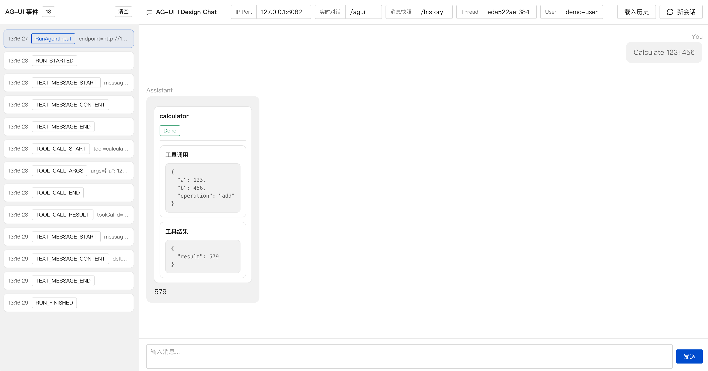
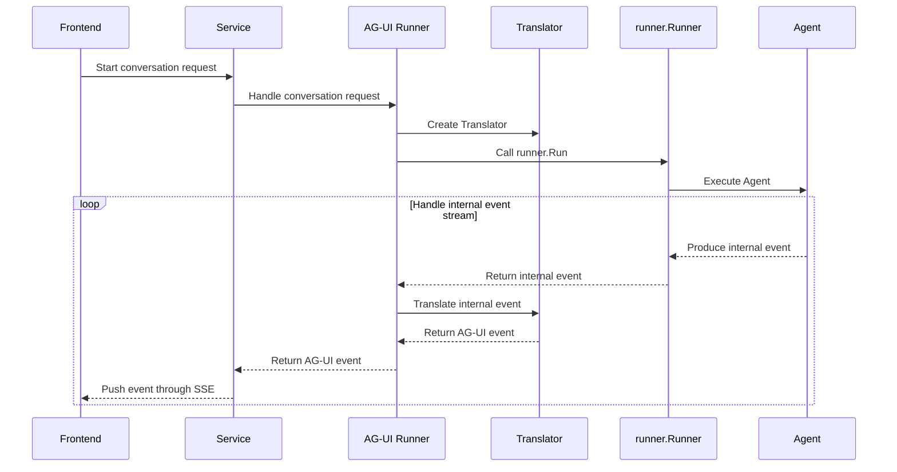

# AG-UI Guide

AG-UI (Agent-User Interaction), maintained by the open-source [AG-UI Protocol](https://github.com/ag-ui-protocol/ag-ui) project, is an open, lightweight, event-based protocol for interactions between agents and users. It standardizes the connection between AI agents and user-facing applications by defining how an agent backend receives protocol-compatible input and emits standardized runtime events during execution.

`tRPC-Agent-Go` provides AG-UI server integration on top of existing agents. The frontend starts a conversation with an AG-UI request, the server runs the agent, and AG-UI events are streamed back throughout the run.

## Quick Start

Assuming you already have an agent, you can expose it through AG-UI and start the service as follows:

```go
import (
    "net/http"

    "trpc.group/trpc-go/trpc-agent-go/runner"
    "trpc.group/trpc-go/trpc-agent-go/server/agui"
)

// Create the agent.
agent := newAgent()
// Create the Runner.
runner := runner.NewRunner(agent.Info().Name, agent)
defer runner.Close()
// Create the AG-UI service and specify the HTTP route.
server, err := agui.New(runner, agui.WithPath("/agui"))
if err != nil {
    log.Fatalf("create agui server failed: %v", err)
}
// Start the HTTP service.
if err := http.ListenAndServe("127.0.0.1:8080", server.Handler()); err != nil {
    log.Fatalf("server stopped with error: %v", err)
}
```

`agui.WithPath` sets the real-time conversation route. The default route is `/`.

For a complete example, see [examples/agui/server/default](https://github.com/trpc-group/trpc-agent-go/tree/main/examples/agui/server/default).

For full Runner usage, see [runner](../runner.md).

On the frontend, you can use any client framework that supports AG-UI, such as [CopilotKit](https://github.com/CopilotKit/CopilotKit) or [TDesign Chat](https://tdesign.tencent.com/react-chat/overview). This repository provides two runnable Web UI examples:

- [examples/agui/client/tdesign-chat](https://github.com/trpc-group/trpc-agent-go/tree/main/examples/agui/client/tdesign-chat): a Vite + React + TDesign client that demonstrates custom events, Graph interrupt approval, message snapshot loading, report side panels, and other capabilities.
- [examples/agui/client/copilotkit](https://github.com/trpc-group/trpc-agent-go/tree/main/examples/agui/client/copilotkit): a Next.js client built with CopilotKit.



## Core Concepts

The AG-UI integration lets a frontend call existing `tRPC-Agent-Go` agents through the AG-UI protocol. After receiving an AG-UI request, the server converts it into input that `runner.Runner` can execute. Internal framework events produced by `runner.Runner` are then translated into AG-UI events and returned to the frontend.

The main path for a real-time conversation request is:



The path starts when the frontend sends a conversation request. `Service` receives the request and passes it to the AG-UI Runner. The AG-UI Runner creates a Translator for the current run and calls `runner.Runner` to start agent execution. During execution, `runner.Runner` keeps producing internal framework events. The AG-UI Runner passes those events to the Translator, which converts them into AG-UI events. The AG-UI Runner returns the translated events to `Service`, and `Service` pushes them to the frontend through SSE.

In this path, `Server` provides the HTTP entry point, `Service` handles event-stream communication, the AG-UI Runner converts protocol requests into the input and run options required by `runner.Runner`, and `Translator` converts internal framework events into AG-UI events.

### Server

`agui.Server` exposes an existing `runner.Runner` as an AG-UI HTTP service and provides an `http.Handler` that can be mounted into an application HTTP service.

Create a server as follows:

```go
import "trpc.group/trpc-go/trpc-agent-go/runner"

func New(runner runner.Runner, opt ...Option) (*Server, error)
```

When creating a `Server`, the framework determines the real-time conversation, message snapshot, and cancel routes, then connects those routes to the corresponding `Service` and AG-UI Runner. The three route types correspond to different interaction stages:

- Real-time conversation route: receives frontend conversation requests and returns the AG-UI event stream produced during agent execution.
- Message snapshot route: restores historical messages from persisted AG-UI events for page initialization, refresh, or state recovery after reconnecting.
- Cancel route: finds and cancels a running conversation request based on session information.

`Server` establishes the HTTP entry point. Agent execution is still performed by the provided `runner.Runner`.

### Service

`service.Service` defines how AG-UI event streams are communicated. The default implementation is SSE, so after the frontend starts a real-time conversation request, it continuously receives AG-UI events over the same SSE connection.

The interface is:

```go
type Service interface {
    Handler() http.Handler
}
```

To use WebSocket or another communication protocol, provide a custom `Service` implementation.

### AG-UI Runner

The AG-UI Runner connects AG-UI requests with `runner.Runner`. The frontend submits an AG-UI request body, [`RunAgentInput`](https://docs.ag-ui.com/sdk/js/core/types#runagentinput), while `runner.Runner` expects executable run input. The AG-UI Runner adapts between them.

The interface is:

```go
import (
    aguievents "github.com/ag-ui-protocol/ag-ui/sdks/community/go/pkg/core/events"
    "trpc.group/trpc-go/trpc-agent-go/server/agui/adapter"
)

type Runner interface {
    Run(ctx context.Context, runAgentInput *adapter.RunAgentInput) (<-chan aguievents.Event, error)
}
```

During this process, the AG-UI Runner parses session data, messages, state, and forwarded parameters from the request, then organizes them into the input and run options required by `runner.Runner`. This lets the frontend continue using AG-UI while the backend continues using `tRPC-Agent-Go` Runner.

After the run starts, the AG-UI Runner also receives internal framework events produced by `runner.Runner`, passes them to the Translator, and returns the translated AG-UI events to Service.

### Translator

`Translator` converts internal `tRPC-Agent-Go` events into AG-UI events. After the AG-UI Runner receives internal events from `runner.Runner`, it passes them to the Translator one by one. The AG-UI events returned by the Translator are then pushed to the frontend by Service.

The interfaces are:

```go
import (
    aguievents "github.com/ag-ui-protocol/ag-ui/sdks/community/go/pkg/core/events"
    agentevent "trpc.group/trpc-go/trpc-agent-go/event"
)

type Translator interface {
    Translate(ctx context.Context, event *agentevent.Event) ([]aguievents.Event, error)
}

type PostRunFinalizingTranslator interface {
    Translator
    PostRunFinalizationEvents(ctx context.Context) ([]aguievents.Event, error)
}
```

The built-in Translator handles text output, tool calls, tool results, reasoning content, real-time progress, and run lifecycle events. Because AG-UI has grouped streaming events, the Translator maintains the required state within a single run. When the run ends, `PostRunFinalizationEvents` fills in protocol events that have not yet been closed, preventing the frontend from receiving an incomplete event sequence.

To append custom events, rewrite event content, or adapt to a specific frontend component, customize the Translator or adjust events through translation callbacks.

## Route Prefix

`agui.WithBasePath` sets the base route prefix for the AG-UI service. The default value is `/`. It mounts the real-time conversation, message snapshot, and cancel routes under a unified prefix to avoid conflicts with existing service routes.

`agui.WithPath`, `agui.WithMessagesSnapshotPath`, and `agui.WithCancelPath` define only their own sub-routes. The framework automatically combines them with `BasePath` to form the final accessible routes.

Example:

```go
import "trpc.group/trpc-go/trpc-agent-go/server/agui"

server, err := agui.New(
    runner,
    agui.WithBasePath("/agui/"),
    agui.WithPath("/chat"),
    agui.WithMessagesSnapshotEnabled(true),
    agui.WithMessagesSnapshotPath("/history"),
    agui.WithCancelEnabled(true),
    agui.WithCancelPath("/cancel"),
)
```

In this case, the real-time conversation route is `/agui/chat`, the message snapshot route is `/agui/history`, and the cancel route is `/agui/cancel`.
