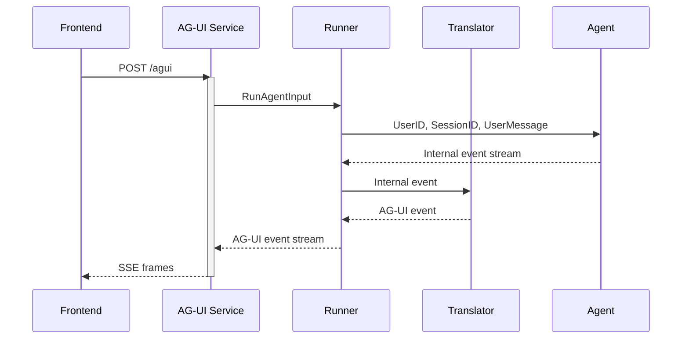

# tRPC-Agent-Go: Quickly Build AG-UI-Based Agent Services

> When bringing AI Agents into production, a key end-to-end challenge is how to connect the reasoning process with the user interface while keeping the protocol layer extensible. The AG-UI protocol provides a lightweight and open solution, and tRPC-Agent-Go delivers a complete engineering practice for it. This article starts with an overview of the AG-UI protocol, moves on to a minimal integration practice, then breaks down the core modules and explains highly customizable usage patterns to help you quickly connect Agents to the AG-UI protocol and bridge the last mile between Agents and users.

## Introduction

[tRPC-Agent-Go](https://github.com/trpc-group/trpc-agent-go/) is an autonomous multi-Agent framework for Go, with capabilities including tool calling, session/memory/artifact management, multi-Agent collaboration, graph orchestration, knowledge bases, and observability. The growth of [tRPC-Agent-Go](https://github.com/trpc-group/trpc-agent-go/) depends on everyone's support. You are welcome to Star the project and join the community in building it together.

Next, this article starts with an overview of the AG-UI protocol, moves on to a minimal integration practice, then breaks down the core modules and explains highly customizable usage patterns to help you quickly connect Agents to the AG-UI protocol and bridge the last mile between Agents and users.

## AG-UI Overview

### Protocol Positioning

AG-UI is an open, lightweight, event-based protocol that standardizes how Agents connect with user interface applications. It emphasizes simplicity and flexibility, supports any event transport layer such as SSE, WebSocket, and WebHooks, and uses a relaxed event format matching model to enable seamless integration among Agents, real-time user context, and user interfaces.

Together with MCP and A2A, the AG-UI protocol forms the Agent communication protocol stack. It bridges the last mile between Agents and users. The following figure shows the position and responsibilities of the three protocols in the protocol stack.


- MCP protocol: A communication protocol that standardizes how Agents call tools
- A2A protocol: A communication protocol that standardizes collaboration between Agents
- AG‑UI protocol: A communication protocol that standardizes the interaction interface between Agents and users

In plain terms, the AG‑UI protocol abstracts the interaction between an Agent and the user interface into an event stream. A single Agent invocation starts with `RunStarted` and ends with `RunFinished` or `RunError`; during the run, text deltas, tool calls, and state synchronization are continuously sent to the frontend as typed events.

### Event Model

The AG‑UI protocol uses an event-driven model with clearly grouped event types, including lifecycle, text messages, tool calls, state management, and extension events. Multiple event types within each group work together to build a complete cycle.

- Lifecycle events: `RunStarted`, `RunFinished`, `RunError`
- Text message events: `TextMessageStart`, `TextMessageContent`, `TextMessageEnd`
- Tool call events: `ToolCallStart`, `ToolCallArgs`, `ToolCallEnd`, `ToolCallResult`
- State synchronization events: `StateSnapshot`, `StateDelta`, `MessagesSnapshot`
- Extension event: `Custom`

From the perspective of an event stream, a typical event sequence starts with `RunStarted`. While generating content, the Agent pushes deltas with `TextMessageContent`; when a tool is needed, it first announces the call with `ToolCallStart`, then pushes `ToolCallArgs`, and sends back `ToolCallResult` after the tool completes; finally, the sequence ends with `RunFinished`.

For example, the SSE frames roughly look like this, where the `data:` content is a single event in JSON format.

```http
id: RUN_STARTED_1761536557195
data: {"type":"RUN_STARTED","threadId":"session-01","runId":"invocation-01"}

id: TEXT_MESSAGE_START_1761536558081
data: {"type":"TEXT_MESSAGE_START","messageId":"message-01","role":"assistant"}

id: TEXT_MESSAGE_CONTENT_1761536558294
data: {"type":"TEXT_MESSAGE_CONTENT","messageId":"message-01","delta":"I'll calculate "}

id: TEXT_MESSAGE_CONTENT_1761536558370
data: {"type":"TEXT_MESSAGE_CONTENT","messageId":"message-01","delta":"2 to the power of 3."}

id: TEXT_MESSAGE_END_1761536559693
data: {"type":"TEXT_MESSAGE_END","messageId":"message-01"}

id: TOOL_CALL_START_1761536559693
data: {"type":"TOOL_CALL_START","toolCallId":"call-01","toolCallName":"calculator","parentMessageId":"message-01"}

id: TOOL_CALL_ARGS_1761536559693
data: {"type":"TOOL_CALL_ARGS","toolCallId":"call-01","delta":"{\"a\": 2, \"b\": 3, \"operation\": \"power\"}"}

id: TOOL_CALL_END_1761536559693
data: {"type":"TOOL_CALL_END","toolCallId":"call-01"}

id: TOOL_CALL_RESULT_1761536559693
data: {"type":"TOOL_CALL_RESULT","messageId":"message-01","toolCallId":"call-01","content":"{\"result\":8}","role":"tool"}

id: TEXT_MESSAGE_START_1761536560773
data: {"type":"TEXT_MESSAGE_START","messageId":"message-02","role":"assistant"}

id: TEXT_MESSAGE_CONTENT_1761536560977
data: {"type":"TEXT_MESSAGE_CONTENT","messageId":"message-02","delta":"2 to the power of 3"}

id: TEXT_MESSAGE_CONTENT_1761536561050
data: {"type":"TEXT_MESSAGE_CONTENT","messageId":"message-02","delta":" equals 8."}

id: TEXT_MESSAGE_END_1761536561439
data: {"type":"TEXT_MESSAGE_END","messageId":"message-02"}

id: RUN_FINISHED_1761536561439
data: {"type":"RUN_FINISHED","threadId":"session-01","runId":"invocation-01"}
```

### Open Source Ecosystem

[AG‑UI](https://github.com/ag-ui-protocol/ag-ui) provides SDKs for multiple languages, including TypeScript, Python, Golang, Kotlin, and Java.

Agent frameworks such as LangGraph, CrewAI, Agno, and ADK have already integrated with AG‑UI through official or community-maintained adapters and can output AG-UI protocol event streams.

On the frontend, clients that implement the AG‑UI protocol, such as [@ag-ui/client](https://www.npmjs.com/package/@ag-ui/client) and [CopilotKit](https://github.com/CopilotKit/CopilotKit), can be used to consume events.

In addition, we have also contributed improvements to the Go SDK in the official AG-UI repository.

- [feat: add http.Flusher fallback for SSEWriter in Golang SDK](https://github.com/ag-ui-protocol/ag-ui/pull/560)
- [fix: event missing EventTypeToolCallResult](https://github.com/ag-ui-protocol/ag-ui/pull/339/commits/1d05c81e442acaf2abf31e70d10d90f1cf757a01)

For more supported cases, see the [official documentation](https://github.com/ag-ui-protocol/ag-ui?tab=readme-ov-file#-supported-frameworks).

## Quick Integration

### Agent Development

The following example builds an Agent with a calculator tool.

```go
import (
    "trpc.group/trpc-go/trpc-agent-go/agent"
    "trpc.group/trpc-go/trpc-agent-go/agent/llmagent"
    "trpc.group/trpc-go/trpc-agent-go/model"
    "trpc.group/trpc-go/trpc-agent-go/model/openai"
    "trpc.group/trpc-go/trpc-agent-go/tool"
    "trpc.group/trpc-go/trpc-agent-go/tool/function"
)

func newAgent() agent.Agent {
    modelInstance := openai.New("deepseek-chat")
    generationConfig := model.GenerationConfig{
        MaxTokens:   intPtr(512),
        Temperature: floatPtr(0.7),
        Stream:      true,
    }
    calculatorTool := function.NewFunctionTool(
        calculator,
        function.WithName("calculator"),
        function.WithDescription("A calculator tool, you can use it to calculate the result of the operation. "+
            "a is the first number, b is the second number, "+
            "the operation can be add, subtract, multiply, divide, power."),
    )
    agent := llmagent.New(
        "agui-agent",
        llmagent.WithTools([]tool.Tool{calculatorTool}),
        llmagent.WithModel(modelInstance),
        llmagent.WithGenerationConfig(generationConfig),
        llmagent.WithInstruction("You are a helpful assistant."),
    )
    return agent
}

func calculator(ctx context.Context, args calculatorArgs) (calculatorResult, error) {
    var result float64
    switch args.Operation {
    case "add", "+":
        result = args.A + args.B
    case "subtract", "-":
        result = args.A - args.B
    case "multiply", "*":
        result = args.A * args.B
    case "divide", "/":
        result = args.A / args.B
    case "power", "^":
        result = math.Pow(args.A, args.B)
    default:
        return calculatorResult{Result: 0}, fmt.Errorf("invalid operation: %s", args.Operation)
    }
    return calculatorResult{Result: result}, nil
}

type calculatorArgs struct {
    Operation string  `json:"operation" description:"add, subtract, multiply, divide, power"`
    A         float64 `json:"a" description:"First number"`
    B         float64 `json:"b" description:"Second number"`
}

type calculatorResult struct {
    Result float64 `json:"result"`
}

func intPtr(i int) *int {
    return &i
}

func floatPtr(f float64) *float64 {
    return &f
}
```

### Start an AG-UI Service over HTTP

The AG-UI service exposes a standard HTTP Handler. The integration process mainly consists of three steps.

1. Create a framework Runner.
2. Create an AG-UI service with `agui.New`.
3. Start the HTTP service with `http.ListenAndServe`.

```go
import (
    "trpc.group/trpc-go/trpc-agent-go/log"
    "trpc.group/trpc-go/trpc-agent-go/runner"
    "trpc.group/trpc-go/trpc-agent-go/server/agui"
)

agent := newAgent()
runner := runner.NewRunner(agent.Info().Name, agent)
defer runner.Close()

// Create the AG-UI service and set the HTTP route.
server, err := agui.New(runner, agui.WithPath("/agui"))
if err != nil {
    log.Fatalf("failed to create AG-UI server: %v", err)
}

// Start the HTTP service.
if err := http.ListenAndServe("127.0.0.1:8080", server.Handler()); err != nil {
    log.Fatalf("server stopped with error: %v", err)
}
```

At this point, we have developed the Agent and started the AG-UI service. The complete code is available in [examples/agui/server/default](https://github.com/trpc-group/trpc-agent-go/tree/main/examples/agui/server/default).

### CopilotKit Joint Debugging

When developing the frontend with CopilotKit, users can interact with the Agent in the frontend after setting the backend AG-UI service address. The complete code is available in [examples/agui/client/copilotkit](https://github.com/trpc-group/trpc-agent-go/tree/main/examples/agui/client/copilotkit).

!video[agui.mp4](152728)

## Core Concepts

### Overall Design

In tRPC-Agent-Go, AG‑UI mainly consists of the following modules.

1. Adapter: Defines the structure of the frontend request body `RunAgentInput`.
2. Translator: Translates internal events into AG‑UI events.
3. Runner: Processes the request body, runs the Agent, invokes the Translator, and so on.
4. Service: Provides an HTTP Handler, accepts requests, and sends AG-UI event responses. It provides an SSE transport implementation by default and can also be customized for other communication protocols.



This sequence diagram shows the default SSE path of AG‑UI: the frontend sends a POST `/agui` request to the AG‑UI Service, and the `Service` passes `RunAgentInput` to the `Runner`; the `Runner` calls the underlying Agent with `UserID`, `SessionID`, and the user message, then passes each generated internal event to the `Translator`, which translates it into an AG‑UI event; these events are returned to the `Runner` and streamed by the `Service` to the frontend as `SSE` frames. Through this loop, the Agent's reasoning process can be presented in the UI in real time.

### Adapter

The frontend request body is defined in [server/agui/adapter](https://github.com/trpc-group/trpc-agent-go/blob/main/server/agui/adapter/adapter.go). The core structure is as follows.

```go
import "github.com/ag-ui-protocol/ag-ui/sdks/community/go/pkg/core/types"

type RunAgentInput struct {
    ThreadID       string          `json:"threadId"`       // Session ID.
    RunID          string          `json:"runId"`          // Run ID.
    Messages       []types.Message `json:"messages"`       // Conversation messages.
    State          map[string]any  `json:"state"`          // Session state.
    ForwardedProps any             `json:"forwardedProps"` // Extension fields.
}
```

- ThreadID is the session identifier and corresponds to the framework-level SessionID.
- RunID is the identifier of this invocation and corresponds to the framework-level InvocationID.
- Messages stores the conversation between the user and the Agent.
- State is used to carry session state.
- ForwardedProps stores business-side extension fields, such as the user ID.

### Translator

The Translator interface provides the `Translate` method, which translates internal events into AG-UI events.

```go
import (
    aguievents "github.com/ag-ui-protocol/ag-ui/sdks/community/go/pkg/core/events"
    agentevent "trpc.group/trpc-go/trpc-agent-go/event"
)

type Translator interface {
    Translate(ctx context.Context, event *agentevent.Event) ([]aguievents.Event, error)
}
```

The specific event translation logic is as follows.

- Before the Agent starts running, a `RunStarted` AG-UI event is sent; after a normal run finishes, a `RunFinished` AG-UI event is sent; if an error occurs in the middle, a `RunError` AG-UI event is sent.
- Internal text events are translated into `TextMessageStart`, `TextMessageContent`, and `TextMessageEnd` AG-UI events.
- Internal tool call and execution result events are translated into `ToolCallStart`, `ToolCallArgs`, `ToolCallEnd`, and `ToolCallResult` AG-UI events.

In addition, you can implement a custom Translator for custom events or reporting to an observability platform.


### Runner

The AG-UI Runner wraps the framework Runner. It receives the frontend request body `RunAgentInput`, invokes the Agent to run, passes the generated internal events to the Translator for translation into AG-UI events, and then returns them to the upper-level Service.

```go
import (
    aguievents "github.com/ag-ui-protocol/ag-ui/sdks/community/go/pkg/core/events"
    "trpc.group/trpc-go/trpc-agent-go/server/agui/adapter"
)

type Runner interface {
    Run(ctx context.Context, runAgentInput *adapter.RunAgentInput) (<-chan aguievents.Event, error)
}
```

### Service

Service exposes an HTTP Handler, calls the AG-UI Runner, and sends AG-UI events to the frontend.

The framework provides an SSE implementation by default and also allows custom Service implementations to extend it to other communication protocols such as WebSocket.

```go
import "net/http"

type Service interface {
    Handler() http.Handler
}
```

## Usage

### Custom Communication Protocol

The AG-UI protocol does not mandate a communication protocol. The framework uses SSE as the default communication protocol for AG-UI. If you want to switch to another protocol such as WebSocket, you can implement the `service.Service` interface:

```go
import (
    "trpc.group/trpc-go/trpc-agent-go/runner"
    "trpc.group/trpc-go/trpc-agent-go/server/agui"
    aguirunner "trpc.group/trpc-go/trpc-agent-go/server/agui/runner"
    "trpc.group/trpc-go/trpc-agent-go/server/agui/service"
)

type wsService struct {
    path    string
    runner  aguirunner.Runner
    handler http.Handler
}

func NewWSService(runner aguirunner.Runner, opt ...service.Option) service.Service {
    opts := service.NewOptions(opt...)
    s := &wsService{
        path:   opts.Path,
        runner: runner,
    }
    h := http.NewServeMux()
    h.HandleFunc(s.path, s.handle)
    s.handler = h
    return s
}

func (s *wsService) Handler() http.Handler { /* HTTP Handler */ }

runner := runner.NewRunner(agent.Info().Name, agent)
server, err := agui.New(runner, agui.WithServiceFactory(NewWSService))
```

### Custom Translator

The default `translator.New` translates internal events into the standard event set defined by the protocol. If you want to append custom information while preserving the default behavior, you can implement the `translator.Translator` interface and use AG-UI's `Custom` event type to carry extension data:

```go
import (
    aguievents "github.com/ag-ui-protocol/ag-ui/sdks/community/go/pkg/core/events"
    "trpc.group/trpc-go/trpc-agent-go/event"
    "trpc.group/trpc-go/trpc-agent-go/runner"
    "trpc.group/trpc-go/trpc-agent-go/server/agui"
    "trpc.group/trpc-go/trpc-agent-go/server/agui/adapter"
    aguirunner "trpc.group/trpc-go/trpc-agent-go/server/agui/runner"
    "trpc.group/trpc-go/trpc-agent-go/server/agui/translator"
)

type customTranslator struct {
    inner translator.Translator
}

func (t *customTranslator) Translate(ctx context.Context, event *event.Event) ([]aguievents.Event, error) {
    out, err := t.inner.Translate(ctx, event)
    if err != nil {
        return nil, err
    }
    if payload := buildCustomPayload(event); payload != nil {
        out = append(out, aguievents.NewCustomEvent("trace.metadata", aguievents.WithValue(payload)))
    }
    return out, nil
}

func buildCustomPayload(event *event.Event) map[string]any {
    if event == nil || event.Response == nil {
        return nil
    }
    return map[string]any{
        "object":    event.Response.Object,
        "timestamp": event.Response.Timestamp,
    }
}

factory := func(ctx context.Context, input *adapter.RunAgentInput,
    opts ...translator.Option) (translator.Translator, error) {
    inner, err := translator.New(ctx, input.ThreadID, input.RunID, opts...)
    if err != nil {
        return nil, fmt.Errorf("create inner translator: %w", err)
    }
    return &customTranslator{inner: inner}, nil
}

runner := runner.NewRunner(agent.Info().Name, agent)
server, _ := agui.New(runner, agui.WithAGUIRunnerOptions(aguirunner.WithTranslatorFactory(factory)))
```

For example, when using React Planner, if you want to apply different custom events to different tabs, you can implement a custom Translator to achieve this.

!video[react2.mp4](153393)

The complete code example is available in [examples/agui/server/react](https://github.com/trpc-group/trpc-agent-go/tree/main/examples/agui/server/react).

### Custom `UserIDResolver`

By default, all requests are assigned to the fixed `"user"` user ID. You can customize `UserIDResolver` to extract `UserID` from `RunAgentInput`:

```go
import (
    "trpc.group/trpc-go/trpc-agent-go/runner"
    "trpc.group/trpc-go/trpc-agent-go/server/agui"
    "trpc.group/trpc-go/trpc-agent-go/server/agui/adapter"
    aguirunner "trpc.group/trpc-go/trpc-agent-go/server/agui/runner"
)

resolver := func(ctx context.Context, input *adapter.RunAgentInput) (string, error) {
    props, ok := input.ForwardedProps.(map[string]any)
    if !ok {
        return "anonymous", nil
    }
    if user, ok := props["userId"].(string); ok && user != "" {
        return user, nil
    }
    return "anonymous", nil
}

runner := runner.NewRunner(agent.Info().Name, agent)
server, _ := agui.New(runner, agui.WithAGUIRunnerOptions(aguirunner.WithUserIDResolver(resolver)))
```

### Event Translation Callbacks

AG-UI provides an event translation callback mechanism, making it easy to insert custom logic before and after the event translation process.

- `translator.BeforeTranslateCallback`: Triggered before an internal event is translated into an AG-UI event. Return value conventions:
  - Return `(customEvent, nil)`: Use `customEvent` as the input event for translation.
  - Return `(nil, nil)`: Keep the current event and continue executing subsequent callbacks. If all callbacks return `nil`, the original event is ultimately used.
  - Return an error: Terminate the current execution flow, and the client will receive `RunError`.
- `translator.AfterTranslateCallback`: Triggered after the AG-UI event translation is complete and before it is sent to the client. Return value conventions:
  - Return `(customEvent, nil)`: Use `customEvent` as the final event sent to the client.
  - Return `(nil, nil)`: Keep the current event and continue executing subsequent callbacks. If all callbacks return `nil`, the original event is ultimately sent.
  - Return an error: Terminate the current execution flow, and the client will receive `RunError`.

Usage example:

```go
import (
    aguievents "github.com/ag-ui-protocol/ag-ui/sdks/community/go/pkg/core/events"
    "trpc.group/trpc-go/trpc-agent-go/event"
    "trpc.group/trpc-go/trpc-agent-go/server/agui"
    aguirunner "trpc.group/trpc-go/trpc-agent-go/server/agui/runner"
    "trpc.group/trpc-go/trpc-agent-go/server/agui/translator"
)

callbacks := translator.NewCallbacks().
    RegisterBeforeTranslate(func(ctx context.Context, event *event.Event) (*event.Event, error) {
        // Logic executed before event translation.
        return nil, nil
    }).
    RegisterAfterTranslate(func(ctx context.Context, event aguievents.Event) (aguievents.Event, error) {
        // Logic executed after event translation.
        if msg, ok := event.(*aguievents.TextMessageContentEvent); ok {
            // Modify the message content in the event.
            return aguievents.NewTextMessageContentEvent(msg.MessageID, msg.Delta+" [via callback]"), nil
        }
        return nil, nil
    })

server, err := agui.New(runner, agui.WithAGUIRunnerOptions(aguirunner.WithTranslateCallbacks(callbacks)))
```

Event translation callbacks can be used in many scenarios, such as:

- Custom event handling: Modify event data during event translation and add extra business logic.
- Monitoring reporting: Insert custom monitoring reporting logic before and after translation.

### RunAgentInput Hook

When the AG-UI frontend request body `RunAgentInput` cannot fully meet user requirements, you can place extra content into the extension field `ForwardedProps` and use `WithRunAgentInputHook` to rewrite the request body uniformly. The following example shows how to read a prompt from `ForwardedProps` and merge it into the last user message:

```go
import (
    "trpc.group/trpc-go/trpc-agent-go/runner"
    "trpc.group/trpc-go/trpc-agent-go/server/agui"
    "trpc.group/trpc-go/trpc-agent-go/server/agui/adapter"
    aguirunner "trpc.group/trpc-go/trpc-agent-go/server/agui/runner"
)

hook := func(ctx context.Context, input *adapter.RunAgentInput) (*adapter.RunAgentInput, error) {
    if input == nil {
        return nil, errors.New("empty input")
    }
    if len(input.Messages) == 0 {
        return nil, errors.New("missing messages")
    }
    if input.ForwardedProps == nil {
        return input, nil
    }
    props, ok := input.ForwardedProps.(map[string]any)
    if !ok {
        return input, nil
    }
    otherContent, ok := props["other_content"].(string)
    if !ok {
        return input, nil
    }
    content, ok := input.Messages[len(input.Messages)-1].ContentString()
    if !ok {
        return nil, errors.New("last message content must be a string")
    }
    input.Messages[len(input.Messages)-1].Content = content + otherContent
    return input, nil
}

runner := runner.NewRunner(agent.Info().Name, agent)
server, _ := agui.New(runner, agui.WithAGUIRunnerOptions(aguirunner.WithRunAgentInputHook(hook)))
```
Key points:

- Returning `nil` keeps the original input but preserves in-place modifications.
- Returning a custom `*adapter.RunAgentInput` overrides the original input; returning `nil` means the original input is used.
- Returning an error aborts the current request, and the client receives a `RunError` event.

## Summary

The AG-UI protocol abstracts the interaction between users and Agents into a unified event protocol, and tRPC-Agent-Go provides a complete engineering practice for it, with clear paths from minimal integration to customized extensions. Through this article's overview of the AG-UI protocol, integration examples, core module breakdown, and usage guide, you can quickly integrate the AG-UI protocol into existing projects and build a stable, observable Agent frontend-backend path with a streaming experience.

## References

- [tRPC-Agent-Go repository](https://github.com/trpc-group/trpc-agent-go)
- [AG-UI official repository](https://github.com/ag-ui-protocol/ag-ui)

## Usage and Communication

You are welcome to use the tRPC-Agent-Go framework. For detailed documentation and examples, please visit the [tRPC-Agent-Go repository](https://github.com/trpc-group/trpc-agent-go).

The growth of [tRPC-Agent-Go](https://github.com/trpc-group/trpc-agent-go/) depends on everyone's support. You are welcome to Star the project and join the community in building it together.

You are welcome to discuss framework usage experience, share best practices, and suggest improvements through GitHub Issues. Let's work together to advance Go in the field of AI Agents.
