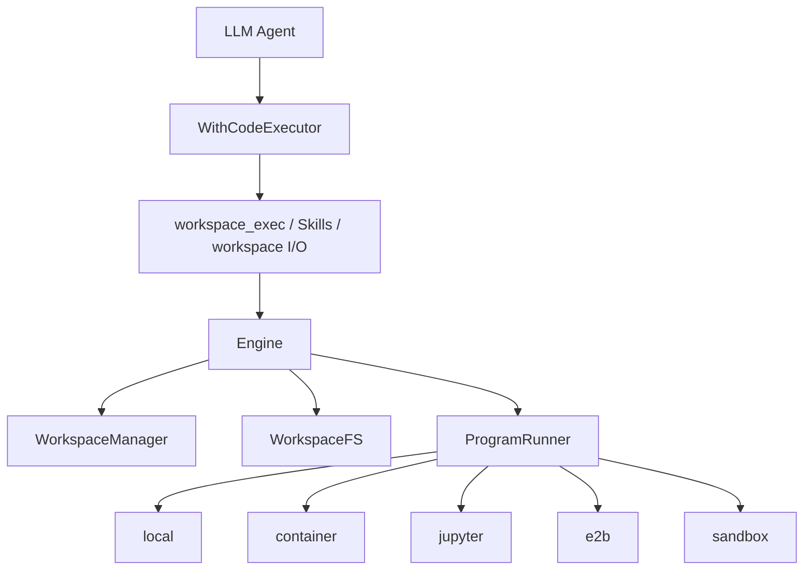

# From Conversation to Execution: How tRPC-Agent-Go Code Executor Builds a Controlled Runtime for Agents

> This article focuses on the Code Executor in tRPC-Agent-Go. It is not just a helper that runs code blocks from model output. It organizes files, commands, workspaces, execution backends, and security boundaries into an execution path that can be described, replaced, and governed.

When LLM applications move from Chat to Agent, model output starts entering tool calls, file processing, and code execution. At that point, a framework no longer only manages prompts and responses. It also needs to manage execution environments, file movement, backend differences, and security boundaries.

That is the problem Code Executor solves.

For a production-grade Agent framework, code execution involves at least three questions: how execution context is organized, how files and artifacts move through the system, how backends can be abstracted across local execution, containers, Jupyter, remote sandboxes, and local OS-level sandboxes, and how security boundaries constrain directories, environment variables, and network access.

tRPC-Agent-Go designs Code Executor around this execution path. This article starts with the risks of Agent code execution, then explains Code Executor, Workspace, Engine, and the trade-offs among the `local`, `container`, `jupyter`, `e2b`, and `sandbox` backends. It ends with backend selection guidance and references.

## 1. From Text Generation to Code Execution

Why does an Agent need to execute code?

Many tasks cannot be completed by model reasoning alone. A user may ask an Agent to analyze a CSV, generate a chart, run unit tests, inspect API usage in a repository, batch-process documents, or save intermediate results as Markdown, JSON, PDF, or images. The answer is not generated directly from model parameters. It depends on runtime computation, the file system, and external tools.

Once an Agent enters execution, the problem changes.

In text generation, the model sees a context window. The framework mostly manages prompt structure, tool schemas, and response parsing. In code execution, the model interacts with an operating-system-shaped world: directories, files, processes, environment variables, networks, package managers, temporary files, output files, exit codes, and timeouts.

This creates four risks.

First, file-system risk. Model-generated code may read host configuration files, SSH keys, or cloud credentials. It may also overwrite files that should not be modified. Even without malicious intent, wrong paths, globs, recursive deletion, and intermediate scripts can cause real damage.

Second, environment-variable risk. Many services put tokens, secrets, endpoints, proxies, and debug switches in environment variables. If executed commands inherit the host process environment by default, model-generated commands may indirectly see these variables or write them into logs and output files.

Third, network risk. Code execution naturally uses the network: installing dependencies, calling APIs, downloading data, pushing repositories, or opening ports. Network access is not inherently bad, but an Agent framework must answer who allowed the code to access what. Otherwise, one tool call can turn local computation into an external side effect.

Fourth, state risk. Agents are often not one-shot scripts. One turn may create intermediate data, the next turn may continue the analysis, and a later turn may save artifacts. If state is never preserved, user experience suffers. If state is preserved without boundaries, stale environments, data mixing, and hard-to-explain behavior appear.

So an Agent does not need only this:

```text
model output -> sh -c -> stdout
```

It needs this:

```text
model/tool intent
-> controlled workspace
-> explicit inputs
-> selected execution backend
-> policy-bounded program run
-> collected outputs / artifacts
```

The important word is controlled. Being able to execute code is only the first step. The framework must also know where execution happens, what can be read or modified, where outputs go, and how backend capabilities are declared.

## 2. Code Executor: From Code Blocks to Execution Paths

The outer interface of tRPC-Agent-Go Code Executor looks simple:

```go
type CodeExecutor interface {
    ExecuteCode(context.Context, CodeExecutionInput) (CodeExecutionResult, error)
    CodeBlockDelimiter() CodeBlockDelimiter
}
```

This interface accepts a code block and returns execution results and output files. It is easy to stop at this API and think of Code Executor as a fenced-code-block runner.

Inside an Agent framework, however, Code Executor has a broader role. It serves at least three execution paths.

The first path is automatic execution of fenced code blocks in the final assistant response. The framework can scan assistant responses, pass runnable fenced code blocks to `ExecuteCode`, and return execution results. This path is useful for demonstrations of model-generated code.

The second path is explicit tool calling, especially `workspace_exec`. This is usually a better production path. The model does not casually place code in the final answer. Instead, it explicitly asks to run a command in the current workspace during tool calling. The execution is represented as a tool call with parameters, result, error, timeout, and auditability.

The third path is application and Skills access to the workspace. `codeexecutor/workspaceio` provides workspace access for business callbacks. Skills scripts can also be written into the workspace and executed there. Code Executor is therefore a shared foundation for model tool calls, framework flows, and application extensions.

Two distinctions matter here.

First, `llmagent.WithCodeExecutor(...)` and fenced-code auto-execution are not the same switch. `llmagent.WithCodeExecutor(...)` configures the Agent's default executor for paths such as `workspace_exec`, Skills, and workspace I/O. If a single `runner.Run(...)` needs a different execution environment, `agent.WithCodeExecutor(...)` can be passed as a `RunOption` to override the default for that run only. Whether the final assistant response is scanned for fenced code blocks is controlled separately by `WithEnableCodeExecutionResponseProcessor(enable bool)`. The response processor is enabled by default, so if you explicitly configure a Code Executor and do not want fenced code blocks in final replies to run automatically, set it to `false`.

Automatic execution requires all of the following:

```text
CodeExecutor is available
AND
EnableCodeExecutionResponseProcessor is enabled
AND
The trimmed final response is exactly one runnable fenced code block
```

For production scenarios that care about security and explainability, execution is often routed through explicit tool calls:

```go
agent := llmagent.New(
    "demo",
    llmagent.WithModel(m),
    llmagent.WithCodeExecutor(sandbox.New()),
    llmagent.WithEnableCodeExecutionResponseProcessor(false),
)
```

This keeps Code Executor available as a runtime for tools and workspaces while disabling final-response scanning. That is the key point: Code Executor is runtime capability for an execution path, not merely code-block handling.

To support these paths, the framework first needs a stable execution context and then a unified way to connect different backends. That is what Workspace and Engine provide.

## 3. Workspace and Engine: Context and Backend Abstraction

### Workspace: Turning Commands into Context

If you only run one command, `cmd`, `args`, `env`, and `cwd` may appear sufficient. Agent execution is usually not an isolated command. It is a workflow around a set of files.

For example, a user uploads `report.pdf`. The Agent needs to place it into the execution environment, run Python to extract content, write intermediate JSON into the working directory, and finally produce `summary.md` and `chart.png`. In the next turn, the user may ask to change the chart type. The Agent should be able to continue from the previous file state.

In this setting, Workspace is not just a temporary directory. It is the state container and file boundary for Agent execution.

tRPC-Agent-Go defines several important workspace directories. `work/inputs/` stores input files prepared before execution, such as uploaded files or materialized `artifact://...` references. `work/` is the main working directory for intermediate files, scripts, and analysis data. `out/` stores final outputs that should be easy to read or save as artifacts. `runs/` stores logs, helper files, and per-run data.

This convention has two values.

First, it gives models and tools a stable collaboration language. The model does not need to know the low-level staging process. It only needs to know that user inputs are usually under `work/inputs/`, intermediate files go under `work/`, and final results go under `out/`.

Second, it lets the framework manage file input and output lifecycles. External files can enter the workspace through message file data, file paths, or `artifact://...` references. After execution, the framework can collect outputs by pattern or save important files into the artifact service.

One practical boundary is important: even when a run reuses the same physical workspace, applications should not treat that as a permanent guarantee.

Files under `work/` and `out/` may still exist in the same physical workspace. If a later execution uses a new workspace, old files should not be assumed to reappear automatically. Files that must survive across new workspaces should be saved as artifacts or persisted by the application layer.

That is the division of responsibility:

- Workspace holds execution-time state so tools, scripts, callbacks, and turns can cooperate around files.
- Artifact stores stable outputs so files can be referenced across workspaces, sessions, or long-term storage.

### Engine: Unifying Backends, Not Security Levels

After Workspace, another question appears: who manages the workspace lifecycle, how do files enter and leave it, and who runs programs? These concerns change for different reasons, so separating lifecycle, file system, and program execution lets different backends reuse the same upper-level toolchain.

tRPC-Agent-Go splits this layer into three interfaces:

```go
type WorkspaceManager interface {
    CreateWorkspace(ctx context.Context, execID string, pol WorkspacePolicy) (Workspace, error)
    Cleanup(ctx context.Context, ws Workspace) error
}

type WorkspaceFS interface {
    PutFiles(ctx context.Context, ws Workspace, files []PutFile) error
    StageDirectory(ctx context.Context, ws Workspace, src, to string, opt StageOptions) error
    Collect(ctx context.Context, ws Workspace, patterns []string) ([]File, error)
    StageInputs(ctx context.Context, ws Workspace, specs []InputSpec) error
    CollectOutputs(ctx context.Context, ws Workspace, spec OutputSpec) (OutputManifest, error)
}

type ProgramRunner interface {
    RunProgram(ctx context.Context, ws Workspace, spec RunProgramSpec) (RunResult, error)
}
```

These interfaces map to three responsibilities:

- `WorkspaceManager` manages workspace lifecycle: creation, reuse, and cleanup.
- `WorkspaceFS` moves files in and out: input staging, output collection, artifact handling, and directory operations.
- `ProgramRunner` runs programs: commands, arguments, environment, cwd, stdin, timeouts, and resource limits.

The `Engine` composes them:

```go
type Engine interface {
    Manager() WorkspaceManager
    FS() WorkspaceFS
    Runner() ProgramRunner
    Describe() Capabilities
}
```

With this design, `workspace_exec`, Skills, and `workspaceio` do not need to know whether the backend is a host directory, Docker container, Jupyter kernel, E2B sandbox, or Linux bubblewrap sandbox. They depend on common workspace and program-runner semantics.

But unified interfaces do not imply equal security.

Both `local` and `sandbox` can implement `ProgramRunner`, but their risk boundaries are very different. `container` and `e2b` can both run commands, but one depends on local Docker configuration while the other depends on a remote provider. `jupyter` is useful for kernel state, but it is not the same as an OS sandbox.

For this reason, Engine also exposes `Capabilities`: `Isolation` describes the isolation shape, `NetworkAllowed` describes network access, `ReadOnlyMount` describes read-only mount support, `Streaming` describes streaming output support, and `MaxDiskBytes` describes disk limits.

`SupportsCleanEnv` is especially important. When `workspace_exec` uses allow/deny command policy, it may rely on a clean environment to avoid bypass through host environment variables, shell startup files, or dynamic linker injection. If a backend does not explicitly declare support for `CleanEnv`, the tool layer should fail closed instead of silently degrading.

The value of this layering is that execution interfaces are unified while capability differences remain explicit.



## 4. Five Backends: From Local to Sandbox

Backend selection is a trade-off among developer convenience, environment consistency, remote isolation, security boundaries, and platform cost. No backend fits every scenario.

| Backend | Execution boundary | Good fit | Main advantage | Main risk or limit |
| --- | --- | --- | --- | --- |
| `local` | Current host user permissions | Local development, trusted tasks, quick debugging | Simple and fast, uses host environment | Almost no isolation; not suitable for untrusted code |
| `container` | Docker / container runtime | Standard service deployment, semi-trusted execution | Reproducible environment, closer to production | Security depends on container config, mounts, and runtime hardening |
| `jupyter` | Jupyter kernel / notebook semantics | Data analysis, interactive Python, long-lived computation state | Kernel state is natural for analysis | A compute session, not strong isolation |
| `e2b` | External cloud sandbox provider | Cloud execution, remote isolation, temporary environments | Isolation and lifecycle delegated to provider | Depends on external service, network, provider capability, and cost |
| `sandbox` | Local OS-level sandbox; bubblewrap on Linux, Seatbelt / `sandbox-exec` on macOS | Local execution with tighter file/network/env boundaries | Constrains local commands without Docker | Managed OS sandbox is not implemented on Windows; Linux backends inside Docker/K8s may need outer runtime support for namespaces and mounts |

### local: Cheapest and Easiest to Misuse

The `local` backend executes code directly on the host. It is useful for local validation, unit tests, demos, trusted input, and quick development. It does not start containers or depend on remote services, so debugging is simple.

Its boundary is also clear: `local` provides no security isolation. Model-generated commands run with the current user's permissions. Its correct role is a convenient executor for trusted environments, not a lightweight sandbox.

### container: A Common Engineering Middle Layer

The `container` backend runs execution inside Docker or another container runtime. Compared with local execution, it can package dependencies, file-system view, and runtime environment into a container. It is useful for service deployment, semi-trusted tasks, and reproducible environments.

But containers do not automatically mean security. The boundary depends on image contents, user permissions, mounts, capabilities, seccomp profiles, network configuration, Docker socket exposure, and runtime hardening. Containers are good for engineering standardization and some isolation, while production-grade security still needs platform policy.

### jupyter: Built for Interactive Computation

The `jupyter` backend fits notebook or kernel-style execution, especially Python data analysis. Its main advantage is not security. It is the ability to keep computation state: variables, imports, charts, and analysis steps can continue naturally in the kernel.

It is therefore suitable for data-science Agents, analysis assistants, and reporting scenarios. Kernel state also introduces stale state and reproducibility issues. If a task requires strong isolation, strong reproducibility, or untrusted code execution, Jupyter should not be treated as a sandbox.

### e2b: Delegating Execution to an External Provider

The `e2b` backend follows a remote/cloud sandbox model. Code runs in an external isolated environment, while the framework manages execution and files through the provider API. For applications, this reduces the cost of building execution environments, reclaiming resources, and providing baseline isolation.

It fits cloud Agents, temporary computation environments, and remote isolation scenarios. The cost is dependency on network access, authentication, provider capability, pricing, and observability.

### sandbox: Local OS-Level Security Boundary

The `sandbox` backend is a security-focused case. It is not a remote platform and not a Docker container. It uses OS-level mechanisms to constrain which files a command can see, which paths it can write, whether it has network access, and which environment variables are injected. The managed backend uses `bubblewrap` on Linux and `/usr/bin/sandbox-exec` with Seatbelt profiles on macOS; managed OS sandboxing for Windows is not implemented.

The next section expands this backend.

## 5. Sandbox as a Runtime Boundary

First, sandbox is one backend in Code Executor, not Code Executor itself.

Code Executor is the execution system. Sandbox is one backend that emphasizes security boundaries. Without sandbox, Code Executor can still run through local, container, jupyter, or e2b backends. With sandbox, Code Executor can answer, at the local OS level, what model-generated commands can read or modify.

### File System: What Is Readable, Writable, or Hidden

tRPC-Agent-Go sandbox permissions revolve around `PermissionProfile`. A profile combines file-system policy and network policy so callers do not create contradictory configurations.

`ReadOnlyProfile` makes the host root file system read-only and restricts network access. `WorkspaceWriteProfile` is the default managed profile: root is read-only, workspace and working directories are writable, and network access is restricted. `DangerFullAccessProfile` explicitly disables sandboxing and enables network access, and should only be used for fully trusted cases that require host permissions. `ExternalSandboxProfile` indicates that isolation is provided externally, such as by a container, remote platform, or upper-layer system.

`WorkspaceWriteProfile` maps naturally to Agent execution: the outside world is read-only by default, while session workspace directories such as `work`, `out`, `runs`, `skills`, `home`, and `tmp` are writable.

Callers can add explicit path grants through `WithReadPaths` and `WithWritePaths`, or block sensitive paths through `WithNoAccessPaths` and `WithNoAccessGlobs`. These are runtime mount and path rules, not prompt instructions.

On Linux, the backend starts from a read-only root:

```text
--ro-bind / /
```

It then remounts allowed workspace paths as writable and hides protected paths. The model is important: it is not "everything writable, then deny some paths." It is "read-only by default, then explicitly open writable paths."

### Network: Restricted by Default, Enabled Explicitly

Network policy is binary:

- `NetworkRestricted` requires the backend to block outbound network capability.
- `NetworkEnabled` allows commands to use the host network.

Managed profiles use `NetworkRestricted` by default. On the Linux bubblewrap backend, restricted network adds:

```text
--unshare-net
```

The command enters a new network namespace and cannot directly use the host network. When `NetworkEnabled` is selected, this flag is omitted and the command uses the host network.

The design intentionally starts with a clear local boundary: can this execution access the network or not? Finer egress controls can be provided by proxies, remote platforms, container network policies, or application gateways.

### Environment Variables: Avoid Inheriting Host Secrets Accidentally

Environment variables are an underrated execution risk. Many secrets live in process environments rather than files.

The sandbox runtime has `ShellEnvironmentPolicy`, which controls environment inheritance, filtering, overrides, and runtime injection. The Linux bubblewrap backend uses:

```text
--clearenv
--setenv KEY VALUE
```

The sandboxed command does not naturally inherit the host process environment. The runtime first clears the environment and then injects the computed variables through `--setenv`. It also injects stable workspace variables such as `HOME`, `TMPDIR`, `WORKSPACE_DIR`, and `OUTPUT_DIR`.

This does not mean host variables are never inherited by default. In source code, an empty `ShellEnvironmentPolicy` normalizes to `ShellEnvironmentPolicyInheritAll`. It still injects variables explicitly after `--clearenv`. Production environments that want to reduce secret exposure should configure a stricter policy, such as `ShellEnvironmentPolicyInheritCore` or `ShellEnvironmentPolicyInheritNone`, enable `ApplyDefaultExcludes`, use `IncludeOnly` as an allow-list, or inject only the minimal required variables through `Set`.

This mirrors the `CleanEnv` capability in `workspace_exec`. If command policy depends on a clean environment, the backend must really support it.

### Processes and OS Capabilities

On Linux, tRPC-Agent-Go sandbox constructs the execution environment with bubblewrap. Typical arguments include:

```text
--die-with-parent
--unshare-user
--unshare-pid
--new-session
--ro-bind / /
--dev /dev
--proc /proc
--unshare-net
--clearenv
--chdir <cwd>
```

These flags correspond to OS-level boundaries: user namespaces, PID namespaces, mount views, network namespaces, separate sessions, and cleared environments. They constrain running processes and child processes, not just command strings before execution.

The sandbox runtime also performs preflight checks. It verifies that `bwrap` exists and tries a small command to check whether the current environment supports required namespace and mount operations. If preflight fails, the managed profile fails before the command starts instead of silently falling back to unsafe execution.

That behavior matters. Security capability should not look enabled while being ineffective. Failing closed exposes deployment issues early, but it preserves the meaning of the security boundary.

### Comparison with Claude Code, Codex, and OpenAI Agents SDK

This comparison only illustrates design direction. These products and SDKs evolve quickly, so production decisions should re-check the public references.

Code-oriented Agent products and SDKs are moving from simple tool execution to controlled runtime environments.

Claude Code's sandboxed Bash tool places Bash commands inside file-system and network boundaries. It separates permission approval from runtime sandboxing: approval decides whether a tool may run, while the sandbox decides what the command can access after it starts. macOS uses Seatbelt, Linux/WSL2 uses bubblewrap, and the documentation includes network and credential protection options.

Codex also separates sandbox mode from approval policy. Sandbox mode describes what a command can technically do, such as read-only, workspace-write, or danger-full-access. Approval policy describes which actions need user confirmation. The core idea is that sandboxing is a technical boundary, while approval is a decision mechanism for crossing boundaries.

OpenAI Agents SDK Sandbox Agents emphasize architectural separation between orchestration and sandbox workspaces. The Agent orchestration layer can run in your infrastructure, while file systems, command execution, and artifact generation live inside a sandbox workspace.

The common lesson is: do not treat "the model was told not to do bad things" as a security mechanism. Real execution safety needs runtime boundaries, permission policy, approval flow, and backend capability declarations.

## 6. Engineering Trade-offs and Backend Selection

Code Executor has several easy-to-miss trade-offs.

### Trade-off 1: Do Not Bind Directly to One Sandbox

If we only look at security, it may seem that every execution should always use sandbox. Agent use cases are broader than that.

Local development needs fast feedback, so `local` is convenient. Production services may already have container platforms, so `container` is natural. Data analysis benefits from kernel state, so `jupyter` fits. Cloud execution can use `e2b`. Local high-constraint scenarios are where `sandbox` fits best.

If the framework directly bound itself to one sandbox, deployment flexibility would suffer. tRPC-Agent-Go chooses a lower-level abstraction: workspace, file system, and program execution are abstracted so different backends can plug into the same upper-level toolchain.

### Trade-off 2: Capabilities Must Be Explicit

After unifying interfaces, the dangerous misconception is that all implementations have the same capabilities. They do not.

For example, `RunProgramSpec.CleanEnv` only matters if the backend can actually start programs with a clean environment. The framework declares this through `Capabilities.SupportsCleanEnv`. If `workspace_exec` enables allow/deny command policy and the backend does not declare support, it should fail closed.

This is conservative, but it prevents security policy from silently losing effect on different backends.

### Trade-off 3: Command Policy Cannot Be Only String Allowlisting

`workspace_exec` supports allowed and denied commands, but it does not simply use `strings.Contains`. Commands are parsed with shellsafe, limited to relatively simple pipeline structures, and reject redirection, command substitution, variable expansion, subshells, brace expansion, and leading environment assignments that can bypass policy.

It also rejects shell wrappers and re-execution built-ins such as `sh`, `bash`, `eval`, `exec`, `xargs`, `env`, and `sudo`. If `sh -c` or `eval` were allowed, a command allow-list would quickly become meaningless.

Command policy and sandboxing are complementary:

- Command policy limits what command shapes the model may request.
- Sandbox limits what resources the command can access after it starts.

They do not replace each other.

### Trade-off 4: Developer Convenience and Security Boundaries Need Clear Names

`DangerFullAccessProfile` is intentionally blunt. It is not called `DefaultProfile` or `LocalProfile`. It tells the caller that sandboxing is being disabled.

Similarly, the `local` backend comments explicitly describe it as unsafe. Clear naming matters because many risks in Agent frameworks come not from missing features, but from features that look like safety mechanisms while actually being developer conveniences.

A good framework should allow dangerous paths when necessary, but it should not make them look harmless.

### Backend Selection

When adding Code Executor to an application, start from decision questions instead of asking which backend is strongest.

| Question | Likely choice | Reason |
| --- | --- | --- |
| Are inputs, commands, or user files untrusted? | Avoid `local`; consider `sandbox`, `container`, or `e2b` | Untrusted execution needs runtime boundaries, not only prompts or command descriptions |
| Must execution happen locally while constraining files, network, and environment variables? | `sandbox` | Local OS-level boundary; bubblewrap on Linux, Seatbelt / `sandbox-exec` on macOS |
| Do you need a temporary cloud-isolated environment and can accept external provider dependency? | `e2b` | Remote sandbox and elastic execution, with auth, cost, and provider capability trade-offs |
| Do you already have containerized deployment and need fixed dependencies? | `container` | Good for engineering standardization; security depends on container hardening |
| Is the task data analysis, chart generation, interactive Python, or long-lived computation? | `jupyter` | Kernel state fits analysis, but should not be treated as strong isolation |
| Is it only a local demo, development debugging, or a fully trusted script? | `local` | Lowest cost and easiest debugging, but unsuitable for untrusted code |
| Does the task need network access to install dependencies or call external services? | Explicitly choose a network-enabled policy or backend | Keep network restricted by default and audit exceptions |

Several practical suggestions follow.

First, if you only want the model to execute commands through `workspace_exec` and do not want fenced code blocks in final replies to run automatically, disable the response processor:

```go
llmagent.WithEnableCodeExecutionResponseProcessor(false)
```

Second, use artifacts for files that must be reused across turns or workspaces. Do not treat accidental reuse of a physical workspace as a persistence contract.

Third, when configuring command policy for `workspace_exec`, check the backend's `SupportsCleanEnv`. If the policy depends on a clean environment and the backend does not declare support, prefer failure over silent downgrade.

Fourth, do not enable network access by default. Many code-execution tasks only process existing files. When dependency installation or external service access is needed, enable network access explicitly or use a backend better suited to that requirement.

Fifth, keep secrets in the orchestration layer or business service whenever possible. Only inject the minimum credentials required by executed programs, and consider whether logs, stdout/stderr, or artifacts may expose them.

Sixth, make backend selection part of product or platform policy. Code Executor is flexible, but production governance needs defaults: which scenarios may use local execution, which may use containers, and which must fail if sandbox capability is unavailable.

## 7. The Essence of Code Executor

So what is Code Executor?

It is not a small feature for "letting the model run code." That is only the surface.

In an Agent framework, Code Executor systematizes execution side effects. Workspace manages files and state. Engine abstracts different backends. Capabilities expose differences. `workspace_exec` and `workspaceio` connect execution capability to model tool calls and application callbacks.

tRPC-Agent-Go Code Executor can be summarized as:

> It moves Agents from text generation into controlled execution, while putting execution side effects into a runtime system whose boundaries can be described, backends can be replaced, and policies can be governed.

Sandbox is an important place where Code Executor enforces security boundaries, but it is not the whole Code Executor. The value of Code Executor is that sandbox, container, or remote providers can become replaceable backends in the same execution system.

## 8. References

- [tRPC-Agent-Go GitHub repository](https://github.com/trpc-group/trpc-agent-go)
- [tRPC-Agent-Go CodeExecutor documentation](https://github.com/trpc-group/trpc-agent-go/blob/main/docs/mkdocs/en/codeexecutor.md)
- [tRPC-Agent-Go codeexecutor source directory](https://github.com/trpc-group/trpc-agent-go/tree/main/codeexecutor)
- [tRPC-Agent-Go workspace_exec tool source directory](https://github.com/trpc-group/trpc-agent-go/tree/main/tool/workspaceexec)
- [tRPC-Agent-Go sandbox backend documentation](https://github.com/trpc-group/trpc-agent-go/blob/main/codeexecutor/sandbox/docs/README.md)
- [Claude Code: Configure the sandboxed Bash tool](https://code.claude.com/docs/en/sandboxing)
- [Anthropic Engineering: Making Claude Code more secure and autonomous with sandboxing](https://www.anthropic.com/engineering/claude-code-sandboxing)
- [OpenAI Developers: Codex sandboxing concepts](https://developers.openai.com/codex/concepts/sandboxing)
- [OpenAI Developers: Codex agent approvals & security](https://developers.openai.com/codex/agent-approvals-security)
- [OpenAI Codex GitHub: Linux sandbox implementation notes](https://github.com/openai/codex/blob/main/codex-rs/linux-sandbox/README.md)
- [OpenAI API Docs: Sandbox Agents](https://developers.openai.com/api/docs/guides/agents/sandboxes)
- [OpenAI Agents SDK Python: Sandbox Agents concepts](https://openai.github.io/openai-agents-python/sandbox/guide/)
- [bubblewrap GitHub repository](https://github.com/containers/bubblewrap)
- [Linux namespaces manual](https://man7.org/linux/man-pages/man7/namespaces.7.html)
- [Docker container security documentation](https://docs.docker.com/engine/security/)
- [E2B Documentation](https://e2b.dev/docs)
