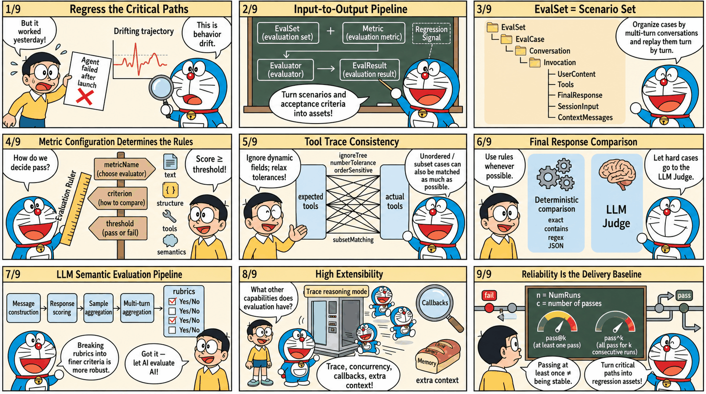

# tRPC-Agent-Go: A Complete Guide to AI Agent Automated Evaluation Paradigms and Engineering Practice

> When Agents enter business-critical paths, the most dangerous issue is often not an obvious failure, but behavior drift that is hard to notice. One correct output cannot prove that the next version will still be reliable. Fine-tuning a model or prompt, updating tools or knowledge bases, and adjusting orchestration logic can all change key decisions and output forms without warning. Evaluation needs to solidify key scenarios and acceptance criteria into reproducible regression signals, so issues are exposed and locatable before release. This article focuses on tRPC-Agent-Go evaluation capabilities. Starting from a minimal runnable example, it introduces how to organize evaluation assets with evaluation sets and metrics, persist results, choose between deterministic evaluation and LLM Judge semantic evaluation, and apply engineering integration practices that bring regression validation into local debugging and pipeline regression.

> [tRPC-Agent-Go](https://github.com/trpc-group/trpc-agent-go/) is an autonomous multi-Agent framework for Go. It provides tool calling, session and memory management, artifact management, multi-Agent collaboration, graph orchestration, knowledge bases, observability, and more. tRPC-Agent-Go grows with community support. Stars are welcome.

tRPC-Agent-Go builds a complete automated evaluation system around evaluation sets and metrics. It unifies multi-turn conversations, tool calls, and final outputs into a repeatable evaluation process, and produces structured evaluation results to support regression validation. The framework integrates multiple metric types, including deterministic static evaluation, LLM Judge semantic evaluation, and rubric-based evaluation. Together with concurrent inference, Trace mode, callbacks, and context injection, it aims to provide end-to-end support from Agent development to regression testing, helping developers predict and catch potential behavior drift during version iteration.



## Background

As large-model capabilities and tool ecosystems mature, Agent systems are moving from experimental scenarios into business-critical paths. Release cadence keeps increasing, but delivery quality no longer depends on one correct demo output. It depends on stability and regressibility while models, prompts, tools, knowledge bases, and orchestration continue to evolve. During version iteration, key behaviors can drift subtly, such as changes in tool selection, parameter structures, or output forms. Stable regression is therefore an urgent problem to solve.

Unlike deterministic systems, Agent system issues usually appear as probabilistic deviations. Reproduction and replay are difficult, and diagnosis must cross logs, traces, and external dependencies, which significantly increases the cost of closing the loop.

The core purpose of evaluation is to turn key scenarios and acceptance criteria into assets and preserve them as sustainable regression signals. tRPC-Agent-Go provides out-of-the-box evaluation capabilities. It supports asset management and result persistence based on evaluation sets and metrics, includes static evaluators and LLM Judge evaluators, and provides multi-turn conversation evaluation, repeated runs, `Trace` evaluation mode, callbacks, context injection, and concurrent inference, supporting engineering integration for local debugging and pipeline regression.

## Quick Start

This section provides a minimal example to help you quickly understand how to use tRPC-Agent-Go evaluation.

This example uses local file evaluation. The complete code is at [examples/evaluation/local](https://github.com/trpc-group/trpc-agent-go/tree/main/examples/evaluation/local). The framework also provides an in-memory evaluation implementation. See [examples/evaluation/inmemory](https://github.com/trpc-group/trpc-agent-go/tree/main/examples/evaluation/inmemory) for the complete example.

### Environment Setup

- Go 1.24+
- Accessible LLM model service

Configure the model service environment variables before running.

```bash
export OPENAI_API_KEY="sk-xxx"
# Optional. Defaults to https://api.openai.com/v1 when not set.
export OPENAI_BASE_URL="https://api.deepseek.com/v1"
```

### Code Example

Two core code snippets are provided below, one for building the Agent and one for running the evaluation.

#### Agent Snippet

This snippet builds a minimal evaluable Agent. It mounts a function tool named `calculator` through `llmagent` and uses `instruction` to require every math question to use tool calls, making tool traces stable and easy to align during evaluation.

```go
import (
	"trpc.group/trpc-go/trpc-agent-go/agent"
	"trpc.group/trpc-go/trpc-agent-go/agent/llmagent"
	"trpc.group/trpc-go/trpc-agent-go/model"
	"trpc.group/trpc-go/trpc-agent-go/model/openai"
	"trpc.group/trpc-go/trpc-agent-go/tool"
	"trpc.group/trpc-go/trpc-agent-go/tool/function"
)

func newCalculatorAgent(modelName string, stream bool) agent.Agent {
	calculatorTool := function.NewFunctionTool(
		calculate,
		function.WithName("calculator"),
		function.WithDescription("Perform arithmetic operations including add, subtract, multiply, and divide."),
	)
	genCfg := model.GenerationConfig{
		MaxTokens:   intPtr(512),
		Temperature: floatPtr(1.0),
		Stream:      stream,
	}
	return llmagent.New(
		"calculator-agent",
		llmagent.WithModel(openai.New(modelName)),
		llmagent.WithTools([]tool.Tool{calculatorTool}),
		llmagent.WithInstruction("Use the calculator function tool for every math problem."),
		llmagent.WithDescription("Calculator agent demonstrating function calling for evaluation workflow."),
		llmagent.WithGenerationConfig(genCfg),
	)
}

type calculatorArgs struct {
	Operation string  `json:"operation"`
	A         float64 `json:"a"`
	B         float64 `json:"b"`
}

type calculatorResult struct {
	Operation string  `json:"operation"`
	A         float64 `json:"a"`
	B         float64 `json:"b"`
	Result    float64 `json:"result"`
}

func calculate(_ context.Context, args calculatorArgs) (calculatorResult, error) {
	var result float64
	switch strings.ToLower(args.Operation) {
	case "add", "+":
		result = args.A + args.B
	case "subtract", "-":
		result = args.A - args.B
	case "multiply", "*":
		result = args.A * args.B
	case "divide", "/":
		if args.B != 0 {
			result = args.A / args.B
		}
	}
	return calculatorResult{
		Operation: args.Operation,
		A:         args.A,
		B:         args.B,
		Result:    result,
	}, nil
}
```

#### Evaluation Snippet

This snippet creates a runnable Runner from the Agent, configures three local Managers to read the evaluation set EvalSet and evaluation metric Metric and write result files, then creates an AgentEvaluator through `evaluation.New` and calls `Evaluate` to run the specified evaluation set.

```go
import (
	"trpc.group/trpc-go/trpc-agent-go/evaluation"
	"trpc.group/trpc-go/trpc-agent-go/evaluation/evalresult"
	evalresultlocal "trpc.group/trpc-go/trpc-agent-go/evaluation/evalresult/local"
	"trpc.group/trpc-go/trpc-agent-go/evaluation/evalset"
	evalsetlocal "trpc.group/trpc-go/trpc-agent-go/evaluation/evalset/local"
	"trpc.group/trpc-go/trpc-agent-go/evaluation/evaluator/registry"
	"trpc.group/trpc-go/trpc-agent-go/evaluation/metric"
	metriclocal "trpc.group/trpc-go/trpc-agent-go/evaluation/metric/local"
	"trpc.group/trpc-go/trpc-agent-go/runner"
)

const (
	appName   = "math-eval-app"
	modelName = "deepseek-chat"
	streaming = true
	evalSetID = "math-basic"
	dataDir   = "./data"
	outputDir = "./output"
)

// Create a Runner from the Agent.
runner := runner.NewRunner(appName, newCalculatorAgent(modelName, streaming))
defer runner.Close()
// Create evaluation managers and evaluator registry.
evalSetManager := evalsetlocal.New(evalset.WithBaseDir(dataDir))
metricManager := metriclocal.New(metric.WithBaseDir(dataDir))
evalResultManager := evalresultlocal.New(evalresult.WithBaseDir(outputDir))
registry := registry.New()
// Create AgentEvaluator.
agentEvaluator, err := evaluation.New(
	appName,
	runner,
	evaluation.WithEvalSetManager(evalSetManager),
	evaluation.WithMetricManager(metricManager),
	evaluation.WithEvalResultManager(evalResultManager),
	evaluation.WithRegistry(registry),
)
if err != nil {
	log.Fatalf("create evaluator: %v", err)
}
defer agentEvaluator.Close()
// Run evaluation.
result, err := agentEvaluator.Evaluate(ctx, evalSetID)
if err != nil {
	log.Fatalf("evaluate: %v", err)
}
// Parse evaluation results.
fmt.Println("✅ Evaluation completed with local storage")
fmt.Printf("App: %s\n", result.AppName)
fmt.Printf("Eval Set: %s\n", result.EvalSetID)
fmt.Printf("Overall Status: %s\n", result.OverallStatus)
```

### Evaluation Files

Evaluation files include an evaluation set file and an evaluation metric file. They are organized as follows.

```bash
data/
  math-eval-app/
    math-basic.evalset.json # Evaluation set file.
    math-basic.metrics.json # Evaluation metric file.
```

#### Evaluation Set File

The evaluation set file path is `data/math-eval-app/math-basic.evalset.json`, which holds evaluation cases. During inference, cases are traversed by `evalCases`, and each case's `conversation` is traversed turn by turn, using `userContent` as input.

The following evaluation set file example defines an evaluation set named `math-basic`. During evaluation, `evalSetId` selects the set to run, and `evalCases` holds the list of cases. This example has only one case, `calc_add`. During inference, a session is created from `sessionInput`, and inference then runs in the order of `conversation`. This example has only one turn, `calc_add-1`, whose input comes from `userContent`, asking the Agent to process `calc add 2 3`. This case selects the tool trajectory evaluator, so the expected tool trace is written in `tools`. It expresses a concrete requirement: the Agent needs to call a tool named `calculator`, the arguments are addition and two operands, and the tool result must also match. Tool `id` is usually generated at runtime and is not used for matching.

```json
{
  "evalSetId": "math-basic",
  "name": "math-basic",
  "evalCases": [
    {
      "evalId": "calc_add",
      "conversation": [
        {
          "invocationId": "calc_add-1",
          "userContent": {
            "role": "user",
            "content": "calc add 2 3"
          },
          "tools": [
            {
              "id": "tool_use_1",
              "name": "calculator",
              "arguments": {
                "operation": "add",
                "a": 2,
                "b": 3
              },
              "result": {
                "a": 2,
                "b": 3,
                "operation": "add",
                "result": 5
              }
            }
          ]
        }
      ],
      "sessionInput": {
        "appName": "math-eval-app",
        "userId": "user"
      }
    }
  ],
  "creationTimestamp": 1761134484.9804401
}
```

#### Evaluation Metric File

The evaluation metric file path is `data/math-eval-app/math-basic.metrics.json`, which describes evaluation metrics. It selects the evaluator by `metricName`, describes criteria with `criterion`, and defines the threshold with `threshold`. A single file can configure multiple metrics, and the framework executes them in order.

This section configures only the tool trajectory evaluator `tool_trajectory_avg_score`, comparing tool traces for each turn. Tool `id` is usually generated at runtime and is not used for matching.

This metric compares tool calls turn by turn. If the tool name, arguments, and result all match, the score is 1. If they do not match, the score is 0. The total score is the average across turns, and then it is compared with `threshold` to determine pass or fail. When `threshold` is set to 1.0, every turn must match.

```json
[
  {
    "metricName": "tool_trajectory_avg_score",
    "threshold": 1.0
  }
]
```

### Run Evaluation

```bash
# Set environment variables.
export OPENAI_API_KEY="sk-xxx"
# Optional. Defaults to https://api.openai.com/v1 when not set.
export OPENAI_BASE_URL="https://api.deepseek.com/v1"

# Run evaluation.
go run .
```

When running evaluation, the framework reads the evaluation set file and evaluation metric file, calls the Runner and captures responses and tool calls during inference, then completes scoring according to the evaluation metrics and writes the evaluation result file.

### View Evaluation Results

Results are written to `output/math-eval-app/`, with filenames like `math-eval-app_math-basic_<uuid>.evalset_result.json`.

The result file retains both actual and expected traces. As long as the tool trace meets the metric requirements, the evaluation result is marked as passed.

```json
{
  "evalSetResultId": "math-eval-app_math-basic_538cdf6e-925d-41cf-943b-2849982b195e",
  "evalSetResultName": "math-eval-app_math-basic_538cdf6e-925d-41cf-943b-2849982b195e",
  "evalSetId": "math-basic",
  "evalCaseResults": [
    {
      "evalSetId": "math-basic",
      "evalId": "calc_add",
      "finalEvalStatus": "passed",
      "overallEvalMetricResults": [
        {
          "metricName": "tool_trajectory_avg_score",
          "score": 1,
          "evalStatus": "passed",
          "threshold": 1
        }
      ],
      "evalMetricResultPerInvocation": [
        {
          "actualInvocation": {
            "invocationId": "5cc1f162-37e6-4d07-90e9-eb3ec5205b8d",
            "userContent": {
              "role": "user",
              "content": "calc add 2 3"
            },
            "tools": [
              {
                "id": "call_00_etTEEthmCocxvq7r3m2LJRXf",
                "name": "calculator",
                "arguments": {
                  "a": 2,
                  "b": 3,
                  "operation": "add"
                },
                "result": {
                  "a": 2,
                  "b": 3,
                  "operation": "add",
                  "result": 5
                }
              }
            ]
          },
          "expectedInvocation": {
            "invocationId": "calc_add-1",
            "userContent": {
              "role": "user",
              "content": "calc add 2 3"
            },
            "tools": [
              {
                "id": "tool_use_1",
                "name": "calculator",
                "arguments": {
                  "a": 2,
                  "b": 3,
                  "operation": "add"
                },
                "result": {
                  "a": 2,
                  "b": 3,
                  "operation": "add",
                  "result": 5
                }
              }
            ]
          },
          "evalMetricResults": [
            {
              "metricName": "tool_trajectory_avg_score",
              "score": 1,
              "evalStatus": "passed",
              "threshold": 1,
              "details": {
                "score": 1
              }
            }
          ]
        }
      ],
      "sessionId": "19877398-9586-4a97-b1d3-f8ce636ea54f",
      "userId": "user"
    }
  ],
  "creationTimestamp": 1766455261.342534
}
```

## Core Concepts

As shown below, the framework standardizes the Agent runtime process through a unified evaluation flow. Evaluation input consists of the evaluation set EvalSet and evaluation metric Metric, and evaluation output is the evaluation result EvalResult.


- **Evaluation Set EvalSet** describes the scenarios covered by evaluation and provides evaluation input. Each case organizes Invocation by turn and contains user input plus expected `tools` traces or `finalResponse`.
- **Evaluation Metric Metric** defines evaluation metric configuration, including `metricName`, `criterion`, and `threshold`. `metricName` selects the evaluator implementation, `criterion` describes the evaluation criteria, and `threshold` defines the threshold.
- **Evaluator** reads actual and expected traces, computes `score` according to `criterion`, and compares it with `threshold` to determine pass or fail.
- **Evaluator Registry** maintains the mapping between `metricName` and Evaluator. Built-in evaluators and custom evaluators are both integrated through it.
- **Evaluation Service** runs cases, collects traces, calls evaluators for scoring, and returns evaluation results.
- **AgentEvaluator** is created through `evaluation.New` and injects dependencies such as Runner, Managers, and Registry. It exposes the `Evaluate` method to the user integration layer.

A typical evaluation run includes the following steps.

1. AgentEvaluator reads the EvalSet from EvalSetManager according to `evalSetID`, and reads Metric configuration from MetricManager.
2. Service drives Runner to execute each case and collects the actual Invocation list.
3. Service obtains an Evaluator from Registry for each Metric and computes scores.
4. Service aggregates scores and statuses to generate evaluation results.
5. AgentEvaluator saves results through EvalResultManager. Local mode writes local files, while inmemory mode keeps results in memory.

## Usage

### Evaluation Set EvalSet

EvalSet describes the set of scenarios covered by evaluation and provides evaluation input. Each scenario corresponds to an evaluation case EvalCase, and EvalCase organizes Invocation by turn. During evaluation, Service drives Runner inference according to the EvalCase `conversation`, and then passes the actual traces produced by inference and the expected traces in EvalSet to Evaluator for comparison and scoring.

#### Structure Definition

EvalSet is a collection of evaluation cases. Each case is represented by EvalCase. Conversation inside a case organizes Invocation by turn and describes user input and optional expected information. The structure definition is as follows.

```go
import (
	"trpc.group/trpc-go/trpc-agent-go/evaluation/epochtime"
	"trpc.group/trpc-go/trpc-agent-go/model"
)

// EvalSet represents an evaluation set, which organizes a group of evaluation cases.
type EvalSet struct {
	EvalSetID         string               // EvalSetID is the evaluation set identifier.
	Name              string               // Name is the evaluation set name.
	Description       string               // Description is the evaluation set description, optional.
	EvalCases         []*EvalCase          // EvalCases is the list of evaluation cases, required.
	CreationTimestamp *epochtime.EpochTime // CreationTimestamp is the creation timestamp, optional.
}

// EvalCase represents a single evaluation case.
type EvalCase struct {
	EvalID            string               // EvalID is the case identifier.
	EvalMode          EvalMode             // EvalMode is the case mode, optional and can be empty or trace.
	ContextMessages   []*model.Message     // ContextMessages are context messages, optional.
	Conversation      []*Invocation        // Conversation is the multi-turn interaction sequence, required.
	SessionInput      *SessionInput        // SessionInput is session initialization information, required.
	CreationTimestamp *epochtime.EpochTime // CreationTimestamp is the creation timestamp, optional.
}

// Invocation represents one turn in a conversation.
type Invocation struct {
	InvocationID          string               // InvocationID is the turn identifier, optional.
	UserContent           *model.Message       // UserContent is the user input for this turn, required.
	FinalResponse         *model.Message       // FinalResponse is the final response, optional.
	Tools                 []*Tool              // Tools are tool traces, optional.
	IntermediateResponses []*model.Message     // IntermediateResponses are intermediate responses, optional.
	CreationTimestamp     *epochtime.EpochTime // CreationTimestamp is the creation timestamp, optional.
}

// Tool represents one tool call and its result.
type Tool struct {
	ID        string // ID is the tool call identifier, optional.
	Name      string // Name is the tool name, required.
	Arguments any    // Arguments are tool inputs, optional.
	Result    any    // Result is tool output, optional.
}

// SessionInput represents session initialization information.
type SessionInput struct {
	AppName string         // AppName is the application name, optional.
	UserID  string         // UserID is the user identifier, required.
	State   map[string]any // State is the initial session state, optional.
}
```

EvalSet is identified by `evalSetId` and contains multiple EvalCases. Each case is identified by `evalId`.

During inference, `userContent` is read as input according to the turns in `conversation`. `sessionInput.userId` is used to create a session. When needed, initial state can be injected through `sessionInput.state`, and `contextMessages` are injected as additional context before each inference.

`tools` and `finalResponse` in EvalSet describe tool traces and final responses. Whether they need to be filled in depends on the selected evaluation metrics. In default mode, they are usually used as expected information. In `trace` mode, they represent existing traces.

An empty `evalMode` means default mode. In this mode, live inference is run and tool traces and final responses are collected. When `evalMode` is `trace`, inference is skipped and existing traces in `conversation` are used directly for evaluation.

#### EvalSet Manager

EvalSetManager is the storage abstraction for EvalSet and separates evaluation case assets from code. By switching implementations, you can choose local file storage or in-memory storage, or implement the interface yourself to connect to a database or configuration platform.

##### Interface Definition

The EvalSetManager interface is defined as follows.

```go
type Manager interface {
	// Get retrieves the evaluation set.
	Get(ctx context.Context, appName, evalSetID string) (*EvalSet, error)
	// Create creates the evaluation set.
	Create(ctx context.Context, appName, evalSetID string) (*EvalSet, error)
	// List lists evaluation sets.
	List(ctx context.Context, appName string) ([]string, error)
	// Delete deletes the evaluation set.
	Delete(ctx context.Context, appName, evalSetID string) error
	// GetCase retrieves an evaluation case.
	GetCase(ctx context.Context, appName, evalSetID, evalCaseID string) (*EvalCase, error)
	// AddCase adds an evaluation case.
	AddCase(ctx context.Context, appName, evalSetID string, evalCase *EvalCase) error
	// UpdateCase updates an evaluation case.
	UpdateCase(ctx context.Context, appName, evalSetID string, evalCase *EvalCase) error
	// DeleteCase deletes an evaluation case.
	DeleteCase(ctx context.Context, appName, evalSetID, evalCaseID string) error
}
```

If you want to read EvalSet from a database, object storage, or configuration platform, you can implement this interface and inject it when creating AgentEvaluator.

```go
import (
	"trpc.group/trpc-go/trpc-agent-go/evaluation"
)

evalSetManager := myevalset.New()
agentEvaluator, err := evaluation.New(
	appName,
	runner,
	evaluation.WithEvalSetManager(evalSetManager),
)
```

##### InMemory Implementation

The framework provides an in-memory implementation of EvalSetManager, suitable for dynamically building or temporarily maintaining evaluation sets in code. This implementation is concurrency-safe, with read and write protected by locks. To prevent callers from accidentally modifying internal data, read interfaces return deep-copy replicas.

##### Local Implementation

The framework provides a local file implementation of EvalSetManager, suitable for keeping EvalSet as a versioned evaluation asset.

This implementation is concurrency-safe, with read and write protected by locks. During writes, it uses a temporary file and renames it after success, reducing the risk of file corruption caused by exceptions.

The Local implementation uses `BaseDir` to specify the root directory and `Locator` to manage file path rules uniformly. `Locator` maps `evalSetId` to a file path and lists existing evaluation sets under a given `appName`. The default naming rule for evaluation set files is `<BaseDir>/<AppName>/<EvalSetId>.evalset.json`.

When you want to reuse an existing directory structure, you can customize `Locator` and inject it when creating EvalSetManager.

```go
import (
	"trpc.group/trpc-go/trpc-agent-go/evaluation/evalset"
	"trpc.group/trpc-go/trpc-agent-go/evaluation/evalset/local"
)

type customLocator struct{}

// Build returns a custom file path format <BaseDir>/<AppName>/custom-<EvalSetId>.evalset.json.
func (l *customLocator) Build(baseDir, appName, evalSetID string) string {
	return filepath.Join(baseDir, appName, "custom-"+evalSetID+".evalset.json")
}

// List lists evaluation set IDs under the given appName.
func (l *customLocator) List(baseDir, appName string) ([]string, error) {
	dir := filepath.Join(baseDir, appName)
	entries, err := os.ReadDir(dir)
	if err != nil {
		if errors.Is(err, os.ErrNotExist) {
			return []string{}, nil
		}
		return nil, err
	}
	var results []string
	for _, entry := range entries {
		if entry.IsDir() {
			continue
		}
		if strings.HasPrefix(entry.Name(), "custom-") && strings.HasSuffix(entry.Name(), ".evalset.json") {
			name := strings.TrimPrefix(entry.Name(), "custom-")
			name = strings.TrimSuffix(name, ".evalset.json")
			results = append(results, name)
		}
	}
	return results, nil
}

evalSetManager := local.New(
	evalset.WithBaseDir(dataDir),
	evalset.WithLocator(&customLocator{}),
)
```

### Evaluation Metric EvalMetric

EvalMetric defines an evaluation metric. It selects the evaluator implementation through `metricName`, describes evaluation criteria through `criterion`, and defines the threshold through `threshold`. A single evaluation can configure multiple evaluation metrics. The evaluation run applies them one by one and produces scores and statuses separately.

#### Structure Definition

The EvalMetric structure is defined as follows.

```go
import (
	"trpc.group/trpc-go/trpc-agent-go/evaluation/metric/criterion"
	"trpc.group/trpc-go/trpc-agent-go/evaluation/metric/criterion/finalresponse"
	"trpc.group/trpc-go/trpc-agent-go/evaluation/metric/criterion/llm"
	"trpc.group/trpc-go/trpc-agent-go/evaluation/metric/criterion/tooltrajectory"
)

// EvalMetric represents one evaluation metric.
type EvalMetric struct {
	MetricName string               // MetricName is the evaluation metric name and stays consistent with the evaluator name.
	Threshold  float64              // Threshold is the threshold.
	Criterion  *criterion.Criterion // Criterion is the evaluation criteria.
}

// Criterion represents a collection of evaluation criteria.
type Criterion struct {
	ToolTrajectory *tooltrajectory.ToolTrajectoryCriterion // ToolTrajectory is the tool trajectory criterion.
	FinalResponse  *finalresponse.FinalResponseCriterion   // FinalResponse is the final response criterion.
	LLMJudge       *llm.LLMCriterion                       // LLMJudge is the LLM Judge criterion.
}
```

`metricName` selects the evaluator implementation from Registry. The following evaluators are built in by default:

- `tool_trajectory_avg_score`: tool trajectory consistency evaluator, requires expected output.
- `final_response_avg_score`: final response evaluator, does not require LLM, requires expected output.
- `llm_final_response`: LLM final response evaluator, requires expected output.
- `llm_rubric_response`: LLM rubric response evaluator, requires EvalSet to provide session input and configure LLMJudge and evaluation rubrics.
- `llm_rubric_knowledge_recall`: LLM rubric knowledge recall evaluator, requires EvalSet to provide session input and configure LLMJudge and evaluation rubrics.

`threshold` defines the threshold. Evaluators output a `score` and use it to determine pass or fail. Different evaluators define `score` slightly differently, but a common approach is to compute scores for each Invocation and then aggregate multi-turn results into an overall score. Under the same evaluation set, `metricName` must remain unique. The array order in the metric file also affects evaluation execution order and result display order.

The following is an example metric file for tool trajectory.

```json
[
  {
    "metricName": "tool_trajectory_avg_score",
    "threshold": 1.0
  }
]
```

#### Evaluation Criterion

Criterion describes evaluation criteria. Different evaluators read only the sub-criteria they care about, and you can combine them as needed.

The framework includes the following evaluation criterion types:

| Criterion Type           | Applies To                  |
|--------------------------|-----------------------------|
| TextCriterion            | Text strings                |
| JSONCriterion            | JSON objects                |
| ToolTrajectoryCriterion  | Tool call trajectories      |
| LLMCriterion             | LLM-based evaluation models |
| Criterion                | Aggregation of criteria     |

##### TextCriterion

TextCriterion compares two strings. It is commonly used for tool-name comparison and final-response text comparison. The structure is defined as follows.

```go
// TextCriterion represents a text matching criterion.
type TextCriterion struct {
	Ignore          bool                                        // Ignore indicates skipping comparison.
	CaseInsensitive bool                                        // CaseInsensitive indicates case-insensitive matching.
	MatchStrategy   TextMatchStrategy                           // MatchStrategy is the matching strategy.
	Compare         func(actual, expected string) (bool, error) // Compare is custom comparison logic.
}

// TextMatchStrategy represents a text matching strategy.
type TextMatchStrategy string
```

The values of TextMatchStrategy are shown in the following table. It supports three strategies: `exact`, `contains`, and `regex`; the default value is `exact`. During comparison, `source` is the actual string and `target` is the expected string. `exact` requires `source` and `target` to be exactly the same. `contains` requires `source` to contain `target`. `regex` treats `target` as a regular expression and matches it against `source`.

| TextMatchStrategy Value | Description                                      |
|-------------------------|--------------------------------------------------|
| exact                   | Actual string and expected string are exactly the same. Default. |
| contains                | Actual string contains expected string.          |
| regex                   | Actual string matches the expected string as a regular expression. |

The following configuration snippet uses regex matching and enables case-insensitive matching.

```json
{
  "caseInsensitive": true,
  "matchStrategy": "regex"
}
```

TextCriterion provides a `Compare` extension point for overriding the default comparison logic in code.

The following code snippet customizes matching through `Compare`, trimming spaces from strings before comparison.

```go
import (
	ctext "trpc.group/trpc-go/trpc-agent-go/evaluation/metric/criterion/text"
)

textCriterion := ctext.New(
	ctext.WithCompare(func(actual, expected string) (bool, error) {
		if strings.TrimSpace(actual) == strings.TrimSpace(expected) {
			return true, nil
		}
		return false, fmt.Errorf("text mismatch after trim")
	}),
)
```

##### JSONCriterion

JSONCriterion compares two JSON values. It is commonly used for tool-argument and tool-result comparison. The structure is defined as follows.

```go
// JSONCriterion represents a JSON matching criterion.
type JSONCriterion struct {
	Ignore          bool                                     // Ignore indicates skipping comparison.
	IgnoreTree      map[string]any                           // IgnoreTree indicates the field tree to ignore.
	MatchStrategy   JSONMatchStrategy                        // MatchStrategy is the matching strategy.
	NumberTolerance *float64                                 // NumberTolerance is the numeric tolerance.
	Compare         func(actual, expected any) (bool, error) // Compare is custom comparison logic.
}

// JSONMatchStrategy represents a JSON matching strategy.
type JSONMatchStrategy string
```

Currently, `matchStrategy` supports only `exact`, with a default value of `exact`.

During comparison, actual is the actual value and expected is the expected value. Object comparison requires identical key sets. Array comparison requires identical length and order. Numeric comparison supports numeric tolerance, with a default of `1e-6`. `ignoreTree` is used to ignore unstable fields. A leaf node set to true means that field and its subtree are ignored.

The following configuration snippet ignores the `id` and `metadata.timestamp` fields and relaxes numeric tolerance.

```json
{
  "ignoreTree": {
    "id": true,
    "metadata": {
      "timestamp": true
    }
  },
  "numberTolerance": 1e-2
}
```

JSONCriterion provides a `Compare` extension point for overriding the default comparison logic in code.

The following code snippet customizes matching through `Compare`. It treats the values as matching as long as both the actual and expected values contain the key `common`.

```go
import (
	cjson "trpc.group/trpc-go/trpc-agent-go/evaluation/metric/criterion/json"
)

jsonCriterion := cjson.New(
	cjson.WithCompare(func(actual, expected any) (bool, error) {
		actualObj, ok := actual.(map[string]any)
		if !ok {
			return false, fmt.Errorf("actual is not an object")
		}
		expectedObj, ok := expected.(map[string]any)
		if !ok {
			return false, fmt.Errorf("expected is not an object")
		}
		if _, ok := actualObj["common"]; !ok {
			return false, fmt.Errorf("actual missing key common")
		}
		if _, ok := expectedObj["common"]; !ok {
			return false, fmt.Errorf("expected missing key common")
		}
		return true, nil
	}),
)
```

##### ToolTrajectoryCriterion

ToolTrajectoryCriterion compares tool traces. It processes Invocation turn by turn and compares the tool-call list in each turn. The structure is defined as follows.

```go
 import (
	"trpc.group/trpc-go/trpc-agent-go/evaluation/evalset"
	cjson "trpc.group/trpc-go/trpc-agent-go/evaluation/metric/criterion/json"
	ctext "trpc.group/trpc-go/trpc-agent-go/evaluation/metric/criterion/text"
)

// ToolTrajectoryCriterion represents the tool trajectory matching criterion.
type ToolTrajectoryCriterion struct {
	DefaultStrategy *ToolTrajectoryStrategy                                  // DefaultStrategy is the default strategy.
	ToolStrategy    map[string]*ToolTrajectoryStrategy                       // ToolStrategy is the strategy override by tool name.
	OrderSensitive  bool                                                     // OrderSensitive indicates whether matching is order-sensitive.
	SubsetMatching  bool                                                     // SubsetMatching indicates whether the expected side can be a subset.
	Compare         func(actual, expected *evalset.Invocation) (bool, error) // Compare is custom comparison logic.
}

// ToolTrajectoryStrategy represents the matching strategy for one tool.
type ToolTrajectoryStrategy struct {
	Name      *ctext.TextCriterion // Name compares the tool name.
	Arguments *cjson.JSONCriterion // Arguments compares tool arguments.
	Result    *cjson.JSONCriterion // Result compares tool results.
}
```

Tool trajectory comparison focuses on tool name, arguments, and result by default. It does not compare tool `id`.

`orderSensitive` defaults to false, which means unordered matching is used. At the implementation level, the framework treats expected tool calls as left nodes and actual tool calls as right nodes. Whenever an expected tool and an actual tool satisfy the matching strategy, an edge is created between them. The Kuhn algorithm is then used to solve maximum bipartite matching and obtain one-to-one pairs. If every expected tool can find a non-conflicting and distinct match, the comparison passes. Otherwise, the evaluator returns the expected tools that could not be matched.

`subsetMatching` defaults to false, which requires the actual tool count and expected tool count to be equal. After `subsetMatching` is enabled, actual traces are allowed to contain extra tool calls. This is suitable for scenarios where the number of tools is unstable but key calls still need to be constrained.

`defaultStrategy` defines the default tool-level matching strategy. `toolStrategy` allows overriding the strategy by tool name and falls back to the default strategy when no match is found. Inside each strategy, the three matching criteria `name`, `arguments`, and `result` can be configured separately. You can also set the `ignore` field of a sub-criterion to true to skip comparison.

The following configuration example selects the tool trajectory evaluator and configures ToolTrajectoryCriterion. Tool names and arguments use the default strategy for strict matching. For the `calculator` tool, it ignores `trace_id` in arguments and relaxes numeric tolerance for results. For the `current_time` tool, it ignores the `result` field to avoid instability caused by dynamic time values.

```json
[
	{
		"metricName": "tool_trajectory_avg_score",
		"threshold": 1.0,
		"criterion": {
			"toolTrajectory": {
				"orderSensitive": false,
				"subsetMatching": false,
				"defaultStrategy": {
					"name": {
						"matchStrategy": "exact"
					},
					"arguments": {
						"matchStrategy": "exact"
					},
					"result": {
						"matchStrategy": "exact"
					}
				},
				"toolStrategy": {
					"calculator": {
						"name": {
							"matchStrategy": "exact"
						},
						"arguments": {
							"ignoreTree": {
								"trace_id": true
							}
						},
						"result": {
							"numberTolerance": 0.001
						}
					},
					"current_time": {
						"name": {
							"matchStrategy": "exact"
						},
						"arguments": {
							"matchStrategy": "exact"
						},
						"result": {
							"ignore": true
						}
					}
				}
			}
		}
	}
]
```

ToolTrajectoryCriterion provides a `Compare` extension point for overriding the default comparison logic in code.

The following code snippet customizes matching through `Compare`. It treats the expected-side tool list as a blacklist, and matching succeeds only when none of those tool names appear on the actual side.

```go
import (
	"trpc.group/trpc-go/trpc-agent-go/evaluation/evalset"
	ctooltrajectory "trpc.group/trpc-go/trpc-agent-go/evaluation/metric/criterion/tooltrajectory"
)

toolTrajectoryCriterion := ctooltrajectory.New(
	ctooltrajectory.WithCompare(func(actual, expected *evalset.Invocation) (bool, error) {
		if actual == nil || expected == nil {
			return false, fmt.Errorf("invocation is nil")
		}
		actualToolNames := make(map[string]struct{}, len(actual.Tools))
		for _, tool := range actual.Tools {
			if tool == nil {
				return false, fmt.Errorf("actual tool is nil")
			}
			actualToolNames[tool.Name] = struct{}{}
		}
		for _, tool := range expected.Tools {
			if tool == nil {
				return false, fmt.Errorf("expected tool is nil")
			}
			if _, ok := actualToolNames[tool.Name]; ok {
				return false, fmt.Errorf("unexpected tool %s", tool.Name)
			}
		}
		return true, nil
	}),
)
```

Assume `A`, `B`, `C`, and `D` each represent a group of tool calls. Matching examples are shown in the following table:

| SubsetMatching | OrderSensitive | Expected Sequence | Actual Sequence | Result | Description |
| --- | --- | --- | --- | --- | --- |
| Off | Off | `[A]` | `[A, B]` | No match | Counts differ. |
| On | Off | `[A]` | `[A, B]` | Match | Expected is a subset. |
| On | Off | `[C, A]` | `[A, B, C]` | Match | Expected is a subset and unordered matching is used. |
| On | On | `[A, C]` | `[A, B, C]` | Match | Expected is a subset and order is respected. |
| On | On | `[C, A]` | `[A, B, C]` | No match | Order does not satisfy the requirement. |
| On | Off | `[C, D]` | `[A, B, C]` | No match | Actual tool sequence is missing D. |
| Any | Any | `[A, A]` | `[A]` | No match | Actual calls are insufficient, and the same call cannot be matched repeatedly. |

##### FinalResponseCriterion

FinalResponseCriterion compares the final response of each Invocation. It supports text comparison and also supports parsing content as JSON and comparing it structurally. The structure is defined as follows.

```go
import (
	"trpc.group/trpc-go/trpc-agent-go/evaluation/evalset"
	cjson "trpc.group/trpc-go/trpc-agent-go/evaluation/metric/criterion/json"
	ctext "trpc.group/trpc-go/trpc-agent-go/evaluation/metric/criterion/text"
)

// FinalResponseCriterion represents the final response matching criterion.
type FinalResponseCriterion struct {
	Text    *ctext.TextCriterion                                      // Text compares final response text.
	JSON    *cjson.JSONCriterion                                      // JSON compares final response JSON.
	Compare func(actual, expected *evalset.Invocation) (bool, error) // Compare is custom comparison logic.
}
```

When using this criterion, you need to fill in `finalResponse` on the expected side of the evaluation set for the corresponding turn.

`text` and `json` can be configured at the same time. When both are configured, both must match. When `json` is configured, the content must be parseable as JSON.

The following configuration example selects the `final_response_avg_score` evaluator and configures FinalResponseCriterion to compare final responses using text containment.

```json
[
	{
		"metricName": "final_response_avg_score",
		"threshold": 1.0,
		"criterion": {
			"finalResponse": {
				"text": {
					"matchStrategy": "contains"
				}
			}
		}
	}
]
```

FinalResponseCriterion provides a `Compare` extension point for overriding the default comparison logic in code.

The following code snippet customizes matching through `Compare`. It treats the expected-side final response as blacklist text, and marks the result as not matching as long as the actual final response is exactly the same. This is suitable for prohibiting fixed-template output.

```go
import (
	"trpc.group/trpc-go/trpc-agent-go/evaluation/evalset"
	cfinalresponse "trpc.group/trpc-go/trpc-agent-go/evaluation/metric/criterion/finalresponse"
)

finalResponseCriterion := cfinalresponse.New(
	cfinalresponse.WithCompare(func(actual, expected *evalset.Invocation) (bool, error) {
		if actual == nil || expected == nil {
			return false, fmt.Errorf("invocation is nil")
		}
		if actual.FinalResponse == nil || expected.FinalResponse == nil {
			return false, fmt.Errorf("final response is nil")
		}
		actualContent := strings.TrimSpace(actual.FinalResponse.Content)
		expectedContent := strings.TrimSpace(expected.FinalResponse.Content)
		if actualContent == expectedContent {
			return false, fmt.Errorf("unexpected final response")
		}
		return true, nil
	}),
)
```

##### LLMCriterion

LLMCriterion configures LLM Judge evaluators. It is suitable for evaluating semantic quality, compliance, and other metrics that are hard to cover with deterministic rules. It selects the judge model and sampling strategy through `judgeModel`, and provides evaluation rubrics through `rubrics`. The structure is defined as follows.

```go
import (
	"trpc.group/trpc-go/trpc-agent-go/model"
)

// LLMCriterion represents the LLM Judge criterion.
type LLMCriterion struct {
	JudgeModel *JudgeModelOptions // JudgeModel is the judge model configuration.
	Rubrics    []*Rubric          // Rubrics is the list of evaluation rubrics.
}

// JudgeModelOptions represents judge model configuration.
type JudgeModelOptions struct {
	ProviderName string                  // ProviderName is the model provider.
	ModelName    string                  // ModelName is the model name.
	BaseURL      string                  // BaseURL is the custom endpoint.
	APIKey       string                  // APIKey is the access key.
	ExtraFields  map[string]any          // ExtraFields are extra fields.
	NumSamples   *int                    // NumSamples is the number of samples.
	Generation   *model.GenerationConfig // Generation is the generation configuration.
}

// Rubric represents one evaluation rubric.
type Rubric struct {
	ID          string         // ID is the rubric identifier.
	Content     *RubricContent // Content is the rubric content.
	Description string         // Description is the rubric description.
	Type        string         // Type is the rubric type.
}

type RubricContent struct {
	Text string // Text is the rubric text.
}
```

`judgeModel` supports referencing environment variables in `providerName`, `modelName`, `baseURL`, and `apiKey`, and expands them automatically at runtime. For security, do not write `judgeModel.apiKey` or `judgeModel.baseURL` in plaintext in metric configuration files or code.

`Generation` uses `MaxTokens=2000`, `Temperature=0.8`, and `Stream=false` by default.

`numSamples` controls the number of samples for each turn. The default is 1. A larger sample count can better resist judge fluctuation, but it also increases cost.

`providerName` indicates the judge model provider and corresponds to the framework's Model Provider. The framework creates the judge model instance according to `providerName` and `modelName`. Common values include `openai`, `anthropic`, and `gemini`. For details about Provider, see [Provider](../model.md#provider).

`rubrics` breaks one metric into multiple fine-grained evaluation rubrics. Each rubric should be as independent as possible and directly verifiable from user input and final answer, making judge decisions more stable and issue localization easier. `id` is used as a stable identifier, and `content.text` is the actual rubric text executed by the judge.

The following is an example metric configuration that selects the `llm_rubric_response` evaluator and configures the judge model and two evaluation rubrics.

```json
[
	{
		"metricName": "llm_rubric_response",
		"threshold": 1.0,
		"criterion": {
			"llmJudge": {
				"judgeModel": {
					"providerName": "openai",
					"modelName": "gpt-4o-mini",
					"baseURL": "${JUDGE_MODEL_BASE_URL}",
					"apiKey": "${JUDGE_MODEL_API_KEY}",
					"numSamples": 3
				},
				"rubrics": [
					{
						"id": "1",
						"content": {
							"text": "The final answer should provide a conclusion and include the key numbers."
						}
					},
					{
						"id": "2",
						"content": {
							"text": "The final answer should not ask the user to provide additional information."
						}
					}
				]
			}
		}
	}
]
```

#### Metric Manager

MetricManager is the storage abstraction for Metric and separates evaluation metric configuration from code. By switching implementations, you can choose local file storage or in-memory storage, or implement the interface yourself to connect to a database or configuration platform.

##### Interface Definition

The MetricManager interface is defined as follows.

```go
type Manager interface {
	// List lists metric names under an evaluation set.
	List(ctx context.Context, appName, evalSetID string) ([]string, error)
	// Get retrieves a single metric configuration under an evaluation set.
	Get(ctx context.Context, appName, evalSetID, metricName string) (*EvalMetric, error)
	// Add adds an evaluation metric.
	Add(ctx context.Context, appName, evalSetID string, metric *EvalMetric) error
	// Delete deletes an evaluation metric.
	Delete(ctx context.Context, appName, evalSetID, metricName string) error
	// Update updates an evaluation metric.
	Update(ctx context.Context, appName, evalSetID string, metric *EvalMetric) error
}
```

If you want to read Metric from a database, object storage, or configuration platform, you can implement this interface and inject it when creating AgentEvaluator.

```go
import (
	"trpc.group/trpc-go/trpc-agent-go/evaluation"
)

metricManager := mymetric.New()
agentEvaluator, err := evaluation.New(
	appName,
	runner,
	evaluation.WithMetricManager(metricManager),
)
```

##### InMemory Implementation

The framework provides an in-memory implementation of MetricManager, suitable for dynamically building or temporarily maintaining metric configuration in code. This implementation is concurrency-safe, with read and write protected by locks. To prevent callers from accidentally modifying internal data, read interfaces return deep-copy replicas, and write interfaces copy input objects before writing.

##### Local Implementation

The framework provides a local file implementation of MetricManager, suitable for keeping Metric as a versioned evaluation asset.

This implementation is concurrency-safe, with read and write protected by locks. During writes, it uses a temporary file and renames it after success, reducing the risk of file corruption caused by exceptions. In Local mode, the default naming rule for metric files is `<BaseDir>/<AppName>/<EvalSetId>.metrics.json`, and path rules can be customized through `Locator`.

```go
import (
	"trpc.group/trpc-go/trpc-agent-go/evaluation/metric"
	"trpc.group/trpc-go/trpc-agent-go/evaluation/metric/local"
)

type customMetricLocator struct{}

// Build returns a custom file path format <BaseDir>/metrics/<AppName>/<EvalSetId>.json.
func (l *customMetricLocator) Build(baseDir, appName, evalSetID string) string {
	return filepath.Join(baseDir, "metrics", appName, evalSetID+".json")
}

metricManager := metriclocal.New(
	metric.WithBaseDir(dataDir),
	metric.WithLocator(&customMetricLocator{}),
)
```

### Evaluator

Evaluator is the evaluator interface and implements the scoring logic for one evaluation metric. During evaluation, the framework obtains the corresponding Evaluator from `Registry` according to `metricName`, passes in actual and expected traces, and gets scores and statuses.

#### Interface Definition

The Evaluator interface is defined as follows.

```go
import (
	"trpc.group/trpc-go/trpc-agent-go/evaluation/evalresult"
	"trpc.group/trpc-go/trpc-agent-go/evaluation/evalset"
	"trpc.group/trpc-go/trpc-agent-go/evaluation/metric"
	"trpc.group/trpc-go/trpc-agent-go/evaluation/status"
)

// Evaluator represents the evaluator interface.
type Evaluator interface {
	// Name returns the evaluator name.
	Name() string
	// Description returns the evaluator description.
	Description() string
	// Evaluate runs evaluation and returns the result.
	Evaluate(ctx context.Context, actuals, expecteds []*evalset.Invocation, evalMetric *metric.EvalMetric) (*EvaluateResult, error)
}

// EvaluateResult represents evaluator output.
type EvaluateResult struct {
	OverallScore         float64                // OverallScore is the overall score.
	OverallStatus        status.EvalStatus      // OverallStatus is the overall status.
	PerInvocationResults []*PerInvocationResult // PerInvocationResults is the list of per-turn results.
}

// PerInvocationResult represents one turn of evaluation result.
type PerInvocationResult struct {
	ActualInvocation   *evalset.Invocation   // ActualInvocation is the actual trace.
	ExpectedInvocation *evalset.Invocation   // ExpectedInvocation is the expected trace.
	Score              float64               // Score is the score for this turn.
	Status             status.EvalStatus     // Status is the status for this turn.
	Details            *PerInvocationDetails // Details are evaluation details.
}

// PerInvocationDetails represents one turn of evaluation details.
type PerInvocationDetails struct {
	Reason       string                    // Reason is the scoring explanation for this turn.
	Score        float64                   // Score is the score for this turn.
	RubricScores []*evalresult.RubricScore // RubricScores is the list of rubric scores.
}
```

The inputs to Evaluator are two groups of Invocation lists. actuals represents actual traces collected during inference, and expecteds represents expected traces from EvalSet. The framework calls Evaluate at EvalCase granularity. actuals and expecteds both come from the Conversation of the same EvalCase and are aligned by turn. Most evaluators require both sides to have the same number of turns, otherwise they return an error directly.

The Evaluator output contains overall results and per-turn details. The overall score is usually aggregated from per-turn scores, and the overall status is usually obtained by comparing the overall score with `threshold`. For deterministic evaluators, `reason` is usually used to record mismatch causes. For LLM Judge evaluators, `reason` and `rubricScores` are used to retain judge evidence.

#### Tool Trajectory Evaluator

The built-in tool trajectory evaluator is named `tool_trajectory_avg_score`, and its corresponding evaluation criterion is [criterion.toolTrajectory](#tooltrajectorycriterion). It calls `ToolTrajectoryCriterion` on each turn to compare tool names, arguments, and results.

The default implementation uses binary scoring. A turn scores 1 when it fully matches, otherwise 0. The overall score is the average across turns and is compared with `threshold` to determine pass or fail.

The following is an example tool trajectory evaluation metric configuration:

```json
[
    {
      "metricName": "tool_trajectory_avg_score",
      "threshold": 1,
      "criterion": {
        "toolTrajectory": {
          "orderSensitive": false,
          "subsetMatching": false,
          "defaultStrategy": {
            "name": {
              "matchStrategy": "exact"
            },
            "arguments": {
              "matchStrategy": "exact"
            },
            "result": {
              "matchStrategy": "exact"
            }
          },
          "toolStrategy": {
            "get_time": {
              "result": {
                "ignore": true
              }
            },
            "get_ticket": {
              "arguments": {
                "ignoreTree": {
                  "time": true
                },
                "matchStrategy": "exact"
              },
              "result": {
                "ignoreTree": {
                  "time": true
                },
                "matchStrategy": "exact"
              }
            }
          }
        }
      }
    }
]
```

See the complete example at [examples/evaluation/tooltrajectory](https://github.com/trpc-group/trpc-agent-go/tree/main/examples/evaluation/tooltrajectory).

#### Final Response Evaluator

The built-in final response evaluator is named `final_response_avg_score`, and its corresponding evaluation criterion is [finalResponse](#finalresponsecriterion). It compares `finalResponse` on each turn.

This evaluator uses binary scoring and aggregates the overall score by averaging per-turn scores. If you want to compare the conclusion or key fields of the final answer, prefer adjusting the matching strategy through `text` and `json` in `FinalResponseCriterion`, and then consider using the `Compare` extension point to override comparison logic.

#### LLM Judge Evaluators

LLM Judge evaluators use a judge model to semantically score output. They are suitable for evaluating correctness, completeness, compliance, and other scenarios that are hard to cover with deterministic rules. This class of evaluators selects the judge model through `criterion.llmJudge.judgeModel` and supports using `numSamples` to sample the same turn multiple times to reduce judge fluctuation.

The internal flow of this class of evaluators can be understood as the following steps.

1. `messagesconstructor` constructs judge input based on the current turn and historical `actuals` and `expecteds`.
2. The judge model is called multiple times according to `numSamples`.
3. `responsescorer` extracts scores and explanations from judge output and generates sample results.
4. `samplesaggregator` aggregates sample results to obtain the result for the turn.
5. `invocationsaggregator` aggregates multi-turn results to obtain the overall score and status.

To support replacing one stage for different metrics while reusing the same orchestration logic, the framework abstracts these steps into operator interfaces and combines them through `LLMEvaluator`.

The framework includes the following LLM Judge evaluators:

- `llm_final_response` focuses on consistency between the final answer and the reference answer, and usually requires the expected side of EvalSet to provide `finalResponse` as reference.
- `llm_rubric_response` focuses on whether the final answer satisfies evaluation rubrics. It requires `criterion.llmJudge.rubrics` and aggregates scores by the pass status of each rubric.
- `llm_rubric_knowledge_recall` focuses on whether tool retrieval results can support the evaluation rubrics. It usually requires the actual trace to contain knowledge retrieval tool calls and extracts retrieved content from tool output as judge input.

##### Interface Definition

LLM Judge evaluators implement the `LLMEvaluator` interface, which combines four categories of operator interfaces on top of `evaluator.Evaluator`.

```go
import (
	"trpc.group/trpc-go/trpc-agent-go/evaluation/evaluator"
	"trpc.group/trpc-go/trpc-agent-go/evaluation/evaluator/llm/operator/invocationsaggregator"
	"trpc.group/trpc-go/trpc-agent-go/evaluation/evaluator/llm/operator/messagesconstructor"
	"trpc.group/trpc-go/trpc-agent-go/evaluation/evaluator/llm/operator/responsescorer"
	"trpc.group/trpc-go/trpc-agent-go/evaluation/evaluator/llm/operator/samplesaggregator"
)

// LLMEvaluator defines the LLM evaluator interface.
type LLMEvaluator interface {
	evaluator.Evaluator
	messagesconstructor.MessagesConstructor     // MessagesConstructor is the message-construction operator interface and constructs judge input.
	responsescorer.ResponseScorer               // ResponseScorer is the response-scoring operator interface and parses judge output.
	samplesaggregator.SamplesAggregator         // SamplesAggregator is the sample-aggregation operator interface and aggregates sample results into the turn result.
	invocationsaggregator.InvocationsAggregator // InvocationsAggregator is the multi-turn aggregation operator interface and aggregates multi-turn results into overall score and status.
}
```

##### Message Construction Operator messagesconstructor

`messagesconstructor` organizes the context of the current turn into input that the judge can use. Different evaluators choose different comparison objects. Common combinations include user input, final answer, reference final answer, and evaluation rubrics.

The interface is defined as follows:

```go
import (
	"trpc.group/trpc-go/trpc-agent-go/evaluation/evalset"
	"trpc.group/trpc-go/trpc-agent-go/evaluation/metric"
	"trpc.group/trpc-go/trpc-agent-go/model"
)

// MessagesConstructor constructs judge input.
type MessagesConstructor interface {
	// ConstructMessages constructs judge input messages.
	ConstructMessages(ctx context.Context, actuals, expecteds []*evalset.Invocation,
		evalMetric *metric.EvalMetric) ([]model.Message, error)
}
```

The framework includes multiple `MessagesConstructor` implementations, corresponding to the scoring targets of different built-in evaluators. The default selection relationship is as follows.

- `messagesconstructor/finalresponse` is used for `llm_final_response`, organizing user input, actual final answer, and expected final answer into judge input.
- `messagesconstructor/rubricresponse` is used for `llm_rubric_response`, organizing user input, actual final answer, and `rubrics` into judge input.
- `messagesconstructor/rubricknowledgerecall` is used for `llm_rubric_knowledge_recall`, extracting knowledge retrieval tool output from actual traces as judge evidence and combining it with user input and `rubrics` into judge input.

##### Response Scoring Operator responsescorer

`responsescorer` parses judge model output and extracts scores. LLM Judge evaluators usually normalize scores to 0 to 1 and write judge explanations into `reason`. Rubric evaluators also return `rubricScores` for each evaluation rubric.

The interface is defined as follows:

```go
import (
	"trpc.group/trpc-go/trpc-agent-go/evaluation/evaluator"
	"trpc.group/trpc-go/trpc-agent-go/evaluation/metric"
	"trpc.group/trpc-go/trpc-agent-go/model"
)

// ResponseScorer extracts scores from judge output.
type ResponseScorer interface {
	// ScoreBasedOnResponse extracts scores from judge output.
	ScoreBasedOnResponse(ctx context.Context, resp *model.Response,
		evalMetric *metric.EvalMetric) (*evaluator.ScoreResult, error)
}
```

The framework includes multiple `ResponseScorer` implementations, and the default selection relationship is as follows.

- `responsescorer/finalresponse` is used for `llm_final_response`. It parses valid or invalid from judge output and maps them to 1 or 0, while retaining reasoning as `reason`.
- `responsescorer/rubricresponse` is used for `llm_rubric_response` and `llm_rubric_knowledge_recall`. It parses each rubric verdict as yes or no, maps each rubric to 1 or 0, averages them as the score for that turn, and outputs `rubricScores`.

##### Sample Aggregation Operator samplesaggregator

`samplesaggregator` aggregates `numSamples` judge samples. The default implementation uses majority vote to select a representative sample. When tied, it selects a failed sample to stay conservative.

The interface is defined as follows:

```go
import (
	"trpc.group/trpc-go/trpc-agent-go/evaluation/evaluator"
	"trpc.group/trpc-go/trpc-agent-go/evaluation/metric"
)

// SamplesAggregator aggregates multiple samples for the same turn.
type SamplesAggregator interface {
	// AggregateSamples aggregates samples for the same turn.
	AggregateSamples(ctx context.Context, samples []*evaluator.PerInvocationResult,
		evalMetric *metric.EvalMetric) (*evaluator.PerInvocationResult, error)
}
```

The framework includes the `samplesaggregator/majorityvote` implementation, which is also the default implementation for the current built-in evaluators. It splits samples into passed and failed according to `threshold`, selects the majority side as the representative sample for the turn, and selects a failed sample when tied.

##### Multi-Turn Aggregation Operator invocationsaggregator

`invocationsaggregator` aggregates multi-turn results into the overall score. The default implementation calculates the arithmetic mean across evaluated turns and skips turns whose status is `not_evaluated`.

The interface is defined as follows:

```go
import (
	"trpc.group/trpc-go/trpc-agent-go/evaluation/evaluator"
	"trpc.group/trpc-go/trpc-agent-go/evaluation/metric"
)

// InvocationsAggregator aggregates multi-turn results.
type InvocationsAggregator interface {
	// AggregateInvocations aggregates multi-turn results.
	AggregateInvocations(ctx context.Context, results []*evaluator.PerInvocationResult,
		evalMetric *metric.EvalMetric) (*evaluator.EvaluateResult, error)
}
```

The framework includes the `invocationsaggregator/average` implementation, which is also the default implementation for the current built-in evaluators. It averages the scores of evaluated turns to obtain the overall score and outputs the overall status according to `threshold`.

##### Custom Composition

LLM Judge evaluators support injecting different operator implementations through `Option`, allowing evaluation logic to be adjusted without changing the evaluator body. The following snippet replaces the sample aggregation strategy with a minimum-value strategy. If any sample fails, the result is treated as failed.

```go
import (
	"trpc.group/trpc-go/trpc-agent-go/evaluation/evaluator"
	llmfinalresponse "trpc.group/trpc-go/trpc-agent-go/evaluation/evaluator/llm/finalresponse"
	"trpc.group/trpc-go/trpc-agent-go/evaluation/metric"
)

type minSamplesAggregator struct{}

func (a *minSamplesAggregator) AggregateSamples(ctx context.Context, samples []*evaluator.PerInvocationResult, evalMetric *metric.EvalMetric) (*evaluator.PerInvocationResult, error) {
	if len(samples) == 0 {
		return nil, fmt.Errorf("no samples")
	}
	min := samples[0]
	for _, s := range samples[1:] {
		if s.Score < min.Score {
			min = s
		}
	}
	return min, nil
}

e := llmfinalresponse.New(
	llmfinalresponse.WithSamplesAggregator(&minSamplesAggregator{}),
)
```

##### LLM Final Response Evaluator

The metric name for the LLM final response evaluator is `llm_final_response`. It belongs to the LLM Judge evaluator class and uses [LLMCriterion](#llmcriterion) to configure the judge model and semantically judge final answers. By default, it organizes user input, expected final answer, and actual final answer into judge input, and is suitable for automatically validating final text output.

The evaluator calls the judge model through `criterion.llmJudge.judgeModel` and samples the same turn multiple times according to `numSamples`. The judge model must return the field `is_the_agent_response_valid`, whose value is `valid` or `invalid`, ignoring case. `valid` scores 1 and `invalid` scores 0. Other results or parsing failures return an error. When sampling multiple times, majority voting aggregates samples into the representative sample for the turn, which is then compared with `threshold` to determine pass or fail.

`llm_final_response` usually requires the expected side of EvalSet to provide `finalResponse` as a reference answer. If the task has multiple equivalent correct expressions, prefer writing the reference answer more abstractly or using `llm_rubric_response` to reduce judge misclassification risk. For security, do not write `judgeModel.apiKey` and `judgeModel.baseURL` in plaintext in metric configuration. You can reference environment variables to reduce leakage risk.

The LLM final response evaluation metric configuration is shown below:

```json
[
  {
    "metricName": "llm_final_response",
    "threshold": 0.9,
    "criterion": {
      "llmJudge": {
        "judgeModel": {
          "providerName": "openai",
          "modelName": "deepseek-chat",
          "baseURL": "${JUDGE_MODEL_BASE_URL}",
          "apiKey": "${JUDGE_MODEL_API_KEY}",
          "numSamples": 3,
          "generationConfig": {
            "max_tokens": 512,
            "temperature": 1.0,
            "stream": false
          }
        }
      }
    }
  }
]
```

See the complete example at [examples/evaluation/llm/finalresponse](https://github.com/trpc-group/trpc-agent-go/tree/main/examples/evaluation/llm/finalresponse).

##### LLM Rubric Response Evaluator

The metric name for the LLM rubric response evaluator is `llm_rubric_response`. It belongs to the LLM Judge evaluator class, uses [LLMCriterion](#llmcriterion) to configure the judge model, and uses `rubrics` to split one metric into multiple independently verifiable evaluation rubrics. This evaluator focuses on whether the final answer satisfies each rubric requirement, and is suitable for automatically evaluating goals such as correctness, relevance, and compliance that are hard to cover with deterministic rules.

The evaluator constructs judge input based on `criterion.llmJudge.rubrics`, and the judge model gives a `yes` or `no` verdict for each rubric. The score of one sample is the average score of all rubrics, where `yes` scores 1 and `no` scores 0. When `numSamples` is configured for multiple samples, the evaluator uses `samplesaggregator/majorityvote` to select a representative result, then compares it with `threshold` to determine pass or fail.

Rubric wording should be as specific as possible and directly verifiable from user input and final answer. Avoid mixing multiple requirements into one rubric to reduce judge fluctuation and make issue localization easier. For security, do not write `judgeModel.apiKey` and `judgeModel.baseURL` in plaintext in metric configuration. You can reference environment variables to reduce leakage risk.

The LLM rubric response evaluation metric configuration is shown below:

```json
[
  {
    "metricName": "llm_rubric_response",
    "threshold": 0.9,
    "criterion": {
      "llmJudge": {
        "judgeModel": {
          "providerName": "openai",
          "modelName": "deepseek-chat",
          "baseURL": "${JUDGE_MODEL_BASE_URL}",
          "apiKey": "${JUDGE_MODEL_API_KEY}",
          "numSamples": 3,
          "generationConfig": {
            "max_tokens": 512,
            "temperature": 1.0,
            "stream": false
          }
        },
        "rubrics": [
          {
            "id": "1",
            "description": "The final answer is correct.",
            "type": "FINAL_RESPONSE_QUALITY",
            "content": {
              "text": "Evaluate the correctness of the final answer. A final answer can be considered correct if it directly addresses the user's question, provides the requested information, and is free of errors or contradictions."
            }
          },
          {
            "id": "2",
            "description": "The final answer is relevant to the user's prompt.",
            "type": "CONTEXT_RELEVANCE",
            "content": {
              "text": "Evaluate the relevance of the context. A context can be considered relevant if it enhances or clarifies the response, adding value to the user's comprehension of the topic in question. Relevance is determined by the extent to which the provided information addresses the specific question asked, staying focused on the subject without straying into unrelated areas or providing extraneous details."
            }
          }
        ]
      }
    }
  }
]
```

See the complete example at [examples/evaluation/llm/rubricresponse](https://github.com/trpc-group/trpc-agent-go/tree/main/examples/evaluation/llm/rubricresponse).

##### LLM Rubric Knowledge Recall Evaluator

The metric name for the LLM rubric knowledge recall evaluator is `llm_rubric_knowledge_recall`. It belongs to the LLM Judge evaluator class, uses [LLMCriterion](#llmcriterion) to configure the judge model, and uses `rubrics` to describe the key information that retrieved evidence needs to support. This evaluator focuses on whether retrieved knowledge is sufficient to support the user's question or key facts in the rubrics, and is suitable for automated recall-quality evaluation in RAG scenarios.

The evaluator extracts responses from knowledge retrieval tools such as `knowledge_search` and `knowledge_search_with_agentic_filter` in tool calls as retrieved evidence, and constructs judge input together with `criterion.llmJudge.rubrics`. The judge model returns a `yes` or `no` verdict for each rubric. The score of one sample is the average score, and multiple samples use majority voting to determine the representative result, which is then compared with `threshold` to determine pass or fail.

This evaluator requires actual traces to contain knowledge retrieval tool calls and return usable retrieval results, otherwise it cannot form stable judge input. Rubrics should focus on whether evidence contains and supports key facts. Avoid mixing final-answer quality requirements into recall evaluation goals. For security, do not write `judgeModel.apiKey` and `judgeModel.baseURL` in plaintext in metric configuration. You can reference environment variables to reduce leakage risk.

The LLM rubric knowledge recall evaluation metric configuration is shown below:

```json
[
  {
    "metricName": "llm_rubric_knowledge_recall",
    "threshold": 0.9,
    "criterion": {
      "llmJudge": {
        "judgeModel": {
          "providerName": "openai",
          "modelName": "deepseek-chat",
          "baseURL": "${JUDGE_MODEL_BASE_URL}",
          "apiKey": "${JUDGE_MODEL_API_KEY}",
          "numSamples": 3,
          "generationConfig": {
            "max_tokens": 512,
            "temperature": 1.0,
            "stream": false
          }
        },
        "rubrics": [
          {
            "id": "1",
            "description": "The knowledge recall is relevant to the user's prompt.",
            "type": "KNOWLEDGE_RELEVANCE",
            "content": {
              "text": "Evaluate the relevance of the knowledge recall. A knowledge recall can be considered relevant if it enhances or clarifies the response, adding value to the user's comprehension of the topic in question. Relevance is determined by the extent to which the provided information addresses the specific question asked, staying focused on the subject without straying into unrelated areas or providing extraneous details."
            }
          }
        ]
      }
    }
  }
]
```

See the complete example at [examples/evaluation/llm/knowledgerecall](https://github.com/trpc-group/trpc-agent-go/tree/main/examples/evaluation/llm/knowledgerecall).

#### Evaluator Registry

Registry manages evaluator registration relationships. During evaluation, `metricName` is used to obtain the corresponding Evaluator from Registry. The framework's default Registry registers the following evaluators:

- `tool_trajectory_avg_score`: tool trajectory consistency evaluator, requires expected output.
- `final_response_avg_score`: final response evaluator, does not require LLM, requires expected output.
- `llm_final_response`: LLM final response evaluator, requires expected output.
- `llm_rubric_response`: LLM rubric response evaluator, requires EvalSet to provide session input and configure LLMJudge and evaluation rubrics.
- `llm_rubric_knowledge_recall`: LLM rubric knowledge recall evaluator, requires EvalSet to provide session input and configure LLMJudge and evaluation rubrics.

You can register a custom evaluator and inject a custom Registry when creating AgentEvaluator.

```go
import (
	"trpc.group/trpc-go/trpc-agent-go/evaluation"
	"trpc.group/trpc-go/trpc-agent-go/evaluation/evaluator/registry"
)

reg := registry.New()
reg.Register("myEvaluator", myevaluator.New())

agentEvaluator, err := evaluation.New(
	appName,
	runner,
	evaluation.WithRegistry(reg),
)
```

### Evaluation Result EvalResult

EvalResult holds evaluation output. One evaluation run generates an EvalSetResult, organizes results by EvalCase, and records each evaluation metric's score, status, and per-turn details.

#### Structure Definition

The EvalSetResult structure is defined as follows.

```go
import (
	"trpc.group/trpc-go/trpc-agent-go/evaluation/epochtime"
	"trpc.group/trpc-go/trpc-agent-go/evaluation/evalset"
	"trpc.group/trpc-go/trpc-agent-go/evaluation/metric/criterion"
	"trpc.group/trpc-go/trpc-agent-go/evaluation/status"
)

// EvalSetResult represents the result of one evaluation set run.
type EvalSetResult struct {
	EvalSetResultID   string               // EvalSetResultID is the result identifier.
	EvalSetResultName string               // EvalSetResultName is the result name.
	EvalSetID         string               // EvalSetID is the evaluation set identifier.
	EvalCaseResults   []*EvalCaseResult    // EvalCaseResults is the list of case results.
	CreationTimestamp *epochtime.EpochTime // CreationTimestamp is the creation timestamp.
}

// EvalCaseResult represents the result of a single evaluation case.
type EvalCaseResult struct {
	EvalSetID                     string                           // EvalSetID is the evaluation set identifier.
	EvalID                        string                           // EvalID is the case identifier.
	FinalEvalStatus               status.EvalStatus                // FinalEvalStatus is the final status.
	ErrorMessage                  string                           // ErrorMessage is the error message.
	OverallEvalMetricResults      []*EvalMetricResult              // OverallEvalMetricResults is the list of overall metric results.
	EvalMetricResultPerInvocation []*EvalMetricResultPerInvocation // EvalMetricResultPerInvocation is the list of per-turn metric results.
	SessionID                     string                           // SessionID is the session identifier.
	UserID                        string                           // UserID is the user identifier.
}

// EvalMetricResult represents the result of one evaluation metric.
type EvalMetricResult struct {
	MetricName string                   // MetricName is the evaluation metric name.
	Score      float64                  // Score is the score.
	EvalStatus status.EvalStatus        // EvalStatus is the status.
	Threshold  float64                  // Threshold is the threshold.
	Criterion  *criterion.Criterion     // Criterion is the evaluation criterion.
	Details    *EvalMetricResultDetails // Details are result details.
}

// EvalMetricResultDetails represents metric result details.
type EvalMetricResultDetails struct {
	Reason       string         // Reason is the scoring explanation for this metric.
	Score        float64        // Score is the score for this metric.
	RubricScores []*RubricScore // RubricScores is the list of evaluation rubric scores.
}

// EvalMetricResultPerInvocation represents metric results for one turn.
type EvalMetricResultPerInvocation struct {
	ActualInvocation   *evalset.Invocation // ActualInvocation is the actual trace.
	ExpectedInvocation *evalset.Invocation // ExpectedInvocation is the expected trace.
	EvalMetricResults  []*EvalMetricResult // EvalMetricResults is the list of metric results for this turn.
}

// RubricScore represents the score of one evaluation rubric.
type RubricScore struct {
	ID     string  // ID is the rubric identifier.
	Reason string  // Reason is the scoring explanation for this rubric.
	Score  float64 // Score is the score for this rubric.
}
```

Overall results write the output of each metric to `overallEvalMetricResults`. Per-turn details are written to `evalMetricResultPerInvocation`, retaining both `actualInvocation` and `expectedInvocation` traces to make issue localization easier.

The following is a result file snippet.

```json
{
  "evalSetResultId": "math-eval-app_math-basic_xxx",
  "evalSetId": "math-basic",
  "evalCaseResults": [
    {
      "evalId": "calc_add",
      "finalEvalStatus": "passed",
      "overallEvalMetricResults": [
        {
          "metricName": "tool_trajectory_avg_score",
          "score": 1,
          "evalStatus": "passed",
          "threshold": 1
        }
      ]
    }
  ]
}
```

#### EvalResult Manager

EvalResultManager is the storage abstraction for EvalResult and decouples saving and reading evaluation results from evaluation execution. By switching implementations, you can choose local file storage or in-memory storage, or implement the interface yourself to connect to object storage, databases, or configuration platforms.

##### Interface Definition

The EvalResultManager interface is defined as follows.

```go
type Manager interface {
	// Save saves evaluation results.
	Save(ctx context.Context, appName string, evalSetResult *EvalSetResult) (string, error)
	// Get retrieves evaluation results.
	Get(ctx context.Context, appName, evalSetResultID string) (*EvalSetResult, error)
	// List lists evaluation result IDs.
	List(ctx context.Context, appName string) ([]string, error)
}
```

If you want to write results to object storage or a database, you can implement this interface and inject it when creating AgentEvaluator.

```go
import (
	"trpc.group/trpc-go/trpc-agent-go/evaluation"
)

evalResultManager := myresult.New()
agentEvaluator, err := evaluation.New(
	appName,
	runner,
	evaluation.WithEvalResultManager(evalResultManager),
)
```

##### InMemory Implementation

The framework provides an in-memory implementation of EvalResultManager, suitable for temporarily storing evaluation results in debugging or interactive scenarios. This implementation is concurrency-safe, and read interfaces return deep-copy replicas.

##### Local Implementation

The framework provides a local file implementation of EvalResultManager, suitable for saving evaluation results as files in a local directory or artifact directory.

This implementation is concurrency-safe. During writes, it uses a temporary file and renames it after success, reducing the risk of file corruption caused by exceptions. During Save, if `evalSetResultId` is not filled in, the implementation generates a result ID and fills in `evalSetResultName` and `creationTimestamp`. The default naming rule is `<BaseDir>/<AppName>/<EvalSetResultId>.evalset_result.json`, and path rules can be customized through `Locator`.

```go
import (
	"trpc.group/trpc-go/trpc-agent-go/evaluation/evalresult"
	"trpc.group/trpc-go/trpc-agent-go/evaluation/evalresult/local"
)

type customResultLocator struct{}

func (l *customResultLocator) Build(baseDir, appName, evalSetResultID string) string {
	return filepath.Join(baseDir, "results", appName, evalSetResultID+".evalset_result.json")
}

func (l *customResultLocator) List(baseDir, appName string) ([]string, error) {
	dir := filepath.Join(baseDir, "results", appName)
	entries, err := os.ReadDir(dir)
	if err != nil {
		if errors.Is(err, os.ErrNotExist) {
			return []string{}, nil
		}
		return nil, err
	}
	var results []string
	for _, entry := range entries {
		if entry.IsDir() {
			continue
		}
		if strings.HasSuffix(entry.Name(), ".evalset_result.json") {
			name := strings.TrimSuffix(entry.Name(), ".evalset_result.json")
			results = append(results, name)
		}
	}
	return results, nil
}

evalResultManager := local.New(
	evalresult.WithBaseDir(dataDir),
	evalresult.WithLocator(&customResultLocator{}),
)
```

### Evaluation Service

Service is the evaluation execution entry point. It splits one evaluation into an inference phase and an evaluation phase. The inference phase runs the Agent and collects actual traces. The evaluation phase scores actual traces against expected traces according to evaluation metrics and then passes results to EvalResultManager for saving.

#### Interface Definition

The Service interface is defined as follows.

```go
import (
	"trpc.group/trpc-go/trpc-agent-go/evaluation/evalresult"
	"trpc.group/trpc-go/trpc-agent-go/evaluation/evalset"
	"trpc.group/trpc-go/trpc-agent-go/evaluation/metric"
)

// Service is the evaluation service interface.
type Service interface {
	Inference(ctx context.Context, request *InferenceRequest) ([]*InferenceResult, error) // Inference runs the inference phase.
	Evaluate(ctx context.Context, request *EvaluateRequest) (*EvalSetRunResult, error)    // Evaluate runs the evaluation phase.
	Close() error                                                                         // Close releases resources.
}

// InferenceRequest is an inference request.
type InferenceRequest struct {
	AppName     string   // AppName is the application name.
	EvalSetID   string   // EvalSetID is the evaluation set identifier.
	EvalCaseIDs []string // EvalCaseIDs is the list of case identifiers. Empty means all cases in the evaluation set are run.
}

// InferenceResult is an inference result.
type InferenceResult struct {
	AppName      string                // AppName is the application name.
	EvalSetID    string                // EvalSetID is the evaluation set identifier.
	EvalCaseID   string                // EvalCaseID is the case identifier.
	EvalMode     evalset.EvalMode      // EvalMode is the evaluation mode.
	Inferences   []*evalset.Invocation // Inferences are actual traces collected during inference.
	SessionID    string                // SessionID is the session identifier during inference.
	UserID       string                // UserID is the user identifier during inference.
	Status       status.EvalStatus     // Status is the inference status.
	ErrorMessage string                // ErrorMessage is the inference failure reason.
}

// EvaluateRequest is an evaluation request.
type EvaluateRequest struct {
	AppName          string             // AppName is the application name.
	EvalSetID        string             // EvalSetID is the evaluation set identifier.
	InferenceResults []*InferenceResult // InferenceResults are results produced by the inference phase.
	EvaluateConfig   *EvaluateConfig    // EvaluateConfig is the evaluation configuration.
}

// EvaluateConfig is evaluation configuration.
type EvaluateConfig struct {
	EvalMetrics []*metric.EvalMetric // EvalMetrics is the list of metrics participating in evaluation.
}

// EvalSetRunResult is an evaluation result.
type EvalSetRunResult struct {
	AppName         string                       // AppName is the application name.
	EvalSetID       string                       // EvalSetID is the evaluation set identifier.
	EvalCaseResults []*evalresult.EvalCaseResult // EvalCaseResults is the list of evaluation case results.
}
```

The framework provides a local implementation of Service, relying on Runner for inference, EvalSetManager to read EvalSet, and Registry to locate evaluator implementations.

#### Inference Phase

The inference phase is handled by the `Inference` method. It reads EvalSet, filters cases according to `EvalCaseIDs`, then generates an independent `SessionID` for each case and runs inference.

When `evalMode` is empty, the inference phase calls Runner according to the turns in `conversation` and writes the actual Invocation collected in each turn into `Inferences`.

When `evalMode` is `trace`, the inference phase does not run Runner. It directly returns `conversation` in EvalSet as actual traces.

The Local implementation supports EvalCase-level concurrent inference. After it is enabled, multiple cases can run in parallel, while each single case still runs turn by turn in order.

#### Evaluation Phase

The evaluation phase is handled by the `Evaluate` method. It takes `InferenceResult` as input, loads the corresponding EvalCase, constructs two Invocation lists, actuals and expecteds, and runs evaluators one by one according to `EvaluateConfig.EvalMetrics`.

The Local implementation obtains Evaluator from Registry according to `MetricName` and calls `Evaluator.Evaluate` to score. This call is made at EvalCase granularity. actuals and expecteds both come from the same case and are aligned by turn.

When `evalMode` is `trace`, the evaluation phase processes the expected-side expecteds into placeholder Invocations that keep only user input, avoiding accidentally using trace output as a reference answer for comparison.

After evaluation is complete, `EvalSetRunResult` is generated and returned to AgentEvaluator.

### AgentEvaluator

AgentEvaluator is the user-facing evaluation entry point. It organizes one evaluation run by `evalSetID`, reads the evaluation set and evaluation metrics, drives the evaluation service to complete inference and scoring, aggregates results across repeated runs, and persists results.

#### Interface Definition

The AgentEvaluator interface is defined as follows.

```go
type AgentEvaluator interface {
	Evaluate(ctx context.Context, evalSetID string) (*EvaluationResult, error) // Evaluate runs evaluation and returns aggregated results.
	Close() error                                                              // Close releases resources.
}
```

#### Structure Definition

The structures of `EvaluationResult` and `EvaluationCaseResult` are defined as follows.

```go
type EvaluationResult struct {
	AppName       string                  // AppName is the application name.
	EvalSetID     string                  // EvalSetID is the evaluation set identifier.
	OverallStatus status.EvalStatus       // OverallStatus is the overall status.
	ExecutionTime time.Duration           // ExecutionTime is the execution duration.
	EvalCases     []*EvaluationCaseResult // EvalCases is the list of case results.
}

type EvaluationCaseResult struct {
	EvalCaseID      string                         // EvalCaseID is the case identifier.
	OverallStatus   status.EvalStatus              // OverallStatus is the aggregated status of this case.
	EvalCaseResults []*evalresult.EvalCaseResult   // EvalCaseResults is the case result for each run.
	MetricResults   []*evalresult.EvalMetricResult // MetricResults is the aggregated metric results.
}
```

By default, `evaluation.New` creates AgentEvaluator with InMemory EvalSetManager, MetricManager, EvalResultManager, and the default Registry, while also creating a local Service. If you want to read EvalSet and metric configuration from local files and write results to files, you need to explicitly inject Local Managers.

AgentEvaluator supports running the same evaluation set multiple times through `WithNumRuns`. During aggregation, it summarizes multiple run results by case, averages scores for metrics with the same name, compares them with thresholds to obtain aggregated status, writes aggregated results into `MetricResults`, and retains the raw result of each run in `EvalCaseResults`.

### NumRuns Repeated Runs

Because the Agent runtime process can be nondeterministic, `evaluation.WithNumRuns` provides a repeated-run mechanism to reduce accidental effects from a single run. The default run count is 1. After `evaluation.WithNumRuns(n)` is specified, the same evaluation set completes n inference and evaluation runs within the same Evaluate call, and aggregates scores across repeated runs at case granularity during summarization. By default, aggregated results are obtained by averaging metrics with the same name.

Repeated run count does not linearly increase the number of evaluation result files. One Evaluate call writes only one evaluation result file, corresponding to one EvalSetResult. When `NumRuns` is greater than 1, the file contains detailed results for multiple runs. Results of the same case in different runs appear separately in `EvalCaseResults` and are distinguished by `runId`.

```go

import (
	"trpc.group/trpc-go/trpc-agent-go/evaluation"
)

agentEvaluator, err := evaluation.New(appName, runner, evaluation.WithNumRuns(numRuns))
if err != nil {
	panic(err)
}
defer agentEvaluator.Close()
```

### Trace Evaluation Mode

Trace mode is used to evaluate existing traces. You can write Invocation traces collected from one real run into the evaluation set EvalSet and skip the inference phase during evaluation.

Enable it by setting `evalMode` to `trace` in EvalCase and writing the complete trace into `conversation`. Trace mode still requires non-empty `sessionInput` and `conversation`.

```json
{
  "evalSetId": "trace-basic",
  "name": "trace-basic",
  "evalCases": [
    {
      "evalId": "trace_calc_add",
      "evalMode": "trace",
      "conversation": [
        {
          "invocationId": "trace_calc_add-1",
          "userContent": {
            "role": "user",
            "content": "calc add 123 456"
          },
          "finalResponse": {
            "role": "assistant",
            "content": "calc result: 579"
          },
          "tools": [
            {
              "id": "call_00_example",
              "name": "calculator",
              "arguments": {
                "a": 123,
                "b": 456,
                "operation": "add"
              },
              "result": {
                "a": 123,
                "b": 456,
                "operation": "add",
                "result": 579
              }
            }
          ]
        }
      ],
      "sessionInput": {
        "appName": "trace-eval-app",
        "userId": "demo-user"
      }
    }
  ]
}
```

In Trace mode, the inference phase does not run Runner. It directly writes `conversation` as actual traces into `InferenceResult.Inferences`. The evaluation phase still generates the expecteds list, but keeps only each turn's `userContent` as a placeholder, avoiding accidentally using trace output as reference answers for comparison.

Trace mode is more suitable for metrics that depend only on actual traces, such as `llm_rubric_response` and `llm_rubric_knowledge_recall`. Metrics that need to compare reference tool traces or reference final answers should use default mode and provide the corresponding fields on the expected side of EvalSet.

See the complete example at [examples/evaluation/trace](https://github.com/trpc-group/trpc-agent-go/tree/main/examples/evaluation/trace).

### Callback

The framework supports registering callbacks at key points in the evaluation flow for observation, metrics, context passing, and request-parameter adjustment.

Create a callback registry through `service.NewCallbacks()`. After registering callback components, pass it in with `evaluation.WithCallbacks` when creating `AgentEvaluator`, as shown below.

```go
import (
	"trpc.group/trpc-go/trpc-agent-go/evaluation"
	"trpc.group/trpc-go/trpc-agent-go/evaluation/service"
)

callbacks := service.NewCallbacks()
callbacks.Register("noop", &service.Callback{
	BeforeInferenceSet: func(ctx context.Context, args *service.BeforeInferenceSetArgs) (*service.BeforeInferenceSetResult, error) {
		return nil, nil
	},
	AfterInferenceSet: func(ctx context.Context, args *service.AfterInferenceSetArgs) (*service.AfterInferenceSetResult, error) {
		return nil, nil
	},
	BeforeInferenceCase: func(ctx context.Context, args *service.BeforeInferenceCaseArgs) (*service.BeforeInferenceCaseResult, error) {
		return nil, nil
	},
	AfterInferenceCase: func(ctx context.Context, args *service.AfterInferenceCaseArgs) (*service.AfterInferenceCaseResult, error) {
		return nil, nil
	},
	BeforeEvaluateSet: func(ctx context.Context, args *service.BeforeEvaluateSetArgs) (*service.BeforeEvaluateSetResult, error) {
		return nil, nil
	},
	AfterEvaluateSet: func(ctx context.Context, args *service.AfterEvaluateSetArgs) (*service.AfterEvaluateSetResult, error) {
		return nil, nil
	},
	BeforeEvaluateCase: func(ctx context.Context, args *service.BeforeEvaluateCaseArgs) (*service.BeforeEvaluateCaseResult, error) {
		return nil, nil
	},
	AfterEvaluateCase: func(ctx context.Context, args *service.AfterEvaluateCaseArgs) (*service.AfterEvaluateCaseResult, error) {
		return nil, nil
	},
})

agentEvaluator, err := evaluation.New(
	appName,
	runner,
	evaluation.WithCallbacks(callbacks),
)
```

If you only need to register a single callback point, you can also use the registration method for that callback point, such as `callbacks.RegisterBeforeInferenceSet(name, fn)`.

See the complete example at [examples/evaluation/callbacks](https://github.com/trpc-group/trpc-agent-go/tree/main/examples/evaluation/callbacks).

The callback points are described in the following table.

| Callback Point | Trigger Timing |
| --- | --- |
| `BeforeInferenceSet` | Before the Inference phase starts, triggered once per EvalSet. |
| `AfterInferenceSet` | After the Inference phase ends, triggered once per EvalSet. |
| `BeforeInferenceCase` | Before inference starts for a single EvalCase, triggered once per EvalCase. |
| `AfterInferenceCase` | After inference ends for a single EvalCase, triggered once per EvalCase. |
| `BeforeEvaluateSet` | Before the Evaluate phase starts, triggered once per EvalSet. |
| `AfterEvaluateSet` | After the Evaluate phase ends, triggered once per EvalSet. |
| `BeforeEvaluateCase` | Before evaluation starts for a single EvalCase, triggered once per EvalCase. |
| `AfterEvaluateCase` | After evaluation ends for a single EvalCase, triggered once per EvalCase. |

Multiple callbacks on the same callback point are executed in registration order. If any callback returns `error`, that callback point is interrupted immediately, and the error message carries the callback point, sequence number, and component name.

The callback return value consists of `Result` and `error`. `Result` is optional and is used to pass an updated `Context` within the same callback point and to later stages. `error` is used to interrupt the flow and return upward. Common return forms mean the following:

- `return nil, nil`: Continue to use the current `ctx` for subsequent callbacks. If an earlier callback in the same callback point has already updated `ctx` through `Result.Context`, this return form will not overwrite it.
- `return result, nil`: Update `ctx` to `result.Context`, and subsequent callbacks and later stages use the updated `ctx`.
- `return nil, err`: Interrupt the current callback point and return the error upward.

After enabling parallel inference through `evaluation.WithEvalCaseParallelInferenceEnabled(true)`, case-level callbacks may execute concurrently. Because `args.Request` points to the same `*InferenceRequest`, it is recommended to read it only. If you need to modify the request, do it in a set-level callback.

Failure of a single EvalCase during inference or evaluation usually is not propagated upward through `error`. Instead, it is written into `Result.Status` and `Result.ErrorMessage`. Therefore, `After*CaseArgs.Error` is not used to carry the failure reason of a single case. To determine failure, check `args.Result.Status` and `args.Result.ErrorMessage`.

### EvalCase-Level Concurrent Inference

When an evaluation set contains many cases, inference is often the main source of latency. The framework supports running EvalCases concurrently during the inference phase to reduce total runtime.

Enable concurrent inference and set the maximum concurrency when creating AgentEvaluator. If not set, the default concurrency is `runtime.GOMAXPROCS(0)`.

```go
import (
	"trpc.group/trpc-go/trpc-agent-go/evaluation"
)

agentEvaluator, err := evaluation.New(
	appName,
	runner,
	evaluation.WithEvalCaseParallelInferenceEnabled(true),
	evaluation.WithEvalCaseParallelism(8),
)
```

Concurrent inference only affects inference between different cases. Inside a single case, turns in `conversation` are still executed sequentially, and the evaluation phase also evaluates cases one by one in order.

After enabling concurrency, make sure that Runner, tool implementations, external dependencies, and callback logic can be called concurrently, avoiding interference from shared mutable state.

### Context Injection

`contextMessages` provides a group of additional context messages for EvalCase. It is commonly used to supplement background information, role settings, or sample examples. It is also applicable to pure model evaluation scenarios, where the system prompt is configured as evaluation data by case, making it easier to compare different model and prompt combinations.

Context injection example:

```json
{
  "evalSetId": "contextmessage-basic",
  "name": "contextmessage-basic",
  "evalCases": [
    {
      "evalId": "identity_name",
      "contextMessages": [
        {
          "role": "system",
          "content": "You are trpc-agent-go bot."
        }
      ],
      "conversation": [
        {
          "invocationId": "identity_name-1",
          "userContent": {
            "role": "user",
            "content": "Who are you?"
          }
        }
      ],
      "sessionInput": {
        "appName": "contextmessage-app",
        "userId": "demo-user"
      }
    }
  ]
}
```

See the complete example at [examples/evaluation/contextmessage](https://github.com/trpc-group/trpc-agent-go/tree/main/examples/evaluation/contextmessage).

### pass@k and pass^k

When evaluation uses `NumRuns` to repeat the same evaluation set, each run can be treated as an independent Bernoulli trial. Based on pass and fail statistics, two derived metrics that better reflect capability and stability can be reported: `pass@k` and `pass^k`. Let `n` be the total number of sampled runs, `c` be the number of passed runs, and `k` be the number of attempts of interest.

`pass@k` measures the probability of getting at least one pass when up to `k` independent attempts are allowed. The unbiased estimate based on `n` observations is

$$
\mathrm{pass}@k = 1 - \frac{\binom{n-c}{k}}{\binom{n}{k}}
$$

It means the probability that at least one pass is included when drawing k runs without replacement from n runs. This estimate is widely used in benchmarks such as Codex and HumanEval. It avoids the ordering bias of taking only the first k runs, while using all sample information when n is greater than k.

`pass^k` measures the probability that the system passes in `k` consecutive runs. It first estimates the single-run pass rate as $c / n$, then computes

$$
\text{pass^k} = \left( \frac{c}{n} \right)^k
$$

This metric emphasizes stability and consistency, complementing pass@k's focus on at least one pass.

Code usage example:

```go
import (
	"trpc.group/trpc-go/trpc-agent-go/evaluation"
)

result, err := agentEvaluator.Evaluate(ctx, evalSetId)
n, c, err := evaluation.ParsePassNC(result)
passAtK, err := evaluation.PassAtK(n, c, k)
passHatK, err := evaluation.PassHatK(n, c, k)
```

The calculation of pass@k and pass^k depends on the assumption that runs are independent and identically distributed. When performing repeated-run evaluation, make sure every run is independently sampled and necessary state resets are completed, avoiding systematic overestimation caused by reused session memory, tool caches, or external dependencies.

## Best Practices

Integrating evaluation into engineering workflows often provides more value than expected. It is not for producing a pretty report, but for turning key Agent behaviors into sustainable regression signals.

Agent evolution is most vulnerable to two things: changes that look small but silently drift behavior, and problems that are exposed only on the user side, where diagnosis cost grows sharply. Evaluation is meant to block these risks earlier.

tRPC-Agent-Go writes critical paths as evaluation sets and evaluation metrics in [examples/runner](https://github.com/trpc-group/trpc-agent-go/tree/main/examples/runner), and runs them in the pre-release pipeline. These Runner quickstart cases cover common scenarios such as calculator, time tool, and compound-interest calculation. Their goal is clear: hold the baseline for tool selection and output forms. Once behavior drifts, the pipeline gives a failure signal at the earliest stage, and you can go directly back to the corresponding case and trace to locate the issue.

```go
import (
    "trpc.group/trpc-go/trpc-agent-go/evaluation"
    "trpc.group/trpc-go/trpc-agent-go/evaluation/evalresult"
    localevalresult "trpc.group/trpc-go/trpc-agent-go/evaluation/evalresult/local"
    "trpc.group/trpc-go/trpc-agent-go/evaluation/evalset"
    localevalset "trpc.group/trpc-go/trpc-agent-go/evaluation/evalset/local"
    "trpc.group/trpc-go/trpc-agent-go/evaluation/metric"
    localmetric "trpc.group/trpc-go/trpc-agent-go/evaluation/metric/local"
    "trpc.group/trpc-go/trpc-agent-go/evaluation/status"
)

func TestTool(t *testing.T) {
	tests := []struct {
		name      string
		evalSetID string
	}{
		{
			name:      "calculator",
			evalSetID: "calculator_tool",
		},
		{
			name:      "currenttime",
			evalSetID: "currenttime_tool",
		},
		{
			name:      "compound_interest",
			evalSetID: "compound_interest",
		},
	}
	for _, tt := range tests {
		t.Run(tt.name, func(t *testing.T) {
			chat := &multiTurnChat{
				modelName: *modelName,
				streaming: *streaming,
				variant:   *variant,
			}
			ctx, cancel := context.WithTimeout(context.Background(), 5*time.Minute)
			defer cancel()
			err := chat.setup(ctx)
			assert.NoError(t, err)
			defer chat.runner.Close()
			evaluationDir := "evaluation"
			localEvalSetManager := localevalset.New(evalset.WithBaseDir(evaluationDir))
			localMetricManager := localmetric.New(metric.WithBaseDir(evaluationDir))
			localEvalResultManager := localevalresult.New(evalresult.WithBaseDir(evaluationDir))
			evaluator, err := evaluation.New(
				appName,
				chat.runner,
				evaluation.WithEvalSetManager(localEvalSetManager),
				evaluation.WithMetricManager(localMetricManager),
				evaluation.WithEvalResultManager(localEvalResultManager),
			)
			assert.NoError(t, err)
			t.Cleanup(func() {
				assert.NoError(t, evaluator.Close())
			})
			result, err := evaluator.Evaluate(ctx, tt.evalSetID)
			assert.NoError(t, err)
			assert.NotNil(t, result)
			resultData, err := json.MarshalIndent(result, "", "  ")
			assert.NoError(t, err)
			assert.Equal(t, status.EvalStatusPassed, result.OverallStatus, string(resultData))
		})
	}
}
```

## Summary

This article introduced the evaluation capabilities of tRPC-Agent-Go and provided a usage path from a minimal example to engineering integration. Evaluation centers on `EvalSet` and `Metric`, unifying multi-turn conversations, tool calls, and final outputs into a repeatable evaluation flow, and producing structured `EvalResult` to support regression validation and issue localization.

The framework supports deterministic comparison such as tool trajectory and final response, semantic evaluation based on LLM Judge, and rubric-based evaluation. It also uses `NumRuns`, `Trace` evaluation mode, callbacks, context injection, and case-level concurrent inference to reduce fluctuation and improve observability and runtime efficiency. At the same time, it retains extension points such as Manager, Registry, and Compare for integrating custom storage and metric systems. By preserving key paths as evaluation assets and bringing them into local debugging and pipeline regression, teams can continuously discover behavior drift during version iteration and reduce risk before release.

## References

- [tRPC-Agent-Go repository](https://github.com/trpc-group/trpc-agent-go)

**External References**:

- [ADK Evaluate](https://google.github.io/adk-docs/evaluate/)
- [Agno Eval](https://docs.agno.com/evals/overview)
- [Pass@k vs Pass^k: Understanding Agent Reliability](https://www.philschmid.de/agents-pass-at-k-pass-power-k)
- [Evaluating Large Language Models Trained on Code](https://arxiv.org/pdf/2107.03374)

## Usage and Communication

You are welcome to use the tRPC-Agent-Go framework. For detailed documentation and examples, please visit the [tRPC-Agent-Go repository](https://github.com/trpc-group/trpc-agent-go).

You are welcome to discuss framework usage experience, share best practices, and suggest improvements through GitHub Issues. Let's work together to advance Go in the field of AI Agents!
