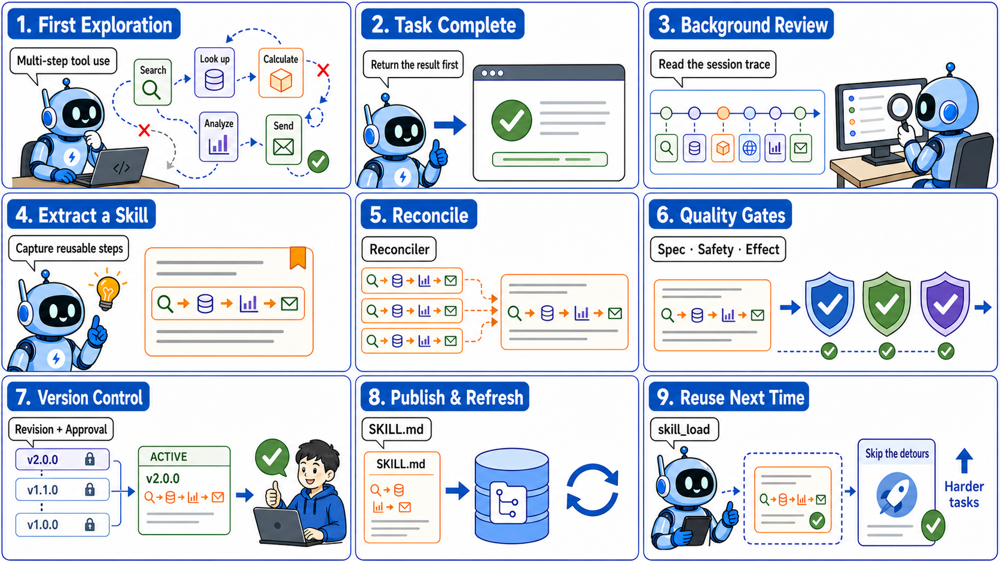
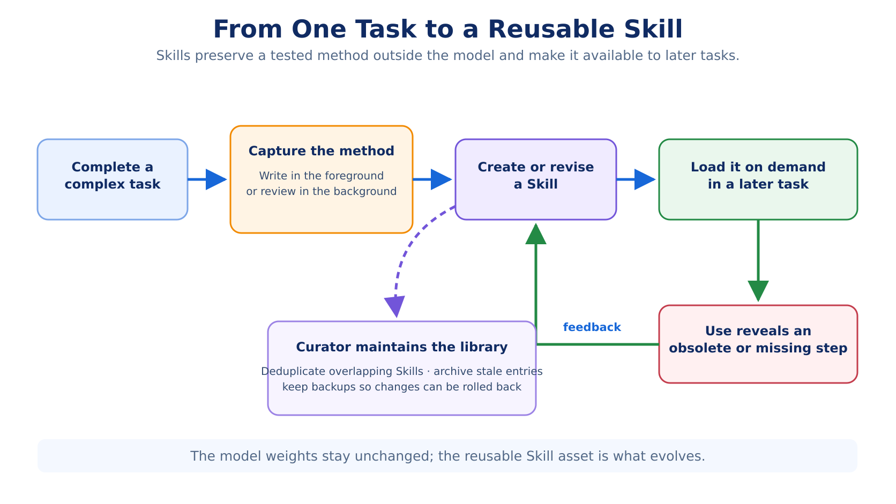
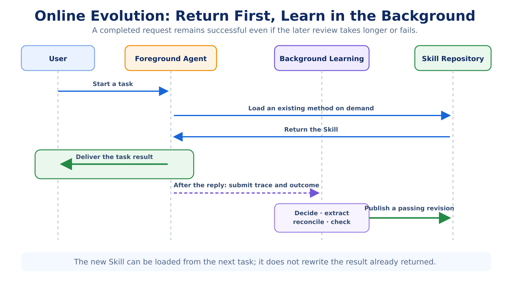
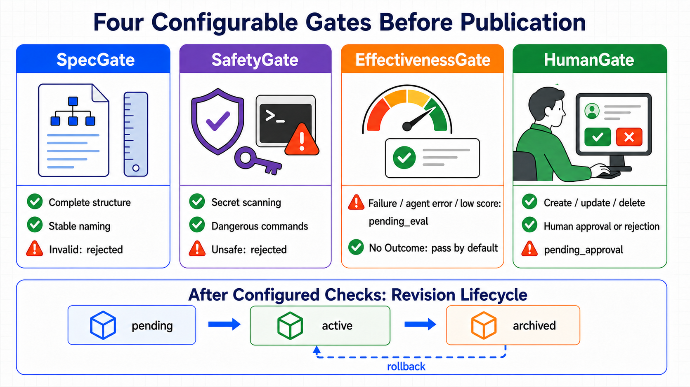
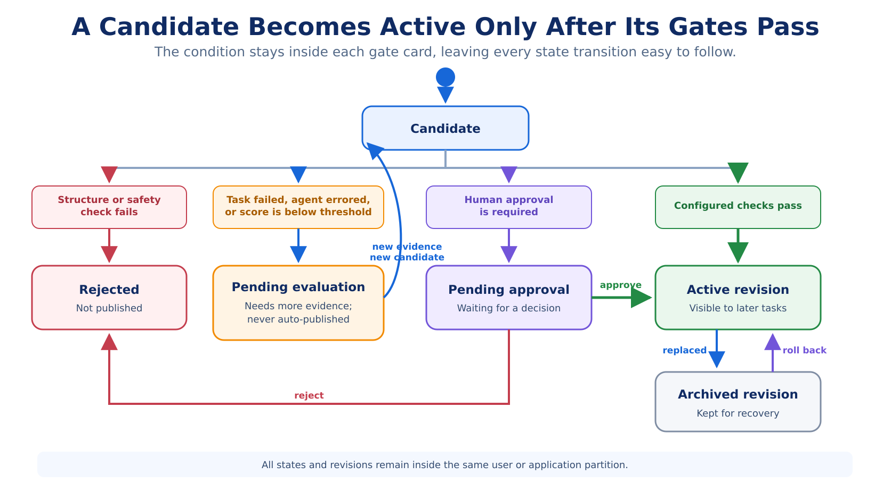
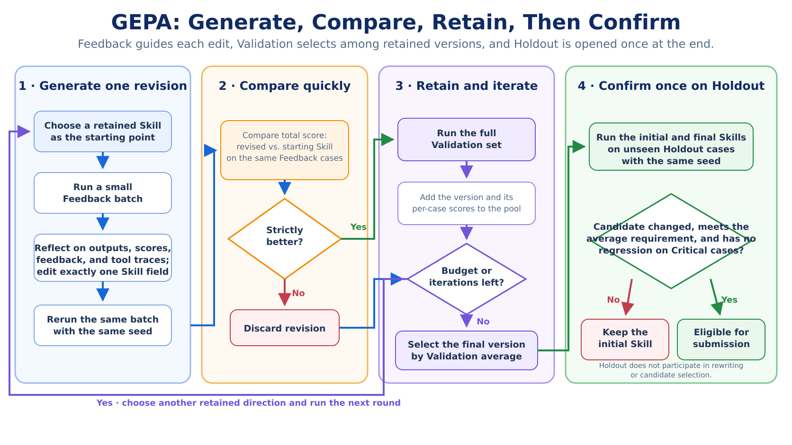
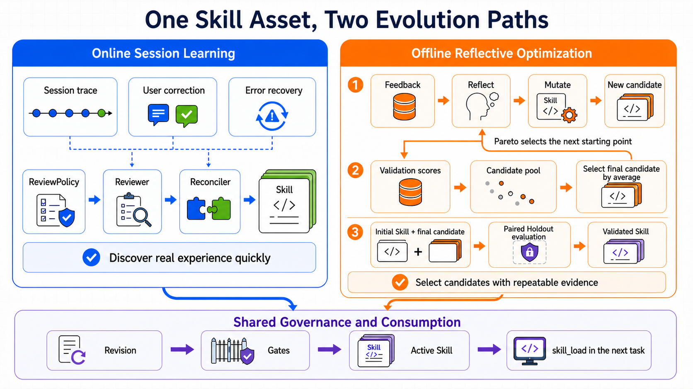
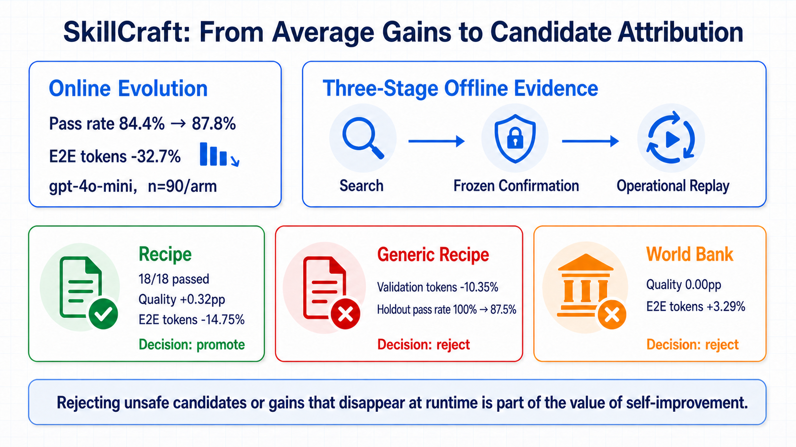
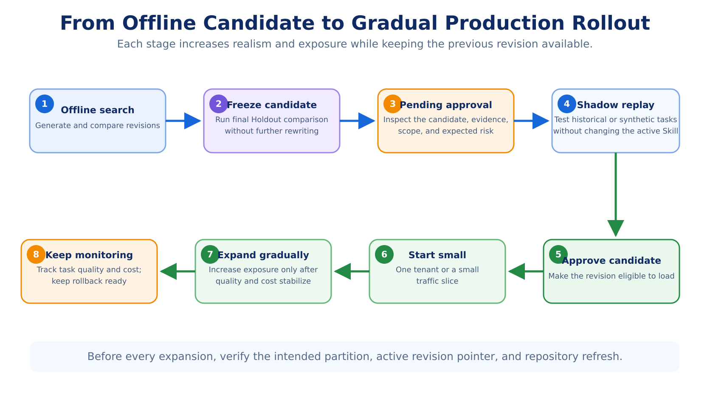

# tRPC-Agent-Go Evolution: Online Learning, Offline Optimization, and Evaluation for Self-Improving Agents

When an agent moves beyond “finish this task” toward “do the next one better,” it needs to retain more than facts. It also needs methods: how to combine tools, recover from failures, and verify the result. Evolution turns execution traces into Skills, then uses evaluation, approval, publishing, and rollback to make those methods reusable in later tasks. Starting with procedural memory in Hermes Agent, this article explains the principles and integration of online learning and offline optimization in tRPC-Agent-Go, and shows how the SkillCraft Benchmark decides whether a candidate should be accepted or rejected.

> [tRPC-Agent-Go](https://github.com/trpc-group/trpc-agent-go) is an open-source agent framework for Go. It provides tool calling, session and memory management, artifact management, multi-agent collaboration, graph orchestration, knowledge bases, observability, and more. Star the project on GitHub, try it out, and join the community.
>
> Version requirement: The Evolution APIs in this article require **tRPC-Agent-Go v1.11.0 or later**.



Consider a report that collects weather for several cities. The first time an agent handles it, the agent may need to look up each city's coordinates, call a weather API, normalize time zones and missing fields, retry timeouts, and finally verify that every requested city appears in the report. It may take a few detours, but the agent eventually delivers the correct result.

The problem appears the second time. The user changes only a few cities, yet the agent may look up the API documentation again, repeat the same parameter experiments, and rediscover errors it already fixed. The model has not necessarily “forgotten” anything—the previous conversation may still exist in the Session. What the system lacks is a way to turn conversations and tool traces into an operational guide for handling the same kind of task in the future.

That is the problem agent self-improvement should solve: identify the stable, reusable parts of one execution and turn them into a Skill that later tasks can load when needed. Otherwise, once the Session ends, the method discovered through trial and error is difficult to reuse. The artifact being created and updated is always a Skill; the weights of the online model do not change as tasks run.

tRPC-Agent-Go Evolution provides two paths. Online learning asynchronously reviews a real task after it finishes, looking for methods worth retaining in user corrections, error recovery, and multi-step tool use. Offline optimization repeatedly rewrites and compares a known Skill on a reproducible dataset, then evaluates the selected candidate independently on reserved examples. Candidates from either path can enter the same automated checks, human approval, publishing, and rollback process.

The companion [trpc-agent-go-benchmark](https://github.com/trpc-group/trpc-agent-go-benchmark) evaluates the result in three stages. Once a Skill exists, do later tasks actually improve? Does a candidate that scores better on development data remain effective on unseen examples? After independent evaluation, does the benefit survive when the candidate returns to the complete Evolution workflow?

This article first uses Hermes Agent to explain procedural memory, then walks through online learning, offline optimization, integration, and the SkillCraft Benchmark in tRPC-Agent-Go. Its central idea is:

> Agent self-improvement writes methods learned during execution into Skills, then uses checks and evaluation results to decide whether later tasks should use them.

---

## 1. Hermes Agent: Persisting Task Methods as Skills

[Hermes Agent](https://github.com/NousResearch/hermes-agent) describes itself as a self-improving agent. Here, “self-improving” does not mean continuous training or online updates to model weights. Hermes writes reusable methods into Skills, loads them on demand in later tasks, and revises them when problems emerge.

To understand Hermes, first distinguish remembering what happened from learning how to act next time.

| Asset | What it stores | The question it answers |
| --- | --- | --- |
| Memory | User preferences, project state, and previous decisions | “Who is this user, and where does the project stand?” |
| Session Search | Raw evidence from past conversations and tool executions | “What was the exact error last time?” |
| Skill | Stable procedures, tool ordering, and pitfalls for a class of tasks | “How should I handle this kind of task again?” |

Session Search here refers to Hermes' ability to query historical conversations and tool traces. When we discuss tRPC-Agent-Go later, the main distinction will be between Memory and Skill.

If the agent stored the weather task verbatim in Memory, retrieving it later would yield only a story: it queried Beijing, Shanghai, and Shenzhen with certain parameters and encountered a particular timeout. A Skill has a harder job. It must remove city names, temporary paths, and incidental numbers while preserving a structure that transfers to other tasks: geocode first, request data in a consistent time zone, retry only failed cities instead of rerunning the whole batch, and verify that the output contains every requested city before producing the report.

In cognitive science, this kind of “knowing how” is often called procedural memory. The system should prioritize the accuracy and reusability of the retained method instead of simply accumulating more raw conversation history.

Hermes Skills also use progressive disclosure. Initially, the model sees only a Skill index and short descriptions. Once it judges a Skill relevant, it calls `skill_view(name)` to load the full content; if that content refers to supporting material, the model then reads the specific reference. This avoids inserting the entire Skill library into every prompt without making prior experience invisible. The `skill_load` mechanism in tRPC-Agent-Go follows the same pattern: first expose the available capabilities, then load the full instructions only when needed.

Readable Skills still leave one question: who writes them? Hermes allows the foreground agent to call `skill_manage` after completing a complex task and save the procedure it just validated. If a loaded Skill turns out to be obsolete or incomplete, the agent can revise it immediately. This approach uses the full task context, but writing the Skill consumes tokens and time in the current request, and the foreground agent may not remember to do it consistently.

Hermes therefore also provides background review. After the main task has replied to the user and meets the review conditions, the system copies a snapshot of the conversation into an isolated background agent. This agent can inspect the task, but it may only read and write Memory and Skills. It cannot call business tools such as the weather API or code executor again. If the review fails, the user's result remains unaffected. The source code calls this background role the Reviewer. The design goal is explicit: **background review may take longer or fail independently, but it must not extend the current request's response time or turn a successful task into a failure.**

The Reviewer first checks whether any Skill used in the task needs to be revised. It creates a new Skill only when the task reveals a genuinely new, reusable procedure. As the library grows, a Curator tracks which Skills are frequently viewed, used, and modified; merges overlapping entries; marks long-unused content for cleanup or archival; protects important entries from automated reorganization; and preserves a backup before making changes. If automated curation goes wrong, the backup supports recovery.



Hermes' approach can be summarized as follows: after completing a task, the agent turns reusable methods into procedural memory. Hermes, however, primarily targets personal or single-machine environments. A server-side framework has additional questions to answer. Do multiple applications and users share Skills? May an automated Reviewer overwrite a manually maintained Skill? Can a candidate produced by a failed task be published? What happens when two Reviewers create nearly identical Skills at the same time? Who approves, records, and rolls back a change?

While designing Evolution, tRPC-Agent-Go also reconsidered where procedural memory belongs. Its early design predated a standalone Evolution Service. Following the classic categories of memory, this path first tried to store task methods as a third kind of Memory alongside semantic and episodic memory. The idea sounded natural: if “what the user prefers” and “what happened before” can each become a database record, perhaps “how to perform this kind of task” can as well.

Application experience exposed the difference between a Memory record and a Skill document. Memory works well for independently retrievable database items. A method, however, is usually a complete instruction with ordered steps, applicability conditions, result checks, and failure handling. Splitting it into separate records breaks the relationships between steps, while storing the entire method as one record creates an oversized fact. A Skill is a better fit: it is a readable, editable document that can be loaded on demand and can link to supporting material. tRPC-Agent-Go therefore moved procedural memory into Skills. The Evolution Service generates Skills from execution traces and manages their evaluation, publication, and rollback.

tRPC-Agent-Go Evolution makes Skill generation, checking, approval, publication, and rollback explicit instead of relying solely on prompts that ask the agent to remember to do these things.

---

## 2. Evolution Creates and Updates Skills

The term “self-improvement” can be misleading, so it is worth defining the boundary first. **tRPC-Agent-Go Evolution manages Skills outside the model; it does not change model weights.** Session continues to hold context for the current task, Memory retains stable facts across sessions, and Summary compresses long conversations. Evolution creates, optimizes, publishes, and rolls back Skills.

| Capability | What it stores or changes | When it takes effect |
| --- | --- | --- |
| Summary | Compressed state of the current Session | Reduces context pressure as a long conversation continues |
| Memory | Stable facts and preferences across sessions | Supplies user or project context to new and existing sessions |
| Skill | Reusable procedures and pitfalls | Explains “how to do it” in similar tasks |
| Fine-tuning | Knowledge, capabilities, and behavioral tendencies encoded in model weights through training | Affects every model inference |
| Evolution | The process that generates, optimizes, publishes, and rolls back Skills | Runs after online tasks or in offline experiments |

Return to the weather example. The user's preference for Celsius belongs in Memory. “Three cities completed, two remaining” is Session state. “How to geocode locations, fetch weather in batches, and verify the result reliably” belongs in a Skill. Evolution generates or updates that Skill from the task trace, evaluates the candidate, and publishes the version that passes the configured checks.

Evolution ultimately writes the method into `SKILL.md`. When version management is enabled, it also preserves an immutable record for each candidate.

The two paths begin with different inputs. **Online session learning starts with a real task that has just finished.** The user may have corrected the result, or the agent may have recovered from an error. The system then searches that Session for a reusable method. It does not necessarily know in advance which Skill should be improved. This makes it responsive to personalized needs and rare failures, but one execution provides limited evidence and may make an incidental success look like a general method.

**Offline optimization starts with a specific Skill that is known to need improvement.** A platform or capability provider knows what the Skill should accomplish and can prepare reproducible data, a business evaluator, and an experiment budget. Before exposing the Skill more broadly, it generates multiple candidates, compares quality and cost, and evaluates the selected version on unseen examples. Offline experiments cannot fully recreate a real user's environment, but they can compare versions repeatedly under the same conditions.

At this point, it is natural to think of online learning as primarily B2C because it serves end users directly, and offline optimization as primarily B2B because a platform refines a Skill before offering it as a capability. Those are common scenarios, but “online” and “offline” describe how an update begins and how evaluation data is produced. An online update is triggered by a new task trace; an offline update is triggered by an experiment organized by the capability provider. Whether the resulting Skill serves one user or an entire application is determined separately by its isolation configuration.

A server-side system must explicitly decide who can see a newly activated Skill. A workflow refined by one user may remain private to that user. A general procedure extracted from production traffic may be shared within an application. A foundational Skill supplied by a framework or platform is usually managed centrally. Online learning can update a personal Skill or derive a shared method from application traffic; a personal agent with repeatable tasks and a stable evaluator can also run offline optimization. The broader a Skill's audience, the more users a faulty change can affect, so the stronger its evaluation and approval should be.

Maintaining this boundary requires three kinds of alignment. The **read boundary** determines which Skills an agent can see. The **write boundary** determines which Skills background learning may update. Version and approval records must remain in the same user or application partition. Background review may read a broader authorized set of Skills to check for duplicates, but it can modify only the subset explicitly designated for automated management. A personal workflow must not become an application-wide rule after one review, and one application's internal conventions must not be visible to another. Even a manually maintained foundational Skill that everyone can read may be protected from automated updates.

A version produced by online learning may become the initial version for offline optimization, and online failures may be added to an offline dataset. When an offline candidate is ready for release, it uses the same user isolation, approval, publishing, and rollback mechanisms. Both paths operate on the same kind of Skill.

---

## 3. Online Learning: Return the Task Result First, Then Generate Skills in the Background

Online Evolution separates **completing the current task** from **extracting a method from that task**. When the background queue has capacity, the user receives the weather report before the system summarizes the execution. A failure in background learning does not turn the completed task into a failure. If the queue is full, the framework falls back to synchronous processing, which may delay the current response; Section 5 explains this behavior in detail.



### When the Queue Has Capacity, Return the Current Result Before Reviewing the Trace

In the multi-city weather task, the foreground agent fetches the data, handles errors, verifies that all cities are present, and returns the report as soon as possible. After the task ends, background learning reads the new conversation and tool traces together with any success, failure, or score supplied by the application. It does not continue executing the user's task. It only asks whether the trace contains a recurring problem and a method worth retaining.

This order separates the current task from the outcome of learning. The current task is responsible for returning the correct result promptly. Background learning reviews the trace and attempts to generate a Skill; it may take longer or fail independently. A new Skill becomes available only after publication, and production deployments will normally configure automated checks and human approval before that point. When the queue has capacity, the extra model call does not add to user wait time. When the queue is full, the current request may wait for synchronous processing.

A long Session may complete several tasks, and background learning does not need to reread the entire history every time. It records how far the previous review progressed, then reads only the newly added conversations, tool results, and user feedback. This reduces repeated model calls and prevents the same trace from being turned into a Skill more than once. The integration section explains when this cursor advances and what happens if a later step fails.

### Which Traces Are Worth Sending to the Reviewer?

**The review policy first decides whether a trace is worth processing.** A correct answer to a simple question may contain no reusable method. Multi-step tool workflows, tasks that the user explicitly corrected, and tasks where the agent failed but recovered are stronger candidates. This decision only determines whether the Reviewer should inspect the trace; it does not decide whether a resulting candidate may be published.

**The Reviewer then extracts a method from the trace.** It reads the new conversation and tool calls, summaries of existing Skills, and the optional task outcome. It returns a structured proposal: create a new method, extend an existing one, or delete an obsolete method. The model interprets the content and proposes a change; later code performs the actual write.

A useful weather Skill turns “query Beijing, Shanghai, and Shenzhen” into “batch-geocode the locations; retain coordinates and time zones per location; retry only failed items; finally verify that the output city set matches the input.” It preserves tool ordering, parameter construction, completion conditions, and failure handling while removing accounts, credentials, absolute paths, and numbers specific to this run. The Reviewer writes a method that can serve other cities, not a replay of this task.

**The Reconciler applies deterministic rules to organize the candidates.** Within one batch, candidates are deduplicated when their normalized names match or when their ordered steps and applicability conditions are identical. If “Weather - Multi-City” already exists, a new “Weather - 3 Cities” candidate is converted into an update to the existing Skill. These rules rely on explicit names and structure; unlike the Reviewer, they do not perform open-ended semantic interpretation. Domain abbreviations and implicit synonyms still need application-level observation and validation.

Online review therefore proceeds in order: the review policy decides whether processing is needed, the Reviewer extracts a method, and the Reconciler deduplicates candidates and converts obvious variants into updates. The system must then determine whether a candidate is safe to publish.

### Check Candidates Before Publishing Them in Production

Content produced by the Reviewer and Reconciler is still only a candidate. A production system will usually check its format, safety, and task effectiveness and decide whether human approval is required. Applications can choose a subset of these checks based on risk, and a minimal configuration can omit them entirely.

The four checks answer four questions. First, are the name, applicability conditions, and steps complete enough to form an executable method? Second, does the content contain credentials, dangerous commands, or path traversal? Third, did the task that produced the candidate succeed, and did its business score meet the threshold? Fourth, even if the automated checks pass, does this kind of change still require a person to approve it? The third check depends on a success status, failure status, or score supplied by the application. Without that outcome, the framework has only the Reviewer's judgment; it cannot demonstrate that the candidate improved the task. The implementation calls these checks the Spec, Safety, Effectiveness, and Human Gates.



**The Spec Gate validates the Skill's structure and required fields.** A candidate needs a valid name, clear applicability conditions, and enough execution steps. Candidates with missing fields, too few steps, or a create operation that duplicates an existing Skill are rejected here. This Gate checks structural validity, not content quality or task effectiveness.

**The Safety Gate detects common dangerous content.** It looks for credentials, destructive commands, and path traversal in the body so that transient environment details from a task do not become permanent instructions. This check does not replace a full security review. The application's permission configuration still determines whether tools can read sensitive data or modify real business data.

**The Effectiveness Gate inspects the task outcome.** If the application supplies success, failure, or a score, candidates from failed or low-scoring tasks are marked for evaluation. If no outcome is supplied, the default implementation does not rerun the task automatically; it can only rely on the Reviewer's judgment. Passing this Gate without an application outcome therefore means only that no evidence of failure was found, not that the candidate has proven effective.

**The Human Gate decides whether to wait for human approval.** Adding a low-risk method for one user and deleting a Skill shared by an entire application normally warrant different approval policies. The application configures which operations require approval; the framework does not infer business risk on its own.

The four Gates can be combined according to business needs. A structural or safety failure normally rejects a candidate. A task failure, agent error, or score below the application threshold saves it as `pending_eval` instead of publishing it immediately. When no task outcome is supplied, the default Effectiveness Gate passes the candidate rather than marking it for evaluation. A candidate that requires human confirmation enters `pending_approval`. Create, update, and delete operations can use different approval policies; Section 5 covers the defaults.

Gates decide whether a candidate may be published. Revision history makes it possible to recover after publication. Production deployments typically save each create, update, or delete as an immutable revision rather than overwriting the file, and maintain a separate pointer to the active revision. Publishing a new version leaves the previous one intact; if online performance deteriorates, the pointer can be moved back to an earlier revision.



The Gates, revision history, and active revision must use the same user or application partition so that a candidate cannot be published into the wrong scope.

After publication, the agent must also be able to read the new version on its next task. If the file has changed but a running agent still uses an old cache, the update has no practical effect. The next section introduces offline optimization; Section 5 then explains how to integrate the background queue, review cursor, Gates, revision storage, and cache refresh in Go.

---

## 4. Offline Optimization: Repeated Experiments Test Whether One Success Generalizes

Online learning can discover useful methods quickly, but one execution establishes only that “it worked this time.” Return to the multi-city weather task. The old Skill says that when any city request fails, the whole batch should be rerun. During one task, the Guangzhou request times out; the agent retries only Guangzhou and still returns a complete report on time. That success suggests a change: replace “rerun the entire batch” with “retry only the failed cities.”

One successful run is not enough to modify the official Skill. The API may simply have recovered by the second request, and retrying individual items might omit required state when several cities fail together. Offline optimization tests the change on reproducible tasks to see whether it remains effective across other inputs and failure conditions.

An experiment starts with three ingredients: an initial Skill to improve, a set of reproducible tasks, and an application-provided Evaluator. For the weather task, the Evaluator might verify that every city is present, fields are correct, failed items were retried, and successful items were not requested again. It returns both a score and specific feedback for each execution. The initial Skill and every candidate use the same tasks and scoring rules so that their results are comparable.

### Three Data Splits for Rewriting, Selecting, and Final Evaluation

If the same tasks both guide the rewrite and decide whether it succeeded, a candidate can easily overfit the problems it has already seen. Offline optimization therefore partitions tasks into Feedback, Validation, and Holdout before the experiment begins: **Feedback tells the reflection model how to improve the Skill, Validation helps the Optimizer choose among versions, and Holdout determines whether the final candidate beats the initial Skill after rewriting has stopped.**

Optimization begins with Feedback. The framework runs the initial Skill on a small batch of Feedback cases, then gives the reflection model the actual output, score, specific feedback, and tool trace. Suppose the Evaluator reports: “After Guangzhou timed out, Beijing and Shanghai were requested again. The report was complete, but two unnecessary tool calls were made.” The reflection model can then change the failure-handling step from “rerun the batch” to “retry only failed cities.” Feedback supplies both the comparison score and the execution evidence needed to revise the Skill.

The revision then moves to Validation, which contains different city combinations and failure modes. Validation execution feedback is not used to modify the current version. The Optimizer uses only the scores to compare existing versions, choose which version to develop in the next round, and ultimately select the one with the best overall Validation result. A version that fixes the Guangzhou timeout in Feedback must therefore show that it also handles other cities, timeouts in other positions, and requests with no failures.

Feedback and Validation are reused over multiple rounds. Holdout is not involved in either rewriting or selection. Only after Validation has selected the final candidate does the framework run the initial Skill and candidate Skill on the same Holdout tasks. It passes the same random seed to the Evaluator for both versions, helping isolate the effect of the Skill. By default, the candidate's average Holdout score must be at least as high as the initial Skill's; applications may require a larger minimum improvement.

An average can hide a serious regression: a candidate may improve many ordinary tasks slightly while failing badly on a small number of cases where failure is unacceptable. An application can mark such a Holdout case as `Critical`. This is not a fourth data split or a risk level inferred by the Optimizer. It simply means “this case must not regress.” A weather case where omitting any city is a failure could be marked this way. Even if the candidate meets the average-score requirement, a lower score than the initial Skill on any `Critical` case makes it ineligible for submission.

Holdout measures unseen tasks only because it has not influenced any previous revision. If the team inspects Holdout results and then adjusts the Skill specifically for those cases, the cases have become part of development. In the next round they should move into Validation, and a fresh Holdout set should be prepared.

### How GEPA Improves a Skill Step by Step

The built-in offline optimizer in tRPC-Agent-Go draws on [GEPA (Genetic-Pareto)](https://arxiv.org/abs/2507.19457). A practical way to understand it is as a sequence of small experiments: choose one retained version as the starting point for a round, change one part, then use task scores to decide whether the change is worth keeping. At the beginning, the initial Skill is the first member of the candidate pool—the set of retained versions that may be revised in later rounds.



**Each round attempts one change.** The system chooses a Skill from the candidate pool as the starting point, then runs it on a small Feedback batch. The reflection model sees the Skill, actual outputs, scores, and evaluator feedback and edits exactly one of `steps`, `pitfalls`, `when_to_use`, or `description`. In the weather example, a round that edits `steps` may replace “rerun the whole batch” with “record and retry failed cities,” but it will not rewrite the applicability conditions and capability description at the same time. The resulting score change is therefore easier to relate to a concrete edit.

**A small batch provides a quick comparison before full Validation broadens the test.** The starting and revised versions run on the same Feedback cases, and the Evaluator receives the same random seed for both. The revised version's total score must be strictly higher than its starting point; otherwise, the change is discarded. Only an improved version proceeds to the full Validation set and joins the candidate pool with its per-case scores. Feedback eliminates unhelpful edits early, while Validation records how a version performs across a broader set of tasks.

**The candidate pool preserves different improvement directions.** Suppose version A is the most stable on ordinary weather requests, while version B handles simultaneous timeouts in several cities better. If every round continued only from the version with the highest average score, B's approach to complex failures might never be refined. GEPA therefore examines Validation cases individually and allows versions that lead on particular cases to become starting points for later rounds. A version that leads on more cases is generally more likely to be selected. When several versions lead on exactly the same cases, the system reduces redundant selections. The source calls this mechanism sample-level Pareto selection.

**The final version is selected after search ends normally.** When the iteration count or number of evaluation calls reaches its configured maximum, the system stops generating versions and compares the Validation average of every candidate in the pool. The initial Skill is never removed, so when none of the revisions is good enough, the final result can still be the initial version. If Holdout is configured, the framework then performs the final evaluation. If Validation selected the initial Skill, the experiment ends without submitting a change. A runtime limit differs from iteration and evaluation limits: if search times out before it finishes, the experiment fails instead of selecting or submitting the current candidate.

Passing Holdout means only that the candidate is eligible for submission. A production release still goes through revision storage, automated checks, and human approval before an agent uses it. The direction for improvement may come from an online failure or from offline examples prepared by a capability maintainer. Once offline optimization begins, Feedback generates candidates, Validation selects a version, and Holdout performs the final evaluation; versioning and approval then determine whether the candidate is published. The following diagram connects online learning, offline optimization, and later Skill loading.



---

## 5. Integration: From Minimal Online Setup to Offline Optimization

The previous sections explained the design. This section maps those ideas to code in three steps. First, have the Runner hand execution traces to Evolution when a task ends. Next, add queue management, revisions, and approval for background processing. Finally, when the application has a complete test dataset, connect an Evaluator to compare and improve a specific Skill repeatedly.

### Configure the Minimal Online Flow

The minimal integration starts by giving the agent and Evolution the same Skill Repository—the same Skill storage and cache instance. The agent reads Skills from it, the Reviewer uses it to inspect existing Skills, and after the Publisher writes a file, the Service refreshes the Repository. The following snippet shows only object creation and wiring. It omits model credentials, Session creation, and the actual task call, so it is not directly runnable.

```go
package main

import (
    "trpc.group/trpc-go/trpc-agent-go/agent/llmagent"
    "trpc.group/trpc-go/trpc-agent-go/evolution"
    "trpc.group/trpc-go/trpc-agent-go/model/openai"
    "trpc.group/trpc-go/trpc-agent-go/runner"
    "trpc.group/trpc-go/trpc-agent-go/skill"
)

func main() {
    agentModel := openai.New("gpt-4o")
    reviewerModel := openai.New("gpt-4o-mini")

    repo, err := skill.NewFSRepository("./skills")
    if err != nil {
        panic(err)
    }

    evoSvc := evolution.NewService(
        reviewerModel,
        evolution.WithManagedSkillsDir("./skills"),
        evolution.WithSkillRepository(repo),
    )
    defer evoSvc.Close()

    agent := llmagent.New(
        "my-agent",
        llmagent.WithModel(agentModel),
        llmagent.WithSkills(repo),
    )

    r := runner.NewRunner(
        "my-app",
        agent,
        runner.WithEvolutionService(evoSvc),
    )
    defer r.Close()

    // Run tasks as usual. Learning happens in the background afterward.
}
```

`runner.WithEvolutionService(evoSvc)` calls the Evolution Service after a task finishes. The Runner uses this Service but does not own its lifecycle; the caller must still invoke `Close()` explicitly, because `Runner.Close()` does not close the Service. After a task, the Runner automatically submits a `LearningJob` that contains only the Session. When the queue has room, submission returns quickly and a worker processes the job in the background. The next subsection covers what happens when the queue is full.

This minimal configuration publishes changes from the Reviewer directly. It is useful in a test environment for confirming that a task can produce a Skill and that the next task can load it. It does not preserve complete candidate history and provides no approval or revision rollback. Production systems will normally add the next set of options.

### Background Learning Still Needs Queue, Timeout, and Failure Management

Normally, once the Runner places a `LearningJob` on the queue, the task flow can end while a background worker runs the Reviewer. To prevent the background job from being canceled when the original request ends, the Runner preserves tracing, tenant, and other values from the context while detaching its cancellation signal.

By default, the Service runs one worker with a queue capacity of 10, and each job may run for at most 60 seconds. With multiple workers, jobs with the same `AppName` and `UserID` are assigned to the same worker by a stable hash, which helps preserve ordering for one user's tasks.

If the target queue is full or the worker has not started, submission falls back to synchronous processing. Automatic Runner integration has already detached the original cancellation signal, so this review may delay completion of the task flow by as much as 60 seconds. The statement “background learning does not delay the response” therefore assumes that the queue has capacity.

Production deployments should size workers and queues for their traffic and monitor queue depth, processing latency, timeouts, and the number of synchronous fallbacks. When the application submits a job directly with an already-canceled context, the Service skips that learning attempt.

To avoid reviewing the same Session segment repeatedly, the Service stores a `review cursor` that records how far it has processed. The cursor advances when the policy decides no review is needed, when the Reviewer chooses to skip, or when the foreground agent has already written `SKILL.md` through a file or command tool. The next review then reads only new traces.

If the target partition (Scope), Repository, review policy, or Reviewer fails before producing a decision, the cursor does not move, so a later submission retries the same trace. Once the Reviewer returns a valid structured result, the trace is marked as read. A subsequent failure in candidate storage, publishing, or cache refresh does not cause the Service to review the original Session again. Applications must therefore monitor candidate processing separately and retry failed save or publish operations.

The three background roles described earlier map to concrete implementations. `DefaultReviewPolicy` triggers by default when there are at least four tool calls, a user correction, or recovery from an agent error. `LLMReviewer` converts new traces, summaries of existing Skills, and an optional Outcome into a structured `ReviewDecision`; it does not write files. The `Reconciler` then performs deterministic deduplication using candidate names and the structure of `when_to_use` and `steps`. For example, when “Weather - Multi-City” already exists, it converts “Weather - 3 Cities” into an update to the existing Skill. Default rules may miss domain abbreviations and implicit synonyms, so applications still need to inspect the result.

### Store Candidate Revisions and Configure Publication Checks

A test environment can overwrite Skills directly. Production needs both the complete candidate history and an explicit active revision; otherwise approval and rollback are difficult. The source calls each immutable candidate a revision. `CandidateStore` stores candidate content, status, and check reports. `ActivePointer` records the active revision. The Publisher writes that active content to the Skill directory used by the agent.

After the Reviewer proposes a create, update, or delete operation, the Service creates a revision. Create and update operations pass through the configured Spec, Safety, Effectiveness, and Human Gates; delete skips Spec and Safety. The candidate and its reports are then written to `CandidateStore`. Only revisions that no Gate rejects or pauses are published, after which `ActivePointer` is updated. `CandidateStore` retains every stored revision. Together with `ActivePointer` and the Publisher, this lets approval and rollback switch versions without overwriting historical snapshots. The corresponding configuration follows; surrounding application code is omitted.

```go
skillsDir := "./skills/evolution"
revisionsDir := "./evolution/revisions"

evoSvc := evolution.NewService(
    reviewerModel,
    evolution.WithManagedSkillsDir(skillsDir),
    evolution.WithSkillRepository(repo),

    evolution.WithCandidateStore(
        evolution.NewFileCandidateStore(revisionsDir),
    ),
    evolution.WithActivePointer(
        evolution.NewFileActivePointer(revisionsDir),
    ),

    evolution.WithSpecGate(evolution.NewDefaultSpecGate()),
    evolution.WithSafetyGate(evolution.NewDefaultSafetyGate()),
    evolution.WithEffectivenessGate(
        evolution.NewOutcomeBasedEffectivenessGate(),
    ),
    evolution.WithHumanGate(evolution.NewCreateOnlyHoldGate()),

    evolution.WithWorkerNum(2),
    evolution.WithQueueSize(32),
)
defer evoSvc.Close()
```

As soon as `CandidateStore`, `ActivePointer`, or any Gate is configured, candidates follow the managed flow described above. The Service publishes directly only when all of those options are absent. Production deployments normally configure both `CandidateStore` and `ActivePointer` to retain candidate history and the active revision. Configuring one Gate adds only that check; it does not automatically provide complete revision history or rollback.

The default `OutcomeBasedEffectivenessGate` checks only create and update operations. A failed task, an agent error, or an application score below 0.8 prevents publication and marks the candidate `pending_eval`. The candidate and its status are retained only when `CandidateStore` is also configured. The framework does not automatically reevaluate it later; the application must resubmit after obtaining new evidence or implement its own follow-up workflow.

If no Outcome is supplied, this Gate allows the candidate through because it has no application score to inspect. That means only that the Gate found no basis for rejection, not that the candidate has been validated.

The `NewCreateOnlyHoldGate()` in the example pauses only create operations, while the built-in Effectiveness Gate does not inspect delete operations. An update that passes the automated checks is therefore published directly; a delete of an existing Skill in the managed directory may also take effect without human approval. Use `NewAlwaysHoldGate()` if create, update, and delete must all be confirmed by a person. A held candidate remains in `pending_approval` and does not change the active revision.

The preceding behavior assumes the default enforcement mode. For revisions produced by the online Reviewer and processed by the background worker, `WithApprovalGateShadow(true)` is useful before enforcement: the system still runs the Gates and records their decisions, but those decisions do not block updates to the live Publisher. This option does not affect external candidates accepted through `RevisionSubmitter`; automatic Gates remain enforced when offline optimization calls `SubmitRevision`. By default, `pending_approval` waits indefinitely for a person. A candidate is promoted automatically after a deadline only when `WithApprovalTimeout(d)` is configured explicitly. Shadow mode and timed promotion change the practical constraints on online candidates and should be covered by production audit logs and alerts.

Once revisions can be published, one question remains: **who is allowed to see this Skill?** `WithManagedSkillsDir` limits the directory that Evolution may update automatically. It may read a broader Skill library for deduplication, but it can modify only content under the managed directory. `WithSkillScopeMode` controls sharing: `SkillScopeApp` shares Skills among users of the same application, `SkillScopeUser` partitions by `AppName` and `UserID`, and the default `SkillScopeNone` has no partitioning and suits local tools or single-tenant applications.

The same scope must be applied on both the write and read sides. Evolution uses `evolution.WithSkillRepositoryProvider` to locate a target Repository, while the agent reads through `llmagent.WithSkillRepositoryProvider`. They must use the same mode, `AppName`, and `UserID`. `CandidateStore`, `ActivePointer`, and the managed directory must follow the same partitioning, or a candidate may be written to user A while the agent reads from an application-wide directory.

Finally, account for caching. After a successful publication, the Service calls `Refresh()` on a shared Repository that implements `skill.RefreshableRepository`. The `FSRepository` in the example supports it. If the agent and Evolution create separate cache instances, the agent may continue reading an old version even when both instances point to the same directory.

### Submit Manually When an Application Outcome Is Available

Automatic Runner submission happens as soon as a task ends, when test results, rule-based scores, or human feedback may not yet exist. If the application obtains that information later, do not enable `runner.WithEvolutionService` for automatic submission. Instead, call `EnqueueLearningJob` after scoring is complete. Use one submission path for each segment of new traces. If automatic submission advances the review cursor first, a later manual submission will normally find no new content. If the two race or the first submission fails, duplicate review may still occur.

Manual submission can include task status, score, and notes in `Outcome`. The review policy and Reviewer use this information to understand whether the task succeeded, and the Effectiveness and Human Gates use it when deciding whether the candidate proceeds. This Outcome describes one online task; it is separate from the dataset and Evaluator used by the offline Optimizer. The essential code is:

```go
score := 0.95
err := evoSvc.EnqueueLearningJob(
    ctx,
    evolution.LearningJob{
        Session: sess,
        Outcome: &evolution.Outcome{
            Status: evolution.OutcomeSuccess,
            Score:  &score,
            Notes:  "all assertions passed",
        },
    },
)
```

High-risk applications should submit manually with an Outcome and add human approval. They may also rerun representative tasks in an isolated environment before publication. Without an Outcome, the default Effectiveness Gate allowing a candidate through means only that no application result was available to reject it; it does not prove effectiveness.

Online integration therefore offers two choices. When no application score exists, let the Runner submit automatically at task completion. When a score becomes available, have the application submit manually after evaluation. When the goal is to improve a particular Skill repeatedly on a dataset, add offline optimization.

### Offline Optimization Starts with an Evaluator

The Evaluator defines how to test a Skill. An application implementation loads the candidate into an isolated Repository, runs a set of tasks, and returns one score per task. It may also include the actual output, actionable feedback, and execution traces so that the reflection model can locate problems in the Skill. The application decides what counts as completion, quality, and acceptable cost. The next two snippets show interface relationships only; they omit application-specific variables and dependencies and are not directly compilable.

```go
type benchmarkEvaluator struct {
    // Runner, sandbox, test tools, and billing dependencies.
}

func (e *benchmarkEvaluator) Evaluate(
    ctx context.Context,
    candidate *evolution.SkillSpec,
    cases []optimization.Case,
    seed int64,
) ([]optimization.Evaluation, error) {
    // Load the candidate and run each case using the supplied seed.
    // Return one normalized score per case together with feedback
    // that identifies concrete problems in the Skill.
    return evaluations, nil
}
```

`optimization.Optimizer` is the common optimization interface, and `NewGEPA` creates the built-in implementation. The Optimizer calls the Evaluator repeatedly: Feedback cases expose problems that guide revisions, Validation compares versions, and Holdout supports final evaluation and submission. At minimum, the application must provide an initial `SkillSpec`, Feedback and Validation sets, a reflection model, and an Evaluator. Every score must be a finite number in `[0,1]`.

The following example also sends the experiment result into the revision-management flow described earlier. It first obtains a `RevisionSubmitter` from the Evolution Service and sets `Submit: true`. To inspect the experiment without submitting a candidate, omit the submitter and set `Submit` to `false`.

In the code, `baselineSpec` is the Skill at the start of the experiment, `currentScope` identifies the application or user that owns the candidate, and `activeRevisionID` records the active online revision when the experiment begins. If that online version changes before submission, the Service refuses to overwrite it with an experiment based on stale state. For App or User partitioning, `currentScope` must match the destination partition. With no partitioning, it may be the zero value.

```go
revisionSubmitter, ok := evoSvc.(evolution.RevisionSubmitter)
if !ok {
    return fmt.Errorf(
        "evolution service does not support revision submission",
    )
}

optimizer, err := optimization.NewGEPA(
    reflectionModel,
    evaluator,
    optimization.WithMaxIterations(10),
    optimization.WithReflectionBatchSize(3),
    optimization.WithRandomSeed(7),
    optimization.WithStoreDir("./evolution/experiments"),
    optimization.WithRevisionSubmitter(revisionSubmitter),
)
if err != nil {
    return err
}

result, err := optimizer.Optimize(
    ctx,
    optimization.Request{
        Seed:             baselineSpec,
        Scope:            currentScope,
        ParentRevisionID: activeRevisionID,
        Submit:           true,
        Dataset: optimization.Dataset{
            ID:         "managed-skill-regression",
            Version:    "v1",
            Feedback:   feedbackCases,
            Validation: validationCases,
            Holdout:    holdoutCases,
        },
    },
)
if err != nil {
    if result != nil {
        log.Printf(
            "experiment=%s stop=%s promote=%s submit=%s err=%v",
            result.ExperimentID,
            result.StopReason,
            result.PromotionReason,
            result.SubmissionReason,
            err,
        )
    }
    return err
}

log.Printf(
    "selected=%q validation=%.3f holdout=%.3f promote=%t reason=%s",
    result.Spec.Name,
    result.CandidateValidation.Score,
    result.CandidateHoldout.Score,
    result.PromotionEligible,
    result.PromotionReason,
)
```

The built-in optimizer is inspired by GEPA but runs entirely in the Go process and requires no separate Python service. The example keeps the defaults of at most 10 revision rounds and 3 Feedback cases per round, while changing the random seed from 1 to 7. By default, the complete experiment allows at most 1,000 case evaluations; evaluating the same case under different versions counts each time.

When `WithTimeLimit` is configured, it places a context deadline around the complete optimization run. A timeout during search makes `Optimize` return an error; the current candidate pool is not treated as a normally completed experiment and is not selected or submitted. The caller should handle it as a failed run.

A fixed random seed first ensures that the Optimizer samples the same Feedback cases. The Optimizer also passes that seed to the Evaluator, but whether old and new versions run under equivalent conditions depends on the Evaluator using it to control the task environment and on the stability of remote models and tools. A formal experiment should also pin model versions, temperature, tool budgets, task order, and Evaluator version, then repeat the evaluation with multiple independent seeds.

When `Submit: true`, each of Feedback, Validation, and Holdout must contain at least 10 cases.

`Submit: true` does not publish the candidate directly. The built-in GEPA implementation submits its selected version as an update, so the target Skill must already exist; when a managed directory is configured, the target must also be inside it. The Optimizer first uses Holdout to determine submission eligibility. The `RevisionSubmitter` then verifies the target Skill, confirms that the active online revision still matches the `activeRevisionID` recorded at experiment start, checks that the destination directory allows automated updates, and reruns the Spec, Safety, and Effectiveness Gates. If all checks pass, the external candidate enters `pending_approval` and waits for application approval. A failure at any point leaves the active version unchanged. This submission path cannot create a brand-new Skill.

The Optimizer submits through the submitter but does not close the Evolution Service. Holdout evaluation, experiment persistence, or submission can still fail after a candidate has been selected, so `Optimize` may return both a non-nil `result` and an `error`. Record whichever stage fields have been populated before handling the error: `StopReason` is available after search ends normally, `PromotionReason` becomes reliable only after the Holdout decision, and `SubmissionReason` is filled only after submission begins. The latter two may be empty when an earlier stage fails.

`WithStoreDir` saves experiment data, truncated outputs, evaluation feedback, and Evaluator traces on the current node so that developers can inspect why a candidate was accepted or rejected. It is local process storage, not a cross-node scheduler or centralized experiment database.

Those records may still contain business data. Built-in redaction recognizes only common credential formats. The application must sanitize the initial Skill, task inputs, expected results, and Evaluator outputs. The evaluation agent that runs candidate Skills should not have production credentials or tools capable of modifying real business data.

A cautious rollout can proceed in four stages. First, provide a few manually written initial Skills and verify that the agent calls `skill_load`. Next, enable candidate revision storage and `NewAlwaysHoldGate()` so the Reviewer can produce candidates and audit records without changing the active pointer. Then expose only approved, low-risk revisions to a small amount of traffic. Finally, build offline datasets and Evaluators for important Skills. These stages separately verify that the agent can use a Skill, the Reviewer can generate a valid candidate, the candidate improves tasks, and publication plus rollback works correctly.

---

## 6. Benchmark: Observe the Full Online Flow, Then Validate Offline Candidates in Three Stages

[trpc-agent-go-benchmark](https://github.com/trpc-group/trpc-agent-go-benchmark) evaluates Evolution with SkillCraft. It includes five task families: weather collection, recipe building, economic snapshots, cat facts, and Pokémon reference data. Each family contains six tests of increasing scale and difficulty—`e1/e2/e3/m1/m2/h1`, where `e`, `m`, and `h` stand for easy, medium, and hard. Tasks in one family share a workflow while varying the entities, scale, and difficulty, which makes them useful for distinguishing a learned method from memorization of one example.

SkillCraft serves two evaluation purposes here. The early report observes the complete online flow after Evolution is enabled. The offline report then filters revisions to a specific Skill through Search, frozen confirmation, and operational replay.



### What the Early Online Evaluation Observed

The early online report used `gpt-4o-mini` and compared a baseline with Evolution disabled against an experimental group with Evolution enabled and later tasks allowed to load Skills. The experiment covered 5 task families with 6 difficulty and scale levels each, repeated independently for 3 rounds. Each group therefore ran `5 × 6 × 3 = 90` tasks. The Evolution group started with 7 Skills covering weather, recipes, and economic snapshots. Because the experiment evaluated the complete flow—initial Skills, online Reviewer, and later loading—it cannot isolate the contribution of newly generated Skills from the Reviewer.

| Metric | Baseline | Evolution | Change |
| --- | ---: | ---: | ---: |
| Pass rate | 84.44% | **87.78%** | **+3.33pp** |
| End-to-end tokens per task | 272,653 | **183,435** | **-32.7%** |
| `skill_load` invocation rate | 0% | 74.4% | — |

The Evolution group used 32.7% fewer end-to-end tokens on average, while its pass rate rose from 84.44% to 87.78%. Case-level records show that the token average was heavily affected by a few million-token loops caused by repeated tool calls. The result therefore does not mean that every ordinary task consistently saved 32.7%. Here `pp` means percentage points: the pass rate rose by 3.33 percentage points. The three rounds were also inconsistent. In round two, Evolution's pass rate was 3.3 percentage points below the baseline, although its token use was still 32.9% lower.

By task family, weather and economic snapshots retained high pass rates while reducing tokens by about 7.0% and 9.6%, respectively. Recipe tasks used 7.3% more tokens, showing that Skill context and execution can cost more than they save. Cat facts started with no matching preconfigured Skill. The Evolution group showed a 16.7-percentage-point pass-rate increase and 53.5% lower token use, but its `skill_load` invocation rate was 0%. The experiment therefore establishes a difference between groups; it does not attribute that difference to a particular Skill load.

### How the Offline Evaluation Filters Candidates

The offline evaluation uses three stages: modify first, confirm second, and finally replay the complete system. Each answers a different question.

The first stage is **Search**. The Optimizer rewrites the Skill using problems exposed by Feedback, then compares versions on Validation to find changes worth further evaluation. The second stage is **Frozen confirmation**. Once a version is selected, rewriting stops. The candidate and initial Skill each run on Validation and on Holdout, which has not participated in optimization, to check whether the improvement survives a different set of tasks. The third stage is **Operational replay**. Only confirmed candidates are temporarily inserted into the complete Evolution workflow, including the background Reviewer, sequential tasks, and shared Skill state, to determine whether the improvement persists under the actual operating pattern.

Search does not need to produce a new version for every task family. No better version was found for cat facts or Pokémon data, so both retained the initial Skill. A weather revision performed better on Feedback at one point, but the advantage disappeared on Validation, so weather also returned to the initial Skill. Only recipe and economic snapshot revisions advanced. In other words, the Optimizer is allowed to conclude that no change is better than forcing a new version through the process.

The recipe experiment included two independent revisions. One fixed a specific problem in a recipe Skill produced by the online Reviewer and later entered operational replay. The other aimed to reduce token use across general recipe tasks. It preserved quality on Validation and saved 10.35% in tokens, but on Holdout its pass rate fell from 100% to 87.5% and quality fell from 95.50% to 83.41%, so it did not advance. Holdout revealed that its Validation benefit did not transfer to unseen tasks. Stopping evaluation at Validation would have hidden the quality regression.

The targeted recipe fix passed Holdout. Its pass rate stayed at 100%, quality improved from 95.50% to 98.35%, and Agent tokens per case fell by 6.57%. The evaluation prepared 8 matched pairs: the initial and candidate Skills each ran the same case under equivalent conditions. The candidate won 4 quality comparisons, tied 4, and lost none, without a pass-rate regression. The economic snapshot candidate also kept a 100% pass rate and unchanged quality in frozen Holdout evaluation while reducing tokens by 8.52%. Both therefore advanced to operational replay, where the experiment enabled the Reviewer and shared Skill state.

The final replay used GLM-5.2 and ran once with each of the root seeds `701`, `702`, and `703`. Every round contained Baseline, Evolution, and Optimized Evolution groups, with 30 tasks per group. The three rounds produced 270 group-task records in total.

Within a round, all three groups used the same task-sampling seed to improve comparability. The experiment also rotated group execution order between rounds to reduce systematic ordering effects. Remote models remain stochastic, so this design reduces interference but cannot make executions identical.

SkillCraft reports both task completion and a quality score in `[0,1]`. “Official quality” in the table aggregates that score on a percentage scale, while tokens measure cost separately. Pass rate, quality, and cost must be read together; none is a substitute for the others.

| Metric | Baseline | Evolution | Optimized Evolution |
| --- | ---: | ---: | ---: |
| Pass rate | 97.78% | 97.78% | **98.89%** |
| Official quality | 95.98% | 95.96% | **97.21%** |
| Agent tokens per task | **305,240** | 337,288 | 346,978 |
| Reviewer tokens per task | 0 | 15,683 | 15,390 |
| End-to-end tokens per task | **305,240** | 352,971 | 362,368 |

In the aggregate, Optimized Evolution improved pass rate by 1.11 percentage points and quality by 1.25 percentage points over standard Evolution, while increasing end-to-end tokens by 2.66%. That alone does not demonstrate that the offline candidates worked. Most of the quality difference appeared in Pokémon tasks, where both groups used the same initial Skill and no offline candidate was substituted. The difference may be ordinary variation in model and tool execution and cannot be counted as a candidate benefit.

The next table therefore compares only Recipe and World Bank, the families where the Skill actually changed. Every delta is Optimized Evolution relative to standard Evolution.

| Task family | Pass-rate change | Quality change | End-to-end token change | Decision |
| --- | ---: | ---: | ---: | --- |
| Recipe | 0.00pp | **+0.32pp** | **-14.75%** | Accept candidate |
| World Bank | 0.00pp | 0.00pp | **+3.29%** | Reject candidate |

All 18 recipe executions passed. Token use fell under each of the three root seeds, quality improved slightly, and aggregate end-to-end token use dropped by 14.75%. Under this model, task set, random seeds, and scoring rule, the targeted recipe fix was accepted.

Why did the same economic snapshot candidate save 8.52% in Holdout yet use 3.29% more tokens in the complete workflow? Frozen confirmation lets the old and new Skills complete tasks in relatively isolated conditions. Operational replay executes tasks sequentially. Earlier tasks may update shared Skills that later tasks then read, and the background Reviewer participates and consumes tokens. Model and tool calls also remain stochastic, so an advantage in isolation may not survive unchanged. Even after Reviewer consumption is excluded, Agent tokens increased by 3.27%, so the result cannot be attributed solely to Reviewer overhead. Separating the effects of shared-Skill updates, task order, and stochastic variation requires additional experiments.

The three-stage evaluation produced three decisions. The targeted recipe fix passed operational replay. The general recipe revision regressed in quality on Holdout and did not advance. The economic snapshot candidate increased token use in operational replay and was also rejected. The latter two outcomes preserved the existing Skills.

The early online and latest offline reports used different models, task budgets, initial Skills, and experimental methods. Their conclusions apply only to their respective configurations and should not be combined into one overall benefit. The former used `gpt-4o-mini`. In the latter report's GLM-5.2 control experiment, standard Evolution and Baseline both passed 88 of 90 tasks; quality changed by -0.02 percentage points and end-to-end tokens increased by 15.64%, so the earlier aggregate benefit did not reproduce. Changes to model routing, temperature, tool budgets, root seeds, task order, or Evaluator version require fresh evaluation.

---

## 7. Production Operations: Monitor Candidates, Publication, Loading, and Task Outcomes

In production, inspect the progression from candidate generation to revision publication, Skill loading, and improved task outcomes. Start by checking which tasks triggered background review and whether the Reviewer actually generated candidates. Then verify that candidates passed checks and approval and became active revisions. Confirm that later tasks loaded the expected Skill. Finally, compare task success, quality, token use, and latency before and after loading.

If one stage consistently has no data, work backward from it. When there are no candidates, inspect the review policy, background queue, and Reviewer decisions. When candidates exist but are not published, inspect Gates, approvals, and reconciliation results. When an active revision is never loaded, inspect Repository refresh, the Skill description, and the user or application partition. A high loading rate proves nothing by itself; the Skill is valuable only when task outcomes improve.

An Evaluator should not rely solely on an average score. It should first verify task completion, required artifacts, and essential constraints, then compare quality, tokens, latency, and tool-call cost. Holdout cases whose score must never decline may be marked `Critical`. The Optimizer compares the initial and candidate `Evaluation.Score` on each such case and refuses to submit when any `Critical` case regresses. This mechanism checks only Holdout `Score`. It does not inspect Validation or auxiliary quality and cost values stored in `Objectives`. Other completion and cost requirements must be encoded in the Evaluator's score or implemented as additional checks.

Frozen confirmation compares old and new Skills in relatively isolated conditions. It cannot cover ordering across continuous tasks, changes to shared Skills, or background Reviewer cost. A candidate that passes Holdout can therefore fail in the complete runtime. Before approval and rollout, the application can retrieve the candidate revision and replay historical or synthetic tasks in an environment isolated from production. This “shadow replay” does not change the active revision. If evaluation passes, approve the candidate and expose it first to one tenant or a small traffic slice, then expand gradually once metrics stabilize. Evolution does not provide a built-in shadow-replay switch; the application must implement task isolation, traffic replay, and metric comparison.



Shadow replay tests sequential tasks and Reviewer cost in an isolated environment. Limited traffic then confirms that the real agent loads the correct revision and that task scores and cost remain acceptable. Only after metrics stabilize should traffic expand. Before each expansion, verify that the candidate writes only to the intended user's or application's managed directory, `ActivePointer` identifies the approved revision, and the agent reads it after Repository refresh. Data entering replay and audit systems should be sanitized first.

Practice stopping learning and rolling back revisions regularly. The team should verify that background learning can stop, publication can pause, pending revisions can be rejected, the previous revision can be restored, and the agent reads the restored version after Repository refresh. Drills can reveal incorrect permissions, missing operational steps, and alerts that fail to reach the responsible team.

---

## 8. Closing: Let Later Tasks Reuse Methods That Have Been Tested

Hermes Agent and tRPC-Agent-Go both preserve reusable methods after tasks finish. Hermes demonstrates how a personal agent can accumulate procedural memory. tRPC-Agent-Go extends the idea to server-side requirements, including user and application isolation, candidate evaluation, human approval, revision publication, and rollback.

Online learning and offline optimization solve different problems and can be used independently or together. Online learning discovers personalized needs, rare failures, and user corrections in real tasks, but one execution does not prove that a method generalizes. Offline optimization compares versions repeatedly under the same tasks and scoring rules, but it cannot fully reproduce production task ordering and runtime variation. Revision history, Gates, and approval let an application inspect a candidate and control when agents may use it.

The two SkillCraft studies carry the same lesson: writing a Skill that looks better is only the beginning. It must survive Validation used for selection, Holdout that remained unseen during optimization, and the complete workflow with a Reviewer and shared Skill state. The recipe candidate passed all of those checks; the economic snapshot candidate exposed a cost regression only in the final stage. Preserving the old version is exactly why evaluation and publication controls exist.

> Online learning finds methods worth retaining in real tasks. Offline optimization compares old and new versions through reproducible experiments. Checks and approval decide which version later tasks may use.

Only when generation, evaluation, approval, publication, monitoring, and rollback all work can an agent repeatedly reuse methods that have been validated instead of accumulating untested Skills.

## References

- Hermes Agent: [github.com/NousResearch/hermes-agent](https://github.com/NousResearch/hermes-agent)
- Hermes Skills: [Skills — procedural memory](https://hermes-agent.nousresearch.com/docs/user-guide/features/skills)
- Hermes Skill Curator: [Skill Curator](https://hermes-agent.nousresearch.com/docs/user-guide/features/curator)
- tRPC-Agent-Go: [github.com/trpc-group/trpc-agent-go](https://github.com/trpc-group/trpc-agent-go)
- Evolution source: [trpc-agent-go/evolution](https://github.com/trpc-group/trpc-agent-go/tree/main/evolution)
- Offline Optimizer source: [trpc-agent-go/evolution/optimization](https://github.com/trpc-group/trpc-agent-go/tree/main/evolution/optimization)
- GEPA paper: [GEPA: Reflective Prompt Evolution Can Outperform Reinforcement Learning](https://arxiv.org/abs/2507.19457)
- Evolution examples: [trpc-agent-go/examples/evolution](https://github.com/trpc-group/trpc-agent-go/tree/main/examples/evolution)
- Evolution documentation: [Evolution (Agent Self-Learning)](https://github.com/trpc-group/trpc-agent-go/blob/main/docs/mkdocs/en/evolution.md)
- Benchmark repository: [github.com/trpc-group/trpc-agent-go-benchmark](https://github.com/trpc-group/trpc-agent-go-benchmark)
- Online SkillCraft report: [Agent Self-Evolution Evaluation Based on the SkillCraft Benchmark](https://github.com/trpc-group/trpc-agent-go-benchmark/blob/main/skillcraft/results/REPORT.md)
- Offline optimization report: [SkillCraft-Based Reflective Skill Optimization Evaluation](https://github.com/trpc-group/trpc-agent-go-benchmark/blob/main/skillcraft/results/gepa_reflective_optimization/REPORT.md)
