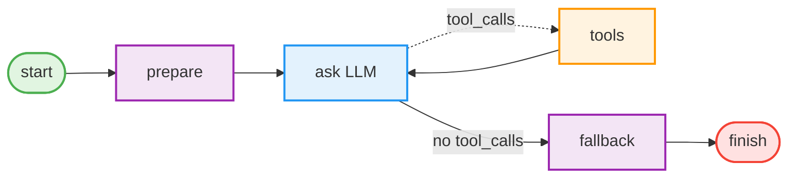
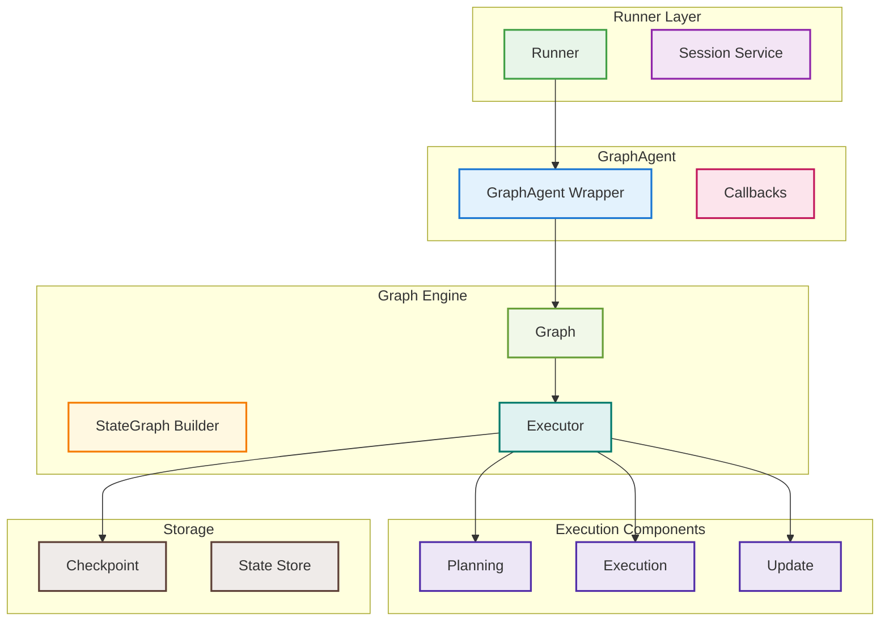
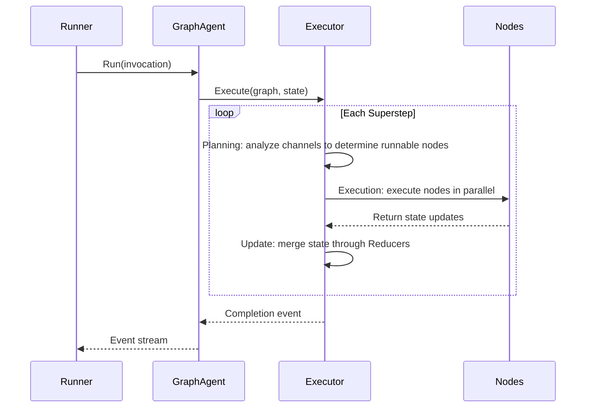
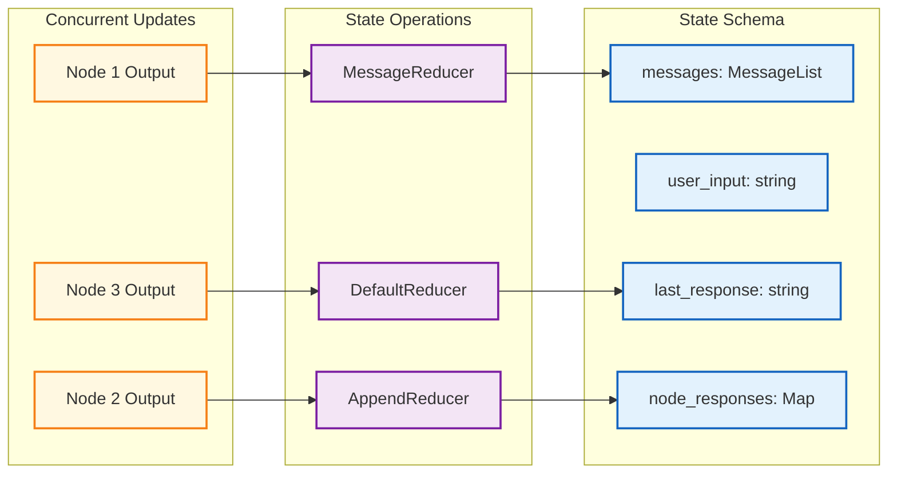

# tRPC-Agent-Go: GraphAgent Seamlessly Combines AI Workflows and Agents

> In AI Agent development, balancing intelligence and controllability has always been a core challenge. The GraphAgent module in tRPC-Agent-Go provides a unique solution: by deeply integrating a graph orchestration engine with the Agent framework, developers can enjoy the intelligent decision-making capabilities of LLMs while retaining precise control over the execution flow. This article introduces GraphAgent's design philosophy, core mechanisms, and best practices to help you quickly build AI Graph Agent systems.

## Background

In recent years, AI Agent practices have generally followed two paths:

- Workflow orchestration: explicitly control the flow with nodes and edges, represented by [LangGraph](https://github.com/langchain-ai/langgraph), [LangChain](https://github.com/langchain-ai/langchain), and [Eino](https://github.com/cloudwego/eino). The advantage is controllability and debuggability. The limitation is reduced flexibility.
- Autonomous collaboration: use the LLM as the smallest unit and let it make decisions autonomously, represented by [Microsoft AutoGen](https://github.com/microsoft/autogen), [Google ADK](https://github.com/google/adk-python), and [Agno](https://github.com/agno-agi/agno). The advantage is simplicity and adaptability. The limitation is unpredictable behavior and difficult auditing.

tRPC-Agent-Go initially leaned more toward autonomous collaboration. As the first users adopted it in real business scenarios, we received many requests for graph orchestration. Users wanted controllable execution paths, complete observability, and recoverability for audit, compliance, human review, and precise resume, while still preserving the LLM's intelligent decision-making advantages.

Based on this feedback, we introduced GraphAgent. It is neither a standalone workflow engine nor a pure Agent, but a fusion of both:

- As a Graph: it provides a BSP execution model, conditional and tool routing, and natural parallelism.
- As an Agent: it implements the unified Agent interface, so it can be called by upper layers and can call sub-agents inside the graph.
- Additional capabilities: checkpoint time travel, Human-in-the-Loop, and A2A integration.

The following sections move from usage to design and implementation.

## Quick Start

**Repository**:

- GitHub open-source repository: [github.com/trpc-group/trpc-agent-go](https://github.com/trpc-group/trpc-agent-go)

### First Example

Start with a simple but complete workflow:



The following code turns this graph into a tRPC-Agent-Go GraphAgent implementation:

```go
package main

import (
    "context"
    "fmt"
    "strings"
    
    "trpc.group/trpc-go/trpc-agent-go/agent/graphagent"
    "trpc.group/trpc-go/trpc-agent-go/graph"
    "trpc.group/trpc-go/trpc-agent-go/model"
    "trpc.group/trpc-go/trpc-agent-go/model/openai"
    "trpc.group/trpc-go/trpc-agent-go/runner"
    "trpc.group/trpc-go/trpc-agent-go/tool"
    "trpc.group/trpc-go/trpc-agent-go/tool/function"
)

func main() {
    ctx := context.Background()
    
    // Recommended: define the schema first, then build the graph.
    // Conversational apps can reuse the message schema directly, including messages, user_input, last_response, and node_responses.
    // Non-conversational or structured tasks can use NewStateSchema to define fields and reducers explicitly.
    // This example uses the built-in message schema.
    sg := graph.NewStateGraph(graph.MessagesStateSchema())
    
    // Constant definitions to avoid magic strings.
    const (
        NodePrepare  = "prepare"
        NodeAsk      = "ask"
        NodeTools    = "tools"
        NodeFallback = "fallback"
        NodeFinish   = "finish"

        ModelName           = "gpt-4o-mini"
        SystemPromptGeneral = "You are an assistant that can use a calculator tool."
        OutputKeyFinal      = "final_output"
        ToolNameCalculator  = "calculator"
    )

    // The prepare node cleans the input.
    sg.AddNode(NodePrepare, func(ctx context.Context, s graph.State) (any, error) {
        input := s[graph.StateKeyUserInput].(string)
        return graph.State{graph.StateKeyUserInput: strings.TrimSpace(input)}, nil
    })
    
    // The LLM node performs intelligent decision-making.
    model := openai.New(ModelName)
    
    // Define the tool. Note the use of generics and context.
    type CalcInput struct {
        Expression string `json:"expression"`
    }
    type CalcOutput struct {
        Result float64 `json:"result"`
    }
    
    calcTool := function.NewFunctionTool[CalcInput, CalcOutput](
        func(ctx context.Context, in CalcInput) (CalcOutput, error) {
            // Simple calculator implementation.
            return CalcOutput{Result: 42}, nil  // Example.
        },
        function.WithName(ToolNameCalculator),
        function.WithDescription("Calculate mathematical expressions."),
    )
    
    tools := map[string]tool.Tool{ToolNameCalculator: calcTool}
    sg.AddLLMNode(NodeAsk, model, SystemPromptGeneral, tools)
    
    // Tool execution node.
    sg.AddToolsNode(NodeTools, tools)
    
    // The fallback node handles cases where no tool is needed.
    sg.AddNode(NodeFallback, func(ctx context.Context, s graph.State) (any, error) {
        return graph.State{graph.StateKeyLastResponse: "Answered directly."}, nil
    })
    
    // The finish node summarizes the output.
    sg.AddNode(NodeFinish, func(ctx context.Context, s graph.State) (any, error) {
        response := s[graph.StateKeyLastResponse].(string)
        return graph.State{OutputKeyFinal: response}, nil
    })
    
    // Configure routing.
    sg.SetEntryPoint(NodePrepare)
    sg.AddEdge(NodePrepare, NodeAsk)
    // AddToolsConditionalEdges routes from an LLM node to either tools or fallback based on whether tool_calls exist.
    // Tool selection is decided by the LLM, and the tools node can register and execute multiple tools.
    // LLM and tools can form a loop. If no tool is called, execution follows the fallback path.
    sg.AddToolsConditionalEdges(NodeAsk, NodeTools, NodeFallback)  // Conditional routing.
    sg.AddEdge(NodeTools, NodeAsk)
    sg.AddEdge(NodeFallback, NodeFinish)
    sg.SetFinishPoint(NodeFinish)
    
    // Compile the graph.
    g, err := sg.Compile()
    if err != nil {
        panic(err)
    }
    
    // Create GraphAgent. Use a distinct variable name to avoid conflict with the agent package.
    graphAgent, err := graphagent.New("demo", g)
    if err != nil {
        panic(err)
    }
    
    // Create Runner and execute.
    r := runner.NewRunner("app", graphAgent)
    
    // Run and handle the event stream.
    const (
        UserID      = "user1"
        SessionID   = "session1"
        UserMessage = "What is 1 + 1?"
    )
    eventCh, err := r.Run(ctx, UserID, SessionID, model.NewUserMessage(UserMessage))
    if err != nil {
        panic(err)
    }
    
    // Consume the event stream: streaming deltas plus final messages.
    for ev := range eventCh {
        if ev.Error != nil {
            fmt.Printf("error: %s\n", ev.Error.Message)
            continue
        }
        if ev.Response == nil || len(ev.Response.Choices) == 0 {
            continue
        }
        ch := ev.Response.Choices[0]
        // Streaming delta.
        if ev.Response.IsPartial && ch.Delta.Content != "" {
            fmt.Print(ch.Delta.Content)
            continue
        }
        // Final message.
        if !ev.Response.IsPartial && ch.Message.Content != "" {
            fmt.Println("\noutput:", ch.Message.Content)
        }
    }
}
```

This example shows that using Graph Agent requires explicitly creating nodes and connecting edges. Next, we introduce the core concepts of Graph Agent in detail.

## Core Concepts

### State Management

GraphAgent manages state through a Schema + Reducer pattern. You first define the state structure and merge rules, then keys used by node inputs and outputs have clear origins and lifecycle contracts.

#### Using the Built-in Schema

```go
import (
    "trpc.group/trpc-go/trpc-agent-go/graph"
)

schema := graph.MessagesStateSchema()

// Predefined fields and semantics:
// - graph.StateKeyMessages       ("messages")        Conversation history. Uses []model.Message and atomic MessageReducer + MessageOp merging.
// - graph.StateKeyUserInput      ("user_input")      User input. It is one-shot and cleared after successful execution.
// - graph.StateKeyLastResponse   ("last_response")   Last response as a string.
// - graph.StateKeyNodeResponses  ("node_responses")  Per-node output map for parallel aggregation.
// - graph.StateKeyMetadata       ("metadata")        Metadata map merged by MergeReducer.

// Other one-shot or system keys used as needed:
// - graph.StateKeyOneShotMessages ("one_shot_messages")  One-shot override for current input, []model.Message.
// - graph.StateKeySession         ("session")            Session object used by the system.
// - graph.StateKeyExecContext     ("exec_context")       Execution context, including event streams, used by the system.
```

#### Custom Schema

```go
import (
    "reflect"

    "trpc.group/trpc-go/trpc-agent-go/graph"
)

schema := graph.NewStateSchema()

// Add a custom field.
schema.AddField("counter", graph.StateField{
    Type:    reflect.TypeOf(0),
    Default: func() any { return 0 },
    Reducer: func(old, new any) any {
        return old.(int) + new.(int)  // Accumulate.
    },
})

// Use the built-in reducer for string slices.
schema.AddField("items", graph.StateField{
    Type:    reflect.TypeOf([]string{}),
    Default: func() any { return []string{} },
    Reducer: graph.StringSliceReducer,
})
```

The Reducer mechanism ensures state fields are merged safely according to predefined rules, which is especially important during concurrent execution.

Tip: define constants for business keys to avoid scattered magic strings.

### Node Types

GraphAgent provides four built-in node types.

#### Function Node

The most basic node type executes custom logic:

```go
import (
    "context"

    "trpc.group/trpc-go/trpc-agent-go/graph"
)

const (
    StateKeyInput  = "input"
    StateKeyOutput = "output"
)

sg.AddNode("process", func(ctx context.Context, state graph.State) (any, error) {
    data := state[StateKeyInput].(string)
    processed := transform(data)
    // Function nodes must explicitly specify output keys.
    return graph.State{StateKeyOutput: processed}, nil
})
```

#### LLM Node

An LLM node integrates a language model and automatically manages conversation history:

```go
import (
    "trpc.group/trpc-go/trpc-agent-go/graph"
    "trpc.group/trpc-go/trpc-agent-go/model/openai"
)

const (
    LLMModelName     = "gpt-4o-mini"
    LLMSystemPrompt  = "System prompt."
    LLMNodeAssistant = "assistant"
)

model := openai.New(LLMModelName)
sg.AddLLMNode(LLMNodeAssistant, model, LLMSystemPrompt, tools)

// LLM node input and output rules:
// Input priority: one_shot_messages > user_input > messages.
// Output: last_response, messages with atomic updates, and node_responses containing the current node output for parallel aggregation.
```

#### Tools Node

A Tools node executes tool calls. Note that execution is sequential:

```go
import (
    "trpc.group/trpc-go/trpc-agent-go/graph"
)

const nodeTools = "tools"

sg.AddToolsNode(nodeTools, tools)
// Multiple tools are executed in the order returned by the LLM.
// For parallel execution, use multiple nodes plus parallel edges.
```

#### Agent Node

An Agent node embeds a sub-agent to enable multi-agent collaboration:

```go
import (
    "trpc.group/trpc-go/trpc-agent-go/agent"
    "trpc.group/trpc-go/trpc-agent-go/agent/graphagent"
)

const (
    SubAgentNameAnalyzer = "analyzer"
    GraphAgentNameMain   = "main"
)

// Important: the node ID must match the sub-agent name.
sg.AddAgentNode(SubAgentNameAnalyzer)

// Agent instances are injected when creating the GraphAgent.
analyzer := createAnalyzer()  // The name must be "analyzer".
graphAgent, _ := graphagent.New(GraphAgentNameMain, g,
    graphagent.WithSubAgents([]agent.Agent{analyzer}))
```

### Edges and Routing

Edges define how execution flows between nodes:

```go
import (
    "context"

    "trpc.group/trpc-go/trpc-agent-go/graph"
)

// Centralized constants improve readability.
const (
    NodeA        = "nodeA"
    NodeB        = "nodeB"
    NodeDecision = "decision"
    NodePathA    = "pathA"
    NodePathB    = "pathB"

    RouteToPathA = "route_to_pathA"
    RouteToPathB = "route_to_pathB"
    StateKeyFlag = "flag"
)

// Normal edge: sequential execution.
sg.AddEdge(NodeA, NodeB)

// Conditional edge: dynamic routing. The third parameter is a path map and should be provided explicitly for static validation.
// Define target nodes first.
sg.AddNode(NodePathA, handlerA)
sg.AddNode(NodePathB, handlerB)
// Then add conditional routing.
sg.AddConditionalEdges(NodeDecision, 
    func(ctx context.Context, s graph.State) (string, error) {
        if s[StateKeyFlag].(bool) {
            return RouteToPathA, nil
        }
        return RouteToPathB, nil
    }, map[string]string{
        RouteToPathA: NodePathA,
        RouteToPathB: NodePathB,
    })

// Tool conditional edge: handle LLM tool calls.
const (
    NodeLLM      = "llm"
    NodeToolsUse = "tools"
    NodeFallback = "fallback"
)
sg.AddToolsConditionalEdges(NodeLLM, NodeToolsUse, NodeFallback)

// Parallel edges: automatic parallel execution.
const (
    NodeSplit   = "split"
    NodeBranch1 = "branch1"
    NodeBranch2 = "branch2"
)
sg.AddEdge(NodeSplit, NodeBranch1)
sg.AddEdge(NodeSplit, NodeBranch2)  // branch1 and branch2 execute in parallel.
```

## Architecture Design

### Overall Architecture

GraphAgent's architecture reflects a layered approach to managing complexity. Each layer has clear responsibilities and communicates with other layers through standard interfaces.



### Core Modules

Each core file reflects the framework's adaptation of industry practices and its own design choices.

**`graph/state_graph.go`** - StateGraph builder  
Provides a chainable declarative Go API for building graph structures. Nodes, edges, and conditional routing are defined through fluent method chains such as AddNode → AddEdge → Compile.

**`graph/graph.go`** - Compiled runtime  
Implements a channel-based event-triggered execution mechanism. Node execution results are merged into State. Channels are used only to trigger routing and carry sentinel values, not business data.

**`graph/executor.go`** - Pregel/BSP executor  
This is the heart of the system and is inspired by the [Google Pregel](https://research.google/pubs/pub37252/) paper. It implements a BSP, or Bulk Synchronous Parallel, three-phase loop: Planning → Execution → Update.

**`graph/checkpoint/*`** - Checkpoint and recovery mechanism  
Uses SQLite transactions for atomic persistence, saving state snapshots and PendingWrites. It supports checkpoint branching through parent-child relationships, enabling basic time travel and branch management.

**`agent/graphagent/graph_agent.go`** - Bridge into the ecosystem  
The GraphAgent wrapper handles session injection and callback forwarding so that Graph can integrate seamlessly into the tRPC-Agent-Go ecosystem.

### Execution Model

GraphAgent borrows Google Pregel's BSP, or Bulk Synchronous Parallel, model and adapts it to a single-process environment:



The key points are:

1. **Planning Phase**: determines which nodes should execute in the current step based on channel state.
2. **Execution Phase**: each node receives a shallow copy of the state, created with maps.Copy, and executes in parallel.
3. **Update Phase**: node state updates are merged through Reducers to ensure concurrency safety.

This design makes every step observable, safely interruptible, and recoverable.

## Integration with Multi-Agent Systems

GraphAgent is designed to be part of the tRPC-Agent-Go multi-agent ecosystem rather than a standalone component. It implements the standard Agent interface and can collaborate seamlessly with other Agent types.

### GraphAgent as an Agent

GraphAgent implements the standard Agent interface:

```go
import (
    "trpc.group/trpc-go/trpc-agent-go/agent"
    "trpc.group/trpc-go/trpc-agent-go/agent/chainagent"

)

// It can be used directly inside ChainAgent, ParallelAgent, and CycleAgent.
chain := chainagent.New("chain",
    chainagent.WithSubAgents([]agent.Agent{
        graphAgent1,  // Structured workflow 1.
        graphAgent2,  // Structured workflow 2.
    }))
```

### Embedding Agents in a Graph

Inside a graph, existing sub-agents can be invoked as nodes. The following example shows how to create sub-agents, declare corresponding nodes, and inject them when constructing the GraphAgent.

```go
import (
    "trpc.group/trpc-go/trpc-agent-go/agent"
    "trpc.group/trpc-go/trpc-agent-go/agent/graphagent"

)

// Create sub-agents.
const (
    SubAgentAnalyzer = "analyzer"
    SubAgentReviewer = "reviewer"
)
analyzer := createAnalyzer()  // The name must be "analyzer".
reviewer := createReviewer()  // The name must be "reviewer".

// Declare Agent nodes in the graph.
sg.AddAgentNode(SubAgentAnalyzer)
sg.AddAgentNode(SubAgentReviewer)

// Inject sub-agents when creating GraphAgent.
graphAgent, _ := graphagent.New("workflow", g,
    graphagent.WithSubAgents([]agent.Agent{
        analyzer,
        reviewer,
    }))

// Note: sub-agents receive only user_input, and outputs are written to node_responses[nodeID].
```

### Hybrid Pattern Example

Embedding dynamic decision-making inside a structured flow:

```go
import (
    "trpc.group/trpc-go/trpc-agent-go/agent"
    "trpc.group/trpc-go/trpc-agent-go/agent/chainagent"
    "trpc.group/trpc-go/trpc-agent-go/agent/graphagent"
    "trpc.group/trpc-go/trpc-agent-go/graph"
    
)

sg := graph.NewStateGraph(schema)

// Structured data preparation.
sg.AddNode("prepare", prepareData)

// Dynamic decision point using ChainAgent.
dynamicAgent := chainagent.New("analyzer",
    chainagent.WithSubAgents([]agent.Agent{...}))
sg.AddAgentNode("analyzer")

// Continue the structured flow.
sg.AddNode("finalize", finalizeResults)

// Connect the flow.
sg.SetEntryPoint("prepare")
sg.AddEdge("prepare", "analyzer")     // Hand over to the dynamic Agent.
sg.AddEdge("analyzer", "finalize")    // Return to the structured flow.
sg.SetFinishPoint("finalize")

// Inject at creation time.
graphAgent, _ := graphagent.New("hybrid", g,
    graphagent.WithSubAgents([]agent.Agent{dynamicAgent}))
```

## Core Mechanisms

### State Management: Schema + Reducer Pattern

State management is one of the core challenges in graph workflows. GraphAgent uses a Schema + Reducer mechanism that provides runtime type validation while supporting high-concurrency atomic updates.



Graph state is internally a `map[string]any`. `StateSchema` provides runtime type checks and field validation. The Reducer mechanism ensures state fields are merged safely according to predefined rules, avoiding conflicts during concurrent updates.

### LLM Input Rules: A Three-Path Design

LLM node input handling is a carefully designed feature. The simple-looking three-path rule solves common context management problems in AI applications.

An LLM node has a fixed input selection logic that requires no extra configuration:

1. **Use `one_shot_messages` first**: completely override this turn's input, including system and user messages, and clear it after execution.
2. **Then use `user_input`**: append the current user message on top of `messages`, atomically write the assistant response back into `messages`, then clear `user_input`.
3. **Otherwise use only `messages`**: common when entering the LLM again from a tool loop after `user_input` has been cleared.

This rule is valuable because it allows preprocessing nodes to rewrite `user_input` and have it take effect in the same turn, while naturally supporting tool loops such as tool_calls → tools → LLM.

Examples showing the three input paths:

```go
// OneShot fully overrides the current turn input, including system and user messages.
// It is suitable when an upstream node constructs the full prompt.
import (
    "trpc.group/trpc-go/trpc-agent-go/graph"
    "trpc.group/trpc-go/trpc-agent-go/model"
    
)

const (
    SystemPrompt = "You are a careful and reliable assistant."
    UserPrompt   = "Please summarize this text in bullet points."
)

sg.AddNode("prepare_prompt", func(ctx context.Context, s graph.State) (any, error) {
    oneShot := []model.Message{
        model.NewSystemMessage(SystemPrompt),
        model.NewUserMessage(UserPrompt),
    }
    return graph.State{graph.StateKeyOneShotMessages: oneShot}, nil
})
// When execution later enters an LLM node, only one_shot_messages is used and then cleared.
```

```go
// UserInput appends the current user input to historical messages.
import (
    "strings"

    "trpc.group/trpc-go/trpc-agent-go/graph"
    
)

const (
    StateKeyCleanedInput = "cleaned_input"
)

sg.AddNode("clean_input", func(ctx context.Context, s graph.State) (any, error) {
    in := strings.TrimSpace(s[graph.StateKeyUserInput].(string))
    return graph.State{
        graph.StateKeyUserInput: in,                // Write the cleaned input back. The LLM node atomically writes user + assistant into messages.
        StateKeyCleanedInput:    in,                // Also keep a custom business key.
    }, nil
})
```

```go
// Messages-only is used after the tool loop returns and user_input has been cleared.
// The LLM continues reasoning based only on messages, including tool responses.
import (
    "trpc.group/trpc-go/trpc-agent-go/graph"
    
)

sg.AddToolsNode("exec_tools", tools)
sg.AddToolsConditionalEdges("ask", "exec_tools", "fallback")
// When execution returns to "ask" or a downstream LLM node, user_input has been cleared, so messages-only is used.
```

### Concurrent Execution and State Safety

When a node has multiple outgoing edges, parallel execution is triggered automatically:

```go
import (
    "trpc.group/trpc-go/trpc-agent-go/graph"
    
)

// This graph structure executes automatically in parallel.
stateGraph.
    AddNode("analyze", analyzeData).
    AddNode("generate_report", generateReport). 
    AddNode("call_external_api", callAPI).
    AddEdge("analyze", "generate_report").    // These two execute in parallel.
    AddEdge("analyze", "call_external_api")
```

The internal implementation ensures concurrency safety. The executor creates a shallow copy for every task with maps.Copy and locks during merging. Reducers then safely combine concurrent updates.

## Advanced Features

### Checkpointing and Recovery

To support time travel and reliable recovery, configure a checkpoint saver for the executor. The following example shows how to use a SQLite Saver to persist checkpoints and resume from a specific checkpoint in a later run.

```go
import (
    "database/sql"

    _ "github.com/mattn/go-sqlite3"
    
    
    "trpc.group/trpc-go/trpc-agent-go/agent"            // Used for WithRuntimeState.
    "trpc.group/trpc-go/trpc-agent-go/agent/graphagent" // Published as an executable Agent.
    "trpc.group/trpc-go/trpc-agent-go/graph"            // Recovery config keys.
    "trpc.group/trpc-go/trpc-agent-go/graph/checkpoint/sqlite"
    "trpc.group/trpc-go/trpc-agent-go/model"
)

// Configure checkpointing.
db, _ := sql.Open("sqlite3", "./checkpoints.db")
saver, _ := sqlite.NewSaver(db)

graphAgent, _ := graphagent.New("workflow", g,
    graphagent.WithCheckpointSaver(saver))

// Checkpoints are saved automatically during execution. By default, each step is saved.

// Resume from a checkpoint.
eventCh, err := r.Run(ctx, userID, sessionID,
    model.NewUserMessage("resume"),
    agent.WithRuntimeState(map[string]any{
        graph.CfgKeyCheckpointID: "ckpt-123",
    }),
)
```

### Human-in-the-Loop

Adding human confirmation to critical paths significantly improves controllability. The following example shows a basic interrupt-and-resume flow:

```go
import (
    "context"
    "fmt"

    
    "trpc.group/trpc-go/trpc-agent-go/agent"
    "trpc.group/trpc-go/trpc-agent-go/graph"
    "trpc.group/trpc-go/trpc-agent-go/model"
)

const (
    StateKeyContent      = "content"
    StateKeyDecision     = "decision"
    InterruptKeyReview   = "review_key"
)

sg.AddNode("review", func(ctx context.Context, s graph.State) (any, error) {
    content := s[StateKeyContent].(string)

    // Interrupt and wait for human input.
    result, err := graph.Interrupt(ctx, s, InterruptKeyReview,
        fmt.Sprintf("Please review: %s", content))
    if err != nil {
        return nil, err
    }

    return graph.State{StateKeyDecision: result}, nil
})

// Resume execution. The agent package must be imported.
eventCh, err := r.Run(ctx, userID, sessionID,
    model.NewUserMessage("resume"),
    agent.WithRuntimeState(map[string]any{
        graph.CfgKeyCheckpointID: checkpointID,
        graph.StateKeyResumeMap: map[string]any{
            "review_key": "approved",
        },
    }),
)
```

### Event Monitoring

The event stream carries the full graph execution process and model deltas. The following example shows how to iterate events and distinguish graph events from model deltas:

```go
import (
    "fmt"

    
    "trpc.group/trpc-go/trpc-agent-go/graph"
)

for ev := range eventCh {
    if ev.Response == nil {
        continue
    }
    // Dispatch by object type. Graph extension event types are defined in graph/events.go.
    switch ev.Response.Object {
    case graph.ObjectTypeGraphNodeStart:
        fmt.Println("node started")
    case graph.ObjectTypeGraphNodeComplete:
        fmt.Println("node completed")
    case graph.ObjectTypeGraphChannelUpdate:
        fmt.Println("channel updated")
    case graph.ObjectTypeGraphCheckpoint, graph.ObjectTypeGraphCheckpointCommitted:
        fmt.Println("checkpoint event")
    }
    // Also handle model deltas and final output.
    if len(ev.Response.Choices) > 0 {
        ch := ev.Response.Choices[0]
        if ev.Response.IsPartial && ch.Delta.Content != "" {
            fmt.Print(ch.Delta.Content)
        } else if !ev.Response.IsPartial && ch.Message.Content != "" {
            fmt.Println("\noutput:", ch.Message.Content)
        }
    }
}
```

In actual usage, filter with the `Author` field:

- Node-level events, including model, tool, and node start/end events: `Author = <nodeID>`. If no node ID is available, it is `graph-node`.
- Pregel events, including planning, execution, update, and errors: `Author = graph-pregel`.
- Executor-level events, including state updates and checkpoints: `Author = graph-executor`.
- User input events written by Runner: `Author = user`.

With this convention, you can subscribe precisely to the streaming output of a specific node without passing streaming context between nodes. Streaming is carried by the event channel, while state is still passed as structured State in the LangGraph style.

Example: consume only the streaming output of node `ask`, and print the final message when it completes.

```go
import (
    "fmt"

    
    "trpc.group/trpc-go/trpc-agent-go/graph"
)

const NodeIDWatch = "ask"

for ev := range eventCh {
    // Only watch events from the specified node.
    if ev.Author != NodeIDWatch {
        continue
    }
    if ev.Response == nil || len(ev.Response.Choices) == 0 {
        continue
    }
    choice := ev.Response.Choices[0]

    // Streaming delta from the node.
    if ev.Response.IsPartial && choice.Delta.Content != "" {
        fmt.Print(choice.Delta.Content)
        continue
    }

    // Final complete message from the node.
    if !ev.Response.IsPartial && choice.Message.Content != "" {
        fmt.Println("\n[ask] final output:", choice.Message.Content)
    }
}
```

Callbacks can also be configured at the Agent level:

```go
import (
    "trpc.group/trpc-go/trpc-agent-go/agent"
    "trpc.group/trpc-go/trpc-agent-go/model"
    
)

// Method 1: build and register callbacks. Recommended.
cb := agent.NewCallbacks().
    RegisterBeforeAgent(func(ctx context.Context, inv *agent.Invocation) (*model.Response, error) {
        // Returning a non-nil *model.Response can short-circuit this run directly.
        return nil, nil
    }).
    RegisterAfterAgent(func(ctx context.Context, inv *agent.Invocation, runErr error) (*model.Response, error) {
        // Final responses can be modified or replaced uniformly here.
        return nil, nil
    })

graphAgent, _ := graphagent.New("workflow", g,
    graphagent.WithAgentCallbacks(cb),
)
```

## Practical Case

### Approval Workflow

```go
import (
    "context"
    "fmt"
    "strings"

    "trpc.group/trpc-go/trpc-agent-go/graph"
    "trpc.group/trpc-go/trpc-agent-go/model/openai"
    
)

func buildApprovalWorkflow() (*graph.Graph, error) {
    sg := graph.NewStateGraph(graph.MessagesStateSchema())

    // AI initial review using an LLM model.
    const (
        ModelNameApprove      = "gpt-4o-mini"
        PromptApproveDecision = "Determine whether the application meets the requirements. Reply approve or reject."

        NodeAIReview   = "ai_review"
        NodeHumanReview = "human_review"
        NodeApprove    = "approve"
        NodeReject     = "reject"

        RouteHumanReview = "route_human_review"
        RouteReject      = "route_reject"
        RouteApprove     = "route_approve"

        StateKeyApplication = "application"
        StateKeyDecision    = "decision"
    )

    llm := openai.New(ModelNameApprove)
    sg.AddLLMNode(NodeAIReview, llm, PromptApproveDecision, nil)

    // Conditional routing to human review or rejection.
    sg.AddConditionalEdges(NodeAIReview,
        func(ctx context.Context, s graph.State) (string, error) {
            resp := s[graph.StateKeyLastResponse].(string)
            if strings.Contains(resp, "approve") {
                return RouteHumanReview, nil
            }
            return RouteReject, nil
        }, map[string]string{
            RouteHumanReview: NodeHumanReview,
            RouteReject:      NodeReject,
        })

    // Human review node.
    sg.AddNode(NodeHumanReview, func(ctx context.Context, s graph.State) (any, error) {
        app := s[StateKeyApplication].(string)
        decision, err := graph.Interrupt(ctx, s, "approval",
            fmt.Sprintf("Please approve: %s", app))
        if err != nil {
            return nil, err
        }
        return graph.State{StateKeyDecision: decision}, nil
    })

    // Result handling.
    sg.AddNode(NodeApprove, func(ctx context.Context, s graph.State) (any, error) {
        // Execute approval logic.
        return graph.State{"status": "approved"}, nil
    })
    sg.AddNode(NodeReject, func(ctx context.Context, s graph.State) (any, error) {
        return graph.State{"status": "rejected"}, nil
    })

    // Configure the flow.
    sg.SetEntryPoint(NodeAIReview)
    sg.AddConditionalEdges(NodeHumanReview,
        func(ctx context.Context, s graph.State) (string, error) {
            if s[StateKeyDecision] == "approve" {
                return RouteApprove, nil
            }
            return RouteReject, nil
        }, map[string]string{
            RouteApprove: NodeApprove,
            RouteReject:  NodeReject,
        })

    return sg.Compile()
}
```

## Summary

This article introduced the GraphAgent module in tRPC-Agent-Go, including its usage, design philosophy, and implementation. GraphAgent organically combines graph orchestration with the Agent form. It meets engineering needs for deterministic workflows while preserving the flexibility of intelligent decision-making. It is both a Graph with BSP supersteps, conditional and tool routing, and parallelism, and an Agent that implements the unified interface and supports nested sub-agents. For state management, GraphAgent uses Schema and Reducer mechanisms to maintain shared State and uses MessageOp for atomic message history updates, effectively avoiding concurrency and duplication issues. The event system carries both streaming deltas and process information. With the `Author` field, such as nodeID, graph-pregel, graph-executor, and user, consumers can precisely filter the events they need. GraphAgent also provides controllability features such as checkpoint time travel, including lineage and atomic persistence, Human-in-the-Loop interruption and resume, and A2A integration.

GraphAgent is especially suitable for approval and compliance, content review, step-by-step data processing, human-agent collaboration, and other critical business scenarios that require full auditing and precise recovery. It is also suitable for complex flows that need to orchestrate multiple Agents structurally. For open-ended conversations, single-step tasks, or scenarios that mainly rely on autonomous exploration, LLMAgent or ChainAgent is often lighter.

In production, conversational applications should usually start with `MessagesStateSchema()`, while non-conversational scenarios can use `NewStateSchema()` to define fields and Reducers explicitly. Node names, route labels, and state keys should be managed as constants, and `AddConditionalEdges(..., map[string]string{...})` should be used to make static reachability explicit. The event stream can drive UI or logging systems. Use `Response.Object` to distinguish event types and `Author` to filter precisely to a node's deltas and final results. Enable checkpoints when recovery is required, introduce interrupt-and-resume for critical decisions, and embed sub-agents for complex flows.

It is worth emphasizing GraphAgent's close integration with the tRPC-Agent-Go multi-agent ecosystem. GraphAgent can be freely composed with ChainAgent, ParallelAgent, CycleAgent, LLMAgent, and other agent types. You can embed decision-making Agents inside a graph, or let ChainAgent, ParallelAgent, and CycleAgent schedule multiple GraphAgents. This combines structured execution and intelligent behavior to better serve business goals.

## References

**Code Repository**:

- [tRPC-Agent-Go repository](https://github.com/trpc-group/trpc-agent-go)

**External References**:

- [Google Pregel](https://research.google/pubs/pub37252/) - Paper on the BSP model.
- [Building effective agents](https://www.anthropic.com/engineering/building-effective-agents) - Anthropic's Agent design guide.

## Usage and Discussion

You are welcome to use the tRPC-Agent-Go framework. For detailed documentation and examples, visit the [tRPC-Agent-Go repository](https://github.com/trpc-group/trpc-agent-go).

Feel free to discuss framework usage, share best practices, and propose improvements through GitHub Issues. Together, we can advance Go in the AI Agent ecosystem.
