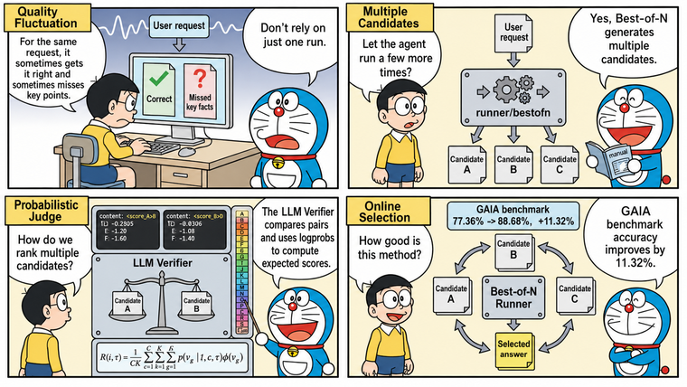

# tRPC-Agent-Go LLM Verifier: Improving AI Agent Quality and Stability

> When an Agent enters an online call path, quality risk does not only come from obvious failures. It also comes from result variance caused by probabilistic LLM generation. For the same class of requests, the Agent may sometimes answer correctly, but occasionally miss key facts, deviate from the expected tool-call path, or fail to satisfy output constraints. tRPC-Agent-Go uses online Best-of-N to generate multiple candidates for the same request. LLM Verifier calls a judge model to compare candidates pairwise, computes comparison scores from the logprobs at quality-label positions, and finally returns the highest-quality candidate as the run result. On the GAIA benchmark, LLM Verifier improves accuracy by 11.32% over the baseline.

> [tRPC-Agent-Go](https://github.com/trpc-group/trpc-agent-go/) is an autonomous multi-Agent framework for Go. It provides tool calling, session and memory management, artifact management, multi-Agent collaboration, graph orchestration, knowledge bases, observability, and more. It also integrates deeply with the tRPC-Go ecosystem so applications can reuse its service governance capabilities. tRPC-Agent-Go grows with community support. Stars are welcome.

tRPC-Agent-Go provides LLM Verifier on top of its Evaluation capabilities, and supports online Best-of-N at the Runner layer through `runner/bestofn`. This lets evaluation results participate in online Agent quality optimization. Developers can generate multiple candidates for the same request, compare candidate quality pairwise with a judge model, select the highest-quality result by comparison score, and return it through the regular Runner call path.



## Background

Because LLM generation is probabilistic, online Agent runs can show quality variance. For the same class of requests, the Agent may sometimes answer correctly, but occasionally miss key facts, deviate from the expected tool-call path, or fail to satisfy output constraints. Running the same request multiple times may also produce different retrieval results, tool-call paths, and final answers. If the system always returns the first run, final quality is determined by a single sample, and higher-quality answers that appear in other runs cannot be used.

Best-of-N aims to run the same request multiple times and select the highest-quality result from the candidates. After candidates are generated, however, the system still needs a reliable automatic selection mechanism. Rule checks are useful for catching obvious failures and format errors, but they cannot tell which of two valid answers is better. A regular LLM Judge scores each candidate independently, and when long answers have similar quality, it may assign the same score bucket, making stable ranking difficult.

LLM Verifier targets multi-candidate selection. It asks the judge model to compare two candidates, reads logprobs at the quality-label positions, and converts the judge preference into a comparison score. In tRPC-Agent-Go, `runner/bestofn` organizes candidate generation and result selection at the Runner layer, while Evaluation metrics perform pairwise judging and return the highest-quality candidate to the caller.

## LLM Verifier Explained

[LLM-as-a-Verifier](https://llm-as-a-verifier.notion.site/) is a general verification framework proposed by Stanford AI Lab, UC Berkeley Sky Computing Lab, and NVIDIA. It uses a judge model to evaluate candidate quality, and is suitable when multiple candidates are generated for the same request and the system needs to select the highest-quality result. A verification usually contains four kinds of input: user request, candidate result, evaluation criteria, and judge model. The user request defines the task objective, the candidate result is the answer or trajectory being verified, the evaluation criteria describe the quality dimensions to consider, and the judge model assigns quality labels according to those criteria.

A regular LLM Judge often asks the judge model to directly output a discrete quality level and uses that level as the candidate quality. The level may be a number or a letter label. Either way, relying only on the final generated level causes two problems. First, two complex answers may fall into the same bucket, losing ranking resolution. Second, if the judge model is uncertain between adjacent levels, looking only at the final level discards that uncertainty. The core idea of LLM Verifier is to let the judge model express its judgment over an ordered set of quality labels, then read the token logprobs at the quality-label position and compute an expected quality score from the probability distribution.

Quality labels are a strictly ordered set of discrete levels. For example, with 20 levels from A to T, A means highest quality and T means lowest quality. Earlier letters indicate higher quality. A may mean that the answer clearly and completely satisfies the request. B-D indicate only minor issues. E-G indicate that the answer is mostly correct but still has issues. H-J indicate a tendency toward success with uncertainty. K-M indicate a tendency toward failure. N-P indicate significant remaining issues. Q-S indicate failure with partial progress. T indicates clear failure.

During scoring, the judge model generates a label token at the quality-label position. If the model service returns logprobs, the system can also see the log probabilities of other candidate tokens at the same position. Logprobs can be understood as the model's relative preference among quality labels. Values closer to 0 indicate higher probability for the corresponding token. `top_logprobs` reports several high-probability candidate tokens and their logprobs at that position.

```json
{
  "token": "B",
  "logprob": -0.20,
  "top_logprobs": [
    { "token": "B", "logprob": -0.20 },
    { "token": "C", "logprob": -1.10 },
    { "token": "D", "logprob": -2.30 }
  ]
}
```

This fragment means that the judge model finally generated `B` at the quality-label position, while also assigning some probability to `C` and `D` at the same position. LLM Verifier does not treat `B` as the only conclusion. Instead, it includes these labels in expected-score calculation. This preserves the judge model's uncertainty between adjacent quality levels and reduces ties and jitter caused by relying on a single discrete label.

In formula form, one verification can be seen as taking the expectation over the quality-label probability distribution. Suppose there are $G$ quality labels, and the $g$-th label is $v_g$. For task $t$, candidate trajectory $\tau$, and evaluation criterion $c$, the judge model assigns a probability $p(v_g \mid t, c, \tau)$ to each quality label. $\phi(v_g)$ denotes the numeric score for that label. A single verification returns a weighted average over all quality-label scores rather than a hard label.

$$
\text{score}(t, c, \tau) = \sum_{g=1}^{G} p(v_g \mid t, c, \tau)\phi(v_g)
$$

If $C$ evaluation criteria are used and the same candidate is verified $K$ times, the final quality score can be written as:

$$
R(t, \tau) = \frac{1}{CK} \sum_{c=1}^{C} \sum_{k=1}^{K} \sum_{g=1}^{G} p(v_g \mid t, c, \tau)\phi(v_g)
$$

That is, each evaluation criterion and each verification first computes a weighted score from the quality-label probabilities. Scores from multiple criteria and repeated verifications are then averaged to form the candidate's final quality score. Repeated verification reduces variance from single judge samples, while multiple criteria prevent candidate quality from being determined by a single dimension. The higher the final score, the more the judge model tends to consider the candidate high quality under the given task and criteria.

When the same task has $N$ candidate trajectories, LLM Verifier can use a round-robin tournament to select the final result. Candidates are paired with each other, each pair receives quality scores, and the higher-scoring candidate wins that matchup. After all $\binom{N}{2}$ comparisons are complete, the candidate with the most wins is selected. This process does not require the judge model to output a full ranking at once. It only compares two candidates at a time and then selects the final result by win count. This fits Best-of-N scenarios because the system can still perform stable pairwise selection as candidate count increases.

LLM-as-a-Verifier reaches SOTA results on Terminal-Bench 2.0 and SWE-Bench Verified, as shown below.


In the original experiments, Terminal-Bench 2.0 used ForgeCode with Claude Opus 4.6 to sample 5 candidate trajectories. SWE-Bench Verified used mini-swe-agent with Claude Opus 4.6, Gemini 3 Flash, and Claude Opus 4.5, sampling 3 candidate trajectories for each model. The judge model was Gemini 2.5 Flash. The final results reached 86.4% on Terminal-Bench 2.0 and 77.8% on SWE-Bench Verified.

## Quick Start

This section uses [examples/evaluation/llmverifier](https://github.com/trpc-group/trpc-agent-go/tree/main/examples/evaluation/llmverifier) to demonstrate the minimal LLM Verifier integration. The example lets an online Agent generate multiple candidates for the same prompt, uses a judge Agent to compare candidates pairwise, and returns only the selected highest-quality answer to the caller.

### Environment Setup

The example requires an OpenAI-compatible candidate model and a judge model that supports `logprobs` and `top_logprobs`. The candidate model generates multiple candidate answers. The judge model assigns quality labels to candidates and returns the probability distribution at the label token. `OPENAI_API_KEY` is required, and `OPENAI_BASE_URL` is used to connect to a compatible gateway. The command-line flags pass both values to the candidate Agent and judge Agent.

```bash
# Set the model service key.
export OPENAI_API_KEY="sk-xxx"
# Optional. Defaults to the OpenAI-compatible default endpoint when not set.
export OPENAI_BASE_URL="https://api.openai.com/v1"
```

### Candidate Agent

The candidate Agent is the business Agent being verified. It generates candidate answers for the same user input.

```go
import (
    "trpc.group/trpc-go/trpc-agent-go/agent/llmagent"
    "trpc.group/trpc-go/trpc-agent-go/model"
    "trpc.group/trpc-go/trpc-agent-go/model/openai"
)

candidate := llmagent.New(
    "candidate-agent",
    llmagent.WithModel(openai.New(modelName, opts...)),
    llmagent.WithInstruction("You are a helpful assistant."),
    llmagent.WithGenerationConfig(model.GenerationConfig{
        MaxTokens: intPtr(maxTokens),
        Temperature: floatPtr(temperature),
        Stream: true,
    }),
)
```

### Judge Agent

The judge Agent must enable `Logprobs`, and `TopLogprobs` should be set high enough to cover the A-to-T quality labels. The example uses 20 labels, so `topLogprobs` is set to 20.

```go
import (
    "trpc.group/trpc-go/trpc-agent-go/agent/llmagent"
    "trpc.group/trpc-go/trpc-agent-go/model"
    "trpc.group/trpc-go/trpc-agent-go/model/openai"
)

logprobs := true
topLogprobs := 20
judger := llmagent.New(
    "judge-agent",
    llmagent.WithModel(openai.New(modelName, opts...)),
    llmagent.WithGenerationConfig(model.GenerationConfig{
        MaxTokens:   intPtr(maxTokens),
        Temperature: floatPtr(0),
        Stream:      false,
        // Logprobs enables probability output for the quality-label token.
        Logprobs:    &logprobs,
        // TopLogprobs covers the 20 A-to-T quality labels.
        TopLogprobs: &topLogprobs,
    }),
)
```

### Judge Metric

`llm_verifier_pairwise` is an LLM Judge evaluator. The metric uses `0.5` as the `Threshold`. A score greater than 0.5 means Candidate A is better, a score less than 0.5 means Candidate B is better, and a score equal to 0.5 means the two candidates have comparable quality.

```go
import (
    "trpc.group/trpc-go/trpc-agent-go/evaluation/metric"
    "trpc.group/trpc-go/trpc-agent-go/evaluation/metric/criterion"
    criterionllm "trpc.group/trpc-go/trpc-agent-go/evaluation/metric/criterion/llm"
)

llmVerifierMetric := &metric.EvalMetric{
    // MetricName binds the pairwise LLM Verifier evaluator.
    MetricName: "llm_verifier_pairwise",
    // Threshold uses 0.5 as the A/B preference boundary.
    Threshold: 0.5,
    // Criterion provides the evaluation criteria that the judge must follow.
    Criterion: &criterion.Criterion{
        // LLMJudge means this metric is executed by the judge model.
        LLMJudge: &criterionllm.LLMCriterion{
            // Rubrics stores evaluation details that enter the judge prompt and define quality-label semantics.
            Rubrics: []*criterionllm.Rubric{
                {
                    // accuracy requires the answer to satisfy the user request.
                    ID: "accuracy",
                    Content: &criterionllm.RubricContent{
                        // Text is the concrete criterion shown to the judge.
                        Text: "The final answer directly satisfies the user's request and does not introduce unsupported claims.",
                    },
                },
                {
                    // conciseness constrains answer length and information density.
                    ID: "conciseness",
                    Content: &criterionllm.RubricContent{
                        // Text should match the length constraint in the user request.
                        Text: "The final answer is concise and stays within the requested length constraint.",
                    },
                },
                {
                    // required_terms requires the answer to cover explicitly requested concepts.
                    ID: "required_terms",
                    Content: &criterionllm.RubricContent{
                        // Text checks whether explicit requirements are missing.
                        Text: "The final answer includes every term or concept explicitly required by the user.",
                    },
                },
                {
                    // clarity constrains readability for the target audience.
                    ID: "clarity",
                    Content: &criterionllm.RubricContent{
                        // Text checks whether the final expression is clear.
                        Text: "The final answer is easy for the target audience in the user prompt to understand.",
                    },
                },
            },
        },
    },
}
```

### Best-of-N Orchestration

`bestofn.NewRunnerOption` returns a `runner.Option` that mounts the Evaluation-backed candidate selector onto the candidate Runner. After the candidate Agent, judge Agent, and verifier metric are ready, orchestration is concentrated in two Runners. The judge Runner executes judge prompts, while the candidate Runner remains the business entry point for user requests. `SelectionModePairwise` makes the selector compare candidates pairwise and select the candidate to commit based on comparison results.

```go
import (
    "trpc.group/trpc-go/trpc-agent-go/model"
    "trpc.group/trpc-go/trpc-agent-go/runner"
    "trpc.group/trpc-go/trpc-agent-go/runner/bestofn"
)

// judgeRunner runs the judge Agent.
judgeRunner := runner.NewRunner(
    judgeAppName,
    judger,
)
// Close releases runtime resources used by the judge Runner.
defer judgeRunner.Close()

// bestOfNOpt binds attempt count, pairwise mode, and verifier metrics to the Runner.
bestOfNOpt, err := bestofn.NewRunnerOption(
    // WithAttempts controls how many candidates are generated for the same user request.
    bestofn.WithAttempts(3),
    // WithSelectionMode aggregates candidate results through pairwise comparison.
    bestofn.WithSelectionMode(bestofn.SelectionModePairwise),
    // WithEvalMetrics binds the llm_verifier_pairwise metric.
    bestofn.WithEvalMetrics(llmVerifierMetric),
    // WithJudgeRunner specifies the Runner that executes judge prompts.
    bestofn.WithJudgeRunner(judgeRunner),
    // WithJudgeRunnerNumSamples controls judge samples for each comparison.
    bestofn.WithJudgeRunnerNumSamples(1),
)
if err != nil {
    log.Fatalf("create best-of-N runner option: %v", err)
}
// candidateRunner runs the candidate Agent with Best-of-N selection enabled.
candidateRunner := runner.NewRunner(
    appName,
    candidate,
    bestOfNOpt,
)
// Close releases runtime resources used by the candidate Runner.
defer candidateRunner.Close()

// events contains events from the selected Best-of-N candidate.
events, err := candidateRunner.Run(
    ctx,
    userID,
    sessionID,
    model.NewUserMessage(prompt),
)
if err != nil {
    log.Fatalf("run best-of-N candidate runner: %v", err)
}
```

`bestOfNOpt` changes only the candidate selection flow. It does not change how the candidate Agent is constructed. When `candidateRunner.Run` is called, the Runner first generates candidates according to `attempts`, then runs verifier metrics through the judge Runner. After selection completes, the caller receives only the selected candidate's events and final answer.

### Run Command

Run the example from the repository root. `-attempts` controls candidate count. For first-time integration, the default value 3 is a reasonable starting point.

```bash
# Set the model service key.
export OPENAI_API_KEY="sk-xxx"
# Optional. Defaults to the OpenAI-compatible default endpoint when not set.
export OPENAI_BASE_URL="https://api.openai.com/v1"

# Run the LLM Verifier online candidate selection example.
go -C examples/evaluation run ./llmverifier \
  -model "deepseek-v4-flash" \
  -judge-model "deepseek-v4-flash" \
  -base-url "$OPENAI_BASE_URL" \
  -api-key "$OPENAI_API_KEY" \
  -attempts 3
```

### View the Result

The example first prints the user prompt and candidate count, then prints the selected final answer as `Selected answer`, as shown below.

```text
Prompt:
Explain LLM-as-a-Verifier for an online agent in no more than 120 words. Include the terms best-of-N and verifier.

Running 3 candidate attempts and selecting with LLM verifier...

Selected answer:
LLM-as-a-Verifier lets an online agent generate several best-of-N candidates, then uses a verifier to compare them and return the strongest final answer.
```

## Core Concepts

The core of LLM Verifier is to let the judge model compare candidate answers pairwise and compute comparison scores from logprobs at quality-label positions. Online Best-of-N is its Runner-layer integration. The candidate Runner generates candidates, the judge Runner executes judge prompts, and `llm_verifier_pairwise` converts judge output into comparison scores.

A selection flow works as follows.

1. After receiving a user message, the Runner generates multiple candidates according to `WithAttempts`.
2. The Best-of-N selector reads the final answer from each candidate.
3. `llm_verifier_pairwise` sends two candidates and the evaluation rubrics to the judge Runner.
4. The judge model outputs quality labels and returns logprobs for the corresponding tokens.
5. The selector aggregates pairwise comparison results and returns only the winning candidate to the caller.

## Usage

### Judge Rubrics

`llm_verifier_pairwise` compares two final responses and determines which one better satisfies a set of evaluation rubrics. Rubrics are the criteria used by the judge when assessing candidate quality. They can constrain accuracy, completeness, format, readability, and other dimensions. Rubrics enter the judge message and define how quality labels should be interpreted.

```go
import (
    "trpc.group/trpc-go/trpc-agent-go/evaluation/metric"
    "trpc.group/trpc-go/trpc-agent-go/evaluation/metric/criterion"
    criterionllm "trpc.group/trpc-go/trpc-agent-go/evaluation/metric/criterion/llm"
)

llmVerifierMetric := &metric.EvalMetric{
    // MetricName binds the pairwise LLM Verifier evaluator.
    MetricName: "llm_verifier_pairwise",
    // Threshold defines the preference boundary between Candidate A and Candidate B.
    Threshold: 0.5,
    // Criterion stores the LLM Judge configuration.
    Criterion: &criterion.Criterion{
        // LLMJudge means this metric is executed by the judge Runner.
        LLMJudge: &criterionllm.LLMCriterion{
            // Rubrics stores evaluation criteria passed to the judge prompt.
            Rubrics: []*criterionllm.Rubric{
                {
                    // ID identifies the current judging criterion.
                    ID: "quality",
                    Content: &criterionllm.RubricContent{
                        // Text describes the main quality standard that the final answer must satisfy.
                        Text: "The final answer directly satisfies the user's request and does not introduce unsupported claims.",
                    },
                },
            },
        },
    },
}
```

`Threshold: 0.5` represents the preference boundary between Candidate A and Candidate B. A score greater than 0.5 means Candidate A is better, and a score less than 0.5 means Candidate B is better. In online Best-of-N, A and B are candidate indices rather than quality labels. Rubrics are injected directly into the judge message, so the scoring basis follows the quality standard described by the rubrics.

### Judge Message Construction

The default message constructor formats one candidate comparison into a judge message. It first reads the user request, then extracts the final answers of two candidates. The current candidate is used as Candidate A, the comparison candidate is used as Candidate B, and the rubrics are written into the judge prompt.

The default template requires the judge to score only according to the rubrics. The judge should first write a short analysis, then output `<score_A>LETTER_A_TO_T</score_A>` and `<score_B>LETTER_A_TO_T</score_B>`. Single-letter quality labels from A to T are more likely to be independent tokens, and the fixed label format lets the scorer reliably locate the token and read its logprobs.

If you only need to change the judging standard, adjust the rubrics first. Replace `MessagesConstructor` only when you need to change how the user request, candidate answers, and rubrics are organized.

### Logprobs Response Scoring

The response scorer does not only read the final label letter generated by the judge. Instead, it reads `Logprobs.Content` at quality-label token positions. It locates the single-letter labels after `<score_A>` and `<score_B>`, then combines `top_logprobs` to reconstruct the probability distribution over A-to-T labels.

A to T are mapped to a continuous scale from 1 to 0. The scorer first computes the expected quality score for Candidate A and Candidate B, then converts the difference into a comparison score between 0 and 1. A score greater than 0.5 favors Candidate A, a score less than 0.5 favors Candidate B, and a score equal to 0.5 means the two candidates have comparable quality.

A judge model response can be simplified as follows.

```json
{
  "logprobs": [
    {
      "content": "<score_A>B",
      "top_logprobs": [
        { "token": "B", "logprob": -0.20 },
        { "token": "C", "logprob": -1.10 },
        { "token": "A", "logprob": -1.60 }
      ]
    },
    {
      "content": "<score_B>D",
      "top_logprobs": [
        { "token": "D", "logprob": -0.30 },
        { "token": "E", "logprob": -1.00 },
        { "token": "C", "logprob": -1.40 }
      ]
    }
  ]
}
```

At Candidate A's label position, the highest-probability label is `B`, with `C` and `A` as alternatives. On the 20-level quality scale, A, B, and C correspond to scores 1, 18/19, and 17/19. After normalizing by `exp(logprob)`, their weights are approximately 1, 0.407, and 0.247, producing a weighted average of 0.942. Candidate B's highest-probability label is `D`, with `E` and `C` as alternatives, producing 0.837 through the same calculation. The final comparison score is `0.5 + (0.942 - 0.837) / 2 = 0.552`. Since the score is greater than 0.5, this comparison favors Candidate A.

### Best-of-N Runner

`bestofn.NewRunnerOption` is the main entry point for online candidate selection. It returns a `runner.Option`. Internally, it mounts the Evaluation-backed candidate selector onto the Runner and passes candidate count, judge Runner, judge sample count, and selection mode to the candidate running mechanism.

```go
import (
    "trpc.group/trpc-go/trpc-agent-go/runner"
    "trpc.group/trpc-go/trpc-agent-go/runner/bestofn"
)

bestOfNOpt, err := bestofn.NewRunnerOption(
    // WithAttempts controls how many candidates are generated for the same user request.
    bestofn.WithAttempts(3),
    // WithSelectionMode aggregates candidate results through pairwise comparison.
    bestofn.WithSelectionMode(bestofn.SelectionModePairwise),
    // WithEvalMetrics specifies the verifier metric used for candidate comparison.
    bestofn.WithEvalMetrics(llmVerifierMetric),
    // WithJudgeRunner specifies the Runner that executes judge prompts.
    bestofn.WithJudgeRunner(judgeRunner),
    // WithJudgeRunnerNumSamples controls judge samples for each comparison.
    bestofn.WithJudgeRunnerNumSamples(1),
)
if err != nil {
    return err
}
// candidateRunner runs the candidate Agent with Best-of-N selection enabled.
candidateRunner := runner.NewRunner(
    appName,
    candidate,
    bestOfNOpt,
)
// Close releases runtime resources used by the candidate Runner.
defer candidateRunner.Close()
```

Common `bestofn` options are listed below.

- `WithAttempts` sets how many candidates are generated for the same user request. The value must be greater than 0.
- `WithSelectionMode` sets how evaluation results are aggregated. The default `SelectionModePointwise` independently scores each candidate and selects the highest-scoring one. `SelectionModePairwise` compares candidates pairwise and selects the candidate with the most wins, which fits LLM Verifier scenarios.
- `WithEvalMetrics` specifies the Evaluation metric used for candidate comparison. LLM Verifier scenarios usually pass `llm_verifier_pairwise`.
- `WithJudgeRunner` specifies the judge Runner.
- `WithJudgeRunnerNumSamples` sets judge sample count for each comparison.
- `WithAttemptParallelEnabled` controls whether candidate attempts are generated concurrently.
- `WithAttemptParallelism` controls the maximum number of concurrent candidate attempts.

## GAIA Benchmark

[trpc-agent-go-benchmark/gaia](https://github.com/trpc-group/trpc-agent-go-benchmark/tree/main/gaia) provides a benchmark for the GAIA 2023 Level 1 validation set. The baseline uses the default react planner and runs once. The LLM Verifier mode generates multiple candidates for the same task and uses `llm_verifier_pairwise` for Best-of-N selection.

```bash
cd trpc-agent-go-benchmark/gaia/trpc-agent-go-impl

# Run the single-attempt baseline.
go run ./cmd/baseline \
  -model gpt-5 \
  -output ../results/gpt-5_react_baseline.json

# Run LLM Verifier Best-of-N.
go run ./cmd/llmverifier \
  -model gpt-5 \
  -attempts 5 \
  -output ../results/gpt-5_react_llmverifier.json
```

The GAIA 2023 Level 1 validation set contains 53 tasks. One result set from June 15, 2026 is shown below.

| Mode | Correct | Accuracy | Avg latency |
| --- | ---: | ---: | ---: |
| react baseline | 41/53 | 77.36% | 201.2s |
| react + LLM Verifier Best-of-N | 47/53 | 88.68% | 244.6s |

In this result set, LLM Verifier answers 6 more questions correctly than the baseline, improving accuracy from 77.36% to 88.68%. Average latency increases from 201.2s to 244.6s because each task generates multiple candidates and performs additional judge-model calls.

## Summary

This article introduced tRPC-Agent-Go's LLM Verifier capability and provided a path from a minimal example to online Best-of-N integration. LLM Verifier centers on the judge model, evaluation rubrics, and logprobs-based scoring. It turns multiple candidate answers into comparable quality scores. `runner/bestofn` organizes candidate generation, pairwise judging, and result selection at the Runner layer, then returns the highest-quality candidate as the run result.

tRPC-Agent-Go brings Evaluation results into the online Agent running path, allowing evaluation to participate in candidate selection and quality optimization. When integrating it, confirm that the judge model supports logprobs, and design rubrics according to the task objective. For workflows with high tool-call cost, strong external side effects, or runs that cannot be safely replayed, enable multi-candidate selection carefully. For key tasks, integrating LLM Verifier can improve final-answer quality stability with controllable additional inference cost.

## References

- [tRPC-Agent-Go Runner: Online Best-of-N candidate selection](../runner.md#online-best-of-n-candidate-selection)
- [tRPC-Agent-Go Evaluation: LLM Verifier](../evaluation.md#llm-verifier)
- [examples/evaluation/llmverifier](https://github.com/trpc-group/trpc-agent-go/tree/main/examples/evaluation/llmverifier)
- [tRPC-Agent-Go-Benchmark: GAIA](https://github.com/trpc-group/trpc-agent-go-benchmark/tree/main/gaia)
- [LLM-as-a-Verifier](https://llm-as-a-verifier.notion.site/)

**Code Repository**:

- [tRPC-Agent-Go repository](https://github.com/trpc-group/trpc-agent-go)

## Usage and Discussion

Welcome to use tRPC-Agent-Go. For detailed documentation and examples, visit the [tRPC-Agent-Go repository](https://github.com/trpc-group/trpc-agent-go).

Use GitHub Issues to discuss framework usage, share best practices, and propose improvements. Let's advance Go in the AI Agent field together.
