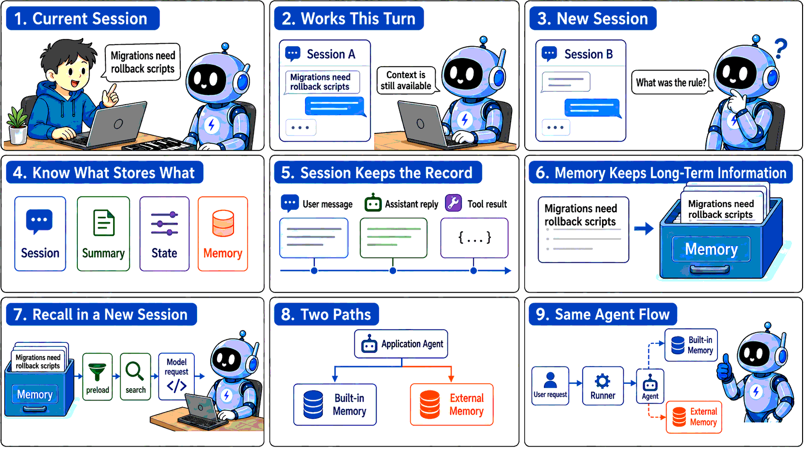
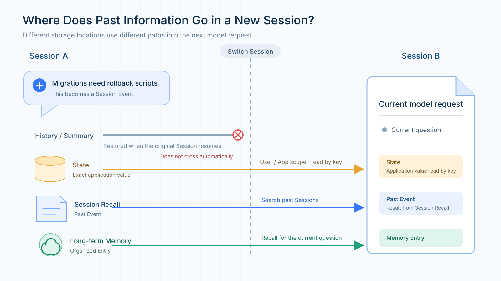
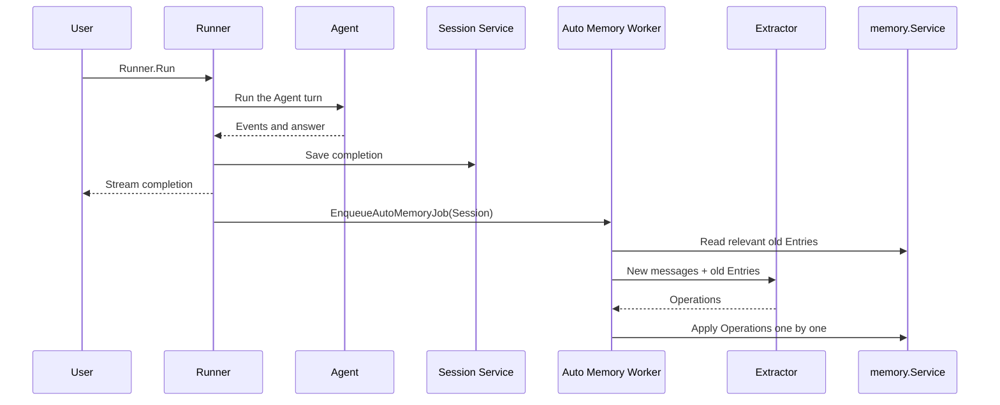
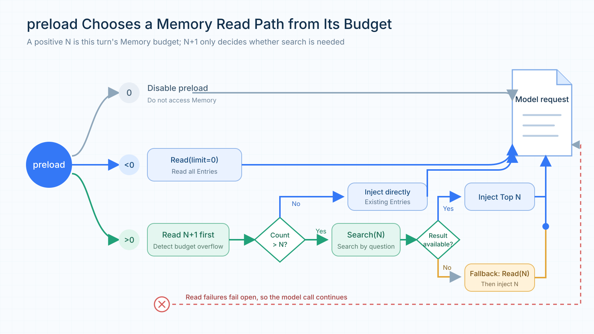
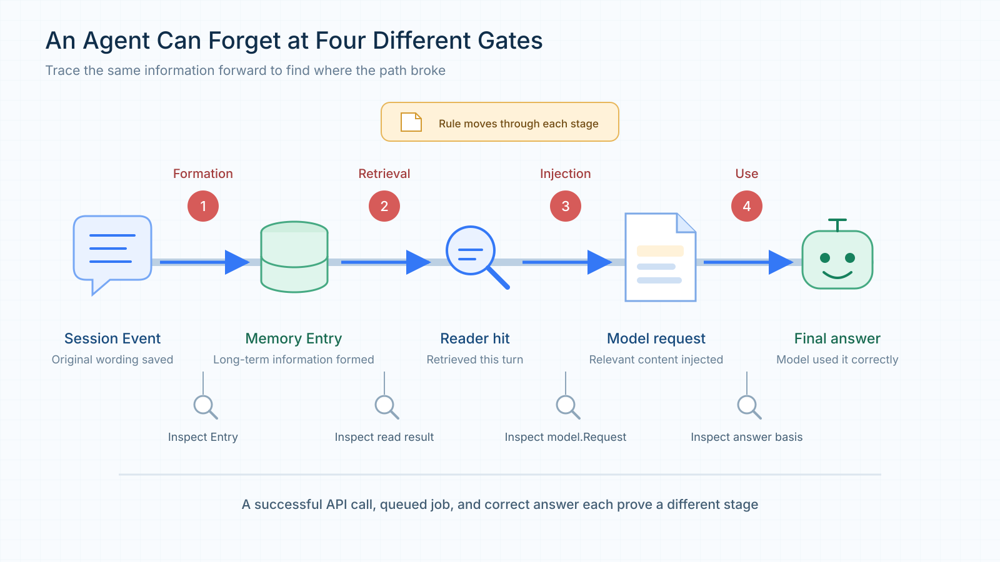
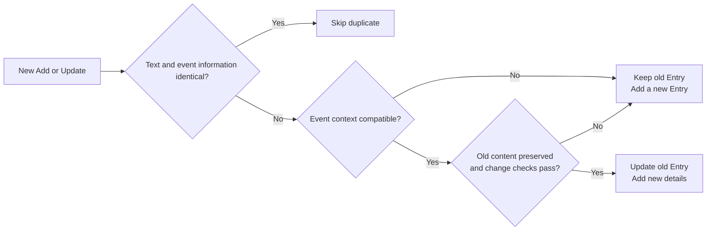
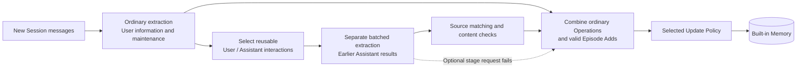
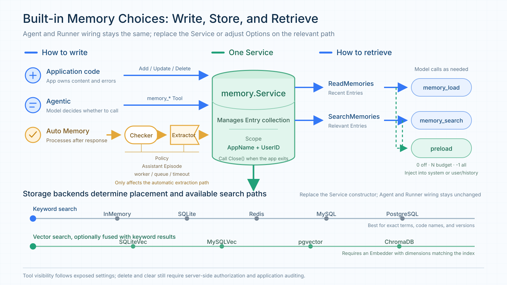
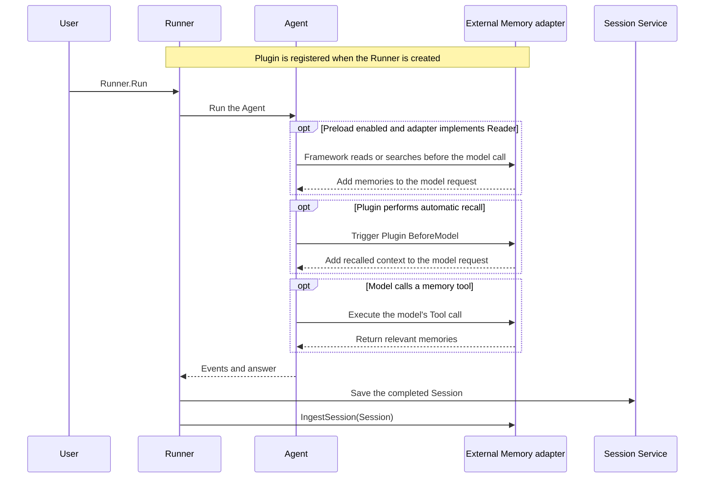

# tRPC-Agent-Go Memory: How Agent Memory Is Formed, Retrieved, and Integrated with External Memory Platforms

**Introduction:** Memory systems differ in how they store information and in the capabilities their platforms provide, so it can be difficult to determine the best fit from the outset. With tRPC-Agent-Go, an existing Agent can keep its current execution flow while using the built-in Memory service with multiple storage backends, or integrate external platforms such as TencentDB Agent Memory and Mem0.

> tRPC-Agent-Go is a framework for building autonomous multi-Agent systems in Go. It provides tool calling, session and memory management, artifact management, multi-Agent collaboration, graph orchestration, knowledge bases, and observability, and integrates deeply with tRPC-Go to reuse its service-governance capabilities.
>
> The repository is hosted on [GitHub](https://github.com/trpc-group/trpc-agent-go). tRPC-Agent-Go grows with the support of its community, and stars on the project are always welcome.

Memory often receives little attention when an Agent is first created for an application, because what the user just said is still available in the current context and tool results can be used directly by subsequent steps. Even without a dedicated Memory service, an Agent can usually continue from earlier content within the same Session.

As an Agent is used repeatedly and begins handling long-running tasks across Sessions, the importance of Memory gradually becomes clear. Suppose a user has already specified that every database migration must include a rollback script. If that rule exists only in the original conversation, the user has to repeat it after opening a new Session. Memory can carry the rule into the new Session and solve the problem of forgetting, but once information can persist over the long term, the system must also handle how that information changes later. If the user revises the rule, the system needs to know which version should take precedence. If the user explicitly asks to delete it, the old content should no longer appear in search results. These issues emerge progressively as the Agent is used over time.



*Figure 1: Continuing the current conversation does not mean that a new Session can use the same confirmed information. An application can use tRPC-Agent-Go's built-in Memory or delegate memory processing to an external platform.*

On top of cross-Session persistence, tRPC-Agent-Go's built-in Memory adds Preserve History and Assistant Episode. Preserve History retains historical records when information changes and merges only non-conflicting additions into the original Entry. Assistant Episode stores results previously produced by the Agent as episodic memories together with their conversational context.

In tRPC-Agent-Go, configuring a Memory Service on the Runner enables built-in Memory for an existing Agent, while Options can continue to adjust automatic extraction and recall behavior. tRPC-Agent-Go also makes it straightforward to integrate external memory platforms without rewriting the application's main flow: register the platform adapter with the Runner and add a Reader, Tool, or Plugin as needed. This allows applications to integrate TencentDB Agent Memory, Mem0, and other memory platforms with minimal changes to existing Agent logic.

If you want to get started quickly with tRPC-Agent-Go Memory, skip directly to Chapter 3 or see the [tRPC-Agent-Go Memory examples](https://github.com/trpc-group/trpc-agent-go/tree/main/examples/memory).

## 1. tRPC-Agent-Go Memory Capabilities and Design

### 1.1 Three kinds of long-term memory

When designing long-term memory for Agents, the industry often draws on classifications of human memory and divides information that should be retained over the long term into semantic, episodic, and procedural memory. [LangGraph's memory concepts](https://docs.langchain.com/oss/python/concepts/memory) use the same classification.

Semantic memory stores relatively stable user information, preferences, and background. In tRPC-Agent-Go, it corresponds to a Fact. For example, if a user explicitly requires every database migration to include a rollback script, that requirement can be extracted as a Fact. When the user later starts a new migration task, the Agent can still retrieve this confirmed requirement.

Episodic memory stores a specific experience. In the framework, it corresponds to an Episode. Continuing the migration-review example, if a submission was rejected because it lacked a rollback script, an Episode can record what happened, who was involved, and how the issue was eventually resolved. If the user later asks why that review failed, the Agent can answer from the recorded experience. To preserve the surrounding context, an Episode can also record the event time, participants, and location.

Procedural memory stores methods that can be followed in the future. For example, an Agent can distill migration-review experience into a reusable checklist that specifies what to inspect first, how to handle a missing rollback script, and which conditions must be satisfied before submission. Because this kind of memory guides future actions, it is better represented as a reusable Skill.

tRPC-Agent-Go assigns these three kinds of memory to different capabilities. The built-in `memory.Service` manages Facts and Episodes. Procedural memory is implemented with [Skill](https://github.com/trpc-group/trpc-agent-go/blob/main/docs/mkdocs/en/skill.md) and [Evolution](https://github.com/trpc-group/trpc-agent-go/blob/main/docs/mkdocs/en/evolution.md). A Skill records when a method applies, the steps to follow, and its constraints. When Evolution is enabled, the framework analyzes earlier executions in the background and extracts reusable Skills. After a Skill is published, an Agent can load it when a similar task appears.

The built-in Memory discussed below therefore refers mainly to Facts and Episodes managed by `memory.Service`.

### 1.2 Why long-term Memory is needed

To understand why an Agent needs long-term Memory, first look at what a Session already provides. In tRPC-Agent-Go, an application request typically starts with `Runner.Run`. The Runner locates the current conversation using the App, User, and Session identifiers, and the Session Service stores user messages, Assistant replies, tool calls, and state changes. When a later request uses the same Session ID, the Runner restores this content, allowing the Agent to continue from the earlier conversation.

The Session ID also marks the boundary of that context. When a user chooses a new Session ID, the Runner enters a different conversation. The old messages are still stored in the Session Service, but they are not automatically included in the new Session's model request. A rule remembered inside the current Session is therefore still only session context. Long-term Memory is needed when the same rule must be available in a new Session.

A Session preserves the full context of a conversation, including messages, tool events, and runtime state. It does not decide which details will remain useful later, nor does it organize those details for use by other Sessions. When the same user needs a previously confirmed rule, preference, or experience in a new Session, long-term Memory extracts that information and makes it available again.

### 1.3 What belongs in Memory

Long-term Memory extracts information that may remain useful and carries it into a new Session. A confirmed migration requirement is a good Memory Entry because a later review may need it. tRPC-Agent-Go scopes built-in Entries with `memory.UserKey{AppName, UserID}`. Session ID is not part of this key, so a new Session for the same user can still search for the earlier Entry.

Memory stores information extracted from a conversation; it does not preserve the entire conversation verbatim. If information is needed only to continue the current task, Session already stores the messages, tool events, and runtime state. Session is more complete for replaying the conversation, but it does not automatically enter a new Session.

When a Session becomes long, Summary can compress older content so the full history does not have to be sent to the model every time. Summary continues the current Session; generating a summary does not turn it into a long-term Entry searchable by other Sessions. Rules, preferences, or experiences that must cross Sessions still belong in Memory.

Some information needs to persist for a long time but is not suitable for semantic extraction by Memory. For example, whether a game quest has been unlocked, which rule version is currently active, or whether an approval has been granted are structured application values. Application code typically needs a deterministic result for a fixed key, so this kind of data is better stored in State. State can be scoped to a Session, User, or App and is read through an explicit key rather than semantic similarity.

If a later task needs the original wording or the tool execution process, Session Recall can search persisted Events from other Sessions belonging to the same user. It returns the original conversation content. Memory returns extracted and organized Entries, which are usually more convenient as background for a new task.



*Figure 2: Long-term Memory stores organized information. Session and Summary continue the current conversation, State stores exact application values, and Session Recall retrieves original Events from other Sessions.*

The first question is therefore whether a piece of information is worth retaining for repeated use in future tasks. If so, it belongs in Memory. Use Session or Summary when only the current conversation needs to continue, State when deterministic reads and writes are required, and Session Recall when the original interaction or execution process needs to be recovered.

### 1.4 Start with a `memory.Service`

The Facts and Episodes described above are stored as `memory.Entry` values and managed by `memory.Service`. An application creates a Service and gives it to the Runner; the existing Agent type and request entry point do not change. If the model should maintain memories itself, add the Service's tools to the Agent. If some memories should be visible before every model call, enable preload.

The framework keeps read access in the smaller `memory.Reader` interface. It reads and searches existing Entries. `memory.Service` adds writing and maintenance, manages automatic extraction jobs, and owns background resources. Application code can call the Service directly, an Agent can use its tools, and the Runner can give it each completed Session.

During development, start with InMemory. Switch to SQLite when data must survive a process restart. If several instances need shared data, choose Redis, MySQL, PostgreSQL, pgvector, or ChromaDB according to the infrastructure already available. Retrieval and deletion details differ by backend, but the Agent, Runner, and `Runner.Run` wiring stays the same.

After creating the Service, decide how information should be written. If the application has already prepared the content and needs to confirm the result immediately, calling the Service's CRUD APIs directly is the clearest approach. By default, the agentic tools expose Add, Update, Search, and Load; Delete and Clear must be enabled explicitly. Once enabled, the Agent can call the corresponding Memory tools when the user explicitly says something such as "remember this rule" or "delete this information." Preferences and experiences that emerge gradually during ordinary conversation can instead be handled by Auto Memory after a response is completed.

All three approaches can use the same Service, but they serve different purposes. Direct application writes return a result within the current call. Tool-based writes happen only when the model decides to invoke the tool. Auto Memory additionally relies on an Extractor to interpret the conversation. Creating a Service therefore enables Memory as a capability, but the application still chooses which write path to use.

### 1.5 Auto Memory processes a Session after the response

Many useful memories appear in ordinary conversation rather than in an explicit memory command. A compatibility requirement may be discussed over several turns and only become clear in the final exchange. Auto Memory checks new conversation content after a turn and extracts information that may be useful later.

To enable it, configure an Extractor on the Service. The Runner completes the Agent call, writes the completion event to the Session, and sends the response to the caller before it invokes `EnqueueAutoMemoryJob`. A background worker then gets unprocessed messages and relevant existing Entries. The Extractor returns Add, Update, Delete, or Clear Operations, and the worker applies the selected update policy before writing them to the Service.



*Figure 3: The Runner delivers the answer first and then sends the Session to Auto Memory. The long-term Entry is normally formed in the background.*

When the answer is already visible, the long-term Entry may not exist yet. A successfully queued job means only that the worker accepted it. To verify that Auto Memory has finished, read or search the target Entry in the Service. Running the Extractor after every turn also adds model calls and may split an unfinished discussion too early. A Checker lets messages accumulate until the configured condition is met.

`CheckMessageThreshold` checks how many messages have not been processed. `CheckTimeInterval` checks how long it has been since the previous extraction. Multiple `WithChecker` options are combined with AND; `WithCheckersAny` changes the combination to OR.

When a Checker returns false, unprocessed messages remain in the Session and are considered by the next job. The Checker chooses when extraction starts; the Extractor and update policy still decide what to save and how to handle existing records.

A batch of Operations can also finish partially. If searching related old memories fails, Auto Memory first falls back to `ReadMemories` and reads a recent set of Entries. Processing stops before writing only if that fallback read also fails or the Extractor call fails.

If an individual write Operation fails, the worker records the error and continues with the remaining Operations. After the batch is processed, the extraction watermark still advances. A failed Operation is not retried automatically, and successful writes are not rolled back. Auto Memory is therefore best for information that can be extracted again or corrected later. Rules that must take effect atomically belong in a configuration or transactional database.

### 1.6 How memory returns to the next request

After an Entry has been written, the framework finds candidates within the current user's memory scope. `ReadMemories` needs no query and reads Entries from newest to oldest by update time. `SearchMemories` scores relevance for the current question and orders the results. The `memory_load` and `memory_search` tools use these two paths: the former is useful for seeing recent memories, while the latter searches around a specific question.

The scoring method depends on the storage backend. A keyword backend tokenizes Entry text and Topics, then combines coverage, rarity, and contiguous phrase scores. A vector backend embeds the query and obtains candidates by vector similarity. Hybrid search can fuse vector and keyword results, so a different phrasing can still find a memory while exact strings such as code names and version numbers remain easier to match.

Search first scopes results with `memory.UserKey{AppName, UserID}`, then can filter by Fact, Episode, or event time. When searching one memory kind returns too few results, Kind Fallback can search the other kinds as well.

Deduplication and a maximum result count can control a large set of similar results. Whether a similarity threshold is applied depends on the search mode: vector backends skip cosine-similarity threshold filtering when hybrid search is enabled because the fused score has a different scale. Time ordering can be enabled when the question depends on event order. It changes the order of similarly relevant results; it does not promote an irrelevant memory.

The model can call these read interfaces on demand, or the framework can load memories before the model call. Giving `memory_search` or `memory_load` to the Agent lets the model decide when to query. This saves context in ordinary turns, but the model may fail to notice that a search is needed. For a question with several independent parts, shorter queries can be searched separately and their results combined.

If the model should see long-term background before answering, enable preload. Preload is disabled by default, and `WithPreloadMemory(0)` also keeps it disabled. A positive N sets the memory budget for the turn. `-1` loads all Entries and is suitable only when the number of memories is bounded. For a long-running application, start with a small positive value.

For a positive budget N, the framework first reads N+1 Entries. The extra Entry tells it whether the total exceeds the budget. If it does not, the Entries are injected directly. If it does, the current user message is used as a query and the most relevant N Entries are searched, with hybrid search and deduplication requested when supported by the backend. If search fails, the query is empty, or no usable result is returned, the framework falls back to reading the newest N Entries.



*Figure 4: With a positive preload budget N, the framework reads N+1 Entries first. If the count exceeds the budget, it searches for N relevant Entries. A read failure does not block the model call.*

Preloaded memories are injected into the system context by default. `WithPreloadMemoryInjectionMode(llmagent.PreloadMemoryInjectionUser)` can place them near the user/history messages instead. That mode is friendlier to prompt caching, but the injected content participates in token trimming. `WithPreloadMemoryPlaybook` replaces the default reading instructions with an application-supplied playbook. When a non-empty value is provided, the built-in playbook is not retained, so the caller must include any default constraints it still needs. An empty string keeps the built-in playbook.

Session Summary, Session Recall, long-term Memory, and the current Session history may all enter one model request. The framework does not automatically merge them into one deduplicated context. If the same fact exists in an old Event and a Memory Entry, it may consume input space twice. Set budgets for each source and inspect model-request logs to see what the model actually receives.

## 2. Built-in Memory: Algorithm Improvements and Results

### 2.1 From memory storage to answer quality

The flow above can turn a conversation into a long-term memory for a new Session. A formed memory does not guarantee a correct answer, however. Later updates can remove details, and information that exists only in an Assistant reply may be missed by ordinary extraction. The framework addresses these two cases with a more conservative update policy and an additional Assistant extraction stage.

In a historical fixed 50-question LongMemEval-S run, the default Merge Similar policy with Assistant Episode disabled reached 28% answer accuracy. Switching to Preserve History raised it to 82%. Enabling Assistant Episode on top of that reached **90%**, with 45 correct answers instead of the original 14. The configurations and the Mem0 OSS comparison are shown below.

| Configuration | Assistant Episode | Accuracy |
| --- | --- | ---: |
| Built-in Memory, Merge Similar | Off | 28% |
| Built-in Memory, Merge Similar | On | 58% |
| Built-in Memory, Preserve History | Off | 82% |
| Built-in Memory, Preserve History | On | **90%** |
| Built-in Memory, Append Only | Off | 82% |
| Built-in Memory, Append Only | On | 88% |
| Mem0 OSS 2.0.11, native | N/A | 84% |

> **Evaluation note:** The LongMemEval-S main result uses a fixed set of 50 questions. Historical sessions are replayed through the Runner; after memory is written, the question is answered in a new Session, and failures count in the denominator. The 28% baseline already uses built-in Memory. The built-in configurations use the same main dataset and settings, including `glm52`, `text-embedding-ada-002`, and pgvector top-k 20, while the code versions differ. Mem0 OSS uses the same evaluation program with its native configuration. See the [evaluation results](https://github.com/trpc-group/trpc-agent-go-benchmark/blob/main/memory/results/README.md) for details.

### 2.2 How Policy handles later changes

When Auto Memory processes conversations continuously, the same subject may appear at different times. A project may first require Go 1.21 and later raise the minimum to Go 1.23. The Extractor must identify the relationship between the two statements before deciding what to do with the old record. That decision is constrained by the Update Policy.

The policy is applied in two places. The Extractor uses the policy-specific prompt to understand old and new information and produce Add, Update, Delete, or Clear Operations. Before writing, the worker applies the same policy to remove duplicates and prevent an update from silently losing old information. The model handles language-level interpretation; the worker enforces local write boundaries without another model call.

The default Merge Similar policy preserves the framework's original merging behavior. Auto Memory searches Entries similar to the new content and combines relevance with text overlap to decide whether they are duplicates. When the similarity is high, the presence of a new `Topic` also affects whether an update is allowed. This keeps memory compact when only the current conclusion matters, but the result still depends on backend search and model-generated Operations.

Later discussion of the same subject does not necessarily invalidate an earlier fact. In one case, a user said on May 30 that they had completed seven short stories. On June 16, they added that they were writing a new story and aimed to write 500 words per week. The second conversation added a writing update but did not change the completed count. Under the default policy, the resulting memory no longer contained the number seven, so the Agent could not answer the count in a new Session.

The loss happened while writing the memory. Once the original number is absent from the final Entry, changing the query, adding a tag, or searching an index cannot recover it. The first requirement for a correct answer in the new Session is to prevent later conversation from overwriting a still-valid detail.



*Figure 5: One piece of information must become an Entry, be retrieved, and enter the model request before it can affect an answer. Content lost during writing cannot be restored by later retrieval.*

Two passages can be broadly similar while describing different facts. A changed number, date, or status may represent a new fact. An update policy therefore needs to distinguish an addition to an old fact from a change to it.

Append Only takes the conservative route: it keeps new facts alongside old ones and lets retrieval combine them later. It follows an add-only idea similar to Mem0's add-only mode, converts Update to Add, filters exact duplicates, and skips Delete and Clear produced by automatic extraction. In the Go-version example, the Go 1.21 record remains and the Go 1.23 requirement becomes another memory.

Append Only avoids losing information during writes, but similar records and historical changes accumulate. The worker removes duplicates among the Entries found for the current batch and query; it does not scan every memory on each write. Long-running applications should therefore watch Entry growth and duplicate results at retrieval time.

Sometimes a fact is gradually enriched rather than changed. For example, an earlier Entry might say `Alice visited Bob on December 1st, 2025.`, and a later conversation might add `Alice visited Bob at 4pm on December 1st, 2025.` The later sentence adds a time to the same visit. Saving every such addition separately would create many near-duplicates. Preserve History keeps the possibility of updating the original Entry, provided the new content is a non-conflicting addition. If a number, date, or status changes, the framework tries to preserve both versions.

To decide whether new content can enrich an old Entry, Preserve History first rules out an exact duplicate. It compares normalized text, memory kind, event time, participants, and location. If these are all the same, it skips the write. `Topics` do not participate in duplicate detection, so changing only a label does not create another Entry. Content that is not a duplicate is then checked for compatible event context. If the date, participants, or location no longer match, the old Entry is kept and a new one is added.

For the same event, the framework also checks whether the new text preserves the old content and whether it adds too much unrelated content. The current implementation computes old-content coverage and the share of common content in the new text, using thresholds of 0.95 and 0.70. It then checks important tokens, numbers, negation, and token order. These checks distinguish an addition from a changed fact. For example, `Alice manages Bob.` becoming `Bob manages Alice.`, or "published every Wednesday" becoming "no longer published every Wednesday," must not be written back as an ordinary enrichment. If any check fails, the old Entry remains and the new content is handled as Add. The worker performs this decision locally without another model call.



*Figure 6: Preserve History checks text and event information for both Add and Update. A passing enrichment updates the old record; other content becomes a new Entry. The diagram assumes both operations are enabled.*

The same checks apply when the Extractor directly returns Update. If the target record does not exist, or the new content fails the enrichment checks, Update is converted to Add and the old text is not replaced.

Returning to the lost story count, replaying the two conversations with Preserve History keeps the original seven-story Entry and adds the writing update and weekly goal. In a new Session, the Agent can find the number and answer seven. The two strategies produce the following results.

| Stage | Merge Similar | Preserve History |
| --- | --- | --- |
| Memory after the first interaction | Keeps the completed count of seven | Keeps the completed count of seven |
| Final memory after the second interaction | Keeps the update and goal; the original count is missing | Keeps the original count and adds the update and goal |
| Search in the new Session | No basis for seven | Finds the completed-count Entry |
| Answer in the new Session | Cannot determine the count | Answers seven |

The three policies make different trade-offs. Merge Similar keeps memory compact when only the current conclusion matters. Append Only is useful when losing an old value is unacceptable and changes should coexist. Preserve History is useful when history should remain available while non-conflicting additions can still be merged.

The default remains Merge Similar so a framework upgrade does not silently change existing applications' memory shape and update behavior. The Update Policy is selected when the Extractor is created and applies from the next automatic extraction onward. Existing Entries are not migrated or rewritten when the policy changes.

Preserve History and Append Only also treat deletion differently. Preserve History asks the model to select Delete only when the user clearly asks to forget something, and the worker then executes that Operation normally. Append Only filters Delete and Clear produced by automatic extraction.

These policies constrain the built-in Extractor and Auto Memory worker only. Direct Service calls and explicit write tools still follow their corresponding interfaces.

### 2.3 Assistant replies can become episodic memories

By default, long-term memory is mainly extracted from user-provided information. In some tasks, an Agent's own result is worth preserving. An Agent may complete a troubleshooting task and provide steps that are later confirmed. When a similar issue appears, a new Session may need that experience.

Ordinary extraction can use an Assistant reply as context, but it may miss information supplied only by the Assistant. If a procedure exists only in the reply and the user never repeats it, Preserve History cannot preserve an Entry that was never created. This is why the framework adds a separate Assistant extraction stage.

LongMemEval contains examples of this gap. In one conversation, the Assistant mentions that a study had 38 participants. In another, the Assistant introduces the cartoon `Nu, pogodi!`. The user does not repeat the number or title, and the resulting memory contains only their interest in the topic. In a new Session, that interest does not answer how many people took part or what the cartoon was called. When the answer depends on an earlier Assistant response, ordinary user-information extraction may leave a gap.

An Assistant reply must also be kept in its original context. It may contain an unconfirmed recommendation or a hallucination. Writing it directly as a Fact could turn "the Assistant suggested this plan" into "the user adopted this plan," causing later answers to rely on an unverified claim.

`WithAssistantEpisodeExtraction()` therefore writes only episodic memories. The Extractor organizes the user's question and the Assistant's result together, marks that the content came from the Assistant, and records the relationship between the participants. Later tasks can find the number, title, or troubleshooting procedure with the context needed to interpret it. An Episode records what was said at that time; whether the answer was correct or the recommendation was executed still needs confirmation from tool results, tests, or user feedback.

The Extractor first handles user information through ordinary extraction and then processes Assistant results in a separate stage. The second stage selects reusable user/assistant interactions from new messages, excludes tool messages and intermediate replies with tool calls, excludes interactions the user asked to forget, and sends the candidates to the model in batches.

Each extracted result carries a source identifier. The framework uses it to find the original interaction and check duplication, length, and whether numbers appear in the source. Failed checks are skipped. Valid Episodes are combined with ordinary Operations and passed through the selected policy and Service.



*Figure 7: After ordinary extraction, the framework extracts reusable results from Assistant replies, validates them, and sends valid Operations through the Policy and Service.*

Assistant Episode is disabled by default because it stores Agent-generated content, may add model calls, and can increase later context. Enable it with `WithAssistantEpisodeExtraction()` when later tasks must recover a result previously given by the Agent.

When enabled, the second model call runs only when the current batch contains suitable candidates. With no candidates, the stage is skipped. A failure in this optional stage preserves ordinary extraction results. Cancellation by the caller or failure of ordinary extraction still returns an extraction error.

### 2.4 Results across task types

The following table breaks down the LongMemEval results by question type and shows how the two improvements contribute.

| Question type | Questions | Merge Similar, Assistant Off | Preserve History, Assistant Off | Preserve History, Assistant On |
| --- | ---: | ---: | ---: | ---: |
| Knowledge update | 8 | 4 | 7 | 8 |
| Multi-Session reasoning | 13 | 3 | 11 | 10 |
| Assistant information | 6 | 0 | 0 | 5 |
| User preference | 3 | 0 | 3 | 2 |
| User fact | 7 | 2 | 7 | 7 |
| Temporal reasoning | 13 | 5 | 13 | 13 |
| Total | 50 | 14 | 41 | 45 |

Preserve History adds eight correct answers in both multi-Session reasoning and temporal reasoning. Assistant Episode then adds five answers to questions that were previously missing Assistant information, raising overall accuracy from 82% to 90%.

We also compared update policies on ten long conversations from LoCoMo. F1 measures token overlap between an answer and its reference, while LLM Score records the judging model's confidence. For LLM Score, a correct judgment contributes the model's confidence and an incorrect judgment contributes zero; the values are averaged over all questions.

> LoCoMo uses all 1,986 QA pairs with `gpt-4o-mini`, `text-embedding-3-small`, and top-k 30. Its second participant is mapped to Assistant during replay, so these results compare update policies with Assistant Episode disabled.

The next table also reports a weighted F1 for answerable questions. After adversarial questions are excluded, 1,540 questions remain for that column.

| Configuration | F1 on all QA | LLM Score on all QA | Weighted F1 on answerable questions |
| --- | ---: | ---: | ---: |
| Historical reference configuration (report) | 0.4690 | 0.5320 | 0.4230 |
| Preserve History | **0.4865** | **0.5609** | **0.4579** |
| Append Only | 0.4773 | 0.5441 | 0.4402 |

Preserve History is highest on all three metrics in this long-conversation set. Append Only is also above the historical reference, but by a smaller margin. Applications that need to keep historical changes without allowing too many near-duplicates can start by trying Preserve History.

## 3. Quickly Integrate Agent Memory

Adding Memory to an existing Agent does not require a separate, dedicated Agent. The existing model, Instruction, application tools, and `Runner.Run` entry point can all remain unchanged. The additional configuration only determines how conversations are processed and how long-term information is brought back into later requests. Both the built-in Memory implementation and external platforms can be integrated directly into an Agent that initially has only a Session Service.

### 3.1 Start with a standard Agent

The following example starts with a standard Agent configured only with a Session Service. It reuses the application's existing `chatModel`, `businessInstruction`, `businessTools`, request parameters, and the `handleEvent` event handler. The Session Service stores the current conversation, while external requests continue to enter through `Runner.Run`. In actual code, place the imports at the top of the source file and put the remaining statements inside an application function that returns `error`. The example below shows a standard Agent **without long-term Memory enabled**.

```go
import (
    "trpc.group/trpc-go/trpc-agent-go/agent/llmagent"
    "trpc.group/trpc-go/trpc-agent-go/model"
    "trpc.group/trpc-go/trpc-agent-go/runner"
    sessioninmemory "trpc.group/trpc-go/trpc-agent-go/session/inmemory"
)

sessionService := sessioninmemory.NewSessionService()
defer sessionService.Close()

businessAgent := llmagent.New(
    "business-agent",
    llmagent.WithModel(chatModel),
    llmagent.WithInstruction(businessInstruction),
    llmagent.WithTools(businessTools),
)

appRunner := runner.NewRunner(
    "business-app",
    businessAgent,
    runner.WithSessionService(sessionService),
)
defer appRunner.Close()

events, err := appRunner.Run(
    ctx, userID, sessionID, model.NewUserMessage(userInput),
)
if err != nil {
    return err
}
for event := range events {
    handleEvent(event)
}
```

The Session Service is created by application code and passed to the Runner, but ownership remains with the caller, so the caller is still responsible for closing it. The two `defer` calls execute in last-in-first-out order: when the application exits, the Runner is closed first and the Session Service is closed afterward, stopping its cleanup tasks and asynchronous summarizer.

Within one Session, later requests continue because the Runner restores saved events. A new Session does not automatically see the earlier confirmed information. This same code can later be configured with built-in Memory or an external platform; an external platform does not require built-in Memory to be enabled first.

### 3.2 Connect the built-in Memory service

If the application does not need capabilities specific to an external platform, the built-in `memory.Service` is the recommended starting point. Create a Service, add its tools to the Agent, and register the same Service with the Runner. The existing Agent then gains cross-Session long-term Memory. Replace the Agent and Runner setup above with the following code to **enable the Memory Service**.

```go
import (
    "trpc.group/trpc-go/trpc-agent-go/agent/llmagent"
    memoryinmemory "trpc.group/trpc-go/trpc-agent-go/memory/inmemory"
    "trpc.group/trpc-go/trpc-agent-go/runner"
    "trpc.group/trpc-go/trpc-agent-go/tool"
)

memoryService := memoryinmemory.NewMemoryService()
defer memoryService.Close()

agentTools := append([]tool.Tool{}, businessTools...)
agentTools = append(agentTools, memoryService.Tools()...)

businessAgent := llmagent.New(
    "business-agent",
    llmagent.WithModel(chatModel),
    llmagent.WithInstruction(businessInstruction),
    llmagent.WithTools(agentTools),
    llmagent.WithPreloadMemory(10),
)

appRunner := runner.NewRunner(
    "business-app",
    businessAgent,
    runner.WithSessionService(sessionService),
    runner.WithMemoryService(memoryService),
)
defer appRunner.Close()
```

`memoryService.Tools()` lets the Agent save and search long-term information. `runner.WithMemoryService` tells the Runner which Memory Service to use. `llmagent.WithPreloadMemory(10)` reads up to ten memories before a model call, so the model can see some long-term background even when it does not call a search tool.

The next choice is where Entries are stored. Start with InMemory during development. Switch to a persistent backend or a shared backend when the application requires it.

| Backend | Typical use | Retrieval characteristic |
| --- | --- | --- |
| InMemory | Local development and tests | No external service; data disappears when the process exits |
| SQLite | Single-instance applications and local persistence | Local file with keyword retrieval |
| Redis, MySQL, PostgreSQL | Shared memory across instances | Database-backed Entries with keyword scoring |
| SQLiteVec | Single-instance semantic retrieval | Local vector store that can combine keyword results |
| MySQLVec, pgvector | Semantic retrieval on an existing database | Embeddings from an Embedder, optionally fused with keyword results |
| ChromaDB | A separate vector service | Retrieves relevant Entries through vector search |

Vector backends require an Embedder when the Service is created. Its output dimension must match the index dimension. After changing the backend, the Agent, Runner, and `Runner.Run` wiring can stay the same. Connection parameters and a complete configuration are shown in the [Auto Memory example](https://github.com/trpc-group/trpc-agent-go/tree/main/examples/memory/auto).

After choosing the storage backend, decide who writes the Entries. Without an Extractor, the model can respond to an explicit memory instruction by calling `memory_add`. When the application has already confirmed a rule, it can instead call `AddMemory` directly and verify the write result within the current call.

To extract long-term information from ordinary conversation, add an Extractor when creating the Service. The following configuration enables the Preserve History and Assistant Episode features described in Chapter 2; `extractionModel` is the model reserved for memory extraction.

```go
import (
    "trpc.group/trpc-go/trpc-agent-go/memory/extractor"
    memoryinmemory "trpc.group/trpc-go/trpc-agent-go/memory/inmemory"
)

memExtractor := extractor.NewExtractor(
    extractionModel,
    extractor.WithUpdatePolicy(
        extractor.UpdatePolicyPreserveHistory,
    ),
    extractor.WithAssistantEpisodeExtraction(),
)

memoryService := memoryinmemory.NewMemoryService(
    memoryinmemory.WithExtractor(memExtractor),
)
defer memoryService.Close()
```

If a different update policy is required, specify it explicitly here; otherwise, the framework uses Merge Similar by default. Preserve History and Append Only can significantly improve memory retention, but they may also accelerate Entry growth. If the application only needs to retain user-provided information, remove `WithAssistantEpisodeExtraction()`. A Checker can also be added when extraction timing needs to follow the conditions described in Chapter 1. For most applications, Merge Similar or Preserve History is a reasonable starting point, with Assistant memory extraction disabled. Enable Assistant extraction when the application also needs Agent-generated results to become retrievable memories.

When multiple Sessions need to be processed concurrently, `WithAsyncMemoryNum` controls the number of background workers, `WithMemoryQueueSize` controls the queue capacity, and `WithMemoryJobTimeout` controls the timeout for an individual job. If the queue is full while the call context is still valid, the framework may process the job synchronously, so queue capacity can affect request latency. The Memory Service owns these background resources and must be closed separately; the Runner does not close it on the caller's behalf.

After an Extractor is configured, Auto mode gives the Agent search tools by default and leaves writes to background extraction. To let the Agent respond directly to a request such as "remember this rule," expose write tools with `WithAutoMemoryExposedTools`.

An operation being available on the Service does not mean it must be exposed as an Agent tool. `WithToolEnabled` controls what the framework and extraction stage can execute, while `WithToolExposed` controls whether the corresponding tool appears in the Agent's tool list. Direct Service calls still use the corresponding interfaces. These switches do not authenticate users; user isolation and access control must be enforced by the backend and application configuration.

Some Sessions include external knowledge in their context even though that material should not become a user memory. Set `WithDisableAutoMemoryOnExternalContext(true)` for that case. The framework recognizes context produced by its knowledge-retrieval tools or by a tool that advertises `PollutesAutoMemory() bool`. A custom RAG tool without this marker may still have its returned content extracted by Auto Memory.



*Figure 8: The application can choose how Entries are written, which backend stores them, and whether retrieval happens through a Tool or preload. Automatic extraction is configured through the Extractor and Service.*

After wiring is complete, use two Sessions to check that long-term memory works. In Session A, tell the Agent that a database migration review must check the rollback script and compatibility tests. Consume the full Runner event stream, then read or search for the target Entry to confirm that it was formed.

Keep the same AppName and UserID, create a new SessionID, and ask what the migration review should check first. Compare the recalled memory with the final answer to see whether the Agent used the rule in the new Session. The Auto Memory example's `/memory` command displays Entries, and `/new` keeps the user identity while creating a new Session.

### 3.3 Register an adapter for an external Memory platform

If an application already uses an independent Memory platform, or wants capabilities such as layered memory and relation retrieval, register that platform's adapter with the Runner. The Session Service continues to save and restore conversations, while the external platform organizes long-term memory from completed Sessions.

External platforms have their own data structures and update semantics. The framework therefore delivers a completed Session through `session.Ingestor`. If an adapter had to reuse the built-in `memory.Service`, it would need to invent meanings for update, delete, and clear operations that the platform might not provide. With Ingestor, the platform remains responsible for how memories are formed, stored, indexed, and maintained.

At the end of a turn, the Runner gives the Session to the adapter and the platform processes it in its own way. If the adapter implements `Reader`, it can participate in preload for later requests. The application can also add the platform's tools so the model searches on demand, or register its Plugin with the Runner for automatic recall before a model call.



*Figure 9: An external platform receives the completed Session through Ingestor and returns relevant memories through the Reader, Tool, or Plugin capabilities it supports.*

The framework currently supports integrations with TencentDB Agent Memory, Mem0, and other external platforms. When choosing among them, first consider what the application needs to retain over the long term, then follow the corresponding integration guide.

| Memory platform | Best suited for | Common scenarios | Integration guide |
| --- | --- | --- | --- |
| TencentDB Agent Memory | Team development and collaboration involving multiple members or Agents | Reusing background, constraints, and handling experience from earlier tasks together with team assets | [Integration guide](https://github.com/trpc-group/trpc-agent-go/blob/main/docs/mkdocs/en/memory/tencentdb.md) |
| Mem0 | Personalized assistants, content creation, code review, and other applications that need cross-Session memory | Storing user facts, preferences, and project conventions; choosing Platform or OSS according to the application's data boundary | [Integration guide](https://github.com/trpc-group/trpc-agent-go/blob/main/docs/mkdocs/en/memory/mem0.md) |

## Summary

Long-term memory has become an important general-purpose capability for Agents. With tRPC-Agent-Go's Memory service, applications can easily integrate the built-in Memory implementation or switch to an external memory platform as needed.

When an Agent begins handling tasks across Sessions, first distinguish which information is worth retaining as long-term memory. Session continues to preserve the current conversation, State stores values that require exact reads and writes, and Memory should hold information that will be reused repeatedly in future tasks. Most applications can begin by configuring the built-in `memory.Service` on the Runner and then tune extraction, storage backends, update policies, and related options as needed, without changing the Agent's existing invocation flow.

If the application also needs an external platform's own memory-processing model or team-asset capabilities, the same Agent code can switch to an external adapter. When changing platforms, most modifications are confined to Service construction and the retrieval entry points, while the Agent's application logic can remain unchanged.

## References

- [tRPC-Agent-Go Memory documentation](https://github.com/trpc-group/trpc-agent-go/blob/main/docs/mkdocs/en/memory/index.md)
- [TencentDB Agent Memory repository](https://github.com/TencentCloud/TencentDB-Agent-Memory)
- [Mem0 Platform and Open Source comparison](https://docs.mem0.ai/platform/platform-vs-oss)
- [Mem0 OSS V3 migration guide](https://docs.mem0.ai/migration/oss-v2-to-v3)
- [Mem0 Platform V3 migration guide](https://docs.mem0.ai/migration/platform-v2-to-v3)
- [tRPC-Agent-Go repository](https://github.com/trpc-group/trpc-agent-go)
- [tRPC-Agent-Go Memory Benchmark](https://github.com/trpc-group/trpc-agent-go-benchmark/tree/main/memory)
- [LongMemEval Benchmark](https://arxiv.org/abs/2410.10813)
- [LongMemEval dataset and evaluation](https://github.com/xiaowu0162/LongMemEval)
- [LoCoMo Benchmark](https://arxiv.org/abs/2402.17753)
- [LoCoMo dataset and evaluation](https://github.com/snap-research/locomo)
- [tRPC-Agent-Go official documentation](https://github.com/trpc-group/trpc-agent-go/tree/main/docs/mkdocs)

## Usage and Discussion

Welcome to tRPC-Agent-Go. For detailed usage documentation and examples, see the [official documentation](https://github.com/trpc-group/trpc-agent-go/tree/main/docs/mkdocs) and the [Memory examples](https://github.com/trpc-group/trpc-agent-go/tree/main/examples/memory).
