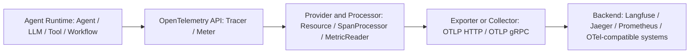

# Seeing the Agent Runtime: Observability Design in tRPC-Agent-Go

> This article focuses on observability in tRPC-Agent-Go. The framework does not try to build another observability platform. Instead, it maps important Agent runtime semantics to OpenTelemetry, so traces, metrics, and GenAI semantic attributes can be consumed by different backends.

When LLM applications move from Chat to Agent, observability changes in a fundamental way.

In a Chat application, one user request can often be approximated as "one entry request, one model call, and one model response." Traditional service observability can still answer many questions: request rate, latency, error rate, and whether the downstream model call failed.

An Agent request is different. A single user-visible answer may contain multiple model calls, tool calls, multi-Agent handoffs, Graph or Workflow execution, streaming output, token usage, prompt cache effects, and additional reasoning after a tool result is returned. From the user's point of view, there is one answer. At runtime, there is an execution tree.

Agent observability therefore needs to answer more than "was the API slow or failed?" It should answer:

- Which Agents, LLM calls, tools, and workflows did this request go through?
- Why did the model trigger a tool? What were the arguments and result?
- Which model call consumed most of the tokens?
- If the first token was slow, was the model slow, was a tool slow, or was orchestration slow?
- Did the error happen in the model, a tool, a workflow node, or the Agent boundary?
- If applications use different observability backends, does the Agent core need to change?

tRPC-Agent-Go telemetry is designed around these questions. Its core decision is to turn Agent runtime semantics into stable OpenTelemetry data rather than to couple the framework to one monitoring product.

A typical Agent trace can be understood as:

```text
invoke_agent customer_assistant
├── chat gpt-4o-mini
│   └── response with tool call
├── execute_tool search_order
│   └── tool result
├── chat gpt-4o-mini
│   └── final answer
└── workflow after_reply_summary
```

This tree decomposes one user request into runtime events that can be inspected, attributed, and aggregated.

## 1. Why Traditional Service Observability Is Not Enough

Traditional service observability usually looks at processes, endpoints, RPC methods, database access, and message queue consumers. These systems often have explicit inputs, outputs, and relatively stable call graphs. Agent runtimes add a layer of probabilistic decision-making.

An Agent path is often not statically written in code. The model may decide whether to call a tool based on user input. The tool result may affect the next model call. A multi-Agent system may delegate work to another Agent or a subgraph. Graphs and workflows make parts of the path controllable, but each node may still contain model calls, tool calls, or streaming output.

This creates three observability challenges.

First, call chains are longer and more dynamic. One entry request may contain multiple LLM round trips, tool calls, and workflow node execution. If you only look at entry latency, you cannot tell where the time went.

Second, cost and quality live inside the request. Token usage, prompt cache hits, completion tokens, finish reason, tool arguments, and tool results are not ordinary RPC metrics, but they directly affect cost, quality, and stability.

Third, debugging needs semantic attribution. A failure may come from a model provider, a tool execution error, invalid tool arguments, a workflow node, or a framework-level cancellation or timeout. Without Agent semantics, a trace becomes a sequence of generic spans that cannot explain what the Agent actually did.

Agent telemetry must therefore make Agent runtime objects first-class observability objects.

## 2. Runtime Observability Design in tRPC-Agent-Go

tRPC-Agent-Go telemetry does not introduce a separate observability platform. It turns runtime boundaries that the framework already understands into stable telemetry data.

For long and dynamic call chains, the framework automatically instruments key Agent runtime boundaries. Applications do not need to manually create spans around every Agent, model, tool, or workflow call. tRPC-Agent-Go creates spans such as `invoke_agent`, `chat`, `execute_tool`, and `workflow` during the Agent lifecycle, so the dynamic path inside one entry request can be reconstructed as a readable tree.

For cost and quality, the framework records both traces and metrics. Traces can show model name, streaming mode, input and output messages, finish reason, tool arguments, and tool results. Metrics can aggregate token usage, time to first token, operation duration, and output token speed.

For semantic attribution, the telemetry model is organized around Agent concepts rather than only HTTP or RPC concepts. tRPC-Agent-Go uses attributes such as `gen_ai.operation.name`, `gen_ai.agent.name`, `gen_ai.tool.name`, and `gen_ai.workflow.name` to describe runtime context. When reading a trace, the operator can immediately tell whether a problem happened in a model call, tool execution, workflow node, or Agent invocation.

For backend flexibility, the framework is based on OpenTelemetry. Traces, metrics, resources, exporters, and collectors reuse the OTel ecosystem. The core framework generates standardized telemetry data; applications decide whether to send it to Jaeger, Prometheus, Langfuse, or another OTel-compatible backend.

In short, tRPC-Agent-Go telemetry is an Agent runtime semantic layer, not an observability product.

## 3. Core Data Model: Traces, Metrics, and Semantic Attributes

This article focuses on two categories of telemetry data: traces and metrics.

Traces describe what happened inside one request. Metrics aggregate many requests into data that can be monitored, alerted on, and analyzed over time.

### Traces: Turning Runtime Execution into a Tree

Several span names are central in tRPC-Agent-Go:

| Span | Meaning | Typical question |
| --- | --- | --- |
| `invoke_agent <agent>` | Lifecycle of one Agent invocation | Which Agent was slow, failed, or consumed tokens? |
| `chat <model>` | One LLM call | Which model was slow? What was TTFT? How many tokens were used? |
| `execute_tool <tool>` | One tool execution | Which tool was called? What were the arguments and result? Did it fail? |
| `workflow <name>` | One Graph node or Workflow observable object | Where did the workflow stall? What was the node latency or error? |

These spans are valuable because they come from Agent runtime semantics, not from infrastructure alone. A trace no longer shows only that an HTTP request called a downstream service. It shows that an Agent called a model, the model requested a tool, the tool returned data, and the model continued to generate the final answer.

For a tool call, the `execute_tool` span records context such as tool name, description, arguments, result, and error type. For a model call, the `chat` span records model name, streaming mode, input and output messages, finish reason, token usage, and time to first token. For a workflow, a Graph node is adapted as a `workflow` observable object with workflow name, id, type, request, response, and error status.

### Metrics: Turning Runtime Execution into Governance Signals

Traces are useful for single-request debugging. Production governance also needs aggregate metrics.

| Metric | Focus |
| --- | --- |
| `trpc_agent_go.client.request_cnt` | Request count |
| `gen_ai.client.operation.duration` | Operation duration for LLM, Tool, Agent, Workflow, and related runtime objects |
| `gen_ai.client.token.usage` | Input, output, and cache-related token counts |
| `gen_ai.server.time_to_first_token` | Standard GenAI time to first token |
| `trpc_agent_go.client.time_to_first_token` | Framework-compatible TTFT, currently reported with the same value as the standard metric |
| `trpc_agent_go.client.time_per_output_token` | Average generation time per output token |
| `trpc_agent_go.client.output_token_per_time` | Output token throughput |
| `gen_ai.workflow.elapsed_time` | Relative elapsed time from `root_workflow.start` to `current_workflow.end` |

There are three important details.

First, tRPC-Agent-Go cares about both total duration and streaming experience. For a streaming Agent, user experience depends not only on final completion time but also on time to first token and subsequent token stability.

Second, token usage is a cost signal, a performance signal, and a quality signal. A growing input token count may indicate poor context management. An unexpectedly long output may indicate prompt or tool-result drift. Cache-related tokens help evaluate whether prompt cache optimization is actually working.

Third, workflow metrics distinguish node duration from relative elapsed time. `gen_ai.client.operation.duration` describes how long the current workflow or node ran. `gen_ai.workflow.elapsed_time` describes where the current observable object ended relative to the root workflow start. It is not the sum of all node durations.

### Semantic Attributes: One Data Model for Different Backends

Span and metric names are only part of the data model. Attributes are equally important. tRPC-Agent-Go uses OpenTelemetry GenAI semantic conventions and framework extension fields to describe context:

| Attribute | Meaning |
| --- | --- |
| `gen_ai.operation.name` | Operation type such as `chat`, `execute_tool`, `invoke_agent`, or `workflow` |
| `gen_ai.agent.name` / `gen_ai.agent.id` | Agent name and identifier |
| `gen_ai.conversation.id` | Conversation or session identifier |
| `gen_ai.request.model` / `gen_ai.response.model` | Requested and returned model |
| `gen_ai.input.messages.otel` / `gen_ai.output.messages.otel` | OTel-aligned input and output messages |
| `gen_ai.usage.input_tokens` / `gen_ai.usage.output_tokens` | Input and output token counts |
| `gen_ai.tool.name` | Tool name |
| `gen_ai.tool.call.arguments` / `gen_ai.tool.call.result` | Tool arguments and result |
| `gen_ai.workflow.name` / `gen_ai.workflow.type` | Workflow name and type |
| `error.type` / `error.message` | Error type and message |
| `trpc.go.agent.invocation_id` | Invocation identifier inside the framework |
| `trpc.go.agent.llm_request` / `trpc.go.agent.llm_response` | Framework-retained LLM request and response payloads |

These attributes make telemetry portable. Different backends may visualize them differently, but they can build views around the same runtime facts as long as they understand OTel/GenAI semantics or map these fields.

This table also raises a production question: which payloads should be reported, and which should be redacted, truncated, or disabled? Prompts, responses, tool arguments, tool results, user identifiers, `llm_request`, and `llm_response` may contain sensitive data. Long attributes increase storage cost, and high-cardinality fields can harm metric aggregation. A production integration should define payload switches, redaction rules, attribute size limits, sampling, and cardinality governance together.

## 4. Debugging Example: Slow Time to First Token

Suppose a user reports that a streaming answer takes a long time to start. The entry request can tell us that the request was slow, but Agent telemetry can break it down further.

First, check the total duration and TTFT on `invoke_agent`. If `invoke_agent` is slow but the first `chat` span starts late, the issue is likely in Agent orchestration, a pre-processing workflow, or tool preparation.

Second, expand the trace. If `execute_tool` or a `workflow` span takes most of the time, inspect tool arguments, tool results, workflow type, and error status. If the slow part is concentrated in `chat <model>`, inspect model name, input tokens, streaming mode, TTFT, and finish reason.

Third, combine the trace with aggregate metrics. If only one request is slow, the trace is the primary tool. If one model's `gen_ai.server.time_to_first_token` rises across many requests, or `gen_ai.client.token.usage` shows growing input tokens, the issue may be a provider, context-management, or prompt-design problem.

## 5. Data Pipeline: From Runtime to Observability Backend

tRPC-Agent-Go telemetry can be described in four layers:



From an application point of view, integration usually starts by initializing a tracer provider and a meter provider. Tracing can be configured with endpoint, protocol, service name, resource attributes, headers, and related options. Metrics can be initialized through the tRPC-Agent-Go metric provider helpers. If no provider is initialized, OpenTelemetry's noop behavior avoids export overhead.

From the framework point of view, the Agent runtime automatically creates spans, records attributes, and reports metrics at lifecycle boundaries. It creates `invoke_agent` when an Agent invocation starts, `chat` for model requests, `execute_tool` for tool execution, and `workflow` for Graph or Workflow nodes. These are natural boundaries known by the framework, so application code does not need to duplicate the instrumentation.

From the platform point of view, the destination is not decided by the Agent core. Data can go through OTLP HTTP/gRPC to an OpenTelemetry Collector and fan out to several backends. It can also be exported directly through a backend-specific exporter or plugin. This layering keeps the tRPC-Agent-Go core stable while allowing observability deployment to evolve.

## 6. Engineering Practices for Stable Agent Telemetry

Many telemetry problems do not happen at the "can we create a span?" layer. They happen at the boundaries of large payloads, context propagation, metric definitions, backend limits, and adapter behavior. LLM requests, responses, tool arguments, workflow requests, and workflow responses can cause repeated `json.Marshal` work, memory spikes, or backend-side attribute truncation.

| Engineering issue | Practical direction |
| --- | --- |
| Trace context may break across context clone or concurrent tool calls | Preserve OpenTelemetry span context and cover TraceID, SpanID, and parent-child relationships in tests |
| Large payload collection can cause repeated `json.Marshal` and heap spikes | Use opt-in `SpanAttributePolicy` to control attributes by operation/key; prefer `Drop()` or unconditional `Omit()` when reducing memory is the goal |
| OTel or backend attribute length limits may truncate large structured attributes | Record truncation diagnostics at the exporter layer and detect signals such as value length, configured limit, and `unexpected EOF` |
| OTel GenAI semantics continue to evolve | Keep stable semantics in the core and move backend differences into adapters |
| TTFT, workflow elapsed time, and token usage can drift in definition | Define from/to, success/failure/cache/retry semantics clearly and apply them consistently across `chat`, `invoke_agent`, and `workflow` |
| Deep Graph or Agent nesting can make traces hard to read | Shape span topology around debugging needs |
| Tool, error, or application dimensions can harm aggregation if unstable | Stabilize tool ordering and tool call IDs, normalize error labels, and use controlled dimensions for application scenarios |

One subtle point is that "limiting attribute size" and "reducing memory" are different goals. `Drop()` and unconditional `Omit()` can short-circuit before `json.Marshal`, reducing heap pressure. `MaxBytes` plus `Omit()` or `Truncate()` controls the final attribute size written to spans, but JSON serialization may already have happened.

The practical rule is: do not rely only on increasing backend attribute limits. First decide which attributes are worth collecting. Then handle backend limits, truncation diagnostics, and field mapping at the export or adapter layer.

## 7. Tradeoffs and Evolution

Looking at other Agent systems helps explain the tRPC-Agent-Go choice. This is not a ranking. It is a comparison of who records runtime facts and who consumes the data.

| Type | Examples | Observability focus | Reference point for tRPC-Agent-Go |
| --- | --- | --- | --- |
| Platform-closed Agent framework | LangChain / LangGraph | LangSmith provides trace, debug, evaluation, monitoring, and feedback loop | Strong platform experience, but framework semantics and platform are more tightly coupled |
| Standard-semantics Agent framework | Google ADK | Built-in logs, metrics, traces, and OpenTelemetry GenAI semantics | Shows that Agent span standardization is becoming important |
| Data-sovereignty Agent framework | Agno | Run history, audit logs, and tracing can be stored in user-owned databases or sent through OTel | Local storage and external backend export are different tradeoffs |
| Go ecosystem component framework | CloudWeGo / Eino | Callback, Handler, and RunInfo expose component and Graph lifecycle | Flexible callbacks need a shared semantic model from users or platform adapters |
| Code Agent product | OpenAI Codex / Claude Code | Tool approval, command execution, organization cost, audit, and human-Agent collaboration events | Product event streams are different from business Agent service runtime telemetry |

tRPC-Agent-Go is closer to "standard semantics plus server-side framework instrumentation." It does not try to provide a monitoring UI, and it does not only expose callbacks. Instead, it records stable spans, metrics, and attributes directly in the Agent runtime.

This keeps the framework lightweight and backend-agnostic, but it also means applications must define sensitive-data governance for production. Prompts, responses, tool arguments, tool results, and user identifiers may contain sensitive information. Whether to report them, how to redact them, and how to control attribute size and metric cardinality should be explicit deployment decisions.

Future evolution can continue in several directions:

- Track OpenTelemetry GenAI semantic convention changes and reduce drift between custom and standard fields.
- Add more Agent-level metrics, such as tool success rate, Agent step count, Graph node retry count, and recovery metrics.
- Refine streaming statistics around reasoning, first token, useful content token, and final completion time.
- Strengthen sensitive-data governance through payload switches, redaction, attribute size limits, and cardinality controls.
- Support multi-backend routing through collectors or plugins so the same telemetry can feed both LLMOps and general APM backends.

## Conclusion

Agent observability is not just about adding more logs or wrapping a model request in a span.

The important part is to make the Agent runtime visible: how one request enters an Agent, calls a model, triggers tools, moves through Graph or Workflow nodes, consumes tokens, waits for the first token, fails, and finally gets consumed by different observability backends.

tRPC-Agent-Go first records these runtime semantics and then connects them to different backends through OpenTelemetry. It does not put an observability platform into the framework core, and it does not leave the entire Agent execution process for applications to instrument manually.

That is the meaning of seeing the Agent runtime: not a prettier trace page, but Agent services that are explainable, debuggable, measurable, and governable in production.

## References

- [tRPC-Agent-Go GitHub](https://github.com/trpc-group/trpc-agent-go)
- [tRPC-Agent-Go documentation site](https://trpc-group.github.io/trpc-agent-go/)
- [tRPC-Agent-Go Observability documentation](https://github.com/trpc-group/trpc-agent-go/blob/main/docs/mkdocs/en/observability.md)
- [tRPC-Agent-Go Langfuse example](https://github.com/trpc-group/trpc-agent-go/tree/main/examples/telemetry/langfuse)
- [OpenTelemetry Documentation](https://opentelemetry.io/docs/)
- [OpenTelemetry GenAI Semantic Conventions](https://opentelemetry.io/docs/specs/semconv/gen-ai/)
- [LangSmith Observability](https://docs.langchain.com/langsmith/observability)
- [LangGraph Observability](https://docs.langchain.com/oss/python/langgraph/observability)
- [LangSmith Trace with OpenTelemetry](https://docs.langchain.com/langsmith/trace-with-opentelemetry)
- [Google ADK Observability](https://adk.dev/observability/)
- [Google ADK Traces](https://adk.dev/observability/traces/)
- [Google ADK Metrics](https://adk.dev/observability/metrics/)
- [Google Cloud: Instrument ADK applications with OpenTelemetry](https://docs.cloud.google.com/stackdriver/docs/instrumentation/ai-agent-adk)
- [Agno Tracing](https://docs.agno.com/tracing/overview)
- [Agno Agent Observability](https://docs.agno.com/features/observability)
- [Agno OpenTelemetry Observability](https://docs.agno.com/observability/overview)
- [CloudWeGo Eino Callback Manual](https://www.cloudwego.io/docs/eino/core_modules/chain_and_graph_orchestration/callback_manual/)
- [CloudWeGo Eino Callback and Trace](https://www.cloudwego.io/docs/eino/quick_start/chapter_06_callback_and_trace/)
- [CloudWeGo Eino Open Source Overview](https://www.cloudwego.io/docs/eino/overview/eino_open_source/)
- [OpenAI Codex Advanced Configuration: Observability and Telemetry](https://developers.openai.com/codex/config-advanced)
- [Claude Code Monitoring](https://code.claude.com/docs/en/monitoring-usage)
- [Claude Code Agent SDK Observability](https://code.claude.com/docs/en/agent-sdk/observability)
- [Langfuse OpenTelemetry Integration](https://langfuse.com/integrations/native/opentelemetry)
- [Langfuse Self Hosting](https://langfuse.com/self-hosting)
