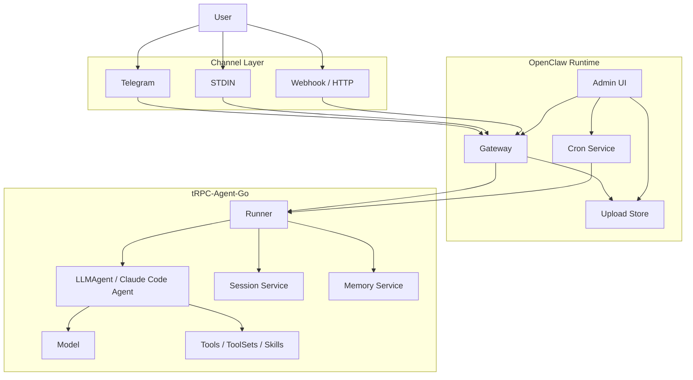
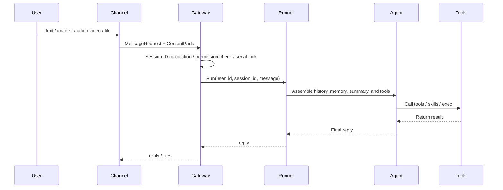
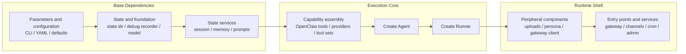

# tRPC-Agent-Go: Building an Enterprise-Grade, Secure, and Controllable OpenClaw Runtime

## Introduction

As Agents move from one-off Q&A into long-running scenarios, what truly determines usability is often no longer whether a single response is clever, but whether the Agent can reliably connect to message entry points, manage sessions and memory, handle images and files, execute tools, keep running, and remain operable. This article focuses on the `openclaw` implementation in tRPC-Agent-Go. The first half introduces message entry integration, installation and configuration, and actual usage results, then returns to the Runtime's assembly model, core flow, and extension boundaries.

## Preface

> tRPC-Agent-Go is an autonomous multi-Agent framework for Go, with capabilities such as tool calling, session and memory management, artifact management, multi-Agent collaboration, graph orchestration, knowledge bases, and observability.  
>
> GitHub open-source repository:
> [github.com/trpc-group/trpc-agent-go](https://github.com/trpc-group/trpc-agent-go).
>
> `openclaw` directory:
> [github.com/trpc-group/trpc-agent-go/tree/main/openclaw](https://github.com/trpc-group/trpc-agent-go/tree/main/openclaw).

The `openclaw` implementation in tRPC-Agent-Go is not a one-to-one copy of the official OpenClaw engineering structure, protocol details, or runtime implementation. Instead, it is a Go implementation of the OpenClaw shape for "long-running operation, multiple entry points, continuous scheduling, and extensible tools and skills" based on the existing abstractions in tRPC-Agent-Go. Users can initiate messages from Telegram, a local terminal, or a custom Channel. `openclaw` then uses Gateway, Runner, Session, Memory, Tool, and Skill to organize a complete Agent execution flow and safely send results back to the same session.

## One-Click Download and Trial

For a first-time installation, run:

```bash
curl -fsSL \
  'https://github.com/trpc-group/trpc-agent-go/releases/latest/download/openclaw-install.sh' \
  | bash
```

After installation, you will get the following defaults:

- Main command: `openclaw`
- Default main configuration: `~/.trpc-agent-go-github/openclaw/openclaw.yaml`
- Default template: `stdin`
- Default configuration directory: `~/.trpc-agent-go-github/openclaw/`

If you only want to first try the built-in `mock` model in a local terminal, you can explicitly switch to the `stdin` profile:

```bash
curl -fsSL \
  'https://github.com/trpc-group/trpc-agent-go/releases/latest/download/openclaw-install.sh' \
  | bash -s -- --profile stdin
```

If `~/.local/bin` is not yet in your `PATH`, add it to `~/.bashrc`:

```bash
printf '\nexport PATH="$HOME/.local/bin:$PATH"\n' >> ~/.bashrc
source ~/.bashrc
```

If an older version is already installed on your machine, upgrade it directly:

```bash
openclaw upgrade
```

This command updates the `openclaw` binary and the template files under `profiles/`. By default, it will not overwrite the `openclaw.yaml` you are currently using. If the startup log says a new version is available, you can also run this command directly.

## Background

When an Agent enters long-running scenarios, the problem shifts from the effectiveness of a single inference to whether the runtime shape is complete. An Agent Runtime that can run stably for a long time must handle at least five categories of problems at the same time.

- How to receive messages, meaning how to bring external requests in from entry points such as Telegram, terminal, or Webhook.
- How to maintain context, meaning how to merge different messages into stable sessions and decide which information should enter long-term memory.
- How to execute actions, meaning how to let the Agent call tools, skills, code executors, and handle files and multimodal input.
- How to keep running, meaning support for scheduled tasks, cross-session callbacks, file uploads, and management capabilities.
- How to extend capabilities, meaning how to keep adding new Channels, Models, ToolSets, and storage backends without rewriting the main flow.

The significance of [OpenClaw](https://github.com/openclaw/openclaw) lies in how it handles these five categories of problems within a single runtime boundary. For the Go ecosystem, this problem is especially meaningful from an engineering perspective: the hard part is often not writing a Bot that can reply to messages, but organizing Gateway, Session, Memory, Tool, file handling, scheduling, and the management plane into a long-running system while reusing existing framework capabilities as much as possible.

The `openclaw` implementation in tRPC-Agent-Go emerged in this context. It uses `Runner` as the execution center, `Session` and `Memory` as the state foundation, and Tool, Skill, ToolSet, and executors as capability extension points. Around them, it adds Gateway, Channel, Cron, upload storage, and a management plane, pushing single-inference capability toward a long-running system.

## Quick Start

The goal of this section is clear: start from the public installation script in the GitHub release, run a minimal OpenClaw Runtime, then continue connecting a real model and message entry point.

### Path A: Install the Precompiled Release

If your goal is to get it running as quickly as possible, do not start with `go run`. First install the released binary:

```bash
curl -fsSL \
  https://github.com/trpc-group/trpc-agent-go/releases/latest/download/openclaw-install.sh \
  | bash
```

The default installation profile is `stdin`, which uses the built-in `mock` model. Therefore, the first startup requires neither a model key nor message entry credentials such as Telegram.

By default, the installation script writes the GitHub-version configuration and state directory to `~/.trpc-agent-go-github/openclaw`.

If `openclaw` still cannot be found after installation, run the PATH command printed by the installation script. For bash, the persistent form is:

```bash
grep -qxF 'export PATH="$HOME/.local/bin:$PATH"' "$HOME/.bashrc" || \
  printf '\nexport PATH="$HOME/.local/bin:$PATH"\n' >> "$HOME/.bashrc"
. "$HOME/.bashrc"
```

Then start it directly:

```bash
openclaw
```

After startup, you are already in local terminal chat mode. Send a simple message such as `hello` first. You can also use `/help` to view basic commands, and finally use `/quit` or `/exit` to exit.

### Path B: Run from Source

If your goal is to develop or modify OpenClaw itself, run it from source. Prepare the following first:

- A Go development environment.
- The tRPC-Agent-Go repository code.
- A message entry credential. The examples in this article use a Telegram Bot Token.
- An accessible model service, or temporarily use `mock` mode.

The minimal environment variables are:

```bash
export TELEGRAM_BOT_TOKEN='replace-with-your-bot-token'
export OPENAI_API_KEY='replace-with-your-api-key'

# Optional: add this if you use an OpenAI-compatible gateway.
export OPENAI_BASE_URL='https://your-openai-compatible-endpoint/v1'
```

If you only want to verify the message send-and-receive flow first, without connecting a real model yet, you can change `model.mode` in the configuration file to `mock`. This first narrows the problem down to "whether messages come in and whether results go out." After the flow is confirmed stable, switch back to a real model.

The reference configuration in the public repository is located at `openclaw/openclaw.yaml`. It enables the Telegram Channel by default and uses in-memory backends for both Session and Memory:

```yaml
app_name: "openclaw"

http:
  addr: ":8080"

admin:
  enabled: true
  addr: "127.0.0.1:19789"
  auto_port: true

agent:
  instruction: "You are a helpful assistant. Reply in a friendly tone."

model:
  mode: "openai"
  name: "gpt-5"
  openai_variant: "auto"

channels:
  - type: "telegram"
    config:
      token: "${TELEGRAM_BOT_TOKEN}"
      streaming: "progress"
      http_timeout: "60s"

session:
  backend: "inmemory"

memory:
  backend: "inmemory"
```

When running from source, you can first use `mock` to verify the main flow:

```bash
go run ./cmd/openclaw -config ./openclaw/openclaw.yaml -mode mock
```

After startup, check the health check:

```bash
curl -sS 'http://127.0.0.1:8080/healthz'
```

After confirming that the flow is stable, switch to a real model:

```bash
go run ./cmd/openclaw -config ./openclaw/openclaw.yaml -mode openai -model gpt-5
```

At this point, send a message in the Telegram conversation, and you can observe the complete collaboration among the message entry point, Gateway, Runner, Agent, Session, and Memory.

## Other Entry Points: Telegram and Local Debugging

The public version of `openclaw` provides Telegram and local terminal entry points by default. The same Runtime can also be extended to other HTTP callback entry points.

### Local Terminal Mode

If you only want to first understand the Runtime skeleton, use the minimal `stdin` entry point:

```yaml
app_name: "openclaw-stdin"

http:
  addr: ":8080"

model:
  mode: "mock"

agent:
  instruction: "You are a helpful assistant for terminal chat."

channels:
  - type: "stdin"
    name: "terminal"
    config:
      from: "alice"
```

The purpose of this mode is to run the entire main flow of `Channel -> Gateway -> Runner -> Agent -> Tool` locally first. After confirming that this works, connecting a real message entry point will greatly narrow the problem scope.

### Telegram

If you are in a public-network environment, or want to verify another message entry point, you can switch to Telegram. At this point, the changes mainly happen at the Channel layer. The main flow of Gateway, Runner, Session, Memory, and Tool does not change:

This flow is more suitable to try on a Mac. When jointly debugging Telegram, STDIN, and local desktop tools, the local development experience on macOS is usually more direct.

```yaml
app_name: "openclaw"

http:
  addr: ":8080"

agent:
  instruction: "You are a helpful assistant. Reply in a friendly tone."

model:
  mode: "openai"
  name: "gpt-5"
  openai_variant: "auto"

channels:
  - type: "telegram"
    config:
      token: "${TELEGRAM_BOT_TOKEN}"
      streaming: "progress"
      http_timeout: "60s"

session:
  backend: "inmemory"

memory:
  backend: "inmemory"
```

Telegram and the local terminal are simply different Channels under the same Runtime.

### Typical Telegram Scenarios

The following screenshots come from the Telegram entry point of the current implementation. They cover document processing, multimodal input, Skill, and scheduled task examples, making it easier to understand how the same Runtime behaves under a real message entry point.

#### Document Processing

Document processing is one of the scenarios that best demonstrates the value of the Runtime. The real difficulty here is not "whether the model can talk," but whether the system can connect file reception, instruction understanding, tool invocation, result generation, and file return into a complete flow.

For example, after uploading a PDF, you can directly extract specified content:


You can also split a PDF into multiple pages and send the new files back:


Voice input can also drive document processing. In the following example, the user uses voice to request merging specified pages into one PDF:


The system can also directly generate a Word document for reporting based on input materials:


Excel processing follows the same flow. In the following example, the user uses voice to request keeping the first row and deleting the remaining rows. The processed spreadsheet file is sent back directly:


#### Images and Videos

In image understanding scenarios, images can directly enter the model capability as multimodal input:


Video scenarios usually follow a flow of "process media first, then hand it to the model." For example, in the following case, the user asks to extract the first frame of a video and send the image back:


In video OCR scenarios, the system can first locate the target frame and then continue with text recognition. The following example first extracts the last frame:


After confirming the target frame, it returns the recognized text content:


#### Skills and System Operations

`openclaw` does not limit capabilities to the "conversation reply" layer. Instead, it allows Skill, system tools, and external result writing to be chained in the same execution round.

For example, in the following case, the system first queries the weather, then writes the current chat record into Apple Notes:


The corresponding note result is shown below:


Similarly, you can also create reminders directly in the conversation:


The corresponding result is shown below:


#### Scheduling and Management

A long-running system also needs to handle tasks that are "not done now, but done on schedule." In the following example, the user first views and clears current tasks, then asks the system to report the local CPU usage once per minute:


In addition to in-conversation commands, the current implementation also provides a local Admin UI for viewing instance information, Gateway routes, tasks, execution sessions, uploaded files, and debug traces:


## Core Concepts

From the perspective of runtime responsibility boundaries, `openclaw` can be divided into four layers: the entry layer, standardization layer, execution layer, and runtime service layer. The entry layer receives messages, the standardization layer unifies semantics, the execution layer performs actual Agent inference and action execution, and the runtime service layer provides the supporting capabilities required by a long-running system.

The overall structure is shown below.



Each layer in the diagram corresponds to an independent category of responsibility.

- **Channel** receives messages from external platforms, such as Telegram, terminal input, or custom Webhooks.
- **Gateway** converts messages from different sources into a unified request, and handles session IDs, permissions, serialization, and multimodal standardization.
- **Runner / Agent** performs the actual inference, connecting history, memory, tools, and the model.
- **Session / Memory** stores conversation context and long-term information, answering the question of "how the system remembers what happened before."
- **Runtime Services** provide the peripheral capabilities required by a long-running runtime, such as scheduling, file uploads, and the management plane.

When a message enters the system from outside, it usually goes through the following five steps:

1. Channel receives the raw message, such as text, image, audio, video, or file.
2. Gateway calculates a stable `session_id`, completes admission checks, and normalizes the input into a standard request.
3. Runner retrieves history and memory based on `session_id`, then calls the underlying Agent to perform inference.
4. Agent calls Tool, Skill, ToolSet, or code executors as needed to generate the final reply.
5. Gateway hands the reply result back to Channel, and Channel sends it back to the external platform.

In the tRPC-Agent-Go `openclaw` implementation, its responsibility is not to redefine the Agent, but to place the Agent inside a system boundary that can run for a long time and continue to extend.

### Gateway

Gateway sits between message entry points and the execution core. Messages from different Channels have different formats, attachment representations, and session semantics, but they need to be organized into a unified request before entering Runner. Gateway completes this step.

The current Gateway exposes the following entry points by default:

- `/healthz`
- `/v1/gateway/messages`
- `/v1/gateway/status`
- `/v1/gateway/cancel`

It mainly completes the following work:

- Generates a stable `session_id`
- Applies admission rules such as allowlist and mention
- Ensures serial execution within the same session
- Standardizes text and multimodal input
- Calls Runner and returns results

The default session ID rules are:

- Direct message: `<channel>:dm:<from>`
- Thread or topic: `<channel>:thread:<thread>`

This rule is important because it determines "which messages should be treated as the same continuous conversation." If the session boundary is unstable, the value of Session and Memory is weakened.

The message processing flow is shown below.



In multimodal scenarios, Gateway also takes on standardization responsibilities. For example, images, audio, and videos are organized into a unified `ContentPart` structure; URL inputs go through protocol and domain validation; and audio is converted as much as possible into a format that the model can more easily accept. This allows Channel to focus only on "how to receive and send messages" without repeatedly implementing a full set of Agent runtime logic.

### Channel

Channel is the most direct interface between the runtime and the outside world. In the tRPC-Agent-Go `openclaw` implementation, it acts as the platform protocol adapter, converting a platform's message protocol into requests Gateway can understand, and converting Gateway's replies back into that platform's sending format.

OpenClaw keeps the Channel interface constraints relatively lightweight:

```go
package channel

type Channel interface {
	ID() string
	Run(ctx context.Context) error
}
```

If a Channel also needs to proactively send text or files, it can additionally implement `TextSender` or `MessageSender`. This interface design brings two direct results.

- When adding a new entry point, there is no need to change the main Runner and Agent flow.
- Different platforms can keep their own network models and access methods as long as they eventually map to unified Gateway requests.

Differences among Channels mainly appear in protocol adaptation and response delivery, not in the underlying execution flow.

### Session and Memory

From the source code, `Session` and `Memory` are two different state layers in `openclaw`, and they solve different problems.

- `Session` solves "how to retain the context of this segment of conversation."
- `Memory` solves "how to accumulate long-term facts across sessions."

Their scopes are also different:

- `Session` is bounded by `<AppName, UserID, SessionID>`.
- `Memory` is bounded by `<AppName, UserID>` and is naturally cross-session.

If you want to persist Session and Memory to SQLite, configure the two parts separately:

```yaml
session:
  backend: "sqlite"
  summary:
    enabled: false
  config:
    path: "${HOME}/.trpc-agent-go-github/openclaw/sessions.sqlite"

memory:
  backend: "sqlite"
  limit: 100
  auto:
    enabled: false
  config:
    path: "${HOME}/.trpc-agent-go-github/openclaw/memories.db"
```

In other words, persistence and automatic memory are two layers of switches. You can first enable only persistent storage, then turn on summary and automatic memory as needed, avoiding too many variables during the first joint debugging.

Looking further at `openclaw/backends/sqlite.go`, the default SQLite memory backend stores data in the `openclaw_memories` table. The core fields include:

- `app_name`
- `user_id`
- `memory_id`
- `memory_text`
- `topics_json`
- `created_at`
- `updated_at`
- `deleted_at`

Several implementation details here are critical.

First, `memory_id` is not a random ID. It is generated by applying SHA-256 to `memoryText + appName + userID`. This means that when the same user writes exactly the same memory in the same application, the default behavior is upsert instead of continuously accumulating duplicate entries.

Second, memory has a hard limit. The default limit in code is `1000`, while the distribution template tightens it to `100`. Before adding a memory, the system first counts the current user's valid memories. If the limit is exceeded, it returns an error directly and will not grow without bound.

Third, search is not a simple SQL `LIKE`. `SearchMemories` first reads all valid memories for the current user, then scores and sorts them in memory:

- Chinese queries use `gse` segmentation and filter common stop words.
- English queries are split into alphanumeric tokens, and words shorter than 2 characters are ignored.
- Hits in the memory body or topics both contribute to the score.
- When scores are tied, memories with a more recent `updated_at` are returned first.

This is also why memory is better suited for stable facts rather than entire chat records.

Looking further at `buildMemoryTools(...)`, in the default manual mode, the memory tools exposed to the Agent are mainly:

- `memory_add`
- `memory_update`
- `memory_search`
- `memory_load`

If you enable the extractor, that is, automatic memory mode, the strategy changes:

- The tools directly exposed to the model are still mainly `search/load`
- Write operations such as `add/update/delete` are preferentially handed over to the background extractor

The purpose is to keep "memory retrieval" available to the running Agent while centralizing the "memory persistence strategy" in the automatic memory flow, reducing the chance that the model casually rewrites long-term memory during conversation.

The core logic of automatic memory is in `openclaw/backends/sqlite_auto.go`. It does not rescan the entire session in full every round, but performs incremental extraction:

- The session state records the last extraction time
- Only messages added after that time are scanned
- Tool messages, empty messages, and intermediate messages with tool calls are filtered out
- Then the incremental user messages are assembled into query terms, existing memories are searched first, and the extractor generates `add/update/delete/clear` operations

This worker also has two important engineering details.

- It performs hash sharding by `UserKey`, sending automatic memory tasks for the same user stably to the same queue to avoid concurrent disorder.
- If the asynchronous queue is full, it falls back to a synchronous extraction path with a timeout, trying to avoid dropping memory tasks directly.

Therefore, in `openclaw`, Session, Summary, and Memory are best understood separately:

- `Session` retains the current session event stream.
- `Summary` compresses the current session context to reduce long-conversation cost.
- `Memory` accumulates long-term facts across sessions.

This is also why, in long-running assistant scenarios, the stability of `session_id` directly affects Session and automatic memory, while Memory itself must exist independently from any single session.

### Agent Runtime Capabilities

After Gateway, `openclaw` directly reuses the existing execution system in tRPC-Agent-Go. In the current implementation, the configurable core capabilities include:

- Agent types: `llm`, `claude-code`
- Session backend: `inmemory`, `redis`, `sqlite`, `mysql`, `postgres`, `clickhouse`
- Memory backend: `inmemory`, `redis`, `mysql`, `postgres`, `pgvector`
- Tool providers: `duckduckgo`, `webfetch_http`
- ToolSet providers: `mcp`, `file`, `openapi`, `google`, `wikipedia`, `arxivsearch`, `email`
- Skills: skill directories based on `SKILL.md`

In addition, `openclaw` adds several kinds of tools that are closer to long-running scenarios:

- `exec_command`
- `write_stdin`
- `kill_session`
- `message`
- `cron`

The significance of these tools is not to change how the Agent reasons, but to bring real actions in long-running scenarios into a unified runtime. For example, local command execution, cross-Channel message delivery, and scheduled task creation are all frequent requirements in long-running systems.

### Scheduling and Management

Single-turn conversation capability only shows that the system can "respond." A long-running system must also be able to "manage itself." Therefore, `openclaw` adds scheduling and management capabilities outside the main flow.

At the scheduling layer, the `cron` tool corresponds to a resident scheduling service, supporting:

- Persistent task storage
- Scheduled triggering of Agent runs
- Sending results back to a specified Channel and target object through the outbound router

At the management layer, the current Runtime also produces management capabilities and debug data related to Gateway, jobs, exec sessions, uploads, debug traces, and more.

### Extension Model

The extension boundary of `openclaw` is consistent with its runtime boundary. Message entry extensions stay at the Channel layer; external tool and tool collection extensions stay at the ToolProvider and ToolSet layers; state and model differences stay at the backend factory layer; and the standard binary is only responsible for compiling these capabilities into the final artifact.

## Usage

### Runtime Assembly

`openclaw/app.NewRuntime(...)` is the assembly entry point for the entire runtime. It parses parameters, fills defaults, prepares state and model dependencies, builds the Agent and Runner, and then attaches peripheral components such as Gateway, Channel, Cron, and Admin. This process is more like a staged assembly chain than the execution path of a specific business process.



The significance of this assembly order is that the underlying dependencies, execution core, and peripheral entry points are clearly layered. Model is still provided by the `model` implementation, Session and Memory are still provided by their respective backends, and Tool, ToolSet, and Skill still use the native tRPC-Agent-Go system. `openclaw` is responsible for assembling these capabilities into a complete runtime.

### Checking Registered Capabilities

Before extending anything, the first thing to confirm is not how to write YAML, but which types the current binary actually contains. `openclaw` provides a troubleshooting entry point directly for this question:

```bash
openclaw inspect plugins
```

This command lists the registered items already included in the current binary:

- Channel types
- Model types
- Session backends
- Memory backends
- Tool providers
- ToolSet providers

These types all come from the global registry in `openclaw/registry`. When the runtime parses `channels`, `tools.providers`, `tools.toolsets`, `session.backend`, `memory.backend`, and `model.mode`, it first looks up the corresponding factory by string type name, then decides whether to create an instance.

### Custom Distribution Binary

`openclaw` uses a typical Go compile-time registration model. `openclaw/registry` maintains a `type -> factory` registry. Each plugin package calls `registry.Register...(...)` in `init()` to complete registration, and the distribution entry point uses blank imports to compile these packages into the final binary. Therefore, the configuration file is responsible for selecting types, while the binary is responsible for determining the set of available types.

The distribution entry point in the public repository is a ready-made example. In `openclaw/cmd/openclaw/main.go`, it uses blank imports to select the plugins compiled into the binary:

```go
package main

import (
	"trpc.group/trpc-go/trpc-agent-go/openclaw/app"

	_ "trpc.group/trpc-go/trpc-agent-go/openclaw/plugins/stdin"
	_ "trpc.group/trpc-go/trpc-agent-go/openclaw/plugins/telegram"
)
```

The significance of this approach is that the runtime main flow remains stable, while a distribution only adds or removes plugins around the access scope and capability scope, without modifying `app.NewRuntime(...)` itself.

### Channel Extension

When adding a new message entry point, you should usually extend Channel rather than modifying Gateway or Runner. The reason is that the main execution flow after Gateway is already unified, and a new entry point mainly takes on two responsibilities: "receiving messages" and "sending messages."

The Telegram plugin in the public repository is a relatively complete example. Under [`openclaw/plugins/telegram`](https://github.com/trpc-group/trpc-agent-go/tree/main/openclaw/plugins/telegram), it registers the `telegram` type into the Channel registry:

```go
package telegram

import (
	"trpc.group/trpc-go/trpc-agent-go/openclaw/registry"
)

func init() {
	if err := registry.RegisterChannel(pluginType, newChannel); err != nil {
		panic(err)
	}
}
```

The platform differences that this extension actually handles are mainly concentrated inside Channel.

- The configuration layer reads entry parameters such as `token`, `streaming`, `proxy`, and `http_timeout`.
- The protocol layer handles Telegram API calls, message structure parsing, and file downloads.
- The session layer derives stable session identifiers based on private chats, group chats, and thread information.
- The response layer converts Gateway events back into Telegram message updates.

### ToolProvider and ToolSet Extension

ToolProvider and ToolSet use the same registration model, but their responsibilities are different.

- ToolProvider is suitable for scenarios where the tools to attach are clearly known at startup, and the factory returns `[]tool.Tool`.
- ToolSet is more suitable for scenarios where an external system derives a group of tools, and the factory returns `tool.ToolSet`.

From the runtime assembly perspective, `newAgent(...)` first attaches the built-in `openclaw` tools, memory tools, and skills tools, then calls `toolsFromProviders(...)` based on `tools.providers` in YAML and calls `toolSetsFromProviders(...)` based on `tools.toolsets`.

### Session, Memory, and Model Backend Extension

If the business difference is not in the message entry point, but in the state foundation or model access layer, the extension point should be the backend factory rather than directly modifying the runtime main flow.

The mapping is straightforward:

- `model.mode` corresponds to `registry.RegisterModel(...)`
- `session.backend` corresponds to `registry.RegisterSessionBackend(...)`
- `memory.backend` corresponds to `registry.RegisterMemoryBackend(...)`

The value of this type of extension is that the YAML experience on the user side remains stable. For example, after adding a custom Session backend, users still only need to write the type name and configuration block in the configuration.

### Skills Extension

In many business scenarios, the first things to change are not runtime components, but operating instructions, scripts, and business knowledge. In such cases, extending Skills first is usually more suitable than directly writing Go plugins.

There are several engineering points worth noting in `openclaw` support for Skills:

- A Skill exists as a folder, and the core file is `SKILL.md`
- The runtime loads Skills from multiple root directories and handles same-name overrides by priority
- Gating can be performed through `skills.entries`, `allowBundled`, and metadata

The troubleshooting command most relevant to Skills configuration is:

```bash
openclaw inspect config-keys -config ~/.trpc-agent-go-github/openclaw/openclaw.yaml
```

When a Skill does not take effect, the more common reason is not that "the Skill was not loaded," but that the config, env, or bin it depends on has not yet been satisfied.

## Best Practices

In real deployments, the following practices are usually the most important.

1. Move debugging from the inside out: first use `mock` to run through the local entry point or message entry point, then switch to a real model.
2. For the first joint debugging session, use the minimum configuration and enable only one Channel, avoiding simultaneous troubleshooting of model, entry point, and tool issues.
3. For image and file scenarios, prefer letting Channel download the real content first, then hand the content to Gateway and Model.
4. Aim for model stability before complexity. Verify plain text first, then images and files, and finally enable more complex tool flows.
5. Channel should remain as lightweight as possible, handling only platform protocols while consolidating business semantics into Gateway and Runner.

## Summary

The `openclaw` implementation in tRPC-Agent-Go is a long-running Runtime shape built on top of the existing Agent framework. It does not aim to fully align with the official OpenClaw engineering structure. Instead, it prioritizes reusing existing capabilities such as `Runner`, `Session`, `Memory`, `Tool`, `Skill`, `ToolSet`, and executors, then organizes them through Gateway, Channel, Cron, upload storage, and management capabilities into a system closer to a real assistant product.

The first half of this article explains the installation, configuration, and joint debugging process of the public release, and uses Telegram and local terminal entry points to demonstrate the runtime shape. The second half returns to the Runtime itself, covering its assembly model and extension boundaries. After this flow is running, the message access, file processing, tool calling, session management, and continuous operation capabilities provided by `openclaw` can also continue to expand to Telegram, STDIN, and other Webhook entry points.

## Usage and Community

- GitHub repository:
  [github.com/trpc-group/trpc-agent-go](https://github.com/trpc-group/trpc-agent-go)
- `openclaw` directory:
  [github.com/trpc-group/trpc-agent-go/tree/main/openclaw](https://github.com/trpc-group/trpc-agent-go/tree/main/openclaw)
- Installation instructions:
  [github.com/trpc-group/trpc-agent-go/blob/main/openclaw/INSTALL.md](https://github.com/trpc-group/trpc-agent-go/blob/main/openclaw/INSTALL.md)
- Telegram plugin:
  [github.com/trpc-group/trpc-agent-go/tree/main/openclaw/plugins/telegram](https://github.com/trpc-group/trpc-agent-go/tree/main/openclaw/plugins/telegram)

If you are interested in how this kind of long-running Agent Runtime can be implemented in the Go ecosystem, you are welcome to keep building together, and you are also welcome to give the GitHub repository [github.com/trpc-group/trpc-agent-go](https://github.com/trpc-group/trpc-agent-go) a Star.

You are welcome to use GitHub Issues to discuss framework usage experience, share practical cases, and talk about improvement ideas.
