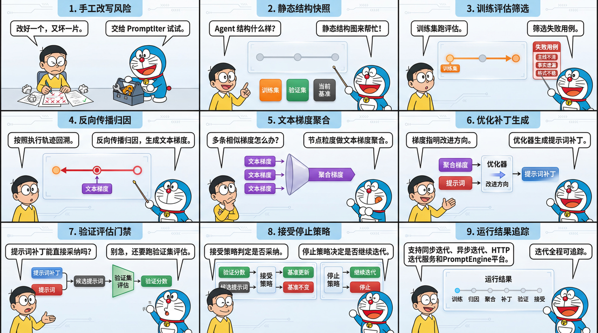

# tRPC-Agent-Go PromptIter: A Complete Guide to Automated Prompt Iteration and Engineering Practice for AI Agents

> When an Agent's prompt carries business rules, version risk does not come only from obvious failures. It also comes from behavior drift after a rewrite. A manual prompt change may fix one failed sample while reducing output quality in other scenarios. A higher training-set score alone cannot prove that a candidate version is acceptable. Validation-set evaluation results and an acceptance policy jointly determine whether a candidate version should be accepted. PromptIter organizes training sets, validation sets, structure snapshots, and execution traces into a reproducible prompt iteration workflow, and records each candidate version, score, patch, and stop reason as a result snapshot.

> [tRPC-Agent-Go](https://github.com/trpc-group/trpc-agent-go/) is an autonomous multi-Agent framework for Go. It provides tool calling, session and memory management, artifact management, multi-Agent collaboration, graph orchestration, knowledge bases, observability, and more. tRPC-Agent-Go grows with community support. Stars are welcome.

tRPC-Agent-Go provides PromptIter on top of the Evaluation capability to move Agent prompt optimization from manual rewriting to an evaluation-constrained automated iteration workflow. PromptIter centers on training sets, validation sets, and evaluation metrics. It backpropagates failure signals exposed by the training set along execution traces for attribution, converts them into candidate prompts through text-gradient aggregation and optimization patch generation, and then lets validation-set evaluation and the acceptance policy decide whether the candidate prompt enters later rounds. Each run records candidate prompts, validation results, acceptance decisions, and stop reasons, so different prompt versions can be compared, reviewed, and traced under fixed evaluation criteria. It supports synchronous runs, asynchronous runs, and HTTP iteration services.



## Background

Prompt optimization in the experiment phase usually relies on manual judgment and rewriting. Developers adjust prompts according to scattered failed samples and then validate them with a small number of cases. This works for exploration, but it is hard to use for continuous delivery. A single prompt change may affect task understanding, tool selection, and the content, structure, and expression of the final answer at the same time. Improvement on one sample is only a local signal and cannot replace regression validation across multiple scenarios.

After an Agent enters a business workflow, common risks in prompt optimization can be divided into four categories.

1. The optimization objective may drift. When manually fixing a single failed sample, a developer may add constraints that are too narrow. If those constraints only cover the current sample, output quality on other samples may drop.
2. Training signals and acceptance signals may be mixed. If the same failed samples are used both to generate modification suggestions and to evaluate candidate prompts, overfitting risk is amplified. A more rigorous approach is to let the training set expose problems and generate optimization signals, and let the validation set provide the validation score needed for candidate-prompt acceptance.
3. Failure signals are hard to attribute to specific nodes. For a single Agent, the issue may come from that Agent's prompt. For graph orchestration and multi-Agent systems, the issue may come from planning, retrieval, draft generation, editing review, or any other step. Looking only at the final answer makes it hard to decide which node should receive the failure signal.
4. Prompt versions lack structured records. Manually replacing prompt text can complete one change, but it is hard to trace which failure signals produced the candidate prompt, which positions were modified, and why the candidate was accepted or rejected.

PromptIter handles these risks through separate workflow stages. Evaluation provides reproducible evaluation inputs and metric outputs. The structure snapshot describes the static composition of the target Agent, including nodes, edges, and iterable content associated with nodes. The execution trace records the actual dynamic step path for the current run. Backpropagation attribution, text-gradient aggregation, and optimization patch generation gradually convert failure signals into candidate patches. Validation-set evaluation and the acceptance policy together form the acceptance decision for the candidate prompt.

## Industry Survey

Prompt optimization is not just direct rewriting of prompt text. A more stable approach is to define evaluation criteria first, extract modification directions from failed samples, generate candidate prompts, and then validate whether candidates meet acceptance conditions on independent samples. The industry has explored several methods in this direction.

[ProTeGi](https://arxiv.org/abs/2305.03495) focuses on automatic search for a single task prompt. It analogizes gradient descent in numerical optimization to natural-language scenarios. The process first runs the current prompt and collects error samples, then asks a model to summarize the prompt issues exposed by those errors and form natural-language gradients. It then generates multiple candidate prompts from those gradients, keeps higher-scoring candidates in each round, continues the search, and finally selects the version with better evaluation performance.

[TextGrad](https://arxiv.org/abs/2406.07496) focuses on optimizing text variables in complex AI systems. It represents the system as a computation graph. Variables in the graph can be prompts, code snippets, or other text objects. After forward execution, feedback is produced by the objective function, evaluator, or downstream loss signal. An LLM writes the feedback as natural-language gradients, which are then backpropagated along the computation graph to related variables.

[DSPy](https://arxiv.org/abs/2310.03714) focuses on processing pipelines composed of multiple language-model calls. Developers describe module inputs and outputs with signatures, organize module calls with programs, and let the compiler optimize learnable parts such as examples and prompts around given metrics.

These methods show that prompt optimization can form an automated workflow around evaluation feedback, candidate generation, and metric validation. From a business implementation perspective, however, ProTeGi mainly targets single-prompt search and is hard to apply directly to multi-node Agent scenarios. TextGrad provides a general abstraction for text-variable optimization, but engineering implementation such as evaluation asset management, candidate-version acceptance, and run-result tracing still needs to be built separately. DSPy requires language-model call flows to be reorganized around its modules and signatures, which brings a high migration cost for existing Agent projects.

tRPC-Agent-Go uses PromptIter to bring this type of optimization workflow into existing Agent projects. It organizes training-set evaluation feedback, backpropagation attribution, text-gradient aggregation, optimization patch generation, candidate-prompt construction, validation-set acceptance decisions, and result tracing into a closed loop.

## Quick Start

This section uses `examples/evaluation/promptiter/syncrun` to show the minimal integration path for synchronous prompt iteration. See the complete example at [examples/evaluation/promptiter/syncrun](https://github.com/trpc-group/trpc-agent-go/tree/main/examples/evaluation/promptiter/syncrun).

The example code covers the following integration modes.

- [examples/evaluation/promptiter/syncrun](https://github.com/trpc-group/trpc-agent-go/tree/main/examples/evaluation/promptiter/syncrun) demonstrates synchronous prompt iteration.
- [examples/evaluation/promptiter/asyncrun](https://github.com/trpc-group/trpc-agent-go/tree/main/examples/evaluation/promptiter/asyncrun) demonstrates asynchronous prompt iteration.
- [examples/evaluation/promptiter/server](https://github.com/trpc-group/trpc-agent-go/tree/main/examples/evaluation/promptiter/server) demonstrates HTTP integration for prompt iteration.
- [examples/evaluation/promptiter/multinode](https://github.com/trpc-group/trpc-agent-go/tree/main/examples/evaluation/promptiter/multinode) demonstrates multi-node prompt iteration.

### Environment Setup

Prepare three types of resources before running the example.

- An accessible OpenAI-compatible model service.
- Training set, validation set, and metric files.
- Model names for the target Agent, judge, and PromptIter worker components.

The example reads the model service endpoint and key from environment variables.

```bash
# Set the model service key.
export OPENAI_API_KEY="sk-xxx"
# This is optional. If it is not set, the example uses the OpenAI-compatible default endpoint.
export OPENAI_BASE_URL="https://api.openai.com/v1"
```

### Target Agent

The target Agent in the `syncrun` example is named `candidate`. It is an LLMAgent created with `llmagent.New`. The example creates this Agent through `newCandidateAgent` and passes the initial prompt as `instruction`. Later runs limit the modification target to the `instruction` of `candidate`.

The default initial prompt is `Write a Chinese sports game recap`. This initial prompt demonstrates how PromptIter generates candidate patches from training-set failure signals and accepts or rejects candidate prompts round by round according to validation-set evaluation results and the acceptance policy.

The target Agent and Runner are created as follows.

```go
import (
	"trpc.group/trpc-go/trpc-agent-go/agent"
	"trpc.group/trpc-go/trpc-agent-go/agent/llmagent"
	"trpc.group/trpc-go/trpc-agent-go/model"
	"trpc.group/trpc-go/trpc-agent-go/runner"
)

// newCandidateAgent creates the target Agent.
func newCandidateAgent(m model.Model) (agent.Agent, error) {
	// generationConfig fixes the generation parameters of the target Agent.
	generationConfig := model.GenerationConfig{
		// MaxTokens keeps enough output space for a sports recap.
		MaxTokens: intPtr(32768),
		// Temperature reduces random fluctuation on the same evaluation case.
		Temperature: floatPtr(0.0),
		// Stream disables streaming output so Evaluation can collect the full answer.
		Stream: false,
	}
	return llmagent.New(
		"candidate",
		llmagent.WithModel(m),
		// PromptIter iterates this instruction in the current run.
		llmagent.WithInstruction("Write a Chinese sports game recap"),
		llmagent.WithGenerationConfig(generationConfig),
	), nil
}

candidateAgent, err := newCandidateAgent(candidateModel)
if err != nil {
	return nil, fmt.Errorf("create candidate agent: %w", err)
}
// Runner is the entry point for Evaluation to execute the target Agent.
candidateRunner := runner.NewRunner("promptiter-nba-commentary-candidate", candidateAgent)
```

### Construct AgentEvaluator

The evaluation stage needs to run the target Agent and calculate scores with the training set, validation set, and metric file. The example uses `candidateRunner` as the execution entry point for the target Agent and creates an `AgentEvaluator` through `evaluation.New`. When LLM Judge metrics are used, a Judge Runner must also be provided. The example then creates local `EvalSetManager`, `MetricManager`, and `EvalResultManager` instances to read evaluation sets, read metrics, and save evaluation results.

```go
import (
	"trpc.group/trpc-go/trpc-agent-go/evaluation"
	"trpc.group/trpc-go/trpc-agent-go/evaluation/evalresult"
	evalresultlocal "trpc.group/trpc-go/trpc-agent-go/evaluation/evalresult/local"
	"trpc.group/trpc-go/trpc-agent-go/evaluation/evalset"
	evalsetlocal "trpc.group/trpc-go/trpc-agent-go/evaluation/evalset/local"
	"trpc.group/trpc-go/trpc-agent-go/evaluation/metric"
	metriclocal "trpc.group/trpc-go/trpc-agent-go/evaluation/metric/local"
	"trpc.group/trpc-go/trpc-agent-go/runner"
)

// A judge Runner is required when LLM Judge metrics are used.
judgeRunner := runner.NewRunner(judgeAppName, judgeAgent)

// Evaluation sets, metrics, and evaluation results are managed by their managers.
evalSetManager := evalsetlocal.New(evalset.WithBaseDir("./data"))
metricManager := metriclocal.New(metric.WithBaseDir("./data"))
evalResultManager := evalresultlocal.New(evalresult.WithBaseDir("./output"))

// AgentEvaluator runs training-set and validation-set evaluation.
agentEvaluator, err := evaluation.New(
	appName,
	candidateRunner,
	evaluation.WithEvalSetManager(evalSetManager),
	evaluation.WithMetricManager(metricManager),
	evaluation.WithEvalResultManager(evalResultManager),
	evaluation.WithJudgeRunner(judgeRunner),
)
if err != nil {
	return err
}
```

### Evaluation Files

The local `EvalSetManager` and `MetricManager` read evaluation sets and metric files from the example data directory. PromptIter follows the local file organization used by Evaluation. One PromptIter run specifies the training set and validation set through evaluation set IDs. The complete example reuses the same metric file, which is an Evaluation file-organization detail and is not expanded here.

```text
# data is the example evaluation file directory.
data/
  promptiter-nba-commentary-app/
    nba-commentary-train.evalset.json
    nba-commentary-validation.evalset.json
    sports-commentary.metrics.json
```

These three types of files have different responsibilities.

- `nba-commentary-train.evalset.json` is the training set, used to produce failure signals and optimization signals.
- `nba-commentary-validation.evalset.json` is the validation set, used to provide evaluation results required for acceptance decisions.
- `sports-commentary.metrics.json` is the metric file, used to define scoring rules shared by the training set and validation set.

The training set and validation set in this example use the same evaluation-case structure. `userContent.content` is the input to the target Agent and contains structured game JSON. `finalResponse.content` is the reference output used during evaluation and contains a prewritten Chinese sports recap.

```json
{
  "evalId": "train_01_nba_nuggets_blowout",
  "conversation": [
    {
      "userContent": {
        "role": "user",
        "content": "{\"sport\":\"basketball\",\"league\":\"NBA\",\"teams\":{\"home\":{\"name\":\"Denver Nuggets\",\"score\":128},\"away\":{\"name\":\"Portland Trail Blazers\",\"score\":104}},\"recapAngle\":\"Denver's perimeter shooting and bench depth opened the game early, so the starters did not need to stay late in the fourth quarter\"}"
      },
      "finalResponse": {
        "role": "assistant",
        "content": "Nuggets beat Trail Blazers 128-104 as 18 threes and 52 bench points let starters finish early\n\nOn January 12, 2026, the Denver Nuggets defeated the Portland Trail Blazers 128-104 at Ball Arena..."
      }
    }
  ]
}
```

During evaluation, Evaluation sends `userContent.content` to the target Agent and calculates metrics by comparing the actual output of the target Agent with `finalResponse.content`. Fixed reference outputs keep each run aligned with the same evaluation baseline and avoid extra fluctuation from online reference-answer generation.

The metric file contains two metrics. The key fields are shown below.

```json
[
  {
    "metricName": "final_response_avg_score",
    "threshold": 1.0,
    "criterion": {
      "finalResponse": {
        "text": {
          "length": {
            "min": 350,
            "max": 850
          },
          "matchStrategy": "skip"
        }
      }
    }
  },
  {
    "metricName": "llm_rubric_critic",
    "threshold": 0.98,
    "criterion": {
      "llmJudge": {
        "rubrics": [
          {
            "id": "source_grounding",
            "description": "The recap must be fully grounded in the user input.",
            "type": "FINAL_RESPONSE_QUALITY",
            "content": {
              "text": "The actual recap may only use facts supported by the user input and reference recap."
            }
          }
        ]
      }
    }
  }
]
```

`final_response_avg_score` is the final-response evaluator provided by Evaluation. The example uses it to constrain recap length. `llm_rubric_critic` is an LLM Judge metric. The example uses it together with the reference recap and rubrics to check factual grounding, the main storyline, decisive process, numbers, title, data interpretation, and the quality of Chinese sports copy.

### Construct Engine

When constructing the PromptIter `Engine`, provide the target Agent and `AgentEvaluator` first. The target Agent is used to export the structure snapshot, and `AgentEvaluator` is used to run training-set and validation-set evaluation. Candidate patches also depend on `Backwarder`, `Aggregator`, and `Optimizer`. `Backwarder` performs backpropagation attribution and converts training-set failure signals into text gradients, that is, modification directions pointing to related steps and prompts. `Aggregator` aggregates text gradients by merging multiple text gradients on the same prompt to be modified. `Optimizer` generates optimization patches by producing a candidate patch for that prompt from the aggregated result.

```go
import (
	"trpc.group/trpc-go/trpc-agent-go/evaluation/workflow/promptiter/aggregator"
	"trpc.group/trpc-go/trpc-agent-go/evaluation/workflow/promptiter/backwarder"
	"trpc.group/trpc-go/trpc-agent-go/evaluation/workflow/promptiter/engine"
	"trpc.group/trpc-go/trpc-agent-go/evaluation/workflow/promptiter/optimizer"
	"trpc.group/trpc-go/trpc-agent-go/runner"
)

// backwarderRunner calls the model to perform backpropagation attribution.
backwarderRunner := runner.NewRunner(backwarderAppName, backwarderAgent)
// aggregatorRunner calls the model to perform text-gradient aggregation.
aggregatorRunner := runner.NewRunner(aggregatorAppName, aggregatorAgent)
// optimizerRunner calls the model to perform optimization patch generation.
optimizerRunner := runner.NewRunner(optimizerAppName, optimizerAgent)

// Backwarder performs backpropagation attribution.
backwarderInstance, err := backwarder.New(ctx, backwarderRunner)
if err != nil {
	return err
}
// Aggregator performs text-gradient aggregation.
aggregatorInstance, err := aggregator.New(ctx, aggregatorRunner)
if err != nil {
	return err
}
// Optimizer performs optimization patch generation.
optimizerInstance, err := optimizer.New(ctx, optimizerRunner)
if err != nil {
	return err
}

// Engine binds the target Agent, evaluator, and three PromptIter worker components.
engineInstance, err := engine.New(
	ctx,
	candidateAgent,
	agentEvaluator,
	backwarderInstance,
	aggregatorInstance,
	optimizerInstance,
)
if err != nil {
	return err
}
```

### Construct RunRequest

`RunRequest` specifies the training set, validation set, iteration target, maximum rounds, acceptance policy, and stop policy for one PromptIter run.

```go
import (
	astructure "trpc.group/trpc-go/trpc-agent-go/agent/structure"
	"trpc.group/trpc-go/trpc-agent-go/evaluation/workflow/promptiter/engine"
)

// targetScore is the target validation score for this run.
targetScore := 1.0
// targetInstructionID points to the instruction of the candidate Agent. Its value is candidate#instruction.
targetInstructionID := astructure.SurfaceID("candidate", astructure.SurfaceTypeInstruction)

result, err := engineInstance.Run(ctx, &engine.RunRequest{
	// Train specifies the training set that produces optimization signals.
	Train: []engine.EvalSetInput{
		{
			// EvalSetID points to the training set used to produce optimization signals.
			EvalSetID: trainEvalSetID,
		},
	},
	// Validation specifies the validation set used for acceptance decisions.
	Validation: []engine.EvalSetInput{
		{
			// EvalSetID points to the validation set used for acceptance decisions.
			EvalSetID: validationEvalSetID,
		},
	},
	// Training-set and validation-set evaluation run concurrently by evaluation case.
	EvaluationOptions: engine.EvaluationOptions{
		// EvalCaseParallelism limits evaluation-case concurrency.
		EvalCaseParallelism: 16,
		// EvalCaseParallelInferenceEnabled enables concurrent inference for the target Agent.
		EvalCaseParallelInferenceEnabled: true,
		// EvalCaseParallelEvaluationEnabled enables concurrent metric calculation.
		EvalCaseParallelEvaluationEnabled: true,
	},
	// Backpropagation attribution processes evaluation cases sequentially by default.
	BackwardOptions: engine.BackwardOptions{
		// CaseParallelismEnabled controls whether training-set evaluation cases are processed concurrently.
		CaseParallelismEnabled: false,
		// CaseParallelism is the evaluation-case concurrency limit after concurrency is enabled.
		CaseParallelism: 16,
	},
	// Text-gradient aggregation runs concurrently by iteration target.
	AggregationOptions: engine.AggregationOptions{
		// SurfaceParallelismEnabled controls whether multiple iteration targets are processed concurrently.
		SurfaceParallelismEnabled: true,
		// SurfaceParallelism is the iteration-target concurrency limit.
		SurfaceParallelism: 16,
	},
	// Optimization patch generation runs concurrently by iteration target.
	OptimizerOptions: engine.OptimizerOptions{
		// SurfaceParallelismEnabled controls whether patches are generated concurrently for multiple iteration targets.
		SurfaceParallelismEnabled: true,
		// SurfaceParallelism is the iteration-target concurrency limit.
		SurfaceParallelism: 16,
	},
	// A candidate prompt must improve over the current baseline prompt by at least 0.01 points.
	AcceptancePolicy: engine.AcceptancePolicy{
		// MinScoreGain is the minimum validation-score gain required to accept a candidate prompt.
		MinScoreGain: 0.01,
	},
	// The run stops when it reaches max rounds, consecutive non-accepted rounds, or the target score.
	MaxRounds: 4,
	StopPolicy: engine.StopPolicy{
		// MaxRoundsWithoutAcceptance limits consecutive rounds without accepting a candidate prompt.
		MaxRoundsWithoutAcceptance: 3,
		// TargetScore is the target validation score after which the run can stop.
		TargetScore: &targetScore,
	},
	// The iteration target of this run is the instruction of the candidate Agent.
	TargetSurfaceIDs: []string{targetInstructionID},
})
if err != nil {
	return err
}
```

In the example, `TargetSurfaceIDs` is set to `candidate#instruction`, so the iteration target of this run is the instruction of the target Agent. When integrating multi-Agent or graph orchestration scenarios, first use `engine.Describe(ctx)` or the HTTP `/structure` endpoint to get the structure snapshot, then select targets from the returned result. This avoids hard-coding target IDs in business code.

### Execute Synchronous Iteration

```bash
# Set the model service key.
export OPENAI_API_KEY="sk-xxx"
# This is optional. If it is not set, the example uses the OpenAI-compatible default endpoint.
export OPENAI_BASE_URL="https://api.openai.com/v1"

# Run the synchronous prompt iteration example.
go -C examples/evaluation run ./promptiter/syncrun \
  -data-dir ./promptiter/syncrun/data \
  -output-dir ./promptiter/syncrun/output \
  -model "deepseek-v3.2" \
  -judge-model "gpt-5.2" \
  -worker-model "gpt-5.2"
```

The example enables evaluation-case-level concurrent inference and concurrent evaluation for the training set and validation set by default. It also enables iteration-target-level concurrency for text-gradient aggregation and optimization patch generation by default. Backpropagation attribution processes evaluation cases sequentially by default. If the model service limits concurrency, reduce `-eval-case-parallelism`, `-aggregation-parallelism`, or `-optimizer-parallelism`, or disable the corresponding concurrency switch.

### View Results

After synchronous prompt iteration finishes, `engine.Run(...)` returns a `RunResult`. The example prints the structure ID, iteration target, initial prompt, final accepted baseline prompt, validation score, and each round's decision in the terminal.

Example output is shown below.

| Output item | Example value |
| --- | --- |
| Initial validation score | `0.49` |
| Final accepted validation score | `0.90` |
| Rounds executed | `4` |
| Round 1 | train `0.35`, validation `0.85`, accepted `true`, delta `0.36` |
| Round 2 | train `0.83`, validation `0.90`, accepted `true`, delta `0.05` |
| Round 3 | train `0.87`, validation `0.81`, accepted `false`, delta `-0.09` |
| Round 4 | train `0.89`, validation `0.80`, accepted `false`, delta `-0.10` |

This output reflects PromptIter's acceptance semantics. The candidates in rounds 1 and 2 pass the acceptance decision, so the current baseline is gradually updated to the round-2 candidate prompt. Although rounds 3 and 4 have high training-set scores, their validation scores do not exceed the validation score of the current baseline prompt, so they are not accepted. The final baseline remains the round-2 candidate prompt.

## Core Concepts

As shown below, PromptIter starts iterating from the initial prompt. At run start, the initial prompt forms the initial baseline and is used as the current baseline of the first round. Each round generates candidate prompts from training-set failure signals, then uses validation-set evaluation and the acceptance policy to decide whether a candidate prompt is better than the current baseline. Only after a candidate prompt passes the acceptance decision is the current baseline updated for the next round. If the candidate is not accepted, the current baseline remains unchanged. Iteration input is described by `RunRequest`, and iteration output is `RunResult`.


- **Run Request** describes the input of one iteration run, including training sets, validation sets, iteration targets, maximum rounds, acceptance policy, and stop policy.
- **Baseline Validation** runs validation-set evaluation on the initial prompt and records the validation score of the initial baseline.
- **Train Evaluation** runs training-set evaluation on the current baseline prompt and produces failure signals needed by later optimization stages. The training set is not responsible for candidate-prompt acceptance.
- **Backward** performs backpropagation attribution with training-set failure reasons and dynamic execution traces, associates failure signals with target prompts, and generates text gradients.
- **Aggregate** aggregates text gradients by target prompt and forms an aggregated gradient for that target.
- **Optimize** generates candidate patches from aggregated gradients.
- **Candidate Profile** represents the prompt snapshot produced by applying candidate patches to the current baseline prompt. It is the input of validation-set evaluation.
- **Validation Evaluation** runs validation-set evaluation on the candidate prompt snapshot and outputs validation scores and metric details.
- **Accept Policy** compares the candidate prompt snapshot with the validation result of the current baseline and decides whether to update the current baseline.
- **Stop Policy** decides whether to end the current run according to run state. If no stop condition is met, the workflow returns to training-set evaluation and enters the next round.
- **Run Result** summarizes the structure snapshot, initial baseline validation, training evaluation, failure signals, backpropagation attribution, text-gradient aggregation, candidate patches, candidate prompt snapshot, validation evaluation, and decision results of the current run.

One PromptIter run usually contains these steps.

1. PromptIter confirms the training set, validation set, and prompts allowed to be iterated according to `RunRequest`.
2. Train Evaluation runs training-set evaluation on the current baseline prompt and extracts failure signals.
3. Backward generates text gradients for target prompts from failure reasons and the dynamic execution trace.
4. Aggregate merges text gradients on the same target prompt.
5. Optimize generates candidate patches from aggregated gradients and forms a candidate Profile.
6. Validation Evaluation runs validation-set evaluation on the candidate Profile.
7. Accept Policy decides whether to accept the candidate Profile as the new current baseline.
8. Stop Policy decides whether the run should end. If not, the workflow enters the next round.
9. PromptIter writes the process and results into `RunResult`.

## Usage

### Evaluation System

PromptIter reuses Evaluation assets and execution capabilities.

- `EvalSet` describes evaluation cases in the training set and validation set.
- `EvalMetric` describes each metric and the score threshold that determines whether it passes.
- `Evaluator` executes scoring logic for one metric.
- `AgentEvaluator` organizes one evaluation, reads the evaluation set and metrics, invokes evaluators through the registry, and returns aggregated results.
- `EvalResultManager` saves each evaluation result. In local mode, it writes local files.

In PromptIter, training-set evaluation results are used to extract optimization signals. The extracted signals then enter backpropagation attribution, text-gradient aggregation, and optimization patch generation. Validation-set evaluation results are used to decide whether a candidate prompt satisfies the acceptance policy and to provide the current baseline validation score for the stop policy.

### Train/Validation Separation

The training set is used to produce optimization signals, and the validation set is used to provide evaluation results required for candidate-prompt acceptance decisions. Both are specified through `EvalSetInput`. Each input can point to the whole evaluation set or use `EvalCaseIDs` to narrow the scope to specific evaluation cases.

```go
import (
	"trpc.group/trpc-go/trpc-agent-go/evaluation/workflow/promptiter"
)

// EvalSetInput specifies one training-set or validation-set input.
type EvalSetInput struct {
	// EvalSetID is the evaluation set ID to run.
	EvalSetID string
	// EvalCaseIDs narrows the run scope to specific evaluation cases. An empty list means all evaluation cases run.
	EvalCaseIDs []string
	// LossHints supplements known business-side problem reasons for failed training-set metrics.
	LossHints []LossHint
}

// LossHint supplements the problem reason for one failed metric on one evaluation case.
type LossHint struct {
	// EvalCaseID specifies the evaluation case corresponding to the problem reason.
	EvalCaseID string
	// MetricName specifies the metric corresponding to the problem reason.
	MetricName string
	// Severity indicates the priority of the problem reason.
	Severity promptiter.LossSeverity
	// Reason is the problem-reason text used for backpropagation attribution.
	Reason string
}
```

If `EvalCaseIDs` is not specified, PromptIter runs all evaluation cases under the corresponding evaluation set. If a non-empty list is specified, only the listed evaluation cases run.

When the business side already knows the specific problem in a training-set evaluation case, `LossHint` can supplement the problem reason. PromptIter merges `Reason` into the optimization signal of the corresponding failed metric, so backpropagation attribution can consider both the reason from the evaluator and the reason supplemented by the business side. When `LossHint` is used, `EvalCaseID` and `MetricName` must match a failed metric in the current training evaluation result, and `Severity` must be `P0`, `P1`, `P2`, or `P3`. `LossHint` does not change the evaluation score and does not participate in validation-set acceptance decisions.

Training sets and validation sets must be used separately. A higher training-set score only means the candidate patch is closer to metric requirements on samples used for optimization. It cannot prove that samples not used for optimization also satisfy the metrics. The validation set exposes overfitting risk and participates in acceptance decisions.

### Static Structure Snapshot

The static structure snapshot is the exported structure of the target Agent. It contains nodes, edges, and iterable slots. Content that can be used as an iteration target in the structure snapshot is called a surface in code. Each surface has a stable `SurfaceID`. This document discusses only `instruction` prompt iteration. PromptIter uses the structure snapshot to confirm whether the specified `instruction` surface exists for the current run.

This document discusses only `instruction`-type surfaces, that is, instruction prompts on nodes. Prompt iteration needs an explicit target scope, so integration code must write the selected `SurfaceID` into `TargetSurfaceIDs` in the iteration request.

`Describe` can be used to inspect the structure snapshot. After determining the `instruction` surface to iterate, write the corresponding ID into `TargetSurfaceIDs` in the iteration request.

```go
// Describe returns the static structure snapshot of the target Agent.
snapshot, err := engineInstance.Describe(ctx)
if err != nil {
	return err
}
// Surfaces lists the surfaces that can be used as iteration targets in the current structure.
for _, surface := range snapshot.Surfaces {
	fmt.Println(surface.SurfaceID, surface.Type)
}
```

#### LLMAgent Example

In an LLMAgent scenario, the target Agent is created with `llmagent.New`.

```go
import (
	"trpc.group/trpc-go/trpc-agent-go/agent/llmagent"
)

// llmagent.New creates the target Agent.
llmagent.New(
	"candidate",
	llmagent.WithModel(candidateModel),
	// WithInstruction writes the initial prompt corresponding to candidate#instruction.
	llmagent.WithInstruction("Write a Chinese sports game recap"),
)
```

This Agent has only one node in its static structure. The `instruction` surface is the iterable prompt on that node, and its ID is `candidate#instruction`. The corresponding static structure is shown below.


#### Graph Agent Example

In a Graph Agent scenario, the static structure contains the root Agent, graph nodes, and edges. Code mounts child Agents through `AddAgentNode`, and those nodes export their own `instruction` surfaces. The flow fans out from `prepare` to `title`, `introduction`, and `highlight`, then joins at `merge`. Finally, `review` chooses either publish or return to polish according to the result, covering fan-out, fan-in, and conditional edges.

```go
import (
	"trpc.group/trpc-go/trpc-agent-go/agent"
	"trpc.group/trpc-go/trpc-agent-go/agent/graphagent"
	"trpc.group/trpc-go/trpc-agent-go/agent/llmagent"
	"trpc.group/trpc-go/trpc-agent-go/graph"
)

// newGraphAgent creates a Graph Agent with fan-out, fan-in, and conditional edges.
func newGraphAgent() (agent.Agent, error) {
	// subAgents lists the child Agents used by the Graph Agent.
	subAgents := []agent.Agent{
		// title corresponds to candidate/title#instruction.
		llmagent.New(
			"title",
			llmagent.WithModel(modelInstance),
			llmagent.WithInstruction("Generate a Chinese recap title"),
		),
		// introduction corresponds to candidate/introduction#instruction.
		llmagent.New(
			"introduction",
			llmagent.WithModel(modelInstance),
			llmagent.WithInstruction("Write the game background and opening lead"),
		),
		// highlight corresponds to candidate/highlight#instruction.
		llmagent.New(
			"highlight",
			llmagent.WithModel(modelInstance),
			llmagent.WithInstruction("Extract key possessions and turning points"),
		),
		// polish corresponds to candidate/polish#instruction.
		llmagent.New(
			"polish",
			llmagent.WithModel(modelInstance),
			llmagent.WithInstruction("Polish the recap structure and wording"),
		),
		// review corresponds to candidate/review#instruction.
		llmagent.New(
			"review",
			llmagent.WithModel(modelInstance),
			llmagent.WithInstruction("Review factual consistency and publishing standards"),
		),
	}
	// StateGraph connects normal function nodes and AgentNode nodes.
	sg := graph.NewStateGraph(graph.NewStateSchema())
	sg.AddNode("prepare", prepare)
	sg.AddAgentNode("title")
	sg.AddAgentNode("introduction")
	sg.AddAgentNode("highlight")
	sg.AddNode("merge", mergeDraft)
	sg.AddAgentNode("polish")
	sg.AddAgentNode("review")
	sg.AddNode("publish", publish)
	sg.SetEntryPoint("prepare")
	// fan-out means one node dispatches to three AgentNode nodes.
	sg.AddEdge("prepare", "title")
	sg.AddEdge("prepare", "introduction")
	sg.AddEdge("prepare", "highlight")
	// fan-in waits for title, introduction, and highlight to all finish before entering merge.
	sg.AddJoinEdge([]string{"title", "introduction", "highlight"}, "merge")
	sg.AddEdge("merge", "polish")
	sg.AddEdge("polish", "review")
	// Conditional edges use routeAfterReview to choose publish or return to polish according to state.
	sg.AddConditionalEdges("review", routeAfterReview, map[string]string{
		"pass": "publish",
		"revise": "polish",
	})
	sg.SetFinishPoint("publish")
	// Compile generates the graph structure required by graphagent.New.
	g, err := sg.Compile()
	if err != nil {
		return nil, err
	}
	// graphagent.New binds the graph structure and child Agents.
	return graphagent.New("candidate", g, graphagent.WithSubAgents(subAgents))
}
```

In this example, `prepare`, `merge`, and `publish` are normal function nodes and do not expose `instruction` surfaces. Nodes mounted through `AddAgentNode` export the `instruction` surfaces of their child Agents.

The `NodeID` exported by a Graph Agent has the root Agent name as a prefix. For example, `merge` in the code corresponds to `candidate/merge` in the structure snapshot. The `SurfaceID` of an `instruction` surface on an AgentNode has the form `<root Agent>/<node name>#instruction`.

This example contains five `instruction` surfaces. Their `SurfaceID` values are:

- `candidate/title#instruction`
- `candidate/introduction#instruction`
- `candidate/highlight#instruction`
- `candidate/polish#instruction`
- `candidate/review#instruction`

The corresponding static structure is shown below.


### Dynamic Execution Trace

The dynamic execution trace records the steps actually passed during one evaluation run and their dependencies. The static structure snapshot describes the nodes, edges, and surfaces an Agent may contain. The dynamic execution trace records the steps actually passed in the current run.

Each execution step has a `StepID` and is associated with a node in the static structure through `NodeID`. `PredecessorStepIDs` records direct predecessors, and `AppliedSurfaceIDs` records the surfaces actually applied by the current step. The trace also contains input and output snapshots and error information. Static nodes and execution steps are not one-to-one. A static node may not execute in a run, or it may execute multiple times because of loops or conditional fallback.

#### LLMAgent Example

In an LLMAgent scenario, there is only one static node. One evaluation run corresponds to one execution step. The `StepID` in the actual trace is assigned at runtime, `NodeID` is `candidate`, and `PredecessorStepIDs` is empty. The step's `AppliedSurfaceIDs` records the surfaces actually applied. If the sample produces failed metrics, backpropagation attribution starts from this step.

The corresponding dynamic execution trace is shown below.


#### Graph Agent Example

In a Graph Agent scenario, branches and conditional edges in the static structure appear in the step path of the current run. The dynamic trace uses `StepID` and `NodeID` together to describe one execution step. `StepID` is a runtime-assigned step identifier, and `NodeID` points to the node in the static structure. The same `NodeID` can correspond to multiple different `StepID` values.

In the diagram, `s1`, `s2`, and similar labels are `StepID` values, while `candidate/prepare`, `candidate/title`, and similar labels are `NodeID` values. In this run, `candidate/review` first hits `revise`, so the flow returns to `candidate/polish`. After the second review hits `pass`, the flow enters `candidate/publish`.


`candidate/title`, `candidate/introduction`, `candidate/highlight`, `candidate/polish`, and `candidate/review` are AgentNode nodes with `instruction` surfaces. The `AppliedSurfaceIDs` of the corresponding steps contain their `instruction` surfaces, such as `candidate/title#instruction`. `candidate/prepare`, `candidate/merge`, and `candidate/publish` are normal function nodes and do not expose `instruction` surfaces.

If conditional routing hits `revise`, the trace returns to `candidate/polish`. When the same static node executes again, a new execution step and a new `StepID` are created. If `revise` is hit again, the trace continues to append new steps whose `NodeID` values still point to `candidate/polish` and `candidate/review`.

Backpropagation attribution needs to consider both the static structure and dynamic execution trace. After training-set evaluation completes, failure signals are first associated with terminal steps. Terminal steps are steps not referenced by any other step and usually correspond to the last output step or the last group of output steps in the current run. Then backpropagation attribution processes steps backward along `PredecessorStepIDs`. It uses the current step's input, output, error, actually applied surfaces, and problem signals returned from successor steps to decide whether the problem should be attributed to the current step's target `instruction` surface or passed to predecessor steps.

### Loss Extraction

After training-set evaluation completes, PromptIter extracts losses from failed metrics. Only metrics with status `failed` enter loss extraction. Passed metrics do not produce optimization signals.

Evaluation metric results contain the `Details.Reason` field, which records the reason for the metric decision. For failed metrics, this field explains why the evaluation case did not pass. When a custom evaluator integrates with PromptIter, it should write a concrete reason usable for loss construction, such as missing facts, excessive length, overly generic output, or deviation from the reference answer.

When the business side needs to supplement problem reasons, set `LossHints` in the training-set `EvalSetInput`.

```go
import (
	"trpc.group/trpc-go/trpc-agent-go/evaluation/workflow/promptiter"
	"trpc.group/trpc-go/trpc-agent-go/evaluation/workflow/promptiter/engine"
)

// train specifies the training set that produces optimization signals and supplements known business-side problem reasons.
train := []engine.EvalSetInput{
	{
		// EvalSetID points to the training set used to produce optimization signals.
		EvalSetID: trainEvalSetID,
		// LossHints only supplements problem reasons for failed metrics and does not change evaluation scores.
		LossHints: []engine.LossHint{
			{
				// EvalCaseID specifies the evaluation case corresponding to the problem reason.
				EvalCaseID: "case_1",
				// MetricName specifies the metric corresponding to the problem reason.
				MetricName: "llm_rubric_critic",
				// Severity indicates the priority of this problem reason.
				Severity: promptiter.LossSeverityP1,
				// Reason writes a concrete problem reason for backpropagation attribution.
				Reason: "The answer omitted the decisive player and score state of the current possession.",
			},
		},
	},
}
```

`LossHints` only supplements optimization signals in the training phase. It does not change evaluation scores and does not affect validation-set acceptance decisions. PromptIter only uses a `LossHint` when the corresponding Metric of the corresponding EvalCase is in `failed` status in the current training evaluation. If the metric passes in the current round, `LossHint` will not change the evaluation case to failed.

### Backwarder

The responsibility of `Backwarder` is to generate two kinds of output from failed samples, current step context, and incoming gradient packets. One is text gradients attributed to the current step's surfaces. The other is gradient packets that need to continue being passed to predecessor steps.

```go
import (
	astructure "trpc.group/trpc-go/trpc-agent-go/agent/structure"
	atrace "trpc.group/trpc-go/trpc-agent-go/agent/trace"
	"trpc.group/trpc-go/trpc-agent-go/evaluation/workflow/promptiter"
)

// Backwarder performs backpropagation attribution on a single step.
type Backwarder interface {
	// Backward generates text gradients and upstream gradient packets from step context.
	Backward(ctx context.Context, request *Request) (*Result, error)
}

// Request describes the backpropagation-attribution input for one execution step.
type Request struct {
	// EvalSetID identifies the current evaluation set.
	EvalSetID string
	// EvalCaseID identifies the current evaluation case.
	EvalCaseID string
	// Node is the static node corresponding to the current step.
	Node *astructure.Node
	// StepID identifies the current execution step.
	StepID string
	// Input is the input snapshot of the current step.
	Input *atrace.Snapshot
	// Output is the output snapshot of the current step.
	Output *atrace.Snapshot
	// Error records the runtime error of the current step.
	Error string
	// Surfaces are the surfaces that affect the current step.
	Surfaces []astructure.Surface
	// AllowedGradientSurfaceIDs limits the surfaces allowed for attribution.
	AllowedGradientSurfaceIDs []string
	// Predecessors are the direct predecessor steps of the current step.
	Predecessors []Predecessor
	// Incoming is the gradient packets passed from successor steps.
	Incoming []GradientPacket
}

// Predecessor describes one direct predecessor step of the current step.
type Predecessor struct {
	// StepID identifies the predecessor step.
	StepID string
	// NodeID identifies the static node corresponding to the predecessor step.
	NodeID string
	// Output is the output snapshot of the predecessor step.
	Output *atrace.Snapshot
	// Error records the runtime error of the predecessor step.
	Error string
}

// GradientPacket describes one problem signal passed back from a successor step.
type GradientPacket struct {
	// FromStepID identifies the successor step that produced the problem signal.
	FromStepID string
	// Severity indicates the priority of the problem signal.
	Severity promptiter.LossSeverity
	// Gradient stores the text content of the problem signal.
	Gradient string
}

// Result describes the backpropagation-attribution result of the current step.
type Result struct {
	// Gradients are text gradients attributed to the current step's surfaces.
	Gradients []promptiter.SurfaceGradient
	// Upstream is the problem signals that need to continue to predecessor steps.
	Upstream []Propagation
}

// Propagation describes the problem-signal collection to pass to one predecessor step.
type Propagation struct {
	// PredecessorStepID identifies the predecessor step receiving the problem signals.
	PredecessorStepID string
	// Gradients are the problem signals passed to the predecessor step.
	Gradients []GradientPacket
}
```

`Backwarder.Request` describes the current evaluation set, evaluation case, static node, and step ID. The request also carries attribution context, including input and output snapshots and errors, surfaces applied by the current step, `SurfaceID` values allowed for attribution, predecessor steps, and incoming gradient packets. The default implementation organizes this attribution context into one user message and constrains the model to return `Gradients` and `Upstream` through structured output.

`Gradients` represents text gradients attributed to surfaces of the current step. `Upstream` represents problem signals that need to continue to predecessor steps and will be processed by those predecessor steps.

The diagram below uses three execution-step nodes, `s1`, `s2`, and `s3`, as an example. During backpropagation, `s3` passes `Incoming` gradient packets to `s2`. After reading the context of `s2`, `Backwarder` outputs `Gradients` attributed to the surfaces of `s2` and passes `Upstream` gradient packets on to `s1`.


The default `Backwarder` implementation is created through `backwarder.New`. It organizes the current step context, failure reasons, and problem signals passed back from successor steps into model input, and asks the model to return text gradients attributed to current surfaces and `Upstream` values for predecessor steps.

```go
import (
	"trpc.group/trpc-go/trpc-agent-go/runner"
)

// New creates the default Backwarder implementation.
func New(ctx context.Context, runner runner.Runner, opt ...Option) (Backwarder, error)
```

Example usage:

```go
import (
	"trpc.group/trpc-go/trpc-agent-go/evaluation/workflow/promptiter/backwarder"
	"trpc.group/trpc-go/trpc-agent-go/runner"
)

// backwarderRunner calls the model to perform backpropagation attribution.
backwarderRunner := runner.NewRunner("promptiter-backwarder", backwarderAgent)

// backwarder.New creates the default Backwarder implementation.
backwarderInstance, err := backwarder.New(ctx, backwarderRunner)
```

Construction-time options can adjust message construction, Runner parameters, and session identifiers. They are defined as follows.

```go
import (
	"trpc.group/trpc-go/trpc-agent-go/agent"
	"trpc.group/trpc-go/trpc-agent-go/model"
)

// Option configures the default Backwarder implementation.
type Option func(*options)

// MessageBuilder encodes a Backwarder request into the message passed to Runner.
type MessageBuilder func(ctx context.Context, request *Request) (*model.Message, error)

// UserIDSupplier provides a user ID for one internal Backwarder Runner call.
type UserIDSupplier func(ctx context.Context) string

// SessionIDSupplier provides a session ID for one internal Backwarder Runner call.
type SessionIDSupplier func(ctx context.Context) string

// WithRunOptions appends RunOption values used by internal Backwarder Runner calls.
func WithRunOptions(runOptions ...agent.RunOption) Option

// WithMessageBuilder replaces the default message-building logic.
func WithMessageBuilder(builder MessageBuilder) Option

// WithUserIDSupplier replaces the default user ID generation logic.
func WithUserIDSupplier(supplier UserIDSupplier) Option

// WithSessionIDSupplier replaces the default session ID generation logic.
func WithSessionIDSupplier(supplier SessionIDSupplier) Option
```

`WithRunOptions` is passed through to internal Runner calls of the component. `WithMessageBuilder` can replace the default message-building logic. `WithUserIDSupplier` and `WithSessionIDSupplier` can specify session identifiers for internal calls.

### Aggregator

Different samples and different steps in the training set may attribute problems to the same surface. The responsibility of `Aggregator` is to aggregate local text gradients by `SurfaceID` and output an aggregated result for a single surface.

```go
import (
	astructure "trpc.group/trpc-go/trpc-agent-go/agent/structure"
	"trpc.group/trpc-go/trpc-agent-go/evaluation/workflow/promptiter"
)

// Aggregator aggregates multiple text gradients on the same surface.
type Aggregator interface {
	// Aggregate merges local text gradients into an aggregated result for a single surface.
	Aggregate(ctx context.Context, request *Request) (*Result, error)
}

// Request describes the text-gradient aggregation input for a single surface.
type Request struct {
	// SurfaceID identifies the surface being aggregated.
	SurfaceID string
	// NodeID identifies the static node that owns this surface.
	NodeID string
	// Type identifies the type of this surface.
	Type astructure.SurfaceType
	// Gradients contains all local text gradients attributed to this surface.
	Gradients []promptiter.SurfaceGradient
}

// Result describes the text-gradient aggregation result for a single surface.
type Result struct {
	// Gradient is the aggregated surface-level text gradient.
	Gradient *promptiter.AggregatedSurfaceGradient
}

// SurfaceGradient stores a local text gradient attributed to one surface.
type SurfaceGradient struct {
	// EvalSetID identifies the evaluation set that produced this text gradient.
	EvalSetID string
	// EvalCaseID identifies the evaluation case that produced this text gradient.
	EvalCaseID string
	// StepID identifies the execution step that produced this text gradient.
	StepID string
	// SurfaceID identifies the surface this text gradient is attributed to.
	SurfaceID string
	// Severity indicates the priority of the issue corresponding to this text gradient.
	Severity LossSeverity
	// Gradient stores the text-gradient content.
	Gradient string
}

// AggregatedSurfaceGradient stores the aggregated text gradient of a single surface.
type AggregatedSurfaceGradient struct {
	// SurfaceID identifies the surface corresponding to the aggregation result.
	SurfaceID string
	// NodeID identifies the static node that owns this surface.
	NodeID string
	// Type identifies the type of this surface.
	Type astructure.SurfaceType
	// Gradients stores the aggregated text gradients.
	Gradients []SurfaceGradient
}
```

`Aggregator.Request` contains the target `SurfaceID`, owner `NodeID`, surface type, and all text gradients under this surface. The default implementation asks the model to aggregate duplicate or similar text gradients. The model returns a merged text-gradient list, and the default implementation binds the target `SurfaceID`, `NodeID`, and surface type to form `AggregatedSurfaceGradient`.

The text-gradient aggregation stage does not directly modify prompts. Its output is still an aggregated text gradient for a single surface and is used by the next Optimizer stage to generate patches.

The default `Aggregator` implementation is created through `aggregator.New`. It organizes text gradients from different samples or steps on the same surface into model input and converts the model-returned aggregated text gradients into `AggregatedSurfaceGradient`.

```go
import (
	"trpc.group/trpc-go/trpc-agent-go/runner"
)

// New creates the default Aggregator implementation.
func New(ctx context.Context, runner runner.Runner, opt ...Option) (Aggregator, error)
```

Example usage:

```go
import (
	"trpc.group/trpc-go/trpc-agent-go/evaluation/workflow/promptiter/aggregator"
	"trpc.group/trpc-go/trpc-agent-go/runner"
)

// aggregatorRunner calls the model to perform text-gradient aggregation.
aggregatorRunner := runner.NewRunner("promptiter-aggregator", aggregatorAgent)

// aggregator.New creates the default Aggregator implementation.
aggregatorInstance, err := aggregator.New(ctx, aggregatorRunner)
```

Construction-time options can adjust message construction, Runner parameters, and session identifiers. They are defined as follows.

```go
import (
	"trpc.group/trpc-go/trpc-agent-go/agent"
	"trpc.group/trpc-go/trpc-agent-go/model"
)

// Option configures the default Aggregator implementation.
type Option func(*options)

// MessageBuilder encodes an Aggregator request into the message passed to Runner.
type MessageBuilder func(ctx context.Context, request *Request) (*model.Message, error)

// UserIDSupplier provides a user ID for one internal Aggregator Runner call.
type UserIDSupplier func(ctx context.Context) string

// SessionIDSupplier provides a session ID for one internal Aggregator Runner call.
type SessionIDSupplier func(ctx context.Context) string

// WithRunOptions appends RunOption values used by internal Aggregator Runner calls.
func WithRunOptions(runOptions ...agent.RunOption) Option

// WithMessageBuilder replaces the default message-building logic.
func WithMessageBuilder(builder MessageBuilder) Option

// WithUserIDSupplier replaces the default user ID generation logic.
func WithUserIDSupplier(supplier UserIDSupplier) Option

// WithSessionIDSupplier replaces the default session ID generation logic.
func WithSessionIDSupplier(supplier SessionIDSupplier) Option
```

`WithRunOptions` is passed through to internal Runner calls of the component. `WithMessageBuilder` can replace the default message-building logic. `WithUserIDSupplier` and `WithSessionIDSupplier` can specify session identifiers for internal calls.

### Optimizer

The responsibility of `Optimizer` is to generate a `SurfacePatch` from the current surface value and the aggregated text gradient.

```go
import (
	astructure "trpc.group/trpc-go/trpc-agent-go/agent/structure"
	"trpc.group/trpc-go/trpc-agent-go/evaluation/workflow/promptiter"
)

// Optimizer generates candidate patches from aggregated text gradients.
type Optimizer interface {
	// Optimize generates one candidate SurfacePatch for the target surface.
	Optimize(ctx context.Context, request *Request) (*Result, error)
}

// Request describes optimization input for a single surface.
type Request struct {
	// Surface stores the surface value in the current baseline Profile.
	Surface *astructure.Surface
	// Gradient stores the aggregated text gradient for this surface.
	Gradient *promptiter.AggregatedSurfaceGradient
}

// Result describes the optimization result for a single surface.
type Result struct {
	// Patch is the candidate patch generated for this surface.
	Patch *promptiter.SurfacePatch
}

// PatchSet stores the candidate patch collection produced by one optimization round.
type PatchSet struct {
	// Patches contains all candidate surface patches in the current round.
	Patches []SurfacePatch
}

// SurfacePatch describes a candidate modification for one surface.
type SurfacePatch struct {
	// SurfaceID identifies the modified surface.
	SurfaceID string
	// Value stores the candidate surface value.
	Value astructure.SurfaceValue
	// Reason explains why this patch was generated.
	Reason string
}
```

`Request.Surface` provides the surface value in the current baseline Profile, and `Request.Gradient` provides the aggregated modification direction. One `Optimize` call returns one `SurfacePatch`. One round may contain multiple target surfaces, and Engine summarizes these patches into a `PatchSet`.

The default `Optimizer` implementation is created through `optimizer.New`. It organizes the current surface value and aggregated text gradient into model input and asks the model to return a candidate `SurfacePatch`.

```go
import (
	"trpc.group/trpc-go/trpc-agent-go/runner"
)

// New creates the default Optimizer implementation.
func New(ctx context.Context, runner runner.Runner, opt ...Option) (Optimizer, error)
```

Example usage:

```go
import (
	"trpc.group/trpc-go/trpc-agent-go/evaluation/workflow/promptiter/optimizer"
	"trpc.group/trpc-go/trpc-agent-go/runner"
)

// optimizerRunner calls the model to perform optimization patch generation.
optimizerRunner := runner.NewRunner("promptiter-optimizer", optimizerAgent)

// optimizer.New creates the default Optimizer implementation.
optimizerInstance, err := optimizer.New(ctx, optimizerRunner)
```

Construction-time options can adjust message construction, Runner parameters, and session identifiers. They are defined as follows.

```go
import (
	"trpc.group/trpc-go/trpc-agent-go/agent"
	"trpc.group/trpc-go/trpc-agent-go/model"
)

// Option configures the default Optimizer implementation.
type Option func(*options)

// MessageBuilder encodes an Optimizer request into the message passed to Runner.
type MessageBuilder func(ctx context.Context, request *Request) (*model.Message, error)

// UserIDSupplier provides a user ID for one internal Optimizer Runner call.
type UserIDSupplier func(ctx context.Context) string

// SessionIDSupplier provides a session ID for one internal Optimizer Runner call.
type SessionIDSupplier func(ctx context.Context) string

// WithRunOptions appends RunOption values used by internal Optimizer Runner calls.
func WithRunOptions(runOptions ...agent.RunOption) Option

// WithMessageBuilder replaces the default message-building logic.
func WithMessageBuilder(builder MessageBuilder) Option

// WithUserIDSupplier replaces the default user ID generation logic.
func WithUserIDSupplier(supplier UserIDSupplier) Option

// WithSessionIDSupplier replaces the default session ID generation logic.
func WithSessionIDSupplier(supplier SessionIDSupplier) Option
```

`WithRunOptions` is passed through to internal Runner calls of the component. `WithMessageBuilder` can replace the default patch-generation message, which is useful when integrating business-specific patch constraints or output style requirements. `WithUserIDSupplier` and `WithSessionIDSupplier` can specify session identifiers for internal calls.

### Override Profile

`Profile` represents a group of surface override values bound to a structure snapshot.

```go
import (
	astructure "trpc.group/trpc-go/trpc-agent-go/agent/structure"
)

// Profile stores surface override values bound to a structure snapshot.
type Profile struct {
	// StructureID identifies the structure snapshot this Profile applies to.
	StructureID string
	// Overrides stores override entries relative to original values in the structure snapshot.
	Overrides []SurfaceOverride
}

// SurfaceOverride describes the override value of a single surface.
type SurfaceOverride struct {
	// SurfaceID identifies the overridden surface.
	SurfaceID string
	// Value stores the new value of this surface.
	Value astructure.SurfaceValue
}
```

Engine applies the `PatchSet` to the current baseline `Profile` to obtain a candidate `Profile`. Only after the acceptance decision passes does the candidate `Profile` become the new current baseline.

### Run Decision Policies

`AcceptancePolicy` controls whether the current candidate `Profile` is accepted.

```go
// AcceptancePolicy controls whether a candidate Profile is accepted.
type AcceptancePolicy struct {
	// MinScoreGain is the minimum validation-score gain of the candidate Profile over the current baseline Profile.
	MinScoreGain float64
}
```

The implementation calculates `candidateScore - baselineScore`, where `baselineScore` is the validation score of the current baseline Profile and `candidateScore` is the validation score of the candidate Profile in the current round. The candidate Profile is accepted only when the score gain is not less than `MinScoreGain`.

`StopPolicy` controls when the current run stops.

```go
// StopPolicy controls when one PromptIter run stops.
type StopPolicy struct {
	// MaxRoundsWithoutAcceptance limits consecutive rounds without accepting a candidate Profile.
	MaxRoundsWithoutAcceptance int
	// TargetScore is the target validation score after which the run can stop. nil means disabled.
	TargetScore *float64
}
```

Stop decisions are executed in the following order.

1. Stop when the current round reaches `MaxRounds`.
2. Stop when consecutive non-accepted rounds reach `MaxRoundsWithoutAcceptance`.
3. Stop when the current baseline validation score reaches `TargetScore`.
4. Otherwise, continue to the next round.

`MaxRounds` itself is a required constraint in `RunRequest` and must be greater than 0. When `TargetScore` is `nil`, the target-score stop condition is not enabled.

### RunRequest

`RunRequest` describes all inputs of one PromptIter run. It specifies training sets, validation sets, initial version, iteration targets, stage configuration, and stop conditions.

```go
import (
	"trpc.group/trpc-go/trpc-agent-go/evaluation/workflow/promptiter"
	"trpc.group/trpc-go/trpc-agent-go/runner"
)

// RunRequest describes all inputs of one PromptIter run.
type RunRequest struct {
	// Train specifies the training sets used to produce optimization signals.
	Train []EvalSetInput
	// Validation specifies the validation sets used for acceptance decisions.
	Validation []EvalSetInput
	// InitialProfile specifies the initial version. nil means original values in the structure snapshot are used.
	InitialProfile *promptiter.Profile
	// Teacher is the optional expected Runner passed to Evaluation.
	Teacher runner.Runner
	// Judge is the optional judge Runner passed to LLM Judge metrics.
	Judge runner.Runner
	// EvaluationOptions configures the training-set and validation-set evaluation stages.
	EvaluationOptions EvaluationOptions
	// BackwardOptions configures the backpropagation-attribution stage.
	BackwardOptions BackwardOptions
	// AggregationOptions configures the text-gradient aggregation stage.
	AggregationOptions AggregationOptions
	// OptimizerOptions configures the optimization patch generation stage.
	OptimizerOptions OptimizerOptions
	// AcceptancePolicy controls candidate Profile acceptance conditions.
	AcceptancePolicy AcceptancePolicy
	// StopPolicy controls run stop conditions.
	StopPolicy StopPolicy
	// MaxRounds limits the maximum number of iteration rounds.
	MaxRounds int
	// TargetSurfaceIDs limits the surfaces allowed to be iterated in this run.
	TargetSurfaceIDs []string
}

// EvalSetInput specifies one training-set or validation-set input.
type EvalSetInput struct {
	// EvalSetID is the evaluation set ID to run.
	EvalSetID string
	// EvalCaseIDs narrows the run scope to specific evaluation cases. An empty list means all evaluation cases run.
	EvalCaseIDs []string
	// LossHints supplements known business-side problem reasons for failed training-set metrics.
	LossHints []LossHint
}

// LossHint supplements the problem reason for one failed metric on one evaluation case.
type LossHint struct {
	// EvalCaseID specifies the evaluation case corresponding to the problem reason.
	EvalCaseID string
	// MetricName specifies the metric corresponding to the problem reason.
	MetricName string
	// Severity indicates the priority of the problem reason.
	Severity promptiter.LossSeverity
	// Reason is the problem-reason text used for backpropagation attribution.
	Reason string
}

// EvaluationOptions configures the training-set and validation-set evaluation stages.
type EvaluationOptions struct {
	// EvalCaseParallelism limits evaluation-case-level concurrency.
	EvalCaseParallelism int
	// EvalCaseParallelInferenceEnabled enables evaluation-case-level concurrent inference.
	EvalCaseParallelInferenceEnabled bool
	// EvalCaseParallelEvaluationEnabled enables evaluation-case-level concurrent metric calculation.
	EvalCaseParallelEvaluationEnabled bool
}

// BackwardOptions configures the backpropagation-attribution stage.
type BackwardOptions struct {
	// CaseParallelismEnabled enables training-set evaluation-case-level concurrent backpropagation attribution.
	CaseParallelismEnabled bool
	// CaseParallelism limits evaluation-case concurrency in the backpropagation-attribution stage.
	CaseParallelism int
}

// AggregationOptions configures the text-gradient aggregation stage.
type AggregationOptions struct {
	// SurfaceParallelismEnabled enables concurrent aggregation for multiple surfaces.
	SurfaceParallelismEnabled bool
	// SurfaceParallelism limits surface concurrency in the text-gradient aggregation stage.
	SurfaceParallelism int
}

// OptimizerOptions configures the optimization patch generation stage.
type OptimizerOptions struct {
	// SurfaceParallelismEnabled enables concurrent patch generation for multiple surfaces.
	SurfaceParallelismEnabled bool
	// SurfaceParallelism limits surface concurrency in the optimization patch generation stage.
	SurfaceParallelism int
}
```

`RunRequest` first specifies training sets and validation sets. `Train` is used to produce optimization signals, and `Validation` is used for acceptance decisions. Both must be non-empty. Each `EvalSetInput` can point to a complete evaluation set or use `EvalCaseIDs` to run only part of its evaluation cases. `LossHints` only serves the training set and is used to supplement known business-side problem reasons.

`InitialProfile` specifies the starting Profile of this iteration. If it is not passed, PromptIter uses the original surface values in the structure snapshot as the initial baseline. If `InitialProfile` is passed and `StructureID` is non-empty, it must match the current structure snapshot ID.

`Teacher` and `Judge` are passed to Evaluation. `Teacher` is used to generate expected traces or reference answers when the evaluation needs them. If the EvalSet already contains these expected values, `Teacher` can be omitted. `Judge` supports LLM Judge metric scoring. If this type of metric is not used, `Judge` can be omitted.

`TargetSurfaceIDs` sets the surfaces allowed to be iterated in this run. A single-Agent scenario usually points to `candidate#instruction`, while a multi-node Agent scenario can point to `instruction` surfaces of multiple nodes.

`EvaluationOptions` configures the training-set and validation-set evaluation stages. `Train` and `Validation` can each contain multiple EvalSets, and each EvalSet can contain multiple EvalCases, so one evaluation may need to run multiple evaluation cases. `EvalCaseParallelism` sets evaluation-case concurrency, `EvalCaseParallelInferenceEnabled` controls whether Agents in multiple evaluation cases run concurrently, and `EvalCaseParallelEvaluationEnabled` controls whether scoring for multiple evaluation cases runs concurrently.

`BackwardOptions` configures the backpropagation-attribution stage. `Train` can contain multiple EvalSets, and each EvalSet can contain multiple EvalCases. After training-set evaluation completes, PromptIter performs attribution by the evaluation cases that contain failure signals. `CaseParallelismEnabled` controls whether multiple training-set evaluation cases are processed concurrently, and `CaseParallelism` limits evaluation-case concurrency.

`AggregationOptions` configures the text-gradient aggregation stage. One run can specify multiple iteration targets through `TargetSurfaceIDs`, and training-set failure signals may also be attributed to multiple surfaces. `SurfaceParallelismEnabled` controls whether multiple surfaces are aggregated concurrently, and `SurfaceParallelism` limits surface concurrency.

`OptimizerOptions` configures the optimization patch generation stage. After text-gradient aggregation, aggregated results may exist for multiple surfaces, and each surface needs a corresponding candidate patch. `SurfaceParallelismEnabled` controls whether candidate patches are generated concurrently for multiple surfaces, and `SurfaceParallelism` limits surface concurrency.

### RunResult

`RunResult` stores the state and historical results of one PromptIter run. Synchronous iteration returns this structure directly. Asynchronous start returns an initial `RunResult`, and later queries return the latest `RunResult`.

```go
import (
	astructure "trpc.group/trpc-go/trpc-agent-go/agent/structure"
	"trpc.group/trpc-go/trpc-agent-go/evaluation/workflow/promptiter"
)

// RunResult stores the state and historical results of one PromptIter run.
type RunResult struct {
	// AppName identifies the owning application.
	AppName string
	// ID identifies the current PromptIter run.
	ID string
	// Status stores the current run status.
	Status RunStatus
	// CurrentRound records the current or last executed round.
	CurrentRound int
	// Structure stores the structure snapshot of the target Agent.
	Structure *astructure.Snapshot
	// BaselineValidation stores the validation result of the initial baseline.
	BaselineValidation *EvaluationResult
	// AcceptedProfile stores the current baseline Profile.
	AcceptedProfile *promptiter.Profile
	// Rounds stores training, patch, and validation results for each round.
	Rounds []RoundResult
	// ErrorMessage stores the error message on failure or cancellation.
	ErrorMessage string
}

// RoundResult stores the complete result of one iteration round.
type RoundResult struct {
	// Round is the current round number.
	Round int
	// InputProfile is the current baseline Profile at the start of this round.
	InputProfile *promptiter.Profile
	// Train stores the training-set evaluation result of this round.
	Train *EvaluationResult
	// Losses stores losses extracted from failed training-set metrics.
	Losses []promptiter.CaseLoss
	// Backward stores backpropagation-attribution results.
	Backward *BackwardResult
	// Aggregation stores text-gradient aggregation results.
	Aggregation *AggregationResult
	// Patches stores the candidate patch collection generated by Optimizer.
	Patches *promptiter.PatchSet
	// OutputProfile is the candidate Profile after candidate patches are applied.
	OutputProfile *promptiter.Profile
	// Validation stores the validation-set evaluation result of the candidate Profile.
	Validation *EvaluationResult
	// Acceptance stores the acceptance decision of this round.
	Acceptance *AcceptanceDecision
	// Stop stores the stop decision of this round.
	Stop *StopDecision
}
```

To inspect one run, read results in this order.

1. Check `BaselineValidation.OverallScore` to confirm the validation score of the initial baseline.
2. Check `Rounds[n].Train` to confirm whether the training set exposes expected problems.
3. Check `Rounds[n].Losses` to confirm whether failed metrics provide usable reasons.
4. Check `Rounds[n].Patches` to confirm which surfaces Optimizer modified and why.
5. Check `Rounds[n].Validation` to confirm the validation score and failed metrics of the candidate Profile.
6. Check `Rounds[n].Acceptance` to confirm whether the round was accepted and what the score delta was.
7. Check `AcceptedProfile` to confirm the final baseline Profile.

`RunStatus` includes `queued`, `running`, `succeeded`, `failed`, and `canceled`. When synchronous `engine.Run` returns successfully, the status is `succeeded`. An asynchronous run first creates the `queued` status, then `Manager` updates it to `running` and finally to a terminal status.

### Engine

`Engine` is the synchronous prompt iteration entry point. It executes the full PromptIter workflow in the current call and returns `RunResult` after the run finishes. Local debugging, scripted tasks, and integration modes that need to block for results usually use `Engine` directly.

```go
import (
	astructure "trpc.group/trpc-go/trpc-agent-go/agent/structure"
)

// Engine provides synchronous prompt iteration capability.
type Engine interface {
	// Describe returns the structure snapshot of the target Agent.
	Describe(ctx context.Context) (*astructure.Snapshot, error)
	// Run executes one multi-round prompt iteration.
	Run(ctx context.Context, request *RunRequest, opts ...Option) (*RunResult, error)
}
```

The default implementation is created through `engine.New`. It requires the target Agent, `AgentEvaluator`, `Backwarder`, `Aggregator`, and `Optimizer`.

```go
import (
	"trpc.group/trpc-go/trpc-agent-go/agent"
	"trpc.group/trpc-go/trpc-agent-go/evaluation"
	"trpc.group/trpc-go/trpc-agent-go/evaluation/workflow/promptiter/aggregator"
	"trpc.group/trpc-go/trpc-agent-go/evaluation/workflow/promptiter/backwarder"
	"trpc.group/trpc-go/trpc-agent-go/evaluation/workflow/promptiter/optimizer"
)

// New creates the default Engine implementation.
func New(
	ctx context.Context,
	targetAgent agent.Agent,
	agentEvaluator evaluation.AgentEvaluator,
	backwarder backwarder.Backwarder,
	aggregator aggregator.Aggregator,
	optimizer optimizer.Optimizer,
) (Engine, error)
```

Example usage:

```go
import (
	"trpc.group/trpc-go/trpc-agent-go/evaluation/workflow/promptiter/engine"
)

// engine.New assembles the synchronous PromptIter iteration entry point.
engineInstance, err := engine.New(
	ctx,
	candidateAgent,
	agentEvaluator,
	backwarderInstance,
	aggregatorInstance,
	optimizerInstance,
)
if err != nil {
	return err
}
```

After creation, use `Describe` to inspect the structure snapshot and `Run` to execute synchronous iteration.

```go
// Describe returns the structure snapshot of the target Agent.
snapshot, err := engineInstance.Describe(ctx)
if err != nil {
	return err
}

// Run executes one synchronous prompt iteration and returns RunResult after completion.
result, err := engineInstance.Run(ctx, request)
if err != nil {
	return err
}
```

`WithObserver(...)` receives run events and observes iteration progress.

```go
import (
	"trpc.group/trpc-go/trpc-agent-go/evaluation/workflow/promptiter/engine"
)

// WithObserver registers a run-event callback.
result, err := engineInstance.Run(ctx, request, engine.WithObserver(
	func(ctx context.Context, event *engine.Event) error {
		// event.Kind is the event type, and event.Round is the owning round.
		fmt.Println(event.Kind, event.Round)
		return nil
	},
))
```

Observable events are listed below.

| Event type | Meaning |
| --- | --- |
| `structure_snapshot` | The structure snapshot used by the current run. |
| `baseline_validation` | The validation result of the initial baseline Profile. |
| `round_started` | One iteration round has started. |
| `round_train_evaluation` | The training-set evaluation result of this round. |
| `round_losses` | Losses extracted from failed training-set metrics. |
| `round_backward` | The backpropagation-attribution result of this round. |
| `round_aggregation` | The text-gradient aggregation result of this round. |
| `round_patch_set` | The candidate patch collection of this round. |
| `round_output_profile` | The candidate Profile produced after applying candidate patches. |
| `round_validation` | The validation-set evaluation result of the candidate Profile. |
| `round_completed` | The acceptance decision and stop decision summary of this round. |

### Manager

`Manager` provides asynchronous prompt iteration capability on top of `Engine`. It submits background runs, queries `RunResult`, cancels runs, and releases resources.

```go
import (
	"trpc.group/trpc-go/trpc-agent-go/evaluation/workflow/promptiter/engine"
)

// Manager manages asynchronous PromptIter runs.
type Manager interface {
	// Start creates an asynchronous run and returns the initial RunResult.
	Start(ctx context.Context, request *engine.RunRequest) (*engine.RunResult, error)
	// Get queries the current RunResult by runID.
	Get(ctx context.Context, runID string) (*engine.RunResult, error)
	// Cancel requests cancellation of the specified run.
	Cancel(ctx context.Context, runID string) error
	// Close releases resources held by Manager.
	Close() error
}
```

The default implementation is created through `manager.New`. It requires the application name and synchronous `Engine`.

```go
import (
	"trpc.group/trpc-go/trpc-agent-go/evaluation/workflow/promptiter/engine"
)

// New creates the default Manager implementation.
func New(appName string, engine engine.Engine, opts ...Option) (Manager, error)
```

Example usage:

```go
import (
	"trpc.group/trpc-go/trpc-agent-go/evaluation/workflow/promptiter/manager"
)

// manager.New creates an asynchronous run manager with the default store.
managerInstance, err := manager.New(appName, engineInstance)
if err != nil {
	return err
}
defer managerInstance.Close()
```

After creation, call `Start` to submit asynchronous iteration and call `Get` to query the latest `RunResult`.

```go
// Start submits one asynchronous prompt iteration.
run, err := managerInstance.Start(ctx, request)
if err != nil {
	return err
}

// Get queries the current RunResult.
current, err := managerInstance.Get(ctx, run.ID)
if err != nil {
	return err
}
```

`Start` submits an asynchronous iteration task and immediately returns `RunResult`. The task then runs in the background. Call `Get` to query the latest `RunResult`.

Construction-time options can replace the storage implementation and configure result slimming before writing to storage.

```go
import (
	"trpc.group/trpc-go/trpc-agent-go/evaluation/workflow/promptiter/engine"
	"trpc.group/trpc-go/trpc-agent-go/evaluation/workflow/promptiter/store"
)

// Option configures the default Manager implementation.
type Option func(*options)

// WithStore specifies the storage used for asynchronous run state.
func WithStore(store store.Store) Option

// WithStoredResultSlimming specifies the RunResult slimming policy before writing to storage.
func WithStoredResultSlimming(slimming engine.RunResultSlimming) Option
```

`WithStore` replaces the storage implementation for asynchronous run state. `WithStoredResultSlimming` accepts `engine.RunResultSlimming`, which describes the field omission policy for `RunResult`. If no omission items are configured, the result is preserved in full.

```go
// RunResultSlimming controls which fields in RunResult are omitted before saving or returning.
type RunResultSlimming struct {
	// OmitStructure omits the exported Agent structure snapshot.
	OmitStructure bool
	// OmitEvaluationCases omits evaluation-case details in each stage's evaluation results.
	OmitEvaluationCases bool
	// OmitBackward omits each round's backpropagation-attribution result.
	OmitBackward bool
	// OmitAggregation omits each round's text-gradient aggregation result.
	OmitAggregation bool
	// OmitPatches omits each round's optimization patch result.
	OmitPatches bool
	// OmitProfiles omits input Profile, candidate Profile, and current baseline Profile.
	OmitProfiles bool
	// OmitLosses omits each round's loss details.
	OmitLosses bool
}
```

### Store

`Store` persists the `RunResult` of asynchronous iteration. `Manager.Start` calls `Create` when creating a run record. During background execution, it writes the latest result through `Update`. `Manager.Get` queries the current result through `Get`.

#### Interface Definition

```go
import (
	"trpc.group/trpc-go/trpc-agent-go/evaluation/workflow/promptiter/engine"
)

// Store persists RunResult values of asynchronous PromptIter runs.
type Store interface {
	// Create saves a newly created run record.
	Create(ctx context.Context, appName string, run *engine.RunResult) error
	// Get reads the specified run record.
	Get(ctx context.Context, appName, runID string) (*engine.RunResult, error)
	// Update overwrites the latest RunResult of the specified run record.
	Update(ctx context.Context, appName string, run *engine.RunResult) error
	// Close releases storage resources.
	Close() error
}
```

#### inmemory Implementation

`Manager` uses the in-memory implementation by default. The in-memory implementation is created through `inmemory.New`. It is suitable for local debugging and tests, and records are lost after the process exits.

```go
import (
	"trpc.group/trpc-go/trpc-agent-go/evaluation/workflow/promptiter/store"
)

// New creates an in-memory Store implementation.
func New() store.Store
```

Example usage:

```go
import (
	"trpc.group/trpc-go/trpc-agent-go/evaluation/workflow/promptiter/store/inmemory"
)

// inmemory.New creates an in-memory Store.
store := inmemory.New()
```

#### mysql Implementation

Use the MySQL implementation when runs need to be queried across processes or stored long term. The MySQL implementation is created through `mysql.New`. It serializes `RunResult` and writes it into a single table. Core fields include `app_name`, `run_id`, `status`, `run_result`, `created_at`, and `updated_at`. `app_name` and `run_id` form a unique key to isolate run records from different applications.

```go
import (
	"trpc.group/trpc-go/trpc-agent-go/evaluation/workflow/promptiter/store"
)

// New creates a MySQL Store implementation.
func New(opts ...Option) (store.Store, error)
```

Example usage:

```go
import (
	"trpc.group/trpc-go/trpc-agent-go/evaluation/workflow/promptiter/store/mysql"
)

// mysql.New creates a MySQL Store.
store, err := mysql.New(
	// WithMySQLClientDSN initializes the MySQL connection with a DSN.
	mysql.WithMySQLClientDSN(dsn),
)
```

If automatic initialization is disabled or the table needs to be created by an external system in advance, use the SQL below. The default table name is `promptiter_runs`. After `WithTablePrefix` is configured, the actual table name receives that prefix.

```sql
CREATE TABLE IF NOT EXISTS promptiter_runs (
	id BIGINT NOT NULL AUTO_INCREMENT,
	app_name VARCHAR(255) NOT NULL,
	run_id VARCHAR(255) NOT NULL,
	status VARCHAR(32) NOT NULL DEFAULT '',
	run_result JSON NOT NULL,
	created_at TIMESTAMP(6) NOT NULL DEFAULT CURRENT_TIMESTAMP(6),
	updated_at TIMESTAMP(6) NOT NULL DEFAULT CURRENT_TIMESTAMP(6) ON UPDATE CURRENT_TIMESTAMP(6),
	PRIMARY KEY (id)
) ENGINE=InnoDB DEFAULT CHARSET=utf8mb4 COLLATE=utf8mb4_unicode_ci;

CREATE UNIQUE INDEX uniq_promptiter_runs_app_run ON promptiter_runs(app_name, run_id);
```

After creating the Store, pass it into Manager through `WithStore`.

```go
import (
	"trpc.group/trpc-go/trpc-agent-go/evaluation/workflow/promptiter/manager"
)

// WithStore lets Manager use the specified Store to save asynchronous run state.
managerInstance, err := manager.New(
	appName,
	engineInstance,
	manager.WithStore(store),
)
```

The MySQL implementation can specify connection source, initialization behavior, and table prefix through options at construction time.

```go
// Option configures the MySQL Store implementation.
type Option func(*options)

// WithMySQLClientDSN initializes the MySQL connection with a DSN.
func WithMySQLClientDSN(dsn string) Option

// WithMySQLInstance uses a registered MySQL instance.
func WithMySQLInstance(instanceName string) Option

// WithExtraOptions appends options passed to MySQL client construction logic.
func WithExtraOptions(extraOptions ...any) Option

// WithSkipDBInit specifies whether table schema and index initialization should be skipped.
func WithSkipDBInit(skip bool) Option

// WithTablePrefix specifies the PromptIter table-name prefix.
func WithTablePrefix(prefix string) Option

// WithInitTimeout specifies the table-schema initialization timeout.
func WithInitTimeout(timeout time.Duration) Option
```

`WithMySQLClientDSN` creates a connection directly from the DSN. `WithMySQLInstance` uses a registered MySQL instance when no DSN is passed. `WithExtraOptions` passes through extra client construction options. `WithSkipDBInit` can skip table-schema initialization and is suitable for environments where an external system creates the table in advance. `WithTablePrefix` isolates table names across deployments. `WithInitTimeout` controls the table-schema initialization timeout.

### HTTP Service

`server/promptiter` exposes PromptIter structure queries, synchronous iteration, and asynchronous iteration management as HTTP APIs.

```go
import "net/http"

// New builds the PromptIter HTTP service.
func New(opts ...Option) (*Server, error)

// Handler returns an HTTP handler for mounting with net/http.
func (s *Server) Handler() http.Handler
```

If the caller only reads structure snapshots and starts blocking synchronous iteration, configure the server with `WithAppName` and `WithEngine`. This configuration registers structure-query and synchronous-iteration routes, but does not register asynchronous run-management routes.

```go
import (
	"net/http"

	spromptiter "trpc.group/trpc-go/trpc-agent-go/server/promptiter"
)

const addr = ":8080"

// New creates a PromptIter service that only exposes structure query and synchronous iteration.
serverInstance, err := spromptiter.New(
	// WithAppName specifies the application name handled by the service.
	spromptiter.WithAppName(appName),
	// WithEngine provides synchronous iteration and structure-query capability.
	spromptiter.WithEngine(engineInstance),
)
if err != nil {
	return err
}

// ListenAndServe starts the PromptIter HTTP service with net/http.
if err := http.ListenAndServe(addr, serverInstance.Handler()); err != nil {
	return err
}
```

If the caller needs to submit background iteration tasks and query status or request cancellation while execution is in progress, the server also needs `WithManager`. After it is configured, asynchronous run, asynchronous query, and cancellation routes are registered in addition to structure-query and synchronous-iteration routes.

```go
import (
	"net/http"

	spromptiter "trpc.group/trpc-go/trpc-agent-go/server/promptiter"
)

const addr = ":8080"

// New creates a PromptIter service that exposes both synchronous and asynchronous iteration APIs.
serverInstance, err := spromptiter.New(
	// WithAppName specifies the application name handled by the service.
	spromptiter.WithAppName(appName),
	// WithEngine provides synchronous iteration and structure-query capability.
	spromptiter.WithEngine(engineInstance),
	// WithManager provides asynchronous run, query, and cancellation capability.
	spromptiter.WithManager(managerInstance),
)
if err != nil {
	return err
}

// ListenAndServe starts the PromptIter HTTP service with net/http.
if err := http.ListenAndServe(addr, serverInstance.Handler()); err != nil {
	return err
}
```

In addition to `WithAppName`, `WithEngine`, and `WithManager` shown above, the HTTP service also allows the default routes, per-request timeout, and response-body slimming policy to be adjusted.

```go
import (
	"trpc.group/trpc-go/trpc-agent-go/evaluation/workflow/promptiter/engine"
	"trpc.group/trpc-go/trpc-agent-go/evaluation/workflow/promptiter/manager"
)

// Option configures the PromptIter HTTP service.
type Option func(*options)

// WithAppName specifies the application name handled by the service. It is required.
func WithAppName(name string) Option

// WithBasePath specifies the base path of the application collection. The default is /promptiter/v1/apps.
func WithBasePath(path string) Option

// WithStructurePath specifies the structure-query path. The default is /structure.
func WithStructurePath(path string) Option

// WithRunsPath specifies the synchronous iteration path. The default is /runs.
func WithRunsPath(path string) Option

// WithAsyncRunsPath specifies the asynchronous iteration path. The default is /async-runs.
func WithAsyncRunsPath(path string) Option

// WithTimeout specifies the maximum execution time of a single HTTP request.
func WithTimeout(timeout time.Duration) Option

// WithEngine specifies the Engine used for structure query and synchronous iteration. It is required.
func WithEngine(promptIterEngine engine.Engine) Option

// WithManager specifies the Manager used for asynchronous run management. Asynchronous routes are registered only after it is configured.
func WithManager(promptIterManager manager.Manager) Option

// WithResponseResultSlimming specifies the RunResult slimming policy before HTTP response.
func WithResponseResultSlimming(slimming engine.RunResultSlimming) Option
```

The HTTP service registers the routes below by default. `{appName}` is the application name specified by `WithAppName`. Asynchronous routes are registered only after `WithManager` is configured.

| Method | Path | Behavior |
| --- | --- | --- |
| `GET` | `/promptiter/v1/apps/{appName}/structure` | Returns the structure snapshot of the target Agent. |
| `POST` | `/promptiter/v1/apps/{appName}/runs` | Executes synchronous prompt iteration and returns `RunResult` after completion. |
| `POST` | `/promptiter/v1/apps/{appName}/async-runs` | Submits asynchronous prompt iteration. On success, returns `201 Created` and the initial `RunResult`, and writes the run-query path into the `Location` response header. |
| `GET` | `/promptiter/v1/apps/{appName}/async-runs/{runID}` | Queries the current `RunResult` of an asynchronous run. |
| `POST` | `/promptiter/v1/apps/{appName}/async-runs/{runID}/cancel` | Requests cancellation of the specified asynchronous run. On success, returns `202 Accepted`. |

Synchronous and asynchronous run APIs use the same request and response structures. The structure-query API returns the structure snapshot of the target Agent.

```go
import (
	astructure "trpc.group/trpc-go/trpc-agent-go/agent/structure"
	"trpc.group/trpc-go/trpc-agent-go/evaluation/workflow/promptiter/engine"
)

// RunRequest represents one PromptIter run request.
type RunRequest struct {
	// Run stores the run configuration passed to Engine or Manager.
	Run *engine.RunRequest `json:"run"`
}

// RunResponse represents one PromptIter run result.
type RunResponse struct {
	// Result stores the run result returned by Engine or Manager.
	Result *engine.RunResult `json:"result"`
}

// GetStructureResponse represents a structure-query result.
type GetStructureResponse struct {
	// Structure stores the structure snapshot of the target Agent.
	Structure *astructure.Snapshot `json:"structure"`
}
```

When integrating PromptIter on the business side, callers usually call `/structure` first to read the structure snapshot, select the surfaces that need to be iterated, and write the corresponding IDs into `run.TargetSurfaceIDs` in the request body. Call `/runs` when synchronous results are needed. Call `/async-runs` when background execution is needed, then use the returned run ID to query the current `RunResult`.

### Synchronous Iteration

Synchronous iteration completes in the current process through `Engine.Run`. It is suitable for local debugging, script tasks, and integration modes that block while waiting for results. The key steps are creating the target Runner, judge Runner, `AgentEvaluator`, three PromptIter worker components, and `Engine`, then submitting `RunRequest`. See the complete code at [examples/evaluation/promptiter/syncrun](https://github.com/trpc-group/trpc-agent-go/tree/main/examples/evaluation/promptiter/syncrun).

```go
import (
	"trpc.group/trpc-go/trpc-agent-go/agent/llmagent"
	astructure "trpc.group/trpc-go/trpc-agent-go/agent/structure"
	"trpc.group/trpc-go/trpc-agent-go/evaluation"
	evalresultlocal "trpc.group/trpc-go/trpc-agent-go/evaluation/evalresult/local"
	evalsetlocal "trpc.group/trpc-go/trpc-agent-go/evaluation/evalset/local"
	metriclocal "trpc.group/trpc-go/trpc-agent-go/evaluation/metric/local"
	"trpc.group/trpc-go/trpc-agent-go/evaluation/workflow/promptiter/aggregator"
	"trpc.group/trpc-go/trpc-agent-go/evaluation/workflow/promptiter/backwarder"
	"trpc.group/trpc-go/trpc-agent-go/evaluation/workflow/promptiter/engine"
	"trpc.group/trpc-go/trpc-agent-go/evaluation/workflow/promptiter/optimizer"
	"trpc.group/trpc-go/trpc-agent-go/runner"
)

// candidateAgent is the target Agent of this iteration.
candidateAgent := llmagent.New(
	candidateAgentName,
	llmagent.WithModel(candidateModel),
	// WithInstruction writes the initial prompt corresponding to candidate#instruction.
	llmagent.WithInstruction("Write a Chinese sports game recap"),
)
// candidateRunner is the entry point for Evaluation to execute the target Agent.
candidateRunner := runner.NewRunner(candidateAppName, candidateAgent)

// judgeRunner is used by LLM Judge metrics to call the judge model.
judgeAgent := llmagent.New(judgeAppName, llmagent.WithModel(judgeModel))
judgeRunner := runner.NewRunner(judgeAppName, judgeAgent)

// Evaluation sets, metrics, and evaluation results are managed by their managers.
evalSetManager := evalsetlocal.New()
metricManager := metriclocal.New()
evalResultManager := evalresultlocal.New()

// AgentEvaluator runs training-set and validation-set evaluation.
agentEvaluator, err := evaluation.New(
	appName,
	candidateRunner,
	evaluation.WithEvalSetManager(evalSetManager),
	evaluation.WithMetricManager(metricManager),
	evaluation.WithEvalResultManager(evalResultManager),
	evaluation.WithJudgeRunner(judgeRunner),
)
if err != nil {
	return err
}

// Backwarder performs backpropagation attribution.
backwarderRunner := runner.NewRunner(
	backwarderAppName,
	llmagent.New(backwarderAppName, llmagent.WithModel(workerModel)),
)
backwarderInstance, err := backwarder.New(ctx, backwarderRunner)
if err != nil {
	return err
}

// Aggregator performs text-gradient aggregation.
aggregatorRunner := runner.NewRunner(
	aggregatorAppName,
	llmagent.New(aggregatorAppName, llmagent.WithModel(workerModel)),
)
aggregatorInstance, err := aggregator.New(ctx, aggregatorRunner)
if err != nil {
	return err
}

// Optimizer performs optimization patch generation.
optimizerRunner := runner.NewRunner(
	optimizerAppName,
	llmagent.New(optimizerAppName, llmagent.WithModel(workerModel)),
)
optimizerInstance, err := optimizer.New(ctx, optimizerRunner)
if err != nil {
	return err
}

// Engine binds the target Agent, evaluator, and three PromptIter worker components.
engineInstance, err := engine.New(
	ctx,
	candidateAgent,
	agentEvaluator,
	backwarderInstance,
	aggregatorInstance,
	optimizerInstance,
)
if err != nil {
	return err
}

// targetInstructionID points to the instruction of the candidate Agent. Its value is candidate#instruction.
targetInstructionID := astructure.SurfaceID(candidateAgentName, astructure.SurfaceTypeInstruction)
// targetScore is the target validation score for this run.
targetScore := 1.0

// RunRequest specifies the training set, validation set, iteration target, concurrency options, max rounds, acceptance policy, and stop policy.
// result stores the complete RunResult of this synchronous iteration.
result, err := engineInstance.Run(ctx, &engine.RunRequest{
	// Train specifies the training set that produces optimization signals.
	Train: []engine.EvalSetInput{
		{
			// EvalSetID points to the training set used to produce optimization signals.
			EvalSetID: trainEvalSetID,
		},
	},
	// Validation specifies the validation set used for acceptance decisions.
	Validation: []engine.EvalSetInput{
		{
			// EvalSetID points to the validation set used for acceptance decisions.
			EvalSetID: validationEvalSetID,
		},
	},
	// Training-set and validation-set evaluation run concurrently by evaluation case.
	EvaluationOptions: engine.EvaluationOptions{
		// EvalCaseParallelism limits evaluation-case concurrency.
		EvalCaseParallelism: 16,
		// EvalCaseParallelInferenceEnabled enables concurrent inference for the target Agent.
		EvalCaseParallelInferenceEnabled: true,
		// EvalCaseParallelEvaluationEnabled enables concurrent metric calculation.
		EvalCaseParallelEvaluationEnabled: true,
	},
	// Backpropagation attribution processes evaluation cases sequentially by default.
	BackwardOptions: engine.BackwardOptions{
		// CaseParallelismEnabled controls whether training-set evaluation cases are processed concurrently.
		CaseParallelismEnabled: false,
		// CaseParallelism is the evaluation-case concurrency limit after concurrency is enabled.
		CaseParallelism: 16,
	},
	// Text-gradient aggregation runs concurrently by iteration target.
	AggregationOptions: engine.AggregationOptions{
		// SurfaceParallelismEnabled controls whether multiple iteration targets are processed concurrently.
		SurfaceParallelismEnabled: true,
		// SurfaceParallelism is the iteration-target concurrency limit.
		SurfaceParallelism: 16,
	},
	// Optimization patch generation runs concurrently by iteration target.
	OptimizerOptions: engine.OptimizerOptions{
		// SurfaceParallelismEnabled controls whether patches are generated concurrently for multiple iteration targets.
		SurfaceParallelismEnabled: true,
		// SurfaceParallelism is the iteration-target concurrency limit.
		SurfaceParallelism: 16,
	},
	// A candidate prompt must improve over the current baseline prompt by at least 0.01 points.
	AcceptancePolicy: engine.AcceptancePolicy{
		// MinScoreGain is the minimum validation-score gain required to accept a candidate prompt.
		MinScoreGain: 0.01,
	},
	// The run stops when it reaches max rounds, consecutive non-accepted rounds, or the target score.
	StopPolicy: engine.StopPolicy{
		// MaxRoundsWithoutAcceptance limits consecutive rounds without accepting a candidate prompt.
		MaxRoundsWithoutAcceptance: 3,
		// TargetScore is the target validation score after which the run can stop.
		TargetScore: &targetScore,
	},
	// MaxRounds is the maximum number of iteration rounds for this run.
	MaxRounds: 4,
	// TargetSurfaceIDs specifies the prompts allowed to be iterated in this run.
	TargetSurfaceIDs: []string{targetInstructionID},
})
if err != nil {
	return err
}
```

The `RunResult` returned by `Engine.Run` records the structure ID, iteration target, initial prompt, final baseline prompt, validation score, and each round's decision result.

| Output item | Example value |
| --- | --- |
| Initial validation score | `0.49` |
| Final accepted validation score | `0.90` |
| Rounds executed | `4` |
| Round 1 | train `0.35`, validation `0.85`, accepted `true`, delta `0.36` |
| Round 2 | train `0.83`, validation `0.90`, accepted `true`, delta `0.05` |
| Round 3 | train `0.87`, validation `0.81`, accepted `false`, delta `-0.09` |
| Round 4 | train `0.89`, validation `0.80`, accepted `false`, delta `-0.10` |

This output reflects PromptIter's acceptance semantics. The candidates in rounds 1 and 2 pass the acceptance decision, so the current baseline is gradually updated to the round-2 candidate prompt. Although rounds 3 and 4 have high training-set scores, their validation scores do not exceed the validation score of the current baseline prompt, so they are not accepted. The final baseline remains the round-2 candidate prompt.

### Asynchronous Iteration

Asynchronous iteration manages background execution of `Engine.Run` through `Manager`. It is suitable for integration modes where the caller submits a run request and queries the result later. Integration still needs to assemble the target Agent, `AgentEvaluator`, and three PromptIter worker components first, then create `Engine` and `Manager` from those dependencies. See the complete code at [examples/evaluation/promptiter/asyncrun](https://github.com/trpc-group/trpc-agent-go/tree/main/examples/evaluation/promptiter/asyncrun).

```go
import (
	"trpc.group/trpc-go/trpc-agent-go/agent/llmagent"
	astructure "trpc.group/trpc-go/trpc-agent-go/agent/structure"
	"trpc.group/trpc-go/trpc-agent-go/evaluation"
	evalresultlocal "trpc.group/trpc-go/trpc-agent-go/evaluation/evalresult/local"
	evalsetlocal "trpc.group/trpc-go/trpc-agent-go/evaluation/evalset/local"
	metriclocal "trpc.group/trpc-go/trpc-agent-go/evaluation/metric/local"
	"trpc.group/trpc-go/trpc-agent-go/evaluation/workflow/promptiter/aggregator"
	"trpc.group/trpc-go/trpc-agent-go/evaluation/workflow/promptiter/backwarder"
	"trpc.group/trpc-go/trpc-agent-go/evaluation/workflow/promptiter/engine"
	"trpc.group/trpc-go/trpc-agent-go/evaluation/workflow/promptiter/manager"
	"trpc.group/trpc-go/trpc-agent-go/evaluation/workflow/promptiter/optimizer"
	"trpc.group/trpc-go/trpc-agent-go/runner"
)

// candidateAgent is the target Agent of this iteration.
candidateAgent := llmagent.New(
	candidateAgentName,
	llmagent.WithModel(candidateModel),
	// WithInstruction writes the initial prompt corresponding to candidate#instruction.
	llmagent.WithInstruction("Write a Chinese sports game recap"),
)

// candidateRunner is the entry point for Evaluation to execute the target Agent.
candidateRunner := runner.NewRunner(candidateAppName, candidateAgent)

// judgeRunner is used by LLM Judge metrics to call the judge model.
judgeAgent := llmagent.New(judgeAppName, llmagent.WithModel(judgeModel))
judgeRunner := runner.NewRunner(judgeAppName, judgeAgent)

// Evaluation sets, metrics, and evaluation results are managed by their managers.
evalSetManager := evalsetlocal.New()
metricManager := metriclocal.New()
evalResultManager := evalresultlocal.New()

// AgentEvaluator runs training-set and validation-set evaluation.
agentEvaluator, err := evaluation.New(
	appName,
	candidateRunner,
	evaluation.WithEvalSetManager(evalSetManager),
	evaluation.WithMetricManager(metricManager),
	evaluation.WithEvalResultManager(evalResultManager),
	evaluation.WithJudgeRunner(judgeRunner),
)
if err != nil {
	return err
}

// Backwarder performs backpropagation attribution.
backwarderRunner := runner.NewRunner(
	backwarderAppName,
	llmagent.New(backwarderAppName, llmagent.WithModel(workerModel)),
)
backwarderInstance, err := backwarder.New(ctx, backwarderRunner)
if err != nil {
	return err
}

// Aggregator performs text-gradient aggregation.
aggregatorRunner := runner.NewRunner(
	aggregatorAppName,
	llmagent.New(aggregatorAppName, llmagent.WithModel(workerModel)),
)
aggregatorInstance, err := aggregator.New(ctx, aggregatorRunner)
if err != nil {
	return err
}

// Optimizer performs optimization patch generation.
optimizerRunner := runner.NewRunner(
	optimizerAppName,
	llmagent.New(optimizerAppName, llmagent.WithModel(workerModel)),
)
optimizerInstance, err := optimizer.New(ctx, optimizerRunner)
if err != nil {
	return err
}

// Engine binds the target Agent, evaluator, and three PromptIter worker components.
engineInstance, err := engine.New(
	ctx,
	candidateAgent,
	agentEvaluator,
	backwarderInstance,
	aggregatorInstance,
	optimizerInstance,
)
if err != nil {
	return err
}

// Manager manages asynchronous PromptIter runs on top of Engine.
managerInstance, err := manager.New(appName, engineInstance)
if err != nil {
	return err
}
defer managerInstance.Close()

// targetInstructionID points to the instruction of the candidate Agent. Its value is candidate#instruction.
targetInstructionID := astructure.SurfaceID(candidateAgentName, astructure.SurfaceTypeInstruction)
// targetScore is the target validation score for this run.
targetScore := 1.0

// RunRequest specifies the training set, validation set, iteration target, concurrency options, max rounds, acceptance policy, and stop policy.
runRequest := &engine.RunRequest{
	// Train specifies the training set that produces optimization signals.
	Train: []engine.EvalSetInput{
		{
			// EvalSetID points to the training set used to produce optimization signals.
			EvalSetID: trainEvalSetID,
		},
	},
	// Validation specifies the validation set used for acceptance decisions.
	Validation: []engine.EvalSetInput{
		{
			// EvalSetID points to the validation set used for acceptance decisions.
			EvalSetID: validationEvalSetID,
		},
	},
	// Training-set and validation-set evaluation run concurrently by evaluation case.
	EvaluationOptions: engine.EvaluationOptions{
		// EvalCaseParallelism limits evaluation-case concurrency.
		EvalCaseParallelism: 16,
		// EvalCaseParallelInferenceEnabled enables concurrent inference for the target Agent.
		EvalCaseParallelInferenceEnabled: true,
		// EvalCaseParallelEvaluationEnabled enables concurrent metric calculation.
		EvalCaseParallelEvaluationEnabled: true,
	},
	// Backpropagation attribution processes evaluation cases sequentially by default.
	BackwardOptions: engine.BackwardOptions{
		// CaseParallelismEnabled controls whether training-set evaluation cases are processed concurrently.
		CaseParallelismEnabled: false,
		// CaseParallelism is the evaluation-case concurrency limit after concurrency is enabled.
		CaseParallelism: 16,
	},
	// Text-gradient aggregation runs concurrently by iteration target.
	AggregationOptions: engine.AggregationOptions{
		// SurfaceParallelismEnabled controls whether multiple iteration targets are processed concurrently.
		SurfaceParallelismEnabled: true,
		// SurfaceParallelism is the iteration-target concurrency limit.
		SurfaceParallelism: 16,
	},
	// Optimization patch generation runs concurrently by iteration target.
	OptimizerOptions: engine.OptimizerOptions{
		// SurfaceParallelismEnabled controls whether patches are generated concurrently for multiple iteration targets.
		SurfaceParallelismEnabled: true,
		// SurfaceParallelism is the iteration-target concurrency limit.
		SurfaceParallelism: 16,
	},
	// A candidate prompt must improve over the current baseline prompt by at least 0.01 points.
	AcceptancePolicy: engine.AcceptancePolicy{
		// MinScoreGain is the minimum validation-score gain required to accept a candidate prompt.
		MinScoreGain: 0.01,
	},
	// The run stops when it reaches max rounds, consecutive non-accepted rounds, or the target score.
	StopPolicy: engine.StopPolicy{
		// MaxRoundsWithoutAcceptance limits consecutive rounds without accepting a candidate prompt.
		MaxRoundsWithoutAcceptance: 3,
		// TargetScore is the target validation score after which the run can stop.
		TargetScore: &targetScore,
	},
	// MaxRounds is the maximum number of iteration rounds for this run.
	MaxRounds: 4,
	// TargetSurfaceIDs specifies the prompts allowed to be iterated in this run.
	TargetSurfaceIDs: []string{targetInstructionID},
}

// Start submits asynchronous prompt iteration and returns the initial RunResult with a run ID.
run, err := managerInstance.Start(ctx, runRequest)
if err != nil {
	return err
}
runID := run.ID

// Get queries the current RunResult by run ID.
current, err := managerInstance.Get(ctx, runID)
if err != nil {
	return err
}
```

`Start` returns the initial `RunResult`, and `Get` returns the continuously updated `RunResult` during background execution. During the run, `RunResult` is gradually written with baseline validation, current round, training-set evaluation, backpropagation attribution, text-gradient aggregation, candidate patches, validation-set evaluation, acceptance decision, and stop decision. After the run enters `succeeded`, `failed`, or `canceled`, callers can read `AcceptedProfile`, each round's scores, and patch reasons from the terminal result.

### HTTP Iteration Service

The HTTP service exposes structure query, synchronous iteration, and asynchronous iteration as remote APIs. It is suitable for console pages, task systems, or other backend services. The HTTP layer receives `Engine` and optional `Manager` instances, and converts requests into local `Describe`, `Run`, `Start`, `Get`, and `Cancel` calls. See the complete code at [examples/evaluation/promptiter/server](https://github.com/trpc-group/trpc-agent-go/tree/main/examples/evaluation/promptiter/server).

When structure query and synchronous iteration are needed, create `Engine` according to the synchronous iteration integration method, then configure `WithAppName` and `WithEngine`.

```go
import (
	"net/http"

	"trpc.group/trpc-go/trpc-agent-go/evaluation/workflow/promptiter/engine"
	spromptiter "trpc.group/trpc-go/trpc-agent-go/server/promptiter"
)

// engineInstance binds the target Agent, evaluator, and three PromptIter worker components.
engineInstance, err := engine.New(
	ctx,
	candidateAgent,
	agentEvaluator,
	backwarderInstance,
	aggregatorInstance,
	optimizerInstance,
)
if err != nil {
	return err
}

// serverInstance exposes structure-query and synchronous-iteration APIs.
serverInstance, err := spromptiter.New(
	// WithAppName specifies the application name handled by the service.
	spromptiter.WithAppName(appName),
	// WithEngine provides structure-query and synchronous-iteration capability.
	spromptiter.WithEngine(engineInstance),
)
if err != nil {
	return err
}

// ListenAndServe starts the PromptIter HTTP service with net/http.
if err := http.ListenAndServe(":8080", serverInstance.Handler()); err != nil {
	return err
}
```

When asynchronous submit, query, and cancellation capabilities are needed, create `Manager` from the same `Engine`, then also configure `WithManager`. `WithManager` does not change synchronous APIs. It only adds routes related to asynchronous runs.

```go
import (
	"net/http"

	"trpc.group/trpc-go/trpc-agent-go/evaluation/workflow/promptiter/engine"
	"trpc.group/trpc-go/trpc-agent-go/evaluation/workflow/promptiter/manager"
	spromptiter "trpc.group/trpc-go/trpc-agent-go/server/promptiter"
)

// engineInstance binds the target Agent, evaluator, and three PromptIter worker components.
engineInstance, err := engine.New(
	ctx,
	candidateAgent,
	agentEvaluator,
	backwarderInstance,
	aggregatorInstance,
	optimizerInstance,
)
if err != nil {
	return err
}

// managerInstance manages asynchronous PromptIter runs.
managerInstance, err := manager.New(appName, engineInstance)
if err != nil {
	return err
}
defer managerInstance.Close()

// serverInstance exposes both synchronous and asynchronous iteration APIs.
serverInstance, err := spromptiter.New(
	// WithAppName specifies the application name handled by the service.
	spromptiter.WithAppName(appName),
	// WithEngine provides structure-query and synchronous-iteration capability.
	spromptiter.WithEngine(engineInstance),
	// WithManager provides asynchronous submit, query, and cancellation capability.
	spromptiter.WithManager(managerInstance),
)
if err != nil {
	return err
}

// ListenAndServe starts the PromptIter HTTP service with net/http.
if err := http.ListenAndServe(":8080", serverInstance.Handler()); err != nil {
	return err
}
```

Default paths consist of the base path, application name, and operation path. `{appName}` comes from `WithAppName`. Asynchronous routes are registered only after `WithManager` is configured.

| Method | Path | Behavior |
| --- | --- | --- |
| `GET` | `/promptiter/v1/apps/{appName}/structure` | Returns the structure snapshot of the target Agent. |
| `POST` | `/promptiter/v1/apps/{appName}/runs` | Executes synchronous prompt iteration and returns `RunResult` after completion. |
| `POST` | `/promptiter/v1/apps/{appName}/async-runs` | Submits asynchronous prompt iteration and returns the initial `RunResult` with a run ID. |
| `GET` | `/promptiter/v1/apps/{appName}/async-runs/{runID}` | Queries the current `RunResult` of an asynchronous run. |
| `POST` | `/promptiter/v1/apps/{appName}/async-runs/{runID}/cancel` | Requests cancellation of the specified asynchronous run. |

When external systems start prompt iteration, they usually call `/structure` first to read the structure snapshot, confirm the `SurfaceID` values allowed to be iterated in the current run, and then write those IDs into `run.TargetSurfaceIDs` in the request body. Call `/runs` when the caller needs to block for the result. Call `/async-runs` when background execution is needed, save the returned run ID, and read the latest `RunResult` through the asynchronous query API.

### Multi-Node Iteration

Multi-node iteration applies when the target object is a Graph Agent and prompts of multiple child Agents jointly affect the final output. Normal function nodes participate in the execution flow but do not export iterable prompts. Child Agents mounted through `AddAgentNode` export their own `instruction surface` values, and these IDs can be written into `RunRequest.TargetSurfaceIDs` as iteration targets. See the complete `multinode` code at [examples/evaluation/promptiter/multinode](https://github.com/trpc-group/trpc-agent-go/tree/main/examples/evaluation/promptiter/multinode).

`multinode` constructs a sports-recap Graph Agent. The flow first dispatches input from `prepare_game_input`, then generates the headline, highlights, and data angle in parallel. The three results join at `join_recap_parts`, then enter body generation, and finally go to an editor-polish node to produce the final result. The code below shows the Graph Agent node relationships and target Runner creation. Branch input and output mapping belongs to Graph Agent business logic and is handled in the complete source code.

```go
import (
	"trpc.group/trpc-go/trpc-agent-go/agent"
	"trpc.group/trpc-go/trpc-agent-go/agent/graphagent"
	"trpc.group/trpc-go/trpc-agent-go/agent/llmagent"
	"trpc.group/trpc-go/trpc-agent-go/graph"
	"trpc.group/trpc-go/trpc-agent-go/runner"
)

// subAgents are child Agents in the Graph Agent that can be iterated by PromptIter.
subAgents := []agent.Agent{
	llmagent.New(
		headlineAgentName,
		llmagent.WithModel(candidateModel),
		// headlineInstruction writes the instruction surface of the headline node.
		llmagent.WithInstruction(headlineInstruction),
	),
	llmagent.New(
		highlightsAgentName,
		llmagent.WithModel(candidateModel),
		// highlightsInstruction writes the instruction surface of the highlights node.
		llmagent.WithInstruction(highlightsInstruction),
	),
	llmagent.New(
		statsAngleAgentName,
		llmagent.WithModel(candidateModel),
		// statsAngleInstruction writes the instruction surface of the data-angle node.
		llmagent.WithInstruction(statsAngleInstruction),
	),
	llmagent.New(
		recapWriterAgentName,
		llmagent.WithModel(candidateModel),
		// recapWriterInstruction writes the instruction surface of the body-generation node.
		llmagent.WithInstruction(recapWriterInstruction),
	),
	llmagent.New(
		sportsEditorAgentName,
		llmagent.WithModel(candidateModel),
		// sportsEditorInstruction writes the instruction surface of the editor-polish node.
		llmagent.WithInstruction(sportsEditorInstruction),
	),
}

// sg describes the static nodes and edges of the target Graph Agent.
sg := graph.NewStateGraph(graph.NewStateSchema())
// prepareGameInput is a normal function node that dispatches raw input.
sg.AddNode(nodePrepareGameInput, prepareGameInput)
// Three AgentNode nodes generate the headline, highlights, and data angle in parallel.
sg.AddAgentNode(headlineAgentName)
sg.AddAgentNode(highlightsAgentName)
sg.AddAgentNode(statsAngleAgentName)
// joinRecapParts is a normal function node that joins intermediate results from three branches.
sg.AddNode(nodeJoinRecapParts, joinRecapParts)
// recapWriterAgentName and sportsEditorAgentName correspond to serial body-generation and editor-polish nodes.
sg.AddAgentNode(recapWriterAgentName)
sg.AddAgentNode(sportsEditorAgentName)
// SetEntryPoint specifies the graph execution entry point.
sg.SetEntryPoint(nodePrepareGameInput)
// AddEdge builds fan-out from the input preparation node to three parallel branches.
sg.AddEdge(nodePrepareGameInput, headlineAgentName)
sg.AddEdge(nodePrepareGameInput, highlightsAgentName)
sg.AddEdge(nodePrepareGameInput, statsAngleAgentName)
// AddJoinEdge builds fan-in from three parallel branches to the join node.
sg.AddJoinEdge([]string{headlineAgentName, highlightsAgentName, statsAngleAgentName}, nodeJoinRecapParts)
// Subsequent edges pass the joined result to the body-generation and editor-polish nodes.
sg.AddEdge(nodeJoinRecapParts, recapWriterAgentName)
sg.AddEdge(recapWriterAgentName, sportsEditorAgentName)
// SetFinishPoint specifies the graph execution finish point.
sg.SetFinishPoint(sportsEditorAgentName)

// sportsGraph is the compiled graph structure used by the target Graph Agent.
sportsGraph, err := sg.Compile()
if err != nil {
	return err
}

// candidateAgent is the target Graph Agent of this iteration.
candidateAgent, err := graphagent.New(
	rootAgentName,
	sportsGraph,
	graphagent.WithSubAgents(subAgents),
)
if err != nil {
	return err
}
// candidateRunner is the entry point for Evaluation to execute the target Graph Agent.
candidateRunner := runner.NewRunner(candidateAppName, candidateAgent)
```

The example below omits repeated assembly code for `Engine`, `AgentEvaluator`, `Manager`, and the three PromptIter worker components. It focuses on `TargetSurfaceIDs` in the multi-node scenario. A single-Agent scenario usually writes one `candidate#instruction`. A Graph Agent scenario can use the `instruction surface` values of multiple AgentNode nodes as iteration targets at the same time.

```go
import (
	astructure "trpc.group/trpc-go/trpc-agent-go/agent/structure"
	"trpc.group/trpc-go/trpc-agent-go/evaluation/workflow/promptiter/engine"
	"trpc.group/trpc-go/trpc-agent-go/evaluation/workflow/promptiter/manager"
)

// targetSurfaceIDs specifies the instructions of multiple AgentNode nodes allowed to be iterated in this run.
targetSurfaceIDs := []string{
	astructure.SurfaceID(rootAgentName+"/"+headlineAgentName, astructure.SurfaceTypeInstruction),
	astructure.SurfaceID(rootAgentName+"/"+highlightsAgentName, astructure.SurfaceTypeInstruction),
	astructure.SurfaceID(rootAgentName+"/"+statsAngleAgentName, astructure.SurfaceTypeInstruction),
	astructure.SurfaceID(rootAgentName+"/"+recapWriterAgentName, astructure.SurfaceTypeInstruction),
	astructure.SurfaceID(rootAgentName+"/"+sportsEditorAgentName, astructure.SurfaceTypeInstruction),
}

// runRequest still specifies the training set, validation set, max rounds, and iteration targets.
runRequest := &engine.RunRequest{
	// Train specifies the training set that produces optimization signals.
	Train: []engine.EvalSetInput{
		{
			// EvalSetID points to the training set used to produce optimization signals.
			EvalSetID: trainEvalSetID,
		},
	},
	// Validation specifies the validation set used for acceptance decisions.
	Validation: []engine.EvalSetInput{
		{
			// EvalSetID points to the validation set used for acceptance decisions.
			EvalSetID: validationEvalSetID,
		},
	},
	// MaxRounds is the maximum number of iteration rounds for this run.
	MaxRounds: maxRounds,
	// TargetSurfaceIDs specifies the multiple prompts allowed to be iterated in this run.
	TargetSurfaceIDs: targetSurfaceIDs,
}

// engineInstance binds the target Graph Agent, evaluator, and three PromptIter worker components.
engineInstance, err := engine.New(
	ctx,
	candidateAgent,
	agentEvaluator,
	backwarderInstance,
	aggregatorInstance,
	optimizerInstance,
)
if err != nil {
	return err
}

// managerInstance manages asynchronous multi-node iteration on top of Engine.
managerInstance, err := manager.New(appName, engineInstance)
if err != nil {
	return err
}
defer managerInstance.Close()

// Start submits multi-node prompt iteration and returns the initial RunResult with a run ID.
run, err := managerInstance.Start(ctx, runRequest)
if err != nil {
	return err
}
```

Multi-node iteration follows the main PromptIter workflow. The difference is that one run can write multiple AgentNode `instruction surface` values into `TargetSurfaceIDs`. Training-set failure signals are attributed through backpropagation with the actual execution trace. Later text-gradient aggregation and optimization patch generation are limited to these target prompts.

## Best Practices

The practical experience below follows PromptIter's integration order: first stabilize evaluation criteria and expected outputs, then complete judge context and failure reasons, and finally narrow iteration targets.

#### Align Evaluation Metrics

The training set is used to expose problems and produce optimization signals, while the validation set is used to decide whether a candidate prompt is acceptable. They can contain different evaluation cases, but the evaluation metrics should express quality requirements that both the training set and validation set need to satisfy. Metrics written specifically around training samples will narrow optimization signals to the training set. Training scores may increase, but candidate prompts may fail validation-set acceptance.

Evaluation criteria should be split into observable and independently verifiable requirements, such as factual grounding, no omission of key process, and title accuracy. Expression preferences in a small number of training samples should not be promoted into evaluation metric requirements shared by the training set and validation set.

#### Expected Output Sources

When metrics that require expected output are used, Evaluation compares the target Agent's actual response or trace with expected-side content and generates scores and decision results. In these metrics, training-set expected output affects losses, text gradients, and candidate patches through failure reasons. Validation-set expected output affects whether a candidate prompt is accepted through validation scores and the acceptance policy, and does not participate in patch generation for the current round. Common sources of expected output are human gold labels and Teacher distillation.

Human gold labels are annotated or reviewed expected outputs. They are suitable for tasks with stable input distribution, clear evaluation criteria, and long-term regression needs. When gold labels are used in the training set, factual errors or inconsistent criteria may produce incorrect failure reasons. When gold labels are used in the validation set, they may cause candidate prompts to be incorrectly accepted or rejected. Therefore, before gold labels enter the training set or validation set, their facts, format, and criteria should be reviewed.

Teacher distillation means using a stronger model during evaluation, or using a prompt that contains more rules, examples, and context to generate dynamic expected output. The Teacher can be heavier than the target Agent because it is only used to generate evaluation references and does not enter the target Agent's production call path. It is suitable when the sample scale is large, manual annotation cost is high, or expected output depends on real-time context and can be reproducibly generated.

Teacher output still needs sampling review. If the Teacher has factual errors, format drift, or inconsistent criteria, training-set evaluation will convert those deviations into incorrect optimization signals, and validation-set evaluation will convert them into distorted acceptance decisions. Complex prompts can be used for the Teacher, but they should not be directly migrated to the target Agent. Rules, examples, and context in the Teacher prompt are not necessarily effective for the target Agent. Long prompts also increase context usage, constraint conflicts, and maintenance cost. The goal of Teacher distillation is not to copy the full Teacher prompt, but to convert high-quality expected output into evaluation signals, then let PromptIter generate prompt patches that the target Agent can maintain long term.

#### Judge Context

Judge context is used to construct LLM Judge input and should be organized around evaluation criteria. When evaluation criteria only check expression quality, structural completeness, or consistency with a reference answer, the user input, actual final answer, and reference answer are usually enough. When evaluation criteria involve factual grounding, retrieval results, tool results, or business rules, related evidence must also enter the judge input. Evidence can come from business data, key retrieval results, tool results, or evaluation samples. Content not included in the judge input does not participate in the LLM Judge decision.

When supplementing judge context, include only verifiable materials directly related to evaluation criteria, such as business data, key retrieval results, tool results, and rule descriptions. If evidence is insufficient, failure reasons tend to become generic. If too much material is included, irrelevant information dilutes the evaluation focus and increases decision fluctuation. Training sets and validation sets should use consistent context-construction rules to avoid training-stage failure reasons and validation-stage scores coming from different evaluation criteria.

#### Supplement Reasons With LossHint

PromptIter extracts losses from failed training-set metrics. `LossHint` supplements business-side known problem reasons on top of existing losses. Its position is the training-set optimization signal. Training scores are still produced by evaluation metrics, and validation-set acceptance decisions are still produced by validation-set evaluation results and the acceptance policy. After `LossHint` matches an evaluation case and metric that have already failed in the current training evaluation, it is merged into the corresponding loss for `Backward` to generate text gradients.

The benefit of `LossHint` comes from incremental problem information. If failure reasons in evaluation results already cover the business-side problem, a synonymous `LossHint` mainly serves as a record and brings limited optimization benefit. It is more suitable for training samples whose judge-generated failure reasons are inaccurate or incomplete. In that case, `LossHint` adds the manually confirmed issue to the training-set loss as an optimization direction for subsequent backpropagation attribution and prompt patch generation.

#### Select Iteration Targets

When selecting iteration targets, align failure signals with node responsibilities first. The structure snapshot confirms iterable node prompts in the target Agent, and the execution trace reconstructs nodes and steps passed in the current run. After combining failure reasons and node outputs, you can decide which node prompts mainly caused the issue.

If failure reasons are concentrated in the output of one node, the iteration target can be limited to that node's prompt. If failure reasons involve multiple cooperating nodes, prompts of adjacent-responsibility nodes that jointly affect the same type of quality issue can be included in the same round. Prompts that already show stable quality and limited optimization space in execution traces and evaluation results should keep their current version. Too many targets expand the impact range of patches and reduce the interpretability of validation results.

When the target scope is focused, the relationship between candidate patches and validation results is clearer. When expanding the target scope, each newly added target should carry failure signals from the current round and jointly point to the same type of quality issue with the other targets in the same round. After a candidate prompt passes the acceptance decision, review each target's patch content, modification reason, and validation result in a test environment before entering the business release process.

## Summary

This article introduced the PromptIter capability in tRPC-Agent-Go and described usage paths from synchronous iteration to asynchronous runs, HTTP services, and multi-node Agents. PromptIter centers on training sets, validation sets, and evaluation metrics. It unifies failure-signal extraction, backpropagation attribution, text-gradient aggregation, optimization patch generation, and acceptance decisions into a repeatable prompt iteration workflow, and records structured run results that include candidate prompts, validation results, acceptance decisions, and stop reasons.

The framework reuses Evaluation assets and execution infrastructure. Together with structure snapshots, execution traces, iteration target constraints, acceptance policies, and stop policies, it gives explicit evidence for candidate prompt generation, validation, acceptance, and rejection. By turning key scenarios into training sets and validation sets, and combining them with reliable evaluation metrics, necessary judge context, and human review, prompt optimization can become part of local debugging, test-environment validation, and service-based iteration, continuously reducing behavior drift caused by isolated manual rewrites.

## References

- [ProTeGi: Automatic Prompt Optimization with Gradient Descent and Beam Search](https://arxiv.org/abs/2305.03495)
- [TextGrad: Automatic Differentiation via Text](https://arxiv.org/abs/2406.07496)
- [DSPy: Compiling Declarative Language Model Calls into Self-Improving Pipelines](https://arxiv.org/abs/2310.03714)
- [PromptIter documentation](https://github.com/trpc-group/trpc-agent-go/blob/master/docs/mkdocs/en/promptiter.md)
- [PromptIter syncrun example](https://github.com/trpc-group/trpc-agent-go/tree/main/examples/evaluation/promptiter/syncrun)
- [PromptIter asyncrun example](https://github.com/trpc-group/trpc-agent-go/tree/main/examples/evaluation/promptiter/asyncrun)
- [PromptIter server example](https://github.com/trpc-group/trpc-agent-go/tree/main/examples/evaluation/promptiter/server)
- [PromptIter multinode example](https://github.com/trpc-group/trpc-agent-go/tree/main/examples/evaluation/promptiter/multinode)

**Code Repository**:

- [tRPC-Agent-Go repository](https://github.com/trpc-group/trpc-agent-go)

## Usage and Discussion

You are welcome to use the tRPC-Agent-Go framework. For detailed documentation and examples, visit the [tRPC-Agent-Go repository](https://github.com/trpc-group/trpc-agent-go).

Feel free to discuss framework usage, share best practices, and propose improvements through GitHub Issues. Together, we can advance Go in the AI Agent ecosystem.
