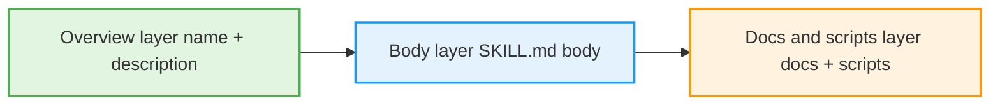
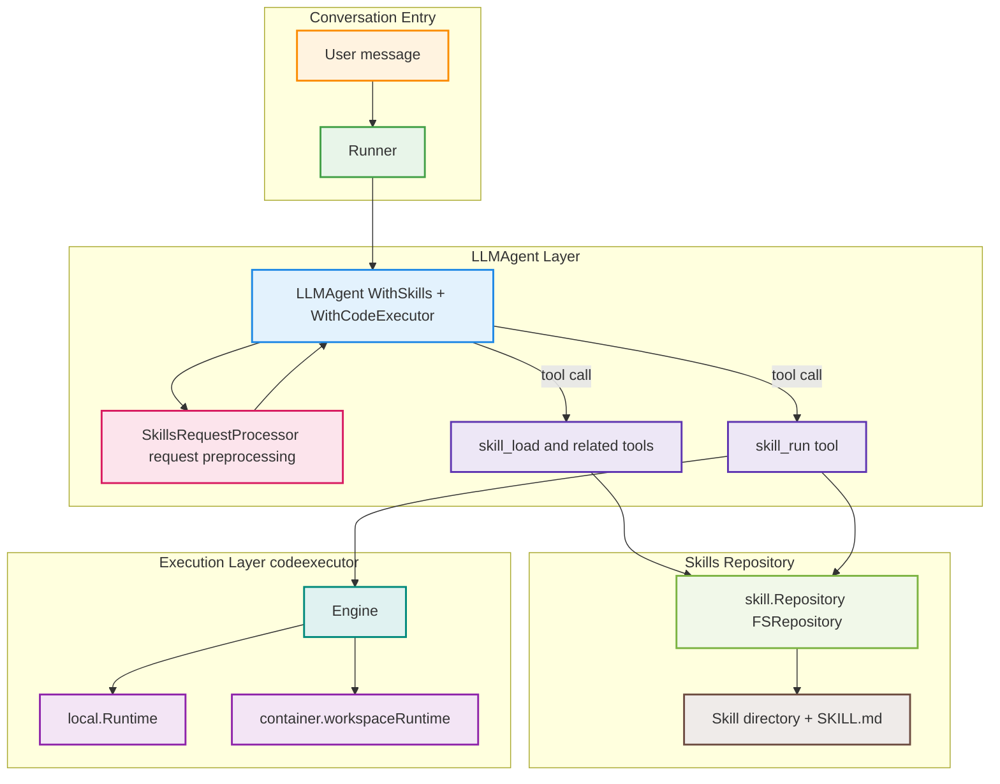
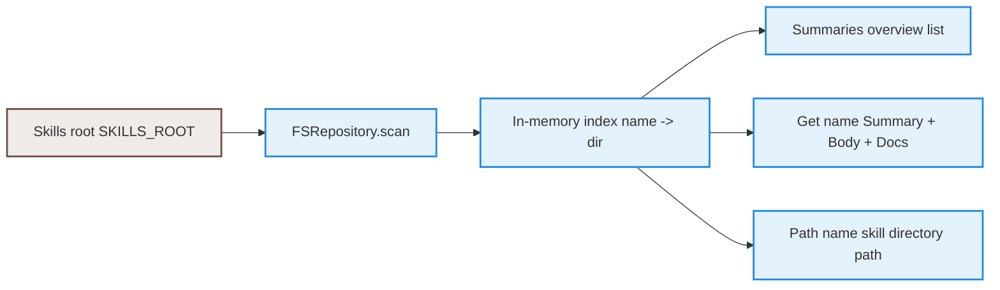
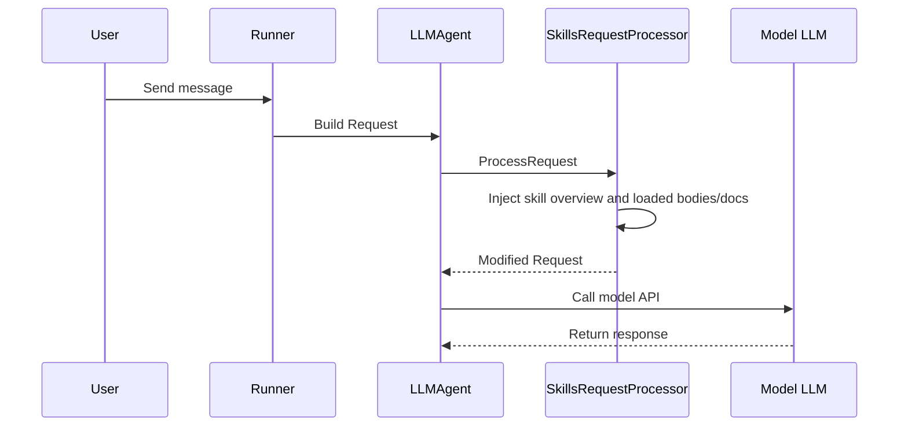
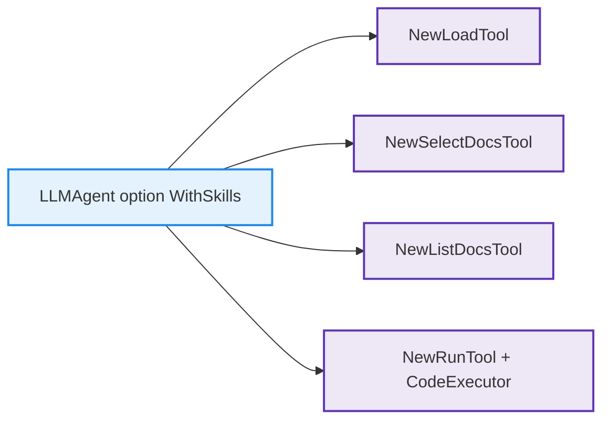
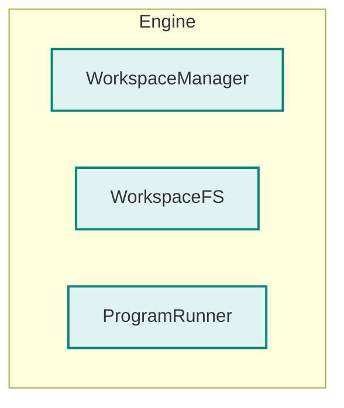
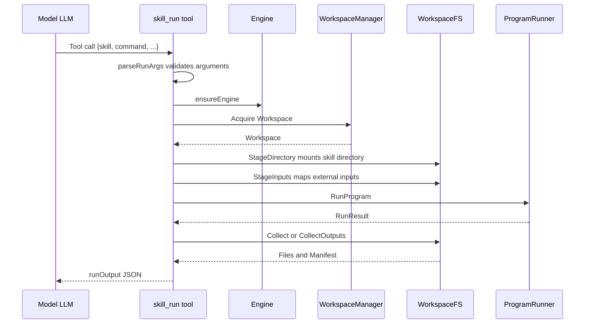

# tRPC-Agent-Go Skills: A Go-Native Implementation of the Anthropic Agent Skills Specification

> tRPC-Agent-Go added first-class support for Anthropic-style Agent Skills at the framework level. This article walks from practical usage to design and implementation so that you can enable and extend this capability confidently in real business scenarios.

> [tRPC-Agent-Go](https://github.com/trpc-group/trpc-agent-go/) is an autonomous multi-agent framework for Go. It provides tool calling, session and memory management, artifact management, multi-agent collaboration, graph orchestration, knowledge bases, observability, and more. tRPC-Agent-Go grows with community support. Stars are welcome.

In many agent projects based on large language models, the real challenge is not only making the model smarter. It is also how to turn task knowledge into reusable skills, feed that knowledge to the model on demand, and execute it safely in a controlled environment. Anthropic's Agent Skills proposal provides a clear path: package reusable tasks as skill directories, describe goals and procedures in `SKILL.md`, add supporting documents and scripts, let the system load that information only when needed during the conversation, and complete the actual work in a workspace.

tRPC-Agent-Go aligns with this design at the framework layer. On one side, it provides context capabilities such as skill repository access, summaries, and body injection. On the other side, it combines Skills with the Workspace abstraction so that scripts owned by a skill can run safely in an isolated workspace. In this way, "task knowledge + documents + optional scripts" becomes one unified and controllable agent capability layer.

This article explains:

- The overall idea and common use cases of Agent Skills.
- How tRPC-Agent-Go loads Skill context on demand.
- The capability boundaries when Skills are combined with an execution environment.
- How application developers can quickly enable and extend this capability.

The following sections first cover background and concepts, then give a minimal usage example, and finally discuss the framework's internal design and implementation so that you can understand Skills clearly and use them reliably.

## Background

### Traditional Pain Points

Before Agent Skills, we usually gave an LLM extra capabilities in this way: put a pile of operation manuals and command examples into the prompt, ask the model to generate code or steps according to those instructions, and then let a human or an external system execute them.

This approach has two obvious problems:

1. Context explosion: all steps and scripts are written into the prompt, quickly filling the context window and making the solution costly and hard to maintain.
2. Split execution environment: the model only talks about scripts instead of running them. Execution results have to be moved manually, making it difficult to form a closed loop or support auditing and replay.

Anthropic proposed a unified solution in [Equipping agents for the real world with Agent Skills](https://www.anthropic.com/engineering/equipping-agents-for-the-real-world-with-agent-skills): package reusable tasks as Skill directories, use `SKILL.md` to describe the goal and workflow, use documents and scripts to add details, and let the system manage skill discovery, loading, and execution. The open-source repository [`anthropics/skills`](https://github.com/anthropics/skills) provides many example Skills, such as PDF processing and presentation generation.

When designing its Skill capability, tRPC-Agent-Go fully aligned with this semantic model. The format and meaning of `SKILL.md` are consistent with Anthropic's official design, and the skill directory structure is compatible with the example repository above. You can point tRPC-Agent-Go directly at a Claude Skills repository without rewriting `SKILL.md`.

### The Three-Layer Model

The following minimal skill directory gives an intuitive picture of what a Skill looks like.

```text
skills/
  report-summary/
    SKILL.md
    USAGE.md
    scripts/
      summarize.py
```

The content of `SKILL.md` can be very simple, for example:

```markdown
---
name: report-summary
description: Summarize long reports into short bullet points.
---

Usage

- When the user asks to summarize a long report into a concise outline.

Steps

1) Read the input file from $WORK_DIR/inputs/report.txt
2) Run: python3 scripts/summarize.py > $OUTPUT_DIR/summary.txt
3) Return a short natural language summary and mention summary.txt
```

In this example, the YAML header fields `name` and `description` provide the summary. The body describes when to use the skill and the concrete steps. `USAGE.md` provides supporting instructions, and `scripts/summarize.py` is the script that actually runs. What makes the directory behave like a skill is loading and executing these pieces only when they are needed.

In Anthropic's Agent Skills specification, a Skill directory essentially contains three layers of information:



1. Overview layer: contains only `name` and `description` from the YAML header of `SKILL.md`. It is very cheap and can be injected at the start of every turn to tell the model which skills are available and what each skill does.
2. Body layer: the Markdown body of `SKILL.md`, describing when to use the skill, concrete steps, and command examples. It is loaded on demand through a tool call only when the model decides to use that Skill.
3. Docs and scripts layer: additional Markdown documents and script files. Documents are selected and injected on demand, while scripts run only inside the workspace and are not copied verbatim into the prompt.

This three-layer model is the key to understanding Agent Skills. The agent pulls heavier information into the context or execution environment only when it needs it, balancing capability with cost.

## Quick Start

This section starts from practical usage and provides a minimal runnable example so that you can quickly experience Agent Skills in tRPC-Agent-Go.

### Environment Setup

- Go 1.21+
- A key for an OpenAI-compatible model service
- A Skills directory. You can use the example directory [`examples/skillrun/skills`](https://github.com/trpc-group/trpc-agent-go/tree/main/examples/skillrun/skills) directly.

Common environment variables:

```bash
export OPENAI_API_KEY="your-api-key"
export SKILLS_ROOT=/path/to/your/skills   # Optional. Defaults to ./skills.
```

### Getting Started Example

The following code is a simplified skill conversation example based on [`examples/skillrun/main.go`](https://github.com/trpc-group/trpc-agent-go/tree/main/examples/skillrun/main.go).

```go
package main

import (
    "trpc.group/trpc-go/trpc-agent-go/agent/llmagent"
    "trpc.group/trpc-go/trpc-agent-go/codeexecutor/local"
    "trpc.group/trpc-go/trpc-agent-go/model"
    "trpc.group/trpc-go/trpc-agent-go/model/openai"
    "trpc.group/trpc-go/trpc-agent-go/runner"
    "trpc.group/trpc-go/trpc-agent-go/skill"
)

func main() {
    mdl := openai.New("gpt-4o-mini")

    repo, _ := skill.NewFSRepository("./skills")
    exec := local.New()

    agent := llmagent.New(
        "skills-assistant",
        llmagent.WithModel(mdl),
        llmagent.WithSkills(repo),
        llmagent.WithCodeExecutor(exec),
    )

    r := runner.NewRunner("demo-app", agent)
    ch, _ := r.Run(
        context.Background(),
        "user1", "session1",
        model.NewUserMessage("Please use an appropriate Skill to summarize a text file."),
    )

    for ev := range ch {
        // Handle streaming responses and tool calls. Details are omitted here.
        _ = ev
    }
}
```

This code enables Agent Skills with `WithSkills(repo)`, connects an execution environment with `WithCodeExecutor(exec)`, and starts a conversation through `Runner`. The model can then automatically choose and call skill-related tools when needed.

In an actual conversation, a typical flow is: the model first learns which skills are available from the overview. When you say "use a certain Skill to do X" or describe a task that matches a skill, it calls skill tools to load the body and documents, executes commands in the skill workspace, and returns results or output files.

The following sections explain how these behaviors are wired together inside the framework.

## Architecture Overview

The following overview diagram maps the key modules:



It can be understood as three layers:

- Conversation layer: `Runner` and `LLMAgent` receive user messages, call the model, and drive tool streams.
- Skill management layer: `skill.Repository` discovers and parses `SKILL.md`, while `SkillsRequestProcessor` injects summaries, bodies, and documents on demand.
- Execution layer: the unified `Engine` abstraction hides differences between local execution and container execution. `skill_run` only talks to a common interface and does not care whether the underlying runtime is the host machine or a container.

The next sections describe these modules in order.

## Skill Directory

### Directory Structure

In tRPC-Agent-Go, a Skill directory usually looks like this:

```text
my-skill/
  SKILL.md
  USAGE.md
  scripts/
    run.sh
    helper.py
  assets/
    logo.png
```

The specification stays consistent with Anthropic's Agent Skills specification. Key points include: the directory name should match the `name` field in the YAML header of `SKILL.md`; `description` should describe what the skill does and when to use it in natural language; the body is free-form Markdown for usage conditions, steps, and command examples.

In code, `skill/repository.go` turns these rules into concrete implementation. The constant `skillFile = "SKILL.md"` defines the skill entry file name. The `EnvSkillsRoot` environment variable specifies the skill repository root. `FSRepository` recursively scans the skill root and finds subdirectories that contain `SKILL.md`.

The related code is available in [`skill/repository.go`](https://github.com/trpc-group/trpc-agent-go/blob/main/skill/repository.go).

### Loading Flow

`FSRepository` implements the `skill.Repository` interface and loads skills from the file system:

- `Summaries`: returns the `Summary` for all skills, containing only `Name` and `Description`. This corresponds to the overview layer.
- `Get`: reads the complete `SKILL.md` body and collects all `.md` or `.txt` documents in the same directory into `Docs`. This corresponds to the body and documents layer.
- `Path`: returns the skill directory path so the full directory can be mounted into the workspace during execution.

This layer can be understood through the following diagram:



With this design, the framework does not need to understand YAML details when reading or executing a Skill. It only needs to obtain four categories of information through the interface: overview, body, documents, and directory path.

## Context Injection

### Request Preprocessing

When you create an `LLMAgent` with:

```go
llm := llmagent.New(
    "skills-assistant",
    llmagent.WithModel(mdl),
    llmagent.WithSkills(repo),
    llmagent.WithCodeExecutor(exec),
)
```

The framework automatically attaches the `SkillsRequestProcessor` request preprocessing chain from [`internal/flow/processor/skills.go`](https://github.com/trpc-group/trpc-agent-go/blob/main/internal/flow/processor/skills.go).

Before every request is sent to the model, it does two things:

1. Always inject the skill overview. The processor reads `repo.Summaries`, generates text such as `Available skills: - name: description`, merges it into the system message, and appends guidance on how to use the workspace and tools safely, including conventions for directories such as `inputs` and `out`.
2. Inject loaded skill bodies and documents on demand. The processor reads temporary keys in session state, such as `temp:skill:loaded:<name>` and `temp:skill:docs:<name>`. For every skill marked as loaded, it concatenates the full `SKILL.md` body into the system message. It then selects specific `.md` or `.txt` documents according to `docs` and prefixes them with `[Doc] filename`.

The approximate sequence is as follows:



There are two key points:

- The overview is always present, so the model always knows which skills are available, but the cost is low.
- Bodies and documents are loaded on demand. They are injected only when a tool call clearly indicates that a skill should be used, avoiding wasted context.

### Skill State

`SkillsRequestProcessor` itself does not decide which skill to load. It only reads session state. The following three tools actually write that state:

- `skill_load`: declares that the body of a skill should be loaded and which documents should be used.
- `skill_select_docs`: adjusts document selection separately by adding, replacing, or clearing documents.
- `skill_list_docs`: lists all selectable document file names under a skill.

These tools are implemented in:

- [`tool/skill/load.go`](https://github.com/trpc-group/trpc-agent-go/blob/main/tool/skill/load.go)
- [`tool/skill/select_docs.go`](https://github.com/trpc-group/trpc-agent-go/blob/main/tool/skill/select_docs.go)
- [`tool/skill/list_docs.go`](https://github.com/trpc-group/trpc-agent-go/blob/main/tool/skill/list_docs.go)

They share one important property: they do not manipulate the prompt directly. They only read and write temporary keys in `Session.State`. This keeps the decision of which Skill and documents to use separate from how those contents are injected into the system message. The former is handled by tools, and the latter is handled uniformly by the request processor.

## Tool Overview

### Tool Registration

When you create an `LLMAgent` with `llmagent.WithSkills(repo)`, [`agent/llmagent/llm_agent.go`](https://github.com/trpc-group/trpc-agent-go/blob/main/agent/llmagent/llm_agent.go) automatically registers four skill-related tools:

- `skill_load`
- `skill_select_docs`
- `skill_list_docs`
- `skill_run`

Part of the logic can be summarized by the following diagram:



If `WithCodeExecutor(exec)` is also configured, the framework passes that executor to the `skill_run` tool. If no executor is configured explicitly, `skill_run` falls back to the default local executor.

### Tool Responsibilities

Based on [`docs/mkdocs/en/skill.md`](https://github.com/trpc-group/trpc-agent-go/blob/main/docs/mkdocs/en/skill.md) and the `tool/skill/*.go` source code, each tool has the following responsibility:

- `skill_load`: inputs are required `skill`, optional `docs`, and `include_all_docs`. It writes `temp:skill:loaded:<name>` and `temp:skill:docs:<name>` to mark that this conversation needs the body of the skill and selected documents.
- `skill_select_docs`: inputs are `skill`, `docs`, `include_all_docs`, and `mode`. It updates `temp:skill:docs:<name>` and supports append, replace, or clear operations.
- `skill_list_docs`: input is `skill`; output is the list of available document file names under that skill so the model can choose.
- `skill_run`: inputs include `skill`, `command`, `cwd`, `env`, `output_files`, `inputs`, `outputs`, and `timeout`. It executes the command inside an isolated Workspace, collects output files, and saves them as Artifacts when needed.

The first three tools solve the problem of letting the model know which Skill and documents to use. The last tool, `skill_run`, actually runs scripts and is the key link between Skills and the execution environment.

## Execution Environment

To provide a Claude-like Skills experience, there is one key principle: a Skill should depend only on a clean execution interface and should not care whether the backend is the host machine or a container. tRPC-Agent-Go centralizes this abstraction in [`codeexecutor/workspace.go`](https://github.com/trpc-group/trpc-agent-go/blob/main/codeexecutor/workspace.go) and [`codeexecutor/metadata.go`](https://github.com/trpc-group/trpc-agent-go/blob/main/codeexecutor/metadata.go).

A simplified structure diagram helps illustrate the execution abstraction:



### Execution Interfaces

In the `codeexecutor` package, the execution interface consists of components with clear responsibilities:

- `Workspace` represents an isolated execution space, including an ID and a physical path.
- `WorkspaceManager` creates and cleans up Workspaces.
- `WorkspaceFS` stages files, mounts directories, and collects outputs inside a Workspace.
- `ProgramRunner` runs concrete commands inside a Workspace.
- `Engine` packages the three interfaces above and exposes a unified execution capability.

There is also a helper interface, `EngineProvider`, which allows an existing `CodeExecutor` to expose its internal `Engine` for reuse by `skill_run`.

The standard Workspace layout, ensured by `EnsureLayout`, includes: `skills` for read-only skill trees, `work` for writable intermediate files, `runs` for per-run temporary directories, `out` for collected output files, and `metadata.json` for mounted skills and input/output records.

At runtime, the framework injects environment variables such as `WORKSPACE_DIR`, `SKILLS_DIR`, `WORK_DIR`, `OUTPUT_DIR`, `RUN_DIR`, and the current skill name `SKILL_NAME`. Skill documents can use these variables directly to describe file paths, such as "read input from `$WORK_DIR/inputs` and write results to `$OUTPUT_DIR`."

### Local Execution

The local executor's Workspace implementation is in [`codeexecutor/local/workspace_runtime.go`](https://github.com/trpc-group/trpc-agent-go/blob/main/codeexecutor/local/workspace_runtime.go). It creates a working directory for each execution ID, initializes standard subdirectories and metadata, copies or links the requested skill directory or input directory into the Workspace, runs commands inside the Workspace through `exec.CommandContext`, injects the environment variables described above, and collects output files according to glob patterns. If size or count limits are exceeded, it sets the `LimitsHit` flag.

The local Runtime enables `AutoInputs` by default, allowing specified host directories to be mapped under `work/inputs` so that Skills can access external files conveniently.

### Container Execution

The container executor's Workspace implementation is in [`codeexecutor/container/workspace_runtime.go`](https://github.com/trpc-group/trpc-agent-go/blob/main/codeexecutor/container/workspace_runtime.go). Compared with local execution, it additionally creates an isolated directory inside the container for each Workspace, uses existing bind mounts when possible, such as mounting the entire Skills repository to `/opt/trpc-agent/skills`, to mount skills quickly through in-container copies, runs commands through Docker Exec with timeouts and resource limits, and pulls output files back to the host through glob expansion and tar streams.

For `skill_run`, these differences are transparent. As long as it receives an object implementing the `Engine` interface, it can schedule both local and container execution environments uniformly.

## Execution Flow

### Entry Parsing

The core implementation of `skill_run` is in [`tool/skill/run.go`](https://github.com/trpc-group/trpc-agent-go/blob/main/tool/skill/run.go). The tool first parses JSON arguments, validates that `skill` and `command` are not empty, and then resolves the skill root directory through the skill repository.

When selecting an Engine, `skill_run` first tries to get one from the externally injected `CodeExecutor`, if that executor implements `EngineProvider`. Otherwise, it falls back to a default Engine based on the local Runtime. This keeps the default easy to use while allowing applications to replace the execution backend when needed.

### Skill Mounting

`RunTool` maintains a `WorkspaceRegistry`, implemented in [`codeexecutor/registry.go`](https://github.com/trpc-group/trpc-agent-go/blob/main/codeexecutor/registry.go), to reuse Workspaces by session ID. This means multiple `skill_run` calls in the same conversation can share one Workspace, preserving intermediate outputs under `work` and `out` so that skills can be chained.

The rough flow for mounting a Skill directory is: use `repo.Path` to find the skill root, call `codeexecutor.DirDigest` to compute the directory digest, read the Workspace's `metadata.json` to check whether a skill with the same digest has already been mounted, skip copying if it has, otherwise mount the skill directory to `skills/<name>` in the Workspace, create symlinks from the skill root to `out`, `work`, and `work/inputs`, and finally make the skill directory tree read-only except for symlinks.

From a command-line perspective, the skill script sees its root directory as `skills/<name>`, while writes to `out`, `work`, and `inputs` all land in shared Workspace directories. This is both safe and convenient for collaboration among multiple skills.

### Result Collection

`skill_run` supports two output collection methods:

1. Traditional `output_files`: pass glob patterns such as `["out/*.txt"]` or `$OUTPUT_DIR/*.csv`. The underlying `WorkspaceFS.Collect` collects matched files and returns file name, content, and MIME type.
2. Declarative `outputs`: use `OutputSpec` to specify glob patterns, whether to inline content, whether to save as an Artifact, and maximum file count and size. The underlying `CollectOutputs` returns an `OutputManifest` and saves files through the Artifact service when needed.

Inputs are declared through the `inputs` array. Each `InputSpec` can come from sources such as `artifact://`, `host://`, `workspace://`, or `skill://`. The concrete implementation is distributed across the `codeexecutor` package and the local and container runtimes.

Finally, `skill_run` returns a structured `runOutput`, including `stdout`, `stderr`, `exit_code`, `timed_out`, `duration_ms`, `output_files`, and optional `artifact_files`.

The full execution chain can be summarized by the following sequence diagram:



## Interaction Example

The repository provides a complete interactive skill conversation example at [`examples/skillrun`](https://github.com/trpc-group/trpc-agent-go/tree/main/examples/skillrun). It shows how to chat with a Skills-enabled Agent from the command line.

It uses the OpenAI-compatible model client [`model/openai/openai.go`](https://github.com/trpc-group/trpc-agent-go/blob/main/model/openai/openai.go), loads the skill repository through `skill.NewFSRepository` with the default `./skills` or the `SKILLS_ROOT` environment variable, selects a local or container executor through command-line arguments, creates an `LLMAgent` with Skills and an instructional system prompt, consumes model output through `Runner` streaming, and prints tool calls and tool responses, including `artifact_files` returned by `skill_run`.

If you want to try Anthropic's official example Skills, clone [`anthropics/skills`](https://github.com/anthropics/skills) locally, point `SKILLS_ROOT` to that directory, and run the example under `examples/skillrun`. You can then use those Skills directly in tRPC-Agent-Go.

Note that the semantics of a Skill come entirely from `SKILL.md` and the documents themselves. The framework only provides the foundation for on-demand injection and safe execution. When authoring a Skill, you only need to describe the task and steps clearly in natural language, and organize `scripts` and `out` directories so commands can be reproduced.

## Extending Runtime Support

If you want to add another runtime beyond the existing local and container implementations, such as Kubernetes Pods or remote sandboxes, you can follow this path:

1. Implement the Workspace interface trio: a custom `WorkspaceManager`, `WorkspaceFS`, and `ProgramRunner`, responsible for creating and cleaning Workspaces, managing files and directories, and running commands inside the Workspace.
2. Package them as an Engine: use `codeexecutor.NewEngine` to wrap these three components into a new `Engine`.
3. Inject through `LLMAgent`: pass the new `CodeExecutor` or Engine to `LLMAgent.WithCodeExecutor`, or pass the `Engine` directly to `skill_run` in a custom Agent.

Because `skill_run` works entirely through the `Engine` abstraction, once a new execution backend implements the Workspace interfaces, all existing Skills can migrate to it without modifying `SKILL.md`.

## Capability Comparison

In addition to Skills, tRPC-Agent-Go also includes an automatic code block execution path. It processes code blocks in model responses and runs them automatically. The corresponding logic is in [`internal/flow/processor/codeexecution.go`](https://github.com/trpc-group/trpc-agent-go/blob/main/internal/flow/processor/codeexecution.go).

The difference and positioning are roughly as follows:

- Automatic code execution fits lightweight scenarios where the model temporarily writes a bit of code to try something. The model outputs triple-backtick code blocks, such as ```python, and the framework extracts and runs them automatically, then returns the result.
- Skill execution fits reusable task templates. Scripts always live in the skill directory. The model writes only commands, not script bodies, executes them through `skill_run` in the Workspace, and can collect output files and Artifacts.

Implementation-wise, both reuse the Workspace abstraction from `codeexecutor`. The entry points differ: automatic code execution enters from the model response processor, while `skill_run` enters from a tool call.

## Summary

The Agent Skills capability in tRPC-Agent-Go can be summarized along several main lines:

- Information organization: `SKILL.md`, documents, and scripts form a three-layer information model. The overview is always present, bodies and documents are injected on demand, and scripts run only in the workspace.
- Request injection: `SkillsRequestProcessor` automatically merges the overview, loaded skill bodies, and selected documents into the system message based on session state.
- Tool collaboration: `skill_load`, `skill_select_docs`, and `skill_list_docs` decide which Skill and documents are used, while `skill_run` actually executes commands in the Workspace and collects results.
- Execution abstraction: `codeexecutor` hides local and container differences through Workspace and Engine abstractions, letting Skills depend only on one unified execution interface.
- Extensibility: once the Workspace trio is implemented and wrapped as a new Engine, all existing Skills can move to the new execution backend without rewriting `SKILL.md`.

For users, the workflow is simple: prepare a compliant Skills directory, configure `WithSkills` and an appropriate `CodeExecutor` on `LLMAgent`, then interact with the Agent as in a normal chat. Express your needs naturally or mention the skill you want to use, and the model will choose and call the relevant tools at the right time.

All remaining work, including discovery, injection, execution, collection, and persistence, is handled uniformly by tRPC-Agent-Go at the framework layer.

We welcome everyone to try Agent Skills in real business scenarios, turn high-frequency tasks into reusable skill packages, and gradually build your own skill library. For more examples and best practices, refer to the following documents and repositories.

**Code Repository**:

- [tRPC-Agent-Go repository](https://github.com/trpc-group/trpc-agent-go)

**Skills Documentation**:

- Skills feature description and usage examples: [`docs/mkdocs/en/skill.md`](https://github.com/trpc-group/trpc-agent-go/blob/main/docs/mkdocs/en/skill.md)
- Interactive example project: [`examples/skillrun`](https://github.com/trpc-group/trpc-agent-go/tree/main/examples/skillrun)

Feel free to use GitHub Issues to discuss framework usage, share practical cases, and propose improvements.
