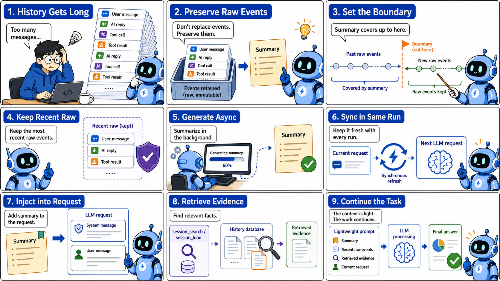
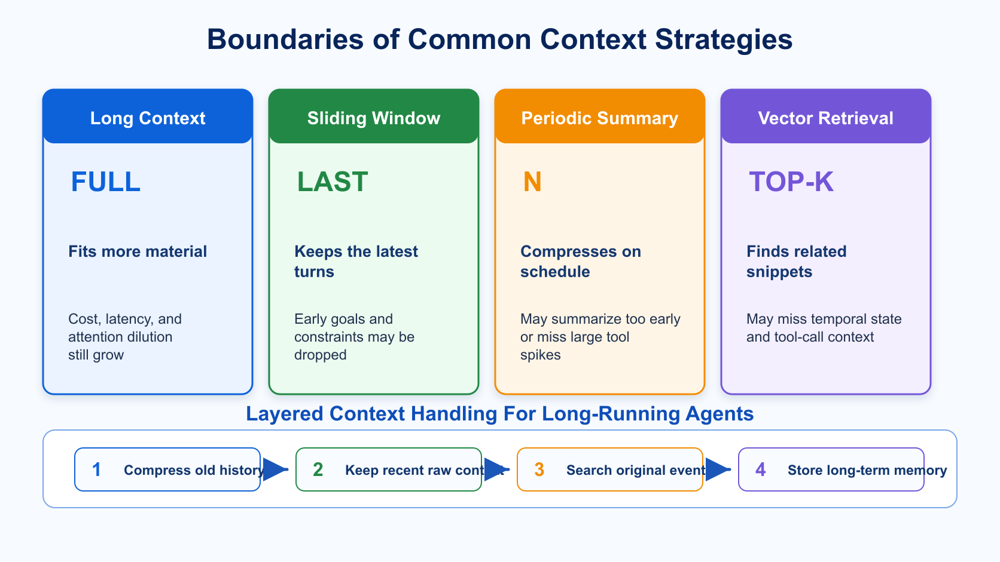
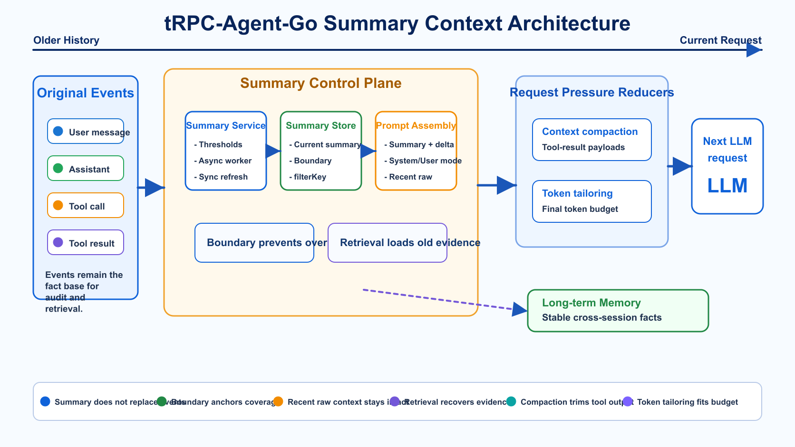
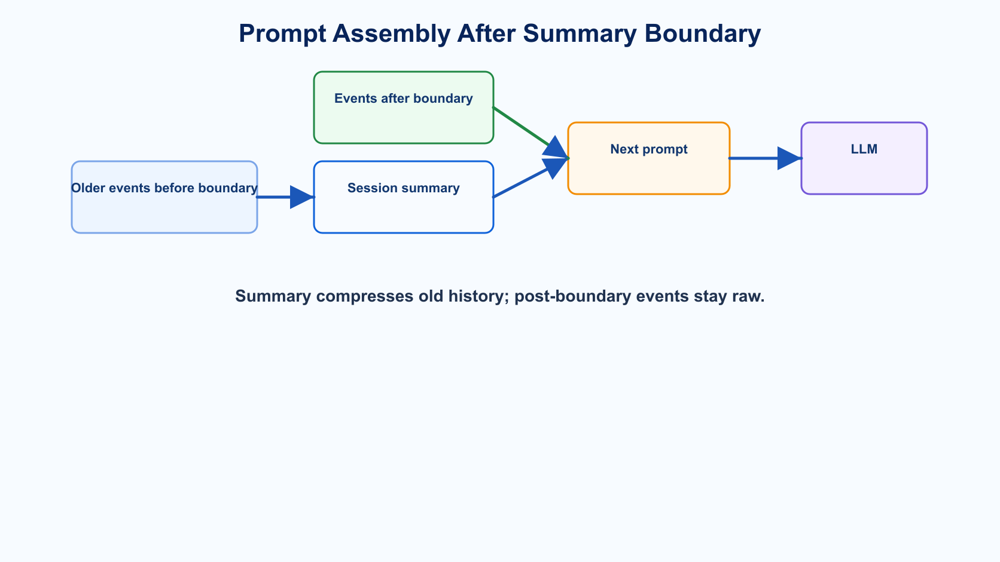
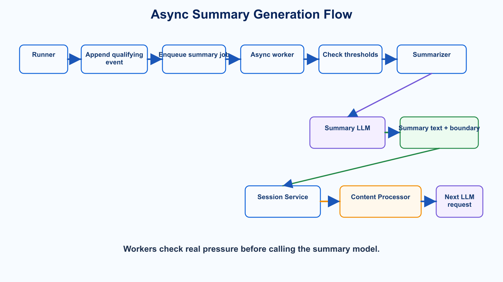
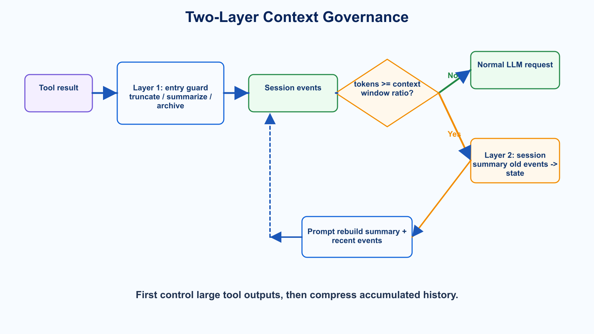
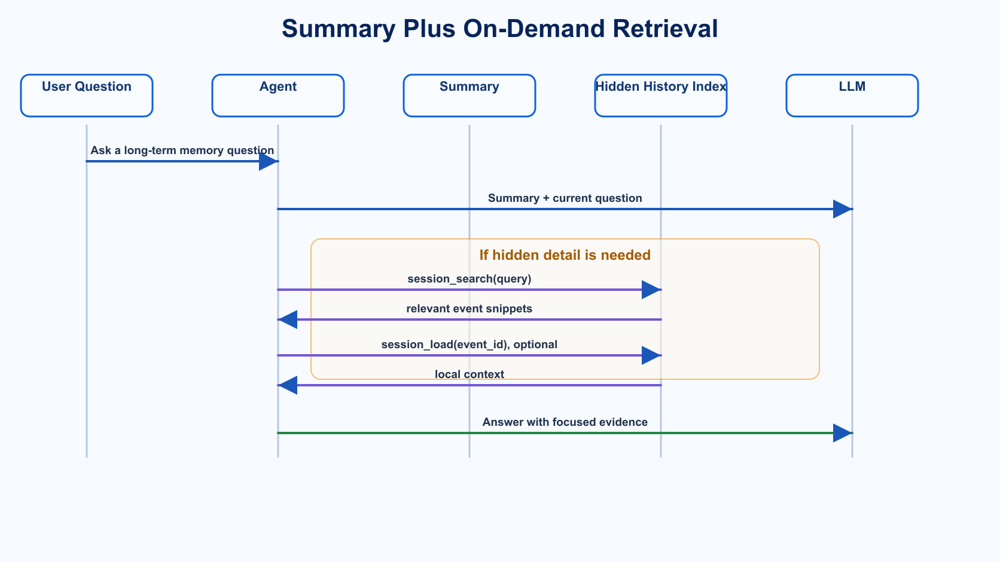
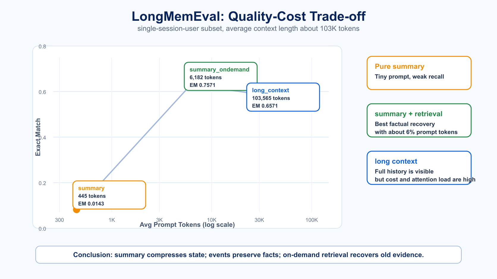

# tRPC-Agent-Go Summary: Context Management Design and Evaluation for Long-Running Agents

> [tRPC-Agent-Go](https://github.com/trpc-group/trpc-agent-go) is a Go framework for autonomous multi-Agent systems. It provides tool calling, session and memory management, artifact management, multi-Agent collaboration, graph orchestration, knowledge integration, and observability.
>
> This article focuses on Session Summary in tRPC-Agent-Go. Summary is not just a way to make history shorter. It separates long-running Agent context into state summary, original events, recent raw context, and on-demand retrieval, so applications can balance cost, latency, and factual recoverability. If this project is useful to you, a GitHub star and community feedback are welcome.



Knowledge and productivity Agents are valuable not because they answer one isolated question, but because they connect scattered materials and actions across a user workflow.

For example, a knowledge-oriented Agent may read pages, search a knowledge base, open files, organize notes, call tools, launch sub-tasks, and finally assemble a report or another deliverable. From the user's point of view, these actions should feel continuous: the page may change, more materials may appear, and the task may shift direction, but the assistant should still understand what happened earlier.

That experience looks like a product interaction problem, but the first engineering problem behind it is context management. If context is handled well, users repeat less background, tool results remain useful, and long tasks can continue with controlled cost and latency. If context is handled poorly, the assistant may reread the same materials, miss constraints that were just confirmed, or repeat failed attempts.

From the UI, it still looks like a chat window. For an Agent, however, history quickly mixes many sources: tool results, web content, file snippets, knowledge-base hits, command output, error-recovery attempts, user feedback, sub-task conclusions, and intermediate decisions. After a few turns, the prompt becomes heavy. The longer the task runs, the more content the model must reread on every request, increasing both cost and latency while making the current task state easier to dilute.

That is the problem Session Summary is designed to solve.

If the only goal were to ask a model to summarize a few sentences, summary would be simple. The hard part is handling three requirements at the same time:

> Older history must be compressed, original facts must not be destroyed, and the latest turns must remain directly usable.

This article follows three steps:

First, it explains why long-running Agents encounter context pressure. Long context windows, sliding windows, periodic summaries, and vector retrieval each solve part of the problem, but each has clear limits when used alone.

Second, it describes the design of tRPC-Agent-Go Summary. Summary stores the current state, events remain the source of truth, recent turns stay raw, and retrieval can recover old evidence when needed.

Third, it uses LongMemEval to validate the boundary: pure summary keeps prompts tiny, but easily loses low-frequency facts; summary plus on-demand retrieval can keep prompts small while recovering early details.

In framework terms:

> Context management for long-running Agents is about giving state summaries, original events, and retrieval channels distinct roles.

## 1. Why Long-Running Agents Need Context Management

The first attempt at Agent context management often treats the problem as ordinary chat history: if history is too long, keep fewer turns; if it grows further, ask the model to summarize it.

Long-running Agents are different from ordinary chat.

Within one product, there are often two different operating shapes.

One is closer to a **general Agent**. It handles knowledge Q&A, research, note rewriting, report generation, and content editing. It usually runs as a multi-tenant online service. It may use search, knowledge-base, writing, editing, and page-understanding tools, but those capabilities are usually exposed through service-level tools or skills with permissions, tenant isolation, audit, and streaming response concerns. It mainly reads external materials and often only needs file-system-like `r--` capability.

The other is closer to a **coding Agent**. It runs on a user's machine or in an isolated container. The file system, shell, compiler, package manager, and test commands are first-class tools. It does not just read materials; it edits files, runs commands, generates artifacts, and recovers from failed attempts. In file-system terms, it often needs full `rwx` capability.

Both work through a chat-like interface, but their context pressure differs. General Agents accumulate search results, web pages, knowledge snippets, and cross-page user context. Coding Agents accumulate workspace files, command output, tool traces, failed fixes, and the current code-editing state. If a summary strategy ignores that difference, it is easy to apply a good pattern from one scenario to the wrong scenario.

For general Agents, the product goal is straightforward: the user should not repeatedly upload the same files, copy the same pages, or explain the same background. The Agent needs to know where the user is, what happened before, and how the current material relates to the previous task.

During one research task, the model may search several keywords, read multiple pages, inspect knowledge-base documents, launch sub-tasks to fill missing information, and then merge the result. The user may say "that direction is wrong", "keep this data", or "do not make it too generic". These constraints are spread across turns, but later steps may depend on them.

Coding Agents have different material sources, but a similar problem: files that were read, commands that failed, tests that were run, and user-confirmed changes can all matter later. In the end, both Agent types face the same fact: history is not a flat list of equivalent text. It is a mixture of information with different lifetimes.

The important parts of conversation history can be split into several types:

| Information type | Examples | Best channel |
| --- | --- | --- |
| Global state | User goal, chosen plan, unfinished tasks | Summary |
| Current context | Recent user feedback, latest tool results | Recent raw events |
| Low-frequency facts | Names, dates, numbers, one-off preferences | Events + retrieval, and sometimes a stronger summary prompt |
| Cross-session long-term information | Stable preferences, long-term project background | Long-term memory, outside this article |

These categories have different half-lives.

The task goal and current state should be clearly preserved in summary. Recent tool calls and user feedback should usually remain raw. Low-frequency facts make summary grow if everything is included, but disappear if nothing is included. Long-term preferences should not be mixed into one session's summary.

So a production system needs more than a "summarize history" function. It needs a context-management design that remains stable during long tasks.

The design goals can be summarized as:

1. **Original facts must not be burned.** Summary loses details, so events must remain.
2. **Old history needs a boundary.** Summary must know which events it covers.
3. **Recent context must not be damaged.** Events after the summary boundary must re-enter the prompt intact.
4. **Triggers should follow real pressure.** Event, token, time, context-window, async, and sync paths all matter.
5. **Applications need control.** Prompt, tool-result formatting, `SkipRecent`, hooks, and injection mode must be adjustable.

With these goals in mind, the limits of common approaches become easier to see.

## 2. Why Common Approaches Are Not Enough

Several common techniques help, but none is sufficient by itself.



### 2.1 Long Context Alone

A long context window is like a bigger desk. It lets you put more material on the table, but it does not guarantee the model will find the one note that matters next.

Large-context models reduce the "does it fit" problem, but selection, ordering, structure, and cost remain system responsibilities.

Agent prompts carry more fixed overhead than ordinary chat: system prompts, tool schemas, skill descriptions, and context injections all consume tokens. Tool calls also enter history in pairs: the assistant tool call and the later tool result. Once files, pages, logs, or search results enter context, the prompt grows quickly. Even if the window can fit everything, sending full history every time raises input cost, first-token latency, and attention allocation uncertainty.

There is also the well-known **lost in the middle** effect. Research has shown that models do not always use all positions in long contexts equally well. Key information near the beginning or end is often easier to use than information buried in the middle, even for models that support long contexts.

Real Agent tasks are more complex than a single needle in a haystack. The model must consider multiple tool results, changed user constraints, discarded plans, sub-task conclusions, and the current working state. Putting everything into a huge context window is still just putting everything on the desk. The model still needs to know what is current state, what is source evidence, and what is process noise.

Long context helps with capacity, but it does not automatically solve cost, latency, or attention dilution.

### 2.2 Sliding Window

A sliding window is simple: keep only the latest N turns.

Its advantage is predictable cost and straightforward implementation. The problem is that it drops older context directly. The original user goal, important constraints, or rejected plans may fall outside the window even though the current task still depends on them.

Agent history also contains tool-call and tool-result pairs. If trimming splits those pairs, the model may see a tool result without the call that produced it, or a tool call without the result that followed it.

### 2.3 Summarize Every N Turns

Periodic summary is better than deletion, but it is mechanical.

Some short conversations do not need summary at all, so forced summary adds cost. Some long tasks grow because of one very large tool result, not because of turn count. Some freshly returned tool results are still needed in raw form, and immediately compressing them into one sentence can lose important details.

Summary should follow real context pressure, not just a fixed count.

### 2.4 Vector Retrieval Alone

Vector retrieval is good at finding facts, but it is not enough to represent Agent state by itself.

Agent history has strong temporal structure: the user changes requirements, a tool returns data, and the model makes a decision. Top-k snippets may miss context that is not semantically similar but still critical. They may also split tool calls from tool results.

A better long-task design is layered:

> Compress old history, keep recent state raw, preserve original facts for retrieval, and leave cross-session stable information to long-term memory.

This is where tRPC-Agent-Go Summary fits. Summary is not an isolated summarization function. It works with sessions, events, prompt assembly, and retrieval to form one context-management layer.

## 3. The tRPC-Agent-Go Summary Design

tRPC-Agent-Go first introduced session summary in [trpc-group/trpc-agent-go#256](https://github.com/trpc-group/trpc-agent-go/pull/256). The design discussions repeatedly returned to a few core questions: whether summary should become the new history source, whether original events should remain, where a summary stops, how the next prompt should be assembled, and whether async summary creates races.

The resulting design is:

> Summary is a compressed view of the current session. Events remain the source of truth. The next prompt uses summary plus events after the boundary.



The design can be understood in five parts:

| Area | Problem solved | Related capability |
| --- | --- | --- |
| Fact base | What summary covers, whether raw text remains, and how business scope aligns | Events, boundary, `filterKey` |
| Generation path | When summary is generated, what enters summary, and how recent context is protected | Async/sync, `SkipRecent`, formatter, hook |
| Request assembly | How summary enters the next request and how it interacts with other pressure reducers | System/user injection, context compaction, token tailoring |
| Cost and runtime | How the summary LLM call controls cost and adapts to agents/models | Cache-safe forking, dynamic summarizer |
| Fact recovery | How low-frequency facts missing from summary are recovered | `session_search`, `session_load` |

### 3.1 Fact Base: Events, Boundary, and filterKey

#### Summary Must Not Replace Events

The first key decision is that summary must not replace original events.

If summary directly replaces history, it saves tokens, but any omitted fact is gone forever. If the user later asks about a name, date, or number that appeared early, the model has no source text to inspect and can only guess.

That also breaks debugging, audit, and on-demand retrieval. Summary can be a state map for the next prompt, but it must not burn the source facts.

The session therefore keeps `Events`, while summary is stored separately:

```go
type Summary struct {
    Summary   string           `json:"summary"`
    Topics    []string         `json:"topics,omitempty"`
    UpdatedAt time.Time        `json:"updated_at"`
    Boundary  *SummaryBoundary `json:"boundary,omitempty"`
}
```

This conservative choice becomes important in benchmark results later: pure summary is weak at low-frequency facts. Without events, `session_search` and `session_load` would have no fact base.

#### Summary Must Have a Boundary

The second key decision is that summary must know exactly where it stops.

A summary only covers history before some point. After it is generated, the user may send more messages and tools may return more results. If the next prompt uses only summary, those real deltas are lost.

tRPC-Agent-Go records that cutoff in `SummaryBoundary`:

```go
type SummaryBoundary struct {
    Version     int       `json:"version"`
    FilterKey   string    `json:"filter_key,omitempty"`
    CutoffAt    time.Time `json:"cutoff_at,omitempty"`
    LastEventID string    `json:"last_event_id,omitempty"`
}
```

Prompt assembly then uses:

```text
session summary
+ events after summary boundary
+ current user message
```

The flow is:



One subtle failure mode is worth calling out: when `AddSessionSummary=true`, events after the summary boundary must not be trimmed by `MaxHistoryRuns`. Otherwise the model may see an old state summary but miss the latest tool result or user feedback.

The boundary also evolved from time-only to event-ID anchored. Multiple events may share nearby timestamps, so using only time can accidentally include or exclude the wrong event. `last_event_id` provides a more stable anchor.

#### filterKey and Branch

The third key decision is visibility scope.

tRPC-Agent-Go already has `branch`, which records the Agent execution path. It is useful for multi-Agent calls, sub-tasks, and graph execution: which Agent produced an event, which path it belongs to, and how parent-child calls relate.

But `branch` is an internal runtime trace, not always the right business dimension for summary. A parent Agent may want to summarize child-Agent results together. A product may want a summary from an application view, page view, message type, or conversation segment. Binding summary scope directly to Agent execution topology would be too restrictive.

Summary also needs the range it summarizes to align with what the next model request can see. A mismatch is subtle: the summary text may be correct, but it describes a scope different from the events that enter the next prompt.

For that reason, tRPC-Agent-Go introduces `filterKey` to describe which events participate in a summary from a business-visibility perspective. New events prefer `FilterKey`; older events without it can fall back to `Branch` for compatibility.

For summary, `filterKey` has three roles:

1. It decides which events are summarized during manual or async triggering.
2. It is written into `SummaryBoundary.FilterKey`.
3. It lets the content processor assemble summary and post-boundary events using the same visibility range.

To summarize the whole session, use `session.SummaryFilterKeyAllContents`. To summarize a sub-scope, pass the corresponding `filterKey`. Hierarchical filter keys can also express parent-child visibility using prefixes.

The goal is simple: summary works only when the summary scope and the next visible prompt scope match.

### 3.2 Generation Path: Async, Recent Raw Context, and Input Governance

#### Async by Default, Sync as a Fallback

Every summary generation is an LLM call. If every summary blocks the main request path, users will feel the latency. The default should therefore be async: after the runner appends events, it enqueues a summary job; a worker later checks whether thresholds are met and generates summary if needed.

Simplified:

```text
append qualifying event
  -> EnqueueSummaryJob
  -> worker checks event/token/time/context threshold
  -> generate summary
  -> save summary text + boundary
```

Real ReAct loops introduce another problem: within one `Run`, the model may perform several LLM/tool iterations. A tool result may return, and the next LLM iteration needs it immediately. If context is already near the window limit, waiting for a background worker may be too late.

`WithSyncSummaryIntraRun(true)` handles that case. Between LLM iterations in the same run, the Agent can synchronously refresh the current summary. Intermediate tool results skip redundant async enqueueing, while the final assistant response can still enqueue an async job to refresh the ending state.

There are two paths:

```text
Default path:
event written to session -> background summary worker processes later

Same-run sync path:
tool result -> synchronous CreateSessionSummary before next LLM call -> rebuild request immediately
```

Async keeps the main path light. Same-run sync is a fallback for long ReAct loops and near-window-limit situations. It should be enabled based on latency, cost, cache behavior, and window risk.

| Scenario | More natural path | Main reason |
| --- | --- | --- |
| General Agent: knowledge Q&A, research, writing | **Async summary** | Multi-tenant online services prioritize first-token latency; summary can be maintained as background session state |
| Coding Agent: files, shell, tests, sub-tasks | **Sync compaction / active refresh** | Trigger points are often near the context limit and the next step needs immediate state recovery |

The difference is not just implementation style. General Agents often serve online Q&A and productivity workflows, where summary can behave like background session state. Coding Agents often carry a stable and expensive prompt prefix: system prompt, tools, workspace instructions, skill descriptions, and recent file state. Prompt cache matters more, so compaction is often delayed until it is necessary and then performed as an explicit main-path action.

### 3.2.2 Recent Turns Should Not Be Summarized Too Early

The principle for recent context is:

> Old history can be compressed. Raw text that the current task is still using should not be compressed too early.

The easiest place to break summary is the latest few turns. They may not contain unfinished tool calls. More often, a tool result has returned, but the model has not fully consumed it yet. If it is immediately compressed into one sentence, the next prompt may only know that "a tool was checked" and lose the details.

`SkipRecent` exists for this reason.

It started as a fixed count and later became programmable:

```go
summary.WithSkipRecent(func(events []event.Event) int {
    return keepRecentCompleteRounds(events)
})
```

A fixed count is simple, but tasks vary. Some tools require preserving a complete API round. Some applications count by token or time. Some need to avoid splitting tool call/result pairs.

`SkipRecent` is not merely about summarizing fewer events. Its main job is to keep the raw material that the current task still depends on.

### 3.2.3 Summary Input Needs Cleaning

Many summary-quality problems are input-quality problems.

Tool results may be very long, sensitive, repetitive, or noisy. Sending them directly to the summary model wastes cost and can pollute the summary.

tRPC-Agent-Go provides several extension points:

- `WithToolCallFormatter`: controls how tool calls enter summary input.
- `WithToolResultFormatter`: controls how tool results enter summary input.
- `WithPreSummaryHook`: performs redaction, reordering, filtering, or business-state injection before the model call.
- `WithPostSummaryHook`: normalizes the model output, fixes structure, or adds labels.

For example:

```go
sum := summary.NewSummarizer(
    llm,
    summary.WithToolCallFormatter(func(tc model.ToolCall) string {
        return fmt.Sprintf("[Called tool: %s]", tc.Function.Name)
    }),
    summary.WithToolResultFormatter(func(msg model.Message) string {
        content := strings.TrimSpace(msg.Content)
        if len(content) > 1000 {
            content = content[:1000] + "... [truncated]"
        }
        return fmt.Sprintf("[%s returned: %s]", msg.ToolName, content)
    }),
)
```

This is more reliable than asking the model in the prompt to "ignore irrelevant tool output"; irrelevant content never reaches the summary model in the first place.

General Agents and coding Agents also need different input governance:

| Agent type | Summary input should preserve |
| --- | --- |
| General Agent | **Titles, abstracts, matched snippets, sources, user feedback** |
| Coding Agent | **Commands, error heads/tails, paths, exit status, necessary diffs** |

### 3.3 Request Assembly: Injection Mode and Three Pressure Reducers

#### Should Summary Be Injected as system or user?

Where summary is injected affects how the model treats it.

Many model APIs distinguish message roles. System/developer/user messages are not only ordered text; they often imply different authority levels. Application rules, tool boundaries, output formats, and safety constraints usually belong in higher-priority messages. User input, retrieval results, and historical context are closer to task content.

An Agent often has SOP-like rules: read before editing, run validation after changes, check permissions before tools, or output in a specific structure. These are behavior constraints and are more like system instructions than summary.

Summary is different. It is compressed history that helps the model continue, but it should not automatically become stronger than SOP. If a growing summary is merged into system messages, it is stable and hard to trim, but it may compete with role, tool, and safety rules.

The practical rule:

> Put summary in system when it is stable background. Put it in user when it is historical material, especially when SOP or system rules are more important.

Ask three questions:

1. Must this summary exist in every turn?
2. Could it interfere with system-level SOP, tool rules, or safety boundaries?
3. Under heavy context pressure, should it be strongly retained or allowed to age like ordinary history?

Default system injection treats summary as stable background. It is merged into the system message or inserted near the beginning, so it is less likely to be trimmed.

User injection treats summary as historical context. This is useful for coding Agents or SOP-heavy Agents, where tool rules and verification processes should remain higher priority:

```go
agent := llmagent.New(
    "my-agent",
    llmagent.WithModel(model),
    llmagent.WithAddSessionSummary(true),
    llmagent.WithSessionSummaryInjectionMode(
        llmagent.SessionSummaryInjectionUser,
    ),
)
```

| Mode | Injection position | Trimming behavior | Good fit |
| --- | --- | --- | --- |
| `SessionSummaryInjectionSystem` | Merged into system message, or inserted at the beginning when no system message exists | Summary is in the front preserved region and is less likely to be trimmed | Summary is stable background and does not interfere with SOP/tool/safety rules |
| `SessionSummaryInjectionUser` | Merged into the first user history/current message when possible, otherwise inserted as a user message | Summary participates in normal history trimming | SOP/system prompt is more important; summary is historical state |

#### Summary, Context Compaction, and Token Tailoring

Three mechanisms often get conflated:

| Mechanism | Layer | Object changed | Typical use |
| --- | --- | --- | --- |
| Summary | Session Service + prompt assembly | Uses an LLM to persist a summary of historical events, then injects summary plus post-boundary events | Preserve semantic continuity in long sessions |
| Context Compaction | Agent prompt assembly | Rewrites `tool result` projections without semantic summarization, for example with placeholders or head/tail truncation | Keep tool-output-heavy requests structurally valid but smaller |
| Token Tailoring | Model provider | Drops or retains messages before model invocation according to a token budget | Last-resort guarantee that the request fits the model window |

Summary compresses historical semantic state. Context compaction reduces tool-result payload. Token tailoring is the final budget fallback. Keeping these responsibilities separate makes integration and debugging much simpler.

### 3.4 Cost and Runtime: Prompt Cache and Dynamic Summarizer

#### Summary Generation Also Needs Prompt Cache Awareness

The previous sections discuss how the next normal request is assembled after summary exists. But generating the summary itself can also be expensive.

By default, a summary request is standalone: a summary system prompt plus extracted conversation text. This is simple and remains a good default. In long sessions, however, the summary trigger often happens after a large history has already accumulated. If the summary request uses a completely different prompt prefix from the parent conversation request, an expensive compaction call may miss the prompt cache.

[trpc-group/trpc-agent-go#1932](https://github.com/trpc-group/trpc-agent-go/pull/1932) added an opt-in mode:

```go
summary.WithCacheSafeForking(true)
```

When enabled and the parent model request is available, the summarizer clones that request and appends one compaction user message at the end. This lets providers with prompt caching reuse the parent request prefix. If the parent request is not available, the summarizer falls back to the default standalone request.

This mode has clear boundaries:

1. It optimizes the **request used to generate summary**. It does not change storage, boundary semantics, or event semantics.
2. It depends on a stable parent prefix: system prompt, tools, model, and context order should not change unnecessarily.
3. `WithCacheSafeForkPrompt(...)` is different from `WithPrompt(...)`. In fork mode, the conversation is already in the parent request, so the appended prompt should not include `{conversation_text}`.
4. After summary is generated, ordinary requests should still use an injection strategy that fits cache and authority requirements.

This is especially relevant to coding Agents, which tend to have large stable prefixes. For general Agents, tool sets and page context may vary more often, so the value of forked cache reuse depends on the product shape.

#### Dynamic Summarizer

One session service may serve different Agents, models, and prompts. A single fixed summarizer may not be enough.

`NewDynamicSummarizer(resolve)` resolves the actual summarizer at summary time. If resolution fails or returns nil, automatic summary gates return false; manual or forced summary returns an error.

This is useful for multi-tenant systems, runtime model switching, and shared session services.

### 3.5 Fact Recovery: On-Demand Retrieval

Summary preserves state; it is not designed to preserve every low-frequency fact. A later user question may depend on an early name, date, or file snippet.

> Summary answers "what is the current state?" Retrieval answers "where is the old evidence?"

When the original events are retained, session tools can recover old facts:

- Backends implementing `session.SearchableService` can expose `session_search`.
- Backends implementing `session.WindowService` can expose `session_load`.
- Semantic search currently depends on a vector backend and an embedder.

Enablement looks like this:

```go
agent := llmagent.New(
    "my-agent",
    llmagent.WithModel(model),
    llmagent.WithAddSessionSummary(true),
    llmagent.WithEnableOnDemandSession(true),
)
```

`session_search` is like querying an index: it takes a query and returns a few relevant event snippets. `session_load` is like expanding local context around a specific event when a snippet is not enough.

This adds embedding, indexing, retrieval latency, permission isolation, and long-event chunking costs. It is worth enabling when users often ask about earlier facts and the product can afford retrieval complexity.

General Agents often benefit because their fact base lives in session events and knowledge materials. Coding Agents also need retrieval, but they have an additional recovery channel: workspace files and commands can often be reread or rerun.

## 4. Running Summary in Code

Once the design boundaries are clear, integration is short: create a summarizer, attach it to a session service, and enable summary injection on the Agent.

Step 1: create the summarizer and configure the summary model and trigger conditions.

```go
summaryModel := openai.New("gpt-4o-mini")

summarizer := summary.NewSummarizer(
    summaryModel,
    summary.WithContextThreshold(
        summary.WithContextThresholdRatio(0.6),
    ),
    summary.WithMaxSummaryWords(500),
    summary.WithSkipRecent(func(events []event.Event) int {
        return keepRecentCompleteRounds(events)
    }),
)
```

If context-aware thresholds are not needed yet, fixed event/token thresholds also work:

```go
summarizer := summary.NewSummarizer(
    summaryModel,
    summary.WithChecksAny(
        summary.CheckEventThreshold(20),
        summary.CheckTokenThreshold(4000),
    ),
    summary.WithMaxSummaryWords(300),
)
```

If summary requests themselves are a significant cost source and the model gateway supports prompt cache, enable cache-safe forking explicitly:

```go
summarizer := summary.NewSummarizer(
    summaryModel,
    summary.WithContextThreshold(
        summary.WithContextThresholdRatio(0.6),
    ),
    summary.WithMaxSummaryWords(500),
    summary.WithSkipRecent(func(events []event.Event) int {
        return keepRecentCompleteRounds(events)
    }),
    summary.WithCacheSafeForking(true),
)
```

Step 2: attach the summarizer to the session service. In production, async workers are recommended so summary LLM calls do not block the main path.

```go
sessionService := inmemory.NewSessionService(
    inmemory.WithSummarizer(summarizer),
    inmemory.WithAsyncSummaryNum(2),
    inmemory.WithSummaryQueueSize(100),
    inmemory.WithSummaryJobTimeout(60*time.Second),
)
```

Step 3: enable summary injection on the Agent.

```go
agent := llmagent.New(
    "my-agent",
    llmagent.WithModel(model),
    llmagent.WithAddSessionSummary(true),
)

r := runner.NewRunner(
    "my-agent",
    agent,
    runner.WithSessionService(sessionService),
)
```

The framework now generates summaries during the conversation according to the configured triggers and injects "historical summary plus events after the boundary" into later requests.

The simplified flow:



Implementation details:

- Runner only triggers summary after qualifying events and skips user, assistant tool call, and invalid events.
- Workers still run checkers before generation; not every queued job calls the model.
- Summary is stored with a boundary.
- The content processor injects summary plus post-boundary events in the next request.
- Original events remain and are not replaced by summary.

Hooks and formatters can further control input:

```go
summarizer := summary.NewSummarizer(
    summaryModel,
    summary.WithPreSummaryHook(func(in *summary.PreSummaryHookContext) error {
        in.Text = redactSensitiveFields(in.Text)
        return nil
    }),
    summary.WithPostSummaryHook(func(in *summary.PostSummaryHookContext) error {
        in.Summary = strings.TrimSpace(in.Summary)
        return nil
    }),
)
```

For long same-run ReAct loops, consider:

```go
agent := llmagent.New(
    "my-agent",
    llmagent.WithModel(model),
    llmagent.WithTools(tools),
    llmagent.WithAddSessionSummary(true),
    llmagent.WithSyncSummaryIntraRun(true),
)
```

This should be enabled by scenario. Summary is itself an LLM call and should be included in cost and latency governance.

## 5. An Integration Pattern: Two-Layer Context Governance

In real long-running tasks, a single Agent rarely handles everything from beginning to end. It is common to have two kinds of capabilities:

- General-Agent capabilities for knowledge Q&A, research, writing, and content editing.
- Coding-Agent capabilities for files, commands, artifacts, tests, and sub-tasks.

| Dimension | General Agent | Coding Agent |
| --- | --- | --- |
| Core scenarios | Knowledge Q&A, research, writing, content editing | File modification, command execution, tests, sub-tasks |
| Main context sources | Search results, knowledge base, pages, notes, user feedback | Workspace files, shell output, diffs, error logs, execution traces |
| Summary goal | **Keep materials and conclusions available** | **Recover the execution state** |

Both need summary, but the bottlenecks differ.

General-Agent context usually grows gradually. The user searches, asks follow-ups, writes conclusions into notes, and later continues based on earlier research. The main need is to keep the current research topic, intermediate conclusions, writing outline, and recent feedback connected. Summary can be maintained as background session state: events are written first, workers summarize by token thresholds, pre-hooks clean inputs, and post-hooks can fold business state into the summary.

Coding-Agent context often grows in spikes. One file read, shell output, web fetch, or sub-task response can expand the prompt dramatically. The key question is whether the execution state can be recovered: which files changed, which command failed, what the user corrected, and what the next step should be. Waiting for session summary alone can be too late; tool results need entry governance before they enter messages, and near-window compaction may need to happen synchronously.

A stable abstraction is two-layer governance:

> First control individual tool results, then compress accumulated history.

Layer 1 is the **tool-result entry guard**. Before tool results enter messages, format them by tool type: truncate, summarize, archive, or preview. File reads, search results, shell output, and web fetches should not all be treated the same.

Layer 2 is **session compaction**. When the total token count approaches a context-window threshold, for example around 70%, older history is compressed into structured summary while recent complete rounds remain raw.



Several engineering rules follow.

**First, trigger summary according to the model window.**

Long-running assistants may switch models, and different models have different context windows. A fixed token threshold treats an 8K model and a 100K model the same. Prefer a ratio of the runtime model window, or compute token thresholds from model configuration.

```go
type SummaryRuntimeConfig struct {
    SummaryModel       model.Model
    ModelContextWindow int
    TriggerRatio       float64
    RetainRounds       int
    RetainTokenLimit   int
    SummaryPrompt      string
    Callbacks          *model.Callbacks
}

func buildSessionSummarizer(cfg SummaryRuntimeConfig) summary.SessionSummarizer {
    window := cfg.ModelContextWindow
    if window <= 0 {
        window = 64 * 1000
    }
    ratio := cfg.TriggerRatio
    if ratio <= 0 || ratio >= 1 {
        ratio = 0.7
    }
    tokenThreshold := int(float64(window) * ratio)

    return summary.NewSummarizer(
        cfg.SummaryModel,
        summary.WithName("session_compaction"),
        summary.WithTokenThreshold(tokenThreshold),
        summary.WithSkipRecent(keepRecentCompleteRounds(
            cfg.RetainRounds,
            cfg.RetainTokenLimit,
        )),
        summary.WithSystemPrompt(cfg.SummaryPrompt),
        summary.WithPrompt(
            "Create a structured state-recovery summary in no more than {max_summary_words} words.\n\n{conversation_text}",
        ),
        summary.WithMaxSummaryWords(2000),
        summary.WithModelCallbacks(cfg.Callbacks),
    )
}
```

**Second, calculate recent retention by complete API rounds.**

Recent raw context should preserve complete rounds and also respect a token cap. This avoids breaking the current task state.

```go
func keepRecentCompleteRounds(maxRounds, maxTokens int) summary.SkipRecentFunc {
    return func(events []event.Event) int {
        skipped := 0
        rounds := 0
        tokens := 0

        for i := len(events) - 1; i >= 0; i-- {
            e := events[i]
            skipped++
            tokens += estimateEventTokens(e)

            if isUserTurnStart(e) {
                rounds++
            }
            if rounds >= maxRounds || tokens >= maxTokens {
                break
            }
        }
        return skipped
    }
}
```

The exact rule is application-specific. Some systems count API rounds, some preserve tool call/result pairs, and some give newly returned large tool results a higher retention priority.

**Third, write the summary prompt like a state recovery file.**

For Agents, summary should not be generic prose. It should tell the next model call what it needs to continue:

```plaintext
User intent and requirements;
Key facts and conclusions;
File or resource operations;
Errors and fixes;
Resolved issues;
All important user messages;
Unfinished tasks;
Current work;
Next step aligned with the latest explicit user request;
Currently active tools, skills, or workflow context.
```

General-Agent recovery files emphasize materials and conclusions. Coding-Agent recovery files emphasize execution state.

**Fourth, choose injection mode by Agent type.**

General Agents often benefit from stable system-level background. Coding Agents and SOP-heavy Agents often benefit from user-mode injection so summary behaves like historical context and does not compete with system rules.

**Fifth, separate tool-result compaction from session summary.**

Tool-result governance solves "one tool result is too large". Session summary solves "history is too long". Most real systems need both.

## 6. Benchmark: What LongMemEval Shows

To evaluate summary boundaries, it is not enough to ask whether the summary looks good. The harder question is:

> When the user asks about a specific fact that appeared long ago, can the system still answer?

LongMemEval is designed for this. It evaluates long-term interactive memory using real multi-turn user/assistant conversations. This evaluation uses the `single-session-user` subset, with 70 cases and an average context length of about `103K tokens`.

Questions are often short, but the answer is buried in long history:

- What is the user's cat named?
- How long is the user's commute?
- How long did the user wait for an application result?
- How long has the user collected a certain kind of item?

The task checks whether the system can recover early facts from a long conversation.

### 6.1 Three Modes

**Long Context** sends the full history to the model. The model can theoretically see everything, but the context is long and expensive.

**Summary** replaces most history with a compact summary. It is extremely cheap, but specific facts may not enter the summary.

**Summary + On-Demand Retrieval** gives the model summary by default. If the question depends on hidden history, the model can call `session_search` and, when needed, `session_load`.



### 6.2 Results

Quality metrics:

| Mode | ROUGE-L | F1 | BLEU | LLMScore | Exact Match |
| --- | ---: | ---: | ---: | ---: | ---: |
| `long_context` | 0.1192 | 0.1249 | 0.0739 | 0.7386 | 0.6571 |
| `summary` | 0.0477 | 0.0549 | 0.0421 | 0.0907 | 0.0143 |
| `summary_ondemand` | **0.2694** | **0.2771** | **0.1804** | **0.9000** | **0.7571** |

Cost and latency:

| Mode | Average prompt tokens | Prompt savings | Average query latency |
| --- | ---: | ---: | ---: |
| `long_context` | 103,565 | - | 10,731 ms |
| `summary` | 445 | 99.57% | 2,756 ms |
| `summary_ondemand` | 6,182 | 94.04% | 7,646 ms |

The trade-off is easier to see visually: pure summary is very cheap but loses facts; long context is complete but heavy; summary plus retrieval uses far fewer prompt tokens while recovering better factual answers.



Several observations stand out.

First, pure summary has a tiny prompt, averaging only `445` tokens, but its factual quality is poor. Exact Match is only `0.0143`.

Second, `summary_ondemand` recovers quality strongly. ROUGE-L rises from `0.0477` to `0.2694`, and Exact Match rises from `0.0143` to `0.7571`.

Third, in this dataset, `summary_ondemand` outperforms not only pure summary but also long context. Its Exact Match is `0.7571`, higher than `long_context` at `0.6571`. This suggests that with 100K-token histories, focused retrieval can sometimes help the model use evidence better than directly scanning the full context.

Fourth, `summary_ondemand` is still much cheaper than long context. Its average prompt size is `6,182` tokens, about 6% of full context.

### 6.3 Why Pure Summary Fails

Pure summary fails mainly because of information selection.

To stay short, summary preserves high-level state and the main storyline: what the task is, what progress has been made, and what important conclusions exist. LongMemEval often asks about isolated facts: names, durations, dates, or preferences.

If a fact appeared only once, it may never enter the summary.

For example, when the question is:

> What is the name of my cat?

and the gold answer is `Luna`, long context can answer because the full history contains the fact. Pure summary may answer that the cat's name was not mentioned. Summary plus retrieval can search hidden history and recover `Luna`.

The issue is not necessarily poor summary quality. A compact summary is simply not meant to store every low-frequency detail.

### 6.4 Why On-Demand Can Beat Long Context

It may seem surprising that a system that does not show the model all history can beat one that does.

There are three reasons.

First, attention is diluted in 100K+ tokens. The answer may appear in one ordinary message. Full visibility does not guarantee stable use of the target evidence.

Second, retrieval lowers the localization burden. `session_search` turns the question into a search query and returns a few focused snippets, so the model sees concentrated evidence instead of the entire history.

Third, event granularity matters. In LongMemEval, an event is usually a complete user or assistant message. One search hit often contains enough evidence, so frequent `session_load` calls are unnecessary.

Tool traces support this:

- 69 of 70 cases called `session_search` at least once.
- 15 cases called `session_load` at least once.
- Total search calls: `77`.
- Total load calls: `16`.
- Average search calls: `1.10`.
- Average load calls: `0.23`.
- ROUGE-L gain over summary: `+0.2218`.
- Exact Match gain over summary: `+0.7428`.

This gives an engineering conclusion:

> On-demand retrieval quality depends not only on having retrieval tools, but also on event granularity. If events are too small, the model must repeatedly load context. If events are well-sized, search snippets can become direct evidence.

## 7. Best Practices from the Benchmark

LongMemEval exposes several engineering facts that map directly to the framework design.

> Summary should preserve state, events should preserve facts, recent events should preserve the working state, and retrieval should recover evidence on demand.

### 7.1 Keep Original Events

Compact summary has Exact Match `0.0143`, which shows that summary cannot carry all factual memory.

If summary became the new history source and original events were deleted, there would be no `session_search`, no `session_load`, and no way to inspect hidden facts.

tRPC-Agent-Go therefore stores summary separately and keeps events persistent.

### 7.2 Keep Recent Events Raw

Task continuity depends on recent tool results and user feedback.

If post-boundary events are trimmed, or a freshly returned tool result is immediately collapsed into a vague summary, the model may re-explore, repeat tool calls, or miss the user's latest correction.

Therefore:

- Events after the summary boundary should be returned to the prompt intact.
- `MaxHistoryRuns` should not trim those deltas when `AddSessionSummary=true`.
- `WithSkipRecent` should protect recent complete rounds, especially tool call/result structures.

### 7.3 Write Summary as a State Recovery File

Many weak summaries are caused by weak prompts. They ask for ordinary natural-language recap.

For an Agent, summary is a state recovery file. It should tell the next model call what the user wants, what has been done, what failed, what changed, and what to do next.

Two fields are especially important:

- **All important user messages.** User corrections and constraints should not be reduced to "the user adjusted requirements".
- **Current work.** "Debugging a problem" is not enough. Name the module, the latest finding, and the next intended change when possible.

### 7.4 Keep On-Demand Retrieval Optional

`summary_ondemand` performs well in the benchmark, but that does not mean every application should enable it by default.

It is a complementary retrieval channel. By default, the prompt can stay light with summary and recent context. When a question depends on an old fact, `session_search` and `session_load` can recover raw evidence.

This has costs: embeddings, vector indexes, retrieval latency, long-event chunking, noisy results, and permission isolation. If the product mainly needs current task continuity, summary plus recent retention may be enough. If users frequently ask about early facts, evaluate on-demand session retrieval.

## 8. Production Trade-Offs

The design, integration pattern, and benchmark can be reduced into a decision table:

| Problem | Preferred approach |
| --- | --- |
| Context keeps growing and the model loses state | Session summary + recent raw retention |
| Tool results are too large | Tool-result entry governance + context compaction |
| User asks about early facts | Event persistence + on-demand retrieval |
| New sessions need stable preferences | Long-term memory, not session summary |
| One `Run` contains a long ReAct loop | `SyncSummaryIntraRun` |
| Summary in system is too strong | User injection mode |
| The summary request itself is expensive | Cache-safe summary forking + cache-hit observation |
| Multiple Agents/models share a session service | Dynamic summarizer + `filterKey` |

Default recommendations:

- Enable `WithAddSessionSummary(true)`.
- Prefer `WithContextThreshold(...)` or a token/event threshold combination.
- Use `WithSkipRecent(...)` to protect recent complete rounds.
- Configure async workers, queue size, and timeout.
- Write the summary prompt as a structured state-recovery prompt.
- Use formatters or pre-hooks when tool results are large.
- Enable `WithCacheSafeForking(true)` only when long-session summary cost is significant and the model gateway supports prompt cache.
- Enable on-demand retrieval only when the product really needs old factual recall.

Avoid:

- Forcing summary on short conversations.
- Using only fixed event count without considering tokens or context window.
- Ignoring tool-result entry governance.
- Replacing original events with summary.
- Mixing summary with long-term memory.

### 8.1 Observability

The summary pipeline needs its own observability. The metric names matter less than placing instrumentation at the right layers.

Layer 1: summary LLM calls. `summary.WithModelCallbacks(...)` can attach callbacks to the summary model and collect latency, tokens, cache reads, and errors.

```go
type summaryCallStartKey struct{}

callbacks := model.NewCallbacks().
    RegisterBeforeModel(func(
        ctx context.Context,
        args *model.BeforeModelArgs,
    ) (*model.BeforeModelResult, error) {
        return &model.BeforeModelResult{
            Context: context.WithValue(ctx, summaryCallStartKey{}, time.Now()),
        }, nil
    }).
    RegisterAfterModel(func(
        ctx context.Context,
        args *model.AfterModelArgs,
    ) (*model.AfterModelResult, error) {
        if start, ok := ctx.Value(summaryCallStartKey{}).(time.Time); ok {
            reportMetric("summary_llm_latency_ms", time.Since(start).Milliseconds())
        }
        if args.Response != nil && args.Response.Usage != nil {
            usage := args.Response.Usage
            reportMetric("summary_prompt_tokens", usage.PromptTokens)
            reportMetric("summary_completion_tokens", usage.CompletionTokens)
            reportMetric("summary_cache_read_tokens", usage.PromptTokensDetails.CachedTokens)
        }
        return nil, nil
    })

summarizer := summary.NewSummarizer(
    summaryModel,
    summary.WithName("session_compaction"),
    summary.WithTokenThreshold(tokenThreshold),
    summary.WithModelCallbacks(callbacks),
)
```

Layer 2: summary input/output. `WithPreSummaryHook` can inspect `Events` and `Text`; `WithPostSummaryHook` can inspect `Summary`. This is a good place to track input tokens, event count, output tokens, compression ratio, and structural validation.

```go
type summaryStatsKey struct{}

type summaryStats struct {
    InputTokens int
    EventCount  int
}

summarizer := summary.NewSummarizer(
    summaryModel,
    summary.WithPreSummaryHook(func(in *summary.PreSummaryHookContext) error {
        stats := summaryStats{
            InputTokens: countSummaryTokens(in.Text),
            EventCount:  len(in.Events),
        }
        in.Ctx = context.WithValue(in.Ctx, summaryStatsKey{}, stats)

        reportMetric("summary_input_tokens", stats.InputTokens)
        reportMetric("summary_input_events", stats.EventCount)
        return nil
    }),
    summary.WithPostSummaryHook(func(in *summary.PostSummaryHookContext) error {
        outputTokens := countSummaryTokens(in.Summary)
        reportMetric("summary_output_tokens", outputTokens)

        if stats, ok := in.Ctx.Value(summaryStatsKey{}).(summaryStats); ok &&
            stats.InputTokens > 0 {
            ratio := float64(outputTokens) / float64(stats.InputTokens)
            reportMetric("summary_compression_ratio", ratio)
        }

        if !looksLikeStateRecoverySummary(in.Summary) {
            reportMetric("summary_format_invalid_total", 1)
        }
        return nil
    }),
)
```

Do not log user text, full tool results, or full summaries directly in production. Prefer token counts, lengths, validation results, and trace IDs.

Layer 3: session service. Async queues, fallback paths, sync creation, and errors are best tracked around `EnqueueSummaryJob` and `CreateSessionSummary`.

```go
type observedSessionService struct {
    session.Service
}

func (s *observedSessionService) EnqueueSummaryJob(
    ctx context.Context,
    sess *session.Session,
    filterKey string,
    force bool,
) error {
    err := s.Service.EnqueueSummaryJob(ctx, sess, filterKey, force)
    reportSummaryJob("enqueue", filterKey, force, err)
    return err
}

func (s *observedSessionService) CreateSessionSummary(
    ctx context.Context,
    sess *session.Session,
    filterKey string,
    force bool,
) error {
    start := time.Now()
    err := s.Service.CreateSessionSummary(ctx, sess, filterKey, force)
    reportMetric("summary_create_latency_ms", time.Since(start).Milliseconds())
    reportSummaryJob("create", filterKey, force, err)
    return err
}
```

Core metrics:

| Observation point | Metrics | Main issue diagnosed |
| --- | --- | --- |
| LLM callback | `summary_llm_latency_ms`, `summary_prompt_tokens`, `summary_completion_tokens`, `summary_cache_read_tokens`, `summary_cache_hit_rate` | Summary model cost, latency, and prompt-cache reuse |
| Pre-hook | `summary_input_tokens`, `summary_input_events` | Oversized input and ineffective `SkipRecent` |
| Post-hook | `summary_output_tokens`, `summary_compression_ratio`, `summary_format_invalid_total` | Summary length and structure stability |
| Session wrapper | `summary_enqueue_total`, `summary_create_total`, `summary_error_total` | Queueing, sync/async trigger behavior, failure reasons |
| Agent/retrieval | `sync_intra_run_total`, `session_search_total`, `session_load_total` | Same-run fallback and on-demand retrieval usage |

If cache-safe forking is enabled, watch the summary request cache rate and compare cache-read tokens between the parent request and forked summary request. A sudden drop often means the system prompt, tool definitions, model name, tool order, or injection position changed.

### 8.2 Summary vs Long-Term Memory

Long-term memory is a different concept.

Summary handles **state inside the current session**. It is like a working note for one long task: where the task is, what the user changed, which tools were tried, and what should happen next.

Long-term memory handles **stable information across sessions**, such as user preferences, durable facts, long-term project background, and common constraints. It should not be overwritten by one session's compaction.

They can cooperate, but the boundary should be clear:

- Summary stays in the current conversation path and helps the Agent continue the ongoing task.
- Long-term memory lives across sessions and helps the Agent understand durable user or business context.
- If information in summary becomes a stable preference or long-term fact, the application may decide to write it into long-term memory.
- Temporary steps, failed tools, drafts, and intermediate plans should remain in summary and events.

> Summary maintains the current session state. Retrieval recovers historical evidence. Long-term memory stores stable cross-session information.

## 9. Final Boundaries

tRPC-Agent-Go Summary is not just about making history shorter. It protects several boundaries.

First, summary must not burn raw text. Even a good summary cannot reliably preserve every name, date, number, and one-off preference. Original events must remain for audit, debugging, and on-demand retrieval.

Second, old history can be compressed, but the recent working state should remain raw. Post-boundary events must be assembled back into the prompt, and `SkipRecent` should protect recent complete rounds.

Third, tool results should be governed before summary. Files, pages, shell output, search results, and sub-task results can easily overwhelm prompts. If entry governance is missing, the summary model receives too much noise.

Fourth, summary and long-term memory should not be conflated. Summary is a working note for the current session. Long-term memory is durable cross-session knowledge.

With those boundaries, summary becomes part of long-task context management rather than a token-saving switch.

tRPC-Agent-Go splits long conversations into separate information channels: summary stores recoverable state, recent raw events preserve interaction details, events store original facts, on-demand retrieval recovers hidden history when needed, and long-term memory handles cross-session stable information.

The layered design is more complex than sending all history to the model, but it gives each part a separate tuning surface: summary prompt, recent-retention policy, tool-result entry governance, on-demand retrieval, and long-term memory can each evolve independently.

The benchmark also gives a direct reminder: with 100K-token histories, showing everything does not guarantee the model will find the evidence; pure summary is too likely to lose low-frequency facts. A more robust direction is to separate state compression, raw-event retention, and on-demand evidence recovery.

The engineering rule is:

> Summary owns current state, events own original facts, retrieval owns on-demand evidence, and long-term memory owns cross-session durable information.

That is the reason tRPC-Agent-Go implements session summary this way. Reducing input tokens is one result; the more important result is giving state, facts, and evidence their own places in a long-running Agent system.

## References

- LongMemEval: [Benchmarking Chat Assistants on Long-Term Interactive Memory](https://arxiv.org/abs/2410.10813)
- Lost in the Middle: [How Language Models Use Long Contexts](https://arxiv.org/abs/2307.03172)
- OpenAI GPT-4.1: [Introducing GPT-4.1 in the API](https://openai.com/index/gpt-4-1/)
- Claude API context window: [How large is the Claude API's context window?](https://support.claude.com/en/articles/8606395-how-large-is-the-claude-api-s-context-window)
- OpenAI Model Spec: [Instructions and levels of authority](https://model-spec.openai.com/2025-04-11.html)
- Claude API Docs: [Mid-conversation system messages](https://platform.claude.com/docs/en/build-with-claude/mid-conversation-system-messages)
- Instruction Hierarchy: [Training LLMs to Prioritize Privileged Instructions](https://arxiv.org/abs/2404.13208)
- Claude Code prompt caching: [Lessons from building Claude Code: Prompt caching is everything](https://claude.com/blog/lessons-from-building-claude-code-prompt-caching-is-everything)
- DeepSeek API: [Models & Pricing](https://api-docs.deepseek.com/quick_start/pricing)
- tRPC-Agent-Go repository: [github.com/trpc-group/trpc-agent-go](https://github.com/trpc-group/trpc-agent-go)
- tRPC-Agent-Go PR: [session: add cache-safe summary forking](https://github.com/trpc-group/trpc-agent-go/pull/1932)
- Summary Benchmark: [trpc-agent-go-benchmark/summary](https://github.com/trpc-group/trpc-agent-go-benchmark/tree/main/summary)
- Summary documentation: [Session Summary](../session/summary.md)
- Summary examples: [examples/summary](https://github.com/trpc-group/trpc-agent-go/tree/main/examples/summary)

## Usage and Feedback

To learn more, see the [tRPC-Agent-Go documentation](https://trpc-group.github.io/trpc-agent-go/) and the [GitHub repository](https://github.com/trpc-group/trpc-agent-go). Summary thresholds, prompt structure, and retrieval configuration are all best tuned against real long-running Agent workloads.
