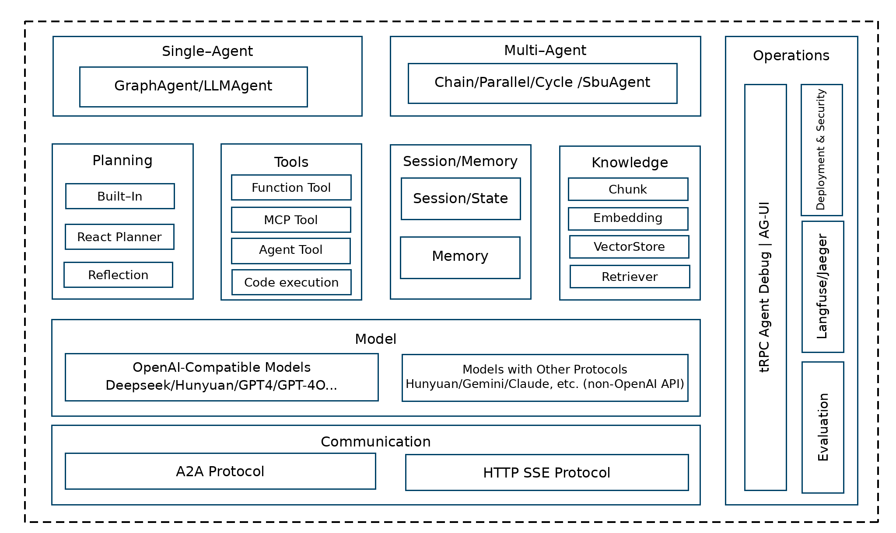
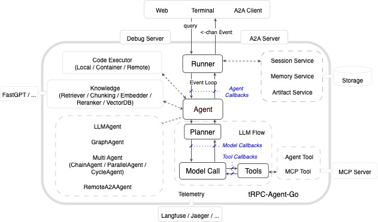
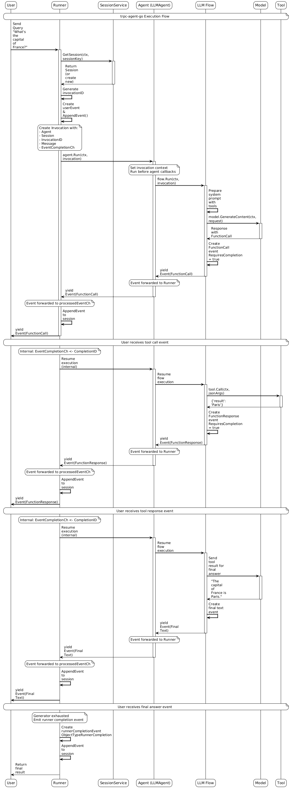

# tRPC-Agent-Go: A Go Agent Framework for Building Intelligent AI Applications

> tRPC is the most widely adopted RPC development framework inside Tencent. It covers most of Tencent's microservices and serves businesses such as QQ, Tencent Video, Tencent Music, QQ Browser, Tencent News, Yuanbao, PC Manager, Mobile Manager, Tencent Cloud, and more. Among them, [tRPC-Go](https://github.com/trpc-group/trpc-go) is the most widely used, covering nearly 2 million nodes and more than 50,000 services in total.
> Since 2023, LLMs have advanced rapidly, and Agent development frameworks have become important infrastructure for connecting AI capabilities with business applications. To help users develop Agent applications more effectively and integrate them with tRPC microservices to deliver high-performance, highly available services, tRPC-Go has continued to invest in Agent capabilities in 2025. This article provides a comprehensive look at how [tRPC-Agent-Go](https://github.com/trpc-group/trpc-agent-go) builds intelligent AI applications.

## Technology Selection and Positioning

### Analysis of Industry Framework Technology Routes

AI Agent application development frameworks currently fall into two major technology routes: autonomous multi-Agent frameworks and orchestration-style frameworks.

**Autonomous Multi-Agent Frameworks**

Autonomous multi-Agent frameworks embody the true concept of an Agent. Each Agent has environmental perception, autonomous decision-making, and action execution capabilities. Multiple Agents collaborate in a distributed manner through message passing and negotiation mechanisms, dynamically adjust strategies based on environmental changes, and demonstrate emergent intelligence.

- [AutoGen](https://github.com/microsoft/autogen) (Microsoft): A multi-Agent collaboration system that supports Agent role specialization and dynamic negotiation.
- [ADK](https://github.com/google/adk-python) (Google Agent Development Kit): Provides complete Agent lifecycle management and multi-Agent orchestration capabilities.
- [CrewAI](https://github.com/crewAIInc/crewAI): A task-oriented multi-Agent collaboration platform that emphasizes role definition and the chain of responsibility pattern.
- Agno: A lightweight, high-performance Agent framework focused on multimodal capabilities and team collaboration.

**Orchestration-Style Frameworks**

Orchestration-style frameworks organize LLM calls and component interactions with workflow thinking, using predefined flowcharts or state machines. Although the overall system exhibits "intelligent" characteristics, its execution path is deterministic, making it more like an "intelligent workflow" than a truly autonomous Agent.

- [LangChain](https://github.com/langchain-ai/langchain): A component orchestration framework based on the Chain abstraction, used to build LLM applications through predefined execution chains.
- [LangGraph](https://github.com/langchain-ai/langgraph): A directed acyclic graph state machine framework that provides deterministic state transitions and conditional branches.

### Technical Comparison of the Two Framework Types

| Dimension | Autonomous Multi-Agent Framework | Orchestration-Style Framework |
| --- | --- | --- |
| Control model | Distributed autonomous decisions and negotiation among Agents | Centralized process orchestration with deterministic execution |
| Applicable scenarios | Open-domain problem solving, creative tasks, multi-specialist collaboration | Structured business processes, data processing pipelines, standardized operations |
| Extension model | Horizontally extend Agent roles and vertically enhance Agent capabilities | Extend nodes and increase flowchart complexity |
| Execution predictability | Emergent behavior with highly diverse results | Deterministic execution with reproducible results |
| System complexity | Complex Agent interactions and difficult debugging | Clear processes that are easy to debug and monitor |
| Technical implementation | Based on message passing and conversation protocols | Based on state machines and directed graph execution |

### Technical Positioning of tRPC-Agent-Go

Industry and ecosystem status: As LLM capabilities continue to break through, Agent development frameworks are becoming an important trend in AI application development. Current mainstream autonomous multi-Agent frameworks, such as AutoGen, CrewAI, ADK, and Agno, are mainly built on the Python ecosystem and provide rich options for Python developers. However, Go occupies an important position in microservice architectures thanks to its excellent concurrency performance, memory safety, and deployment convenience. Most relatively mature Go AI development frameworks currently focus on orchestration-style architectures and are mainly suitable for structured business processes. As modern LLMs have significantly improved in complex reasoning and dynamic decision-making, autonomous multi-Agent frameworks have the following characteristics compared with orchestration-style frameworks:

- Adaptability: Agents dynamically adjust decision strategies and execution paths based on context.
- Collaborative emergence: Multiple Agents implement decentralized negotiation and task decomposition through message passing.
- Cognitive integration: Deeply integrates LLM reasoning, planning, and reflection capabilities to form an intelligent decision-making chain.

In our business research, Tencent businesses showed strong demand for the characteristics above.

Therefore, the tRPC-Agent-Go framework selection leans toward an autonomous multi-Agent collaboration model and architecture. However, the following issues still exist:

1.  For clear scenarios and processes, AI workflows are more appropriate and can produce more stable outputs.
2.  Tencent already has many existing AI workflows and tRPC-based development experience internally, so compatibility with existing assets is required.

For these reasons, the core architecture of tRPC-Agent-Go is based on an autonomous multi-Agent collaboration framework while also providing workflow orchestration capabilities.

## tRPC-Agent-Go Framework Overview

The [tRPC-Agent-Go](https://github.com/trpc-group/trpc-agent-go) framework integrates LLMs, intelligent planners, session management, observability, and a rich tool ecosystem. It supports creating autonomous and semi-autonomous Agents with reasoning, tool calling, sub-Agent collaboration, and long-term state retention capabilities, providing developers with a complete technology stack for building intelligent applications.

### Overall Architecture Diagram

**Module Diagram**



- Agent: The core execution unit responsible for processing user input and generating responses. It provides an intelligent reasoning engine and task orchestration capabilities. tRPC Agent supports single Agents (GraphAgent and LLMAgent) and Multi-Agents (ChainAgent, ParallelAgent, and CycleAgent), and supports chaining based on a multi-agent-system.
- Runner: The Agent executor responsible for managing the Agent lifecycle, maintaining session state, and processing event streams. It connects capabilities such as Session and Memory Service.
- Model: The Model module provides a unified LLM interface abstraction and supports OpenAI-compatible API calls. Through a standardized interface design, developers can flexibly switch between different model providers and seamlessly integrate and call models. This module mainly supports OpenAI-like interface compatibility, which has been verified against most interfaces inside and outside the company.
- Tool: The Tool module provides standardized tool definition, registration, and execution mechanisms, enabling Agents to interact with the external world. It supports two modes, synchronous calls (CallableTool) and streaming calls (StreamableTool), to meet technical requirements in different scenarios, and provides tool capabilities such as FunctionTool, MCP, and DuckDuckGo.
- Session: The Session module provides session management for maintaining conversation history and context information during interactions between Agents and users. The session management module supports multiple storage backends, including in-memory storage and Redis storage.
- Memory: Records users' long-term memories and personalized information.
- Knowledge: The core knowledge management component, implementing complete RAG (retrieval-augmented generation) capabilities. This module not only provides basic knowledge storage and retrieval functions, but also supports multiple advanced features:
- Knowledge source management: Supports local files (Markdown, PDF, TXT, and others), batch directory import, web page crawling, and intelligent input type recognition. Vector storage: Provides in-memory storage (development and testing), PostgreSQL, pgvector, and ElasticSearch. Embedding: Integrates OpenAI Embedding and Gemini Embedding, supports custom models, and optimizes asynchronous batch processing performance. Intelligent retrieval: Semantic similarity search, multi-turn conversation context support, and result reranking to improve relevance.
- Planner: The Planner module provides intelligent planning capabilities for Agents and enhances Agent reasoning and decision-making capabilities through different planning strategies. It supports three modes: built-in thinking models, React structured planning, and custom explicit planning guidance, enabling Agents to better decompose complex tasks and develop execution plans.
- CodeExecutor: The CodeExecutor module provides code execution capabilities for Agents. It supports executing Python and Bash code in a local environment or Docker container, giving Agents practical capabilities such as data analysis, scientific computing, and script automation.
- Observability: Integrates the OpenTelemetry standard, automatically records detailed telemetry data during Agent execution, supports end-to-end tracing and performance monitoring, and includes many built-in metrics.

**Overall Interaction Flow Design of tRPC Agent**



The overall tRPC Agent framework uses a layered design:

- The Runner module is the Agent executor and runtime environment. It is responsible for Agent lifecycle management, session state maintenance, event stream processing, and integration with external web services.
- The Event module is responsible for state transfer and real-time communication during Agent execution. Through a unified event model, it enables decoupled communication between Agents and transparent execution monitoring.
- tRPC Agent follows tRPC's plugin-based design. All components can be integrated as plugins. tRPC Agent provides built-in components and also integrates with various ecosystem components.
- The Callbacks module of tRPC Agent also provides a complete callback mechanism, allowing interception and handling at key points in Agent execution, model reasoning, and tool calling. The callback mechanism can be used for logging, performance monitoring, content review, and other functions.

**Sequence Diagram**

The following shows a complete sequence diagram of a user-Agent conversation, illustrating the relationships among runner, service, Agent, LLMFlow, Model, and Tool.



## Detailed Explanation of Core Modules

### Model Module - Large Language Model Abstraction Layer

The Model module provides a unified LLM interface abstraction and supports OpenAI-compatible API calls. Through a standardized interface design, developers can flexibly switch between different model providers and seamlessly integrate and call models. This module mainly supports OpenAI-like interface compatibility, which has been verified against most interfaces inside and outside the company.

#### Core Interface Design

```text
// Model is the interface that all language models must implement.
type Model interface {
    // GenerateContent generates content and supports streaming responses.
    GenerateContent(ctx context.Context, request *Request) (<-chan *Response, error)

    // Info returns basic model information.
    Info() Info
}

// Info is the model information structure.
type Info struct {
    Name string // Model name.
}
```

#### OpenAI-Compatible Implementation

The framework provides a complete OpenAI-compatible implementation and supports connecting to various OpenAI-like interfaces:

```go
// Create an OpenAI model.
model := openai.New("gpt-4o-mini",
    openai.WithAPIKey("your-api-key"),
    openai.WithBaseURL("https://api.openai.com/v1"), // The BaseURL can be customized.
)

// Custom configuration is supported.
model := openai.New("custom-model",
    openai.WithAPIKey("your-api-key"),
    openai.WithBaseURL("https://your-custom-endpoint.com/v1"),
    openai.WithChannelBufferSize(512),
    openai.WithExtraFields(map[string]interface{}{
        "custom_param": "value",
    }),
)
```

#### Supported Model Platforms

The current framework supports all model platforms that provide OpenAI-compatible APIs, including but not limited to:

**Supported Platforms**

- OpenAI - GPT-4o, GPT-4, GPT-3.5, and other model series.
- Tencent Cloud - DeepSeek and Hunyuan series.
- Other cloud providers - Various models that provide OpenAI-compatible interfaces, such as DeepSeek and Qwen.

For details about the Model module, see: [Model - tRPC-Agent-Go](https://trpc-group.github.io/trpc-agent-go/en/model/)

### Agent Module - Agent Execution Engine

The Agent module is the core component of tRPC-Agent-Go, providing an intelligent reasoning engine and task orchestration capabilities. This module has the following core features:

- Diverse Agent types: Supports different execution modes such as LLM, Chain, Parallel, Cycle, and Graph.
- Tool calling and integration: Provides a rich mechanism for extending external capabilities.
- Event-driven architecture: Implements streaming processing and real-time monitoring.
- Hierarchical composition: Supports sub-Agent collaboration and complex process orchestration.
- State management: Ensures long conversations and session persistence.

The Agent module implements high modularity through a unified interface standard, providing developers with complete technical support from intelligent conversational assistants to complex task automation.

#### Core Interface Design

```go
type Agent interface {
    // Run executes an Agent invocation and returns an event stream.
    Run(ctx context.Context, invocation *Invocation) (<-chan *event.Event, error)

    // Tools returns the list of tools available to the Agent.
    Tools() []tool.Tool

    // Info returns basic Agent information.
    Info() Info

    // SubAgents returns the list of sub-Agents and supports hierarchical composition.
    SubAgents() []Agent

    // FindSubAgent finds a sub-Agent by name.
    FindSubAgent(name string) Agent
}
```

#### Multiple Agent Types

**LLMAgent - Basic Intelligent Agent**

Core characteristics: An intelligent Agent based on LLMs, supporting tool calls, streaming output, and session management.

- Execution method: Directly interacts with the LLM and supports single-turn conversations and multi-turn sessions.
- Applicable scenarios: Intelligent customer service, content creation, coding assistants, data analysis, and Q&A systems.
- Advantages: Simple and direct, fast response, flexible configuration, and easy to extend.

```go
agent := llmagent.New(
    "assistant",
    llmagent.WithModel(openai.New("gpt-4o-mini")),
    llmagent.WithInstruction("You are a professional AI assistant."),
    llmagent.WithTools([]tool.Tool{calculatorTool, searchTool}),
)
```

**ChainAgent - Chain Processing Agent**

Core characteristics: Pipeline mode, where multiple Agents execute sequentially and the output of the previous Agent becomes the input of the next Agent.

- Execution method: Agent1 -> Agent2 -> Agent3 execute sequentially.
- Applicable scenarios: Document processing pipelines, data ETL, and content review chains.
- Technical advantages: Specialized division of labor, clear process, and easy debugging.

```go
chain := chainagent.New(
    "content-pipeline",
    chainagent.WithSubAgents([]agent.Agent{
        planningAgent, // Step 1: Create a plan.
        researchAgent, // Step 2: Collect information.
        writingAgent,  // Step 3: Create content.
    }),
)
```

**ParallelAgent - Parallel Processing Agent**

Core characteristics: Concurrent mode, where multiple Agents execute the same task simultaneously and then merge results.

- Execution method: Agent1 + Agent2 + Agent3 execute simultaneously.
- Applicable scenarios: Multi-expert evaluation, multidimensional analysis, and decision support.
- Technical advantages: Concurrent execution, multi-angle analysis, and strong fault tolerance.

```go
parallel := parallelagent.New(
    "multi-expert-evaluation",
    parallelagent.WithSubAgents([]agent.Agent{
        marketAgent,    // Market analysis expert.
        technicalAgent, // Technical evaluation expert.
        financeAgent,   // Financial analysis expert.
    }),
)
```

**CycleAgent - Iterative Loop Agent**

Core characteristics: Iterative mode, continuously optimizing results through multiple rounds of "execute -> evaluate -> improve" loops.

- Execution method: Executes repeatedly until conditions are met or the maximum number of rounds is reached.
- Applicable scenarios: Complex problem solving, content optimization, and automated debugging.
- Technical advantages: Self-improvement, quality enhancement, and intelligent stopping.

```go
cycle := cycleagent.New(
    "problem-solver",
    cycleagent.WithSubAgents([]agent.Agent{
        generatorAgent, // Generate a solution.
        reviewerAgent,  // Evaluate quality.
    }),
    // Set the maximum number of iterations to 5 to prevent infinite loops.
    cycleagent.WithMaxIterations(5),
)
```

**GraphAgent - Graph Workflow Agent**

Core characteristics: Graph-based workflow mode, supporting complex task processing with conditional routing and multi-node collaboration.

Design purpose: To satisfy and maintain compatibility with the fact that most previous AI Agent applications inside Tencent were developed based on graph orchestration frameworks, making it easier for existing users to migrate and preserving their existing development habits.

- Execution method: Executes according to a graph structure, supporting LLM nodes, tool nodes, conditional branches, and state management.
- Applicable scenarios: Complex decision processes, multi-step task collaboration, dynamic routing, and migration of existing graph orchestration applications.
- Technical advantages: Flexible routing, shared state, visualized processes, and compatibility with existing development models.

```go
// Create a document processing workflow.
stateGraph := graph.NewStateGraph(graph.MessagesStateSchema())

// Create an analysis tool.
complexityTool := function.NewFunctionTool(
    analyzeComplexity,
    function.WithName("analyze_complexity"),
    function.WithDescription("Analyze document complexity."),
)
tools := map[string]tool.Tool{"analyze_complexity": complexityTool}

// Build the workflow graph.
g, err := stateGraph.
    AddNode("preprocess", preprocessDocument). // Preprocessing node.
    AddLLMNode("analyze", model,
                            "Analyze document complexity and use the analyze_complexity tool.", tools). // LLM analysis node.
    AddToolsNode("tools", tools).                  // Tool node.
    AddNode("route_complexity", routeComplexity).  // Routing decision node.
    AddLLMNode("summarize", model, "Summarize complex documents.", nil). // LLM summary node.
    AddLLMNode("enhance", model, "Improve simple document quality.", nil). // LLM enhancement node.
    AddNode("format_output", formatOutput).        // Formatting node.
    SetEntryPoint("preprocess").                   // Set the entry point.
    SetFinishPoint("format_output").               // Set the finish point.
    AddEdge("preprocess", "analyze").              // Connect nodes.
    AddToolsConditionalEdges("analyze", "tools", "route_complexity").
    AddConditionalEdges("route_complexity", complexityCondition, map[string]string{
        "simple":  "enhance",
        "complex": "summarize",
    }).
    AddEdge("enhance", "format_output").
    AddEdge("summarize", "format_output").
    Compile()

// Create GraphAgent and run it.
graphAgent, err := graphagent.New("document-processor", g,
    graphagent.WithDescription("Document processing workflow."),
    graphagent.WithInitialState(graph.State{}),
)

runner := runner.NewRunner("doc-workflow", graphAgent)
events, _ := runner.Run(ctx, userID, sessionID,
    model.NewUserMessage("Process this document content."))
```

Detailed introduction to Agent: [Agent - tRPC-Agent-Go](https://trpc-group.github.io/trpc-agent-go/en/agent/)

### Multi-Agent System - Multi-Agent Collaboration System

tRPC-Agent-Go uses the SubAgent mechanism to build multi-Agent systems and supports multiple Agents collaborating to handle complex tasks.

```go
// Create domain-specific Agents.
marketAnalyst := llmagent.New("market-analyst",
    llmagent.WithModel(model),
    llmagent.WithInstruction("You are a market analysis expert."),
    llmagent.WithTools([]tool.Tool{marketDataTool}))

techArchitect := llmagent.New("tech-architect",
    llmagent.WithModel(model),
    llmagent.WithInstruction("You are a technical architecture expert."),
    llmagent.WithTools([]tool.Tool{techAnalysisTool}))

// Serial collaboration: market analysis -> technical evaluation.
planningChain := chainagent.New("product-planning",
    chainagent.WithSubAgents([]agent.Agent{
        marketAnalyst, techArchitect,
    }))

// Parallel collaboration: multiple experts evaluate simultaneously.
expertPanel := parallelagent.New("expert-panel",
    parallelagent.WithSubAgents([]agent.Agent{
        marketAnalyst, techArchitect,
    }))

// Execute multi-Agent collaboration.
events, err := expertPanel.Run(ctx, &agent.Invocation{
    Message: model.NewUserMessage("Analyze the market and design a product plan."),
})
```

### Event Module - Event-Driven System

The Event module is the core of the tRPC-Agent-Go event system. It is responsible for state transfer and real-time communication during Agent execution. Through a unified event model, it enables decoupled communication between Agents and transparent execution monitoring.

#### Core Features

- Asynchronous communication: Agents communicate non-blockingly through event streams and support high-concurrency execution.
- Real-time monitoring: All execution states are transmitted through events in real time and support streaming processing.
- Unified abstraction: Different types of Agents interact through the same event interface.
- Multi-Agent collaboration: Supports branch event filtering and state tracing.

#### Core Interface

```go
// Event represents an event during Agent execution.
type Event struct {
    *model.Response           // Embeds all fields from the LLM response.
    InvocationID    string    // Unique identifier of this invocation.
    Author          string    // Event initiator, which is the Agent name.
    ID              string    // Unique event identifier.
    Timestamp       time.Time // Event timestamp.
    Branch          string    // Branch identifier for multi-Agent collaboration.
}
```

#### Main Event Types

- chat.completion - LLM chat completion event.
- chat.completion.chunk - Streaming chat event.
- tool.response - Tool response event.
- agent.transfer - Agent transfer event.
- error - Error event.

#### Agent.Run() and Event Handling

All Agents return event streams through the Run() method, implementing a unified execution interface:

```go
// Agent interface definition.
type Agent interface {
    Run(ctx context.Context, invocation *Invocation) (<-chan *event.Event, error)
}

// Create an Agent and process the event stream.
agent := llmagent.New("assistant",
    llmagent.WithModel(model),
    llmagent.WithTools(tools))

events, err := agent.Run(ctx, &agent.Invocation{
    Message: model.NewUserMessage("What is 2+3?"),
})

// Process the event stream in real time.
for event := range events {
    switch event.Object {
    case "chat.completion.chunk":
        fmt.Print(event.Choices[0].Delta.Content)
    case "tool.response":
        fmt.Printf("\n[%s] Tool execution completed\n", event.Author)
    case "chat.completion":
        if event.Done {
            fmt.Printf("\n[%s] Final answer: %s\n",
                event.Author, event.Choices[0].Message.Content)
        }
    case "error":
        fmt.Printf("Error: %s\n", event.Error.Message)
        return event.Error
    }
    if event.Done {
        break
    }
}
```

#### Event Streams in Multi-Agent Collaboration

```go
chainAgent := chainagent.New("chain",
    chainagent.WithSubAgents([]agent.Agent{
        analysisAgent, solutionAgent,
    }))

events, err := chainAgent.Run(ctx, invocation)
if err != nil {
    return err
}

for event := range events {
    switch event.Object {
    case "chat.completion.chunk":
        fmt.Print(event.Choices[0].Delta.Content)
    case "chat.completion":
        if event.Done {
            fmt.Printf("[%s] completed: %s\n", event.Author,
                event.Choices[0].Message.Content)
        }
    case "tool.response":
        fmt.Printf("[%s] Tool execution completed\n", event.Author)
    case "error":
        fmt.Printf("[%s] Error: %s\n", event.Author, event.Error.Message)
    }
}
```

### Invocation - Agent Execution Context

Invocation is the core context object for Agent execution. It encapsulates all information and state required for a single invocation. As the parameter of the Agent.Run() method, it supports event tracing, state management, and collaboration between Agents.

#### Core Structure

```go
type Invocation struct {
    Agent             Agent            // Agent instance to invoke.
    AgentName         string           // Agent name.
    InvocationID      string           // Unique invocation identifier.
    Branch            string           // Branch identifier for multi-Agent collaboration.
    EndInvocation     bool             // Whether to end the invocation.
    Session           *session.Session // Session state.
    Model             model.Model      // Language model.
    Message           model.Message    // User message.
    EventCompletionCh <-chan string    // Event completion signal.
    RunOptions        RunOptions       // Run options.
    TransferInfo      *TransferInfo    // Agent transfer information.
    AgentCallbacks    *Callbacks       // Agent callbacks.
    ModelCallbacks    *model.Callbacks // Model callbacks.
    ToolCallbacks     *tool.Callbacks  // Tool callbacks.
}

type TransferInfo struct {
    TargetAgentName string // Target Agent name.
    Message         string // Transfer message.
    EndInvocation   bool   // Whether to end after transfer.
}
```

#### Main Features

- Execution context: Agent identity, invocation tracing, and branch control.
- State management: Session history, model configuration, and message passing.
- Event control: Asynchronous communication and execution options.
- Agent collaboration: Control transfer and callback mechanism.

#### Usage Example

```go
// Create an Invocation object for advanced usage.
invocation := agent.NewInvocation(
    agent.WithInvocationAgent(r.agent),                               // Agent instance.
    agent.WithInvocationSession(&session.Session{ID: "session-001"}), // Session.
    agent.WithInvocationEndInvocation(false),                         // Whether to end the invocation.
    agent.WithInvocationMessage(model.NewUserMessage("User input")),  // User message.
    agent.WithInvocationModel(modelInstance),                         // Model to use.
)

// Directly invoke an Agent for advanced usage.
ctx := context.Background()
eventChan, err := llmAgent.Run(ctx, invocation)
if err != nil {
    log.Fatalf("Failed to execute Agent: %v", err)
}
```

#### Best Practices

- Prefer using Runner to automatically create Invocation.
- The framework automatically fills fields such as Model and Callbacks.
- Use the transfer tool to implement Agent transfer and avoid directly setting TransferInfo.

### Planner Module - Intelligent Planning Engine

The Planner module provides intelligent planning capabilities for Agents and enhances Agent reasoning and decision-making capabilities through different planning strategies. It supports three modes: built-in thinking models, React structured planning, and custom explicit planning guidance, enabling Agents to better decompose complex tasks and formulate execution plans. In the React mode, the "thinking-action" loop and structured tags provide explicit reasoning guidance for regular models, ensuring that Agents can systematically handle complex tasks.

#### Core Interface Design

```go
// Planner defines the methods that all planners must implement.
type Planner interface {
    // BuildPlanningInstruction builds planning instructions and adds planning-related system instructions to the LLM request.
    BuildPlanningInstruction(
        ctx context.Context,
        invocation *agent.Invocation,
        llmRequest *model.Request,
    ) string

    // ProcessPlanningResponse post-processes and structures the LLM response.
    ProcessPlanningResponse(
        ctx context.Context,
        invocation *agent.Invocation,
        response *model.Response,
    ) *model.Response
}
```

#### Built-in Planning Strategies

**Builtin Planner - Built-in Thinking Planner**

Suitable for models with native thinking capabilities. It enables internal reasoning mechanisms by configuring model parameters:

```go
// Configure reasoning effort for OpenAI o-series models.
builtinPlanner := builtin.New(builtin.Options{
    ReasoningEffort: stringPtr("medium"), // "low", "medium", "high"
})

// Enable thinking mode for Claude/Gemini models.
builtinPlanner := builtin.New(builtin.Options{
    ThinkingEnabled: boolPtr(true),
    ThinkingTokens:  intPtr(1000),
})
```

**React Planner - Structured Planner**

React (Reasoning and Acting) Planner is an AI reasoning pattern that guides models through a "thinking-action" loop with structured tags. It decomposes complex problems into four standardized stages: planning, reasoning analysis, action execution, and answer delivery. This explicit reasoning process enables Agents to systematically handle complex tasks while improving decision interpretability and error detection capabilities.

#### Integration into Agent

React Planner can be seamlessly integrated into any LLMAgent, providing structured thinking capabilities for the Agent. After integration, the Agent automatically follows the four stages of the React pattern to handle user requests, ensuring that every complex task can be processed systematically.

```go
// Create an Agent with planning capabilities.
agent := llmagent.New(
    "planning-assistant",
    llmagent.WithModel(openai.New("gpt-4o")),
    llmagent.WithPlanner(reactPlanner), // Integrate the planner.
    llmagent.WithInstruction("You are an intelligent assistant who is good at planning."),
)

// The Agent automatically uses the planner to:
// 1. Create step-by-step plans for complex tasks in the PLANNING stage.
// 2. Perform reasoning analysis during execution in the REASONING stage.
// 3. Call corresponding tools to execute specific operations in the ACTION stage.
// 4. Integrate all information and provide a complete answer in the FINAL_ANSWER stage.
```

Practical effect: When an Agent using React Planner handles complex queries, it shows obvious structured thinking characteristics. For example, when a user asks "Help me create a travel plan," the Agent first analyzes the requirements (PLANNING), then reasons about the best route (REASONING), queries specific information (ACTION), and finally provides complete travel suggestions (FINAL\_ANSWER). This approach not only improves answer quality, but also allows users to clearly see the Agent's thinking process.

#### Custom Planner

Developers can implement custom planners to meet specific requirements:

```go
// Example of a custom Reflection planner.
type ReflectionPlanner struct {
    maxIterations int
}

func (p *ReflectionPlanner) BuildPlanningInstruction(
    ctx context.Context,
    invocation *agent.Invocation,
    llmRequest *model.Request,
) string {
    return `Please follow these steps for reflective planning:
1. Analyze the problem and create an initial plan.
2. Execute the plan and collect results.
3. Reflect on the execution process and identify problems and improvement points.
4. Optimize the plan based on reflection and execute it again.
5. Repeat the reflection-optimization process until a satisfactory result is achieved.`
}

func (p *ReflectionPlanner) ProcessPlanningResponse(
    ctx context.Context,
    invocation *agent.Invocation,
    response *model.Response,
) *model.Response {
    // Process reflection content and extract improvement suggestions.
    // Implement reflection logic.
    return response
}

// Use a custom planner.
reflectionPlanner := &ReflectionPlanner{maxIterations: 3}
agent := llmagent.New(
    "reflection-agent",
    llmagent.WithModel(model),
    llmagent.WithPlanner(reflectionPlanner), // Use the custom planner.
)
```

For details about the Planner module, see: [Planner - tRPC-Agent-Go](https://trpc-group.github.io/trpc-agent-go/en/planner/)

### Tool Module - Tool Calling Framework

The Tool module provides standardized tool definition, registration, and execution mechanisms, enabling Agents to interact with the external world. It supports two modes, synchronous calls (CallableTool) and streaming calls (StreamableTool), to meet technical requirements in different scenarios.

#### Core Interface Design

```go
// Basic tool interface.
type Tool interface {
    Declaration() *Declaration // Return tool metadata.
}

// Synchronous callable tool interface.
type CallableTool interface {
    Call(ctx context.Context, jsonArgs []byte) (any, error)
    Tool
}

// Streaming tool interface.
type StreamableTool interface {
    StreamableCall(ctx context.Context, jsonArgs []byte) (*tool.StreamReader, error)
    Tool
}
```

#### Tool Creation Example

```go
// Calculator tool.
calculatorTool := function.NewFunctionTool(
    func(ctx context.Context, input struct {
        Expression string `json:"expression"`
    }) (struct {
        Result float64 `json:"result"`
    }, error) {
        result, err := evaluateExpression(input.Expression)
        return struct{ Result float64 }{result}, err
    },
    function.WithName("calculator"),
    function.WithDescription("Perform mathematical calculations."),
)

type weatherInput struct {
    Location string `json:"location"`
}

type weatherOutput struct {
    Weather string `json:"weather"`
}

// 2. Implement a streaming tool function.
func getStreamableWeather(input weatherInput) *tool.StreamReader {
    stream := tool.NewStream(10)
    go func() {
        defer stream.Writer.Close()

        // Simulate returning weather data step by step.
        result := "Sunny, 25°C in " + input.Location
        for i := 0; i < len(result); i++ {
            chunk := tool.StreamChunk{
                Content: weatherOutput{
                    Weather: result[i : i+1],
                },
                Metadata: tool.Metadata{CreatedAt: time.Now()},
            }

            if closed := stream.Writer.Send(chunk, nil); closed {
                break
            }
            time.Sleep(10 * time.Millisecond) // Simulate latency.
        }
    }()

    return stream.Reader
}

// 3. Create a streaming tool.
weatherStreamTool := function.NewStreamableFunctionTool[weatherInput, weatherOutput](
    getStreamableWeather,
    function.WithName("get_weather_stream"),
    function.WithDescription("Stream weather information."),
)

// Create a multi-tool Agent.
agent := llmagent.New(
    "multi-tool-assistant",
    llmagent.WithModel(model),
    llmagent.WithTools([]tool.Tool{
        calculatorTool,
        weatherStreamTool,
        duckduckgo.NewTool(),
    }),
)
```

#### MCP Tool Integration

The framework supports calls to various mcp tools and provides multiple connection methods:

```go
// STDIO mcp tool.
mcpToolSet := mcp.NewMCPToolSet(
    mcp.ConnectionConfig{
        Transport: "stdio",
        Command:   "python",
        Args:      []string{"-m", "my_mcp_server"},
        Timeout:   10 * time.Second,
    },
)

// SSE mcp tool.
mcpToolSet := mcp.NewMCPToolSet(
    mcp.ConnectionConfig{
        Transport: "sse",
        ServerURL: "http://localhost:8080/sse",
        Timeout:   10 * time.Second,
        Headers: map[string]string{
            "Authorization": "Bearer your-token",
        },
    },
)
// Streamable mcp tool.
mcpToolSet := mcp.NewMCPToolSet(
    mcp.ConnectionConfig{
        Transport: "streamable_http", // Note: Use the full name.
        ServerURL: "http://localhost:3000/mcp",
        Timeout:   10 * time.Second,
    },
)

agent := llmagent.New("mcp-assistant",
    llmagent.WithModel(model),
    llmagent.WithToolSets([]tool.ToolSet{mcpToolSet}))
```

For details about the Tool module, see: [Tool - tRPC-Agent-Go](https://trpc-group.github.io/trpc-agent-go/en/tool/)

### CodeExecutor Module - Code Execution Engine

The CodeExecutor module provides code execution capabilities for Agents. It supports executing Python and Bash code in a local environment or Docker container, giving Agents practical capabilities such as data analysis, scientific computing, and script automation.

#### Core Interface Design

```go
// CodeExecutor is the core interface for code execution.
type CodeExecutor interface {
    ExecuteCode(context.Context, CodeExecutionInput) (CodeExecutionResult, error)
    CodeBlockDelimiter() CodeBlockDelimiter
}

// Code execution input and result.
type CodeExecutionInput struct {
    CodeBlocks  []CodeBlock
    ExecutionID string
}

type CodeExecutionResult struct {
    Output      string // Execution output.
    OutputFiles []File // Generated files.
}
```

#### Two Executor Implementations

**LocalCodeExecutor - Local Executor**

Executes code directly in the local environment, suitable for development, testing, and trusted environments:

```go
// Create a local executor.
localExecutor := local.New(
    local.WithWorkDir("/tmp/code-execution"),
    local.WithTimeout(30*time.Second),
    local.WithCleanTempFiles(true),
)

// Integrate into an Agent.
agent := llmagent.New(
    "data-analyst",
    llmagent.WithModel(model),
    llmagent.WithCodeExecutor(localExecutor), // Integrate the code executor.
    llmagent.WithInstruction("You are a data analyst and can execute Python code."),
)
```

**ContainerCodeExecutor - Container Executor**

Executes code in an isolated Docker container, providing higher security and suitable for production environments:

```go
// Create a container executor.
containerExecutor, err := container.New(
    container.WithContainerConfig(container.Config{
        Image: "python:3.11-slim",
    }),
    container.WithHostConfig(container.HostConfig{
        AutoRemove:  true,
        NetworkMode: "none", // Network isolation.
        Resources: container.Resources{
            Memory: 128 * 1024 * 1024, // Memory limit.
        },
    }),
)

agent := llmagent.New(
    "secure-analyst",
    llmagent.WithModel(model),
    llmagent.WithCodeExecutor(containerExecutor), // Use the container executor.
)
```

#### Automatic Code Block Recognition

The framework automatically extracts markdown code blocks from Agent replies and executes them:

```go
// When an Agent reply contains code blocks, they are automatically executed:
// ```python
// import statistics
// data = [1, 2, 3, 4, 5]
// print(f"Average value: {statistics.mean(data)}")
```

**Supports python and bash code**

#### Usage Example

```go
// Data analysis Agent.
dataAgent := llmagent.New(
    "data-scientist",
    llmagent.WithModel(model),
    llmagent.WithCodeExecutor(local.New()),
    llmagent.WithInstruction("You are a data scientist and use the Python standard library for data analysis."),
)

// The user asks a question, and the Agent automatically generates and executes code.
runner := runner.NewRunner("analysis", dataAgent)
events, _ := runner.Run(ctx, userID, sessionID,
    model.NewUserMessage("Analyze data: 23, 45, 12, 67, 34, 89"))

// The Agent automatically:
// 1. Generates Python analysis code.
// 2. Executes the code and obtains results.
// 3. Interprets the analysis results.
```

The CodeExecutor module upgrades Agents from pure conversational assistants to intelligent assistants with practical computing capabilities, supporting application scenarios such as data analysis, script automation, and scientific computing. More remote code executors will be supported later.

### Runner Module - Agent Executor

The Runner module is the Agent executor and runtime environment. It is responsible for Agent lifecycle management, session state maintenance, and event stream processing.

#### Core Interface

```go
type Runner interface {
    Run(
        ctx context.Context,
        userID string, // User identifier.
        sessionID string, // Session identifier.
        message model.Message, // Input message.
        runOpts ...agent.RunOption, // Run options.
    ) (<-chan *event.Event, error) // Return an event stream.
}
```

#### Usage Example

```go
// Step 1: Create an Agent.
agent := llmagent.New(
    "customer-service-agent",
    llmagent.WithModel(openai.New("gpt-4o-mini")),
    llmagent.WithInstruction("You are a professional customer service assistant."),
)

// Step 2: Create a Runner and bind the Agent.
r := runner.NewRunner(
    "customer-service-app", // Application name.
    agent,                  // Bound Agent.
)
ctx := context.Background()
userMessage := model.NewUserMessage("Hello!")
eventChan, err := r.Run(ctx, "user1", "session1", userMessage)
if err != nil {
    panic(err)
}
for event := range eventChan {
    if event.Error != nil {
        fmt.Printf("Error: %s\n", event.Error.Message)
        continue
    }
    if len(event.Choices) > 0 {
        fmt.Print(event.Choices[0].Delta.Content)
    }
}
```

For details about the Runner module, see [Runner - tRPC-Agent-Go](https://trpc-group.github.io/trpc-agent-go/en/runner/)

### Memory Module - Intelligent Memory System

The Memory module provides Agents with persistent memory capabilities, enabling Agents to remember and retrieve user information across sessions and provide personalized interaction experiences.

#### How It Works

Agents automatically identify and store important information through built-in memory tools, support topic tag classification and management, and intelligently retrieve relevant memories when needed. Multi-tenant isolation is implemented through AppName+UserID to ensure user data security.

#### Application Scenarios

Applicable to scenarios that require cross-session memory of user information, such as personal assistants, customer service bots, education tutoring, and project collaboration. Examples include remembering user preferences, tracking problem resolution progress, and saving learning plans.

#### Core Interface

```go
type Service interface {
    // AddMemory adds a new memory.
    AddMemory(ctx context.Context, userKey UserKey, memory string, topics []string) error
    // UpdateMemory updates an existing memory.
    UpdateMemory(ctx context.Context, memoryKey Key, memory string, topics []string) error
    // DeleteMemory deletes the specified memory.
    DeleteMemory(ctx context.Context, memoryKey Key) error
    // ClearMemories clears all memories for a user.
    ClearMemories(ctx context.Context, userKey UserKey) error
    // ReadMemories reads recent memories.
    ReadMemories(ctx context.Context, userKey UserKey, limit int) ([]*Entry, error)
    // SearchMemories searches memories.
    SearchMemories(ctx context.Context, userKey UserKey, query string) ([]*Entry, error)
    // Tools gets memory tools.
    Tools() []tool.Tool
}

// Data structures.
type Entry struct {
    ID        string    `json:"id"`
    AppName   string    `json:"app_name"`
    UserID    string    `json:"user_id"`
    Memory    *Memory   `json:"memory"`
    CreatedAt time.Time `json:"created_at"`
    UpdatedAt time.Time `json:"updated_at"`
}

type Memory struct {
    Memory      string     `json:"memory"`
    Topics      []string   `json:"topics,omitempty"`
    LastUpdated *time.Time `json:"last_updated,omitempty"`
}
```

#### Quick Integration

```go
llmAgent := llmagent.New(
    "memory-assistant",
    llmagent.WithTools(memoryService.Tools()), // Step 1: Register tools.
)

runner := runner.NewRunner(
    "app",
    llmAgent,
    runner.WithMemoryService(memoryService), // Step 2: Set the service.
)
```

#### Built-in Memory Tools

| Tool Name | Default Status | Function Description |
| --- | --- | --- |
| memory\_add | Enabled | Add a new memory entry |
| memory\_update | Enabled | Update existing memory content |
| memory\_search | Enabled | Search memories by keyword |
| memory\_load | Enabled | Load recent memory records |
| memory\_delete | Disabled | Delete a specified memory entry |
| memory\_clear | Disabled | Clear all memories for a user |

#### Usage Example

```go
// The Agent automatically calls memory tools:

// Record information: "My name is Zhang San, and I live in Beijing."
// -> memory_add("Zhang San lives in Beijing", ["personal information"])

// Query information: "Where do I live?"
// -> memory_search("address") -> returns relevant memories

// Update information: "I moved to Shanghai."
// -> memory_update(id, "Zhang San lives in Shanghai", ["personal information"])
```

For details about the Memory module, see: [Memory - tRPC-Agent-Go](https://trpc-group.github.io/trpc-agent-go/en/memory/)

### Session Module - Session Management System

The Session module provides session management for maintaining conversation history and context information during interactions between Agents and users. The session management module supports multiple storage backends, including in-memory storage and Redis storage. In the future, it will add storage backends such as MySql and PgSql according to user needs, providing flexible state persistence capabilities for Agent applications.

#### Core Features

- Session persistence: Saves complete conversation history and context.
- Multiple storage backends: Supports in-memory storage and Redis storage, and can be extended with additional storage implementations.
- Event tracing: Completely records all interaction events in sessions.

#### Session Hierarchy

```go
Application
├── User Sessions
│   ├── Session 1
│   │   ├── Session Data
│   │   └── Events
│   └── Session 2
│       ├── Session Data
│       └── Events
└── App Data
```

#### Core Interface

```go
// Service defines the core interface of the session service.
type Service interface {
    // CreateSession creates a new session.
    CreateSession(ctx context.Context, key Key, state StateMap, options ...Option) (*Session, error)

    // GetSession gets a session.
    GetSession(ctx context.Context, key Key, options ...Option) (*Session, error)

    // ListSessions lists all sessions by user scope of session key.
    ListSessions(ctx context.Context, userKey UserKey, options ...Option) ([]*Session, error)

    // DeleteSession deletes a session.
    DeleteSession(ctx context.Context, key Key, options ...Option) error

    // AppendEvent appends an event to a session.
    AppendEvent(ctx context.Context, session *Session, event *event.Event, options ...Option) error

    // Close closes the service.
    Close() error
}
```

#### Storage Backend Support

```go
// In-memory storage for development and testing.
sessionService := inmemory.NewSessionService()

// Redis storage for production environments.
sessionService, err := redis.NewService(
    redis.WithURL("redis://localhost:6379/0"),
)
```

#### Integration with Runner

```go
// Create a Runner and configure the session service.
runner := runner.NewRunner(
    "my-agent",
    llmAgent,
    runner.WithSessionService(sessionService), // Integrate session management.
)

// Use Runner for multi-turn conversations.
eventChan, err := runner.Run(ctx, userID, sessionID, userMessage)
```

For details about the Session module, see: [Session - tRPC-Agent-Go](https://trpc-group.github.io/trpc-agent-go/en/session/)

### Knowledge Module - Knowledge Management System

The Knowledge module is the core knowledge management component in trpc-agent-go. It implements complete RAG (retrieval-augmented generation) capabilities. This module not only provides basic knowledge storage and retrieval functions, but also supports multiple advanced features:

- Knowledge source management

- Supports local files in multiple formats, such as Markdown, PDF, and TXT.
- Supports batch directory import and automatically handles subdirectories.
- Supports web page crawling and can load content directly from URLs.
- Intelligently recognizes input types and automatically selects an appropriate processor.

- Vector storage

- In-memory storage: Suitable for development and small-scale testing.
- PostgreSQL + pgvector: Suitable for production environments and supports persistence.
- TcVector: A cloud-native solution suitable for large-scale deployment.

- Embedding

- Integrates OpenAI Embedding models by default.
- Supports custom Embedding model integration.
- Uses asynchronous batch processing to optimize performance.

- Intelligent retrieval

- Semantic-based similarity search.
- Supports multi-turn conversation history context.
- Result reranking improves relevance.

#### Core Interface Design

```go
// Knowledge is the main interface for knowledge management.
type Knowledge interface {
    // Search executes semantic search and returns relevant results.
    Search(ctx context.Context, req *SearchRequest) (*SearchResult, error)
}

// SearchRequest represents a search request with context.
type SearchRequest struct {
    Query     string                // Search query text.
    History   []ConversationMessage // Conversation history for context.
    UserID    string                // User identifier.
    SessionID string                // Session identifier.
}

// SearchResult represents the result of a knowledge search.
type SearchResult struct {
    Document *document.Document // Matched document.
    Score    float64            // Relevance score.
    Text     string             // Document content.
}
```

#### Integration with Agent

```go
// Create a knowledge base.
kb := knowledge.New(
    knowledge.WithVectorStore(inmemory.New()),
    knowledge.WithEmbedder(openai.New()),
    knowledge.WithSources([]source.Source{
        file.New([]string{"./docs/llm.md"}),
        url.New([]string{"https://wikipedia.org/wiki/LLM"}),
    }),
)

// Load the knowledge base.
kb.Load(ctx)

// Create an Agent with a knowledge base.
agent := llmagent.New(
    "knowledge-assistant",
    llmagent.WithModel(model),
    llmagent.WithKnowledge(kb), // Automatically adds the knowledge_search tool.
    llmagent.WithInstruction("Use the knowledge_search tool to search for relevant materials and answer questions."),
)
```

For details about the Knowledge module, see: [Knowledge - tRPC-Agent-Go](https://trpc-group.github.io/trpc-agent-go/en/knowledge/)

### Observability Module - Observability System

The Observability module integrates the OpenTelemetry standard, automatically records detailed telemetry data during Agent execution, and supports end-to-end tracing and performance monitoring. The framework reuses OpenTelemetry standard interfaces and has no custom abstraction layer.

#### Quick Start

```go
import (
    agentmetric "trpc.group/trpc-go/trpc-agent-go/telemetry/metric"
    agenttrace "trpc.group/trpc-go/trpc-agent-go/telemetry/trace"
)

func main() {
    ctx := context.Background()

    // Start telemetry collection.
    cleanupTrace, _ := agenttrace.Start(ctx)   // Default localhost:4317.
    cleanupMetric, _ := agentmetric.Start(ctx) // Default localhost:4318.
    defer cleanupTrace()
    defer cleanupMetric()

    // Telemetry data is automatically recorded during Agent execution.
    agent := llmagent.New("assistant",
        llmagent.WithModel(openai.New("gpt-4o-mini")))

    runner := runner.NewRunner("app", agent)
    events, _ := runner.Run(ctx, "user-001", "session-001",
        model.NewUserMessage("Hello"))
}
```

#### Automatically Recorded Trace Links

The framework automatically creates the following Span hierarchy:

```go
invocation                              # Top-level conversation span.
├── call_llm                           # LLM API call.
├── execute_tool calculator            # Tool call.
├── execute_tool search                # Tool call.
└── execute_tool (merged)              # Merged parallel tool calls.

# GraphAgent execution link.
invocation
└── execute_graph
    ├── execute_node preprocess
    ├── execute_node analyze
    │   └── run_model
    └── execute_node format
```

#### Main Span Attributes

- Common attributes: invocation\_id, session\_id, event\_id.
- LLM calls: gen\_ai.request.model, llm\_request/response JSON.
- Tool calls: gen\_ai.tool.name, tool\_call\_args, tool\_response JSON.
- Graph nodes: node\_id, node\_name, node\_description.

#### Configuration Options

**Custom Endpoint Configuration**

```go
cleanupTrace, _ := agenttrace.Start(ctx,
    agenttrace.WithEndpoint("otel-collector:4317"))
```

**Custom Metrics**

```go
counter, _ := metric.Meter.Int64Counter("agent.requests.total")
counter.Add(ctx, 1, metric.WithAttributes(
    attribute.String("agent.name", "assistant")))
```

For details about the Observability module, see: [Observability - tRPC-Agent-Go](https://trpc-group.github.io/trpc-agent-go/en/observability/)

### Debug Server - Debug Server

Debug Server provides an HTTP debugging service compatible with ADK Web UI, supporting visual debugging and real-time monitoring of Agent execution.

#### Quick Start

```go
// Step 1: Prepare Agent instances.
agents := map[string]agent.Agent{
    "chat-assistant": llmagent.New(
        "chat-assistant",
        llmagent.WithModel(openai.New("gpt-4o-mini")),
        llmagent.WithInstruction("You are an intelligent assistant."),
    ),
}

// Step 2: Create a Debug Server.
debugServer := debug.New(agents)

// Step 3: Start the HTTP server.
http.Handle("/", debugServer.Handler())
log.Fatal(http.ListenAndServe(":8080", nil))
```

For details about Debug Server, see: [Debug - tRPC-Agent-Go](https://trpc-group.github.io/trpc-agent-go/en/debugserver/)

### Callbacks Module - Callback Mechanism

The Callbacks module provides a complete callback mechanism, allowing interception and handling at key points in Agent execution, model reasoning, and tool calling. The callback mechanism can be used for logging, performance monitoring, content review, and other functions.

#### Callback Types

- ModelCallbacks (model callbacks)

```go
_ = model.NewCallbacks().
    RegisterBeforeModel(func(ctx context.Context, req *model.Request) (*model.Response, error) {
        fmt.Printf("🌐 Global BeforeModel: processing %d messages\n", len(req.Messages))
        return nil, nil
    }).
    RegisterAfterModel(func(ctx context.Context, req *model.Request, rsp *model.Response, modelErr error) (*model.Response, error) {
        if modelErr != nil {
            fmt.Printf("🌐 Global AfterModel: error occurred\n")
        } else {
            fmt.Printf("🌐 Global AfterModel: processed successfully\n")
        }
        return nil, nil
    })
```

- BeforeModel: Triggered before model reasoning and can be used for input interception and logging.
- AfterModel: Triggered after each output chunk and can be used for content review and result processing.
- ToolCallbacks (tool callbacks)

```go
_ = tool.NewCallbacks().
    RegisterBeforeTool(func(ctx context.Context, toolName string, toolDeclaration *tool.Declaration, jsonArgs []byte) (any, error) {
        fmt.Printf("🌐 Global BeforeTool: executing %s\n", toolName)
        return nil, nil
    }).
    RegisterAfterTool(func(ctx context.Context, toolName string, toolDeclaration *tool.Declaration, jsonArgs []byte, result any, runErr error) (any, error) {
        if runErr != nil {
            fmt.Printf("🌐 Global AfterTool: %s failed\n", toolName)
        } else {
            fmt.Printf("🌐 Global AfterTool: %s completed\n", toolName)
        }
        return nil, nil
    })
```

- BeforeTool: Triggered before tool calls and can be used for parameter validation and result simulation.
- AfterTool: Triggered after tool calls and can be used for result processing and logging.
- AgentCallbacks (Agent callbacks)

```go
_ = agent.NewCallbacks().
    RegisterBeforeAgent(func(ctx context.Context, invocation *agent.Invocation) (*model.Response, error) {
        fmt.Printf("🌐 Global BeforeAgent: starting %s\n", invocation.AgentName)
        return nil, nil
    }).
    RegisterAfterAgent(func(ctx context.Context, invocation *agent.Invocation, runErr error) (*model.Response, error) {
        if runErr != nil {
            fmt.Printf("🌐 Global AfterAgent: execution failed\n")
        } else {
            fmt.Printf("🌐 Global AfterAgent: execution completed\n")
        }
        return nil, nil
    })
```

- BeforeAgent: Triggered before Agent execution and can be used for permission checks and input validation.
- AfterAgent: Triggered after Agent execution and can be used for result processing and error handling.

#### Use Cases

- Monitoring and logging: Records model calls, tool usage, and the Agent execution process.
- Performance optimization: Monitors response time and resource usage.
- Security and review: Filters input content and reviews output content.
- Custom processing: Formats results, retries errors, and enhances content.

#### Integration Example

```go
// Create an Agent with callbacks.
agent := llmagent.New(
    "callback-demo",
    llmagent.WithModel(model),
    llmagent.WithModelCallbacks(modelCallbacks),
    llmagent.WithToolCallbacks(toolCallbacks),
    llmagent.WithAgentCallbacks(agentCallbacks),
)

// Create a Runner and execute.
runner := runner.NewRunner(
    "callback-app",
    agent,
    runner.WithSessionService(sessionService),
)

// Execute a conversation.
events, err := runner.Run(ctx, userID, sessionID,
    model.NewUserMessage("Hello"))
```

The Callbacks module makes Agent behavior more controllable and transparent through a flexible callback mechanism, while providing strong support for monitoring, review, customization, and other needs.

### A2A Integration - Agent-to-Agent Communication

The A2A (Agent-to-Agent) module provides Agent-to-Agent communication capabilities. It supports quickly integrating tRPC-Agent-Go Agents into the A2A protocol to implement multi-Agent collaboration and expose capabilities externally.

#### Quick Start

```go
// Step 1: Create an Agent.
agent := llmagent.New(
    "my-agent",
    llmagent.WithModel(openai.New("gpt-4o-mini")),
    llmagent.WithInstruction("You are an intelligent assistant."),
)

// Step 2: Create an A2A server.
a2aServer, err := a2a.New(
    a2a.WithAgent(agent, true),     // Bind the Agent.
    a2a.WithHost("localhost:8080"), // Set the listening address.
)
if err != nil {
    log.Fatal(err)
}

// Step 3: Start the server.
ctx := context.Background()
if err := a2aServer.Start(ctx); err != nil {
    log.Fatal(err)
}

log.Println("A2A server started: localhost:8080")
```

## Business Practices

tRPC-Agent-Go is used internally by many applications. Here are four business scenarios:

1.  Yuanbao - Deep Writing

The business orchestrates an automated writing pipeline through GraphAgent. A2AAgent first calls the search service to obtain materials, then an LLM Node generates an XML outline and processes it in streaming mode, and finally the Writer LLM node is called in a loop to gradually generate content according to the outline.

2\. Tencent Sports - Sports Expert

- Match report generation: LLMAgent obtains data through MCP tools and uses its "thinking mode" to generate reviews, summaries, and titles step by step.
- Sports search: GraphAgent drives the business process. The LLM node first rewrites the query, the Planner node plans MCP tool calls to obtain information, and the final output is streamed and parsed into front-end cards.
- Multi-turn assistant: GraphAgent implements routing. A2AAgent dispatches sports-related requests to a dedicated Agent, while non-sports questions are routed to an internet-connected SubAgent.

3\. AMS Advertising Marketing - Report Agent

GraphAgent is the core. Its LLM Node combines with tRAG to analyze intent, streams an "action template," and pushes it to the front end. It then calls MCP tools according to the template to obtain business data, and finally assembles componentized reports such as charts and tables.

4\. Tencent Video Overseas - Translation Agent

Based on the tRPC-Agent-Go framework, four specialized LLMAgents were quickly built, namely plot extraction, terminology extraction, terminology translation, and subtitle translation, to form a workflow. The framework's encapsulated callback mechanism keeps complex logic cohesive while providing a concise external interface, efficiently completing the transformation from original subtitles to multilingual final drafts.

## Closing Thoughts

Special thanks to Tencent business units, including Tencent Yuanbao, Tencent Video, Tencent News, IMA, and QQ Music, for their valuable support and production environment validation, which have driven the framework's development.

Thanks to excellent open-source frameworks such as ADK, Agno, CrewAI, and AutoGen for their inspiration, allowing tRPC-Agent-Go to move quickly by standing on the shoulders of giants!

tRPC-Agent-Go github: [tRPC-Agent-Go](https://github.com/trpc-group/trpc-agent-go). Stars are welcome!

In addition, tRPC's Go AI ecosystem also provides development capabilities for A2A ([tRPC-A2A-Go](https://github.com/trpc-group/trpc-a2a-go)) and the MCP framework ([tRPC-MCP-Go](https://github.com/trpc-group/trpc-mcp-go)), and everyone is welcome to use them.
