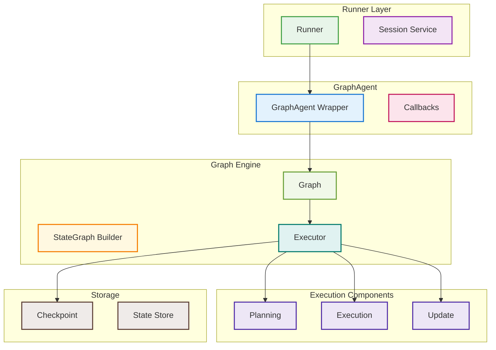
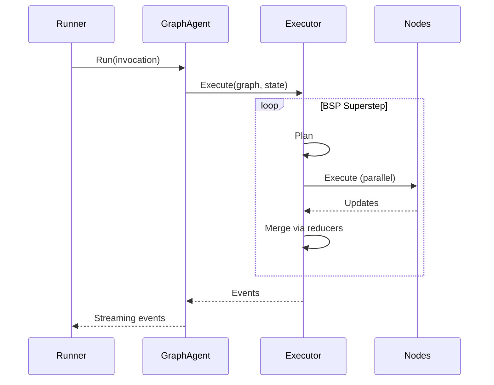

# Graph Package Guide

## Overview

Graph combines controllable workflow orchestration with extensible agent capabilities. It is suitable for:
- Type-safe state management and predictable routing.
- LLM decision making, tool-calling loops, and optional Human in the Loop (HITL).
- Reusable components that can run standalone or be composed as sub‑agents.

Highlights:
- Schema‑driven State and Reducers to avoid data races when concurrent branches write the same field.
- Deterministic parallelism with BSP style (Plan / Execute / Update).
- Built‑in node types wrap LLM, Tools, and Agent to reduce boilerplate.
- Streaming events, checkpoints, and interrupts for observability and recovery.

## Quick Start

### Minimal Workflow

Below is a classic “prepare → ask LLM → optionally call tools” loop using `graph.MessagesStateSchema()` (predefines `messages`, `user_input`, `last_response`, etc.).


Turn the diagram into a runnable workflow:

```go
package main

import (
    "context"
    "fmt"
    "strings"

    "trpc.group/trpc-go/trpc-agent-go/agent/graphagent"
    "trpc.group/trpc-go/trpc-agent-go/graph"
    "trpc.group/trpc-go/trpc-agent-go/model"
    "trpc.group/trpc-go/trpc-agent-go/model/openai"
    "trpc.group/trpc-go/trpc-agent-go/runner"
    "trpc.group/trpc-go/trpc-agent-go/tool"
    "trpc.group/trpc-go/trpc-agent-go/tool/function"
)

// Unexported constants to avoid magic strings
const (
    nodePrepare  = "prepare"
    nodeAsk      = "ask"
    nodeTools    = "tools"
    nodeFallback = "fallback"
    nodeFinish   = "finish"

    modelName     = "gpt-4o-mini"
    systemPrompt  = "You are a careful assistant."
    outputKeyFinal = "final_output"

    toolNameCalculator = "calculator"

    demoUserID    = "user"
    demoSessionID = "session"
    demoQuestion  = "What is 6 * 7?"
)

func newCalculator() tool.Tool {
    type Input struct {
        Expression string `json:"expression"`
    }
    type Output struct {
        Result float64 `json:"result"`
    }
    return function.NewFunctionTool[Input, Output](
        func(ctx context.Context, in Input) (Output, error) {
            // Implement a real evaluator here
            return Output{Result: 42}, nil
        },
        function.WithName(toolNameCalculator),
        function.WithDescription("Evaluate a math expression"),
    )
}

func buildWorkflow(m model.Model, tools map[string]tool.Tool) (*graph.Graph, error) {
    sg := graph.NewStateGraph(graph.MessagesStateSchema())

    sg.AddNode(nodePrepare, func(ctx context.Context, s graph.State) (any, error) {
        raw := fmt.Sprint(s[graph.StateKeyUserInput])
        cleaned := strings.TrimSpace(raw)
        return graph.State{graph.StateKeyUserInput: cleaned}, nil
    })

    sg.AddLLMNode(nodeAsk, m, systemPrompt, tools)
    sg.AddToolsNode(nodeTools, tools)

    sg.AddNode(nodeFallback, func(ctx context.Context, s graph.State) (any, error) {
        return graph.State{graph.StateKeyLastResponse: "No tools required; answer directly"}, nil
    })

    sg.AddNode(nodeFinish, func(ctx context.Context, s graph.State) (any, error) {
        return graph.State{outputKeyFinal: fmt.Sprint(s[graph.StateKeyLastResponse])}, nil
    })

    sg.SetEntryPoint(nodePrepare)
    sg.AddEdge(nodePrepare, nodeAsk)
    sg.AddToolsConditionalEdges(nodeAsk, nodeTools, nodeFallback)
    sg.AddEdge(nodeTools, nodeAsk)
    sg.AddEdge(nodeFallback, nodeFinish)
    sg.SetFinishPoint(nodeFinish)

    return sg.Compile()
}

func main() {
    mdl := openai.New(modelName)
    tools := map[string]tool.Tool{toolNameCalculator: newCalculator()}

    g, err := buildWorkflow(mdl, tools)
    if err != nil {
        panic(err)
    }

    // Run with GraphAgent + Runner (no direct Executor.Execute)
    ga, err := graphagent.New("demo", g)
    if err != nil {
        panic(err)
    }
    app := runner.NewRunner("app", ga)
    events, err := app.Run(context.Background(), demoUserID, demoSessionID,
        model.NewUserMessage(demoQuestion))
    if err != nil {
        panic(err)
    }
    for ev := range events {
        if ev.Response == nil {
            continue
        }
        if ev.Author == nodeAsk && !ev.Response.IsPartial && len(ev.Response.Choices) > 0 {
            fmt.Println("LLM:", ev.Response.Choices[0].Message.Content)
        }
    }
}
```

The example shows how to declare nodes, connect edges, and run. Next, we’ll cover execution with GraphAgent + Runner, then core concepts and common practices.

### Execution

- Wrap the compiled graph with `graphagent.New` (as a generic `agent.Agent`) and hand it to `runner.Runner` to manage sessions and streaming events.

Minimal GraphAgent + Runner:

```go
compiled, _ := buildWorkflow(openai.New("gpt-4o-mini"), nil)
ga, _ := graphagent.New("demo", compiled)
app := runner.NewRunner("app", ga)

events, _ := app.Run(ctx, "user", "session", model.NewUserMessage("hi"))
for ev := range events { /* handle events */ }
```

Session backends:
- In-memory: `session/inmemory` (used by examples)
- Redis: `session/redis` (more common in production)

```go
import (
    "trpc.group/trpc-go/trpc-agent-go/session/redis"
)

sess, _ := redis.NewService(redis.WithRedisClientURL("redis://localhost:6379"))
app := runner.NewRunner("app", ga, runner.WithSessionService(sess))
```

### GraphAgent Options

```go
ga, err := graphagent.New(
    "workflow",
    compiledGraph,
    graphagent.WithDescription("Workflow description"),
    graphagent.WithInitialState(graph.State{"init": 1}),
    graphagent.WithChannelBufferSize(512),
    graphagent.WithCheckpointSaver(saver),
    graphagent.WithSubAgents([]agent.Agent{subAgent}),
    graphagent.WithAgentCallbacks(agent.NewCallbacks()),
)
```

## Core Concepts

### State Management

GraphAgent uses a Schema + Reducer model to manage state. You first define the state shape and merge rules; later nodes have clear expectations about the origin and lifecycle of keys they read/write.

#### Built‑in Schema

```go
import (
    "trpc.group/trpc-go/trpc-agent-go/graph"
)

schema := graph.MessagesStateSchema()

// Predefined fields (key constants) and semantics:
// - graph.StateKeyMessages       ("messages")        Conversation history ([]model.Message; MessageReducer + MessageOp for atomic updates)
// - graph.StateKeyUserInput      ("user_input")      User input (string; one-shot; cleared after successful execution)
// - graph.StateKeyLastResponse   ("last_response")   Last response (string)
// - graph.StateKeyNodeResponses  ("node_responses")  Per-node outputs (map[string]any; aggregated across parallel branches)
// - graph.StateKeyMetadata       ("metadata")        Metadata (map[string]any; merged by MergeReducer)

// Additional one-shot/system keys (use as needed):
// - graph.StateKeyOneShotMessages ("one_shot_messages")  One-shot override of this turn's input ([]model.Message)
// - graph.StateKeySession         ("session")            Session object (internal)
// - graph.StateKeyExecContext     ("exec_context")       Execution context (events etc., internal)
```

#### Custom Schema

```go
import (
    "reflect"
    "trpc.group/trpc-go/trpc-agent-go/graph"
)

schema := graph.NewStateSchema()

// Add a custom field
schema.AddField("counter", graph.StateField{
    Type:    reflect.TypeOf(0),
    Default: func() any { return 0 },
    Reducer: func(old, new any) any {
        return old.(int) + new.(int)  // accumulate
    },
})

// String slice with a built-in reducer
schema.AddField("items", graph.StateField{
    Type:    reflect.TypeOf([]string{}),
    Default: func() any { return []string{} },
    Reducer: graph.StringSliceReducer,
})
```

Reducers ensure fields are merged safely per predefined rules, which is critical under concurrent execution.

Tip: define constants for business keys to avoid scattered magic strings.

### Node Types

GraphAgent provides four built‑in node types:

#### Function Node
The most basic node, for custom logic:

```go
import (
    "context"

    "trpc.group/trpc-go/trpc-agent-go/graph"
)

const (
    stateKeyInput  = "input"
    stateKeyOutput = "output"
    nodeProcess    = "process"
)

sg.AddNode(nodeProcess, func(ctx context.Context, state graph.State) (any, error) {
    data := state[stateKeyInput].(string)
    processed := transform(data)
    // Function nodes must explicitly specify the output key
    return graph.State{stateKeyOutput: processed}, nil
})
```

#### LLM Node
Integrates an LLM and auto‑manages conversation history:

```go
import (
    "trpc.group/trpc-go/trpc-agent-go/graph"
    "trpc.group/trpc-go/trpc-agent-go/model/openai"
)

const (
    llmModelName     = "gpt-4o-mini"
    llmSystemPrompt  = "System prompt"
    llmNodeAssistant = "assistant"
)

model := openai.New(llmModelName)
sg.AddLLMNode(llmNodeAssistant, model, llmSystemPrompt, tools)

// Inputs (priority): one_shot_messages > user_input > messages
// Outputs: last_response, messages (atomic), node_responses (includes this node's output for aggregation)
```

#### Tools Node
Executes tool calls in sequence:

```go
import (
    "trpc.group/trpc-go/trpc-agent-go/graph"
)

const nodeTools = "tools"

sg.AddToolsNode(nodeTools, tools)
// Multiple tools execute in the order returned by the LLM
// For parallelism, use multiple nodes + parallel edges
// Pairing rule: walk the messages from the tail to the most recent assistant(tool_calls)
// message; stop at a new user to ensure pairing with the current tool call round.
```

#### Agent Node
Embed a sub‑agent to enable multi‑agent collaboration:

```go
import (
    "trpc.group/trpc-go/trpc-agent-go/agent"
    "trpc.group/trpc-go/trpc-agent-go/agent/graphagent"
)

const (
    subAgentNameAnalyzer = "analyzer"
    graphAgentNameMain   = "main"
)

// Important: node ID must match the sub‑agent's name
sg.AddAgentNode(subAgentNameAnalyzer)

// Inject sub‑agent instances when creating the GraphAgent
analyzer := createAnalyzer()  // internal agent name must be "analyzer"
graphAgent, _ := graphagent.New(graphAgentNameMain, g,
    graphagent.WithSubAgents([]agent.Agent{analyzer}))
```

### Edges and Routing

Edges define control flow between nodes:

```go
import (
    "context"

    "trpc.group/trpc-go/trpc-agent-go/graph"
)

const (
    nodeA         = "nodeA"
    nodeB         = "nodeB"
    nodeDecision  = "decision"
    nodePathA     = "pathA"
    nodePathB     = "pathB"

    routeToPathA  = "route_to_pathA"
    routeToPathB  = "route_to_pathB"
    stateKeyFlag  = "flag"
)

// Straight edge
sg.AddEdge(nodeA, nodeB)

// Conditional edges (third arg is the route map; provide explicitly for static checks)
// Define target nodes first
sg.AddNode(nodePathA, handlerA)
sg.AddNode(nodePathB, handlerB)
// Then add conditional routing
sg.AddConditionalEdges(nodeDecision, 
    func(ctx context.Context, s graph.State) (string, error) {
        if s[stateKeyFlag].(bool) {
            return routeToPathA, nil
        }
        return routeToPathB, nil
    }, map[string]string{
        routeToPathA: nodePathA,
        routeToPathB: nodePathB,
    })

// Tools conditional edges: handle LLM tool calls
const (
    nodeLLM      = "llm"
    nodeToolsUse = "tools"
    nodeFallback = "fallback"
)
sg.AddToolsConditionalEdges(nodeLLM, nodeToolsUse, nodeFallback)

// Parallel edges: branches from the same node run in parallel
const (
    nodeSplit   = "split"
    nodeBranch1 = "branch1"
    nodeBranch2 = "branch2"
)
sg.AddEdge(nodeSplit, nodeBranch1)
sg.AddEdge(nodeSplit, nodeBranch2)  // branch1 and branch2 execute in parallel
```

Tip: setting entry and finish points implicitly connects to virtual Start/End nodes:
- `SetEntryPoint("first")` is equivalent to Start → first.
- `SetFinishPoint("last")` is equivalent to last → End.
There’s no need to add these two edges explicitly.

Constants: `graph.Start == "__start__"`, `graph.End == "__end__"`.

### Command Mode (Dynamic Routing / Fan‑out)

Nodes can return `graph.State`, or `*graph.Command` / `[]*graph.Command` to update state and direct the next hop:

```go
// Dynamic route to A or B with a state write
const (
    nodeDecide = "decide"
    nodeA      = "A"
    nodeB      = "B"
    stateKeyFlag = "flag"
)

sg.AddNode(nodeDecide, func(ctx context.Context, s graph.State) (any, error) {
    if s[stateKeyFlag].(bool) {
        return &graph.Command{Update: graph.State{"routed": nodeA}, GoTo: nodeA}, nil
    }
    return &graph.Command{Update: graph.State{"routed": nodeB}, GoTo: nodeB}, nil
})

// Fan-out: dispatch multiple tasks to the same worker in parallel
const (
    nodeFanout = "fanout"
    nodeWorker = "worker"
)
sg.AddNode(nodeFanout, func(ctx context.Context, s graph.State) (any, error) {
    cmds := []*graph.Command{
        {Update: graph.State{"param": "A"}, GoTo: nodeWorker},
        {Update: graph.State{"param": "B"}, GoTo: nodeWorker},
        {Update: graph.State{"param": "C"}, GoTo: nodeWorker},
    }
    return cmds, nil
})
```

When using command‑based routing, you don’t need static edges to `GoTo` targets; just ensure the target nodes exist and call `SetFinishPoint` where appropriate.

## Architecture

### Overall Architecture

GraphAgent’s architecture manages complexity via clear layering. Each layer has a well‑defined responsibility and communicates through standard interfaces.



### Core Modules

Overview of core components:

`graph/state_graph.go` — StateGraph builder  
Provides a fluent, declarative Go API to build graphs via method chaining (AddNode → AddEdge → Compile) covering nodes, edges, and conditional routing.

`graph/graph.go` — Compiled runtime  
Implements channel‑based, event‑triggered execution. Node results merge into State; channels are used to drive routing and carry sentinel values (not business data).

`graph/executor.go` — BSP executor  
Heart of the system, inspired by Google’s Pregel. Implements BSP (Bulk Synchronous Parallel) supersteps: Planning → Execution → Update.

`graph/checkpoint/*` — Checkpoints and recovery  
Optional checkpoint persistence (e.g., sqlite). Atomically saves state and pending writes; supports lineage/checkpoint‑based recovery.

`agent/graphagent/graph_agent.go` — Bridge between Graph and Agent  
Adapts a compiled Graph into a generic Agent, reusing sessions, callbacks, and streaming.

### Execution Model

GraphAgent adapts Pregel’s BSP model to a single‑process environment:



Key points:

1. Planning Phase: determine which nodes to run from the channel frontier.
2. Execution Phase: each node receives a shallow copy of state (maps.Copy) and runs in parallel.
3. Update Phase: merge node updates via reducers, ensuring concurrency safety.

This design enables per‑step observability along with safe interrupts and recovery.

#### Runtime Isolation and Event Snapshots

- The Executor is reusable and concurrency‑safe. Per‑run state lives in `ExecutionContext` (channel versions, pending writes, last checkpoint, etc.).
- Each event’s `StateDelta` is a deep‑copy snapshot containing only serializable and allowed keys; internal keys (execution context, callbacks, etc.) are filtered out for external telemetry and persistence.

### Executor Configuration

```go
exec, err := graph.NewExecutor(g,
    graph.WithChannelBufferSize(1024),              // event channel buffer
    graph.WithMaxSteps(50),                          // max steps
    graph.WithStepTimeout(5*time.Minute),            // step timeout
    graph.WithNodeTimeout(2*time.Minute),            // node timeout
    graph.WithCheckpointSaver(saver),                // enable checkpoints (sqlite/inmemory)
    graph.WithCheckpointSaveTimeout(30*time.Second), // checkpoint save timeout
)
```

## Integrating with Multi‑Agent Systems

GraphAgent is designed to be part of the tRPC‑Agent‑Go multi‑agent ecosystem, not an island. It implements the standard Agent interface and collaborates with other agent types.

### GraphAgent as an Agent

GraphAgent implements the standard Agent interface:

```go
import (
    "trpc.group/trpc-go/trpc-agent-go/agent"
    "trpc.group/trpc-go/trpc-agent-go/agent/chainagent"
)

// Use directly inside ChainAgent, ParallelAgent, CycleAgent
chain := chainagent.New("chain",
    chainagent.WithSubAgents([]agent.Agent{
        graphAgent1,  // structured flow #1
        graphAgent2,  // structured flow #2
    }))
```

### Embedding Agents in a Graph

Inside a graph, you can call existing sub‑agents as nodes. The example below shows how to create sub‑agents, declare the corresponding nodes, and inject them when constructing the GraphAgent.

```go
import (
    "trpc.group/trpc-go/trpc-agent-go/agent"
    "trpc.group/trpc-go/trpc-agent-go/agent/graphagent"
)

// Create sub‑agents
const (
    SubAgentAnalyzer = "analyzer"
    SubAgentReviewer = "reviewer"
)
analyzer := createAnalyzer()  // name must be "analyzer"
reviewer := createReviewer()  // name must be "reviewer"

// Declare agent nodes in the graph
sg.AddAgentNode(SubAgentAnalyzer)
sg.AddAgentNode(SubAgentReviewer)

// Inject sub‑agents when creating the GraphAgent
graphAgent, _ := graphagent.New("workflow", g,
    graphagent.WithSubAgents([]agent.Agent{
        analyzer,
        reviewer,
    }))

// I/O: sub‑agents receive user_input as the message AND the full
// graph state via inv.RunOptions.RuntimeState; on finish they update
// last_response and node_responses[nodeID]
```

### Hybrid Pattern Example

Embed dynamic decision‑making within a structured flow:

```go
import (
    "trpc.group/trpc-go/trpc-agent-go/agent"
    "trpc.group/trpc-go/trpc-agent-go/agent/chainagent"
    "trpc.group/trpc-go/trpc-agent-go/agent/graphagent"
    "trpc.group/trpc-go/trpc-agent-go/graph"
)

sg := graph.NewStateGraph(schema)

const (
    nodePrepare  = "prepare"
    nodeAnalyzer = "analyzer"
    nodeFinalize = "finalize"
)

// Structured data preparation
sg.AddNode(nodePrepare, prepareData)

// Dynamic decision point — use a ChainAgent
dynamicAgent := chainagent.New(nodeAnalyzer,
    chainagent.WithSubAgents([]agent.Agent{...}))
sg.AddAgentNode(nodeAnalyzer)

// Continue the structured flow
sg.AddNode(nodeFinalize, finalizeResults)

// Wire the flow
sg.SetEntryPoint(nodePrepare)
sg.AddEdge(nodePrepare, nodeAnalyzer)   // hand over to dynamic agent
sg.AddEdge(nodeAnalyzer, nodeFinalize)  // return to structured flow
sg.SetFinishPoint(nodeFinalize)

// Inject on creation
graphAgent, _ := graphagent.New("hybrid", g,
    graphagent.WithSubAgents([]agent.Agent{dynamicAgent}))
```

## Core Mechanics in Depth

### State Management: Schema + Reducer

State is a central challenge in graph workflows. We designed a Schema + Reducer mechanism that provides type safety and supports high‑concurrency atomic updates.

```mermaid
flowchart LR
    subgraph "State Schema"
        MS[messages: MessageList]:::schemaClass
        UI[user_input: string]:::schemaClass
        LR[last_response: string]:::schemaClass
        NR[node_responses: Map]:::schemaClass
    end
    
    subgraph "Reducers"
        R1[MessageReducer + MessageOp]:::reducerClass
        R2[MergeReducer (Map)]:::reducerClass
        R3[ReplaceReducer (String)]:::reducerClass
    end
    
    subgraph "Node Outputs"
        N1[Node 1 Output]:::nodeOutputClass
        N2[Node 2 Output]:::nodeOutputClass
        N3[Node 3 Output]:::nodeOutputClass
    end
    
    N1 --> R1
    N2 --> R2
    N3 --> R3
    R1 --> MS
    R2 --> NR
    R3 --> LR
    
    classDef schemaClass fill:#e3f2fd,stroke:#1565c0,stroke-width:2px
    classDef reducerClass fill:#f3e5f5,stroke:#7b1fa2,stroke-width:2px
    classDef nodeOutputClass fill:#fff8e1,stroke:#f57f17,stroke-width:2px
```

Graph state is a `map[string]any` with runtime validation provided by `StateSchema`. The reducer mechanism ensures safe merging and avoids conflicts under concurrent updates.

#### Common State Keys

- User‑visible: `user_input`, `one_shot_messages`, `messages`, `last_response`, `node_responses`, `metadata`
- Internal: `session`, `exec_context`, `tool_callbacks`, `model_callbacks`, `agent_callbacks`, `current_node_id`, `parent_agent`
- Command/Resume: `__command__`, `__resume_map__`

Constants live in `graph/state.go` and `graph/keys.go`. Prefer referencing constants over hard‑coding strings.

#### Node‑level Callbacks & Generation Parameters

Per‑node options (see `graph/state_graph.go`):
- `graph.WithPreNodeCallback` / `graph.WithPostNodeCallback` / `graph.WithNodeErrorCallback`
- LLM nodes: `graph.WithGenerationConfig`, `graph.WithModelCallbacks`
- Tool nodes: `graph.WithToolCallbacks`
- Agent nodes: `graph.WithAgentNodeEventCallback`

Additionally, `graph.WithName`/`graph.WithDescription` add friendly labels; `graph.WithDestinations` declares potential dynamic destinations (for static checks/visualization only).

### LLM Input Rules: Three‑Stage Design

The LLM input pipeline looks simple but solves common context‑management problems in AI apps.

Built‑in selection logic (no extra config):

1. Prefer `one_shot_messages`: fully override inputs (system/user) for this turn; cleared after execution.
2. Else use `user_input`: append this turn’s user to `messages`, then atomically write back user+assistant; finally clear `user_input`.
3. Else use `messages` only: common on tool loops re‑entering LLM (since `user_input` has been cleared).

The benefit: preprocess nodes can rewrite `user_input` and take effect in the same turn, while seamlessly integrating with the tool loop (tool_calls → tools → LLM).

Examples (showing the three paths):

```go
// OneShot: completely override this turn’s inputs (system/user)
import (
    "trpc.group/trpc-go/trpc-agent-go/graph"
    "trpc.group/trpc-go/trpc-agent-go/model"
)

const (
    systemPrompt = "You are a careful and reliable assistant"
    userPrompt   = "Summarize this text in bullet points"
)

sg.AddNode("prepare_prompt", func(ctx context.Context, s graph.State) (any, error) {
    oneShot := []model.Message{
        model.NewSystemMessage(systemPrompt),
        model.NewUserMessage(userPrompt),
    }
    return graph.State{graph.StateKeyOneShotMessages: oneShot}, nil
})
// The following LLM node will use one_shot_messages only and clear it afterwards
```

```go
// UserInput: append this turn’s user input on top of history messages
import (
    "strings"

    "trpc.group/trpc-go/trpc-agent-go/graph"
)

const (
    stateKeyCleanedInput = "cleaned_input"
)

sg.AddNode("clean_input", func(ctx context.Context, s graph.State) (any, error) {
    in := strings.TrimSpace(s[graph.StateKeyUserInput].(string))
    return graph.State{
        graph.StateKeyUserInput: in,                // LLM node atomically writes user+assistant to messages
        stateKeyCleanedInput:    in,                // keep a business‑specific key as well
    }, nil
})
```

```go
// Messages‑only: after tool loop returns, user_input is cleared; LLM continues based on messages (incl. tool responses)
import (
    "trpc.group/trpc-go/trpc-agent-go/graph"
)

const (
    nodeAsk       = "ask"
    nodeExecTools = "exec_tools"
    nodeFallback  = "fallback"
)

sg.AddToolsNode(nodeExecTools, tools)
sg.AddToolsConditionalEdges(nodeAsk, nodeExecTools, nodeFallback)
// On returning to nodeAsk (or a downstream LLM) user_input is empty, so it follows the messages‑only path
```

#### Instruction Placeholder Injection

`AddLLMNode`’s `instruction` supports placeholders, same syntax as `llmagent`:
- `{key}` / `{key?}`: read from `session.State`; optional `?` yields empty when missing.
- `{user:subkey}`, `{app:subkey}`, `{temp:subkey}`: read by namespace.

GraphAgent stores the current `*session.Session` into state (`session` key) and expands placeholders before the LLM call.

### Concurrency and State Safety

When a node has multiple outgoing edges, parallel execution is triggered automatically:

```go
import (
    "trpc.group/trpc-go/trpc-agent-go/graph"
)

// This graph structure executes in parallel automatically
stateGraph.
    AddNode("analyze", analyzeData).
    AddNode("generate_report", generateReport). 
    AddNode("call_external_api", callAPI).
    AddEdge("analyze", "generate_report").    // these two run in parallel
    AddEdge("analyze", "call_external_api")   // 
```

Internally, the executor constructs shallow copies (maps.Copy) per task and merges under a lock, with reducers ensuring safe concurrent updates.

## Advanced Features

### Checkpoints and Recovery

To support time‑travel and reliable recovery, configure a checkpoint saver on the Executor or GraphAgent. Below uses the SQLite saver to persist checkpoints and resume from a specific checkpoint.

```go
import (
    "database/sql"

    _ "github.com/mattn/go-sqlite3"
    "trpc.group/trpc-go/trpc-agent-go/agent"
    "trpc.group/trpc-go/trpc-agent-go/agent/graphagent"
    "trpc.group/trpc-go/trpc-agent-go/graph"
    "trpc.group/trpc-go/trpc-agent-go/graph/checkpoint/sqlite"
    "trpc.group/trpc-go/trpc-agent-go/model"
)

// Configure checkpoints
db, _ := sql.Open("sqlite3", "./checkpoints.db")
saver, _ := sqlite.NewSaver(db)

graphAgent, _ := graphagent.New("workflow", g,
    graphagent.WithCheckpointSaver(saver))

// Checkpoints are saved automatically during execution (by default every step)

// Resume from a checkpoint
eventCh, err := r.Run(ctx, userID, sessionID,
    model.NewUserMessage("resume"),
    agent.WithRuntimeState(map[string]any{
        graph.CfgKeyCheckpointID: "ckpt-123",
    }),
)
```

#### Checkpoint Management

Use the manager to list, query, and delete checkpoints:

```go
cm := graph.NewCheckpointManager(saver)

// Latest checkpoint (filter by namespace; empty string means cross‑namespace)
latest, _ := cm.Latest(ctx, lineageID, "")

// List (time‑desc)
tuples, _ := cm.ListCheckpoints(ctx, graph.NewCheckpointConfig(lineageID).ToMap(), &graph.CheckpointFilter{Limit: 10})

// Get a specific checkpoint tuple (includes pending writes)
tuple, _ := cm.GetTuple(ctx, graph.CreateCheckpointConfig(lineageID, checkpointID, namespace))

// Delete a lineage
_ = cm.DeleteLineage(ctx, lineageID)
```

Use a stable business identifier for `namespace` in production (e.g., `svc:prod:flowX`) for clear auditing.

### Human‑in‑the‑Loop

Introduce human confirmation on critical paths. The example shows a basic interrupt → resume flow:

```go
import (
    "context"
    "fmt"

    "trpc.group/trpc-go/trpc-agent-go/agent"
    "trpc.group/trpc-go/trpc-agent-go/graph"
    "trpc.group/trpc-go/trpc-agent-go/model"
)

const (
    stateKeyContent    = "content"
    stateKeyDecision   = "decision"
    interruptKeyReview = "review_key"
    nodeReview         = "review"
)

sg.AddNode(nodeReview, func(ctx context.Context, s graph.State) (any, error) {
    content := s[stateKeyContent].(string)

    // Interrupt and wait for human input
    result, err := graph.Interrupt(ctx, s, interruptKeyReview,
        fmt.Sprintf("Please review: %s", content))
    if err != nil {
        return nil, err
    }

    return graph.State{stateKeyDecision: result}, nil
})

// Resume execution (requires the agent package)
eventCh, err := r.Run(ctx, userID, sessionID,
    model.NewUserMessage("resume"),
    agent.WithRuntimeState(map[string]any{
        graph.CfgKeyCheckpointID: checkpointID,
        graph.StateKeyResumeMap: map[string]any{
            "review_key": "approved",
        },
    }),
)
```

Helpers:

```go
// Typed resume value
if v, ok := graph.ResumeValue[string](ctx, state, "approval"); ok { /* use v */ }

// With default
v := graph.ResumeValueOrDefault(ctx, state, "approval", "no")

// Check / clear
_ = graph.HasResumeValue(state, "approval")
graph.ClearResumeValue(state, "approval")
graph.ClearAllResumeValues(state)
```

You can also inject resume values at entry via a command (no need to jump to a specific node first). Pass it via Runner runtime state:

```go
cmd := graph.NewResumeCommand().
    WithResumeMap(map[string]any{"approval": "yes"})

// Inject __command__ into initial state via RuntimeState
eventCh, err := r.Run(ctx, userID, sessionID,
    model.NewUserMessage("resume"),
    agent.WithRuntimeState(map[string]any{
        graph.StateKeyCommand: cmd,
    }),
)
```

### Event Monitoring

The event stream carries execution progress and incremental outputs. The example shows how to iterate events and distinguish graph events vs model deltas:

```go
import (
    "fmt"
    "trpc.group/trpc-go/trpc-agent-go/graph"
)

for ev := range eventCh {
    if ev.Response == nil {
        continue
    }
    // ... your handling here
}
```

You can also filter by the event’s `Author` field:

- Node‑level events (model, tools, node start/stop): `Author = <nodeID>` (or `graph-node` if unavailable)
- Pregel (planning/execution/update/errors): `Author = graph-pregel`
- Executor‑level (state updates/checkpoints): `Author = graph-executor`
- User input (Runner writes): `Author = user`

This convention lets you subscribe to a specific node’s stream without passing streaming context through nodes (streaming travels via the event channel; state stays structured in a LangGraph‑like style).

Example: consume only node `ask`’s streaming output and print the final message when done.

```go
import (
    "fmt"

    "trpc.group/trpc-go/trpc-agent-go/graph"
)

const nodeIDWatch = "ask"

for ev := range eventCh {
    // Only care about events from the watched node
    if ev.Author != nodeIDWatch {
        continue
    }
    if ev.Response == nil || len(ev.Response.Choices) == 0 {
        continue
    }
    choice := ev.Response.Choices[0]

    // Streaming deltas
    if ev.Response.IsPartial && choice.Delta.Content != "" {
        fmt.Print(choice.Delta.Content)
        continue
    }

    // Final full message
    if !ev.Response.IsPartial && choice.Message.Content != "" {
        fmt.Println("\n[ask] final output:", choice.Message.Content)
    }
}
```

#### Event Metadata (StateDelta)

Each event also carries `StateDelta`, which includes execution metadata for models/tools:

```go
import (
    "encoding/json"
    
    "trpc.group/trpc-go/trpc-agent-go/graph"
)

for ev := range events {
    if ev.StateDelta == nil { continue }
    if b, ok := ev.StateDelta[graph.MetadataKeyModel]; ok {
        var md graph.ModelExecutionMetadata
        _ = json.Unmarshal(b, &md)
        // md.Input / md.Output / md.Duration
    }
    if b, ok := ev.StateDelta[graph.MetadataKeyTool]; ok {
        var td graph.ToolExecutionMetadata
        _ = json.Unmarshal(b, &td)
    }
}
```

You can also configure agent‑level callbacks:

```go
import (
    "trpc.group/trpc-go/trpc-agent-go/agent"
    "trpc.group/trpc-go/trpc-agent-go/model"
)

// Construct and register callbacks (recommended)
cb := agent.NewCallbacks().
    RegisterBeforeAgent(func(ctx context.Context, inv *agent.Invocation) (*model.Response, error) {
        // Return a non‑nil *model.Response to short‑circuit this turn
        return nil, nil
    }).
    RegisterAfterAgent(func(ctx context.Context, inv *agent.Invocation, runErr error) (*model.Response, error) {
        // Modify/replace the final response
        return nil, nil
    })

graphAgent, _ := graphagent.New("workflow", g,
    graphagent.WithAgentCallbacks(cb),
)
```

## Real‑World Example

### Approval Workflow

```go
import (
    "context"
    "fmt"
    "strings"

    "trpc.group/trpc-go/trpc-agent-go/graph"
    "trpc.group/trpc-go/trpc-agent-go/model/openai"
)

func buildApprovalWorkflow() (*graph.Graph, error) {
    sg := graph.NewStateGraph(graph.MessagesStateSchema())

    // AI pre‑review (define LLM model)
const (
    modelNameApprove      = "gpt-4o-mini"
    promptApproveDecision = "Decide whether the application meets requirements; reply approve or reject"

    nodeAIReview    = "ai_review"
    nodeHumanReview = "human_review"
    nodeApprove     = "approve"
    nodeReject      = "reject"

    routeHumanReview = "route_human_review"
    routeReject      = "route_reject"
    routeApprove     = "route_approve"

    stateKeyApplication = "application"
    stateKeyDecision    = "decision"
)

llm := openai.New(modelNameApprove)
sg.AddLLMNode(nodeAIReview, llm, promptApproveDecision, nil)

    // Route to human review or reject
sg.AddConditionalEdges(nodeAIReview,
    func(ctx context.Context, s graph.State) (string, error) {
            resp := s[graph.StateKeyLastResponse].(string)
            if strings.Contains(resp, "approve") {
                return routeHumanReview, nil
            }
            return routeReject, nil
        }, map[string]string{
            routeHumanReview: nodeHumanReview,
            routeReject:      nodeReject,
        })

    // Human review node
sg.AddNode(nodeHumanReview, func(ctx context.Context, s graph.State) (any, error) {
        app := s[stateKeyApplication].(string)
        decision, err := graph.Interrupt(ctx, s, "approval",
            fmt.Sprintf("Please approve: %s", app))
        if err != nil {
            return nil, err
        }
        return graph.State{stateKeyDecision: decision}, nil
    })

    // Outcome handling
sg.AddNode(nodeApprove, func(ctx context.Context, s graph.State) (any, error) {
        // perform approval logic
        return graph.State{"status": "approved"}, nil
    })
    sg.AddNode(nodeReject, func(ctx context.Context, s graph.State) (any, error) {
        return graph.State{"status": "rejected"}, nil
    })

    // Wire the flow
sg.SetEntryPoint(nodeAIReview)
sg.AddConditionalEdges(nodeHumanReview,
        func(ctx context.Context, s graph.State) (string, error) {
            if s[stateKeyDecision] == "approve" {
                return routeApprove, nil
            }
            return routeReject, nil
        }, map[string]string{
            routeApprove: nodeApprove,
            routeReject:  nodeReject,
        })

    return sg.Compile()
}
```

## Summary

This guide introduced the core usage of the `graph` package and GraphAgent: declaring nodes and routes, safely merging state via Schema + Reducers, and leveraging events, checkpoints, and interrupts for observability and recovery. For structured flows (approvals, content moderation, stepwise processing), Graph provides stable, auditable execution. For intelligent decisions, extend with LLM nodes and sub‑agents.

## References & Examples

- Repository: https://github.com/trpc-group/trpc-agent-go
- Graph examples: `examples/graph` (basic/parallel/multi‑turn/interrupts and recovery)
- Further reading: `graph/state_graph.go`, `graph/executor.go`, `agent/graphagent`
