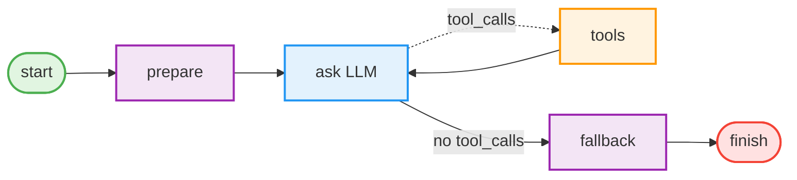
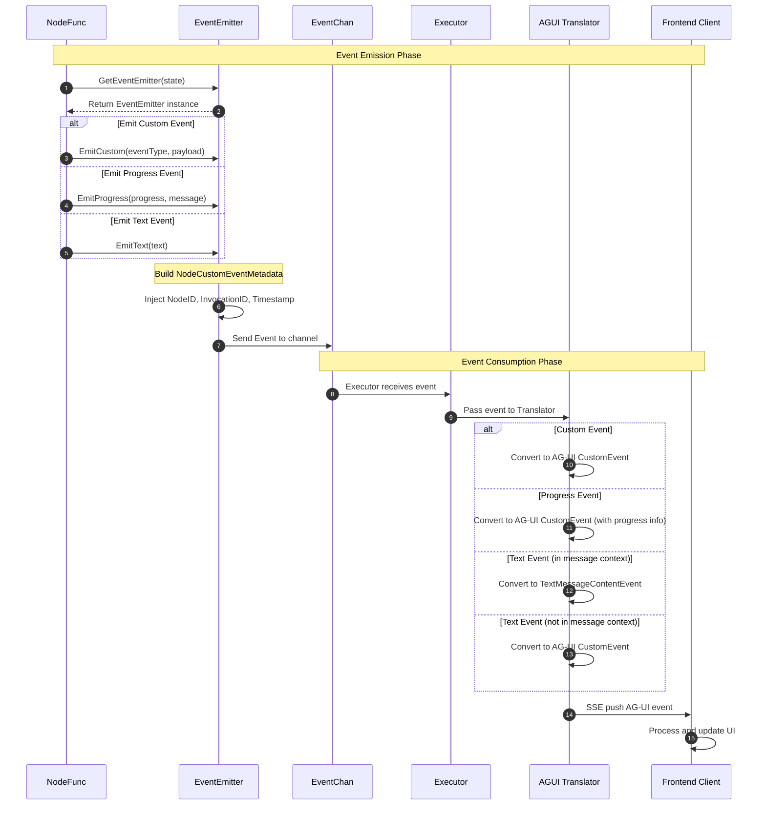
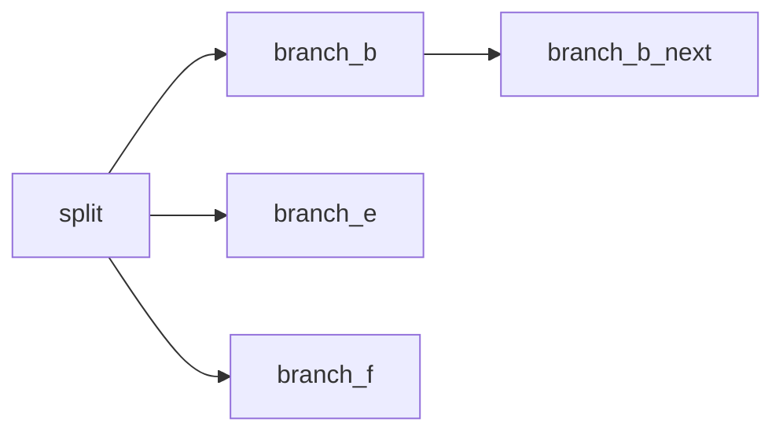
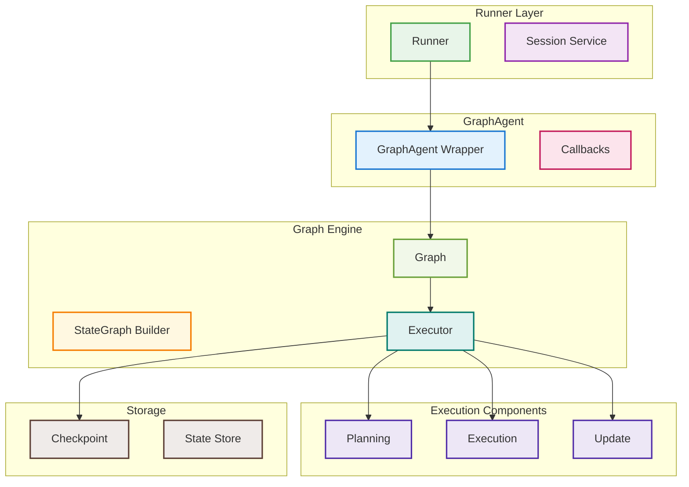
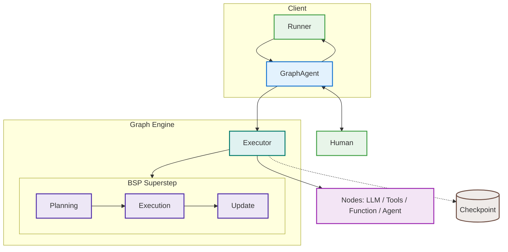
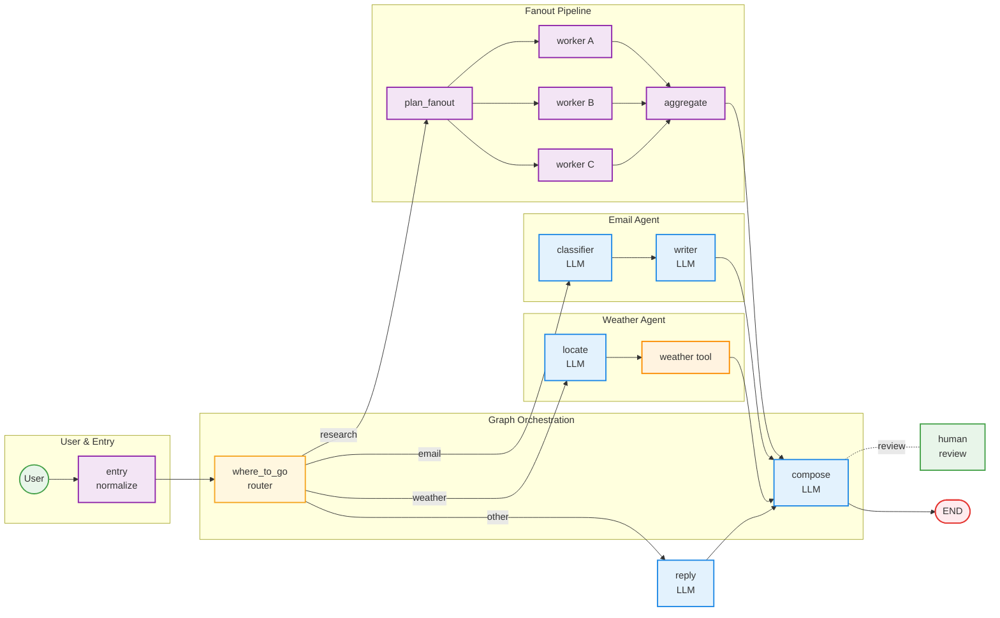

# Graph Package Guide

## Overview

Graph combines controllable workflow orchestration with extensible agent capabilities. It is suitable for:

- Type-safe state management and predictable routing.
- LLM decision making, tool-calling loops, and optional Human in the Loop (HITL).
- Reusable components that can run standalone or be composed as sub‑agents.

Highlights:

- Schema‑driven State and Reducers to avoid data races when concurrent branches write the same field.
- Deterministic parallelism with BSP style (Plan / Execute / Update).
- Built‑in node types wrap LLM, Tools, and Agent to reduce boilerplate.
- Streaming events, checkpoints, and interrupts for observability and recovery.
- Node‑level retry/backoff with exponential delay and jitter, plus executor‑level defaults and rich retry metadata in events.
- Node event emitter (EventEmitter) for emitting custom events, progress updates, and streaming text from within NodeFunc.

## Quick Start

### Minimal Workflow

Below is a classic "prepare → ask LLM → optionally call tools" loop using `graph.MessagesStateSchema()` (predefines `graph.StateKeyMessages`, `graph.StateKeyUserInput`, `graph.StateKeyLastResponse`, etc.).



The Graph package allows you to model complex AI workflows as directed graphs, where nodes represent processing steps and edges represent data flow and control flow. It is particularly suitable for building AI applications that require conditional routing, state management, and multi-step processing.

### Usage Pattern

The usage of the Graph package follows this pattern:

1. **Create Graph**: Use `StateGraph` builder to define workflow structure
2. **Create GraphAgent**: Wrap the compiled Graph as an Agent
3. **Create Runner**: Use Runner to manage sessions and execution environment
4. **Execute Workflow**: Execute workflow through Runner and handle results

This pattern provides:

- **Type Safety**: Ensures data consistency through state schema
- **Session Management**: Supports concurrent execution for multiple users and sessions
- **Event Stream**: Real-time monitoring of workflow execution progress
- **Error Handling**: Unified error handling and recovery mechanisms

### Agent Integration

GraphAgent implements the `agent.Agent` interface and can:

- **Act as Independent Agent**: Execute directly through Runner
- **Act as SubAgent**: Be used as a sub-agent by other Agents (such as LLMAgent)
- **Host SubAgents**: Register child agents via `graphagent.WithSubAgents` and invoke them through `AddAgentNode`

This design lets GraphAgent plug into other agents while orchestrating its own specialized sub-agents.

### Key Features

- **Type-safe state management**: Use Schema to define state structure, support custom Reducers
- **Conditional routing**: Dynamically select execution paths based on state
- **LLM node integration**: Built-in support for large language models
- **Tool nodes**: Support function calls and external tool integration
- **Agent nodes**: Delegate parts of the workflow to registered sub-agents
- **Streaming execution**: Support real-time event streams and progress tracking
- **Concurrency safety**: Thread-safe graph execution
- **Checkpoint-based Time Travel**: Navigate through execution history and restore previous states
- **Human-in-the-Loop (HITL)**: Support for interactive workflows with interrupt and resume capabilities
- **Atomic checkpointing**: Atomic storage of checkpoints with pending writes for reliable recovery
- **Checkpoint Lineage**: Track related checkpoints forming execution threads with parent-child relationships

## Core Concepts

### 1. Graph

A graph is the core structure of a workflow, consisting of nodes and edges:

```go
import (
    "trpc.group/trpc-go/trpc-agent-go/graph"
)

// Create state schema.
schema := graph.NewStateSchema()

// Create graph.
graph := graph.New(schema)
```

**Virtual Nodes**:

- `Start`: Virtual start node, automatically connected through `SetEntryPoint()`
- `End`: Virtual end node, automatically connected through `SetFinishPoint()`
- These nodes don't need to be explicitly created, the system automatically handles connections

### 2. Node

A node represents a processing step in the workflow:

```go
import (
    "context"

    "trpc.group/trpc-go/trpc-agent-go/graph"
)

// Node function signature.
type NodeFunc func(ctx context.Context, state graph.State) (any, error)

// Create node.
node := &graph.Node{
    ID:          "process_data",
    Name:        "Data Processing",
    Description: "Process input data",
    Function:    processDataFunc,
}
```

### 3. State

State is a data container passed between nodes:

```go
import (
    "trpc.group/trpc-go/trpc-agent-go/graph"
)

// State is a key-value pair mapping.
type State map[string]any

// User-defined state keys.
const (
    StateKeyInput         = "input"          // Input data.
    StateKeyResult        = "result"         // Processing result.
    StateKeyProcessedData = "processed_data" // Processed data.
    StateKeyStatus        = "status"         // Processing status.
)
```

**Built-in State Keys**:

The Graph package provides some built-in state keys, mainly for internal system communication:

**User-accessible Built-in Keys**:

- `StateKeyUserInput`: User input (one-shot, cleared after consumption, persisted by LLM nodes)
- `StateKeyOneShotMessages`: One-shot messages (complete override for current round, cleared after consumption)
- `StateKeyLastResponse`: Last response (used to set final output, Executor reads this value as result)
- `StateKeyLastToolResponse`: Last tool output (JSON string, set by Tools nodes)
- `StateKeyLastResponseID`: Last response identifier (ID) (set by LLM nodes; may
  be empty when `StateKeyLastResponse` is produced by a non-model node)
- `StateKeyMessages`: Message history (durable, supports append + MessageOp patch operations)
- `StateKeyNodeResponses`: Per-node outputs map. Key is node ID, value is the
  node's final output. For LLM and Agent nodes this is the final textual
  response; for Tools nodes this is a JSON array string of tool outputs (each
  item contains `tool_id`, `tool_name`, and `output`).
- `StateKeyMetadata`: Metadata (general metadata storage available to users)

**System Internal Keys** (users should not use directly):

- `StateKeySession`: Session information (automatically set by GraphAgent)
- `StateKeyExecContext`: Execution context (automatically set by Executor)
- `StateKeyToolCallbacks`: Tool callbacks (automatically set by Executor)
- `StateKeyModelCallbacks`: Model callbacks (automatically set by Executor)

Users should use custom state keys to store business data, and only use user-accessible built-in state keys when necessary.

### 4. State Schema

State schema defines the structure and behavior of state:

```go
import (
    "reflect"

    "trpc.group/trpc-go/trpc-agent-go/graph"
)

// Create state schema.
schema := graph.NewStateSchema()

// Add field definitions.
schema.AddField("counter", graph.StateField{
    Type:    reflect.TypeOf(0),
    Reducer: graph.DefaultReducer,
    Default: func() any { return 0 },
})
```

## Usage Guide

### Node I/O Conventions

Nodes communicate exclusively through the shared state. Each node returns a state delta which is merged into the graph state using the schema's reducers. Downstream nodes read whatever upstream nodes wrote.

- Common built‑in keys (user‑facing)

  - `user_input`: One‑shot input for the next LLM/Agent node. Cleared after consumption.
  - `one_shot_messages`: Full message override for the next LLM call. Cleared after consumption.
  - `one_shot_messages_by_node`: Targeted one‑shot override for a specific
    node ID (map[nodeID][]Message). Cleared per entry after consumption.
  - `messages`: Durable conversation history (LLM/Tools append here). Supports MessageOp patches.
  - `last_response`: The last textual assistant response.
  - `last_response_id`: The identifier (ID) of the last model response that
    produced `last_response` (may be empty when `last_response` is set by a
    non-model node).
  - `node_responses`: Map[nodeID]any — per‑node final textual response. Use `last_response` for the most recent.

- Function node

  - Input: the entire state
  - Output: return a `graph.State` delta with custom keys (declare them in the schema), e.g. `{"parsed_time": "..."}`

- LLM node

  - Input priority: `one_shot_messages_by_node[<node_id>]` →
    `one_shot_messages` → `user_input` → `messages`
  - Output:
    - Appends assistant message to `messages`
    - Sets `last_response`
    - Sets `last_response_id`
    - Sets `node_responses[<llm_node_id>]`

- Tools node

  - Input: scans `messages` for the latest assistant message with `tool_calls`
  - Output: appends tool responses to `messages`

- Agent node (sub‑agent)
  - Input: state is injected into the sub‑agent's `Invocation.RunOptions.RuntimeState`.
    - Model/Tool callbacks can access it via `agent.InvocationFromContext(ctx)`.
  - Output on finish:
    - Sets `last_response`
    - Sets `node_responses[<agent_node_id>]`
    - Clears `user_input`

Recommended patterns

- Add your own keys in the schema (e.g., `parsed_time`, `final_payload`) and write/read them in function nodes.
- To feed structured hints into an LLM node, write `one_shot_messages` in the
  previous node (e.g., prepend a system message with parsed context).
- Parallel branches: avoid writing `one_shot_messages` from multiple branches.
  Prefer `one_shot_messages_by_node` so each LLM node consumes only its own
  one‑shot input.
- To consume an upstream node's text, read `last_response` immediately
  downstream or fetch from `node_responses[that_node_id]` later.
- If the downstream node is an Agent node and you want it to consume an
  upstream node's output as its input message, you must write it back into
  `user_input` (for example, use `WithSubgraphInputFromLastResponse()` or a
  pre‑node callback).

One-shot messages scoped by node ID:

```go
import (
    "context"

    "trpc.group/trpc-go/trpc-agent-go/graph"
    "trpc.group/trpc-go/trpc-agent-go/model"
)

const (
    llm1NodeID = "llm1"
    llm2NodeID = "llm2"
)

func prepForLLM1(ctx context.Context, state graph.State) (any, error) {
    msgs := []model.Message{
        model.NewUserMessage("question for llm1"),
    }
    return graph.SetOneShotMessagesForNode(llm1NodeID, msgs), nil
}

func prepForLLM2(ctx context.Context, state graph.State) (any, error) {
    msgs := []model.Message{
        model.NewUserMessage("question for llm2"),
    }
    return graph.SetOneShotMessagesForNode(llm2NodeID, msgs), nil
}
```

Preparing one-shot inputs for multiple nodes in a single upstream node:

In Go, a `map` assignment overwrites by key. Since
`SetOneShotMessagesForNode(...)` writes the same top-level key
(`one_shot_messages_by_node`) every time, you should avoid calling it multiple
times and then “merging” the returned `graph.State` values with plain
`result[k] = v` assignments (the last write wins).

Instead, build one `map[nodeID][]model.Message` and write it once:

```go
func preprocess(ctx context.Context, state graph.State) (any, error) {
    byNode := map[string][]model.Message{
        llm1NodeID: {
            model.NewSystemMessage("You are llm1."),
            model.NewUserMessage("question for llm1"),
        },
        llm2NodeID: {
            model.NewSystemMessage("You are llm2."),
            model.NewUserMessage("question for llm2"),
        },
    }
    return graph.SetOneShotMessagesByNode(byNode), nil
}
```

Alternative (no helpers): write a raw state delta map (handy if you also need
to update other keys in the same node):

```go
func preprocess(ctx context.Context, state graph.State) (any, error) {
    // byNode := ...
    return graph.State{
        graph.StateKeyOneShotMessagesByNode: byNode,
    }, nil
}
```

Notes:

- `llm1NodeID` / `llm2NodeID` must match the IDs you pass to `AddLLMNode`.
- Each LLM node consumes `one_shot_messages_by_node[its_id]` once, and clears
  only its own entry.

See examples:

- `examples/graph/io_conventions` — Function + LLM + Agent I/O
- `examples/graph/io_conventions_tools` — Adds a Tools node path and shows how to capture tool JSON
- `examples/graph/oneshot_by_node` — One-shot inputs scoped by LLM node ID
- `examples/graph/oneshot_by_node_preprocess` — One upstream node prepares one-shot inputs for multiple LLM nodes
- `examples/graph/retry` — Node-level retry/backoff demonstration

#### Constant references (import and keys)

- Import: `import "trpc.group/trpc-go/trpc-agent-go/graph"`
- Defined in: `graph/state.go`

- User‑facing keys

  - `user_input` → `graph.StateKeyUserInput`
  - `one_shot_messages` → `graph.StateKeyOneShotMessages`
  - `one_shot_messages_by_node` → `graph.StateKeyOneShotMessagesByNode`
  - `messages` → `graph.StateKeyMessages`
  - `last_response` → `graph.StateKeyLastResponse`
  - `last_response_id` → `graph.StateKeyLastResponseID`
  - `node_responses` → `graph.StateKeyNodeResponses`

- One-shot helpers

  - `SetOneShotMessagesForNode(nodeID, msgs)` → per-node one-shot update
  - `SetOneShotMessagesByNode(byNode)` → multi-node one-shot update
  - `ClearOneShotMessagesForNode(nodeID)` → clear one node entry
  - `ClearOneShotMessagesByNode()` → clear the entire map
  - `GetOneShotMessagesForNode(state, nodeID)` → read one node entry

- Other useful keys
  - `session` → `graph.StateKeySession`
  - `metadata` → `graph.StateKeyMetadata`
  - `current_node_id` → `graph.StateKeyCurrentNodeID`
  - `exec_context` → `graph.StateKeyExecContext`
  - `tool_callbacks` → `graph.StateKeyToolCallbacks`
  - `model_callbacks` → `graph.StateKeyModelCallbacks`
  - `agent_callbacks` → `graph.StateKeyAgentCallbacks`
  - `parent_agent` → `graph.StateKeyParentAgent`

Snippet:

```go
import (
    "context"
    "trpc.group/trpc-go/trpc-agent-go/graph"
)

func myNode(ctx context.Context, state graph.State) (any, error) {
    last, _ := state[graph.StateKeyLastResponse].(string)
    return graph.State{"my_key": last}, nil
}
```

#### Event metadata keys (StateDelta)

- Import: `import "trpc.group/trpc-go/trpc-agent-go/graph"`
- Defined in: `graph/events.go`

- Model metadata: `_model_metadata` → `graph.MetadataKeyModel` (struct `graph.ModelExecutionMetadata`)
- Tool metadata: `_tool_metadata` → `graph.MetadataKeyTool` (struct `graph.ToolExecutionMetadata`)
- Node metadata: `_node_metadata` → `graph.MetadataKeyNode` (struct `graph.NodeExecutionMetadata`). Includes retry info: `Attempt`, `MaxAttempts`, `NextDelay`, `Retrying` and timing fields.

Snippet:

```go
if b, ok := event.StateDelta[graph.MetadataKeyModel]; ok {
    var md graph.ModelExecutionMetadata
    _ = json.Unmarshal(b, &md)
}
```

#### Node Event Emitter (EventEmitter)

During NodeFunc execution, nodes can proactively emit custom events to the outside through `EventEmitter`, for real-time delivery of progress, intermediate results, or custom business data.

**Getting EventEmitter**

```go
func myNode(ctx context.Context, state graph.State) (any, error) {
    // Get EventEmitter from State
    emitter := graph.GetEventEmitterWithContext(ctx, state)
    // Or use a custom context
    // emitter := graph.GetEventEmitter(state)
    
    // Use emitter to emit events...
    return state, nil
}
```

**EventEmitter Interface**

```go
type EventEmitter interface {
    // Emit sends any event
    Emit(evt *event.Event) error
    // EmitCustom emits a custom event
    EmitCustom(eventType string, payload any) error
    // EmitProgress emits a progress event (progress: 0-100)
    EmitProgress(progress float64, message string) error
    // EmitText emits a streaming text event
    EmitText(text string) error
    // Context returns the associated context
    Context() context.Context
}
```

**Usage Examples**

```go
func dataProcessNode(ctx context.Context, state graph.State) (any, error) {
    emitter := graph.GetEventEmitter(state)
    
    // 1. Emit custom event
    emitter.EmitCustom("data.loaded", map[string]any{
        "recordCount": 1000,
        "source":      "database",
    })
    
    // 2. Emit progress events
    total := 100
    for i := 0; i < total; i++ {
        processItem(i)
        progress := float64(i+1) / float64(total) * 100
        emitter.EmitProgress(progress, fmt.Sprintf("Processing %d/%d", i+1, total))
    }
    
    // 3. Emit streaming text
    emitter.EmitText("Processing complete.\n")
    emitter.EmitText("Results: 100 items processed successfully.")
    
    return state, nil
}
```

**Event Flow Diagram**



**AGUI Event Conversion**

When using AGUI Server, events emitted by nodes are automatically converted to AG-UI protocol events:

| Node Event Type | AG-UI Event Type | Description |
|-----------------|------------------|-------------|
| Custom | CustomEvent | Custom event, payload in `value` field |
| Progress | CustomEvent | Progress event with `progress` and `message` |
| Text (in message context) | TextMessageContentEvent | Streaming text appended to current message |
| Text (not in message context) | CustomEvent | Contains `nodeId` and `content` fields |

**Notes**

- **Thread Safety**: EventEmitter is thread-safe and can be used in concurrent environments
- **Graceful Degradation**: If State has no valid ExecutionContext or EventChan, `GetEventEmitter` returns a no-op emitter that silently succeeds for all operations
- **Error Handling**: Event emission failures do not interrupt node execution; it's recommended to only log warnings
- **Custom Event Metadata**: `_node_custom_metadata` → `graph.MetadataKeyNodeCustom` (struct `graph.NodeCustomEventMetadata`)

### 1. Creating GraphAgent and Runner

Users mainly use the Graph package by creating GraphAgent and then using it through Runner. This is the recommended usage pattern:

```go
package main

import (
    "context"
    "fmt"
    "time"

    "trpc.group/trpc-go/trpc-agent-go/agent/graphagent"
    "trpc.group/trpc-go/trpc-agent-go/graph"
    "trpc.group/trpc-go/trpc-agent-go/model"
    "trpc.group/trpc-go/trpc-agent-go/runner"
    "trpc.group/trpc-go/trpc-agent-go/session/inmemory"
)

func main() {
    // 1. Create state schema
    schema := graph.MessagesStateSchema()

    // 2. Create state graph builder
    stateGraph := graph.NewStateGraph(schema)

    // 3. Add nodes
    stateGraph.AddNode("start", startNodeFunc).
        AddNode("process", processNodeFunc)

    // 4. Set edges
    stateGraph.AddEdge("start", "process")

    // 5. Set entry point and finish point
    // SetEntryPoint automatically creates an edge from the virtual Start node to the "start" node
    // SetFinishPoint automatically creates an edge from the "process" node to the virtual End node
    stateGraph.SetEntryPoint("start").
        SetFinishPoint("process")

    // 6. Compile the graph
    compiledGraph, err := stateGraph.Compile()
    if err != nil {
        panic(err)
    }

    // 7. Create GraphAgent
    graphAgent, err := graphagent.New("simple-workflow", compiledGraph,
        graphagent.WithDescription("Simple workflow example"),
        graphagent.WithInitialState(graph.State{}),
        // Set message filter modes for the model. Messages passed to the model must satisfy both WithMessageTimelineFilterMode and WithMessageBranchFilterMode conditions
        // Timeline filter mode
        // Default value: graphagent.TimelineFilterAll
        // Options:
        //  - graphagent.TimelineFilterAll: Include historical messages and messages generated in the current request
        //  - graphagent.TimelineFilterCurrentRequest: Only include messages generated in the current request
        //  - graphagent.TimelineFilterCurrentInvocation: Only include messages generated in the current invocation context
        graphagent.WithMessageTimelineFilterMode(graphagent.TimelineFilterAll),
        // Branch filter mode
        // Default value: graphagent.BranchFilterModePrefix
        // Options:
        //  - graphagent.BranchFilterModeAll: Include messages from all agents. Set this value when the current agent needs to synchronize all valid content messages generated by all agents to the model during interaction
        //  - graphagent.BranchFilterModePrefix: Filter messages by prefix matching Event.FilterKey with Invocation.eventFilterKey. Set this value when you want to pass messages generated by the current agent and related upstream/downstream agents to the model
        //  - graphagent.BranchFilterModeExact: Filter messages by Event.FilterKey == Invocation.eventFilterKey. Set this value when the current agent only needs to use messages generated by itself during model interaction
        graphagent.WithMessageBranchFilterMode(graphagent.BranchFilterModeAll),
    )
    if err != nil {
        panic(err)
    }

    // 8. Create session service
    sessionService := inmemory.NewSessionService()

    // 9. Create Runner
    appRunner := runner.NewRunner(
        "simple-app",
        graphAgent,
        runner.WithSessionService(sessionService),
    )

    // 10. Execute workflow
    ctx := context.Background()
    userID := "user"
    sessionID := fmt.Sprintf("session-%d", time.Now().Unix())

    // Create user message (Runner will automatically put the message content into StateKeyUserInput)
    message := model.NewUserMessage("Hello World")

    // Execute through Runner
    eventChan, err := appRunner.Run(ctx, userID, sessionID, message)
    if err != nil {
        panic(err)
    }

    // Handle event stream
    for event := range eventChan {
        if event.Error != nil {
            fmt.Printf("Error: %s\n", event.Error.Message)
            continue
        }

        if len(event.Response.Choices) > 0 {
            choice := event.Response.Choices[0]
            if choice.Delta.Content != "" {
                fmt.Print(choice.Delta.Content)
            }
        }

        // Recommended: Use Runner completion event as a signal for "workflow end"
        if event.IsRunnerCompletion() {
            break
        }
    }
}

const (
    stateKeyProcessedData = "processed_data"
    stateKeyResult        = "result"
)

// Start node function implementation
func startNodeFunc(ctx context.Context, state graph.State) (any, error) {
    // Get user input from built-in StateKeyUserInput (automatically set by Runner)
    input := state[graph.StateKeyUserInput].(string)
    return graph.State{
        stateKeyProcessedData: fmt.Sprintf("Processed: %s", input),
    }, nil
}

// Process node function implementation
func processNodeFunc(ctx context.Context, state graph.State) (any, error) {
    processed := state[stateKeyProcessedData].(string)
    result := fmt.Sprintf("Result: %s", processed)
    return graph.State{
        stateKeyResult:             result,
        graph.StateKeyLastResponse: fmt.Sprintf("Final result: %s", result),
    }, nil
}
```

### 2. Using LLM Nodes

LLM nodes implement a fixed three-stage input rule without extra configuration
(except an optional input key override):

1. OneShot first:
   - If `one_shot_messages_by_node[<node_id>]` exists, use it as the input for
     this round.
   - Otherwise, if `one_shot_messages` exists, use it as the input for this
     round.
2. UserInput next: Otherwise, if the node's user input key exists, persist once
   to history (default key: `user_input`).
3. History default: Otherwise, use durable `messages` as input.

```go
// Create LLM model.
model := openai.New("gpt-4")

// Add LLM node.
stateGraph.AddLLMNode("analyze", model,
    `You are a document analysis expert. Analyze the provided document and:
1. Classify document type and complexity
2. Extract key themes
3. Evaluate content quality
Please provide structured analysis results.`,
    nil) // Tool mapping.
```

Important notes:

- System prompt is only used for this round and is not persisted to state.
- One-shot keys (`user_input` / `one_shot_messages` / `one_shot_messages_by_node`)
  are automatically cleared after successful execution.
- You can override the user input key per LLM/Agent node via
  `graph.WithUserInputKey("my_input")`. This key is treated as one-shot input
  and is cleared after the node runs.
- Parallel branches: if multiple branches need different one-shot inputs for
  different LLM nodes in the same step, write `one_shot_messages_by_node`
  instead of `one_shot_messages`. If one upstream node prepares inputs for
  multiple LLM nodes, prefer `graph.SetOneShotMessagesByNode(...)` to write all
  entries at once.
- All state updates are atomic.
- GraphAgent/Runner only sets `user_input` and no longer pre-populates `messages` with a user message. This allows any pre-LLM node to modify `user_input` and have it take effect in the same round.
- When Graph runs sub-agents, it preserves the parent run's `RequestID`
  (request identifier) so the current user input is included exactly once,
  even when it already exists in session history.

#### Event emission (streaming vs final)

When the Large Language Model (LLM) is called with streaming enabled, a single
model call can produce multiple events:

- Streaming chunks: incremental text in `choice.Delta.Content`
- A final message: full text in `choice.Message.Content`

In graph workflows there are also two different "done" concepts:

- Model done: a single model call finishes (typically `Response.Done=true`)
- Workflow done: the whole graph run ends (use `event.IsRunnerCompletion()`)

By default, graph LLM nodes only emit the streaming chunks. They do not emit
the final `Done=true` assistant message event. This keeps intermediate node
outputs from being treated as normal assistant replies (for example, being
persisted into the Session by Runner).

If you want graph LLM nodes to also emit the final `Done=true` assistant
message events, enable `agent.WithGraphEmitFinalModelResponses(true)` when
running via Runner. See `runner.md` for details and examples.

Tip: if you are using Runner and you mainly care about streaming Large Language
Model (LLM) messages, you can enable `agent.WithStreamMode(...)` (see
"Event Monitoring"). When `agent.StreamModeMessages` is selected, graph LLM
nodes enable final model responses automatically for that run.

Tip: parsing JSON / structured output from streaming

- Streaming chunks (`choice.Delta.Content`) are incremental and are not
  guaranteed to form valid JSON until the end of the model call.
- If you need to parse JSON (or any structured text), do not `json.Unmarshal`
  per chunk. Buffer and parse once you have the full string.

Common approaches:

- **Inside the graph**: parse in a downstream node from
  `node_responses[nodeID]` (or `last_response` in strictly serial flows),
  because those values are only set after the node finishes.
- **Outside the graph** (event consumer): accumulate `Delta.Content` and parse
  when you see a non-partial response that carries `choice.Message.Content`
  (or when the workflow finishes).

#### Three input paradigms

- OneShot (`StateKeyOneShotMessages`):

  - When present, only the provided `[]model.Message` is used for this round, typically including a full system prompt and user prompt. Automatically cleared afterwards.
  - Use case: a dedicated pre-node constructs the full prompt and must fully override input.
  - Parallel branches: when multiple branches prepare one-shot inputs for
    different LLM nodes, prefer `StateKeyOneShotMessagesByNode` to avoid
    clobbering a shared global key.
  - If a single node prepares one-shot inputs for multiple LLM nodes, use
    `graph.SetOneShotMessagesByNode(...)` to write them in one return value.

- UserInput (`StateKeyUserInput`):

  - When non-empty, the LLM node uses durable `messages` plus this round's user input to call the model. After the call, it writes the user input and assistant reply to `messages` using `MessageOp` (e.g., `AppendMessages`, `ReplaceLastUser`) atomically, and clears `user_input` to avoid repeated appends.
  - Use case: conversational flows where pre-nodes may adjust user input.
  - By default, the user input key is `StateKeyUserInput`. To read one-shot
    input from a different key, use `graph.WithUserInputKey(...)` on that node.
  - `WithUserInputKey` is a build-time node option. For per-run customization,
    keep the key stable and update the value in state (for example, in a
    pre-node callback).
  - Placeholder injection is **not** applied to user messages. If your UI/DSL
    lets users type placeholders inside UserInput (for example, `{key}`,
    `{{key}}`, or `input.output_parsed.xxx`), you must resolve them yourself
    (for example, in your DSL layer or a pre-node callback) before writing the
    final string into the state key.

- Messages only (just `StateKeyMessages`):
  - Common in tool-call loops. After the first round via `user_input`, routing to tools and back to LLM, since `user_input` is cleared, the LLM uses only `messages` (history). The tail is often a `tool` response, enabling the model to continue reasoning based on tool outputs.

#### Atomic updates with Reducer and MessageOp

The Graph package supports `MessageOp` patch operations (e.g., `ReplaceLastUser`,
`AppendMessages`) on message state via `MessageReducer` to achieve atomic merges. Benefits:

- Pre-LLM nodes can modify `user_input`. The LLM node returns a single state delta with the needed patch operations (replace last user message, append assistant message) for one-shot, race-free persistence.
- Backwards compatible with appending `[]Message`, while providing more expressive updates for complex cases.

Example: modify `user_input` in a pre-node before entering the LLM node.

```go
stateGraph.
    AddNode("prepare_input", func(ctx context.Context, s graph.State) (any, error) {
        cleaned := strings.TrimSpace(s[graph.StateKeyUserInput].(string))
        return graph.State{graph.StateKeyUserInput: cleaned}, nil
    }).
    AddLLMNode("ask", modelInstance,
        "You are a helpful assistant. Answer concisely.",
        nil).
    SetEntryPoint("prepare_input").
    SetFinishPoint("ask")
```

#### Using RemoveAllMessages to Clear Message History

When chaining multiple LLM nodes, `MessageReducer` accumulates messages. If each
LLM node requires an isolated message context (without inheriting the previous
node's conversation history), use `RemoveAllMessages` to clear previous messages:

```go
// In the prompt preparation node, clear messages before setting new UserInput.
func preparePromptNode(ctx context.Context, state graph.State) (any, error) {
    userMessage := buildUserMessage(...)
    return graph.State{
        // Key: Clear previous messages first to avoid accumulation.
        graph.StateKeyMessages:  graph.RemoveAllMessages{},
        graph.StateKeyUserInput: userMessage,
    }, nil
}
```

**Use cases**:

- Multiple independent LLM nodes within the same Graph, where each node doesn't
  need the previous node's conversation history
- Loop structures where each iteration requires a fresh message context
- Scenarios requiring complete message list reconstruction

**Notes**:

- `RemoveAllMessages{}` is a special `MessageOp` that `MessageReducer` recognizes
  and uses to clear the message list
- Must set `RemoveAllMessages{}` **before** setting `StateKeyUserInput`
- `WithSubgraphIsolatedMessages(true)` only works for `AddSubgraphNode` (agent
  nodes), not for `AddLLMNode`; use `RemoveAllMessages` to isolate messages
  between LLM nodes
- For agent nodes, `WithSubgraphIsolatedMessages(true)` disables seeding
  session history into the sub‑agent’s request. This also hides tool call
  results, so it breaks multi‑turn tool calling. Use it only for single‑turn
  sub‑agents; otherwise, isolate via sub‑agent message filtering (see “Agent
  nodes: isolation vs multi‑turn tool calls”).

### 3. GraphAgent Configuration Options

GraphAgent supports various configuration options:

```go
// Multiple options can be used when creating GraphAgent.
graphAgent, err := graphagent.New(
    "workflow-name",
    compiledGraph,
    graphagent.WithDescription("Workflow description"),
    graphagent.WithInitialState(graph.State{
        "initial_data": "Initial data",
    }),
    graphagent.WithChannelBufferSize(1024),            // Tune event buffer size
    graphagent.WithMaxConcurrency(8),                 // Cap parallel tasks
    graphagent.WithCheckpointSaver(memorySaver),       // Persist checkpoints if needed
    graphagent.WithSubAgents([]agent.Agent{subAgent}), // Register sub-agents by name
    graphagent.WithAddSessionSummary(true),            // Inject session summary as system message
    graphagent.WithMaxHistoryRuns(5),                  // Truncate history when summaries are off
    // Set the filter mode for messages passed to the model. The final messages passed to the model must satisfy both WithMessageTimelineFilterMode and WithMessageBranchFilterMode conditions.
    // Timeline dimension filter conditions
    // Default: graphagent.TimelineFilterAll
    // Optional values:
    //  - graphagent.TimelineFilterAll: Includes historical messages as well as messages generated in the current request
    //  - graphagent.TimelineFilterCurrentRequest: Only includes messages generated in the current request
    //  - graphagent.TimelineFilterCurrentInvocation: Only includes messages generated in the current invocation context
    graphagent.WithMessageTimelineFilterMode(graphagent.TimelineFilterAll),

    // Branch dimension filter conditions
    // Default: graphagent.BranchFilterModePrefix
    // Optional values:
    //  - graphagent.BranchFilterModeAll: Includes messages from all agents. Use this when the current agent interacts with the model and needs to synchronize all valid content messages generated by all agents to the model.
    //  - graphagent.BranchFilterModePrefix: Filters messages by prefix matching Event.FilterKey with Invocation.eventFilterKey. Use this when you want to pass messages generated by the current agent and related upstream/downstream agents to the model.
    //  - graphagent.BranchFilterModeExact: Filters messages where Event.FilterKey == Invocation.eventFilterKey. Use this when the current agent interacts with the model and only needs to use messages generated by the current agent.
    graphagent.WithMessageBranchFilterMode(graphagent.BranchFilterModeAll),
    // Reasoning content mode (for DeepSeek thinking mode)
    // Default: graphagent.ReasoningContentModeDiscardPreviousTurns
    // Options:
    //  - graphagent.ReasoningContentModeDiscardPreviousTurns: Discard reasoning_content
    //    from previous request turns (default, recommended).
    //  - graphagent.ReasoningContentModeKeepAll: Keep all reasoning_content in history.
    //  - graphagent.ReasoningContentModeDiscardAll: Discard all reasoning_content.
    graphagent.WithReasoningContentMode(graphagent.ReasoningContentModeDiscardPreviousTurns),
    graphagent.WithAgentCallbacks(&agent.Callbacks{
        // Agent-level callbacks.
    }),
    // Executor advanced configuration options, see "Executor Advanced Configuration" section below
    // graphagent.WithExecutorOptions(...),
)
```

> Model/tool callbacks are configured per node, e.g. `AddLLMNode(..., graph.WithModelCallbacks(...))`
> or `AddToolsNode(..., graph.WithToolCallbacks(...))`.
>
> **Callback Precedence**: When both node-level and state-level callbacks are present:
> - Node-configured callbacks (via `WithModelCallbacks`/`WithToolCallbacks`) take precedence.
> - State-level callbacks (via `StateKeyModelCallbacks`/`StateKeyToolCallbacks`) are used as a fallback.
> This allows graph-level configuration to override runtime state when needed.

Session summary notes:

- `WithAddSessionSummary(true)` takes effect only when `Session.Summaries` contains a summary for the invocation’s filter key. Summaries are typically produced by SessionService + SessionSummarizer, and Runner will auto‑enqueue summarization after persisting events.
- GraphAgent reads summaries only; it does not generate them. If you bypass Runner, call `sessionService.CreateSessionSummary` or `EnqueueSummaryJob` after appending events.
- Summary injection works only when `TimelineFilterMode` is `TimelineFilterAll`.

#### Summary Format Customization

By default, session summaries are formatted with context tags and a note about preferring current conversation information. You can customize the summary format using `WithSummaryFormatter` to better match your specific use cases or model requirements.

**Default Format:**

```
Here is a brief summary of your previous interactions:

<summary_of_previous_interactions>
[summary content]
</summary_of_previous_interactions>

Note: this information is from previous interactions and may be outdated. You should ALWAYS prefer information from this conversation over the past summary.
```

**Custom Format Example:**

```go
// Custom formatter with simplified format
ga := graphagent.New(
    "my-graph",
    graphagent.WithInitialState(initialState),
    graphagent.WithAddSessionSummary(true),
    graphagent.WithSummaryFormatter(func(summary string) string {
        return fmt.Sprintf("## Previous Context\n\n%s", summary)
    }),
)
```

**Use Cases:**

- **Simplified Format**: Reduce token usage by using concise headings and minimal context notes
- **Language Localization**: Translate context notes to target language (e.g., Chinese, Japanese)
- **Role-Specific Formatting**: Different formats for different agent roles
- **Model Optimization**: Tailor format for specific model preferences

**Important Notes:**

- The formatter function receives raw summary text from the session and returns the formatted string
- Custom formatters should ensure that the summary is clearly distinguishable from other messages
- The default format is designed to be compatible with most models and use cases
- When `WithAddSessionSummary(false)` is used, the formatter is never invoked

#### Executor Advanced Configuration

`WithExecutorOptions` allows you to pass executor options directly to configure the behavior of the underlying executor. This is useful for scenarios that require fine-grained control over executor behavior, such as:

- **Timeout Control**: Set appropriate timeout durations for long-running nodes (e.g., agent tool nodes)
- **Step Limits**: Limit the maximum number of steps in graph execution to prevent infinite loops
- **Retry Policies**: Configure default retry policies

**Usage Example:**

```go
graphAgent, err := graphagent.New("my-agent", compiledGraph,
	graphagent.WithDescription("Workflow description"),
	// Pass executor options directly
	graphagent.WithExecutorOptions(
		graph.WithMaxSteps(50),                          // max steps limit
		graph.WithStepTimeout(5*time.Minute),            // timeout per step
		graph.WithNodeTimeout(2*time.Minute),            // timeout per node
		graph.WithCheckpointSaveTimeout(30*time.Second), // checkpoint save timeout
		graph.WithDefaultRetryPolicy(                    // default retry policy
			graph.WithSimpleRetry(3),
		),
	),
)
```

**Notes:**

- Options passed via `WithExecutorOptions` are applied after mapped options (`ChannelBufferSize`, `MaxConcurrency`, `CheckpointSaver`), so they can override those settings if needed
- If `WithStepTimeout` is not set, `WithNodeTimeout` will not be automatically derived (defaults to no timeout)

#### Concurrency considerations

When using Graph + GraphAgent in a concurrent environment (for example, serving many requests from a single long‑lived process), keep the following in mind:

- CheckpointSaver and Cache implementations must be concurrency‑safe  
  The `CheckpointSaver` and `Cache` interfaces are intentionally storage‑agnostic. A single `Executor`/`GraphAgent` instance may call their methods from multiple goroutines when several invocations run in parallel. If you provide your own implementations, ensure:
  - All exported methods (`Get`/`GetTuple`/`List`/`Put`/`PutWrites`/`PutFull`/`DeleteLineage` for `CheckpointSaver`, and `Get`/`Set`/`Clear` for `Cache`) are safe for concurrent use.
  - Internal maps, connection pools, or in‑memory buffers are properly synchronized.

- NodeFunc, tools, and callbacks should treat state as per‑invocation, not global  
  Each node receives an isolated copy of graph state for the current task. This copy is safe to mutate inside the node, but it is not safe to:
  - Store references to that state (or its internal maps/slices) in global variables and modify them from other goroutines later.
  - Access `StateKeyExecContext` (`*graph.ExecutionContext`) and bypass its internal locks when reading/writing `execCtx.State` or `execCtx.pendingTasks`.
  If you need shared mutable state across nodes or invocations, protect it with your own synchronization (for example, `sync.Mutex` or `sync.RWMutex`) or use external services (such as databases or caches).

- Do not share a single *agent.Invocation across goroutines  
  The framework expects each `Run` call (GraphAgent, Runner, or other Agent types) to operate on its own `*agent.Invocation`. Reusing the same `*agent.Invocation` instance in multiple goroutines and calling `Run` concurrently can cause data races on fields like `Branch`, `RunOptions`, or callback state. Prefer:
  - Creating a fresh `*agent.Invocation` per request, or
  - Cloning from a parent invocation using `invocation.Clone(...)` when you need linkage.

- Parallel tools require tool implementations to be safe for concurrent use  
  Tools in a `Tools` node can be executed in parallel when `WithEnableParallelTools(true)` is used on that node:
  - The framework guarantees that the `tools` map is only read during execution.
  - It also guarantees that the shared graph state passed to tools is only read; updates are written back by nodes, not by tools.
  However, each `tool.Tool` implementation and its `tool.Callbacks` may be invoked from multiple goroutines at the same time. Make sure:
  - Tool implementations do not mutate shared global state without proper locking.
  - Any internal caches, HTTP clients, or client pools inside tools are safe for concurrent use.

These constraints are especially important in long‑running services where a single `Graph`/`Executor`/`GraphAgent` instance is reused for many invocations.

Once sub-agents are registered you can delegate within the graph via agent nodes:

```go
// Assume subAgent.Info().Name == "assistant"
stateGraph.AddAgentNode("assistant",
    graph.WithName("Delegate to assistant agent"),
    graph.WithDescription("Invoke the pre-registered assistant agent"),
)

// During execution the GraphAgent looks up a sub-agent with the same name and runs it
```

> The agent node uses its ID for the lookup, so keep `AddAgentNode("assistant")`
> aligned with `subAgent.Info().Name == "assistant"`.

#### Agent nodes: passing data to the next agent

An agent node does not automatically "pipe" its output into the next agent
node. Edges only control execution order; data flows through graph state.

By default, an agent node builds the child invocation message from
`state[graph.StateKeyUserInput]`. But `user_input` is **one‑shot**:
LLM/Agent nodes clear it after a successful run to avoid reusing the same input.
This is why a chain like `A (agent) → B (agent)` often looks like "A produced
output, but B got an empty input".

To make downstream agent nodes consume upstream outputs, explicitly map a state
field into `user_input` before the downstream agent runs:

```go
const (
    nodeA = "a"
    nodeB = "b"
)

sg.AddAgentNode(nodeA)
sg.AddAgentNode(nodeB, graph.WithSubgraphInputFromLastResponse())
sg.AddEdge(nodeA, nodeB)
```

Notes:

- `WithSubgraphInputFromLastResponse()` maps the **current** `last_response`
  into this agent node's `user_input` for this run, so `nodeB` consumes `nodeA`
  as input.
- If you need to pass a *specific* node's output (not the most recent), use a
  pre‑node callback and read from `node_responses[targetNodeID]`, then write it
  into `user_input`.

#### Agent nodes: combining original input with upstream output

Sometimes the downstream agent needs **both**:

- The upstream agent result (often `state[graph.StateKeyLastResponse]`), and
- The original user request for this run.

Because `user_input` is one‑shot and is cleared after LLM/Agent nodes, you
should **persist** the original user input under your own state key, then
compose the downstream `user_input` explicitly.

The simplest pattern is to add two function nodes:

1. Capture the initial `user_input` once.
2. Build the next `user_input` from `original_user_input + last_response`.

```go
const (
    keyOriginalUserInput = "original_user_input"

    nodeSaveInput = "save_input"
    nodeA         = "a"
    nodeCompose   = "compose_input"
    nodeB         = "b"
)

func saveOriginalInput(_ context.Context, s graph.State) (any, error) {
    input, _ := s[graph.StateKeyUserInput].(string)
    if input == "" {
        return graph.State{}, nil
    }
    return graph.State{keyOriginalUserInput: input}, nil
}

func composeNextInput(_ context.Context, s graph.State) (any, error) {
    orig, _ := s[keyOriginalUserInput].(string)
    last, _ := s[graph.StateKeyLastResponse].(string)

    // This becomes nodeB's Invocation.Message.Content.
    combined := orig + "\n\n" + last
    return graph.State{graph.StateKeyUserInput: combined}, nil
}

sg.AddNode(nodeSaveInput, saveOriginalInput)
sg.AddAgentNode(nodeA)
sg.AddNode(nodeCompose, composeNextInput)
sg.AddAgentNode(nodeB)

sg.AddEdge(nodeSaveInput, nodeA)
sg.AddEdge(nodeA, nodeCompose)
sg.AddEdge(nodeCompose, nodeB)
```

Important:

- Treat `graph.State` passed into function nodes as read‑only.
- Return a **delta** state update (a small `graph.State`) instead of returning
  or mutating the full state. Returning full state can accidentally overwrite
  internal keys (execution context, callbacks, session) and break the workflow.

#### Agent nodes: state mappers (advanced)

Agent nodes support two mappers to control what data crosses the parent/child
boundary:

- `WithSubgraphInputMapper`: project parent state → child runtime state
  (`Invocation.RunOptions.RuntimeState`).
- `WithSubgraphOutputMapper`: project child results → parent state updates.

Use cases:

- **Let the child read structured data from state** (without stuffing it into
  prompts): pass only selected keys to the child via `WithSubgraphInputMapper`.
  Runnable example: `examples/graph/subagent_runtime_state`.
- **Copy structured outputs back to the parent graph**: when the child is a
  GraphAgent, `SubgraphResult.FinalState` contains the child's final state
  snapshot and can be mapped into parent keys. Runnable example:
  `examples/graph/agent_state_handoff`.
- **Store the child LLM's final text under your own keys**: `SubgraphResult`
  always includes `LastResponse`, so output mappers work for both GraphAgent and
  non-graph agents.

#### Agent nodes: isolation vs multi‑turn tool calls

Tool calling is usually multi‑turn within a single run: the model returns a
tool call, the framework executes the tool, then the next model request must
include the tool result (a `role=tool` message) so the model can continue.

`WithSubgraphIsolatedMessages(true)` is a **strong isolation switch**: it
prevents the sub‑agent from reading any session history when building the next
model request (internally it sets `include_contents="none"` for the sub‑agent).
This makes the sub‑agent “black‑box” (it only sees the current `user_input`),
but it also means the sub‑agent will not see tool results, so it cannot do
multi‑turn tool calling.

If a sub‑agent needs tools **and** needs to continue after tools return:

- Do **not** enable `WithSubgraphIsolatedMessages(true)` on that agent node.
- Instead, keep session seeding enabled and isolate the sub‑agent by filtering
  its message history to only its own invocation. For `LLMAgent`, use:
  `llmagent.WithMessageFilterMode(llmagent.IsolatedInvocation)`.

Symptoms of the misconfiguration:

- The second model request looks the same as the first one (tool results never
  appear in the prompt).
- The agent repeats the first tool call or loops because it never “sees” the
  tool output.

#### Agent nodes: checkpoints and nested interrupts

If a sub-agent is a GraphAgent (a graph-based agent) and checkpointing is
enabled (via a `CheckpointSaver`), the child graph also needs its own checkpoint
namespace. Otherwise, the child graph can accidentally resume from a checkpoint
that belongs to the parent graph.

Default behavior for agent nodes that invoke a GraphAgent:

- The child GraphAgent runs under the child checkpoint namespace (the sub-agent
  name), even though the runtime state is cloned from the parent.
- The parent checkpoint identifier (ID) is not forwarded to the child unless
  you explicitly set it via a subgraph input mapper.

Nested Human-in-the-Loop (HITL) interrupt/resume:

- If the child GraphAgent calls `graph.Interrupt`, the parent graph also
  interrupts and checkpoints.
- Resume from the parent checkpoint as usual; the agent node resumes the child
  checkpoint automatically.

Runnable example: `examples/graph/nested_interrupt`.

### 4. Conditional Routing

```go
// Define condition function.
func complexityCondition(ctx context.Context, state graph.State) (string, error) {
    complexity := state["complexity"].(string)
    if complexity == "simple" {
        return "simple_process", nil
    }
    return "complex_process", nil
}

// Add conditional edges.
stateGraph.AddConditionalEdges("analyze", complexityCondition, map[string]string{
    "simple_process":  "simple_node",
    "complex_process": "complex_node",
})
```

### 4.1 Named Ends (Per‑node Ends)

When a node produces business outcomes (e.g., `approve`/`reject`/`manual_review`) and you want to route by those semantic labels, declare node‑local Named Ends (Ends).

Why this helps:

- Central, declarative mapping from labels to concrete targets at the node site.
- Compile‑time validation: `Compile()` verifies every end target exists (or is the special `graph.End`).
- Unified routing: reused by both `Command.GoTo` and conditional edges.
- Decoupling: nodes express outcomes in business terms; the mapping ties outcomes to graph structure.

API:

```go
// Declare Ends on a node (label -> concrete target)
sg.AddNode("decision", decideNode,
    graph.WithEndsMap(map[string]string{
        "approve": "approved",
        "reject":  "rejected",
        // You may map a label to the terminal End
        // "drop":  graph.End,
    }),
)

// Short form: label equals the target node ID
sg.AddNode("router", routerNode, graph.WithEnds("nodeB", "nodeC"))
```

Command‑style routing (Command.GoTo):

```go
func decideNode(ctx context.Context, s graph.State) (any, error) {
    switch s["decision"].(string) {
    case "approve":
        return &graph.Command{GoTo: "approve"}, nil // label
    case "reject":
        return &graph.Command{GoTo: "reject"}, nil
    default:
        return &graph.Command{GoTo: "reject"}, nil
    }
}
```

Conditional edges can reuse Ends: when `AddConditionalEdges(from, condition, pathMap)` receives a `nil` `pathMap` or no match is found, the executor tries the node's Ends; if still no match, the return string is treated as a concrete node ID.

Resolution precedence:

1. Explicit mapping in the conditional edge's `pathMap`.
2. The node's Ends mapping (label → concrete target).
3. Treat the return string as a node ID.

Compile‑time checks:

- `WithEndsMap/WithEnds` targets are validated in `Compile()`.
- Targets must exist in the graph or be the special constant `graph.End`.

Notes:

- Use the constant `graph.End` to terminate; do not use the string "END".
- With `Command.GoTo`, you don't need to add a static `AddEdge(from, to)` for the target; ensure the target exists and set `SetFinishPoint(target)` if it should end the graph.

Runnable example: `examples/graph/multiends`.

### 4.2 Multi‑conditional Fan‑out

Sometimes a single decision needs to spawn multiple branches in parallel
for independent processing (e.g., route to both summarization and tagging).

API:

```go
// Return multiple branch keys, each resolved to a concrete target.
sg.AddMultiConditionalEdges(
    "router",
    func(ctx context.Context, s graph.State) ([]string, error) {
        // Decide multiple paths at once
        return []string{"toA", "toB"}, nil
    },
    map[string]string{
        "toA": "A", // branch key -> target node
        "toB": "B",
    },
)
```

Notes:

- Like other routing, targets become runnable in the **next** BSP superstep
  (after the router node finishes). This can affect latency; see “BSP superstep
  barrier” below.
- Results are de‑duplicated before triggering; repeated keys do not trigger a
  target more than once in the same step.
- Resolution precedence for each branch key mirrors single‑conditional routing:
  1. explicit `pathMap`; 2) node's Ends; 3) treat as node ID.
- Visualization: when `pathMap` is omitted, DOT falls back to the node's Ends
  mapping to render dashed conditional edges.

### 5. Tool Node Integration

```go
// Create tools.
tools := map[string]tool.Tool{
    "calculator": calculatorTool,
    "search":     searchTool,
}

// Add tool node.
stateGraph.AddToolsNode("tools", tools)

// Add conditional routing from LLM to tools.
stateGraph.AddToolsConditionalEdges("llm_node", "tools", "fallback_node")
```

Enable parallel tool execution for the Tools node (aligns with LLMAgent's option):

```go
// Tools node runs tool calls concurrently when multiple tool_calls are present.
stateGraph.AddToolsNode(
    "tools",
    tools,
    graph.WithEnableParallelTools(true), // optional; default is serial
)
```

Tool-call pairing and second entry into LLM:

- Scan `messages` backward from the tail to find the most recent `assistant(tool_calls)`; stop at `user` to ensure correct pairing.
- When returning from tools to the LLM node, since `user_input` is cleared, the LLM follows the "Messages only" branch and continues based on the tool response in history.

#### Placeholder Variables in LLM Instructions

LLM nodes support placeholder injection in their `instruction` string (same rules as LLMAgent). Both native `{key}` and Mustache `{{key}}` syntaxes are accepted (Mustache is normalized to the native form automatically):

- `{key}` / `{{key}}` → Replaced with the string value corresponding to the key `key` in the session state (write via `sess.SetState("key", ...)` or SessionService).
- `{key?}` / `{{key?}}` → optional; missing values become empty
- `{user:subkey}`, `{app:subkey}`, `{temp:subkey}` (and their Mustache forms) → access user/app/temp scopes (session services merge app/user state into session with these prefixes)
- `{invocation:subkey}` / `{{invocation:subkey}}` → replaced with `invocation.state["subkey"]` (set via `invocation.SetState("subkey", v)`)

Notes:

- GraphAgent writes the current `*session.Session` into graph state under `StateKeySession`; the LLM node reads values from there
- `{invocation:*}` values are read from the current `*agent.Invocation` for this run
- Unprefixed keys (e.g., `research_topics`) must be present directly in `session.State`
- Scope: placeholders are expanded only in the LLM node `instruction`
  (the system message). They are **not** expanded in UserInput or other user
  messages.
- Limits: placeholder names are restricted to `key` or `prefix:key` (where
  `prefix` is one of `user`, `app`, `temp`, `invocation`). Nested paths like
  `{input.output_parsed.xxx}` are not supported; flatten the value into a key
  (for example, `temp:output_parsed_xxx`) in your DSL/callback, then reference
  it as `{temp:output_parsed_xxx}`.
- Mustache support is a compatibility layer only (`{{key}}` → `{key}`) and it
  only triggers for valid placeholder names; full Mustache features (sections,
  loops, helpers) are not supported.

Example:

```go
mdl := openai.New(modelName)
stateGraph.AddLLMNode(
  "research",
  mdl,
  "You are a research assistant. Focus: {research_topics}. User: {user:topics?}. App: {app:banner?}.",
  nil,
)
```

See the runnable example: `examples/graph/placeholder`.

Injecting retrieval output and user input

- Upstream nodes can place temporary values into the session's `temp:`
  namespace so the LLM instruction can read them with placeholders.
- Pattern:

```go
// In a node before the LLM node
sg.AddNode("retrieve", func(ctx context.Context, s graph.State) (any, error) {
    // Suppose you computed `retrieved` and want to include current user input.
    retrieved := "• doc A...\n• doc B..."
    var input string
    if v, ok := s[graph.StateKeyUserInput].(string); ok { input = v }
    if sess, _ := s[graph.StateKeySession].(*session.Session); sess != nil {
        sess.SetState(session.StateTempPrefix+"retrieved_context", []byte(retrieved))
        sess.SetState(session.StateTempPrefix+"user_input", []byte(input))
    }
    return graph.State{}, nil
})

// LLM node instruction can reference {temp:retrieved_context} and {temp:user_input}
sg.AddLLMNode("answer", mdl,
    "Use context to answer.\n\nContext:\n{temp:retrieved_context}\n\nQuestion: {temp:user_input}",
    nil)
```

Example: `examples/graph/retrieval_placeholder`.

Best practices for placeholders and session state

- Session-scoped vs persistent: write temporary values used to build
  prompts to `temp:*` on session state (often overwritten each turn via
  `sess.SetState`). Persistent configuration should go through
  `SessionService` with `user:*`/`app:*`.
- Why `SetState` is recommended: LLM nodes expand placeholders from the session object present in graph state; using `sess.SetState` avoids unsafe concurrent map access.
- Service guardrails: the in‑memory service intentionally disallows writing `temp:*` (and `app:*` via user updater); see [session/inmemory/service.go](https://github.com/trpc-group/trpc-agent-go/blob/main/session/inmemory/service.go).
- Concurrency: when multiple branches run in parallel, avoid multiple nodes mutating the same `session.State` keys. Prefer composing in a single node before the LLM, or store intermediate values in graph state then write once to `temp:*`.
- Observability: if you want parts of the prompt to appear in completion events, also store a compact summary in graph state (e.g., under `metadata`). The final event serializes non‑internal final state; see [graph/events.go](https://github.com/trpc-group/trpc-agent-go/blob/main/graph/events.go).

### 6. Node Retry & Backoff

Configure per‑node retry with exponential backoff and optional jitter. Failed attempts do not produce writes; only a successful attempt applies its state delta and routing.

- Per‑node policy via `WithRetryPolicy`:

```go
// Simple convenience policy (attempts include the first try)
sg.AddNode("unstable", unstableFunc,
    graph.WithRetryPolicy(graph.WithSimpleRetry(3)))

// Full policy
policy := graph.RetryPolicy{
    MaxAttempts:     3,                      // 1 initial + up to 2 retries
    InitialInterval: 200 * time.Millisecond, // base delay
    BackoffFactor:   2.0,                    // exponential backoff
    MaxInterval:     2 * time.Second,        // clamp
    Jitter:          true,                   // randomize delay
    RetryOn: []graph.RetryCondition{
        graph.DefaultTransientCondition(),   // deadline/net timeouts
        graph.RetryOnErrors(context.DeadlineExceeded),
        graph.RetryOnPredicate(func(err error) bool { return true }),
    },
    MaxElapsedTime:  5 * time.Second,        // total retry budget (optional)
    // PerAttemptTimeout: 0,                 // reserved; node timeout comes from executor
}
sg.AddNode("unstable", unstableFunc, graph.WithRetryPolicy(policy))
```

- Default policy via Executor (applies when a node has none):

```go
exec, _ := graph.NewExecutor(compiled,
    graph.WithDefaultRetryPolicy(graph.WithSimpleRetry(2)))
```

Notes

- Interrupts are never retried.
- Backoff delay is clamped by the current step deadline when set (`WithStepTimeout`).
- Events carry retry metadata so UIs/CLIs can display progress:

```go
if b, ok := ev.StateDelta[graph.MetadataKeyNode]; ok {
    var md graph.NodeExecutionMetadata
    _ = json.Unmarshal(b, &md)
    if md.Phase == graph.ExecutionPhaseError && md.Retrying {
        // md.Attempt, md.MaxAttempts, md.NextDelay
    }
}
```

Example: `examples/graph/retry` shows an unstable node that retries before a final LLM answer.

### 7. Runner Configuration

Runner provides session management and execution environment:

```go
// Create session service.
sessionService := inmemory.NewSessionService()
// Or use Redis session service.
// sessionService, err := redis.NewService(redis.WithRedisClientURL("redis://localhost:6379"))

// Create Runner.
appRunner := runner.NewRunner(
    "app-name",
    graphAgent,
    runner.WithSessionService(sessionService),
    // Can add more configuration options.
)

// Use Runner to execute workflow.
// Runner only sets StateKeyUserInput; it no longer pre-populates StateKeyMessages.
message := model.NewUserMessage("User input")
eventChan, err := appRunner.Run(ctx, userID, sessionID, message)
```

### 8. Message State Schema

For conversational applications, you can use predefined message state schema:

```go
// Use message state schema.
schema := graph.MessagesStateSchema()

// This schema includes:
// - messages: Conversation history (StateKeyMessages).
// - user_input: User input (StateKeyUserInput).
// - last_response: Last response (StateKeyLastResponse).
// - node_responses: Map of nodeID -> response (StateKeyNodeResponses).
// - metadata: Metadata (StateKeyMetadata).
```

### 9. State Key Usage Scenarios

**User-defined State Keys**: Used to store business logic data.

```go
import (
    "trpc.group/trpc-go/trpc-agent-go/graph"
)

// Recommended: Use custom state keys.
const (
    StateKeyDocumentLength = "document_length"
    StateKeyComplexityLevel = "complexity_level"
    StateKeyProcessingStage = "processing_stage"
)

// Use in nodes.
return graph.State{
    StateKeyDocumentLength: len(input),
    StateKeyComplexityLevel: "simple",
    StateKeyProcessingStage: "completed",
}, nil
```

**Built-in State Keys**: Used for system integration.

```go
import (
    "time"

    "trpc.group/trpc-go/trpc-agent-go/graph"
)

// Get user input (automatically set by system).
userInput := state[graph.StateKeyUserInput].(string)

// Set final output (system will read this value).
return graph.State{
    graph.StateKeyLastResponse: "Processing complete",
}, nil

// Read per-node responses when multiple nodes (e.g., parallel LLM nodes)
// produce outputs. Values are stored as a map[nodeID]any and merged across
// steps. Use LastResponse for the final serial output; use NodeResponses for
// converged parallel outputs.
responses, _ := state[graph.StateKeyNodeResponses].(map[string]any)
news := responses["news"].(string)
dialog := responses["dialog"].(string)

// Use them separately or combine into the final output.
return graph.State{
    "news_output":  news,
    "dialog_output": dialog,
    graph.StateKeyLastResponse: news + "\n" + dialog,
}, nil

// Store metadata.
return graph.State{
    graph.StateKeyMetadata: map[string]any{
        "timestamp": time.Now(),
        "version": "1.0",
    },
}, nil
```

## Advanced Features

### 1. Interrupt and Resume (Human-in-the-Loop)

The Graph package supports human-in-the-loop (HITL) workflows through interrupt and resume functionality. This enables workflows to pause execution, wait for human input or approval, and then resume from the exact point where they were interrupted.

#### Basic Usage

```go
import (
    "context"
    "trpc.group/trpc-go/trpc-agent-go/graph"
)

// Create a node that can interrupt execution for human input
b.AddNode("approval_node", func(ctx context.Context, s graph.State) (any, error) {
    // Use the Interrupt helper for clean interrupt/resume handling
    prompt := map[string]any{
        "message": "Please approve this action (yes/no):",
        "data":    s["some_data"],
    }
}
```

Turn the diagram into a runnable workflow:

```go
package main

import (
    "context"
    "fmt"
    "strings"

    "trpc.group/trpc-go/trpc-agent-go/agent/graphagent"
    "trpc.group/trpc-go/trpc-agent-go/graph"
    "trpc.group/trpc-go/trpc-agent-go/model"
    "trpc.group/trpc-go/trpc-agent-go/model/openai"
    "trpc.group/trpc-go/trpc-agent-go/runner"
    "trpc.group/trpc-go/trpc-agent-go/tool"
    "trpc.group/trpc-go/trpc-agent-go/tool/function"
)

// Unexported constants to avoid magic strings
const (
    nodePrepare  = "prepare"
    nodeAsk      = "ask"
    nodeTools    = "tools"
    nodeFallback = "fallback"
    nodeFinish   = "finish"

    modelName     = "gpt-4o-mini"
    systemPrompt  = "You are a careful assistant."
    outputKeyFinal = "final_output"

    toolNameCalculator = "calculator"

    demoUserID    = "user"
    demoSessionID = "session"
    demoQuestion  = "What is 6 * 7?"
)

func newCalculator() tool.Tool {
    type Input struct {
        Expression string `json:"expression"`
    }
    type Output struct {
        Result float64 `json:"result"`
    }
    return function.NewFunctionTool[Input, Output](
        func(ctx context.Context, in Input) (Output, error) {
            // Implement a real evaluator here
            return Output{Result: 42}, nil
        },
        function.WithName(toolNameCalculator),
        function.WithDescription("Evaluate a math expression"),
    )
}

func buildWorkflow(m model.Model, tools map[string]tool.Tool) (*graph.Graph, error) {
    sg := graph.NewStateGraph(graph.MessagesStateSchema())

    sg.AddNode(nodePrepare, func(ctx context.Context, s graph.State) (any, error) {
        raw := fmt.Sprint(s[graph.StateKeyUserInput])
        cleaned := strings.TrimSpace(raw)
        return graph.State{graph.StateKeyUserInput: cleaned}, nil
    })

    sg.AddLLMNode(nodeAsk, m, systemPrompt, tools)
    sg.AddToolsNode(nodeTools, tools)

    sg.AddNode(nodeFallback, func(ctx context.Context, s graph.State) (any, error) {
        return graph.State{graph.StateKeyLastResponse: "No tools required; answer directly"}, nil
    })

    sg.AddNode(nodeFinish, func(ctx context.Context, s graph.State) (any, error) {
        return graph.State{outputKeyFinal: fmt.Sprint(s[graph.StateKeyLastResponse])}, nil
    })

    sg.SetEntryPoint(nodePrepare)
    sg.AddEdge(nodePrepare, nodeAsk)
    sg.AddToolsConditionalEdges(nodeAsk, nodeTools, nodeFallback)
    sg.AddEdge(nodeTools, nodeAsk)
    sg.AddEdge(nodeFallback, nodeFinish)
    sg.SetFinishPoint(nodeFinish)

    return sg.Compile()
}

func main() {
    mdl := openai.New(modelName)
    tools := map[string]tool.Tool{toolNameCalculator: newCalculator()}

    g, err := buildWorkflow(mdl, tools)
    if err != nil {
        panic(err)
    }

    // Run with GraphAgent + Runner (no direct Executor.Execute)
    ga, err := graphagent.New("demo", g)
    if err != nil {
        panic(err)
    }
    app := runner.NewRunner("app", ga)
    events, err := app.Run(context.Background(), demoUserID, demoSessionID,
        model.NewUserMessage(demoQuestion))
    if err != nil {
        panic(err)
    }
    for ev := range events {
        if ev.Response == nil {
            continue
        }
        if ev.Author == nodeAsk && !ev.Response.IsPartial && len(ev.Response.Choices) > 0 {
            fmt.Println("LLM:", ev.Response.Choices[0].Message.Content)
        }
    }
}
```

The example shows how to declare nodes, connect edges, and run. Next, we'll cover execution with GraphAgent + Runner, then core concepts and common practices.

### 2. Static Interrupts (Debug Breakpoints)

Static interrupts are "breakpoints" that pause the graph **before** or
**after** specific nodes execute. They are mainly used for debugging, and they
do not require you to call `graph.Interrupt(...)` inside node logic.

Key differences from HITL interrupts:

- **HITL interrupt**: a node calls `graph.Interrupt(ctx, state, key, prompt)`.
  Resuming requires providing a resume input for that `key`.
- **Static interrupt**: you attach interrupt options when declaring nodes.
  Resuming only requires the checkpoint coordinates (`lineage_id` +
  `checkpoint_id`).

Enable static interrupts:

```go
sg.AddNode("my_node", fn, graph.WithInterruptBefore())
sg.AddNode("my_node", fn, graph.WithInterruptAfter())

// Or enable by node IDs after building nodes:
sg.WithInterruptBeforeNodes("my_node")
sg.WithInterruptAfterNodes("my_node")
```

When a static interrupt is triggered, the executor raises an
`*graph.InterruptError` with:

- `Key` prefixed by `graph.StaticInterruptKeyPrefixBefore` or
  `graph.StaticInterruptKeyPrefixAfter`
- `Value` set to `graph.StaticInterruptPayload` (`phase`, `nodes`,
  `activeNodes`)

Resuming:

- Run again with the same `lineage_id` and the `checkpoint_id` returned by the
  interrupt event.
- No resume input is required because no node called `graph.Interrupt(...)`.

See `examples/graph/static_interrupt` for an end-to-end runnable demo.

### 3. External Interrupt (Pause Button)

Sometimes you want to pause a running graph from *outside* the graph (for
example, a UI pause button, an admin API, or a service shutdown hook), without
adding `graph.Interrupt(...)` calls inside node logic.

Use `graph.WithGraphInterrupt` to create a context + a function that can
request an interrupt:

```go
ctx, interrupt := graph.WithGraphInterrupt(context.Background())

// Run the graph with ctx (GraphAgent + Runner example).
events, _ := app.Run(ctx, userID, sessionID, model.NewUserMessage("hi"))

// From another goroutine / handler:
interrupt() // graceful: wait current step finishes, then pause

// Or force after a max wait:
interrupt(graph.WithGraphInterruptTimeout(2 * time.Second))
```

Behavior:

- By default, the executor waits for the current step's tasks to finish and
  interrupts before starting the next step.
- With `WithGraphInterruptTimeout`, the executor cancels in-flight tasks after
  the timeout and interrupts as soon as it can. Nodes that were canceled are
  re-run when resuming.

Resuming:

- You still resume via checkpoints: run again with the same `lineage_id` and
  the `checkpoint_id` from the interrupt event (same as static interrupts).
- Checkpointing must be enabled (configure a `CheckpointSaver`) for resume to
  work.

### Execution

- Wrap the compiled graph with `graphagent.New` (as a generic `agent.Agent`) and hand it to `runner.Runner` to manage sessions and streaming events.

Minimal GraphAgent + Runner:

```go
compiled, _ := buildWorkflow(openai.New("gpt-4o-mini"), nil)
ga, _ := graphagent.New("demo", compiled)
app := runner.NewRunner("app", ga)

events, _ := app.Run(ctx, "user", "session", model.NewUserMessage("hi"))
for ev := range events { /* handle events */ }
```

Session backends:

- In-memory: `session/inmemory` (used by examples)
- Redis: `session/redis` (more common in production)

```go
import (
    "trpc.group/trpc-go/trpc-agent-go/session/redis"
)

sess, _ := redis.NewService(redis.WithRedisClientURL("redis://localhost:6379"))
app := runner.NewRunner("app", ga, runner.WithSessionService(sess))
```

### GraphAgent Options

```go
ga, err := graphagent.New(
    "workflow",
    compiledGraph,
    graphagent.WithDescription("Workflow description"),
    graphagent.WithInitialState(graph.State{"init": 1}),
    graphagent.WithChannelBufferSize(512),
    graphagent.WithCheckpointSaver(saver),
    graphagent.WithSubAgents([]agent.Agent{subAgent}), // Set Subagents
    graphagent.WithAgentCallbacks(agent.NewCallbacks()), // Note: Structured callback API requires trpc-agent-go >= 0.6.0
    // Set the filter mode for messages passed to the model. The final messages passed to the model must satisfy both WithMessageTimelineFilterMode and WithMessageBranchFilterMode conditions.
    // Timeline dimension filter conditions
    // Default: graphagent.TimelineFilterAll
    // Optional values:
    //  - graphagent.TimelineFilterAll: Includes historical messages as well as messages generated in the current request
    //  - graphagent.TimelineFilterCurrentRequest: Only includes messages generated in the current request
    //  - graphagent.TimelineFilterCurrentInvocation: Only includes messages generated in the current invocation context
    graphagent.WithMessageTimelineFilterMode(graphagent.TimelineFilterAll),

    // Branch dimension filter conditions
    // Default: graphagent.BranchFilterModePrefix
    // Optional values:
    //  - graphagent.BranchFilterModeAll: Includes messages from all agents. Use this when the current agent interacts with the model and needs to synchronize all valid content messages generated by all agents to the model.
    //  - graphagent.BranchFilterModePrefix: Filters messages by prefix matching Event.FilterKey with Invocation.eventFilterKey. Use this when you want to pass messages generated by the current agent and related upstream/downstream agents to the model.
    //  - graphagent.BranchFilterModeExact: Filters messages where Event.FilterKey == Invocation.eventFilterKey. Use this when the current agent interacts with the model and only needs to use messages generated by the current agent.
    graphagent.WithMessageBranchFilterMode(graphagent.BranchFilterModeAll),
)
```

## Core Concepts

### State Management

GraphAgent uses a Schema + Reducer model to manage state. You first define the state shape and merge rules; later nodes have clear expectations about the origin and lifecycle of keys they read/write.

#### Built‑in Schema

```go
import (
    "trpc.group/trpc-go/trpc-agent-go/graph"
)

schema := graph.MessagesStateSchema()

// Predefined fields (key constants) and semantics:
// - graph.StateKeyMessages       ("messages")        Conversation history ([]model.Message; MessageReducer + MessageOp for atomic updates)
// - graph.StateKeyUserInput      ("user_input")      User input (string; one-shot; cleared after successful execution)
// - graph.StateKeyLastResponse   ("last_response")   Last response (string)
// - graph.StateKeyNodeResponses  ("node_responses")  Per-node outputs (map[string]any; aggregated across parallel branches)
// - graph.StateKeyMetadata       ("metadata")        Metadata (map[string]any; merged by MergeReducer)

// Additional one-shot/system keys (use as needed):
// - graph.StateKeyOneShotMessages ("one_shot_messages")  One-shot override of this turn's input ([]model.Message)
// - graph.StateKeyOneShotMessagesByNode ("one_shot_messages_by_node")  One-shot override scoped by node ID (map[string][]model.Message)
// - graph.StateKeySession         ("session")            Session object (internal)
// - graph.StateKeyExecContext     ("exec_context")       Execution context (events etc., internal)
```

#### Custom Schema

```go
import (
    "reflect"
    "trpc.group/trpc-go/trpc-agent-go/graph"
)

schema := graph.NewStateSchema()

// Add a custom field
schema.AddField("counter", graph.StateField{
    Type:    reflect.TypeOf(0),
    Default: func() any { return 0 },
    Reducer: func(old, new any) any {
        return old.(int) + new.(int)  // accumulate
    },
})

// String slice with a built-in reducer
schema.AddField("items", graph.StateField{
    Type:    reflect.TypeOf([]string{}),
    Default: func() any { return []string{} },
    Reducer: graph.StringSliceReducer,
})
```

Reducers ensure fields are merged safely per predefined rules, which is critical under concurrent execution.

Tip: define constants for business keys to avoid scattered magic strings.

### Node Types

GraphAgent provides four built‑in node types:

#### Function Node

The most basic node, for custom logic:

```go
import (
    "context"

    "trpc.group/trpc-go/trpc-agent-go/graph"
)

const (
    stateKeyInput  = "input"
    stateKeyOutput = "output"
    nodeProcess    = "process"
)

sg.AddNode(nodeProcess, func(ctx context.Context, state graph.State) (any, error) {
    data := state[stateKeyInput].(string)
    processed := transform(data)
    // Function nodes must explicitly specify the output key
    return graph.State{stateKeyOutput: processed}, nil
})
```

#### LLM Node

Integrates an LLM and auto‑manages conversation history:

```go
import (
    "trpc.group/trpc-go/trpc-agent-go/graph"
    "trpc.group/trpc-go/trpc-agent-go/model/openai"
)

const (
    llmModelName     = "gpt-4o-mini"
    llmSystemPrompt  = "System prompt"
    llmNodeAssistant = "assistant"
)

model := openai.New(llmModelName)
sg.AddLLMNode(llmNodeAssistant, model, llmSystemPrompt, tools)

// Inputs (priority):
// graph.StateKeyOneShotMessagesByNode[<node_id>] >
// graph.StateKeyOneShotMessages >
// graph.StateKeyUserInput >
// graph.StateKeyMessages
// Outputs: graph.StateKeyLastResponse, graph.StateKeyMessages (atomic), graph.StateKeyNodeResponses (includes this node's output for aggregation)
```

## Node Cache

Enable caching for pure function-like nodes to avoid repeated computation.

- Graph-level settings:
  - `WithCache(cache Cache)` sets the cache backend (an in-memory implementation is provided for testing)
  - `WithCachePolicy(policy *CachePolicy)` sets the default cache policy (key function + Time To Live, TTL)
- Node-level override: `WithNodeCachePolicy(policy *CachePolicy)`
- Clear by nodes: `ClearCache(nodes ...string)`

References:

- Graph accessors and setters: [graph/graph.go](https://github.com/trpc-group/trpc-agent-go/blob/main/graph/graph.go)
- Defaults and in-memory backend:
  - Interface/policy + canonical JSON + SHA‑256: [graph/cache.go](https://github.com/trpc-group/trpc-agent-go/blob/main/graph/cache.go)
  - In-memory cache with read-write lock and deep copy: [graph/cache.go](https://github.com/trpc-group/trpc-agent-go/blob/main/graph/cache.go)
- Executor:
  - Try Get before executing a node; on hit, skip the node function and only run callbacks + writes: [graph/executor.go](https://github.com/trpc-group/trpc-agent-go/blob/main/graph/executor.go)
  - Persist Set after successful execution: [graph/executor.go](https://github.com/trpc-group/trpc-agent-go/blob/main/graph/executor.go)
  - Attach `_cache_hit` flag on node.complete events: [graph/executor.go](https://github.com/trpc-group/trpc-agent-go/blob/main/graph/executor.go)

Minimal usage:

```go
schema := graph.NewStateSchema()
sg := graph.NewStateGraph(schema).
  WithCache(graph.NewInMemoryCache()).
  WithCachePolicy(graph.DefaultCachePolicy())

nodePolicy := &graph.CachePolicy{KeyFunc: graph.DefaultCachePolicy().KeyFunc, TTL: 10*time.Minute}
sg.AddNode("compute", computeFunc, graph.WithNodeCachePolicy(nodePolicy)).
  SetEntryPoint("compute").
  SetFinishPoint("compute")

compiled, _ := sg.Compile()
```

Advanced usage:

- Field-based keys (recommended)

```go
package main

import (
    "context"
    "time"

    "trpc.group/trpc-go/trpc-agent-go/graph"
)

func build() (*graph.Graph, error) {
    schema := graph.NewStateSchema()
    sg := graph.NewStateGraph(schema).
        WithCache(graph.NewInMemoryCache()).
        WithCachePolicy(graph.DefaultCachePolicy())

    compute := func(ctx context.Context, s graph.State) (any, error) {
        return graph.State{"out": s["n"].(int) * 2}, nil
    }

    // Use only `n` and `user_id` for cache key derivation; other fields won't affect hits
    sg.AddNode("compute", compute,
        graph.WithNodeCachePolicy(&graph.CachePolicy{KeyFunc: graph.DefaultCachePolicy().KeyFunc, TTL: 30*time.Minute}),
        graph.WithCacheKeyFields("n", "user_id"),
    )

    return sg.Compile()
}
```

- Custom selector (for complex projections)

```go
package main

import (
    "context"
    "time"

    "trpc.group/trpc-go/trpc-agent-go/graph"
)

func build() (*graph.Graph, error) {
    schema := graph.NewStateSchema()
    sg := graph.NewStateGraph(schema).
        WithCache(graph.NewInMemoryCache()).
        WithCachePolicy(graph.DefaultCachePolicy())

    compute := func(ctx context.Context, s graph.State) (any, error) { return graph.State{"out": 42}, nil }

    sg.AddNode("compute", compute,
        graph.WithNodeCachePolicy(&graph.CachePolicy{KeyFunc: graph.DefaultCachePolicy().KeyFunc, TTL: 5*time.Minute}),
        graph.WithCacheKeySelector(func(m map[string]any) any {
            // derive cache key input from sanitized map
            return map[string]any{"n": m["n"], "uid": m["uid"]}
        }),
    )
    return sg.Compile()
}
```

- Versioned namespace (avoid stale cache across versions)

```go
package main

import (
    "trpc.group/trpc-go/trpc-agent-go/graph"
)

func build() (*graph.Graph, error) {
    schema := graph.NewStateSchema()
    sg := graph.NewStateGraph(schema).
        WithGraphVersion("v2025.03"). // namespace becomes __writes__:v2025.03:<node>
        WithCache(graph.NewInMemoryCache()).
        WithCachePolicy(graph.DefaultCachePolicy())

    // ... AddNode(...)
    return sg.Compile()
}
```

- Per-node TTL (Time To Live)

```go
package main

import (
    "context"
    "time"

    "trpc.group/trpc-go/trpc-agent-go/graph"
)

func build() (*graph.Graph, error) {
    schema := graph.NewStateSchema()
    sg := graph.NewStateGraph(schema).
        WithCache(graph.NewInMemoryCache()).
        WithCachePolicy(graph.DefaultCachePolicy())

    compute := func(ctx context.Context, s graph.State) (any, error) { return graph.State{"out": 42}, nil }

    sg.AddNode("compute", compute,
        graph.WithNodeCachePolicy(&graph.CachePolicy{
            KeyFunc: graph.DefaultCachePolicy().KeyFunc,
            TTL:     10 * time.Minute,
        }),
    )
    return sg.Compile()
}
```

- Clear cache (per node)

```go
package main

import (
    "trpc.group/trpc-go/trpc-agent-go/graph"
)

func clear(sg *graph.StateGraph) {
    // clear specific nodes
    sg.ClearCache("compute", "format")

    // clear all nodes in the graph (no args)
    sg.ClearCache()
}
```

- Read cache-hit marker (`_cache_hit`)

```go
package main

import (
    "context"
    "fmt"

    "trpc.group/trpc-go/trpc-agent-go/agent"
    "trpc.group/trpc-go/trpc-agent-go/event"
    "trpc.group/trpc-go/trpc-agent-go/graph"
)

func runAndReadHits(executor *graph.Executor, initial graph.State) error {
    inv := &agent.Invocation{InvocationID: "demo"}
    ch, err := executor.Execute(context.Background(), initial, inv)
    if err != nil { return err }
    for e := range ch {
        if e.Response != nil && e.Response.Object == graph.ObjectTypeGraphNodeComplete {
            if e.StateDelta != nil {
                if _, ok := e.StateDelta["_cache_hit"]; ok {
                    fmt.Println("cache hit: skipped node function")
                }
            }
        }
        if e.Done { break }
    }
    return nil
}
```

Advanced usage:

- Field-based keys (recommended): declare `WithCacheKeyFields("n", "user_id")` on a node; internally this maps the sanitized input to `{n, user_id}` before default canonicalization and hashing.
- Custom selector: `WithCacheKeySelector(func(m map[string]any) any { return map[string]any{"n": m["n"], "uid": m["uid"]} })`
- Versioned namespace: `WithGraphVersion("v2025.03")` expands the namespace to `__writes__:<version>:<node>`, reducing stale cache collisions across code changes.

Notes:

- Prefer caching only pure functions (no side effects)
- TTL=0 means no expiration; consider a persistent backend (Redis/SQLite) in production
- Key function sanitizes input to avoid volatile/non-serializable fields being part of the key: [graph/cache_key.go](https://github.com/trpc-group/trpc-agent-go/blob/main/graph/cache_key.go)
- Call `ClearCache("nodeID")` after code changes or include a function identifier/version in the key

Runner + GraphAgent usage example:

```go
package main

import (
    "bufio"
    "context"
    "flag"
    "fmt"
    "os"
    "strings"
    "time"

    "trpc.group/trpc-go/trpc-agent-go/agent"
    "trpc.group/trpc-go/trpc-agent-go/agent/graphagent"
    "trpc.group/trpc-go/trpc-agent-go/graph"
    "trpc.group/trpc-go/trpc-agent-go/model"
    "trpc.group/trpc-go/trpc-agent-go/runner"
    "trpc.group/trpc-go/trpc-agent-go/session/inmemory"
)

func main() {
    ttl := flag.Duration("ttl", 1*time.Minute, "cache ttl")
    flag.Parse()

    // Build graph with cache
    schema := graph.NewStateSchema()
    sg := graph.NewStateGraph(schema).
        WithCache(graph.NewInMemoryCache()).
        WithCachePolicy(graph.DefaultCachePolicy())

    compute := func(ctx context.Context, s graph.State) (any, error) {
        n, _ := s["n"].(int)
        time.Sleep(200 * time.Millisecond)
        return graph.State{"out": n * 2}, nil
    }
    sg.AddNode("compute", compute,
        graph.WithNodeCachePolicy(&graph.CachePolicy{KeyFunc: graph.DefaultCachePolicy().KeyFunc, TTL: *ttl}),
        graph.WithCacheKeyFields("n"),
    ).
        SetEntryPoint("compute").
        SetFinishPoint("compute")
    g, _ := sg.Compile()

    // GraphAgent + Runner
    ga, _ := graphagent.New("cache-demo", g, graphagent.WithInitialState(graph.State{}))
    app := runner.NewRunner("app", ga, runner.WithSessionService(inmemory.NewSessionService()))

    // Interactive
    sc := bufio.NewScanner(os.Stdin)
    fmt.Println("Enter integers; repeated inputs should hit cache. type 'exit' to quit")
    for {
        fmt.Print("> ")
        if !sc.Scan() { break }
        txt := strings.TrimSpace(sc.Text())
        if txt == "exit" { break }
        if txt == "" { continue }
        msg := model.NewUserMessage(fmt.Sprintf("compute %s", txt))
        evts, err := app.Run(context.Background(), "user", fmt.Sprintf("s-%d", time.Now().UnixNano()), msg, agent.WithRuntimeState(graph.State{"n": atoi(txt)}))
        if err != nil { fmt.Println("run error:", err); continue }
        for e := range evts {
            if e.Response != nil && e.Response.Object == graph.ObjectTypeGraphNodeComplete {
                if e.StateDelta != nil { if _, ok := e.StateDelta["_cache_hit"]; ok { fmt.Println("cache hit") } }
            }
            if e.Done { break }
        }
    }
}

func atoi(s string) int { var n int; fmt.Sscanf(s, "%d", &n); return n }
```

Example:

- Interactive + Runner + GraphAgent: [examples/graph/nodecache/main.go](https://github.com/trpc-group/trpc-agent-go/blob/main/examples/graph/nodecache/main.go)

#### Tools Node

Executes tool calls in sequence:

```go
import (
    "trpc.group/trpc-go/trpc-agent-go/graph"
)

const nodeTools = "tools"

sg.AddToolsNode(nodeTools, tools)
// Multiple tools execute in the order returned by the LLM
// For parallelism, use multiple nodes + parallel edges
// Pairing rule: walk the messages from the tail to the most recent assistant(tool_calls)
// message; stop at a new user to ensure pairing with the current tool call round.
// Output: appends tool messages to graph.StateKeyMessages, sets
// graph.StateKeyLastToolResponse, and sets
// graph.StateKeyNodeResponses[nodeTools] to a JSON array string.
```

#### Reading Tool Results into State

Tools nodes already expose their outputs via:

- `graph.StateKeyLastToolResponse`: JSON string of the last tool output in this node run
- `graph.StateKeyNodeResponses[<tools_node_id>]`: JSON array string of all tool outputs from this node run

After a tools node, add a function node to collect tool outputs from `graph.StateKeyMessages` and write a structured result into state:

```go
const stateKeyToolResults = "tool_results"

sg.AddNode("collect_tool_results", func(ctx context.Context, s graph.State) (any, error) {
    msgs, _ := s[graph.StateKeyMessages].([]model.Message)
    if len(msgs) == 0 { return nil, nil }

    // Find latest assistant(tool_calls) for this round
    i := len(msgs) - 1
    for i >= 0 && !(msgs[i].Role == model.RoleAssistant && len(msgs[i].ToolCalls) > 0) {
        if msgs[i].Role == model.RoleUser { // crossed a new round
            return nil, nil
        }
        i--
    }
    if i < 0 { return nil, nil }

    // Collect matching tool results (by ToolID)
    idset := map[string]bool{}
    for _, tc := range msgs[i].ToolCalls { idset[tc.ID] = true }
    results := map[string]string{}
    for j := i + 1; j < len(msgs); j++ {
        m := msgs[j]
        if m.Role == model.RoleTool && idset[m.ToolID] {
            // Each tool decided its own output encoding; here treat content as JSON/text
            results[m.ToolName] = m.Content
        }
        if m.Role == model.RoleUser { break }
    }
    if len(results) == 0 { return nil, nil }
    return graph.State{stateKeyToolResults: results}, nil
})
```

Reference example: `examples/graph/io_conventions_tools`.

````

#### Agent Node
Embed a sub‑agent to enable multi‑agent collaboration:

```go
import (
    "trpc.group/trpc-go/trpc-agent-go/agent"
    "trpc.group/trpc-go/trpc-agent-go/agent/graphagent"
)

const (
    subAgentNameAnalyzer = "analyzer"
    graphAgentNameMain   = "main"
)

// Important: node ID must match the sub‑agent's name
sg.AddAgentNode(subAgentNameAnalyzer)

// Inject sub‑agent instances when creating the GraphAgent
analyzer := createAnalyzer()  // internal agent name must be "analyzer"
graphAgent, _ := graphagent.New(graphAgentNameMain, g,
    graphagent.WithSubAgents([]agent.Agent{analyzer}))
````

### Edges and Routing

Edges define control flow between nodes:

```go
import (
    "context"

    "trpc.group/trpc-go/trpc-agent-go/graph"
)

const (
    nodeA         = "nodeA"
    nodeB         = "nodeB"
    nodeDecision  = "decision"
    nodePathA     = "pathA"
    nodePathB     = "pathB"

    routeToPathA  = "route_to_pathA"
    routeToPathB  = "route_to_pathB"
    stateKeyFlag  = "flag"
)

// Straight edge
sg.AddEdge(nodeA, nodeB)

// Conditional edges (third arg is the route map; provide explicitly for static checks)
// Define target nodes first
sg.AddNode(nodePathA, handlerA)
sg.AddNode(nodePathB, handlerB)
// Then add conditional routing
sg.AddConditionalEdges(nodeDecision,
    func(ctx context.Context, s graph.State) (string, error) {
        if s[stateKeyFlag].(bool) {
            return routeToPathA, nil
        }
        return routeToPathB, nil
    }, map[string]string{
        routeToPathA: nodePathA,
        routeToPathB: nodePathB,
    })

// Tools conditional edges: handle LLM tool calls
const (
    nodeLLM      = "llm"
    nodeToolsUse = "tools"
    nodeFallback = "fallback"
)
sg.AddToolsConditionalEdges(nodeLLM, nodeToolsUse, nodeFallback)

// Parallel edges: branches from the same node run in parallel
const (
    nodeSplit   = "split"
    nodeBranch1 = "branch1"
    nodeBranch2 = "branch2"
)
sg.AddEdge(nodeSplit, nodeBranch1)
sg.AddEdge(nodeSplit, nodeBranch2)  // branch1 and branch2 execute in parallel
```

#### Join edges (wait-all fan-in)

When multiple upstream branches run in parallel, a normal `AddEdge(from, to)`
triggers `to` whenever **any** upstream node updates its edge channel. That can
make `to` execute multiple times.

If you need classic “wait for all branches, then run once” fan-in semantics,
use `AddJoinEdge`:

```go
const (
    nodeSplit = "split"
    nodeA     = "branch_a"
    nodeB     = "branch_b"
    nodeJoin  = "join"
)

sg.AddEdge(nodeSplit, nodeA)
sg.AddEdge(nodeSplit, nodeB)

// Wait for both A and B to complete before running join.
sg.AddJoinEdge([]string{nodeA, nodeB}, nodeJoin)
```

`AddJoinEdge` creates an internal barrier channel and triggers `nodeJoin` only
after every `from` node has reported completion. The barrier resets after it
triggers, so the same join can be reached again in loops.

Reference example: `examples/graph/join_edge`.

#### BSP superstep barrier (why downstream waits)

Graph executes workflows in **BSP supersteps** (Planning → Execution → Update).
In each superstep:

- Planning computes the runnable frontier from channels updated in the previous
  superstep.
- Execution runs all runnable nodes concurrently (up to `WithMaxConcurrency`).
- Update merges state updates and applies routing signals (channel writes).

The next superstep starts only after **all** nodes in the current superstep
finish. Because routing signals are applied in Update, a node triggered by an
upstream completion always becomes runnable in the **next** superstep.

This can look like “depth‑K nodes wait for depth‑(K‑1) nodes”, even across
independent branches.

Example graph:



Runtime behavior:

- Superstep 0: `split`
- Superstep 1: `branch_b`, `branch_e`, `branch_f` run in parallel
- Superstep 2: `branch_b_next` runs (even though it only depends on `branch_b`)

Practical tips:

- **Reduce supersteps**: if `X → Y` is always sequential, consider collapsing it
  into one node so you don’t pay an extra superstep.
- **Avoid extra “prepare” nodes** when you only need to enrich a single node’s
  input: move the preparation into the node, or use `graph.WithPreNodeCallback`
  on that node.
- **Use stable per-branch outputs** in parallel flows: avoid reading a specific
  branch from `last_response`; use `node_responses[nodeID]` (or dedicated state
  keys) so fan-in logic does not depend on scheduling.
- **Choose the right fan-in**:
  - Use `AddEdge(from, to)` when `to` should react to incremental updates (it
    may run multiple times).
  - Use `AddJoinEdge([...], to)` when you need “wait for all, then run once”.

Tip: setting entry and finish points implicitly connects to virtual Start/End nodes:

- `SetEntryPoint("first")` is equivalent to Start → first.
- `SetFinishPoint("last")` is equivalent to last → End.
  There's no need to add these two edges explicitly.

Constants: `graph.Start == "__start__"`, `graph.End == "__end__"`.

### Message Visibility Options
The Agent can dynamically manage the visibility of messages generated by other Agents and historical session messages based on different scenarios. This is configurable through relevant options.
When interacting with the model, only the visible content is passed as input.

TIPS:
- Messages from different sessionIDs are never visible to each other under any circumstances. The following control strategies only apply to messages sharing the same sessionID.
- Invocation.Message always visible regardless of the configuration.
- The related configuration only controls the initial value of State[graph.StateKeyMessages].
- The messages generated by the Agent node have a filterKey corresponding to the subAgent name. As a result, when using `IsolatedRequest` or `IsolatedInvocation` for filtering, these messages are not visible to the current GraphAgent.
- When the option is not configured, the default value is FullContext.

Config:
- `graphagent.WithMessageFilterMode(MessageFilterMode)`:
  - `FullContext`: Includes historical messages and messages generated in the current request, filtered by prefix matching with the filterKey.
  - `RequestContext`: Only includes messages generated in the current request, filtered by prefix matching with the filterKey.
  - `IsolatedRequest`: Only includes messages generated in the current request, filtered by exact matching with the filterKey.
  - `IsolatedInvocation`: Only includes messages generated in the current Invocation context, filtered by exact matching with the filterKey.

Recommended Usage Examples (These examples are simplified configurations based on advanced usage):

Example 1: Message Visibility Control for graphAgent
```go
subgraphAgentA := graphagent.New(
    "subgraphA", subgraph,
    // All messages generated by parentAgent, subgraphAgentA, and subgraphAgentB (including messages from task1 and task2) are visible (includes historical messages from the same sessionID)
    graphagent.WithMessageFilterMode(graphagent.FullContext),
    // All messages generated during the current runner.Run by parentAgent, subgraphAgentA, and subgraphAgentB (including messages from task1 and task2) are visible (excludes historical messages from previous sessions)
    graphagent.WithMessageFilterMode(graphagent.RequestContext),
    // Only messages generated by subgraphAgentA during the current runner.Run are visible (excludes its own historical messages)
    graphagent.WithMessageFilterMode(graphagent.IsolatedRequest),
    // Only messages generated during the current invocation of subgraphAgentA are visible (in this example, subgraphAgentA executes only once, making it equivalent to graphagent.IsolatedRequest)
    graphagent.WithMessageFilterMode(graphagent.IsolatedInvocation),
)

subgraphAgentB := graphagent.New(
    "subgraphB", subgraph,
    // All messages generated by parentAgent, subgraphAgentA, and subgraphAgentB (including messages from task1 and task2) are visible (includes historical messages from the same sessionID)
    graphagent.WithMessageFilterMode(graphagent.FullContext),
    // All messages generated during the current runner.Run by parentAgent, subgraphAgentA, and subgraphAgentB (including messages from task1 and task2) are visible (excludes historical messages from previous sessions)
    graphagent.WithMessageFilterMode(graphagent.RequestContext),
    // Only messages generated by subgraphAgentB (including messages from task1 and task2) during the current runner.Run are visible (excludes its own historical messages)
    graphagent.WithMessageFilterMode(graphagent.IsolatedRequest),
    // Only messages generated during the current invocation of subgraphAgentB are visible, excluding historical messages (messages generated during task1 and task2 executions are not visible to each other).
    graphagent.WithMessageFilterMode(graphagent.IsolatedInvocation),
)

sg.AddAgentNode("subgraphA")
sg.AddNode("fanout", func(ctx context.Context, state graph.State) (any, error) {
    return []*graph.Command{
        {
            GoTo: "subgraph",
            Update: graph.State{
                "task": "task 1"
            },
        },
        {
            GoTo: "subgraph",
            Update: graph.State{
                "task": "task 2"
            },
        },
    }, nil
})
sg.AddAgentNode("subgraphB")
sg.AddEdge("subgraphA", "fanout")
sg.SetEntryPoint(subgraphA)
graph, err := sg.Compile()
if err != nil {
    log.Fatalf("Failed to Compile state graph, err: %w", err)
}
parentAgent := graphagent.New(
    "subgraph", graph,
    // subagent
    graphagent.WithSubAgents(subgraphAgent)
)
```

Example 2: Message Visibility Control for LLM Agent node
```go
taskagentA := llmagent.New(
  "coordinator",
  llmagent.WithModel(modelInstance),
  // Makes all messages generated by taskagentA and taskagentB visible (including historical session messages under the same sessionID)
  llmagent.WithMessageFilterMode(llmagent.FullContext),
  // Makes all messages generated during the current runner.Run of taskagentA and taskagentB visible (excluding historical session messages)
  llmagent.WithMessageFilterMode(llmagent.RequestContext),
  // Only makes messages generated during the current runner.Run of taskagentA visible (excluding its own historical session messages)
  llmagent.WithMessageFilterMode(llmagent.IsolatedRequest),
  // Agent execution order: taskagentA-invocation1 -> taskagentB-invocation2 -> taskagentA-invocation3 (current execution phase)
  // Only makes messages generated during the current taskagentA-invocation3 phase visible (excluding its own historical session messages and messages generated during taskagentA-invocation1)
  llmagent.WithMessageFilterMode(llmagent.IsolatedInvocation),
)

taskagentB := llmagent.New(
  "coordinator",
  llmagent.WithModel(modelInstance),
  // Makes all messages generated by taskagentA and taskagentB visible (including historical session messages under the same sessionID)
  llmagent.WithMessageFilterMode(llmagent.FullContext),
  // Makes all messages generated during the current runner.Run of taskagentA and taskagentB visible (excluding historical session messages)
  llmagent.WithMessageFilterMode(llmagent.RequestContext),
  // Only makes messages generated during the current runner.Run of taskagentB visible (excluding its own historical session messages)
  llmagent.WithMessageFilterMode(llmagent.IsolatedRequest),
  // Agent execution order: taskagentA-invocation1 -> taskagentB-invocation2 -> taskagentA-invocation3 -> taskagentB-invocation4 (current execution phase)
  // Only makes messages generated during the current taskagentB-invocation4 phase visible (excluding its own historical session messages and messages generated during taskagentB-invocation2)
  llmagent.WithMessageFilterMode(llmagent.IsolatedInvocation),
)

// Cyclically execute taskagentA and taskagentB
cycleAgent := cycleagent.New(
  "coordinator",
  llmagent.WithModel(modelInstance),
  llmagent.WithSubAgents([]agent.Agent{taskagentA, taskagentB}),
  llmagent.WithMessageFilterMode(llmagent.FullContext)
)

sg.AddAgentNode("taskagentA")
// Execute multiple tasks in parallel at the same time
sg.AddNode("fanout", func(ctx context.Context, state graph.State) (any, error) {
    return []*graph.Command{
        {
            GoTo: "taskB",
            Update: graph.State{
                "task": "task 1"
            },
        },
        {
            GoTo: "taskB",
            Update: graph.State{
                "task": "task 2"
            },
        },
    }, nil
})
// You can set the message filter mode of taskagentB to llmagent.IsolatedInvocation to isolate contextual conversation information between multiple tasks.
sg.AddNode("taskB", func(ctx context.Context, state graph.State) (any, error){
    task := state["task-id"]
    inv, _ := agent.InvocationFromContext(ctx)
    inv.Message = model.NewUserMessage(task)
    chan, err := taskagentB.Run(ctx, inv)
    // do any thing
})
```

Advanced Usage Examples:
You can independently control the visibility of historical messages and messages generated by other Agents for the current agent using WithMessageTimelineFilterModeand WithMessageBranchFilterMode.
When the current agent interacts with the model, only messages satisfying both conditions are input to the model. (invocation.Messageis always visible in any scenario.)
- `WithMessageTimelineFilterMode`: Controls visibility from a temporal dimension
  - `TimelineFilterAll`: Includes historical messages and messages generated in the current request.
  - `TimelineFilterCurrentRequest`: Only includes messages generated in the current request (one runner.Runcounts as one request).
  - `TimelineFilterCurrentInvocation`: Only includes messages generated in the current invocation context.
- `WithMessageBranchFilterMode`: Controls visibility from a branch dimension (used to manage visibility of messages generated by other agents).
  - `BranchFilterModePrefix`: Uses prefix matching between Event.FilterKeyand Invocation.eventFilterKey.
  - `BranchFilterModeAll`: Includes messages from all agents.
  - `BranchFilterModeExact`: Only includes messages generated by the current agent.

```go
llmAgent := llmagent.New(
    "demo-agent",                      // Agent name
    llmagent.WithModel(modelInstance), // Set the model
    llmagent.WithDescription("A helpful AI assistant for demonstrations"),              // Set description
    llmagent.WithInstruction("Be helpful, concise, and informative in your responses"), // Set instruction
    llmagent.WithGenerationConfig(genConfig),                                           // Set generation parameters

    // Set the message filtering mode for input to the model. The final messages passed to the model must satisfy both WithMessageTimelineFilterMode and WithMessageBranchFilterMode conditions.
    // Temporal dimension filtering condition
    // Default: llmagent.TimelineFilterAll
    // Options:
    //  - llmagent.TimelineFilterAll: Includes historical messages and messages generated in the current request.
    //  - llmagent.TimelineFilterCurrentRequest: Only includes messages generated in the current request.
    //  - llmagent.TimelineFilterCurrentInvocation: Only includes messages generated in the current invocation context.
    llmagent.WithMessageTimelineFilterMode(llmagent.TimelineFilterAll),
    // Branch dimension filtering condition
    // Default: llmagent.BranchFilterModePrefix
    // Options:
    //  - llmagent.BranchFilterModeAll: Includes messages from all agents. Use this when the current agent needs to sync valid content messages generated by all agents to the model during interaction.
    //  - llmagent.BranchFilterModePrefix: Filters messages by prefix matching Event.FilterKey with Invocation.eventFilterKey. Use this when you want to pass messages generated by the current agent and related upstream/downstream agents to the model.
    //  - llmagent.BranchFilterModeExact: Filters messages where Event.FilterKey exactly matches Invocation.eventFilterKey. Use this when the current agent only needs to use messages generated by itself during model interaction.
    llmagent.WithMessageBranchFilterMode(llmagent.BranchFilterModeAll),
)
```

### Command Mode (Dynamic Routing / Fan‑out)

Nodes can return `graph.State`, or `*graph.Command` / `[]*graph.Command` to update state and direct the next hop:

```go
// Dynamic route to A or B with a state write
const (
    nodeDecide = "decide"
    nodeA      = "A"
    nodeB      = "B"
    stateKeyFlag = "flag"
)

sg.AddNode(nodeDecide, func(ctx context.Context, s graph.State) (any, error) {
    if s[stateKeyFlag].(bool) {
        return &graph.Command{Update: graph.State{"routed": nodeA}, GoTo: nodeA}, nil
    }
    return &graph.Command{Update: graph.State{"routed": nodeB}, GoTo: nodeB}, nil
})

// Fan-out: dispatch multiple tasks to the same worker in parallel
const (
    nodeFanout = "fanout"
    nodeWorker = "worker"
)
sg.AddNode(nodeFanout, func(ctx context.Context, s graph.State) (any, error) {
    cmds := []*graph.Command{
        {Update: graph.State{"param": "A"}, GoTo: nodeWorker},
        {Update: graph.State{"param": "B"}, GoTo: nodeWorker},
        {Update: graph.State{"param": "C"}, GoTo: nodeWorker},
    }
    return cmds, nil
})
```

When using command‑based routing, you don't need static edges to `GoTo` targets; just ensure the target nodes exist and call `SetFinishPoint` where appropriate.

## Architecture

### Overall Architecture

GraphAgent's architecture manages complexity via clear layering. Each layer has a well‑defined responsibility and communicates through standard interfaces.



### Core Modules

Overview of core components:

`graph/state_graph.go` — StateGraph builder  
Provides a fluent, declarative Go API to build graphs via method chaining (AddNode → AddEdge → Compile) covering nodes, edges, and conditional routing.

`graph/graph.go` — Compiled runtime  
Implements channel‑based, event‑triggered execution. Node results merge into State; channels are used to drive routing and carry sentinel values (not business data).

`graph/executor.go` — BSP executor  
Heart of the system, inspired by Google's Pregel. Implements BSP (Bulk Synchronous Parallel) supersteps: Planning → Execution → Update.

`graph/checkpoint/*` — Checkpoints and recovery  
Optional checkpoint persistence (e.g., sqlite). Atomically saves state and pending writes; supports lineage/checkpoint‑based recovery.

`agent/graphagent/graph_agent.go` — Bridge between Graph and Agent  
Adapts a compiled Graph into a generic Agent, reusing sessions, callbacks, and streaming.

### Execution Model

GraphAgent adapts Pregel's BSP (Bulk Synchronous Parallel) to a single‑process runtime and adds checkpoints, HITL interrupts/resumes, and time travel:

```mermaid
sequenceDiagram
    autonumber
    participant R as Runner
    participant GA as GraphAgent
    participant EX as Executor
    participant CK as Checkpoint Saver
    participant DB as Storage
    participant H as Human

    R->>GA: Run(invocation)
    GA->>EX: Execute(graph, state, options)
    GA-->>R: Stream node/tool/model events

    loop Each superstep (BSP)
        EX->>EX: Planning — compute frontier
        par Parallel node execution
            EX->>EX: Run node i (shallow state copy)
            EX-->>GA: node-start event (author=nodeID)
        and
            EX->>EX: Run node j (shallow state copy)
            EX-->>GA: node-start event
        end

        alt Node triggers Interrupt(key,prompt)
            EX->>CK: Save checkpoint(state,frontier,
            EX->>CK: pending_writes,versions_seen,reason=interrupt)
            CK->>DB: atomic commit
            EX-->>GA: interrupt event(checkpoint_id,prompt)
            GA-->>R: propagate + pause
            R->>H: ask for input/approval
            H-->>R: provide decision/value
            R->>GA: Run(resume) runtime_state{
            R->>GA: checkpoint_id,resume_map}
            GA->>EX: ResumeFromCheckpoint(checkpoint_id,resume_map)
            EX->>CK: Load checkpoint
            CK->>EX: state/frontier/pending_writes/versions_seen
            EX->>EX: rebuild frontier and apply resume values
        else Normal
            EX-->>GA: node-complete events (incl. tool/model)
            EX->>EX: Update — merge via reducers
            EX->>CK: Save checkpoint(state,frontier,
            EX->>CK: pending_writes,versions_seen)
            CK->>DB: atomic commit
        end
    end

    Note over EX,CK: versions_seen prevents re-execution
    Note over EX,CK: pending_writes rebuilds channels
    Note over EX,CK: parent_id forms lineage for time travel

    opt Time travel (rewind/branch)
        R->>GA: Run(runtime_state{checkpoint_id})
        GA->>EX: ResumeFromCheckpoint(checkpoint_id)
        EX->>CK: Load checkpoint + lineage
        CK->>EX: Restore state; may create new lineage_id
    end

    EX-->>GA: done event (last_response)
    GA-->>R: final output
```



Key points:

1. Planning: determine runnable nodes from the channel frontier.
2. Execution: each node gets a shallow state copy (maps.Copy) and runs in parallel.
3. Update: reducers merge updates safely for concurrency.

This design enables per‑step observability and safe interruption/recovery.

#### Runtime Isolation and Event Snapshots

- The Executor is reusable and concurrency‑safe. Per‑run state lives in `ExecutionContext` (channel versions, pending writes, last checkpoint, etc.).
- Each event's `StateDelta` is a deep‑copy snapshot containing only serializable and allowed keys; internal keys (execution context, callbacks, etc.) are filtered out for external telemetry and persistence.

### Executor Configuration

```go
exec, err := graph.NewExecutor(g,
    graph.WithChannelBufferSize(1024),              // event channel buffer
    graph.WithMaxSteps(50),                          // max steps
    graph.WithMaxConcurrency(8),                     // task concurrency
    graph.WithStepTimeout(5*time.Minute),            // step timeout
    graph.WithNodeTimeout(2*time.Minute),            // node timeout
    graph.WithCheckpointSaver(saver),                // enable checkpoints (sqlite/inmemory)
    graph.WithCheckpointSaveTimeout(30*time.Second), // checkpoint save timeout
)
```

### Defaults and Notes

- Defaults (Executor)

  - `ChannelBufferSize = 256`, `MaxSteps = 100`, `MaxConcurrency = GOMAXPROCS(0)`, `CheckpointSaveTimeout = 10s`
  - Per‑step/node timeouts are available via `WithExecutorOptions` when creating `GraphAgent` (see "Executor Advanced Configuration" section above), or directly on `Executor` via `WithStepTimeout` / `WithNodeTimeout`

- Sessions
  - Prefer Redis session backend in production; set TTLs and cleanup
- Runner seeds multi‑turn `graph.StateKeyMessages` from session events automatically

- Checkpoints

  - Use stable `namespace` names (e.g., `svc:prod:flowX`); audit and clean up by lineage via `CheckpointManager`

- Events/backpressure

  - Tune `WithChannelBufferSize`; cap task parallelism via `WithMaxConcurrency`
  - Filter events by `author`/`object` to reduce noise

- Naming and keys

  - Use constants for node IDs, route labels, and state keys; define reducers for non‑trivial merges

- Governance
- Insert HITL on critical paths; prefer storing sensitive details under `graph.StateKeyMetadata` rather than `graph.StateKeyMessages`

## Integrating with Multi‑Agent Systems

GraphAgent is designed to be part of the tRPC‑Agent‑Go multi‑agent ecosystem, not an island. It implements the standard Agent interface and collaborates with other agent types.

### GraphAgent as an Agent

GraphAgent implements the standard Agent interface:

```go
import (
    "trpc.group/trpc-go/trpc-agent-go/agent"
    "trpc.group/trpc-go/trpc-agent-go/agent/chainagent"
)

// Use directly inside ChainAgent, ParallelAgent, CycleAgent
chain := chainagent.New("chain",
    chainagent.WithSubAgents([]agent.Agent{
        graphAgent1,  // structured flow #1
        graphAgent2,  // structured flow #2
    }))
```

### Advanced Orchestration

End‑to‑end business flow: entry normalization → smart routing → multiple pods (Email, Weather, Research) → parallel fan‑out/aggregation → final composition and publish.



Highlights:

- `where_to_go` can be LLM‑decided or function‑driven (conditional edges).
- Fanout Pipeline uses Command GoTo at runtime, then aggregates.
- Optional human review follows aggregation to gate critical output.
- Single checkpoint display at Compose balances clarity and recoverability.

### Embedding Agents in a Graph

Inside a graph, you can call existing sub‑agents as nodes. The example below shows how to create sub‑agents, declare the corresponding nodes, and inject them when constructing the GraphAgent.

```go
import (
    "trpc.group/trpc-go/trpc-agent-go/agent"
    "trpc.group/trpc-go/trpc-agent-go/agent/graphagent"
)

// Create sub‑agents
const (
    SubAgentAnalyzer = "analyzer"
    SubAgentReviewer = "reviewer"
)
analyzer := createAnalyzer()  // name must be "analyzer"
reviewer := createReviewer()  // name must be "reviewer"

// Declare agent nodes in the graph
sg.AddAgentNode(SubAgentAnalyzer)
sg.AddAgentNode(SubAgentReviewer)

// Inject sub‑agents when creating the GraphAgent
graphAgent, _ := graphagent.New("workflow", g,
    graphagent.WithSubAgents([]agent.Agent{
        analyzer,
        reviewer,
    }))

// I/O: by default, sub‑agents receive graph.StateKeyUserInput as the message.
// To forward a different one-shot input key, set graph.WithUserInputKey("...")
// on that Agent node. The message content is passed through as-is (no
// placeholder expansion); do template rendering in your DSL/callbacks if
// needed.
//
// Sub‑agents also receive the full graph state via inv.RunOptions.RuntimeState;
// on finish they update
// graph.StateKeyLastResponse and graph.StateKeyNodeResponses[nodeID]
```

#### Passing only results: map last_response to downstream user_input

> Scenario: A → B → C as black boxes. Downstream should only consume upstream's result text as this turn's input, without pulling full session history.

- Approach 1 (dependency‑free, universally available): add a pre‑node callback
  to the target Agent node that assigns parent `last_response` to the Agent
  node's configured user input key (default: `user_input`). Optionally isolate
  messages.

```go
sg.AddAgentNode("orchestrator",
    // Map upstream last_response → this turn's user input key
    graph.WithPreNodeCallback(func(ctx context.Context, cb *graph.NodeCallbackContext, s graph.State) (any, error) {
        if v, ok := s[graph.StateKeyLastResponse].(string); ok && v != "" {
            s[graph.StateKeyUserInput] = v
        }
        return nil, nil
    }),
    // Optional: isolate child sub‑agent from session contents.
    // Use only when the sub‑agent is single‑turn (no multi‑turn tool calls).
    graph.WithSubgraphIsolatedMessages(true),
)
```

- Approach 2 (enhanced option, more concise):

```go
// Declarative option that automatically maps last_response → user_input
sg.AddAgentNode("orchestrator",
    graph.WithSubgraphInputFromLastResponse(),
    // Optional: isolate for true "pass only results".
    // Use only when the sub‑agent is single‑turn (no multi‑turn tool calls).
    graph.WithSubgraphIsolatedMessages(true),
)
```

Notes: Both approaches write to the Agent node's configured user input key
(default: `StateKeyUserInput`) and ensure B only sees A's result, and C only
sees B's. The option is more concise when available; the callback is
zero‑dependency and works everywhere.

### Hybrid Pattern Example

Embed dynamic decision‑making within a structured flow:

```go
import (
    "trpc.group/trpc-go/trpc-agent-go/agent"
    "trpc.group/trpc-go/trpc-agent-go/agent/chainagent"
    "trpc.group/trpc-go/trpc-agent-go/agent/graphagent"
    "trpc.group/trpc-go/trpc-agent-go/graph"
)

sg := graph.NewStateGraph(schema)

const (
    nodePrepare  = "prepare"
    nodeAnalyzer = "analyzer"
    nodeFinalize = "finalize"
)

// Structured data preparation
sg.AddNode(nodePrepare, prepareData)

// Dynamic decision point — use a ChainAgent
dynamicAgent := chainagent.New(nodeAnalyzer,
    chainagent.WithSubAgents([]agent.Agent{...}))
sg.AddAgentNode(nodeAnalyzer)

// Continue the structured flow
sg.AddNode(nodeFinalize, finalizeResults)

// Wire the flow
sg.SetEntryPoint(nodePrepare)
sg.AddEdge(nodePrepare, nodeAnalyzer)   // hand over to dynamic agent
sg.AddEdge(nodeAnalyzer, nodeFinalize)  // return to structured flow
sg.SetFinishPoint(nodeFinalize)

// Inject on creation
graphAgent, _ := graphagent.New("hybrid", g,
    graphagent.WithSubAgents([]agent.Agent{dynamicAgent}))
```

## Core Mechanics in Depth

### State Management: Schema + Reducer

State is a central challenge in graph workflows. We designed a Schema + Reducer mechanism that provides type safety and supports high‑concurrency atomic updates.

```mermaid
flowchart LR
    subgraph "State Schema"
        MS[messages: MessageList]:::schemaClass
        UI[user_input: string]:::schemaClass
        LR[last_response: string]:::schemaClass
        NR[node_responses: Map]:::schemaClass
    end

    subgraph "Reducers"
        R1[MessageReducer + MessageOp]:::reducerClass
        R2[MergeReducer (Map)]:::reducerClass
        R3[ReplaceReducer (String)]:::reducerClass
    end

    subgraph "Node Outputs"
        N1[Node 1 Output]:::nodeOutputClass
        N2[Node 2 Output]:::nodeOutputClass
        N3[Node 3 Output]:::nodeOutputClass
    end

    N1 --> R1
    N2 --> R2
    N3 --> R3
    R1 --> MS
    R2 --> NR
    R3 --> LR

    classDef schemaClass fill:#e3f2fd,stroke:#1565c0,stroke-width:2px
    classDef reducerClass fill:#f3e5f5,stroke:#7b1fa2,stroke-width:2px
    classDef nodeOutputClass fill:#fff8e1,stroke:#f57f17,stroke-width:2px
```

Graph state is a `map[string]any` with runtime validation provided by `StateSchema`. The reducer mechanism ensures safe merging and avoids conflicts under concurrent updates.

#### Common State Keys

- User‑visible: `graph.StateKeyUserInput`, `graph.StateKeyOneShotMessages`,
  `graph.StateKeyOneShotMessagesByNode`, `graph.StateKeyMessages`,
  `graph.StateKeyLastResponse`, `graph.StateKeyLastToolResponse`,
  `graph.StateKeyNodeResponses`, `graph.StateKeyMetadata`
- Internal: `session`, `exec_context`, `tool_callbacks`, `model_callbacks`, `agent_callbacks`, `current_node_id`, `parent_agent`
- Command/Resume: `__command__`, `__resume_map__`

Constants live in `graph/state.go` and `graph/keys.go`. Prefer referencing constants over hard‑coding strings.

#### Node‑level Callbacks, Tools & Generation Parameters

Per‑node options (see `graph/state_graph.go`):

- `graph.WithPreNodeCallback` / `graph.WithPostNodeCallback` / `graph.WithNodeErrorCallback`
- LLM nodes: `graph.WithGenerationConfig`, `graph.WithModelCallbacks`
- Tooling: `graph.WithToolCallbacks`, `graph.WithToolSets` (supply ToolSets in addition to `tools []tool.Tool`),
  `graph.WithRefreshToolSetsOnRun` (rebuild tools from ToolSets on each run for dynamic sources such as MCP)
- Agent nodes: `graph.WithAgentNodeEventCallback`

#### Invocation‑level Call Options (per‑run overrides)

`graph.WithGenerationConfig(...)` is a **compile‑time** configuration: you set
it when building the graph. In real services you often want **runtime** control:
use the same graph, but override sampling parameters for this request.

Graph supports this with **call options**, which are attached to
`Invocation.RunOptions` and automatically propagated into nested GraphAgent
subgraphs.

Common use cases:

- One request needs higher `temperature`, another needs lower.
- The same graph has multiple LLM nodes, and you want different parameters per
  node.
- A parent graph calls a subgraph (Agent node), and you want overrides only
  inside that subgraph.

API:

- `graph.WithCallOptions(...)` attaches call options to this run.
- `graph.WithCallGenerationConfigPatch(...)` overrides `model.GenerationConfig`
  fields for LLM nodes in the current graph scope.
- `graph.DesignateNode(nodeID, ...)` targets a specific node in the current
  graph.
  - For LLM nodes: affects that node's model call.
  - For Agent nodes (subgraphs): affects the child invocation, so it becomes the
    default for the nested graph.
- `graph.DesignateNodeWithPath(graph.NodePath{...}, ...)` targets a node inside
  nested subgraphs (path segments are node IDs).

Patch format:

- Use `model.GenerationConfigPatch` and set only the fields you want to
  override.
- Pointer fields use `nil` for "do not override", so you typically create
  pointers using helpers like `model.Float64Ptr`, `model.IntPtr`, etc.
- `Stop`: `nil` means "do not override"; an empty slice clears stop sequences.

Example:

```go
runOpts := graph.WithCallOptions(
    // Global override for this run (affects all LLM nodes in this graph).
    graph.WithCallGenerationConfigPatch(model.GenerationConfigPatch{
        Temperature: model.Float64Ptr(0.2),
    }),

    // Override a single LLM node in the current graph.
    graph.DesignateNode("final_answer",
        graph.WithCallGenerationConfigPatch(model.GenerationConfigPatch{
            MaxTokens: model.IntPtr(256),
        }),
    ),

    // Override a node inside a nested subgraph:
    // node "child_agent" (Agent node) -> node "llm" (inside the child graph).
    graph.DesignateNodeWithPath(
        graph.NodePath{"child_agent", "llm"},
        graph.WithCallGenerationConfigPatch(model.GenerationConfigPatch{
            Temperature: model.Float64Ptr(0),
        }),
    ),
)

ch, err := r.Run(ctx, userID, sessionID, msg, runOpts)
```

See `examples/graph/call_options_generation_config` for a runnable demo.

#### ToolSets in Graphs vs Agents

`graph.WithToolSets` is a **per‑node, compile‑time** configuration. It attaches one or more `tool.ToolSet` instances to a specific LLM node when you build the graph:

```go
sg.AddLLMNode("llm",
    model,
    "inst",
    tools,
    graph.WithToolSets([]tool.ToolSet{mcpToolSet, fileToolSet}),
)
```

Key points:

- Graph structure (including node ToolSets) is **immutable** after `Compile()`. Changing ToolSets requires rebuilding the graph or providing a new `GraphAgent`.
- Runtime‑level ToolSet changes should be handled at the Agent level (for example, `llmagent.AddToolSet`, `llmagent.RemoveToolSet`, `llmagent.SetToolSets`) or by swapping the underlying Agent used by a graph Agent node.

Additionally, `graph.WithName`/`graph.WithDescription` add friendly labels; `graph.WithDestinations` declares potential dynamic destinations (for static checks/visualization only).

### LLM Input Rules: Three‑Stage Design

The LLM input pipeline looks simple but solves common context‑management problems in AI apps.

Built‑in selection logic (no extra config):

1. Prefer `graph.StateKeyOneShotMessages`: fully override inputs (system/user) for this turn; cleared after execution.
2. Else use `graph.StateKeyUserInput`: append this turn's user to `graph.StateKeyMessages`, then atomically write back user+assistant; finally clear `graph.StateKeyUserInput`.
3. Else use `graph.StateKeyMessages` only: common on tool loops re‑entering LLM (since `graph.StateKeyUserInput` has been cleared).

The benefit: preprocess nodes can rewrite `graph.StateKeyUserInput` and take effect in the same turn, while seamlessly integrating with the tool loop (tool_calls → tools → LLM).

Examples (showing the three paths):

```go
// OneShot (graph.StateKeyOneShotMessages): completely override this turn's inputs (system/user)
import (
    "trpc.group/trpc-go/trpc-agent-go/graph"
    "trpc.group/trpc-go/trpc-agent-go/model"
)

const (
    systemPrompt = "You are a careful and reliable assistant"
    userPrompt   = "Summarize this text in bullet points"
)

sg.AddNode("prepare_prompt", func(ctx context.Context, s graph.State) (any, error) {
    oneShot := []model.Message{
        model.NewSystemMessage(systemPrompt),
        model.NewUserMessage(userPrompt),
    }
    return graph.State{graph.StateKeyOneShotMessages: oneShot}, nil
})
// The following LLM node will use graph.StateKeyOneShotMessages only and clear it afterwards
```

```go
// UserInput (graph.StateKeyUserInput): append this turn's user input on top of history graph.StateKeyMessages
import (
    "strings"

    "trpc.group/trpc-go/trpc-agent-go/graph"
)

const (
    stateKeyCleanedInput = "cleaned_input"
)

sg.AddNode("clean_input", func(ctx context.Context, s graph.State) (any, error) {
    in := strings.TrimSpace(s[graph.StateKeyUserInput].(string))
    return graph.State{
        graph.StateKeyUserInput: in,                // LLM node atomically writes user+assistant to messages
        stateKeyCleanedInput:    in,                // keep a business‑specific key as well
    }, nil
})
```

```go
// Messages‑only (graph.StateKeyMessages): after tool loop returns, graph.StateKeyUserInput is cleared; LLM continues based on graph.StateKeyMessages (incl. tool responses)
import (
    "trpc.group/trpc-go/trpc-agent-go/graph"
)

const (
    nodeAsk       = "ask"
    nodeExecTools = "exec_tools"
    nodeFallback  = "fallback"
)

sg.AddToolsNode(nodeExecTools, tools)
sg.AddToolsConditionalEdges(nodeAsk, nodeExecTools, nodeFallback)
// On returning to nodeAsk (or a downstream LLM) graph.StateKeyUserInput is empty, so it follows the messages‑only path
```

#### Instruction Placeholder Injection

`AddLLMNode`'s `instruction` supports placeholders, same syntax as `llmagent`:

- `{key}` / `{key?}`: read from `session.State`; optional `?` yields empty when missing.
- `{user:subkey}`, `{app:subkey}`, `{temp:subkey}`: read by namespace.

GraphAgent stores the current `*session.Session` into state (`graph.StateKeySession`) and expands placeholders before the LLM call.

Tip: GraphAgent seeds `graph.StateKeyMessages` from prior session events for multi‑turn continuity. When resuming from a checkpoint, a plain "resume" message is not injected as `graph.StateKeyUserInput`, preserving the recovered state.

### Concurrency and State Safety

When a node has multiple outgoing edges, parallel execution is triggered automatically:

```go
import (
    "trpc.group/trpc-go/trpc-agent-go/graph"
)

// This graph structure executes in parallel automatically
stateGraph.
    AddNode("analyze", analyzeData).
    AddNode("generate_report", generateReport).
    AddNode("call_external_api", callAPI).
    AddEdge("analyze", "generate_report").    // these two run in parallel
    AddEdge("analyze", "call_external_api")   //
```

Internally, the executor constructs shallow copies (maps.Copy) per task and merges under a lock, with reducers ensuring safe concurrent updates.

### Node I/O Conventions

Nodes communicate only via the shared `State`. Each node returns a state delta that merges via the Schema's reducers.

- Function nodes

  - Input: full `State` (read keys declared in your schema)
  - Output: write business keys only (e.g., `{"parsed_time":"..."}`); avoid internal keys

- LLM nodes

  - Input priority:
    `graph.StateKeyOneShotMessagesByNode[<node_id>]` →
    `graph.StateKeyOneShotMessages` →
    `graph.StateKeyUserInput` →
    `graph.StateKeyMessages`
  - Output: append to `graph.StateKeyMessages` atomically, set `graph.StateKeyLastResponse`, set `graph.StateKeyNodeResponses[<llm_node_id>]`

- Tools nodes

  - Read the latest assistant message with `tool_calls` for the current round and append tool responses to `graph.StateKeyMessages`
  - Output: set `graph.StateKeyLastToolResponse`, set `graph.StateKeyNodeResponses[<tools_node_id>]` (JSON array string)
  - Multiple tools execute in the order returned by the LLM

- Agent nodes
  - Receive graph `State` via `Invocation.RunOptions.RuntimeState`
  - Output: set `graph.StateKeyLastResponse` and `graph.StateKeyNodeResponses[<agent_node_id>]`; `graph.StateKeyUserInput` is cleared after execution

Good practice:

- Sequential reads: consume the immediate upstream text from `graph.StateKeyLastResponse`.
- Parallel/merge reads: read specific node outputs from `graph.StateKeyNodeResponses[<nodeID>]`.
- Declare business keys in your schema with suitable reducers to avoid data races.

### API Cheat Sheet

- Build graph

  - `graph.NewStateGraph(schema)` → builder
  - `AddNode(id, func, ...opts)` / `AddLLMNode(id, model, instruction, tools, ...opts)`
  - `AddToolsNode(id, tools, ...opts)` / `AddAgentNode(id, ...opts)`
  - `AddEdge(from, to)` / `AddConditionalEdges(from, condition, pathMap)`
  - `AddToolsConditionalEdges(llmNode, toolsNode, fallback)`
  - `SetEntryPoint(nodeID)` / `SetFinishPoint(nodeID)` / `Compile()`

- State keys (user‑visible)

  - `graph.StateKeyUserInput`, `graph.StateKeyOneShotMessages`, `graph.StateKeyMessages`, `graph.StateKeyLastResponse`, `graph.StateKeyNodeResponses`, `graph.StateKeyMetadata`

- Per‑node options

  - LLM/tools:
    - `graph.WithGenerationConfig`, `graph.WithModelCallbacks`
    - `graph.WithToolCallbacks`, `graph.WithToolSets`
  - Callbacks:
    - `graph.WithPreNodeCallback`, `graph.WithPostNodeCallback`, `graph.WithNodeErrorCallback`

- Execution
  - `graphagent.New(name, compiledGraph, ...opts)` → `runner.NewRunner(app, agent)` → `Run(...)`

See examples under `examples/graph` for end‑to‑end patterns (basic/parallel/multi‑turn/interrupts/nested_interrupt/static_interrupt/tools/placeholder).

## Visualization (DOT/Image)

Graph can export a Graphviz DOT (Directed Graph Language) description and render images via the `dot` (Graph Visualization layout engine) executable.

- `WithDestinations` draws dotted gray edges for declared dynamic routes (visualization + static checks only; it does not affect runtime).
- Conditional edges render as dashed gray edges with branch labels.
- Regular edges render as solid lines.
- Virtual `Start`/`End` nodes can be shown or hidden via an option.

Example:

```go
g := sg.MustCompile()

// Build DOT text
dot := g.DOT(
    graph.WithRankDir(graph.RankDirLR),  // left→right (or graph.RankDirTB)
    graph.WithIncludeDestinations(true), // show declared WithDestinations
    graph.WithGraphLabel("My Workflow"),
)

// Render PNG (requires Graphviz's dot)
if err := g.RenderImage(context.Background(), graph.ImageFormatPNG, "workflow.png",
    graph.WithRankDir(graph.RankDirLR),
    graph.WithIncludeDestinations(true),
); err != nil {
    // If Graphviz is not installed, this returns an error — ignore or instruct the user to install dot
}
```

API reference:

- `g.DOT(...)` / `g.WriteDOT(w, ...)` on a compiled `*graph.Graph`
- `g.RenderImage(ctx, format, outputPath, ...)` (e.g., `png`/`svg`)
- Options: `WithRankDir(graph.RankDirLR|graph.RankDirTB)`, `WithIncludeDestinations(bool)`, `WithIncludeStartEnd(bool)`, `WithGraphLabel(string)`

Full example: `examples/graph/visualization`

## Advanced Features

### Checkpoints and Recovery

To support time‑travel and reliable recovery, configure a checkpoint saver on the Executor or GraphAgent. Below uses the SQLite saver to persist checkpoints and resume from a specific checkpoint.

```go
import (
    "database/sql"

    _ "github.com/mattn/go-sqlite3"
    "trpc.group/trpc-go/trpc-agent-go/agent"
    "trpc.group/trpc-go/trpc-agent-go/agent/graphagent"
    "trpc.group/trpc-go/trpc-agent-go/graph"
    "trpc.group/trpc-go/trpc-agent-go/graph/checkpoint/sqlite"
    "trpc.group/trpc-go/trpc-agent-go/graph/checkpoint/redis"
    "trpc.group/trpc-go/trpc-agent-go/model"
)

// Configure checkpoints
db, _ := sql.Open("sqlite3", "./checkpoints.db")
saver, _ := sqlite.NewSaver(db)

graphAgent, _ := graphagent.New("workflow", g,
    graphagent.WithCheckpointSaver(saver))

// Checkpoints are saved automatically during execution (by default every step)

// Resume from a checkpoint
eventCh, err := r.Run(ctx, userID, sessionID,
    model.NewUserMessage("resume"),
    agent.WithRuntimeState(map[string]any{
        graph.CfgKeyLineageID:    lineageID,
        graph.CfgKeyCheckpointID: "ckpt-123",
    }),
)

// Configure redis checkpoints
redisSaver, _ := redis.NewSaver(redis.WithRedisClientURL("redis://[username:password@]host:port[/database]"))

graphAgent, _ := graphagent.New("workflow", g,
    graphagent.WithCheckpointSaver(redisSaver))

// Checkpoints are saved automatically during execution (by default every step)

// Resume from a checkpoint
eventCh, err := r.Run(ctx, userID, sessionID,
    model.NewUserMessage("resume"),
    agent.WithRuntimeState(map[string]any{
        graph.CfgKeyLineageID:    lineageID,
        graph.CfgKeyCheckpointID: "ckpt-123",
    }),
)
```

#### Checkpoint Management

Use the manager to list, query, and delete checkpoints:

```go
cm := graph.NewCheckpointManager(saver)

// Latest checkpoint (filter by namespace; empty string means cross‑namespace)
latest, _ := cm.Latest(ctx, lineageID, "")

// List (time‑desc)
tuples, _ := cm.ListCheckpoints(ctx, graph.NewCheckpointConfig(lineageID).ToMap(), &graph.CheckpointFilter{Limit: 10})

// Get a specific checkpoint tuple (includes pending writes)
tuple, _ := cm.GetTuple(ctx, graph.CreateCheckpointConfig(lineageID, checkpointID, namespace))

// Delete a lineage
_ = cm.DeleteLineage(ctx, lineageID)
```

Use a stable business identifier for `namespace` in production (e.g., `svc:prod:flowX`) for clear auditing.

#### Time Travel: Read / Edit State

Resuming from a checkpoint gives you "time travel" (rewind to any checkpoint and continue). For HITL and debugging, you often want one extra step: edit the state at a checkpoint and keep running from there.

Important detail: on resume, the executor restores state from the checkpoint first. `runtime_state` does not override existing checkpoint keys; it only fills missing non-internal keys. If you need to change an existing key, you must write a new checkpoint.

Use `graph.TimeTravel`:

```go
// If you're using GraphAgent:
tt, _ := ga.TimeTravel()
// Or if you have a raw executor:
// tt, _ := exec.TimeTravel()

base := graph.CheckpointRef{
    LineageID:    lineageID,
    Namespace:    namespace,
    CheckpointID: checkpointID, // empty means "latest"
}

// Read checkpointed state (types restored using the graph schema).
snap, _ := tt.GetState(ctx, base)

// Write an "update" checkpoint derived from base with patched state.
newRef, _ := tt.EditState(ctx, base, graph.State{
    "counter": 42,
})

// Resume from the updated checkpoint (and provide resume values if needed).
cmd := graph.NewResumeCommand().
    AddResumeValue("review_key", "approved")

rs := newRef.ToRuntimeState()
rs[graph.StateKeyCommand] = cmd
eventCh, err := r.Run(ctx, userID, sessionID,
    model.NewUserMessage("resume"),
    agent.WithRuntimeState(rs),
)
```

Notes:

- `EditState` writes a new checkpoint with `Source="update"` and `ParentCheckpointID=base`.
- Internal keys are blocked by default; use `graph.WithAllowInternalKeys()` only if you know what you're doing.
- Updated checkpoints include metadata keys: `graph.CheckpointMetaKeyBaseCheckpointID` and `graph.CheckpointMetaKeyUpdatedKeys`.

Runnable example: `examples/graph/time_travel_edit_state`.

### Events at a Glance

- Authors

  - Node-level: node ID (fallback `graph.AuthorGraphNode`)
  - Pregel phases: `graph.AuthorGraphPregel`
  - Executor/system: `graph.AuthorGraphExecutor`
  - User input: `user` (no exported constant)

- Object types (subset)
  - Node: `graph.ObjectTypeGraphNodeStart | graph.ObjectTypeGraphNodeComplete | graph.ObjectTypeGraphNodeError`
  - Pregel: `graph.ObjectTypeGraphPregelPlanning | graph.ObjectTypeGraphPregelExecution | graph.ObjectTypeGraphPregelUpdate`
  - Channel/state: `graph.ObjectTypeGraphChannelUpdate` / `graph.ObjectTypeGraphStateUpdate`
  - Checkpoints: `graph.ObjectTypeGraphCheckpoint`, `graph.ObjectTypeGraphCheckpointCreated`, `graph.ObjectTypeGraphCheckpointCommitted`, `graph.ObjectTypeGraphCheckpointInterrupt`

See "Event Monitoring" for a full streaming example and metadata parsing.

### Human‑in‑the‑Loop

Introduce human confirmation on critical paths. The example shows a basic interrupt → resume flow:

```go
import (
    "context"
    "fmt"

    "trpc.group/trpc-go/trpc-agent-go/agent"
    "trpc.group/trpc-go/trpc-agent-go/graph"
    "trpc.group/trpc-go/trpc-agent-go/model"
)

const (
    stateKeyContent    = "content"
    stateKeyDecision   = "decision"
    interruptKeyReview = "review_key"
    nodeReview         = "review"
)

sg.AddNode(nodeReview, func(ctx context.Context, s graph.State) (any, error) {
    content := s[stateKeyContent].(string)

    // Interrupt and wait for human input
    result, err := graph.Interrupt(ctx, s, interruptKeyReview,
        fmt.Sprintf("Please review: %s", content))
    if err != nil {
        return nil, err
    }

    return graph.State{stateKeyDecision: result}, nil
})

// Resume execution (requires the agent package)
cmd := graph.NewResumeCommand().
    AddResumeValue(interruptKeyReview, "approved")

eventCh, err := r.Run(ctx, userID, sessionID,
    model.NewUserMessage("resume"),
    agent.WithRuntimeState(map[string]any{
        graph.CfgKeyLineageID:    lineageID,
        graph.CfgKeyCheckpointID: checkpointID,
        graph.StateKeyCommand:    cmd,
    }),
)
```

#### Nested graphs (child GraphAgent interrupts)

If your parent graph delegates to a child GraphAgent via an agent node
(`AddAgentNode` / `AddSubgraphNode`), the child graph can interrupt with
`graph.Interrupt` and the parent graph will also interrupt.

Resume from the parent checkpoint the same way as a non-nested interrupt.
When the agent node runs again, it will resume the child checkpoint
automatically.

Runnable example: `examples/graph/nested_interrupt`.

It supports multi-level nesting via the `-depth` flag.

Key idea: `graph.Interrupt(ctx, state, key, prompt)` uses `key` as the routing
key for `ResumeMap`. When you resume, the map key must match that `key`.

You will see two different identifiers:

- Node Identifier (Node ID): where the current graph paused (in nested graphs,
  this is often the parent agent node).
- Task Identifier (Task ID): the interrupt key used for `ResumeMap` routing.
  For `graph.Interrupt`, Task ID equals the `key` argument.

To resume without hard-coding the key, read the Task ID from the interrupted
checkpoint and use it as the `ResumeMap` key:

```go
// cm is a graph.CheckpointManager. If you're using GraphAgent, you can get it
// from ga.Executor().CheckpointManager().
latest, err := cm.Latest(ctx, lineageID, namespace)
if err != nil || latest == nil || latest.Checkpoint == nil {
    // handle error
}
taskID := latest.Checkpoint.InterruptState.TaskID

cmd := graph.NewResumeCommand().
    AddResumeValue(taskID, "approved")

eventCh, err := r.Run(ctx, userID, sessionID,
    model.NewUserMessage("resume"),
    agent.WithRuntimeState(map[string]any{
        graph.CfgKeyLineageID:    lineageID,
        graph.CfgKeyCheckpointID: latest.Checkpoint.ID,
        graph.StateKeyCommand:    cmd,
    }),
)
```

This works the same for multi-level nesting: resume from the parent checkpoint
and the framework will resume each child checkpoint automatically.

Helpers:

```go
// Typed resume value
if v, ok := graph.ResumeValue[string](ctx, state, "approval"); ok { /* use v */ }

// With default
v := graph.ResumeValueOrDefault(ctx, state, "approval", "no")

// Check / clear
_ = graph.HasResumeValue(state, "approval")
graph.ClearResumeValue(state, "approval")
graph.ClearAllResumeValues(state)
```

You can also inject resume values at entry via a command (no need to jump to a specific node first). Pass it via Runner runtime state:

```go
cmd := graph.NewResumeCommand().
    WithResumeMap(map[string]any{"approval": "yes"})

// Inject __command__ into initial state via RuntimeState
eventCh, err := r.Run(ctx, userID, sessionID,
    model.NewUserMessage("resume"),
    agent.WithRuntimeState(map[string]any{
        graph.StateKeyCommand: cmd,
    }),
)
```

### Event Monitoring

The event stream carries execution progress and incremental outputs. The example shows how to iterate events and distinguish graph events vs model deltas:

```go
import (
    "fmt"
    "trpc.group/trpc-go/trpc-agent-go/graph"
)

for ev := range eventCh {
    if ev.Response == nil {
        continue
    }
    // ... your handling here
}
```

You can also filter by the event's `Author` field:

- Node‑level events (model, tools, node start/stop): `Author = <nodeID>` (or `graph-node` if unavailable)
- Pregel (planning/execution/update/errors): `Author = graph.AuthorGraphPregel`
- Executor‑level (state updates/checkpoints): `Author = graph.AuthorGraphExecutor`
- User input (Runner writes): `Author = user`

This convention lets you subscribe to a specific node's stream without passing streaming context through nodes (streaming travels via the event channel; state stays structured in a LangGraph‑like style).

Example: consume only node `ask`'s streaming output and print the final message when done.

```go
import (
    "fmt"

    "trpc.group/trpc-go/trpc-agent-go/graph"
)

const nodeIDWatch = "ask"

for ev := range eventCh {
    // Only care about events from the watched node
    if ev.Author != nodeIDWatch {
        continue
    }
    if ev.Response == nil || len(ev.Response.Choices) == 0 {
        continue
    }
    choice := ev.Response.Choices[0]

    // Streaming deltas
    if ev.Response.IsPartial && choice.Delta.Content != "" {
        fmt.Print(choice.Delta.Content)
        continue
    }

    // Final full message
    if !ev.Response.IsPartial && choice.Message.Content != "" {
        fmt.Println("\n[ask] final output:", choice.Message.Content)
    }
}
```

#### StreamMode

Runner can filter the event stream before it reaches your application code.
This is useful when you only want a subset of events (for example, only model
tokens for user interface streaming).

Use `agent.WithStreamMode(...)`:

```go
eventCh, err := r.Run(ctx, userID, sessionID, message,
    agent.WithStreamMode(
        agent.StreamModeMessages,
        agent.StreamModeCustom,
    ),
)
```

Supported modes (graph workflows):

- `messages`: model output events (for example, `chat.completion.chunk`)
- `updates`: `graph.state.update` / `graph.channel.update` / `graph.execution`
- `checkpoints`: `graph.checkpoint.*`
- `tasks`: task lifecycle events (`graph.node.*`, `graph.pregel.*`)
- `debug`: same as `checkpoints` + `tasks`
- `custom`: node-emitted events (`graph.node.custom`)

Notes:

- When `agent.StreamModeMessages` is selected, graph-based Large Language Model
  (LLM) nodes enable final model response events automatically for that run.
  To override it, call `agent.WithGraphEmitFinalModelResponses(false)` after
  `agent.WithStreamMode(...)`.
- StreamMode only affects what Runner forwards to your `eventCh`. Runner still
  processes and persists events internally.
- For graph workflows, some event types (for example, `graph.checkpoint.*`)
  are emitted only when their corresponding mode is selected.
- Runner always emits a final `runner.completion` event.

#### Event Metadata (StateDelta)

Each event also carries `StateDelta`, which includes execution metadata for models/tools:

```go
import (
    "encoding/json"

    "trpc.group/trpc-go/trpc-agent-go/graph"
)

for ev := range events {
    if ev.StateDelta == nil { continue }
    if b, ok := ev.StateDelta[graph.MetadataKeyModel]; ok {
        var md graph.ModelExecutionMetadata
        _ = json.Unmarshal(b, &md)
        // md.Input / md.Output / md.Duration
    }
    if b, ok := ev.StateDelta[graph.MetadataKeyTool]; ok {
        var td graph.ToolExecutionMetadata
        _ = json.Unmarshal(b, &td)
    }
}
```

#### Emit selected values from node callbacks

By default, mid‑run events like `graph.state.update` report which keys were updated (metadata‑only). Concrete values are not included to keep the stream lightweight and avoid exposing intermediate, potentially conflicting updates. The final `graph.execution` event's `StateDelta` carries the serialized final snapshot of allowed keys (see implementations in [graph/executor.go:2001](https://github.com/trpc-group/trpc-agent-go/blob/main/graph/executor.go#L2001), [graph/events.go:1276](https://github.com/trpc-group/trpc-agent-go/blob/main/graph/events.go#L1276), [graph/events.go:1330](https://github.com/trpc-group/trpc-agent-go/blob/main/graph/events.go#L1330)).

If you only need to surface a few values from the result of a specific node right after it completes, register an After‑node callback and emit a small custom event containing just those values:

Steps:

- Register `WithPostNodeCallback` on the target node.
- In the callback, read `result any`; when the node returns `graph.State`, this is the node's state delta.
- Pick the needed keys, serialize to JSON, attach to a new event's `StateDelta`.
- Send via `agent.EmitEvent`.

Example:

```go
import (
    "context"
    "encoding/json"

    "trpc.group/trpc-go/trpc-agent-go/agent"
    "trpc.group/trpc-go/trpc-agent-go/graph"
)

const (
    nodeParse   = "parse"
    stateKeyOut = "parsed_value" // emit only what upstream needs
)

func parseNode(ctx context.Context, s graph.State) (any, error) {
    val := map[string]any{"ok": true, "score": 0.97}
    return graph.State{stateKeyOut: val}, nil
}

func buildGraph() (*graph.Graph, error) {
    sg := graph.NewStateGraph(graph.MessagesStateSchema())
    sg.AddNode(nodeParse, parseNode,
        graph.WithPostNodeCallback(func(
            ctx context.Context,
            cb *graph.NodeCallbackContext,
            st graph.State,
            result any,
            nodeErr error,
        ) (any, error) {
            if nodeErr != nil { return nil, nil }
            inv, _ := agent.InvocationFromContext(ctx)
            execCtx, _ := st[graph.StateKeyExecContext].(*graph.ExecutionContext)
            if delta, ok := result.(graph.State); ok {
                if v, exists := delta[stateKeyOut]; exists && execCtx != nil {
                    evt := graph.NewGraphEvent(
                        inv.InvocationID,
                        cb.NodeID, // author = node id for easy filtering
                        graph.ObjectTypeGraphNodeExecution,
                    )
                    if evt.StateDelta == nil { evt.StateDelta = make(map[string][]byte) }
                    if b, err := json.Marshal(v); err == nil {
                        evt.StateDelta[stateKeyOut] = b
                        _ = agent.EmitEvent(ctx, inv, execCtx.EventChan, evt)
                    }
                }
            }
            return nil, nil
        }),
    ).
        SetEntryPoint(nodeParse).
        SetFinishPoint(nodeParse)
    return sg.Compile()
}
```

Recommendations:

- Emit only necessary keys to control bandwidth and avoid leaking sensitive data.
- Internal/volatile keys are filtered from final snapshots and should not be emitted (see [graph/internal_keys.go:16](https://github.com/trpc-group/trpc-agent-go/blob/main/graph/internal_keys.go#L16)).
- For textual intermediate outputs, prefer existing model streaming events (`choice.Delta.Content`).

You can also configure agent‑level callbacks:

```go
import (
    "trpc.group/trpc-go/trpc-agent-go/agent"
    "trpc.group/trpc-go/trpc-agent-go/model"
)

// Construct and register callbacks (recommended)
// Note: Structured callback API requires trpc-agent-go >= 0.6.0
cb := agent.NewCallbacks().
    RegisterBeforeAgent(func(ctx context.Context, args *agent.BeforeAgentArgs) (*agent.BeforeAgentResult, error) {
        // Return a non-nil CustomResponse to short-circuit this turn
        return nil, nil
    }).
    RegisterAfterAgent(func(ctx context.Context, args *agent.AfterAgentArgs) (*agent.AfterAgentResult, error) {
        // Modify/replace the final response
        return nil, nil
    })

graphAgent, _ := graphagent.New("workflow", g,
    graphagent.WithAgentCallbacks(cb),
)
```

## Troubleshooting

**Q1: Graph has no entry point**

- Error: "graph must have an entry point". Call `SetEntryPoint()` and ensure the node exists.

**Q2: Edge target/source does not exist**

- Error mentions missing node. Define nodes before wiring edges/condition maps.

**Q3: Tools don't run after LLM**

- Ensure the LLM actually returned `tool_calls` and you used `AddToolsConditionalEdges(ask, tools, fallback)`.
- Check that tool names in your map match the model's declared tool names.
- Pairing walks from the latest assistant(tool_calls) until a new user; verify messages ordering.

**Q4: LLM returns tool_calls but tools never execute (always routes to fallback)**

- **Root cause**: Using `NewStateSchema()` instead of `MessagesStateSchema()`.
- `AddToolsConditionalEdges` internally checks `state[StateKeyMessages].([]model.Message)` to determine if there are tool calls.
- If the Schema lacks the `StateKeyMessages` field, `MessageReducer` won't be applied. The LLM node returns `[]graph.MessageOp` instead of `[]model.Message`, causing type assertion to fail and always routing to `fallbackNode`.
- **Solution**: Replace `graph.NewStateSchema()` with `graph.MessagesStateSchema()`, then add custom fields on top:
  ```go
  // Wrong
  schema := graph.NewStateSchema()

  // Correct
  schema := graph.MessagesStateSchema()
  schema.AddField("my_field", graph.StateField{...})
  ```

**Q5: No streaming events observed**

- Increase `WithChannelBufferSize` and filter by `Author`/object types.
- Verify you're consuming events from `Runner.Run(...)` and not from direct `Executor` calls.

**Q6: Resume did not continue where expected**

- Pass `agent.WithRuntimeState(map[string]any{ graph.CfgKeyLineageID: "...", graph.CfgKeyCheckpointID: "..." })`.
- Provide `ResumeMap` for HITL continuation when needed. A plain "resume" message is not added to `graph.StateKeyUserInput`.

**Q7: State conflicts in parallel**

- Define reducers for lists/maps (e.g., `StringSliceReducer`, `MergeReducer`), avoid overwriting the same key from multiple branches without merge semantics.

**Q8: What does the tools parameter in AddLLMNode do? When are tools actually called?**

- **tools parameter is declarative**: The tools passed to `AddLLMNode` are placed in `model.Request.Tools`, telling the LLM what tools are available.
- **LLM decides whether to call tools**: Based on the tools declaration and user input, the LLM decides whether to return `tool_calls` in its response.
- **tools are NOT automatically executed**: `AddLLMNode` only declares tools and sends requests to the LLM; it does not execute tools.
- **Tool execution requires AddToolsNode + AddToolsConditionalEdges**:
  ```go
  // 1. LLM node declares tools (tells LLM what tools are available)
  sg.AddLLMNode("ask", model, systemPrompt, tools)

  // 2. Tools node executes tools (based on tool_calls returned by LLM)
  sg.AddToolsNode("tools", tools)

  // 3. Conditional edges route based on LLM response (routes to tools node if tool_calls present)
  sg.AddToolsConditionalEdges("ask", "tools", "fallback")
  ```
- **Execution timing**: When `AddToolsConditionalEdges` detects `tool_calls` in the LLM response, it routes to `AddToolsNode`, which executes the actual tool calls.

**Q9: Messages are duplicated in req.Messages when chaining multiple LLM nodes**

- **Symptom**: The same user input appears multiple times in `req.Messages`.
- **Root cause**: When using `MessagesStateSchema()`, `MessageReducer` accumulates messages. Each LLM node execution appends a new user message if `StateKeyUserInput` is not empty. When there are loops (e.g., tool call loops) or multiple LLM nodes chained together, messages keep accumulating.
- **Solution**: Use `RemoveAllMessages` to clear previous messages before setting a new `StateKeyUserInput`:
  ```go
  // In the prepare prompt node
  func preparePromptNode(ctx context.Context, state graph.State) (any, error) {
      userMessage := buildUserMessage(...)
      return graph.State{
          // Key: Clear previous messages to avoid accumulation
          graph.StateKeyMessages:  graph.RemoveAllMessages{},
          graph.StateKeyUserInput: userMessage,
      }, nil
  }
  ```
- **Note**: `WithSubgraphIsolatedMessages(true)` only works for `AddSubgraphNode`, not for `AddLLMNode`.

**Q10: Downstream Agent node receives an empty input**

- **Symptom**: In a chain like `A (agent) → B (agent)`, the downstream agent
  runs but `Invocation.Message.Content` is empty (or it behaves as if it didn't
  get A's output).
- **Root cause**: Agent nodes consume `user_input` as their input message and
  clear it after a successful run. Edges do not automatically pipe outputs.
- **Solution**: Explicitly write the desired upstream value into `user_input`
  before the downstream agent runs:
  ```go
  sg.AddAgentNode("B", graph.WithSubgraphInputFromLastResponse())
  // or:
  sg.AddAgentNode("B",
      graph.WithPreNodeCallback(func(ctx context.Context, cb *graph.NodeCallbackContext, s graph.State) (any, error) {
          if v, ok := s[graph.StateKeyLastResponse].(string); ok {
              s[graph.StateKeyUserInput] = v
          }
          return nil, nil
      }),
  )
  ```
  If you need a specific node's output, read it from
  `node_responses[targetNodeID]` and write that into `user_input`.

**Q11: Downstream Agent needs both original input and upstream output**

- **Symptom**: `WithSubgraphInputFromLastResponse()` makes the downstream agent
  consume `last_response` as its current input, but you also need the original
  user request for this run.
- **Solution**: Persist the original `user_input` into your own state key (for
  example, `original_user_input`) and use a function node to compose the next
  `user_input` as `original + upstream` before the downstream agent runs.
  See "Agent nodes: combining original input with upstream output".

## Real‑World Example

### Approval Workflow

```go
import (
    "context"
    "fmt"
    "strings"

    "trpc.group/trpc-go/trpc-agent-go/graph"
    "trpc.group/trpc-go/trpc-agent-go/model/openai"
)

func buildApprovalWorkflow() (*graph.Graph, error) {
    sg := graph.NewStateGraph(graph.MessagesStateSchema())

    // AI pre‑review (define LLM model)
    const (
        modelNameApprove      = "gpt-4o-mini"
        promptApproveDecision = "Decide whether the application meets requirements; reply approve or reject"

        nodeAIReview    = "ai_review"
        nodeHumanReview = "human_review"
        nodeApprove     = "approve"
        nodeReject      = "reject"

        routeHumanReview = "route_human_review"
        routeReject      = "route_reject"
        routeApprove     = "route_approve"

        stateKeyApplication = "application"
        stateKeyDecision    = "decision"
    )

    llm := openai.New(modelNameApprove)
    sg.AddLLMNode(nodeAIReview, llm, promptApproveDecision, nil)

    // Route to human review or reject
    sg.AddConditionalEdges(nodeAIReview,
        func(ctx context.Context, s graph.State) (string, error) {
            resp := s[graph.StateKeyLastResponse].(string)
            if strings.Contains(resp, "approve") {
                return routeHumanReview, nil
            }
            return routeReject, nil
        }, map[string]string{
            routeHumanReview: nodeHumanReview,
            routeReject:      nodeReject,
        })

    // Human review node
    sg.AddNode(nodeHumanReview, func(ctx context.Context, s graph.State) (any, error) {
        app := s[stateKeyApplication].(string)
        decision, err := graph.Interrupt(ctx, s, "approval",
            fmt.Sprintf("Please approve: %s", app))
        if err != nil {
            return nil, err
        }
        return graph.State{stateKeyDecision: decision}, nil
    })

    // Outcome handling
    sg.AddNode(nodeApprove, func(ctx context.Context, s graph.State) (any, error) {
        // perform approval logic
        return graph.State{"status": "approved"}, nil
    })
    sg.AddNode(nodeReject, func(ctx context.Context, s graph.State) (any, error) {
        return graph.State{"status": "rejected"}, nil
    })

    // Wire the flow
    sg.SetEntryPoint(nodeAIReview)
    sg.AddConditionalEdges(nodeHumanReview,
        func(ctx context.Context, s graph.State) (string, error) {
            if s[stateKeyDecision] == "approve" {
                return routeApprove, nil
            }
            return routeReject, nil
        }, map[string]string{
            routeApprove: nodeApprove,
            routeReject:  nodeReject,
        })

    return sg.Compile()
}
```

## Summary

This guide introduced the core usage of the `graph` package and GraphAgent: declaring nodes and routes, safely merging state via Schema + Reducers, and leveraging events, checkpoints, and interrupts for observability and recovery. For structured flows (approvals, content moderation, stepwise processing), Graph provides stable, auditable execution. For intelligent decisions, extend with LLM nodes and sub‑agents.

## References & Examples

- Repository: https://github.com/trpc-group/trpc-agent-go
- Graph examples: `examples/graph` (basic/parallel/multi‑turn/interrupts and recovery)
  - I/O conventions: `io_conventions`, `io_conventions_tools`
  - Parallel/fan‑out: `parallel`, `fanout`, `diamond`
  - Placeholders: `placeholder`
  - Checkpoints/interrupts: `checkpoint`, `interrupt`, `nested_interrupt`, `static_interrupt`
- Further reading: `graph/state_graph.go`, `graph/executor.go`, `agent/graphagent`
