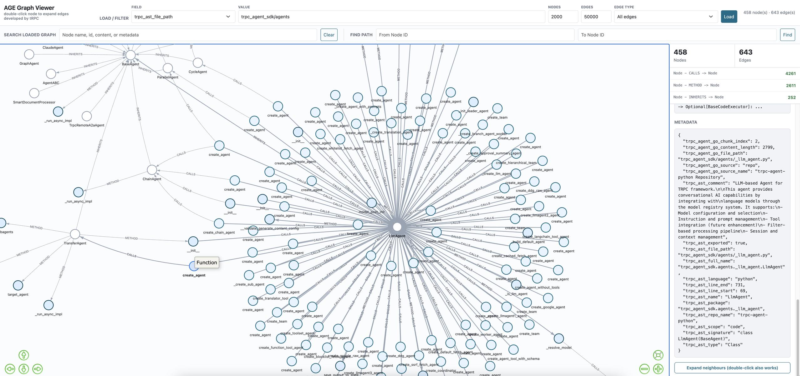

# Code RAG (Beta)

> **Beta**: Code RAG (repo source + AST parsing + the `code_search` / `code_graph_*` retrieval tools) is currently in Beta; its API and behavior may change.

> **Example Code**: [code_context_engine](https://github.com/trpc-group/trpc-agent-go/tree/main/examples/knowledge/features/code_context_engine) · [graphrag](https://github.com/trpc-group/trpc-agent-go/tree/main/examples/knowledge/features/graphrag) · [ast](https://github.com/trpc-group/trpc-agent-go/tree/main/examples/knowledge/sources/ast)

trpc-agent-go provides a set of **code knowledge base (Code RAG)** capabilities: it parses a code repository into structured semantic units, stores them in a vector store (optionally a graph store), and lets an agent query code the way it queries docs — instead of grepping raw text.

## Capabilities

1. **AST semantic parsing**: parse code into complete semantic entities (function / method / struct / class / interface / service / rpc, etc.), each carrying structured metadata (signature, comment, package path, file location) rather than fixed-length character slices. Currently open-sourced for Go / Python / Proto; C++ / JavaScript and others are being progressively opened.
2. **Repo-source ingestion**: ingest a remote Git repository or local directory directly, dispatch files to the matching reader by type, and process multi-language code + Markdown uniformly for a single repo.
3. **`code_search` vector retrieval**: AST-aware hybrid search — semantic query + `trpc_ast_*` metadata filters + `content` literal matching, with built-in per-turn dedup and multi-angle query guidance.
4. **`code_graph_*` graph retrieval (GraphRAG)**: use call / dependency edges extracted from the AST together with a graph database (Apache AGE) for structural navigation such as call chains and dependency paths.
5. **MCP reuse**: `code_search` can be wrapped into an MCP server so Cursor, another runner, or any external MCP client shares the same code search pipeline.

These capabilities form one pipeline:

```text
Repo source (clone + walk files)
  → AST reader (parse into semantic entities: function / method / struct / class / service …)
  → Vector store (+ optional graph store)
  → code_search / code_graph_* (agent retrieval tools)
```

The sections below cover usage: "Repo Source" is the ingest side (how to configure the repo, control scanning, and what metadata is produced); "Code Retrieval" is the retrieval side (how an agent queries code with `code_search` / `code_graph_*`).

## Repo Source

The repo source is the data entry point of a code knowledge base: it owns the front "ingest + parse" stage — load a remote **Git URL** or a locally checked-out **repository directory**, walk the files, and dispatch them to the matching reader by type, processing Go / Python / Proto / Markdown and other content uniformly for a single repo. This section covers how to configure the repo, control scan scope, and what metadata is produced.

> **Current open-source status**: AST-aware code parsing is currently open-sourced for **Go**, **Python**, and **Proto / PB**. Support for `C++`, `JavaScript`, and other languages is being progressively open-sourced. For languages not yet open-sourced, the repo source can still process text files via plain document readers, but without AST-level semantic entities.

### Basic Usage

```go
import (
    _ "trpc.group/trpc-go/trpc-agent-go/knowledge/document/reader/golang"
    _ "trpc.group/trpc-go/trpc-agent-go/knowledge/document/reader/python"
    reposource "trpc.group/trpc-go/trpc-agent-go/knowledge/source/repo"
)

repoSrc := reposource.New(
    reposource.WithRepository(
        reposource.Repository{
            URL:    "https://github.com/trpc-group/trpc-go",
            Branch: "main",
        },
    ),
    reposource.WithName("Code Repository"),
    reposource.WithFileExtensions([]string{".go", ".py", ".md"}),
)
```

The Go AST reader and Python AST reader are optional modules that require blank imports for registration:

- Scanning `.go` files → `knowledge/document/reader/golang`
- Scanning `.py` files → `knowledge/document/reader/python`

The Proto reader is registered by default and needs no extra import.

> **Note**: The Python reader uses an embedded Python script for AST parsing. It requires Python 3.9+ installed on the system (only uses the standard library `ast` module, no third-party dependencies).

### Repository Struct

`Repository` describes a single repository input with independent version and scope configuration:

| Field | Description |
|-------|-------------|
| `URL` | Remote Git repository URL |
| `Dir` | Local repository directory |
| `Branch` | Target branch |
| `Tag` | Target tag |
| `Commit` | Target commit |
| `Subdir` | Scan only a subdirectory within the repository |
| `RepoName` | Custom repository name |
| `Description` | Repository description; read by the `code_search` tool and embedded into the tool description so the LLM knows what the repo is about |
| `RepoURL` | Custom repository URL (overrides auto-detection) |

> `URL` and `Dir` are mutually exclusive. A single `repo.Source` processes only one repository input.

### Version Selection Priority

When multiple version fields are set, the priority is:

1. `Commit`
2. `Tag`
3. `Branch`

That is, if both `Commit` and `Branch` are provided, `Commit` is checked out.

### Scan Scope Control

- [`WithFileExtensions`](https://github.com/trpc-group/trpc-agent-go/blob/main/knowledge/source/repo/options.go) — controls which file extensions are scanned
- [`WithSkipDirs`](https://github.com/trpc-group/trpc-agent-go/blob/main/knowledge/source/repo/options.go) — controls which directory names are skipped
- [`WithSkipSuffixes`](https://github.com/trpc-group/trpc-agent-go/blob/main/knowledge/source/repo/options.go) — controls which file suffixes are skipped
- `Repository.Subdir` — restricts scanning to a subdirectory within the repository

Example: scan only Go and Markdown files under `server/`:

```go
repoSrc := reposource.New(
    reposource.WithRepository(
        reposource.Repository{
            URL:    "https://github.com/trpc-group/trpc-go",
            Branch: "main",
            Subdir: "server",
        },
    ),
    reposource.WithFileExtensions([]string{".go", ".md"}),
    reposource.WithSkipSuffixes([]string{".pb.go", ".trpc.go", "_mock.go"}),
)
```

### Metadata

The repo source enriches documents produced by readers with repository-level metadata:

| Metadata Key | Description |
|---|---|
| `trpc_agent_go_source=repo` | Document originates from a repo source |
| `trpc_agent_go_repo_path` | Local root directory of the cloned repository |
| `trpc_ast_repo_name` | Repository name |
| `trpc_ast_repo_url` | Repository URL |
| `trpc_ast_branch` | Version identifier being parsed (branch/tag/commit) |
| `trpc_ast_file_path` | Repo-relative file path |

Notes:

- `trpc_ast_file_path` represents the **logical path within the repository**, not a remote Git URL.
- For Git URL inputs, the repo source first clones to a temporary directory, then writes the repo-relative path into `trpc_ast_file_path`.

### Relation to AST Readers

The repo source does not parse code itself; it dispatches to the appropriate reader based on file type:

- `.go` → Go AST reader
- `.py` → Python AST reader
- `.proto` → Proto AST reader
- `.md` → Markdown reader
- Other registered extensions → corresponding reader

### Parsed Output Example

For AST-aware files (`.go` / `.py` / `.proto`), the repo source chunks code by semantic entity. Each chunk contains three layers:

- **content**: A semantically complete code fragment (e.g., a full struct/class/function definition), not character-truncated text
- **embedding text**: A structured summary (name / signature / comment, etc.) optimized for vector retrieval
- **metadata**: `trpc_ast_*` fields (type / full_name / language / file_path, etc.) for precise filtering and locating

Below is an example chunk for a Go struct:

```text
content:
// Server is a tRPC server.
// One process, one server. A server may offer one or more services.
type Server struct {
    MaxCloseWaitTime time.Duration
    services         map[string]Service
    ...
}

embedding text:
{"name": "Server", "signature": "type Server struct", "type": "Struct",
 "full_name": "trpc.group/trpc-go/trpc-go/server.Server",
 "comment": "Server is a tRPC server. ..."}

metadata:
trpc_ast_type: Struct
trpc_ast_full_name: trpc.group/trpc-go/trpc-go/server.Server
trpc_ast_signature: type Server struct
trpc_ast_language: go
trpc_ast_file_path: server/server.go
trpc_ast_repo_name: trpc-go
```

For Python files, chunking follows the same approach at Class / Function / Method granularity; for `.proto` files, it chunks by service / rpc / message / enum.

## Code Retrieval

> **Example Code**: [examples/knowledge/features/code_context_engine](https://github.com/trpc-group/trpc-agent-go/tree/main/examples/knowledge/features/code_context_engine)

Once the repo source has ingested code into AST semantic entities, an agent retrieves those entities through knowledge tools. The framework ships two kinds of code retrieval tools:

| Tool | Retrieval mode | Role |
|------|----------------|------|
| `code_search` | Semantic vector search + metadata/literal filtering (hybrid) | **Primary tool**: find entities by functionality / name / literal code |
| `code_graph_search` / `code_graph_traverse` / `code_graph_find_paths` | Vector seeding + graph traversal | **Advanced**: when you need structural navigation along call / dependency edges |

For most "where is this code / who implements X / where does this error come from" questions, `code_search` is enough. Reach for the GraphRAG graph tools only when you need relationship navigation such as "who calls it, how the call chain flows, how two symbols connect".

### code_search: AST-aware Semantic Code Search

[`NewCodeSearchTool`](https://github.com/trpc-group/trpc-agent-go/blob/main/knowledge/tool/codesearchtool.go) builds a code-oriented search tool on top of a plain vector store (no graph database required), with the default tool name `code_search`. On top of generic search it adds three code-specific behaviors:

- **Exposes AST metadata dimensions**: the agent can filter precisely on fields such as `trpc_ast_repo_name` / `trpc_ast_scope` / `trpc_ast_type` / `trpc_ast_full_name` / `trpc_ast_package` / `trpc_ast_file_path`.
- **Supports literal search**: embedding text is built only from structured semantic fields (name / signature / comment, etc.) and does NOT contain the concrete code body. For exact error strings, SQL, HTTP paths, or specific API calls, match against `content` with `like` instead of relying on the semantic query alone.
- **Per-turn dedup + multi-angle queries**: the tool remembers the AST chunks already returned within the current turn and will not return them again, nudging the agent to change angle (definition → callers → interface implementation → adjacent package) rather than rephrasing the same query.

#### Basic Usage

```go
import (
    _ "trpc.group/trpc-go/trpc-agent-go/knowledge/document/reader/golang"
    "trpc.group/trpc-go/trpc-agent-go/agent/llmagent"
    "trpc.group/trpc-go/trpc-agent-go/knowledge"
    "trpc.group/trpc-go/trpc-agent-go/knowledge/source"
    "trpc.group/trpc-go/trpc-agent-go/knowledge/source/repo"
    knowledgetool "trpc.group/trpc-go/trpc-agent-go/knowledge/tool"
    "trpc.group/trpc-go/trpc-agent-go/tool"
)

// 1. Repo source (set Description — code_search puts it into the tool description)
repoSrc := repo.New(
    repo.WithRepository(repo.Repository{
        URL:         "https://github.com/trpc-group/trpc-agent-go",
        Branch:      "main",
        RepoName:    "trpc-agent-go",
        Description: "tRPC agent framework for Go.",
    }),
    repo.WithFileExtensions([]string{".go", ".md"}),
    repo.WithSkipSuffixes([]string{".pb.go", ".trpc.go", "_mock.go", "_test.go"}),
)

// 2. A plain Knowledge (vector store + embedder) is enough; no graph database
kb := knowledge.New(
    knowledge.WithVectorStore(vectorStore),
    knowledge.WithEmbedder(embedder),
    knowledge.WithSources([]source.Source{repoSrc}),
)
if err := kb.Load(ctx); err != nil {
    return err
}

// 3. Create the code_search tool and inject it into the agent
searchTool := knowledgetool.NewCodeSearchTool(
    kb,
    knowledgetool.WithCodeSearchMaxResults(5),
)
ag := llmagent.New(
    "code-assistant",
    llmagent.WithModel(modelInstance),
    llmagent.WithTools([]tool.Tool{searchTool}),
)
```

#### Common Options

| Option | Description |
|--------|-------------|
| `WithCodeSearchToolName(name)` | Custom tool name (default `code_search`) |
| `WithCodeSearchToolDescription(desc)` | Override the default tool description |
| `WithCodeSearchMaxResults(n)` | Max number of results per call (default `10`) |
| `WithCodeSearchMinScore(score)` | Similarity floor (default `0.1`) |
| `WithCodeSearchFilter(map)` / `WithCodeSearchConditionedFilter(cond)` | Static filter always applied (e.g. pin to one repo) |
| `WithCodeSearchRepoInfos([]CodeRepoInfo)` | Declare repo name / description manually, overriding auto-detection from sources |
| `WithCodeSearchDedup(enabled)` | Toggle per-turn dedup (on by default) |

> When repo info is not provided explicitly, `code_search` auto-detects the repository name and `Description` from the Knowledge repo source and embeds them into the tool description, helping the LLM pick the right `trpc_ast_repo_name` filter in multi-repo setups.

#### Reuse via MCP

`code_search` is a standard `CallableTool`, so it can be wrapped into an MCP server to let Cursor, Augment, or another trpc-agent-go runner share the exact same AST code search pipeline. See the full example (local agent direct call + MCP server + Augment comparison) at [examples/knowledge/features/code_context_engine](https://github.com/trpc-group/trpc-agent-go/tree/main/examples/knowledge/features/code_context_engine).

### code_graph_*: Code Graph Retrieval (GraphRAG, Advanced)

> **Example Code**: [examples/knowledge/features/graphrag](https://github.com/trpc-group/trpc-agent-go/tree/main/examples/knowledge/features/graphrag)

Beyond vector retrieval (embedding + vector store), the repo source also supports storing structural code relationships as a graph. AST readers extract edges between entities during parsing. Combined with a graph database (Apache AGE), this enables structural code navigation.



#### Edge Types

| Edge Type | Meaning | Example |
|-----------|---------|---------|
| `CALLS` | Function/method call | `main` → `server.Start` |
| `METHOD` | Method of a class/struct | `Server` → `Server.Start` |
| `FIELD` | Struct field | `Server` → `services` |
| `PARAM` | Function parameter | `NewServer` → `opts` |
| `RETURNS` | Function return type | `NewServer` → `Server` |
| `IMPLEMENTS` | A type implements an interface | `MyService` → `Handler` |
| `ALIAS_OF` | A type alias points to its target type | `MyAlias` → `TargetType` |
| `CONTAINS` | Containment | `package server` → `Server` |

#### Usage

```go
import (
    _ "trpc.group/trpc-go/trpc-agent-go/knowledge/document/reader/golang"
    _ "trpc.group/trpc-go/trpc-agent-go/knowledge/document/reader/python"
    "trpc.group/trpc-go/trpc-agent-go/knowledge"
    agegraphstore "trpc.group/trpc-go/trpc-agent-go/knowledge/graphstore/age"
    "trpc.group/trpc-go/trpc-agent-go/knowledge/source/repo"
    "trpc.group/trpc-go/trpc-agent-go/knowledge/vectorstore/pgvector"
    knowledgetool "trpc.group/trpc-go/trpc-agent-go/knowledge/tool"
)

// 1. Configure repo source
repoSrc := repo.New(
    repo.WithRepository(repo.Repository{URL: "https://github.com/example/repo"}),
    repo.WithFileExtensions([]string{".go", ".py"}),
)

// 2. Create GraphKnowledge (graph + vector hybrid retrieval)
ageStore, err := agegraphstore.New(
    agegraphstore.WithClientDSN(ageDSN),
    agegraphstore.WithGraphName("my_graph"),
)
if err != nil {
    return err
}
vectorStore, err := pgvector.New(
    pgvector.WithPGVectorClientDSN(pgvectorDSN),
    pgvector.WithTable("graph_vectors"),
    pgvector.WithIndexDimension(1536),
)
if err != nil {
    return err
}
gk := knowledge.NewGraphKnowledge(
    knowledge.WithGraphStore(ageStore),
    knowledge.WithGraphVectorStore(vectorStore),
    knowledge.WithGraphEmbedder(embedder),
)

// 3. Load graph data
gk.LoadGraphSource(ctx, repoSrc)

// 4. Inject graph tools into the Agent
toolSet := knowledgetool.NewCodeGraphSearchTool(gk)
// Exposes code_graph_search / code_graph_traverse / code_graph_find_paths
```

#### Agent Graph Tools

| Tool | Function |
|------|----------|
| `code_graph_search` | Vector search for AST nodes, returns matching code entities |
| `code_graph_traverse` | Traverse related nodes from a given start node along edges (e.g., find all callers of a function) |
| `code_graph_find_paths` | Find paths between two code entities (e.g., trace a call chain) |

By locating entry nodes through vector search and then exploring structural relationships via graph traversal, the Agent can understand code architecture without reading large amounts of source code.
