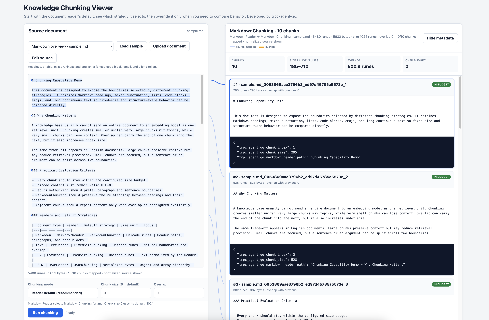

# Document Source Configuration



> **Example Code**: [examples/knowledge/sources](https://github.com/trpc-group/trpc-agent-go/tree/main/examples/knowledge/sources)

The source module provides various document source types, each supporting rich configuration options.

## Supported Document Source Types

| Source Type | Description | Example |
|-------------|-------------|---------|
| **File Source (file)** | Single file processing | [Example](https://github.com/trpc-group/trpc-agent-go/tree/main/examples/knowledge/sources/file-source) |
| **Directory Source (dir)** | Batch directory processing | [Example](https://github.com/trpc-group/trpc-agent-go/tree/main/examples/knowledge/sources/directory-source) |
| **Repo Source (repo)** | Git repository / local repo directory | [AST Example](https://github.com/trpc-group/trpc-agent-go/tree/main/examples/knowledge/sources/ast) |
| **URL Source (url)** | Fetch content from web pages | [Example](https://github.com/trpc-group/trpc-agent-go/tree/main/examples/knowledge/sources/url-source) |
| **Auto Source (auto)** | Intelligent type detection | [Example](https://github.com/trpc-group/trpc-agent-go/tree/main/examples/knowledge/sources/auto-source) |

## File Source

Single file processing, supports .txt, .md, .json, .doc, .csv, and other formats:

```go
import (
    filesource "trpc.group/trpc-go/trpc-agent-go/knowledge/source/file"
)

fileSrc := filesource.New(
    []string{"./data/llm.md"},
    filesource.WithChunkSize(1000),      // Chunk size
    filesource.WithChunkOverlap(200),    // Chunk overlap
    filesource.WithName("LLM Doc"),
    filesource.WithMetadataValue("type", "documentation"),
)
```

## Directory Source

Batch directory processing with recursive and filtering support:

```go
import (
    dirsource "trpc.group/trpc-go/trpc-agent-go/knowledge/source/dir"
)

dirSrc := dirsource.New(
    []string{"./docs"},
    dirsource.WithRecursive(true),                           // Recursively process subdirectories
    dirsource.WithFileExtensions([]string{".md", ".txt"}),   // File extension filter
    dirsource.WithChunkSize(800),
    dirsource.WithName("Documentation"),
)
```

## URL Source

Fetch content from web pages and APIs:

```go
import (
    urlsource "trpc.group/trpc-go/trpc-agent-go/knowledge/source/url"
)

urlSrc := urlsource.New(
    []string{"https://en.wikipedia.org/wiki/Artificial_intelligence"},
    urlsource.WithChunkSize(1000),
    urlsource.WithChunkOverlap(200),
    urlsource.WithName("Web Content"),
)
```

### URL Source Advanced Configuration

Separate content fetching and document identification:

```go
import (
    urlsource "trpc.group/trpc-go/trpc-agent-go/knowledge/source/url"
)

urlSrcAlias := urlsource.New(
    []string{"https://trpc-go.com/docs/api.md"},     // Identifier URL (for document ID and metadata)
    urlsource.WithContentFetchingURL([]string{"https://github.com/trpc-group/trpc-go/raw/main/docs/api.md"}), // Actual content fetching URL
    urlsource.WithName("TRPC API Docs"),
    urlsource.WithMetadataValue("source", "github"),
)
```

> **Note**: When using `WithContentFetchingURL`, the identifier URL should retain the file information from the content fetching URL, for example:
> - Correct: Identifier URL is `https://trpc-go.com/docs/api.md`, fetching URL is `https://github.com/.../docs/api.md`
> - Incorrect: Identifier URL is `https://trpc-go.com`, loses document path information

## Auto Source

Intelligent type detection, automatically selects processor:

```go
import (
    autosource "trpc.group/trpc-go/trpc-agent-go/knowledge/source/auto"
)

autoSrc := autosource.New(
    []string{
        "Cloud computing provides on-demand access to computing resources.",
        "https://docs.example.com/api",
        "./config.yaml",
    },
    autosource.WithName("Mixed Sources"),
    autosource.WithChunkSize(1000),
)
```

## Repo Source

The repo source targets code repository scenarios: it ingests an entire Git repository (or a locally checked-out directory) into the knowledge base, dispatches files to the matching reader by type, and chunks `.go` / `.py` / `.proto` and similar files into AST semantic entities. It is the data entry point of a code knowledge base / Code RAG.

```go
import (
    _ "trpc.group/trpc-go/trpc-agent-go/knowledge/document/reader/golang"
    _ "trpc.group/trpc-go/trpc-agent-go/knowledge/document/reader/python"
    reposource "trpc.group/trpc-go/trpc-agent-go/knowledge/source/repo"
)

repoSrc := reposource.New(
    reposource.WithRepository(reposource.Repository{
        URL:    "https://github.com/trpc-group/trpc-go",
        Branch: "main",
    }),
    reposource.WithFileExtensions([]string{".go", ".py", ".md"}),
)
```

> For full repo-source ingest configuration (Repository struct, version & scan control, metadata, AST parsing) plus the accompanying code retrieval tools (`code_search` vector search / `code_graph_*` graph search), see [Code RAG](code-rag.md).

## Combined Usage


```go
import (
    "trpc.group/trpc-go/trpc-agent-go/knowledge"
    openaiembedder "trpc.group/trpc-go/trpc-agent-go/knowledge/embedder/openai"
    "trpc.group/trpc-go/trpc-agent-go/knowledge/source"
    filesource "trpc.group/trpc-go/trpc-agent-go/knowledge/source/file"
    dirsource "trpc.group/trpc-go/trpc-agent-go/knowledge/source/dir"
    urlsource "trpc.group/trpc-go/trpc-agent-go/knowledge/source/url"
    autosource "trpc.group/trpc-go/trpc-agent-go/knowledge/source/auto"
    vectorinmemory "trpc.group/trpc-go/trpc-agent-go/knowledge/vectorstore/inmemory"
)

// Combine multiple sources
sources := []source.Source{fileSrc, dirSrc, urlSrc, autoSrc}

embedder := openaiembedder.New(openaiembedder.WithModel("text-embedding-3-small"))
vectorStore := vectorinmemory.New()

// Pass to Knowledge
kb := knowledge.New(
    knowledge.WithEmbedder(embedder),
    knowledge.WithVectorStore(vectorStore),
    knowledge.WithSources(sources),
)

// Load all sources
if err := kb.Load(ctx); err != nil {
    log.Fatalf("Failed to load knowledge base: %v", err)
}
```

## Chunking Strategy

> **Example Code**: [interactive chunking viewer](https://github.com/trpc-group/trpc-agent-go/tree/main/examples/knowledge/chunking) | [fixed-chunking](https://github.com/trpc-group/trpc-agent-go/tree/main/examples/knowledge/sources/fixed-chunking) | [recursive-chunking](https://github.com/trpc-group/trpc-agent-go/tree/main/examples/knowledge/sources/recursive-chunking)

Chunking is the process of splitting long documents into smaller fragments, which is crucial for vector retrieval. The framework provides multiple built-in chunking strategies and supports custom strategies.

### Built-in Chunking Strategies

| Strategy | Description | Use Case |
|----------|-------------|----------|
| **FixedSizeChunking** | Size-bounded chunking with nearby natural boundaries | General text, simple and fast |
| **RecursiveChunking** | Recursive splitting and merging by separator hierarchy | Preserving semantic integrity |
| **MarkdownChunking** | Chunk by Markdown structure | Markdown documents (default) |
| **JSONChunking** | Chunk by JSON structure | JSON files (default) |

### Default Behavior

Most applications configure a Source or Reader and do not need to construct a
strategy directly. The Reader selects the default behavior:

| Document type | Default Reader behavior |
|---------------|-------------------------|
| `.md`, `.markdown` | MarkdownChunking (heading levels H1→H6→paragraph→natural text boundary) |
| `.json` | JSONChunking (JSON structure) |
| `.txt`, `.text` | FixedSizeChunking with natural text boundaries |
| `.csv` | Line-preserving FixedSizeChunking; a record is split only when it exceeds the active new-content budget |
| `.pdf`, `.doc`, `.docx` | The optional format Reader uses FixedSizeChunking when its package is imported |
| `.proto` | ProtoReader creates AST entity chunks |
| `.go`, `.py` | The optional language Reader creates AST entity chunks when imported; otherwise Source falls back to TextReader |

RecursiveChunking is available as an explicit custom strategy when
separator-aware plain-text splitting is preferred.

PDF, DOCX, Go, and Python Readers are opt-in packages. Import the Reader package
for the formats an application needs so it registers itself with the Reader
registry.

**Default Parameters**:

| Parameter | Default | Description |
|-----------|---------|-------------|
| ChunkSize | 1024 | Maximum Unicode runes for FixedSizeChunking, RecursiveChunking, and MarkdownChunking |
| JSON ChunkSize | 2000 | Maximum serialized bytes for JSONChunking |
| Overlap | 0 | Maximum overlapping Unicode runes between adjacent chunks |

> `overlap` only applies to FixedSizeChunking, RecursiveChunking, and MarkdownChunking. It is a maximum: the strategy may move the overlap start to a natural boundary or reduce it so the final chunk remains within `chunkSize`. A large overlap leaves less room for new content and produces more chunks. JSONChunking does not support overlap.

Overlap is the content shared by the end of one chunk and the beginning of the
next. It does not add separate overlap regions to both ends of a single chunk.

The implicit text-strategy overlap changed from `128` to `0`. This affects
knowledge bases created without an explicit overlap: chunk boundaries and
embedding inputs will change. To keep an overlapping window, configure the
desired value explicitly with `WithChunkOverlap` or the strategy-specific
overlap option, then re-ingest the affected documents. Because overlap now
counts inside `chunkSize`, even an explicit value of `128` may not reproduce
the old over-budget chunks byte for byte.

FixedSizeChunking, RecursiveChunking, and MarkdownChunking preserve leading and
trailing spaces and tabs in source lines by default. This keeps indentation in
Python, YAML, Makefiles, nested Markdown, and fenced code intact. The strategies
still normalize text encoding and `CRLF`/`CR` line endings, and reject documents
that contain only whitespace.

This default changes chunk content, boundaries, metadata sizes, and embedding
inputs compared with releases that trimmed every line. Clear and re-ingest
persistent vector data after upgrading; do not mix chunks produced by the two
behaviors. Applications that must retain the previous lossy normalization can
construct a custom strategy with the corresponding compatibility option:

```go
fixed := chunking.NewFixedSizeChunking(
    chunking.WithWhitespaceTrimming(),
)
recursive := chunking.NewRecursiveChunking(
    chunking.WithRecursiveWhitespaceTrimming(),
)
markdown := chunking.NewMarkdownChunking(
    chunking.WithMarkdownWhitespaceTrimming(),
)
```

Pass the selected strategy through `WithCustomChunkingStrategy`. Each option
trims the document, every line, and retained chunk boundaries as earlier
releases did.

The text strategies validate their configuration when `Chunk` is called:
`chunkSize` must be greater than zero, and `overlap` must be in
`[0, chunkSize)`. Invalid values return `ErrInvalidChunkSize`,
`ErrInvalidOverlap`, or `ErrOverlapTooLarge` instead of being adjusted
silently.

JSONChunking traverses object keys deterministically and array indices in
numeric order. When a string value cannot fit together with its JSON path, it
is split at UTF-8-safe boundaries. If an indivisible value plus its path cannot
fit within the byte budget, chunking returns an error instead of emitting an
over-budget chunk.

Adjust default strategy parameters via `WithChunkSize` and `WithChunkOverlap`:

```go
fileSrc := filesource.New(
    []string{"./data/document.txt"},
    filesource.WithChunkSize(512),     // Maximum size in Unicode runes
    filesource.WithChunkOverlap(64),   // Maximum overlap in Unicode runes
)
```

### Custom Chunking Strategy

Use `WithCustomChunkingStrategy` to override the default chunking strategy.

> **Note**: Custom chunking strategy completely overrides `WithChunkSize` and `WithChunkOverlap` configurations. Chunking parameters must be set within the custom strategy.

#### FixedSizeChunking - Fixed Size Chunking

Splits text near the size limit, preferring a nearby line, sentence,
punctuation, or word boundary, with optional overlap:

```go
import (
    "trpc.group/trpc-go/trpc-agent-go/knowledge/chunking"
    filesource "trpc.group/trpc-go/trpc-agent-go/knowledge/source/file"
)

// Create fixed-size chunking strategy
fixedChunking := chunking.NewFixedSizeChunking(
    chunking.WithChunkSize(512),   // Max 512 Unicode runes per chunk
    chunking.WithOverlap(64),      // Max 64 Unicode runes of overlap
)

fileSrc := filesource.New(
    []string{"./data/document.md"},
    filesource.WithCustomChunkingStrategy(fixedChunking),
)
```

Use `chunking.WithPreserveLines()` when each input line is a logical record.
Complete lines are packed without splitting whenever they fit the active
new-content budget; an oversized line still falls back to sentence,
punctuation, whitespace, and UTF-8-safe rune boundaries. CSVReader enables this
option by default.

#### RecursiveChunking - Recursive Chunking

Recursively splits by separator hierarchy, preferring natural boundaries:

```go
import (
    "trpc.group/trpc-go/trpc-agent-go/knowledge/chunking"
    filesource "trpc.group/trpc-go/trpc-agent-go/knowledge/source/file"
)

// Create recursive chunking strategy
recursiveChunking := chunking.NewRecursiveChunking(
    chunking.WithRecursiveChunkSize(512),   // Max chunk size
    chunking.WithRecursiveOverlap(64),      // Overlap between chunks
    // Custom separator priority (optional)
    chunking.WithRecursiveSeparators([]string{"\n\n", "\n", ". ", " "}),
)

fileSrc := filesource.New(
    []string{"./data/article.txt"},
    filesource.WithCustomChunkingStrategy(recursiveChunking),
)
```

**Separator Priority Explanation**:

1. `\n\n` - First try to split by paragraph
2. `\n` - Then split by line
3. `. ` - Then split by sentence
4. ` ` - Split by space

Recursive chunking attempts to use higher priority separators, only using the next level separator when chunks still exceed the maximum size. If all separators fail to split text within chunkSize, it will force split by chunkSize.

For oversized logical blocks, the built-in text strategies rebalance a final
piece smaller than half the chunk budget. Plain text prefers nearby natural
boundaries; Markdown paragraphs prefer sentences and punctuation, while tables
and fenced code blocks prefer complete lines. An unbroken token falls back to a
UTF-8-safe rune boundary. Rebalancing does not cross Markdown heading scope or
unrelated structured records, so a complete short section may remain a small
chunk.

## Configuring Metadata

To enable filter functionality, it's recommended to add rich metadata when creating document sources.

> For detailed filter usage guide, please refer to [Filter Documentation](filter.md).

```go
sources := []source.Source{
    // File source with metadata
    filesource.New(
        []string{"./docs/api.md"},
        filesource.WithName("API Documentation"),
        filesource.WithMetadataValue("category", "documentation"),
        filesource.WithMetadataValue("topic", "api"),
        filesource.WithMetadataValue("service_type", "gateway"),
        filesource.WithMetadataValue("protocol", "trpc-go"),
        filesource.WithMetadataValue("version", "v1.0"),
    ),

    // Directory source with metadata
    dirsource.New(
        []string{"./tutorials"},
        dirsource.WithName("Tutorials"),
        dirsource.WithMetadataValue("category", "tutorial"),
        dirsource.WithMetadataValue("difficulty", "beginner"),
        dirsource.WithMetadataValue("topic", "programming"),
    ),

    // URL source with metadata
    urlsource.New(
        []string{"https://example.com/wiki/rpc"},
        urlsource.WithName("RPC Wiki"),
        urlsource.WithMetadataValue("category", "encyclopedia"),
        urlsource.WithMetadataValue("source_type", "web"),
        urlsource.WithMetadataValue("topic", "rpc"),
        urlsource.WithMetadataValue("language", "zh"),
    ),
}
```

## Content Transformer

> **Example Code**: [examples/knowledge/features/transform](https://github.com/trpc-group/trpc-agent-go/tree/main/examples/knowledge/features/transform)

Transformer is used to preprocess and postprocess content before and after document chunking. This is particularly useful for cleaning text extracted from PDFs, web pages, and other sources, removing excess whitespace, duplicate characters, and other noise.

### Processing Flow

```
Document → Preprocess → Processed Document → Chunking → Chunks → Postprocess → Final Chunks
```

### Built-in Transformers

#### CharFilter - Character Filter

Removes specified characters or strings:

```go
import "trpc.group/trpc-go/trpc-agent-go/knowledge/transform"

// Remove newlines, tabs, and carriage returns
filter := transform.NewCharFilter("\n", "\t", "\r")
```

#### CharDedup - Character Deduplicator

Merges consecutive duplicate characters or strings into a single instance:

```go
import "trpc.group/trpc-go/trpc-agent-go/knowledge/transform"

// Merge multiple consecutive spaces into one, merge multiple newlines into one
dedup := transform.NewCharDedup(" ", "\n")

// Example:
// Input:  "hello     world\n\n\nfoo"
// Output: "hello world\nfoo"
```

### Usage

Transformers are passed to various document sources via the `WithTransformers` option:

```go
import (
    filesource "trpc.group/trpc-go/trpc-agent-go/knowledge/source/file"
    dirsource "trpc.group/trpc-go/trpc-agent-go/knowledge/source/dir"
    urlsource "trpc.group/trpc-go/trpc-agent-go/knowledge/source/url"
    autosource "trpc.group/trpc-go/trpc-agent-go/knowledge/source/auto"
    "trpc.group/trpc-go/trpc-agent-go/knowledge/transform"
)

// Create transformers
filter := transform.NewCharFilter("\t")           // Remove tabs
dedup := transform.NewCharDedup(" ", "\n")        // Merge consecutive spaces and newlines

// File source with transformers
fileSrc := filesource.New(
    []string{"./data/document.pdf"},
    filesource.WithTransformers(filter, dedup),
)

// Directory source with transformers
dirSrc := dirsource.New(
    []string{"./docs"},
    dirsource.WithTransformers(filter, dedup),
)

// URL source with transformers
urlSrc := urlsource.New(
    []string{"https://example.com/article"},
    urlsource.WithTransformers(filter, dedup),
)

// Auto source with transformers
autoSrc := autosource.New(
    []string{"./mixed-content"},
    autosource.WithTransformers(filter, dedup),
)
```

### Combining Multiple Transformers

Multiple transformers are executed in sequence:

```go
// First remove tabs, then merge consecutive spaces
filter := transform.NewCharFilter("\t")
dedup := transform.NewCharDedup(" ")

src := filesource.New(
    []string{"./data/messy.txt"},
    filesource.WithTransformers(filter, dedup),  // Executed in order
)
```

### Typical Use Cases

| Scenario | Recommended Configuration |
|----------|---------------------------|
| PDF text cleanup | `CharDedup(" ", "\n")` - Merge excess spaces and newlines from PDF extraction |
| Web content processing | `CharFilter("\t")` + `CharDedup(" ")` - Remove tabs and merge spaces |
| Code documentation processing | `CharDedup("\n")` - Merge excess blank lines, preserve code indentation |
| General text cleanup | `CharFilter("\r")` + `CharDedup(" ", "\n")` - Remove carriage returns and merge whitespace |

## PDF File Support

Since the PDF reader depends on third-party libraries, to avoid introducing unnecessary dependencies in the main module, the PDF reader uses a separate `go.mod`.

To support PDF file reading, manually import the PDF reader package in your code:

```go
import (
    // Import PDF reader to support .pdf file parsing
    _ "trpc.group/trpc-go/trpc-agent-go/knowledge/document/reader/pdf"
)
```

> **Note**: Readers for other formats (.txt/.md/.csv/.json, etc.) are automatically registered and don't need manual import.
