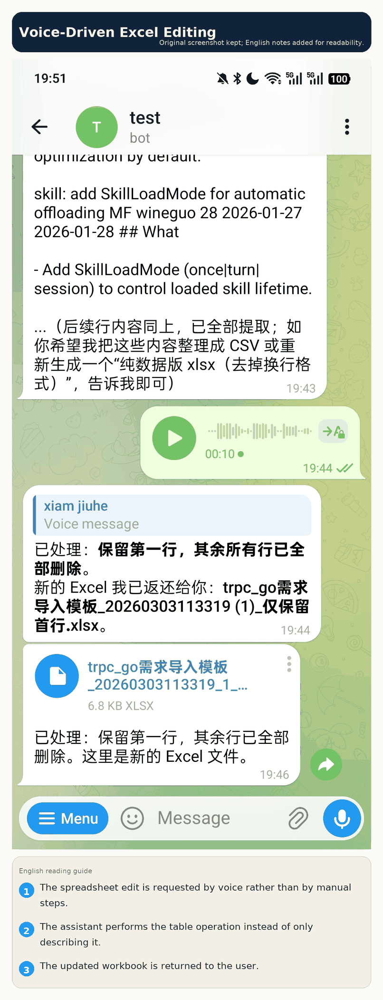
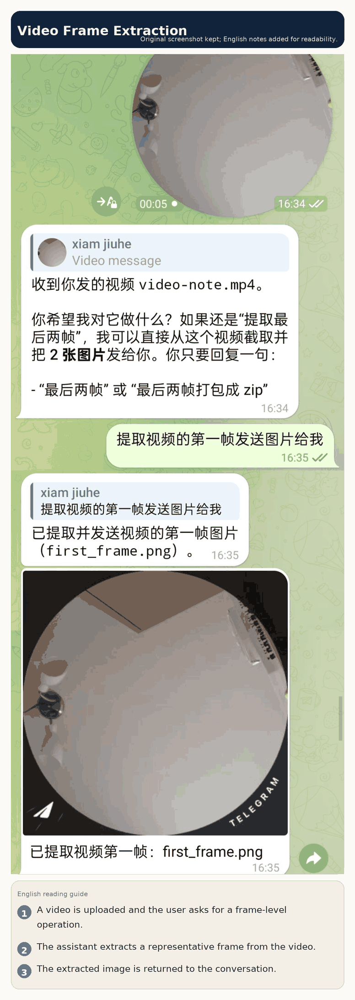
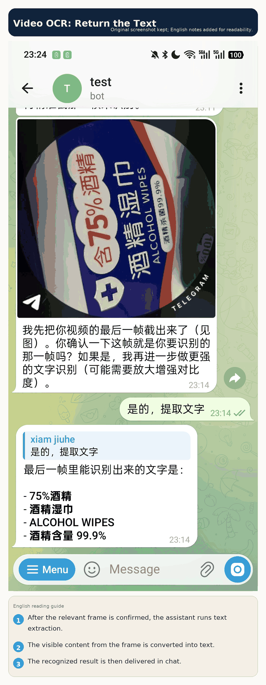
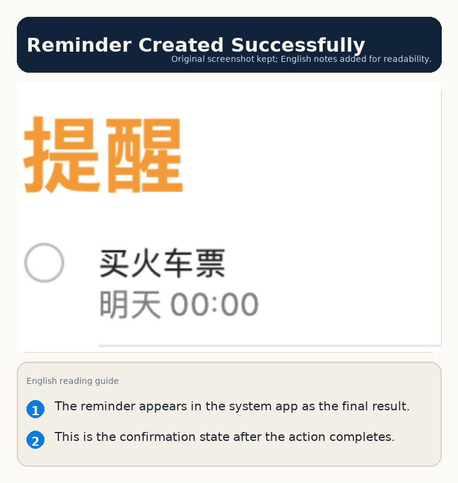
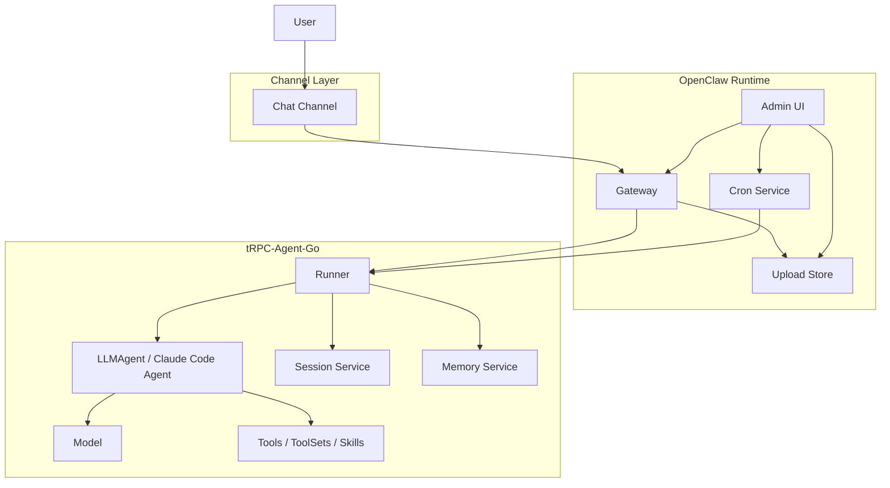
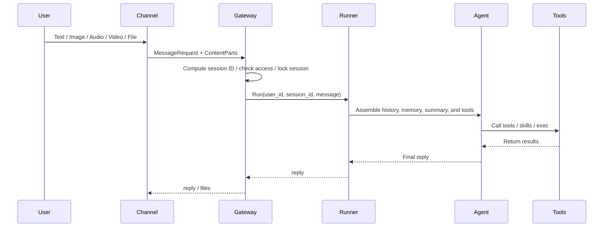
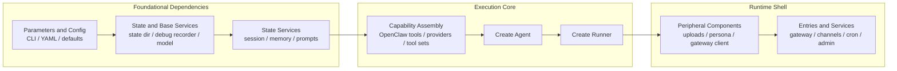

# tRPC-Agent-Go: Building a Secure, Controllable, Enterprise-Grade OpenClaw Runtime

## Introduction

When an Agent moves from one-shot Q&A into long-running scenarios,
the real question is no longer whether a single reply is clever.
What matters is whether it can reliably accept messages, manage
sessions and memory, process images and files, execute tools, keep
running over time, and remain operable. This article focuses on the
`openclaw` implementation in the GitHub open-source repository and
uses the default message-entry example from the repository as a guide
to explain how message intake, session state, tool execution, file
handling, scheduling, and management capabilities are assembled into
one complete runtime.

## Preface

> tRPC-Agent-Go is a self-directed multi-Agent framework for Go,
> developed by the tRPC-Go team. It includes tool calling, session
> and memory management, artifact management, multi-Agent
> collaboration, graph orchestration, knowledge bases, and
> observability.  
>
> GitHub repository:  
> [github.com/trpc-group/trpc-agent-go](https://github.com/trpc-group/trpc-agent-go)  
>
> `openclaw` directory:  
> [github.com/trpc-group/trpc-agent-go/tree/main/openclaw](https://github.com/trpc-group/trpc-agent-go/tree/main/openclaw)

In tRPC-Agent-Go, `openclaw` is not a one-to-one clone of the official
OpenClaw project in terms of project structure, protocol details, or
runtime internals. Instead, it is a Go-native implementation of the
OpenClaw shape built on top of existing tRPC-Agent-Go abstractions:
long-running execution, multi-entry message intake, continuous
scheduling, and extensible tools and skills. Its goal is not to define
yet another Agent framework, but to assemble existing capabilities into
a runtime shell that is closer to a real assistant product.

If this is your first time opening the repository, these entry points
are the best place to start:

- Repository root:
  [github.com/trpc-group/trpc-agent-go](https://github.com/trpc-group/trpc-agent-go)
- `openclaw` directory:
  [github.com/trpc-group/trpc-agent-go/tree/main/openclaw](https://github.com/trpc-group/trpc-agent-go/tree/main/openclaw)
- Reference configuration:
  [github.com/trpc-group/trpc-agent-go/blob/main/openclaw/openclaw.yaml](https://github.com/trpc-group/trpc-agent-go/blob/main/openclaw/openclaw.yaml)
- Extension guide:
  [github.com/trpc-group/trpc-agent-go/blob/main/openclaw/EXTENDING.md](https://github.com/trpc-group/trpc-agent-go/blob/main/openclaw/EXTENDING.md)
- Integration guide:
  [github.com/trpc-group/trpc-agent-go/blob/main/openclaw/INTEGRATIONS.md](https://github.com/trpc-group/trpc-agent-go/blob/main/openclaw/INTEGRATIONS.md)

Together, these materials answer three practical questions:

- What exactly is `openclaw`?
- How does the default repository configuration become a real runtime?
- Where should you extend it when the default capabilities are not
  enough?

## Background

Once an Agent enters a long-running setting, the question shifts from
single-turn output quality to runtime completeness. A runtime that can
work reliably over time must solve at least five classes of problems:

- How to receive messages, meaning how to bring external requests into
  the system.
- How to maintain context, meaning how to merge related messages into
  stable sessions and decide what belongs in long-term memory.
- How to execute actions, meaning how to let the Agent call tools,
  skills, and code executors while handling files and multimodal input.
- How to keep running, meaning how to support scheduled jobs,
  cross-session delivery, file uploads, and a management surface.
- How to extend capabilities, meaning how to add new Channels, Models,
  ToolSets, and storage backends without rewriting the core path.

[OpenClaw](https://github.com/openclaw/openclaw) is representative
because it treats all five problems inside one unified runtime
boundary. In the Go ecosystem, this is especially meaningful from an
engineering perspective. The hard part is usually not building a bot
that can reply. The hard part is organizing Gateway, Session, Memory,
Tools, file handling, scheduling, and management into a system that can
run continuously while reusing as much of the existing framework as
possible.

That is exactly the role of `openclaw` in tRPC-Agent-Go. It uses
`Runner` as the execution center, `Session` and `Memory` as the state
foundation, Tool, Skill, ToolSet, and executors as extension points,
and then adds Gateway, Channel, Cron, upload storage, and Admin UI
around them. In that way, it turns single-turn reasoning into a
long-running system.

## Quick Start

The goal of this section is simple: start from the repository's
existing configuration, run a real message entry point, and build an
intuitive understanding of the end-to-end runtime path.

### Path A: Install the prebuilt release

If you want the shortest path, do not start with `go run`. Install the
published binary first:

```bash
curl -fsSL \
  https://github.com/trpc-group/trpc-agent-go/releases/latest/download/openclaw-install.sh \
  | bash
```

The default install profile is `stdin`, and that profile uses the
built-in `mock` model. So the very first launch does not need model
credentials or Telegram credentials.

The installer keeps the GitHub build's config and state under
`~/.trpc-agent-go-github/openclaw` by default.

If `openclaw` is not found after install, run the PATH commands printed
by the installer. For bash, the persistent form is:

```bash
grep -qxF 'export PATH="$HOME/.local/bin:$PATH"' "$HOME/.bashrc" || \
  printf '\nexport PATH="$HOME/.local/bin:$PATH"\n' >> "$HOME/.bashrc"
. "$HOME/.bashrc"
```

Then start OpenClaw:

```bash
openclaw
```

At that point, you should already be in the local terminal chat mode.
Try a small input such as `hello`. Use `/help` to inspect the basic
commands, and `/quit` or `/exit` to stop.

This route is the best choice when your immediate goal is "download a
working binary and verify that the runtime starts cleanly." Once that is
stable, move on to a real model or a real message channel.

### Path B: Run from source

If you want to develop or modify OpenClaw itself, run it from source.
Prepare the following:

- A Go development environment
- The tRPC-Agent-Go repository
- A message-entry credential; this article uses a Telegram Bot Token
- An accessible model service, or `mock` mode for initial testing

There are two basic ideas to keep in mind:

- The message-entry credential determines whether `openclaw` can
  actually receive and send messages.
- The model service address and key determine whether the Agent can
  continue with reasoning, multimodal understanding, and tool
  invocation after a message arrives.

### Step 1: Prepare Environment Variables

The repository's `openclaw/openclaw.yaml` reads its message-entry
configuration from environment variables. The current default example
uses a Telegram token. A minimal setup looks like this:

```bash
export TELEGRAM_BOT_TOKEN='replace-with-your-bot-token'
export OPENAI_API_KEY='replace-with-your-api-key'

# Optional: add this if you use an OpenAI-compatible gateway.
export OPENAI_BASE_URL='https://your-openai-compatible-endpoint/v1'
```

These variables mean:

- `TELEGRAM_BOT_TOKEN`: the access token for the Telegram bot
- `OPENAI_API_KEY`: the model service key
- `OPENAI_BASE_URL`: the base URL of the model service

If you only want to validate message intake and message delivery
without connecting a real model yet, change `model.mode` in the config
to `mock`. That narrows the problem down to "did the message come in"
and "did the result go out." Once that path is stable, you can switch
back to a real model.

### Step 2: Understand the Default GitHub Configuration

The GitHub repository provides this reference configuration in
`openclaw/openclaw.yaml`:

```yaml
app_name: "openclaw"

http:
  addr: ":8080"

admin:
  enabled: true
  addr: "127.0.0.1:19789"
  auto_port: true

agent:
  instruction: "You are a helpful assistant. Reply in a friendly tone."

model:
  mode: "openai"
  name: "gpt-5"
  openai_variant: "auto"

tools:
  enable_parallel_tools: true

channels:
  - type: "telegram"
    config:
      token: "${TELEGRAM_BOT_TOKEN}"
      streaming: "progress"
      http_timeout: "60s"

session:
  backend: "inmemory"
  summary:
    enabled: false

memory:
  backend: "inmemory"
  auto:
    enabled: false
```

On a first read, you can interpret this YAML as follows:

- `app_name` identifies this runtime instance.
- `http.addr` is the HTTP address exposed by the runtime; health checks
  and the Gateway live here.
- `admin` enables the local management surface for debugging jobs,
  routes, uploads, and traces.
- `agent.instruction` is the system-level behavioral instruction.
- `model` defines how the underlying model is connected.
- `channels` declares a `telegram` entry, meaning external messages
  come from Telegram in this example.
- `session` and `memory` both start with `inmemory` so the first
  startup stays simple.

### Step 3: Confirm the Binary Includes the Default Entry Plugin

Run this inside the `openclaw` directory:

```bash
cd openclaw
go run ./cmd/openclaw inspect plugins
```

This command prints the capabilities registered in the current binary.
On the first pass, the main thing to check is whether `telegram`
appears in the output. If it is missing, then a YAML entry such as
`type: "telegram"` cannot actually create that Channel at runtime.

### Step 4: Start the Runtime

Once the plugin is present, start the runtime directly with the default
GitHub configuration:

```bash
cd openclaw
go run ./cmd/openclaw -config ./openclaw.yaml
```

Then check the health endpoint first:

```bash
curl -sS 'http://127.0.0.1:8080/healthz'
```

If that returns normally, the HTTP layer is up. Then go back to the
chat entry point and do the first end-to-end verification:

1. Send a very simple command such as `/help`.
2. Then send a plain text message.
3. After text is stable, test images, PDFs, and Excel files.
4. Finally, verify more complex tool calls, scheduled tasks, and
   outbound actions.

This order matters because it isolates problems layer by layer:

- `/help` is best for checking whether entry and exit work.
- Plain text is best for checking whether model invocation works.
- Images and files are best for checking multimodal normalization and
  upload or download paths.

## Typical Scenarios

The screenshots below come from the current default example entry. The
underlying screenshots are preserved in their original UI language, and
each figure now includes an English annotation panel so the flow is
readable without translating every chat bubble in place. What matters
is not whether the model replies in some abstract sense, but how an
external message enters `openclaw`, passes through Gateway, Runner,
Agent, Tool, file handling, and outbound delivery, and becomes a
complete result.

### Document Processing

Document processing is one of the clearest ways to show the value of a
runtime. The hard part here is not whether the model can "say
something." The hard part is whether the system can connect all the
steps: receive the file, understand the instruction, call tools,
produce the output, and send the result back as a file.

For example, after a PDF is uploaded, the system can extract requested
content directly:


It can also split a PDF into multiple pages and send a new file back:


Voice input can drive document processing as well. In the next example,
the user asks by voice to merge selected pages into a single PDF:


The system can also generate a Word document for reporting directly
from the input materials:


Excel processing follows the same end-to-end path. In the example
below, the user asks by voice to keep the first row and delete the
rest, and the processed spreadsheet is returned directly:



What these examples show is that one runtime can accept files, process
multimodal input, execute tools, and return files without requiring a
separate workflow for each file type.

### Images and Video

In image-understanding scenarios, a picture can go directly into the
model as multimodal input:


Video scenarios usually go through a "process the media first, then
hand it to the model" path. In the example below, the user asks for
the first frame of a video to be extracted and sent back as an image:



In video OCR scenarios, the system can first identify the target frame
and then continue with text extraction. This example first extracts the
last frame:


After confirming the target frame, it returns the recognized text:



The point here is not any single tool in isolation. The point is that
multimodal input can enter Gateway and still flow through one unified
Agent execution path.

### Skills and System Actions

`openclaw` does not limit itself to "chat replies." It allows a single
execution to chain Skills, system tools, and writes to external
systems.

In the next example, the system first performs a weather query and then
writes the current conversation into Apple Notes:


The resulting note looks like this:


Likewise, reminders can be created directly from the conversation:


And the result looks like this:



These examples show that the "action" of the runtime does not have to
stop at text output. The Agent can organize tools and system
capabilities into an executable chain.

### Scheduling and Management

A long-running system also needs to handle work that should happen on a
plan rather than immediately. In the example below, the user first
checks and clears existing jobs, then asks the system to report local
CPU usage every minute:


Besides in-chat commands, the current implementation also provides a
local Admin UI for viewing instance information, Gateway routes, jobs,
execution sessions, uploaded files, and debug traces:


This is the runtime support layer. It does not directly determine
whether the model is clever, but it directly determines whether the
system is maintainable, observable, and sustainable over time.

## Core Concepts

From a runtime-responsibility perspective, `openclaw` can be understood
as four layers: the entry layer, the normalization layer, the execution
layer, and the runtime services layer. The entry layer receives
messages, the normalization layer unifies semantics, the execution
layer performs actual Agent reasoning and action execution, and the
runtime services layer provides the support capabilities required by a
long-running system.

The overall structure is shown below:



Each layer corresponds to an independent responsibility:

- **Channel** receives messages from external platforms. In this
  article's running example, it is a chat entry point.
- **Gateway** turns external messages into a unified request format and
  handles session IDs, permissions, serialization, and multimodal
  normalization.
- **Runner / Agent** performs actual reasoning and connects history,
  memory, tools, and models.
- **Session / Memory** stores conversational context and long-term
  information so the system can remember what happened before.
- **Runtime Services** provides scheduling, file uploads, and
  management surfaces that a long-running runtime needs.

A message entering the system usually goes through five steps:

1. The Channel receives the raw message, such as text, image, audio,
   video, or file.
2. Gateway computes a stable `session_id`, performs access checks, and
   normalizes the input into a standard request.
3. Runner retrieves history and memory based on `session_id`, then
   calls the underlying Agent to execute.
4. The Agent calls Tools, Skills, ToolSets, or code executors as
   needed and produces the final reply.
5. Gateway returns the result to the Channel, which then sends it back
   to the external platform.

In the tRPC-Agent-Go implementation, `openclaw` is not trying to
redefine what an Agent is. It is placing the Agent inside a system
boundary that can run continuously and evolve over time.

### Gateway

Gateway sits between the message entry point and the execution core.
Message formats, attachment representations, and conversation semantics
from the entry side must all be normalized into a unified request
before they reach Runner. Gateway is responsible for that step.

By default, Gateway exposes the following endpoints:

- `/healthz`
- `/v1/gateway/messages`
- `/v1/gateway/status`
- `/v1/gateway/cancel`

Its main responsibilities are:

- Generate stable `session_id` values
- Enforce allowlist, mention, and other access rules
- Guarantee serialized execution within the same session
- Normalize text and multimodal inputs
- Call Runner and return results

The default session ID rules are:

- Direct message: `<channel>:dm:<from>`
- Thread or topic: `<channel>:thread:<thread>`

These rules matter because they define which messages should count as
the same ongoing conversation. If the session boundary is unstable,
Session and Memory lose much of their value.

The message processing flow looks like this:



In multimodal scenarios, Gateway also handles normalization. Images,
audio, and video are transformed into a unified `ContentPart`
structure. URL-based input goes through protocol and domain checks, and
audio is converted into formats that are easier for the model to
accept. That allows Channel implementations to focus on "how to receive
messages" and "how to send messages" without reimplementing the entire
Agent runtime logic.

### Channel

Channel is the most direct interface between the runtime and the
outside world. In the tRPC-Agent-Go `openclaw` implementation, it plays
the role of a platform adapter: it translates a platform-specific
message protocol into something Gateway understands, and then turns the
Gateway response back into that platform's sending format.

OpenClaw keeps the Channel interface deliberately light:

```go
package channel

import "context"

type Channel interface {
	ID() string
	Run(ctx context.Context) error
}
```

If a Channel also needs to send text or files proactively, it can
implement `TextSender` or `MessageSender` in addition. This design has
two immediate consequences:

- Adding a new entry point does not require changes to the Runner or
  Agent core path.
- Different platforms can keep their own network and protocol models as
  long as they are mapped into a unified Gateway request in the end.

For message-entry adapters like this, the key job is translating a
"chat platform event" into a "standard runtime message." Once the
message enters Gateway, the execution path becomes decoupled from the
platform itself.

### Session, Summary, and Memory

From first principles, these three things solve different problems:

- `Session` answers "how do we preserve the current conversation?"
- `Summary` answers "how do we compress context when the conversation
  becomes too long?"
- `Memory` answers "how do we retain stable facts across sessions?"

It helps to think of them separately:

- `Session` is like the conversation record.
- `Summary` is like a compressed version of that record.
- `Memory` is like a user profile, a preference store, or other
  long-lived facts.

The default GitHub configuration starts both `session` and `memory`
with `inmemory` so the first run remains simple. If you want persistent
state, you can switch to a configuration like this:

```yaml
session:
  backend: "sqlite"
  summary:
    enabled: false
  config:
    path: "${HOME}/.trpc-agent-go-github/openclaw/sessions.sqlite"

memory:
  backend: "sqlite"
  auto:
    enabled: false
  config:
    path: "${HOME}/.trpc-agent-go-github/openclaw/memories.db"
```

The meaning of this split is simple:

- Conversation history goes into one dedicated SQLite file.
- Long-term memory goes into another dedicated SQLite file.
- Summary and automatic memory extraction stay under their own switches.

This separation matters because "what was just said in the current
conversation" is not the same thing as "a stable user preference." If
you mix them together, the system will tend to treat temporary facts as
long-term memory or long-term facts as current-session context.

### Agent Runtime Capabilities

After Gateway, `openclaw` directly reuses the existing execution system
from tRPC-Agent-Go. The current implementation supports these core
capabilities:

- Agent types: `llm`, `claude-code`
- Session backends: `inmemory`, `redis`, `sqlite`, `mysql`,
  `postgres`, `clickhouse`
- Memory backends: `inmemory`, `redis`, `sqlite`, `mysql`,
  `postgres`, `pgvector`
- Tool providers: `duckduckgo`, `webfetch_http`
- ToolSet providers: `mcp`, `file`, `openapi`, `google`,
  `wikipedia`, `arxivsearch`, `email`
- Skills: skill directories driven by `SKILL.md`

On top of that, `openclaw` adds several tools that are especially
useful for long-running scenarios:

- `exec_command`
- `write_stdin`
- `kill_session`
- `message`
- `cron`

These tools do not change the Agent's reasoning model. What they do is
bring real-world long-running actions into one runtime. Local command
execution, cross-Channel message delivery, and scheduled tasks are all
common requirements in this kind of system.

### Scheduling and Management

A single-turn assistant can "respond." A long-running assistant system
must also "manage itself." That is why `openclaw` adds scheduling and
management capabilities outside the core conversation path.

On the scheduling side, the `cron` tool is backed by a long-lived
scheduler service that supports:

- Persisting jobs
- Triggering Agent runs on schedule
- Returning results through an outbound router to a target Channel and
  recipient

On the management side, the current Admin UI can already display:

- Instance and runtime information
- Gateway routes
- Jobs
- Execution sessions
- Uploads
- Debug traces

None of this comes from the model itself, but it determines whether the
system can evolve from a chat demo into a real assistant product.

## Usage

### Runtime Assembly

`openclaw/app.NewRuntime(...)` is the assembly entry point for the
entire runtime. It parses arguments, fills in defaults, prepares state
and model dependencies, builds the Agent and Runner, and then attaches
Gateway, Channel, Cron, and Admin as surrounding components. This is
closer to a staged assembly pipeline than to a single business request
flow.



The value of this assembly order is that foundational dependencies, the
execution core, and external entry services remain clearly separated.
Models still come from the `model` implementation, Session and Memory
still come from their backend providers, Tools, ToolSets, and Skills
still follow the native tRPC-Agent-Go model, and `openclaw` is the
layer that assembles them into one complete runtime.

### Inspecting Registered Capabilities

Before extending the runtime, the first thing to confirm is not the
YAML syntax, but which types are actually present in the binary.
`openclaw` provides a direct troubleshooting entry point for exactly
that:

```bash
cd openclaw
go run ./cmd/openclaw inspect plugins
```

This command lists the types currently registered in the binary:

- Channel types
- Model types
- Session backends
- Memory backends
- Tool providers
- ToolSet providers

All of these types come from the global registry in
`openclaw/registry`. When the runtime parses `channels`,
`tools.providers`, `tools.toolsets`, `session.backend`,
`memory.backend`, and `model.mode`, it first looks up the factory by
type name. If the type cannot be found, it fails explicitly with errors
such as `unsupported channel type`, `unsupported tool provider`, or
`unsupported toolset provider` rather than silently ignoring the entry.

### Custom Distribution Binaries

`openclaw` uses the typical Go compile-time registration pattern.
`openclaw/registry` maintains a `type -> factory` registry, each plugin
package calls `registry.Register...(...)` inside `init()`, and the
distribution entry point includes those packages through blank imports.
That means configuration selects types, while the binary determines
which types exist.

The standard entry point in the GitHub repository,
`openclaw/cmd/openclaw/main.go`, is a straightforward example:

```go
package main

import (
	"os"

	"trpc.group/trpc-go/trpc-agent-go/openclaw/app"

	_ "trpc.group/trpc-go/trpc-agent-go/openclaw/plugins/stdin"
	_ "trpc.group/trpc-go/trpc-agent-go/openclaw/plugins/telegram"
)

func main() {
	os.Exit(run(os.Args[1:]))
}

func run(args []string) int {
	return app.Main(args)
}
```

This code illustrates a very important principle:

- Configuration decides which capability to choose.
- The build entry point decides which capabilities are present in the
  binary.

That is why, when you want to add a new Channel, ToolProvider,
ToolSet, Session backend, Memory backend, or Model provider, you should
usually start from the registry and the distribution entry point rather
than modifying the `app.NewRuntime(...)` core path directly.

### ToolProvider and ToolSet Extensions

ToolProvider and ToolSet share the same registration model, but they
serve different roles:

- ToolProvider is appropriate when you know at startup exactly which
  tools should be attached; its factory returns `[]tool.Tool`.
- ToolSet is more appropriate when an external system generates a group
  of related tools; its factory returns `tool.ToolSet`.

From the runtime-assembly perspective, `newAgent(...)` first adds the
built-in `openclaw` tools, memory tools, and skill tools, then calls
`toolsFromProviders(...)` based on `tools.providers` in YAML, and
`toolSetsFromProviders(...)` based on `tools.toolsets`.

A minimal ToolProvider example can be taken directly from
`openclaw/plugins/echotool` in the repository:

```go
package echotool

import (
	"trpc.group/trpc-go/trpc-agent-go/openclaw/registry"
	"trpc.group/trpc-go/trpc-agent-go/tool"
)

func init() {
	if err := registry.RegisterToolProvider("echotool", newTools); err != nil {
		panic(err)
	}
}

func newTools(
	_ registry.ToolProviderDeps,
	spec registry.PluginSpec,
) ([]tool.Tool, error) {
	var cfg providerCfg
	if err := registry.DecodeStrict(spec.Config, &cfg); err != nil {
		return nil, err
	}
	return []tool.Tool{echoTool{name: cfg.Name}}, nil
}
```

The matching YAML looks like this:

```yaml
tools:
  providers:
    - type: "echotool"
      config:
        name: "echo"
```

If you are integrating something like MCP, OpenAPI, Google Search, or
Wikipedia, where an external system exposes a set of tools, ToolSet is
usually the better fit.

### Session, Memory, and Model Backend Extensions

If your variation is not in the message-entry layer but in state or
model access, then the extension point should live in backend factories
rather than in the main runtime flow.

The mapping is direct:

- `model.mode` maps to `registry.RegisterModel(...)`
- `session.backend` maps to `registry.RegisterSessionBackend(...)`
- `memory.backend` maps to `registry.RegisterMemoryBackend(...)`

The value of this pattern is that the user-facing YAML remains stable.
For example, if you add a new `postgres` Session backend, the user still
only needs to write:

```yaml
session:
  backend: "postgres"
  config:
    dsn: "postgres://..."
```

At runtime, `sessionSvc` is created by consulting the registry, loading
the factory, passing dependencies, and constructing the instance,
without exposing the internal wiring details in configuration.

### Skills Extensions

In many business scenarios, the first thing that changes is not the
runtime component model, but the operational guidance, scripts, and
domain knowledge. In those cases, extending Skills is often a better
choice than writing a Go plugin directly.

There are a few implementation details worth noticing about Skills in
`openclaw`:

- A Skill exists as a directory, with `SKILL.md` as the core file.
- The runtime can load Skills from multiple roots and resolves naming
  conflicts by precedence.
- `skills.entries`, `allowBundled`, and
  `metadata.openclaw.requires.*` can be used for gating.

The most relevant troubleshooting command for Skills configuration is:

```bash
cd openclaw
go run ./cmd/openclaw inspect config-keys -config ./openclaw.yaml
```

This command prints the config keys exported by the current
configuration. Skills use `metadata.openclaw.requires.config` to gate
activation against those keys. In practice, when a Skill does not take
effect, the more common reason is not "the Skill failed to load," but
"its required config, environment variables, or binaries are not
available yet."

OpenClaw now also has a host-dependency inspection and bootstrap flow
for Skills and file-tool profiles. In other words, `metadata.openclaw`
is not only used to decide whether a Skill should load, but can also
describe what the host is expected to provide:

```bash
cd openclaw
go run ./cmd/openclaw inspect deps -skill nano-pdf
go run ./cmd/openclaw bootstrap deps -skill nano-pdf -apply
```

This is useful when the issue is no longer "why was the Skill skipped,"
but "what exactly do I need to install on this machine so the Skill can
run end-to-end."

At the moment, official OpenClaw Skill metadata can describe:

- package-manager installs
- Go module or binary installs
- npm installs
- managed-Python installs in the OpenClaw state directory
- asset downloads

There are two practical details worth remembering:

- `inspect deps` and `bootstrap deps` can work from built-in dependency
  profiles, specific Skills, or both.
- An explicit `-skill ...` selection only plans the named Skills. It no
  longer pulls in the default file-tool profiles automatically.

`bootstrap deps --apply` is best-effort. User-space installs and
downloads run first, while root-only system-package steps are reported
as deferred rather than aborting the whole run. Downloaded assets are
stored under `<state_dir>/tools/<skill>/...`.

## Best Practices

In real adoption, the following practices are usually the most
important:

1. Debug from simple to complex: verify message intake and message
   delivery first, then the real model, then images, files, tools, and
   scheduled jobs.
2. Define the session boundary before the capability boundary. A stable
   `session_id` is a prerequisite for Session, Memory, summaries, and
   multi-turn tool execution to work correctly.
3. Keep Channel implementations light. They should handle platform
   protocol details, while business semantics should settle in Gateway
   and Runner.
4. Prefer extensions at the Tool, Skill, ToolSet, and backend layers
   rather than accumulating business logic in Channel adapters.
5. Treat scheduling, outbound delivery, uploads, and the management
   surface as part of the runtime itself rather than after-the-fact
   scripts. Only then does the system start to resemble a product-grade
   assistant.

## Conclusion

In tRPC-Agent-Go, `openclaw` is a long-running runtime form built on
top of the existing Agent framework. It does not try to match the
official OpenClaw project structure exactly. Instead, it prioritizes
reusing existing capabilities such as `Runner`, `Session`, `Memory`,
`Tool`, `Skill`, `ToolSet`, and executors, then organizes them through
Gateway, Channel, Cron, upload storage, and Admin UI into something
closer to a real assistant product.

For teams that want to build long-running intelligent assistants in the
Go ecosystem, the value of this approach is mainly twofold. First, the
core execution path has a high degree of reuse, so new runtime
scenarios do not require reinventing the Agent framework. Second, the
extension boundaries stay clear, so the system can continue to absorb
new message platforms, tools, skills, models, and storage backends.

When you look at the GitHub `openclaw` implementation together with the
default message-entry configuration, what it reveals is not just a
single bot. It is a runtime design that can keep running and keep
evolving.

## Usage and Community

- GitHub repository:
  [github.com/trpc-group/trpc-agent-go](https://github.com/trpc-group/trpc-agent-go)
- `openclaw` directory:
  [github.com/trpc-group/trpc-agent-go/tree/main/openclaw](https://github.com/trpc-group/trpc-agent-go/tree/main/openclaw)
- Reference configuration:
  [github.com/trpc-group/trpc-agent-go/blob/main/openclaw/openclaw.yaml](https://github.com/trpc-group/trpc-agent-go/blob/main/openclaw/openclaw.yaml)
- Extension guide:
  [github.com/trpc-group/trpc-agent-go/blob/main/openclaw/EXTENDING.md](https://github.com/trpc-group/trpc-agent-go/blob/main/openclaw/EXTENDING.md)
- Integration guide:
  [github.com/trpc-group/trpc-agent-go/blob/main/openclaw/INTEGRATIONS.md](https://github.com/trpc-group/trpc-agent-go/blob/main/openclaw/INTEGRATIONS.md)

If you are interested in how this kind of long-running Agent runtime is
implemented in the Go and tRPC-Go ecosystem, feel free to contribute,
and feel free to star the GitHub repository as well:
[github.com/trpc-group/trpc-agent-go](https://github.com/trpc-group/trpc-agent-go)
