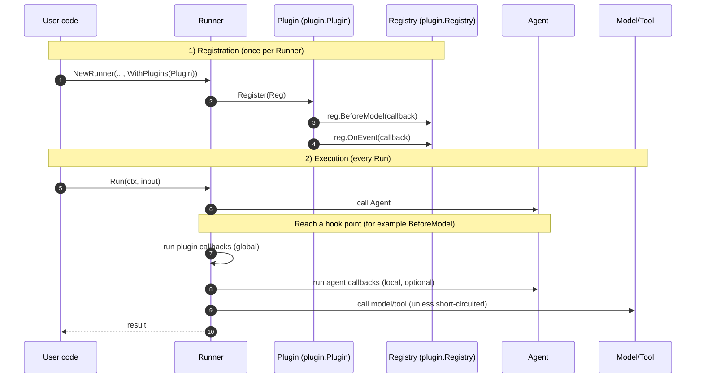

# Plugins

## Overview

A plugin is a *Runner-scoped* extension that can hook into the lifecycle of:

- Agent execution
- Model calls (Large Language Model (LLM) requests)
- Tool calls
- Event emission

The main goal is to solve **cross-cutting concerns** (things you want everywhere)
without repeating configuration on every Agent:

- Logging and debugging
- Safety and policy enforcement
- Request shaping (for example, adding a shared system instruction)
- Auditing and event tagging

If you only need customization for one specific Agent, you usually want
Callbacks instead of Plugins.

## Terminology

To avoid mixing “plugin / callback / hook”, here is the mapping:

- **Lifecycle**: the full process of handling one user input (create an
  Invocation, run the Agent, call the model/tools, emit events, finish).
- **Hook point**: a specific “time slot” in the lifecycle where the framework
  will call your code (for example, `BeforeModel`, `AfterTool`, `OnEvent`).
- **Callback**: the function you provide and register to a hook point.
- **Hook**: a generic term that usually refers to a hook point or the callback
  attached to it. In this project, hooks are implemented as callbacks.
- **Plugin**: a component that registers a set of callbacks to multiple hook
  points and is enabled once per Runner via `runner.WithPlugins(...)`.

One line summary:

- hook point = where/when
- callback = what runs there
- plugin = packaged callbacks, applied globally

Common variable names used in examples:

- `runnerInstance`: a Runner instance (`*runner.Runner`)
- `reg`: the registry where you register callbacks (`*plugin.Registry`)
- `ctx`: a context (`context.Context`)

## Plugins vs. Callbacks

One sentence: **plugins follow the Runner; callbacks follow the Agent**.

If you try to achieve “global behavior” using callbacks only, you must attach
the same callback logic to every Agent that the Runner may execute. A plugin
centralizes that setup: register once on the Runner, and the callbacks apply
automatically across all agents/tools/model calls under that Runner.

Callbacks are *functions* that run at specific hook points (before/after model,
tool, agent). You attach them where you need them (often per Agent).

Plugins are *components* that **register a set of callbacks once** on a Runner,
and then apply automatically to **all** invocations managed by that Runner.

In other words:

- **Callback**: “A hook function at a lifecycle point.”
- **Plugin**: “A reusable module that registers multiple callbacks + optional
  configuration + optional lifecycle management.”

## How Plugins relate to Callbacks (key idea)

Plugins do not introduce a separate callback system. A plugin is simply a way
to **register callbacks at the Runner level**:

- Your plugin implements `Register(reg *plugin.Registry)`.
- `reg.BeforeModel(...)` / `reg.AfterTool(...)` are registering callbacks.
- At runtime, the framework executes those callbacks at the same lifecycle
  points as normal callbacks.

You can think of a plugin as: **a packaged set of callbacks applied globally**.

For agent-local configuration, see `callbacks.md`.

## Diagram: from registration to execution



## When to use Plugins

Use plugins when you want something to be **global for a Runner**:

- You want a shared policy for all agents (for example, block certain inputs).
- You want consistent logging/metrics without changing every agent.
- You want to shape every model request (for example, add a system instruction).
- You want to tag or audit every event emitted by the Runner.

## When to use Callbacks

Use callbacks when the behavior is **local to one Agent**:

- Only one agent needs special prompt shaping.
- Only one tool set needs custom tool argument handling.
- You are prototyping quickly and do not want global impact.

You can also combine them: plugins for global defaults, callbacks for
agent-specific behavior.

## Quick Start

Register plugins once when creating the Runner:

```go
import (
	"trpc.group/trpc-go/trpc-agent-go/plugin"
	"trpc.group/trpc-go/trpc-agent-go/runner"
)

runnerInstance := runner.NewRunner(
	"my-app",
	agentInstance,
	runner.WithPlugins(
		plugin.NewLogging(),
		plugin.NewGlobalInstruction(
			"You must follow security policies.",
		),
	),
)
defer runnerInstance.Close()
```

## How Plugins Execute

### Scope and propagation

- Plugins are created once per Runner and stored in the Invocation as
  `Invocation.Plugins`.
- When an Invocation is cloned (for example, sub-agents, AgentTool, transfers),
  the same plugin manager is carried over, so the plugin behavior remains
  consistent across nested execution.

### Accessing the current Invocation

In `BeforeModel`, `AfterModel`, `BeforeTool`, and `AfterTool`, you usually get
only a `context.Context`. If you need the current Invocation, you can retrieve
it from the context.

The snippet uses `fmt.Printf` for demonstration (import `fmt` if you copy it):

```go
if inv, ok := agent.InvocationFromContext(ctx); ok && inv != nil {
	fmt.Printf("invocation id: %s\n", inv.InvocationID)
}
```

For tool callbacks, the framework also injects the tool call identifier (ID)
into the context:

```go
if toolCallID, ok := tool.ToolCallIDFromContext(ctx); ok {
	fmt.Printf("tool call id: %s\n", toolCallID)
}
```

### Order and early-exit (short-circuit)

Plugins run **in the order they are registered**.

Some “before” hooks can short-circuit default behavior:

- **BeforeAgent** can return a custom response to skip calling the Agent.
- **BeforeModel** can return a custom response to skip calling the model API
  (Application Programming Interface (API)).
- **BeforeTool** can return a custom result to skip calling the tool.

Some “after” hooks can override:

- **AfterModel** can return a custom response to replace the model response.
- **AfterTool** can return a custom result to replace the tool result.

### Error handling

- If a plugin returns an error from agent/model/tool hooks, the run fails (the
  error is returned to the caller).
- If a plugin returns an error from `OnEvent`, Runner logs the error and
  continues with the original event.

### Concurrency (important)

Tools may run in parallel and some agents may run concurrently. If your plugin
stores shared state, make it safe for concurrent use (for example, by using
`sync.Mutex` or atomic types).

### Close (resource cleanup)

If a plugin implements `plugin.Closer`, Runner calls `Close()` when you call
`Runner.Close()`. Plugins are closed in **reverse registration order**, so
later plugins can depend on earlier ones during shutdown.

## Hook Points (What you can intercept)

### Agent hooks

- `BeforeAgent`: runs before an agent starts.
- `AfterAgent`: runs after the agent event stream finishes.

### Model hooks

- `BeforeModel`: runs before a model request is sent.
- `AfterModel`: runs after a model response is produced.

### Tool hooks

- `BeforeTool`: runs before a tool is called, can modify the tool arguments
  (JavaScript Object Notation (JSON) bytes).
- `AfterTool`: runs after a tool returns, can replace the result.

### Event hook

- `OnEvent`: runs for every event emitted by Runner (including runner completion
  events). You can mutate the event in place or return a replacement event.

## Common Recipes

### 1) Block certain user inputs (policy)

Use `BeforeModel` to short-circuit the model call:

```go
type PolicyPlugin struct{}

func (p *PolicyPlugin) Name() string { return "policy" }

func (p *PolicyPlugin) Register(reg *plugin.Registry) {
	const blockedKeyword = "/deny"

	reg.BeforeModel(func(
		ctx context.Context,
		args *model.BeforeModelArgs,
	) (*model.BeforeModelResult, error) {
		if args == nil || args.Request == nil {
			return nil, nil
		}
		for _, msg := range args.Request.Messages {
			if msg.Role == model.RoleUser &&
				strings.Contains(msg.Content, blockedKeyword) {
				return &model.BeforeModelResult{
					CustomResponse: &model.Response{
						Done: true,
						Choices: []model.Choice{{
							Index: 0,
							Message: model.NewAssistantMessage(
								"Blocked by plugin policy.",
							),
						}},
					},
				}, nil
			}
		}
		return nil, nil
	})
}
```

### 2) Tag every event (audit/debug)

Use `OnEvent` to attach a tag that your User Interface (UI) or log pipeline can
filter on:

```go
const demoTag = "plugin_demo"

type TagPlugin struct{}

func (p *TagPlugin) Name() string { return "tag" }

func (p *TagPlugin) Register(reg *plugin.Registry) {
	reg.OnEvent(func(
		ctx context.Context,
		inv *agent.Invocation,
		e *event.Event,
	) (*event.Event, error) {
		if e == nil {
			return nil, nil
		}
		if e.Tag == "" {
			e.Tag = demoTag
			return nil, nil
		}
		if !e.ContainsTag(demoTag) {
			e.Tag = e.Tag + event.TagDelimiter + demoTag
		}
		return nil, nil
	})
}
```

### 3) Rewrite tool arguments (sanitization)

Use `BeforeTool` to replace tool arguments (JSON (JavaScript Object Notation)
bytes):

```go
type ToolArgsPlugin struct{}

func (p *ToolArgsPlugin) Name() string { return "tool_args" }

func (p *ToolArgsPlugin) Register(reg *plugin.Registry) {
	reg.BeforeTool(func(
		ctx context.Context,
		args *tool.BeforeToolArgs,
	) (*tool.BeforeToolResult, error) {
		if args == nil {
			return nil, nil
		}
		if args.ToolName == "calculator" {
			return &tool.BeforeToolResult{
				ModifiedArguments: []byte(
					`{"operation":"add","a":1,"b":2}`,
				),
			}, nil
		}
		return nil, nil
	})
}
```

## Built-in Plugins

### Logging

`plugin.NewLogging()` logs high-level start/end markers for agent/model/tool
operations. It is useful for debugging and performance profiling.

### GlobalInstruction

`plugin.NewGlobalInstruction(text)` prepends a system message to every model
request. This is useful for organization-wide policies or shared behavior that
should apply to all agents managed by a Runner.

## Writing Your Own Plugin

### 1) Implement the interface

Create a type that implements:

- `Name() string`: must be unique per Runner
- `Register(reg *plugin.Registry)`: register callbacks (hooks)

### 2) Register callbacks (hooks) in `Register`

Use the `Registry` methods:

- `BeforeAgent`, `AfterAgent`
- `BeforeModel`, `AfterModel`
- `BeforeTool`, `AfterTool`
- `OnEvent`

### 3) (Optional) implement `plugin.Closer`

If you allocate resources (files, background goroutines, buffers), implement
`Close(ctx)` so Runner can release them.

### Example

For a complete, runnable example (including a custom policy plugin), see:

- `examples/plugin`
