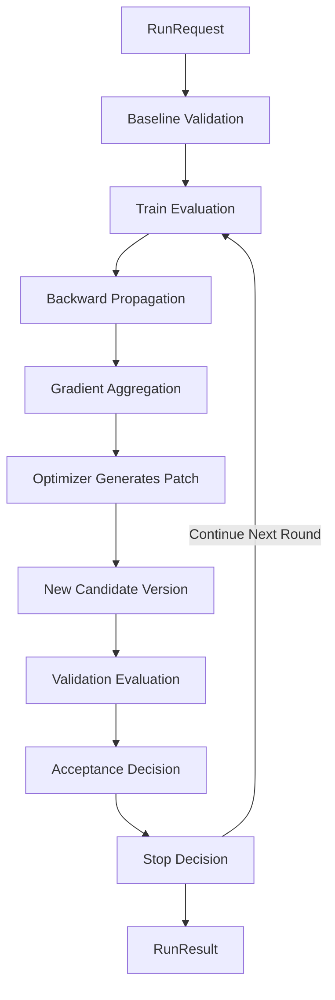
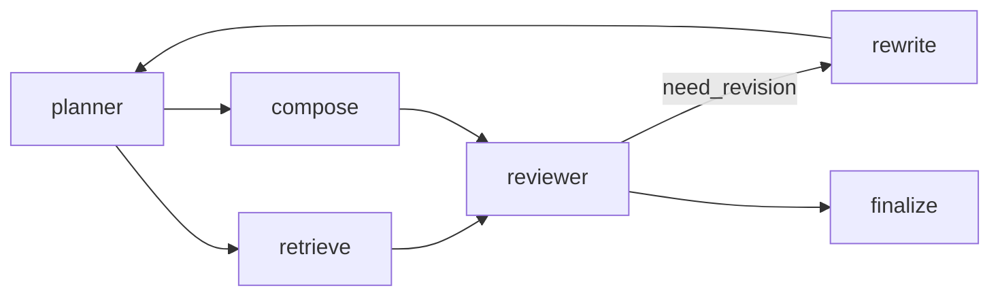
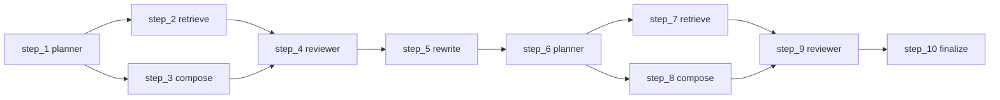

# PromptIter Guide

As evaluation capabilities mature, prompt optimization is no longer a matter of manually rewriting one prompt and checking a few examples subjectively. It needs fixed evaluation sets, fixed metrics, and stable acceptance criteria so that optimization results remain comparable and regressible over time.

Evaluation measures the quality of the current version. PromptIter continuously produces better prompt versions by separating training sets from validation sets. It is built on top of Evaluation, reuses evaluation sets, evaluation metrics, and evaluator infrastructure, and adds capabilities such as train/validation separation, multi-round optimization, acceptance policy, stop policy, asynchronous run management, and HTTP APIs.

If you are not yet familiar with evaluation sets, evaluation metrics, and evaluation services, read the [Evaluation Guide](evaluation.md) first.

## Quick Start

This section provides a minimal example so you can complete one PromptIter run first, then continue to the core concepts and usage sections.

PromptIter currently provides three examples:

- [examples/evaluation/promptiter/syncrun](https://github.com/trpc-group/trpc-agent-go/tree/main/examples/evaluation/promptiter/syncrun), which runs synchronous optimization through `engine.Run(...)`.
- [examples/evaluation/promptiter/asyncrun](https://github.com/trpc-group/trpc-agent-go/tree/main/examples/evaluation/promptiter/asyncrun), which manages asynchronous runs through `manager.Start` and `manager.Get`.
- [examples/evaluation/promptiter/server](https://github.com/trpc-group/trpc-agent-go/tree/main/examples/evaluation/promptiter/server), which exposes PromptIter through the HTTP service module.

This section uses `syncrun` to show the minimal integration path.

### Environment Setup

- Go 1.24+
- Accessible OpenAI-compatible model service
- Prepared train EvalSet file, validation EvalSet file, and metric file

Set model service environment variables before running.

```bash
export OPENAI_API_KEY="sk-xxx"
export OPENAI_BASE_URL="https://api.openai.com/v1"
```

### Synchronous Optimization Example With Local Files

This example runs PromptIter with local files. Full source is available at [examples/evaluation/promptiter/syncrun](https://github.com/trpc-group/trpc-agent-go/tree/main/examples/evaluation/promptiter/syncrun).

If you want to complete one run and inspect the result first, go to the example directory and execute `go run .`. The code snippets in this section only explain how PromptIter dependencies are assembled; they are not intended to be copied as a full application from scratch.

The three core snippets below are used to prepare evaluation dependencies, construct the Engine, and execute one run.

#### Agent And Evaluator Snippet

This part prepares PromptIter runtime dependencies. It mainly does three things:

- Create the target candidate Agent and the judge Agent used during evaluation.
- Create a Runner for the candidate Agent and the judge Agent.
- Reuse the Evaluation stack to create an `AgentEvaluator`, which PromptIter uses in both train and validation phases.

The example `candidateAgent` is a normal `llmagent`. The optimized target is its prompt content. A minimal construction looks like this:

```go
import "trpc.group/trpc-go/trpc-agent-go/agent/llmagent"

candidateAgent, err := llmagent.New(
	candidateAgentName,
	llmagent.WithModel(candidateModel),
	llmagent.WithInstruction("You are a helpful assistant."),
)
if err != nil {
	return err
}
```

The example `judgeAgent` is also a normal Agent. The snippet below shows how to create Runners for `candidateAgent` and `judgeAgent`, then assemble an `AgentEvaluator` on top of the Evaluation stack.

```go
import (
	"trpc.group/trpc-go/trpc-agent-go/evaluation"
	"trpc.group/trpc-go/trpc-agent-go/evaluation/evalresult"
	evalresultlocal "trpc.group/trpc-go/trpc-agent-go/evaluation/evalresult/local"
	"trpc.group/trpc-go/trpc-agent-go/evaluation/evalset"
	evalsetlocal "trpc.group/trpc-go/trpc-agent-go/evaluation/evalset/local"
	"trpc.group/trpc-go/trpc-agent-go/evaluation/evaluator/registry"
	"trpc.group/trpc-go/trpc-agent-go/evaluation/metric"
	metriclocal "trpc.group/trpc-go/trpc-agent-go/evaluation/metric/local"
	"trpc.group/trpc-go/trpc-agent-go/runner"
)

candidateRunner := runner.NewRunner(candidateAppName, candidateAgent)
judgeRunner := runner.NewRunner(judgeAppName, judgeAgent)

evalSetManager := evalsetlocal.New(evalset.WithBaseDir(cfg.DataDir))
metricManager := metriclocal.New(
	metric.WithBaseDir(cfg.DataDir),
	metric.WithLocator(&sharedMetricLocator{metricFileID: sharedMetricFileID}),
)
evalResultManager := evalresultlocal.New(evalresult.WithBaseDir(cfg.OutputDir))
registry := registry.New()

agentEvaluator, err := evaluation.New(
	appName,
	candidateRunner,
	evaluation.WithEvalSetManager(evalSetManager),
	evaluation.WithMetricManager(metricManager),
	evaluation.WithEvalResultManager(evalResultManager),
	evaluation.WithRegistry(registry),
	evaluation.WithJudgeRunner(judgeRunner),
)
if err != nil {
	return err
}
```

#### Engine Construction

This part creates a Runner and an instance for each workflow component: backwarder, aggregator, and optimizer. Then it assembles those instances together with `candidateAgent` and `AgentEvaluator` into an `Engine`.

```go
import (
	"trpc.group/trpc-go/trpc-agent-go/evaluation/workflow/promptiter/aggregator"
	"trpc.group/trpc-go/trpc-agent-go/evaluation/workflow/promptiter/backwarder"
	"trpc.group/trpc-go/trpc-agent-go/evaluation/workflow/promptiter/engine"
	"trpc.group/trpc-go/trpc-agent-go/evaluation/workflow/promptiter/optimizer"
	"trpc.group/trpc-go/trpc-agent-go/runner"
)

backwarderRunner := runner.NewRunner(backwarderAppName, backwarderAgent)
aggregatorRunner := runner.NewRunner(aggregatorAppName, aggregatorAgent)
optimizerRunner := runner.NewRunner(optimizerAppName, optimizerAgent)

backwarderInstance, err := backwarder.New(ctx, backwarderRunner)
if err != nil {
	return err
}
aggregatorInstance, err := aggregator.New(ctx, aggregatorRunner)
if err != nil {
	return err
}
optimizerInstance, err := optimizer.New(ctx, optimizerRunner)
if err != nil {
	return err
}

engineInstance, err := engine.New(
	ctx,
	candidateAgent,
	agentEvaluator,
	backwarderInstance,
	aggregatorInstance,
	optimizerInstance,
)
if err != nil {
	return err
}
```

#### Build The Request And Execute

This snippet constructs `RunRequest`, including train and validation sets, evaluation execution options, acceptance policy, stop policy, and target editable positions, then calls `engine.Run(...)` to execute one multi-round optimization run.

```go
import (
	astructure "trpc.group/trpc-go/trpc-agent-go/agent/structure"
	"trpc.group/trpc-go/trpc-agent-go/evaluation/workflow/promptiter/engine"
)

targetScore := 1.0
targetSurfaceID := astructure.SurfaceID(candidateAgentName, astructure.SurfaceTypeInstruction)

result, err := engineInstance.Run(ctx, &engine.RunRequest{
	TrainEvalSetIDs:      []string{"nba-commentary-train"},
	ValidationEvalSetIDs: []string{"nba-commentary-validation"},
	EvaluationOptions: engine.EvaluationOptions{
		EvalCaseParallelism:               8,
		EvalCaseParallelInferenceEnabled:  true,
		EvalCaseParallelEvaluationEnabled: true,
	},
	AcceptancePolicy: engine.AcceptancePolicy{
		MinScoreGain: 0.005,
	},
	StopPolicy: engine.StopPolicy{
		MaxRoundsWithoutAcceptance: 5,
		TargetScore:                &targetScore,
	},
	MaxRounds:        4,
	TargetSurfaceIDs: []string{targetSurfaceID},
})
if err != nil {
	return err
}
```

#### Evaluation Files

PromptIter uses the same evaluation asset layout as Evaluation, except that one run uses both train and validation sets. The example directory looks like this:

```bash
data/
  promptiter-nba-commentary-app/
    nba-commentary-train.evalset.json
    nba-commentary-validation.evalset.json
    sports-commentary.metrics.json
```

The responsibilities of these files are:

- `nba-commentary-train.evalset.json` acts as the training set and produces optimization signals and patch suggestions. In each round, PromptIter first performs forward inference and metric evaluation on the training set, then extracts losses from failed cases, runs backward propagation, and aggregates gradients.
- `nba-commentary-validation.evalset.json` acts as the validation set and decides whether the current modification should be accepted. The training set provides optimization signals, while the validation set decides whether the modification is truly better. These two roles are different and should not be mixed.
- `sports-commentary.metrics.json` acts as the metric file and defines evaluation metrics. PromptIter directly reuses Evaluation metrics. The example uses `llm_rubric_reference_critic` and `final_response_length_compliance` by default. The former measures alignment with the reference answer, and the latter enforces response length. The example directly uses static reference answers stored in the EvalSet for reference-based evaluation.

#### Execute The Run

```bash
cd examples/evaluation/promptiter/syncrun
export OPENAI_API_KEY="sk-xxx"
export OPENAI_BASE_URL="https://api.openai.com/v1"
go run .
```

#### View The Result

After the run completes, results are mainly inspected in two places:

- Terminal output, which shows the initial prompt, the final accepted prompt, per-round scores, and the stop reason.
- Output directory, which stores per-round train and validation evaluation results together with intermediate artifacts.

For synchronous runs, `engine.Run(...)` returns `RunResult` directly. Asynchronous runs and HTTP APIs also use `RunResult` as the result structure.

## Core Concepts

PromptIter adds a multi-round optimization loop on top of Evaluation. Its core inputs include train sets, validation sets, target editable positions, and run policies. Its core output is the result of one run, `RunResult`.

`Engine` executes the entire optimization flow. Both train evaluation and validation evaluation include two sub-steps: forward inference and metric evaluation. The diagram below shows the order of stages and the loop back to the next round.



One PromptIter run usually unfolds in the following order:

1. Read `RunRequest` to determine the train set, validation set, target editable positions, and run policies.
2. Execute one baseline validation on the current candidate version.
3. Run forward inference and metric evaluation on the training set, then extract losses from failed cases.
4. Send the losses to the backwarder and aggregator to obtain aggregated optimization signals.
5. Let the optimizer generate patch suggestions from the aggregated optimization signals and produce a new candidate version.
6. Run forward inference and metric evaluation on the validation set for the new candidate version.
7. Decide whether to accept the current modification based on the acceptance policy, and decide whether to stop based on the stop policy.
8. If no stop condition is triggered, the next round starts again from train evaluation.

PromptIter is a multi-round flow composed of evaluation, attribution, aggregation, optimizer-generated patch suggestions, acceptance decisions, and stop decisions. The following sections explain evaluation data, target editable positions, candidate versions, patch suggestions, run inputs and outputs, and access patterns.

### Evaluation Stack

PromptIter is built directly on top of Evaluation and reuses its evaluation data and execution flow.

- `EvalSet` defines evaluation cases in train and validation sets.
- `EvalMetric` defines the scoring rules of each metric.
- `Evaluator` runs the scoring logic for one metric.
- `EvalResult` stores the detailed result of each evaluation run.
- `AgentEvaluator` orchestrates one complete evaluation, loads evaluation sets, metrics, and evaluators, and returns the evaluation result.

In PromptIter, both train evaluation and validation evaluation are executed through `AgentEvaluator`. The difference is that train evaluation results continue into loss extraction, backward propagation, and gradient aggregation, while validation evaluation results are mainly used for acceptance and stop decisions.

For more detail about evaluation sets, evaluation metrics, evaluators, and evaluation results, see [EvalSet](evaluation.md#evaluation-set-evalset), [EvalMetric](evaluation.md#evaluation-metric-evalmetric), [Evaluator](evaluation.md#evaluator), [EvalResult](evaluation.md#evaluation-result-evalresult), and [AgentEvaluator](evaluation.md#agentevaluator).

### Train And Validation Sets

PromptIter uses two kinds of evaluation sets in one run:

- The training set generates optimization signals.
- The validation set determines whether the current modification should be accepted.

A training score can be high while the validation set still rejects the change. A gain on the training set only means that the current modification provides a stronger optimization signal. Whether the change is accepted is still determined by validation results.

### Structure Snapshot And Surface

A structure snapshot is the exported static structure of an Agent. It contains nodes, edges, and editable `surface`s. A `Surface` is a stable editable baseline field on a node, such as `instruction`, `model`, `tool`, or `skill`. Every surface has a stable `SurfaceID`, and PromptIter uses `TargetSurfaceIDs` to specify which editable positions may be optimized in the current run.

PromptIter reads the structure snapshot first, then finds the surfaces that are allowed to be optimized. The recommended approach is to obtain editable positions from the structure snapshot and then write the targets into `TargetSurfaceIDs`. Do not assume that every Agent has only one instruction surface, and do not hardcode fields outside the structure in business code.

For more detail about structure export and runtime surface overrides, see [Static Structure Export](agent.md#static-structure-export) and [Override Runtime Surface By `nodeID`](agent.md#override-runtime-surface-by-nodeid).

### Execution Trace

Execution Trace records the execution steps that actually happened in one evaluation and the real dependency relations between those steps. Here a step means one execution record of a static node in one concrete run. The same node can be executed multiple times across branches, rounds, or cycles, so one Trace may contain multiple steps that share the same `NodeID`. It describes one concrete run as it happened.

Each step usually carries the following information:

- `NodeID`, which identifies the corresponding static node.
- `PredecessorStepIDs`, which identifies the direct predecessor steps in the current run.
- `Input` and `Output`, which record the input and output snapshots observed by that step.
- `Error`, which records the runtime error when the step fails.

PromptIter uses Execution Trace to locate which steps contain problems and to decide along which path losses and gradients should propagate.

### Backward Propagation

After train evaluation produces failed samples and an Execution Trace, PromptIter enters the backward propagation stage. Backward propagation converts failed samples into propagatable attribution signals. It combines step input/output snapshots, predecessor steps, and editable positions to determine where the problem first appears and whether the issue needs to continue propagating upstream.

### Gradient Aggregation

Gradient aggregation merges local attribution signals from multiple samples and multiple steps by `SurfaceID`, producing a unified optimization signal for one editable position. This stage turns local and scattered failure signals into stable input for the next stage.

### Optimization

Optimization generates patch suggestions from the current baseline value of one editable position together with the aggregated optimization signal, and ultimately forms a new candidate version. Evaluation discovers problems, backward propagation attributes and propagates them, gradient aggregation consolidates signals, and optimization generates new patch suggestions.

### Working Example

The following example uses a realistic multi-stage workflow to connect the static structure graph, execution trace, evaluation, backward propagation, gradient aggregation, and optimization. The example represents a common workflow pattern: `planner` decides the processing strategy, `retrieve` fetches external information, `compose` drafts an answer, and `reviewer` performs unified review. If the review decides the output still needs revision, control goes to `rewrite` and then back to `planner`; otherwise it goes directly to `finalize`.

The static structure graph may look like this:



This graph describes the stable structure of the workflow:

- `planner` decomposes the task, so it fans out into `retrieve` and `compose`.
- `reviewer` is a fan-in node, meaning it may depend on multiple upstream branches at the same time.
- `reviewer -> rewrite` is a conditional edge, meaning the flow returns upstream when revision is needed.
- `rewrite -> planner` means the graph can loop back upstream and form a cycle.
- Editable positions are attached to static nodes, such as `planner#instruction` and `reviewer#instruction`.

The execution trace of one evaluation run may look like this:



This trace shows the steps that actually happened in this run:

- `planner` triggered the downstream branches `retrieve` and `compose` twice. This is fan-out.
- `reviewer` depended on both `retrieve` and `compose` twice. This is fan-in.
- The first time the flow reached `reviewer`, it went to `rewrite` and then back to `planner`. This is one loop.
- The second time the flow reached `reviewer`, it went to `finalize`, which means the run did not re-enter the revision branch.

This example can be read in the following order:

1. Train evaluation first produces actual outputs, scores, and the execution trace for this run. The static structure graph does not change, but the system now knows which steps were actually executed.
2. If train evaluation finds that the output quality of `step_9 reviewer` is insufficient, the loss is attached to that step. `Backwarder` uses the input/output snapshots of `step_9`, its predecessor steps, and editable positions to convert the problem into step-level gradients.
3. If the issue mainly comes from how `reviewer` expresses the result, `Backwarder` may directly attribute gradients to `reviewer#instruction`. If the issue comes from insufficient upstream information, it may continue propagating to `step_7 retrieve` and `step_8 compose`, then further back to the shared predecessor `step_6 planner`.
4. Gradients produced by different samples, steps, and branches are eventually merged by `Aggregator` by `SurfaceID`. For example, multiple steps may attribute issues to `planner#instruction`, and those gradients will be merged into one unified signal.
5. `Optimizer` looks at the current baseline value of one `surface` and its aggregated gradient, and generates the corresponding `SurfacePatch`.
6. `Engine` applies the `SurfacePatch` to the current candidate version, produces a new `Profile`, and passes it to validation evaluation.
7. Validation determines whether the current round is truly better. If the score gain satisfies the acceptance policy, the new candidate version becomes the accepted version. Otherwise the system rolls back to the previous accepted version and decides whether to continue.

This example shows the responsibilities of three layers of information:

- The static structure graph determines which positions may be modified.
- Execution Trace determines which steps actually contain problems in the current run and how gradients should propagate.
- `Backwarder`, `Aggregator`, and `Optimizer` progressively convert step-level problems into surface-level patch suggestions.

For how execution traces are exported, see [Execution Trace Export](agent.md#execution-trace-export). For more detail about fan-out, join, and cycle semantics in graph-based workflows, see [Graph Guide](graph.md).

### Profile

`Profile` represents a set of overrides applied on top of a structure snapshot. Every time one round is accepted, PromptIter creates a new candidate configuration version and uses it as input for the next round.

```go
import astructure "trpc.group/trpc-go/trpc-agent-go/agent/structure"

type Profile struct {
	StructureID string            // StructureID is the structure version used by the current candidate version.
	Overrides   []SurfaceOverride // Overrides stores override values on editable positions.
}

type SurfaceOverride struct {
	SurfaceID string                  // SurfaceID identifies the target editable position.
	Value     astructure.SurfaceValue // Value is the candidate value on that editable position.
}
```

### PatchSet

`PatchSet` represents the set of candidate patch suggestions generated by the optimizer in one round.

```go
import astructure "trpc.group/trpc-go/trpc-agent-go/agent/structure"

type PatchSet struct {
	Patches []SurfacePatch // Patches stores the patch suggestions generated in the current round.
}

type SurfacePatch struct {
	SurfaceID string                  // SurfaceID identifies which editable position this patch targets.
	Value     astructure.SurfaceValue // Value is the new candidate value.
	Reason    string                  // Reason stores the explanation of why the patch was generated.
}
```

The optimizer outputs `PatchSet`. The engine applies those patches to the current candidate version, creates a new candidate version, and then lets the validation set decide whether it should be accepted.

### RunRequest

`RunRequest` describes the input of one PromptIter run.

```go
import (
	"trpc.group/trpc-go/trpc-agent-go/evaluation/workflow/promptiter"
	"trpc.group/trpc-go/trpc-agent-go/runner"
)

type RunRequest struct {
	TrainEvalSetIDs      []string            // TrainEvalSetIDs is the list of train EvalSet IDs.
	ValidationEvalSetIDs []string            // ValidationEvalSetIDs is the list of validation EvalSet IDs.
	InitialProfile       *promptiter.Profile // InitialProfile is the initial candidate version before round one starts.
	Teacher              runner.Runner       // Teacher is the Runner used to generate reference answers when needed.
	Judge                runner.Runner       // Judge is the Runner used by judge-style metrics when needed.
	EvaluationOptions    EvaluationOptions   // EvaluationOptions defines evaluation execution parameters.
	AcceptancePolicy     AcceptancePolicy    // AcceptancePolicy defines how acceptance is decided.
	StopPolicy           StopPolicy          // StopPolicy defines when the run should stop.
	MaxRounds            int                 // MaxRounds is the maximum number of optimization rounds.
	TargetSurfaceIDs     []string            // TargetSurfaceIDs lists editable positions that may be changed in this run.
}
```

#### EvaluationOptions

`EvaluationOptions` controls concurrency in the evaluation phase.

```go
type EvaluationOptions struct {
	EvalCaseParallelism               int  // EvalCaseParallelism is the upper bound of parallel evaluation cases.
	EvalCaseParallelInferenceEnabled  bool // EvalCaseParallelInferenceEnabled controls whether inference runs in parallel.
	EvalCaseParallelEvaluationEnabled bool // EvalCaseParallelEvaluationEnabled controls whether evaluation runs in parallel.
}
```

Its semantics stay aligned with Evaluation. PromptIter directly reuses the Evaluation concurrency model and fixes execution to a single run internally.

#### AcceptancePolicy And StopPolicy

`AcceptancePolicy` and `StopPolicy` determine whether the current modification is accepted and when the run stops.

```go
type AcceptancePolicy struct {
	MinScoreGain float64 // MinScoreGain is the minimum validation score gain required for acceptance.
}

type StopPolicy struct {
	MaxRoundsWithoutAcceptance int      // MaxRoundsWithoutAcceptance is the maximum number of consecutive non-accepted rounds.
	TargetScore                *float64 // TargetScore stops the run when the accepted score reaches this threshold.
}
```

The corresponding decisions appear in each `RoundResult`:

```go
type AcceptanceDecision struct {
	Accepted   bool    // Accepted indicates whether the current round is accepted.
	ScoreDelta float64 // ScoreDelta is the validation score gain relative to the accepted baseline.
	Reason     string  // Reason explains the acceptance decision.
}

type StopDecision struct {
	ShouldStop bool   // ShouldStop indicates whether the run should stop after the current round.
	Reason     string // Reason explains the stop decision.
}
```

The values below are example starting points rather than framework-enforced defaults:

- `MinScoreGain = 0.005`
- `MaxRounds = 4`
- `MaxRoundsWithoutAcceptance = 5`
- `TargetScore = 1.0`

These example values usually correspond to the following runtime semantics:

- The current round is accepted only when the validation score gain reaches `MinScoreGain`.
- The run stops when it reaches `MaxRounds`, when too many consecutive rounds are not accepted, or when `TargetScore` is reached.

If you want to reduce false acceptance caused by score jitter, increase `MinScoreGain`. If you want to stop earlier after long ineffective optimization, lower `MaxRoundsWithoutAcceptance`. If you want the run to exit as soon as it reaches a target quality bar, set `TargetScore`.

### RunResult

`RunResult` is the result and state snapshot of one PromptIter run. It is both the final result of a synchronous run and the state snapshot returned by asynchronous queries.

```go
import (
	astructure "trpc.group/trpc-go/trpc-agent-go/agent/structure"
	"trpc.group/trpc-go/trpc-agent-go/evaluation/workflow/promptiter"
)

type RunResult struct {
	ID                 string               // ID is the run identifier.
	Status             RunStatus            // Status is the current run status.
	CurrentRound       int                  // CurrentRound is the current round number.
	Structure          *astructure.Snapshot // Structure is the structure snapshot used in this run.
	BaselineValidation *EvaluationResult    // BaselineValidation is the baseline validation result before optimization starts.
	AcceptedProfile    *promptiter.Profile  // AcceptedProfile is the currently accepted best candidate version.
	Rounds             []RoundResult        // Rounds stores detailed results of each round.
	ErrorMessage       string               // ErrorMessage stores the error message when the run fails or is canceled.
}

type RoundResult struct {
	Round         int                   // Round is the round number.
	InputProfile  *promptiter.Profile   // InputProfile is the candidate version entering the round.
	Train         *EvaluationResult     // Train is the training-set evaluation result.
	Losses        []promptiter.CaseLoss // Losses stores losses extracted from failed cases.
	Backward      *BackwardResult       // Backward is the backward propagation result.
	Aggregation   *AggregationResult    // Aggregation is the gradient aggregation result.
	Patches       *promptiter.PatchSet  // Patches stores patch suggestions generated by the optimizer.
	OutputProfile *promptiter.Profile   // OutputProfile is the candidate version after applying patch suggestions.
	Validation    *EvaluationResult     // Validation is the validation-set evaluation result.
	Acceptance    *AcceptanceDecision   // Acceptance is the acceptance decision of the current round.
	Stop          *StopDecision         // Stop is the stop decision of the current round.
}
```

#### Result Inspection

Results are usually inspected from the following positions:

- `RunResult.BaselineValidation`, which shows the baseline score before optimization starts.
- `RunResult.AcceptedProfile`, which shows the currently accepted best version.
- `RunResult.Rounds`, which shows per-round train evaluation, validation evaluation, patch suggestions, and decisions.
- `RoundResult.Acceptance`, which shows whether the current round is accepted and the score delta.
- `RoundResult.Stop`, which shows whether the current round triggers a stop condition.

The following is a typical summary:

```text
Initial validation score: 0.35
Final accepted validation score: 0.92
Round 1 -> train 0.25, validation 0.81, accepted true, delta 0.46
Round 2 -> train 0.88, validation 0.92, accepted true, delta 0.12
Round 3 -> train 1.00, validation 0.90, accepted false, delta -0.02
```

The meanings are:

- `Initial validation score` is the baseline score.
- `Final accepted validation score` is the score of the final accepted version in this run.
- `accepted true` means the modification of that round is accepted.
- `accepted false` means the modification of that round is rejected and the best accepted version remains unchanged.
- `delta` is the validation score gain of the round relative to the current accepted version.

To inspect full evaluation details, continue into `EvaluationResult.EvalSets`, `Cases`, and per-metric scores for each round.

### Backwarder

`Backwarder` converts failed samples, trace, and loss into per-sample gradients to determine where the issue mainly occurs and which editable positions should be blamed.

### Aggregator

`Aggregator` aggregates gradients from multiple samples on the same editable position into one unified signal in order to extract repeated cross-sample problems.

### Optimizer

`Optimizer` generates patch suggestions from aggregated gradients to determine how the current editable position should be adjusted.

## Usage

PromptIter usage usually revolves around four kinds of objects:

- `RunRequest`, which describes the input of one run.
- `RunResult`, which exposes the state and result of one run.
- `Engine` and workflow components, which execute synchronous optimization and optionally replace key stages in the multi-round optimization chain.
- `Manager / Store`, which provide asynchronous and persistent integration paths.
- The PromptIter HTTP service module, which exposes HTTP APIs.

Common access patterns are:

- Use `engine` for purely local synchronous execution. See [syncrun](https://github.com/trpc-group/trpc-agent-go/tree/main/examples/evaluation/promptiter/syncrun).
- Introduce `manager` when you need asynchronous lifecycle management. See [asyncrun](https://github.com/trpc-group/trpc-agent-go/tree/main/examples/evaluation/promptiter/asyncrun).
- Use the PromptIter HTTP service module when you need remote triggering and platform integration. See [server](https://github.com/trpc-group/trpc-agent-go/tree/main/examples/evaluation/promptiter/server).

### Backwarder

`Backwarder` converts failed samples, trace, and loss into per-sample gradients.

```go
type Backwarder interface {
	Backward(ctx context.Context, request *Request) (*Result, error)
}
```

The default implementation is created with `backwarder.New(ctx, runner, opts...)`. The constructor supports the following options:

- `WithRunOptions(...)`, which appends `agent.RunOption` values to internal Runner calls.
- `WithMessageBuilder(...)`, which overrides how `Backwarder.Request` is encoded into the message sent to the Runner.
- `WithUserIDSupplier(...)`, which overrides the `userID` used by each backward propagation call.
- `WithSessionIDSupplier(...)`, which overrides the `sessionID` used by each backward propagation call.

In most cases the default constructor is sufficient. Explicit options are only needed when you want to reuse a unified Runner option set, replace the default context encoding, or align with an existing user/session identity system.

`Request` contains the current step input/output snapshot, related editable positions, predecessor steps, and incoming gradients. `Result` contains two kinds of outputs:

- `Gradients`, which are gradients attributed to editable positions at the current step.
- `Upstream`, which are gradients that still need to propagate to predecessor steps.

The default implementation organizes one `Backwarder.Request` into a single-step context and sends it to the Runner. This context mainly includes:

- Current evaluation sample identifiers, such as `EvalSetID` and `EvalCaseID`.
- Current step information, such as `Node`, `StepID`, `Input`, `Output`, and `Error`.
- Editable positions that may be blamed by this step, namely `Surfaces` and `AllowedGradientSurfaceIDs`.
- Direct predecessor steps, namely `Predecessors`.
- Gradient packets propagated back from downstream, namely `Incoming`.

The default `Backwarder` serializes these items into one user message and uses structured output constraints so that the Runner may return only two kinds of content:

- `Gradients` attributed to editable positions at the current step.
- `Upstream` to be propagated further to predecessor steps.

Backwarder turns failed samples into propagatable attribution signals, deciding which editable positions should be blamed and how the issue should continue propagating upstream.

### Aggregator

`Aggregator` merges gradients from multiple samples on the same editable position into one unified signal.

```go
type Aggregator interface {
	Aggregate(ctx context.Context, request *Request) (*Result, error)
}
```

The default implementation is created with `aggregator.New(ctx, runner, opts...)`. The constructor supports the following options:

- `WithRunOptions(...)`, which appends `agent.RunOption` values to internal Runner calls.
- `WithMessageBuilder(...)`, which overrides how `aggregator.Request` is encoded into the message sent to the Runner.
- `WithUserIDSupplier(...)`, which overrides the `userID` used by each aggregation call.
- `WithSessionIDSupplier(...)`, which overrides the `sessionID` used by each aggregation call.

In most cases the default constructor is sufficient. Explicit options are only needed when you want to reuse a unified Runner option set, replace the default context encoding, or align with an existing user/session identity system.

Specifically:

- `Request.SurfaceID` identifies the editable position currently being aggregated.
- `Request.Gradients` contains all sample-level gradients produced for that editable position.
- `Result.Gradient` is the single aggregated signal at the editable-position level.

The default implementation organizes one `aggregator.Request` into a single-surface aggregation context and sends it to the Runner. This context mainly includes:

- The target editable position, `SurfaceID`.
- The static node that owns that editable position, `NodeID`.
- The type of that editable position, `Type`.
- The raw gradient list from multiple samples, `Gradients`.

The default `Aggregator` serializes these items into one user message and requires the Runner to return one aggregated `AggregatedSurfaceGradient`, which can be consumed directly by the next optimization stage.

Aggregator reduces local sample-level gradients into a unified signal and extracts repeated problems that appear across samples.

### Optimizer

`Optimizer` generates patch suggestions from aggregated gradients.

```go
type Optimizer interface {
	Optimize(ctx context.Context, request *Request) (*Result, error)
}
```

The default implementation is created with `optimizer.New(ctx, runner, opts...)`. The constructor supports the following options:

- `WithRunOptions(...)`, which appends `agent.RunOption` values to internal Runner calls.
- `WithMessageBuilder(...)`, which overrides how `optimizer.Request` is encoded into the message sent to the Runner.
- `WithUserIDSupplier(...)`, which overrides the `userID` used by each optimization call.
- `WithSessionIDSupplier(...)`, which overrides the `sessionID` used by each optimization call.

In most cases the default constructor is sufficient. Explicit options are only needed when you want to reuse a unified Runner option set, replace the default context encoding, or align with an existing user/session identity system.

Specifically:

- `Request.Surface` is the baseline value of the current editable position.
- `Request.Gradient` is the aggregated gradient on that editable position.
- `Result.Patch` is the generated patch suggestion.

The default implementation organizes one `optimizer.Request` into a single-surface optimization context and sends it to the Runner. This context mainly includes:

- The editable position itself, `Surface`.
- The current baseline value of that editable position.
- The aggregated gradient for that editable position, `Gradient`.

The default `Optimizer` serializes these items into one user message and requires the Runner to return one `SurfacePatch`, including the new candidate value and the reason for the change.

Optimizer converts aggregated gradients into concrete patch suggestions that determine how the current editable position should change.

### Engine

If you only need to execute one PromptIter run directly, use the `engine` package.

See the corresponding example at [syncrun](https://github.com/trpc-group/trpc-agent-go/tree/main/examples/evaluation/promptiter/syncrun).

```go
import (
	astructure "trpc.group/trpc-go/trpc-agent-go/agent/structure"
)

type Engine interface {
	Describe(ctx context.Context) (*astructure.Snapshot, error)
	Run(ctx context.Context, request *RunRequest, opts ...Option) (*RunResult, error)
}
```

Specifically:

- `Describe` returns the current structure snapshot.
- `Run` executes multi-round prompt optimization.

The default implementation is created with `engine.New(ctx, targetAgent, agentEvaluator, backwarder, aggregator, optimizer)`. The constructor itself does not expose extra options. It requires five kinds of dependencies:

- The target Agent being optimized.
- `agentEvaluator` for train and validation evaluation.
- The three workflow components: backwarder, aggregator, and optimizer.

Among these dependencies, `targetAgent` is used to provide the structure snapshot. `Engine` exports the static structure graph through it so that it can determine editable positions, validate `TargetSurfaceIDs`, normalize `Profile`, and implement `Describe()`. `agentEvaluator` executes train and validation evaluation. These two dependencies correspond to structure description and evaluation execution respectively, and their responsibilities do not overlap.

`Engine` options are provided at `Run(...)` time. Currently the only run-time option is `WithObserver(...)`, which receives stage events during one run. No additional run-time option is currently exposed beyond observation.

#### Observer

`engine.Run` supports `WithObserver(...)` to inject one runtime observer and receive stage events during a single run.

```go
type Observer func(ctx context.Context, event *Event) error

type Event struct {
	Kind    EventKind
	Round   int
	Payload any
}
```

Typical events include:

- `structure_snapshot`
- `baseline_validation`
- `round_train_evaluation`
- `round_losses`
- `round_backward`
- `round_aggregation`
- `round_patch_set`
- `round_output_profile`
- `round_validation`
- `round_completed`

If you only need local synchronous debugging, `RunResult` is usually enough. Introduce `Observer` only when you need to observe stage changes during the run.

### Manager

If you need lifecycle management for asynchronous runs, use the `manager` package.

See the corresponding example at [asyncrun](https://github.com/trpc-group/trpc-agent-go/tree/main/examples/evaluation/promptiter/asyncrun).

#### Interface

```go
import (
	"trpc.group/trpc-go/trpc-agent-go/evaluation/workflow/promptiter/engine"
)

type Manager interface {
	Start(ctx context.Context, request *engine.RunRequest) (*engine.RunResult, error)
	Get(ctx context.Context, runID string) (*engine.RunResult, error)
	Cancel(ctx context.Context, runID string) error
	Close() error
}
```

#### Usage

The minimal usage is:

```go
import "trpc.group/trpc-go/trpc-agent-go/evaluation/workflow/promptiter/manager"

managerInstance, err := manager.New(engineInstance)
if err != nil {
	return err
}
defer managerInstance.Close()

run, err := managerInstance.Start(ctx, request)
if err != nil {
	return err
}

current, err := managerInstance.Get(ctx, run.ID)
if err != nil {
	return err
}
_ = current
```

Manager fits the following scenarios:

- Background tasks
- Frontend progress polling
- Long-running optimization that must be cancelable
- Cross-request status queries

### Store

Asynchronous run persistence is handled by the `store` package.

#### Interface

```go
import (
	"trpc.group/trpc-go/trpc-agent-go/evaluation/workflow/promptiter/engine"
)

type Store interface {
	Create(ctx context.Context, run *engine.RunResult) error
	Get(ctx context.Context, runID string) (*engine.RunResult, error)
	Update(ctx context.Context, run *engine.RunResult) error
	Close() error
}
```

#### InMemory Implementation

`store/inmemory` fits local debugging and testing. It does not depend on external storage and data is lost when the process exits.

#### MySQL Implementation

`store/mysql` fits cross-process persistence and platform queries. It serializes `RunResult` into MySQL and supports both manual schema initialization and automatic table creation.

The current implementation uses a single table to store run records. Core fields include `run_id`, `status`, serialized `run_result`, and timestamps such as `created_at` and `updated_at`. The full schema is available in [schema.sql](https://github.com/trpc-group/trpc-agent-go/tree/main/evaluation/workflow/promptiter/store/mysql/schema.sql).

### HTTP APIs

If you need to trigger PromptIter over HTTP, use the PromptIter HTTP service module.

See the corresponding example at [server](https://github.com/trpc-group/trpc-agent-go/tree/main/examples/evaluation/promptiter/server).

#### Request And Response

The core payloads exposed by the PromptIter HTTP service module are:

```go
import (
	astructure "trpc.group/trpc-go/trpc-agent-go/agent/structure"
	"trpc.group/trpc-go/trpc-agent-go/evaluation/workflow/promptiter/engine"
)

type RunRequest struct {
	Run *engine.RunRequest `json:"run"`
}

type RunResponse struct {
	Result *engine.RunResult `json:"result"`
}

type GetStructureResponse struct {
	Structure *astructure.Snapshot `json:"structure"`
}
```

#### Server Construction

The minimal construction is:

```go
import promptiterserver "trpc.group/trpc-go/trpc-agent-go/server/promptiter"

server, err := promptiterserver.New(
	promptiterserver.WithAppName(appName),
	promptiterserver.WithBasePath("/promptiter/v1/apps"),
	promptiterserver.WithEngine(engineInstance),
	promptiterserver.WithManager(managerInstance),
)
if err != nil {
	return err
}

return http.ListenAndServe(":8080", server.Handler())
```

#### Routes

When `WithBasePath("/promptiter/v1/apps")` and `WithAppName(appName)` are used together, the effective routes are:

- `GET /promptiter/v1/apps/{appName}/structure`
- `POST /promptiter/v1/apps/{appName}/runs`
- `POST /promptiter/v1/apps/{appName}/async-runs`
- `GET /promptiter/v1/apps/{appName}/async-runs/{run_id}`
- `POST /promptiter/v1/apps/{appName}/async-runs/{run_id}/cancel`

The recommended call order is:

1. Use `/promptiter/v1/apps/{appName}/structure` to fetch the structure snapshot and target editable positions.
2. Construct `RunRequest` and write `TargetSurfaceIDs`.
3. For simple scenarios, use blocking `POST /promptiter/v1/apps/{appName}/runs`.
4. When lifecycle management is needed, use asynchronous `POST /promptiter/v1/apps/{appName}/async-runs` and `GET /promptiter/v1/apps/{appName}/async-runs/{run_id}`.
