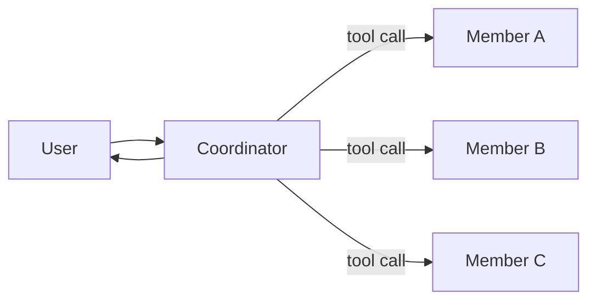
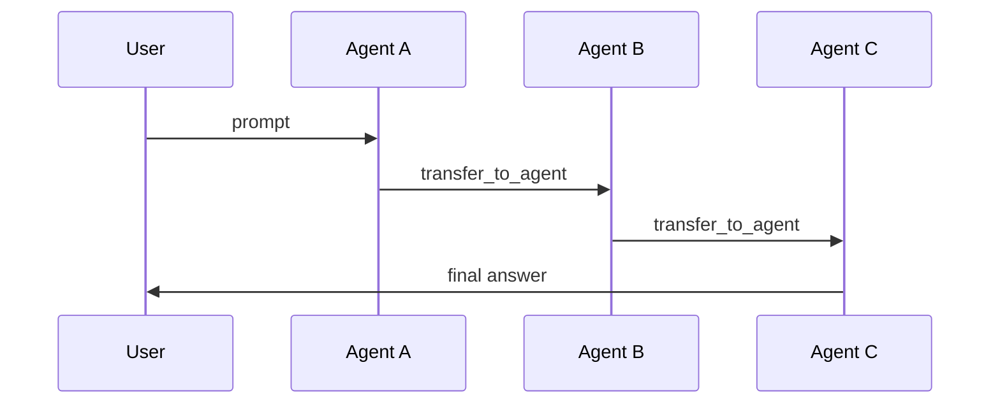

# Team

The `team` package is a high-level way to run multiple Agents together.

It gives you two simple collaboration styles:

- **Coordinator Team**: one Agent stays in charge, calls member Agents as
  tools, then replies to the user.
- **Swarm**: no coordinator loop; the current Agent can hand off to another
  Agent via `transfer_to_agent`.

In the examples below, `LLMAgent` is an Agent implementation backed by a
Large Language Model (LLM).

## Why do you need a Team?

An Agent is good at one role. Real applications often need multiple roles,
for example:

- researching a problem
- writing code
- reviewing for mistakes

A Team lets you combine these roles with a small, clear
Application Programming Interface (API).

## Coordinator Team vs Swarm

### Coordinator Team

- **Best for**: combining multiple outputs into one final answer (for example,
  consensus, summarization, "review then revise").
- **How it works**: the coordinator calls members as tools (using AgentTool).
  The coordinator can call multiple members in one run.



### Swarm

- **Best for**: “handoff chains”, where each Agent decides who should act
  next.
- **How it works**: an entry Agent starts, then Agents transfer control to the
  next Agent using `transfer_to_agent`. The final Agent replies to the user.



## Quickstart: Coordinator Team

```go
import (
    "trpc.group/trpc-go/trpc-agent-go/agent"
    "trpc.group/trpc-go/trpc-agent-go/agent/llmagent"
    "trpc.group/trpc-go/trpc-agent-go/model/openai"
    "trpc.group/trpc-go/trpc-agent-go/runner"
    "trpc.group/trpc-go/trpc-agent-go/team"
)

modelInstance := openai.New("deepseek-chat")

coder := llmagent.New(
    "coder",
    llmagent.WithModel(modelInstance),
    llmagent.WithInstruction("Write Go code."),
)

reviewer := llmagent.New(
    "reviewer",
    llmagent.WithModel(modelInstance),
    llmagent.WithInstruction("Review for correctness."),
)

coordinator := llmagent.New(
    "team",
    llmagent.WithModel(modelInstance),
    llmagent.WithInstruction(
        "You are the coordinator. Call member agents as tools, "+
            "then produce the final answer.",
    ),
)

tm, err := team.New(
    "team",
    coordinator,
    []agent.Agent{coder, reviewer},
    team.WithDescription("A tiny coordinator team"),
)
if err != nil {
    panic(err)
}

r := runner.NewRunner("app", tm)
_ = r
```

Notes:

- The coordinator name must match the team name (here both are `"team"`).
- The coordinator must support dynamic ToolSets (LLMAgent does).

## Quickstart: Swarm

```go
tm, err := team.NewSwarm(
    "team",
    "researcher", // entry member name
    []agent.Agent{coder, researcher, reviewer},
)
if err != nil {
    panic(err)
}
```

Notes:

- Members must support `SetSubAgents` (LLMAgent does). This is required so
  members can discover and transfer to each other.

## Swarm Guardrails

Swarm-style handoffs can loop if Agents keep transferring back and forth.
`team.SwarmConfig` provides optional limits:

- `MaxHandoffs`: maximum transfers in one run
- `NodeTimeout`: per-Agent timeout after a transfer
- `RepetitiveHandoffWindow` + `RepetitiveHandoffMinUnique`: loop detection

```go
import "time"

tm, err := team.NewSwarm(
    "team",
    "researcher",
    members,
    team.WithSwarmConfig(team.SwarmConfig{
        MaxHandoffs:                20,
        NodeTimeout:                300 * time.Second,
        RepetitiveHandoffWindow:    8,
        RepetitiveHandoffMinUnique: 3,
    }),
)
```

## Example

See `examples/team` for a runnable demo of both modes.

## Design Notes

- Coordinator teams expose members as tools by installing AgentTool wrappers on
  the coordinator.
- Swarm teams wire members together via `SetSubAgents` and rely on
  `transfer_to_agent` for handoffs.
- `team.SwarmConfig` is enforced by a transfer controller stored in
  `RunOptions.RuntimeState` during a run.
