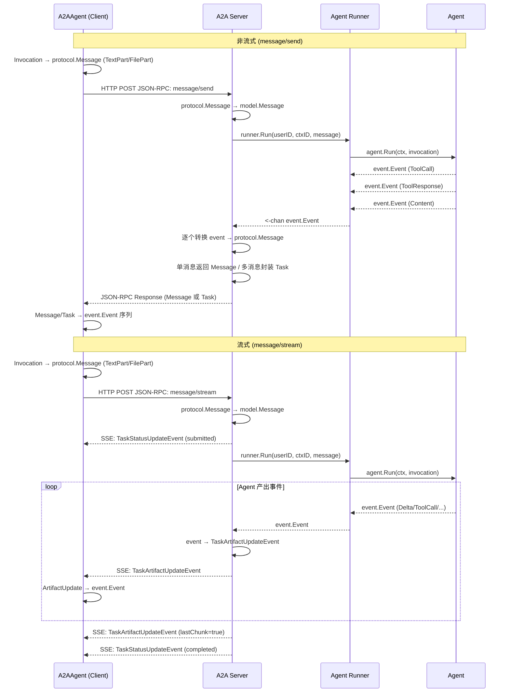
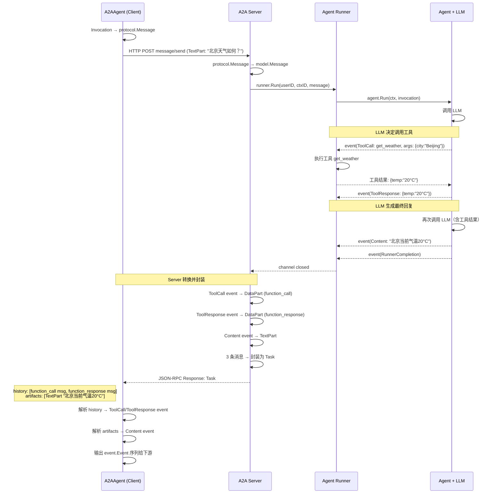
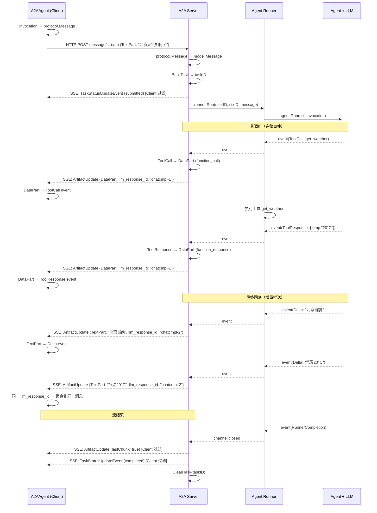

# A2A 协议交互规范

!!! note "说明"
    本文档定义了 trpc-agent-go 框架内部对 A2A 协议的扩展实现规范。普通用户在使用 A2A Client/Server 时无需关注此文档内容，框架已自动处理所有协议转换细节。仅当您需要开发非 trpc-agent-go 的 A2A Client/Server 对接本框架时，才需参考此规范。

## 背景

[A2A (Agent-to-Agent) 协议](https://a2a-protocol.org/latest/specification/) 定义了 Agent 间通信的基础数据模型（Message、Task、Part 等）和操作接口（SendMessage、StreamMessage 等）。A2A 规范在开篇明确了协议的设计目标：

> *The Agent2Agent (A2A) Protocol is an open standard designed to facilitate communication and interoperability between independent, potentially opaque AI agent systems.*
>
> *Its primary goal is to enable agents to:*
>
> - *Discover each other's capabilities.*
> - *Negotiate interaction modalities (text, files, structured data).*
> - *Manage collaborative tasks.*
> - *Securely exchange information to achieve user goals without needing access to each other's internal state, memory, or tools.*
>
> — [A2A Protocol Specification](https://a2a-protocol.org/latest/specification/)

可以看到，A2A 期望 Agent 之间以「黑盒」方式协作——彼此发现能力、协商交互模式、管理协作任务，但不需要访问对方的工具（Tools）、记忆（Memory）和内部状态（Internal State）。基于这一设计理念，Agent 执行过程中的 trace 数据——如工具调用链路（Function Call / Response）、代码执行过程、模型推理步骤（Reasoning）等——并不在 A2A 协议的规范范围内，协议也没有定义这些数据应如何传递。

然而在实际的多 Agent 编排场景中，部分用户希望能够看到远程 Agent 的执行路径，以便进行调试、审计或更精细的协同。考虑到这一需求，trpc-agent-go 利用 A2A 协议预留的扩展机制（`DataPart`、`Message.metadata` 等），在不违背协议规范的前提下支持了这些数据的传递。

本文档定义了 trpc-agent-go 在 A2A 协议之上的**交互规范**，作为 Client 和 Server 实现的标准参考。当 A2A 协议升级时，本文档将同步更新。

!!! info "后续规划"
    为了更好地符合 A2A 规范的设计理念，工具调用等执行过程数据的跨 Agent 传递，后续将设计为独立的 **extension**，用户可通过配置自行决定是否开启。如果希望严格遵循 A2A 的黑盒协作模式、不暴露内部执行细节，关闭即可，此时仅传递最终结果。

> 完整的 A2A 协议规范请参考：https://a2a-protocol.org/latest/specification/
>
> 框架使用指南请参考：[A2A 集成指南](a2a.md)

---

## 版本标识

**当前交互规范版本：`0.1`**

trpc-agent-go 通过 A2A 协议标准的 `AgentCard.capabilities.extensions` 字段声明交互规范版本，使 Client 端在发现远程 Agent 时即可感知对端支持的规范版本，从而在后续升级时实现兼容处理。

此 extension 标识的是 **Agent 交互规范**——即消息编码格式、流式控制约定、metadata 字段定义等整体协议层面的约定。工具调用链路（tool call trace）等执行过程数据的跨 Agent 传递属于独立的能力，后续将通过单独的 extension 来声明和控制开关，不在此 extension 的范围内。

### AgentCard 中的声明

A2A Server 自动生成的 AgentCard 中会包含以下 extension：

```json
{
  "capabilities": {
    "streaming": true,
    "extensions": [
      {
        "uri": "trpc-a2a-version",
        "params": {
          "version": "0.1"
        }
      }
    ]
  }
}
```

| 字段       | 说明                                                                 |
| ---------- | -------------------------------------------------------------------- |
| `uri`      | 扩展标识，固定为 `trpc-a2a-version`                    |
| `required` | 省略（默认 `false`），表示该扩展为声明性的，不强制 Client 必须支持。不认识该扩展的标准 A2A Client 仍可正常进行基础交互 |
| `params.version` | 交互规范版本号，遵循语义化版本（当前为 `0.1`）                |

### 请求中的版本声明

A2A Client 在发送请求（`message/send` 或 `message/stream`）时，会在 Message 的 `metadata` 中携带自身支持的交互规范版本：

```json
{
  "role": "user",
  "parts": [...],
  "metadata": {
    "interaction_spec_version": "0.1",
    "invocation_id": "...",
    "user_id": "..."
  }
}
```

| 字段                          | 说明                                                                 |
| ----------------------------- | -------------------------------------------------------------------- |
| `interaction_spec_version`    | Client 支持的交互规范版本号，Server 可据此决定响应的编码方式          |

Server 端可以根据此字段判断 Client 的能力：
- **字段存在**：Client 是 trpc-agent-go 客户端，支持对应版本的交互规范（如 tool call、reasoning content 等扩展编码）
- **字段不存在**：Client 是标准 A2A 客户端或其他框架的客户端

---

## 整体转换流程



`SendMessage` 等待完整响应后一次性返回，`StreamMessage` 通过 SSE 实时推送增量事件。框架在两端自动完成格式转换。

---

## 事件类型与 A2A 映射


| Agent 事件   | A2A Part 类型                 | Part Metadata                 | Message Metadata               |
| -------------- | ------------------------------- | ------------------------------- | -------------------------------- |
| 文本回复     | `TextPart`                    | —                            | `object_type: chat.completion` |
| 思考内容     | `TextPart`                    | `thought: true`               | 同上                           |
| 工具调用     | `DataPart` (id/name/args)     | `type: function_call`         | `object_type: chat.completion` |
| 工具响应     | `DataPart` (id/name/response) | `type: function_response`     | `object_type: tool.response`   |
| 可执行代码   | `DataPart` (code/language)    | `type: executable_code`       | `tag: code_execution_code`     |
| 代码执行结果 | `DataPart` (output/outcome)   | `type: code_execution_result` | `tag: code_execution_result`   |

---

## 工具调用传递流程

### 非流式 (message/send)

Server 收集所有 Agent 事件后一次性返回。单消息直接返回 `protocol.Message`，多消息封装为 `protocol.Task`（中间过程放 `history`，最终回复放 `artifacts`）。



### 流式 (message/stream)

Server 将每个 Agent 事件实时转换为 SSE `TaskArtifactUpdateEvent` 推送给 Client。工具调用和工具响应作为完整事件发送，文本内容增量推送。



### Client 端过滤规则

- `TaskStatusUpdateEvent`（submitted/completed）：任务生命周期信号，不含用户内容
- `TaskArtifactUpdateEvent` 且 `lastChunk=true`：流结束信号或聚合结果

### `llm_response_id` 的作用

Server 在每个响应的 Metadata 中携带 `llm_response_id`（来自 LLM API 返回的 ID，如 OpenAI 的 `chatcmpl-xxx`）。同一次 LLM 调用产出的所有事件共享相同的 `llm_response_id`，当 Agent 进行第二次 LLM 调用（如工具调用后的最终回复）时，`llm_response_id` 会变化。Client 端据此判断多个增量事件属于同一个消息。

这个机制主要用于 AG-UI 场景下的消息聚合——AG-UI 的 translator 通过 `rsp.ID` 决定何时发送 `TextMessageStart`/`TextMessageEnd` 事件，`llm_response_id` 变化意味着新的消息开始。

---

## 思考内容传递

模型的推理过程（如 DeepSeek R1）通过 `TextPart.metadata.thought` 标记：


| 方向         | ReasoningContent                            | Content                       |
| -------------- | --------------------------------------------- | ------------------------------- |
| Agent → A2A | `TextPart` + `metadata: {thought: true}`    | `TextPart`（无 thought 标记） |
| A2A → Agent | `thought=true` → 还原为 `ReasoningContent` | 无标记 → 还原为`Content`     |

同一个 Message 中可以同时包含思考内容和正式回复两个 TextPart。

---

## Metadata 规范

### 请求方向（Client → Server）


| 载体             | 字段            | 说明                                        |
| ------------------ | ----------------- | --------------------------------------------- |
| HTTP Header      | `X-User-ID`     | 用户标识（主要来源）                        |
| HTTP Header      | `traceparent`   | W3C Trace Context（OpenTelemetry 自动注入） |
| Message.Metadata | `invocation_id` | Client 端调用 ID，用于追踪关联              |
| Message.Metadata | `user_id`       | 用户标识（补充）                            |

### 响应方向（Server → Client）


| 载体                      | 字段              | 说明                                                                                             |
| --------------------------- | ------------------- | -------------------------------------------------------------------------------------------------- |
| Message/Artifact Metadata | `object_type`     | 事件业务类型（`chat.completion`、`tool.response` 等）                                            |
| Message/Artifact Metadata | `tag`             | 事件标签（区分代码执行 vs 代码执行结果）                                                         |
| Message/Artifact Metadata | `llm_response_id` | LLM 响应 ID（用于 Client 端消息聚合，如 OpenAI 的`chatcmpl-xxx`）                                |
| Part Metadata             | `type`            | 数据语义类型（`function_call`、`function_response`、`executable_code`、`code_execution_result`） |
| Part Metadata             | `thought`         | 是否为思考/推理内容                                                                              |

---

## 网络包示例

### 非流式：包含工具调用的请求与响应

**请求：**

```http
POST / HTTP/1.1
Host: agent.example.com
Content-Type: application/json
X-User-ID: user_12345
traceparent: 00-4bf92f3577b34da6a3ce929d0e0e4736-00f067aa0ba902b7-01

{
  "jsonrpc": "2.0",
  "id": "req-001",
  "method": "message/send",
  "params": {
    "message": {
      "kind": "message",
      "messageId": "msg-001",
      "role": "user",
      "contextId": "ctx-001",
      "parts": [
        { "kind": "text", "text": "北京天气如何？" }
      ],
      "metadata": {
        "invocation_id": "inv-001",
        "user_id": "user_12345"
      }
    }
  }
}
```

**响应（Task，包含工具调用中间过程）：**

```http
HTTP/1.1 200 OK
Content-Type: application/json

{
  "jsonrpc": "2.0",
  "id": "req-001",
  "result": {
    "id": "task-001",
    "contextId": "ctx-001",
    "status": {
      "state": "completed",
      "timestamp": "2025-01-23T10:30:00Z"
    },
    "history": [
      {
        "kind": "message",
        "messageId": "msg-tool-call",
        "role": "agent",
        "parts": [
          {
            "kind": "data",
            "data": {
              "id": "call_001",
              "type": "function",
              "name": "get_weather",
              "args": "{\"city\":\"Beijing\"}"
            },
            "metadata": { "type": "function_call" }
          }
        ],
        "metadata": {
          "object_type": "chat.completion",
          "tag": "",
          "llm_response_id": "chatcmpl-abc123"
        }
      },
      {
        "kind": "message",
        "messageId": "msg-tool-resp",
        "role": "agent",
        "parts": [
          {
            "kind": "data",
            "data": {
              "id": "call_001",
              "name": "get_weather",
              "response": "{\"temp\":\"20°C\",\"condition\":\"sunny\"}"
            },
            "metadata": { "type": "function_response" }
          }
        ],
        "metadata": {
          "object_type": "tool.response",
          "tag": "",
          "llm_response_id": "chatcmpl-abc123"
        }
      }
    ],
    "artifacts": [
      {
        "artifactId": "msg-final",
        "parts": [
          { "kind": "text", "text": "北京当前气温20°C，天气晴朗。" }
        ]
      }
    ]
  }
}
```

### 流式：包含工具调用的 SSE 事件序列

**请求：**

```http
POST / HTTP/1.1
Host: agent.example.com
Content-Type: application/json
X-User-ID: user_12345
Accept: text/event-stream

{
  "jsonrpc": "2.0",
  "id": "req-002",
  "method": "message/stream",
  "params": {
    "message": {
      "kind": "message",
      "messageId": "msg-002",
      "role": "user",
      "contextId": "ctx-001",
      "parts": [
        { "kind": "text", "text": "北京天气如何？" }
      ],
      "metadata": {
        "invocation_id": "inv-002",
        "user_id": "user_12345"
      }
    }
  }
}
```

**SSE 响应：**

```
event: message
data: {"kind":"status-update","taskId":"task-002","contextId":"ctx-001","status":{"state":"submitted","timestamp":"2025-01-23T10:30:00Z"},"final":false}

event: message
data: {"kind":"artifact-update","taskId":"task-002","contextId":"ctx-001","artifact":{"artifactId":"chatcmpl-abc123","parts":[{"kind":"data","data":{"id":"call_001","type":"function","name":"get_weather","args":"{\"city\":\"Beijing\"}"},"metadata":{"type":"function_call"}}]},"lastChunk":false,"metadata":{"object_type":"chat.completion","tag":"","llm_response_id":"chatcmpl-abc123"}}

event: message
data: {"kind":"artifact-update","taskId":"task-002","contextId":"ctx-001","artifact":{"artifactId":"chatcmpl-abc123","parts":[{"kind":"data","data":{"id":"call_001","name":"get_weather","response":"{\"temp\":\"20°C\"}"},"metadata":{"type":"function_response"}}]},"lastChunk":false,"metadata":{"object_type":"tool.response","tag":"","llm_response_id":"chatcmpl-abc123"}}

event: message
data: {"kind":"artifact-update","taskId":"task-002","contextId":"ctx-001","artifact":{"artifactId":"chatcmpl-def456","parts":[{"kind":"text","text":"北京当前"}]},"lastChunk":false,"metadata":{"object_type":"chat.completion.chunk","tag":"","llm_response_id":"chatcmpl-def456"}}

event: message
data: {"kind":"artifact-update","taskId":"task-002","contextId":"ctx-001","artifact":{"artifactId":"chatcmpl-def456","parts":[{"kind":"text","text":"气温20°C，天气晴朗。"}]},"lastChunk":false,"metadata":{"object_type":"chat.completion.chunk","tag":"","llm_response_id":"chatcmpl-def456"}}

event: message
data: {"kind":"artifact-update","taskId":"task-002","contextId":"ctx-001","artifact":{"parts":[]},"lastChunk":true}

event: message
data: {"kind":"status-update","taskId":"task-002","contextId":"ctx-001","status":{"state":"completed","timestamp":"2025-01-23T10:30:05Z"},"final":true}

```

### 非流式：包含思考内容的响应

```http
HTTP/1.1 200 OK
Content-Type: application/json

{
  "jsonrpc": "2.0",
  "id": "req-003",
  "result": {
    "kind": "message",
    "messageId": "msg-thinking-001",
    "role": "agent",
    "contextId": "ctx-001",
    "parts": [
      {
        "kind": "text",
        "text": "让我一步步分析这个问题...",
        "metadata": { "thought": true }
      },
      {
        "kind": "text",
        "text": "北京当前气温20°C。"
      }
    ],
    "metadata": {
      "object_type": "chat.completion",
      "tag": "",
      "llm_response_id": "chatcmpl-ghi789"
    }
  }
}
```

### 流式：并行工具调用

多个工具调用放在同一个 `artifact-update` 的 `parts` 数组中：

```
event: message
data: {"kind":"artifact-update","taskId":"task-003","contextId":"ctx-001","artifact":{"artifactId":"chatcmpl-jkl012","parts":[{"kind":"data","data":{"id":"call_001","type":"function","name":"get_weather","args":"{\"city\":\"Beijing\"}"},"metadata":{"type":"function_call"}},{"kind":"data","data":{"id":"call_002","type":"function","name":"get_weather","args":"{\"city\":\"Shanghai\"}"},"metadata":{"type":"function_call"}}]},"lastChunk":false,"metadata":{"object_type":"chat.completion","tag":"","llm_response_id":"chatcmpl-jkl012"}}

event: message
data: {"kind":"artifact-update","taskId":"task-003","contextId":"ctx-001","artifact":{"artifactId":"chatcmpl-jkl012","parts":[{"kind":"data","data":{"id":"call_001","name":"get_weather","response":"{\"temp\":\"20°C\"}"},"metadata":{"type":"function_response"}},{"kind":"data","data":{"id":"call_002","name":"get_weather","response":"{\"temp\":\"22°C\"}"},"metadata":{"type":"function_response"}}]},"lastChunk":false,"metadata":{"object_type":"tool.response","tag":"","llm_response_id":"chatcmpl-jkl012"}}

```

---

## 分布式追踪

### Trace Context 传播

分布式追踪通过 HTTP Header 传播，遵循 [W3C Trace Context](https://www.w3.org/TR/trace-context/) 标准：

- **Client 端**：通过 OpenTelemetry 的 `TextMapPropagator` 自动将 `traceparent` header 注入到 HTTP 请求中
- **Server 端**：自动从 HTTP 请求的 `traceparent` header 中提取 trace context，注入到 `context.Context` 中，后续全链路可用

### 应用层追踪字段

除 HTTP 层的 trace context 外，应用层通过 `Message.Metadata` 传递补充追踪信息：

- **`invocation_id`**（请求 Metadata）：标识 Client 端的单次 Agent 调用，Server 端可用于日志关联
- **`llm_response_id`**（响应 Metadata）：标识 LLM 的原始响应 ID，Client 端用于消息聚合

