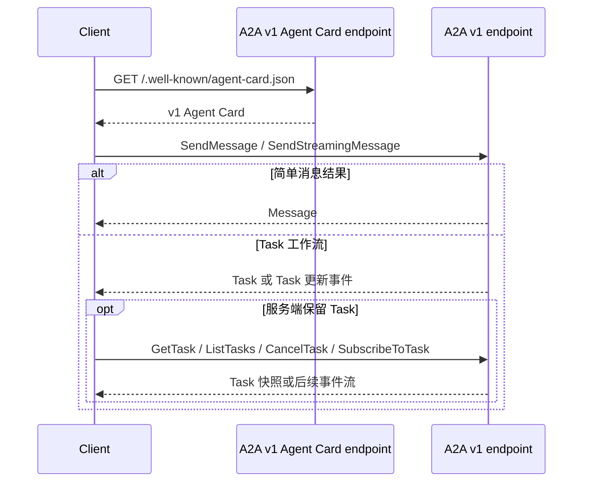
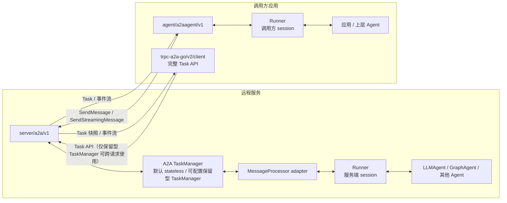
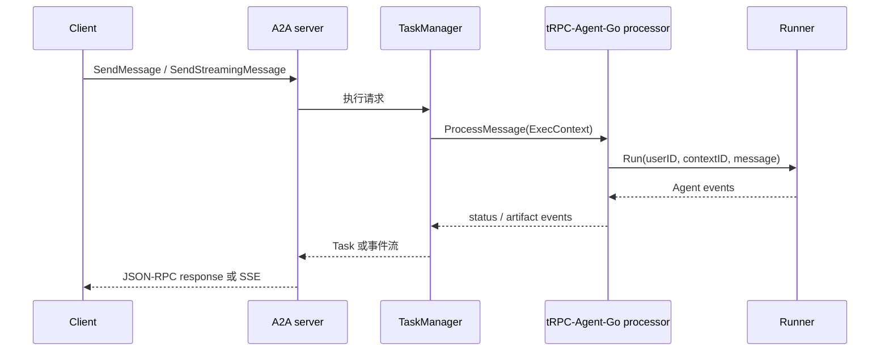

# tRPC-Agent-Go A2A v1.0 接入与迁移指南

本文从使用者的角度介绍 A2A 协议、`trpc-a2a-go` 与 tRPC-Agent-Go 的接入架构，然后给出推荐使用的 A2A v1.0 接入方式、Task 与多节点部署边界、旧版 A2A v0.2.x 接入和迁移指南。现有 v0.2.x 接入说明请参考 [A2A 集成指南](a2a.md)。

## A2A 协议介绍

A2A（Agent-to-Agent）是用于发现和调用远程 AI Agent 的协议。调用方不需要了解远程 Agent 使用了什么框架、模型或工具。

主要协议概念如下：

| 概念 | 含义 |
|---|---|
| Agent Card | 描述 Agent 身份、能力和调用方式的公开信息 |
| Message | 用户与 Agent 之间的一轮消息 |
| Part | Message 或 Artifact 携带的文本、文件或结构化数据 |
| Task | 具有生命周期、可以观察和继续操作的一次工作 |
| Artifact | Task 产生的交付物 |
| Context ID | 多个 Message 或 Task 共享的会话标识 |
| Task ID | 一次 Task 生命周期的标识 |

一次典型的 A2A v1.0 调用分为两步：

1. 获取远程 **Agent Card**，了解服务地址、身份、技能、输入输出类型、流式能力和鉴权要求。
2. 向 Agent Card 声明的端点发送消息，接收直接 `Message` 或可跟踪的 `Task`。



简单问答可以直接返回 `Message`；需要进度、Artifact、中断、取消或后续查询的工作可以使用 `Task`。两者都属于协议结果，Task 也不是对话 session 的替代品。

A2A v1.0 支持阻塞 `SendMessage`、实时 `SendStreamingMessage`，以及发起后通过 Task API 查询、取消或重新订阅的交互方式；继续挂起的 Task 则需要携带原 Task ID 再次发送 Message。具体选择取决于服务端是否在请求结束后保留 Task，后文会给出选择方式。

### 从 v0.x 到 v1.0

A2A 协议已经从 v0.x 演进到 v1.0。[官方 v1.0 公告](https://a2a-protocol.org/latest/announcing-1.0/)明确说明 interaction protocol 包含破坏性变更；[官方迁移指南](https://a2a-protocol.org/latest/whats-new-v1/)以 v0.3.0 为对比基线，列出了下面这些核心变化。tRPC-Agent-Go 的旧版接入实现更早的 v0.2.x，它与 v0.3.0 同属需要迁移的 v0.x 协议线，但具体字段仍应以各自版本的协议定义为准。

| 维度 | v0.3.0（官方迁移基线） | v1.0 |
|---|---|---|
| Part 内容模型 | `TextPart`、`FilePart` 和 `DataPart` 是不同类型，通过 `kind` 区分 | 统一为一个 `Part`，通过 `text`、`raw`、`url` 或 `data` 成员表达内容 |
| 流式事件 | 事件自身携带 `kind`，`TaskStatusUpdateEvent` 使用 `final` 表示结束 | 事件使用成员名区分具体类型，移除 `kind` 和 `final`，由 stream 关闭表达结束 |
| 枚举值 | `user`、`completed` 等小写值 | `ROLE_USER`、`TASK_STATE_COMPLETED` 等带类型前缀的枚举值 |
| Agent Card | 端点、传输和协议版本主要由顶层字段表达 | 使用 `supportedInterfaces` 声明 URL、binding 和协议版本，可以同时公布多种接口 |
| 操作和 Task | `message/send`、`tasks/get` 等斜杠形式 method，没有 `ListTasks`，部分 Task 行为定义较宽松 | 使用 `SendMessage`、`GetTask` 等 operation，增加 `ListTasks`，并明确 Message/Task 返回、订阅和取消语义 |
| 协议 binding | `a2a.proto` 更接近 gRPC 实现定义，不同 binding 的等价性约束较弱 | 以 `a2a.proto` 作为协议无关的规范来源，正式定义 JSON-RPC、HTTP+JSON/REST 与 gRPC 的等价映射 |

因此，A2A v1.0 并非只调整 method 名称，而是同时改变了序列化模型、事件判别方式、Agent 发现结构和 Task 交互语义。在没有兼容层时，v0.x 客户端的请求不能直接由 v1.0 服务端处理。

## trpc-a2a-go 介绍

[`trpc-a2a-go`](https://github.com/trpc-group/trpc-a2a-go) 是 tRPC 的 A2A 协议 Go 实现，提供协议类型以及客户端和服务端两侧的基础能力。

为了让应用渐进迁移，`trpc-a2a-go` 使用新的 `/v2` Go module 实现 A2A v1.0，原有 module 继续承载 v0.2.x；tRPC-Agent-Go 相应新增 `server/a2a/v1` 和 `agent/a2aagent/v1`，原有 `server/a2a` 和 `agent/a2aagent` 将继续维护，直到大部分用户迁移至 v1。

对于迁移期间仍需服务的旧版客户端，`trpc-a2a-go/v2` 提供 `compat/v0` 转换层，tRPC-Agent-Go 可以在新的 v1 服务端上显式启用该兼容能力。

包和协议版本的对应关系如下：

| A2A 协议 | tRPC-Agent-Go Server | tRPC-Agent-Go 远程 Agent | `trpc-a2a-go` module |
|---|---|---|---|
| v1.0 | `server/a2a/v1` | `agent/a2aagent/v1` | `trpc-a2a-go/v2` |
| v0.2.x | `server/a2a` | `agent/a2aagent` | `trpc-a2a-go` |

tRPC-Agent-Go 的 `/v1` 后缀表示 A2A 协议 v1.0；`trpc-a2a-go/v2` 中的 `/v2` 是 Go module major version。两者属于不同仓库的版本命名，不要把 `/v2` 理解为 A2A 协议 v2。

`trpc-a2a-go/v2` 的主要层次如下：

| 层次 | 职责 |
|---|---|
| `protocol` | Agent Card、Message、Task、Artifact、事件和请求类型 |
| `client` | Agent 发现、JSON-RPC 调用和 SSE 事件流 |
| `server` | Agent Card 端点、鉴权、JSON-RPC 分发和 SSE |
| `taskmanager` | 请求执行策略、Task 生命周期、保留和事件分发 |
| `compat/v0` | 在 v0.2.x wire 协议与 v1.0 核心模型之间转换 |

服务端把具体工作交给 `MessageProcessor`，后者读取 `ExecContext` 并产生一条协议事件流。`TaskManager` 消费同一条事件流，决定当前调用是请求内执行还是需要保留 Task，并生成阻塞、流式、查询和订阅等协议行为；服务端本身负责 Agent Card、wire 协议、路由和中间件。tRPC-Agent-Go 接入使用的正是这些扩展边界。

`trpc-a2a-go` 使用 lazy Task 机制：`MessageProcessor` 只产生 Message 时不会创建 Task；首次产生 status 或 artifact 事件时，TaskManager 才创建本次执行使用的 Task。保留型 TaskManager 会在请求结束后继续保存这个 Task，stateless TaskManager 则只在当前请求内处理它。

## tRPC-Agent-Go 的 A2A 接入架构

tRPC-Agent-Go 在 `trpc-a2a-go` 之上提供适配器，并没有重新实现另一套 A2A 传输或 Task 系统。这套接入是连接本地 Agent 与远程服务的协议边界，不是与 LLMAgent、GraphAgent 并列的第三种本地执行引擎。

服务端适配器把 A2A 请求转换为 Runner invocation，再把 Runner event 转换回 A2A event，因此 Runner 后面可以是 LLMAgent、GraphAgent 或任何其他 Agent。客户端 `A2AAgent` 把远程 A2A 服务封装为标准的 tRPC-Agent-Go Agent，Runner、父 Agent 或 Graph 节点可以像调用本地 Agent 一样调用它。



### A2A 接入提供的能力

这套接入提供三类能力：

- **把本地 Agent 发布为 A2A 服务：** `server/a2a/v1` 发布 Agent Card，把 A2A Message、context ID、用户身份和 metadata 转换为 Runner invocation，再把 Runner 产生的文本、多模态内容、工具调用、状态和错误转换为 A2A 事件。W3C trace context 则通过 HTTP 请求头跨越协议边界传播。LLMAgent、GraphAgent 和自定义 Agent 都可以通过同一个 Runner 接入。
- **像本地 Agent 一样调用远程服务：** `agent/a2aagent/v1` 发现远程 Agent Card 并实现统一的 `agent.Agent` 接口，把本地 invocation 转换为阻塞或流式 A2A 请求，再把远程 Message、Task、Artifact、工具调用和错误转换回 tRPC-Agent-Go 事件。
- **按需使用完整 A2A Task API：** `A2AAgent` 只封装普通 Agent invocation；需要 Task 查询、列表、取消、重新订阅或 push notification 时，直接使用 `trpc-a2a-go/v2/client`：`GetTasks` 调用 v1 `GetTask` operation，`ListTasks` 调用 `ListTasks`，`CancelTasks` 调用 `CancelTask`，`ResubscribeTask` 调用 `SubscribeToTask`。

服务端适配器会接入 `trpc-a2a-go` 的中间件链，并默认从 `X-User-ID` 请求头解析 Runner user ID；这个默认行为只是身份传递，不等于业务鉴权。生产服务仍需要通过网关或底层 A2A 服务端中间件完成认证、授权和 Task 归属校验。

当前 `server/a2a/v1` 实例绑定一个 Agent Card 和一个 Runner。底层 `trpc-a2a-go` 即使配置了 tenant Agent Card，也不会让这个适配器自动按 tenant 分发到不同 Runner；需要多 Agent 托管时，应用应在适配器外路由到不同服务实例，或者让固定 Runner 后面的 Agent 完成应用级业务路由。后一种方式不会读取或保留 A2A `tenant` 的协议分发语义。

### 与 LLMAgent、GraphAgent 的区别

A2AAgent 与本地 Agent 的区别如下：

| Agent 类型 | 核心职责 | 实际执行位置 | 主要状态 |
|---|---|---|---|
| LLMAgent | 基于模型进行推理、选择工具和多轮交互 | 当前进程 | Runner session |
| GraphAgent | 按节点、边和状态转换执行可控工作流 | 当前进程 | Runner session 和 Graph state/checkpoint |
| A2AAgent | 把 Agent invocation 转发给远程 A2A 服务 | 远程服务 | 调用方 Runner session；其他状态由远端实现管理 |

LLMAgent 直接持有 Model、Tool 和 SubAgent 配置；GraphAgent 持有工作流结构并支持 checkpoint、中断和恢复；A2AAgent 本地不持有远端的模型或工具配置，其 `Tools()` 和 `SubAgents()` 为空，远端能力由 Agent Card 声明，远端是否保留 A2A Task 则取决于其实现，使用 `trpc-a2a-go` 时由 TaskManager 决定。这些类型可以组合使用：LLMAgent 或 GraphAgent 可以通过 Runner 暴露为 A2A 服务，A2AAgent 也可以作为父 Agent 的 SubAgent 或 Graph 中的 Agent 节点。

它们的主要区别不是能力强弱，而是执行逻辑位于本地还是远端，以及调用是否跨越 A2A 协议边界。A2A 解决的是远程发现和互操作问题；LLMAgent 与 GraphAgent 解决的是本地推理和编排问题。

### 状态边界

从服务端接入点看，默认 stateless TaskManager 不会跨请求保留 A2A Task，因此默认只有 Runner session 这一类跨请求状态。只有配置 memory、Redis 或自定义保留型 TaskManager，开启完整 A2A Task 管理能力后，服务端才会同时存在 Runner session 和 A2A Task 两类相互独立的状态。

在 tRPC-Agent-Go 调用另一套 tRPC-Agent-Go 服务的完整链路中，调用方和服务端通常各自拥有独立的 Runner session store；A2A context ID 用于关联两端调用，但不会合并这两个存储。后文会继续说明可选的 A2A Task 状态和多节点部署要求。

## A2A v1.0 接入

新应用应使用 v1 包。

### 创建 v1 Server

v1 服务端接收由调用方持有的 Runner 和显式 Agent Card。这样可以在创建服务端时明确 Runner 所有权、session 配置和对外发布的 A2A 身份。

```go
import (
    "trpc.group/trpc-go/trpc-agent-go/runner"
    "trpc.group/trpc-go/trpc-agent-go/session/inmemory"
    a2aserver "trpc.group/trpc-go/trpc-agent-go/server/a2a/v1"
)

agentRunner := runner.NewRunner(
    "my-app",
    llmAgent,
    runner.WithSessionService(inmemory.NewSessionService()),
)
defer agentRunner.Close()

card, err := a2aserver.NewAgentCard(
    llmAgent.Info().Name,
    llmAgent.Info().Description,
    "1.0.0",                  // Agent 实现版本。
    "agent.example.com:8888", // 对客户端发布的可达地址。
    true,                     // 声明支持流式响应。
    a2aserver.WithCardTools(llmAgent.Tools()...),
)
if err != nil {
    return err
}

server, err := a2aserver.New(
    a2aserver.WithRunner(agentRunner),
    a2aserver.WithAgentCard(card),
)
if err != nil {
    return err
}
return server.Start("0.0.0.0:8888")
```

Agent Card 地址用于服务发现和路由，可以与传给 `Start` 的监听地址不同。

内置 converter 可以映射 image、audio 和 file 等多模态内容，但 `NewAgentCard` 默认只声明 `text` 输入输出模式。服务需要让客户端发现多模态能力时，应在传给 `WithAgentCard` 的 Agent Card 中显式声明对应的 input/output modes。

Runner 生命周期归调用方所有。服务端创建失败或者停止后，调用方都需要关闭 Runner。

### 调用远程 A2A Agent

`agent/a2aagent/v1` 会发现远程 Agent Card，并实现普通的 tRPC-Agent-Go Agent 接口：

```go
import (
    "context"

    a2aagent "trpc.group/trpc-go/trpc-agent-go/agent/a2aagent/v1"
    "trpc.group/trpc-go/trpc-agent-go/model"
    "trpc.group/trpc-go/trpc-agent-go/runner"
    "trpc.group/trpc-go/trpc-agent-go/session/inmemory"
)

remoteAgent, err := a2aagent.New(
    a2aagent.WithAgentCardURL("https://agent.example.com"),
)
if err != nil {
    return err
}

remoteRunner := runner.NewRunner(
    "a2a-client",
    remoteAgent,
    runner.WithSessionService(inmemory.NewSessionService()),
)
defer remoteRunner.Close()

events, err := remoteRunner.Run(
    context.Background(),
    "user-1",
    "session-1",
    model.NewUserMessage("What time is it?"),
)
if err != nil {
    return err
}
for event := range events {
    // 与本地 Agent 一样消费 tRPC-Agent-Go 事件。
    _ = event
}
```

适配器会进行以下映射：

- 本地 session ID → A2A context ID；
- 本地 user ID → `X-User-ID` 请求头；
- 本地输入的 text 和多模态 `ContentPart` → A2A Part；
- 远端 Runner 产生的工具调用和工具结果 → 服务端编码的结构化 data Part → A2AAgent 恢复的本地事件；
- 远程 A2A Message、Task 和事件 → tRPC-Agent-Go event。

除非业务显式覆盖，否则 A2AAgent 会根据 Agent Card 自动选择流式或阻塞调用。它处理的是一次普通 Agent invocation；需要 Task 查询、取消或重新订阅时，应直接使用底层 `trpc-a2a-go/v2/client`。

### 运行普通 Agent 调用示例

示例使用支持 session 的 LLMAgent，并配置了 `current_time` 工具。先设置模型配置：

```bash
export OPENAI_API_KEY="<your-api-key>"
export MODEL_NAME="<your-model>"
# 使用 OpenAI 兼容服务时再设置 OPENAI_BASE_URL。
```

启动服务端：

```bash
cd examples
go run ./a2aagent/v1/server
```

在另一个终端启动客户端：

```bash
cd examples
go run ./a2aagent/v1/client
```

询问当前时间可以观察工具调用和工具结果通过 A2A 传递。客户端保留同一个 session ID 时，远端 Runner session 会继续同一段对话；使用 `/new` 或 `/use` 可以切换 session。服务端增加 `-streaming=false` 可以验证阻塞 `SendMessage`。

### 请求生命周期

内置适配器实现 `trpc-a2a-go` 的 `MessageProcessor` 接口。非流式和流式请求都经过同一条链路：



适配器始终通过同一条事件链转换 Runner 输出，不再为流式和非流式请求分别实现 `MessageProcessor`。成功执行通常经历 `submitted → 输出 → completed`；失败会进入 `failed`，`input-required` 或 `auth-required` 等挂起状态也通过同一条事件流表达。

### 默认 stateless TaskManager

v1 服务端默认使用 `taskmanager/stateless`。准确地说，**stateless 的是 TaskManager**；`MessageProcessor` 仍负责执行 Runner 并产生完整 Task 生命周期。

默认 TaskManager 会：

- 在当前 HTTP 请求生命周期内运行 `MessageProcessor`；
- 根据 status 和 artifact 事件构造本次执行使用的 Task；
- 返回终态 Task 或实时转发事件；
- 请求结束后丢弃 Task、事件日志和协议 history；
- 拒绝需要脱离当前 HTTP 请求继续执行、需要跨请求读取 Task 状态，或者进入 `input-required`、`auth-required` 等等待后续请求继续执行的操作。

底层 stateless TaskManager 允许自定义 `MessageProcessor` 直接返回 Message，但 tRPC-Agent-Go 内置适配器会从 `submitted` 开始为 Runner 调用产生 Task 生命周期，成功时以 `completed` 结束。因此，默认服务端的阻塞调用返回的是仅在本次请求内存在的终态 Task；stateless 表示不跨请求保留 Task，并不表示只返回 Message。

这个默认值适合普通的请求/响应 Agent 调用：没有 Task 清理成本、没有存储依赖，也不需要跨请求保持 Task 亲和性。`returnImmediately=true` 会被拒绝，不是因为 A2A 不能立即返回 Message，而是 stateless TaskManager 将执行绑定在当前请求，无法在 HTTP 响应结束后继续可靠执行。对话连续性仍由 Runner session service 提供。

### 保留型 Task 管理

客户端需要异步执行、Task 查询，或者对未结束 Task 进行取消、重新订阅和 continuation 时，再配置保留型 TaskManager。push notification 还需要在所选 TaskManager 上单独启用，不能仅靠“保留 Task”自动获得。

单进程服务可以使用 memory TaskManager：

```go
import (
    "trpc.group/trpc-go/trpc-a2a-go/v2/taskmanager"
    memorytaskmanager "trpc.group/trpc-go/trpc-a2a-go/v2/taskmanager/memory"
)

server, err := a2aserver.New(
    a2aserver.WithRunner(agentRunner),
    a2aserver.WithAgentCard(card),
    a2aserver.WithTaskManagerBuilder(func(
        processor taskmanager.MessageProcessor,
    ) (taskmanager.TaskManager, error) {
        return memorytaskmanager.NewTaskManager(processor)
    }),
)
```

memory Task 状态只存在于当前进程，重启后会丢失，并且默认不会自动清理终态 Task。生产服务应根据需要通过 `memorytaskmanager.WithTaskTTL(...)` 配置留存时间。

开启保留型 TaskManager 后，系统中会同时存在两套相互独立的状态：

| 状态系统 | 所有者 | 用途 |
|---|---|---|
| Runner session | 每个 tRPC-Agent-Go 应用自己的 session service | 对话历史、应用状态和多轮 Agent 上下文 |
| A2A Task | `trpc-a2a-go` TaskManager | 协议 Task 状态、Artifact、查询、取消、重新订阅和 push 配置 |

保留 A2A Task 不会替代 Runner session；同样，Runner session 可以持久化也不代表原请求结束后还能调用 `GetTask`。应用需要根据对话连续性和协议 Task 操作两个维度分别选择存储。

### 多节点部署

v1 adapter 可以部署在负载均衡器后面，但正确拓扑取决于应用实际使用的状态能力。

| 部署方式 | 可跨副本工作的能力 | 额外要求 |
|---|---|---|
| Stateless TaskManager | 阻塞和流式请求 | 对话上下文需要跨节点连续时，共享 Runner session store 或使用会话亲和性 |
| Memory TaskManager | Task 操作均不能跨副本 | 同一 Task 的所有操作必须路由到持有它的节点 |
| Redis TaskManager | 共享 Task 快照、协议历史、查询和列表 | 使用独立的 Redis TaskManager module，并让所有副本连接同一套 Redis |
| Redis + 跨节点 resubscribe | `SubscribeToTask` 可以通过其他副本重新连接 | 每个副本都启用 `WithCrossNodeResubscribe(true)` |

Redis TaskManager 只解决 Task 状态共享，跨节点重新订阅也不等于分布式执行。它不提供跨副本 exactly-once 协调、全局实时执行注册表或实时取消路由；需要这些保证时，应用仍需使用粘性路由或独立的执行协调方案。

A2A Task 与 Runner session 是两套独立状态。如果对话也需要跨节点连续，Runner 仍需使用共享 session service 或配置会话亲和性。

### v1 常用配置

服务端适配器的常用配置如下：

| 配置 | 用途 |
|---|---|
| `WithRunner` | 设置由调用方持有的 Runner |
| `WithAgentCard` | 设置对外发布的 Agent 身份和能力 |
| `WithTaskManagerBuilder` | 替换默认 stateless TaskManager |
| `WithV0Compatibility` | 在 v1 端点上处理 v0.2.x method |
| `WithUserIDHeader` | 修改用户身份请求头 |
| `WithRunOptions` | 为每次 Runner invocation 增加 option |
| `WithProcessMessageHook` | 包装入站 A2A 消息处理 |
| `WithResponseRewriter` | 改写出站 A2A 事件 |
| `WithExtraA2AOptions` | 向底层 A2A 服务端传递鉴权、中间件等配置 |

A2AAgent 的常用配置如下：

| 配置 | 用途 |
|---|---|
| `WithAgentCardURL`、`WithAgentCard` | 通过 URL 发现或直接提供远程 Agent Card |
| `WithEnableStreaming` | 覆盖 Agent Card 声明的流式能力选择 |
| `WithUserIDHeader` | 修改传递用户身份的请求头 |
| `WithTransferStateKey` | 选择需要通过 Message metadata 传递的 invocation `RuntimeState` |
| `WithA2AClientExtraOptions` | 向底层 A2A 客户端传递配置 |
| `WithBuildMessageHook` | 在发送前改写 A2A Message |

入站 Message metadata 属于调用方可控输入。服务端应通过 `WithProcessMessageHook` 安装自定义 processor，并在调用内置 processor 前过滤 metadata；客户端应将 `WithTransferStateKey` 限制为非安全敏感键。tenant、role、policy 等授权状态必须来自已认证或不可变的服务端上下文。

只有内置的文本、多模态内容、工具、代码执行和 metadata 映射无法满足需求时，才需要使用自定义 converter、Part mapper、hook 或 response rewriter。

## 旧版协议 v0.2.x 接入

已有应用可以继续使用不带 `/v1` 后缀的 `server/a2a` 和 `agent/a2aagent`，它们依赖 `trpc-a2a-go` 根 module 并实现 A2A v0.2.x。

这些包处于兼容维护阶段，但仍然是可以独立使用的 A2A 适配器，而不只是指向 v1 的兼容别名。新应用应该直接使用 v1 包；仍在维护 v0.2.x 服务或客户端的用户可以继续使用下面的能力。

### v0.2.x 能力范围

| 能力 | 旧版接入行为 |
|---|---|
| 发布本地 Agent | `server/a2a` 发布旧版 Agent Card，处理 JSON-RPC 与 SSE，并把 A2A 请求交给 Runner |
| 调用远程 Agent | `agent/a2aagent` 自动发现旧版 Agent Card，并以标准 `agent.Agent` 接口提供阻塞或流式调用 |
| Runner 与 session | 可以使用隐式 Runner，也可以传入应用持有的 Runner；A2A context ID 成为服务端 Runner session ID |
| 身份、状态和追踪 | 通过 HTTP header 传递 user ID 和 W3C trace context，通过 Message metadata 传递 invocation `RuntimeState` |
| 内容和事件转换 | 支持文本、图片、音频、文件输入，以及文本、reasoning、工具调用、工具结果、代码执行和状态增量等扩展事件 |
| 扩展能力 | 支持 hook、自定义 converter、Part mapper、响应改写、Graph event allowlist、ADK metadata、动态 Agent Card 和底层 A2A 选项 |

`A2AAgent` 本地不持有远端 Model、Tool 或 SubAgent，其 `Tools()` 和 `SubAgents()` 为空；远端能力仍由 Agent Card 描述。它可以放在 Runner 后面，也可以作为父 Agent 的 SubAgent 或 Graph 中的 Agent 节点。

`NewAgentCard` 默认只声明 `text` 输入输出模式，即使内置 converter 可以处理图片、音频和文件。旧版服务确实接收这些类型时，应用应提供准确的自定义 Agent Card，避免客户端只根据默认 Card 得出错误的能力判断。

### 创建旧版 A2A Server

旧版服务端保留了直接接收 Agent 的便捷入口。调用方没有提供 Runner 和 session service 时，服务端会自动创建默认 Runner 和 in-memory session service：

```go
import a2aserver "trpc.group/trpc-go/trpc-agent-go/server/a2a"

server, err := a2aserver.New(
    a2aserver.WithHost("127.0.0.1:8888"),
    a2aserver.WithAgent(llmAgent, true),
)
if err != nil {
    return err
}
return server.Start("127.0.0.1:8888")
```

`WithAgent(llmAgent, true)` 中的布尔值只用于声明自动生成的 Agent Card 支持 streaming，不是 Runner 的执行开关。服务端是否处理流式请求由客户端调用的 `message/stream` 决定。

需要自行配置 session service、memory service 或 Runner 生命周期时，可以改用显式 Runner 和 Agent Card：

```go
sessionService := sessionmemory.NewSessionService()
agentRunner := runner.NewRunner(
    llmAgent.Info().Name,
    llmAgent,
    runner.WithSessionService(sessionService),
)
defer agentRunner.Close()

card, err := a2aserver.NewAgentCard(
    llmAgent.Info().Name,
    llmAgent.Info().Description,
    "127.0.0.1:8888",
    true,
    a2aserver.WithCardTools(llmAgent.Tools()...),
)
if err != nil {
    return err
}

server, err := a2aserver.New(
    a2aserver.WithRunner(agentRunner),
    a2aserver.WithAgentCard(card),
)
```

`WithAgent` 与 `WithRunner` 互斥。使用显式 Runner 时，Runner 的关闭、session 和 memory 由应用管理，Agent Card 中的地址、streaming capability 和 skills 也由应用维护；`WithSessionService` 只用于旧版服务端隐式创建 Runner 的路径。

`WithHost` 支持带 path 的 URL，path 会成为这个 A2A Server 的 base path。需要在一个端口托管多个旧版 Agent 时，可以为每个 Runner 创建独立的 Server 和 Agent Card，再通过各自的 `Handler()` 挂到同一个 HTTP mux。

### 调用旧版 A2A 服务

旧版远程 Agent 使用不带 `/v1` 的包，并可以通过 URL 自动发现 Agent Card：

```go
import a2aagent "trpc.group/trpc-go/trpc-agent-go/agent/a2aagent"

remoteAgent, err := a2aagent.New(
    a2aagent.WithAgentCardURL("http://127.0.0.1:8888"),
)
```

创建完成后，它与其他 Agent 一样通过 Runner 调用：

```go
clientRunner := runner.NewRunner(
    "caller-app",
    remoteAgent,
    runner.WithSessionService(sessionmemory.NewSessionService()),
)
defer clientRunner.Close()

events, err := clientRunner.Run(
    ctx,
    "user-1",
    "session-1",
    model.NewUserMessage("请介绍一下你能完成的任务"),
)
```

旧版 `A2AAgent` 按下面的优先级决定使用 `message/send` 还是 `message/stream`：

1. 单次 Runner 调用传入的 `agent.WithStream(...)`。
2. 创建 A2AAgent 时传入的 `WithEnableStreaming(...)`。
3. 远端 Agent Card 的 streaming capability。
4. 都没有声明时使用非流式调用。

Agent Card 声明的是服务端能力，调用方仍可以通过前两级配置覆盖本次选择；覆盖为 streaming 时，远端服务必须实际支持 `message/stream`。

### 状态、身份和请求扩展

旧版调用链会把调用方 session ID 写入 A2A context ID，服务端再使用这个 context ID 作为自己的 Runner session ID。调用方与服务端仍然拥有相互独立的 session store，协议只传递标识，不会合并两端的对话历史。

调用方 session 中的 user ID 默认通过 `X-User-ID` 发送，服务端将其作为 Runner user ID；两端都可以使用 `WithUserIDHeader` 修改 header 名。缺少该 header 时，当前旧版服务端会创建随机的 `A2A_ANONYMOUS_...` principal，并通过 HttpOnly `trpc_agent_a2a_anon` Cookie 返回；A2A context ID 仍作为 Runner session ID，不再用于生成匿名身份。Cookie Jar 复用和跨实例初始化细节见 [旧版 A2A 指南](a2a.md)。身份传递本身不等于认证和授权。

`WithTransferStateKey` 可以选择需要从当前 invocation `RuntimeState` 写入 Message metadata 的键，支持精确键、`*`、前缀和后缀通配。服务端会把 Message metadata 合入新的 invocation `RuntimeState`，并让 metadata 中的同名值覆盖 `WithRunOptions` 设置的值。

所有传入的 Message metadata 都必须视为客户端可控输入。tenant、role、policy 等鉴权状态必须来自已认证或不可变的服务端上下文，不能通过这条状态传递路径接收。

```go
token := os.Getenv("A2A_TOKEN")

remoteAgent, err := a2aagent.New(
    a2aagent.WithAgentCardURL("https://agent.example.com:8888"),
    a2aagent.WithEnableStreaming(true),
    a2aagent.WithTransferStateKey("tenant_id", "workflow.*"),
    a2aagent.WithA2AClientExtraOptions(
        client.WithTimeout(30*time.Second),
    ),
)

events, err := clientRunner.Run(
    ctx,
    userID,
    sessionID,
    message,
    agent.WithRuntimeState(map[string]any{
        "tenant_id":      "tenant-a",
        "workflow.stage": "review",
    }),
    agent.WithA2ARequestOptions(
        client.WithRequestHeader("Authorization", "Bearer "+token),
    ),
)
```

W3C trace context 会自动通过 HTTP header 传播。生产环境仍应通过底层客户端和服务端的鉴权配置或网关完成认证、授权和资源归属校验；不要把 `X-User-ID` 当作可信凭证。

旧版常用扩展入口如下：

| 场景 | 配置 |
|---|---|
| 入站与出站 metadata | `WithProcessMessageHook`、`WithBuildMessageHook` |
| 每次服务端 Runner 调用 | `WithRunOptions` |
| 请求 header、超时和底层认证 | `agent.WithA2ARequestOptions`、`WithA2AClientExtraOptions` |
| 自定义消息和事件转换 | `WithA2AToAgentConverter`、`WithEventToA2AConverter`、`WithCustomA2AConverter`、`WithCustomEventConverter` |
| 扩展 DataPart 或 Event Part | `WithA2ADataPartMapper`、`WithEventToA2APartMapper` |
| 出站过滤或改写 | `WithResponseRewriter`、`WithErrorHandler` |
| Graph 和 ADK 兼容 | `WithGraphEventObjectAllowlist`、`WithADKCompatibility` |
| 动态 Agent Card、鉴权和中间件 | `WithExtraA2AOptions` |

旧版包还保留 `WithProcessorBuilder`、`WithTaskManagerBuilder`、`WithStreamingEventType`、`WithStreamingRespHandler` 和 `WithStructuredTaskErrors` 等兼容扩展点。它们用于维持既有 v0 应用行为，不代表 v1 的推荐设计；新代码应优先使用 v1 的统一 MessageProcessor、TaskManager 和 converter 扩展边界。

工具调用、代码执行、reasoning 和 `state_delta` 使用的共享 metadata extension 见 [A2A 协议交互规范](https://trpc-group.github.io/trpc-agent-go/zh/a2a-interaction/)。其中的 metadata key 与交互规范版本同时适用于旧版和 v1 包；`TextPart`、`DataPart`、小写 method 和流式 envelope 示例描述的是 v0.2.x wire model，v1 则通过统一 Part、Message、Artifact 和 Task update event 承载这些共享 metadata。

### v0 Task 管理边界

旧版服务端内部默认创建 memory TaskManager，但这不等于 v1 的保留型 Task 管理。内置非流式适配器会等待 Runner event channel 关闭：只有一个结果时直接返回 Message，有多个结果时合成一个 completed Task；这个 completed Task 没有登记为可供后续 `tasks/get` 查询的保留型 Task。

流式适配器会在当前 `message/stream` 请求期间创建 Task，发送 submitted、artifact 和 completed 事件，并在事件流结束时清理 Task。因此它主要是本次 SSE 的 Task envelope，不能承诺请求结束后仍可查询、取消或重新订阅。

`trpc-a2a-go` 根 module 的协议客户端仍提供 `GetTasks`、`CancelTasks`、`ResubscribeTask` 和 push notification 方法，但这些操作只有在服务端的 processor 和 TaskManager 实际保留并管理对应 Task 时才有意义；v0.2.x 不提供 `ListTasks`。需要稳定的跨请求查询、continuation、多节点存储或取消能力时，优先迁移到 v1，并配置 memory、Redis 或自定义保留型 TaskManager。

v0 wire protocol 中 `message/send` 的 `blocking` 缺省值是 false，但 tRPC-Agent-Go 内置 v0 adapter 的 unary 路径仍会在当前请求中等待 Runner 完成。直接使用底层 v0 protocol client 调用其他实现时，不要依赖这个 adapter 行为；需要等待最终结果应显式设置 `blocking=true`。

### 旧版示例

| 示例 | 内容 |
|---|---|
| `examples/a2aagent` | 完整 Server/A2AAgent、隐式或显式 Runner、session 和工具调用 |
| `examples/a2aagent/customdatapart` | 自定义 DataPart 与 Event extension |
| `examples/a2amultipath` | 使用 base path 在一个端口托管多个 Agent |
| `examples/a2asubagent` | 把远程 A2AAgent 用作协调 Agent 的 SubAgent |
| `examples/a2aadk` | 与 ADK 的工具和代码执行事件互通 |
| `examples/a2acodeexecution` | 通过旧版扩展传递代码执行事件 |
| `examples/graph/a2a_agent` | 远程 Graph Agent 与 `state_delta` |

这些示例用于维护 v0.2.x 应用，其中的旧版专有配置不应直接复制到 v1 接入。

## 从 v0.2.x 迁移到 v1.0

迁移到 v1.0 不只是替换 import path。协议 wire model、Server 创建方式、Runner 所有权、Agent Card、TaskManager 默认值以及部分扩展接口都发生了变化，因此应先升级 Server 并提供 v0 兼容入口，再逐步升级 Client。

### v1.0 与 v0.2.x 的接入差异

| 维度 | v0.2.x | v1.0 |
|---|---|---|
| Server 输入 | Agent 或 Runner | 显式、由调用方持有的 Runner |
| Runner 生命周期 | 使用 Agent 时由服务端隐式创建，调用方无法直接管理 | 由调用方创建和关闭 |
| Agent Card | 通常根据 Agent 和 host 生成 | 显式对外身份和实现版本 |
| 事件处理 | 多种 result shape 和 callback 风格 `TaskHandler` | 一个 `ExecContext` 对应一条事件 channel |
| 流式选择 | `MessageProcessor`/API 分支可以选择响应形态 | TaskManager 从同一事件流生成非流式和流式响应 |
| Task 生命周期 | 内置适配器创建请求内 Task envelope，不提供默认的跨请求保留 | TaskManager 负责 lazy creation、保留和事件分发 |
| `message/send` 缺省时序 | wire `blocking` 缺省 false；内置 adapter 的 unary 路径仍等待 Runner 完成 | `returnImmediately` 缺省 false，因此阻塞 |
| wire method 名 | 斜杠分隔，例如 `message/send` | PascalCase，例如 `SendMessage` |
| Task 列表 | 不提供 | `ListTasks` |
| 多节点 Task 存储 | 默认链路不保留 Task，需要自行实现 processor 和 backend | 显式选择 stateless、memory 或 Redis |

### 兼容矩阵

在 tRPC-Agent-Go 内置的 `server/a2a/v1` 与 `agent/a2aagent/v1` 之间，v0 兼容是单向的：v1 Server 可以通过兼容层接收 v0.2.x Client 请求，但 v1 Client 不能直接调用旧版 v0.2.x Server。

| Client | v0.2.x Server | v1 Server | v1 Server + `WithV0Compatibility` |
|---|---:|---:|---:|
| v0.2.x Client | 支持 | 不支持 | 支持 |
| v1 Client | 不支持 | 支持 | 支持 |

表中的“支持”表示阻塞和流式消息调用能够进入对应协议链路；非阻塞调用和 Task 控制操作还取决于 v1 Server 是否配置保留型 TaskManager。

仍需服务 v0.2.x Client 时，应在 v1 Server 开启 `WithV0Compatibility()`；不再存在 v0.2.x 流量后可以移除该配置。v1 Client 不能直接调用旧版 v0.2.x Server，因此混部和回滚期间应确保 v1 Client 只被路由到 v1 Server。

### 迁移 Server

旧版 Server 可以直接接收 Agent，并在内部创建 Runner：

```go
import (
    "trpc.group/trpc-go/trpc-agent-go/session/inmemory"
    a2aserver "trpc.group/trpc-go/trpc-agent-go/server/a2a"
)

server, err := a2aserver.New(
    a2aserver.WithHost("agent.example.com:8888"),
    a2aserver.WithAgent(llmAgent, true),
    a2aserver.WithSessionService(inmemory.NewSessionService()),
)
```

v1 Server 要求应用显式创建 Runner 和 Agent Card：

```go
import (
    "trpc.group/trpc-go/trpc-agent-go/runner"
    "trpc.group/trpc-go/trpc-agent-go/session/inmemory"
    a2aserver "trpc.group/trpc-go/trpc-agent-go/server/a2a/v1"
)

agentRunner := runner.NewRunner(
    llmAgent.Info().Name,
    llmAgent,
    runner.WithSessionService(inmemory.NewSessionService()),
)
defer agentRunner.Close()

card, err := a2aserver.NewAgentCard(
    llmAgent.Info().Name,
    llmAgent.Info().Description,
    "1.0.0",
    "agent.example.com:8888",
    true,
    a2aserver.WithCardTools(llmAgent.Tools()...),
)
if err != nil {
    return err
}

server, err := a2aserver.New(
    a2aserver.WithRunner(agentRunner),
    a2aserver.WithAgentCard(card),
    a2aserver.WithV0Compatibility(),
)
if err != nil {
    return err
}
return server.Start(":8888")
```

`NewAgentCard` 的 `"1.0.0"` 是 Agent 实现版本，不是 A2A 协议版本。Agent Card 中的地址是发布给客户端的可达地址，并决定 Server 的 base path；传给 `Start` 的地址只决定当前进程监听的位置。

Runner 的 session service、memory 和关闭时机现在都由应用管理。迁移期间保留 `WithV0Compatibility()`，等 v0.2.x Client 全部下线后再移除。

旧版 `WithAgent` 路径使用 Agent Card name 作为 Runner app name。使用持久化 session store 时，迁移后的 `runner.NewRunner` 应继续使用原来的 app name，否则存储 key 会变化，已有会话将无法继续读取。

### 迁移 A2AAgent Client

只使用 `A2AAgent` 默认能力的 Client 通常只需要切换 import path：

```diff
- a2aagent "trpc.group/trpc-go/trpc-agent-go/agent/a2aagent"
+ a2aagent "trpc.group/trpc-go/trpc-agent-go/agent/a2aagent/v1"
```

`WithAgentCardURL`、`WithEnableStreaming`、`WithTransferStateKey` 和 `WithUserIDHeader` 的用途保持不变。使用 `WithAgentCard`、底层 client option、自定义 converter、mapper 或 hook 时，还需要把相关类型和 import 切换到 `trpc-a2a-go/v2`，并按照下一节调整接口签名。

### 配置和扩展接口迁移

只使用默认 Server 和 A2AAgent 能力的用户完成下面的常规配置迁移即可；没有使用自定义 converter、mapper、hook 或旧版分支配置时，可以跳过高级扩展表。

#### 常规配置

| v0.2.x 配置 | v1 迁移方式 |
|---|---|
| `WithAgent` | 删除；应用创建 Runner，并配置 `WithRunner` 和 `WithAgentCard` |
| `WithSessionService` | 删除；改用 `runner.WithSessionService` |
| `WithHost` | 删除；把公开地址和 base path 写入 Agent Card |
| `NewAgentCard(name, description, host, streaming)` | 增加必填的 Agent 实现版本参数 |
| `WithTaskManagerBuilder` | builder 改为返回 `(taskmanager.TaskManager, error)`，相关类型切换到 `trpc-a2a-go/v2` |

#### 高级扩展

| v0.2.x 接口 | v1 迁移方式 |
|---|---|
| `WithProcessorBuilder` | 没有一对一替代；包装内置 processor 使用 `WithProcessMessageHook`，完全自定义执行链路时使用 `trpc-a2a-go/v2/server.NewA2AServer(customTaskManager, ...)` |
| `WithStreamingEventType` | 删除；v1 内置 converter 使用 artifact/status 事件，原来消费 Message 模式流的客户端需要改为消费这些事件，确需其他形态时使用自定义 `EventToA2AConverter` |
| `WithStructuredTaskErrors` | 删除；v1 使用统一的 Task failure 和结构化错误语义，需要改写已生成的 failure 时使用 `WithResponseRewriter` 或 processor hook |
| `WithStreamingRespHandler` | 删除；通过统一的 `A2AEventConverter` 转换远程响应，应用继续消费 tRPC-Agent-Go event |
| `EventToA2AMessage` | 删除 unary 转换方法，只保留返回 `protocol.StreamEvent` 的 `ConvertStreamingToA2AMessage` |
| `EventToA2APartMapper` | 返回值从 `[]protocol.Part` 改为 `[]*protocol.Part` |
| `A2AEventConverter` | 输入从 v0 `MessageResult`/`StreamingMessageEvent` 改为 v1 `SendMessageResponse`/`StreamResponse` |
| `ResponseRewriter` | 从分别处理 unary/streaming 的接口改为处理每个 `StreamEvent` 的函数 |
| `BuildMessageHook`、`InvocationA2AConverter` | 不再接收 `isStream`；消息构建与传输方式解耦 |
| `A2ADataPartMapper` | 输入从 v0 `*DataPart` 改为 v1 统一的 `*Part` |
| 底层 `client`、`server`、`protocol`、`taskmanager` import | 全部切换到 `trpc.group/trpc-go/trpc-a2a-go/v2/...` |

`agent.WithA2ARequestOptions` 接收 `...any`，因此误传旧版 `trpc-a2a-go/client.RequestOption` 仍可能编译，但 v1 A2AAgent 会在运行时拒绝该类型。迁移时应检查这些间接传入的 option，而不能只依赖编译是否成功。

### 迁移时选择 TaskManager

不要因为旧版 Server 内部默认创建 memory TaskManager，就在 v1 中机械地配置 memory。应根据客户端是否需要请求结束后的 Task 操作选择最简单的实现。

| 使用方式 | 推荐 TaskManager | 迁移注意事项 |
|---|---|---|
| 普通阻塞调用和流式调用 | 默认 stateless | 对话上下文继续由 Runner session service 保存 |
| 单实例上的非阻塞调用、Task 查询、取消、重订阅或 continuation | memory | 进程重启会丢失 Task |
| 多节点上的 Task 查询、列表和跨节点重订阅 | Redis | Runner session store 也要独立配置为共享存储；实时取消仍需路由到执行节点 |

旧版 Client 显式发送 `blocking=false`，或者依赖 `tasks/get`、取消、重新订阅、push notification、`input-required` 和 `auth-required` 时，v1 Server 必须配置保留型 TaskManager。

### 在 v1 Server 上兼容 v0 客户端

v1 `trpc-a2a-go` module 中的 `compat/v0` 会解析冻结的 v0.2.x wire type，转换为 v1 request，调用同一个 TaskManager，再把结果转换回 v0。

tRPC-Agent-Go 通过一个显式配置开启该能力：

```go
server, err := a2aserver.New(
    a2aserver.WithRunner(agentRunner),
    a2aserver.WithAgentCard(card),
    a2aserver.WithV0Compatibility(),
)
```

两代协议使用同一个端点、鉴权链、`MessageProcessor` 和 TaskManager。

原始 `compat/v0` converter 保留 v0 默认语义：未设置 `blocking` 表示非阻塞。tRPC-Agent-Go 的兼容配置只把这个未设置值适配为阻塞，使未修改的 v0 客户端可以使用默认 request-bound TaskManager；显式 `blocking=false` 仍保持非阻塞。

| v0.2.x 客户端操作 | 默认 stateless TaskManager | 保留型 TaskManager |
|---|---:|---:|
| 获取 Agent Card | 支持 | 支持 |
| `message/send` 且未设置 `blocking` 或设置为 true | 支持，阻塞执行 | 支持，阻塞执行 |
| `message/stream` | 支持 | 支持 |
| `message/send` 且显式设置 `blocking=false` | 不支持 | 支持 |
| 请求结束后查询已保留 Task | 不支持 | 支持 |
| 取消非终态 Task | 不支持 | 支持；实时取消必须路由到执行节点 |
| 重新订阅非终态 Task | 不支持 | 支持；跨节点重连需要 Redis resubscribe 配置 |
| push notification 配置 | 不支持 | TaskManager 另行开启 push 后支持 |

stateless TaskManager 会拒绝显式非阻塞请求，因为 request-bound execution 无法在 HTTP 响应结束后继续可靠执行。流式请求也必须在当前请求内到达终态；`input-required` 和 `auth-required` 等需要后续 continuation 的状态仍需要保留型 TaskManager。

配置保留型 TaskManager 后，两代协议通过同一个兼容 Server 看到的是同一组 Task：v0.2.x 创建的 Task 可以通过 v1 查询，v1 创建的 Task 也可以通过 v0.2.x 查询，两代协议也能观察同一个 Task 的取消状态。这个结论只适用于同一个 v1 Server 和同一个 TaskManager，不表示旧版 v0.2.x Server 可以读取 v1 TaskManager 的内部存储。

### 兼容保证和已知差异

兼容层的目标是让旧版请求进入新的执行链路并保持业务语义，不是逐字节复刻旧版 Server 的 wire 响应。

使用当前版本的 tRPC-Agent-Go legacy `A2AAgent` 和 v1 `A2AAgent` 调用时，集成测试覆盖了 Agent Card 发现、阻塞和流式文本、user ID、context/session ID、RuntimeState、reasoning、工具调用和结果、代码执行、`state_delta`、文件和多模态内容。`A2AAgent` 会把两代协议结果转换为统一的 tRPC-Agent-Go event，因此上层 Agent 通常不需要感知底层结果类型。

迁移时仍需处理下列可观察差异：

- 旧版内置 Server 的 unary 调用在只有一个结果时可能直接返回 `Message`，而 v1 Server 的 v0 兼容路径会返回 request-local completed `Task`；直接对 `MessageResult.Result` 做具体类型断言的代码需要同时处理两种结果。
- v1 text/data Part 上的 `filename` 和 `mediaType` 转换为 v0 时无法完整保留。
- 文件标识可能在 `FileID` 和 URL 之间归一化，兼容 Server 也可能返回旧版 Server 没有提供的更完整 `ContentParts`。
- 流式响应中的 v0 `final` 由 v1 事件流推导，不能假定与旧版每个 frame 的边界完全相同。
- v0 push notification 配置中的多个 authentication scheme 转换为 v1 时只能保留第一个。
- Message ID、Task ID、时间戳、枚举值和原始 JSON 结构不属于跨协议逐字段相等的保证。

兼容层面向 tRPC-Agent-Go 使用的 v0.2.x wire，自动化直接协议测试使用仓库当前选定的 `trpc-a2a-go` v0.2.x 依赖。历史 tRPC-Agent-Go 版本中的 legacy `A2AAgent`、其他 v0.2.x 版本、自定义 converter/hook、网关鉴权、真实 push 投递、continuation、Redis 重启和跨节点执行等场景，应使用应用自身的依赖版本和部署拓扑做端到端回归。

## 协议使用指南

按照客户端的实际需求选择最简单的交互方式：

| 客户端需求 | 协议操作 | 状态要求 |
|---|---|---|
| 等待一次回答 | 阻塞 `SendMessage` | stateless 即可 |
| 实时渲染 token 或进度 | `SendStreamingMessage` | stateless 即可 |
| 发起工作后断开 | `SendMessage` + `returnImmediately=true` | 保留型 TaskManager |
| 后续轮询 | `GetTask` 或 `ListTasks` | 保留型 TaskManager；终态 Task 也可以查询 |
| 重新连接事件流 | `SubscribeToTask` | 非终态 Task；跨节点重连需要 Redis 配置 |
| 停止正在执行的工作 | `CancelTask` | 可取消的非终态 Task，并能路由到执行节点 |
| 回答 Agent 的追问 | 携带相同 Task ID 发送 Message | 已保留的挂起 Task |

标识符规则：

- A2A context ID 会成为服务端 Runner 的 session ID。
- `X-User-ID` 会成为 Runner user ID；缺省时服务端根据 context ID 生成稳定 user ID。
- Task ID 标识一个 A2A Task 生命周期，不是对话 session；同一个 Task 可以跨越多个 continuation round。
- 继续 `input-required` 或 `auth-required` 时必须携带原 Task ID。

仅仅保留 Task 不会让 Agent 自动支持中断。`MessageProcessor` 或 converter 必须产生 `input-required` 或 `auth-required`，应用也要保存继续执行所需的业务状态。

## 更多示例

前面的 v1 示例使用 A2AAgent 完成普通 Agent invocation。需要观察异步 Task 创建、查询和列表时，可以让服务端改用 Memory TaskManager 并运行 taskclient：

```bash
cd examples
go run ./a2aagent/v1/server -retain-tasks

# 在另一个终端中执行。
cd examples
go run ./a2aagent/v1/taskclient
```

旧版 v0.2.x 的 Server、A2AAgent、多 Agent 托管和扩展事件示例已经在前面的“旧版示例”章节列出。

更底层的协议示例，包括 Redis、鉴权、push notification、input-required continuation 和直接实现 `MessageProcessor`，请参考 [`trpc-a2a-go` examples](https://github.com/trpc-group/trpc-a2a-go/tree/v2/examples)。
