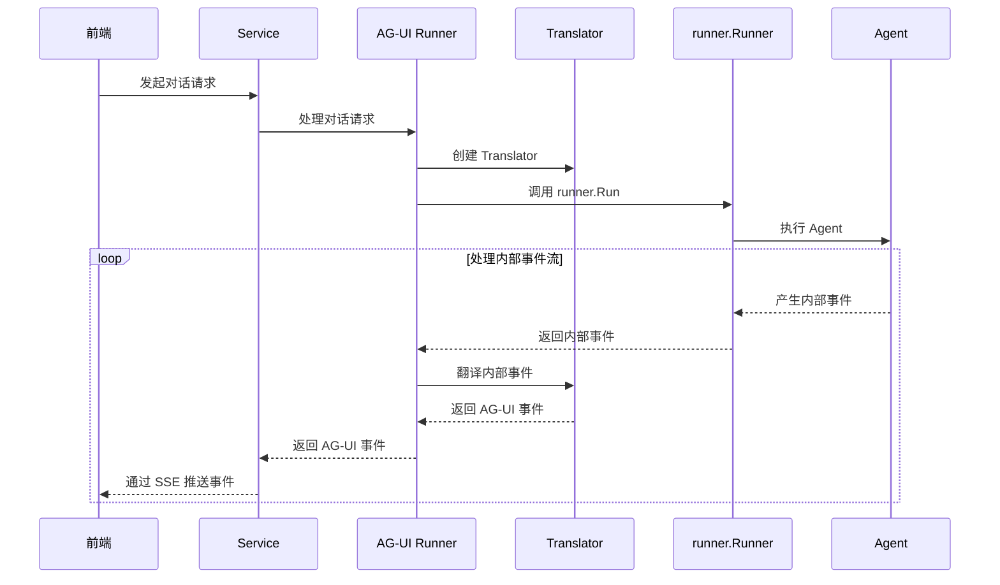

# AG-UI 使用指南

AG-UI（Agent-User Interaction）由 [AG-UI Protocol](https://github.com/ag-ui-protocol/ag-ui) 开源项目维护，是一套开放、轻量、基于事件的 Agent 与用户交互协议。它用于标准化 AI Agent 与面向用户应用之间的连接，约定 Agent 后端接收符合协议的输入，并在执行过程中发出符合标准事件类型的运行事件。

`tRPC-Agent-Go` 提供 AG-UI 服务端集成，用于在已有 Agent 之上提供符合 AG-UI 协议的对话服务。前端以 AG-UI 请求发起对话，服务端执行 Agent，并以 AG-UI 事件流持续返回运行过程中的事件。

## 快速上手

假设你已实现一个 Agent，可以按如下方式接入 AG-UI 协议并启动服务：

```go
import (
    "net/http"

    "trpc.group/trpc-go/trpc-agent-go/runner"
    "trpc.group/trpc-go/trpc-agent-go/server/agui"
)

// 创建 Agent
agent := newAgent()
// 创建 Runner
runner := runner.NewRunner(agent.Info().Name, agent)
defer runner.Close()
// 创建 AG-UI 服务，指定 HTTP 路由
server, err := agui.New(runner, agui.WithPath("/agui"))
if err != nil {
    log.Fatalf("create agui server failed: %v", err)
}
// 启动 HTTP 服务
if err := http.ListenAndServe("127.0.0.1:8080", server.Handler()); err != nil {
    log.Fatalf("server stopped with error: %v", err)
}
```

`agui.WithPath` 用于设置实时对话路由，默认路由为 `/`。

完整代码示例参见 [examples/agui/server/default](https://github.com/trpc-group/trpc-agent-go/tree/main/examples/agui/server/default)。

Runner 全面的使用方法参见 [runner](../runner.md)。

前端侧可以使用支持 AG-UI 协议的客户端框架接入该服务，例如 [CopilotKit](https://github.com/CopilotKit/CopilotKit) 或 [TDesign Chat](https://tdesign.tencent.com/react-chat/overview)。仓库内提供两个可运行的 Web UI 示例：

- [examples/agui/client/tdesign-chat](https://github.com/trpc-group/trpc-agent-go/tree/main/examples/agui/client/tdesign-chat)：基于 Vite + React + TDesign 的客户端，演示自定义事件、Graph interrupt 审批、消息快照加载以及报告侧边栏等能力。
- [examples/agui/client/copilotkit](https://github.com/trpc-group/trpc-agent-go/tree/main/examples/agui/client/copilotkit)：基于 CopilotKit 搭建的 Next.js 客户端。


## 核心概念

AG-UI 集成让前端可以按 AG-UI 协议调用 `tRPC-Agent-Go` 中已有的 Agent。服务端接收 AG-UI 请求后，会将其转换为 `runner.Runner` 可执行的输入；`runner.Runner` 执行过程中产生的框架内部事件，再被转换为 AG-UI 事件返回给前端。

一次实时对话请求的主链路如下：



这条链路从前端发起对话请求开始。`Service` 接收请求后交给 AG-UI Runner；AG-UI Runner 创建本次运行使用的 Translator，并调用 `runner.Runner` 启动 Agent 执行。执行过程中，`runner.Runner` 持续产生框架内部事件，AG-UI Runner 将这些事件交给 Translator 转换为 AG-UI 事件，再返回给 `Service`，由 `Service` 通过 SSE 推送给前端。

在这条链路中，`Server` 提供 HTTP 入口，`Service` 负责事件流通信，AG-UI Runner 将协议请求转换为 `runner.Runner` 所需的输入和运行选项，`Translator` 将框架内部事件转换为 AG-UI 事件。

### Server

`agui.Server` 将已有的 `runner.Runner` 暴露为 AG-UI HTTP 服务，并对外提供可挂载到应用 HTTP 服务中的 `http.Handler`。

创建方法如下：

```go
import "trpc.group/trpc-go/trpc-agent-go/runner"

func New(runner runner.Runner, opt ...Option) (*Server, error)
```

创建 `Server` 时，框架会确定实时对话、消息快照和取消路由，并把这些路由连接到对应的 `Service` 和 AG-UI Runner。三类路由分别对应不同的交互阶段：

- 实时对话路由：接收前端对话请求，并返回 Agent 执行过程中的 AG-UI 事件流。
- 消息快照路由：从已保存的 AG-UI 事件中恢复历史消息，用于页面初始化、刷新或重连后的状态恢复。
- 取消路由：根据会话信息找到正在运行的对话请求，并取消该运行。

`Server` 负责建立 HTTP 入口；Agent 运行仍由传入的 `runner.Runner` 完成。

### Service

`service.Service` 定义 AG-UI 事件流的通信方式。默认实现是 SSE，因此前端发起实时对话请求后，会通过同一条 SSE 连接持续接收 AG-UI 事件。

接口定义如下：

```go
type Service interface {
    Handler() http.Handler
}
```

如果需要使用 WebSocket 等其他通信协议，可以自定义 `Service` 实现。

### AG-UI Runner

AG-UI Runner 连接 AG-UI 请求和 `runner.Runner`。前端提交的是 AG-UI 定义的请求体 [`RunAgentInput`](https://docs.ag-ui.com/sdk/js/core/types#runagentinput)，而 `runner.Runner` 需要的是一次可执行的运行输入；AG-UI Runner 负责完成这两者之间的适配。

接口定义如下：

```go
import (
    aguievents "github.com/ag-ui-protocol/ag-ui/sdks/community/go/pkg/core/events"
    "trpc.group/trpc-go/trpc-agent-go/server/agui/adapter"
)

type Runner interface {
    Run(ctx context.Context, runAgentInput *adapter.RunAgentInput) (<-chan aguievents.Event, error)
}
```

在这个过程中，AG-UI Runner 会从请求中解析会话、消息、状态和透传参数，并将它们整理为 `runner.Runner` 所需的输入和运行选项。这样，前端可以继续使用 AG-UI 协议，后端也可以继续沿用 `tRPC-Agent-Go` 的 Runner。

运行开始后，AG-UI Runner 还会接收 `runner.Runner` 产生的框架内部事件，并交给 Translator 转换为 AG-UI 事件，再返回给 Service。

### Translator

`Translator` 负责把 `tRPC-Agent-Go` 内部事件转换为 AG-UI 事件。AG-UI Runner 从 `runner.Runner` 接收到内部事件后，会逐条交给 Translator 处理；Translator 返回的 AG-UI 事件随后由 Service 推送给前端。

接口定义如下：

```go
import (
    aguievents "github.com/ag-ui-protocol/ag-ui/sdks/community/go/pkg/core/events"
    agentevent "trpc.group/trpc-go/trpc-agent-go/event"
)

type Translator interface {
    Translate(ctx context.Context, event *agentevent.Event) ([]aguievents.Event, error)
}

type PostRunFinalizingTranslator interface {
    Translator
    PostRunFinalizationEvents(ctx context.Context) ([]aguievents.Event, error)
}
```

框架内置的 Translator 实现会处理文本输出、工具调用、工具结果、思考内容、实时进度和运行生命周期事件。由于 AG-UI 中存在成组的流式事件，Translator 需要在单次运行内维护必要状态；运行结束时，`PostRunFinalizationEvents` 用于补齐尚未关闭的协议事件，避免前端收到不完整的事件序列。

需要追加自定义事件、改写事件内容，或适配特定前端组件时，可以自定义 Translator，或通过翻译回调调整事件。

## 路由前缀

`agui.WithBasePath` 设置 AG-UI 服务的基础路由前缀，默认值为 `/`。它用于在统一前缀下挂载实时对话、消息快照和取消路由，避免与现有服务路由冲突。

`agui.WithPath`、`agui.WithMessagesSnapshotPath` 与 `agui.WithCancelPath` 只定义各自的子路由，框架会自动将它们与 `BasePath` 拼接成最终可访问的路由。

使用示例如下：

```go
import "trpc.group/trpc-go/trpc-agent-go/server/agui"

server, err := agui.New(
    runner,
    agui.WithBasePath("/agui/"),
    agui.WithPath("/chat"),
    agui.WithMessagesSnapshotEnabled(true),
    agui.WithMessagesSnapshotPath("/history"),
    agui.WithCancelEnabled(true),
    agui.WithCancelPath("/cancel"),
)
```

此时实时对话路由为 `/agui/chat`，消息快照路由为 `/agui/history`，取消路由为 `/agui/cancel`。
