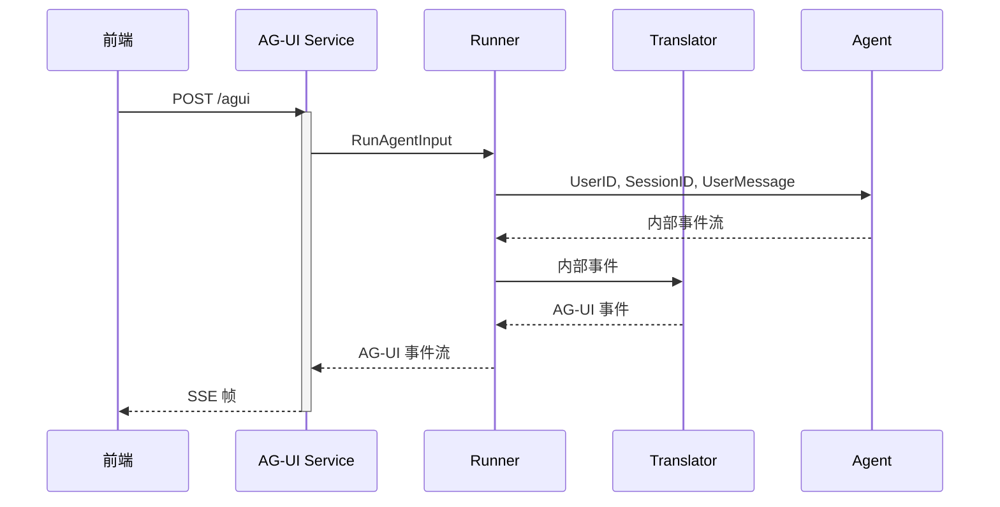

# tRPC-Agent-Go：快速构建基于 AG-UI 的 Agent 服务

> 在 AI Agent 落地过程中，如何把推理过程与用户界面无缝衔接、同时保持协议层的可扩展性，是贯穿全链路的关键问题。AG-UI 协议给出了一套轻量而开放的解决方案，tRPC-Agent-Go 为其提供了完整的工程化落地实践。本文从 AG-UI 协议概览介绍入手，延伸到最小接入实践，再拆解核心模块，讲解可高度自定义的使用方式，帮助你快速为 Agent 接入 AG-UI 协议，打通 Agent 与用户的最后一公里。

## 前言

[tRPC-Agent-Go](https://github.com/trpc-group/trpc-agent-go/) 是面向 Go 语言的自主式多 Agent 框架，具有工具调用、会话/记忆/制品管理、多 Agent 协同、图编排、知识库与可观测的能力。[tRPC-Agent-Go](https://github.com/trpc-group/trpc-agent-go/) 的成长离不开大家的支持，欢迎 Star 项目并参与社区共建。

接下来，本文将从 AG-UI 协议概览介绍入手，延伸到最小接入实践，再拆解核心模块，讲解可高度自定义的使用方式，帮助你快速为 Agent 接入 AG-UI 协议，打通 Agent 与用户的最后一公里。

## AG-UI 概览

### 协议定位

AG-UI 是一种开放的、轻量级的基于事件的协议，标准化了 Agent 与用户界面应用程序的连接方式，强调简洁性和灵活性，允许使用任意事件传输层（例如 SSE、WebSocket、WebHooks 等）与宽松的事件格式匹配，能够实现 Agent、实时用户上下文和用户界面之间的无缝集成。

AG-UI 协议与 MCP 协议和 A2A 协议共同组成了 Agent 通信协议栈，打通了 Agent 与用户的最后一公里，下图展示了三者在协议栈中的位置与分工。


- MCP 协议：标准化 Agent 调用工具的通信协议
- A2A 协议：标准化 Agent 与 Agent 协作的通信协议
- AG‑UI 协议：标准化 Agent 与用户交互界面的通信协议

通俗来讲，AG‑UI 协议将 Agent 与用户界面的交互抽为事件流，一次 Agent 调用从 `RunStarted` 开始，到 `RunFinished` 或 `RunError` 结束，期间的文本增量、工具调用和状态同步都以类型化事件持续发往前端。

### 事件模型

AG‑UI 协议采用事件驱动模型，事件类型分组清晰，包含生命周期、文本消息、工具调用、状态管理以及扩展事件，每组内通过多种类型事件构建完整的周期。

- 生命周期类事件：`RunStarted`、`RunFinished`、`RunError`
- 文本消息类事件：`TextMessageStart`、`TextMessageContent`、`TextMessageEnd`
- 工具调用类事件：`ToolCallStart`、`ToolCallArgs`、`ToolCallEnd`、`ToolCallResult`
- 状态同步类事件：`StateSnapshot`、`StateDelta`、`MessagesSnapshot`
- 扩展事件：`Custom`

可以从事件流的角度观测一次典型的事件序列，从 `RunStarted` 开始，Agent 在生成内容的同时用 `TextMessageContent` 推送增量；当需要工具时，先通过 `ToolCallStart` 告知，再推送 `ToolCallArgs`，工具完成后回传 `ToolCallResult`；最终以 `RunFinished` 收尾。

例如，SSE 帧大致如下，`data:` 内容是 JSON 格式的单个事件。

```http
id: RUN_STARTED_1761536557195
data: {"type":"RUN_STARTED","threadId":"session-01","runId":"invocation-01"}

id: TEXT_MESSAGE_START_1761536558081
data: {"type":"TEXT_MESSAGE_START","messageId":"message-01","role":"assistant"}

id: TEXT_MESSAGE_CONTENT_1761536558294
data: {"type":"TEXT_MESSAGE_CONTENT","messageId":"message-01","delta":"我来计算 "}

id: TEXT_MESSAGE_CONTENT_1761536558370
data: {"type":"TEXT_MESSAGE_CONTENT","messageId":"message-01","delta":"2 的 3 次方。"}

id: TEXT_MESSAGE_END_1761536559693
data: {"type":"TEXT_MESSAGE_END","messageId":"message-01"}

id: TOOL_CALL_START_1761536559693
data: {"type":"TOOL_CALL_START","toolCallId":"call-01","toolCallName":"calculator","parentMessageId":"message-01"}

id: TOOL_CALL_ARGS_1761536559693
data: {"type":"TOOL_CALL_ARGS","toolCallId":"call-01","delta":"{\"a\": 2, \"b\": 3, \"operation\": \"power\"}"}

id: TOOL_CALL_END_1761536559693
data: {"type":"TOOL_CALL_END","toolCallId":"call-01"}

id: TOOL_CALL_RESULT_1761536559693
data: {"type":"TOOL_CALL_RESULT","messageId":"message-01","toolCallId":"call-01","content":"{\"result\":8}","role":"tool"}

id: TEXT_MESSAGE_START_1761536560773
data: {"type":"TEXT_MESSAGE_START","messageId":"message-02","role":"assistant"}

id: TEXT_MESSAGE_CONTENT_1761536560977
data: {"type":"TEXT_MESSAGE_CONTENT","messageId":"message-02","delta":"2 的 3 次方"}

id: TEXT_MESSAGE_CONTENT_1761536561050
data: {"type":"TEXT_MESSAGE_CONTENT","messageId":"message-02","delta":" 等于 8。"}

id: TEXT_MESSAGE_END_1761536561439
data: {"type":"TEXT_MESSAGE_END","messageId":"message-02"}

id: RUN_FINISHED_1761536561439
data: {"type":"RUN_FINISHED","threadId":"session-01","runId":"invocation-01"}
```

### 开源生态

[AG‑UI](https://github.com/ag-ui-protocol/ag-ui) 提供了 TypeScript、Python、Golang、Kotlin、Java 等多语言 SDK。

LangGraph、CrewAI、Agno、ADK 等 Agent 框架已经通过官方或社区维护的适配包接入 AG‑UI，可以输出 AG-UI 协议的事件流。

前端可以使用 [@ag-ui/client](https://www.npmjs.com/package/@ag-ui/client)、[CopilotKit](https://github.com/CopilotKit/CopilotKit) 等实现 AG‑UI 协议的客户端来消费事件。

另外，我们也向 AG-UI 官方仓库贡献了 Go SDK 的改进。

- [feat: add http.Flusher fallback for SSEWriter in Golang SDK](https://github.com/ag-ui-protocol/ag-ui/pull/560)
- [fix: event missing EventTypeToolCallResult](https://github.com/ag-ui-protocol/ag-ui/pull/339/commits/1d05c81e442acaf2abf31e70d10d90f1cf757a01)

更多支持情况可参见[官方文档](https://github.com/ag-ui-protocol/ag-ui?tab=readme-ov-file#-supported-frameworks)。

## 快速接入

### Agent 开发

以下示例构建了一个具备计算器工具的 Agent。

```go
import (
    "trpc.group/trpc-go/trpc-agent-go/agent"
    "trpc.group/trpc-go/trpc-agent-go/agent/llmagent"
    "trpc.group/trpc-go/trpc-agent-go/model"
    "trpc.group/trpc-go/trpc-agent-go/model/openai"
    "trpc.group/trpc-go/trpc-agent-go/tool"
    "trpc.group/trpc-go/trpc-agent-go/tool/function"
)

func newAgent() agent.Agent {
    modelInstance := openai.New("deepseek-chat")
    generationConfig := model.GenerationConfig{
        MaxTokens:   intPtr(512),
        Temperature: floatPtr(0.7),
        Stream:      true,
    }
    calculatorTool := function.NewFunctionTool(
        calculator,
        function.WithName("calculator"),
        function.WithDescription("A calculator tool, you can use it to calculate the result of the operation. "+
            "a is the first number, b is the second number, "+
            "the operation can be add, subtract, multiply, divide, power."),
    )
    agent := llmagent.New(
        "agui-agent",
        llmagent.WithTools([]tool.Tool{calculatorTool}),
        llmagent.WithModel(modelInstance),
        llmagent.WithGenerationConfig(generationConfig),
        llmagent.WithInstruction("You are a helpful assistant."),
    )
    return agent
}

func calculator(ctx context.Context, args calculatorArgs) (calculatorResult, error) {
    var result float64
    switch args.Operation {
    case "add", "+":
        result = args.A + args.B
    case "subtract", "-":
        result = args.A - args.B
    case "multiply", "*":
        result = args.A * args.B
    case "divide", "/":
        result = args.A / args.B
    case "power", "^":
        result = math.Pow(args.A, args.B)
    default:
        return calculatorResult{Result: 0}, fmt.Errorf("invalid operation: %s", args.Operation)
    }
    return calculatorResult{Result: result}, nil
}

type calculatorArgs struct {
    Operation string  `json:"operation" description:"add, subtract, multiply, divide, power"`
    A         float64 `json:"a" description:"First number"`
    B         float64 `json:"b" description:"Second number"`
}

type calculatorResult struct {
    Result float64 `json:"result"`
}

func intPtr(i int) *int {
    return &i
}

func floatPtr(f float64) *float64 {
    return &f
}
```

### 通过 HTTP 启动 AG-UI 服务

AG-UI 服务对外提供标准 HTTP Handler，接入流程主要分为 3 步。

1. 创建框架 Runner。
2. 通过 `agui.New` 创建 AG-UI 服务。
3. 通过 `http.ListenAndServe` 启动 HTTP 服务。

```go
import (
    "trpc.group/trpc-go/trpc-agent-go/log"
    "trpc.group/trpc-go/trpc-agent-go/runner"
    "trpc.group/trpc-go/trpc-agent-go/server/agui"
)

agent := newAgent()
runner := runner.NewRunner(agent.Info().Name, agent)
defer runner.Close()

// 创建 AG-UI 服务，设置 HTTP 路由
server, err := agui.New(runner, agui.WithPath("/agui"))
if err != nil {
    log.Fatalf("failed to create AG-UI server: %v", err)
}

// 启动 HTTP 服务
if err := http.ListenAndServe("127.0.0.1:8080", server.Handler()); err != nil {
    log.Fatalf("server stopped with error: %v", err)
}
```

至此，我们开发了 Agent 并启动了 AG-UI 服务，完整代码可见 [examples/agui/server/default](https://github.com/trpc-group/trpc-agent-go/tree/main/examples/agui/server/default)。

### CopilotKit 联调

使用 CopilotKit 开发前端，设置后端 AG-UI 服务地址之后，用户即可在前端与 Agent 交互，完整代码可见 [examples/agui/client/copilotkit](https://github.com/trpc-group/trpc-agent-go/tree/main/examples/agui/client/copilotkit)。

!video[agui.mp4](152728)

## 核心概念

### 总体设计

在 tRPC-Agent-Go 中，AG‑UI 主要分为以下模块。

1. Adapter：定义前端请求体 `RunAgentInput` 的结构。
2. Translator：将内部事件翻译为 AG‑UI 事件。
3. Runner：处理请求体，执行 Agent，调用 Translator 等。
4. Service：提供 HTTP Handler，接受请求并发送 AG-UI 事件响应，默认提供 SSE 传输层实现，也可以自定义其他通信协议。



该时序图展示了 AG‑UI 默认的 SSE 链路：前端向 AG‑UI Service 发起 POST `/agui` 请求，`Service` 将 `RunAgentInput` 交给 `Runner`；`Runner` 携带 `UserID`、`SessionID` 与用户消息调用底层 Agent，并把产生的内部事件逐条交给 `Translator` 翻译为 AG‑UI 事件；这些事件再回传给 `Runner`，由 `Service` 作为 `SSE` 帧流式推送给前端。依靠这一循环，Agent 的推理过程可以实时呈现在 UI 上。

### Adapter

前端请求体在 [server/agui/adapter](https://github.com/trpc-group/trpc-agent-go/blob/main/server/agui/adapter/adapter.go) 中定义，核心结构如下。

```go
import "github.com/ag-ui-protocol/ag-ui/sdks/community/go/pkg/core/types"

type RunAgentInput struct {
    ThreadID       string          `json:"threadId"`       // 会话 ID
    RunID          string          `json:"runId"`          // 运行 ID
    Messages       []types.Message `json:"messages"`       // 会话消息
    State          map[string]any  `json:"state"`          // 会话状态
    ForwardedProps any             `json:"forwardedProps"` // 扩展字段
}
```

- ThreadID 为会话标识，对应框架层的 SessionID。
- RunID 为本次调用标识，对应框架层的 InvocationID。
- Messages 存放用户与 Agent 的对话。
- State 用于携带会话状态。
- ForwardedProps 收纳业务侧的扩展字段，例如用户 ID。

### Translator

Translator 接口提供 `Translate` 方法，将内部事件翻译为 AG-UI 事件。

```go
import (
    aguievents "github.com/ag-ui-protocol/ag-ui/sdks/community/go/pkg/core/events"
    agentevent "trpc.group/trpc-go/trpc-agent-go/event"
)

type Translator interface {
    Translate(ctx context.Context, event *agentevent.Event) ([]aguievents.Event, error)
}
```

具体的事件翻译逻辑如下。

- Agent 运行前发送 `RunStarted` AG-UI 事件，正常运行结束后发送 `RunFinished` AG-UI 事件，中途发生错误则发送 `RunError` AG-UI 事件。
- 将内部文本事件翻译为 `TextMessageStart`、`TextMessageContent` 和 `TextMessageEnd` AG-UI 事件。
- 将内部工具调用与执行结果事件翻译为 `ToolCallStart`、`ToolCallArgs`、`ToolCallEnd` 和 `ToolCallResult` AG-UI 事件。

此外，可以自定义 Translator 实现，用于自定义事件或者上报到可观测平台。


### Runner

AG-UI Runner 包装了框架的 Runner，接收前端请求体 `RunAgentInput`，调用 Agent 运行，并将生成的内部事件交给 Translator 翻译为 AG-UI 事件，然后返回给上层 Service。

```go
import (
    aguievents "github.com/ag-ui-protocol/ag-ui/sdks/community/go/pkg/core/events"
    "trpc.group/trpc-go/trpc-agent-go/server/agui/adapter"
)

type Runner interface {
    Run(ctx context.Context, runAgentInput *adapter.RunAgentInput) (<-chan aguievents.Event, error)
}
```

### Service

Service 对外提供 HTTP Handler，调用 AG-UI Runner，将 AG-UI 事件发送到前端。

框架默认提供了 SSE 实现，同时也允许自定义 Service 实现扩展为 WebSocket 等其他通信协议。

```go
import "net/http"

type Service interface {
    Handler() http.Handler
}
```

## 使用方法

### 自定义通信协议

AG-UI 协议未强制规定通信协议，框架使用 SSE 作为 AG-UI 的默认通信协议，如果希望改用 WebSocket 等其他协议，可以实现 `service.Service` 接口：

```go
import (
    "trpc.group/trpc-go/trpc-agent-go/runner"
    "trpc.group/trpc-go/trpc-agent-go/server/agui"
    aguirunner "trpc.group/trpc-go/trpc-agent-go/server/agui/runner"
    "trpc.group/trpc-go/trpc-agent-go/server/agui/service"
)

type wsService struct {
    path    string
    runner  aguirunner.Runner
    handler http.Handler
}

func NewWSService(runner aguirunner.Runner, opt ...service.Option) service.Service {
    opts := service.NewOptions(opt...)
    s := &wsService{
        path:   opts.Path,
        runner: runner,
    }
    h := http.NewServeMux()
    h.HandleFunc(s.path, s.handle)
    s.handler = h
    return s
}

func (s *wsService) Handler() http.Handler { /* HTTP Handler */ }

runner := runner.NewRunner(agent.Info().Name, agent)
server, err := agui.New(runner, agui.WithServiceFactory(NewWSService))
```

### 自定义 Translator

默认的 `translator.New` 会把内部事件翻译成协议里定义的标准事件集。若想在保留默认行为的基础上追加自定义信息，可以实现 `translator.Translator` 接口，并借助 AG-UI 的 `Custom` 类型事件携带扩展数据：

```go
import (
    aguievents "github.com/ag-ui-protocol/ag-ui/sdks/community/go/pkg/core/events"
    "trpc.group/trpc-go/trpc-agent-go/event"
    "trpc.group/trpc-go/trpc-agent-go/runner"
    "trpc.group/trpc-go/trpc-agent-go/server/agui"
    "trpc.group/trpc-go/trpc-agent-go/server/agui/adapter"
    aguirunner "trpc.group/trpc-go/trpc-agent-go/server/agui/runner"
    "trpc.group/trpc-go/trpc-agent-go/server/agui/translator"
)

type customTranslator struct {
    inner translator.Translator
}

func (t *customTranslator) Translate(ctx context.Context, event *event.Event) ([]aguievents.Event, error) {
    out, err := t.inner.Translate(ctx, event)
    if err != nil {
        return nil, err
    }
    if payload := buildCustomPayload(event); payload != nil {
        out = append(out, aguievents.NewCustomEvent("trace.metadata", aguievents.WithValue(payload)))
    }
    return out, nil
}

func buildCustomPayload(event *event.Event) map[string]any {
    if event == nil || event.Response == nil {
        return nil
    }
    return map[string]any{
        "object":    event.Response.Object,
        "timestamp": event.Response.Timestamp,
    }
}

factory := func(ctx context.Context, input *adapter.RunAgentInput,
    opts ...translator.Option) (translator.Translator, error) {
    inner, err := translator.New(ctx, input.ThreadID, input.RunID, opts...)
    if err != nil {
        return nil, fmt.Errorf("create inner translator: %w", err)
    }
    return &customTranslator{inner: inner}, nil
}

runner := runner.NewRunner(agent.Info().Name, agent)
server, _ := agui.New(runner, agui.WithAGUIRunnerOptions(aguirunner.WithTranslatorFactory(factory)))
```

例如，在使用 React Planner 时，如果希望为不同标签应用不同的自定义事件，可以通过实现自定义 Translator 来实现。

!video[react2.mp4](153393)

完整的代码示例可以参考 [examples/agui/server/react](https://github.com/trpc-group/trpc-agent-go/tree/main/examples/agui/server/react)。

### 自定义 `UserIDResolver`

默认所有请求都会归到固定的 `"user"` 用户 ID，可以通过自定义 `UserIDResolver` 从 `RunAgentInput` 中提取 `UserID`：

```go
import (
    "trpc.group/trpc-go/trpc-agent-go/runner"
    "trpc.group/trpc-go/trpc-agent-go/server/agui"
    "trpc.group/trpc-go/trpc-agent-go/server/agui/adapter"
    aguirunner "trpc.group/trpc-go/trpc-agent-go/server/agui/runner"
)

resolver := func(ctx context.Context, input *adapter.RunAgentInput) (string, error) {
    props, ok := input.ForwardedProps.(map[string]any)
    if !ok {
        return "anonymous", nil
    }
    if user, ok := props["userId"].(string); ok && user != "" {
        return user, nil
    }
    return "anonymous", nil
}

runner := runner.NewRunner(agent.Info().Name, agent)
server, _ := agui.New(runner, agui.WithAGUIRunnerOptions(aguirunner.WithUserIDResolver(resolver)))
```

### 事件翻译回调

AG-UI 提供了事件翻译的回调机制，便于在事件翻译流程的前后插入自定义逻辑。

- `translator.BeforeTranslateCallback`：在内部事件被翻译为 AG-UI 事件之前触发。返回值约定：
  - 返回 `(customEvent, nil)`：使用 `customEvent` 作为翻译的输入事件。
  - 返回 `(nil, nil)`：保留当前事件并继续执行后续回调；若所有回调都返回 `nil`，则最终使用原事件。
  - 返回错误：终止当前的执行流程，客户端将接收到 `RunError`。
- `translator.AfterTranslateCallback`：在 AG-UI 事件翻译完成，准备发送到客户端之前触发。返回值约定：
  - 返回 `(customEvent, nil)`：使用 `customEvent` 作为最终发送给客户端的事件。
  - 返回 `(nil, nil)`：保留当前事件并继续执行后续回调；若所有回调都返回 `nil`，则最终发送原事件。
  - 返回错误：终止当前的执行流程，客户端将接收到 `RunError`。

使用示例：

```go
import (
    aguievents "github.com/ag-ui-protocol/ag-ui/sdks/community/go/pkg/core/events"
    "trpc.group/trpc-go/trpc-agent-go/event"
    "trpc.group/trpc-go/trpc-agent-go/server/agui"
    aguirunner "trpc.group/trpc-go/trpc-agent-go/server/agui/runner"
    "trpc.group/trpc-go/trpc-agent-go/server/agui/translator"
)

callbacks := translator.NewCallbacks().
    RegisterBeforeTranslate(func(ctx context.Context, event *event.Event) (*event.Event, error) {
        // 在事件翻译前执行的逻辑
        return nil, nil
    }).
    RegisterAfterTranslate(func(ctx context.Context, event aguievents.Event) (aguievents.Event, error) {
        // 在事件翻译后执行的逻辑
        if msg, ok := event.(*aguievents.TextMessageContentEvent); ok {
            // 在事件中修改消息内容
            return aguievents.NewTextMessageContentEvent(msg.MessageID, msg.Delta+" [via callback]"), nil
        }
        return nil, nil
    })

server, err := agui.New(runner, agui.WithAGUIRunnerOptions(aguirunner.WithTranslateCallbacks(callbacks)))
```

事件翻译回调可以用于多种场景，比如：

- 自定义事件处理：在事件翻译过程中修改事件数据，添加额外的业务逻辑。
- 监控上报：在翻译前后插入自定义监控上报逻辑。

### RunAgentInput Hook

当 AG-UI 前端请求体 `RunAgentInput` 无法完全满足用户需求时，可以将额外的内容放入拓展字段 `ForwardedProps` 中，结合使用 `WithRunAgentInputHook` 对请求体进行统一改写。示例中演示了如何从 `ForwardedProps` 读取提示词并合并到最后一条用户消息中：

```go
import (
    "trpc.group/trpc-go/trpc-agent-go/runner"
    "trpc.group/trpc-go/trpc-agent-go/server/agui"
    "trpc.group/trpc-go/trpc-agent-go/server/agui/adapter"
    aguirunner "trpc.group/trpc-go/trpc-agent-go/server/agui/runner"
)

hook := func(ctx context.Context, input *adapter.RunAgentInput) (*adapter.RunAgentInput, error) {
    if input == nil {
        return nil, errors.New("empty input")
    }
    if len(input.Messages) == 0 {
        return nil, errors.New("missing messages")
    }
    if input.ForwardedProps == nil {
        return input, nil
    }
    props, ok := input.ForwardedProps.(map[string]any)
    if !ok {
        return input, nil
    }
    otherContent, ok := props["other_content"].(string)
    if !ok {
        return input, nil
    }
    content, ok := input.Messages[len(input.Messages)-1].ContentString()
    if !ok {
        return nil, errors.New("last message content must be a string")
    }
    input.Messages[len(input.Messages)-1].Content = content + otherContent
    return input, nil
}

runner := runner.NewRunner(agent.Info().Name, agent)
server, _ := agui.New(runner, agui.WithAGUIRunnerOptions(aguirunner.WithRunAgentInputHook(hook)))
```
要点：

- 返回 `nil` 会保留原始输入，但保留原位修改。
- 返回自定义的 `*adapter.RunAgentInput` 会覆盖原始输入；返回 `nil` 表示使用原输入。
- 返回错误会中止本次请求，客户端会收到 `RunError` 事件。

## 总结

AG-UI 协议将用户与 Agent 的交互方式抽象成统一的事件协议，tRPC-Agent-Go 为其提供了完整的工程化落地实践，从最小化接入到定制化扩展都有清晰路径。通过本文的 AG-UI 协议概览、接入示例、核心模块拆解与使用方式介绍，你可以快速在现有工程中接入 AG-UI 协议，构建稳定、可观测且具备流式体验的 Agent 前后端链路。

## 参考资料

- [tRPC-Agent-Go 仓库](https://github.com/trpc-group/trpc-agent-go)
- [AG-UI 官方仓库](https://github.com/ag-ui-protocol/ag-ui)

## 使用与交流

欢迎大家使用 tRPC-Agent-Go 框架！如需详细的使用文档和示例，请访问 [tRPC-Agent-Go 仓库](https://github.com/trpc-group/trpc-agent-go)。

[tRPC-Agent-Go](https://github.com/trpc-group/trpc-agent-go/) 的成长离不开大家的支持，欢迎 Star 项目并参与社区共建。

欢迎通过 GitHub Issues 讨论框架使用经验、分享最佳实践、提出改进建议。让我们一起推动 Go 语言在 AI Agent 领域的发展！
