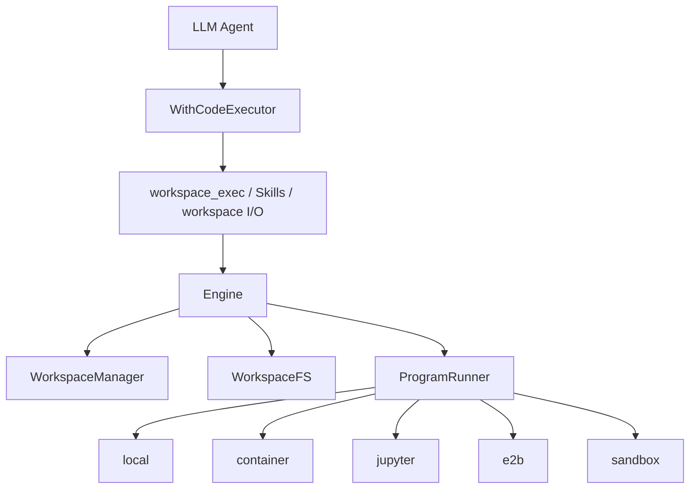

# 从对话到执行：tRPC-Agent-Go Code Executor 如何为 Agent 构建可控运行环境

> 本文聚焦 tRPC-Agent-Go 的 Code Executor：它不是简单地把模型输出的代码块跑一下，而是把 Agent 的文件、命令、workspace、执行后端和安全边界组织成一条可描述、可替换、可治理的执行链路。

大模型应用从 Chat 走向 Agent 后，模型生成的内容开始进入工具调用、文件处理和代码执行链路。此时，框架面对的不再只是 prompt 和 response 的组织问题，还要管理执行环境、文件流转、后端差异和安全边界。

这就是 Code Executor 要解决的问题。

对一个生产级 Agent 框架来说，代码执行至少涉及三件事：执行上下文如何组织，文件和产物如何流转；执行后端如何抽象，才能同时接入本地、容器、Jupyter、远程沙箱和本地 OS 级沙箱；安全边界如何落地，才能约束命令可访问的目录、环境变量和网络。

tRPC-Agent-Go 的 Code Executor 设计，正是围绕这条执行链路展开的。本文会沿着这条链路展开：先从 Agent 代码执行的风险说起，再看 Code Executor、Workspace、Engine，以及 local、container、jupyter、e2b、sandbox 五类执行后端的设计取舍，最后落到后端选型建议和参考资料。

## 一、从文本生成到代码执行

先看 Agent 为什么需要执行代码。

很多任务不能只依赖模型直接推理完成。用户可能让 Agent 分析一个 CSV，生成一张图，跑一个单元测试，检查一个仓库里的 API 调用关系，批量处理一组文档，或者把中间结果保存成 Markdown、JSON、PDF、图片等制品。这些任务的答案不是从模型参数中直接生成的，而是依赖运行时计算、文件系统和外部工具。

一旦 Agent 进入执行阶段，问题性质就变了。

在文本生成里，模型面对的是上下文窗口。框架主要关心 prompt 如何组织、工具 schema 如何暴露、模型响应如何解析。执行代码时，模型面对的是一个操作系统视角的世界：目录、文件、进程、环境变量、网络、包管理器、临时文件、输出文件、退出码和超时。

这带来四类风险。

第一，文件系统风险。模型生成的代码可能读取宿主机上的配置文件、SSH key、云厂商凭证，也可能把不该修改的文件覆盖掉。即使模型没有恶意，错误路径、通配符、递归删除、中间脚本也会造成真实破坏。

第二，环境变量风险。许多服务把 token、secret、endpoint、proxy、debug 开关放在环境变量里。如果执行命令默认继承宿主进程环境，模型生成的命令就可能间接看到这些变量，甚至把它们写进日志或输出文件。

第三，网络风险。代码执行通常会自然使用网络：安装依赖、访问 API、下载数据、推送仓库、打开端口。网络本身不是坏事，但在 Agent 场景里必须回答“谁允许它访问哪里”。否则，一个工具调用就可能从本地计算变成外部副作用。

第四，状态风险。Agent 往往不是一次性脚本。第一轮可能生成中间数据，第二轮继续分析，第三轮把结果保存成 artifact（制品）。状态如果完全不保留，用户体验很差；状态如果无边界保留，又会带来数据串扰、脏环境和难以解释的问题。

所以，Agent 需要的不是简单的：

```text
model output -> sh -c -> stdout
```

而是：

```text
model/tool intent
-> controlled workspace
-> explicit inputs
-> selected execution backend
-> policy-bounded program run
-> collected outputs / artifacts
```

这条链路里，真正重要的是“可控”。能执行只是第一步；知道在哪里执行、能访问和修改什么、产物去哪、后端能力如何声明，才是框架设计的核心。

## 二、Code Executor 的核心：从代码块到执行链路

tRPC-Agent-Go 的 `codeexecutor.CodeExecutor` 对外看起来很简单：

```go
type CodeExecutor interface {
    ExecuteCode(context.Context, CodeExecutionInput) (CodeExecutionResult, error)
    CodeBlockDelimiter() CodeBlockDelimiter
}
```

这个接口是 Code Executor 最外层的使用入口：传入代码块，返回执行结果和输出文件。早期理解 Code Executor 时，很容易停在这层 API 上，把它看成“围栏代码块执行器”。

但在 Agent 框架里，Code Executor 承担的角色比这个更大。它至少服务三条执行路径。

第一条路径是模型最终回复中的围栏代码块自动执行。框架可以扫描 assistant response 中的 fenced code block，把代码块交给 `ExecuteCode` 执行，再把结果回填。这条路径适合演示“模型生成代码并运行”的基础能力。

第二条路径是显式工具调用，也就是 `workspace_exec`。这是更适合生产 Agent 的路径：模型不是在最终回复里顺手写一段代码，而是在工具调用阶段明确请求“在当前 workspace 里执行某个命令”。这样执行行为会进入工具调用链路，有参数、有结果、有错误、有超时，也更容易和权限、审计、观测结合。

第三条路径是应用代码和 Skills 对 workspace 的访问。`codeexecutor/workspaceio` 提供了面向业务回调的 workspace 访问封装；Skills 脚本也可以被写入 workspace 并在其中执行。也就是说，Code Executor 同时服务模型工具调用、框架内部流程和业务扩展，是访问执行环境的共同底座。

这里有两个常见但重要的区分。

第一，`llmagent.WithCodeExecutor(...)` 和围栏代码自动执行不是同一个开关。`llmagent.WithCodeExecutor(...)` 配置的是 Agent 默认执行器，供 `workspace_exec`、Skills、workspace I/O 等路径使用。如果某次 `runner.Run(...)` 需要临时换执行环境，还可以通过 `agent.WithCodeExecutor(...)` 作为 `RunOption` 覆盖本次运行的默认执行器。是否扫描 assistant 最终回复中的围栏代码块，则由 `WithEnableCodeExecutionResponseProcessor(enable bool)` 单独控制。需要注意的是，这个响应处理器默认开启；因此显式配置 Code Executor 后，如果不希望最终回复里的 fenced code block 被自动执行，应显式设置为 `false`。

也就是说，自动执行回复里的代码块，需要同时满足以下全部条件：

```text
有可用 CodeExecutor
AND
EnableCodeExecutionResponseProcessor 开启
AND
去掉首尾空白后的最终回复恰好是一个可执行的围栏代码块
```

在更强调安全和可解释性的生产场景里，通常会让执行都走显式工具调用路径：

```go
agent := llmagent.New(
    "demo",
    llmagent.WithModel(m),
    llmagent.WithCodeExecutor(sandbox.New()),
    llmagent.WithEnableCodeExecutionResponseProcessor(false),
)
```

这样做会保留 Code Executor 作为工具和 workspace 的运行时能力，同时关闭最终回复扫描。这也是理解 tRPC-Agent-Go Code Executor 的关键：它承担的是执行链路的运行时能力，不只是代码块处理。

为了支撑这些路径，框架必须先把“执行”放进一个稳定上下文里，再用统一接口接入不同后端。这就是 Workspace 与 Engine 要解决的问题。

## 三、Workspace 与 Engine：执行上下文和后端抽象

### Workspace：把执行从“命令”变成“上下文”

如果只运行一条命令，似乎传入 `cmd`、`args`、`env`、`cwd` 就够了。但 Agent 的执行通常不是孤立命令，而是围绕一组文件持续展开。

比如用户上传了一个 `report.pdf`，Agent 需要先把它放进执行环境；接着运行 Python 抽取内容；再把中间 JSON 放到工作目录；最后生成 `summary.md` 和 `chart.png`。下一轮用户又问“把刚才那张图换成柱状图”，Agent 最好能继续基于上一次的文件状态工作。

这时，Workspace 就不再是一个临时目录，而是 Agent 执行过程中的状态容器和文件边界。

tRPC-Agent-Go 的 workspace 约定了几个关键目录：`work/inputs/` 放执行前准备好的输入文件，例如用户上传文件或 artifact 引用物化后的文件；`work/` 是主要工作目录，用来保存中间文件、脚本和分析过程数据；`out/` 放最终结果，方便后续读取或保存为产物；`runs/` 则用于保存日志、辅助文件和单次运行的过程数据。

这个目录约定有两个价值。

第一，它让模型和工具有稳定协作语言。模型不需要知道文件 staging 的底层过程，只要知道“用户输入通常在 `work/inputs/`，中间处理放在 `work/`，最终结果写到 `out/`”。稳定路径降低了 prompt 和工具实现之间的耦合。

第二，它让框架能把文件输入输出纳入生命周期管理。外部文件可以通过消息里的 file data、file path 或 `artifact://...` 引用进入 workspace；执行结束后，框架可以按 pattern collect 输出文件，也可以把重要产物保存到 artifact service。

这里有一个实践上很重要的边界：即使当前运行复用了同一个物理 workspace，也不应理解成框架承诺永远复用旧目录。

在同一个物理 workspace 中，`work/`、`out/` 里的文件通常还在；但如果后续换成新的 workspace，旧的 `out/**` 和 `work/**` 不应被假设自动恢复。需要跨新 workspace 稳定复用的文件，应该保存为 artifact，或者由业务层自己管理持久化。

这也是 workspace 和 artifact 的分工：

- Workspace 负责执行期状态，让一轮或一个会话中的工具、脚本、callback 能围绕同一组文件协作。
- Artifact 负责稳定制品，让跨 workspace、跨会话或长期存储的文件有可寻址引用。

### Engine：统一后端，而不是统一安全等级

有了 Workspace，还需要回答另一个问题：这个 workspace 到底由谁管理，文件怎么进去，程序由谁运行？这三件事在一次任务里经常同时出现，但它们的变化原因不同。把生命周期、文件系统和程序运行拆开，才能让不同后端复用同一套上层工具链。

tRPC-Agent-Go 把这部分拆成了三层接口：

```go
type WorkspaceManager interface {
    CreateWorkspace(ctx context.Context, execID string, pol WorkspacePolicy) (Workspace, error)
    Cleanup(ctx context.Context, ws Workspace) error
}

type WorkspaceFS interface {
    PutFiles(ctx context.Context, ws Workspace, files []PutFile) error
    StageDirectory(ctx context.Context, ws Workspace, src, to string, opt StageOptions) error
    Collect(ctx context.Context, ws Workspace, patterns []string) ([]File, error)
    StageInputs(ctx context.Context, ws Workspace, specs []InputSpec) error
    CollectOutputs(ctx context.Context, ws Workspace, spec OutputSpec) (OutputManifest, error)
}

type ProgramRunner interface {
    RunProgram(ctx context.Context, ws Workspace, spec RunProgramSpec) (RunResult, error)
}
```

三层接口分别对应三件事：

- `WorkspaceManager` 管 workspace 生命周期：创建、复用、清理。
- `WorkspaceFS` 管文件进出：投放输入、收集输出、处理 artifact 和目录。
- `ProgramRunner` 管真正执行：命令、参数、环境、cwd、stdin、超时和资源限制。

再往上一层，`Engine` 把它们组合起来：

```go
type Engine interface {
    Manager() WorkspaceManager
    FS() WorkspaceFS
    Runner() ProgramRunner
    Describe() Capabilities
}
```

这个设计的好处是，`workspace_exec`、Skills、workspaceio 不需要知道底层到底是本机目录、Docker 容器、Jupyter kernel、E2B 沙箱，还是 Linux bubblewrap 本地 sandbox。它们只依赖同一组 workspace 和 program runner 语义。

但这里必须强调一句：统一接口不等于统一安全等级。

`local` 后端和 `sandbox` 后端都可以实现 `ProgramRunner`，但它们的风险边界完全不同。`container` 和 `e2b` 都可以运行命令，但一个依赖本地 Docker 配置，一个依赖远程提供方。`jupyter` 有 kernel 状态优势，但它的隔离语义也不能和 OS sandbox 混为一谈。

因此，Engine 还提供 `Capabilities` 来表达能力差异，例如 `Isolation` 描述隔离形态，`NetworkAllowed` 描述网络是否允许，`ReadOnlyMount` 描述是否支持只读挂载，`Streaming` 描述是否支持流式输出，`MaxDiskBytes` 描述磁盘软限制。

其中 `SupportsCleanEnv` 很能体现工程设计取舍。`workspace_exec` 在启用 allow/deny command policy 时，会依赖干净环境来避免命令策略被宿主环境变量、shell startup 文件或动态链接注入绕过。如果某个后端没有明确声明支持 `CleanEnv`，工具层应该 fail closed，而不是静默降级。

这就是框架分层的价值：统一的是执行接口，显式暴露的是能力差异。

整体链路可以画成这样：



## 四、五类执行后端：从 local 到 sandbox

Code Executor 的后端分层，本质上是在“开发便利、运行环境一致性、远程隔离、安全边界、平台成本”之间做选择。没有一个后端适合所有场景。

| 后端 | 执行边界 | 适合场景 | 主要优势 | 关键风险或限制 |
| --- | --- | --- | --- | --- |
| `local` | 宿主机当前用户权限 | 本地开发、可信任务、快速调试 | 接入简单、反馈快、依赖宿主环境 | 基本没有隔离，不适合不可信代码 |
| `container` | Docker / container runtime | 标准服务部署、半可信执行 | 环境可复现，和生产部署更接近 | 安全边界取决于容器配置、挂载和 runtime hardening |
| `jupyter` | Jupyter kernel / notebook 语义 | 数据分析、交互式 Python、长状态计算 | kernel 状态自然延续，适合分析型任务 | 更偏计算会话，不等同于强安全隔离 |
| `e2b` | 外部云端 sandbox 提供方 | 云端代码执行、远程隔离、临时工作环境 | 隔离和生命周期交给提供方，适合弹性场景 | 依赖外部服务、网络和提供方能力 |
| `sandbox` | 本地 OS 级 sandbox；Linux 基于 bubblewrap，macOS 基于 Seatbelt / `sandbox-exec` | 本地执行但需要收紧文件/网络/环境边界 | 不依赖 Docker 即可约束本地命令，安全语义更明确 | Windows managed OS sandbox 尚未实现；在 Docker/K8s 内运行 Linux 后端时，需要外层 runtime 放行 namespace/mount 能力 |

### local：最低成本，也最不应该被误用

`local` 后端直接在宿主环境执行代码。它适合本地验证、单元测试、demo、可信输入和快速开发。它的优势非常现实：不需要启动容器，不依赖远程服务，调试成本低。

它的边界也很清楚：`local` 不提供安全隔离。模型生成的命令会在当前用户权限下触碰宿主环境，因此它的正确定位是“可信环境里的便捷执行器”，不要把它当成“轻量沙箱”。

### container：工程部署的常用中间层

`container` 后端把执行环境放进 Docker/container runtime。相比 local，它至少能把依赖、文件系统视图和运行环境封进容器里，适合服务化部署、半可信任务和需要复现环境的场景。

但容器不是自动等于安全。它的边界取决于镜像、用户权限、挂载路径、capabilities、seccomp profile、网络配置、Docker socket 暴露情况等。它适合做工程标准化和一定程度隔离，生产级安全仍需要配合平台策略。

### jupyter：为交互式计算而生

`jupyter` 后端适合 notebook / kernel 风格的代码执行，尤其是 Python 数据分析。它的优势不是“更安全”，而是“更适合持续计算状态”：变量、导入、绘图、分析过程可以自然保留在 kernel 中。

因此它适合数据科学 Agent、分析助手、报表生成场景。需要注意的是，kernel 状态也会带来脏状态和复现问题；如果任务要求强隔离、强可复现或不可信代码执行，不能把 Jupyter 理解成 sandbox。

### e2b：把执行环境交给外部提供方

`e2b` 后端是典型 remote/cloud sandbox 思路：让代码在外部隔离环境中运行，框架通过提供方 API 管理执行和文件。对业务来说，它减少了自建执行环境、资源回收、基础隔离的成本。

它适合云端 Agent、临时计算环境、需要弹性资源和远程隔离的场景。代价是引入外部依赖：网络、鉴权、提供方能力、成本和可观测性都要纳入平台设计。

### sandbox：本地 OS 级安全边界

`sandbox` 后端是一个重点安全案例。它不是远程平台，也不是 Docker 容器，而是在本地执行场景中，用 OS 级机制约束命令可见的文件系统、可写路径、网络和环境变量。当前 managed 后端在 Linux 上使用 `bubblewrap`，在 macOS 上通过 `/usr/bin/sandbox-exec` 和 Seatbelt profile 落地；Windows 的 managed OS sandbox 尚未实现。

下面进一步展开 sandbox。

## 五、以 Sandbox 为例：把安全边界落到运行时

先明确一个关系：sandbox 只是 Code Executor 的一种安全后端。

Code Executor 是执行体系；sandbox 是其中一种更强调安全边界的后端。没有 sandbox，Code Executor 仍然可以通过 local、container、jupyter、e2b 运行；有了 sandbox，Code Executor 才能在本地 OS 级边界上回答“模型生成的命令到底能访问和修改哪些资源”。

理解 sandbox，可以先看四个运行时问题，再和主流 Agent 沙箱做一个对照。

### 1. 文件系统：哪些可读，哪些可写，哪些禁止访问

tRPC-Agent-Go sandbox 的权限模型围绕 `PermissionProfile` 展开。它把文件系统策略和网络策略放在同一个 profile 里，避免调用方组合出自相矛盾的策略。

`ReadOnlyProfile` 表示宿主根文件系统只读、网络受限，适合只需要读取环境、尽量不写文件的任务。`WorkspaceWriteProfile` 是默认 managed profile：根文件系统只读，workspace 及其工作目录可写，网络受限，适合大多数本地 sandbox 执行。`DangerFullAccessProfile` 会显式禁用 sandbox 并开启网络，只适合完全可信、确实需要完整宿主权限的特殊任务。`ExternalSandboxProfile` 则表示隔离由外部系统提供，例如外部容器、远程平台或上层系统。

`WorkspaceWriteProfile` 的含义非常贴近 Agent 执行：外部世界默认只读，真正允许写入的是 session workspace、`work`、`out`、`runs`、`skills`、`home`、`tmp` 等执行所需目录。

在这个基础上，调用方可以通过 `WithReadPaths`、`WithWritePaths` 增加显式路径授权，也可以通过 `WithNoAccessPaths`、`WithNoAccessGlobs` 屏蔽敏感路径。这里的策略不是 prompt 约束，而是运行时挂载（mount）和路径规则约束。

Linux 后端构造 bubblewrap 命令时，会从只读根开始：

```text
--ro-bind / /
```

然后再把 workspace 里允许写的路径重新以可写方式挂载，把受保护路径屏蔽掉。这个模型很重要：不是“默认都能写，再禁止一部分”，而是“默认只读，再显式开放写路径”。

### 2. 网络：默认限制，显式开启

网络策略是二值模型：

- `NetworkRestricted`：要求后端阻断出网能力。
- `NetworkEnabled`：允许命令使用宿主网络。

managed profile 默认采用 `NetworkRestricted`。在 Linux bubblewrap 后端中，限制网络时会追加：

```text
--unshare-net
```

这意味着命令进入新的 network namespace，不能直接使用宿主网络。选择 `NetworkEnabled` 时，后端会省略这个参数，让命令使用宿主网络。

这个设计不追求复杂的域名级策略，而是先提供清晰的本地二值边界：这次执行能不能出网。更细的 egress 控制可以由外部代理、远程平台、容器网络策略或业务网关承担。

### 3. 环境变量：不要无意识继承宿主秘密

环境变量是 Agent 执行里很容易被低估的风险。很多密钥不在文件里，而在进程环境里。

sandbox runtime 有 `ShellEnvironmentPolicy`，用于控制宿主环境变量的继承、过滤、覆盖和运行时变量注入。Linux bubblewrap 后端会使用：

```text
--clearenv
--setenv KEY VALUE
```

也就是说，沙箱命令不会让子进程自然继承宿主进程环境，而是先清空环境，再由 runtime 通过 `--setenv` 注入构造出的变量集合。与此同时，runtime 会注入稳定的 workspace 环境变量，例如 `HOME`、`TMPDIR`、`WORKSPACE_DIR`、`OUTPUT_DIR` 等，让程序能正常工作。

但这不等于默认不继承宿主变量。源码里的 `ShellEnvironmentPolicy` 空值会归一化为 `ShellEnvironmentPolicyInheritAll`，也就是默认会从宿主环境构造变量集，只是通过 `--clearenv` 和 `--setenv` 显式注入到沙箱进程中。生产环境如果要降低密钥泄露风险，应显式配置更严格的策略，例如选择 `ShellEnvironmentPolicyInheritCore` 或 `ShellEnvironmentPolicyInheritNone`，开启 `ApplyDefaultExcludes`，使用 `IncludeOnly` 做最终 allow-list，或者只通过最小化的 `Set` 注入必要变量。

这和 `workspace_exec` 的 `CleanEnv` 能力形成呼应。命令策略如果依赖干净环境，就必须确认后端真正支持，而不是只在参数里写了 `CleanEnv: true`。

### 4. 进程与系统能力：用 OS 原语约束子进程

在 Linux 上，tRPC-Agent-Go sandbox 使用 bubblewrap 构造执行环境。典型参数包括：

```text
--die-with-parent
--unshare-user
--unshare-pid
--new-session
--ro-bind / /
--dev /dev
--proc /proc
--unshare-net
--clearenv
--chdir <cwd>
```

这些参数背后对应的是 OS 级边界：user namespace、PID namespace、mount 视图、network namespace、独立 session、清理环境变量等。它们的价值在于约束正在运行的进程及其子进程，而不是只在命令执行前做字符串审核。

同时，sandbox runtime 会做 preflight：检查 `bwrap` 是否存在，尝试运行短命令探测当前环境是否支持所需 namespace/mount 操作。如果 preflight 失败，managed profile 会在命令开始前失败，而不是悄悄退回不安全执行。

这点非常关键。安全能力最怕“看起来开了，实际上没生效”。fail closed，也就是能力不可用时直接失败；silent fallback，也就是悄悄退回低安全模式。前者虽然会让部署初期更容易暴露环境问题，但更符合安全边界的语义。

### 5. 和 Claude Code、Codex、OpenAI Agents SDK 的对照

下面的对照只用来说明设计趋势，不把外部产品的当前实现作为本文结论的前提。Claude Code、Codex、OpenAI Agents SDK 这类文档和实现迭代很快，正式发布前建议再核对一次参考资料中的公开链接。

主流代码型 Agent 产品和 Agent SDK 都在把“执行能力”从简单工具调用推进到“受控运行环境”。

Claude Code 的 sandboxed Bash tool 会把 Bash 命令放进文件系统和网络隔离边界中，并明确区分“权限审批”和“运行时沙箱”：前者决定工具是否可以运行，后者决定 Bash 命令真正运行后能访问什么。macOS 使用 Seatbelt，Linux/WSL2 使用 bubblewrap，并且提供网络和凭证保护相关配置。

Codex 也把 sandbox mode 和 approval policy 分成两层。sandbox mode 描述命令在技术上能做什么，例如 read-only、workspace-write、danger-full-access；approval policy 描述哪些行为需要用户批准。它的核心观点是：sandbox 是技术边界，approval 是越界时的决策机制。

OpenAI Agents SDK 的 Sandbox Agents 则从应用架构角度强调“编排层”和“沙箱工作区”的分离：Agent 编排层可以运行在你的基础设施里，而文件系统、命令执行、artifact 生成等有状态工作放进沙箱 workspace。

这些设计的共同点是：不要把“模型被告知不要做坏事”当作安全机制。真正的执行安全，需要运行时边界、权限策略、审批流程和后端能力声明一起工作。

## 六、工程取舍与后端选择

Code Executor 的设计有几个容易被忽略的工程取舍。

### 取舍一：不直接绑定某一个 sandbox

如果只看安全，似乎框架应该默认强制所有执行都走 sandbox。但 Agent 框架服务的场景并不单一。

本地开发需要快速反馈，`local` 很方便；生产服务可能已有容器平台，`container` 更自然；数据分析需要 kernel 状态，`jupyter` 更合适；云端执行可以交给 `e2b`；本地高约束场景才适合 `sandbox`。

如果框架直接绑定某一个 sandbox，就会牺牲部署灵活性。tRPC-Agent-Go 选择的是更底层的抽象：把 workspace、文件系统和程序运行抽象出来，让不同后端接入同一套上层工具链。

### 取舍二：能力必须显式声明

统一接口之后，最危险的误区是“大家实现了同一个接口，所以能力一样”。实际不是。

例如 `RunProgramSpec.CleanEnv` 只有在后端真正能以干净环境启动程序时才有意义。框架用 `Capabilities.SupportsCleanEnv` 显式声明这一点。`workspace_exec` 启用命令 allow/deny policy 时，如果发现后端没有声明支持，就应该 fail closed。

这个策略看起来保守，但它避免了安全策略在不同后端上悄悄失效。

### 取舍三：命令策略不能只做字符串白名单

`workspace_exec` 支持 allowed/denied commands，但实现上不是简单 `strings.Contains`。命令会先经过 shellsafe 解析，限制在较简单的 pipeline 结构内，并拒绝重定向、命令替换、变量展开、子 shell、花括号展开、前置变量赋值等容易绕过策略的结构。

它还内置拒绝 shell wrapper 和重新执行类内建命令，例如 `sh`、`bash`、`eval`、`exec`、`xargs`、`env`、`sudo` 等。原因很直接：如果允许 `sh -c` 或 `eval`，所谓命令白名单很快会变成摆设。

这说明命令策略和 sandbox 是互补关系：

- 命令策略限制“模型能请求什么形式的命令”。
- sandbox 限制“命令运行起来之后能接触什么资源”。

两者不是互相替代。

### 取舍四：开发便利和安全边界要清楚命名

`DangerFullAccessProfile` 这个名字很直白。它不是叫 `DefaultProfile`，也不是叫 `LocalProfile`，而是明确告诉调用方：你正在关闭 sandbox。

类似地，`local` 后端源码注释也明确写着 unsafe。这样的命名很重要，因为 Agent 框架里很多风险不是来自“没有功能”，而是来自“功能看起来像安全能力，但其实只是开发便利”。

好的框架设计应该让危险路径可以被选择，但不能让它看起来无害。

### 如何选择后端

如果把 Code Executor 放进业务系统，后端选型可以从几个决策问题开始，而不是先问“哪个后端最强”。

| 决策问题 | 选择倾向 | 判断理由 |
| --- | --- | --- |
| 输入、命令或用户文件是否不可信？ | 避免 `local`，优先考虑 `sandbox`、`container` 或 `e2b` | 不可信执行需要运行时边界，而不是只依赖 prompt 或命令说明 |
| 是否必须在本地运行，同时要约束文件、网络和环境变量？ | `sandbox` | 适合本地 OS 级边界；Linux 使用 bubblewrap，macOS 使用 Seatbelt / `sandbox-exec` |
| 是否需要云端临时隔离环境，且能接受外部提供方依赖？ | `e2b` | 适合远程 sandbox 和弹性执行，但要关注鉴权、成本和提供方能力 |
| 是否已有容器化部署体系，并且需要固定依赖环境？ | `container` | 适合工程标准化；安全强度取决于容器权限、挂载、网络和 runtime hardening |
| 是否是数据分析、图表生成、交互式 Python 或长状态计算？ | `jupyter` | kernel 状态适合分析任务，但不应被理解成强安全边界 |
| 是否只是本地 demo、开发调试或完全可信脚本？ | `local` | 成本最低、调试最方便，但不适合不可信代码 |
| 是否需要出网安装依赖或访问外部服务？ | 显式选择允许网络的策略或后端 | 默认收紧网络更稳妥；需要出网时再把网络能力纳入审计和治理 |

还有几条实践建议值得单独强调。

第一，如果你只想让模型通过 `workspace_exec` 显式执行命令，不希望最终回复里的围栏代码被自动执行，应关闭响应处理器：

```go
llmagent.WithEnableCodeExecutionResponseProcessor(false)
```

这能让执行行为更集中地进入工具调用链路。

第二，跨轮稳定复用文件时，优先使用 artifact。不要把某个物理 workspace 的偶然延续当成持久化契约。

第三，给 `workspace_exec` 配命令策略时，要同时关注后端的 `SupportsCleanEnv`。如果策略依赖干净环境，而后端没有声明支持，宁可让执行失败，也不要静默降级。

第四，不要把网络打开当作默认选项。很多代码执行任务只需要处理已有文件，不需要出网。需要安装依赖或访问外部服务时，再显式开启网络，或走更合适的远程/平台执行后端。

第五，密钥尽量留在业务编排层或业务服务侧。只有确实需要被执行程序访问的最小凭证，才通过受控方式注入到执行环境；并且要明确日志、stdout/stderr、artifact 中是否可能泄露。

第六，把执行后端选择写进产品或平台策略，而不是让每个业务临时决定。Code Executor 的灵活性很强，但生产治理需要默认值：哪些场景允许 local，哪些可以用 container，哪些需要 sandbox 在能力不可用时直接失败。

## 七、总结：Code Executor 的本质

回到开头的问题：Code Executor 到底是什么？

它不是“让模型跑一段代码”的小功能。那只是最表层的能力。

在 Agent 框架里，Code Executor 的本质是把模型执行副作用系统化。Workspace 管理文件和状态，Engine 抽象不同执行后端，Capabilities 暴露能力差异，`workspace_exec` 和 `workspaceio` 把执行能力接入模型工具调用与业务回调。

所以，tRPC-Agent-Go 的 Code Executor 可以用一句话概括：

> 它把 Agent 从文本生成推进到可控执行，同时把执行产生的副作用纳入一套边界可描述、后端可替换、策略可管控的运行时体系。

Sandbox 是 Code Executor 安全边界的重要落点，但它并不等同于 Code Executor 本身。Code Executor 的价值，是让 sandbox、container 或远程提供方都能成为同一套执行体系中的可替换后端。

## 八、参考资料

- [tRPC-Agent-Go GitHub 仓库](https://github.com/trpc-group/trpc-agent-go)
- [tRPC-Agent-Go CodeExecutor 中文文档](https://github.com/trpc-group/trpc-agent-go/blob/main/docs/mkdocs/zh/codeexecutor.md)
- [tRPC-Agent-Go codeexecutor 源码目录](https://github.com/trpc-group/trpc-agent-go/tree/main/codeexecutor)
- [tRPC-Agent-Go workspace_exec 工具源码目录](https://github.com/trpc-group/trpc-agent-go/tree/main/tool/workspaceexec)
- [tRPC-Agent-Go sandbox 后端文档](https://github.com/trpc-group/trpc-agent-go/blob/main/codeexecutor/sandbox/docs/README.md)
- [Claude Code: Configure the sandboxed Bash tool](https://code.claude.com/docs/en/sandboxing)
- [Anthropic Engineering: Making Claude Code more secure and autonomous with sandboxing](https://www.anthropic.com/engineering/claude-code-sandboxing)
- [OpenAI Developers: Codex sandboxing concepts](https://developers.openai.com/codex/concepts/sandboxing)
- [OpenAI Developers: Codex agent approvals & security](https://developers.openai.com/codex/agent-approvals-security)
- [OpenAI Codex GitHub: Linux sandbox implementation notes](https://github.com/openai/codex/blob/main/codex-rs/linux-sandbox/README.md)
- [OpenAI API Docs: Sandbox Agents](https://developers.openai.com/api/docs/guides/agents/sandboxes)
- [OpenAI Agents SDK Python: Sandbox Agents concepts](https://openai.github.io/openai-agents-python/sandbox/guide/)
- [bubblewrap GitHub 仓库](https://github.com/containers/bubblewrap)
- [Linux namespaces 手册](https://man7.org/linux/man-pages/man7/namespaces.7.html)
- [Docker container security 文档](https://docs.docker.com/engine/security/)
- [E2B Documentation](https://e2b.dev/docs)
