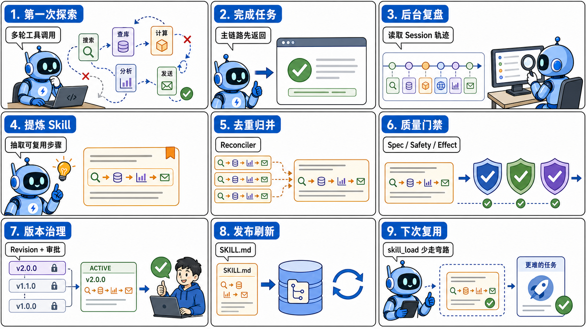
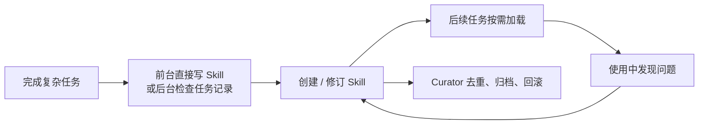
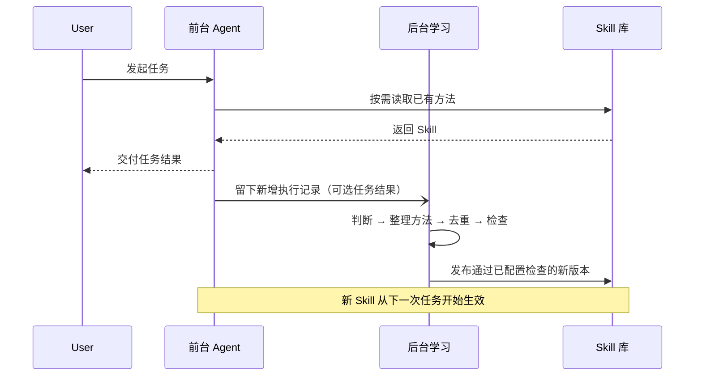
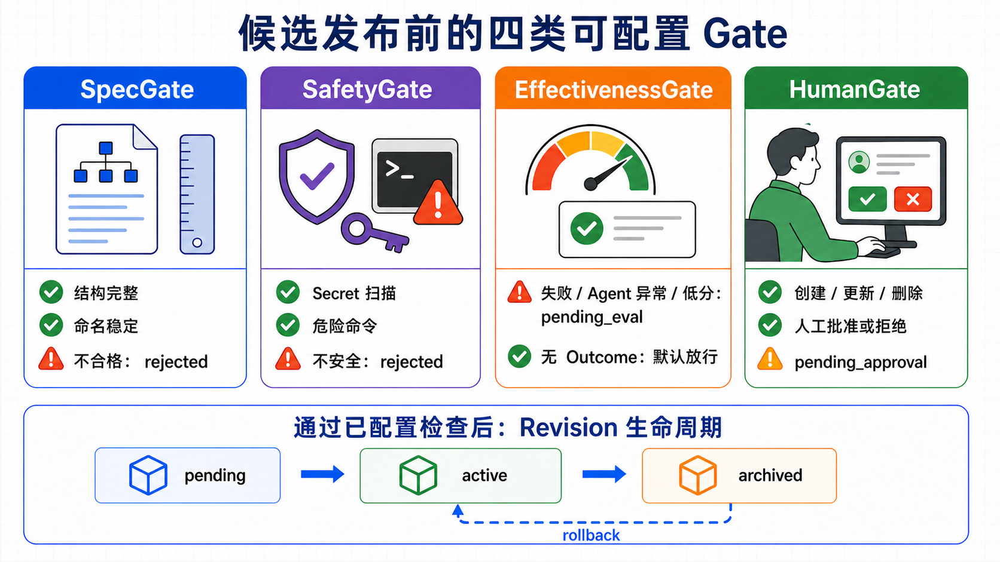
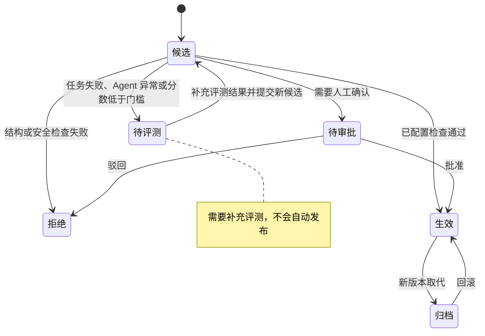
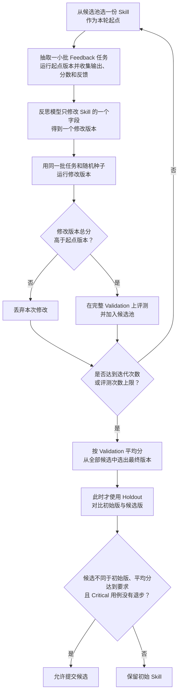
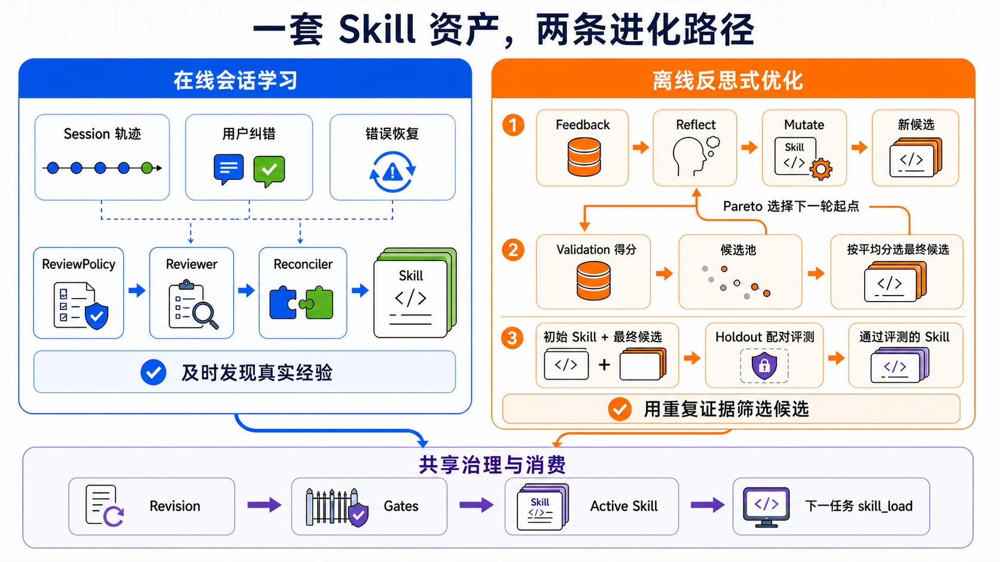
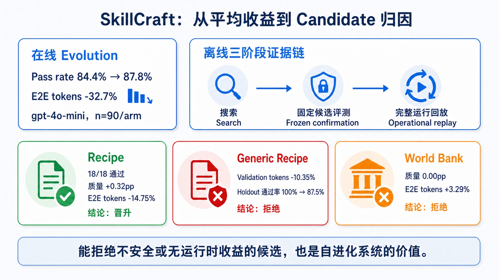

# tRPC-Agent-Go Evolution：Agent 自进化的在线学习、离线优化与评测

当 Agent 从“把这一次做完”走向“下一次做得更好”，系统还需要保存做事的方法：工具怎样组合、失败怎样恢复、结果怎样验收。Evolution 把执行过程整理成 Skill，再通过评测、审批、发布和回滚，让后续任务可以复用这些方法。本文从 Hermes Agent 的程序性记忆出发，介绍 tRPC-Agent-Go 在线学习与离线优化的原理、接入方式，以及 SkillCraft Benchmark 如何判断一个候选应该被接受还是拒绝。

> [tRPC-Agent-Go](https://github.com/trpc-group/trpc-agent-go) 是面向 Go 语言的开源 Agent 框架，提供工具调用、会话与记忆管理、制品管理、多 Agent 协同、图编排、知识库与可观测等能力。欢迎在 GitHub 上 Star、试用并参与共建。
>
> 版本要求：本文使用的 Evolution API 需要 tRPC-Agent-Go **v1.11.0 及以上版本**。



设想一个多城市天气报告任务。Agent 第一次接到它时，往往要先找城市经纬度，再调用天气接口，处理时区和空字段，遇到超时还要重试，最后检查每个城市是否都有结果。整个过程可能绕了几次路，但 Agent 最终交付了正确报告。

问题出在第二次。用户只是换了几个城市，Agent 却可能再次查询接口说明，再次试错参数，再次犯已经修复过的错误。模型没有“失忆”，因为上一次对话也许仍然保存在 Session 里；系统缺少的是把对话和工具调用记录整理成“以后遇到这类任务应该怎么做”的操作方法。

这正是 Agent 自进化要解决的问题：从一次执行中找出稳定、可复用的部分，整理成后续任务能够主动加载的 Skill。否则，Session 一旦结束，这次试错得到的方法就很难再被利用。这里被创建和修改的始终是 Skill，线上模型的权重不会随任务执行而改变。

tRPC-Agent-Go Evolution 为此提供了两种方式。在线学习在真实任务结束后异步检查本次执行，找出用户纠错、错误恢复和多步工具调用中值得保存的方法；离线优化使用一组可重复执行的样本，反复改写并比较一份既定 Skill，最后再用预留样本独立评测。两种方式产生的候选都可以进入后续的自动检查、人工审批、发布和回滚流程。

配套的 [trpc-agent-go-benchmark](https://github.com/trpc-group/trpc-agent-go-benchmark) 分三步检查效果：产生了 Skill，后续任务是否真的更好？在开发数据上得分更高的候选，在未见样本上是否仍然有效？通过独立评测以后，放回完整 Evolution 运行流程，收益是否依然存在？

全文先用 Hermes Agent 解释程序性记忆，再依次介绍 tRPC-Agent-Go 的在线学习、离线优化、接入方式和 SkillCraft Benchmark。核心结论是：

> Agent 自进化把执行过程中学到的方法写成 Skill，再根据检查和评测结果决定是否供后续任务使用。

---

## 一、Hermes Agent：怎样把任务方法保存为 Skill

[Hermes Agent](https://github.com/NousResearch/hermes-agent) 把自己称为 self-improving agent。这里的 self-improving 不指持续训练或在线修改模型权重。Hermes 会把值得复用的方法写成 Skill，在后续任务中按需加载，并在发现问题时继续修改。

理解 Hermes，可以先区分“记住发生过什么”和“学会以后怎么做”。

| 资产 | 保存的内容 | 它回答的问题 |
| --- | --- | --- |
| Memory | 用户偏好、项目状态、已经做出的决定 | “这个用户是谁？项目现在到哪一步？” |
| Session Search | 过去对话和工具执行的原始证据 | “上次错误的原文是什么？” |
| Skill | 一类任务的稳定流程、工具顺序和避坑方法 | “再遇到这类任务，应该怎样完成？” |

这里的 Session Search 指 Hermes 查询历史会话和工具调用记录的能力；本文后面讨论 tRPC-Agent-Go 时，重点放在 Memory 与 Skill 的区别。

假如 Agent 把那次天气任务原样写进 Memory，未来找回来的只是一段故事：当时查了北京、上海和深圳，用了哪些参数，遇到了哪次超时。Skill 要做的事情更难一些。它要去掉城市名、临时路径和偶然数字，只留下可以迁移到其他任务的结构：先完成地理编码，再按统一时区取数；个别城市失败时局部重试，不要整批重跑；生成报告前检查城市集合是否完整。

这种“知道怎样做”的记忆，在认知科学里常被称为 procedural memory，也就是程序性记忆。系统应该优先保证保存下来的方法准确、可复用，而不是不断增加原始对话记录。

Hermes 的 Skill 还采用 progressive disclosure，也就是“渐进式披露”。模型一开始只看到 Skill 的索引和简介；判断某条 Skill 与当前任务有关后，再用 `skill_view(name)` 加载完整正文；正文如果引用了额外材料，再继续读取具体 reference。这样既不会把整个 Skill 库塞进每轮 prompt，也不会因为节省上下文而让 Agent 完全看不到已有经验。tRPC-Agent-Go 的 `skill_load` 采用的也是同一类思路：先让 Agent 知道有哪些能力，需要时再读正文。

有了可读的 Skill，还要回答谁来写。Hermes 允许前台 Agent 在复杂任务完成后直接调用 `skill_manage`，保存刚刚走通的流程；如果实际加载的 Skill 过时或缺少关键步骤，也可以当场修改。这种方式能够利用完整的任务上下文，但写 Skill 会消耗当前任务的 token 和时间，而且前台 Agent 未必每次都会主动执行。

因此 Hermes 又提供了后台复盘。主任务已经回复用户、并且满足复盘条件后，系统会复制一份会话快照，交给一个隔离的后台 Agent。这个 Agent 能回看任务，却只能读写记忆和 Skill，不能重新调用天气接口、代码执行器等业务工具。即使它复盘失败，用户已经拿到的结果也不受影响。源码把这个后台角色称为 Reviewer。这里的设计要求很明确：**后台复盘可以慢一些，也可以单独失败，但不能延长当前请求的返回时间，更不能把已经成功的任务改判为失败。**

Reviewer 会先检查本次已经加载的 Skill 是否需要修改；只有任务中出现了一类新的通用流程时，才创建新 Skill。随着 Skill 数量增加，Curator 负责统计哪些 Skill 经常被查看、使用和修改，合并内容重叠的条目，把长期不用的内容标记为待清理或归档，保护禁止自动整理的重要条目，并在修改前保留备份。自动整理出错时，可以用备份恢复。



Hermes 的做法可以概括为：Agent 完成任务后，把可复用的方法整理成程序性记忆。不过，Hermes 更偏个人或单机运行环境；把同样的做法放进服务端框架，还要处理更多问题。多个应用和用户是否共享 Skill？自动 Reviewer 能不能覆盖人工维护的 Skill？失败任务产生的候选是否允许发布？两个 Reviewer 同时创建近义 Skill 怎么办？谁负责批准、记录和回滚？

tRPC-Agent-Go 在设计 Evolution 时，也重新思考过“程序性记忆应该存在哪里”。早期方案还没有独立的 Evolution Service；沿着经典记忆分类，这条链路曾尝试在语义记忆和情景记忆之外，把任务方法作为第三类 Memory 保存。概念上很顺：既然“用户偏好什么”和“过去发生过什么”可以成为数据库里的一条记忆，那么“这类任务应该怎样做”似乎也可以。

接入应用以后，Memory 记录与 Skill 文档的差异显现出来。Memory 适合保存可以独立查询的数据库记录，方法却往往是一份有顺序、有适用条件、有结果检查和失败处理的完整说明；把它拆成若干记录，容易丢掉步骤之间的关系，整段保存又会变成一条过长的事实。Skill 更适合保存这种方法：它是一份可读、可编辑、可按需加载，也能引用补充材料的文档。因此，tRPC-Agent-Go 改为用 Skill 保存程序性记忆。Evolution Service 负责从执行记录生成 Skill，并完成评测、发布和回滚。

tRPC-Agent-Go Evolution 明确定义了 Skill 的生成、检查、审批、发布和回滚流程，不再只靠 prompt 要求 Agent 自觉执行。

---

## 二、Evolution 创建和修改的是 Skill

“自进化”这个词容易引起误解，所以先说明范围。**tRPC-Agent-Go Evolution 管理模型之外的 Skill，不修改模型权重。** Session 继续保存当前任务的上下文，Memory 继续保存跨会话事实，Summary 继续压缩长对话；Evolution 负责创建、优化、发布和回滚 Skill。

| 能力 | 保存什么 | 在什么时候发挥作用 |
| --- | --- | --- |
| Summary | 当前 Session 的压缩状态 | 长对话继续运行时减少上下文压力 |
| Memory | 跨会话的稳定事实与偏好 | 新旧会话需要用户或项目背景时 |
| Skill | 可复用的操作流程和避坑规则 | 相似任务需要“怎么做”时 |
| Fine-tuning | 经训练写入模型权重的知识、能力与行为倾向 | 每次模型推理都会体现 |
| Evolution | Skill 的生成、优化、发布和回滚过程 | 在线任务结束后或离线实验中 |

仍以天气任务为例。用户偏好“温度用摄氏度”适合进入 Memory；当前已经处理了三个城市、还剩两个城市属于 Session 状态；“地理编码之后如何稳定批量取天气并校验结果”适合写成 Skill；Evolution 负责从任务执行记录生成或修改这条 Skill，评测候选，并发布通过检查的版本。

Evolution 最终把方法写入 `SKILL.md`。启用版本管理后，系统还会为每个候选保留一份不可修改的版本记录。

两种方式的输入不同。**在线会话学习从一段刚刚结束的真实任务出发**：用户可能纠正过结果，Agent 也可能从错误中恢复，系统随后从这段 Session 里寻找值得复用的方法。它事先未必知道应该优化哪条 Skill，能够及时发现个性化需求和少见问题；但单次执行提供的证据较少，系统可能把偶然有效的做法误认为通用方法。

**离线优化从一份已经明确要改进的 Skill 出发。** 平台或能力提供方知道这条 Skill 应该解决什么问题，也能准备可重复执行的数据集、业务评分器和实验预算，于是在交付给更多用户之前生成多个候选、比较质量与成本，再用未见样本评测。离线实验不能完整还原真实用户的运行环境，但可以在相同条件下反复比较不同版本。

看到这里，很自然会把在线学习理解为偏 2C，也就是直接服务最终用户；把离线优化理解为偏 2B，也就是平台先把 Skill 改好，再作为一项能力提供给用户。这确实是两种常见用法，但在线和离线本身只说明修改怎样发起、评测数据怎样产生：在线修改由一段新的任务记录触发，离线修改由能力提供方组织的实验触发。一份 Skill 最终服务单个用户还是整个应用，则由隔离配置决定。

一份新 Skill 生效后会被谁看到，是服务端场景必须单独回答的问题。某位用户反复改进的个人工作流，可以只服务这个用户；一个应用从生产任务中总结出的通用流程，可以在应用内部共享；框架或平台提供的基础 Skill，则通常由维护者统一管理。在线学习既可以更新个人 Skill，也可以从应用流量中总结共享方法；拥有可重复任务和稳定评分的个人 Agent，也能做离线优化。Skill 的可见用户越多，一次错误修改影响的人就越多，因此发布前需要更充分的评测和审批。

要守住这个范围，需要同时对齐三类边界：**读取边界**决定 Agent 能看到哪些 Skill，**修改边界**决定后台学习允许更新哪些 Skill，版本与审批记录则必须保存在同一个用户或应用分区。后台复盘可以读取授权范围内更多的 Skill 来检查重复，但只能修改系统明确允许自动维护的部分。例如，个人工作流不能因为一次复盘变成全应用规则，某个应用的内部约定也不能被另一个应用读取；人工维护的基础 Skill 即使对所有人可见，也可以禁止自动学习修改。

在线学习产生的版本可以作为离线优化的初始版本，线上失败案例也可以加入离线数据集；离线候选准备发布时，则使用同一套用户隔离、审批、发布和回滚机制。两种方式操作的是同一种 Skill。

---

## 三、在线学习：正常情况下先返回任务，后台再生成 Skill

在线 Evolution 把 **“完成当前任务”和“从任务中总结方法”分开执行**。后台队列有容量时，用户拿到天气报告后，系统再总结这次执行；后台学习即使失败，也不会把已经成功的任务改判为失败。如果队列已满，框架会改为同步处理，当前请求可能因此延后返回，具体行为放到第五章说明。



### 队列有容量时，先返回当前任务，再检查执行记录

仍以多城市天气报告为例。前台 Agent 先完成查询、处理错误、检查城市是否齐全，然后尽快把报告交给用户。本次任务结束后，后台学习读取新增的对话、工具调用记录，以及业务能够提供的成功、失败或评分。它不会继续替用户执行任务，只会判断本次执行中是否出现以后还会遇到的问题，以及是否有值得保存的方法。

这种顺序把当前任务和后台学习的结果分开了。当前任务负责尽快返回正确结果；后台学习负责检查执行记录并尝试生成 Skill，可以更慢，也可以单独失败。新 Skill 只有发布后才会供后续任务使用；生产环境通常还会在发布前配置自动检查和人工审批。后台队列有容量时，额外的模型调用不会增加用户等待时间；队列已满时，当前请求可能等待同步处理。

一段长会话可能连续完成多个任务，后台没有必要每次都重读全部历史。它会记录上一次处理到哪里，随后只读取新增的对话、工具结果和用户反馈。这样可以减少重复的模型调用，也能避免同一段记录被多次写成 Skill；读取位置何时更新、后续步骤失败怎样处理，留到接入章节说明。

### 哪些执行记录值得交给 Reviewer

**触发策略先判断这段执行记录是否值得处理。** 简单问答即使回答正确，也未必包含可复用的方法；多步工具流程、用户明确纠正过的任务，以及 Agent 曾经失败但最终恢复成功的任务，通常更值得检查。这一步只决定是否交给 Reviewer，不决定候选能否发布。

**Reviewer 随后从执行记录中整理方法。** 它会同时阅读新增的对话与工具调用、已有 Skill 的概要，以及可选的任务结果，然后提出结构化的修改建议：创建一种新方法、补充现有方法，或者删除过时方法。模型负责理解内容和提出建议，实际写入由后续代码执行。

一条好的天气 Skill 会把“查询北京、上海、深圳”整理成“先批量地理编码；为每个地点保存坐标与时区；仅重试失败项；最终检查输出城市与输入城市一致”。它保留工具顺序、参数构造规则、完成条件和失败处理方式，删除账号、密钥、绝对路径以及只属于本次任务的数字。Reviewer 写下的是可用于其他城市的方法，而不是本次任务的逐步记录。

**Reconciler 最后用确定性规则整理候选。** 规范化名称相同，或者适用条件与有序步骤完全相同的批内重复项只保留一次；如果已有 “Weather - Multi-City”，新产生的 “Weather - 3 Cities” 也会被改写成对前者的更新。这一步依赖显式的名称和结构线索，不具备 Reviewer 那样的语义理解能力；领域缩写和中文隐含同义词仍需要业务侧观察与验证。

在线复盘按这个顺序执行：触发策略判断是否需要处理，Reviewer 从记录中整理方法，Reconciler 去重，并把明显属于已有 Skill 的变体改写为更新。接下来，系统还要检查候选是否可以发布。

### 生产环境应先检查候选，再决定是否发布

Reviewer 和 Reconciler 生成的内容仍然只是候选。生产环境通常会检查它的格式、安全性和任务效果，并判断是否需要人工审批；框架允许接入方根据风险选择其中一部分，最小配置也可以不启用这些检查。

四类检查分别回答四个问题。第一，名称、适用条件和步骤是否完整，能否作为一份可执行的方法；第二，正文是否包含密钥、危险命令或路径穿越等风险内容；第三，产生候选的任务是否成功，业务评分是否达到要求；第四，即使自动检查通过，这类改动是否仍然需要人工确认。第三类检查依赖业务提供成功、失败或评分；如果没有这些结果，框架只能使用 Reviewer 的判断，无法证明候选确实改善了任务。实现中把这四类检查称为 Spec、Safety、Effectiveness 和 Human Gate。



**Spec Gate 检查 Skill 的格式和必要字段。** 候选需要有合规的名称、清楚的适用条件和足够的执行步骤；缺少必要字段、步骤不足，或者以新建方式提交重复 Skill 的候选，会在这里被拒绝。这项检查只判断结构是否合规，不评价内容质量和任务效果。

**Safety Gate 检查常见的危险内容。** 它会查找正文中的密钥、危险命令和路径穿越，防止任务里的临时环境信息被长期保存。这项检查不能代替完整的安全审计；工具能否读取敏感数据、修改真实业务数据，仍由应用的权限配置控制。

**Effectiveness Gate 检查任务结果。** 如果业务提供了成功、失败或评分，它会把来自失败任务或低分任务的候选设为待评测；如果业务没有提供结果，默认实现不会自动重跑任务，只能接受 Reviewer 的判断。因此，在没有业务结果的情况下，通过这项检查只表示系统没有发现失败证据，不表示候选已经证明有效。

**Human Gate 决定是否等待人工审批。** 为个人新增一条低风险方法，与删除整个应用共享的 Skill，通常需要不同的审批要求。接入方负责配置哪些操作必须审批，框架不会自动判断一项改动属于什么风险等级。

四类 Gate 可以按业务需要组合。结构或安全检查失败时，候选通常会被拒绝；任务明确失败、Agent 异常或业务分数低于门槛时，候选会被保存为待评测，不会立即发布；需要人工确认时，候选会进入待审批。没有提供任务结果时，默认 Effectiveness Gate 会放行，而不是把候选设为待评测。创建、更新和删除可以配置不同的审批规则，具体默认行为留到接入章节说明。

Gate 决定候选是否可以发布，版本记录用于在发布后出现问题时恢复旧版本。生产环境通常把每次创建、更新和删除保存成不可修改的版本，而不是直接覆盖原文件；另用一个指针记录当前生效的版本。新版本发布后，旧版本仍然保留；如果线上效果变差，可以把指针切回之前的版本。



Gate、版本记录和当前生效版本必须使用同一个用户或应用分区，避免候选被发布到错误的用户范围。

发布完成后，Agent 还必须能在下一次任务中读到新版本。如果文件已经写入，但运行中的 Agent 仍然使用旧缓存，这次更新就没有实际效果。下一章先介绍离线优化，第五章再说明后台队列、读取位置、Gate、版本存储和缓存刷新怎样接入 Go 代码。

---

## 四、离线优化：用重复实验验证一次成功能否复用

在线学习能及时发现值得复用的方法，但一次执行只能说明“这次有效”。继续看多城市天气任务：旧 Skill 规定，只要一个城市请求失败，就把整批城市全部重跑。某次广州接口超时，Agent 临时只重试广州，最后按时返回了完整报告。由此可以提出一项修改：把“整批重跑”改成“只重试失败城市”。

这次成功还不足以支持修改正式 Skill。接口可能恰好在第二次请求时恢复；换成多个城市同时失败，局部重试也可能遗漏必要状态。离线优化会在一组可重复执行的任务上测试这项修改，判断它在其他输入和故障条件下是否仍然有效。

一场实验从三样东西开始：一份准备优化的初始 Skill、一批可重复执行的任务，以及业务提供的评分器（Evaluator）。仍以天气任务为例，评分器可以检查城市是否全部返回、字段是否正确、失败项是否得到重试、成功项是否被重复请求，并为每次执行给出分数和具体反馈。初始 Skill 与后续候选都遵守同一套任务和评分规则，版本之间才有可比性。

### 三组数据分别用于改写、选择和最终评测

同一批任务如果既指导改写，又负责判断改写是否成功，候选很容易只解决已经见过的问题。因此，离线优化在开始前会把任务分成 Feedback、Validation 和 Holdout：**Feedback 告诉反思模型“应该怎样改”，Validation 帮助 Optimizer“从多个版本中选哪一个”，Holdout 则在改写停止后判断最终候选能否超过初始 Skill。**

优化首先从 Feedback 开始。框架用初始 Skill 执行其中一小批任务，把实际输出、分数、具体反馈和工具调用记录交给负责改写 Skill 的反思模型。假设评分器指出：“广州超时后，北京和上海被重复请求，报告虽然完整，却多调用了两次工具。”反思模型就可以修改失败处理步骤，把“整批重跑”改成“只重试失败城市”。Feedback 同时提供比较分数和修改 Skill 所需的执行信息。

这次改写随后进入 Validation。它面对的是另一批城市组合和故障情形。Validation 的执行反馈不再用于修改当前版本；Optimizer 只使用这些分数比较已有版本、选择下一轮从哪一版继续修改，并在优化结束时选出整体验证分最高的一份。这样，Feedback 上解决了广州超时的版本，还要证明自己能够处理其他城市、其他超时位置以及完全正常的请求。

Feedback 和 Validation 会在多轮优化中反复使用，Holdout 则是一组在优化期间始终不参与改写和选择的任务。只有 Validation 选出最终候选后，框架才在同一组 Holdout 任务上分别运行初始 Skill 和候选 Skill，并向 Evaluator 传入相同的随机种子，尽量让两次执行的差异来自 Skill 本身。默认情况下，候选的 Holdout 平均分不能低于初始 Skill；接入方也可以要求它至少提高一定幅度。

平均分有一个明显的盲点：候选可能在多数普通任务上略有提升，却在少数不能出错的任务上明显退步。为此，业务可以把某条 Holdout 用例标记为 `Critical`。它不是第四组数据，也不是 Optimizer 自动计算出的风险等级，只表示“这条用例不允许退步”。例如，天气报告中“缺少任意一个城市都算失败”的用例就可以这样标记。即使候选的平均分达到要求，只要某条 `Critical` 用例的得分低于初始 Skill，框架也不会允许提交这个候选。

Holdout 之所以能检验未见任务，是因为它此前没有参与任何修改。如果团队看过结果后继续针对这组任务调整 Skill，这些任务就已经进入开发过程；下一轮可以把它们移入 Validation，同时准备一组新的 Holdout。

### GEPA 如何一步步改进 Skill

tRPC-Agent-Go 的内置离线优化借鉴了 [GEPA（Genetic-Pareto）](https://arxiv.org/abs/2507.19457) 的思路。可以把它理解成反复进行的小步试改：从已有版本中选一份作为本轮起点，只改其中一处，再用任务得分判断这次修改是否值得保留。实验开始时，系统先把初始 Skill 放进候选池；这里的候选池，就是目前保留下来、后续仍可能继续修改的版本集合。



**一轮只试一处修改。** 系统先从候选池选一份 Skill 作为本轮起点，再从 Feedback 中抽取一小批任务运行它。反思模型会看到这份 Skill、实际输出、评分器给出的分数和具体反馈，然后只修改 `steps`、`pitfalls`、`when_to_use` 或 `description` 中的一个字段。仍以天气任务为例，如果这轮修改 `steps`，反思模型可以把“整批重跑”改成“记录失败城市并单独重试”，但不会同时重写适用条件和能力描述。这样，后面的分数变化更容易对应到这次具体修改。

**先用少量任务快速比较，再用完整 Validation 扩大检查范围。** 修改前后的两个版本会运行同一批 Feedback 任务，Evaluator 也会收到同一个随机种子。修改版本的总分必须严格高于本轮起点，否则这次修改直接丢弃。分数提高以后，它才会运行完整的 Validation，并连同每条用例的得分一起加入候选池。Feedback 负责尽早淘汰没有改善的改法，Validation 负责记录这个版本在更多任务上的表现。

**候选池会同时保留不同的改进方向。** 假设版本 A 处理普通天气请求最稳定，版本 B 更擅长处理多个城市同时超时。如果每一轮都只从平均分最高的版本继续修改，版本 B 解决复杂故障的方法可能再也没有机会被改进。GEPA 因此会逐条查看 Validation 用例，让在某些用例上表现最好的版本也有机会成为下一轮的起点。一个版本在越多用例上领先，被选中的机会通常越大；多个版本如果只是在同一批用例上并列领先，系统会减少重复选择。这个做法在源码中称为样本级 Pareto。

**正常结束搜索后，再选出最终版本。** 迭代次数或评测调用量达到上限时，系统停止生成新版本，转而比较候选池中所有版本的 Validation 平均分。初始 Skill 从未被移出候选池，所以所有修改都不够好时，最终结果仍然可以是初始版本。只要配置了 Holdout，框架随后就会进行最终评测；如果选出的仍是初始 Skill，实验会以“不提交修改”结束。运行时限与迭代次数、评测次数不同：如果搜索尚未结束便超时，本次实验会失败，不会继续选择或提交当时的候选。

通过 Holdout 只表示候选可以被提交。如果准备上线，它还要经过版本保存、自动检查和人工审批，发布后 Agent 才会使用它。修改方向既可以来自线上失败，也可以来自能力维护者准备的离线样本。进入离线优化后，Feedback 用于生成候选，Validation 负责选择版本，Holdout 做最终评测；版本与审批流程再决定候选是否发布。下图汇总了在线学习、离线优化和后续加载的关系。



---

## 五、接入：从最小在线配置到离线优化

前面讲清了 Evolution 为什么这样设计，这一章开始回答代码里怎样接入。可以分三步理解：先让 Runner 在任务结束后把执行记录交给 Evolution；再为后台处理补上队列、版本和审批；如果业务已经准备好成套测试数据，最后再接入 Evaluator，反复比较和改进指定的 Skill。

### 配置最小在线流程

最小接入首先要让 Agent 与 Evolution 共享同一个 Skill Repository，也就是使用同一个 Skill 存储和缓存实例。Agent 从这里读取 Skill，Reviewer 用它查看已有 Skill；Publisher 写入文件后，Service 会刷新 Repository。下面的代码只展示对象创建和连接关系，省略模型凭据、Session 创建和实际任务调用，不能直接复制运行。

```go
package main

import (
    "trpc.group/trpc-go/trpc-agent-go/agent/llmagent"
    "trpc.group/trpc-go/trpc-agent-go/evolution"
    "trpc.group/trpc-go/trpc-agent-go/model/openai"
    "trpc.group/trpc-go/trpc-agent-go/runner"
    "trpc.group/trpc-go/trpc-agent-go/skill"
)

func main() {
    agentModel := openai.New("gpt-4o")
    reviewerModel := openai.New("gpt-4o-mini")

    repo, err := skill.NewFSRepository("./skills")
    if err != nil {
        panic(err)
    }

    evoSvc := evolution.NewService(
        reviewerModel,
        evolution.WithManagedSkillsDir("./skills"),
        evolution.WithSkillRepository(repo),
    )
    defer evoSvc.Close()

    agent := llmagent.New(
        "my-agent",
        llmagent.WithModel(agentModel),
        llmagent.WithSkills(repo),
    )

    r := runner.NewRunner(
        "my-app",
        agent,
        runner.WithEvolutionService(evoSvc),
    )
    defer r.Close()

    // 后续照常执行任务；任务完成后，学习在后台发生。
}
```

`runner.WithEvolutionService(evoSvc)` 会在任务完成后调用 Evolution Service。Runner 使用这个 Service，但不负责它的生命周期；调用方最终仍要显式 `Close()`，`Runner.Close()` 不会代替业务关闭 Service。任务结束后，Runner 自动投递一份只带 Session 的 `LearningJob`；队列有空位时，投递很快返回，后台随后处理这份任务。队列已满时的行为由下一节说明。

这段最小配置会直接发布 Reviewer 生成的修改，适合在测试环境中确认任务结束后能够生成 Skill，并在下一次任务中加载。它不会保存完整的候选记录，也没有审批和版本回滚；生产环境通常还需要下一节的配置。

### 后台学习仍然需要管理队列、超时和失败

正常情况下，Runner 把 `LearningJob` 放入队列后就可以结束任务流，Reviewer 由后台 worker 继续执行。为了避免原请求一结束，后台任务也随 context 被取消，Runner 会保留其中的调用链、租户等信息，但解除原请求的取消信号。

Service 默认使用 1 个 worker，每个 worker 的队列容量为 10，每次处理最多运行 60 秒。配置多个 worker 后，相同 `AppName` 和 `UserID` 的任务会按固定哈希分给同一个 worker，尽量维持同一用户任务的处理顺序。

如果对应队列已经满了，或者 worker 尚未启动，投递方会改为同步处理。Runner 自动接入又解除了原请求的取消信号，因此这次复盘可能让任务流最多多等 60 秒。“后台学习不延迟返回”成立的前提，是队列仍有容量。

生产环境需要根据流量调整 worker 数量和队列容量，并监控队列深度、处理耗时、超时次数和同步处理次数。业务主动投递时，如果传入的 context 已经取消，Service 会直接跳过这次学习。

为了避免同一段会话被反复复盘，Service 使用 `review cursor` 记录“上一次处理到哪条执行记录”。策略认为不需要复盘、Reviewer 主动跳过，或者前台已经通过文件或命令工具写入 `SKILL.md` 时，cursor 都会向后移动，下次只读取新产生的记录。

如果目标分区（Scope）、Repository、触发策略或 Reviewer 在得出结论前失败，cursor 不会移动，后续投递还会重试这段记录。Reviewer 一旦返回合法的结构化结果，这段记录就会被标记为已读；此后即使候选保存、发布或缓存刷新失败，Service 也不会重新复盘原会话。接入方因此还要单独监控候选处理状态，对失败的保存或发布操作进行重试。

前文的三个后台角色在源码里也有对应实现。`DefaultReviewPolicy` 默认在工具调用达到 4 次、用户发生纠错或 Agent 从错误中恢复时触发。`LLMReviewer` 把新增执行记录、已有 Skill 概览和可选 Outcome 转成结构化 `ReviewDecision`，不会直接写文件。随后 `Reconciler` 按候选名称以及 `when_to_use`、`steps` 的结构做确定性去重；例如已经存在 “Weather - Multi-City” 时，它会把 “Weather - 3 Cities” 改写为对前者的更新。领域缩写和中文隐含同义词未必能被默认规则识别，仍需要业务侧检查。

### 保存候选版本并配置发布检查

测试环境可以直接覆盖 Skill，生产环境则需要同时保留“所有候选版本”和“当前生效版本”，否则很难审批和回滚。源码把每份不可修改的候选称为 revision：`CandidateStore` 保存候选内容、状态和检查报告，`ActivePointer` 记录当前生效的 revision，Publisher 再把生效内容写入 Agent 使用的 Skill 目录。

Reviewer 提出 create、update 或 delete 后，Service 先建立 revision。create 和 update 依次经过已经配置的 Spec、Safety、Effectiveness 和 Human Gate；delete 会跳过 Spec 与 Safety。候选及其检查结果随后写入 `CandidateStore`，只有没有被 Gate 拒绝或暂停的版本才会发布，并更新 `ActivePointer`。`CandidateStore` 会保留已经写入的 revision；再配合 `ActivePointer` 和 Publisher，审批与回滚就可以切换版本，而不必覆盖历史快照。对应配置如下，同样省略外围应用代码。

```go
skillsDir := "./skills/evolution"
revisionsDir := "./evolution/revisions"

evoSvc := evolution.NewService(
    reviewerModel,
    evolution.WithManagedSkillsDir(skillsDir),
    evolution.WithSkillRepository(repo),

    evolution.WithCandidateStore(
        evolution.NewFileCandidateStore(revisionsDir),
    ),
    evolution.WithActivePointer(
        evolution.NewFileActivePointer(revisionsDir),
    ),

    evolution.WithSpecGate(evolution.NewDefaultSpecGate()),
    evolution.WithSafetyGate(evolution.NewDefaultSafetyGate()),
    evolution.WithEffectivenessGate(
        evolution.NewOutcomeBasedEffectivenessGate(),
    ),
    evolution.WithHumanGate(evolution.NewCreateOnlyHoldGate()),

    evolution.WithWorkerNum(2),
    evolution.WithQueueSize(32),
)
defer evoSvc.Close()
```

只要配置 CandidateStore、ActivePointer 或任一 Gate，候选就会按上述流程处理；这些配置全部留空时，系统才会直接发布。生产环境通常同时配置 CandidateStore 和 ActivePointer，分别保存候选历史和当前版本；只配置某一道 Gate，只会增加这一项检查，不会自动获得完整的版本历史和回滚能力。

默认的 `OutcomeBasedEffectivenessGate` 只检查 create 和 update。任务失败、Agent 异常，或者业务分数低于 0.8 时，候选就不会发布，并被标记为 `pending_eval`。只有同时配置 `CandidateStore`，这份候选及其状态才会被保存；框架不会稍后自动重新评测，业务需要在获得新证据后重新提交候选，或者自行实现后续处理流程。

如果没有提供 Outcome，这道 Gate 会放行候选，因为它没有业务分数可供判断。这只能说明“没有发现拒绝依据”，不能说明候选已经验证有效。

还要注意，示例中的 `NewCreateOnlyHoldGate()` 只暂停 create，内置 Effectiveness Gate 也不检查 delete。因此 update 通过自动检查后会直接发布；对于受管目录中确实存在的 Skill，delete 也可能不经人工审批便生效。如果创建、更新和删除都必须由人确认，应改用 `NewAlwaysHoldGate()`；等待审批的候选会停在 `pending_approval`，不会更新当前生效版本。

上面的描述以默认的强制执行模式为准。对于在线 Reviewer 产生并由后台 worker 处理的 revision，`WithApprovalGateShadow(true)` 适合上线前观察：系统仍会执行并记录各项 Gate 的结论，但不会据此阻止 Publisher 更新线上 Skill。这个开关不影响 `RevisionSubmitter` 接收的外部候选；离线优化通过 `SubmitRevision` 提交时，自动 Gate 仍会强制执行。`pending_approval` 默认会一直等待人工处理；只有显式配置 `WithApprovalTimeout(d)` 后，超过时限仍未处理的候选才会自动生效。影子模式和超时发布会改变在线候选的实际约束力，生产接入时应把它们纳入审计和告警。

版本能够发布之后，还要回答一个问题：**这份 Skill 应该让谁看到？** `WithManagedSkillsDir` 限定 Evolution 可以自动管理的目录；它可以读取更大的 Skill 库用于查重，却只能修改受管目录中的内容。`WithSkillScopeMode` 决定 Skill 的共享范围：`SkillScopeApp` 供同一应用的用户共享，`SkillScopeUser` 按 `AppName` 和 `UserID` 隔离，默认的 `SkillScopeNone` 不分区，适合本地工具或单租户应用。

这个范围必须同时应用在写入侧和读取侧。Evolution 通过 `evolution.WithSkillRepositoryProvider` 找到目标 Repository，Agent 则通过 `llmagent.WithSkillRepositoryProvider` 读取它；两边需要使用相同的 mode、`AppName` 和 `UserID`。`CandidateStore`、`ActivePointer` 和受管目录也要采用同样的分区方式，否则就可能出现“候选写入用户 A，Agent 却从应用共享目录读取”的问题。

最后还要处理缓存。Service 发布成功后，会对实现了 `skill.RefreshableRepository` 的共享 Repository 调用 `Refresh()`，示例中的 `FSRepository` 支持这一能力。如果 Agent 和 Evolution 分别创建各自的缓存实例，即使底层指向同一目录，Agent 也可能继续读取旧版本。

### 有业务结果时，改为手动投递

Runner 自动投递发生在任务刚结束时，此时通常只有执行记录，还没有测试结果、规则评分或人工反馈。如果业务会在稍后得到这些结果，就不要配置 `runner.WithEvolutionService` 自动投递，而应在评分完成后主动调用 `EnqueueLearningJob`。同一段新增记录只应选择一种投递方式：自动投递先推进读取位置后，稍后的手动投递通常已经没有新内容可处理；两次投递发生竞态或前一次失败时，还可能造成重复复盘。

手动投递时，可以把任务状态、分数和说明放进 `Outcome`。触发策略和 Reviewer 可以据此理解本次任务是否成功，Effectiveness Gate 与 Human Gate 也会用它决定候选是否继续处理。这里的 Outcome 描述的是一次线上任务的结果，与离线 Optimizer 使用的数据集和 Evaluator 不是同一套数据。手动投递的核心代码如下：

```go
score := 0.95
err := evoSvc.EnqueueLearningJob(
    ctx,
    evolution.LearningJob{
        Session: sess,
        Outcome: &evolution.Outcome{
            Status: evolution.OutcomeSuccess,
            Score:  &score,
            Notes:  "all assertions passed",
        },
    },
)
```

高风险业务应当通过手动投递提供 Outcome，并增加人工审批；发布前还可以在隔离环境中重新执行一组代表性任务。没有 Outcome 时，默认 Effectiveness Gate 放行候选，只表示缺少可用于拒绝它的业务结果，不能证明候选有效。

在线接入有两种选择：没有业务评分时，由 Runner 在任务结束后自动投递；能够取得业务评分时，由应用在评分完成后手动投递。需要基于数据集反复改进某条 Skill 时，再接入离线优化。

### 离线优化从 Evaluator 开始

Evaluator 解决的是“怎样测试一份 Skill”。业务实现这个接口时，要把候选放进隔离的 Repository，运行一组任务，再为每个任务返回一条分数；还可以附上实际输出、明确指出问题的反馈和执行记录，帮助反思模型定位问题。任务是否完成、质量如何以及成本是否可接受，都由业务在这里定义。下面两段代码只说明接口关系，变量和外围依赖需要由具体应用补齐，不能直接编译运行。

```go
type benchmarkEvaluator struct {
    // Runner、sandbox、测试工具和计费依赖。
}

func (e *benchmarkEvaluator) Evaluate(
    ctx context.Context,
    candidate *evolution.SkillSpec,
    cases []optimization.Case,
    seed int64,
) ([]optimization.Evaluation, error) {
    // 加载 candidate，按 seed 执行每个 case，
    // 返回一一对应的归一化分数，以及能够明确指出 Skill 问题的反馈。
    return evaluations, nil
}
```

`optimization.Optimizer` 是统一的优化接口，内置实现由 `NewGEPA` 创建。Optimizer 会反复调用 Evaluator：根据 Feedback 暴露的问题生成修改，再用 Validation 比较版本；需要做最终评测或提交候选时，再提供 Holdout。业务至少要提供初始 `SkillSpec`、Feedback、Validation、反思模型和 Evaluator，并保证每条分数都是 `[0,1]` 范围内的有限数。

下面的例子还演示了怎样把实验结果交给前面的版本管理流程，因此先从 Evolution Service 取得 `RevisionSubmitter`，并设置 `Submit: true`。如果只想观察实验结果，不准备提交候选，可以不配置 submitter，并把 `Submit` 设为 `false`。

代码中的 `baselineSpec` 是实验开始时使用的 Skill，`currentScope` 指定候选属于哪个应用或用户，`activeRevisionID` 则记录实验开始时的线上版本。提交时如果线上版本已经变化，Service 会拒绝用这次实验结果覆盖较新的版本。使用 App/User 分区时，`currentScope` 必须与目标分区一致；不分区运行时可以传零值。

```go
revisionSubmitter, ok := evoSvc.(evolution.RevisionSubmitter)
if !ok {
    return fmt.Errorf(
        "evolution service does not support revision submission",
    )
}

optimizer, err := optimization.NewGEPA(
    reflectionModel,
    evaluator,
    optimization.WithMaxIterations(10),
    optimization.WithReflectionBatchSize(3),
    optimization.WithRandomSeed(7),
    optimization.WithStoreDir("./evolution/experiments"),
    optimization.WithRevisionSubmitter(revisionSubmitter),
)
if err != nil {
    return err
}

result, err := optimizer.Optimize(
    ctx,
    optimization.Request{
        Seed:             baselineSpec,
        Scope:            currentScope,
        ParentRevisionID: activeRevisionID,
        Submit:           true,
        Dataset: optimization.Dataset{
            ID:         "managed-skill-regression",
            Version:    "v1",
            Feedback:   feedbackCases,
            Validation: validationCases,
            Holdout:    holdoutCases,
        },
    },
)
if err != nil {
    if result != nil {
        log.Printf(
            "experiment=%s stop=%s promote=%s submit=%s err=%v",
            result.ExperimentID,
            result.StopReason,
            result.PromotionReason,
            result.SubmissionReason,
            err,
        )
    }
    return err
}

log.Printf(
    "selected=%q validation=%.3f holdout=%.3f promote=%t reason=%s",
    result.Spec.Name,
    result.CandidateValidation.Score,
    result.CandidateHoldout.Score,
    result.PromotionEligible,
    result.PromotionReason,
)
```

内置优化器受 GEPA 思路启发，但完全运行在 Go 进程内，不需要额外的 Python 服务。示例沿用默认配置：最多尝试 10 轮修改，每轮抽取 3 个 Feedback 样本；随机种子则从默认的 1 改成 7。整场实验默认最多进行 1000 次样本评测，同一个用例被不同版本重复执行时会重复计数。

如果配置 `WithTimeLimit`，它会为整场优化设置 context deadline。搜索阶段超时后，`Optimize` 会返回错误，不会把当时的候选池当作正常完成的实验继续选择或提交；接入方应按失败处理。

固定随机种子首先保证 Optimizer 每次抽取相同的 Feedback 样本。Optimizer 也会把这个种子传给 Evaluator，但新旧版本能否在相同条件下执行，还取决于 Evaluator 是否用它控制任务环境，以及远端模型和工具服务是否稳定。因此正式实验还应固定模型版本、temperature、工具预算、任务顺序和 Evaluator 版本，并使用多个独立随机种子重复验证。

如果设置 `Submit: true`，Feedback、Validation 和 Holdout 每组至少需要 10 个样本。

设置 `Submit: true` 不会直接发布候选。内置 GEPA 会把选出的版本作为一次 update 提交，因此目标 Skill 必须已经存在；配置受管目录后，目标也必须位于该目录内。Optimizer 先用 Holdout 判断它是否具备提交资格；随后 `RevisionSubmitter` 检查目标 Skill、线上版本是否仍与实验开始时记录的 `activeRevisionID` 一致，以及目标目录是否允许自动修改，并重新运行 Spec、Safety、Effectiveness 三类 Gate。全部通过后，外部候选进入 `pending_approval`，等待业务审批；任何一步失败，都不会替换当前生效版本。离线优化不能借这条提交路径创建一个全新的 Skill。

Optimizer 使用 submitter 提交候选，但不负责关闭 Evolution Service。候选已经选出之后，Holdout、实验记录或提交步骤仍可能失败，因此函数可能同时返回非空的 `result` 和 `error`。接入方应先记录已经填充的阶段性字段，再处理错误：搜索正常结束后才有 `StopReason`，完成 Holdout 判定后才可依赖 `PromotionReason`，真正进入提交阶段后才会填写 `SubmissionReason`；更早失败时，后两项可能为空。

`WithStoreDir` 会把实验数据、截断后的输出、评测反馈和 Evaluator 返回的执行记录保存到当前节点，方便排查候选为什么被接受或拒绝。它只负责单机记录，不提供跨节点调度或集中存储。

这些记录仍可能包含业务数据。内置脱敏只能识别常见凭据格式，初始 Skill、任务输入、预期结果和 Evaluator 输出仍需由业务自行清理。运行候选 Skill 的评测 Agent 也不应持有生产凭据，更不应获得能够修改真实业务数据的工具。

建议分四步上线。先准备几条人工编写的初始 Skill，确认 Agent 会调用 `skill_load`；再启用候选版本存储并使用 `NewAlwaysHoldGate()`，让 Reviewer 生成候选和审计记录，但不更新线上 active 指针；随后只让经过审批的低风险修改对少量流量生效；最后再为重要 Skill 建立离线数据和 Evaluator。四步分别检查 Agent 能否使用 Skill、Reviewer 能否生成合格候选、候选是否改善任务，以及发布和回滚是否正常。

---

## 六、Benchmark：先看完整在线流程，再用三阶段验证离线候选

[trpc-agent-go-benchmark](https://github.com/trpc-group/trpc-agent-go-benchmark) 使用 SkillCraft 评估 Evolution。它包含天气采集、食谱构建、经济快照、猫咪百科和宝可梦图鉴五类任务；每类又有 `e1/e2/e3/m1/m2/h1` 六个规模递增的测试，其中 `e`、`m`、`h` 分别表示简单、中等和困难。同类任务保持相似工作流，却不断更换实体、规模和难度，正适合观察 Agent 究竟学会了方法，还是只记住了某一道题。

SkillCraft 在这里承担两类评测：早期报告观察启用 Evolution 后的完整在线流程，离线报告再通过搜索、固定候选评测和完整运行回放，逐步筛选指定 Skill 的修改。



### 早期在线评测观察到了什么

早期在线报告使用 `gpt-4o-mini`，比较关闭 Evolution 的基线组和打开 Evolution、允许后续任务加载 Skill 的实验组。实验覆盖 5 类任务，每类 6 个难度与规模，再独立重复 3 轮，因此每组都执行了 `5 × 6 × 3 = 90` 次任务。Evolution 组从 7 条初始 Skill 开始，覆盖天气、食谱和经济快照三类任务；这里评估的是“初始 Skill + 在线 Reviewer + 后续加载”的完整流程，无法单独测量 Reviewer 新生成 Skill 的贡献。

| 指标 | Baseline | Evolution | 变化 |
| --- | ---: | ---: | ---: |
| Pass rate | 84.44% | **87.78%** | **+3.33pp** |
| 端到端（E2E）tokens / task | 272,653 | **183,435** | **-32.7%** |
| `skill_load` 调用率 | 0% | 74.4% | — |

Evolution 组的平均端到端 token 降低 32.7%，通过率从 84.44% 提升到 87.78%。逐案记录显示，token 均值很大程度上受到少数重复工具调用形成的百万 token 级异常循环影响，因此不能理解为每个普通任务都稳定节省 32.7%。表中的 `pp` 表示百分点，这里的通过率增加了 3.33 个百分点。三轮结果也不一致：第二轮的 Evolution 通过率比基线组低 3.3 个百分点，但 token 仍下降 32.9%。

按任务类型拆开看，天气和经济快照在高通过率基础上分别节省约 7.0% 和 9.6% tokens，食谱任务的 tokens 则增加 7.3%，说明 Skill 的上下文和执行开销也可能超过收益。猫咪百科开始时没有预先配置匹配的 Skill，Evolution 组观察到通过率提升 16.7 个百分点、tokens 降低 53.5%。不过，该组的 `skill_load` 调用率为 0%，因此这里能够确认的是实验组之间存在差异，还不能把收益精确归因到某次 Skill 加载。

### 离线评测怎样筛选候选

这轮离线评测按“先修改、再复核、最后放回完整系统”分三步，每一步回答的问题都不同。

第一步是**搜索**（Search）。Optimizer 根据 Feedback 中暴露的问题改写 Skill，再用 Validation 比较新旧版本，寻找值得继续验证的修改。第二步是**固定候选评测**（Frozen confirmation）。版本一旦选定便停止修改，让它和初始 Skill 分别执行 Validation 以及此前从未参与优化的 Holdout，检查换一批任务后，效果能否保持。第三步是**完整运行回放**（Operational replay）。只有通过复核的版本，才会临时放进完整 Evolution 流程，和后台 Reviewer、连续任务顺序及共享 Skill 状态一起运行，确认它回到真实工作方式后是否仍然有效。

第一步并不要求每类任务都产出新版。猫咪百科和宝可梦图鉴没有找到更好的版本，因此继续使用初始 Skill；天气修改在 Feedback 上一度更好，但换到 Validation 后优势消失，也回到初始 Skill。只有食谱和经济快照的修改继续接受下一阶段评测。也就是说，Optimizer 可以得出“这次不改更好”，不必为了完成流程强行留下一个新版本。

食谱实验包含两种独立的修改。第一种针对在线 Reviewer 生成的食谱 Skill 修复具体问题，后来进入完整回放。第二种旨在减少通用食谱任务的 token 消耗：它在 Validation 上保持质量并节省 10.35% tokens，但在 Holdout 上把通过率从 100% 降到 87.5%，质量从 95.50% 降到 83.41%，因此没有进入下一阶段。Holdout 说明这项修改在 Validation 上的收益没有延续到未见样本；如果评测到 Validation 就结束，这次质量下降便不会暴露。

定向食谱修复通过了 Holdout：通过率保持 100%，质量从 95.50% 提升到 98.35%，每个样本的 Agent tokens 降低 6.57%。评测一共准备了 8 组配对：初始 Skill 和候选 Skill 在相同条件下各执行一次同一个用例。候选在质量分上 4 次胜出、4 次打平、0 次落败，通过率也没有下降。经济快照候选同样在固定候选的 Holdout 评测中保持 100% 通过率，质量没有下降，同时减少了 8.52% tokens。两者因此进入完整运行回放，检查启用 Reviewer 和共享 Skill 状态后结果是否仍然成立。

最终回放使用 GLM-5.2，并用 `701`、`702`、`703` 三个根随机种子各运行一轮。每轮都包含 Baseline、Evolution 和 Optimized Evolution 三组，每组执行 30 个任务，因此三轮共得到 270 条“实验组—任务”记录。

同一轮的三个实验组使用相同的任务采样种子，便于比较；不同轮次还会交换实验组的执行顺序，减少固定顺序对结果的影响。远端模型仍然存在随机性，所以这种设计只能减少干扰，不能让每次执行完全一致。

SkillCraft 会分别统计任务是否通过和 `[0,1]` 范围的质量分，表中的“官方质量”是质量分按百分制汇总后的结果，tokens 则单独衡量成本。通过率、质量和成本需要一起看，不能用其中一个指标代替另外两个。

| 指标 | Baseline | Evolution | Optimized Evolution |
| --- | ---: | ---: | ---: |
| 通过率 | 97.78% | 97.78% | **98.89%** |
| 官方质量 | 95.98% | 95.96% | **97.21%** |
| 每任务 Agent tokens | **305,240** | 337,288 | 346,978 |
| 每任务 Reviewer tokens | 0 | 15,683 | 15,390 |
| 每任务 E2E tokens | **305,240** | 352,971 | 362,368 |

只看总表，Optimized Evolution 相比普通 Evolution 的通过率提升 1.11 个百分点，质量提升 1.25 个百分点，端到端 tokens 却增加 2.66%。但这个结果还不能证明离线候选有效。主要质量差异出现在宝可梦任务，而两组在这类任务上使用的是同一份起始 Skill，并没有替换离线候选；这部分差异可能来自模型和工具运行中的偶然波动，不能算作候选带来的收益。

因此，判断候选是否值得保留时，下面只比较真正替换了 Skill 的 Recipe 和 World Bank；表中变化均为 Optimized Evolution 相对普通 Evolution 的结果：

| 任务类型 | 通过率变化 | 质量变化 | 端到端 token 变化 | 决策 |
| --- | ---: | ---: | ---: | --- |
| 食谱（Recipe） | 0.00pp | **+0.32pp** | **-14.75%** | 接受候选 |
| 经济快照（World Bank） | 0.00pp | 0.00pp | **+3.29%** | 拒绝 |

食谱任务的 18 次执行全部通过，三个根随机种子的 token 都下降，质量略有提升，端到端 tokens 聚合降低 14.75%。因此，在这组模型、任务、随机种子和评分规则下，定向食谱修复被接受。

为什么同一个经济快照候选在 Holdout 上省了 8.52% tokens，放回完整流程后反而多用了 3.29%？固定候选评测会让新旧 Skill 在相对隔离的条件下分别完成一组任务；完整回放则按真实顺序连续执行，前面的任务可能更新共享 Skill，后面的任务会读到这些变化，后台 Reviewer 也会参与并消耗 token。再加上模型和工具调用本身存在随机波动，隔离评测中的优势不一定能原样保留下来。这里即使扣除 Reviewer 的消耗，Agent 自身的 tokens 仍增加 3.27%，所以不能只把结果归咎于 Reviewer；共享 Skill 的变化、任务顺序和随机波动分别影响了多少，还需要额外实验才能确认。

三阶段评测得到三个结果：定向食谱修复通过完整回放；通用食谱修改在 Holdout 上出现质量下降，被判为不应继续；经济快照候选在完整回放中增加 token，也被判为不应发布。后两次评测都保留了原有 Skill。

早期在线报告和最新离线报告使用的模型、任务预算、初始 Skill 和实验方法不同，结论分别只适用于各自配置，不能合并成一个总体收益数字。前者使用 `gpt-4o-mini`；在后者使用 GLM-5.2 的对照实验中，普通 Evolution 与基线组都通过 88/90 个任务，质量变化为 -0.02 个百分点，端到端 tokens 增加 15.64%，没有复现早期整体收益。模型路由、temperature、工具预算、root seed、任务顺序或 Evaluator 版本发生变化后，需要重新评测，不能直接沿用本文的结果。

---

## 七、生产运行：监控候选、发布、加载和任务结果

上线后可以沿着“产生候选—发布版本—加载 Skill—改善任务”这条链逐步检查。先看哪些任务触发了后台复盘、Reviewer 是否真的生成了候选；再看候选有没有通过检查和审批，成为可用版本；随后确认后续任务是否加载了这份 Skill；最后比较加载前后的任务成功率、质量、tokens 和延迟。

某一步长期没有数据，就从它的上一步开始排查：没有候选时检查触发策略、后台队列和 Reviewer 判断；有候选却不发布时检查 Gate、审批和去重结果；已经发布却从不加载时检查 Repository 刷新、Skill 简介以及用户或应用分区。即使加载率很高，也只有任务结果确实改善，才能说明这份 Skill 有价值。

Evaluator 也不能只看平均分。它首先要确认任务是否完成、产物是否存在、关键约束是否满足，再比较内容质量和 tokens、延迟、工具调用等成本。如果某些 Holdout 用例的分数不允许下降，可以把它们标记为 `Critical`。Optimizer 会逐例比较初始 Skill 和候选 Skill 的 `Evaluation.Score`；只要任一 `Critical` 用例降分，就不提交候选。这里检查的只是 Holdout 上的 `Score`，不会自动检查 Validation，也不会检查 `Objectives` 中另行记录的质量、成本等辅助指标。其他完成条件和成本要求，仍需通过 Evaluator 的评分规则或额外检查实现。

固定候选评测会把新旧 Skill 放在相对隔离的条件下比较，无法覆盖连续任务中的执行顺序、共享 Skill 变化和后台 Reviewer 成本，因此通过 Holdout 的候选在完整运行流程中仍可能失效。在批准并放量前，业务可以从候选记录中取出该版本，放到与生产隔离的环境里重放历史任务或合成任务；这个“影子回放”不会修改当前生效版本。评测通过后，再批准候选，并先让它对单个租户或少量流量生效，指标稳定后逐步扩大。Evolution 没有内置影子回放开关，任务环境、流量复制和指标对比都需要接入方实现。


影子回放先在隔离环境中检查连续任务和 Reviewer 成本；少量流量再确认真实 Agent 是否加载了正确版本，以及任务评分和成本是否符合预期；指标稳定后才逐步扩大范围。每次放量前，还要确认候选只写入目标用户或应用的受管目录，`ActivePointer` 已指向审批后的版本，Repository 刷新后 Agent 已经读到它。进入回放和审计系统的数据也应先完成脱敏。

停止学习和版本回滚需要定期演练。团队应验证后台学习能够停止、发布能够暂停、待审批版本能够拒绝、上一版本能够恢复，并确认 Repository 刷新后 Agent 已经读到恢复版本。演练还能发现权限配置错误、操作步骤遗漏或告警没有通知到负责人。

---

## 八、写在最后：让后续任务复用经过验证的方法

Hermes Agent 和 tRPC-Agent-Go 都尝试在任务结束后保存可复用的方法。Hermes 展示了个人 Agent 怎样积累程序性记忆；tRPC-Agent-Go 进一步处理服务端需要面对的问题，包括用户和应用隔离、候选评测、人工审批、版本发布和回滚。

在线学习和离线优化解决不同问题，可以单独使用，也可以组合。在线学习从真实任务中发现个性化需求、少见错误和用户纠正，但单次执行不足以证明一种方法普遍有效；离线优化可以在相同任务和评分规则下反复比较版本，但无法完整复制生产中的任务顺序和运行时波动。接入方可以通过版本、Gate 和审批流程检查候选，并控制它何时可以供 Agent 使用。

SkillCraft 的两轮实验给出了同一个提醒：写出一份看起来更好的 Skill，只是改进的开始。它还要在用于选优的 Validation、此前未见的 Holdout 和包含 Reviewer 与共享 Skill 状态的完整流程中，经受逐步接近真实运行的检验。食谱候选通过了这些检验，经济快照候选则在最后一步暴露出成本回退；保留旧版本，正是评测和发布流程存在的意义。

> 在线学习负责从真实任务中发现值得记录的方法，离线优化负责用可重复实验比较新旧版本，检查和审批流程负责决定哪一版可以交给后续任务使用。

只有生成、评测、审批、发布、监控和回滚都能正常运转，Agent 才能持续复用经过验证的方法，而不是不断积累未经检验的 Skill。

## 参考资料

- Hermes Agent：[github.com/NousResearch/hermes-agent](https://github.com/NousResearch/hermes-agent)
- Hermes Skills：[Skills — procedural memory](https://hermes-agent.nousresearch.com/docs/user-guide/features/skills)
- Hermes Skill Curator：[Skill Curator](https://hermes-agent.nousresearch.com/docs/user-guide/features/curator)
- tRPC-Agent-Go：[github.com/trpc-group/trpc-agent-go](https://github.com/trpc-group/trpc-agent-go)
- Evolution 源码：[trpc-agent-go/evolution](https://github.com/trpc-group/trpc-agent-go/tree/main/evolution)
- Offline Optimizer 源码：[trpc-agent-go/evolution/optimization](https://github.com/trpc-group/trpc-agent-go/tree/main/evolution/optimization)
- GEPA 论文：[GEPA: Reflective Prompt Evolution Can Outperform Reinforcement Learning](https://arxiv.org/abs/2507.19457)
- Evolution 示例：[trpc-agent-go/examples/evolution](https://github.com/trpc-group/trpc-agent-go/tree/main/examples/evolution)
- Evolution 使用文档：[Evolution（Agent 自学习）](https://github.com/trpc-group/trpc-agent-go/blob/main/docs/mkdocs/zh/evolution.md)
- Benchmark 仓库：[github.com/trpc-group/trpc-agent-go-benchmark](https://github.com/trpc-group/trpc-agent-go-benchmark)
- 在线 SkillCraft 报告：[基于 SkillCraft 基准的 Agent 自进化评估](https://github.com/trpc-group/trpc-agent-go-benchmark/blob/main/skillcraft/results/REPORT.zh_CN.md)
- 离线优化报告：[基于 SkillCraft 的反思式技能优化评估](https://github.com/trpc-group/trpc-agent-go-benchmark/blob/main/skillcraft/results/gepa_reflective_optimization/REPORT.zh_CN.md)
