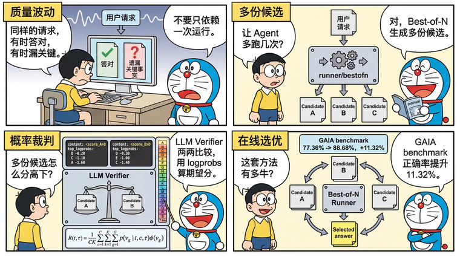
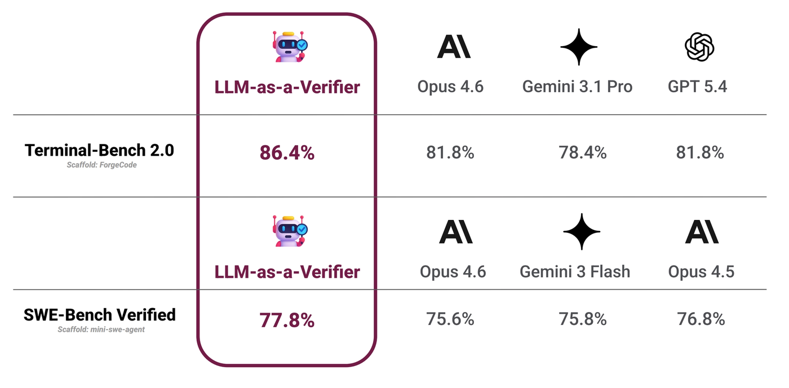

# tRPC-Agent-Go LLM Verifier：AI Agent 高质量稳定性提升方法

> 当 Agent 进入在线调用链路，质量风险不只来自显性失败，也来自 LLM 概率生成带来的结果波动。同一类请求有时能够给出正确答案，但偶尔遗漏关键事实、工具调用偏离预期或未满足输出约束。tRPC-Agent-Go 通过在线 Best-of-N 为同一请求生成多份候选，LLM Verifier 调用裁判模型成对比较候选，并根据质量标签位置的 logprobs 产出比较分数，最终将最高质量候选作为运行结果返回。在 GAIA benchmark 中，LLM Verifier 正确率相比基线提升了 11.32%。

> [tRPC-Agent-Go](https://github.com/trpc-group/trpc-agent-go/) 是面向 Go 语言的自主式多 Agent 框架，具有工具调用、会话与记忆管理、制品管理、多 Agent 协同、图编排、知识库与可观测等能力，并与 tRPC-Go 生态深度结合以复用其服务治理能力。tRPC-Agent-Go 的成长离不开大家的支持，欢迎 Star 项目。

tRPC-Agent-Go 在 Evaluation 的评估能力基础上提供 LLM Verifier，并在 Runner 层通过 `runner/bestofn` 支持在线 Best-of-N，使评估结果可以参与在线 Agent 的质量优化。开发者可以让同一请求生成多份候选，再由裁判模型成对比较候选质量，根据比较分数选择最高质量结果并沿用 Runner 调用链路返回。



## 背景

由于 LLM 生成具有概率性，Agent 在线运行时可能出现质量波动，同一类请求有时能够给出正确答案，偶尔会遗漏关键事实、工具调用偏离预期或未满足输出约束。同一条请求多次运行，也可能得到不同的检索结果、工具调用路径和最终答案。若系统只返回第一次运行结果，最终质量就被单次生成结果决定，多次运行中可能出现的更高质量答案无法被利用。

Best-of-N 的目标是为同一请求运行多次，并从多份候选中选出最高质量结果，但候选生成之后，需要可靠的自动选择机制。规则检查适合拦截显性失败和格式错误，但无法判断两份可用答案哪一份更好；普通 LLM Judge 对单个候选分别打分，遇到质量接近的长回答时容易给出相同档位，难以稳定排序。

LLM Verifier 面向多候选选择，让裁判模型比较两份候选，并读取质量标签位置的 logprobs，把裁判倾向转换为比较分数。tRPC-Agent-Go 在 Runner 层通过 `runner/bestofn` 组织候选生成和结果选择，并通过 Evaluation 指标完成成对裁判，把最高质量的候选结果返回给调用方。

## LLM Verifier 解析

[LLM-as-a-Verifier](https://llm-as-a-verifier.notion.site/) 是 Stanford AI Lab、UC Berkeley Sky Computing Lab 和 NVIDIA 提出的通用验证框架，用裁判模型评估候选结果质量，适用于为同一请求生成多份候选，并需要从中选出最高质量结果的场景。一次判断通常包含四类输入：用户请求、候选结果、评估标准和裁判模型。用户请求定义任务目标，候选结果是待验证的回答或轨迹，评估标准说明哪些质量维度需要被考虑，裁判模型负责根据这些标准给候选结果打质量标签。

普通 LLM Judge 往往让裁判模型直接输出一个离散质量等级，并把这个等级当成候选质量。这个等级可以写成数字，也可以写成字母标签；无论哪种形式，只取最终生成的那个等级都会带来两个问题。第一，两份复杂回答可能被打到同一档，排序时失去区分度。第二，裁判模型如果在相邻分档之间犹豫，只看最终等级会丢掉这种不确定性。LLM Verifier 的核心做法是让裁判模型在一组有序质量标签上表达判断，并读取质量标签位置的 token logprobs，用概率分布计算期望质量分。

质量标签是一组有严格顺序的离散等级。以 A 到 T 的 20 档为例，A 表示最高质量，T 表示最低质量，越靠前的字母代表质量越高。A 可以表示明确且完整满足要求，B-D 表示只有轻微问题，E-G 表示大体正确但仍有问题，H-J 表示倾向成功但存在不确定性，K-M 表示倾向失败，N-P 表示仍有显著问题，Q-S 表示失败但有部分进展，T 表示明确失败。

评分时，裁判模型会在质量标签位置生成一个标签 token；如果模型服务返回 logprobs，就能同时看到该位置上其他候选 token 的对数概率。logprobs 可以理解为模型对不同质量标签的相对倾向，数值越接近 0，表示对应 token 的概率越高；`top_logprobs` 则表示该位置概率较高的若干个候选 token 及其 logprobs。

```json
{
  "token": "B",
  "logprob": -0.20,
  "top_logprobs": [
    { "token": "B", "logprob": -0.20 },
    { "token": "C", "logprob": -1.10 },
    { "token": "D", "logprob": -2.30 }
  ]
}
```

这个片段表示裁判模型最终在质量标签位置生成了 `B`，但同一位置上也给 `C` 和 `D` 分配了一定概率。LLM Verifier 不会只把 `B` 当成唯一结论，而是把这些标签一起纳入期望分计算。这样可以保留裁判模型在相邻质量档之间的不确定性，减少只看单个离散标签造成的并列和抖动。

用公式表示时，可以把一次验证看成对质量标签概率分布求期望。假设一共有 $G$ 个质量标签，第 $g$ 个标签记为 $v_g$。对任务 $t$、候选轨迹 $\tau$ 和评估标准 $c$，裁判模型会给每个质量标签分配概率 $p(v_g \mid t, c, \tau)$；$\phi(v_g)$ 表示该质量标签对应的数值分。单次验证得到的不是一个硬标签，而是所有质量标签数值分的加权平均。

$$
\text{score}(t, c, \tau) = \sum_{g=1}^{G} p(v_g \mid t, c, \tau)\phi(v_g)
$$

如果同时使用 $C$ 条评估标准，并对同一候选重复验证 $K$ 次，最终质量分可以写成：

$$
R(t, \tau) = \frac{1}{CK} \sum_{c=1}^{C} \sum_{k=1}^{K} \sum_{g=1}^{G} p(v_g \mid t, c, \tau)\phi(v_g)
$$

也就是说，每个评估标准和每次验证都会先基于质量标签概率计算一个加权分；多个评估标准、多次重复验证得到的加权分再取平均，形成候选结果的最终质量分数。重复验证的作用是降低单次裁判采样带来的波动；多条评估标准的作用是让候选质量不只由单一维度决定。最终得到的分数越高，表示裁判模型在给定任务和评估标准下越倾向于认为这条候选结果质量更好。

当同一个任务有 $N$ 条候选轨迹时，LLM Verifier 可以用 round-robin tournament 选择最终结果。做法是把候选两两配对，对每一对候选分别计算质量分，质量分更高的一方记一场胜利。所有 $\binom{N}{2}$ 组比较完成后，胜场最多的候选被选中。这个过程不要求裁判模型一次性给出完整排名，而是每次只比较两个候选谁更好，最后根据各候选的胜场数选择最终结果。这种方式适合 Best-of-N 场景，因为候选数量增加时，系统仍然可以用稳定的成对比较完成选择。

LLM-as-a-Verifier 在 Terminal-Bench 2.0 和 SWE-Bench Verified 这两个评测基准上达到 SOTA，结果如下图所示。



原文实验中，Terminal-Bench 2.0 使用 ForgeCode 搭配 Claude Opus 4.6 采样 5 条候选轨迹，SWE-Bench Verified 使用 mini-swe-agent 分别搭配 Claude Opus 4.6、Gemini 3 Flash 和 Claude Opus 4.5 各采样 3 条候选轨迹，裁判模型使用 Gemini 2.5 Flash。最终 Terminal-Bench 2.0 达到 86.4%，SWE-Bench Verified 达到 77.8%。

## 快速开始

本节用 [examples/evaluation/llmverifier](https://github.com/trpc-group/trpc-agent-go/tree/main/examples/evaluation/llmverifier) 说明 LLM Verifier 的最小接入方式。这个示例会让在线 Agent 针对同一个 prompt 生成多份候选，再用裁判 Agent 对候选做成对比较，最终只向调用方返回被选中的最高质量回答。

### 环境准备

示例需要一个 OpenAI 兼容的候选模型和一个支持 `logprobs`、`top_logprobs` 的裁判模型。候选模型负责生成多个候选回答，裁判模型负责按质量标签判断候选，并在标签 token 上返回概率分布。`OPENAI_API_KEY` 是必填资源，`OPENAI_BASE_URL` 用于接入兼容网关；命令行参数会把这两个值传给候选 Agent 和裁判 Agent。

```bash
# 设置模型服务密钥
export OPENAI_API_KEY="sk-xxx"
# 可选，不设置时示例使用 OpenAI 兼容默认地址
export OPENAI_BASE_URL="https://api.openai.com/v1"
```

### 候选 Agent

候选 Agent 是被验证的业务 Agent，负责根据同一条用户输入生成参与比较的候选回答。

```go
import (
    "trpc.group/trpc-go/trpc-agent-go/agent/llmagent"
    "trpc.group/trpc-go/trpc-agent-go/model"
    "trpc.group/trpc-go/trpc-agent-go/model/openai"
)

candidate := llmagent.New(
    "candidate-agent",
    llmagent.WithModel(openai.New(modelName, opts...)),
    llmagent.WithInstruction("You are a helpful assistant."),
    llmagent.WithGenerationConfig(model.GenerationConfig{
        MaxTokens: intPtr(maxTokens),
        Temperature: floatPtr(temperature),
        Stream: true,
    }),
)
```

### 裁判 Agent

裁判 Agent 必须开启 `Logprobs`，并把 `TopLogprobs` 设置为能够覆盖 A 到 T 质量标签的范围。示例使用 20 档标签，因此 `topLogprobs` 取 20。

```go
import (
    "trpc.group/trpc-go/trpc-agent-go/agent/llmagent"
    "trpc.group/trpc-go/trpc-agent-go/model"
    "trpc.group/trpc-go/trpc-agent-go/model/openai"
)

logprobs := true
topLogprobs := 20
judger := llmagent.New(
    "judge-agent",
    llmagent.WithModel(openai.New(modelName, opts...)),
    llmagent.WithGenerationConfig(model.GenerationConfig{
        MaxTokens:   intPtr(maxTokens),
        Temperature: floatPtr(0),
        Stream:      false,
        // Logprobs 打开质量标签 token 的概率返回。
        Logprobs:    &logprobs,
        // TopLogprobs 覆盖 A 到 T 的 20 档质量标签。
        TopLogprobs: &topLogprobs,
    }),
)
```

### 裁判指标

`llm_verifier_pairwise` 是 LLM Judge 类评估器。指标的 `Threshold` 使用 `0.5`，大于 0.5 表示 Candidate A 更优，小于 0.5 表示 Candidate B 更优，等于 0.5 表示两者质量相当。

```go
import (
    "trpc.group/trpc-go/trpc-agent-go/evaluation/metric"
    "trpc.group/trpc-go/trpc-agent-go/evaluation/metric/criterion"
    criterionllm "trpc.group/trpc-go/trpc-agent-go/evaluation/metric/criterion/llm"
)

llmVerifierMetric := &metric.EvalMetric{
    // MetricName 绑定成对 LLM Verifier 评估器。
    MetricName: "llm_verifier_pairwise",
    // Threshold 使用 0.5 作为 A/B 偏好边界。
    Threshold: 0.5,
    // Criterion 提供裁判必须遵守的评估标准。
    Criterion: &criterion.Criterion{
        // LLMJudge 表示该指标由裁判模型执行。
        LLMJudge: &criterionllm.LLMCriterion{
                // Rubrics 字段保存评估细则，会进入裁判 prompt，决定质量标签含义。
            Rubrics: []*criterionllm.Rubric{
                {
                    // accuracy 约束回答必须满足用户请求。
                    ID: "accuracy",
                    Content: &criterionllm.RubricContent{
                        // Text 是裁判看到的具体标准。
                        Text: "The final answer directly satisfies the user's request and does not introduce unsupported claims.",
                    },
                },
                {
                    // conciseness 约束回答长度和表达密度。
                    ID: "conciseness",
                    Content: &criterionllm.RubricContent{
                        // Text 要和用户请求中的长度约束对应。
                        Text: "The final answer is concise and stays within the requested length constraint.",
                    },
                },
                {
                    // required_terms 约束回答覆盖用户明确要求的概念。
                    ID: "required_terms",
                    Content: &criterionllm.RubricContent{
                        // Text 用来检查显式要求是否遗漏。
                        Text: "The final answer includes every term or concept explicitly required by the user.",
                    },
                },
                {
                    // clarity 约束回答面向目标读者的可读性。
                    ID: "clarity",
                    Content: &criterionllm.RubricContent{
                        // Text 用来约束最终表达是否清楚。
                        Text: "The final answer is easy for the target audience in the user prompt to understand.",
                    },
                },
            },
        },
    },
}
```

### Best-of-N 编排

`bestofn.NewRunnerOption` 返回一个 `runner.Option`，用于把 Evaluation 驱动的候选选择器挂到候选 Runner 上。候选 Agent、裁判 Agent 和 verifier 指标分别准备好之后，编排关系集中在两个 Runner 上。裁判 Runner 负责执行裁判 prompt，候选 Runner 继续作为业务入口接收用户请求。`SelectionModePairwise` 会让选择器对候选做两两比较，并按比较结果选择最终提交的候选。

```go
import (
    "trpc.group/trpc-go/trpc-agent-go/model"
    "trpc.group/trpc-go/trpc-agent-go/runner"
    "trpc.group/trpc-go/trpc-agent-go/runner/bestofn"
)

// judgeRunner 负责运行裁判 Agent。
judgeRunner := runner.NewRunner(
    judgeAppName,
    judger,
)
// Close 释放裁判 Runner 的运行资源。
defer judgeRunner.Close()

// bestOfNOpt 将候选次数、成对模式和 verifier 指标绑定到 Runner。
bestOfNOpt, err := bestofn.NewRunnerOption(
    // WithAttempts 控制同一条用户请求生成几份候选。
    bestofn.WithAttempts(3),
    // WithSelectionMode 使用成对比较汇总候选结果。
    bestofn.WithSelectionMode(bestofn.SelectionModePairwise),
    // WithEvalMetrics 绑定 llm_verifier_pairwise 指标。
    bestofn.WithEvalMetrics(llmVerifierMetric),
    // WithJudgeRunner 指定执行裁判 prompt 的 Runner。
    bestofn.WithJudgeRunner(judgeRunner),
    // WithJudgeRunnerNumSamples 控制每组比较的裁判采样次数。
    bestofn.WithJudgeRunnerNumSamples(1),
)
if err != nil {
    log.Fatalf("create best-of-N runner option: %v", err)
}
// candidateRunner 使用 Best-of-N 选项运行候选 Agent。
candidateRunner := runner.NewRunner(
    appName,
    candidate,
    bestOfNOpt,
)
// Close 释放候选 Runner 的运行资源。
defer candidateRunner.Close()

// events 返回 Best-of-N 选择后的候选事件。
events, err := candidateRunner.Run(
    ctx,
    userID,
    sessionID,
    model.NewUserMessage(prompt),
)
if err != nil {
    log.Fatalf("run best-of-N candidate runner: %v", err)
}
```

`bestOfNOpt` 只改变候选选择流程，不改变候选 Agent 的构造方式。调用 `candidateRunner.Run` 时，Runner 会先按 `attempts` 生成候选，再通过裁判 Runner 执行 verifier 指标；选择完成后，调用方只收到被选中候选的事件和最终回答。

### 运行命令

从仓库根目录运行示例即可。`-attempts` 控制候选次数，首次接入可以保持默认值 3。

```bash
# 设置模型服务密钥
export OPENAI_API_KEY="sk-xxx"
# 可选，不设置时示例使用 OpenAI 兼容默认地址
export OPENAI_BASE_URL="https://api.openai.com/v1"

# 运行 LLM Verifier 在线候选选择示例
go -C examples/evaluation run ./llmverifier \
  -model "deepseek-v4-flash" \
  -judge-model "deepseek-v4-flash" \
  -base-url "$OPENAI_BASE_URL" \
  -api-key "$OPENAI_API_KEY" \
  -attempts 3
```

### 查看结果

示例输出会先打印用户 prompt 和候选次数，再打印最终选中的候选回答 `Selected answer`，如下所示。

```text
Prompt:
Explain LLM-as-a-Verifier for an online agent in no more than 120 words. Include the terms best-of-N and verifier.

Running 3 candidate attempts and selecting with LLM verifier...

Selected answer:
LLM-as-a-Verifier lets an online agent generate several best-of-N candidates, then uses a verifier to compare them and return the strongest final answer.
```

## 核心概念

LLM Verifier 的核心是让裁判模型成对比较候选回答，并用质量标签位置的 logprobs 计算比较分数。在线 Best-of-N 是它在 Runner 层的接入方式，候选 Runner 负责生成候选，裁判 Runner 负责执行裁判 prompt，`llm_verifier_pairwise` 负责把裁判输出转换为比较分数。

一次选择流程如下。

1. Runner 收到用户消息后，按 `WithAttempts` 生成多份候选。
2. Best-of-N 选择器读取每份候选的最终回答。
3. `llm_verifier_pairwise` 将两份候选和评估细则交给裁判 Runner。
4. 裁判模型输出质量标签，并返回对应 token 的 logprobs。
5. 选择器汇总成对比较结果，并只把胜出的候选返回给调用方。

## 使用方法

### 裁判评估细则

`llm_verifier_pairwise` 会比较两份最终响应，并依据一组评估细则 rubric 判断哪一份更符合要求。评估细则是裁判判断候选质量时使用的标准，可以约束准确性、完整性、格式或可读性等维度。评估细则会进入裁判消息，用来约束质量标签如何解释。

```go
import (
    "trpc.group/trpc-go/trpc-agent-go/evaluation/metric"
    "trpc.group/trpc-go/trpc-agent-go/evaluation/metric/criterion"
    criterionllm "trpc.group/trpc-go/trpc-agent-go/evaluation/metric/criterion/llm"
)

llmVerifierMetric := &metric.EvalMetric{
    // MetricName 绑定成对 LLM Verifier 评估器。
    MetricName: "llm_verifier_pairwise",
    // Threshold 定义 Candidate A 与 Candidate B 的偏好边界。
    Threshold: 0.5,
    // Criterion 保存 LLM Judge 的裁判配置。
    Criterion: &criterion.Criterion{
        // LLMJudge 表示该指标由裁判 Runner 执行。
        LLMJudge: &criterionllm.LLMCriterion{
            // Rubrics 字段保存传给裁判 prompt 的评估细则。
            Rubrics: []*criterionllm.Rubric{
                {
                    // ID 标识当前裁判口径。
                    ID: "quality",
                    Content: &criterionllm.RubricContent{
                        // Text 描述最终回答必须满足的主质量标准。
                        Text: "The final answer directly satisfies the user's request and does not introduce unsupported claims.",
                    },
                },
            },
        },
    },
}
```

`Threshold: 0.5` 表示 Candidate A 和 Candidate B 的偏好边界。分数大于 0.5 表示 Candidate A 更优，分数小于 0.5 表示 Candidate B 更优。在线 Best-of-N 中，A/B 是候选编号，不是质量标签。评估细则会直接进入裁判消息，因此打分依据会跟评估细则描述的质量口径一致。

### 裁判消息构造

默认消息构造器会把一次候选比较整理成一条裁判消息。它先读取用户请求，再取出两份候选的最终回答，将当前候选作为 Candidate A，将对照候选作为 Candidate B，并把评估细则写入裁判 prompt。

默认模板要求裁判只根据评估细则打分。裁判需要先写简短分析，再分别输出 `<score_A>LETTER_A_TO_T</score_A>` 与 `<score_B>LETTER_A_TO_T</score_B>`。A 到 T 这种单字母质量标签更倾向于是一个独立 token，固定标签格式则让打分器可以稳定定位这个 token，并读取该位置的 logprobs。

如果只是改变裁判口径，优先调整评估细则。只有需要改写用户请求、候选回答和评估细则的组织方式时，才替换 `MessagesConstructor`。

### logprobs 响应打分

响应打分器不会只读取裁判最终生成的标签字母，而是读取质量标签 token 位置的 `Logprobs.Content`。它会分别定位 `<score_A>` 和 `<score_B>` 后面的单字母标签，并结合 `top_logprobs` 还原 A 到 T 的概率分布。

A 到 T 会被映射到 1 到 0 的连续刻度。打分器先计算 Candidate A 和 Candidate B 各自的期望质量分，再把两者差值转换为 0 到 1 的比较分数。分数大于 0.5 偏向 Candidate A，小于 0.5 偏向 Candidate B，等于 0.5 表示两者质量相当。

裁判模型返回可以简化理解为下面这样。

```json
{
  "logprobs": [
    {
      "content": "<score_A>B",
      "top_logprobs": [
        { "token": "B", "logprob": -0.20 },
        { "token": "C", "logprob": -1.10 },
        { "token": "A", "logprob": -1.60 }
      ]
    },
    {
      "content": "<score_B>D",
      "top_logprobs": [
        { "token": "D", "logprob": -0.30 },
        { "token": "E", "logprob": -1.00 },
        { "token": "C", "logprob": -1.40 }
      ]
    }
  ]
}
```

Candidate A 的标签位置最高概率是 `B`，备选标签包括 `C` 和 `A`。A、B、C 在 20 档质量刻度上的分值分别是 1、18/19 和 17/19。按 `exp(logprob)` 归一化后，B、C、A 的权重约为 1、0.407 和 0.247，加权平均得到 0.942。Candidate B 的标签位置最高概率是 `D`，备选标签包括 `E` 和 `C`，同样计算后得到 0.837。最终比较分数为 `0.5 + (0.942 - 0.837) / 2 = 0.552`。这个分数大于 0.5，因此本轮比较偏向 Candidate A。

### Best-of-N Runner

`bestofn.NewRunnerOption` 是在线候选选择的主入口。它返回一个 `runner.Option`，内部会把 Evaluation 驱动的候选选择器挂到 Runner 上，并把候选次数、裁判 Runner、裁判采样数和选择模式传给底层候选运行机制。

```go
import (
    "trpc.group/trpc-go/trpc-agent-go/runner"
    "trpc.group/trpc-go/trpc-agent-go/runner/bestofn"
)

bestOfNOpt, err := bestofn.NewRunnerOption(
    // WithAttempts 控制同一条用户请求生成几份候选。
    bestofn.WithAttempts(3),
    // WithSelectionMode 使用成对比较汇总候选结果。
    bestofn.WithSelectionMode(bestofn.SelectionModePairwise),
    // WithEvalMetrics 指定候选比较时使用的 verifier 指标。
    bestofn.WithEvalMetrics(llmVerifierMetric),
    // WithJudgeRunner 指定执行裁判 prompt 的 Runner。
    bestofn.WithJudgeRunner(judgeRunner),
    // WithJudgeRunnerNumSamples 控制每组比较的裁判采样次数。
    bestofn.WithJudgeRunnerNumSamples(1),
)
if err != nil {
    return err
}
// candidateRunner 使用 Best-of-N 选项运行候选 Agent。
candidateRunner := runner.NewRunner(
    appName,
    candidate,
    bestOfNOpt,
)
// Close 释放候选 Runner 的运行资源。
defer candidateRunner.Close()
```

bestofn 常用 `Option` 如下。

- `WithAttempts` 设置同一条用户请求生成几份候选，取值必须大于 0。
- `WithSelectionMode` 设置评估结果的聚合方式。默认 `SelectionModePointwise` 会对每个候选独立评分并选择最高分，`SelectionModePairwise` 会让候选两两比较，并根据每个候选赢过多少次选择最终结果，适合 LLM Verifier 场景。
- `WithEvalMetrics` 指定候选比较使用的 Evaluation 指标，LLM Verifier 场景通常传入 `llm_verifier_pairwise`。
- `WithJudgeRunner` 指定执行裁判 Runner。
- `WithJudgeRunnerNumSamples` 设置每组比较的裁判采样次数。
- `WithAttemptParallelEnabled` 控制候选是否并行生成。
- `WithAttemptParallelism` 控制并行候选数量上限。

## GAIA Benchmark

[trpc-agent-go-benchmark/gaia](https://github.com/trpc-group/trpc-agent-go-benchmark/tree/main/gaia) 提供了 GAIA 2023 Level 1 验证集的 benchmark。Baseline 使用默认 react planner 单次运行，LLM Verifier 模式会为同一个任务生成多份候选，再用 `llm_verifier_pairwise` 做 Best-of-N 选择。

```bash
cd trpc-agent-go-benchmark/gaia/trpc-agent-go-impl

# baseline 单次运行
go run ./cmd/baseline \
  -model gpt-5 \
  -output ../results/gpt-5_react_baseline.json

# LLM Verifier Best-of-N
go run ./cmd/llmverifier \
  -model gpt-5 \
  -attempts 5 \
  -output ../results/gpt-5_react_llmverifier.json
```

GAIA 2023 Level 1 验证集共 53 个任务。2026-06-15 的一组结果如下。

| 模式 | 正确数 | 准确率 | 平均耗时 |
| --- | ---: | ---: | ---: |
| react baseline | 41/53 | 77.36% | 201.2s |
| react + LLM Verifier Best-of-N | 47/53 | 88.68% | 244.6s |

这组结果里，LLM Verifier 比 baseline 多答对 6 题，准确率从 77.36% 提升到 88.68%。平均耗时从 201.2s 增加到 244.6s，因为每个任务会生成多份候选并额外调用裁判模型。

## 总结

本文介绍了 tRPC-Agent-Go 的 LLM Verifier 能力，给出了从最小示例到在线 Best-of-N 接入的使用路径。LLM Verifier 以裁判模型、评估细则和 logprobs 打分为核心，将多份候选回答转化为可比较的质量分数；`runner/bestofn` 在 Runner 层组织候选生成、成对裁判和结果选择，并把最高质量候选作为运行结果返回。

tRPC-Agent-Go 将 Evaluation 的评估结果引入在线 Agent 运行链路，使评估可以参与候选选择和质量优化。接入时需要确认裁判模型支持 logprobs，并根据任务目标设计评估细则 rubric；对于工具调用成本较高、外部副作用较强或无法安全重放的运行形态，应谨慎开启多候选选择。将关键任务接入 LLM Verifier，可以在增加可控推理成本的前提下，提升 Agent 最终回答的高质量稳定性。

## 参考资料

- [tRPC-Agent-Go Runner: 在线 Best-of-N 候选选择](../runner.md)
- [tRPC-Agent-Go Evaluation: LLM Verifier](../evaluation.md#llm-verifier)
- [examples/evaluation/llmverifier](https://github.com/trpc-group/trpc-agent-go/tree/main/examples/evaluation/llmverifier)
- [tRPC-Agent-Go-Benchmark：GAIA](https://github.com/trpc-group/trpc-agent-go-benchmark/tree/main/gaia)
- [LLM-as-a-Verifier](https://llm-as-a-verifier.notion.site/)

**代码仓库**：

- [tRPC-Agent-Go 仓库](https://github.com/trpc-group/trpc-agent-go)

## 使用与交流

欢迎大家使用 tRPC-Agent-Go 框架！如需详细的使用文档和示例，请访问 [tRPC-Agent-Go 仓库](https://github.com/trpc-group/trpc-agent-go)。

欢迎通过 GitHub Issues 讨论框架使用经验、分享最佳实践、提出改进建议。让我们一起推动 Go 语言在 AI Agent 领域的发展！
