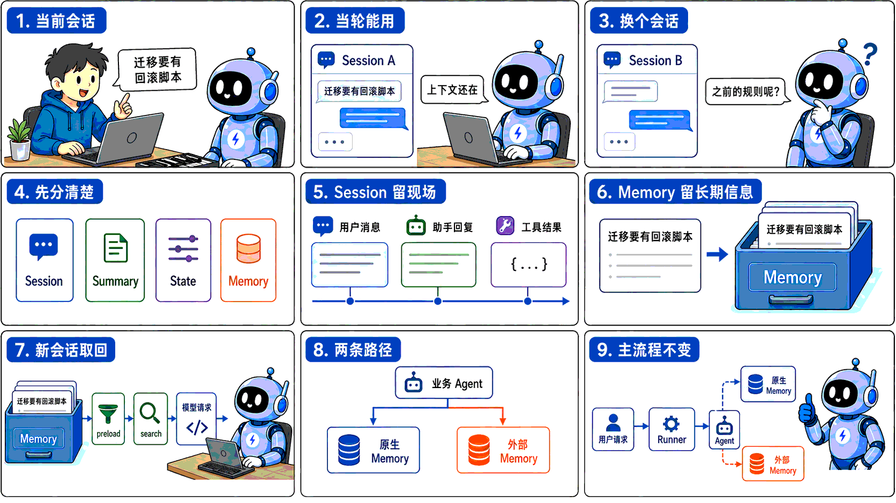
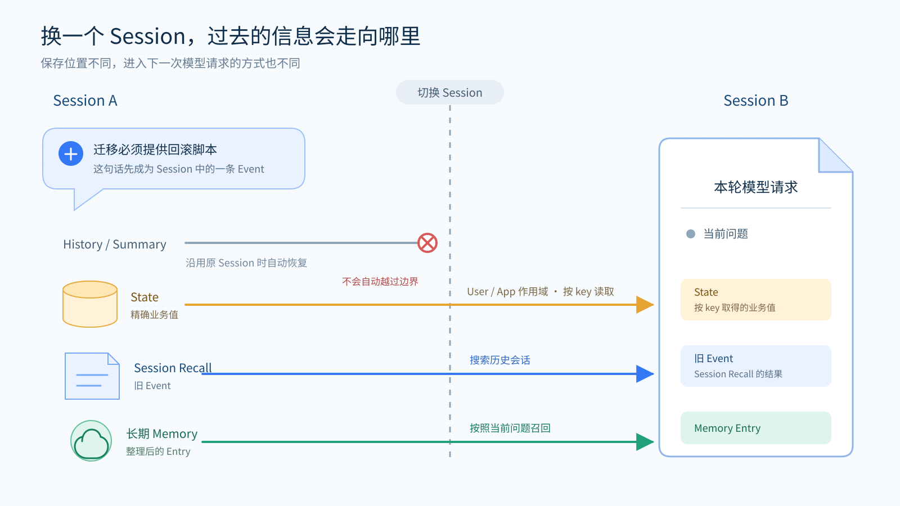
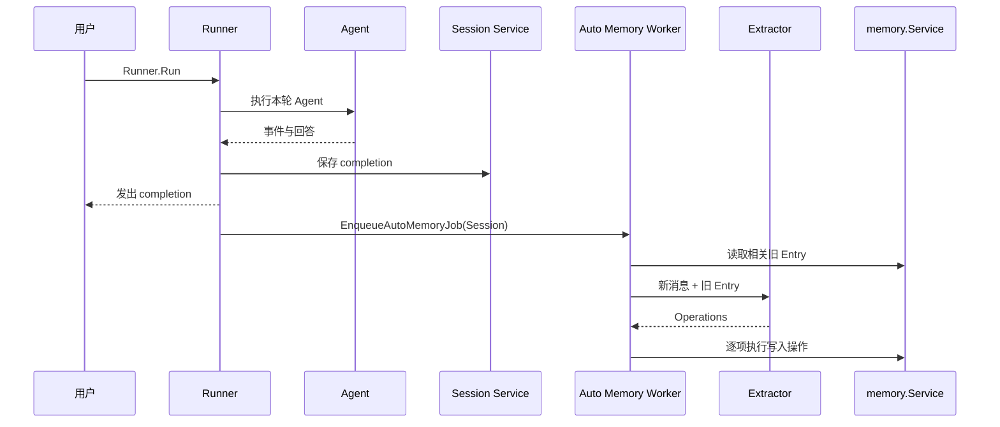
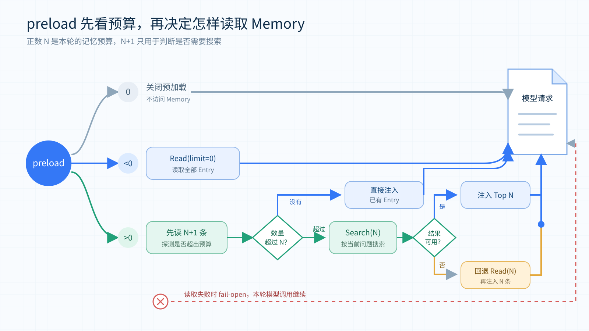
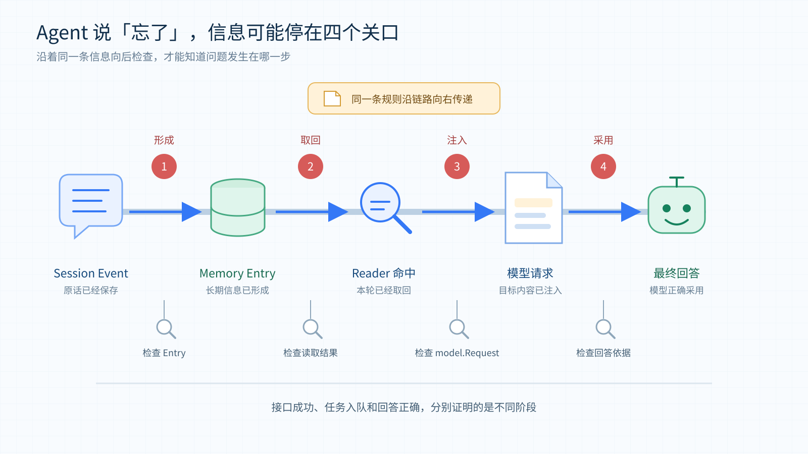
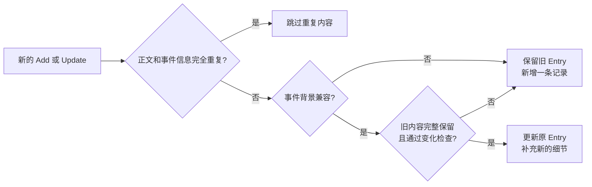
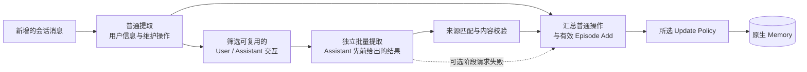
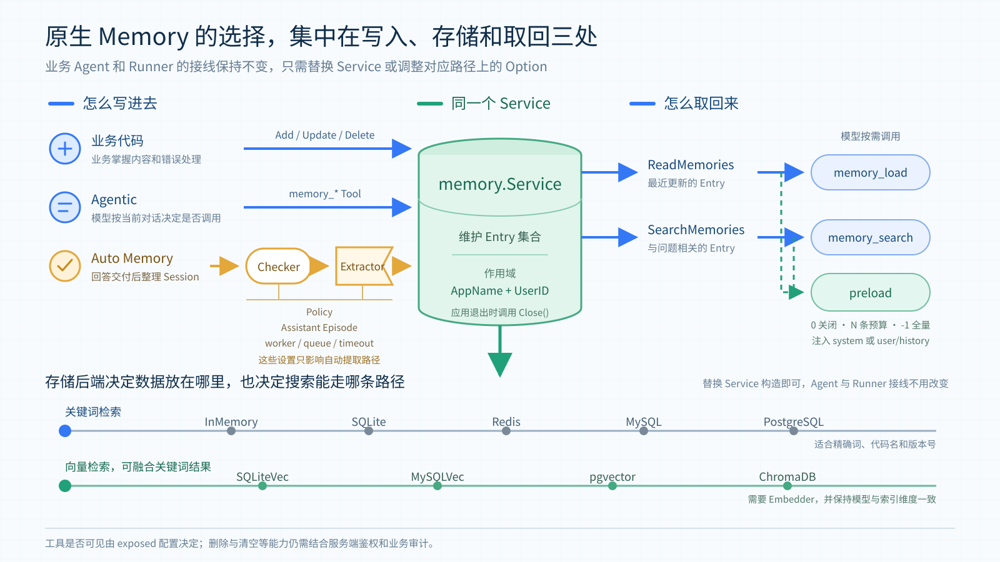
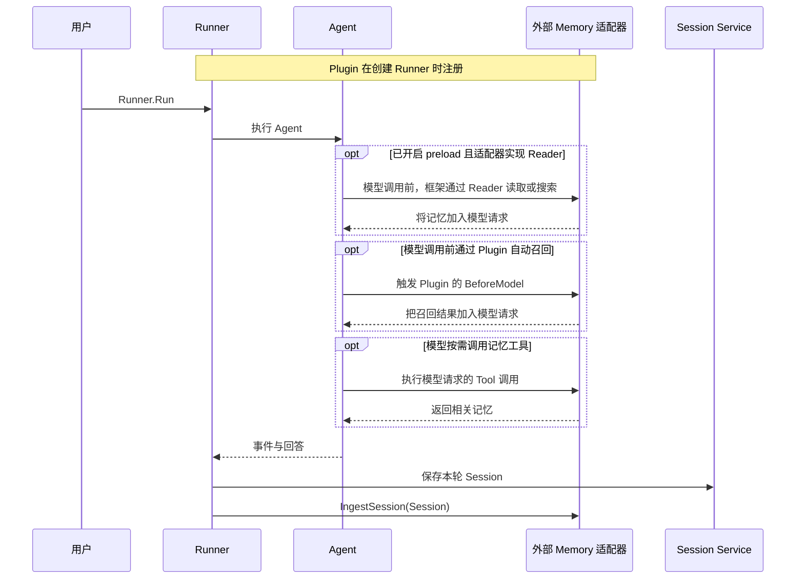

# tRPC-Agent-Go Memory：Agent 记忆的形成、取回与外部记忆平台接入

导语：Memory 的存储方式和平台能力各不相同，业务往往很难一开始就确定最合适的方案。通过 tRPC-Agent-Go，可以在保留现有 Agent 运行流程的前提下，直接使用原生 Memory 和多种存储后端，也可以轻松接入 TencentDB Agent Memory、Mem0 等外部平台。

> tRPC-Agent-Go 是 tRPC-Go 团队推出的面向 Go 语言的自主式多 Agent 框架，具有工具调用、会话与记忆管理、制品管理、多 Agent 协同、图编排、知识库与可观测等能力，并与 tRPC-Go 深度结合以复用其服务治理能力。
>
> 仓库托管在 [GitHub](https://github.com/trpc-group/trpc-agent-go)。tRPC-Agent-Go 的成长离不开大家的支持，欢迎 Star 项目。

Memory 在业务 Agent 创建的初期往往不太显眼，这是因为用户刚刚说过的话还留在当前上下文里，工具返回的结果也能直接用于后续处理。即使没有专门接入 Memory，Agent 在同一个 Session 中通常也能沿着前面的内容继续工作。

等到 Agent 被反复调用，并开始承担跨 Session 的长期任务时，Memory 的重要性才会逐渐显现。比如，用户已经强调过数据库迁移必须提供回滚脚本，但换了一个 Session 以后，如果这条规则只保存在原来的会话中，用户就得再说一次。Memory 把这条规则带进新的 Session，只解决了遗忘的问题。信息一旦能够长期保留，系统还要处理它后来的变化。如果用户修改了规则，系统需要知道应该以哪一版为准。如果用户明确要求删除，旧内容也不应继续出现在搜索结果里。这些问题会随着 Agent 使用时间的增长陆续出现。



*图 1：当前会话能继续，并不代表新的 Session 仍能使用已经确认的信息。业务可以选择 tRPC-Agent-Go 原生 Memory，也可以把记忆加工交给外部平台。*

在跨 Session 保存的基础上，tRPC-Agent-Go 原生 Memory 增加了 Preserve History 和 Assistant Episode。Preserve History 会在信息发生变化时保留历史记录，只把没有冲突的补充合并到原 Entry。Assistant Episode 则把 Agent 先前给出的结果保存为带有对话背景的场景记忆。

在 tRPC-Agent-Go 中，给 Runner 配置一个 Memory Service，就能为现有业务 Agent 开启原生 Memory，自动提取和召回方式也可以继续通过 Option 调整。此外，tRPC-Agent-Go 支持轻松接入外部记忆平台，不需要重写业务主流程，只要把平台适配器注册给 Runner，再按需加入 Reader、Tool 或 Plugin，接入 TencentDB Agent Memory、Mem0 等记忆平台。

如果希望快速接入 tRPC-Agent-Go 的 Memory，可以直接快进到第三章，或者参考[tRPC-Agent-Go Memory 接入示例](https://github.com/trpc-group/trpc-agent-go/tree/main/examples/memory)快速体验。

## 一、tRPC-Agent-Go 的记忆能力与工作原理

### 1.1 Agent 需要哪几种长期记忆

在设计 Agent 的长期记忆时，业界常常参考人类记忆的分类，把需要长期保存的内容分为事实记忆、场景记忆和程序记忆，[LangGraph 的记忆分类说明](https://docs.langchain.com/oss/python/concepts/memory) 也采用了这种划分。

事实记忆（Semantic Memory）保存相对稳定的用户信息、偏好和背景，在 tRPC-Agent-Go 中对应 Fact。比如，用户明确要求数据库迁移必须提供回滚脚本，这条要求就可以提取成 Fact。以后用户发起新的迁移任务时，Agent 仍然能够找到这条已经确认的要求。

场景记忆（Episodic Memory）保存某一次具体经历，在框架中对应 Episode。继续以迁移审核为例，如果某次提交因为缺少回滚脚本而被退回，Episode 可以记录当时发生了什么、谁参与了处理，以及最后怎样解决。后续再问那次审核为什么没有通过，Agent 就能根据这段经历回答。为了保留这些背景，Episode 除了正文，还可以记录事件时间、参与者和地点。

程序记忆（Procedural Memory）保存的是以后可以照着执行的方法。例如，Agent 可以从迁移审核的经验中整理出一套检查步骤，说明先检查什么、缺少回滚脚本时怎样处理，以及哪些条件满足后才能提交。这样的记忆能够指导下一次操作，因此更适合保存为可复用的 Skill。

tRPC-Agent-Go 将这三类记忆交给不同的能力处理。原生 `memory.Service` 负责 Fact 和 Episode，程序记忆则通过 [Skill](https://github.com/trpc-group/trpc-agent-go/blob/main/docs/mkdocs/zh/skill.md)  和 [Evolution](https://github.com/trpc-group/trpc-agent-go/blob/main/docs/mkdocs/zh/evolution.md) 配合实现。Skill 保存方法的适用条件、操作步骤和注意事项。开启 Evolution 后，框架会在后台分析历史执行，从中提炼可复用的 Skill。技能发布以后，Agent 就可以按需加载，用其中的步骤处理相似任务。

本文接下来介绍的框架原生 Memory，主要指由 `memory.Service` 管理的事实记忆和场景记忆。

### 1.2 为什么需要长期 Memory

理解业务 Agent 为什么需要长期 Memory，可以先看 Session 已经解决了什么。在 tRPC-Agent-Go 中，一次业务请求通常从 `Runner.Run` 开始。Runner 会根据 App、User 和 Session 三层标识找到当前会话，随后由 Session Service 保存用户消息、Assistant 回复、工具调用和状态变化。下一次请求继续使用相同的 Session ID 时，Runner 会恢复这些内容，所以 Agent 能够沿着前面的对话继续工作。

Session ID 同时也划定了这段上下文的边界。用户换用新的 Session ID 后，Runner 会进入另一段会话。原来的消息并没有消失，它们仍然保存在 Session Service 中，只是不会自动出现在新会话的模型请求里。因此，Agent 在当前 Session 中记得一条规则，只能说明这条规则还在会话上下文中。等到新的 Session 仍然需要使用它时，才需要长期 Memory 参与。

Session 保存的是一段会话的完整现场，其中既有消息，也有工具事件和运行状态。它不会自行判断哪些内容以后仍然有用，也不会把这些信息整理出来供其他 Session 使用。当同一个用户在新的 Session 中仍然需要之前确认的规则、偏好或经历时，就需要长期 Memory 把这些信息整理出来，并重新提供给 Agent。

### 1.3 Memory 适合保存什么

长期 Memory 负责从会话中整理出以后仍然有用的信息，再把它带到新的 Session。比如，用户已经确认数据库迁移必须提供回滚脚本，这条要求不只服务于当前对话，下一次审核仍然可能用到，因此适合保存为长期 Entry。tRPC-Agent-Go 原生 Memory 使用 `memory.UserKey{AppName, UserID}` 管理这些 Entry。它的作用域不包含 Session ID，所以同一用户创建新的 Session 后，仍然可以按当前问题找回此前形成的记忆。

Memory 保存的是从对话中提取出来的长期信息，并不负责原样保留整段交流。如果内容只用于继续当前任务，Session 已经能够保存消息、工具事件和运行状态。它比 Memory 更完整地保留了会话过程，但这些内容不会自动进入新的 Session。

同一个 Session 变得很长以后，可以通过 Summary 压缩较早的内容，避免每次都把完整历史交给模型。Summary 仍然服务于当前会话的延续，它不会因为生成了摘要，就成为其他 Session 可以检索的长期 Entry。真正需要跨 Session 使用的规则、偏好或经历，仍然应该交给 Memory 整理。

有些信息虽然需要长期保存，却不适合交给 Memory 做语义提取。比如游戏任务是否已经解锁、当前启用哪一版规则、审批是否已经通过，业务代码通常希望按照固定的 key 得到确定结果。这类结构化数据更适合放在 State 中。State 可以根据需要设置为 Session、User 或 App 作用域，读取时依赖明确的 key，而不是根据当前问题搜索相近内容。

如果后续任务需要回看以前说过的原话或工具执行过程，可以使用 Session Recall。支持事件检索的 Session Service 会在同一用户的其他 Session 中搜索已经持久化的 Event，返回的仍然是当时的会话内容。相比之下，Memory 返回的是经过提取和整理的 Entry，更适合直接为新的任务提供长期背景。



*图 2：长期 Memory 保存经过整理的长期信息。Session 和 Summary 延续当前会话，State 精确保存业务值，Session Recall 则用于找回其他 Session 中的原始事件。*

因此，业务首先要判断一条信息是否值得成为以后反复使用的长期结论。如果答案是肯定的，就可以交给 Memory 保存。只需要延续当前对话时使用 Session 或 Summary，需要精确读写时使用 State，需要回看原始过程时再使用 Session Recall。

### 1.4 从一个 `memory.Service` 开始

前面介绍的 Fact 和 Episode 都会保存为 `memory.Entry`，由 `memory.Service` 提供读写和管理能力。业务先创建一个 Service，再把它配置给 Runner，原来的 Agent 类型和请求入口都不用改变。需要让模型主动维护记忆时，可以把 Service 提供的工具加入 Agent。需要在每次模型调用前带回一部分长期信息时，再为 Agent 开启 preload。

框架把读取能力单独放在 `memory.Reader` 中，它负责读取和搜索已经保存的 Entry。`memory.Service` 在 Reader 之上增加了写入和维护能力，并负责管理自动提取任务和后台资源。业务代码可以直接调用 Service，Agent 可以通过工具使用它，Runner 也可以在每轮结束后把当前 Session 交给它继续处理。

开发时可以先用 InMemory 跑通整个流程。如果希望进程重启后仍然保留数据，可以换成 SQLite。业务需要由多个实例共享数据时，还可以根据已有基础设施选择 Redis、MySQL、PostgreSQL、pgvector 或 ChromaDB。虽然这些后端的检索和删除能力有所区别，但 Agent 与 Runner 的接线方式保持不变。

Service 创建完成以后，业务还要决定信息怎样写进去。如果信息已经由业务系统整理好，而且写入结果必须立即确认，直接调用 Service 的增删改查接口会更清楚。默认 agentic 工具只启用 Add、Update、Search、Load，Delete 和 Clear 需要显式开启，开启后用户明确提出「记住这条规则」或「删除这条信息」时，可以让 Agent 调用相应的 Memory 工具。至于自由对话中逐渐出现的偏好和经验，则可以交给 Auto Memory，在一轮回答结束后统一整理。

这三种方式可以使用同一个 Service，但它们各自承担的责任不同。业务代码直接写入时，会在当前调用中得到结果。通过工具写入时，是否执行由模型决定。Auto Memory 还要经过 Extractor 对会话内容的判断。因此，创建 Service 只是开启了 Memory 能力，采用哪种写入方式仍由业务选择。

### 1.5 Auto Memory 在回答之后整理会话

很多值得保留的信息都出现在自然交流中，用户未必会专门发出一条记忆指令。比如，一条代码兼容性要求可能经过几轮讨论才被确认，最后只作为普通对话留在 Session 中。Auto Memory 会在一轮交互结束后检查这些新增内容，并从中提取适合长期保存的信息。

开启这项能力时，需要为 Service 配置一个 Extractor。Runner 会先完成本轮 Agent 调用，把本轮的 completion 事件写入 Session 并发送给调用方，然后再触发 `EnqueueAutoMemoryJob`。后台 worker 取得任务后，会把尚未处理的会话消息和相关旧 Entry 交给 Extractor。Extractor 返回 Add、Update、Delete 或 Clear 等 Operation，worker 再根据更新策略检查这些操作，并逐项写入 Service。



*图 3：Runner 先交付回答，再把 Session 送入 Auto Memory。此时长期 Entry 通常还在后台形成。*

所以，回答已经显示出来时，长期记忆可能还没有形成。任务成功进入队列只是说明 worker 已经接收了它，要确认 Auto Memory 是否处理完成，仍然需要从 Service 中读取或搜索目标 Entry。但是如果每轮对话结束后都立即调用 Extractor，模型调用次数会随之增加，一段尚未说完的讨论也可能被过早拆开。Checker 可以让新消息先在 Session 中积累，等到满足条件以后再开始提取。

`CheckMessageThreshold` 会根据尚未处理的消息数量做出判断，`CheckTimeInterval` 则会检查距离上次提取已经过去多久。连续配置多个 `WithChecker` 时，所有条件都满足才会启动提取。使用 `WithCheckersAny` 后，只要其中一个条件满足就可以启动。

如果 Checker 返回了 false，尚未处理的消息会继续保留，等到下一次任务到来时再判断是否提取。Checker 只负责决定提取的时机，具体保存哪些内容、怎样处理旧记录，仍然由 Extractor 和更新策略决定。

同一批 Operation 也可能只完成一部分。搜索相关旧记忆失败以后，Auto Memory 会先通过 `ReadMemories` 读取最近的一组 Entry 作为回退。只有回退读取也失败，或者 Extractor 调用失败时，这一轮处理才会在写入前停止。

如果某一项写入操作失败，worker 会记录错误并继续执行后面的 Operation。整批操作处理完以后，提取水位仍然会推进，因此失败的 Operation 不会自动重试，已经完成的写入也不会回滚。Auto Memory 更适合保存可以重新提取或修正的信息。对于必须原子生效的业务规则，配置系统或事务数据库仍然更合适。

### 1.6 记忆怎样回到下一次请求

Entry 写入完成以后，框架先要从当前用户的记忆范围中找到候选内容。`ReadMemories` 不需要查询条件，它会按照更新时间从新到旧读取 Entry。`SearchMemories` 则会根据当前问题计算相关性，再把更合适的结果排在前面。`memory_load` 和 `memory_search` 分别使用这两条路径，所以前者适合查看最近保存了什么，后者适合围绕一个具体问题查找内容。

搜索怎样计算相关性取决于存储后端。普通后端会使用框架统一的关键词评分，对 Entry 正文和 Topics 进行分词，再综合词语覆盖、稀有程度和连续短语计算结果。向量后端会先为查询生成 Embedding，再根据向量相似度取得候选内容。开启混合搜索以后，向量结果还可以与关键词结果融合，因此换一种说法时仍有机会命中，代码名、版本号等需要精确匹配的内容也不容易被遗漏。

搜索时，框架会先根据 `memory.UserKey{AppName, UserID}` 限定用户范围，然后再按需要筛选 Fact、Episode 或指定事件时间。如果按某一种记忆类型搜索时，返回的结果过少，可以开启 Kind Fallback，让框架补充搜索其他类型的记忆。

如果搜索到了很多相近的内容，可以通过去重和最大数量控制最终返回的结果。相似度门槛是否生效取决于检索模式；向量后端开启混合搜索时，融合分数不再按余弦相似度门槛过滤。对于需要回顾事情先后顺序的问题，还可以启用时间排序。不过，这个选项只会调整相关性相同的结果，不会将不相关的记忆排到前面。

业务可以让模型按需调用这些读取接口，也可以在模型调用之前主动加载记忆。把 `memory_search` 或 `memory_load` 作为 Tool 交给 Agent 后，模型会根据当前问题自行判断是否调用。这样可以减少平时占用的上下文，不过模型也可能没有意识到此时需要查询记忆。对于由多个部分组成的问题，更稳妥的做法是分别使用较短的查询，再合并得到的结果。

如果希望模型在回答之前就看到长期背景，可以开启 preload，让框架在每次模型调用前主动读取记忆。框架默认不会预加载记忆，设置 `WithPreloadMemory(0)` 也会保持关闭。把参数设为正数 N 后，框架就会把 N 作为本轮的记忆预算。如果设为 -1，则会加载全部 Entry，因此只适合记忆数量始终可控的情况。对于会长期运行的业务，从较小的正数开始通常更稳妥。

当预算是正数 N 时，框架会先读取 N+1 条 Entry。多出来的一条用于判断当前用户的记忆数量是否已经超过预算。如果总数没有超过 N，已有 Entry 会直接进入请求。如果数量更多，框架就会使用当前用户消息作为查询，搜索最相关的 N 条，并要求后端尽量进行混合搜索和结果去重。搜索失败、查询内容为空或没有得到可用结果时，框架会改为直接读取最近的 N 条。



*图 4：把 preload 的预算设为正数 N 后，框架会先读取 N+1 条。如果记忆数量超过预算，就围绕当前问题搜索 N 条相关记忆。读取失败时，本轮模型调用仍会继续。*

预加载的内容默认进入 system context。使用 `WithPreloadMemoryInjectionMode(llmagent.PreloadMemoryInjectionUser)` 后，也可以把它放到 user/history 附近。后一种方式对提示词缓存更友好，不过这部分内容也会参与 Token 裁剪。`WithPreloadMemoryPlaybook` 可以覆盖默认的读取说明，告诉模型这些长期信息来自哪里，以及遇到过期或冲突内容时应该怎样理解。传入非空内容时，框架不会保留内置 playbook，因此调用方需要自行写入仍然希望继续使用的默认约束。传入空字符串则会继续使用内置说明。

Session Summary、Session Recall、长期 Memory 和当前 Session history 可能同时进入一次模型请求，框架不会自动把它们合并成一份无重复的上下文。如果同一条信息既存在于旧 Event 中，又被保存为 Memory Entry，它就可能重复占用输入空间。因此，接入时需要分别控制各部分的预算，并通过模型请求日志检查最终进入模型的内容。

## 二、原生 Memory 的算法优化与效果

### 2.1 从记忆保存到回答效果

按照前面的流程，一段会话可以被整理为长期记忆，供新的 Session 读取。不过，记忆已经形成，并不代表新的 Session 一定能回答正确。一部分信息会在后续更新中丢失细节，另一部分信息只出现在 Assistant 的回答里，普通提取可能遗漏。针对这两类问题，我们改进了更新策略，并增加了对 Assistant 回答的提取。

在历史版本的固定 50 题 LongMemEval-S 的评测中，使用默认的 Merge Similar 策略，并关闭 Assistant Episode 时，回答准确率为 28%。将更新策略切换为 Preserve History 以后，准确率提高到了 82%。在此基础上开启 Assistant Episode，准确率进一步提高到 **90%**，答对的题目从最初的 14 道增加到了 45 道。各组配置与 Mem0 OSS 的对照结果如下。

| 方案与配置 | Assistant Episode | 准确率 |
| --- | --- | ---: |
| 原生 Memory，Merge Similar | 关闭 | 28% |
| 原生 Memory，Merge Similar | 开启 | 58% |
| 原生 Memory，Preserve History | 关闭 | 82% |
| 原生 Memory，Preserve History | 开启 | **90%** |
| 原生 Memory，Append Only | 关闭 | 82% |
| 原生 Memory，Append Only | 开启 | 88% |
| Mem0 OSS 2.0.11，native | 不适用 | 84% |

> **评测说明**：LongMemEval-S 主结果使用固定 50 题。历史会话通过 Runner 回放，确认记忆写入后，在新的 Session 中回答问题，失败也计入分母。28% 的基线已经使用原生 Memory。原生 Memory 优化前后的题集和主要配置相同，都使用 `glm52`、`text-embedding-ada-002` 和 pgvector top-k 20，代码版本有所变化。Mem0 OSS 使用同一套评测程序，按其 native 配置运行。详情见[评测结果](https://github.com/trpc-group/trpc-agent-go-benchmark/blob/main/memory/results/README.md)。

### 2.2 Policy 处理后来发生的变化

当 Auto Memory 持续处理会话时，同一件事很可能在不同时间被多次提到。比如，项目最初要求兼容 Go 1.21，后来又把最低版本提高到 Go 1.23。Extractor 要先识别两条信息之间的关系，再决定旧记录应该怎样保留，这个过程由 Update Policy 约束。

Update Policy 会在两个位置起作用。Extractor 使用与策略对应的提示词理解新旧信息，并生成 Add、Update、Delete 或 Clear 等操作。真正写入以前，worker 还会按照同一策略检查这些操作，处理重复内容和可能丢失旧信息的覆盖。模型负责理解自然语言中的关系，worker 则负责守住写入边界，后一步使用本地规则完成，不会增加模型调用。

默认的 MergeSimilar 更新策略延续了框架原有的合并方式。Auto Memory 会先搜索与新内容相似的 Entry，再结合相关性和文本重合程度判断是否重复、在高度相似的情况下，利用有没有新增 `Topic` 为依据，判断是否可以更新。这种方式适合只保留当前结论的内容，不过合并结果也会受到存储后端的搜索结果和模型生成内容影响。

不过，用户后来提到同一个话题，并不意味着之前的信息已经失效。在一个bad case 中，用户曾在 5 月 30 日说，自己已经完成了 7 篇短篇小说。到了 6 月 16 日，用户又补充说正在写一篇新故事，目标是每周写 500 字。这次交流只补充了写作近况，没有改变已经完成的数量，但默认策略整理之后，记忆里却找不到「7 篇」了。用户在新的 Session 中询问累计完成了多少篇，Agent 因而回答不知道。

这个问题发生在记忆写入阶段。原来的「7 篇」已经不在最终 Entry 中，所以补充检索线索、标签或索引搜索，都无法把它找回来。要让新的 Session 回答正确，首先要避免后续交流覆盖仍然有效的旧细节。



*图 5：同一条信息从 Session 进入回答，需要先形成 Entry，再被取回并加入模型请求。写入阶段丢失的内容，无法靠后续召回补回。*

两段内容整体相似，并不代表其中的事实没有变化。数量、时间或状态只要有一项不同，就可能代表新的信息。因此，更新策略不能只看相似度，还要判断新内容是在补充旧事实，还是已经改变了它。

一种更保守的处理方式是在提取时追加新的事实，让新旧内容先共存，等到读取时再结合当前问题组织结果。AppendOnly 更新策略采用了与 Mem0 add-only 相近的思路，它会把 Update 转换成 Add，过滤完全重复的内容，并跳过自动提取产生的 Delete 和 Clear。回到前面的 Go 版本要求，旧的 Go 1.21 记录会继续保留，新的 Go 1.23 要求则会另存为一条记忆。

Append Only 尽量避免在写入阶段丢失信息，不过相近记录和历史变化也会逐渐增加，读取时需要从中找出当前问题需要的版本。它会在本次找到的相关 Entry 和当前批次中排除重复内容，并不会为每次写入扫描全部记忆。因此，长期使用时仍然需要关注 Entry 的增长和召回结果中的重复内容。

不过，同一条事实有时只是在逐渐补充细节。例如，原来只知道 `Alice visited Bob on December 1st, 2025.`，后来又确认是 `Alice visited Bob at 4pm on December 1st, 2025.`。后一句补上了具体时刻，仍然说的是同一次拜访。如果这类补充每次都另存一条，就会产生许多相近的记录。PreserveHistory 更新策略因此保留了更新原 Entry 的机会，但要求新内容只是没有冲突的补充。如果数值、日期或状态已经发生变化，框架就会尽量保留前后两条记录。

判断一条新内容能否补充旧记录时，Preserve History 会先排除真正的重复内容。它会比较规范化后的正文、记忆类型、事件时间、参与者和地点。如果这些信息都相同，就会跳过写入。`Topics` 不参与重复判断，因此同一条事实即使更换了标签，也不会再次保存。没有被判定为重复的内容还要继续比较事件背景。如果日期已经换成另一天，或者参与者、地点不再兼容，框架就会保留旧 Entry，并新增一条记录。

对于同一事件，框架还要判断新正文是否完整保留了旧内容，以及它是否加入了过多不同的信息。当前实现分别计算新正文对旧正文的覆盖程度，以及两者共有内容在新正文中的占比，门槛分别为 0.95 和 0.70，随后再检查重要词语、数字、否定关系和词语顺序。这样才能区分「补充信息」和「事实变化」。例如，`Alice manages Bob.` 变成 `Bob manages Alice.`，或者「每周三发布」变成「目前不再每周三发布」，都不能作为普通补充写回原 Entry。只要有一项检查没有通过，旧记录就会继续保留，新内容则按照 Add 处理。整个判断由 worker 完成，不需要再次调用模型。



*图 6：Preserve History 对 Add 和 Update 都检查正文与事件信息，通过补充检查时更新原记录，其余新信息另存为 Entry。图中假定新增和更新均已启用。*

同样的检查也适用于 Extractor 直接返回的 Update。如果目标记录不存在，或者新内容没有通过补充检查，这个 Update 就会被改为 Add，旧正文不会被直接替换。

回到前面丢失小说数量的问题。使用 Preserve History 重新处理那两段对话以后，原来的「已经完成 7 篇」保留了下来，新的写作近况和每周目标也进入了记忆。因此，用户在新的 Session 中再问累计完成了多少篇时，Agent 能够找到原来的数量，并回答「7 篇」。两种策略的处理结果如下。

| 处理阶段 | Merge Similar | Preserve History |
| --- | --- | --- |
| 第一段交互后的记忆 | 保存了已完成 7 篇 | 保存了已完成 7 篇 |
| 第二次处理后的最终记忆 | 保留近况与目标，原来的数量已缺失 | 保留原来的数量，同时加入近况与目标 |
| 新 Session 的搜索 | 没有找到 7 篇的依据 | 找到已经完成 7 篇的记忆 |
| 新 Session 的回答 | 不知道累计完成数量 | 回答 7 篇 |

三种 Policy 对应不同的取舍。如果一类信息始终只需要保留当前结论，Merge Similar 的记忆更紧凑。如果旧信息一旦丢失就难以恢复，可以使用 Append Only，让变化先完整保留下来。如果既要保留历史变化，又希望合并没有冲突的补充，Preserve History 会更合适。

为了避免框架升级以后改变已有业务的记忆形态和更新方式，默认策略仍然是 Merge Similar。Update Policy 在创建 Extractor 时确定，切换后会从下一次自动提取开始生效，已经保存的 Entry 不会因此被迁移或改写。

Preserve History 和 Append Only 对删除的处理也有所不同。Preserve History 会通过提取提示要求模型，用户明确提出遗忘时，才选择 Delete。不过 worker 收到这类操作以后，仍然会按正常流程执行。Append Only 则会直接过滤自动提取产生的删除和清空操作。

这些策略只约束内置 Extractor 和 Auto Memory worker。业务代码直接调用 Service，或者让 Agent 使用显式写工具时，更新和删除仍然按照相应接口执行。

### 2.3 Assistant 的回答也可以保存为场景记忆

默认情况下，长期记忆主要从用户提供的信息中提取。不过在一些任务里，Agent 自己给出的结果也值得保留。例如，Agent 完成了一次故障排查，并给出了一套后来得到确认的处理步骤。当相似问题再次出现时，新的 Session 可能会需要这段经历。

普通提取会参考 Assistant 回复来理解上下文，但通常只保存用户提供或授权的信息。如果处理步骤只出现在 Assistant 的回答里，用户没有重新说一遍，就可能没有形成相应的 Entry。这时，即使已经使用 Preserve History，也只能保住实际提取出来的内容，无法补上从未进入记忆的那段回答。

LongMemEval 中有两段对话可以说明这个问题。一段对话里，Assistant 提到某项研究有 38 名参与者。另一段对话里，Assistant 向用户介绍了动画 `Nu, pogodi!`。用户当时没有复述人数和片名，最后只保存了用户对相关话题感兴趣的记忆。到了新的 Session，用户追问研究有多少人参加、先前提到的动画叫什么时，这些兴趣记录就无法提供答案。这两个例子说明，只要答案依赖 Assistant 先前给出的内容，普通的用户信息提取就可能留下空缺。

保存 Assistant 的回答时，需要保留它当时说话的语境。模型可能给出未经确认的建议，也可能产生幻觉。如果直接把回复写成 Fact，就可能将「Assistant 建议采用某个方案」记成「用户已经采用了这个方案」，让后续回答继续沿用这条错误信息。

因此，`WithAssistantEpisodeExtraction()` 开启的专门提取阶段只会写入场景记忆，提取结果仍然是普通的 Episode。Extractor 会把用户的问题和 Assistant 当时给出的结果一起整理，并在正文中标明内容由 Assistant 提供，同时记录双方的参与关系。这样，后续任务可以找回先前的人数、片名或处理方案，也保留了理解这些内容所需的对话背景。Episode 保存的是当时的交互，原回答是否正确、其中的建议是否已经执行，仍需要通过工具结果、测试或用户反馈确认。

Extractor 会先通过普通提取整理用户信息，再通过独立阶段处理 Assistant 的结果。第二阶段从新增消息中筛选可复用的 user/assistant 交互，排除 Tool 消息、带工具调用的中间回复，以及用户明确要求遗忘的交互，再将候选批量交给模型。

每条提取结果都需要附上来源标识，框架据此找到原始交互，检查内容是否重复或过长，以及其中的数字是否出现在来源中。没有通过校验的结果会被跳过，其余结果则作为 Episode，与普通提取的操作一起交给更新策略处理，再写入 Service。



*图 7：普通提取完成后，再从 Assistant 回复中提取可复用结果，最后将有效操作交给 Policy 和 Service。*

Assistant Episode 默认关闭，因为它保存的是 Agent 生成的内容，也可能增加提取阶段的模型调用和后续上下文占用。业务确实需要在后续任务中找回 Agent 曾经给出的结果时，可以在创建 Extractor 时通过 `WithAssistantEpisodeExtraction()` 开启。

开启以后，只有当前批次存在合适的候选交互，框架才会发起第二阶段的模型调用。没有候选时会直接跳过，这一阶段自身的请求失败也不会丢掉普通提取结果。如果调用方取消任务，或者普通提取本身失败，整个提取仍然会返回错误。

### 2.4 不同任务中的效果

除了前面的具体例子，还可以从不同题型的结果中观察这两项改进的作用。下表列出了 LongMemEval 每类问题的题数，以及对应配置答对了多少题。

| 题型 | 题数 | Merge Similar，关闭 Assistant | Preserve History，关闭 Assistant | Preserve History，开启 Assistant |
| --- | ---: | ---: | ---: | ---: |
| 知识更新 | 8 | 4 | 7 | 8 |
| 多 Session 推理 | 13 | 3 | 11 | 10 |
| Assistant 信息 | 6 | 0 | 0 | 5 |
| 用户偏好 | 3 | 0 | 3 | 2 |
| 用户事实 | 7 | 2 | 7 | 7 |
| 时间推理 | 13 | 5 | 13 | 13 |
| 合计 | 50 | 14 | 41 | 45 |

切换到 Preserve History 以后，多 Session 推理和时间推理各多答对了 8 题。继续开启 Assistant Episode 以后，Agent 又答对了 5 道先前无法回答的 Assistant 问题，整体准确率从 82% 提高到了 90%。

我们还在 LoCoMo 的 10 组长期对话中比较了更新策略。这组评测使用 F1 衡量回答与参考答案的词元重合程度，并通过 LLM Score 记录模型的判分。计算 LLM Score 时，模型认为回答正确，就计入它给出的置信度，否则记为 0，最后再对全部问题求平均。

> LoCoMo 使用全部 1,986 道 QA，模型为 `gpt-4o-mini`，Embedding 为 `text-embedding-3-small`，top-k 为 30。它的第二位用户在回放时映射为 assistant，因此这里只比较关闭 Assistant Episode 的更新策略结果。

除了全部 QA 的结果，下表还单独统计了可回答问题的表现。排除 adversarial 题以后，剩余的 1,540 道问题用于计算表中的加权 F1。

| 配置 | 全部 QA 的 F1 | 全部 QA 的 LLM Score | 可回答类别的加权 F1 |
| --- | ---: | ---: | ---: |
| 历史参考配置（报告） | 0.4690 | 0.5320 | 0.4230 |
| Preserve History | **0.4865** | **0.5609** | **0.4579** |
| Append Only | 0.4773 | 0.5441 | 0.4402 |

在这组长期对话中，Preserve History 的三项指标都是最高。Append Only 也高于历史参考，但提升幅度较小。对于既要保留历史变化、又不希望积累过多相近记录的业务，可以优先尝试 Preserve History。

## 三、快速接入 Agent Memory

给业务 Agent 增加 Memory 时，不需要另外编写一个专用 Agent。现有的模型、Instruction、业务工具和 `Runner.Run` 入口都可以保留，新增的配置只负责把会话送去加工，并把长期信息带回后续请求。框架原生 Memory 和外部平台都能从只有 Session 的业务 Agent 直接接入。

### 3.1 先创建一个普通的业务 Agent

下面从一个只配置 Session Service 的普通业务 Agent 开始。代码沿用业务已有的 `chatModel`、`businessInstruction`、`businessTools`、请求参数和事件处理函数 `handleEvent`。Session Service 负责保存当前会话，外部请求仍然通过 `Runner.Run` 进入 Agent。使用时，需要将 import 放在源文件顶部，再把其余内容放入返回 `error` 的业务函数。下面展示的是**没有开启长期记忆**的普通业务 Agent。

```go
import (
    "trpc.group/trpc-go/trpc-agent-go/agent/llmagent"
    "trpc.group/trpc-go/trpc-agent-go/model"
    "trpc.group/trpc-go/trpc-agent-go/runner"
    sessioninmemory "trpc.group/trpc-go/trpc-agent-go/session/inmemory"
)

sessionService := sessioninmemory.NewSessionService()
defer sessionService.Close()

businessAgent := llmagent.New(
    "business-agent",
    llmagent.WithModel(chatModel),
    llmagent.WithInstruction(businessInstruction),
    llmagent.WithTools(businessTools),
)

appRunner := runner.NewRunner(
    "business-app",
    businessAgent,
    runner.WithSessionService(sessionService),
)
defer appRunner.Close()

events, err := appRunner.Run(
    ctx, userID, sessionID, model.NewUserMessage(userInput),
)
if err != nil {
    return err
}
for event := range events {
    handleEvent(event)
}
```

这里的 Session Service 由业务代码创建并传给 Runner，因此仍然需要由调用方关闭。两个 `defer` 会按照后进先出的顺序执行，应用退出时先关闭 Runner，再关闭 Session Service，从而停止清理任务和异步 summarizer。

这时，同一个 Session 中的对话可以继续延伸，因为 Runner 会把已经保存的事件带回后续请求。用户新建 Session 以后，新的模型请求就不会自动看到之前确认的信息。这段代码可以直接配置框架原生 Memory，也可以把完成的 Session 交给外部平台。选择外部平台时，不需要先启用原生 Memory。

### 3.2 直接接入框架原生 Memory

如果业务不需要外部平台的特殊记忆功能，建议直接使用框架原生的 `memory.Service`。先创建一个 Service，把它的工具交给 Agent，再把同一个 Service 注册给 Runner，现有业务 Agent 就有了跨 Session 的长期记忆。使用下面的代码替换前面创建 Agent 和 Runner 的部分后，**即可开启 Memory Service**。

```go
import (
    "trpc.group/trpc-go/trpc-agent-go/agent/llmagent"
    memoryinmemory "trpc.group/trpc-go/trpc-agent-go/memory/inmemory"
    "trpc.group/trpc-go/trpc-agent-go/runner"
    "trpc.group/trpc-go/trpc-agent-go/tool"
)

memoryService := memoryinmemory.NewMemoryService()
defer memoryService.Close()

agentTools := append([]tool.Tool{}, businessTools...)
agentTools = append(agentTools, memoryService.Tools()...)

businessAgent := llmagent.New(
    "business-agent",
    llmagent.WithModel(chatModel),
    llmagent.WithInstruction(businessInstruction),
    llmagent.WithTools(agentTools),
    llmagent.WithPreloadMemory(10),
)

appRunner := runner.NewRunner(
    "business-app",
    businessAgent,
    runner.WithSessionService(sessionService),
    runner.WithMemoryService(memoryService),
)
defer appRunner.Close()
```

`memoryService.Tools()` 让 Agent 可以主动保存和搜索长期信息，`runner.WithMemoryService` 则告诉 Runner 后续应该使用哪一个 Memory Service。`llmagent.WithPreloadMemory(10)` 会在模型调用前读入最多 10 条记忆，因此模型即使没有主动调用搜索工具，也能先看到一部分长期背景。

接入以后，首先需要确定 Entry 放在哪里。开发时可以从 InMemory 开始，需要持久化或多个实例共享数据时，再根据已有基础设施更换 Service。各后端可以按下面的使用方式选择。

| 后端 | 适合的使用方式 | 读取特点 |
| --- | --- | --- |
| InMemory | 本地开发、测试 | 无额外服务，进程退出后数据不保留 |
| SQLite | 单机应用、本地持久化 | 使用本地文件与关键词检索 |
| Redis、MySQL、PostgreSQL | 多实例共享记忆 | 使用数据库保存 Entry，按关键词评分 |
| SQLiteVec | 单机语义检索 | 本地向量存储，可结合关键词结果 |
| MySQLVec、pgvector | 复用已有数据库做语义检索 | 通过 Embedder 生成向量，可融合关键词结果 |
| ChromaDB | 使用独立向量服务 | 通过向量检索取得相关 Entry |

向量后端需要在创建 Service 时传入 Embedder，并保证模型输出维度和索引维度一致。更换后端以后，Agent、Runner 和 `Runner.Run` 的接线可以继续保留。连接参数和完整配置见 [Auto Memory 示例](https://github.com/trpc-group/trpc-agent-go/tree/main/examples/memory/auto)。

存储位置确定以后，再决定谁来写入。上面的 Service 没有配置 Extractor，模型可以响应用户的记忆指令，调用 `memory_add` 保存信息。业务已经确认了一条规则时，也可以直接调用 `AddMemory`，在当前调用中检查写入结果。

如果需要从日常对话中自动整理长期信息，可以在创建 Service 时加入 Extractor。下面的配置同时开启第二章介绍的 Preserve History 和 Assistant Episode，`extractionModel` 是业务为记忆提取准备的模型。

```go
import (
    "trpc.group/trpc-go/trpc-agent-go/memory/extractor"
    memoryinmemory "trpc.group/trpc-go/trpc-agent-go/memory/inmemory"
)

memExtractor := extractor.NewExtractor(
    extractionModel,
    extractor.WithUpdatePolicy(
        extractor.UpdatePolicyPreserveHistory,
    ),
    extractor.WithAssistantEpisodeExtraction(),
)

memoryService := memoryinmemory.NewMemoryService(
    memoryinmemory.WithExtractor(memExtractor),
)
defer memoryService.Close()
```

需要注意的是，如果希望指定不同的更新策略，需要在这里显式指定，如果没有指定，框架就会使用默认的 Merge Similar。开启 PreserveHistory 和 AppendOnly 能够显著提升记忆能力，但是可能会加速记忆条目增长。如果业务只需要保存用户信息，可以去掉 `WithAssistantEpisodeExtraction()`。需要调整提取时机时，还可以加入第一章介绍的 Checker。在大部分业务场景下，建议使用 PreserveHistory 或者 Merge Similar 两种更新策略，并关闭 Assistant 记忆提取。如果业务场景希望将模型返回的信息纳入记忆提取，再开启 Assistant 记忆。

多个 Session 同时需要整理时，可以通过 `WithAsyncMemoryNum` 调整后台 worker 的数量。尚未处理的任务会在队列中等待，队列容量由 `WithMemoryQueueSize` 设置，单个任务的超时则由 `WithMemoryJobTimeout` 控制。如果队列已经满了，而调用上下文仍然有效，框架可能在当前调用中同步处理任务，因此队列容量也会影响业务请求的耗时。Memory Service 管理这些后台资源，应用退出时需要单独关闭，Runner 不会代为处理。

配置 Extractor 以后，Auto 模式默认只会把搜索工具交给 Agent，写入则由后台提取完成。如果业务还希望 Agent 直接响应「记住这条规则」这样的指令，可以通过 `WithAutoMemoryExposedTools` 开放相应的写工具。

一项操作在 Service 中可用，并不等于必须把它作为工具交给 Agent。`WithToolEnabled` 决定框架工具和提取阶段能够执行哪些操作，`WithToolExposed` 则决定相应工具是否出现在 Agent 的工具列表中。业务代码直接调用 Service 时，仍然按照对应接口执行。这些开关也不负责身份鉴别，用户隔离和访问权限仍然需要由后端及业务配置保证。

有些 Session 会把外部知识加入上下文，但这些材料不应该被提取成用户记忆。遇到这种情况，可以配置 `WithDisableAutoMemoryOnExternalContext(true)`。框架识别到相关上下文后，会停止该 Session 后续的自动提取。这里的识别依赖框架知识检索工具或工具提供的 `PollutesAutoMemory() bool` 能力标记，自定义 RAG 工具如果没有提供这一标记，其返回内容仍可能被 Auto Memory 提取。



*图 8：业务可以分别选择怎样写入 Entry、把 Entry 保存到哪个后端，以及通过 Tool 还是 preload 将它取回。自动提取的设置集中在 Extractor 和 Service。*

接线完成以后，可以用两个 Session 检查长期记忆是否生效。先在 Session A 中告诉 Agent，数据库迁移进入审核时，需要检查回滚脚本和兼容性测试。完整消费 Runner 的事件流以后，再通过读取或搜索确认目标 Entry 已经形成。

确认写入以后，保持 AppName 和 UserID 相同，创建一个新的 SessionID，询问这次迁移应该先检查什么。对照召回内容和最终回答，就能检查 Agent 是否在新会话中用到了这条规则。Auto Memory 示例中的 `/memory` 可以查看 Entry，`/new` 则会保留用户身份并创建新的 Session。

### 3.3 注册适配器使用外部记忆平台

如果业务已经在使用独立的 Memory 平台，或希望尝试平台提供的分层记忆、关系检索等能力，可以直接把平台适配器注册给 Runner。接入以后，Session Service 仍然负责保存和恢复会话，外部平台则负责从会话中整理长期记忆。

外部平台有自己的数据结构和更新方式，因此框架通过 `session.Ingestor` 向它交付会话。如果这里复用原生 `memory.Service`，适配器就要为平台未必提供的更新、删除和清空操作补充一套含义。使用 Ingestor 后，记忆怎样形成、保存到哪些层级和索引，仍然由平台决定。

Runner 会在一轮交互结束后把当前 Session 交给适配器，平台再按自己的方式提取和保存信息。等到新的请求需要这些记忆时，如果适配器实现了 Reader，就可以参与 preload。业务也可以把平台工具加入 Agent，由模型按需查询，或者把平台的 Plugin 注册给 Runner，在模型调用前自动召回相关内容。



*图 9：外部平台通过 Ingestor 接收本轮 Session，再通过自己支持的 Reader、Tool 或 Plugin 将相关记忆带回后续请求。*

目前支持接入 TencentDB Agent Memory、Mem0 等外部平台。选择时可以先看业务希望长期保留什么，再通过对应文档完成配置。

| Memory 平台 | 适合接入的业务 | 常见使用场景 | 接入文档 |
| --- | --- | --- | --- |
| TencentDB Agent Memory | 团队研发、多成员或多 Agent 协作 | 复用历史任务中的背景、约束和处理经验，并结合团队资产 | [接入说明](https://github.com/trpc-group/trpc-agent-go/blob/main/docs/mkdocs/zh/memory/tencentdb.md) |
| Mem0 | 个性化助手、内容创作、代码审核等需要跨 Session 记忆的业务 | 保存用户事实、偏好和项目约定，可根据数据边界选择 Platform 或 OSS | [接入说明](https://github.com/trpc-group/trpc-agent-go/blob/main/docs/mkdocs/zh/memory/mem0.md) |

## 总结

Agent 长期记忆已经成为 Agent 重要的通用能力。通过 tRPC-Agent-Go 的 Memory 服务，业务可以轻松接入原生 Memory，也可以根据需要切换到外部记忆平台。

当业务 Agent 开始承担跨 Session 的任务时，需要先分清哪些内容值得成为长期记忆。当前会话继续由 Session 保存，精确状态留在 State，需要在后续任务中反复使用的信息再交给 Memory。多数业务可以先给 Runner 配置原生 `memory.Service`，然后按需调整提取策略、存储后端、更新策略等，Agent 原来的调用方式不用改变。

如果业务还需要外部平台自己的记忆加工方式或团队资产能力，可以从同一段 Agent 代码切换到外部适配器。更换平台时，改动主要集中在 Service 的创建和读取入口，Agent 的业务逻辑可以继续保留。

## 参考资料

- [tRPC-Agent-Go Memory 使用文档](https://github.com/trpc-group/trpc-agent-go/blob/main/docs/mkdocs/zh/memory/index.md)
- [TencentDB Agent Memory GitHub 仓库](https://github.com/TencentCloud/TencentDB-Agent-Memory)
- [Mem0 Platform 与 Open Source 对比](https://docs.mem0.ai/platform/platform-vs-oss)
- [Mem0 OSS V3 迁移说明](https://docs.mem0.ai/migration/oss-v2-to-v3)
- [Mem0 Platform V3 迁移说明](https://docs.mem0.ai/migration/platform-v2-to-v3)
- [tRPC-Agent-Go 官方仓库](https://github.com/trpc-group/trpc-agent-go)
- [tRPC-Agent-Go Memory Benchmark](https://github.com/trpc-group/trpc-agent-go-benchmark/tree/main/memory)
- [LongMemEval Benchmark](https://arxiv.org/abs/2410.10813)
- [LongMemEval 数据集与评测说明](https://github.com/xiaowu0162/LongMemEval)
- [LoCoMo Benchmark](https://arxiv.org/abs/2402.17753)
- [LoCoMo 数据集与评测说明](https://github.com/snap-research/locomo)
- [tRPC-Agent-Go 官方文档](https://github.com/trpc-group/trpc-agent-go/tree/main/docs/mkdocs)

## 使用与交流

欢迎使用 tRPC-Agent-Go。如需详细的使用文档和示例，请访问[官方文档](https://github.com/trpc-group/trpc-agent-go/tree/main/docs/mkdocs)和[Memory 示例](https://github.com/trpc-group/trpc-agent-go/tree/main/examples/memory)。
