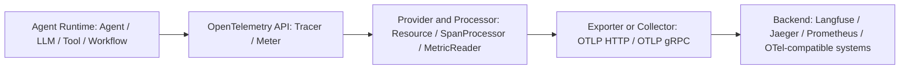

# 看见 Agent 运行时：tRPC-Agent-Go 可观测的设计与取舍

> 本文聚焦 tRPC-Agent-Go 的可观测设计：框架不自建观测平台，而是把 Agent 运行时中的关键语义映射到 OpenTelemetry，让 Trace、Metric 和 GenAI 语义属性可以被不同后端消费。

大模型应用从 Chat 走向 Agent 后，可观测性问题变得明显不一样了。

在 Chat 阶段，一次用户请求通常可以粗略理解为“一次入口请求 + 一次模型调用 + 一次模型响应”。这时沿用传统服务观测方法，先看 QPS、延迟、错误率，再沿着 RPC/HTTP 调用链定位问题，很多时候还能回答“接口慢不慢、模型调用有没有失败”。

但 Agent 不一样。Agent 的一次请求内部可能包含多次模型调用、多次工具调用、多 Agent 协作、Graph/Workflow 编排、流式输出、token 消耗、prompt cache 命中情况，以及工具返回后再次推理的循环。也就是说，用户看到的是“一次回答”，运行时实际发生的是“一棵执行树”。如果只看入口接口和外部 RPC/HTTP 调用链，就很难看清这棵树内部发生了什么。

因此，Agent 框架的可观测性不能只回答“接口慢不慢、失败没失败”，还要回答：

- 这次请求经过了哪些 Agent、LLM、Tool、Workflow？
- 模型为什么触发了某个工具？工具参数和结果是什么？
- token 消耗主要发生在哪一次模型调用？
- 流式响应的首 token 慢，是模型慢、工具慢，还是编排慢？
- 错误发生在模型、工具、工作流节点，还是 Agent 调用边界？
- 如果要接入不同观测平台，框架核心是否需要改？

tRPC-Agent-Go 的 telemetry 设计，就是围绕这些问题展开的。它的核心选择不是做一个新的观测平台，而是把 Agent 运行时中的关键语义稳定映射到 OpenTelemetry，让不同后端可以消费同一套数据。

一个典型 Agent 请求的 trace 形态可以先粗略理解为：

```text
invoke_agent customer_assistant
├── chat gpt-4o-mini
│   └── response with tool call
├── execute_tool search_order
│   └── tool result
├── chat gpt-4o-mini
│   └── final answer
└── workflow after_reply_summary
```

这棵树把“用户的一次请求”拆成了多个可以观察、可以归因、可以统计的运行时事件。

## 一、为什么传统服务观测不够看清 Agent

传统服务可观测性的默认对象通常是进程、接口、RPC 方法、数据库访问、消息队列消费。它们大多有明确的输入输出和比较稳定的调用拓扑。Agent 运行时则多了一层“不确定的智能决策”。

Agent 的执行路径经常不是静态写死的。模型可能根据用户输入决定是否调用工具，工具结果又可能影响下一次模型请求，多 Agent 系统里还可能把任务交给其他 Agent 或子图。Graph/Workflow 虽然能让路径更可控，但节点内部仍然可能包含模型调用、工具调用和流式输出。

这会带来三个典型的观测难点。

第一，调用链更长，而且形态更动态。一个入口请求里可能有多个 LLM round trip，也可能有工具调用和工作流节点嵌套。如果只看入口接口耗时，很难知道慢在什么地方。

第二，成本和质量都发生在内部步骤。token usage、prompt cache、completion tokens、模型 finish reason、工具参数、工具返回内容，这些信息不在普通 RPC 指标里，却直接影响成本、质量和稳定性。

第三，排障需要“语义化归因”。同样是失败，可能是模型供应商错误、工具执行失败、工具参数生成错误、工作流节点异常，也可能是框架层取消或超时。没有 Agent 语义的 trace，最终只能看到一串普通 span，很难回答“Agent 到底做了什么”。

所以，Agent 框架的 telemetry 不能停在“只观测入口接口和 HTTP/RPC 调用”。它需要把 Agent 自身的运行时对象变成一等观测对象。

## 二、tRPC-Agent-Go Agent Runtime 观测的设计思路

tRPC-Agent-Go 的 telemetry 设计不是另起一套观测平台，而是在框架层把上一节提到的观测难点，转化为 Agent Runtime 可以稳定产生、持续演进的 telemetry 数据。

第一，针对“调用链更长、更动态”的问题，框架在 Agent runtime 的关键边界自动埋点。应用不需要在每个 Agent、Tool、Model 调用处手写 span；tRPC-Agent-Go 会在 Agent 调用、模型请求、工具执行、Graph/Workflow 节点运行等生命周期里生成 `invoke_agent`、`chat`、`execute_tool`、`workflow` 等 span。这样，一次入口请求内部的动态执行路径可以被还原成可阅读的执行树。

第二，针对“成本和质量发生在内部步骤”的问题，框架同时记录 Trace 和 Metric。Trace 里可以看到模型名、是否流式、输入输出消息、finish reason、工具参数和工具结果；Metric 里可以聚合 token usage、TTFT、operation duration、输出 token 速率等指标。这样既能定位单次请求发生了什么，也能长期治理成本、性能和质量。

第三，针对“排障需要语义化归因”的问题，观测对象围绕 Agent 语义，而不是只围绕 HTTP/RPC 语义。tRPC-Agent-Go 关注的是 Agent、LLM、Tool、Workflow 这些运行时概念，并用 `gen_ai.operation.name`、`gen_ai.agent.name`、`gen_ai.tool.name`、`gen_ai.workflow.name` 等属性描述上下文。读 trace 时，看到的不再只是一串基础设施 span，而是能直接判断问题发生在模型、工具、工作流节点还是 Agent 调用边界。

第四，针对“不同应用会接入不同观测后端”的问题，框架基于 OpenTelemetry，不自造观测协议。Trace、Metric、Resource、Exporter、Collector 这些能力尽量复用 OTel 标准生态；框架核心负责生成标准化 telemetry 数据，数据去往哪里由 OTel provider、exporter、collector 或外部插件决定。这样应用可以把数据导入 Jaeger、Prometheus、Langfuse 或其他 OTel 兼容后端，而平台适配不会反向污染 Agent runtime 的核心抽象。

换句话说，tRPC-Agent-Go telemetry 的定位是“Agent 运行时语义层”，不是“观测平台本身”。

## 三、核心数据模型：Trace、Metric 与语义属性

本文重点讨论两类 telemetry 数据：Trace 和 Metric。

Trace 负责描述一次请求内部发生了什么，Metric 负责把大量请求聚合成可统计、可告警、可看趋势的数据。

### Trace：把运行过程变成执行树

tRPC-Agent-Go 中几个核心 span 名称非常重要：

| Span | 含义 | 典型问题 |
| --- | --- | --- |
| `invoke_agent <agent>` | 一次 Agent 调用生命周期 | 哪个 Agent 慢了、失败了、消耗了多少 token |
| `chat <model>` | 一次 LLM 调用 | 哪个模型慢、首 token 慢不慢、输入输出 token 多少 |
| `execute_tool <tool>` | 一次工具执行 | 哪个工具被调用、参数是什么、结果是什么、是否失败 |
| `workflow <name>` | 一次 Graph 节点或 Workflow 观测对象执行 | 工作流卡在哪个节点、节点耗时和错误如何 |

这组 span 的价值在于：它不是从基础设施角度抽象出来的，而是从 Agent 运行时抽象出来的。读 trace 时，看到的不再只是“某个 HTTP 请求调用了某个外部服务”，而是可以直接看到“Agent 调用了模型，模型要求执行工具，工具返回后模型继续生成答案”。

以工具调用为例，`execute_tool` span 会围绕工具名、工具描述、工具参数、工具结果、错误类型等信息记录上下文。以模型调用为例，`chat` span 会记录模型名、是否流式、输入输出消息、finish reason、token usage、TTFT 等信息。以 Workflow 为例，Graph node 会被适配为 `workflow` 观测对象，span 记录 workflow name、workflow id、workflow type、request、response 和错误状态。

### Metric：把运行过程变成可治理指标

Trace 更适合单次排障，但生产治理离不开聚合指标。tRPC-Agent-Go 内置指标覆盖了几个关键维度：

| Metric | 关注点 |
| --- | --- |
| `trpc_agent_go.client.request_cnt` | 请求次数 |
| `gen_ai.client.operation.duration` | LLM、Tool、Agent、Workflow 等操作耗时 |
| `gen_ai.client.token.usage` | 输入、输出、缓存相关 token 统计 |
| `gen_ai.server.time_to_first_token` | 标准 GenAI 首 token 时间 |
| `trpc_agent_go.client.time_to_first_token` | 框架兼容首 token 时间，当前与标准 TTFT 同值上报 |
| `trpc_agent_go.client.time_per_output_token` | 平均每个输出 token 的生成耗时 |
| `trpc_agent_go.client.output_token_per_time` | 输出 token 速率 |
| `gen_ai.workflow.elapsed_time` | 从 `root_workflow.start` 到 `current_workflow.end` 的相对累计耗时 |

这里有三个细节值得注意。

第一，tRPC-Agent-Go 同时关心总耗时和流式体验。对于流式 Agent，用户感知不只取决于最终完成时间，还取决于首 token 时间是否足够快、后续 token 生成是否稳定。因此 TTFT、time per output token、output token per time 都是很重要的信号。

第二，token usage 不只是成本指标，也是质量和性能指标。输入 token 过长可能说明上下文管理有问题；输出 token 异常变长可能说明 prompt 或工具结果失控；缓存相关 token 则可以帮助分析 prompt cache 是否真正生效。

第三，Workflow 指标要区分“节点自身耗时”和“相对累计耗时”。`gen_ai.client.operation.duration` 描述当前 workflow/node 自身执行了多久；`gen_ai.workflow.elapsed_time` 描述当前观测对象从 root workflow 开始到当前对象结束的到达时间，它不表示各节点耗时求和。

### 语义属性：让不同后端读懂同一套数据

除了 span 和 metric 名称，属性设计同样关键。tRPC-Agent-Go 会使用 OpenTelemetry GenAI 语义约定和框架扩展字段来描述上下文，例如：

| 属性 | 含义 |
| --- | --- |
| `gen_ai.operation.name` | 操作类型，例如 `chat`、`execute_tool`、`invoke_agent`、`workflow` |
| `gen_ai.agent.name` / `gen_ai.agent.id` | Agent 名称和标识 |
| `gen_ai.conversation.id` | 会话或对话标识 |
| `gen_ai.request.model` / `gen_ai.response.model` | 请求和响应模型 |
| `gen_ai.input.messages.otel` / `gen_ai.output.messages.otel` | OTel 对齐的输入输出消息 |
| `gen_ai.usage.input_tokens` / `gen_ai.usage.output_tokens` | 输入输出 token |
| `gen_ai.tool.name` | 工具名称 |
| `gen_ai.tool.call.arguments` / `gen_ai.tool.call.result` | 工具参数和结果 |
| `gen_ai.workflow.name` / `gen_ai.workflow.type` | Workflow 名称和类型 |
| `error.type` / `error.message` | 错误类型和错误消息 |
| `trpc.go.agent.invocation_id` | 框架内一次调用的 invocation id |
| `trpc.go.agent.llm_request` / `trpc.go.agent.llm_response` | 框架保留的 LLM 请求/响应 payload |

这些属性让数据具备可迁移性。不同后端可能展示方式不同，但只要它们理解 OTel/GenAI 语义，或者能基于这些属性做映射，就可以围绕同一套运行时事实构建视图。

这张表也意味着一个生产接入前必须回答的问题：哪些 payload 可以上报，哪些必须脱敏、截断或关闭。prompt、response、工具参数、工具结果、用户标识和 `llm_request` / `llm_response` 都可能包含敏感信息；同时，过长属性会增加存储成本，高基数字段也会影响指标聚合。因此接入 telemetry 时，应同步确定 payload 开关、字段脱敏、attribute size limit、采样策略和高基数字段治理。

## 四、一个定位例子：首 token 慢

假设用户反馈“流式回答一直不出字”，入口接口只能告诉我们这次请求慢了，但 Agent telemetry 可以继续拆开看。

第一步看 `invoke_agent` 的总耗时和 TTFT。如果 `invoke_agent` 很慢，但第一个 `chat` span 很晚才开始，问题通常在 Agent 编排、前置 Workflow 或工具准备阶段。

第二步展开 trace。如果 `execute_tool` 或某个 `workflow` span 占用大量时间，就可以继续看工具参数、工具结果、workflow type 和错误状态；如果慢点集中在 `chat <model>`，则进一步看模型名、输入 token、是否流式、TTFT 和 finish reason。

第三步结合指标做聚合判断。如果只有单次请求慢，trace 更有用；如果一段时间内某个模型的 `gen_ai.server.time_to_first_token` 普遍升高，或者 `gen_ai.client.token.usage` 显示输入 token 明显膨胀，就可以把问题从“某次请求异常”提升为“模型供应商、上下文管理或 prompt 设计需要治理”。

## 五、数据链路：运行时如何变成观测数据

tRPC-Agent-Go 的 telemetry 链路可以抽象成四层：



从应用视角看，接入的第一步通常是初始化 tracer provider 和 meter provider。比如 trace 可以通过 `telemetry/trace.Start` 配置 endpoint、protocol、service name、resource attributes、headers 等；指标可以通过 `telemetry/metric.NewMeterProvider` 和 `metric.InitMeterProvider` 初始化。默认情况下，如果没有初始化 provider，OpenTelemetry 的 noop 行为会让框架埋点不产生实际导出开销。

从框架视角看，Agent runtime 在关键生命周期里自动创建 span、记录属性、上报指标。例如 Agent 调用开始时建立 `invoke_agent`，模型请求时建立 `chat`，工具执行时建立 `execute_tool`，Graph/Workflow 节点运行时建立 `workflow`。这些位置是框架天然知道的边界，应用代码不需要重复感知。

从平台视角看，数据最终去哪里不是由 Agent 核心决定的。它可以通过 OTLP HTTP/gRPC 到 OpenTelemetry Collector，再由 Collector fan-out 到多个后端；也可以通过特定 exporter 或插件直接进入某个观测系统。这个分层让 tRPC-Agent-Go 的核心保持稳定，也让平台接入可以按环境演进。

这也是为什么本文不把“后端适配”单独作为可观测模块的核心设计来讲。平台适配是整体工程架构的一部分：开源环境可以选择 Langfuse、Jaeger、Prometheus 等后端，企业内部环境也可能选择自己的 OTel-compatible observability backend。可观测模块真正沉淀的核心，是前面这层 Agent telemetry 语义。

## 六、工程实践：把 Agent telemetry 做稳

从 telemetry 模块演进看，很多问题并不发生在“能不能上报 span”这一层，而是发生在大 payload、上下文传播、指标口径、后端限制和平台适配的边界处。尤其是 LLM request、response、tool arguments、workflow request/response 这类 attribute，既可能造成生产侧 marshal 内存压力，也可能在导出或后端侧被 span limits 截断。

| 工程问题 | 解决思路 |
| --- | --- |
| Trace 上下文在 context clone、并发 tool call 中容易断链 | 保证 clone 后保留 OpenTelemetry span context，并用测试覆盖 TraceID、SpanID 和父子 span 关系 |
| span 创建阶段采集大 payload 会带来重复 `json.Marshal` 和堆内存峰值 | 使用 opt-in 的 `SpanAttributePolicy`，按 operation/key 控制采集；降内存优先 `Drop()` 冗余 attribute 或无条件 `Omit()` |
| OTel / 后端属性长度限制会截断大 attribute，导致结构化解析失败 | exporter 记录截断诊断日志，根据 value length、limit、`unexpected EOF` 等信号判断是否被 `AttributeValueLengthLimit` 截断 |
| OTel GenAI 语义仍在演进，多模态、tool call schema 容易变 | 核心层保留稳定语义，兼容 OTel message role/parts 等新格式，后端差异放到 adapter 映射 |
| TTFT、workflow elapsed、token usage 等指标口径容易不一致 | 明确定义 metric 的 from/to、成功/失败/cache/retry 口径，并让 `chat`、`invoke_agent`、`workflow` 使用一致口径 |
| Graph / Agent 嵌套过深会让 trace 难读 | 有意识地调整 span 拓扑，让链路更贴近排障视角 |
| tool、error、应用维度如果不稳定，会影响聚合分析 | 稳定 tool 排序和 tool_call_id，统一 error.type / error label，通过受控维度承载场景信息 |

这里有一个容易混淆的点：“限长”和“降内存”不是一回事。`Drop()` 和无条件 `Omit()` 可以在 `json.Marshal` 前短路，能降低 marshal 堆峰值；`MaxBytes` + `Omit()`、`Truncate()` 更多是控制最终写入 span 的 attribute 体积。对 `chat`、`workflow`、`invoke_agent` 这类 JSON 序列化路径，通常仍要先完整 marshal 才能判断大小。

这也带来一个实践原则：不要把“调大后端 attribute limit”当成唯一手段。生产侧先决定哪些 attribute 值得采集，导出侧再处理平台限长、截断诊断和字段映射；前者解决内存与冗余，后者解决展示与排障。

## 七、对比、取舍与演进

有了工程实践作为背景，再看其他框架的可观测设计，可以帮助我们理解 tRPC-Agent-Go 的选择。这里不是做优劣排名，而是看不同产品形态如何回答“运行时事实由谁记录、数据最终由谁消费”。

| 类型 | 代表 | 可观测设计重点 | 对 tRPC-Agent-Go 的参照意义 |
| --- | --- | --- | --- |
| 平台闭环型 Agent 框架 | LangChain / LangGraph | 以 LangSmith 承载 trace、debug、评测、监控和反馈闭环 | 平台体验强，但框架语义和平台绑定更紧 |
| 标准语义型 Agent 框架 | Google ADK | 内置日志、指标和 trace，并强调 OpenTelemetry GenAI 语义 | 说明 Agent span 标准化已经成为重要方向 |
| 数据主权型 Agent 框架 | Agno | run history、audit logs 和 tracing 可写入用户自己的数据库，也支持 OTel 外送 | 本地存储和外部后端之间可以做不同取舍 |
| Go 生态组件框架 | CloudWeGo / Eino | 通过 Callback/Handler/RunInfo 暴露组件和 Graph 生命周期 | callback 扩展灵活，但需要用户或平台侧沉淀统一语义 |
| Code Agent 产品 | OpenAI Codex / Claude Code | 更关注工具审批、命令执行、组织成本、安全审计和人机协作事件 | 观测对象偏产品事件流，不等同于业务 Agent 服务运行时 |

对比下来，tRPC-Agent-Go 的选择更像是“标准语义 + 服务端框架内建埋点”。它不追求自己提供观测平台，也不只提供 callback 扩展点，而是在 Agent runtime 中直接沉淀稳定的 span、指标和属性。

这个取舍让框架保持轻量和后端解耦，但也要求应用在生产接入时明确敏感字段治理策略。prompt、response、工具参数、工具结果、用户标识都可能包含敏感信息，是否上报、如何脱敏、如何控制属性大小和指标基数，需要在具体环境中治理。

未来演进可以继续围绕几个方向推进：

- 跟进 OpenTelemetry GenAI semantic conventions 的变化，减少自定义字段和标准字段之间的偏差。
- 扩展更多 Agent 维度指标，例如工具成功率、Agent step 数、Graph 节点重试和恢复指标。
- 细化流式链路统计，例如 reasoning 阶段、首 token、有效内容 token 和最终完成时间的关系。
- 加强敏感数据治理，例如 payload 开关、字段脱敏、attribute size limit、高基数字段控制。
- 更好支持多后端路由，例如通过 Collector 或插件把同一套数据同时送往 LLMOps 平台和通用 APM 平台。

## 结语

Agent 框架的可观测性，关键不是“多打一批日志”，也不是“把模型请求包一层 span”。

真正重要的是把 Agent 运行时看见：一次请求如何进入 Agent，如何调用模型，如何触发工具，如何走过 Graph/Workflow，在哪里消耗 token，在哪里等待首 token，在哪里失败，最终又如何被不同观测平台消费。

tRPC-Agent-Go 的选择是先沉淀这套运行时语义，再通过 OpenTelemetry 连接不同后端。这种设计没有把观测平台塞进框架核心，也没有把 Agent 内部执行过程留给应用自己补埋点。它站在框架层，把最稳定、最关键的运行时事实记录下来。

这也是“看见 Agent 运行时”的意义：不是为了多一个漂亮的 trace 页面，而是让 Agent 服务在生产环境里真正可解释、可定位、可度量、可治理。

## 参考资料

- [tRPC-Agent-Go GitHub](https://github.com/trpc-group/trpc-agent-go)
- [tRPC-Agent-Go documentation site](https://trpc-group.github.io/trpc-agent-go/)
- [tRPC-Agent-Go Observability 文档](https://github.com/trpc-group/trpc-agent-go/blob/main/docs/mkdocs/zh/observability.md)
- [tRPC-Agent-Go Langfuse 示例](https://github.com/trpc-group/trpc-agent-go/tree/main/examples/telemetry/langfuse)
- [OpenTelemetry Documentation](https://opentelemetry.io/docs/)
- [OpenTelemetry GenAI Semantic Conventions](https://opentelemetry.io/docs/specs/semconv/gen-ai/)
- [LangSmith Observability](https://docs.langchain.com/langsmith/observability)
- [LangGraph Observability](https://docs.langchain.com/oss/python/langgraph/observability)
- [LangSmith Trace with OpenTelemetry](https://docs.langchain.com/langsmith/trace-with-opentelemetry)
- [Google ADK Observability](https://adk.dev/observability/)
- [Google ADK Traces](https://adk.dev/observability/traces/)
- [Google ADK Metrics](https://adk.dev/observability/metrics/)
- [Google Cloud: Instrument ADK applications with OpenTelemetry](https://docs.cloud.google.com/stackdriver/docs/instrumentation/ai-agent-adk)
- [Agno Tracing](https://docs.agno.com/tracing/overview)
- [Agno Agent Observability](https://docs.agno.com/features/observability)
- [Agno OpenTelemetry Observability](https://docs.agno.com/observability/overview)
- [CloudWeGo Eino Callback Manual](https://www.cloudwego.io/docs/eino/core_modules/chain_and_graph_orchestration/callback_manual/)
- [CloudWeGo Eino Callback and Trace](https://www.cloudwego.io/docs/eino/quick_start/chapter_06_callback_and_trace/)
- [CloudWeGo Eino Open Source Overview](https://www.cloudwego.io/docs/eino/overview/eino_open_source/)
- [OpenAI Codex Advanced Configuration: Observability and Telemetry](https://developers.openai.com/codex/config-advanced)
- [Claude Code Monitoring](https://code.claude.com/docs/en/monitoring-usage)
- [Claude Code Agent SDK Observability](https://code.claude.com/docs/en/agent-sdk/observability)
- [Langfuse OpenTelemetry Integration](https://langfuse.com/integrations/native/opentelemetry)
- [Langfuse Self Hosting](https://langfuse.com/self-hosting)
