# tRPC-Agent-Go：打造企业级安全可控的 OpenClaw Runtime

## 导语

当 Agent 从一次性问答进入长期运行场景，真正决定可用性的，往往不再是单轮回复是否聪明，而是它能不能稳定接入消息入口、管理会话与记忆、处理图片和文件、执行工具、持续运行并可被运维。本文聚焦 tRPC-Agent-Go 中的 `openclaw` 实现，前半部分先介绍消息入口接入、安装配置流程和实际使用效果，再回到 Runtime 的装配方式、核心链路与扩展边界。

## 前言

> tRPC-Agent-Go 是面向 Go 语言的自主式多 Agent 框架，具备工具调用、会话与记忆管理、制品管理、多 Agent 协同、图编排、知识库与可观测等能力。  
>
> GitHub 开源仓库：
> [github.com/trpc-group/trpc-agent-go](https://github.com/trpc-group/trpc-agent-go)。
>
> `openclaw` 目录：
> [github.com/trpc-group/trpc-agent-go/tree/main/openclaw](https://github.com/trpc-group/trpc-agent-go/tree/main/openclaw)。

tRPC-Agent-Go 中的 `openclaw` 并不是对官方 OpenClaw 的工程结构、协议细节和运行时实现做一比一复刻，而是基于 tRPC-Agent-Go 已有抽象，对“长期运行、多入口接入、持续调度、工具与技能可扩展”的 OpenClaw 形态进行一次 Go 化落地。用户可以从 Telegram、本地终端或自定义 Channel 发起消息，`openclaw` 再通过 Gateway、Runner、Session、Memory、Tool 与 Skill 组织出完整的 Agent 执行链路，并把结果安全地回发到同一个会话里。

## 一键下载试用

如果是第一次安装，直接执行：

```bash
curl -fsSL \
  'https://github.com/trpc-group/trpc-agent-go/releases/latest/download/openclaw-install.sh' \
  | bash
```

安装完成后，默认会得到：

- 主命令：`openclaw`
- 默认主配置：`~/.trpc-agent-go-github/openclaw/openclaw.yaml`
- 默认模板：`stdin`
- 默认配置目录：`~/.trpc-agent-go-github/openclaw/`

如果你只是想先在本地终端体验内置 `mock` 模型，可以显式切到 `stdin` profile：

```bash
curl -fsSL \
  'https://github.com/trpc-group/trpc-agent-go/releases/latest/download/openclaw-install.sh' \
  | bash -s -- --profile stdin
```

如果 `~/.local/bin` 还没有在 `PATH` 里，再把它加到 `~/.bashrc`：

```bash
printf '\nexport PATH="$HOME/.local/bin:$PATH"\n' >> ~/.bashrc
source ~/.bashrc
```

如果你机器上已经装过旧版本，后续直接升级即可：

```bash
openclaw upgrade
```

这个命令会更新 `openclaw` 二进制和 `profiles/` 里的模板文件；默认不会覆盖你当前正在使用的 `openclaw.yaml`。如果启动日志里提示有新版本可用，也可以直接执行这条命令。

## 背景

当 Agent 进入长期运行场景，问题会从单次推理的效果，转向运行时形态是否完整。一个能够长期稳定工作的 Agent Runtime，至少要同时处理五类问题。

- 如何接收消息，也就是从 Telegram、终端或 Webhook 等入口，把外部请求接进来。
- 如何维持上下文，也就是把不同消息归并到稳定的会话中，并决定哪些信息应进入长期记忆。
- 如何执行动作，也就是让 Agent 能调用工具、技能、代码执行器，处理文件与多模态输入。
- 如何持续运行，也就是支持定时任务、跨会话回传、上传文件与管理能力。
- 如何扩展能力，也就是在不重写主链路的前提下继续增加新的 Channel、Model、ToolSet 和存储后端。

[OpenClaw](https://github.com/openclaw/openclaw) 的代表性，正在于它把这五类问题放在同一个运行时边界内统一处理。对于 Go 生态而言，这个问题尤其具有工程意义：难点往往不在于写出一个会回复消息的 Bot，而在于如何在尽量复用既有框架能力的前提下，把 Gateway、Session、Memory、Tool、文件处理、调度与管理面组织成一个可长期运行的系统。

tRPC-Agent-Go 中的 `openclaw` 正是在这个背景下出现的。它把 `Runner` 作为执行中心，把 `Session` 与 `Memory` 作为状态底座，把 Tool、Skill、ToolSet 与执行器作为能力扩展点，再在外围补上 Gateway、Channel、Cron、上传存储和管理面，从而把单次推理能力推进到长期运行系统。

## 快速开始

本节目标很明确：先从 GitHub release 里的公开安装脚本出发，把一个最小可运行的 OpenClaw Runtime 跑起来，再继续接真实模型和消息入口。

### 路径 A：安装预编译 release

如果你的目标是尽快跑起来，不要一上来就 `go run`。先安装已经发布的二进制：

```bash
curl -fsSL \
  https://github.com/trpc-group/trpc-agent-go/releases/latest/download/openclaw-install.sh \
  | bash
```

默认安装 profile 是 `stdin`，它使用的是内置 `mock` 模型。所以第一次启动时既不需要模型密钥，也不需要 Telegram 这类消息入口凭据。

安装脚本默认会把 GitHub 版本的配置和状态目录写到 `~/.trpc-agent-go-github/openclaw`。

如果安装后还找不到 `openclaw`，直接执行安装脚本输出里的 PATH 命令。对于 bash，持久化写法如下：

```bash
grep -qxF 'export PATH="$HOME/.local/bin:$PATH"' "$HOME/.bashrc" || \
  printf '\nexport PATH="$HOME/.local/bin:$PATH"\n' >> "$HOME/.bashrc"
. "$HOME/.bashrc"
```

然后直接启动：

```bash
openclaw
```

启动后你就已经进入本地终端聊天模式了。先发一条 `hello` 这样的简单消息即可。你也可以先用 `/help` 看基础命令，最后再用 `/quit` 或 `/exit` 退出。

### 路径 B：从源码运行

如果你的目标是开发或修改 OpenClaw 本身，再按源码方式运行。先准备下面几项：

- Go 开发环境。
- tRPC-Agent-Go 仓库代码。
- 一个消息入口凭证，文中示例使用 Telegram Bot Token。
- 一个可访问的模型服务，或者临时使用 `mock` 模式。

最小环境变量如下：

```bash
export TELEGRAM_BOT_TOKEN='replace-with-your-bot-token'
export OPENAI_API_KEY='replace-with-your-api-key'

# 可选：如果你使用的是 OpenAI-compatible 网关，再补这一项。
export OPENAI_BASE_URL='https://your-openai-compatible-endpoint/v1'
```

如果你只是想先验证消息收发链路，而暂时不接真实模型，可以把配置文件里的 `model.mode` 改成 `mock`。这样可以先把问题收敛到“消息有没有进来，结果有没有出去”，等链路确认稳定以后，再切回真实模型。

公开仓库中的参考配置位于 `openclaw/openclaw.yaml`。它默认启用 Telegram Channel，并把 Session 和 Memory 都放在内存后端：

```yaml
app_name: "openclaw"

http:
  addr: ":8080"

admin:
  enabled: true
  addr: "127.0.0.1:19789"
  auto_port: true

agent:
  instruction: "You are a helpful assistant. Reply in a friendly tone."

model:
  mode: "openai"
  name: "gpt-5"
  openai_variant: "auto"

channels:
  - type: "telegram"
    config:
      token: "${TELEGRAM_BOT_TOKEN}"
      streaming: "progress"
      http_timeout: "60s"

session:
  backend: "inmemory"

memory:
  backend: "inmemory"
```

从源码运行时，可以先用 `mock` 验证主链路：

```bash
go run ./cmd/openclaw -config ./openclaw/openclaw.yaml -mode mock
```

启动后检查健康检查：

```bash
curl -sS 'http://127.0.0.1:8080/healthz'
```

确认链路稳定后，再切到真实模型：

```bash
go run ./cmd/openclaw -config ./openclaw/openclaw.yaml -mode openai -model gpt-5
```

这时再到 Telegram 会话里发送消息，就可以观察到消息入口、Gateway、Runner、Agent、Session 和 Memory 之间的完整协作。

## 其他入口：Telegram 与本地调试

公开版 `openclaw` 默认提供 Telegram 与本地终端入口。同一套 Runtime 也可以继续扩展到其他 HTTP 回调入口。

### 本地终端模式

如果你只是想先看清楚 Runtime 骨架，可以用 `stdin` 这个最小入口：

```yaml
app_name: "openclaw-stdin"

http:
  addr: ":8080"

model:
  mode: "mock"

agent:
  instruction: "You are a helpful assistant for terminal chat."

channels:
  - type: "stdin"
    name: "terminal"
    config:
      from: "alice"
```

这个模式的意义是：先把 `Channel -> Gateway -> Runner -> Agent -> Tool` 整条主链路在本机跑通。确认这里没问题后，再接真实消息入口，问题范围会收敛很多。

### Telegram

如果你在外网环境，或者想验证另一种消息入口，可以切到 Telegram。此时变化主要发生在 Channel 层，Gateway、Runner、Session、Memory 与 Tool 的主链路并不会变化：

这条链路更适合在 Mac 上体验。Telegram、STDIN 和本地桌面工具联调时，macOS 的本地开发体验通常更直接。

```yaml
app_name: "openclaw"

http:
  addr: ":8080"

agent:
  instruction: "You are a helpful assistant. Reply in a friendly tone."

model:
  mode: "openai"
  name: "gpt-5"
  openai_variant: "auto"

channels:
  - type: "telegram"
    config:
      token: "${TELEGRAM_BOT_TOKEN}"
      streaming: "progress"
      http_timeout: "60s"

session:
  backend: "inmemory"

memory:
  backend: "inmemory"
```

Telegram 和本地终端都只是同一套 Runtime 下的不同 Channel。

### Telegram 典型场景

下面这组截图来自当前这套实现的 Telegram 入口，覆盖文档处理、多模态、Skill 和定时任务示例，方便理解同一套 Runtime 在真实消息入口下的表现。

#### 文档处理

文档处理是最能说明 Runtime 价值的一类场景。这里真正难的不是“模型会不会说”，而是系统能否把接收文件、理解指令、调用工具、生成结果、回传文件这几步串成一条完整链路。

例如，上传 PDF 后可以直接提取指定内容：

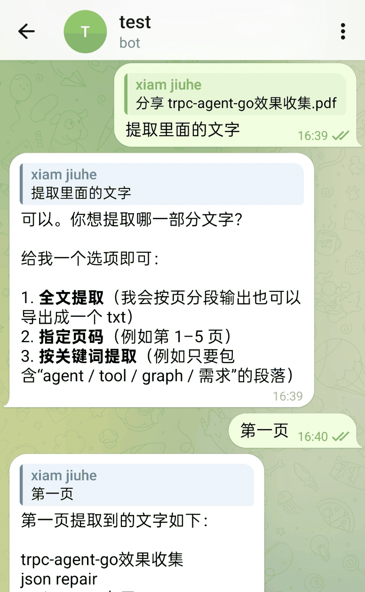

也可以把一个 PDF 拆分为多个页面后再回传新文件：


语音输入同样可以驱动文档处理。下面这个例子中，用户通过语音要求把指定页面合并成一个 PDF：

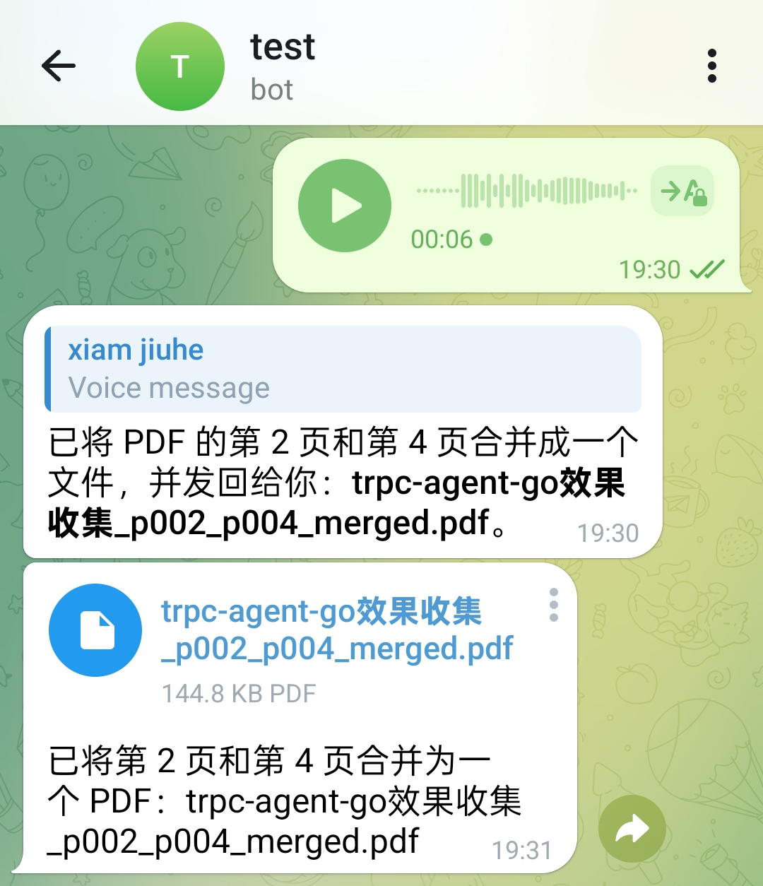

系统也可以基于输入材料直接生成汇报用 Word 文档：

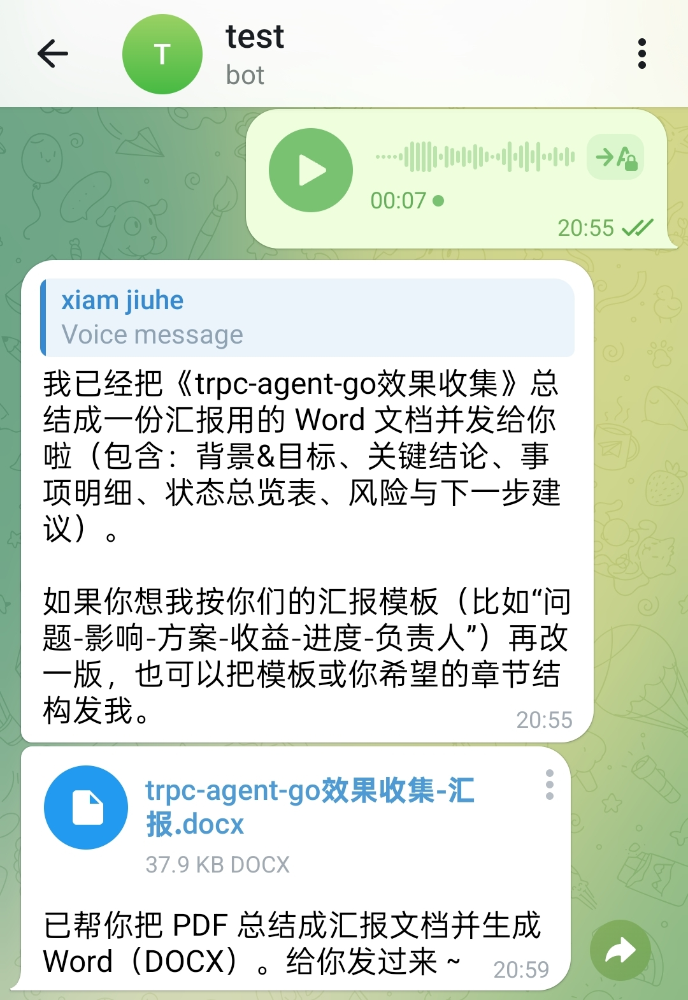

Excel 处理也沿用同一条链路。下面这个例子里，用户通过语音要求保留第一行并删除其余行，处理后的表格文件会直接回传：

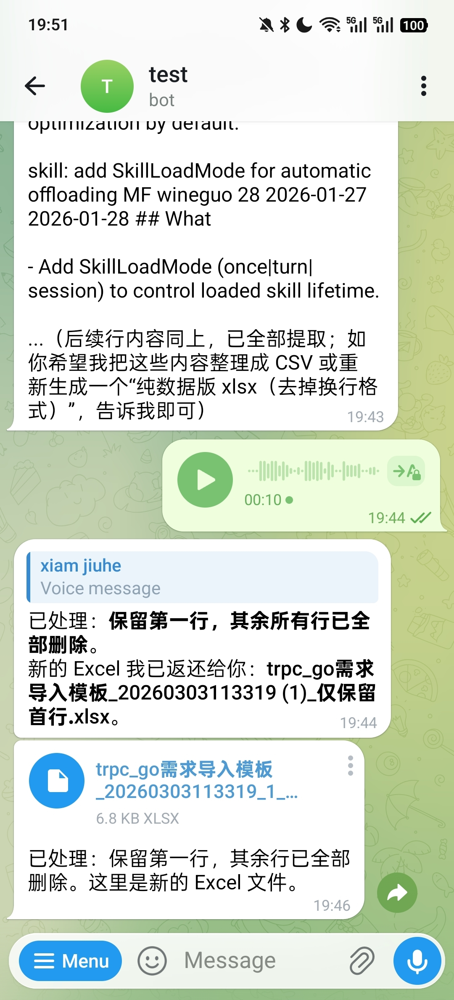

#### 图像与视频

在图像理解场景下，图片可以直接作为多模态输入进入模型能力：


视频场景则通常要经过“先处理媒体，再交给模型”的链路。例如下面这个例子中，用户要求提取视频第一帧并回发图片：

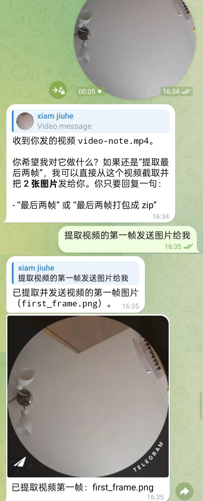

在视频 OCR 场景中，系统可以先定位目标帧，再继续做文字识别。下面这个例子先提取出最后一帧：

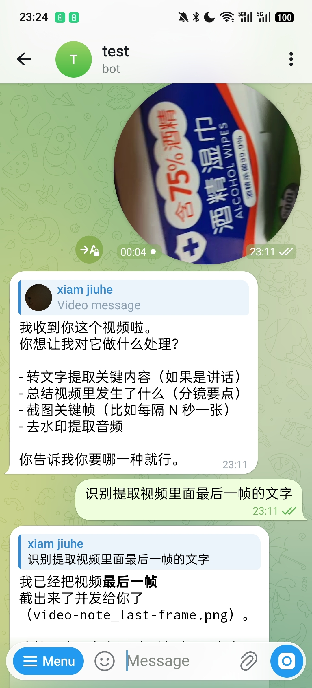

确认目标帧后，再返回识别出的文字内容：

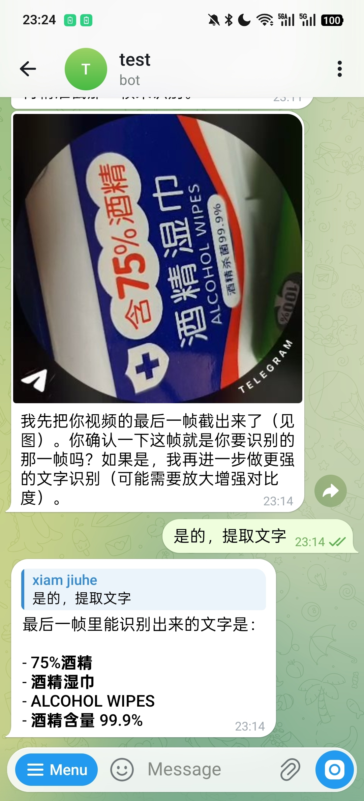

#### Skills 与系统操作

`openclaw` 并不把能力限制在“对话回复”这一层，而是允许在同一轮执行中串联 Skill、系统工具和外部结果写入。

例如下面这个例子中，系统先做天气查询，再把当前聊天记录写入 Apple 备忘录：


对应的备忘录结果如下：


类似地，也可以在会话中直接创建提醒事项：


对应结果如下：


#### 定时与管理

长期运行系统还需要处理“不是现在就做，而是按计划去做”的任务。下面这个例子中，用户先查看并清理当前任务，再要求系统每分钟回报一次本机 CPU 使用率：


除了会话内命令，当前实现还提供本地 Admin UI，用于查看实例信息、Gateway 路由、任务、执行会话、上传文件和调试痕迹：

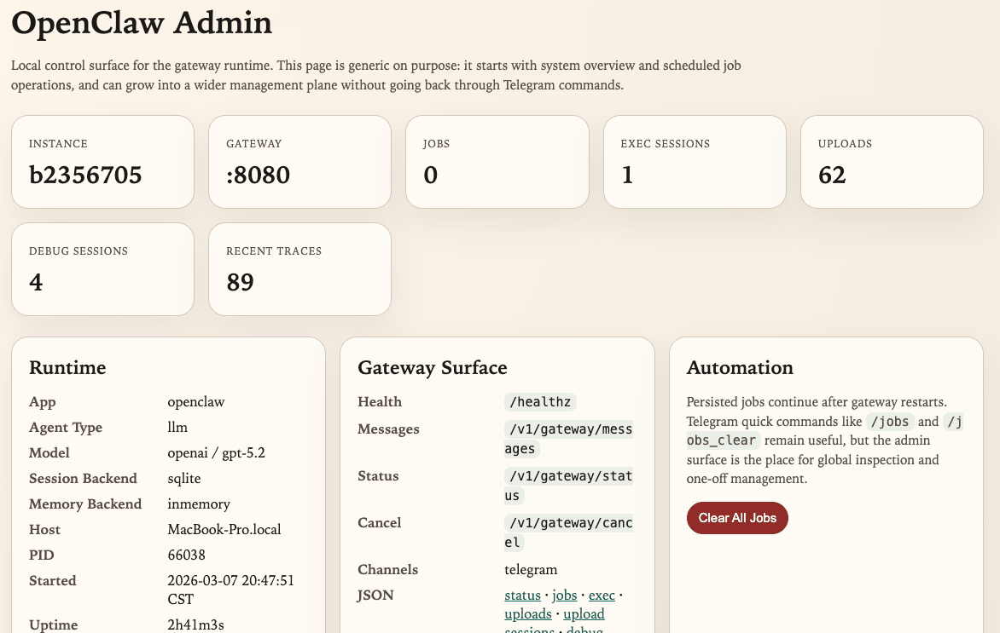

## 核心概念

从运行时职责划分看，`openclaw` 可以分为四层结构：入口层、标准化层、执行层和运行时服务层。入口层负责接收消息，标准化层负责统一语义，执行层负责真正的 Agent 推理与动作执行，运行时服务层负责长期运行系统所需的配套能力。

整体结构如下图所示。

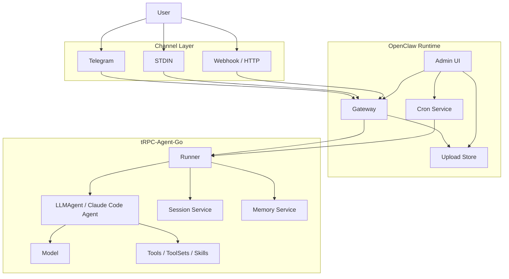

图中的每一层都对应一类独立职责。

- **Channel** 用来接收外部平台的消息，例如 Telegram、终端输入或自定义 Webhook。
- **Gateway** 用来把不同来源的消息转成统一请求，并处理会话 ID、权限、
  串行化和多模态标准化。
- **Runner / Agent** 用来真正执行推理，把历史、记忆、工具与模型串起来。
- **Session / Memory** 用来保存会话上下文与长期信息，解决“系统如何记住之前发生过什么”这个问题。
- **Runtime Services** 用来提供调度、上传文件、管理面等长期运行时必需的外围能力。

一次消息从外部进入系统，通常会经历下面五步：

1. Channel 接收原始消息，例如文本、图片、音频、视频或文件。
2. Gateway 计算稳定的 `session_id`，完成准入判断，并把输入统一整理为标准请求。
3. Runner 根据 `session_id` 取回历史与记忆，再调用底层 Agent 执行推理。
4. Agent 按需调用 Tool、Skill、ToolSet 或代码执行器，生成最终回复。
5. Gateway 把回复结果交还给 Channel，由 Channel 再发送回外部平台。

在 tRPC-Agent-Go `openclaw` 的实现里，它承担的不是重新定义 Agent，而是把 Agent 放入一个可长期运行、可持续扩展的系统边界中。

### Gateway

Gateway 位于消息入口与执行核心之间。不同 Channel 的消息格式、附件表达和会话语义各不相同，但进入 Runner 之前需要被整理成统一请求，这一步由 Gateway 完成。

当前 Gateway 默认暴露以下入口：

- `/healthz`
- `/v1/gateway/messages`
- `/v1/gateway/status`
- `/v1/gateway/cancel`

它主要完成以下工作：

- 生成稳定的 `session_id`
- 判断 allowlist、mention 等准入规则
- 保证同一会话串行执行
- 标准化文本与多模态输入
- 调用 Runner 并返回结果

默认会话 ID 规则如下：

- 私聊：`<channel>:dm:<from>`
- 线程或话题：`<channel>:thread:<thread>`

这样的规则很重要，因为它决定了“哪些消息应该被视为同一个连续对话”。如果会话边界不稳定，Session 与 Memory 的价值就会被削弱。

消息处理流程如下图所示。

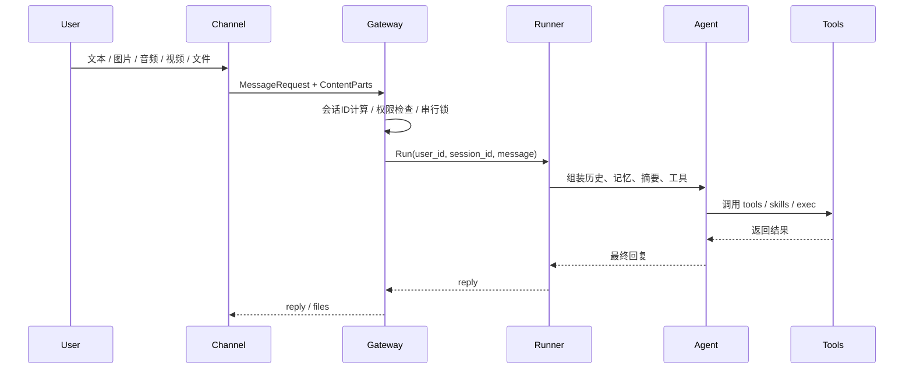

在多模态场景里，Gateway 还会承担标准化职责。例如图片、音频、视频会被整理为统一的 `ContentPart` 结构，URL 输入会经过协议和域名校验，音频也会尽量转换到模型更容易接受的格式。这样 Channel 只需要关注“如何接消息和发消息”，不必重复实现一整套 Agent 运行逻辑。

### Channel

Channel 是运行时与外部世界之间最直接的接口。在 tRPC-Agent-Go `openclaw` 的实现里，它承担的是平台协议适配角色，把某个平台的消息协议转成 Gateway 可理解的请求，再把 Gateway 的回复转回该平台的发送格式。

OpenClaw 对 Channel 的接口约束比较轻：

```go
package channel

type Channel interface {
	ID() string
	Run(ctx context.Context) error
}
```

如果某个 Channel 还需要主动发送文本或文件，则可以额外实现 `TextSender` 或 `MessageSender`。这套接口设计带来两个直接结果。

- 新增入口时，不必改动 Runner 与 Agent 主链路。
- 不同平台可以保留各自的网络模型与接入方式，只要最终映射到统一的 Gateway 请求即可。

不同 Channel 的差异主要体现在协议适配与回传方式，而不是底层执行链路。

### Session 与 Memory

从源码看，`Session` 和 `Memory` 在 `openclaw` 里是两套不同的状态层，解决的问题也不同。

- `Session` 解决“这一段对话上下文怎么保留”。
- `Memory` 解决“跨会话的长期事实怎么沉淀”。

两者的作用域也不同：

- `Session` 以 `<AppName, UserID, SessionID>` 为边界。
- `Memory` 以 `<AppName, UserID>` 为边界，天然跨会话。

如果你希望把 Session 与 Memory 持久化到 SQLite，可以把这两块配置分开写：

```yaml
session:
  backend: "sqlite"
  summary:
    enabled: false
  config:
    path: "${HOME}/.trpc-agent-go-github/openclaw/sessions.sqlite"

memory:
  backend: "sqlite"
  limit: 100
  auto:
    enabled: false
  config:
    path: "${HOME}/.trpc-agent-go-github/openclaw/memories.db"
```

也就是说，持久化和自动记忆是两层开关：你可以先只启用持久化存储，再按需要打开摘要和自动记忆，避免第一次联调时同时引入太多变量。

再看 `openclaw/backends/sqlite.go`，默认 SQLite memory backend 会把数据落到 `openclaw_memories` 表里，核心字段包括：

- `app_name`
- `user_id`
- `memory_id`
- `memory_text`
- `topics_json`
- `created_at`
- `updated_at`
- `deleted_at`

这里有几个实现细节很关键。

第一，`memory_id` 不是随机 ID，而是对 `memoryText + appName + userID` 做 SHA-256 生成的。这意味着同一个用户在同一个应用里写入完全相同的记忆时，默认会走 upsert，而不是不断堆重复条目。

第二，memory 有硬限额控制。代码默认上限是 `1000`，而分发模板把它收紧到了 `100`。新增记忆前会先统计当前用户的有效记忆数，超过上限就直接报错，不会无限增长。

第三，搜索不是简单 SQL `LIKE`。`SearchMemories` 会先把当前用户所有有效记忆读出，再在内存里打分排序：

- 中文查询会走 `gse` 分词，并过滤常见停用词。
- 英文查询会拆成字母数字 token，长度小于 2 的词会被忽略。
- 命中记忆正文或 topics 都会计分。
- 分数相同时，优先返回 `updated_at` 更新更近的记忆。

这也是为什么 memory 更适合放稳定事实，而不是整段聊天记录。

再往下看 `buildMemoryTools(...)`，默认手动模式下暴露给 Agent 的 memory tools 主要是：

- `memory_add`
- `memory_update`
- `memory_search`
- `memory_load`

如果你启用了 extractor，也就是自动记忆模式，策略会变：

- 对模型直接暴露的仍主要是 `search/load`
- `add/update/delete` 这类写操作优先交给后台 extractor 执行

这样做的目的，是把“记忆检索”保留给运行中的 Agent，把“记忆落盘策略”收口到自动记忆链路，减少模型在对话过程中随意改写长期记忆的概率。

自动记忆的核心逻辑在 `openclaw/backends/sqlite_auto.go`。它不是每轮都全量重扫整个 session，而是做增量提取：

- session state 里会记录上次抽取时间
- 只扫描这之后新增的消息
- tool message、空消息、带 tool calls 的中间消息都会被过滤掉
- 然后把增量用户消息拼成查询词，先搜索已有记忆，再交给 extractor 生成
  `add/update/delete/clear` 操作

这个 worker 还有两个工程化细节很重要。

- 它会按 `UserKey` 做 hash 分桶，把同一用户的自动记忆任务稳定送到同一个队列，
  避免并发乱序。
- 如果异步队列满了，会回退到一个带超时的同步提取路径，尽量避免记忆任务被直接丢掉。

所以在 `openclaw` 里，Session、Summary、Memory 三者最好分开理解：

- `Session` 保留当前会话事件流。
- `Summary` 用于压缩当前会话上下文，降低长对话成本。
- `Memory` 用于沉淀跨会话长期事实。

这也是为什么长期助手场景里，`session_id` 的稳定性会直接影响 Session 和自动记忆效果，而 Memory 本身又必须独立于单次会话存在。

### Agent 运行时能力

Gateway 之后，`openclaw` 直接复用 tRPC-Agent-Go 现有的执行体系。当前实现中，可配置的核心能力包括：

- Agent 类型：`llm`、`claude-code`
- Session backend：`inmemory`、`redis`、`sqlite`、`mysql`、
  `postgres`、`clickhouse`
- Memory backend：`inmemory`、`redis`、`mysql`、`postgres`、`pgvector`
- Tool providers：`duckduckgo`、`webfetch_http`
- ToolSet providers：`mcp`、`file`、`openapi`、`google`、
  `wikipedia`、`arxivsearch`、`email`
- Skills：基于 `SKILL.md` 的技能目录

除此之外，`openclaw` 还补充了几类更贴近长期运行场景的工具：

- `exec_command`
- `write_stdin`
- `kill_session`
- `message`
- `cron`

这些工具的意义不在于改变 Agent 的推理方式，而在于把长期运行场景中的真实动作纳入统一运行时。例如本地命令执行、跨 Channel 回传消息、创建定时任务，都是长期运行系统里的高频需求。

### 调度与管理

单次对话能力只能说明系统会“响应”，长期运行系统还必须会“管理自己”。因此，`openclaw` 在主链路之外补充了调度与管理能力。

调度层面，`cron` 工具背后对应常驻调度服务，支持：

- 持久化保存任务
- 定时触发 Agent 运行
- 通过 outbound router 把结果回发到指定 Channel 和目标对象

管理层面，当前 Runtime 还会产生与 Gateway、jobs、exec sessions、uploads、debug traces 等有关的管理能力与调试数据。

### 扩展方式

`openclaw` 的扩展边界与运行时边界保持一致。消息入口扩展停留在 Channel 层，外部工具与工具集合扩展停留在 ToolProvider 与 ToolSet 层，状态与模型差异停留在后端 factory 层，而标准二进制只负责把这些能力编进最终产物。

## 使用方法

### Runtime 装配

`openclaw/app.NewRuntime(...)` 是整个运行时的装配入口。它负责解析参数、补齐默认值、准备状态与模型依赖、构建 Agent 与 Runner，再挂接 Gateway、Channel、Cron 和 Admin 等外围组件。这个过程更接近一条分阶段的装配链，而不是某个具体业务流程的执行路径。

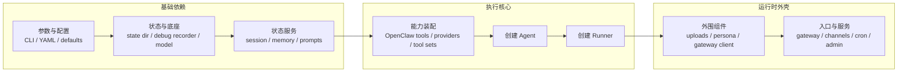

这个装配顺序的意义在于，底层依赖、执行核心与外围入口各自分层清晰。Model 仍由 `model` 实现提供，Session 与 Memory 仍由各自后端提供，Tool、ToolSet 与 Skill 仍走 tRPC-Agent-Go 原生体系，而 `openclaw` 负责把这些能力装配成一个完整运行时。

### 已注册能力检查

扩展前首先要确认的，并不是 YAML 怎么写，而是当前二进制实际包含了哪些类型。`openclaw` 提供了一个直接面向这个问题的排查入口：

```bash
openclaw inspect plugins
```

这条命令会列出当前二进制里已经注册的：

- Channel types
- Model types
- Session backends
- Memory backends
- Tool providers
- ToolSet providers

这些类型都来自 `openclaw/registry` 中的全局注册表。运行时在解析 `channels`、`tools.providers`、`tools.toolsets`、`session.backend`、`memory.backend` 和 `model.mode` 时，都会先按字符串类型名查找对应 factory，再决定是否创建实例。

### 自定义分发二进制

`openclaw` 采用的是典型的 Go 编译期注册模式。`openclaw/registry` 维护 `type -> factory` 注册表，各插件包在 `init()` 中调用 `registry.Register...(...)` 完成注册，分发入口再通过匿名导入把这些包编进最终二进制。因此，配置文件负责选择类型，二进制负责决定类型集合。

公开仓库里的分发入口就是一个现成例子，它在 `openclaw/cmd/openclaw/main.go` 中通过匿名导入选择要编进二进制的插件：

```go
package main

import (
	"trpc.group/trpc-go/trpc-agent-go/openclaw/app"

	_ "trpc.group/trpc-go/trpc-agent-go/openclaw/plugins/stdin"
	_ "trpc.group/trpc-go/trpc-agent-go/openclaw/plugins/telegram"
)
```

这种做法的意义在于，运行时主链路保持稳定，分发版只围绕接入范围和能力范围增减插件，而不必修改 `app.NewRuntime(...)` 本身。

### Channel 扩展

新增消息入口时，通常应该扩展的是 Channel，而不是去修改 Gateway 或 Runner。原因在于 Gateway 之后的执行主链路已经统一，新的入口主要承担“接消息”和“发消息”两类职责。

公开仓库中的 Telegram 插件就是一个比较完整的例子。它在[`openclaw/plugins/telegram`](https://github.com/trpc-group/trpc-agent-go/tree/main/openclaw/plugins/telegram) 下以 `telegram` 类型注册到 Channel registry：

```go
package telegram

import (
	"trpc.group/trpc-go/trpc-agent-go/openclaw/registry"
)

func init() {
	if err := registry.RegisterChannel(pluginType, newChannel); err != nil {
		panic(err)
	}
}
```

这个扩展真正处理的平台差异主要集中在 Channel 内部。

- 配置层读取 `token`、`streaming`、`proxy`、`http_timeout` 等入口参数。
- 协议层负责 Telegram API 调用、消息结构解析与文件下载。
- 会话层根据私聊、群聊和 thread 信息派生稳定的会话标识。
- 回传层把 Gateway 事件转换回 Telegram 消息更新。

### ToolProvider 与 ToolSet 扩展

ToolProvider 与 ToolSet 使用相同的注册模式，但承担的职责并不相同。

- ToolProvider 适合启动时就能明确知道要挂哪些工具的场景，factory 返回 `[]tool.Tool`。
- ToolSet 更适合由外部系统派生出一组工具的场景，factory 返回 `tool.ToolSet`。

从运行时装配上看，`newAgent(...)` 会先挂入 `openclaw` 自带工具、memory 工具和 skills 工具，再根据 YAML 中的 `tools.providers` 调用 `toolsFromProviders(...)`，根据 `tools.toolsets` 调用 `toolSetsFromProviders(...)`。

### Session、Memory 与 Model 后端扩展

如果业务差异不在消息入口，而在状态底座或模型接入层，那么扩展点应该落在后端 factory，而不是直接修改运行时主流程。

对应关系非常直接：

- `model.mode` 对应 `registry.RegisterModel(...)`
- `session.backend` 对应 `registry.RegisterSessionBackend(...)`
- `memory.backend` 对应 `registry.RegisterMemoryBackend(...)`

这类扩展的价值在于，用户侧 YAML 体验始终稳定。例如新增一个自定义的 Session 后端后，用户依然只需要在配置里写类型名与配置块。

### Skills 扩展

在大量业务场景中，最先变化的并不是运行时组件，而是操作说明、脚本和业务知识。此时优先扩展 Skills，通常比直接编写 Go 插件更合适。

`openclaw` 对 Skills 的支持有几个值得注意的工程点：

- Skill 以文件夹形式存在，核心文件是 `SKILL.md`
- 运行时会从多个根目录加载 Skills，并按优先级处理重名覆盖
- 可以通过 `skills.entries`、`allowBundled` 与 metadata 做 gating

与 Skills 配置最相关的排查命令是：

```bash
openclaw inspect config-keys -config ~/.trpc-agent-go-github/openclaw/openclaw.yaml
```

当一个 Skill 没有生效时，更常见的原因并不是“Skill 没加载”，而是它依赖的 config、env 或 bin 还没有满足。

## 最佳实践

在实际落地中，下面几条经验通常最关键。

1. 调试顺序宜由内向外推进，先用 `mock` 跑通本地入口或消息入口，再切真实模型。
2. 第一次联调先使用最小配置，只打开一个 Channel，避免同时排查模型、入口和工具问题。
3. 图片和文件场景优先让 Channel 先下载真实内容，再把内容交给 Gateway 和 Model。
4. 模型先求稳定，再求复杂。先验证纯文本，再验证图片和文件，最后再开更复杂的工具链路。
5. Channel 应尽量保持轻量，只处理平台协议，把业务语义统一沉淀到 Gateway 与 Runner。

## 总结

tRPC-Agent-Go 中的 `openclaw`，是在既有 Agent 框架之上进一步实现的一套长期运行 Runtime 形态。它并不追求与官方 OpenClaw 的工程结构完全对齐，而是优先复用 `Runner`、`Session`、`Memory`、`Tool`、`Skill`、`ToolSet` 与执行器等已有能力，再通过 Gateway、Channel、Cron、上传存储和管理能力，把这些能力组织成一个更接近真实助手产品的系统。

文中前半部分先说明公开 release 的安装、配置与联调过程，并用 Telegram 和本地终端入口展示运行时形态，后半部分再回到 Runtime 本身的装配方式与扩展边界。跑通这条链路之后，`openclaw` 提供的消息接入、文件处理、工具调用、会话管理与持续运行能力，也可以继续扩展到 Telegram、STDIN 与其他 Webhook 入口。

## 使用与交流

- GitHub 仓库：
  [github.com/trpc-group/trpc-agent-go](https://github.com/trpc-group/trpc-agent-go)
- `openclaw` 目录：
  [github.com/trpc-group/trpc-agent-go/tree/main/openclaw](https://github.com/trpc-group/trpc-agent-go/tree/main/openclaw)
- 安装说明：
  [github.com/trpc-group/trpc-agent-go/blob/main/openclaw/INSTALL.md](https://github.com/trpc-group/trpc-agent-go/blob/main/openclaw/INSTALL.md)
- Telegram 插件：
  [github.com/trpc-group/trpc-agent-go/tree/main/openclaw/plugins/telegram](https://github.com/trpc-group/trpc-agent-go/tree/main/openclaw/plugins/telegram)

如果你对这类长期运行 Agent Runtime 在 Go 生态中的落地方式感兴趣，欢迎继续共建，也欢迎给 GitHub 仓库[github.com/trpc-group/trpc-agent-go](https://github.com/trpc-group/trpc-agent-go) 点个 Star。

欢迎通过 GitHub Issues 交流框架使用经验、分享实践案例、讨论改进建议。
