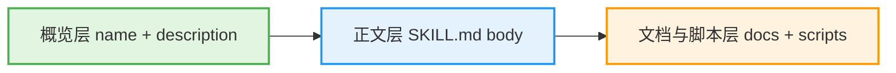
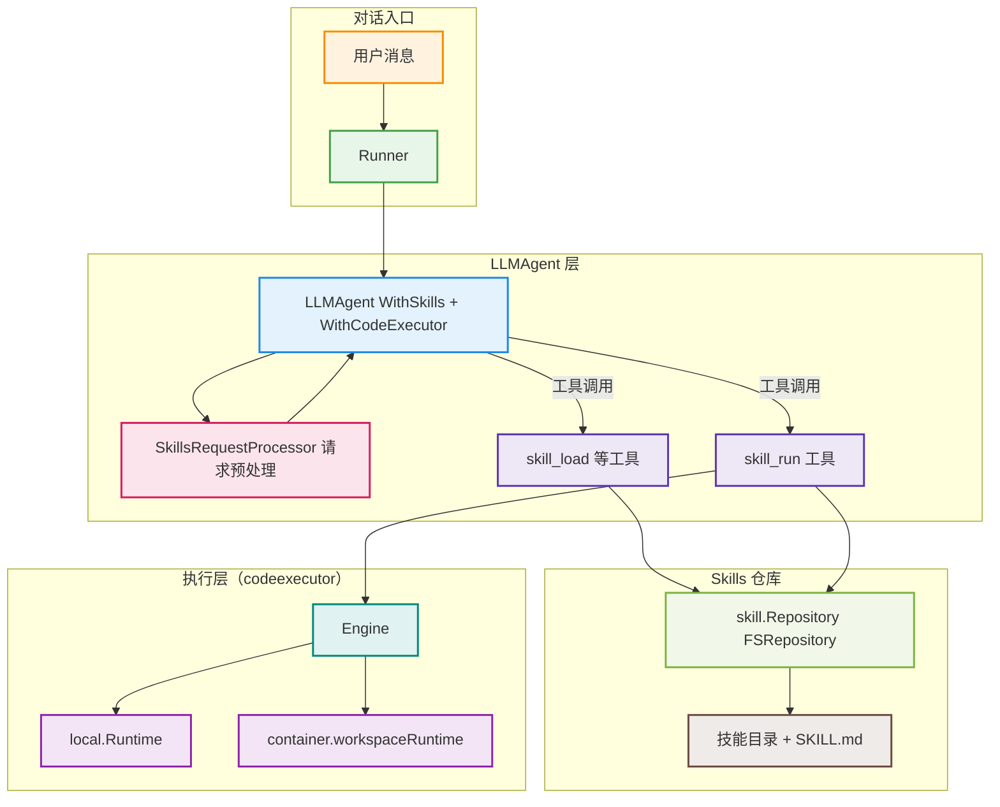
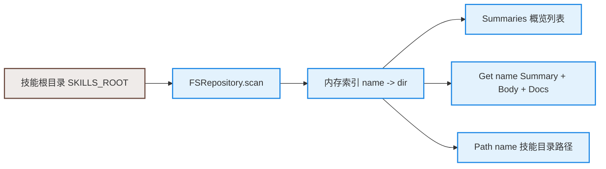
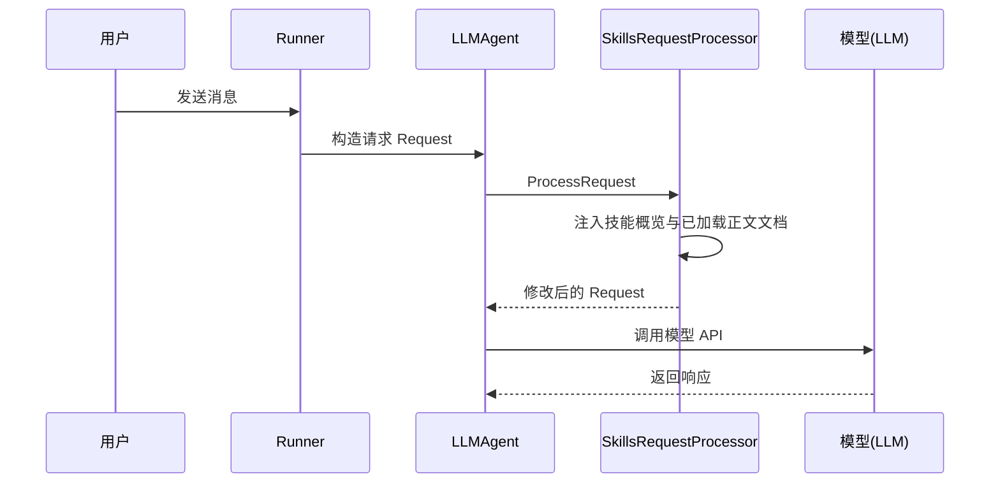
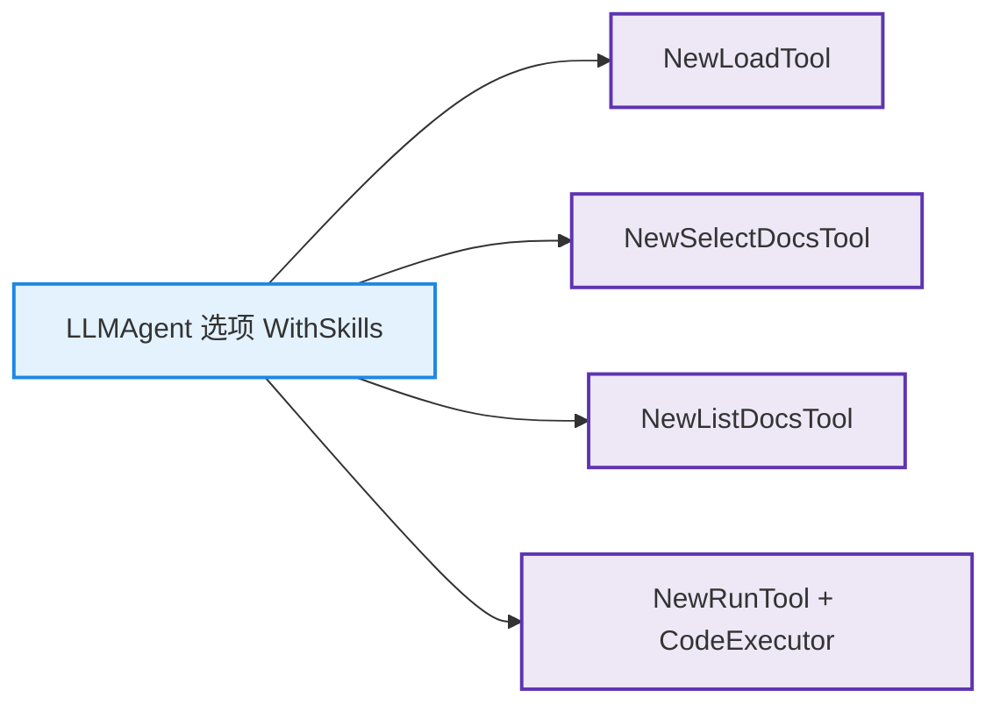
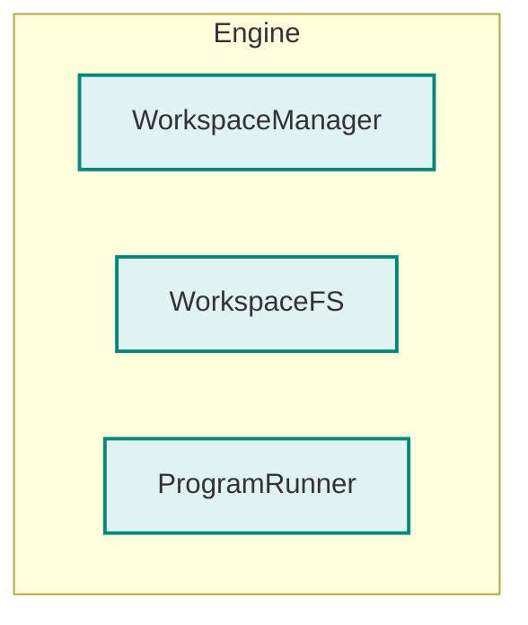
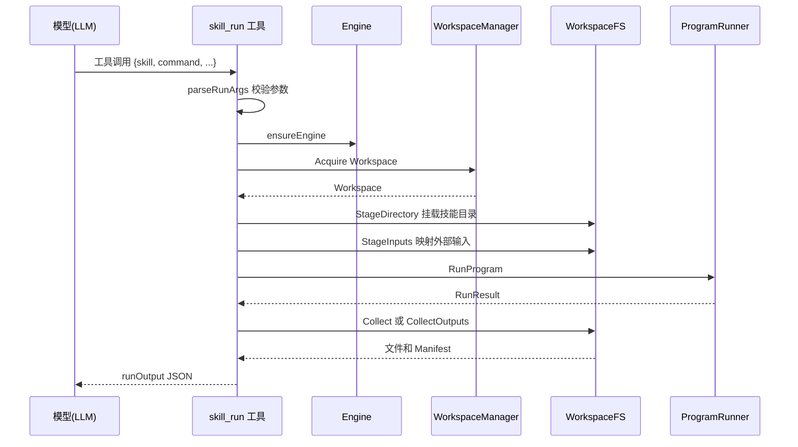

# tRPC-Agent-Go Skills：Anthropic Agent Skills 规范的 Go 原生实现

> tRPC-Agent-Go 框架第一时间支持了 Anthropic 风格的 Agent Skills。本文将从“如何使用”到“设计实现”依次展开，帮助你在实际业务中自如地启用和扩展这一能力。

> [tRPC-Agent-Go](https://github.com/trpc-group/trpc-agent-go/) 是面向 Go 语言的自主式多 Agent 框架，具有工具调用、会话与记忆管理、制品管理、多 Agent 协同、图编排、知识库与可观测等能力。tRPC-Agent-Go 的成长离不开大家的支持，欢迎 Star 项目。

在很多基于大语言模型（Large Language Model，LLM）的 Agent 项目里，真正的挑战并不只是“让模型变聪明”，而是如何把一整套任务知识沉淀成可复用的技能，用按需加载的方式喂给模型，并在受控环境中安全落地执行。Anthropic 提出的 Agent Skills 提供了一条很清晰的路径：把可复用的任务封装为技能目录，用 `SKILL.md` 描述目标与流程，用文档和脚本补充细节，由系统在对话过程中按需加载这些信息，并在工作区中完成实际操作。

tRPC-Agent-Go 在框架层对齐了这套设计：一方面提供 Skill 仓库存取、概览与正文注入等上下文能力，另一方面结合 Workspace 抽象，把技能涉及的脚本放进隔离工作区中安全运行，让“任务知识 + 文档 + 可选脚本”成为一个统一、可控的 Agent 能力层。

本文会从零开始，带你理解：
- Agent Skills 的整体思路和典型使用场景
- tRPC-Agent-Go 中如何按需加载 Skill 的上下文
- Skills 与执行环境结合后的能力边界
- 作为业务方，如何快速启用并扩展这一能力

后文会先梳理背景与概念，再给出一个最小使用示例，最后展开框架内部的设计与实现，帮助你把 Skill 看清楚、用得稳。

## 背景

### 传统痛点

在没有 Agent Skills 之前，我们通常这样给 LLM“加能力”：把一堆“操作手册”“命令示例”写在提示词里，再让模型按这些说明生成代码或操作步骤，由人类或外部系统去执行。

这种方式有两个明显问题：

1. 上下文爆炸：所有步骤、脚本都写在提示词里，上下文窗口（Context Window）被快速占满，成本高、可维护性差。  
2. 执行环境割裂：模型只“说”脚本，不真正“跑”脚本，执行结果需要人工搬运，难以形成闭环，也不利于审计和回溯。

Anthropic 在文章 [Equipping agents for the real world with Agent Skills](https://www.anthropic.com/engineering/equipping-agents-for-the-real-world-with-agent-skills) 中提出了一套统一的解决方案：把可复用的任务封装为 Skill 目录，用 `SKILL.md` 描述目标与流程，用文档和脚本补充细节，由系统管理技能的发现、加载和执行。开源仓库 [`anthropics/skills`](https://github.com/anthropics/skills) 中提供了大量示例 Skill，如 PDF 处理、PPT 生成等。

tRPC-Agent-Go 在设计 Skill 能力时，完全对齐了这套语义：`SKILL.md` 的格式和含义与 Anthropic 官方一致，技能目录结构也与上述示例仓库兼容，你可以直接把 Claude Skills 仓库指给 tRPC-Agent-Go 使用，而不需要改写 `SKILL.md`。

### 三层模型

先看一个极简的技能目录示例，帮助你对 Skill 的“长什么样”有一个直观印象。

```text
skills/
  report-summary/
    SKILL.md
    USAGE.md
    scripts/
      summarize.py
```

其中 `SKILL.md` 的内容可以非常简单，例如：

```markdown
---
name: report-summary
description: Summarize long reports into short bullet points.
---

Usage

- When the user asks to summarize a long report into a concise outline.

Steps

1) Read the input file from $WORK_DIR/inputs/report.txt
2) Run: python3 scripts/summarize.py > $OUTPUT_DIR/summary.txt
3) Return a short natural language summary and mention summary.txt
```

这个例子里：YAML 头部的 `name` 和 `description` 提供“概览”，正文部分给出了使用时机和具体步骤，`USAGE.md` 作为补充说明，`scripts/summarize.py` 则是实际执行的脚本。真正做到“用起来像一个技能”，靠的就是对这些内容按需加载和执行。

在 Anthropic 的 Agent Skills 规范中，一个 Skill 目录本质上包含三层信息：



1. 概览层：只包含 `SKILL.md` YAML 头部中的 `name` 和 `description`，成本极低，可以在每轮对话一开始就注入，用来告诉模型“有哪些技能、各自做什么”。  
2. 正文层：`SKILL.md` 的 Markdown 正文，描述“何时使用”“具体步骤”“命令示例”，只在模型决策“要用这个 Skill”时，通过工具调用按需加载。  
3. 文档与脚本层：附加的 Markdown 文档和脚本文件，文档按需选取一部分注入，脚本只在工作区执行，不会被原样放进提示词。

这个“三层模型”是理解 Agent Skills 的核心：Agent 只在需要时才把更“重”的信息拉进上下文或执行环境，从而在“能力强”和“成本低”之间取得平衡。

## 快速开始

本节从“怎么用”出发，给出一个最小可运行示例，帮助你快速感受 tRPC-Agent-Go 的 Agent Skills 能力。

### 环境准备

- Go 1.21+  
- 一个 OpenAI 兼容模型服务的 Key  
- 一个 Skills 目录（可以直接使用示例目录 [`examples/skillrun/skills`](https://github.com/trpc-group/trpc-agent-go/tree/main/examples/skillrun/skills)）

常用环境变量：

```bash
export OPENAI_API_KEY="your-api-key"
export SKILLS_ROOT=/path/to/your/skills   # 可选，默认使用 ./skills
```

### 入门示例

下面这段代码是简化版的技能对话示例，基于 [`examples/skillrun/main.go`](https://github.com/trpc-group/trpc-agent-go/tree/main/examples/skillrun/main.go)。

```go
package main

import (
    "trpc.group/trpc-go/trpc-agent-go/agent/llmagent"
    "trpc.group/trpc-go/trpc-agent-go/codeexecutor/local"
    "trpc.group/trpc-go/trpc-agent-go/model"
    "trpc.group/trpc-go/trpc-agent-go/model/openai"
    "trpc.group/trpc-go/trpc-agent-go/runner"
    "trpc.group/trpc-go/trpc-agent-go/skill"
)

func main() {
    mdl := openai.New("gpt-4o-mini")

    repo, _ := skill.NewFSRepository("./skills")
    exec := local.New()

    agent := llmagent.New(
        "skills-assistant",
        llmagent.WithModel(mdl),
        llmagent.WithSkills(repo),
        llmagent.WithCodeExecutor(exec),
    )

    r := runner.NewRunner("demo-app", agent)
    ch, _ := r.Run(
        context.Background(),
        "user1", "session1",
        model.NewUserMessage("请用合适的 Skill 总结一个文本文件"),
    )

    for ev := range ch {
        // 处理流式响应与工具调用，这里略去细节。
        _ = ev
    }
}
```

这段代码做了几件事：用 `WithSkills(repo)` 打开 Agent Skills 能力，用 `WithCodeExecutor(exec)` 接入执行环境，并通过 `Runner` 发起一次对话，让模型可以在需要时自动选择并调用技能相关工具。

在实际对话中，一个典型流程大致是：模型先通过概览了解有哪些技能，当你说“用某个 Skill 做 X”或描述一个技能适用的任务时，它调用技能工具加载正文与文档，然后在技能工作区中执行命令并返回结果或输出文件。

后续章节会从实现角度解释：这些行为在框架内部是如何串起来的。

## 架构总览

先看一张总览图，帮助你把几个关键模块对上号：



可以大致理解为三层：

- 对话层：`Runner` + `LLMAgent`，负责接收用户消息、调用模型和驱动工具流。  
- Skill 管理层：`skill.Repository` 负责发现并解析 `SKILL.md`，`SkillsRequestProcessor` 负责把概览、正文和文档按需注入。  
- 执行层：用统一的 `Engine` 抽象屏蔽“本地执行”和“容器执行”的差异，`skill_run` 只面对统一接口，不关心底层是本机还是容器。

接下来我们依次展开这些模块。

## 技能目录

### 目录结构

在 tRPC-Agent-Go 中，一个 Skill 目录通常类似下面这样：

```text
my-skill/
  SKILL.md
  USAGE.md
  scripts/
    run.sh
    helper.py
  assets/
    logo.png
```

规范与 Anthropic 的 Agent Skills 规范保持一致，核心要点包括：目录名与 `SKILL.md` 中 YAML 头部的 `name` 一致；`description` 用自然语言描述“技能做什么、何时用”；正文部分是完全自由的 Markdown，用来写使用时机、步骤和命令示例。

在代码中，`skill/repository.go` 把这些规范落实到了具体实现：常量 `skillFile = "SKILL.md"` 定义了 Skill 入口文件名，`EnvSkillsRoot` 环境变量指定技能仓库根目录，`FSRepository` 会递归遍历技能根目录，寻找包含 `SKILL.md` 的子目录。

相关代码可以在 [`skill/repository.go`](https://github.com/trpc-group/trpc-agent-go/blob/main/skill/repository.go) 中查看。

### 加载流程

`FSRepository` 实现了 `skill.Repository` 接口，用于从文件系统加载技能：

- `Summaries`：返回所有技能的 `Summary`，只包含 `Name` 和 `Description`，对应“概览层”。  
- `Get`：读取完整的 `SKILL.md` 正文，并收集同目录下所有 `.md` 或 `.txt` 文档到 `Docs` 列表，对应“正文 + 文档层”。  
- `Path`：返回技能目录路径，供后续执行时把整个目录挂载到工作区。

这一层做的事情可以用下面的图来理解：



这样，框架在读取和执行 Skill 时，都不需要理解 YAML 的细节，只要通过接口拿到“概览、正文、文档、目录路径”四类信息即可。

## 上下文注入

### 请求预处理

当你在创建 `LLMAgent` 时调用：

```go
llm := llmagent.New(
    "skills-assistant",
    llmagent.WithModel(mdl),
    llmagent.WithSkills(repo),
    llmagent.WithCodeExecutor(exec),
)
```

框架内部会自动挂上一条请求预处理链 [`internal/flow/processor/skills.go`](https://github.com/trpc-group/trpc-agent-go/blob/main/internal/flow/processor/skills.go) 中的 `SkillsRequestProcessor`。

它在每次发送给模型的请求前做两件事：

1. 总是注入“技能概览”。处理器读取 `repo.Summaries`，生成诸如 `Available skills: - name: description` 的文本，并将其合并到系统消息（system message）中，同时追加一段“如何安全使用工作区和工具”的指导文案，明确 `inputs`、`out` 等目录的约定。  
2. 按需注入已加载技能的正文和文档。处理器读取会话状态中的临时键 `temp:skill:loaded:<name>` 和 `temp:skill:docs:<name>`，对每个被标记为已加载的技能，把 `SKILL.md` 正文整体拼接到系统消息中，并根据 `docs` 选择具体 `.md` 或 `.txt` 文档，并加上 `[Doc] 文件名` 的前缀。

整个过程的时序大致如下：



这里有两个关键点：

- 概览始终存在，让模型始终知道“有哪些技能可用”，但成本很低。  
- 正文与文档按需加载，只有当工具调用明确表明“要用这个技能”时才会注入，从而避免上下文浪费。

### 技能状态

`SkillsRequestProcessor` 本身并不决定“加载哪个技能”，它只读取会话状态。真正写入状态的是三个工具：

- `skill_load`：声明“加载某个技能的正文，以及要用哪些文档”。  
- `skill_select_docs`：单独调整文档选择（增加、替换或清空）。  
- `skill_list_docs`：列出某技能下所有可选文档文件名。

这三个工具的实现位于以下文件：

- [`tool/skill/load.go`](https://github.com/trpc-group/trpc-agent-go/blob/main/tool/skill/load.go)  
- [`tool/skill/select_docs.go`](https://github.com/trpc-group/trpc-agent-go/blob/main/tool/skill/select_docs.go)  
- [`tool/skill/list_docs.go`](https://github.com/trpc-group/trpc-agent-go/blob/main/tool/skill/list_docs.go)

它们的共同点是：不直接操作 Prompt，只读写 `Session.State` 中的临时键。这样可以保证“选择使用哪个 Skill 和哪些文档”与“如何把这些内容注入系统消息”是解耦的两个步骤：前者由工具负责，后者由请求处理器统一完成。

## 工具总览

### 工具注册

当你在创建 `LLMAgent` 时调用 `llmagent.WithSkills(repo)`，[`agent/llmagent/llm_agent.go`](https://github.com/trpc-group/trpc-agent-go/blob/main/agent/llmagent/llm_agent.go) 会自动注册四个技能相关工具：

- `skill_load`  
- `skill_select_docs`  
- `skill_list_docs`  
- `skill_run`

部分逻辑可以用下面的图来概括：



如果你还配置了 `WithCodeExecutor(exec)`，框架会把这个执行器传给 `skill_run` 工具；如果没有显式配置，`skill_run` 会自动退回到默认的本地执行器。

### 工具职责

结合 [`docs/mkdocs/zh/skill.md`](https://github.com/trpc-group/trpc-agent-go/blob/main/docs/mkdocs/zh/skill.md) 和 `tool/skill/*.go` 源码，每个工具的职责大致如下：

- `skill_load`：输入为 `skill`（必填）、可选的 `docs` 和 `include_all_docs`，行为是写入 `temp:skill:loaded:<name>` 与 `temp:skill:docs:<name>`，标记“本轮对话需要该技能正文和哪些文档”。  
- `skill_select_docs`：输入为 `skill`、`docs`、`include_all_docs` 和 `mode`，行为是更新 `temp:skill:docs:<name>`，支持追加、替换或清空。  
- `skill_list_docs`：输入为 `skill`，输出为该技能下可用文档文件名列表，方便模型做选择。  
- `skill_run`：输入为 `skill`、`command`、`cwd`、`env`、`output_files`、`inputs`、`outputs`、`timeout` 等，行为是在隔离的 Workspace 中执行命令，收集输出文件，并在需要时保存为 Artifact（工件）。

前三个工具解决“模型知道用哪个 Skill、读哪些文档”的问题，最后一个 `skill_run` 则负责“真正把脚本跑起来”，是连接技能和执行环境的关键一环。

## 执行环境

要实现类似 Claude 的 Skills 体验，有一个关键原则：Skill 本身只依赖一个干净的执行接口，而不关心后台到底是本机还是容器。tRPC-Agent-Go 把这一层抽象集中在 [`codeexecutor/workspace.go`](https://github.com/trpc-group/trpc-agent-go/blob/main/codeexecutor/workspace.go) 和 [`codeexecutor/metadata.go`](https://github.com/trpc-group/trpc-agent-go/blob/main/codeexecutor/metadata.go) 中。

一个简化的结构图可以帮助理解执行抽象内部的组成：



### 执行接口

在 `codeexecutor` 包中，执行接口由一组职责清晰的组件组成：

- `Workspace` 表示一个隔离的执行空间，包含 ID 和物理路径。  
- `WorkspaceManager` 负责创建与清理 Workspace。  
- `WorkspaceFS` 负责在 Workspace 中放置文件、挂载目录、收集输出。  
- `ProgramRunner` 在 Workspace 中运行具体命令。  
- `Engine` 把上述三个接口打包在一起，对外提供统一的执行能力。

另外还有一个辅助接口 `EngineProvider`，允许已有的 `CodeExecutor` 暴露内部的 `Engine`，供 `skill_run` 复用。

Workspace 的标准目录结构（由 `EnsureLayout` 保证）包括：`skills` 目录存放只读技能树、`work` 目录存放可写中间文件、`runs` 目录存放每次执行的临时目录、`out` 目录存放收集后的输出文件、`metadata.json` 记录已挂载技能与输入输出记录。

运行时会注入一组环境变量，例如 `WORKSPACE_DIR`、`SKILLS_DIR`、`WORK_DIR`、`OUTPUT_DIR`、`RUN_DIR` 和当前技能名 `SKILL_NAME`。Skill 文档可以直接使用这些变量来描述文件路径，例如“从 `$WORK_DIR/inputs` 读取输入，把结果写入 `$OUTPUT_DIR`”。

### 本地执行

本地执行器的 Workspace 实现在 [`codeexecutor/local/workspace_runtime.go`](https://github.com/trpc-group/trpc-agent-go/blob/main/codeexecutor/local/workspace_runtime.go)。它的职责包括：为每个执行 ID 创建工作目录并初始化标准子目录与元数据，将指定的技能目录或输入目录复制或链接到 Workspace，通过 `exec.CommandContext` 在 Workspace 中运行命令，注入前面提到的环境变量，并根据通配符收集输出文件，在大小或数量超过限制时设置 `LimitsHit` 标志。

本地 Runtime 默认启用 `AutoInputs`，可以把指定的宿主机目录映射到 `work/inputs` 下，方便 Skill 直接访问外部文件。

### 容器执行

容器执行器的 Workspace 实现在 [`codeexecutor/container/workspace_runtime.go`](https://github.com/trpc-group/trpc-agent-go/blob/main/codeexecutor/container/workspace_runtime.go)。相比本地执行，它额外做了几件事：为每个 Workspace 在容器内创建一个独立目录，尽可能利用已有的 bind mount（例如把整个 Skills 仓库挂到 `/opt/trpc-agent/skills`）以“容器内复制”的方式快速挂载技能，通过 Docker 的 Exec 接口运行命令，带有超时与资源限制，并使用 glob 展开和 tar 流将输出文件拉回宿主机。

对 `skill_run` 而言，这些差异都是透明的，只要拿到一个实现了 `Engine` 接口的对象，就能统一调度本地和容器执行环境。

## 执行流程

### 入口解析

`skill_run` 的核心实现位于 [`tool/skill/run.go`](https://github.com/trpc-group/trpc-agent-go/blob/main/tool/skill/run.go)。工具首先解析 JSON 参数，校验 `skill` 和 `command` 是否为空，然后通过技能仓库解析技能根目录。

在选择 Engine 时，`skill_run` 会优先尝试从外部注入的 `CodeExecutor` 中获取 Engine（当执行器实现了 `EngineProvider` 接口时），否则退回到一个基于本地 Runtime 的默认 Engine。这样既兼顾了易用性，又允许业务侧按需替换执行后端。

### 技能挂载

`RunTool` 内部维护了一个 `WorkspaceRegistry`，对应代码在 [`codeexecutor/registry.go`](https://github.com/trpc-group/trpc-agent-go/blob/main/codeexecutor/registry.go)，用于按会话 ID 复用 Workspace。这样同一对话中的多次 `skill_run` 调用可以共享一个 Workspace，中间产出保留在 `work` 和 `out` 下，便于技能之间串联。

挂载 Skill 目录的大致流程是：通过 `repo.Path` 找到技能根目录，调用 `codeexecutor.DirDigest` 计算目录摘要，读取 Workspace 的 `metadata.json` 判断是否已经挂载过相同摘要的技能，如果是则跳过复制，否则将技能目录挂载到 Workspace 的 `skills/<name>`，在技能根目录下创建指向 `out`、`work`、`work/inputs` 的符号链接，最后把技能目录树（除符号链接外）设为只读。

从命令行视角看，技能脚本认为自己的根目录就是 `skills/<name>`，但写入 `out`、`work`、`inputs` 实际上都落在 Workspace 共享目录中，既安全又方便多个技能协同。

### 结果收集

`skill_run` 支持两种输出收集方式：

1. 传统的 `output_files`：传入通配符列表（例如 `["out/*.txt"]` 或 `$OUTPUT_DIR/*.csv`），底层通过 `WorkspaceFS.Collect` 收集匹配文件，并返回文件名、内容和 MIME 类型。  
2. 声明式的 `outputs`：通过 `OutputSpec` 指定通配符、是否内联内容、是否保存为 Artifact，以及最大文件数和大小，底层通过 `CollectOutputs` 返回 `OutputManifest`，并在需要时调用 Artifact 服务保存文件。

输入通过 `inputs` 数组声明，每个 `InputSpec` 可以来自 `artifact://`、`host://`、`workspace://` 或 `skill://` 等不同来源。具体实现分布在 `codeexecutor` 包和本地、容器 runtime 中。

最终，`skill_run` 返回一个结构化结果 `runOutput`，包括 `stdout`、`stderr`、`exit_code`、`timed_out`、`duration_ms`、`output_files` 以及可选的 `artifact_files`。

整个执行链可以用以下时序图概括：



## 交互示例

仓库中提供了一个完整的交互式技能对话示例工程 [`examples/skillrun`](https://github.com/trpc-group/trpc-agent-go/tree/main/examples/skillrun)。这个示例展示了如何在命令行下与具备 Skills 能力的 Agent 进行对话。

它做了几件事：使用 OpenAI 兼容的模型客户端 [`model/openai/openai.go`](https://github.com/trpc-group/trpc-agent-go/blob/main/model/openai/openai.go)，通过 `skill.NewFSRepository` 加载技能仓库（默认 `./skills`，也可通过 `SKILLS_ROOT` 指定），根据命令行参数选择本地或容器执行器，创建带 Skills 的 `LLMAgent` 并注入指导性系统提示词，使用 `Runner` 流式消费模型输出，同时打印工具调用和工具响应，包括 `skill_run` 返回的 `artifact_files`。

如果你希望体验 Anthropic 官方示例 Skill，可以将仓库 [`anthropics/skills`](https://github.com/anthropics/skills) 克隆到本地，把环境变量 `SKILLS_ROOT` 指向该目录，然后在 `examples/skillrun` 下运行示例，就可以在 tRPC-Agent-Go 中直接使用这些 Skills。

需要注意的是，Skill 的语义完全来自 `SKILL.md` 和文档本身，框架只是提供“按需注入 + 安全执行”的基础能力。编写 Skill 时，你只需要关注如何用自然语言清楚描述任务及步骤，以及如何组织 `scripts` 和 `out` 目录保证命令可重现。

## 扩展运行

如果你希望在现有的本地和容器实现之外，再接入新的运行时（例如 Kubernetes Pod、远程沙箱等），可以沿着下面的思路来做。

1. 实现 Workspace 接口三件套：实现自定义的 `WorkspaceManager`、`WorkspaceFS` 和 `ProgramRunner`，负责创建与清理 Workspace、管理文件和目录、在 Workspace 内运行命令。  
2. 封装为 Engine：使用 `codeexecutor.NewEngine` 把上述三个组件打包成一个新的 `Engine`。  
3. 通过 `LLMAgent` 注入：将新的 `CodeExecutor` 或 Engine 注入 `LLMAgent.WithCodeExecutor`，或者直接在自定义 Agent 中以 `Engine` 形式传给 `skill_run`。

由于 `skill_run` 完全基于 `Engine` 抽象工作，一旦新的执行后端实现了 Workspace 接口，所有现有 Skill 都可以无缝迁移，无需改动 `SKILL.md`。

## 能力对比

除了 Skills，tRPC-Agent-Go 还内置了一条“自动执行代码块”的路径，处理模型回答中的代码块并自动执行，对应的逻辑在 [`internal/flow/processor/codeexecution.go`](https://github.com/trpc-group/trpc-agent-go/blob/main/internal/flow/processor/codeexecution.go) 中。

两者的区别和定位大致如下：

- 自动代码执行适合“临时写点代码试试”的轻量场景：模型在回答中输出三引号代码块（例如 ```python），框架自动提取并运行，返回结果。  
- Skill 执行适合“可复用的任务模板”：脚本始终存放在技能目录中，模型只写命令，不写脚本正文，通过 `skill_run` 在 Workspace 中执行，并可收集输出文件和 Artifact。

从实现上看，两者都复用 `codeexecutor` 的 Workspace 抽象，只是入口不同：自动代码执行从模型响应处理器进入，`skill_run` 从工具调用进入。

## 总结

回顾全文，tRPC-Agent-Go 的 Agent Skills 能力可以总结为几条主线：

- 信息组织：用 `SKILL.md` 配合文档和脚本构成三层信息模型，概览始终存在，正文与文档按需注入，脚本只在工作区执行。  
- 请求注入：`SkillsRequestProcessor` 基于会话状态自动把概览、已加载技能正文和选定文档合并进系统消息。  
- 工具协作：`skill_load`、`skill_select_docs`、`skill_list_docs` 负责“选用哪一个 Skill 和哪些文档”，`skill_run` 负责“在 Workspace 中真正执行命令并收集结果”。  
- 执行抽象：`codeexecutor` 用 Workspace 与 Engine 抽象屏蔽本地与容器差异，让 Skill 只依赖统一执行接口。  
- 扩展能力：只要实现 Workspace 三件套并封装为新 Engine，所有现有 Skill 都可以迁移到新的执行后端，无需改写 `SKILL.md`。

对使用者而言，你只需要：准备好符合规范的 Skills 目录，在 `LLMAgent` 上配置 `WithSkills` 与合适的 `CodeExecutor`，像普通聊天一样与 Agent 交互，自然表达你的需求或希望使用的技能，模型会在合适的时机自行选择并调用相关工具。

其余的发现、注入、执行、收集与持久化工作，都由 tRPC-Agent-Go 在框架层统一完成。

欢迎大家在实际业务中试用 Agent Skills 能力，把高频任务沉淀为可复用的技能包，逐步构建自己的技能库。如需更多使用示例和最佳实践，可参考以下文档与仓库。

**代码仓库**：
- [tRPC-Agent-Go 仓库](https://github.com/trpc-group/trpc-agent-go)

**Skills 相关文档**：
- Skills 功能说明与用法示例：[`docs/mkdocs/zh/skill.md`](https://github.com/trpc-group/trpc-agent-go/blob/main/docs/mkdocs/zh/skill.md)
- 交互式示例工程：[`examples/skillrun`](https://github.com/trpc-group/trpc-agent-go/tree/main/examples/skillrun)

欢迎通过 GitHub Issues 交流框架使用经验、分享实践案例、讨论改进建议。
