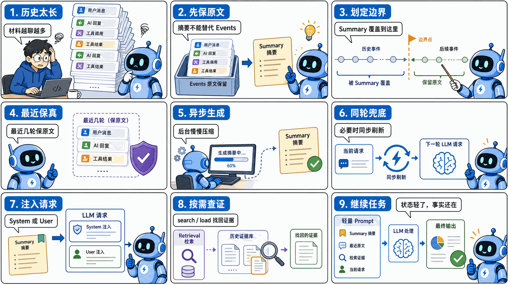
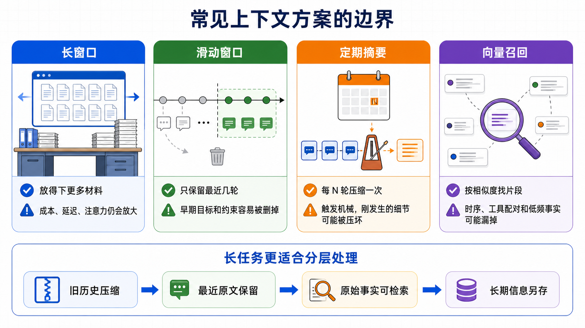
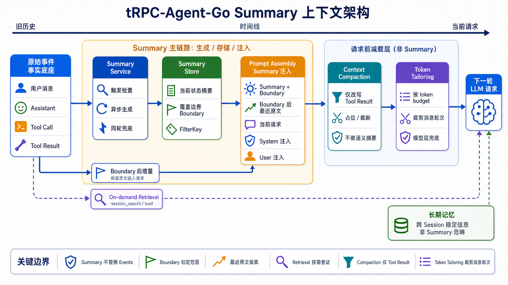
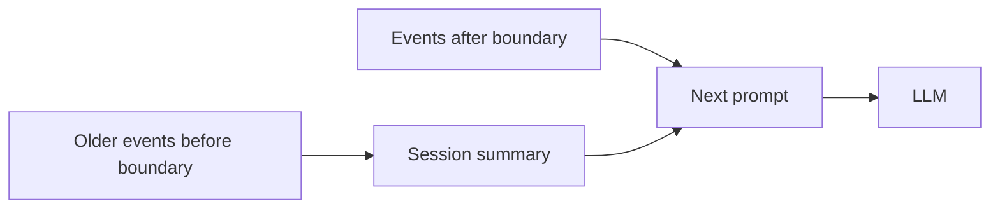
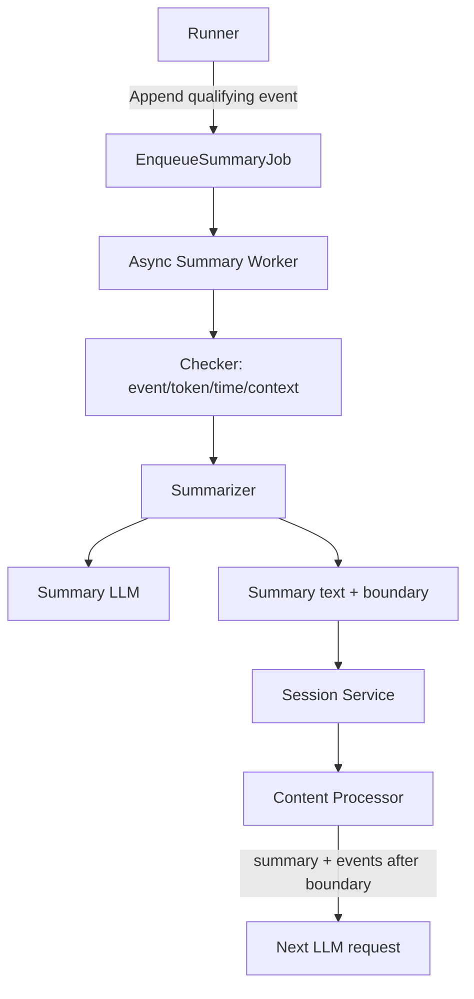
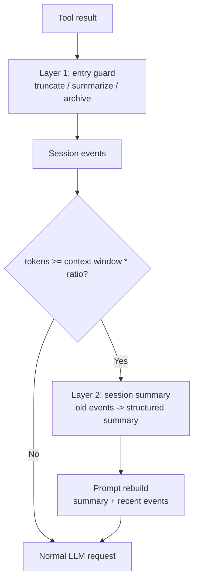
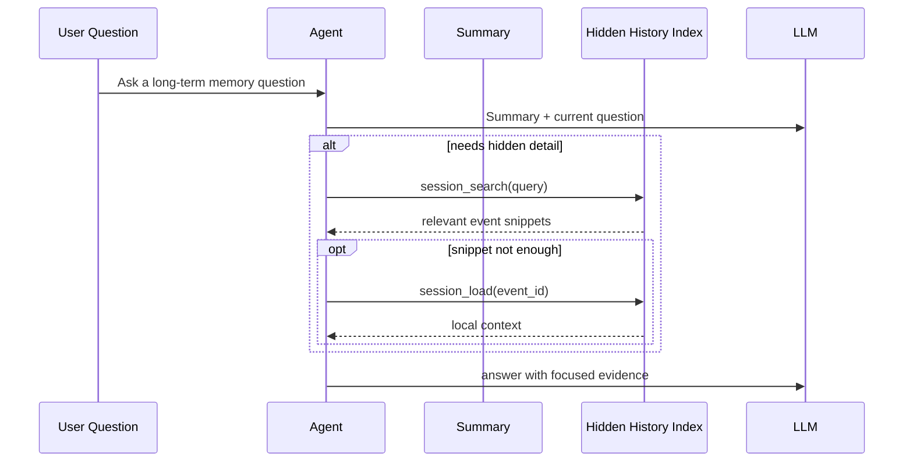
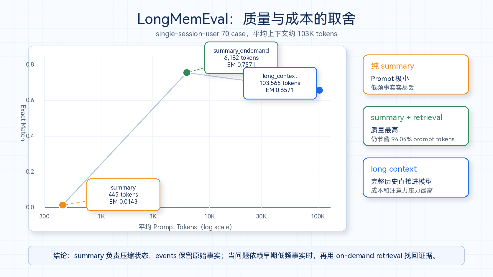

# tRPC-Agent-Go Summary：长任务 Agent 上下文管理的设计与评测

> [tRPC-Agent-Go](https://github.com/trpc-group/trpc-agent-go) 是面向 Go 语言的自主式多 Agent 框架，具有工具调用、会话与记忆管理、制品管理、多 Agent 协同、图编排、知识库与可观测等能力。
>
> 本文聚焦 tRPC-Agent-Go 的 Session Summary 能力：它不是简单地“把历史总结短一点”，而是把长任务里的状态、原始事件、最近上下文和按需检索通道分层管理，让 Agent 在成本、延迟和事实可恢复性之间取得更稳的平衡。tRPC-Agent-Go 的成长离不开大家的支持，欢迎 Star 项目并参与社区共建。



知识型、办公型 Agent 的价值，往往不在于回答一个孤立问题，而在于把用户分散在不同工作场景里的材料和动作连续起来。

这类 Agent 往往要把读、搜、写串在同一条工作流里：使用者可能先查资料，到知识库里找历史方案，打开文件整理素材，把关键结论写进笔记，中途再让助手搜索、读取文件、启动子任务，最后汇总成报告、方案或可交付文件。体验上，这些动作最好自然接续：页面切换了，材料变多了，任务中途改了方向，助手仍然能接住前面发生过的事。

这类体验看起来像产品交互问题，真正落到工程里，第一件事就是上下文管理。上下文处理得好，用户少重复交代背景，工具结果能被持续利用，长任务也能在成本和延迟可控的前提下继续推进；上下文处理不好，助手就容易重复读取同一批材料，或者忽略刚刚确认过的约束。

从界面上看，它仍然是一个聊天窗口。但对 Agent 来说，历史里已经混进了很多不同来源的信息：工具返回、网页内容、文件片段、知识库结果、命令输出、错误修复过程、用户反馈、子任务结论，还有阶段性判断。几轮之后，prompt 就会明显变重；任务越长，模型每次请求要重新读取的内容越多，成本和延迟都会上升，当前任务状态也更容易被历史噪声稀释。

这就是 session summary 要解决的问题。

如果只是让模型概括几句，summary 会简单很多。麻烦在于，它要同时处理三件事：**旧历史需要压缩，原始事实不能丢，最近几轮还要能继续接上。**

接下来会沿着这样的主线往下讲：

先介绍长任务 Agent 为什么会遇到上下文压力。长窗口、滑动窗口、定期摘要和向量召回都能解决一部分问题，但单独使用都有明显边界。

再分析 tRPC-Agent-Go Summary 的设计。框架让 summary 负责当前状态，events 继续保存原始事实，最近几轮保留原文，必要时再通过 retrieval 找回旧证据。

最后再用 LongMemEval 做一次边界验证：纯 summary 可以把 prompt 压得很小，但低频事实容易丢；加上 on-demand retrieval 后，系统可以在保持轻量上下文的同时，把早期事实找回来。

换成框架设计语言，就是：

> 长任务 Agent 的上下文管理，关键是给状态摘要、原始事件和检索通道各自找到位置。

## 一、为什么长任务 Agent 需要上下文管理

很多人第一次处理 Agent 上下文，会把它当成普通聊天问题：历史太长了，就少放几轮；再长一点，就让模型总结一下。

长任务助手和普通聊天差异很大。

在同一个智能工作台里，往往还会分出两种运行形态。

一种更接近 **general agent**。它主要面向知识问答、资料整理、笔记改写、报告生成这类任务，部署形态通常是多节点、多租户的在线服务。它能用搜索、知识库、写作、编辑、页面理解等工具，但这些能力大多要被封装成服务化 tool 或 skill，再经过权限、租户、审计和流式回包等环节。它对外部材料的访问以读为主，很多时候只需要类似文件系统里的 `r--` 权限。

另一种更接近 **coding agent**。它运行在用户机器或隔离容器里，文件系统、shell、编译器、包管理器、测试命令天然是一等公民。它不只是读材料，还要改文件、执行命令、生成制品、回滚失败尝试。换成文件系统权限，就是经常需要完整的 `rwx` 能力。

这两类 Agent 看起来都在聊天窗口里工作，但上下文压力不一样。general agent 的压力更多来自检索结果、网页内容、知识库片段和用户跨页面上下文；coding agent 的压力更多来自 workspace 文件、命令输出、工具调用轨迹、失败修复过程和正在修改的代码现场。Summary 的策略如果不区分这些差异，很容易把一个场景里的经验硬套到另一个场景里。

先看 general agent 一侧。知识型、办公型 Agent 往往希望成为一个统一入口：用户在首页、知识库、内置浏览器、笔记页面都能唤起同一个助手；助手能感知当前网页、文件、知识库或笔记内容，并通过 Skills 去做知识整理、笔记追加、报告生成、技能创建等任务。

这类产品的体验目标很自然：用户不想反复上传文件、复制网页、解释背景，也不想每换一个页面就重新开一个上下文。Agent 需要知道用户现在在哪、刚才做过什么、这份资料和前面那个任务有什么关系。

于是上下文压力也变得很现实。一次调研任务里，模型可能先搜索几个关键词，再读取多个网页，接着分析知识库文件，发现信息不够又启动子任务补充，最后合并结果。用户中途可能说「刚才那个方向不对」「保留这个数据」「不要写太泛」。这些约束往往分散在不同轮次里，但后续每一步都可能依赖它们。

coding agent 的材料来源不同，但问题类似：读过的文件、执行过的命令、失败过的测试、用户刚刚确认的改法，都可能在后续步骤里继续生效。换句话说，两类 Agent 最后都会遇到同一个问题：历史不是一串等价文本，而是几类生命周期不同的信息混在一起。

这时，对话历史里真正重要的信息可以拆成几类：

| 信息类型       | 例子                                   | 最适合的通道                                  |
| -------------- | -------------------------------------- | --------------------------------------------- |
| 全局状态       | 用户目标、已定方案、未完成任务         | summary                                       |
| 当前上下文     | 最近几轮用户反馈、刚返回的 tool result | 最近保留区原文                                |
| 低频事实       | 名字、日期、数字、某次偏好             | events + retrieval，必要时增强 summary prompt |
| 跨会话长期信息 | 稳定用户偏好、跨会话项目背景           | 长期记忆系统，本文不展开                      |

这些信息的半衰期不一样。

任务目标和当前状态，需要在摘要里清楚保留；最近几轮工具调用和用户反馈，最好保留原文；低频事实如果全塞进 summary，summary 会越来越长，如果不塞，又可能在后续问答里丢掉；长期偏好和跨会话项目背景，则不应该混在一次 session 的摘要里。

所以，业务要落地，光有一个「总结历史」函数不够，还需要一套能在长任务中稳定工作的上下文管理方案。

这里可以拆成五个目标：

1. **原始事实不能烧掉。** Summary 会丢细节，events 必须保留。
2. **旧历史要有边界。** Summary 要知道自己覆盖到哪个 event。
3. **最近上下文不能被压坏。** Summary 后的增量 events 要完整回到 prompt。
4. **触发要跟实际任务走。** 支持 event、token、time、context window，也支持同步兜底。
5. **业务要能插手。** Prompt、tool result 格式、SkipRecent、hook、injection mode 都要可调。

带着这几个目标再看常见方案，会更容易看出问题：很多方案只解决了其中一项，却没有把状态、原文、最近上下文和可检索事实一起处理好。

---

## 二、常见方案为什么不够

在进入框架实现之前，先看几个常见做法。它们都能解决一部分问题，但单独使用都不够。

先用一张图看全局：这些方案各有价值，但它们解决的问题并不一样。



### 2.1 只靠长窗口

长窗口像一张更大的工作台。它能让更多材料放得下，但不能保证模型下一秒能找到那张关键便签。

过去这个问题看起来很直接：模型窗口太小。现在情况变了。GPT-4.1 系列已经提供 1M token context，Claude API 的部分模型也能 ingest 1M tokens，DeepSeek V4 的官方 API 文档同样列出了 1M context length。很多团队自然会问：既然窗口已经这么大，为什么还要做 summary？

原因是，长窗口解决的是容量上限；选择、排序、结构化和成本仍然要靠系统自己做。

Agent 的固定开销比普通聊天大得多：system prompt、工具 schema、技能说明、上下文注入都会占 token。工具调用还会成对进入历史：assistant 的 tool call 和后续 tool result 都要保留。文件、网页、日志、搜索结果一旦进入上下文，历史会很快膨胀。窗口变大以后，这些内容当然可以继续往里放，但每次请求都带上完整历史，还是会带来更高的输入成本、更长的首 token 延迟，以及更难预测的注意力分配。

这里还有一个经典现象叫 **lost in the middle**。相关研究发现，模型在长上下文里并不总是稳定使用所有位置的信息：关键内容放在开头或结尾时更容易被用到，落在中间时性能会下降，即使是显式支持长上下文的模型也会遇到这个问题。

真实 Agent 任务比单个 needle 更复杂。它要同时处理多个工具返回、用户改过的约束、已经排除的方案、子任务结论和当前操作现场。把所有内容都放进 1M 窗口，相当于把材料都堆到桌上；模型仍然需要知道哪几段是当前状态，哪几段是原始证据，哪几段只是过程噪声。

所以，长窗口能缓解「放不下」，但不能自动解决成本、延迟和注意力稀释。

### 2.2 滑动窗口

滑动窗口最简单：只保留最近 N 轮。

它的优点是成本可控，工程上也容易实现。问题是它会直接丢掉旧上下文。最早的用户目标、关键约束、被排除过的方案，可能都在窗口外。对长任务来说，这些旧信息未必不重要。

更麻烦的是 Agent 历史里有 tool call / tool result 配对。如果裁剪把它们拆开，模型看到的消息结构会变得奇怪：要么有工具结果但看不到是谁调用的，要么有工具调用但看不到结果。

### 2.3 每 N 轮摘要

定期摘要比直接删除好，但它太机械。

有些短对话根本不需要摘要，强行摘要反而增加成本。有些长任务的上下文压力来自一次超长工具返回，和轮数关系不大。有些刚发生的工具结果还没被模型消化完，马上压成一句摘要，下一步就可能丢掉细节。

摘要的触发不应该只追求频繁，而应该跟实际上下文压力有关。

### 2.4 只做向量召回

向量召回适合找事实，但不适合单独承担 Agent 的上下文状态。

Agent 历史有强时序关系：用户先改了需求，工具再返回结果，模型再做判断。只召回 top-k 片段，可能会漏掉不相似但关键的上下文，也可能把 tool call 和 tool result 切开。

长任务更适合分层处理：

> 旧历史压缩，最近状态保原文，原始事实可检索；跨会话长期信息交给长期记忆系统，本文先不展开。

这也是 tRPC-Agent-Go Summary 的切入点。summary 不再只是一个孤立的“总结函数”，它会和 session、events、prompt 组装、检索能力一起工作，成为长任务上下文管理的一环。

---

## 三、tRPC-Agent-Go Summary 的设计主线

tRPC-Agent-Go 的 session summary 最早在 [trpc-group/trpc-agent-go#256](https://github.com/trpc-group/trpc-agent-go/pull/256) 中引入。这个 PR 中的讨论反复确认几件关键事情：summary 要不要成为新的历史本体，原始 events 要不要保留，summary 覆盖到哪里，下一轮 prompt 应该怎么拼，异步生成会不会造成竞态。

最后形成的设计可以概括为：

> Summary 是当前 session 的压缩视图，events 仍然是事实来源；下一轮 prompt 使用 summary + boundary 之后的增量 events。

先看一张总图。它把框架里的几条链路分开了：Summary 负责状态压缩，Context Compaction 只处理容易膨胀的 tool result，Token Tailoring 是模型层最后兜底；on-demand retrieval 则在需要时回到原始 events 找证据。



后面的实现细节可以按五个大块理解：

| 大块         | 解决的问题                                                     | 对应能力                                                   |
| ------------ | -------------------------------------------------------------- | ---------------------------------------------------------- |
| 事实底座     | summary 覆盖什么、原文是否还在、业务作用域怎么对齐             | events、boundary、filterKey                                |
| 生成链路     | 什么时候生成 summary、哪些内容进入 summary、最近上下文怎么保护 | async/sync、SkipRecent、formatter、hook                    |
| 请求组装     | summary 生成后怎么进入下一轮请求，和其它减载机制怎么配合       | system/user injection、context compaction、token tailoring |
| 成本与运行时 | summary 本身的 LLM 调用如何控成本，不同 agent/model 怎么适配   | cache-safe forking、dynamic summarizer                     |
| 事实恢复     | summary 丢掉的低频事实怎么找回来                               | session_search、session_load                               |

### 3.1 事实底座：events、boundary、filterKey

#### 3.1.1 Summary 不能替换 events

第一轮关键取舍是：summary 不能替换原始 events。

如果 summary 直接替换历史，看起来最省 token，但会带来一个严重问题：摘要写漏的事实就永远丢了。后续用户问一个很早出现过的名字、日期、编号，模型没有原文可查，只能根据 summary 猜。

这也会让 debug、审计、on-demand retrieval 都失去基础。Summary 可以作为下一轮 prompt 的状态地图，但不能把原始事实烧掉。

因此框架里 session 继续保存 `Events`，summary 单独保存：

```go
type Summary struct {
    Summary   string           `json:"summary"`
    Topics    []string         `json:"topics,omitempty"`
    UpdatedAt time.Time        `json:"updated_at"`
    Boundary  *SummaryBoundary `json:"boundary,omitempty"`
}
```

这一步看起来保守，但后面的 benchmark 会证明它很关键：纯 summary 对低频事实很脆弱，如果没有 events，`session_search` 和 `session_load` 就没有事实底座。

#### 3.1.2 Summary 必须有 boundary

第二轮关键取舍是：summary 必须知道自己覆盖到哪里。

Summary 只覆盖某个时间点之前的历史。生成 summary 之后，用户可能又发了新消息，工具又返回了结果。下一轮 prompt 如果只放 summary，就会丢掉这些真实增量。

所以框架用 `SummaryBoundary` 记录摘要边界：

```go
type SummaryBoundary struct {
    Version     int       `json:"version"`
    FilterKey   string    `json:"filter_key,omitempty"`
    CutoffAt    time.Time `json:"cutoff_at,omitempty"`
    LastEventID string    `json:"last_event_id,omitempty"`
}
```

Prompt 组装时，框架会使用：

```text
session summary
+ events after summary boundary
+ current user message
```

也就是这条链路：



这里有一个很容易踩的坑：开启 `AddSessionSummary=true` 以后，summary 后面的增量 events 不能再被 `MaxHistoryRuns` 截掉。否则模型可能看到旧历史摘要，却看不到刚刚发生的工具结果或用户反馈，表现出来就是「明明刚才做过，下一步又忘了」。

后续 boundary 也从只依赖时间，演进到同时记录 `last_event_id`。原因很朴素：同一时间戳附近可能有多个事件，只用时间裁剪容易误伤；用事件 ID 做锚点，边界会更稳。

#### 3.1.3 FilterKey 与 Branch

第三轮关键取舍是可见范围。

框架里原本就有 `branch`。它记录的是 agent 执行链路，在多 Agent、子任务、Graph 里很有用：哪个 agent 产出的 event，属于哪条执行路径，父子调用关系怎么追踪，这些都可以靠 branch 帮忙看清楚。

但 branch 更偏框架内部的运行轨迹，不适合直接拿来当业务摘要维度。原因有两个。

第一，branch 的粒度由框架执行结构决定。业务想要的可见范围，未必刚好等于某条 agent branch。比如一个父 Agent 需要把子 Agent 的结果一起总结，或者一个业务希望按「某个应用视角」「某类消息视角」「某段会话视角」来做 summary，只用 branch 就会被执行结构绑住。

第二，summary 最后要进入下一次请求，所以「summary 总结了哪些 events」和「模型下一轮能看到哪些 events」要尽量对齐。这里一旦错位，问题会很隐蔽：summary 文本本身可能没错，但概括范围没有覆盖模型下一轮实际可见的那段历史，结果还是接不上。

所以框架引入 `filterKey`，专门描述“这批 events 按什么业务范围参与 summary”。它可以由业务侧设置，也支持层级前缀；`branch` 继续负责框架自己的执行轨迹。

源码里也能看到这层兼容关系：新事件优先使用 `FilterKey`；老版本事件没有 `FilterKey` 时，才回退到 `Branch`。也就是说，`branch` 更多承担历史兼容和链路追踪，`filterKey` 则用来表达 summary/filter 的作用域。

落到 summary 里，`filterKey` 有三个作用：

- 决定手动或异步触发 summary 时要总结哪一组 events；
- 写入 `SummaryBoundary.FilterKey`，让 boundary 知道自己属于哪个作用域；
- 让 content processor 用同一套可见范围，把 summary 和 boundary 之后的增量 events 拼回 prompt。

如果要对完整会话生成摘要，可以使用 `session.SummaryFilterKeyAllContents`。如果业务要对某个子范围生成摘要，则可以传入对应的 filterKey。层级 filterKey 还能用前缀关系表达父子范围，例如一个作用域可以包含它的子作用域事件。

引入 `filterKey` 的目的，是避开一个真实问题：summary 写得再好，只要它概括的范围和下一轮可见范围对不上，模型仍然会缺上下文。

放到业务里，这个边界会变得更具体。general agent 可能希望按应用、页面、知识库问答链路来划分可见范围；coding agent 则可能希望把主 agent、子 agent、某个 workspace 任务或某类工具事件放进同一组摘要里。这里用 branch 会过早绑定执行拓扑，用 filterKey 则能把“业务希望模型下一轮看到什么”表达出来。

### 3.2 生成链路：异步、最近保留区、输入治理

#### 3.2.1 异步是默认，同步是兜底

第四轮关键取舍是异步/同步。

> **先给结论：** 默认路径要让 summary 在后台异步生成，避免拖慢主链路；同步 summary 只应该用于长 ReAct loop、接近窗口上限、下一次 LLM 调用必须马上看到压缩结果的场景。

每次生成 summary 都是一次 LLM 调用。如果所有 summary 都同步阻塞主链路，用户会直接感知到延迟。所以默认路径应该是异步：Runner append 事件后尝试入队，worker 再根据 checker 判断是否真正生成摘要。

简化后是这样：

```text
append qualifying event
  -> EnqueueSummaryJob
  -> worker checks event/token/time/context threshold
  -> generate summary
  -> save summary text + boundary
```

但真实 ReAct loop 里还有另一个问题：同一次 `Run` 内可能发生多轮 LLM/tool 迭代。工具结果刚返回，下一次 LLM iteration 就要用它。如果上下文已经接近窗口上限，等后台 worker 慢慢生成 summary，可能来不及。

因此后面增加了 `WithSyncSummaryIntraRun(true)`：在同一次 run 的 LLM loop 之间，同步刷新当前 summary。开启后，中间 tool result 会跳过冗余异步入队，最终 assistant response 仍然可以异步补一次，让本轮收尾状态保持最新。

链路上就是两条路：

```text
默认路径：
event 写入 session -> 后台 summary worker 慢慢处理

同轮同步路径：
tool result -> 下一次 LLM 调用前同步 CreateSessionSummary -> 立即重组请求
```

默认异步保证主链路轻；同步 intra-run 是长 ReAct 场景里的兜底，不适合无脑打开。它提高同轮可见性，但也把一次 summary LLM 调用放进主链路，延迟和成本都要评估。

这个取舍放到不同 agent 形态上，会更清楚。知识整理、问答、笔记写作一侧更接近 general agent，summary 更像 session service 后台维护的状态：事件先写入，worker 按阈值和队列慢慢生成摘要，主链路尽量不被 summary 调用卡住。代码执行一侧更接近 coding agent，它会更主动地在进入执行前检查并刷新 summary，再配合 user injection 和 context compaction 组织下一轮请求。前者强调在线服务的响应稳定性，后者强调执行现场在压缩后立刻可恢复。

| 场景                                        | 更自然的路径                   | 关键原因                                                                   |
| ------------------------------------------- | ------------------------------ | -------------------------------------------------------------------------- |
| general agent：知识问答、资料整理、笔记写作 | **异步 summary**               | 多租户在线服务更看重首 token 延迟，summary 可以作为后台维护的 session 状态 |
| coding agent：文件、命令、测试、子任务执行  | **同步 compaction / 主动刷新** | 触发位置通常更靠近 context limit，下一轮执行需要立即恢复现场               |

这里有一个值得展开的问题：为什么 Codex、Claude Code 这类 coding agent 更容易把 compaction 做成同步动作，而框架默认更强调异步？

差异不只在实现习惯，而在产品形态。

general agent 常常服务在线知识问答和办公助手。它是多租户服务，用户对首 token 延迟敏感，单次任务也未必每轮都逼近窗口上限。对这类场景，summary 可以像后台维护的 session 状态：触发条件到了就入队，worker 慢慢生成；下一轮如果 summary 还没更新，通常仍能靠最近原文和检索工具继续回答。

coding agent 不一样。它的上下文里有大量稳定前缀：system prompt、工具定义、workspace 说明、项目上下文、技能说明、最近文件状态。Prompt cache 对它的成本和延迟非常关键，所以它不会轻易触发 compaction。更常见的策略是：尽量晚触发，等工具结果治理、最近窗口保留、缓存复用都撑不住时，再把 compaction 作为一次明确的主链路动作做掉。

这也解释了同步延迟为什么在 coding agent 里更容易被接受。第一，触发位置通常已经很靠近 context limit；如果这时还把 summary 丢给后台异步跑，主会话可能在摘要完成前就撞上窗口上限。第二，coding agent 的一次任务本来就包含读文件、跑命令、执行测试、等待工具结果，用户对“关键恢复点”上的等待更容易理解。第三，同步 compaction 可以立即重组下一次 LLM 请求，保证压缩后的状态、最近原文和 prompt cache 前缀在同一个请求里对齐。

所以同步和异步没有绝对优劣。更准确的判断是：

```text
多租户、读多写少、低延迟优先 -> 异步 summary 更自然
本地/容器执行、读写执行链路长、接近窗口才压缩 -> 同步 compaction 更稳
```

> **工程取舍：** tRPC-Agent-Go 没有把异步或同步写死成唯一答案。默认异步适配更广的在线服务；`WithSyncSummaryIntraRun(true)` 和手动 `CreateSessionSummary(...)` 则给长 ReAct loop、coding agent、强一致压缩点留下空间。最终要按延迟、成本、缓存命中和窗口风险来选。

#### 3.2.2 最近几轮不能轻易进 summary

第五轮关键取舍是最近保留区。

> **最近上下文的原则：** 旧历史可以压，当前任务正在依赖的原文不要急着压。

压缩旧历史时，最容易出问题的是刚发生的几轮上下文。它未必是未完成的 tool call。更常见的是：tool result 已经返回，但模型还没把这段结果完整消化。如果马上压成 summary，后续 prompt 里可能只剩「查过某个工具」这样的模糊描述。

SkipRecent 对应的就是这个问题。

一开始可以用固定数量跳过最近 events，后面又演进成更灵活的函数：

```go
summary.WithSkipRecent(func(events []event.Event) int {
    return keepRecentCompleteRounds(events)
})
```

固定 count 简单，但业务场景不稳定。有些工具结果必须保留完整 API 轮次，有些场景要按 token，有些要按时间，有些要保证 tool call / tool result 不被拆开。

**SkipRecent 的作用不只是少总结几条，更重要的是把当前任务正在依赖的原文保留下来。**

#### 3.2.3 Summary 输入要能清洗

很多 summary 质量问题，根源不在模型，而在送进去的材料太杂。

工具结果可能超长，甚至包含敏感信息、日志噪声、重复内容。直接交给 summary 模型，会浪费成本，也容易污染摘要。

框架提供了几类扩展点：

- `WithToolCallFormatter`：控制 tool call 怎么进入 summary 输入；
- `WithToolResultFormatter`：控制 tool result 怎么进入 summary 输入；
- `WithPreSummaryHook`：在模型调用前做脱敏、重排、过滤、注入业务状态；
- `WithPostSummaryHook`：在模型调用后规整格式、修正结构、追加标签。

例如只保留工具名和截断后的结果：

```go
sum := summary.NewSummarizer(
    llm,
    summary.WithToolCallFormatter(func(tc model.ToolCall) string {
        return fmt.Sprintf("[Called tool: %s]", tc.Function.Name)
    }),
    summary.WithToolResultFormatter(func(msg model.Message) string {
        content := strings.TrimSpace(msg.Content)
        if len(content) > 1000 {
            content = content[:1000] + "... [truncated]"
        }
        return fmt.Sprintf("[%s returned: %s]", msg.ToolName, content)
    }),
)
```

这比在 prompt 里口头要求「忽略无关工具输出」更可靠，因为进入 summary 模型之前，输入已经被业务控制过了。

这也是 general agent 和 coding agent 的输入治理差异。general agent 的工具输出多是搜索、网页、知识库、写作结果，适合保留标题、摘要、命中段落和来源信息；coding agent 的工具输出则包含 shell、文件 diff、测试日志、编译错误，通常要保留命令、错误头尾、关键路径和最终退出状态。两类输入都叫 tool result，但进入 summary 前的压缩方式不应该相同。

| Agent 类型    | summary 输入更应该保留什么                        |
| ------------- | ------------------------------------------------- |
| general agent | **标题、摘要、命中段落、来源信息、用户反馈**      |
| coding agent  | **命令、错误头尾、关键路径、退出状态、必要 diff** |

后续 prompt 也从硬截断输出，改成用 `{max_summary_words}` 这类模型约束引导长度，避免把摘要结尾截坏，或者在多字节字符上出现边界问题。

### 3.3 请求组装：注入模式和三层减载

#### 3.3.1 Summary 放 system 还是 user

Summary 注入位置看起来是 prompt 拼接细节，实际影响的是模型怎么理解这段内容的优先级。

很多模型接口都会区分不同消息角色。[OpenAI Model Spec](https://model-spec.openai.com/2025-04-11.html) 和 [Claude API 文档](https://platform.claude.com/docs/en/build-with-claude/mid-conversation-system-messages) 都把这件事讲得很直接：system / developer / user 往往不是简单的排列顺序，而是不同 authority level。应用级规则、工具边界、输出格式、安全约束通常放在更高层级；用户输入、检索材料、历史上下文则放在更接近任务内容的位置。

这里有一个很实际的词：**SOP**，也就是 Standard Operating Procedure，标准操作流程。放到 Agent 里，它通常指“必须怎么做”的流程性规则，比如先读文件再修改、改完代码必须运行验证、调用工具前要检查权限、输出必须符合某种结构。这类规则比 summary 更像系统行为约束。

Summary 则不同。它是历史状态的压缩结果，帮助模型接上前文，但它不应该天然变成比 SOP 更强的指令。如果把越来越长、越来越具体的 summary 都放进 system 区域，优点是稳定，不容易被裁剪；代价是它会和 system prompt 里的角色、工具规则、SOP 一起处在更高优先级的位置。对指令遵循要求很强的 Agent，这不一定是最优选择。

> **判断口诀：** summary 是稳定背景，就放 system；summary 是历史材料，尤其 SOP 更重要时，就放 user。

因此，选择 system mode 还是 user mode，不是看哪种“更像 summary 的标准答案”，而是看这段 summary 在当前请求里应该承担什么角色。可以用三个问题判断：

1. 这段 summary 是不是必须每轮都稳定存在？
2. 它会不会干扰 system prompt 里的 SOP、工具规则或安全边界？
3. 当上下文极长时，它应该被强保留，还是可以像历史消息一样参与裁剪？

在这个判断框架下，默认 system mode 更像“稳定背景”。summary 会注入到 system message，通常进入请求前部的保留区域，不容易被最后一层 token 裁剪拿掉。

如果 summary 更像“历史材料”，就可以切到 user injection mode。尤其是 coding agent 或强 SOP agent：system prompt 里已经有工具使用、权限、验证、交付格式等流程约束，summary 只是“上一段历史发生了什么”，更适合跟普通历史一起参与窗口管理：

```go
agent := llmagent.New(
    "my-agent",
    llmagent.WithModel(model),
    llmagent.WithAddSessionSummary(true),
    llmagent.WithSessionSummaryInjectionMode(
        llmagent.SessionSummaryInjectionUser,
    ),
)
```

| 模式                            | 注入位置                                                                  | 裁剪行为                               | 适用场景                                             |
| ------------------------------- | ------------------------------------------------------------------------- | -------------------------------------- | ---------------------------------------------------- |
| `SessionSummaryInjectionSystem` | 合并到 system message；没有 system message 时插入开头                     | 摘要在请求前部的保留区域，不会被裁剪   | 摘要是稳定背景，且不会干扰 SOP、工具规则或安全边界   |
| `SessionSummaryInjectionUser`   | 优先合并到第一条 user history/current message，否则作为 user message 插入 | 摘要参与普通轮次裁剪，可被滑动窗口淘汰 | SOP / system prompt 更重要，summary 更像历史状态材料 |

开启 summary 后，下一次请求不会只是多塞一条消息。框架会先根据 boundary 划开历史，再按注入模式重组 prompt。

默认 system 模式下，结构大概是这样：

```text
┌─────────────────────────────────────────┐
│ System Prompt + Session Summary         │ ← 摘要合并到 system message
├─────────────────────────────────────────┤
│ Event after summary boundary #1         │
│ Event after summary boundary #2         │ ← boundary 之后的增量 events 保原文
│ ...                                     │
├─────────────────────────────────────────┤
│ Current User Message                    │
└─────────────────────────────────────────┘
```

这也是默认模式稳定的原因：summary 在请求前部的保留区域里，不容易被裁剪；同时 boundary 之后的增量 events 仍然保留，所以模型不会只知道旧状态、看不到刚发生的事。

User 模式则把 summary 当成更接近历史消息的上下文。它不改变 summary 怎么生成，只影响下一次请求怎么组装，让 summary 参与普通轮次裁剪。

当 history 第一条消息是 user role 时，summary 会自动合并进去：

```text
┌─────────────────────────────────────────┐
│ System Prompt                           │ ← 不包含摘要
├─────────────────────────────────────────┤
│ [Few-shot examples, if any]             │
├─────────────────────────────────────────┤
│ User: [summary context] + [original     │
│       first user message]               │ ← 摘要合并到第一条 user history
├─────────────────────────────────────────┤
│ Assistant: ...                          │
│ User: ...                               │
│ ...                                     │
│ User: current message                   │
└─────────────────────────────────────────┘
```

当 history 第一条消息并非 user role 时，summary 会作为独立 user message 插入：

```text
┌─────────────────────────────────────────┐
│ System Prompt                           │ ← 不包含摘要
├─────────────────────────────────────────┤
│ [Few-shot examples, if any]             │
├─────────────────────────────────────────┤
│ User: Context from previous             │
│ interactions: <summary>...</summary>    │ ← 独立的摘要 user message
├─────────────────────────────────────────┤
│ Assistant/Tool history events           │
│ ...                                     │
│ User: current message                   │
└─────────────────────────────────────────┘
```

User 模式最容易出问题的是相邻 user message 和格式冲突，所以框架会优先合并到已有 user history/current message；如果 prompt 前缀最后一条已经是 user message，也会尽量合并过去，避免额外插入一条相邻的 user block。

这类选择也会被业务形态影响。知识问答类 general agent 更常见的诉求是“摘要稳定存在”，system mode 很自然；coding agent 或强 SOP 的长任务 agent 则更在意保持流程规则的优先级，让 summary 像历史消息一样参与窗口管理，必要时跟着旧历史一起老化，所以 user mode 往往更合适。它不是语义上的高低之分，而是 summary 在下一轮请求里要扮演“应用级背景”还是“历史状态材料”的区别。

#### 3.3.2 Summary、Context Compaction、Token Tailoring 的边界

这里还要把三个容易混在一起的机制分开：

| 机制               | 所在层                            | 改动对象                                                                                     | 典型用途                                       |
| ------------------ | --------------------------------- | -------------------------------------------------------------------------------------------- | ---------------------------------------------- |
| Summary            | Session Service + prompt assembly | 用 LLM 将历史 events 生成可持久化摘要；下一轮注入 summary，并拼接 boundary 之后的增量 events | 长会话保留语义连续性，减少反复发送完整历史     |
| Context Compaction | Agent prompt assembly             | 不做语义摘要，只在请求投影阶段改写 `tool result`，例如旧结果替换为占位符、超大结果首尾截断   | 工具输出很长，但希望保留对话结构和当前工具链路 |
| Token Tailoring    | Model provider                    | 模型调用前按 token budget 删除或保留消息轮次                                                 | 最后一层兜底，保证请求落入模型 context window  |

这三个机制都能降低 prompt 压力，但职责不同：summary 压的是历史语义状态，context compaction 压的是工具结果内容，token tailoring 则负责最终预算兜底。把它们分清楚，后面接入和排障都会简单很多。

### 3.4 成本与运行时：prompt cache、dynamic summarizer

#### 3.4.1 Summary 生成本身也要考虑 prompt cache

前面讲的是 summary 生成以后，下一轮请求怎么拼。还有一个容易被忽略的成本：生成 summary 的那次请求，本身也可能很贵。

> **这里优化的不是答案质量，而是 summary 请求本身的成本和延迟。**

默认情况下，summary 请求会走一条独立路径：摘要 system prompt，加上一段从 events 提取出来的 conversation text。这条路径简单直接，也适合作为默认行为。但在长会话里，触发 summary 时往往已经积累了大量历史。如果这次 summary 请求的 system prompt、tools、上下文前缀和父会话请求不一致，已经热起来的 prompt cache 很难复用，最贵的一次压缩反而可能变成 cache miss。

Claude Code 关于 prompt caching 的工程复盘里提到过一个经验：长任务 Agent 的 prompt cache 是前缀匹配，稳定的 system prompt、tool definitions、项目上下文和会话上下文应该尽量放在前面；需要变动的信息尽量通过 message 追加，避免改动前缀。这个经验放到 summary 上，就是 cache-safe summary forking。

[trpc-group/trpc-agent-go#1932](https://github.com/trpc-group/trpc-agent-go/pull/1932) 增加了一个可选开关：

```go
summary.WithCacheSafeForking(true)
```

开启后，如果框架当前能拿到父会话的模型请求，summarizer 会克隆这份父请求，并只在末尾追加一条 compaction user message，让 summary 请求尽量复用父请求已经缓存的前缀。父请求不可用时，会自动回退到默认的独立 summary 请求。

这个模式有几个边界要说清楚。

**第一，它优化的是“生成 summary 的那次请求”**，不改变 summary 的存储方式，也不改变 boundary 和 events 的语义。

**第二，它依赖父请求前缀稳定。** system prompt、tools、模型、上下文顺序如果频繁变化，prompt cache 仍然会被打散。

**第三，追加的 compaction prompt 和普通 `WithPrompt(...)` 不一样。** cache-safe fork 模式下，父请求本身已经包含对话前缀，所以自定义 `WithCacheSafeForkPrompt(...)` 时不应该再塞 `{conversation_text}`，只需要告诉模型“把上面的对话压成后续可继续工作的 summary”。

**第四，summary 已经生成以后**，下一轮普通对话请求如果也希望更利于 prompt cache，仍然要回到前面说的注入策略：频繁变化的内容尽量放在 message 侧，避免总是改 system 前缀。也因此，超长会话里 user injection mode 和 cache-safe forking 是可以互相配合的。

PR 里的 A/B 结果也能说明这个方向的价值：standalone summary 首次摘要请求无法复用已热的父请求前缀，cached prompt tokens 为 0；cache-safe fork summary 则能在摘要请求里复用大部分父请求前缀，cache rate 约为 `94.67%`。这条优化主要改善长会话 summary 链路的成本和延迟，不直接改变答案质量。

这里还能回到前面同步/异步的问题：越是 coding agent，越容易有稳定且昂贵的前缀，也越值得把 compaction 做成少触发、晚触发、可复用缓存的动作；越是 general agent，工具集合、页面上下文、知识库输入可能每轮变化更明显，summary 请求是否值得强行复用父请求前缀，就要看具体业务形态。cache-safe forking 给的是能力，不是默认答案。

#### 3.4.2 动态 summarizer 适配运行时

同一个 session service 可能服务不同 agent、不同模型、不同 prompt。固定一个 summarizer 不一定够。

因此框架提供 `NewDynamicSummarizer(resolve)`：真正 summary 时再解析当前请求应该使用哪个 summarizer。解析失败或返回 nil 时，自动 summary gate 返回 false；如果是手动或强制 summary，没有 resolved summarizer 则返回错误。

这类能力在多租户、模型运行时切换、不同 agent 共用 session service 的场景里比较有用。

### 3.5 事实恢复：on-demand retrieval

#### 3.5.1 On-demand retrieval 是可选的历史检索通道

Summary 保状态，不适合保存所有低频事实。用户后续可能追问一个很早出现过的名字、日期、文件片段。

> **核心边界：** summary 负责“当前状态”，retrieval 负责“回去查证”。

这时可以把原始 events 作为事实底座，在需要时通过 session 工具找回：

- 后端实现 `session.SearchableService` 时，可以暴露 `session_search`；
- 后端实现 `session.WindowService` 时，可以暴露 `session_load`；
- 当前语义检索主要依赖 pgvector 和 embedder。

开启方式类似：

```go
agent := llmagent.New(
    "my-agent",
    llmagent.WithModel(model),
    llmagent.WithAddSessionSummary(true),
    llmagent.WithEnableOnDemandSession(true),
)
```

`session_search` 更像查索引：输入 query，返回少量相关 event snippet。`session_load` 更像按 ID 展开局部上下文：当 snippet 不够时，再把某个 event 附近的历史加载出来。

这层能力会带来 embedding、索引、检索延迟、权限隔离、超长事件分块等成本，更适合那些确实会追问早期事实、且能接受检索复杂度的业务。

general agent 更容易从这层能力里受益，因为它经常面对“刚才某份资料里提到的数字”“上一次调研结论的来源”“某个笔记里出现过的名字”这类低频事实追问。coding agent 也会需要检索，但它还有另一条事实恢复通道：workspace 文件和命令可以重新读取或重跑。换句话说，general agent 的事实底座更多在 session/events/知识库里，coding agent 的事实底座还包括文件系统和执行环境。

#### 3.5.2 从真实需求压力看演进

回头看这些演进，很多改动都来自真实使用场景的压力。

最近上下文的边界很难用一个常量描述，所以 SkipRecent 从固定数量变成了可编程函数（[#810](https://github.com/trpc-group/trpc-agent-go/pull/810)、[#840](https://github.com/trpc-group/trpc-agent-go/pull/840)）。业务需要在 summary 前后做清洗和结构化，所以有了 Pre/Post hook（[#838](https://github.com/trpc-group/trpc-agent-go/pull/838)）。主链路延迟和同轮可见性需要一起考虑，所以后续处理了异步 job 的 context 传递（[#865](https://github.com/trpc-group/trpc-agent-go/pull/865)），也增加了 intra-run 同步刷新（[#1294](https://github.com/trpc-group/trpc-agent-go/pull/1294)）。

不同模型与裁剪策略对 summary 注入位置的要求不同，所以有了 system/user injection mode（[#1579](https://github.com/trpc-group/trpc-agent-go/pull/1579)）。而 on-demand session recall（[#1628](https://github.com/trpc-group/trpc-agent-go/pull/1628)）则把“summary 会丢低频事实”这个问题，转成了“需要时回到底层 events 找证据”。

后面的 dynamic summarizer（[#1805](https://github.com/trpc-group/trpc-agent-go/pull/1805)）、tool result compaction controls（[#1843](https://github.com/trpc-group/trpc-agent-go/pull/1843)）、summary boundaries（[#1875](https://github.com/trpc-group/trpc-agent-go/pull/1875)）和 cache-safe summary forking（[#1932](https://github.com/trpc-group/trpc-agent-go/pull/1932)）也都沿着同一条线：让 summary 更贴近模型真实可见的上下文，更容易被业务接入，也更容易在长任务里稳定工作。

---

## 四、用代码把 summary 跑起来

理解了这些边界之后，接入路径其实很短：先创建 summarizer，再挂到 session service，最后让 Agent 在请求里注入 summary。

第一步，创建 summarizer，配置摘要模型和触发条件：

```go
summaryModel := openai.New("gpt-4o-mini")

summarizer := summary.NewSummarizer(
    summaryModel,
    summary.WithContextThreshold(
        summary.WithContextThresholdRatio(0.6),
    ),
    summary.WithMaxSummaryWords(500),
    summary.WithSkipRecent(func(events []event.Event) int {
        return keepRecentCompleteRounds(events)
    }),
)
```

如果业务暂时不需要 context-aware threshold，也可以使用固定 event/token 条件：

```go
summarizer := summary.NewSummarizer(
    summaryModel,
    summary.WithChecksAny(
        summary.CheckEventThreshold(20),
        summary.CheckTokenThreshold(4000),
    ),
    summary.WithMaxSummaryWords(300),
)
```

如果长会话使用的模型或网关支持 prompt cache，并且 summary 请求本身已经成为成本来源，可以显式开启 cache-safe forking：

```go
summarizer := summary.NewSummarizer(
    summaryModel,
    summary.WithContextThreshold(
        summary.WithContextThresholdRatio(0.6),
    ),
    summary.WithMaxSummaryWords(500),
    summary.WithSkipRecent(func(events []event.Event) int {
        return keepRecentCompleteRounds(events)
    }),
    summary.WithCacheSafeForking(true),
)
```

这条配置仍然是 opt-in。框架能拿到父请求时，会克隆父请求并追加压缩提示词；拿不到父请求时，仍按默认独立摘要请求执行。需要自定义追加提示词时，可以用 `summary.WithCacheSafeForkPrompt(...)`，但这条 prompt 不再包含 `{conversation_text}`，因为对话前缀已经在父请求里。

第二步，把 summarizer 挂到 session service。生产环境建议开启异步 worker，避免摘要 LLM 调用阻塞主链路：

```go
sessionService := inmemory.NewSessionService(
    inmemory.WithSummarizer(summarizer),
    inmemory.WithAsyncSummaryNum(2),
    inmemory.WithSummaryQueueSize(100),
    inmemory.WithSummaryJobTimeout(60*time.Second),
)
```

第三步，在 Agent 上开启 summary 注入：

```go
agent := llmagent.New(
    "my-agent",
    llmagent.WithModel(model),
    llmagent.WithAddSessionSummary(true),
)

r := runner.NewRunner(
    "my-agent",
    agent,
    runner.WithSessionService(sessionService),
)
```

到这里，框架就会在对话过程中按触发条件生成摘要，并在后续请求里注入「历史 summary + 摘要之后的增量 events」。

整体链路可以简化成这张图：



这里有几个实现细节：

- Runner 只在合格事件后触发 summary 链路，会跳过 user、assistant tool call、invalid event；
- Worker 真正生成前还会跑 checker，并非每次入队都会调用模型；
- Summary 写入 session 时会带 boundary；
- Content Processor 下一轮注入的是 summary + boundary 之后的增量 events；
- 原始 events 继续保留，不会被 summary 替换。

如果要进一步控制输入，可以补 hook 和 formatter：

```go
summarizer := summary.NewSummarizer(
    summaryModel,
    summary.WithPreSummaryHook(func(in *summary.PreSummaryHookContext) error {
        in.Text = redactSensitiveFields(in.Text)
        return nil
    }),
    summary.WithPostSummaryHook(func(in *summary.PostSummaryHookContext) error {
        in.Summary = strings.TrimSpace(in.Summary)
        return nil
    }),
)
```

如果同一次 run 里的 ReAct loop 很长，再考虑：

```go
agent := llmagent.New(
    "my-agent",
    llmagent.WithModel(model),
    llmagent.WithTools(tools),
    llmagent.WithAddSessionSummary(true),
    llmagent.WithSyncSummaryIntraRun(true),
)
```

这类开关建议按场景打开，不要为了“功能更全”一次全开。Summary 链路本身也是模型调用，也需要被纳入成本和延迟治理。

---

## 五、一个业务接入样式：两层上下文治理

讲完框架接口，再看一个更接近真实长任务的接入样式。

在一个 AI 智能工作台里，长任务往往不是一个 agent 从头打到尾。更常见的是两类能力并存：一类负责知识问答、资料整理、笔记写作和内容编辑；另一类负责代码、文件、命令、制品和子任务执行。

前者更像 general agent。它部署在多租户服务里，工具更多是搜索、知识库、网页读取、写作编辑、客户端回填结果。组件上，它需要把能力封装成 tool、skill、MCP 或服务接口；权限上，它更多是读上下文、读材料、写少量业务结果。

后者更像 coding agent。它运行在用户机器或容器环境里，workspace 是核心上下文，文件读写、shell、测试、构建和产物管理都是一等能力。组件上，它天然围绕文件系统和执行环境展开；权限上，它需要更完整的读写执行能力。

| 维度           | general agent                          | coding agent                                         |
| -------------- | -------------------------------------- | ---------------------------------------------------- |
| 核心场景       | 知识问答、资料整理、笔记写作、内容编辑 | 文件修改、命令执行、测试验证、子任务执行             |
| 主要上下文来源 | 搜索结果、知识库、网页、笔记、用户反馈 | workspace 文件、shell 输出、diff、错误日志、执行轨迹 |
| summary 目标   | **让材料和结论持续可用**               | **让执行现场可恢复**                                 |

这两类 agent 都需要 summary，但瓶颈不一样。

general agent 的上下文膨胀通常是慢慢发生的。用户先查资料，再追问，再把结论写进笔记，随后又让助手基于前面的研究点继续扩写。这里最重要的是让“当前研究主题、阶段性结论、创作大纲、最近一两轮问答”稳定接上。它适合把 summary 做成后台维护的 session 状态：事件先写入，worker 按 token 阈值生成摘要；pre hook 可以清洗输入，post hook 可以把研究点、大纲这类业务状态合回摘要；当用户需要恢复上下文时，还可以通过工具拿到相关 summary 和附近原始问答。

coding agent 的上下文膨胀更像突刺。一次文件读取、一次 shell 输出、一次网页 fetch、一次子任务返回，都可能把 prompt 撑大。它更关心的是“刚才执行现场能不能恢复”：改过哪些文件，哪条命令失败过，用户纠正过什么，下一步应该从哪里继续。这里如果只等 session summary 触发，往往太晚；工具结果进入 messages 前就要先治理，接近窗口阈值时再做 session compaction，并把最近完整轮次保留下来。

把这两条路径合在一起看，比较稳的抽象是两层：**tool result 入场守卫 + session compaction**。前者先控制单次工具返回，后者再处理历史累计变长。

> **两层治理的核心：** 先管住单次工具结果，再压缩累计历史。不要等 prompt 已经被工具输出撑爆之后，才指望 summary 来补救。

第一层是 **tool result 入场守卫**。工具结果进入 messages 之前，先按工具类型做截断、摘要、存档或预览。比如文件读取、搜索结果、shell 输出、网页抓取，适合的保留方式并不一样。这样可以避免某一次工具返回直接把上下文撑爆。

第二层才是 **session compaction**。当总 token 接近上下文窗口阈值，例如达到 70% 左右时，再把旧历史压成结构化 summary，同时保留最近若干轮原始消息。

这和框架里的几类能力正好能对上：



两类 agent 的工具形态不同，但工程约束可以复用。

**第一，summary 触发要跟模型窗口走。**

长任务助手可能会切换模型，不同模型的上下文窗口也不同。如果只写死一个 token 阈值，8K 模型和 100K 模型会被同一条线约束。更稳的方式是按运行时模型窗口算比例，比如 70% 左右进入 compaction。框架里可以用 `WithContextThreshold(...)`，也可以在业务侧按模型窗口算出 `WithTokenThreshold(...)`。

一个泛化后的接入代码大概是这样：

```go
type SummaryRuntimeConfig struct {
    SummaryModel       model.Model
    ModelContextWindow int
    TriggerRatio       float64
    RetainRounds       int
    RetainTokenLimit   int
    SummaryPrompt      string
    Callbacks          *model.Callbacks
}

func buildSessionSummarizer(cfg SummaryRuntimeConfig) summary.SessionSummarizer {
    window := cfg.ModelContextWindow
    if window <= 0 {
        window = 64 * 1000
    }
    ratio := cfg.TriggerRatio
    if ratio <= 0 || ratio >= 1 {
        ratio = 0.7
    }
    tokenThreshold := int(float64(window) * ratio)

    return summary.NewSummarizer(
        cfg.SummaryModel,
        summary.WithName("session_compaction"),
        summary.WithTokenThreshold(tokenThreshold),
        summary.WithSkipRecent(keepRecentCompleteRounds(
            cfg.RetainRounds,
            cfg.RetainTokenLimit,
        )),
        summary.WithSystemPrompt(cfg.SummaryPrompt),
        summary.WithPrompt(
            "请在 {max_summary_words} 词以内生成一份可恢复任务状态的结构化摘要。\n\n{conversation_text}",
        ),
        summary.WithMaxSummaryWords(2000),
        summary.WithModelCallbacks(cfg.Callbacks),
    )
}
```

这里有几个细节。`ModelContextWindow` 应该来自实际模型配置，避免写成固定值；summary 也应该有单独的 name 和 callback，方便后面观察压缩触发次数、压缩前后 token、summary 模型耗时和成本。

在 general agent 里，这个阈值通常配合异步 worker 使用，summary 作为服务端持续维护的 session 状态。用户下一轮如果没有触发压缩，也可以继续依赖最近原文、业务工具和历史恢复工具。coding agent 则更容易把阈值和执行链路绑定：进入下一轮执行前先检查 summary 是否需要刷新，必要时同步完成 compaction，再重组 prompt。

**第二，最近保留区要按完整 API 轮次计算。**

这类产品的上下文压缩策略里，保留区通常会从最近一轮往回数，尽量保留完整 API 轮次，同时再加一个 token 上限。这个点和框架的 `WithSkipRecent(func)` 很契合。

这样做是为了避免把当前任务现场压坏。刚返回的 tool result、用户最新约束、模型刚做出的判断，都应该作为原文继续进入下一轮 prompt。旧历史可以压成 summary，但最近几轮最好保持完整结构。

这类逻辑不建议只写成“保留最近 N 条 event”。更稳的是从后往前数完整轮次，并同时看 token：

```go
func keepRecentCompleteRounds(maxRounds, maxTokens int) summary.SkipRecentFunc {
    return func(events []event.Event) int {
        skipped := 0
        rounds := 0
        tokens := 0

        for i := len(events) - 1; i >= 0; i-- {
            e := events[i]
            skipped++
            tokens += estimateEventTokens(e)

            if isUserTurnStart(e) {
                rounds++
            }
            if rounds >= maxRounds || tokens >= maxTokens {
                break
            }
        }
        return skipped
    }
}
```

这段代码表达的是策略，具体规则可以由业务调整。有的业务按 API 轮次，有的业务按 tool call / tool result 配对，有的业务还会给“刚返回的大工具结果”更高保留优先级。框架把 `WithSkipRecent(func)` 暴露出来，就是为了让业务能把这些规则写清楚。

**第三，summary prompt 要像状态恢复文件。**

这类场景的压缩 prompt 会关注用户意图、关键结论、文件操作、错误修正、用户所有关键消息、待完成任务、当前工作和下一步。前面说 summary 要写成状态恢复文件，落到业务里基本就是这些内容。

general agent 的恢复文件更偏“材料和结论”：当前主题、研究点、已确认结论、待补充问题、创作大纲、最近用户反馈。coding agent 的恢复文件更偏“执行现场”：文件操作、命令输出、错误修正、用户纠偏、待完成任务、当前活跃流程。两者的 prompt 模板不应该完全一样，但都要回答同一个问题：压缩后下一轮模型要靠什么继续工作。

对框架来说，这对应的是 `WithPrompt(...)`、`WithSystemPrompt(...)` 和 `{max_summary_words}`。业务不应该只要求模型“总结一下”，而应该明确压缩后下一轮需要恢复哪些状态。

summary 输入也要提前清洗。很多工具结果并不适合原样交给 summary 模型：搜索结果可能重复，shell 输出可能很长，文件内容可能需要保留头尾或摘要，网页抓取可能应该围绕用户问题抽取。可以把这件事放在 formatter 或 pre hook 里做：

```go
func formatEventsForSummary(events []event.Event) string {
    var parts []string
    for _, e := range events {
        msg := messageFromEvent(e)
        switch {
        case len(msg.ToolCalls) > 0:
            parts = append(parts, formatToolCall(msg.ToolCalls))
        case msg.ToolID != "":
            parts = append(parts, formatToolResult(msg.ToolName, msg.Content))
        case strings.TrimSpace(msg.Content) != "":
            parts = append(parts, msg.Content)
        }
    }
    return strings.Join(parts, "\n")
}

func formatToolResult(name, content string) string {
    content = normalizeToolOutput(name, content)
    return fmt.Sprintf("[%s returned]\n%s", name, content)
}
```

这里的 `normalizeToolOutput` 可以按工具类型做不同处理：搜索结果保留标题和摘要，网页读取围绕问题做抽取，命令输出保留关键信息并存档完整内容，普通工具结果做兜底截断。核心原则是：summary 模型看到的是整理过的材料，噪声要提前降下来。

**第四，summary 注入可以按 agent 类型选择。**

对 general agent 来说，summary 更像一份稳定背景，放进 system message 往往更稳。对 coding agent 来说，compaction 结果更接近「历史上下文的一部分」，可以作为 user message 放进 prompt，再接上保留区原始消息。框架里的 `SessionSummaryInjectionUser` 正好支持这个模式：summary 可以参与普通轮次裁剪，旧 summary 也可以随着超长会话自然老化。

**第五，tool result compaction 和 session summary 要分清楚。**

Tool result 入场守卫解决的是「某个工具结果太大」。Session summary 解决的是「历史累计太长」。前者通常是截断、首尾保留、摘要或存档；后者是把一段历史变成结构化状态。

这也是为什么业务里常常需要两者一起做：只做工具结果压缩，长任务仍然会持续堆历史；只做 summary，不治理工具结果，summary 输入会被噪声拖垮。

如果业务自己有长期记忆或持久化系统，可以在 summary 前后通过 hook 做额外写入或上报。但这属于业务自己的长期信息治理，不等同于 tRPC-Agent-Go Summary，也不要求接入框架 memory。本篇先只讲 session summary，长期记忆后面可以单独展开。

把这组约束放回框架里，大致就是：

> Summary 之前要先控制工具结果，summary 之后要保留增量原文，summary 本身要写成可以恢复任务状态的结构化文本。

这也是两类 agent 接入 summary 时最核心的差异：

> general agent 更关注“读到的材料如何持续可用”，coding agent 更关注“正在执行的现场如何无缝恢复”。

前面讲的是设计和接入，接下来还要回答一个问题：这样的分层到底解决了什么，又在哪些地方会失效。这里用 LongMemEval 做一次边界验证。

---

## 六、Benchmark：LongMemEval 看到了什么

要看 summary 的边界，不能只看「摘要写得像不像」，还要看：**当用户问一个很早以前出现过的具体事实时，系统还能不能答出来。**

LongMemEval 正好测这件事。

它面向长期交互记忆，问题来自真实 user/assistant 多轮对话。本次评测使用 `single-session-user` 子集，共 70 个 case，平均上下文约 `103K tokens`。

这些问题通常很短，但答案埋在很长的历史里，比如：

- 用户的猫叫什么；
- 用户通勤多久；
- 用户等某个申请结果等了多久；
- 用户收藏某类物品多久了。

这个任务考察的重点，是系统能不能从很长的对话历史里找到早期事实。

### 6.1 三种模式

这次主要比较三种模式：

**Long Context**：把完整历史放进上下文。模型理论上能看到全部信息，但上下文很长，注意力会被稀释，成本也最高。

**Summary**：用紧凑 summary 替代大部分历史。它极省 token，但具体事实可能没有进入 summary。

**Summary + On-Demand Retrieval**：默认给模型 summary。如果问题依赖隐藏历史，允许模型调用 `session_search`，必要时再 `session_load`。它展示的是「有检索索引时能恢复多少细节」，并不要求所有 summary 场景都接入这层能力。



### 6.2 结果总表

读这张表时，先把指标分成两组。

> `ROUGE-L`、`F1`、`BLEU` 更偏文本相似度，适合粗看答案和标准答案的重合程度；`LLMScore` 是用模型评估答案是否满足问题；`Exact Match` 是最硬的命中指标，要求答案和标准答案精确匹配。这里的问题大多是短事实问答，所以 `Exact Match` 很有参考价值。
>
> `平均 Prompt Tokens` 表示一次回答平均送进模型的输入 token 数；`Prompt 节省` 是相对 `long_context` 的输入节省比例；`平均 Query Latency` 是端到端查询耗时。质量指标要和这三列成本指标一起看，单独看任何一列都容易误判。

**质量指标**

| 模式               |    ROUGE-L |         F1 |       BLEU |   LLMScore | Exact Match |
| ------------------ | ---------: | ---------: | ---------: | ---------: | ----------: |
| `long_context`     |     0.1192 |     0.1249 |     0.0739 |     0.7386 |      0.6571 |
| `summary`          |     0.0477 |     0.0549 |     0.0421 |     0.0907 |      0.0143 |
| `summary_ondemand` | **0.2694** | **0.2771** | **0.1804** | **0.9000** |  **0.7571** |

**成本与延迟**

| 模式               | 平均 Prompt Tokens | Prompt 节省 | 平均 Query Latency |
| ------------------ | -----------------: | ----------: | -----------------: |
| `long_context`     |            103,565 |           - |          10,731 ms |
| `summary`          |                445 |      99.57% |           2,756 ms |
| `summary_ondemand` |              6,182 |      94.04% |           7,646 ms |

把这张表换成图，会更容易看到它们的取舍：纯 summary 在左下角，成本最低但事实恢复能力弱；long context 在右侧，完整但重；summary_ondemand 位于中间偏上，用少得多的 prompt tokens 换回更好的事实命中。



从结果里可以看到几个现象。

**第一，纯 summary 的 prompt 极小**，平均只有 `445` tokens，但质量几乎不可用，Exact Match 只有 `0.0143`。

**第二，summary_ondemand 明显恢复了质量**：ROUGE-L 从 `0.0477` 到 `0.2694`，Exact Match 从 `0.0143` 到 `0.7571`。

**第三，在这个数据集上，summary_ondemand 不只超过 summary，也超过 long context。** 它的 Exact Match 是 `0.7571`，高于 long context 的 `0.6571`。这个现象说明，面对 100K tokens 级别历史时，先检索再回答有时比把完整历史直接交给模型更容易聚焦证据。

**第四，summary_ondemand 仍然很省。** 平均 prompt tokens 是 `6,182`，只有 long context 的约 6%，相对 full context 仍节省 `94.04%`。

### 6.3 纯 summary 为什么会失败

纯 summary 的问题主要来自信息取舍。

Summary 为了短，会优先保留高层状态和主线。它适合记住「这个任务在做什么」「当前进度是什么」「有哪些重要结论」。但 LongMemEval 的问题经常问的是一个孤立事实：名字、时长、日期、偏好。

这种事实如果只出现过一次，就很容易没有进入 summary。

比如一个 case 里，问题是：

> What is the name of my cat?

标准答案是 `Luna`。

Long context 能答出来，因为完整历史里确实有这条信息。纯 summary 会回答「之前没有提到猫的名字」。summary_ondemand 则通过搜索隐藏历史找回相关消息，最后答出 `Luna`。

所以，纯 summary 的问题不一定是摘要质量差。紧凑摘要本来就不适合保存所有低频具体事实。

### 6.4 On-demand 为什么会超过 long context

这可能是最反直觉的结果：完整历史都给模型看，为什么还不如 summary + 检索？

主要有三个原因。

**第一，注意力稀释。** 在 100K+ tokens 的上下文里，答案可能只出现在一条普通消息中。long context 虽然让模型看得到全部历史，但不代表它能稳定找得到目标证据。

**第二，检索降低了定位难度。** summary_ondemand 会通过 `session_search` 先把问题转成检索 query，再返回少量相关片段，避免模型直接在 100K tokens 里找答案。模型看到的是更集中的证据，完整历史里的噪声也少了很多。

**第三，事件粒度合适。** LongMemEval 里的 event 通常是一条完整的 user/assistant 消息。一次 search 命中，往往已经包含足够事实，所以不需要频繁 load 更大的上下文窗口。

工具调用轨迹也能印证这一点：

- 70 个 case 中，69 个至少调用一次 `session_search`；
- 15 个至少调用一次 `session_load`；
- 总 search 调用 `77` 次；
- 总 load 调用 `16` 次；
- 平均 search 次数 `1.10`；
- 平均 load 次数 `0.23`；
- on-demand 相对 summary 的 ROUGE-L 增益 `+0.2218`；
- on-demand 相对 summary 的 Exact Match 增益 `+0.7428`。

大多数 case 里，一次 search 已经能把关键证据找回来。平均 load 次数不高，说明 search snippet 本身的信息量就足够。

这里可以得到一个和工程实现相关的结论：

> on-demand retrieval 的效果不只取决于有没有检索工具，也取决于事件切分粒度。事件粒度太碎，模型就容易反复 load；事件粒度适中，search snippet 本身就能成为证据。

### 6.5 成本结构：有额外开销，但收益明显

summary_ondemand 会比纯 summary 更贵。

它的平均 prompt tokens 是 `6,182`，比纯 summary 的 `445` 高不少；query latency 是 `7,646 ms`，也高于纯 summary 的 `2,756 ms`。

但它仍然比 long context 轻很多。long context 平均 prompt tokens 是 `103,565`，query latency 是 `10,731 ms`。

这里的 trade-off 可以这样看：

- **只看成本**，纯 summary 最便宜，但事实恢复能力弱；
- **只看完整性**，long context 最直接，但成本高且不一定更准；
- **需要追问历史事实**，summary_ondemand 展示了「summary + 检索」的收益，同时也要把 embedding、索引和检索延迟算进成本里。

---

## 七、从 Benchmark 反推框架最佳实践

LongMemEval 的价值不只是一组分数，它把长对话里的几个工程事实暴露了出来。

这些事实也能反过来解释前面的框架设计：为什么 events 不能删，为什么最近保留区要留原文，为什么 prompt 要写成状态恢复文件，以及为什么 on-demand retrieval 应该做成可选能力。

> **从评测反推实践：** summary 要保状态，events 要保事实，recent events 要保现场，retrieval 要按需查证。

### 7.1 原始 events 必须保留

紧凑 summary Exact Match 只有 `0.0143`。这说明 summary 很省，但不能承担所有事实记忆。

如果框架把 summary 当成新的历史本体，原始 events 被删掉，那么后续就没有 `session_search` 和 `session_load`，也没有办法查回隐藏事实。

所以 tRPC-Agent-Go 的设计是：summary 单独存，events 继续持久化。Summary 进 prompt，events 做事实底座。

### 7.2 最近保留区必须保原文

业务接续依赖刚发生的工具结果和用户反馈。

如果 summary 后的增量 events 被截断，或者刚返回的 tool result 被马上压成一句模糊摘要，模型就容易重新探索、重复调用工具，或者漏掉用户刚刚修改的要求。

因此：

- summary 后的增量 events 要完整放回 prompt；
- `AddSessionSummary=true` 时不能让 `MaxHistoryRuns` 截断这些增量；
- `WithSkipRecent` 要保护最近完整轮次，尤其是 tool call / tool result 结构。

### 7.3 Summary prompt 要像状态恢复文件

很多 summary 效果差，根源常常在 prompt：它把摘要当成了普通自然语言概括。

对 Agent 来说，summary 更像一份状态恢复文件。它应该告诉模型：用户要什么、我们做到了哪、踩过什么坑、下一步该怎么接。

一个比较通用的结构可以包括：

```plaintext
用户意图和需求；
关键信息和结论；
文件或资源操作记录；
错误和修正；
已解决的问题；
用户所有关键消息；
待完成任务；
当前工作；
下一步，最好能对齐用户最近的明确请求；
当前激活的工具、技能或流程上下文。
```

这里面有两项特别重要。

第一是「用户所有关键消息」。用户中途修改方向、补充约束、否定某个方案，这些信息很容易被普通摘要压成一句「用户调整了需求」，但对 Agent 来说，这可能就是后续不跑偏的关键。

第二是「当前工作」。如果只写「正在调试问题」是不够的。更好的写法是说明正在调试哪个模块、刚发现什么、下一步准备改哪里。越具体，压缩后的下一轮越容易接上。

### 7.4 On-demand retrieval 要做成可选

Benchmark 里 `summary_ondemand` 很亮眼，但不能简单理解成所有业务都应该默认打开。

它更像一个补充检索通道：默认让 prompt 保持轻量，只放 summary 和最近上下文；当问题确实依赖早期事实时，再通过 `session_search` 找回少量原文证据，必要时用 `session_load` 扩展窗口。

这层能力有成本。语义检索依赖向量索引和 embedding model，线上还要关注索引失败、长事件分块、召回延迟、结果噪声和权限隔离。

如果业务只需要保持当前任务主线，summary + 最近保留区通常已经够用。如果用户会频繁追问早期事实，再评估 on-demand session。

---

## 八、落地时真正要做的取舍

如果把前面的设计、接入和评测结果压成上线决策，可以按下面这张表判断优先级：

| 问题                                | 优先方案                                    |
| ----------------------------------- | ------------------------------------------- |
| 上下文越来越长，模型缺少关键状态    | session summary + 最近保留区                |
| 工具结果太长，prompt 被撑爆         | tool result 入场治理 + context compaction   |
| 用户追问早期事实                    | events 持久化 + on-demand retrieval         |
| 新会话要记住偏好                    | 长期记忆系统，不要混成 summary              |
| 同一次 Run 里 ReAct loop 很长       | `SyncSummaryIntraRun`                       |
| summary 放 system 太重              | user injection mode                         |
| summary 生成请求本身很贵            | cache-safe summary forking + cache 命中观测 |
| 多 agent/多模型共用 session service | dynamic summarizer + filterKey              |

默认推荐是：

- 开启 `WithAddSessionSummary(true)`；
- 优先用 `WithContextThreshold(...)` 或 token/event 组合阈值；
- 用 `WithSkipRecent(...)` 保护最近完整轮次；
- 配置异步 worker、队列大小和超时；
- summary prompt 写成结构化状态恢复 prompt；
- 工具结果很长时，先做 formatter 或 pre hook；
- 长会话 summary 成本明显，且模型或网关支持 prompt cache 时，再开 `WithCacheSafeForking(true)`；
- 业务确有旧事实追问时，再开 on-demand retrieval。

不建议：

- 短对话也强制摘要；
- 只用固定 event count，不看 token 和 context window；
- 对工具结果不做入口治理；
- 用 summary 替代原始 events；
- 把 summary 和长期记忆混在一起讲。

### 8.1 观测指标

Summary 链路本身也需要观测。指标名字只是结果，更重要的是把埋点放在正确位置。实际接入时，通常可以从三层做。

第一层是 summary LLM 调用观测。框架的 `summary.WithModelCallbacks(...)` 可以给摘要模型单独挂 Before/After callback，用来统计 summary 模型的耗时、输入输出 token、cache 命中、错误等。

```go
type summaryCallStartKey struct{}

callbacks := model.NewCallbacks().
    RegisterBeforeModel(func(
        ctx context.Context,
        args *model.BeforeModelArgs,
    ) (*model.BeforeModelResult, error) {
        return &model.BeforeModelResult{
            Context: context.WithValue(ctx, summaryCallStartKey{}, time.Now()),
        }, nil
    }).
    RegisterAfterModel(func(
        ctx context.Context,
        args *model.AfterModelArgs,
    ) (*model.AfterModelResult, error) {
        if start, ok := ctx.Value(summaryCallStartKey{}).(time.Time); ok {
            reportMetric("summary_llm_latency_ms", time.Since(start).Milliseconds())
        }
        if args.Response != nil && args.Response.Usage != nil {
            usage := args.Response.Usage
            reportMetric("summary_prompt_tokens", usage.PromptTokens)
            reportMetric("summary_completion_tokens", usage.CompletionTokens)
            reportMetric("summary_cache_read_tokens", usage.PromptTokensDetails.CachedTokens)
        }
        return nil, nil
    })

summarizer := summary.NewSummarizer(
    summaryModel,
    summary.WithName("session_compaction"),
    summary.WithTokenThreshold(tokenThreshold),
    summary.WithModelCallbacks(callbacks),
)
```

这层回答的是：summary 本身花了多少钱、慢在哪里、有没有异常、不同模型之间差异多大。

第二层是 summary 输入输出观测。`WithPreSummaryHook` 能看到进入摘要模型前的 `Events` 和 `Text`，`WithPostSummaryHook` 能看到模型生成后的 `Summary`。这两个 hook 很适合统计压缩前后 token、参与摘要的 event 数、压缩比，也适合做摘要内容的结构校验。

```go
type summaryStatsKey struct{}

type summaryStats struct {
    InputTokens int
    EventCount  int
}

summarizer := summary.NewSummarizer(
    summaryModel,
    summary.WithPreSummaryHook(func(in *summary.PreSummaryHookContext) error {
        stats := summaryStats{
            InputTokens: countSummaryTokens(in.Text),
            EventCount:  len(in.Events),
        }
        in.Ctx = context.WithValue(in.Ctx, summaryStatsKey{}, stats)

        reportMetric("summary_input_tokens", stats.InputTokens)
        reportMetric("summary_input_events", stats.EventCount)
        return nil
    }),
    summary.WithPostSummaryHook(func(in *summary.PostSummaryHookContext) error {
        outputTokens := countSummaryTokens(in.Summary)
        reportMetric("summary_output_tokens", outputTokens)

        if stats, ok := in.Ctx.Value(summaryStatsKey{}).(summaryStats); ok &&
            stats.InputTokens > 0 {
            ratio := float64(outputTokens) / float64(stats.InputTokens)
            reportMetric("summary_compression_ratio", ratio)
        }

        if !looksLikeStateRecoverySummary(in.Summary) {
            reportMetric("summary_format_invalid_total", 1)
        }
        return nil
    }),
)
```

这层回答的是：压缩前有多大，压缩后剩多少，summary 是否真的按状态恢复文件的结构生成。这里要注意，不要把用户原文、工具结果全文、完整 summary 直接打到日志里，线上只报 token、长度、结构校验结果和必要的 trace id。

第三层是 session service 观测。异步 summary 的队列、fallback、同步触发和错误，最好在 `EnqueueSummaryJob` / `CreateSessionSummary` 这一层统计。可以用一个很薄的 wrapper 包住实际 session service：

```go
type observedSessionService struct {
    session.Service
}

func (s *observedSessionService) EnqueueSummaryJob(
    ctx context.Context,
    sess *session.Session,
    filterKey string,
    force bool,
) error {
    err := s.Service.EnqueueSummaryJob(ctx, sess, filterKey, force)
    reportSummaryJob("enqueue", filterKey, force, err)
    return err
}

func (s *observedSessionService) CreateSessionSummary(
    ctx context.Context,
    sess *session.Session,
    filterKey string,
    force bool,
) error {
    start := time.Now()
    err := s.Service.CreateSessionSummary(ctx, sess, filterKey, force)
    reportMetric("summary_create_latency_ms", time.Since(start).Milliseconds())
    reportSummaryJob("create", filterKey, force, err)
    return err
}
```

这层回答的是：summary 有没有被触发，异步队列是否满了，是否 fallback 到同步，失败是模型错误、空输入、没有 summarizer，还是存储写入失败。

落地时可以先看这组核心指标：

| 观测点                  | 指标                                                                                                                                  | 主要定位的问题                                 |
| ----------------------- | ------------------------------------------------------------------------------------------------------------------------------------- | ---------------------------------------------- |
| LLM callback            | `summary_llm_latency_ms`、`summary_prompt_tokens`、`summary_completion_tokens`、`summary_cache_read_tokens`、`summary_cache_hit_rate` | summary 模型成本、延迟和 prompt cache 复用情况 |
| Pre hook                | `summary_input_tokens`、`summary_input_events`                                                                                        | 压缩前输入是否过大，SkipRecent 是否有效        |
| Post hook               | `summary_output_tokens`、`summary_compression_ratio`、`summary_format_invalid_total`                                                  | summary 是否足够短，结构是否稳定               |
| Session service wrapper | `summary_enqueue_total`、`summary_create_total`、`summary_error_total`                                                                | 队列、同步/异步触发、失败原因                  |
| Agent / retrieval 层    | `sync_intra_run_total`、`session_search_total`、`session_load_total`                                                                  | 同轮同步兜底和按需检索使用情况                 |

如果开启了 cache-safe forking，还要单独看 summary 请求的 cache 命中情况。比较有用的是两组数：summary 请求的 `cached_tokens / prompt_tokens`，以及同一轮父请求和 fork summary 请求的 cache read tokens 是否接近。前者说明摘要请求整体命中率，后者能判断 fork 是否真的复用了父请求前缀。命中率突然下降时，优先检查 system prompt、tool definitions、模型名、工具顺序和上下文注入位置是否发生了变化。

这样做以后，summary 出问题时就能比较快地定位：是压缩根本没触发，是触发了但输入太脏，是 summary 模型太慢，是 prompt cache 被打散，还是摘要写出来以后没有正确注入下一轮请求。

### 8.2 Summary 和长期记忆的边界

这里还需要区分另一个概念：长期记忆。

Summary 处理的是**当前 session 内的对话状态**，更像一次长任务的工作笔记：现在做到哪一步、用户刚刚改了什么约束、哪些工具已经试过、下一步应该接着做什么。

长期记忆处理的是**跨 session 的长期信息**，比如用户偏好、稳定事实、长期项目背景、常用约束。它更像用户和业务的长期画像，不应该随着一次会话 compaction 被重写掉。这里说的是通用概念，既可以对应 mem0、tmemory、TencentDB Agent Memory 这类系统，也可以对应业务自己建设的长期记忆能力；它不等同于本文讨论的 session summary。

两者可以组合，但边界要清楚：

- summary 放在当前会话链路里，帮助 Agent 在长任务中不断接续；
- 长期记忆放在跨会话链路里，帮助 Agent 在新会话里理解用户和业务背景；
- 如果 summary 里的某些信息已经变成稳定偏好或长期事实，可以由业务侧评估后沉淀进长期记忆；
- 如果只是当前任务的临时步骤、工具失败、阶段性草稿，就留在 summary 和 events 里，不要污染长期记忆。

边界可以这样理解：

> summary 维护当前 session 的任务状态，retrieval 在需要时补回历史证据，长期记忆保存跨 session 的稳定信息。

---

## 九、写在最后：几个实现边界

回头看 tRPC-Agent-Go Summary，它要解决的不只是「把历史变短」。更重要的是守住几条边界。

第一条边界：summary 不能烧掉原文。

摘要写得再好，也不可能稳定保留所有名字、日期、编号和一次性偏好。原始 events 必须留下来。没有 events，就没有后面的审计、debug，也没有 on-demand retrieval。

第二条边界：旧历史可以压，最近现场要留。

长任务最容易出问题的是压缩后丢掉当前状态。所以 summary 后面的增量 events 要原文拼回去，SkipRecent 要保护最近完整轮次。模型下一步要依赖这些原文继续生成。

第三条边界：工具结果要先治理。

很多上下文膨胀来自工具返回过重，并不完全是用户说太多。文件、网页、shell、搜索、子任务输出，如果不在入口处做截断、摘要或存档，summary 模型也会受到噪声影响。

第四条边界：summary 和长期记忆不要混用。

Summary 是当前 session 的工作笔记；长期记忆是跨 session 的长期沉淀。前者帮助 Agent 继续当前任务，后者帮助 Agent 在新会话里记住稳定事实。两者可以通过 hook 协作，但不要互相替代。

做到这里，summary 就从一个省 token 的配置项，变成了长任务上下文管理的一部分。

tRPC-Agent-Go Summary 做的事情，就是把长对话拆成几类不同的信息通道：summary 保存可继续工作的状态，最近保留区保存刚发生的交互细节，events 保存原始事实，on-demand retrieval 在需要时找回隐藏历史；跨会话长期信息，则交给长期记忆系统处理。

这套分层看起来比「把所有历史都塞给模型」复杂，但它带来的好处也很直接：summary prompt 可以单独调，最近保留区可以单独调，工具结果入场策略可以单独调，on-demand retrieval 和长期记忆也可以按业务需要再叠上去。

评测也给了一个直接的提醒：在 100K tokens 级别历史里，完整塞进去不等于模型就能稳定找到证据；纯 summary 又太容易丢低频事实。更稳的方向，是把状态压缩、原文保留、按需检索拆开实现。

最后，把这套设计压成一条工程判断：

> Summary 负责当前状态，events 负责原始事实，retrieval 负责按需查证；长期记忆负责跨会话沉淀。

这也是 tRPC-Agent-Go 做 session summary 的出发点：减少输入 token 只是结果之一，更重要的是让长任务里的状态、事实和证据有各自的位置。

## 参考资料

- LongMemEval: [Benchmarking Chat Assistants on Long-Term Interactive Memory](https://arxiv.org/abs/2410.10813)
- Lost in the Middle: [How Language Models Use Long Contexts](https://arxiv.org/abs/2307.03172)
- OpenAI GPT-4.1: [Introducing GPT-4.1 in the API](https://openai.com/index/gpt-4-1/)
- Claude API context window: [How large is the Claude API's context window?](https://support.claude.com/en/articles/8606395-how-large-is-the-claude-api-s-context-window)
- OpenAI Model Spec: [Instructions and levels of authority](https://model-spec.openai.com/2025-04-11.html)
- Claude API Docs: [Mid-conversation system messages](https://platform.claude.com/docs/en/build-with-claude/mid-conversation-system-messages)
- Instruction Hierarchy: [Training LLMs to Prioritize Privileged Instructions](https://arxiv.org/abs/2404.13208)
- Claude Code prompt caching: [Lessons from building Claude Code: Prompt caching is everything](https://claude.com/blog/lessons-from-building-claude-code-prompt-caching-is-everything)
- DeepSeek API: [Models & Pricing](https://api-docs.deepseek.com/quick_start/pricing)
- tRPC-Agent-Go 仓库：[github.com/trpc-group/trpc-agent-go](https://github.com/trpc-group/trpc-agent-go)
- tRPC-Agent-Go PR: [session: add cache-safe summary forking](https://github.com/trpc-group/trpc-agent-go/pull/1932)
- Summary Benchmark：[trpc-agent-go-benchmark/summary](https://github.com/trpc-group/trpc-agent-go-benchmark/tree/main/summary)
- Summary 使用文档：[会话摘要（Summary）](../session/summary.md)
- Summary 示例：[examples/summary](https://github.com/trpc-group/trpc-agent-go/tree/main/examples/summary)

## 使用与交流

欢迎使用 tRPC-Agent-Go 框架。如需详细的使用文档和示例，请访问 [tRPC-Agent-Go 文档](https://trpc-group.github.io/trpc-agent-go/) 和 [GitHub 仓库](https://github.com/trpc-group/trpc-agent-go)。Summary 的触发阈值、prompt 结构、检索配置这些细节，都很适合结合真实场景持续打磨。
