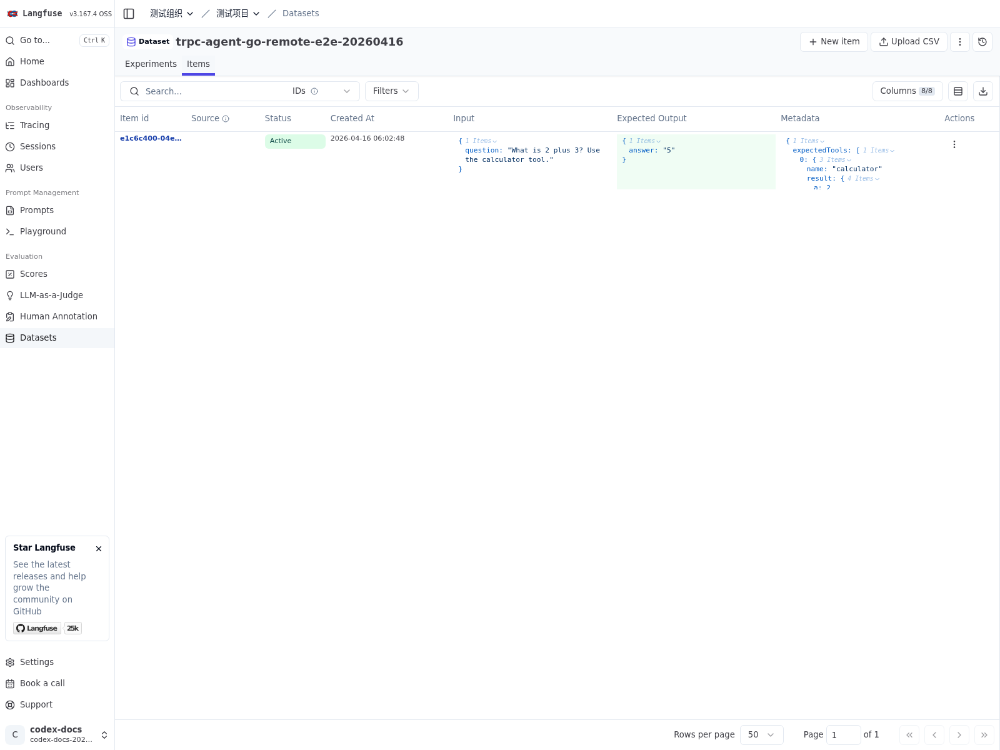
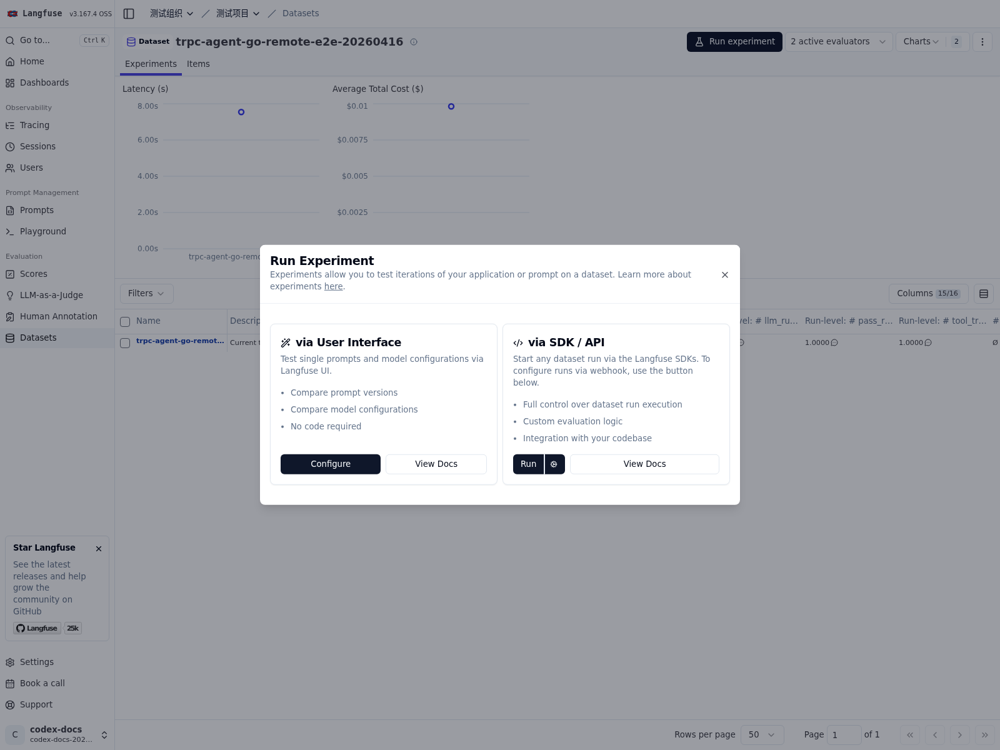
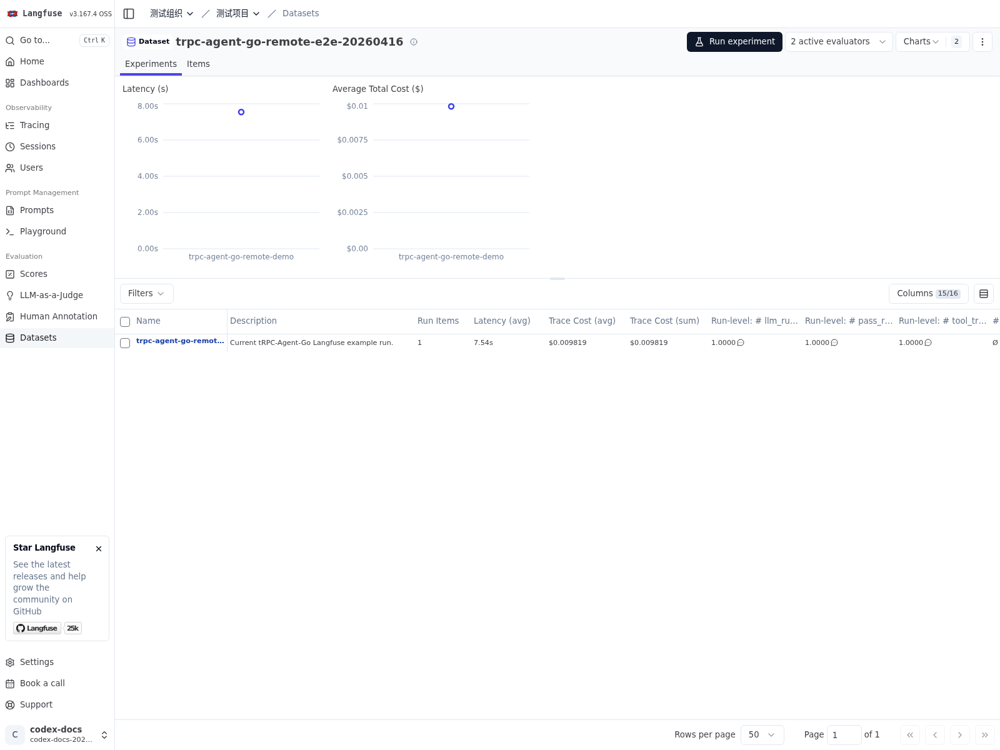

# 在线评估服务

当评估能力需要被前端页面、测试平台或其他后端服务远程调用时，可以在 `AgentEvaluator` 之上增加一层 HTTP API 接入。框架在 `server/evaluation` 中提供了这层服务封装，用于对外暴露评估集查询、评估执行与评估结果查询能力。完整示例见 [examples/evaluation/server](https://github.com/trpc-group/trpc-agent-go/tree/main/examples/evaluation/server)，接口描述见 [server/evaluation/openapi.yaml](https://github.com/trpc-group/trpc-agent-go/tree/main/server/evaluation/openapi.yaml)。

服务接入的核心代码片段如下：

```go
import (
	"trpc.group/trpc-go/trpc-agent-go/evaluation"
	"trpc.group/trpc-go/trpc-agent-go/evaluation/evalresult"
	evalresultlocal "trpc.group/trpc-go/trpc-agent-go/evaluation/evalresult/local"
	"trpc.group/trpc-go/trpc-agent-go/evaluation/evalset"
	evalsetlocal "trpc.group/trpc-go/trpc-agent-go/evaluation/evalset/local"
	"trpc.group/trpc-go/trpc-agent-go/evaluation/evaluator/registry"
	"trpc.group/trpc-go/trpc-agent-go/evaluation/metric"
	metriclocal "trpc.group/trpc-go/trpc-agent-go/evaluation/metric/local"
	"trpc.group/trpc-go/trpc-agent-go/runner"
	sevaluation "trpc.group/trpc-go/trpc-agent-go/server/evaluation"
)

agentRunner := runner.NewRunner(appName, agent)
defer agentRunner.Close()
evalSetManager := evalsetlocal.New(evalset.WithBaseDir(dataDir))
metricManager := metriclocal.New(metric.WithBaseDir(dataDir))
evalResultManager := evalresultlocal.New(evalresult.WithBaseDir(outputDir))
registry := registry.New()
agentEvaluator, err := evaluation.New(
	appName,
	agentRunner,
	evaluation.WithEvalSetManager(evalSetManager),
	evaluation.WithMetricManager(metricManager),
	evaluation.WithEvalResultManager(evalResultManager),
	evaluation.WithRegistry(registry),
)
if err != nil {
	log.Fatalf("create agent evaluator: %v", err)
}
defer agentEvaluator.Close()
server, err := sevaluation.New(
	sevaluation.WithAppName(appName),
	sevaluation.WithBasePath("/evaluation"),
	sevaluation.WithAgentEvaluator(agentEvaluator),
	sevaluation.WithEvalSetManager(evalSetManager),
	sevaluation.WithEvalResultManager(evalResultManager),
)
if err != nil {
	log.Fatalf("create evaluation server: %v", err)
}
if err := http.ListenAndServe(":8080", server.Handler()); err != nil {
	log.Fatalf("listen and serve: %v", err)
}
```

该服务默认提供三类资源：

- `sets`：查询评估集列表与单个评估集详情。
- `runs`：触发一次评估执行。
- `results`：查询评估结果列表与单个评估结果详情。

其中，`POST /evaluation/runs` 的成功响应返回 `AgentEvaluator.Evaluate` 的结果，位于 `evaluationResult` 字段中。对于需要页面联调、平台接入或 SDK 生成的场景，建议直接以 OpenAPI 描述作为接口契约。

## 基于 Langfuse Remote Experiment 评估

`server/evaluation/langfuse` 提供了 Langfuse Remote Experiment 接入层，用于接收 Langfuse 针对某个数据集发起的远程评估请求，在本地执行 Agent 推理与评估，并将结果回写到 Langfuse。

从使用方式上看，可以把这条链路理解为两部分协作。Langfuse 负责数据集管理、实验触发和结果展示；tRPC-Agent-Go 负责将数据项转换为评测用例、执行本地推理与评估，并将 trace、用例级分数和运行级聚合结果回写到 Langfuse。

因此，接入时需要先准备一套完整的本地评测运行时。通常包括以下几项能力。

- `AgentEvaluator`：负责执行推理和评估。
- `EvalSetManager`：负责管理数据集对应的 EvalSet。
- `MetricManager`：负责提供数据集对应的评估指标。
- `EvalResultManager`：负责保存评估结果。

在此基础上，再通过 `langfuse.Handler` 将 Langfuse 发起的远程评估请求接入到这套本地评测运行时中。

该接入方式沿用框架原生评测模型，整体映射关系如下。

- Langfuse 数据集对应一份 EvalSet。
- Langfuse 数据项对应一个 EvalCase。
- `dataset.ID` 直接作为 `evalSetID`。
- 默认情况下，一份数据集对应一套评估指标。

这意味着，Langfuse 侧主要提供样本组织和运行入口，真正的评测语义仍然由 tRPC-Agent-Go 维护。数据项如何映射为 `EvalCase`，由 `CaseBuilder` 决定；评估指标如何组织和加载，则由 `MetricManager` 负责。使用默认 local 实现时，metric 通常按 `dataset.ID` 组织；如果业务需要复用同一套指标，也可以通过自定义 manager 或 locator 调整映射关系。

### 代码

完整接入代码可参考 [examples/evaluation/langfuse](https://github.com/trpc-group/trpc-agent-go/tree/main/examples/evaluation/langfuse)。

下面的代码片段以 local managers 为例，展示如何将 `langfuse.Handler` 挂载到 `server/evaluation`。

```go
import (
	"trpc.group/trpc-go/trpc-agent-go/evaluation"
	"trpc.group/trpc-go/trpc-agent-go/evaluation/evalresult"
	evalresultlocal "trpc.group/trpc-go/trpc-agent-go/evaluation/evalresult/local"
	"trpc.group/trpc-go/trpc-agent-go/evaluation/evalset"
	evalsetlocal "trpc.group/trpc-go/trpc-agent-go/evaluation/evalset/local"
	"trpc.group/trpc-go/trpc-agent-go/evaluation/metric"
	metriclocal "trpc.group/trpc-go/trpc-agent-go/evaluation/metric/local"
	"trpc.group/trpc-go/trpc-agent-go/runner"
	sevaluation "trpc.group/trpc-go/trpc-agent-go/server/evaluation"
	langfuseeval "trpc.group/trpc-go/trpc-agent-go/server/evaluation/langfuse"
)

agentRunner := runner.NewRunner(appNameValue, newRemoteEvalAgent(*modelName, *streaming))
judgeRunner := runner.NewRunner(appNameValue+"-judge", newJudgeAgent(*modelName))
evalSetManager := evalsetlocal.New(evalset.WithBaseDir(*dataDir))
metricManager := metriclocal.New(metric.WithBaseDir(*dataDir))
evalResultManager := evalresultlocal.New(evalresult.WithBaseDir(*outputDir))

agentEvaluator, err := evaluation.New(
	appNameValue,
	agentRunner,
	evaluation.WithEvalSetManager(evalSetManager),
	evaluation.WithMetricManager(metricManager),
	evaluation.WithEvalResultManager(evalResultManager),
	evaluation.WithJudgeRunner(judgeRunner),
)
if err != nil {
	log.Fatalf("create agent evaluator: %v", err)
}

langfuseHandler, err := langfuseeval.New(
	appNameValue,
	agentEvaluator,
	evalSetManager,
	metricManager,
	evalResultManager,
	langfuseeval.WithCaseBuilder(buildCaseSpec),
)
if err != nil {
	log.Fatalf("create Langfuse handler: %v", err)
}

server, err := sevaluation.New(
	sevaluation.WithAppName(appNameValue),
	sevaluation.WithBasePath("/evaluation"),
	sevaluation.WithAgentEvaluator(agentEvaluator),
	sevaluation.WithEvalSetManager(evalSetManager),
	sevaluation.WithEvalResultManager(evalResultManager),
	sevaluation.WithRouteRegistrar(langfuseHandler),
)
if err != nil {
	log.Fatalf("create evaluation server: %v", err)
}
```

### 数据格式

Langfuse 允许用户在平台侧自行组织 dataset item 的内容结构，因此数据项中的 `input`、`expectedOutput`、`metadata` 并不要求遵循固定格式。对 tRPC-Agent-Go 而言，评估执行最终仍然需要落到明确的 `EvalCase` 结构上，因此需要通过 `CaseBuilder` 在两者之间建立一层转换逻辑。

接入时，可在 `CaseBuilder` 中完成用户问题、预期答案和工具轨迹的提取，并将平台侧的原始数据映射为本地评测运行时可直接消费的 `EvalCase`。这样既保留了 Langfuse 数据集定义的灵活性，也将业务数据格式和评测模型之间的边界显式地固定下来。

下面给出一个简单的 `question/answer` 示例，用于说明数据项如何映射到 `EvalCase`。

`input`：

```json
{
  "question": "What is 2 + 3? Use the calculator tool."
}
```

`expectedOutput`：

```json
{
  "answer": "5"
}
```

`metadata.expectedTools` 为可选字段，用于工具轨迹评估。

```json
{
  "expectedTools": [
    {
      "name": "calculator",
      "arguments": {
        "operation": "add",
        "a": 2,
        "b": 3
      },
      "result": {
        "operation": "add",
        "a": 2,
        "b": 3,
        "result": 5
      }
    }
  ]
}
```

如果业务数据格式不同，可以通过 `langfuseeval.WithCaseBuilder(...)` 自定义 `DatasetItem` 到 `EvalCase` 的转换逻辑。

对应的 `CaseBuilder` 可以写成如下形式。

```go
func buildCaseSpec(_ context.Context, item *langfuseeval.DatasetItem) (*langfuseeval.CaseSpec, error) {
	question, err := requiredStringField(item.Input, "input", "question")
	if err != nil {
		return nil, err
	}
	answer, err := requiredStringField(item.ExpectedOutput, "expectedOutput", "answer")
	if err != nil {
		return nil, err
	}
	expectedTools, err := expectedToolsFromMetadata(item.Metadata)
	if err != nil {
		return nil, err
	}
	return &langfuseeval.CaseSpec{
		DatasetItemID: item.ID,
		TraceInput:    item.Input,
		EvalCase: &evalset.EvalCase{
			EvalID: item.ID,
			Conversation: []*evalset.Invocation{
				{
					UserContent: &model.Message{
						Role:    model.RoleUser,
						Content: question,
					},
					FinalResponse: &model.Message{
						Role:    model.RoleAssistant,
						Content: answer,
					},
					Tools: expectedTools,
				},
			},
		},
	}, nil
}
```

这段转换逻辑的含义是：

- 读取 `input.question`，作为 `UserContent`。
- 读取 `expectedOutput.answer`，作为预期 `FinalResponse`。
- 读取 `metadata.expectedTools`，作为预期工具轨迹。
- 使用 `item.ID` 作为 `DatasetItemID` 和 `EvalID`，保证平台数据与本地评测结果可以一一对应。



### 评估指标 Metric 文件

评估指标继续按照框架原生方式管理。使用默认 local MetricManager 时，由于这里直接使用 `dataset.ID` 作为 `evalSetID`，metric 文件通常也按 `dataset.ID` 命名，目录结构如下。

```bash
data/
  langfuse-remote-eval-app/
    <dataset-id>.metrics.json
```

按照上述默认组织方式时，目标数据集需要准备对应的 metric 文件，远程评估才能得到有效结果。

如果希望多个数据集复用同一套评估指标，可以通过自定义 `Locator` 调整 metric 文件的定位方式。例如，将所有数据集统一映射到同一个 `shared.metrics.json` 文件。

```go
import (
	"path/filepath"

	"trpc.group/trpc-go/trpc-agent-go/evaluation/metric"
	metriclocal "trpc.group/trpc-go/trpc-agent-go/evaluation/metric/local"
)

type sharedMetricLocator struct{}

func (l *sharedMetricLocator) Build(baseDir, appName, evalSetID string) string {
	return filepath.Join(baseDir, appName, "shared.metrics.json")
}

metricManager := metriclocal.New(
	metric.WithBaseDir(dataDir),
	metric.WithLocator(&sharedMetricLocator{}),
)
```

在这种方式下，不同数据集会共享同一份指标配置文件，适合评测目标一致、仅样本内容不同的场景。

### 运行方式

当本地评测运行时已经准备完成后，Langfuse Remote Experiment 的接入过程就比较直接：启动评估服务，在 Langfuse 中配置远程评估地址，然后由 Langfuse 发起一次远程评估。

Langfuse 连接信息可以通过 `WithBaseURL(...)`、`WithPublicKey(...)`、`WithSecretKey(...)` 显式传入，也可以通过环境变量提供：

- `LANGFUSE_BASE_URL`：Langfuse 地址，例如 `http://127.0.0.1:3000`。
- `LANGFUSE_PUBLIC_KEY`：Langfuse public key。
- `LANGFUSE_SECRET_KEY`：Langfuse secret key。

如果使用官方示例，还需要为示例中的被测 Agent 和 Judge Runner 准备模型配置。下面给出的环境变量和启动命令，即对应官方示例的最小可运行方式。

- `LANGFUSE_HOST`：Langfuse 地址，填写 `host:port` 形式，例如 `127.0.0.1:3000`。
- `LANGFUSE_INSECURE`：本地明文 HTTP 场景下设为 `true`。
- `OPENAI_BASE_URL`：兼容 OpenAI API 的模型服务地址。
- `OPENAI_API_KEY`：被测 Agent 与 Judge Runner 使用的模型密钥。

```bash
cd trpc-agent-go/examples/evaluation/langfuse
export LANGFUSE_HOST="127.0.0.1:3000"
export LANGFUSE_INSECURE="true"
export LANGFUSE_PUBLIC_KEY="pk-lf-xxx"
export LANGFUSE_SECRET_KEY="sk-lf-xxx"
export OPENAI_API_KEY="sk-xxx"
go run . -addr :8088
```

以上命令启动的是官方示例，对应的 webhook 地址如下。

```text
http://127.0.0.1:8088/evaluation/langfuse/remote-experiment
```

Langfuse Web 页面当前接受 `80` 或 `443` 端口的远程评估地址。服务监听 `8088` 时，通常需要通过反向代理、端口映射或网关对外暴露到 `80/443`。如果使用的不是官方示例，而是自行搭建的评估服务，也同样适用这条约束。



### 结果查看

远程评估完成后，Langfuse 中会同时呈现本地评测运行的不同层次结果。

- 每个数据项对应一条 trace。
- trace 下的用例级分数，例如 `tool_trajectory_avg_score`、`llm_rubric_response`。
- 数据集运行级聚合分数，例如 `pass_rate` 与各评估指标的均值。

评估结果的保存方式取决于 `EvalResultManager` 的实现。使用 local 实现时，结果会写入本地目录，便于离线排查与回归比对。


