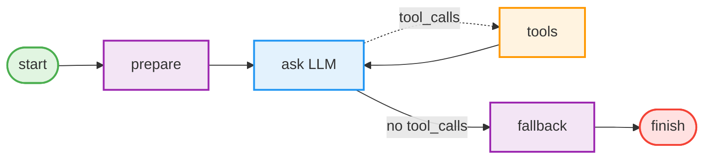
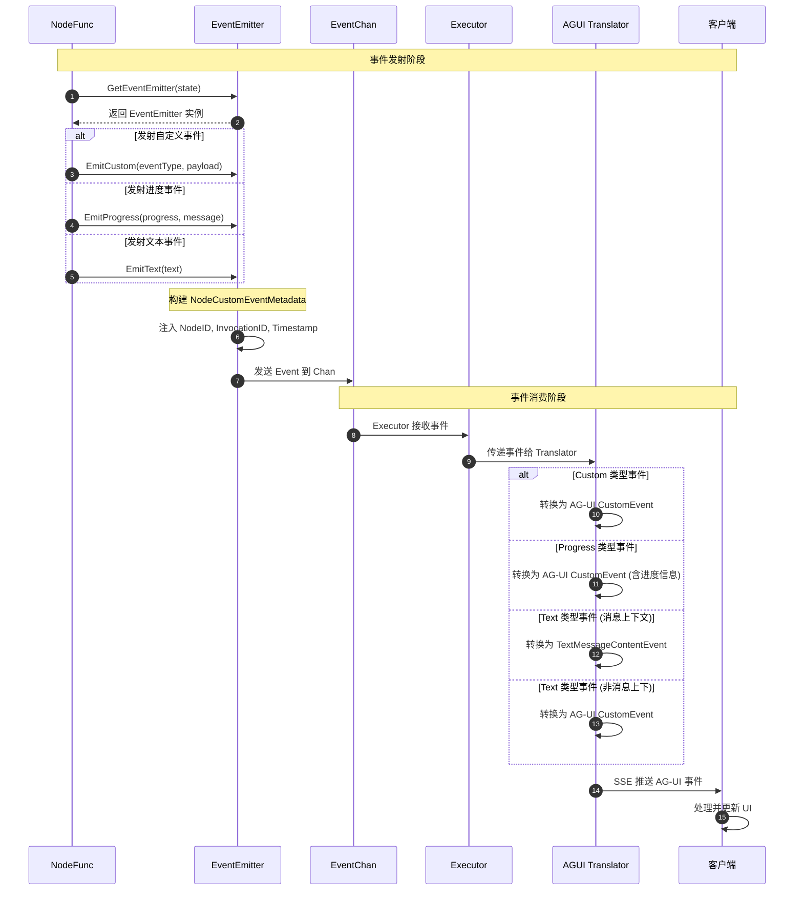
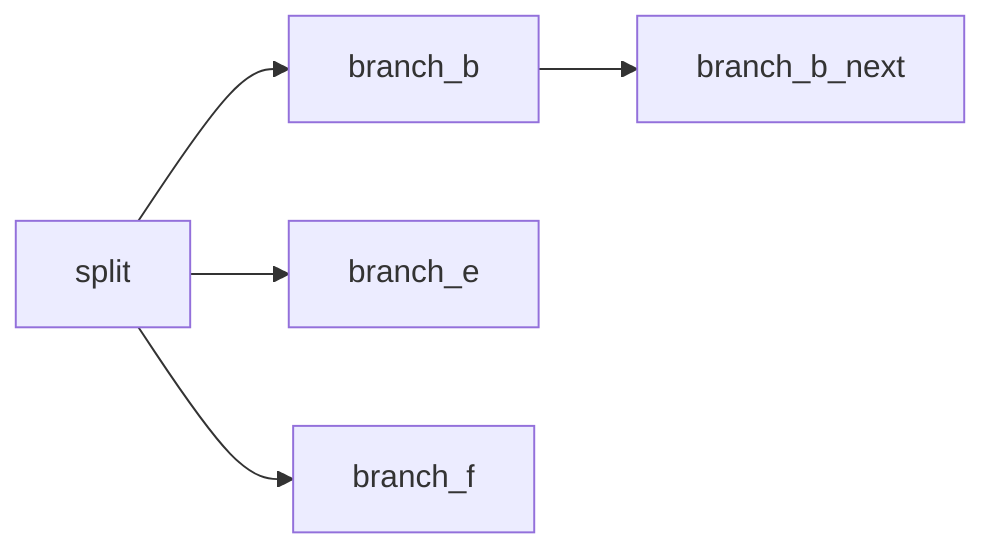
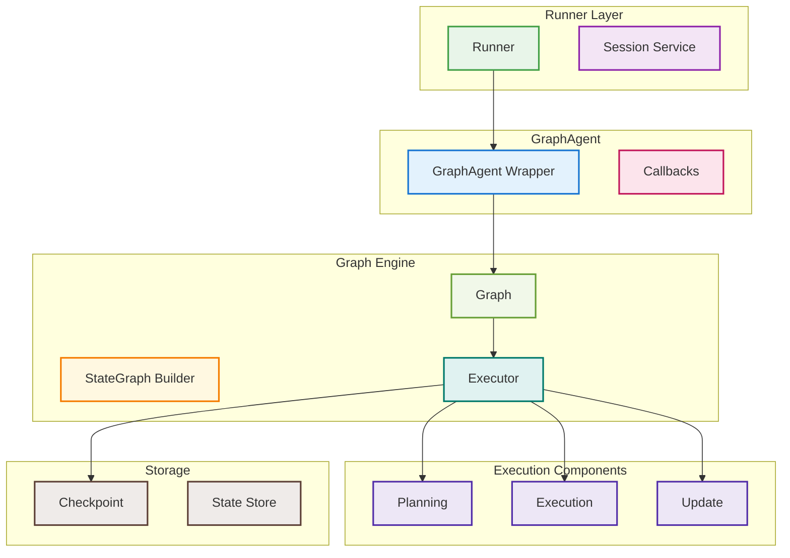
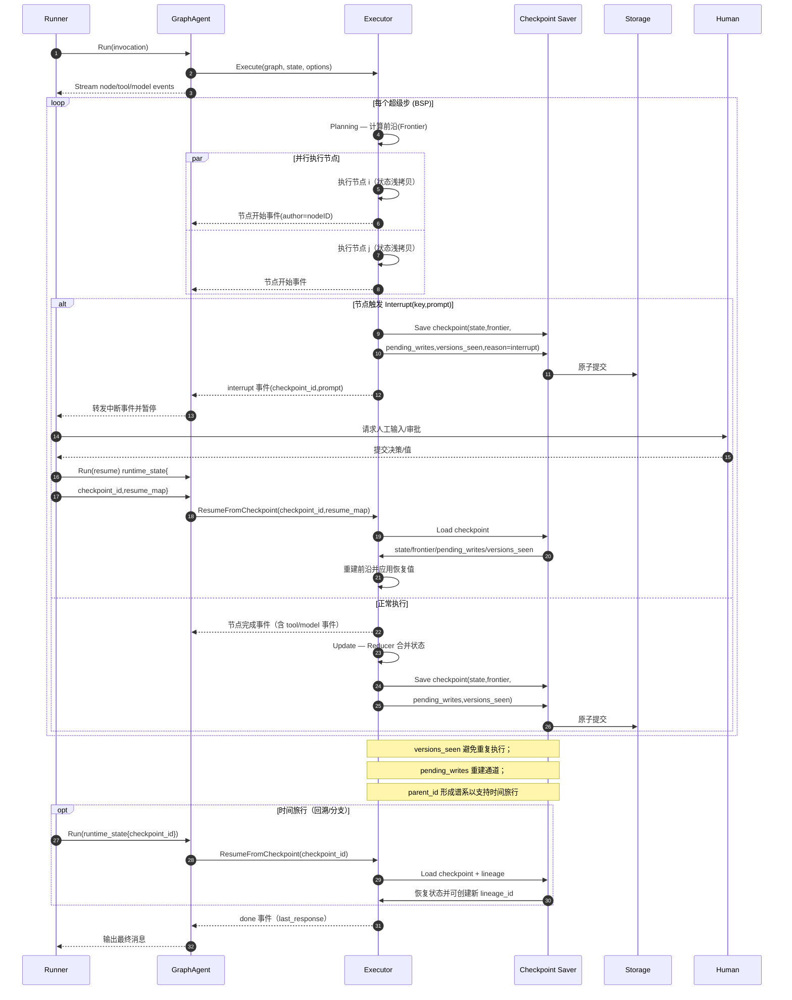
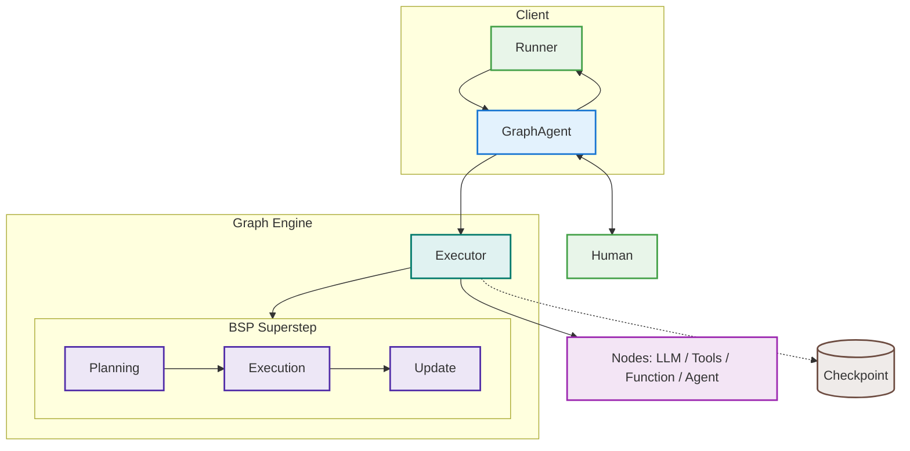
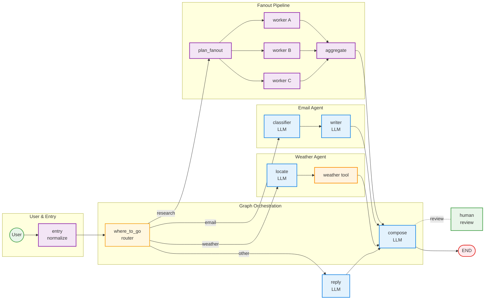
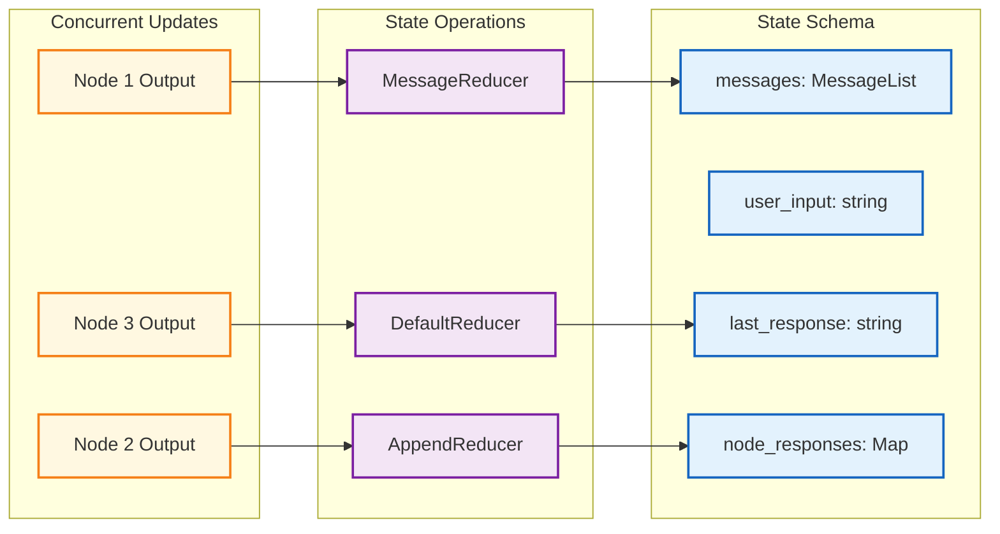

# Graph 包使用指南

## 概述

Graph 将可控的工作流编排与可扩展的 Agent 能力结合，适用于：

- 类型安全的状态管理与可预测路由；
- LLM 决策、工具调用循环、可选的 Human in the Loop（HITL）；
- 可复用的组件，既可独立运行，也可作为子 Agent 组合。

特点：

- Schema 驱动的 State 与 Reducer，避免并发分支写入同一字段时的数据竞争；
- BSP 风格（计划/执行/合并）的确定性并行；
- 内置节点类型封装 LLM、工具与 Agent，减少重复代码；
- 流式事件、检查点与中断，便于观测与恢复。
- 节点级重试/退避（指数退避与抖动），支持执行器默认重试策略与带重试元数据的事件观测。
- 节点主动外抛事件（EventEmitter），支持在 NodeFunc 中发射自定义事件、进度更新和流式文本。

## 快速开始

### 最小工作流

下面是一个经典的“prepare → ask LLM → 可能调用工具”的循环，使用 `graph.MessagesStateSchema()`（已定义 `graph.StateKeyMessages`、`graph.StateKeyUserInput`、`graph.StateKeyLastResponse` 等键）。



Graph 包允许您将复杂的 AI 工作流建模为有向图，其中节点代表处理步骤，边代表数据流和控制流。它特别适合构建需要条件路由、状态管理和多步骤处理的 AI 应用。

### 使用模式

Graph 包的使用遵循以下模式：

1. **创建 Graph**：使用 `StateGraph` 构建器定义工作流结构
2. **创建 GraphAgent**：将编译后的 Graph 包装为 Agent
3. **创建 Runner**：使用 Runner 管理会话和执行环境
4. **执行工作流**：通过 Runner 执行工作流并处理结果

这种模式提供了：

- **类型安全**：通过状态模式确保数据一致性
- **会话管理**：支持多用户、多会话的并发执行
- **事件流**：实时监控工作流执行进度
- **错误处理**：统一的错误处理和恢复机制

### Agent 集成

GraphAgent 实现了 `agent.Agent` 接口，可以：

- **作为独立 Agent**：通过 Runner 直接执行
- **作为 SubAgent**：被其他 Agent（如 LLMAgent）作为子 Agent 使用
- **挂载 SubAgent**：通过 `graphagent.WithSubAgents` 配置子 Agent，并在图中使用 `AddAgentNode` 委托执行

这种设计使得 GraphAgent 既能接入其他 Agent，也能在自身工作流中灵活调度子 Agent。

### 主要特性

- **类型安全的状态管理**：使用 Schema 定义状态结构，支持自定义 Reducer
- **条件路由**：基于状态动态选择执行路径
- **LLM 节点集成**：内置对大型语言模型的支持
- **工具节点**：支持函数调用和外部工具集成
- **Agent 节点**：通过子 Agent 将其他 Agent 融入图中
- **流式执行**：支持实时事件流和进度跟踪
- **并发安全**：线程安全的图执行
- **基于检查点的时间旅行**：浏览执行历史并恢复之前的状态
- **人机协作 (HITL)**：支持带有中断和恢复功能的交互式工作流
- **原子检查点**：原子存储检查点和待写入数据，确保可靠的恢复
- **检查点谱系**：跟踪形成执行线程的相关检查点及其父子关系

## 核心概念

### 1. 图 (Graph)

图是工作流的核心结构，由节点和边组成：

```go
import (
    "trpc.group/trpc-go/trpc-agent-go/graph"
)

// 创建状态模式
schema := graph.NewStateSchema()

// 创建图
graph := graph.New(schema)
```

**虚拟节点**：

- `Start`：虚拟起始节点，通过 `SetEntryPoint()` 自动连接
- `End`：虚拟结束节点，通过 `SetFinishPoint()` 自动连接
- 这些节点不需要显式创建，系统会自动处理连接

### 2. 节点 (Node)

节点代表工作流中的一个处理步骤：

```go
import (
    "context"

    "trpc.group/trpc-go/trpc-agent-go/graph"
)

// 节点函数签名
type NodeFunc func(ctx context.Context, state graph.State) (any, error)

// 创建节点
node := &graph.Node{
    ID:          "process_data",
    Name:        "数据处理",
    Description: "处理输入数据",
    Function:    processDataFunc,
}
```

### 3. 状态 (State)

状态是在节点间传递的数据容器：

```go
import (
    "trpc.group/trpc-go/trpc-agent-go/graph"
)

// 状态是一个键值对映射
type State map[string]any

// 用户自定义的状态键
const (
    StateKeyInput         = "input"          // 输入数据
    StateKeyResult        = "result"         // 处理结果
    StateKeyProcessedData = "processed_data" // 处理后的数据
    StateKeyStatus        = "status"         // 处理状态
)
```

**内置状态键**：

Graph 包提供了一些内置状态键，主要用于系统内部通信：

**用户可访问的内置键**：

- `StateKeyUserInput`：用户输入（一次性，消费后清空，由 LLM 节点自动持久化）
- `StateKeyOneShotMessages`：一次性消息（完整覆盖本轮输入，消费后清空）
- `StateKeyLastResponse`：最后响应（用于设置最终输出，Executor 会读取此值作为结果）
- `StateKeyLastToolResponse`：最近一次工具输出（JSON 字符串，由 Tools 节点写入）
- `StateKeyLastResponseID`：最近一次响应标识符（identifier，ID）（由 LLM 节点写入；当
  `StateKeyLastResponse` 由非模型节点写入时可能为空）
- `StateKeyMessages`：消息历史（持久化，支持 append + MessageOp 补丁操作）
- `StateKeyNodeResponses`：按节点存储的输出映射。键为节点 ID，值为该
  节点的最终输出。对 LLM / Agent 节点而言是最终文本响应；对 Tools 节
  点而言是工具输出的 JSON 数组字符串（每项包含 `tool_id`、`tool_name`
  和 `output`）。
- `StateKeyMetadata`：元数据（用户可用的通用元数据存储）

**系统内部键**（用户不应直接使用）：

- `StateKeySession`：会话信息（由 GraphAgent 自动设置）
- `StateKeyExecContext`：执行上下文（由 Executor 自动设置）
- `StateKeyToolCallbacks`：工具回调（由 Executor 自动设置）
- `StateKeyModelCallbacks`：模型回调（由 Executor 自动设置）

用户应该使用自定义状态键来存储业务数据，只在必要时使用用户可访问的内置状态键。

### 4. 状态模式 (StateSchema)

状态模式定义状态的结构和行为：

```go
import (
    "reflect"

    "trpc.group/trpc-go/trpc-agent-go/graph"
)

// 创建状态模式
schema := graph.NewStateSchema()

// 添加字段定义
schema.AddField("counter", graph.StateField{
    Type:    reflect.TypeOf(0),
    Reducer: graph.DefaultReducer,
    Default: func() any { return 0 },
})
```

## 使用指南

### 节点 I/O 约定

节点之间仅通过共享状态 State 传递数据。每个节点返回一个 state delta，按 Schema 的 Reducer 合并到全局 State，下游节点从 State 读取上游产出。

- 常用内置键（对用户可见）

  - `user_input`：一次性用户输入，被下一个 LLM/Agent 节点消费后清空
  - `one_shot_messages`：一次性完整消息覆盖，用于下一次 LLM 调用，执行后清空
  - `one_shot_messages_by_node`：按节点 ID 定向的一次性消息覆盖
    （map[nodeID][]Message）。消费后只清空对应节点的 entry。
  - `messages`：持久化的消息历史（LLM/Tools 会追加），支持 MessageOp 补丁
  - `last_response`：最近一次助手文本回复
  - `last_response_id`：生成 `last_response` 的最近一次模型响应标识符（identifier，
    ID）。当 `last_response` 由非模型节点写入时，该值可能为空。
  - `node_responses`：map[nodeID]any，按节点保存最终文本回复。最近结果用 `last_response`

- 函数节点（Function node）

  - 输入：完整 State
  - 输出：返回 `graph.State` 增量，写入自定义键（需在 Schema 中声明），如 `{"parsed_time":"..."}`

- LLM 节点

  - 输入优先级：`one_shot_messages_by_node[<node_id>]` →
    `one_shot_messages` → `user_input` → `messages`
  - 输出：
    - 向 `messages` 追加助手消息
    - 设置 `last_response`
    - 设置 `last_response_id`
    - 设置 `node_responses[<llm_node_id>]`

- Tools 节点

  - 输入：从 `messages` 中寻找最新的带 `tool_calls` 的助手消息
  - 输出：向 `messages` 追加工具返回消息

- Agent 节点（子代理）
  - 输入：Graph 的 State 通过 `Invocation.RunOptions.RuntimeState` 传入子代理
    - 子代理的 Model/Tool 回调可通过 `agent.InvocationFromContext(ctx)` 访问
  - 结束输出：
    - 设置 `last_response`
    - 设置 `node_responses[<agent_node_id>]`
    - 清空 `user_input`

推荐用法

- 在 Schema 中声明业务字段（如 `parsed_time`、`final_payload`），函数节点写入/读取。
- 需要给 LLM 节点注入结构化提示时，可在前置节点写入 `one_shot_messages`
  （例如加入包含解析信息的 system message）。
- 并行分支：如果多个分支需要为不同的 LLM 节点准备不同的一次性输入，
  不要同时写 `one_shot_messages`，优先使用 `one_shot_messages_by_node`。
- 需要消费上游文本结果时：紧邻下游读取 `last_response`，或在任意后续节点读取
  `node_responses[节点ID]`。
- 如果下游是 Agent 节点，并希望它把上游输出当作自己的输入消息，需要显式把目标值写回
  `user_input`（例如使用 `WithSubgraphInputFromLastResponse()` 或前置回调）。

按节点 ID 定向的一次性消息覆盖示例：

```go
import (
    "context"

    "trpc.group/trpc-go/trpc-agent-go/graph"
    "trpc.group/trpc-go/trpc-agent-go/model"
)

const (
    llm1NodeID = "llm1"
    llm2NodeID = "llm2"
)

func prepForLLM1(ctx context.Context, state graph.State) (any, error) {
    msgs := []model.Message{
        model.NewUserMessage("question for llm1"),
    }
    return graph.SetOneShotMessagesForNode(llm1NodeID, msgs), nil
}

func prepForLLM2(ctx context.Context, state graph.State) (any, error) {
    msgs := []model.Message{
        model.NewUserMessage("question for llm2"),
    }
    return graph.SetOneShotMessagesForNode(llm2NodeID, msgs), nil
}
```

在单个上游节点里同时为多个下游节点准备 one-shot：

在 Go 里，`map` 对同一个 key 的赋值会覆盖旧值。由于
`SetOneShotMessagesForNode(...)` 每次都会写入同一个顶层 key
（`one_shot_messages_by_node`），因此不要在一个函数里多次调用它，然后再用
`result[k] = v` 这种方式去“合并”多个 `graph.State`（最后一次写入会覆盖前面的）。

推荐做法是：先构造一个 `map[nodeID][]model.Message`，一次性写入：

```go
func preprocess(ctx context.Context, state graph.State) (any, error) {
    byNode := map[string][]model.Message{
        llm1NodeID: {
            model.NewSystemMessage("You are llm1."),
            model.NewUserMessage("question for llm1"),
        },
        llm2NodeID: {
            model.NewSystemMessage("You are llm2."),
            model.NewUserMessage("question for llm2"),
        },
    }
    return graph.SetOneShotMessagesByNode(byNode), nil
}
```

另一种写法（不使用辅助函数）：直接返回 State delta map（当你在同一个节点里
还要同时更新其它键时很方便）：

```go
func preprocess(ctx context.Context, state graph.State) (any, error) {
    // byNode := ...
    return graph.State{
        graph.StateKeyOneShotMessagesByNode: byNode,
    }, nil
}
```

注意：

- `llm1NodeID` / `llm2NodeID` 必须与 `AddLLMNode` 里传入的节点 ID 一致。
- 每个 LLM 节点只会消费一次 `one_shot_messages_by_node[自己的ID]`，
  并且只清理自己的 entry。

示例：

- `examples/graph/io_conventions`：函数 + LLM + Agent 的 I/O 演示
- `examples/graph/io_conventions_tools`：加入 Tools 节点，展示如何获取工具 JSON 并落入 State
- `examples/graph/oneshot_by_node`：按 LLM 节点 ID 定向的一次性输入
- `examples/graph/oneshot_by_node_preprocess`：在单个上游节点里为多个 LLM 节点准备 OneShot
- `examples/graph/retry`：节点级重试/退避演示

#### 状态键常量与来源（可直接引用）

- 导入包：`import "trpc.group/trpc-go/trpc-agent-go/graph"`
- 常量定义位置：`graph/state.go`

- 用户可见、常用键

  - `user_input` → 常量 `graph.StateKeyUserInput`
  - `one_shot_messages` → 常量 `graph.StateKeyOneShotMessages`
  - `one_shot_messages_by_node` → 常量 `graph.StateKeyOneShotMessagesByNode`
  - `messages` → 常量 `graph.StateKeyMessages`
  - `last_response` → 常量 `graph.StateKeyLastResponse`
  - `last_response_id` → 常量 `graph.StateKeyLastResponseID`
  - `node_responses` → 常量 `graph.StateKeyNodeResponses`

- OneShot 辅助函数

  - `SetOneShotMessagesForNode(nodeID, msgs)`：设置单个节点的 OneShot
  - `SetOneShotMessagesByNode(byNode)`：一次性设置多个节点的 OneShot
  - `ClearOneShotMessagesForNode(nodeID)`：清理单个节点 entry
  - `ClearOneShotMessagesByNode()`：清理整个 map
  - `GetOneShotMessagesForNode(state, nodeID)`：读取单个节点 entry

- 其他常用键
  - `session` → `graph.StateKeySession`
  - `metadata` → `graph.StateKeyMetadata`
  - `current_node_id` → `graph.StateKeyCurrentNodeID`
  - `exec_context` → `graph.StateKeyExecContext`
  - `tool_callbacks` → `graph.StateKeyToolCallbacks`
  - `model_callbacks` → `graph.StateKeyModelCallbacks`
  - `agent_callbacks` → `graph.StateKeyAgentCallbacks`
  - `parent_agent` → `graph.StateKeyParentAgent`

使用示例：

```go
import (
    "context"
    "trpc.group/trpc-go/trpc-agent-go/graph"
)

func myNode(ctx context.Context, state graph.State) (any, error) {
    // 读取上一节点文本输出
    last, _ := state[graph.StateKeyLastResponse].(string)
    // 写入自定义字段
    return graph.State{"my_key": last}, nil
}
```

#### 事件元数据键（StateDelta）

- 导入包：`import "trpc.group/trpc-go/trpc-agent-go/graph"`
- 常量定义位置：`graph/events.go`

- 模型元数据：`_model_metadata` → `graph.MetadataKeyModel`（结构体 `graph.ModelExecutionMetadata`）
- 工具元数据：`_tool_metadata` → `graph.MetadataKeyTool`（结构体 `graph.ToolExecutionMetadata`）
- 节点元数据：`_node_metadata` → `graph.MetadataKeyNode`（结构体 `graph.NodeExecutionMetadata`）。包含重试字段：`Attempt`、`MaxAttempts`、`NextDelay`、`Retrying` 及时间相关信息。

使用示例：

```go
if b, ok := event.StateDelta[graph.MetadataKeyModel]; ok {
    var md graph.ModelExecutionMetadata
    _ = json.Unmarshal(b, &md)
}
```

#### 节点主动外抛事件（EventEmitter）

在 NodeFunc 执行过程中，节点可以通过 `EventEmitter` 主动向外部发射自定义事件，用于实时传递进度、中间结果或自定义业务数据。

**获取 EventEmitter**

```go
func myNode(ctx context.Context, state graph.State) (any, error) {
    // 从 State 中获取 EventEmitter
    emitter := graph.GetEventEmitterWithContext(ctx, state)
    // 或直接调用 emitter := graph.GetEventEmitter(state)
    return state, nil
}
```

**EventEmitter 接口**

```go
type EventEmitter interface {
    // Emit 发射任意事件
    Emit(evt *event.Event) error
    // EmitCustom 发射自定义事件
    EmitCustom(eventType string, payload any) error
    // EmitProgress 发射进度事件（progress: 0-100）
    EmitProgress(progress float64, message string) error
    // EmitText 发射流式文本事件
    EmitText(text string) error
    // Context 返回关联的 context
    Context() context.Context
}
```

**使用示例**

```go
func dataProcessNode(ctx context.Context, state graph.State) (any, error) {
    emitter := graph.GetEventEmitter(state)
    
    // 1. 发射自定义事件
    emitter.EmitCustom("data.loaded", map[string]any{
        "recordCount": 1000,
        "source":      "database",
    })
    
    // 2. 发射进度事件
    total := 100
    for i := 0; i < total; i++ {
        processItem(i)
        progress := float64(i+1) / float64(total) * 100
        emitter.EmitProgress(progress, fmt.Sprintf("Processing %d/%d", i+1, total))
    }
    
    // 3. 发射流式文本
    emitter.EmitText("Processing complete.\n")
    emitter.EmitText("Results: 100 items processed successfully.")
    
    return state, nil
}
```

**事件流转流程**



**AGUI 事件转换**

当使用 AGUI Server 时，节点发射的事件会自动转换为 AG-UI 协议事件：

| 节点事件类型 | AG-UI 事件类型 | 说明 |
|-------------|--------------|------|
| Custom | CustomEvent | 自定义事件，payload 在 `value` 字段 |
| Progress | CustomEvent | 进度事件，包含 `progress` 和 `message` |
| Text（消息上下文中）| TextMessageContentEvent | 流式文本追加到当前消息 |
| Text（非消息上下文）| CustomEvent | 包含 `nodeId` 和 `content` 字段 |

**注意事项**

- **线程安全**：EventEmitter 是线程安全的，可在并发环境中使用
- **优雅降级**：若 State 中无有效的 ExecutionContext 或 EventChan，`GetEventEmitter` 返回 no-op emitter，所有操作静默成功
- **错误处理**：业务实践中建议事件发射失败不要中断节点执行，仅记录警告日志，忽略异常
- **自定义事件元数据**：`_node_custom_metadata` → `graph.MetadataKeyNodeCustom`（结构体 `graph.NodeCustomEventMetadata`）

### 1. 创建 GraphAgent 和 Runner

用户主要通过创建 GraphAgent 然后通过 Runner 来使用 Graph 包。这是推荐的使用模式：

```go
package main

import (
    "context"
    "fmt"
    "time"

    "trpc.group/trpc-go/trpc-agent-go/agent/graphagent"
    "trpc.group/trpc-go/trpc-agent-go/graph"
    "trpc.group/trpc-go/trpc-agent-go/model"
    "trpc.group/trpc-go/trpc-agent-go/runner"
    "trpc.group/trpc-go/trpc-agent-go/session/inmemory"
)

func main() {
    // 1. 创建状态模式
    schema := graph.MessagesStateSchema()

    // 2. 创建状态图构建器
    stateGraph := graph.NewStateGraph(schema)

    // 3. 添加节点
    stateGraph.AddNode("start", startNodeFunc).
        AddNode("process", processNodeFunc)

    // 4. 设置边
    stateGraph.AddEdge("start", "process")

    // 5. 设置入口点和结束点
    // SetEntryPoint 会自动创建虚拟 Start 节点到 "start" 节点的边
    // SetFinishPoint 会自动创建 "process" 节点到虚拟 End 节点的边
    stateGraph.SetEntryPoint("start").
        SetFinishPoint("process")

    // 6. 编译图
    compiledGraph, err := stateGraph.Compile()
    if err != nil {
        panic(err)
    }

    // 7. 创建 GraphAgent
    graphAgent, err := graphagent.New("simple-workflow", compiledGraph,
        graphagent.WithDescription("简单的工作流示例"),
        graphagent.WithInitialState(graph.State{}),
        // 设置传给模型的消息过滤模式，最终传给模型的消息需同时满足WithMessageTimelineFilterMode与WithMessageBranchFilterMode条件
        // 时间维度过滤条件
        // 默认值: graphagent.TimelineFilterAll
        // 可选值:
        //  - graphagent.TimelineFilterAll: 包含历史消息以及当前请求中所生成的消息
        //  - graphagent.TimelineFilterCurrentRequest: 仅包含当前请求中所生成的消息
        //  - graphagent.TimelineFilterCurrentInvocation: 仅包含当前invocation上下文中生成的消息
        graphagent.WithMessageTimelineFilterMode(graphagent.TimelineFilterAll),
        // 分支维度过滤条件
        // 默认值: graphagent.BranchFilterModePrefix
        // 可选值:
        //  - graphagent.BranchFilterModeAll: 包含所有agent的消息, 当前agent与模型交互时,如需将所有agent生成的有效内容消息同步给模型时可设置该值
        //  - graphagent.BranchFilterModePrefix: 通过Event.FilterKey与Invocation.eventFilterKey做前缀匹配过滤消息, 期望将与当前agent以及相关上下游agent生成的消息传递给模型时，可设置该值
        //  - graphagent.BranchFilterModeExact: 通过Event.FilterKey==Invocation.eventFilterKey过滤消息，当前agent与模型交互时,仅需使用当前agent生成的消息时可设置该值
        graphagent.WithMessageBranchFilterMode(graphagent.BranchFilterModeAll),
    )
    if err != nil {
        panic(err)
    }

    // 8. 创建会话服务
    sessionService := inmemory.NewSessionService()

    // 9. 创建 Runner
    appRunner := runner.NewRunner(
        "simple-app",
        graphAgent,
        runner.WithSessionService(sessionService),
    )

    // 10. 执行工作流
    ctx := context.Background()
    userID := "user"
    sessionID := fmt.Sprintf("session-%d", time.Now().Unix())

    // 创建用户消息（Runner 会自动将消息内容放入 StateKeyUserInput）
    message := model.NewUserMessage("Hello World")

    // 通过 Runner 执行
    eventChan, err := appRunner.Run(ctx, userID, sessionID, message)
    if err != nil {
        panic(err)
    }

    // 处理事件流
    for event := range eventChan {
        if event.Error != nil {
            fmt.Printf("错误: %s\n", event.Error.Message)
            continue
        }

        if len(event.Response.Choices) > 0 {
            choice := event.Response.Choices[0]
            if choice.Delta.Content != "" {
                fmt.Print(choice.Delta.Content)
            }
        }

        // 推荐：使用 Runner 完成事件作为“流程结束”的信号。
        if event.IsRunnerCompletion() {
            break
        }
    }
}

const (
    stateKeyProcessedData = "processed_data"
    stateKeyResult        = "result"
)

// 起始节点函数实现
func startNodeFunc(ctx context.Context, state graph.State) (any, error) {
    // 从内置的 StateKeyUserInput 获取用户输入（由 Runner 自动设置）
    input := state[graph.StateKeyUserInput].(string)
    return graph.State{
        stateKeyProcessedData: fmt.Sprintf("处理后的: %s", input),
    }, nil
}

// 处理节点函数实现
func processNodeFunc(ctx context.Context, state graph.State) (any, error) {
    processed := state[stateKeyProcessedData].(string)
    result := fmt.Sprintf("结果: %s", processed)
    return graph.State{
        stateKeyResult:             result,
        graph.StateKeyLastResponse: fmt.Sprintf("最终结果: %s", result),
    }, nil
}

```

### 2. 使用 LLM 节点

LLM 节点实现了固定的三段式输入规则，无需配置（可选：覆盖输入 key）：

1. **OneShot 优先**：
   - 若存在 `one_shot_messages_by_node[<node_id>]`，以它为本轮输入。
   - 否则若存在 `one_shot_messages`，以它为本轮输入。
2. **UserInput 其次**：否则若存在节点的用户输入 key，自动持久化一次
   （默认 key：`user_input`）。
3. **历史默认**：否则以持久化历史作为输入。

```go
// 创建 LLM 模型
model := openai.New("gpt-4")

// 添加 LLM 节点
stateGraph.AddLLMNode("analyze", model,
    `你是一个文档分析专家。分析提供的文档并：
1. 分类文档类型和复杂度
2. 提取关键主题
3. 评估内容质量
请提供结构化的分析结果。`,
    nil) // 工具映射
```

**重要说明**：

- SystemPrompt 仅用于本次输入，不落持久化状态。
- 一次性键（`user_input`/`one_shot_messages`/`one_shot_messages_by_node`）
  在成功执行后自动清空。
- 你可以为单个 LLM/Agent 节点覆盖用户输入 key：
  `graph.WithUserInputKey("my_input")`。该 key 会被视为一次性输入，并在
  节点运行后清空。
- 并行分支：如果需要为不同的 LLM 节点准备不同的一次性输入，优先写
  `one_shot_messages_by_node`，避免多个分支同时写 `one_shot_messages`
  互相覆盖/清空。若由单个上游节点同时为多个 LLM 节点准备输入，推荐使用
  `graph.SetOneShotMessagesByNode(...)` 一次性写入所有 entry。
- 所有状态更新都是原子性的，确保一致性。
- GraphAgent/Runner 仅设置 `user_input`，不再预先把用户消息写入
  `messages`。这样可以允许在 LLM 节点之前的任意节点对 `user_input`
  进行修改，并能在同一轮生效。
- Graph 在执行子 Agent 时会保留父调用的 `RequestID`（请求标识），
  确保当会话历史里已包含本轮用户输入时，不会在提示词中重复插入。

#### 事件输出（流式分片 vs 最终消息）

当大语言模型（Large Language Model，LLM）以流式模式被调用时，一次模型调用可能会产生
多条事件：

- 流式分片：增量文本在 `choice.Delta.Content`
- 最终消息：完整文本在 `choice.Message.Content`

在图式流程里，还存在两层“完成（done）”的含义：

- 模型完成：某一次模型调用结束（通常 `Response.Done=true`）
- 流程完成：整个图运行结束（请以 `event.IsRunnerCompletion()` 为准）

默认情况下，Graph 的 LLM 节点只输出流式分片事件，不输出最终 `Done=true` 的 assistant
消息事件。这样可以避免“中间节点的输出”被当作普通助手回复（例如被 Runner 写入会话
（Session））。

如果你希望 Graph 的 LLM 节点也输出最终 `Done=true` 的 assistant 消息事件，请在通过
Runner 运行时开启 `agent.WithGraphEmitFinalModelResponses(true)`。该选项的详细语义、
示例和注意事项请参见 `runner.md`。

小贴士：如果你通过 Runner 运行，并且主要只关心流式的大语言模型（Large Language
Model，LLM）消息（例如用于用户界面（User Interface，UI）的流式展示），可以使用
`agent.WithStreamMode(...)` 作为统一开关（见下文“事件监控”）。当选择
`agent.StreamModeMessages` 时，Runner 会为本次运行自动开启 Graph 的最终响应事件输出。

小贴士：解析 JSON/结构化文本（流式）

- 流式分片（`choice.Delta.Content`）是增量输出，在模型调用结束前不保证能组成合法
  JSON。
- 如果你需要解析 JSON（或其他结构化文本），请不要对每个分片直接
  `json.Unmarshal`。推荐先缓存完整字符串，再统一解析。

常见做法：

- **图内解析**：在下游节点从 `node_responses[nodeID]`（或严格串行流程里的
  `last_response`）读取完整输出后再解析，因为这些值只会在节点完成后才写入状态。
- **图外解析**（事件消费端）：累计 `Delta.Content`，在看到非 partial 的最终消息
  （`choice.Message.Content`）或流程结束后再解析。

#### 三种输入范式

- OneShot（`StateKeyOneShotMessages`）：

  - 当该键存在时，本轮仅使用这里提供的 `[]model.Message` 调用模型，
    通常包含完整的 system prompt 与 user prompt。调用后自动清空。
  - 适用场景：前置节点专门构造 prompt 的工作流，需完全覆盖本轮输入。
  - 并行分支：当多个分支需要为不同的 LLM 节点准备 OneShot 输入时，
    优先使用 `StateKeyOneShotMessagesByNode`，避免共享键互相覆盖。
  - 若由单个上游节点同时为多个 LLM 节点准备 OneShot 输入，推荐使用
    `graph.SetOneShotMessagesByNode(...)` 一次性写入。

- UserInput（`StateKeyUserInput`）：

  - 当 `user_input` 非空时，LLM 节点会取持久化历史 `messages`，并将
    本轮的用户输入合并后发起调用。结束后会把用户输入与助手回复通过
    `MessageOp`（例如 `AppendMessages`、`ReplaceLastUser`）原子性写入
    到 `messages`，并自动清空 `user_input` 以避免重复追加。
  - 适用场景：普通对话式工作流，允许在前置节点动态调整用户输入。
  - 默认用户输入 key 为 `StateKeyUserInput`。如果需要从其他一次性 key
    读取输入，可在该节点上配置 `graph.WithUserInputKey(...)`。
  - `WithUserInputKey` 是建图时的节点 option。若你希望每次 run 动态改输入，
    建议保持 key 固定，在前置节点/回调里写入该 key 的 value。
  - 注意：占位符不会在 user message 中自动展开。`StateKeyUserInput`
    （以及 `messages` 里 `role=user` 的内容）会原样传给模型。如果你的
    界面/DSL 允许在用户输入里写 `{key}` / `{{key}}` 或
    `input.output_parsed.xxx` 这类变量，请在 DSL 层或前置回调先解析并写入
    最终字符串。

- Messages only（仅 `StateKeyMessages`）：
  - 多用于工具调用回路。当第一轮经由 `user_input` 发起后，路由到工具
    节点执行，再回到 LLM 节点时，因为 `user_input` 已被清空，LLM 将走
    “Messages only” 分支，以历史中的 tool 响应继续推理。

#### LLM 指令中的占位符

LLM 节点的 `instruction` 支持占位符注入（与 LLMAgent 规则一致）。支持原生 `{key}` 与 Mustache `{{key}}` 两种写法（Mustache 会自动规整为原生写法）：

- `{key}` / `{{key}}` → 替换为会话状态中键 `key` 对应的字符串值（可通过 `sess.SetState("key", ...)` 或 SessionService 写入）
- `{key?}` / `{{key?}}` → 可选，缺失时替换为空
- `{user:subkey}`、`{app:subkey}`、`{temp:subkey}`（以及其 Mustache 写法）→ 访问用户/应用/临时命名空间（SessionService 会将 app/user 作用域合并到 session，并带上前缀）
- `{invocation:subkey}` / `{{invocation:subkey}}` → 替换为 `invocation.state["subkey"]`（可通过 `invocation.SetState("subkey", v)` 设置）

说明：

- GraphAgent 会把当前 `*session.Session` 写入图状态的 `StateKeySession`，LLM 节点据此读取注入值
- `{invocation:*}` 从本次运行的 `*agent.Invocation` 读取
- 无前缀键（如 `research_topics`）需要直接存在于 `session.State`
- 作用范围：占位符只会在 LLM 节点的 `instruction`（system message）中展开，
  不会在 `user_input` 或其他 user message 中展开
- 限制：占位符名仅支持 `key` 或 `prefix:key`（`prefix` 为
  `user` / `app` / `temp` / `invocation`）。不支持
  `{input.output_parsed.xxx}` 这类点号路径；建议在 DSL/callback 中把值拍平
  到一个 key（例如 `temp:output_parsed_xxx`），再用
  `{temp:output_parsed_xxx}` 引用
- Mustache 兼容仅做语法规整（`{{key}}` → `{key}`），且只会对“合法的占位符名”
  生效；不支持 Mustache 的 section/loop/helper 等高级语法

示例：

```go
mdl := openai.New(modelName)
stateGraph.AddLLMNode(
  "research",
  mdl,
  "You are a research assistant. Focus: {research_topics}. User: {user:topics?}. App: {app:banner?}.",
  nil,
)
```

可参考可运行示例：`examples/graph/placeholder`。

将检索结果与用户输入注入指令

- 在进入 LLM 节点前的任意节点，将临时值写入会话的 `temp:`
  命名空间，LLM 指令即可用占位符读取。
- 示例模式：

```go
// 在 LLM 节点之前
stateGraph.AddNode("retrieve", func(ctx context.Context, s graph.State) (any, error) {
    // 假设你已经得到检索内容 retrieved，并希望连同当前用户输入一起注入
    retrieved := "• 文档A...\n• 文档B..."
    var input string
    if v, ok := s[graph.StateKeyUserInput].(string); ok { input = v }
    if sess, _ := s[graph.StateKeySession].(*session.Session); sess != nil {
        sess.SetState(session.StateTempPrefix+"retrieved_context", []byte(retrieved))
        sess.SetState(session.StateTempPrefix+"user_input", []byte(input))
    }
    return graph.State{}, nil
})

// LLM 节点的指令引用 {temp:retrieved_context} 和 {temp:user_input}
stateGraph.AddLLMNode("answer", mdl,
    "请结合上下文回答。\n\n上下文：\n{temp:retrieved_context}\n\n问题：{temp:user_input}",
    nil)
```

示例：`examples/graph/retrieval_placeholder`。

占位符与会话状态的最佳实践

- 会话内临时 vs 持久：通常用于提示词组装的临时数据写到 `temp:*`
  （常见做法是每轮覆盖，建议通过 `sess.SetState` 写入）；需要跨轮/
  跨会话保留的配置，请通过 SessionService（会话服务）更新
  `user:*`/`app:*`。
- 为什么推荐用 SetState：LLM 节点从图状态里的会话对象读取并展开占位符，使用 `sess.SetState` 可避免不安全的并发 map 访问。
- 服务侧护栏：内存实现禁止通过“更新用户态”的接口写 `temp:*`（以及 `app:*` via user updater），见 [session/inmemory/service.go](https://github.com/trpc-group/trpc-agent-go/blob/main/session/inmemory/service.go)。
- 并发建议：并行分支不要同时改同一批 `session.State` 键；建议汇总到单节点合并后一次写入，或先放图状态再一次写到 `temp:*`。
- 可观测性：若希望在完成事件中看到摘要，可额外把精简信息放入图状态（如 `metadata`）；最终事件会序列化非内部的最终状态，见 [graph/events.go](https://github.com/trpc-group/trpc-agent-go/blob/main/graph/events.go)。

#### 通过 Reducer 与 MessageOp 实现的原子更新

Graph 包的消息状态支持 `MessageOp` 补丁操作（如 `ReplaceLastUser`、
`AppendMessages` 等），由 `MessageReducer` 实现原子合并。这带来两个
直接收益：

- 允许在 LLM 节点之前修改 `user_input`，LLM 节点会据此在一次返回中将
  需要的操作（例如替换最后一条用户消息、追加助手消息）以补丁形式返回，
  执行器一次性落库，避免竞态与重复。`
- 兼容传统的直接 `[]Message` 追加用法，同时为复杂更新提供更高的表达力。

示例：在前置节点修改 `user_input`，随后进入 LLM 节点。

```go
stateGraph.
    AddNode("prepare_input", func(ctx context.Context, s graph.State) (any, error) {
        // 清洗/改写用户输入，使其在本轮 LLM 中生效。
        cleaned := strings.TrimSpace(s[graph.StateKeyUserInput].(string))
        return graph.State{graph.StateKeyUserInput: cleaned}, nil
    }).
    AddLLMNode("ask", modelInstance,
        "你是一个有帮助的助手。请简洁回答。",
        nil).
    SetEntryPoint("prepare_input").
    SetFinishPoint("ask")
```

#### 使用 RemoveAllMessages 清除消息历史

当多个 LLM 节点串联时，`MessageReducer` 会累积消息。如果每个 LLM 节点
需要独立的消息上下文（不继承前序节点的对话历史），可以使用
`RemoveAllMessages` 操作清除之前的消息：

```go
// 在准备 prompt 的节点中，先清除消息再设置新的 UserInput.
func preparePromptNode(ctx context.Context, state graph.State) (any, error) {
    userMessage := buildUserMessage(...)
    return graph.State{
        // 关键：先清除之前的消息，避免累积.
        graph.StateKeyMessages:  graph.RemoveAllMessages{},
        graph.StateKeyUserInput: userMessage,
    }, nil
}
```

**适用场景**：

- 同一个 Graph 内有多个独立的 LLM 节点，每个节点不需要前序节点的对话历史
- 循环结构中，每次迭代需要全新的消息上下文
- 需要完全重建消息列表的场景

**注意**：

- `RemoveAllMessages{}` 是一个特殊的 `MessageOp`，`MessageReducer` 会
  识别它并清空消息列表
- 必须在设置 `StateKeyUserInput` **之前**先设置 `RemoveAllMessages{}`
- `WithSubgraphIsolatedMessages(true)` 只对 `AddSubgraphNode` 有效，
  对 `AddLLMNode` 无效；如需在 LLM 节点间隔离消息，请使用
  `RemoveAllMessages`
- 对 Agent 节点来说，`WithSubgraphIsolatedMessages(true)` 会禁止向子 Agent
  注入会话历史；这也会让子 Agent 看不到工具返回，因此会破坏“工具多轮
  调用”。若子 Agent 需要多轮工具调用，请不要开启该选项，而应通过子 Agent
  的消息过滤能力来实现隔离（见“Agent 节点：隔离与工具多轮”）。

### 3. GraphAgent 配置选项

GraphAgent 支持多种配置选项：

```go
// 创建 GraphAgent 时可以使用多种选项
graphAgent, err := graphagent.New(
	"workflow-name",
	compiledGraph,
	graphagent.WithDescription("工作流描述"),
	graphagent.WithInitialState(graph.State{
		"initial_data": "初始数据",
	}),
	graphagent.WithChannelBufferSize(1024),            // 调整事件通道缓冲区
	graphagent.WithMaxConcurrency(8),                  // 限制并行任务数
	graphagent.WithCheckpointSaver(memorySaver),       // 使用持久化检查点
	graphagent.WithSubAgents([]agent.Agent{subAgent}), // 配置子 Agent
	graphagent.WithAddSessionSummary(true),            // 将会话摘要注入 system 消息
	graphagent.WithMaxHistoryRuns(5),                  // 未开启摘要时截断历史轮次
	// 设置传给模型的消息过滤模式，最终传给模型的消息需同时满足WithMessageTimelineFilterMode与WithMessageBranchFilterMode条件
	// 时间维度过滤条件
	// 默认值: graphagent.TimelineFilterAll
	// 可选值:
	//  - graphagent.TimelineFilterAll: 包含历史消息以及当前请求中所生成的消息
	//  - graphagent.TimelineFilterCurrentRequest: 仅包含当前请求中所生成的消息
	//  - graphagent.TimelineFilterCurrentInvocation: 仅包含当前invocation上下文中生成的消息
	graphagent.WithMessageTimelineFilterMode(graphagent.BranchFilterModeAll),
	// 分支维度过滤条件
	// 默认值: graphagent.BranchFilterModePrefix
	// 可选值:
	//  - graphagent.BranchFilterModeAll: 包含所有agent的消息, 当前agent与模型交互时,如需将所有agent生成的有效内容消息同步给模型时可设置该值
	//  - graphagent.BranchFilterModePrefix: 通过Event.FilterKey与Invocation.eventFilterKey做前缀匹配过滤消息, 期望将与当前agent以及相关上下游agent生成的消息传递给模型时，可设置该值
	//  - graphagent.BranchFilterModeExact: 通过Event.FilterKey==Invocation.eventFilterKey过滤消息，当前agent与模型交互时,仅需使用当前agent生成的消息时可设置该值
	graphagent.WithMessageBranchFilterMode(graphagent.TimelineFilterAll),
	// 推理内容模式（DeepSeek 思考模式）
	// 默认值: graphagent.ReasoningContentModeDiscardPreviousTurns
	// 可选值:
	//  - graphagent.ReasoningContentModeDiscardPreviousTurns: 丢弃之前请求轮次的
	//    reasoning_content（默认，推荐）
	//  - graphagent.ReasoningContentModeKeepAll: 保留所有 reasoning_content
	//  - graphagent.ReasoningContentModeDiscardAll: 丢弃所有 reasoning_content
	graphagent.WithReasoningContentMode(graphagent.ReasoningContentModeDiscardPreviousTurns),
	graphagent.WithAgentCallbacks(&agent.Callbacks{
		// Agent 级回调配置
	}),
	// 执行器高级配置选项，详见下方"执行器高级配置"章节
	// graphagent.WithExecutorOptions(...),
)
```

> 模型/工具回调需要在节点级配置，例如 `AddLLMNode(..., graph.WithModelCallbacks(...))`
> 或 `AddToolsNode(..., graph.WithToolCallbacks(...))`。
>
> **回调优先级**：当同时存在节点级和状态级回调时：
> - 节点配置的回调（通过 `WithModelCallbacks`/`WithToolCallbacks`）优先级更高。
> - 状态级回调（通过 `StateKeyModelCallbacks`/`StateKeyToolCallbacks`）作为兜底回调使用。
> 这允许图级配置在需要时覆盖运行时状态。

使用会话摘要的注意事项：

- `WithAddSessionSummary(true)` 仅在 `Session.Summaries` 中已有对应 `FilterKey` 的摘要时生效。摘要通常由 SessionService + SessionSummarizer 生成，Runner 在落库事件后会自动触发 `EnqueueSummaryJob`。
- GraphAgent 只读取摘要，不生成摘要。如果绕过 Runner，需在写入事件后自行调用 `sessionService.CreateSessionSummary` 或 `EnqueueSummaryJob`。
- 摘要仅在 `TimelineFilterAll` 下生效。

#### 摘要格式自定义

默认情况下，会话摘要会以包含上下文标签和关于优先考虑当前对话信息的提示进行格式化：

**默认格式：**

```
Here is a brief summary of your previous interactions:

<summary_of_previous_interactions>
[摘要内容]
</summary_of_previous_interactions>

Note: this information is from previous interactions and may be outdated. You should ALWAYS prefer information from this conversation over the past summary.
```

您可以使用 `WithSummaryFormatter` 来自定义摘要格式，以更好地匹配您的特定使用场景或模型需求。

**自定义格式示例：**

```go
// 使用简化格式的自定义格式化器
ga := graphagent.New(
    "my-graph",
    graphagent.WithInitialState(initialState),
    graphagent.WithAddSessionSummary(true),
    graphagent.WithSummaryFormatter(func(summary string) string {
        return fmt.Sprintf("## Previous Context\n\n%s", summary)
    }),
)
```

**使用场景：**

- **简化格式**：使用简洁的标题和最少的上下文提示来减少 token 消耗
- **语言本地化**：将上下文提示翻译为目标语言（例如：中文、日语）
- **角色特定格式**：为不同的 Agent 角色提供不同的格式
- **模型优化**：根据特定模型的偏好调整格式

**重要注意事项：**

- 格式化函数接收来自会话的原始摘要文本并返回格式化后的字符串
- 自定义格式化器应确保摘要可与其他消息清楚地区分开
- 默认格式设计为与大多数模型和使用场景兼容
- 当使用 `WithAddSessionSummary(false)` 时，格式化器永远不会被调用

#### 执行器高级配置

`WithExecutorOptions` 允许您直接透传执行器选项，以配置 GraphAgent 底层执行器的行为。这对于需要精细控制执行器行为的场景非常有用，例如：

- **超时控制**：为长时间运行的节点（如 agent tool 节点）设置合适的超时时间
- **步数限制**：限制图执行的最大步数，防止无限循环
- **重试策略**：配置默认的重试策略

**使用示例：**

```go
graphAgent, err := graphagent.New("my-agent", compiledGraph,
	graphagent.WithDescription("工作流描述"),
	// 透传执行器选项
	graphagent.WithExecutorOptions(
		graph.WithMaxSteps(50),                          // 最大步数限制
		graph.WithStepTimeout(5*time.Minute),            // 每个步骤的超时时间
		graph.WithNodeTimeout(2*time.Minute),            // 单个节点的超时时间
		graph.WithCheckpointSaveTimeout(30*time.Second), // 检查点保存超时
		graph.WithDefaultRetryPolicy(                    // 默认重试策略
			graph.WithSimpleRetry(3),
		),
	),
)
```

**注意事项：**

- `WithExecutorOptions` 中的选项会在映射选项（`ChannelBufferSize`、`MaxConcurrency`、`CheckpointSaver`）之后应用，因此可以覆盖这些映射选项
- 如果不设置 `WithStepTimeout`，`WithNodeTimeout` 也不会自动推导（默认无超时）

#### 并发使用注意事项

在服务端将 Graph + GraphAgent 部署为长期运行、可并发复用的组件时（例如单个进程内同时处理多路请求），需要注意以下几点：

- 自定义 CheckpointSaver / Cache 必须具备并发安全能力  
  `CheckpointSaver` 与 `Cache` 接口本身是存储无关、线程无状态的抽象，同一个 `Executor` / `GraphAgent` 实例在并发执行多次时，会从多个 goroutine 调用它们的方法。如果你提供自定义实现，需要确保：
  - `CheckpointSaver` 的 `Get` / `GetTuple` / `List` / `Put` / `PutWrites` / `PutFull` / `DeleteLineage` 等方法在并发场景下是安全的；
  - `Cache` 的 `Get` / `Set` / `Clear` 等方法在并发场景下是安全的；
  - 内部使用的 map、连接池、内存缓冲区等都经过适当加锁或使用其它并发原语保护。

- NodeFunc / 工具 / 回调应把传入状态视为“本次调用本节点的局部数据”  
  每个节点在执行时会拿到一份针对当前任务的状态副本，这份副本在当前 goroutine 内修改是安全的，但是不建议：
  - 将该副本（或其中的 map / slice）保存到全局变量，再由其它 goroutine 后续修改；
  - 从状态中取出 `StateKeyExecContext`（`*graph.ExecutionContext`）后，绕过内部锁直接读写 `execCtx.State` 或 `execCtx.pendingTasks` 等字段。
  如果确实需要跨节点或跨调用共享可变数据，请使用你自己的同步手段（例如 `sync.Mutex` / `sync.RWMutex`），或者使用外部服务（数据库、缓存等）承载共享状态。

- 不要在多个 goroutine 中复用同一个 *agent.Invocation  
  框架设计假定每次调用 `Run`（无论是 GraphAgent、Runner 还是其它 Agent 实现）都使用独立的 `*agent.Invocation` 实例。如果在多个 goroutine 中复用同一个 `*agent.Invocation` 并并行调用 `Run`，会在 `Branch`、`RunOptions`、回调状态等字段上产生数据竞争。推荐的做法是：
  - 每个请求构造一份新的 `*agent.Invocation`，或者
  - 在需要保持关联时使用 `invocation.Clone(...)` 从父调用上克隆一份新的 Invocation。

- 并行工具调用要求具体工具实现本身支持并发  
  当某个 Tools 节点使用 `WithEnableParallelTools(true)` 配置为“并行工具执行”时，在同一轮 step 内该节点会为每个工具调用起一个 goroutine 并行执行：
  - 框架保证 `tools` 映射在执行期间只读访问；
  - 框架也保证传入工具的图状态在工具内部只读使用，状态更新由节点返回的 `State` 合并完成。
  但每个具体的 `tool.Tool` 实现以及对应的 `tool.Callbacks` 可能会被多个 goroutine 同时调用，因此需要确保：
  - 工具实现不会在没有加锁的情况下修改共享的全局变量或共享数据结构；
  - 工具内部使用的缓存、HTTP 客户端、连接池等组件本身支持并发访问。

这些约束在单进程多请求的高并发场景下尤为重要，可以帮助你安全地复用同一个 `Graph` / `Executor` / `GraphAgent` 实例。

配置了子 Agent 后，可以在图中使用 Agent 节点委托执行：

```go
// 假设 subAgent.Info().Name == "assistant"
stateGraph.AddAgentNode("assistant",
    graph.WithName("子 Agent 调度"),
    graph.WithDescription("调用预先注册的 assistant Agent"),
)

// 执行时 GraphAgent 会在自身的 SubAgents 中查找同名 Agent 并发起调用
```

> Agent 节点会以节点 ID 作为查找键，因此需确保 `AddAgentNode("assistant")`
> 与 `subAgent.Info().Name == "assistant"` 一致。

#### Agent 节点：把上游输出传给下游 Agent

Agent 节点不会自动把“上游输出”作为“下游输入”。边只负责控制执行顺序；数据必须通过 State
在节点之间显式传递。

默认情况下，Agent 节点会从 `state[graph.StateKeyUserInput]` 构造子代理的输入消息。
如果希望该节点读取其他一次性输入 key，可在该节点上配置
`graph.WithUserInputKey("...")`。

注意：该输入消息不会做占位符展开，会原样传给子 Agent。若你需要把
`{key}` / `{{key}}` 或 `input.output_parsed.xxx` 之类的变量渲染成最终文本，
请在 DSL 层或前置回调先完成渲染，再写入对应的输入 key。

但 `user_input`（或你配置的输入 key）是**一次性**输入：LLM/Agent 节点成功执行后会清空它以避免重复消费。
因此当你写出 `A (agent) → B (agent)` 这种链路时，很容易出现“ A 有输出，但 B 看起来没拿到输入”的现象。

要让下游 Agent 消费上游结果，需要在下游 Agent 节点执行前，把目标字段写回该节点的
输入 key（默认 `user_input`）：

```go
const (
    nodeA = "a"
    nodeB = "b"
)

sg.AddAgentNode(nodeA)
sg.AddAgentNode(nodeB, graph.WithSubgraphInputFromLastResponse())
sg.AddEdge(nodeA, nodeB)
```

说明：

- `WithSubgraphInputFromLastResponse()` 会把当前的 `last_response` 映射到该
  Agent 节点配置的“用户输入 key”（默认 `user_input`），因此 `nodeB` 会把
  `nodeA` 的输出当作输入。
- 如果你需要消费“指定节点”的输出（而不是最近一次），可以通过前置回调从
  `node_responses[targetNodeID]` 取值并写入 `user_input`。

#### Agent 节点：拼接原始输入与上游输出

有时下游 Agent 需要同时拿到：

- 上游 Agent 的结果（常见是 `state[graph.StateKeyLastResponse]`），以及
- 本次 Run 的“原始用户请求”。

由于 `user_input` 是一次性输入，会在 LLM/Agent 节点成功执行后被清空，你需要把原始输入
**持久化**到一个自定义 state key（例如 `original_user_input`），再显式拼接并写回
下游的 `user_input`。

最简单的写法是增加两个 function 节点：

1. 在入口处只保存一次初始 `user_input`；
2. 在下游 Agent 前把 `original_user_input + last_response` 写回 `user_input`。

```go
const (
    keyOriginalUserInput = "original_user_input"

    nodeSaveInput = "save_input"
    nodeA         = "a"
    nodeCompose   = "compose_input"
    nodeB         = "b"
)

func saveOriginalInput(_ context.Context, s graph.State) (any, error) {
    input, _ := s[graph.StateKeyUserInput].(string)
    if input == "" {
        return graph.State{}, nil
    }
    return graph.State{keyOriginalUserInput: input}, nil
}

func composeNextInput(_ context.Context, s graph.State) (any, error) {
    orig, _ := s[keyOriginalUserInput].(string)
    last, _ := s[graph.StateKeyLastResponse].(string)

    // This becomes nodeB's Invocation.Message.Content.
    combined := orig + "\n\n" + last
    return graph.State{graph.StateKeyUserInput: combined}, nil
}

sg.AddNode(nodeSaveInput, saveOriginalInput)
sg.AddAgentNode(nodeA)
sg.AddNode(nodeCompose, composeNextInput)
sg.AddAgentNode(nodeB)

sg.AddEdge(nodeSaveInput, nodeA)
sg.AddEdge(nodeA, nodeCompose)
sg.AddEdge(nodeCompose, nodeB)
```

重要：

- 把 function 节点入参里的 `graph.State` 当作只读。
- 返回一个**增量**更新（一个小 `graph.State`），不要返回或原地修改“完整 state”。
  否则可能会覆盖内部 key（执行上下文、回调、session 等）导致工作流异常。

#### Agent 节点：输入/输出映射（进阶）

Agent 节点支持两个映射器，用于控制父图/子代理之间到底传什么：

- `WithSubgraphInputMapper`：父 State → 子 RuntimeState（`Invocation.RunOptions.RuntimeState`）
- `WithSubgraphOutputMapper`：子执行结果 → 父 State 更新

常见用途：

- **让子代理读取结构化状态**（避免把结构化数据硬塞进 prompt）：通过
  `WithSubgraphInputMapper` 只传递必要键。可运行示例：
  `examples/graph/subagent_runtime_state`。
- **把子图的结构化输出带回父图**：当子代理是 GraphAgent 时，
  `SubgraphResult.FinalState` 会携带子图最终状态快照，可通过
  `WithSubgraphOutputMapper` 拷贝到父 State。可运行示例：
  `examples/graph/agent_state_handoff`。
- **把子代理最终文本写入自定义键**：`SubgraphResult` 总会包含 `LastResponse`，
  因此输出映射对 GraphAgent 与非图 Agent 都可用。

#### Agent 节点：隔离与工具多轮

工具调用通常是“多轮”的：模型（Large Language Model，LLM，大语言模型）
先返回一个工具调用（tool call），框架执行工具并产出结果，然后**下一次**
模型请求必须带上工具返回（一个 `role=tool` 的消息），模型才能基于工具结果
继续推理与输出。

`WithSubgraphIsolatedMessages(true)` 是一个**强隔离开关**：它会阻止子 Agent
在构建下一轮模型请求时读取任何会话历史（内部等价于为子 Agent 设置
`include_contents="none"`）。这会让子 Agent 变成“黑盒”（只看本轮
`user_input`），但也意味着子 Agent 看不到工具返回，因此无法完成工具多轮。

如果子 Agent 需要使用工具，并且需要在工具返回后继续下一轮：

- 不要在该 Agent 节点上开启 `WithSubgraphIsolatedMessages(true)`。
- 应保留会话注入，并通过子 Agent 自身的消息过滤把“可见历史”限制在其
  invocation（一次调用链）范围内。对于 `LLMAgent`，可使用：
  `llmagent.WithMessageFilterMode(llmagent.IsolatedInvocation)`。

常见的错误现象：

- 第二次模型请求与第一次几乎一致（prompt 里看不到工具返回）。
- 子 Agent 会重复第一轮工具调用，或进入循环，因为它永远“看不到”工具结果。

#### Agent 节点：检查点与嵌套中断

当子 Agent 本身也是 GraphAgent（基于图的 Agent），并且开启了检查点（checkpoint）时，
子图需要使用自己的检查点命名空间（checkpoint namespace）。否则子图可能会误用父图的
检查点进行恢复，导致执行位置与图结构不一致。

对于“Agent 节点调用 GraphAgent”的默认行为：

- 子 GraphAgent 会使用子 Agent 的名称作为检查点命名空间，即使运行时状态是从父态克隆来的。
- 父图的检查点标识（ID）不会自动透传到子图；如果你需要指定，请通过子图输入映射显式设置。

嵌套的人机协作（Human-in-the-Loop (HITL)）中断/恢复：

- 当子 GraphAgent 调用 `graph.Interrupt` 时，父图也会中断并生成父检查点。
- 恢复时只需要恢复父检查点；当 Agent 节点再次执行时，会自动恢复子检查点。

可运行示例：`examples/graph/nested_interrupt`。

### 4. 条件路由

```go
// 定义条件函数
func complexityCondition(ctx context.Context, state graph.State) (string, error) {
    complexity := state["complexity"].(string)
    if complexity == "simple" {
        return "simple_process", nil
    }
    return "complex_process", nil
}

// 添加条件边
stateGraph.AddConditionalEdges("analyze", complexityCondition, map[string]string{
    "simple_process":  "simple_node",
    "complex_process": "complex_node",
})
```

### 4.1 节点命名分支（Ends）

当一个节点需要把“业务结论”（例如 `approve`/`reject`/`manual_review`）路由到具体的下游节点时，建议在该节点上声明命名分支（Ends）。

作用与优势：

- 在节点本地集中声明“符号名 → 具体目标”的映射，更直观、更易重构；
- 编译期校验：`Compile()` 会检查映射中的目标是否存在（或为常量 `graph.End`）；
- 路由统一：命令式路由（`Command.GoTo`）与条件路由都可复用同一份映射；
- 解耦：节点返回业务语义（例如 `GoTo:"approve"`），映射负责落地到图结构。

API：

```go
// 在节点上声明 Ends（符号名到具体目标）
sg.AddNode("decision", decideNode,
    graph.WithEndsMap(map[string]string{
        "approve": "approved",
        "reject":  "rejected",
        // 也可以把某个符号映射到终点
        // "drop":  graph.End,
    }),
)

// 简写：符号名与目标节点名相同的情况
sg.AddNode("router", routerNode, graph.WithEnds("nodeB", "nodeC"))
```

命令式路由（Command.GoTo）：

```go
func decideNode(ctx context.Context, s graph.State) (any, error) {
    switch s["decision"].(string) {
    case "approve":
        return &graph.Command{GoTo: "approve"}, nil // 符号名
    case "reject":
        return &graph.Command{GoTo: "reject"}, nil
    default:
        return &graph.Command{GoTo: "reject"}, nil
    }
}
```

条件路由复用 Ends：当 `AddConditionalEdges(from, condition, pathMap)` 的 `pathMap` 为 `nil` 或未匹配到键时，执行器会继续使用该节点的 Ends 解析返回值；若仍未匹配，则把返回值当作具体节点 ID。

解析优先级：

1. 条件边 `pathMap` 的显式映射；
2. 当前节点的 Ends 映射（符号名 → 具体目标）；
3. 直接把返回值当作节点 ID。

编译期校验：

- `WithEndsMap/WithEnds` 中声明的目标会在 `Compile()` 阶段校验；
- 目标必须存在于图中或为特殊常量 `graph.End`。

注意：

- 请使用常量 `graph.End` 表示“终点”，不要使用字符串 "END"；
- 当通过 `Command.GoTo` 进行路由时，无需额外添加 `AddEdge(from, to)`；只需保证目标节点存在，若为终点需设置 `SetFinishPoint(target)`。

完整可运行示例：`examples/graph/multiends`。

### 4.2 多条件扇出（并行）

当一次决策需要“同时”走多个分支（例如同时做摘要与打标签），可使用
`AddMultiConditionalEdges`：

```go
// 返回多个分支键，每个分支键解析为一个具体目标节点。
sg.AddMultiConditionalEdges(
    "router",
    func(ctx context.Context, s graph.State) ([]string, error) {
        // 一次决策，同时走两个分支
        return []string{"toA", "toB"}, nil
    },
    map[string]string{
        "toA": "A", // 分支键 -> 目标节点
        "toB": "B",
    },
)
```

说明：

- 与其他路由一样，扇出的目标节点会在 **下一步** BSP 超步（superstep）才变为可运行
  （router 节点完成之后）。这会影响端到端延迟，见下文“BSP 超步屏障”。
- 返回结果会先去重，同一分支键在同一步内只触发一次；
- 每个分支键的解析优先级与单条件路由一致：
  1. 条件边 `pathMap`；2) 节点 Ends；3) 直接当作节点 ID；
- 可视化：当未提供 `pathMap` 时，DOT 会回退使用该节点的 Ends 来渲染虚线
  条件边（仅用于可视化，方便理解流程）。

### 5. 工具节点集成

```go
// 创建工具
tools := map[string]tool.Tool{
    "calculator": calculatorTool,
    "search":     searchTool,
}

// 添加工具节点
stateGraph.AddToolsNode("tools", tools)

// 添加 LLM 到工具的条件路由
stateGraph.AddToolsConditionalEdges("llm_node", "tools", "fallback_node")
```

开启工具并行执行（与 LLMAgent 的选项对齐）：

```go
// 当同一条 assistant 消息包含多个 tool_calls 时，并行执行以加速整体耗时。
stateGraph.AddToolsNode(
    "tools",
    tools,
    graph.WithEnableParallelTools(true), // 可选；默认串行
)
```

**工具调用配对机制与二次进入 LLM：**

- 从 `messages` 尾部向前扫描最近的 `assistant(tool_calls)`；遇到 `user`
  则停止，确保配对正确。
- 当工具节点完成后返回到 LLM 节点时，`user_input` 已被清空，LLM 将走
  “Messages only” 分支，以历史中的 tool 响应继续推理。

### 6. 节点重试与退避

为节点配置指数退避的重试策略（可选抖动）。失败的尝试不会产生写入；只有成功的一次才会落库并触发路由。

- 节点级策略（`WithRetryPolicy`）：

```go
// 便捷策略（attempts 含首次尝试）
sg.AddNode("unstable", unstableFunc,
    graph.WithRetryPolicy(graph.WithSimpleRetry(3)))

// 完整策略
policy := graph.RetryPolicy{
    MaxAttempts:     3,                      // 1 次首试 + 最多 2 次重试
    InitialInterval: 200 * time.Millisecond, // 基础等待
    BackoffFactor:   2.0,                    // 指数增长
    MaxInterval:     2 * time.Second,        // 上限
    Jitter:          true,                   // 抖动
    RetryOn: []graph.RetryCondition{
        graph.DefaultTransientCondition(),   // 截止/网络超时等瞬时错误
        graph.RetryOnErrors(context.DeadlineExceeded),
        graph.RetryOnPredicate(func(error) bool { return true }),
    },
    MaxElapsedTime:  5 * time.Second,        // 总重试预算（可选）
    // PerAttemptTimeout: 0,                 // 预留；节点超时由执行器控制
}
sg.AddNode("unstable", unstableFunc, graph.WithRetryPolicy(policy))
```

- 执行器默认策略（当节点未配置时生效）：

```go
exec, _ := graph.NewExecutor(compiled,
    graph.WithDefaultRetryPolicy(graph.WithSimpleRetry(2)))
```

注意事项

- 中断（interrupt）不参与重试。
- 当设置了步骤超时（`WithStepTimeout`）时，退避时间会被当前步骤的截止时间钳制。
- 事件会携带重试元数据，便于 CLI/UI 展示进度：

```go
if b, ok := ev.StateDelta[graph.MetadataKeyNode]; ok {
    var md graph.NodeExecutionMetadata
    _ = json.Unmarshal(b, &md)
    if md.Phase == graph.ExecutionPhaseError && md.Retrying {
        // md.Attempt, md.MaxAttempts, md.NextDelay
    }
}
```

示例：`examples/graph/retry` 展示了一个会先失败后成功的节点，并在成功后进入下游 LLM 输出最终答案。

### 7. Runner 配置

Runner 提供了会话管理和执行环境：

```go
// 创建会话服务
sessionService := inmemory.NewSessionService()
// 或者使用 Redis 会话服务
// sessionService, err := redis.NewService(redis.WithRedisClientURL("redis://localhost:6379"))

// 创建 Runner
appRunner := runner.NewRunner(
    "app-name",
    graphAgent,
    runner.WithSessionService(sessionService),
    // 可以添加更多配置选项
)

// 使用 Runner 执行工作流
// Runner 仅设置 StateKeyUserInput，不再预先写入 StateKeyMessages。
message := model.NewUserMessage("用户输入")
eventChan, err := appRunner.Run(ctx, userID, sessionID, message)
```

### 8. 消息状态模式

对于对话式应用，可以使用预定义的消息状态模式：

```go
// 使用消息状态模式
schema := graph.MessagesStateSchema()

// 这个模式包含：
// - messages: 对话历史（StateKeyMessages）
// - user_input: 用户输入（StateKeyUserInput）
// - last_response: 最后响应（StateKeyLastResponse）
// - node_responses: 节点响应映射（StateKeyNodeResponses）
// - metadata: 元数据（StateKeyMetadata）
```

### 9. 状态键使用场景

**用户自定义状态键**：用于存储业务逻辑数据

```go
import (
    "trpc.group/trpc-go/trpc-agent-go/graph"
)

// 推荐：使用自定义状态键
const (
    StateKeyDocumentLength = "document_length"
    StateKeyComplexityLevel = "complexity_level"
    StateKeyProcessingStage = "processing_stage"
)

// 在节点中使用
return graph.State{
    StateKeyDocumentLength: len(input),
    StateKeyComplexityLevel: "simple",
    StateKeyProcessingStage: "completed",
}, nil
```

**内置状态键**：用于系统集成

```go
import (
    "time"

    "trpc.group/trpc-go/trpc-agent-go/graph"
)

// 获取用户输入（由系统自动设置）
userInput := state[graph.StateKeyUserInput].(string)

// 设置最终输出（系统会读取此值）
return graph.State{
    graph.StateKeyLastResponse: "处理完成",
}, nil

// 当多个节点（例如并行的 LLM 节点）同时产出结果时，使用按节点响应。
// 该值是 map[nodeID]any，会在执行过程中合并。串行路径使用
// LastResponse；并行节点汇合时使用 NodeResponses。
responses, _ := state[graph.StateKeyNodeResponses].(map[string]any)
news := responses["news"].(string)
dialog := responses["dialog"].(string)

// 分别使用或组合成最终输出。
return graph.State{
    "news_output":   news,
    "dialog_output": dialog,
    graph.StateKeyLastResponse: news + "\n" + dialog,
}, nil

// 存储元数据
return graph.State{
    graph.StateKeyMetadata: map[string]any{
        "timestamp": time.Now(),
        "version": "1.0",
    },
}, nil
```

## 高级功能

### 1. 中断和恢复（人机协作）

Graph 包通过中断和恢复功能支持人机协作 (HITL) 工作流。这使得工作流可以暂停执行，等待人工输入或审批，然后从中断的确切位置恢复。

#### 基本用法

```go
import (
    "context"
    "trpc.group/trpc-go/trpc-agent-go/graph"
)

// 创建一个可以中断执行等待人工输入的节点
b.AddNode("approval_node", func(ctx context.Context, s graph.State) (any, error) {
    // 使用 Interrupt 助手函数进行干净的中断/恢复处理
    prompt := map[string]any{
        "message": "请审批此操作 (yes/no):",
        "data":    s["some_data"],
    }
})
```

用代码把这个图变成可运行的工作流：

```go
package main

import (
    "context"
    "fmt"
    "strings"

    "trpc.group/trpc-go/trpc-agent-go/agent/graphagent"
    "trpc.group/trpc-go/trpc-agent-go/graph"
    "trpc.group/trpc-go/trpc-agent-go/model"
    "trpc.group/trpc-go/trpc-agent-go/model/openai"
    "trpc.group/trpc-go/trpc-agent-go/runner"
    "trpc.group/trpc-go/trpc-agent-go/tool"
    "trpc.group/trpc-go/trpc-agent-go/tool/function"
)

// 非导出常量，避免魔法字符串
const (
    nodePrepare   = "prepare"
    nodeAsk       = "ask"
    nodeTools     = "tools"
    nodeFallback  = "fallback"
    nodeFinish    = "finish"

    modelName     = "gpt-4o-mini"
    systemPrompt  = "你是一个谨慎的助手。"
    outputKeyFinal = "final_output"

    toolNameCalculator = "calculator"

    demoUserID    = "user"
    demoSessionID = "session"
    demoQuestion  = "6 * 7 等于多少？"
)

func newCalculator() tool.Tool {
    type Input struct {
        Expression string `json:"expression"`
    }
    type Output struct {
        Result float64 `json:"result"`
    }
    return function.NewFunctionTool[Input, Output](
        func(ctx context.Context, in Input) (Output, error) {
            // 在此实现真实计算逻辑
            return Output{Result: 42}, nil
        },
        function.WithName(toolNameCalculator),
        function.WithDescription("计算数学表达式"),
    )
}

func buildWorkflow(m model.Model, tools map[string]tool.Tool) (*graph.Graph, error) {
    sg := graph.NewStateGraph(graph.MessagesStateSchema())

    sg.AddNode(nodePrepare, func(ctx context.Context, s graph.State) (any, error) {
        raw := fmt.Sprint(s[graph.StateKeyUserInput])
        cleaned := strings.TrimSpace(raw)
        return graph.State{graph.StateKeyUserInput: cleaned}, nil
    })

    sg.AddLLMNode(nodeAsk, m, systemPrompt, tools)
    sg.AddToolsNode(nodeTools, tools)

    sg.AddNode(nodeFallback, func(ctx context.Context, s graph.State) (any, error) {
        return graph.State{graph.StateKeyLastResponse: "无需工具，直接回答"}, nil
    })

    sg.AddNode(nodeFinish, func(ctx context.Context, s graph.State) (any, error) {
        return graph.State{outputKeyFinal: fmt.Sprint(s[graph.StateKeyLastResponse])}, nil
    })

    sg.SetEntryPoint(nodePrepare)
    sg.AddEdge(nodePrepare, nodeAsk)
    sg.AddToolsConditionalEdges(nodeAsk, nodeTools, nodeFallback)
    sg.AddEdge(nodeTools, nodeAsk)
    sg.AddEdge(nodeFallback, nodeFinish)
    sg.SetFinishPoint(nodeFinish)

    return sg.Compile()
}

func main() {
    mdl := openai.New(modelName)
    tools := map[string]tool.Tool{toolNameCalculator: newCalculator()}

    g, err := buildWorkflow(mdl, tools)
    if err != nil {
        panic(err)
    }

    // 使用 GraphAgent + Runner 运行
    ga, err := graphagent.New("demo", g)
    if err != nil {
        panic(err)
    }
    app := runner.NewRunner("app", ga)
    events, err := app.Run(context.Background(), demoUserID, demoSessionID,
        model.NewUserMessage(demoQuestion))
    if err != nil {
        panic(err)
    }
    for ev := range events {
        if ev.Response == nil {
            continue
        }
        if ev.Author == nodeAsk && !ev.Response.IsPartial && len(ev.Response.Choices) > 0 {
            fmt.Println("LLM:", ev.Response.Choices[0].Message.Content)
        }
    }
}
```

上面的例子展示了如何声明节点、连边并运行。接下来先介绍执行方式与会话管理，然后进入核心概念与常见用法。

### 2. 静态中断（调试断点）

静态中断可以理解为“断点”：让图在某些节点执行**前**或执行**后**
暂停。它主要用于调试和逐步观察状态变化，不需要你在节点函数里手动
调用 `graph.Interrupt(...)`。

与 HITL 中断的区别：

- **HITL 中断**：节点内部调用 `graph.Interrupt(ctx, state, key, prompt)`，
  恢复时需要为该 `key` 提供 resume 输入。
- **静态中断**：在声明节点时附加中断 option。恢复只需要 checkpoint
  坐标（`lineage_id` + `checkpoint_id`）。

启用静态中断：

```go
sg.AddNode("my_node", fn, graph.WithInterruptBefore())
sg.AddNode("my_node", fn, graph.WithInterruptAfter())

// 也可以在节点都声明完后，按 nodeID 批量开启：
sg.WithInterruptBeforeNodes("my_node")
sg.WithInterruptAfterNodes("my_node")
```

当触发静态中断时，执行器会抛出 `*graph.InterruptError`，并且：

- `Key` 以 `graph.StaticInterruptKeyPrefixBefore` 或
  `graph.StaticInterruptKeyPrefixAfter` 为前缀
- `Value` 为 `graph.StaticInterruptPayload`（包含 `phase`、`nodes`、
  `activeNodes`）

恢复方式：

- 用相同的 `lineage_id` 和中断事件返回的 `checkpoint_id` 重新运行。
- 因为节点没有调用 `graph.Interrupt(...)`，所以不需要 resume 输入。

可参考 `examples/graph/static_interrupt` 的完整可运行示例。

### 3. 外部中断（暂停按钮）

有时你希望从图**外部**暂停一个正在运行的图（例如 UI 的暂停按钮、管理端
API、服务优雅下线钩子），并且不想在节点代码里显式写
`graph.Interrupt(...)`。

可以使用 `graph.WithGraphInterrupt` 创建一个上下文和一个 `interrupt`
函数，通过调用该函数来请求中断：

```go
ctx, interrupt := graph.WithGraphInterrupt(context.Background())

// 用 ctx 来运行图（GraphAgent + Runner 示例）
events, _ := app.Run(ctx, userID, sessionID, model.NewUserMessage("hi"))

// 在另一个 goroutine / handler 中触发：
interrupt() // 优雅中断：等待当前 step 的任务结束后暂停

// 或者设置最大等待时间，超时后强制中断：
interrupt(graph.WithGraphInterruptTimeout(2 * time.Second))
```

行为说明：

- 默认情况下，执行器会等待当前 step 的任务执行完成，然后在开始下一步
  之前中断。
- 使用 `WithGraphInterruptTimeout` 时，执行器会在超时后取消正在运行的任务，
  并尽快中断；被取消的节点会在恢复时重新执行。

恢复方式：

- 仍然是通过 checkpoint 恢复：用相同的 `lineage_id` + 中断事件里的
  `checkpoint_id` 重新运行（与静态中断一致）。
- 需要开启 checkpoint（配置 `CheckpointSaver`）才能恢复。

### 执行方式

- 用 `graphagent.New` 包装成通用 `agent.Agent`，交给 `runner.Runner` 管理会话与事件流。

最小 GraphAgent + Runner 例子：

```go
compiled, _ := buildWorkflow(openai.New("gpt-4o-mini"), nil)
ga, _ := graphagent.New("demo", compiled)
app := runner.NewRunner("app", ga)

events, _ := app.Run(ctx, "user", "session", model.NewUserMessage("hi"))
for ev := range events { /* 处理事件 */ }
```

Runner 会话后端可选项：

- 内存：`session/inmemory`（默认示例使用）
- Redis：`session/redis`（生产更常用）

```go
import (
    "trpc.group/trpc-go/trpc-agent-go/session/redis"
)

sess, _ := redis.NewService(redis.WithRedisClientURL("redis://localhost:6379"))
app := runner.NewRunner("app", ga, runner.WithSessionService(sess))
```

### GraphAgent 配置选项

```go
ga, err := graphagent.New(
    "workflow",
    compiledGraph,
    graphagent.WithDescription("工作流描述"),
    graphagent.WithInitialState(graph.State{"init": 1}),
    graphagent.WithChannelBufferSize(512),
    graphagent.WithCheckpointSaver(saver),
    graphagent.WithSubAgents([]agent.Agent{subAgent}), // 配置子 Agent
    graphagent.WithAgentCallbacks(agent.NewCallbacks()), // 注意：结构化回调 API 需要 trpc-agent-go >= 0.6.0
    // 设置传给模型的消息过滤模式，最终传给模型的消息需同时满足WithMessageTimelineFilterMode与WithMessageBranchFilterMode条件
    // 时间维度过滤条件
    // 默认值: graphagent.TimelineFilterAll
    // 可选值:
    //  - graphagent.TimelineFilterAll: 包含历史消息以及当前请求中所生成的消息
    //  - graphagent.TimelineFilterCurrentRequest: 仅包含当前请求中所生成的消息
    //  - graphagent.TimelineFilterCurrentInvocation: 仅包含当前invocation上下文中生成的消息
    graphagent.WithMessageTimelineFilterMode(graphagent.BranchFilterModeAll),
    // 分支维度过滤条件
    // 默认值: graphagent.BranchFilterModePrefix
    // 可选值:
    //  - graphagent.BranchFilterModeAll: 包含所有agent的消息, 当前agent与模型交互时,如需将所有agent生成的有效内容消息同步给模型时可设置该值
    //  - graphagent.BranchFilterModePrefix: 通过Event.FilterKey与Invocation.eventFilterKey做前缀匹配过滤消息, 期望将与当前agent以及相关上下游agent生成的消息传递给模型时，可设置该值
    //  - graphagent.BranchFilterModeExact: 通过Event.FilterKey==Invocation.eventFilterKey过滤消息，当前agent与模型交互时,仅需使用当前agent生成的消息时可设置该值
    graphagent.WithMessageBranchFilterMode(graphagent.TimelineFilterAll),
)
```

## 核心概念

### 状态管理

GraphAgent 采用 Schema + Reducer 模式管理状态。先明确状态结构与合并规则，后续节点输入/输出的 key 就有了清晰来源与生命周期约定。

#### 使用内置 Schema

```go
import (
    "trpc.group/trpc-go/trpc-agent-go/graph"
)

schema := graph.MessagesStateSchema()

// 预定义字段（键名常量）与语义：
// - graph.StateKeyMessages       ("messages")        对话历史（[]model.Message；MessageReducer + MessageOp 原子合并）
// - graph.StateKeyUserInput      ("user_input")      用户输入（string；一次性，成功执行后清空）
// - graph.StateKeyLastResponse   ("last_response")   最后响应（string）
// - graph.StateKeyNodeResponses  ("node_responses")  各节点输出（map[string]any；并行汇总读取）
// - graph.StateKeyMetadata       ("metadata")        元数据（map[string]any；MergeReducer 合并）

// 其他一次性/系统键（按需使用）：
// - graph.StateKeyOneShotMessages ("one_shot_messages")  一次性覆盖本轮输入（[]model.Message）
// - graph.StateKeyOneShotMessagesByNode ("one_shot_messages_by_node")  按节点 ID 定向的一次性覆盖（map[string][]model.Message）
// - graph.StateKeySession         ("session")            会话对象（系统使用）
// - graph.StateKeyExecContext     ("exec_context")       执行上下文（事件流等，系统使用）
```

#### 自定义 Schema

```go
import (
    "reflect"
    "trpc.group/trpc-go/trpc-agent-go/graph"
)

schema := graph.NewStateSchema()

// 添加自定义字段
schema.AddField("counter", graph.StateField{
    Type:    reflect.TypeOf(0),
    Default: func() any { return 0 },
    Reducer: func(old, new any) any {
        return old.(int) + new.(int)  // 累加
    },
})

// 字符串列表使用内置 Reducer
schema.AddField("items", graph.StateField{
    Type:    reflect.TypeOf([]string{}),
    Default: func() any { return []string{} },
    Reducer: graph.StringSliceReducer,
})
```

Reducer 机制确保状态字段按预定义规则安全合并，这在并发执行时尤其重要。

提示：建议为业务键定义常量，避免散落魔法字符串。

### 节点类型

GraphAgent 提供了四种内置节点类型：

#### Function 节点

最基础的节点，执行自定义逻辑：

```go
import (
    "context"

    "trpc.group/trpc-go/trpc-agent-go/graph"
)

const (
    stateKeyInput  = "input"
    stateKeyOutput = "output"
    nodeProcess    = "process"
)

sg.AddNode(nodeProcess, func(ctx context.Context, state graph.State) (any, error) {
    data := state[stateKeyInput].(string)
    processed := transform(data)
    // Function 节点需显式指定输出 key
    return graph.State{stateKeyOutput: processed}, nil
})
```

#### LLM 节点

集成语言模型，自动管理对话历史：

```go
import (
    "trpc.group/trpc-go/trpc-agent-go/graph"
    "trpc.group/trpc-go/trpc-agent-go/model/openai"
)

const (
    llmModelName     = "gpt-4o-mini"
    llmSystemPrompt  = "系统提示词"
    llmNodeAssistant = "assistant"
)

model := openai.New(llmModelName)
sg.AddLLMNode(llmNodeAssistant, model, llmSystemPrompt, tools)

// LLM 节点的输入输出规则：
// 输入优先级:
// graph.StateKeyOneShotMessagesByNode[<node_id>] >
// graph.StateKeyOneShotMessages >
// graph.StateKeyUserInput >
// graph.StateKeyMessages
// 输出: graph.StateKeyLastResponse、graph.StateKeyMessages(原子更新)、graph.StateKeyNodeResponses（包含当前节点输出，便于并行汇总）
```

## 节点缓存（Cache）

为“纯函数型”节点开启缓存可以显著减少重复计算开销。Graph 支持图级与节点级缓存策略：

- 图级设置缓存实现与默认策略：
  - `WithCache(cache Cache)` 设置缓存后端（默认示例提供内存实现 InMemoryCache）
  - `WithCachePolicy(policy *CachePolicy)` 设置默认缓存策略（键函数 KeyFunc + 生存时间 Time To Live, TTL）
- 节点级覆盖策略：`WithNodeCachePolicy(policy *CachePolicy)`（优先于图级）
- 清理：`ClearCache(nodes ...string)` 按节点清理缓存命名空间

参考：

- Graph 接口（缓存与策略的访问/设置）：[graph/graph.go](https://github.com/trpc-group/trpc-agent-go/blob/main/graph/graph.go)
- 默认策略与内存后端实现：
  - 接口/策略与默认键函数（规范化 JSON + SHA‑256）：[graph/cache.go](https://github.com/trpc-group/trpc-agent-go/blob/main/graph/cache.go)
  - 内存缓存（InMemoryCache）并发安全实现（读写锁 + 深拷贝）：[graph/cache.go](https://github.com/trpc-group/trpc-agent-go/blob/main/graph/cache.go)
- 执行器：
  - 节点执行前尝试 Get，命中则跳过节点函数执行，仅触发 after 回调与写出（Writes）：[graph/executor.go](https://github.com/trpc-group/trpc-agent-go/blob/main/graph/executor.go)
  - 正常执行成功后写入缓存（Set）：[graph/executor.go](https://github.com/trpc-group/trpc-agent-go/blob/main/graph/executor.go)
  - 节点完成事件中附带 `_cache_hit` 观察标记（命中时插入 `StateDelta["_cache_hit"]=true`）：[graph/executor.go](https://github.com/trpc-group/trpc-agent-go/blob/main/graph/executor.go)

最小用法：

```go
schema := graph.NewStateSchema()
sg := graph.NewStateGraph(schema).
  WithCache(graph.NewInMemoryCache()).
  WithCachePolicy(graph.DefaultCachePolicy())

// 对某个节点单独设置 TTL 10 分钟
nodePolicy := &graph.CachePolicy{KeyFunc: graph.DefaultCachePolicy().KeyFunc, TTL: 10*time.Minute}
sg.AddNode("compute", computeFunc, graph.WithNodeCachePolicy(nodePolicy)).
  SetEntryPoint("compute").
  SetFinishPoint("compute")

compiled, _ := sg.Compile()
```

进阶用法：

- 仅使用部分字段作为键（推荐）

```go
package main

import (
    "context"
    "time"

    "trpc.group/trpc-go/trpc-agent-go/graph"
)

func build() (*graph.Graph, error) {
    schema := graph.NewStateSchema()
    sg := graph.NewStateGraph(schema).
        WithCache(graph.NewInMemoryCache()).
        WithCachePolicy(graph.DefaultCachePolicy())

    compute := func(ctx context.Context, s graph.State) (any, error) {
        // your logic here
        return graph.State{"out": s["n"].(int) * 2}, nil
    }

    // 仅使用 n 与 user_id 两个字段参与键计算（其余字段不会影响命中）
    sg.AddNode("compute", compute,
        graph.WithNodeCachePolicy(&graph.CachePolicy{KeyFunc: graph.DefaultCachePolicy().KeyFunc, TTL: 30*time.Minute}),
        graph.WithCacheKeyFields("n", "user_id"),
    )

    return sg.Compile()
}
```

- 自定义选择器（当字段映射更复杂时）

```go
package main

import (
    "context"
    "time"

    "trpc.group/trpc-go/trpc-agent-go/graph"
)

func build() (*graph.Graph, error) {
    schema := graph.NewStateSchema()
    sg := graph.NewStateGraph(schema).
        WithCache(graph.NewInMemoryCache()).
        WithCachePolicy(graph.DefaultCachePolicy())

    compute := func(ctx context.Context, s graph.State) (any, error) { return graph.State{"out": 42}, nil }

    sg.AddNode("compute", compute,
        graph.WithNodeCachePolicy(&graph.CachePolicy{KeyFunc: graph.DefaultCachePolicy().KeyFunc, TTL: 5*time.Minute}),
        graph.WithCacheKeySelector(func(m map[string]any) any {
            // 仅从净化后的输入中选择 n 与 uid 作为键来源
            return map[string]any{"n": m["n"], "uid": m["uid"]}
        }),
    )
    return sg.Compile()
}
```

- 版本化命名空间（跨版本防脏缓存）

```go
package main

import (
    "trpc.group/trpc-go/trpc-agent-go/graph"
)

func build() (*graph.Graph, error) {
    schema := graph.NewStateSchema()
    sg := graph.NewStateGraph(schema).
        WithGraphVersion("v2025.03"). // 命名空间变为 __writes__:v2025.03:<node>
        WithCache(graph.NewInMemoryCache()).
        WithCachePolicy(graph.DefaultCachePolicy())

    // ... AddNode(...)
    return sg.Compile()
}
```

- 节点级 TTL（Time To Live）

```go
package main

import (
    "context"
    "time"

    "trpc.group/trpc-go/trpc-agent-go/graph"
)

func build() (*graph.Graph, error) {
    schema := graph.NewStateSchema()
    sg := graph.NewStateGraph(schema).
        WithCache(graph.NewInMemoryCache()).
        WithCachePolicy(graph.DefaultCachePolicy())

    compute := func(ctx context.Context, s graph.State) (any, error) { return graph.State{"out": 42}, nil }

    sg.AddNode("compute", compute,
        graph.WithNodeCachePolicy(&graph.CachePolicy{
            KeyFunc: graph.DefaultCachePolicy().KeyFunc,
            TTL:     10 * time.Minute,
        }),
    )
    return sg.Compile()
}
```

- 清理缓存（按节点）

```go
package main

import (
    "trpc.group/trpc-go/trpc-agent-go/graph"
)

func clear(sg *graph.StateGraph) {
    // 清理指定节点
    sg.ClearCache("compute", "format")

    // 清理图内所有节点（不传参）
    sg.ClearCache()
}
```

- 读取缓存命中标记（\_cache_hit）

```go
package main

import (
    "context"
    "fmt"
    "trpc.group/trpc-go/trpc-agent-go/agent"
    "trpc.group/trpc-go/trpc-agent-go/event"
    "trpc.group/trpc-go/trpc-agent-go/graph"
)

func runAndReadHits(executor *graph.Executor, initial graph.State) error {
    inv := &agent.Invocation{InvocationID: "demo"}
    ch, err := executor.Execute(context.Background(), initial, inv)
    if err != nil { return err }
    for e := range ch {
        if e.Response != nil && e.Response.Object == graph.ObjectTypeGraphNodeComplete {
            if e.StateDelta != nil {
                if _, ok := e.StateDelta["_cache_hit"]; ok {
                    fmt.Println("cache hit: skipped node function")
                }
            }
        }
        if e.Done { break }
    }
    return nil
}
```

注意事项：

- 仅对“纯函数（相同输入 → 相同输出，无外部副作用）”节点开启缓存，避免语义错误。
- TTL（Time To Live）为 0 表示不过期，需防止内存增长；生产建议使用持久化后端（如 Redis/SQLite）与定期清理。
- 键函数会“净化输入”后再规范化序列化，避免把会话、执行上下文等“易变/不可序列化”值纳入键，提升命中率、避免错误（见 [graph/cache_key.go](https://github.com/trpc-group/trpc-agent-go/blob/main/graph/cache_key.go)）。
- 代码更新后可调用 `ClearCache("nodeID")` 清理旧缓存，或在键/命名空间中引入“函数标识符/版本”维度。

Runner + GraphAgent 环境使用示例：

```go
package main

import (
    "bufio"
    "context"
    "flag"
    "fmt"
    "os"
    "strings"
    "time"

    "trpc.group/trpc-go/trpc-agent-go/agent"
    "trpc.group/trpc-go/trpc-agent-go/agent/graphagent"
    "trpc.group/trpc-go/trpc-agent-go/graph"
    "trpc.group/trpc-go/trpc-agent-go/model"
    "trpc.group/trpc-go/trpc-agent-go/runner"
    "trpc.group/trpc-go/trpc-agent-go/session/inmemory"
)

func main() {
    ttl := flag.Duration("ttl", 1*time.Minute, "cache ttl")
    flag.Parse()

    // Build graph with cache
    schema := graph.NewStateSchema()
    sg := graph.NewStateGraph(schema).
        WithCache(graph.NewInMemoryCache()).
        WithCachePolicy(graph.DefaultCachePolicy())

    compute := func(ctx context.Context, s graph.State) (any, error) {
        n, _ := s["n"].(int)
        time.Sleep(200 * time.Millisecond)
        return graph.State{"out": n * 2}, nil
    }
    sg.AddNode("compute", compute,
        graph.WithNodeCachePolicy(&graph.CachePolicy{KeyFunc: graph.DefaultCachePolicy().KeyFunc, TTL: *ttl}),
        graph.WithCacheKeyFields("n"),
    ).
        SetEntryPoint("compute").
        SetFinishPoint("compute")
    g, _ := sg.Compile()

    // GraphAgent + Runner
    ga, _ := graphagent.New("cache-demo", g, graphagent.WithInitialState(graph.State{}))
    app := runner.NewRunner("app", ga, runner.WithSessionService(inmemory.NewSessionService()))

    // Interactive
    sc := bufio.NewScanner(os.Stdin)
    fmt.Println("Enter integers; repeated inputs should hit cache. type 'exit' to quit")
    for {
        fmt.Print("> ")
        if !sc.Scan() { break }
        txt := strings.TrimSpace(sc.Text())
        if txt == "exit" { break }
        if txt == "" { continue }
        msg := model.NewUserMessage(fmt.Sprintf("compute %s", txt))
        evts, err := app.Run(context.Background(), "user", fmt.Sprintf("s-%d", time.Now().UnixNano()), msg, agent.WithRuntimeState(graph.State{"n": atoi(txt)}))
        if err != nil { fmt.Println("run error:", err); continue }
        for e := range evts {
            if e.Response != nil && e.Response.Object == graph.ObjectTypeGraphNodeComplete {
                if e.StateDelta != nil { if _, ok := e.StateDelta["_cache_hit"]; ok { fmt.Println("cache hit") } }
            }
            if e.Done { break }
        }
    }
}

func atoi(s string) int { var n int; fmt.Sscanf(s, "%d", &n); return n }
```

示例：

- 交互式（Interactive）+ Runner + GraphAgent 演示：`examples/graph/nodecache`，入口 [examples/graph/nodecache/main.go](https://github.com/trpc-group/trpc-agent-go/blob/main/examples/graph/nodecache/main.go)

#### Tools 节点

执行工具调用，注意是**顺序执行**：

```go
import (
    "trpc.group/trpc-go/trpc-agent-go/graph"
)

const nodeTools = "tools"

sg.AddToolsNode(nodeTools, tools)
// 多个工具会按 LLM 返回的顺序依次执行
// 如需并行，应该使用多个节点 + 并行边
// 配对规则：从 messages 尾部回溯定位最近的 assistant(tool_calls)
// 消息，遇到新的 user 即停止，确保与本轮工具调用配对。
// 输出：追加工具消息到 graph.StateKeyMessages，设置
// graph.StateKeyLastToolResponse，并将
// graph.StateKeyNodeResponses[nodeTools] 写为 JSON 数组字符串。
```

#### 将工具结果写入 State

Tools 节点已直接暴露输出：

- `graph.StateKeyLastToolResponse`：本次节点执行中最后一个工具输出的 JSON 字符串
- `graph.StateKeyNodeResponses[<tools_node_id>]`：本次节点执行的所有工具输出（JSON 数组字符串）

在 Tools 节点之后，添加一个函数节点，从 `graph.StateKeyMessages` 汇总工具结果并写入结构化 State：

```go
const stateKeyToolResults = "tool_results"

sg.AddNode("collect_tool_results", func(ctx context.Context, s graph.State) (any, error) {
    msgs, _ := s[graph.StateKeyMessages].([]model.Message)
    if len(msgs) == 0 { return nil, nil }

    // 定位本轮 assistant(tool_calls)
    i := len(msgs) - 1
    for i >= 0 && !(msgs[i].Role == model.RoleAssistant && len(msgs[i].ToolCalls) > 0) {
        if msgs[i].Role == model.RoleUser { // 新一轮，停止
            return nil, nil
        }
        i--
    }
    if i < 0 { return nil, nil }

    // 收集匹配的工具回复（按 ToolID 配对）
    idset := map[string]bool{}
    for _, tc := range msgs[i].ToolCalls { idset[tc.ID] = true }
    results := map[string]string{}
    for j := i + 1; j < len(msgs); j++ {
        m := msgs[j]
        if m.Role == model.RoleTool && idset[m.ToolID] {
            results[m.ToolName] = m.Content // 内容可能为 JSON/文本，依工具定义决定
        }
        if m.Role == model.RoleUser { break }
    }
    if len(results) == 0 { return nil, nil }
    return graph.State{stateKeyToolResults: results}, nil
})
```

参考示例：`examples/graph/io_conventions_tools`。

````

#### Agent 节点
嵌入子 Agent，实现多 Agent 协作：

```go
import (
    "trpc.group/trpc-go/trpc-agent-go/agent"
    "trpc.group/trpc-go/trpc-agent-go/agent/graphagent"
)

const (
    subAgentNameAnalyzer = "analyzer"
    graphAgentNameMain   = "main"
)

// 重要：节点 ID 必须与子 Agent 名称一致
sg.AddAgentNode(subAgentNameAnalyzer)

// Agent 实例在 GraphAgent 创建时注入
analyzer := createAnalyzer()  // 内部 Agent 名称必须是 "analyzer"
graphAgent, _ := graphagent.New(graphAgentNameMain, g,
    graphagent.WithSubAgents([]agent.Agent{analyzer}))
````

### 边与路由

边定义了节点间的执行流转：

```go
import (
    "context"

    "trpc.group/trpc-go/trpc-agent-go/graph"
)

const (
    nodeA         = "nodeA"
    nodeB         = "nodeB"
    nodeDecision  = "decision"
    nodePathA     = "pathA"
    nodePathB     = "pathB"

    routeToPathA  = "route_to_pathA"
    routeToPathB  = "route_to_pathB"
    stateKeyFlag  = "flag"
)

// 普通边：顺序执行
sg.AddEdge(nodeA, nodeB)

// 条件边：动态路由（第三个参数为路径映射，建议显式提供以做静态校验）
// 先定义目标节点
sg.AddNode(nodePathA, handlerA)
sg.AddNode(nodePathB, handlerB)
// 再添加条件路由
sg.AddConditionalEdges(nodeDecision,
    func(ctx context.Context, s graph.State) (string, error) {
        if s[stateKeyFlag].(bool) {
            return routeToPathA, nil
        }
        return routeToPathB, nil
    }, map[string]string{
        routeToPathA: nodePathA,
        routeToPathB: nodePathB,
    })

// 工具条件边：处理 LLM 工具调用
const (
    nodeLLM      = "llm"
    nodeToolsUse = "tools"
    nodeFallback = "fallback"
)
sg.AddToolsConditionalEdges(nodeLLM, nodeToolsUse, nodeFallback)

// 并行边：自动并行执行
const (
    nodeSplit   = "split"
    nodeBranch1 = "branch1"
    nodeBranch2 = "branch2"
)
sg.AddEdge(nodeSplit, nodeBranch1)
sg.AddEdge(nodeSplit, nodeBranch2)  // branch1 和 branch2 会并行执行
```

#### Join（等待所有分支的汇聚）

当一个节点有多个并行上游分支时，普通 `AddEdge(from, to)` 的语义是：只要任意
一个上游节点更新了对应的边通道（Channel），`to` 就会被触发。这很适合增量/
流式场景，但也意味着 `to` 可能会执行多次。

如果你需要经典的 “等待所有分支都完成后再执行下游节点” 的 fan-in（汇聚）
语义，可以使用 `AddJoinEdge`：

```go
const (
    nodeSplit = "split"
    nodeA     = "branch_a"
    nodeB     = "branch_b"
    nodeJoin  = "join"
)

sg.AddEdge(nodeSplit, nodeA)
sg.AddEdge(nodeSplit, nodeB)

// 等待 A 和 B 都完成后再执行 join。
sg.AddJoinEdge([]string{nodeA, nodeB}, nodeJoin)
```

`AddJoinEdge` 会创建一个内部 barrier（屏障）通道，只有当上游节点列表里的每个
节点都“报到”后才触发 `to`。触发后屏障会重置，因此在循环图里可以再次汇聚。

参考示例：`examples/graph/join_edge`。

提示：设置入口与结束点时，会隐式连接到虚拟的 Start/End 节点：

- `SetEntryPoint("first")` 等效于创建 `Start -> first` 的连边；
- `SetFinishPoint("last")` 等效于创建 `last -> End` 的连边。
  无需显式添加这两条边。

常量名：`graph.Start == "__start__"`，`graph.End == "__end__"`。

#### BSP 超步屏障（为什么下游会等待）

Graph 的执行模型是 **BSP 超步（superstep）**：计划（Planning）→ 执行（Execution）
→ 合并（Update）。在每一个超步中：

- 计划阶段：基于“上一超步”更新过的通道（channel）计算可运行节点集合；
- 执行阶段：把可运行节点并发执行（并发上限由 `WithMaxConcurrency` 控制）；
- 合并阶段：合并状态更新（Reducer）并应用路由信号（写通道）。

下一超步只有在“当前超步”的所有节点都执行结束后才会开始。又因为路由信号在合并阶段
才生效，所以某个下游节点即使在逻辑上“已经 ready”，也只能在 **下一步** 超步才开始
执行。

这会表现为一种看似“按层执行”的效果：深度更深的节点会等待同一层（同一超步）里的
其他分支完成，即使它们之间没有依赖关系。

示例图：



运行时：

- 超步 0：`split`
- 超步 1：`branch_b`、`branch_e`、`branch_f` 并行
- 超步 2：`branch_b_next` 执行（尽管它只依赖 `branch_b`）

实用建议：

- **减少超步数**：若 `X → Y` 永远顺序执行，考虑把它们合并到一个节点里，避免为每一段
  串行链路额外支付一个超步。
- **避免额外的 prepare 节点**：如果只是想给某个节点补充输入，优先把准备逻辑挪到该
  节点内部，或在该节点上使用 `graph.WithPreNodeCallback`。
- **并行场景下不要从 `last_response` 读取某个分支的输出**：请使用
  `node_responses[nodeID]`（或自定义独立状态键）来实现稳定的 fan-in/选择逻辑。
- **选择合适的汇聚语义**：
  - `AddEdge(from, to)` 适合增量触发（`to` 可能执行多次）；
  - `AddJoinEdge([...], to)` 适合“等待全部，再执行一次”。

### 消息可见性选项
当前Agent可在需要时根据不同场景控制其对其他Agent生成的消息以及历史会话消息的可见性进行管理，可通过相关选项配置进行管理。
在与model交互时仅将可见的内容输入给模型。 

TIPS:
 - 不同sessionID的消息在任何场景下都是互不可见的，以下管控策略均针对同一个sessionID的消息
 - Invocation.Message在任何场景下均可见
 - 相关配置仅控制State[graph.StateKeyMessages]的初始值
 - Agent node生成的消息filterKey为subAgent name, 因此使用`IsolatedRequest`或`IsolatedInvocation`过滤时对当前graphAgent不可见
 - 未配置选项时，默认值为FullContext

配置:
- `graphagent.WithMessageFilterMode(MessageFilterMode)`:
  - `FullContext`: 所有能通过filterKey做前缀匹配的消息
  - `RequestContext`: 仅包含当前请求周期内通过filterKey前缀匹配的消息
  - `IsolatedRequest`: 仅包含当前请求周期内通过filterKey完全匹配的消息
  - `IsolatedInvocation`: 仅包含当前invocation周期内通过filterKey完全匹配的消息

推荐用法示例（该用法仅基于高阶用法基础之上做了配置简化）: 

案例1: 对graphAgent消息可见性控制
```go
subgraphAgentA := graphagent.New(
    "subgraphA", subgraph,
    // 对parentAgent、subgraphAgentA、subgraphAgentB(包含task1、task2分别生成的消息) 生成的所有消息可见（包含同一sessionID的历史会话消息）
    graphagent.WithMessageFilterMode(graphagent.FullContext),
    // 对parentAgent、subgraphAgentA、subgraphAgentB(包含task1、task2分别生成的消息) 当前runner.Run期间生成的所有消息可见（不包含历史会话消息）
    graphagent.WithMessageFilterMode(graphagent.RequestContext),
    // 仅对subgraphAgentA 当前runner.Run期间生成的消息可见（不包含自己的历史会话消息）
    graphagent.WithMessageFilterMode(graphagent.IsolatedRequest),
    // 仅对subgraphAgentA当前invocation期间生成的消息可见(此示例中subgraphAgentA仅执行一次， 效果等价于graphagent.IsolatedRequest)
    graphagent.WithMessageFilterMode(graphagent.IsolatedInvocation),
)

subgraphAgentB := graphagent.New(
    "subgraphB", subgraph,
    // 对parentAgent、subgraphAgentA、subgraphAgentB(包含task1、task2分别生成的消息) 生成的所有消息可见（包含同一sessionID的历史会话消息）
    graphagent.WithMessageFilterMode(graphagent.FullContext),
    // 对parentAgent、subgraphAgentA、subgraphAgentB(包含task1、task2分别生成的消息) 当前runner.Run期间生成的所有消息可见（不包含历史会话消息）
    graphagent.WithMessageFilterMode(graphagent.RequestContext),
    // 仅对subgraphAgentB（包含task1、task2分别生成的消息）当前runner.Run期间生成的消息可见（不包含自己的历史会话消息）
    graphagent.WithMessageFilterMode(graphagent.IsolatedRequest),
    // 仅对subgraphAgentB 当前Invocation中生成的消息可见，不包含历史消息（task1与task2执行期间生成的消息互不可见）。
    graphagent.WithMessageFilterMode(graphagent.IsolatedInvocation),
)

sg.AddAgentNode("subgraphA")
sg.AddNode("fanout", func(ctx context.Context, state graph.State) (any, error) {
    return []*graph.Command{
        {
            GoTo: "subgraph",
            Update: graph.State{
                "task": "task 1"
            },
        },
        {
            GoTo: "subgraph",
            Update: graph.State{
                "task": "task 2"
            },
        },
    }, nil
})
sg.AddAgentNode("subgraphB")
sg.AddEdge("subgraphA", "fanout")
sg.SetEntryPoint(subgraphA)
graph, err := sg.Compile()
if err != nil {
    log.Fatalf("Failed to Compile state graph, err: %w", err)
}
parentAgent := graphagent.New(
    "subgraph", graph,
    // subagent
    graphagent.WithSubAgents(subgraphAgent)
)
```

案例2: 对节点Agent消息可见性控制
```go
taskagentA := llmagent.New(
  "taskagentA",
  llmagent.WithModel(modelInstance),
  // 对taskagentA、taskagentB生成的所有消息可见（包含同一sessionID的历史会话消息）
  llmagent.WithMessageFilterMode(llmagent.FullContext),
  // 对taskagentA、taskagentB当前runner.Run期间生成的所有消息可见（不包含历史会话消息）
  llmagent.WithMessageFilterMode(llmagent.RequestContext),
  // 仅对taskagentA当前runner.Run期间生成的消息可见（不包含自己的历史会话消息）
  llmagent.WithMessageFilterMode(llmagent.IsolatedRequest),
  // agent执性顺序：taskagentA-invocation1 -> taskagentB-invocation2 -> taskagentA-invocation3(当前执行阶段)
  // 仅对taskagentA当前taskagentA-invocation3期间生成的消息可见（不包含自己的历史会话消息以及taskagentA-invocation1期间生成的消息）
  llmagent.WithMessageFilterMode(llmagent.IsolatedInvocation),
)

taskagentB := llmagent.New(
  "taskagentB",
  llmagent.WithModel(modelInstance),
  // 对taskagentA、taskagentB生成的所有消息可见（包含同一sessionID的历史会话消息）
  llmagent.WithMessageFilterMode(llmagent.FullContext),
  // 对taskagentA、taskagentB当前runner.Run期间生成的所有消息可见（不包含历史会话消息）
  llmagent.WithMessageFilterMode(llmagent.RequestContext),
  // 仅对taskagentB当前runner.Run期间生成的消息可见（不包含自己的历史会话消息）
  llmagent.WithMessageFilterMode(llmagent.IsolatedRequest),
  // agent执性顺序：taskagentA-invocation1 -> taskagentB-invocation2 -> taskagentA-invocation3 -> taskagentB-invocation4(当前执行阶段)
  // 仅对taskagentB当前taskagentB-invocation4期间生成的消息可见（不包含自己的历史会话消息以及taskagentB-invocation2期间生成的消息）
  llmagent.WithMessageFilterMode(llmagent.IsolatedInvocation),
)

sg.AddAgentNode("taskagentA")
// 同一个并行执行多个任务
sg.AddNode("fanout", func(ctx context.Context, state graph.State) (any, error) {
    return []*graph.Command{
        {
            GoTo: "taskB",
            Update: graph.State{
                "task": "task 1"
            },
        },
        {
            GoTo: "taskB",
            Update: graph.State{
                "task": "task 2"
            },
        },
    }, nil
})
// 可将taskagentB的消息过滤模式设置为llmagent.IsolatedInvocation 以此来隔离多任务的上下文会话信息
sg.AddNode("taskB", func(ctx context.Context, state graph.State) (any, error){
    task := state["task-id"]
    inv, _ := agent.InvocationFromContext(ctx)
    inv.Message = model.NewUserMessage(task)
    chan, err := taskagentB.Run(ctx, inv)
    // do any thing
})
```

高阶用法示例：
可以单独通过 `WithMessageTimelineFilterMode`、`WithMessageBranchFilterMode`控制当前agent对历史消息与其他agent生成的消息可见性。
当前agent在与模型交互时，最终将同时满足两个条件的消息输入给模型。

`配置:`
- `WithMessageTimelineFilterMode`: 时间维度可见性控制
  - `TimelineFilterAll`: 包含历史消息以及当前请求中所生成的消息
  - `TimelineFilterCurrentRequest`: 仅包含当前请求(一次runner.Run为一次请求)中所生成的消息
  - `TimelineFilterCurrentInvocation`: 仅包含当前invocation上下文中生成的消息
- `WithMessageBranchFilterMode`: 分支维度可见性控制（用于控制对其他agent生成消息的可见性）
  - `BranchFilterModePrefix`: 通过Event.FilterKey与Invocation.eventFilterKey做前缀匹配
  - `BranchFilterModeAll`: 所有agent的均消息
  - `BranchFilterModeExact`: 仅自己生成的消息可见
  
```go
llmAgent := llmagent.New(
    "demo-agent",                      // Agent 名称
    llmagent.WithModel(modelInstance), // 设置模型
    llmagent.WithDescription("A helpful AI assistant for demonstrations"),              // 设置描述
    llmagent.WithInstruction("Be helpful, concise, and informative in your responses"), // 设置指令
    llmagent.WithGenerationConfig(genConfig),                                           // 设置生成参数

    // 设置传给模型的消息过滤模式，最终传给模型的消息需同时满足WithMessageTimelineFilterMode与WithMessageBranchFilterMode条件
    // 时间维度过滤条件
    // 默认值: llmagent.TimelineFilterAll
    // 可选值:
    //  - llmagent.TimelineFilterAll: 包含历史消息以及当前请求中所生成的消息
    //  - llmagent.TimelineFilterCurrentRequest: 仅包含当前请求中所生成的消息
    //  - llmagent.TimelineFilterCurrentInvocation: 仅包含当前invocation上下文中生成的消息
    llmagent.WithMessageTimelineFilterMode(llmagent.BranchFilterModeAll),
    // 分支维度过滤条件
    // 默认值: llmagent.BranchFilterModePrefix
    // 可选值:
    //  - llmagent.BranchFilterModeAll: 包含所有agent的消息, 当前agent与模型交互时,如需将所有agent生成的有效内容消息同步给模型时可设置该值
    //  - llmagent.BranchFilterModePrefix: 通过Event.FilterKey与Invocation.eventFilterKey做前缀匹配过滤消息, 期望将与当前agent以及相关上下游agent生成的消息传递给模型时，可设置该值
    //  - llmagent.BranchFilterModeExact: 通过Event.FilterKey==Invocation.eventFilterKey过滤消息，当前agent与模型交互时,仅需使用当前agent生成的消息时可设置该值
    llmagent.WithMessageBranchFilterMode(llmagent.TimelineFilterAll),
)
```

### 命令模式（动态路由 / Fan-out）

节点除返回 `graph.State` 外，也可以返回 `*graph.Command` 或 `[]*graph.Command`，以同时更新状态并指定下一跳：

```go
// 动态路由到 A 或 B，并写入状态
const (
    nodeDecide   = "decide"
    nodeA        = "A"
    nodeB        = "B"
    stateKeyFlag = "flag"
)

sg.AddNode(nodeDecide, func(ctx context.Context, s graph.State) (any, error) {
    if s[stateKeyFlag].(bool) {
        return &graph.Command{Update: graph.State{"routed": nodeA}, GoTo: nodeA}, nil
    }
    return &graph.Command{Update: graph.State{"routed": nodeB}, GoTo: nodeB}, nil
})

// Fan-out：并行派发多个任务到同一 worker
const (
    nodeFanout = "fanout"
    nodeWorker = "worker"
)
sg.AddNode(nodeFanout, func(ctx context.Context, s graph.State) (any, error) {
    cmds := []*graph.Command{
        {Update: graph.State{"param": "A"}, GoTo: nodeWorker},
        {Update: graph.State{"param": "B"}, GoTo: nodeWorker},
        {Update: graph.State{"param": "C"}, GoTo: nodeWorker},
    }
    return cmds, nil
})
```

使用命令模式进行路由时，无需为 `GoTo` 目标添加显式静态边；仅需保证目标节点存在，并在需要作为终点时设置 `SetFinishPoint`。

## 架构设计

### 整体架构

GraphAgent 的架构设计体现了我们对复杂系统的理解：通过清晰的分层来管理复杂性。每一层都有明确的职责，层与层之间通过标准接口通信。



### 核心模块解析

核心组件一览：

**`graph/state_graph.go`** - StateGraph 构建器  
提供链式声明式 Go API 来构建图结构，通过 fluent 方法链（AddNode → AddEdge → Compile）定义节点、边和条件路由。

**`graph/graph.go`** - 编译后的运行时  
实现基于通道（Channel）的事件触发式执行机制。节点执行结果合并入 State；通道仅用于触发路由，写入哨兵值（sentinel value）而非业务数据。

**`graph/executor.go`** - BSP 执行器  
这是系统心脏，借鉴了 [Google Pregel](https://research.google/pubs/pub37252/) 论文。实现 BSP（Bulk Synchronous Parallel）风格的三阶段循环：Planning → Execution → Update。

**`graph/checkpoint/*`** - 检查点和恢复机制  
提供可选的检查点持久化（如 sqlite），原子保存状态与待写入动作，支持按谱系/检查点恢复。

**`agent/graphagent/graph_agent.go`** - Graph 与 Agent 的桥梁  
将编译后的 Graph 适配为通用 Agent，可复用会话、回调与事件流。

### 执行模型

GraphAgent 借鉴了 Google Pregel 的 BSP（Bulk Synchronous Parallel）模型，但适配到了单进程环境；在此基础上还支持检查点、HITL 中断/恢复与时间旅行：





执行过程的关键点：

1. **Planning Phase**: 基于通道状态确定本步要执行的节点
2. **Execution Phase**: 每个节点获得状态的浅拷贝（maps.Copy），并行执行
3. **Update Phase**: 通过 Reducer 合并各节点的状态更新，保证并发安全

这种设计让每一步都能被清晰观测、安全中断和恢复。

#### 运行态隔离与事件快照

- 执行器（Executor）可复用且并发安全，单次运行态存放于 `ExecutionContext`，包括通道版本、待写（pending writes）、最近检查点等。
- 事件的 `StateDelta` 使用深拷贝快照，只包含可序列化且允许的键；内部键（如执行上下文、回调等）会被过滤，便于带外观测与持久化。

### 执行器配置

```go
exec, err := graph.NewExecutor(g,
    graph.WithChannelBufferSize(1024),              // 事件通道缓冲
    graph.WithMaxSteps(50),                          // 最大步数
    graph.WithMaxConcurrency(8),                     // 并行任务数
    graph.WithStepTimeout(5*time.Minute),            // 步骤超时
    graph.WithNodeTimeout(2*time.Minute),            // 节点超时
    graph.WithCheckpointSaver(saver),                // 开启检查点（如 sqlite/inmemory）
    graph.WithCheckpointSaveTimeout(30*time.Second), // 检查点保存超时
)
```

## 与多 Agent 系统集成

GraphAgent 的设计初衷就是成为 tRPC-Agent-Go 多 Agent 生态的一部分，而不是独立存在。它实现了标准的 Agent 接口，可以和其他 Agent 类型无缝协作。

### GraphAgent 作为 Agent

GraphAgent 实现了标准 Agent 接口：

```go
import (
    "trpc.group/trpc-go/trpc-agent-go/agent"
    "trpc.group/trpc-go/trpc-agent-go/agent/chainagent"
)

// 可以直接在 ChainAgent, ParallelAgent, CycleAgent 中使用
chain := chainagent.New("chain",
    chainagent.WithSubAgents([]agent.Agent{
        graphAgent1,  // 结构化流程1
        graphAgent2,  // 结构化流程2
    }))
```

### 高级编排

下图展示复杂业务编排：入口清洗 → 智能路由 → 多子编队（Email、Weather、Research）→ 并行 fanout/聚合 → 最终合成与发布。



要点：

- 智能路由 where_to_go 可由 LLM 决策或函数节点实现（条件边）。
- Fanout Pipeline 使用 Command GoTo 进行运行时 fanout，三路并行后在 aggregate 节点聚合。
- 可选的人机把关位于聚合之后，确保关键输出经人工确认。
- 仅在 Compose 处展示一次保存检查点，既不喧宾夺主，又能体现可恢复能力。

### 在图中嵌入 Agent

在图内部，我们也可以把已有的子 Agent 作为一个节点来调用。下面的示例展示了如何创建子 Agent、声明对应节点，并在 GraphAgent 构造时注入。

```go
import (
    "trpc.group/trpc-go/trpc-agent-go/agent"
    "trpc.group/trpc-go/trpc-agent-go/agent/graphagent"
)

// 创建子 Agent
const (
    subAgentAnalyzer = "analyzer"
    subAgentReviewer = "reviewer"
)
analyzer := createAnalyzer()  // 名称必须是 "analyzer"
reviewer := createReviewer()  // 名称必须是 "reviewer"

// 在图中声明 Agent 节点
sg.AddAgentNode(subAgentAnalyzer)
sg.AddAgentNode(subAgentReviewer)

// 创建 GraphAgent 时注入子 Agent
graphAgent, _ := graphagent.New("workflow", g,
    graphagent.WithSubAgents([]agent.Agent{
        analyzer,
        reviewer,
    }))

// I/O：子 Agent 既会把 graph.StateKeyUserInput 作为消息传入，也能通过
// inv.RunOptions.RuntimeState 读取完整图状态；完成后会更新
// graph.StateKeyLastResponse 以及 graph.StateKeyNodeResponses[nodeID]
```

#### 只传结果：将 last_response 映射为下游 user_input

> 场景：A → B → C 互为黑盒，不希望下游读取完整会话，只需要上游的“结果文本”作为本轮输入。

- 方式一（无需依赖，推荐通用）：在目标 Agent 节点添加前置回调，把父态 `last_response` 写入 `user_input`，必要时开启“消息隔离”。

```go
sg.AddAgentNode("orchestrator",
    // 将上游 last_response 设置为本轮 user_input
    graph.WithPreNodeCallback(func(ctx context.Context, cb *graph.NodeCallbackContext, s graph.State) (any, error) {
        if v, ok := s[graph.StateKeyLastResponse].(string); ok && v != "" {
            s[graph.StateKeyUserInput] = v
        }
        return nil, nil
    }),
    // 可选：隔离子 Agent 的会话注入，仅消费本轮 user_input。
    // 仅在子 Agent 单轮即可完成（不需要工具多轮）时使用。
    graph.WithSubgraphIsolatedMessages(true),
)
```

- 方式二（使用增强选项，更简洁）：

```go
// 框架提供声明式 Option，自动执行 last_response → user_input 的映射
sg.AddAgentNode("orchestrator",
    graph.WithSubgraphInputFromLastResponse(),
    // 可选：配合隔离达到“只传结果”。
    // 仅在子 Agent 单轮即可完成（不需要工具多轮）时使用。
    graph.WithSubgraphIsolatedMessages(true),
)
```

说明：以上两种方式都能让 B 仅看到 A 的结果、C 仅看到 B 的结果；方式二更简洁，方式一零依赖、到处可用。

### 混合模式示例

结构化流程中嵌入动态决策：

```go
import (
    "trpc.group/trpc-go/trpc-agent-go/agent"
    "trpc.group/trpc-go/trpc-agent-go/agent/chainagent"
    "trpc.group/trpc-go/trpc-agent-go/agent/graphagent"
    "trpc.group/trpc-go/trpc-agent-go/graph"
)

sg := graph.NewStateGraph(schema)

const (
    nodePrepare  = "prepare"
    nodeAnalyzer = "analyzer"
    nodeFinalize = "finalize"
)

// 结构化的数据准备
sg.AddNode(nodePrepare, prepareData)

// 动态决策点 - 使用 ChainAgent
dynamicAgent := chainagent.New(nodeAnalyzer,
    chainagent.WithSubAgents([]agent.Agent{...}))
sg.AddAgentNode(nodeAnalyzer)

// 继续结构化流程
sg.AddNode(nodeFinalize, finalizeResults)

// 连接流程
sg.SetEntryPoint(nodePrepare)
sg.AddEdge(nodePrepare, nodeAnalyzer)     // 交给动态 Agent
sg.AddEdge(nodeAnalyzer, nodeFinalize)    // 回到结构化流程
sg.SetFinishPoint(nodeFinalize)

// 创建时注入
graphAgent, _ := graphagent.New("hybrid", g,
    graphagent.WithSubAgents([]agent.Agent{dynamicAgent}))
```

## 核心机制详解

### 状态管理：Schema + Reducer 模式

状态管理是图工作流的核心挑战之一。我们设计了一套基于 Schema + Reducer 的状态管理机制，既保证了类型安全，又支持高并发的原子更新。



Graph 的状态底层是 `map[string]any`，通过 `StateSchema` 提供运行时类型校验和字段验证。Reducer 机制确保状态字段按预定义规则安全合并，避免并发更新冲突。

#### 常用键常量参考

- 用户可见：`graph.StateKeyUserInput`、`graph.StateKeyOneShotMessages`、
  `graph.StateKeyOneShotMessagesByNode`、`graph.StateKeyMessages`、
  `graph.StateKeyLastResponse`、`graph.StateKeyLastResponseID`、
  `graph.StateKeyNodeResponses`、`graph.StateKeyMetadata`
- 系统内部：`session`、`exec_context`、`tool_callbacks`、`model_callbacks`、`agent_callbacks`、`current_node_id`、`parent_agent`
- 命令/恢复：`__command__`、`__resume_map__`

常量均定义在 `graph/state.go` 与 `graph/keys.go`，建议通过常量引用，避免硬编码。

#### 节点级回调、工具与生成参数

节点可通过可选项注册回调或参数（见 `graph/state_graph.go`）：

- `graph.WithPreNodeCallback` / `graph.WithPostNodeCallback` / `graph.WithNodeErrorCallback`
- LLM 节点可用 `graph.WithGenerationConfig`、`graph.WithModelCallbacks`
- 工具相关：`graph.WithToolCallbacks`、`graph.WithToolSets`（除 `tools []tool.Tool` 外，再额外提供 ToolSet`）、
  `graph.WithRefreshToolSetsOnRun`（在每次运行时从 ToolSet 重新构造工具列表，适合 MCP 等动态工具源）
- Agent 节点可用 `graph.WithAgentNodeEventCallback`

#### 调用级 Call Options（按本次 Run 覆盖）

`graph.WithGenerationConfig(...)` 是**构图期**配置：你在构建图时设置它。
但在真实业务里，经常需要**运行时**控制：同一张图，不同请求用不同的采样
策略（比如 temperature / max_tokens），并且还能精确打到某个节点或子图里。

Graph 通过 **call options** 支持这件事：它们会被挂到
`Invocation.RunOptions` 上，并且在 GraphAgent 调用子 GraphAgent（Agent 节点）
时自动向下传递。

典型场景：

- 请求 A 希望更保守（低 temperature），请求 B 希望更发散（高 temperature）。
- 同一张图里有多个 LLM 节点，需要不同节点使用不同参数。
- 父图通过 Agent 节点调用子图，希望覆盖只在子图内部生效。

API：

- `graph.WithCallOptions(...)`：把 call options 绑定到本次运行。
- `graph.WithCallGenerationConfigPatch(...)`：在当前图作用域内，对 LLM 节点的
  `model.GenerationConfig` 做“按字段覆盖”。
- `graph.DesignateNode(nodeID, ...)`：把覆盖精确打到当前图中的某个节点。
  - 对 LLM 节点：影响该节点的模型调用。
  - 对 Agent 节点（子图）：影响子 Invocation，因此会成为子图的默认覆盖。
- `graph.DesignateNodeWithPath(graph.NodePath{...}, ...)`：把覆盖打到嵌套子图
  内部的某个节点（path 的每一段都是节点 ID）。

Patch 说明：

- 使用 `model.GenerationConfigPatch`，只设置你想覆盖的字段即可。
- 指针字段用 `nil` 表示“不覆盖”，一般用 `model.Float64Ptr`、`model.IntPtr`
  等辅助函数来创建指针。
- `Stop`：`nil` 表示“不覆盖”；空 slice 表示清空 stop sequences。

示例：

```go
runOpts := graph.WithCallOptions(
    // 本次运行的全局覆盖（影响当前图内所有 LLM 节点）。
    graph.WithCallGenerationConfigPatch(model.GenerationConfigPatch{
        Temperature: model.Float64Ptr(0.2),
    }),

    // 只覆盖当前图里的某个 LLM 节点。
    graph.DesignateNode("final_answer",
        graph.WithCallGenerationConfigPatch(model.GenerationConfigPatch{
            MaxTokens: model.IntPtr(256),
        }),
    ),

    // 覆盖嵌套子图里的某个节点：
    // 节点 "child_agent"（Agent 节点）-> 节点 "llm"（子图内部节点）。
    graph.DesignateNodeWithPath(
        graph.NodePath{"child_agent", "llm"},
        graph.WithCallGenerationConfigPatch(model.GenerationConfigPatch{
            Temperature: model.Float64Ptr(0),
        }),
    ),
)

ch, err := r.Run(ctx, userID, sessionID, msg, runOpts)
```

可直接运行示例：`examples/graph/call_options_generation_config`。

#### Graph 中的 ToolSet 与 Agent 的区别

`graph.WithToolSets` 是**节点级、构图期**配置：在构建图时，把一个或多个 `tool.ToolSet` 绑定到特定的 LLM 节点，例如：

```go
sg.AddLLMNode("llm",
    model,
    "inst",
    tools,
    graph.WithToolSets([]tool.ToolSet{mcpToolSet, fileToolSet}),
)
```

需要注意：

- Graph 一旦 `Compile()`，结构（包括节点绑定的 ToolSet）就是**不可变的**。如果要调整某个节点的 ToolSet，需要重新构图或创建新的 `GraphAgent`。
- 运行时希望动态增删 ToolSet，应该在 Agent 层处理（例如使用 `llmagent.AddToolSet`、`llmagent.RemoveToolSet`、`llmagent.SetToolSets`），或者替换 Graph 中 Agent 节点所使用的下游 Agent。

此外，`graph.WithName`/`graph.WithDescription` 可为节点添加友好的名称与描述；`graph.WithDestinations` 可声明潜在动态路由目标（仅用于静态校验/可视化）。

### LLM 输入规则：三段式设计

LLM 节点的输入处理是我们花了很多时间打磨的功能。看起来简单的三段式规则，实际上解决了 AI 应用中最常见的上下文管理问题。

LLM 节点内置了一套固定的输入选择逻辑（无需额外配置）：

1. **优先用 `graph.StateKeyOneShotMessages`**：完全覆盖本轮输入（含 system/user），执行后清空
2. **其次用 `graph.StateKeyUserInput`**：在 `graph.StateKeyMessages` 基础上追加本轮 user，再把 assistant 回答一起原子写回，随后清空 `graph.StateKeyUserInput`
3. **否则仅用 `graph.StateKeyMessages`**：常见于工具回路二次进 LLM（`graph.StateKeyUserInput` 已被清空）

这套规则的精妙之处在于，它既保证了"预处理节点可以改写 `graph.StateKeyUserInput` 并在同一轮生效"，又与工具循环（tool_calls → tools → LLM）自然衔接。

示例（技术解析级别的小片段，演示三种输入路径）：

```go
// OneShot（graph.StateKeyOneShotMessages）：完全覆盖本轮输入（包含 system/user），适合“前置节点构造完整 prompt”
import (
    "trpc.group/trpc-go/trpc-agent-go/graph"
    "trpc.group/trpc-go/trpc-agent-go/model"
)

const (
    systemPrompt = "你是审慎可靠的助手"
    userPrompt   = "请用要点总结这段文本"
)

sg.AddNode("prepare_prompt", func(ctx context.Context, s graph.State) (any, error) {
    oneShot := []model.Message{
        model.NewSystemMessage(systemPrompt),
        model.NewUserMessage(userPrompt),
    }
    return graph.State{graph.StateKeyOneShotMessages: oneShot}, nil
})
// 后续进入 LLM 节点时将仅使用 graph.StateKeyOneShotMessages，并在执行后清空
```

```go
// UserInput（graph.StateKeyUserInput）：在历史 graph.StateKeyMessages 基础上附加本轮用户输入
import (
    "strings"

    "trpc.group/trpc-go/trpc-agent-go/graph"
)

const (
    stateKeyCleanedInput = "cleaned_input"
)

sg.AddNode("clean_input", func(ctx context.Context, s graph.State) (any, error) {
    in := strings.TrimSpace(s[graph.StateKeyUserInput].(string))
    return graph.State{
        graph.StateKeyUserInput: in,                // 将清洗后的输入写回，LLM 节点会把 user+assistant 原子写入 messages
        stateKeyCleanedInput:    in,                // 同时保留业务自定义键
    }, nil
})
```

```go
// Messages-only（graph.StateKeyMessages）：工具回路返回后，graph.StateKeyUserInput 已清空；LLM 仅基于 graph.StateKeyMessages（含 tool 响应）继续推理
import (
    "trpc.group/trpc-go/trpc-agent-go/graph"
)

const (
    nodeAsk       = "ask"
    nodeExecTools = "exec_tools"
    nodeFallback  = "fallback"
)

sg.AddToolsNode(nodeExecTools, tools)
sg.AddToolsConditionalEdges(nodeAsk, nodeExecTools, nodeFallback)
// 再次回到 nodeAsk（或下游 LLM 节点）时，由于 graph.StateKeyUserInput 已清空，将走 messages-only 分支
```

#### 指令占位符注入

`AddLLMNode` 的 `instruction` 支持占位符，语法与 `llmagent` 一致：

- `{key}` / `{key?}`：从会话 `session.State` 读取键值，可选后缀 `?` 缺失时为空；
- `{user:subkey}`、`{app:subkey}`、`{temp:subkey}`：按命名空间读取。

GraphAgent 会把当前 `*session.Session` 放入状态（`graph.StateKeySession` 键），LLM 节点会在执行前对指令进行占位符展开。

提示：GraphAgent 会从会话事件播种 `graph.StateKeyMessages` 以保证多轮连贯；从检查点恢复时，若用户消息仅为 "resume"，不会注入到 `graph.StateKeyUserInput`，以避免干扰已恢复的状态。

### 并发执行和状态安全

当一个节点有多条出边时，会自动触发并行执行：

```go
import (
    "trpc.group/trpc-go/trpc-agent-go/graph"
)

// 这样的图结构会自动并行执行
stateGraph.
    AddNode("analyze", analyzeData).
    AddNode("generate_report", generateReport).
    AddNode("call_external_api", callAPI).
    AddEdge("analyze", "generate_report").    // 这两个会并行执行
    AddEdge("analyze", "call_external_api")   //
```

内部实现保证了并发安全：执行器为每个任务构造浅拷贝（maps.Copy）并在合并时加锁，同时通过 Reducer 机制来安全地合并并发更新。

### 节点 I/O 约定与常用键

节点之间仅通过共享 `State` 传递数据，节点函数返回的增量由 Schema 的 Reducer 合并。

- 函数节点（Function）

  - 输入：完整 `State`（按 Schema 声明读取）
  - 输出：只写业务键（例如 `{"parsed_time":"..."}`），不要写内部键

- LLM 节点

  - 输入优先级：
    `graph.StateKeyOneShotMessagesByNode[<node_id>]` →
    `graph.StateKeyOneShotMessages` →
    `graph.StateKeyUserInput` →
    `graph.StateKeyMessages`
  - 输出：原子写回 `graph.StateKeyMessages`、设置 `graph.StateKeyLastResponse`、设置 `graph.StateKeyNodeResponses[<llm_node_id>]`

- 工具节点（Tools）

  - 自 `graph.StateKeyMessages` 尾部配对当前轮的 `assistant(tool_calls)`，按顺序追加工具返回到 `graph.StateKeyMessages`
  - 输出：设置 `graph.StateKeyLastToolResponse`，并写入 `graph.StateKeyNodeResponses[<tools_node_id>]`（JSON 数组字符串）
  - 多个工具按 LLM 返回顺序顺序执行

- Agent 节点
  - 通过 `Invocation.RunOptions.RuntimeState` 接收 Graph 的 `State`
  - 输出：设置 `graph.StateKeyLastResponse` 与 `graph.StateKeyNodeResponses[<agent_node_id>]`；执行成功后会清空 `graph.StateKeyUserInput`

实践建议：

- 串行读取：紧邻下游直接读取 `graph.StateKeyLastResponse`；
- 并行/汇合读取：从 `graph.StateKeyNodeResponses[<nodeID>]` 读取指定节点输出；
- 为业务键在 Schema 中声明合适的 Reducer，避免并发写入冲突。

### API 速查表

- 构图

  - `graph.NewStateGraph(schema)` → 构建器
  - `AddNode(id, func, ...opts)` / `AddLLMNode(id, model, instruction, tools, ...opts)`
  - `AddToolsNode(id, tools, ...opts)` / `AddAgentNode(id, ...opts)`
  - `AddEdge(from, to)` / `AddConditionalEdges(from, condition, pathMap)`
  - `AddToolsConditionalEdges(llmNode, toolsNode, fallback)`
  - `SetEntryPoint(nodeID)` / `SetFinishPoint(nodeID)` / `Compile()`

- 常用 State 键（用户可见）

  - `graph.StateKeyUserInput`、`graph.StateKeyOneShotMessages`、`graph.StateKeyMessages`、`graph.StateKeyLastResponse`、`graph.StateKeyLastToolResponse`、`graph.StateKeyNodeResponses`、`graph.StateKeyMetadata`

- 节点级可选项

  - LLM / 工具相关：
    - `graph.WithGenerationConfig`、`graph.WithModelCallbacks`
    - `graph.WithToolCallbacks`、`graph.WithToolSets`
  - 回调相关：
    - `graph.WithPreNodeCallback`、`graph.WithPostNodeCallback`、`graph.WithNodeErrorCallback`

- 执行
  - `graphagent.New(name, compiledGraph, ...opts)` → `runner.NewRunner(app, agent)` → `Run(...)`

更多端到端用法见 `examples/graph`（基础/并行/多轮/中断/嵌套中断/静态中断/工具/占位符）。

## 可视化导出（DOT/图片）

Graph 支持直接导出 Graphviz（图形可视化软件，Graph Visualization）`DOT`（Graphviz 的描述语言，Directed Graph Language）文本，以及通过系统安装的 `dot`（Graphviz 命令行工具 `dot` 是 Graphviz 的布局引擎之一，用于渲染 DOT 文件）渲染 `PNG`（Portable Network Graphics，便携式网络图形格式）/`SVG`（Scalable Vector Graphics，可缩放矢量图形）。

- `WithDestinations`（在节点上声明潜在动态去向）会以虚线（dotted、灰色）显示，仅用于静态检查与可视化，不影响运行时路由。
- 条件边（Conditional edges）会以虚线（dashed、灰色）并标注分支键值。
- 常规边（AddEdge）为实线。
- 虚拟 `Start`/`End` 节点可通过选项打开/隐藏。

示例：

```go
g := sg.MustCompile()

// 生成 DOT 文本
dot := g.DOT(
    graph.WithRankDir(graph.RankDirLR),     // 左→右布局（或 graph.RankDirTB）
    graph.WithIncludeDestinations(true),    // 显示 WithDestinations 声明
    graph.WithGraphLabel("My Workflow"),   // 图标题
)

// 渲染 PNG （需要已安装 Graphviz 的 dot）
if err := g.RenderImage(context.Background(), graph.ImageFormatPNG, "workflow.png",
    graph.WithRankDir(graph.RankDirLR),
    graph.WithIncludeDestinations(true),
); err != nil {
    // 未安装 Graphviz 时这里会返回错误，可忽略或提示安装
}
```

API 参考：

- `g.DOT(...)` / `g.WriteDOT(w, ...)`：导出 DOT 文本
- `g.RenderImage(ctx, format, outputPath, ...)`：调用 `dot` 渲染图片（`png`/`svg` 等）
- 选项：`WithRankDir(graph.RankDirLR|graph.RankDirTB)`、`WithIncludeDestinations(bool)`、`WithIncludeStartEnd(bool)`、`WithGraphLabel(string)`

完整示例见：`examples/graph/visualization`

## 高级特性

### 检查点与恢复

为了支持时间旅行与可靠恢复，可以为执行器或 GraphAgent 配置检查点保存器。下面演示使用 SQLite/Redis Saver 持久化检查点并从特定检查点恢复。

```go
import (
    "database/sql"

    _ "github.com/mattn/go-sqlite3"
    "trpc.group/trpc-go/trpc-agent-go/agent"
    "trpc.group/trpc-go/trpc-agent-go/agent/graphagent"
    "trpc.group/trpc-go/trpc-agent-go/graph"
    "trpc.group/trpc-go/trpc-agent-go/graph/checkpoint/sqlite"
    "trpc.group/trpc-go/trpc-agent-go/graph/checkpoint/redis"
    "trpc.group/trpc-go/trpc-agent-go/model"
)

// 配置检查点
db, _ := sql.Open("sqlite3", "./checkpoints.db")
saver, _ := sqlite.NewSaver(db)

graphAgent, _ := graphagent.New("workflow", g,
    graphagent.WithCheckpointSaver(saver))

// 执行时自动保存检查点（默认每步保存）

// 从检查点恢复
eventCh, err := r.Run(ctx, userID, sessionID,
    model.NewUserMessage("resume"),
    agent.WithRuntimeState(map[string]any{
        graph.CfgKeyLineageID:    lineageID,
        graph.CfgKeyCheckpointID: "ckpt-123",
    }),
)

// 配置redis检查点
redisSaver, _ := redis.NewSaver(redis.WithRedisClientURL("redis://[username:password@]host:port[/database]"))

graphAgent, _ := graphagent.New("workflow", g,
    graphagent.WithCheckpointSaver(redisSaver))

// 执行时自动保存检查点（默认每步保存）

// 从检查点恢复
eventCh, err := r.Run(ctx, userID, sessionID,
    model.NewUserMessage("resume"),
    agent.WithRuntimeState(map[string]any{
        graph.CfgKeyLineageID:    lineageID,
        graph.CfgKeyCheckpointID: "ckpt-123",
    }),
)
```

#### 检查点管理

使用管理器可以便捷地浏览、查询与删除检查点：

```go
cm := graph.NewCheckpointManager(saver)

// 最新检查点（可按 namespace 过滤；空字符串代表跨命名空间）
latest, _ := cm.Latest(ctx, lineageID, "")

// 列表（按时间倒序）
tuples, _ := cm.ListCheckpoints(ctx, graph.NewCheckpointConfig(lineageID).ToMap(), &graph.CheckpointFilter{Limit: 10})

// 获取具体检查点元组（含 pending writes）
tuple, _ := cm.GetTuple(ctx, graph.CreateCheckpointConfig(lineageID, checkpointID, namespace))

// 删除谱系
_ = cm.DeleteLineage(ctx, lineageID)
```

建议在生产中为 `namespace` 使用稳定的业务标识（如 `svc:prod:flowX`），便于审计与对账。

#### 时间旅行：读取/编辑 State

从检查点恢复可以做“时间旅行”（回到任意 checkpoint 继续跑）。在 HITL 和调试场景里，你通常还需要：在某个 checkpoint 上把 state 改掉，然后从这个点继续跑。

关键点：恢复时，执行器会先用 checkpoint 的 state 还原；`runtime_state` 不会覆盖 checkpoint 里已有的 key，只会补齐缺失且非内部的 key。要改“已有 key”，需要写一个新的 checkpoint。

使用 `graph.TimeTravel`：

```go
// 如果你使用 GraphAgent：
tt, _ := ga.TimeTravel()
// 或者如果你直接拿到 Executor：
// tt, _ := exec.TimeTravel()

base := graph.CheckpointRef{
    LineageID:    lineageID,
    Namespace:    namespace,
    CheckpointID: checkpointID, // 为空表示 "latest"
}

// 读取 checkpoint 的 state（会按 schema 还原类型）。
snap, _ := tt.GetState(ctx, base)

// 基于 base 写一个 "update" checkpoint，并应用 state patch。
newRef, _ := tt.EditState(ctx, base, graph.State{
    "counter": 42,
})

// 从更新后的 checkpoint 恢复（如有需要同时提供 resume 值）。
cmd := graph.NewResumeCommand().
    AddResumeValue("review_key", "approved")

rs := newRef.ToRuntimeState()
rs[graph.StateKeyCommand] = cmd
eventCh, err := r.Run(ctx, userID, sessionID,
    model.NewUserMessage("resume"),
    agent.WithRuntimeState(rs),
)
```

注意：

- `EditState` 会写入一个新 checkpoint：`Source="update"` 且 `ParentCheckpointID=base`。
- 默认禁止编辑内部 key；如确有需要再使用 `graph.WithAllowInternalKeys()`。
- 更新 checkpoint 会写入 metadata key：`graph.CheckpointMetaKeyBaseCheckpointID` 与 `graph.CheckpointMetaKeyUpdatedKeys`。

可运行示例：`examples/graph/time_travel_edit_state`。

### 默认值与注意事项

- 默认值（Executor）

  - `ChannelBufferSize = 256`、`MaxSteps = 100`、`MaxConcurrency = GOMAXPROCS(0)`、`CheckpointSaveTimeout = 10s`
  - 步/节点超时可通过 `Executor` 的 `WithStepTimeout` / `WithNodeTimeout` 配置（目前 GraphAgent 选项未直接暴露）

- 会话
  - 生产环境优先使用 Redis Session；设置合理 TTL 与清理策略
- Runner 会自动从会话事件播种多轮 `graph.StateKeyMessages`

- 检查点

  - 采用稳定的 `namespace` 命名（如 `svc:prod:flowX`）；使用 `CheckpointManager` 按谱系审计与清理

- 事件与背压

  - 调整 `WithChannelBufferSize`；用 `WithMaxConcurrency` 限制并行任务数
  - 按 `author`/`object` 过滤事件降低噪音

- 命名与键

  - 节点/路由标签/状态键使用常量；为需要合并的键声明 Reducer

- 治理与合规
- 关键路径引入 HITL；敏感信息优先落到 `graph.StateKeyMetadata`，避免混入 `graph.StateKeyMessages`

### 事件速览

- Author 约定

  - 节点级：节点 ID（无法获取时为 `graph.AuthorGraphNode`）
  - Pregel 阶段：`graph.AuthorGraphPregel`
  - 执行器/系统：`graph.AuthorGraphExecutor`
  - 用户输入：`user`（未导出常量）

- 对象类型（子集）
  - 节点：`graph.ObjectTypeGraphNodeStart | graph.ObjectTypeGraphNodeComplete | graph.ObjectTypeGraphNodeError`
  - Pregel：`graph.ObjectTypeGraphPregelPlanning | graph.ObjectTypeGraphPregelExecution | graph.ObjectTypeGraphPregelUpdate`
  - 通道/状态：`graph.ObjectTypeGraphChannelUpdate` / `graph.ObjectTypeGraphStateUpdate`
  - 检查点：`graph.ObjectTypeGraphCheckpoint`、`graph.ObjectTypeGraphCheckpointCreated`、`graph.ObjectTypeGraphCheckpointCommitted`、`graph.ObjectTypeGraphCheckpointInterrupt`

更多示例见下文“事件监控”。

### Human-in-the-Loop

在关键路径上引入人工确认（HITL）能够显著提升可控性。下面的示例展示一个“中断—恢复”的基本流程：

```go
import (
    "context"
    "fmt"

    "trpc.group/trpc-go/trpc-agent-go/agent"
    "trpc.group/trpc-go/trpc-agent-go/graph"
    "trpc.group/trpc-go/trpc-agent-go/model"
)

const (
    stateKeyContent    = "content"
    stateKeyDecision   = "decision"
    interruptKeyReview = "review_key"
    nodeReview         = "review"
)

sg.AddNode(nodeReview, func(ctx context.Context, s graph.State) (any, error) {
    content := s[stateKeyContent].(string)

    // 中断并等待人工输入
    result, err := graph.Interrupt(ctx, s, interruptKeyReview,
        fmt.Sprintf("请审核: %s", content))
    if err != nil {
        return nil, err
    }

    return graph.State{stateKeyDecision: result}, nil
})

// 恢复执行（需要 import agent 包）
cmd := graph.NewResumeCommand().
    AddResumeValue(interruptKeyReview, "approved")

eventCh, err := r.Run(ctx, userID, sessionID,
    model.NewUserMessage("resume"),
    agent.WithRuntimeState(map[string]any{
        graph.CfgKeyLineageID:    lineageID,
        graph.CfgKeyCheckpointID: checkpointID,
        graph.StateKeyCommand:    cmd,
    }),
)
```

#### 嵌套图（子 GraphAgent 中断）

如果父图通过 Agent 节点调用子 GraphAgent（`AddAgentNode` / `AddSubgraphNode`），
子图同样可以通过 `graph.Interrupt` 触发中断，并且父图会一起中断。

恢复时仍然只需要恢复父图的检查点；当 Agent 节点再次执行时，会自动恢复子图的检查点。

可运行示例：`examples/graph/nested_interrupt`。

该示例支持通过 `-depth` 参数模拟多级嵌套。

关键点：`graph.Interrupt(ctx, state, key, prompt)` 里的 `key` 会作为 `ResumeMap`
的路由 key。也就是说，恢复时 `ResumeMap` 的 map key 必须与这里的 `key` 一致。

你会看到两个不同的标识：

- 节点标识（Node Identifier (Node ID)）：当前这张图暂停的位置（在嵌套图里，
  通常是父图的 Agent 节点）。
- 任务标识（Task Identifier (Task ID)）：用于 `ResumeMap` 路由的中断 key。
  对 `graph.Interrupt` 而言，Task ID 等于传入的 `key` 参数。

如果你不想在代码里写死中断 key，可以从“中断检查点”里取出 Task ID，并用它作为
`ResumeMap` 的 key：

```go
// cm 是 graph.CheckpointManager。如果你使用 GraphAgent，可以通过
// ga.Executor().CheckpointManager() 获取。
latest, err := cm.Latest(ctx, lineageID, namespace)
if err != nil || latest == nil || latest.Checkpoint == nil {
    // handle error
}
taskID := latest.Checkpoint.InterruptState.TaskID

cmd := graph.NewResumeCommand().
    AddResumeValue(taskID, "approved")

events, err := r.Run(ctx, userID, sessionID,
    model.NewUserMessage("resume"),
    agent.WithRuntimeState(map[string]any{
        graph.CfgKeyLineageID:    lineageID,
        graph.CfgKeyCheckpointID: latest.Checkpoint.ID,
        graph.StateKeyCommand:    cmd,
    }),
)
```

多级嵌套的语义是一样的：只需要恢复父图检查点，框架会自动逐层恢复每一层子图。

恢复辅助函数：

```go
// 带类型的恢复值读取
if v, ok := graph.ResumeValue[string](ctx, state, "approval"); ok { /* 使用 v */ }

// 带默认值
v := graph.ResumeValueOrDefault(ctx, state, "approval", "no")

// 判断/清理
_ = graph.HasResumeValue(state, "approval")
graph.ClearResumeValue(state, "approval")
graph.ClearAllResumeValues(state)
```

也可以在执行入口通过命令注入恢复值（无需提前到特定节点）。使用 Runner 传入 `RuntimeState` 即可：

```go
cmd := graph.NewResumeCommand().
    WithResumeMap(map[string]any{"approval": "yes"})

// 通过 RuntimeState 注入 __command__ 到初始状态
events, err := r.Run(ctx, userID, sessionID,
    model.NewUserMessage("resume"),
    agent.WithRuntimeState(map[string]any{
        graph.StateKeyCommand: cmd,
    }),
)
```

### 事件监控

事件流承载了整个图的执行过程与增量输出。下面的示例展示了如何遍历事件并区分图事件与模型增量：

```go
import (
    "fmt"
    "trpc.group/trpc-go/trpc-agent-go/graph"
)

for ev := range eventCh {
    if ev.Response == nil {
        continue
    }
    // 按对象类型分流（Graph 扩展事件类型见 graph/events.go）
    switch ev.Response.Object {
    case graph.ObjectTypeGraphNodeStart:
        fmt.Println("节点开始")
    case graph.ObjectTypeGraphNodeComplete:
        fmt.Println("节点完成")
    case graph.ObjectTypeGraphChannelUpdate:
        fmt.Println("通道更新")
    case graph.ObjectTypeGraphCheckpoint, graph.ObjectTypeGraphCheckpointCommitted:
        fmt.Println("检查点事件")
    }
    // 同时处理模型增量/最终输出
    if len(ev.Response.Choices) > 0 {
        ch := ev.Response.Choices[0]
        if ev.Response.IsPartial && ch.Delta.Content != "" {
            fmt.Print(ch.Delta.Content)
        } else if !ev.Response.IsPartial && ch.Message.Content != "" {
            fmt.Println("\n输出:", ch.Message.Content)
        }
    }
}
```

在实际使用中，建议结合 Event 的 `Author` 字段进行过滤：

- 节点级事件（模型、工具、节点起止）：`Author = <nodeID>`（若无法获取 nodeID，则为 `graph-node`）
- Pregel（规划/执行/更新/错误）：`Author = graph.AuthorGraphPregel`
- 执行器级别事件（状态更新/检查点等）：`Author = graph.AuthorGraphExecutor`
- 用户输入事件（Runner 写入）：`Author = user`

利用这一约定，你可以精准订阅某个节点的流式输出，而无需在节点之间传递流式上下文（流式由事件通道统一承载，状态仍按 LangGraph 风格以结构化 State 传递）。

示例：仅消费节点 `ask` 的流式输出，并在完成时打印最终消息。

```go
import (
    "fmt"

    "trpc.group/trpc-go/trpc-agent-go/graph"
)

const nodeIDWatch = "ask"

for ev := range eventCh {
    // 仅关注来自指定节点的事件
    if ev.Author != nodeIDWatch {
        continue
    }
    if ev.Response == nil || len(ev.Response.Choices) == 0 {
        continue
    }
    choice := ev.Response.Choices[0]

    // 节点的流式增量（Delta）
    if ev.Response.IsPartial && choice.Delta.Content != "" {
        fmt.Print(choice.Delta.Content)
        continue
    }

    // 节点的最终完整消息
    if !ev.Response.IsPartial && choice.Message.Content != "" {
        fmt.Println("\n[ask] 最终输出:", choice.Message.Content)
    }
}
```

#### StreamMode

Runner 可以在事件到达你的业务代码之前先做一次过滤，这样你只会收到你关心的一小类事件
（例如只关心模型输出用于流式展示）。

使用 `agent.WithStreamMode(...)`：

```go
eventCh, err := r.Run(ctx, userID, sessionID, message,
    agent.WithStreamMode(
        agent.StreamModeMessages,
        agent.StreamModeCustom,
    ),
)
```

支持的模式（图式工作流）：

- `messages`：模型输出事件（例如 `chat.completion.chunk`）
- `updates`：`graph.state.update` / `graph.channel.update` / `graph.execution`
- `checkpoints`：`graph.checkpoint.*`
- `tasks`：任务生命周期事件（`graph.node.*`、`graph.pregel.*`）
- `debug`：等价于 `checkpoints` + `tasks`
- `custom`：节点主动发出的自定义事件（`graph.node.custom`）

注意事项：

- 当选择 `agent.StreamModeMessages` 时，Runner 会为本次运行自动开启 Graph 的最终响应事件
  输出。若你需要关闭该行为，请在 `agent.WithStreamMode(...)` 之后调用
  `agent.WithGraphEmitFinalModelResponses(false)` 覆盖。
- StreamMode 只影响 Runner 向你的 `eventCh` 转发哪些事件；Runner 内部仍会处理并持久化
  所有事件。
- 对于图式工作流，部分事件类型（例如 `graph.checkpoint.*`）只会在选择对应模式时才会产生。
- Runner 总会额外发出一条 `runner.completion` 完成事件。

#### 事件元数据（StateDelta）

每个事件还携带 `StateDelta`，可读取模型/工具等执行元数据：

```go
import (
    "encoding/json"

    "trpc.group/trpc-go/trpc-agent-go/graph"
)

for ev := range events {
    if ev.StateDelta == nil { continue }
    if b, ok := ev.StateDelta[graph.MetadataKeyModel]; ok {
        var md graph.ModelExecutionMetadata
        _ = json.Unmarshal(b, &md)
        // 使用 md.Input / md.Output / md.Duration 等
    }
    if b, ok := ev.StateDelta[graph.MetadataKeyTool]; ok {
        var td graph.ToolExecutionMetadata
        _ = json.Unmarshal(b, &td)
    }
}
```

#### 在节点回调中携带业务值

默认情况下，中途事件（如 `graph.state.update`）只会上报“更新了哪些键”，不携带值；最终完成事件（`graph.execution`）的 `StateDelta` 才包含“最终状态快照”。如果仅需在“某个节点”完成后，将其返回的部分键值即时发给上游服务，可在该节点的 After 回调中构造并发送一条自定义事件：

实现步骤：

- 在节点上注册 `WithPostNodeCallback`；
- 在回调的 `result any` 中读取该节点返回的 `graph.State`（state delta）；
- 选择需要的键值，序列化后放入自定义事件的 `StateDelta`；
- 通过 `agent.EmitEvent` 发送到事件通道。

示例：

```go
import (
    "context"
    "encoding/json"

    "trpc.group/trpc-go/trpc-agent-go/agent"
    "trpc.group/trpc-go/trpc-agent-go/graph"
)

const (
    nodeParse   = "parse"
    stateKeyOut = "parsed_value" // 仅输出所需键
)

func parseNode(ctx context.Context, s graph.State) (any, error) {
    // ...业务处理...
    val := map[string]any{"ok": true, "score": 0.97}
    return graph.State{stateKeyOut: val}, nil
}

func buildGraph() (*graph.Graph, error) {
    sg := graph.NewStateGraph(graph.MessagesStateSchema())
    sg.AddNode(nodeParse, parseNode,
        graph.WithPostNodeCallback(func(
            ctx context.Context,
            cb *graph.NodeCallbackContext,
            st graph.State,
            result any,
            nodeErr error,
        ) (any, error) {
            if nodeErr != nil { return nil, nil }
            inv, _ := agent.InvocationFromContext(ctx)
            execCtx, _ := st[graph.StateKeyExecContext].(*graph.ExecutionContext)
            if delta, ok := result.(graph.State); ok {
                if v, exists := delta[stateKeyOut]; exists && execCtx != nil {
                    evt := graph.NewGraphEvent(
                        inv.InvocationID,
                        cb.NodeID,
                        graph.ObjectTypeGraphNodeExecution,
                    )
                    if evt.StateDelta == nil { evt.StateDelta = make(map[string][]byte) }
                    if b, err := json.Marshal(v); err == nil {
                        evt.StateDelta[stateKeyOut] = b
                        _ = agent.EmitEvent(ctx, inv, execCtx.EventChan, evt)
                    }
                }
            }
            return nil, nil
        }),
    ).
        SetEntryPoint(nodeParse).
        SetFinishPoint(nodeParse)
    return sg.Compile()
}
```

建议：

- 仅输出必要键，控制负载与敏感信息；
- 内部/易变键不会被序列化到最终快照，亦不建议外发（参考 [graph/internal_keys.go:16](https://github.com/trpc-group/trpc-agent-go/blob/main/graph/internal_keys.go#L16)）；
- 文本类中间结果优先复用模型流式事件（`choice.Delta.Content`）。

也可以在 Agent 级别配置回调：

```go
import (
    "trpc.group/trpc-go/trpc-agent-go/agent"
    "trpc.group/trpc-go/trpc-agent-go/model"
)

// 方式一：构造回调并注册（推荐）
// 注意：结构化回调 API 需要 trpc-agent-go >= 0.6.0
cb := agent.NewCallbacks().
    RegisterBeforeAgent(func(ctx context.Context, args *agent.BeforeAgentArgs) (*agent.BeforeAgentResult, error) {
        // 返回非空 CustomResponse 可直接短路此轮执行
        return nil, nil
    }).
    RegisterAfterAgent(func(ctx context.Context, args *agent.AfterAgentArgs) (*agent.AfterAgentResult, error) {
        // 可对最终响应做统一修改/替换
        return nil, nil
    })

graphAgent, _ := graphagent.New("workflow", g,
    graphagent.WithAgentCallbacks(cb),
)
```

## 常见问题排查

**Q1: 报错 "graph must have an entry point"**

- 未设置入口点。调用 `SetEntryPoint()`，并确保目标节点已定义。

**Q2: 报错目标/源节点不存在**

- 在连边/条件路由前先定义节点；条件路由的 `pathMap` 目标也需存在。

**Q3: 工具未执行**

- 确认 LLM 返回了 `tool_calls`，并使用了 `AddToolsConditionalEdges(ask, tools, fallback)`；
- 工具名需与模型声明一致；
- 配对规则是从最近一次 `assistant(tool_calls)` 回溯到下一个 `user`，检查消息顺序。

**Q4: LLM 返回 tool_calls 但工具节点未执行（永远路由到 fallback）**

- **根本原因**：使用了 `NewStateSchema()` 而非 `MessagesStateSchema()`。
- `AddToolsConditionalEdges` 内部检查 `state[StateKeyMessages].([]model.Message)` 来判断是否有工具调用。
- 如果 Schema 中没有 `StateKeyMessages` 字段，`MessageReducer` 不会被应用，LLM 节点返回的是 `[]graph.MessageOp` 类型而非 `[]model.Message`，导致类型断言失败，永远路由到 `fallbackNode`。
- **解决方案**：将 `graph.NewStateSchema()` 改为 `graph.MessagesStateSchema()`，然后在其基础上添加业务字段：
  ```go
  // 错误写法
  schema := graph.NewStateSchema()

  // 正确写法
  schema := graph.MessagesStateSchema()
  schema.AddField("my_field", graph.StateField{...})
  ```

**Q5: 没有观察到流式事件**

- 调大 `WithChannelBufferSize` 并按 `Author`/对象类型过滤；
- 确认从 `Runner.Run(...)` 消费事件。

**Q6: 从检查点恢复未按预期继续**

- 通过 `agent.WithRuntimeState(map[string]any{ graph.CfgKeyLineageID: "...", graph.CfgKeyCheckpointID: "..." })` 传入；
- HITL 恢复时提供 `ResumeMap`；纯 "resume" 文本不会注入到 `graph.StateKeyUserInput`。

**Q7: 并行下状态冲突**

- 为列表/映射等声明合并型 Reducer（如 `StringSliceReducer`、`MergeReducer`），避免多个分支覆盖同一键。

**Q8: AddLLMNode 的 tools 参数起什么作用？工具何时被调用？**

- **tools 参数是声明性的**：传给 `AddLLMNode` 的 tools 会被放入 `model.Request.Tools` 字段，告诉 LLM 有哪些工具可用。
- **LLM 决定是否调用工具**：LLM 根据 tools 声明和用户输入，决定是否在响应中返回 `tool_calls`。
- **tools 不会自动执行**：`AddLLMNode` 只负责声明工具、发送请求给 LLM，不会执行工具。
- **工具执行需要配合 AddToolsNode + AddToolsConditionalEdges**：
  ```go
  // 1. LLM 节点声明工具（告诉 LLM 有哪些工具可用）
  sg.AddLLMNode("ask", model, systemPrompt, tools)

  // 2. 工具节点负责执行工具（根据 LLM 返回的 tool_calls）
  sg.AddToolsNode("tools", tools)

  // 3. 条件边根据 LLM 响应路由（有 tool_calls 则路由到工具节点）
  sg.AddToolsConditionalEdges("ask", "tools", "fallback")
  ```
- **调用时机**：当 `AddToolsConditionalEdges` 检测到 LLM 响应中包含 `tool_calls` 时，会路由到 `AddToolsNode`，由工具节点执行实际调用。

**Q9: 多个 LLM 节点串联时，req.Messages 中消息被重复追加**

- **问题现象**：同一个用户输入在 `req.Messages` 中出现多次。
- **根本原因**：使用 `MessagesStateSchema()` 时，`MessageReducer` 会累积消息。每个 LLM 节点执行时，如果 `StateKeyUserInput` 不为空，会追加新的 user message。当存在循环（如工具调用循环）或多个 LLM 节点串联时，消息会不断累积。
- **解决方案**：在设置新的 `StateKeyUserInput` 之前，使用 `RemoveAllMessages` 清除之前的消息：
  ```go
  // 在准备 prompt 的节点中
  func preparePromptNode(ctx context.Context, state graph.State) (any, error) {
      userMessage := buildUserMessage(...)
      return graph.State{
          // 关键：先清除之前的消息，避免累积
          graph.StateKeyMessages:  graph.RemoveAllMessages{},
          graph.StateKeyUserInput: userMessage,
      }, nil
  }
  ```
- **注意**：`WithSubgraphIsolatedMessages(true)` 只对 `AddSubgraphNode` 有效，对 `AddLLMNode` 无效。

**Q10: 下游 Agent 节点拿到的输入是空的**

- **问题现象**：`A (agent) → B (agent)` 串联时，B 能执行但看起来没拿到 A 的输出
  （`Invocation.Message.Content` 为空，或行为像“没输入”）。
- **根本原因**：Agent 节点把 `user_input` 当作输入消息，并在成功执行后清空它；
  边不会自动把上游输出“管道式”传下去。
- **解决方案**：在下游 Agent 执行前显式把目标值写入 `user_input`：
  ```go
  sg.AddAgentNode("B", graph.WithSubgraphInputFromLastResponse())
  // 或：
  sg.AddAgentNode("B",
      graph.WithPreNodeCallback(func(ctx context.Context, cb *graph.NodeCallbackContext, s graph.State) (any, error) {
          if v, ok := s[graph.StateKeyLastResponse].(string); ok {
              s[graph.StateKeyUserInput] = v
          }
          return nil, nil
      }),
  )
  ```
  如果你需要消费“指定节点”的输出，可从 `node_responses[targetNodeID]` 取值并写入 `user_input`。

**Q11: 下游 Agent 既要原始输入也要上游输出**

- **问题现象**：你使用 `WithSubgraphInputFromLastResponse()` 让下游 Agent 把
  `last_response` 当作当前输入，但你还希望它同时拿到本次 Run 的原始用户请求。
- **解决方案**：把原始 `user_input` 持久化到自定义 state key（例如
  `original_user_input`），并在下游 Agent 节点执行前用 function 节点把
  `original + upstream` 显式拼接写回 `user_input`。
  见“Agent 节点：拼接原始输入与上游输出”。

## 实际案例

### 审批工作流

```go
import (
    "context"
    "fmt"
    "strings"

    "trpc.group/trpc-go/trpc-agent-go/graph"
    "trpc.group/trpc-go/trpc-agent-go/model/openai"
)

func buildApprovalWorkflow() (*graph.Graph, error) {
    sg := graph.NewStateGraph(graph.MessagesStateSchema())

    // AI 初审（定义 LLM 模型）
    const (
        modelNameApprove      = "gpt-4o-mini"
        promptApproveDecision = "判断申请是否符合要求，回复 approve 或 reject"

        nodeAIReview    = "ai_review"
        nodeHumanReview = "human_review"
        nodeApprove     = "approve"
        nodeReject      = "reject"

        routeHumanReview = "route_human_review"
        routeReject      = "route_reject"
        routeApprove     = "route_approve"

        stateKeyApplication = "application"
        stateKeyDecision    = "decision"
    )

    llm := openai.New(modelNameApprove)
    sg.AddLLMNode(nodeAIReview, llm, promptApproveDecision, nil)

    // 条件路由到人工审核或拒绝
    sg.AddConditionalEdges(nodeAIReview,
        func(ctx context.Context, s graph.State) (string, error) {
            resp := s[graph.StateKeyLastResponse].(string)
            if strings.Contains(resp, "approve") {
                return routeHumanReview, nil
            }
            return routeReject, nil
        }, map[string]string{
            routeHumanReview: nodeHumanReview,
            routeReject:      nodeReject,
        })

    // 人工审核节点
    sg.AddNode(nodeHumanReview, func(ctx context.Context, s graph.State) (any, error) {
        app := s[stateKeyApplication].(string)
        decision, err := graph.Interrupt(ctx, s, "approval",
            fmt.Sprintf("请审批: %s", app))
        if err != nil {
            return nil, err
        }
        return graph.State{stateKeyDecision: decision}, nil
    })

    // 结果处理
    sg.AddNode(nodeApprove, func(ctx context.Context, s graph.State) (any, error) {
        // 执行批准逻辑
        return graph.State{"status": "approved"}, nil
    })
    sg.AddNode(nodeReject, func(ctx context.Context, s graph.State) (any, error) {
        return graph.State{"status": "rejected"}, nil
    })

    // 配置流程
    sg.SetEntryPoint(nodeAIReview)
    sg.AddConditionalEdges(nodeHumanReview,
        func(ctx context.Context, s graph.State) (string, error) {
            if s[stateKeyDecision] == "approve" {
                return routeApprove, nil
            }
            return routeReject, nil
        }, map[string]string{
            routeApprove: nodeApprove,
            routeReject:  nodeReject,
        })

    return sg.Compile()
}
```

## 总结

本文介绍了 `graph` 包与 GraphAgent 的核心用法：如何声明节点与路由、如何通过 Schema 与 Reducer 安全合并状态、以及如何利用事件、检查点与中断实现可观测与可恢复。对于结构化流程（审批、内容审核、分步数据处理等），Graph 提供稳定、可审计的执行路径；对于需要智能决策的环节，可通过 LLM 节点与子 Agent 灵活扩展。

## 参考与示例

- 代码仓库: https://github.com/trpc-group/trpc-agent-go
- Graph 示例: `examples/graph` 目录（基础/并行/多轮/中断与恢复等）
  - I/O 约定：`io_conventions`、`io_conventions_tools`
  - 并行 / 扇出：`parallel`、`fanout`、`diamond`
  - 占位符：`placeholder`
  - 检查点 / 中断：`checkpoint`、`interrupt`、`nested_interrupt`、`static_interrupt`
- 进一步阅读：`graph/state_graph.go`、`graph/executor.go`、`agent/graphagent`
