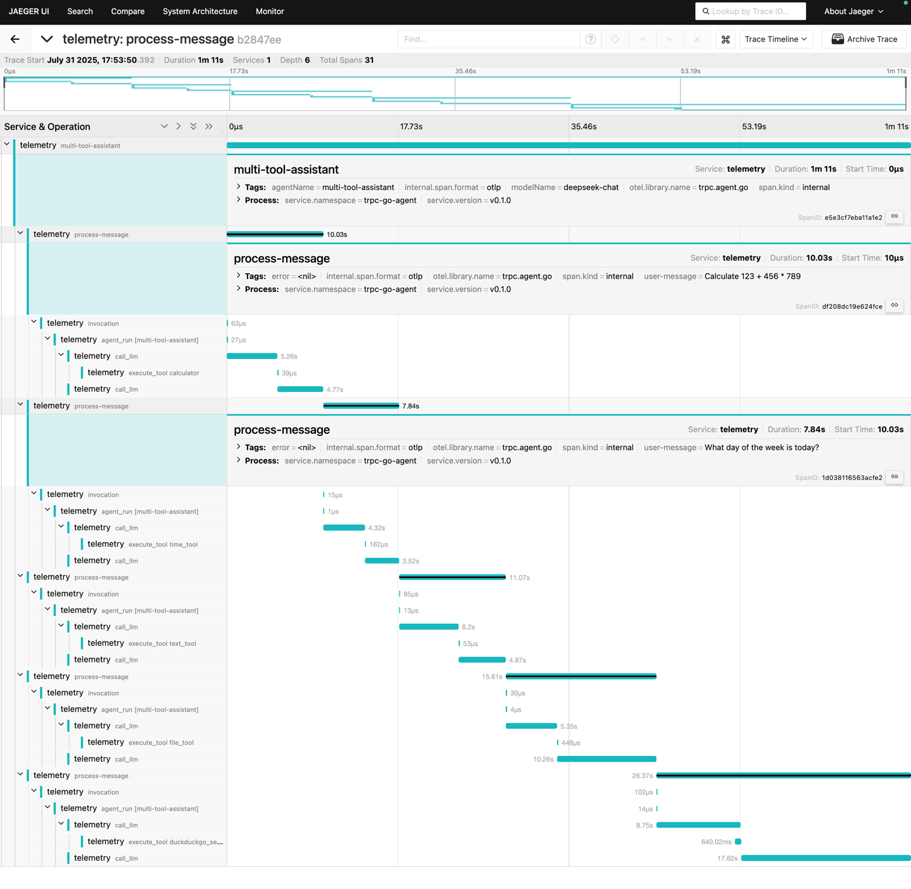

# Observability 功能

## 概述

tRPC-Agent-Go 框架内置了全面的可观测（Observability）功能，基于 OpenTelemetry 标准协议，为 Agent 应用提供了强大的可观测性能力。
通过可观测功能，开发者可以实现对 Agent 运行状态的全方位监控，包括链路追踪、性能指标收集和日志记录等。

### 🎯 核心特性

- **链路追踪（Tracing）**：完整记录 Agent 执行过程中的调用链路
- **性能指标（Metrics）**：收集 Agent 运行时的关键性能数据
- **日志聚合（Logging）**：统一的日志收集和管理
- **多平台支持**：支持 Jaeger、Prometheus、Galileo、智研监控宝 等主流监控平台
- **灵活配置**：支持多种配置方式和自定义扩展

### Telemetry 协议

关于与 OpenTelemetry 对齐的多模态消息 schema、provider 能力边界以及
replay 规则，可参考 [Telemetry 多模态协议](telemetry-multimodal.md)。

## 与不同的监控平台集成

### Langfuse 集成

Langfuse 是专为 LLM 应用设计的可观测平台，支持通过 OpenTelemetry 协议采集链路追踪数据。tRPC-Agent-Go 可通过 OpenTelemetry 协议将 Trace 数据导出到 Langfuse。

#### 1. 部署 Langfuse

可参考 [Langfuse 官方自托管指南](https://langfuse.com/self-hosting) 进行本地或云端部署。快速体验可参考 [Docker Compose 部署文档](https://langfuse.com/self-hosting/docker-compose)。

#### 2. Go 编写接入代码


```bash
export LANGFUSE_PUBLIC_KEY="your-public-key"
export LANGFUSE_SECRET_KEY="your-secret-key"
export LANGFUSE_HOST="your-langfuse-host" # 以 host:port 形式填写（不带 http:// 协议头），例如 "cloud.langfuse.com:443" 或 "localhost:3000".
export LANGFUSE_INSECURE="true" # 用于不安全连接（仅限开发环境）
```

```go
import (
	"context"
	"log"

	"trpc.group/trpc-go/trpc-agent-go/telemetry/langfuse"
)

func main() {
	// Start trace with Langfuse integration using environment variables
	clean, err := langfuse.Start(context.Background())
	if err != nil {
		log.Fatalf("Failed to start trace telemetry: %v", err)
	}
	defer func() {
		if err := clean(context.Background()); err != nil {
			log.Printf("Failed to clean up trace telemetry: %v", err)
		}
	}()
```

完整示例可参考 [examples/telemetry/langfuse](https://github.com/trpc-group/trpc-agent-go/tree/main/examples/telemetry/langfuse)。

注意：`LANGFUSE_HOST` 会直接传给 OpenTelemetry 的 `otlptracehttp.WithEndpoint`，因此不能包含 `http://` 或 `https://`。协议由 `LANGFUSE_INSECURE` 控制，路径固定为 `/api/public/otel/v1/traces`。

运行示例：

```bash
go run .
```

你可以在 Langfuse 控制台查看链路追踪数据。

##### 接入代码说明
Langfuse 支持通过 `/api/public/otel` (OTLP) 接口接收 Trace 数据，仅支持 HTTP/protobuf，不支持 gRPC。
上述代码通过设置 `OTEL_EXPORTER_OTLP_HEADERS` 和 `OTEL_EXPORTER_OTLP_TRACES_ENDPOINT` 来接入 langfuse。

```bash
# 欧盟数据区
OTEL_EXPORTER_OTLP_ENDPOINT="https://cloud.langfuse.com/api/public/otel"
# 美国数据区
# OTEL_EXPORTER_OTLP_ENDPOINT="https://us.cloud.langfuse.com/api/public/otel"
# 本地部署 (>= v3.22.0)
# OTEL_EXPORTER_OTLP_ENDPOINT="http://localhost:3000/api/public/otel"

# 设置 Basic Auth 认证
OTEL_EXPORTER_OTLP_HEADERS="Authorization=Basic ${AUTH_STRING}"
```

其中 `AUTH_STRING` 为 base64 编码的 `public_key:secret_key`，可用如下命令生成：

```bash
echo -n "pk-lf-xxxx:sk-lf-xxxx" | base64
# GNU 系统可加 -w 0 防止换行
```

如需单独指定 trace 数据的 endpoint，可设置：

```bash
OTEL_EXPORTER_OTLP_TRACES_ENDPOINT="http://localhost:3000/api/public/otel/v1/traces"
```


### Jaeger、Prometheus 等开源监控平台

可以参考 [examples/telemetry](https://github.com/trpc-group/trpc-agent-go/tree/main/examples/telemetry) 的代码示例。

```go
package main

import (
    "context"
    "log"
    
    ametric "trpc.group/trpc-go/trpc-agent-go/telemetry/metric"
    atrace "trpc.group/trpc-go/trpc-agent-go/telemetry/trace"
)

func main() {
    // 启动指标收集
    mp, err := ametric.NewMeterProvider(
		context.Background(),
		ametric.WithEndpoint("localhost:4318"),
		ametric.WithProtocol("http"),
	)
	if err != nil {
		log.Fatalf("Failed to create meter provider: %v", err)
	}
	defer mp.Shutdown(context.Background())
	ametric.InitMeterProvider(mp)

    // 启动链路追踪
    traceClean, err := atrace.Start(
        context.Background(),
        atrace.WithEndpoint("localhost:4317"), // trace 导出地址
    )
    if err != nil {
        log.Fatalf("Failed to start trace telemetry: %v", err)
    }
    defer traceClean()

    // 你的 Agent 应用代码
    // ...
    // 可以添加自定义 trace 和 metrics
}
```

#### Jaeger trace 示例


#### Prometheus 监控指标示例


## 实际应用示例

### 基本的指标和追踪

```go
package main

import (
    "context"
    "fmt"
    "time"
    
    ametric "trpc.group/trpc-go/trpc-agent-go/telemetry/metric"
    atrace "trpc.group/trpc-go/trpc-agent-go/telemetry/trace"
    "trpc.group/trpc-go/trpc-agent-go/log"

    "go.opentelemetry.io/otel/attribute"
    "go.opentelemetry.io/otel/metric"
    "go.opentelemetry.io/otel/trace"
)

func main() {
	// 启动指标收集
	mp, err := ametric.NewMeterProvider(
		context.Background(),
		ametric.WithEndpoint("localhost:4318"),
		ametric.WithProtocol("http"),
	)
	if err != nil {
		log.Fatalf("Failed to create meter provider: %v", err)
	}
	defer mp.Shutdown(context.Background())
	ametric.InitMeterProvider(mp)
	meter := mp.Meter("trpc_agent_go.app")

	if err := processAgentRequest(context.Background(), meter); err != nil {
		log.Errorf("processAgentRequest failed: %v", err)
	}
}
func processAgentRequest(ctx context.Context, meter metric.Meter) error {
    // 创建追踪 span
    ctx, span := atrace.Tracer.Start(
        ctx,
        "process-agent-request",
        trace.WithAttributes(
            attribute.String("agent.type", "chat"),
            attribute.String("user.id", "user123"),
        ),
    )
    defer span.End()
    
    // 创建指标计数器
    requestCounter, err := meter.Int64Counter(
        "agent.requests.total",
        metric.WithDescription("Total number of agent requests"),
    )
    if err != nil {
        return err
    }
    
    // 记录请求
    requestCounter.Add(ctx, 1, metric.WithAttributes(
        attribute.String("agent.type", "chat"),
        attribute.String("status", "success"),
    ))
    
    // 模拟处理过程
    time.Sleep(100 * time.Millisecond)
    
    return nil
}
```

### Agent 执行追踪

框架会自动为 Agent 的关键组件添加监控埋点：

```go
// Agent 执行会自动生成以下监控数据：
// 
// Traces:
// - agent.execution: Agent 整体执行过程
// - tool.invocation: Tool 调用过程  
// - model.api_call: 模型 API 调用过程
```

## 监控数据分析

### 链路追踪分析

典型的 Agent 执行链路结构：

```
Agent Request
├── Planning Phase
│   ├── Model API Call (DeepSeek)
│   └── Response Processing
├── Tool Execution Phase  
│   ├── Tool: web_search
│   ├── Tool: knowledge_base
│   └── Result Processing
└── Response Generation Phase
    ├── Model API Call (DeepSeek)
    └── Final Response Formatting
```

通过链路追踪可以分析：

- **性能瓶颈**：识别耗时最长的操作
- **错误定位**：快速找到失败的具体环节
- **依赖关系**：了解组件间的调用关系
- **并发分析**：观察并发执行的效果

## 进阶功能

### 自定义 Exporter

如果需要将可观测数据发送到自定义的监控系统：

```go
import (
    "go.opentelemetry.io/otel/exporters/otlp/otlptrace/otlptracehttp"
    "go.opentelemetry.io/otel/sdk/trace"
)

func setupCustomExporter() error {
    exporter, err := otlptracehttp.New(
        context.Background(),
        otlptracehttp.WithEndpoint("https://your-custom-endpoint.com"),
        otlptracehttp.WithHeaders(map[string]string{
            "Authorization": "Bearer your-token",
        }),
    )
    if err != nil {
        return err
    }
    
    tp := trace.NewTracerProvider(
        trace.WithBatcher(exporter),
    )
    
    // 设置为全局 TracerProvider
    otel.SetTracerProvider(tp)
    
    return nil
}
```

## 参考资源

- [OpenTelemetry 官方文档](https://opentelemetry.io/docs/)
- [tRPC-Agent-Go Telemetry 示例](https://github.com/trpc-group/trpc-agent-go/tree/main/examples/telemetry)

通过合理使用可观测功能，你可以建立完善的 Agent 应用监控体系，及时发现和解决问题，持续优化系统性能。
