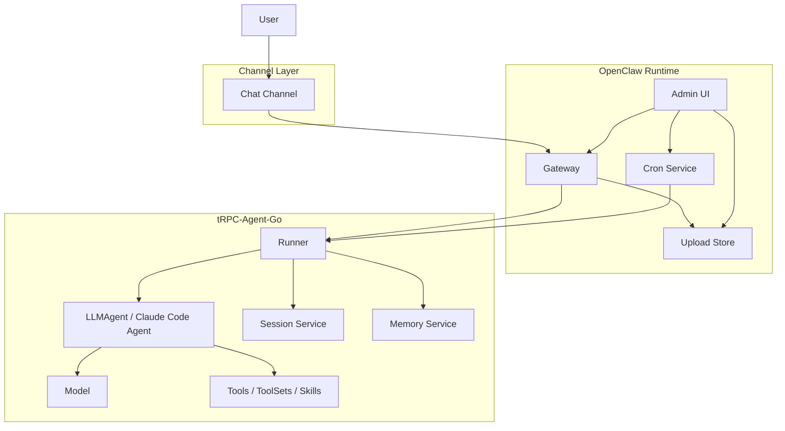
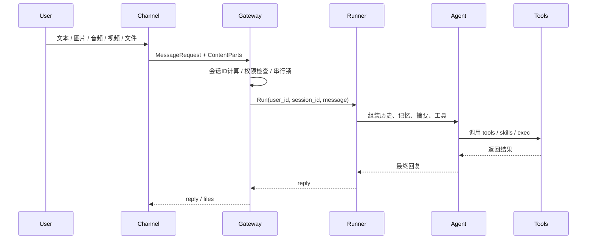
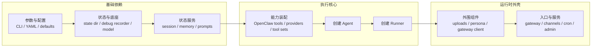

# tRPC-Agent-Go：打造企业级安全可控的 OpenClaw Runtime

## 导语

当 Agent 从一次性问答进入长期运行场景，真正决定可用性的，
往往不再是单轮回复是否聪明，而是它能不能稳定接入消息入口、
管理会话与记忆、处理图片和文件、执行工具、持续运行并可被运维。
本文聚焦 GitHub 开源仓库中的 `openclaw` 实现，
以仓库中的默认消息入口示例为线索，说明它如何把消息接入、
会话状态、工具执行、文件处理、调度和管理能力组织成一套
完整 Runtime。

## 前言

> tRPC-Agent-Go 是 tRPC-Go 团队推出的面向 Go 语言的自主式多
> Agent 框架，具备工具调用、会话与记忆管理、制品管理、多
> Agent 协同、图编排、知识库与可观测等能力。  
>
> GitHub 开源仓库：
> [github.com/trpc-group/trpc-agent-go](https://github.com/trpc-group/trpc-agent-go)  
>
> `openclaw` 目录：
> [github.com/trpc-group/trpc-agent-go/tree/main/openclaw](https://github.com/trpc-group/trpc-agent-go/tree/main/openclaw)

tRPC-Agent-Go 中的 `openclaw` 并不是对官方 OpenClaw 的工程结构、
协议细节和运行时实现做一比一复刻，而是基于 tRPC-Agent-Go 已有抽象，
对“长期运行、多入口接入、持续调度、工具与技能可扩展”的
OpenClaw 形态进行一次 Go 化落地。它的重点不是重新定义一套
Agent 框架，而是把既有能力装配成更接近真实助手产品的运行时外壳。

如果你第一次打开这个仓库，推荐先看下面几个入口：

- 仓库根目录：
  [github.com/trpc-group/trpc-agent-go](https://github.com/trpc-group/trpc-agent-go)
- `openclaw` 目录：
  [github.com/trpc-group/trpc-agent-go/tree/main/openclaw](https://github.com/trpc-group/trpc-agent-go/tree/main/openclaw)
- 参考配置：
  [github.com/trpc-group/trpc-agent-go/blob/main/openclaw/openclaw.yaml](https://github.com/trpc-group/trpc-agent-go/blob/main/openclaw/openclaw.yaml)
- 扩展文档：
  [github.com/trpc-group/trpc-agent-go/blob/main/openclaw/EXTENDING.md](https://github.com/trpc-group/trpc-agent-go/blob/main/openclaw/EXTENDING.md)
- 集成文档：
  [github.com/trpc-group/trpc-agent-go/blob/main/openclaw/INTEGRATIONS.md](https://github.com/trpc-group/trpc-agent-go/blob/main/openclaw/INTEGRATIONS.md)

这几份材料合起来，基本覆盖了三个问题：

- `openclaw` 到底是什么。
- 它怎样通过仓库里的默认示例配置变成一个真实可用的运行时。
- 如果默认能力不够，应该从哪里继续扩展。

## 背景

当 Agent 进入长期运行场景，问题会从单次推理的效果，
转向运行时形态是否完整。一个能够长期稳定工作的 Agent Runtime，
至少要同时处理五类问题。

- 如何接收消息，也就是把外部请求接进来。
- 如何维持上下文，也就是把不同消息归并到稳定的会话中，
  并决定哪些信息应进入长期记忆。
- 如何执行动作，也就是让 Agent 能调用工具、技能、代码执行器，
  处理文件与多模态输入。
- 如何持续运行，也就是支持定时任务、跨会话回传、
  上传文件与管理面。
- 如何扩展能力，也就是在不重写主链路的前提下继续增加新的
  Channel、Model、ToolSet 和存储后端。

[OpenClaw](https://github.com/openclaw/openclaw) 的代表性，
正在于它把这五类问题放在同一个运行时边界内统一处理。
对于 Go 生态而言，这个问题尤其具有工程意义。难点往往不在于
写出一个会回复消息的 Bot，而在于如何在尽量复用既有框架能力的前提下，
把 Gateway、Session、Memory、Tool、文件处理、
调度与管理面组织成一个可长期运行的系统。

tRPC-Agent-Go 中的 `openclaw` 正是在这个背景下出现的。
它把 `Runner` 作为执行中心，把 `Session` 与 `Memory`
作为状态底座，把 Tool、Skill、ToolSet 与执行器
作为能力扩展点，再在外围补上 Gateway、Channel、Cron、
上传存储和 Admin UI，从而把单次推理能力推进到长期运行系统。

## 快速开始

本节目标很明确：从 GitHub 仓库里的现成配置出发，
把一个真实消息入口跑起来，并建立对整条运行链路的直观认识。

### 路径 A：先安装预编译 release

如果你的目标是尽快跑起来，不要一上来就 `go run`。先安装已经发布的
二进制：

```bash
curl -fsSL \
  https://github.com/trpc-group/trpc-agent-go/releases/latest/download/openclaw-install.sh \
  | bash
```

默认安装 profile 是 `stdin`，而这个 profile 使用的是内置 `mock`
模型。所以第一次启动时既不需要模型密钥，也不需要 Telegram
这类消息入口凭据。

安装脚本默认会把 GitHub 版本的配置和状态目录写到
`~/.trpc-agent-go-github/openclaw`。

如果安装后还找不到 `openclaw`，直接执行安装脚本输出里的 PATH 命令。
对于 bash，持久化写法如下：

```bash
grep -qxF 'export PATH="$HOME/.local/bin:$PATH"' "$HOME/.bashrc" || \
  printf '\nexport PATH="$HOME/.local/bin:$PATH"\n' >> "$HOME/.bashrc"
. "$HOME/.bashrc"
```

然后直接启动 OpenClaw：

```bash
openclaw
```

启动后你就已经进入本地终端聊天模式了。先发一条 `hello`
这样的简单消息即可。你也可以先用 `/help` 看基础命令，
最后再用 `/quit` 或 `/exit` 退出。

如果你当前最关心的是“先拿到一个能启动、能验证链路的可运行二进制”，
这条路径最合适。等它稳定以后，再继续接真实模型或真实消息渠道。

### 路径 B：从源码运行

如果你的目标是开发或修改 OpenClaw 本身，再按源码方式运行。
先准备下面几项：

- Go 开发环境
- tRPC-Agent-Go 仓库代码
- 一个消息入口凭证，文中示例使用 Telegram Bot Token
- 一个可访问的模型服务，或者临时使用 `mock` 模式

这里有两个最基本的概念：

- 消息入口凭证决定 `openclaw` 能否真正接收和回发消息。
- 模型服务地址和密钥决定 Agent 在收到消息后，
  是否能继续完成推理、多模态理解和工具调用。

### 第一步：准备环境变量

仓库中的 `openclaw/openclaw.yaml` 会从环境变量读取
消息入口配置。当前默认示例使用 Telegram Token。
一个最小可用的环境变量组合如下：

```bash
export TELEGRAM_BOT_TOKEN='replace-with-your-bot-token'
export OPENAI_API_KEY='replace-with-your-api-key'

# 可选：如果你使用的是 OpenAI-compatible 网关，
# 再补这一项。
export OPENAI_BASE_URL='https://your-openai-compatible-endpoint/v1'
```

这几个变量分别表示：

- `TELEGRAM_BOT_TOKEN`：Telegram 机器人访问令牌。
- `OPENAI_API_KEY`：模型服务密钥。
- `OPENAI_BASE_URL`：模型服务基础地址。

如果你只是想先验证消息收发链路，而暂时不接真实模型，
可以把配置文件里的 `model.mode` 改成 `mock`。
这样可以先把问题收敛到“消息有没有进来，结果有没有出去”，
等链路确认稳定以后，再切回真实模型。

### 第二步：理解 GitHub 仓库里的默认配置

GitHub 仓库中的参考配置如下，
位置是 `openclaw/openclaw.yaml`：

```yaml
app_name: "openclaw"

http:
  addr: ":8080"

admin:
  enabled: true
  addr: "127.0.0.1:19789"
  auto_port: true

agent:
  instruction: "You are a helpful assistant. Reply in a friendly tone."

model:
  mode: "openai"
  name: "gpt-5"
  openai_variant: "auto"

tools:
  enable_parallel_tools: true

channels:
  - type: "telegram"
    config:
      token: "${TELEGRAM_BOT_TOKEN}"
      streaming: "progress"
      http_timeout: "60s"

session:
  backend: "inmemory"
  summary:
    enabled: false

memory:
  backend: "inmemory"
  auto:
    enabled: false
```

第一次读这份 YAML 时，可以按下面的方式理解：

- `app_name` 用来标识这套 Runtime 实例。
- `http.addr` 是运行时对外暴露的 HTTP 地址，
  健康检查和 Gateway 都会挂在这里。
- `admin` 打开了本地管理面，便于排查任务、路由、
  上传文件和调试痕迹。
- `agent.instruction` 是系统级角色说明，
  它定义了这个助手的基本行为。
- `model` 定义底层模型接入方式。
- `channels` 里声明了一个 `telegram` 类型入口，
  表示外部消息来自 Telegram。
- `session` 和 `memory` 先用 `inmemory`，
  目的是让第一次启动尽量简单。

### 第三步：确认当前二进制已经带上默认入口插件

在 `openclaw` 目录下先执行：

```bash
cd openclaw
go run ./cmd/openclaw inspect plugins
```

这条命令会把当前二进制里已经注册的能力打印出来。
第一次排查时，最需要关注的是输出里是否包含 `telegram`。
如果这里没有 `telegram`，那么 YAML 里即使写了
`type: "telegram"`，运行时也无法真正创建这个入口。

### 第四步：启动 Runtime

确认插件存在后，直接用 GitHub 仓库里的默认配置启动：

```bash
cd openclaw
go run ./cmd/openclaw -config ./openclaw.yaml
```

启动后先检查健康检查接口：

```bash
curl -sS 'http://127.0.0.1:8080/healthz'
```

如果这里能正常返回，说明 HTTP 层已经起来了。
接着再回到聊天入口里做第一次联调：

1. 先发 `/help` 这类最简单的命令。
2. 再发一条纯文本消息。
3. 文本稳定后，再试图片、PDF、Excel 这类文件场景。
4. 最后再去验证更复杂的工具调用、定时任务和回传动作。

这套顺序的意义在于把问题一层层拆开：

- `/help` 更适合验证入口和出口是否通。
- 纯文本更适合验证模型调用是否通。
- 图片和文件更适合验证多模态标准化与上传下载链路是否通。

## 典型场景

下面这组截图都来自当前这套默认示例入口。
它们最值得关注的地方，不是“模型会不会回答”，
而是外部消息进入 `openclaw` 之后，
如何继续穿过 Gateway、Runner、Agent、Tool、
文件处理和回传链路，最终形成完整结果。

### 文档处理

文档处理是最能说明 Runtime 价值的一类场景。
这里真正难的不是“模型会不会说”，而是系统能否把接收文件、
理解指令、调用工具、生成结果、回传文件这几步串成一条完整链路。

例如，上传 PDF 后可以直接提取指定内容：


也可以把一个 PDF 拆分为多个页面后再回传新文件：


语音输入同样可以驱动文档处理。下面这个例子中，
用户通过语音要求把指定页面合并成一个 PDF：


系统也可以基于输入材料直接生成汇报用 Word 文档：


Excel 处理也沿用同一条链路。下面这个例子里，
用户通过语音要求保留第一行并删除其余行，
处理后的表格文件会直接回传：


这组能力说明的是，同一套 Runtime 可以同时承接文件输入、
多模态理解、工具执行和文件输出，而不必为不同文件类型
单独重写业务流程。

### 图像与视频

在图像理解场景下，图片可以直接作为多模态输入进入模型能力：


视频场景则通常要经过“先处理媒体，再交给模型”的链路。
例如下面这个例子中，用户要求提取视频第一帧并回发图片：


在视频 OCR 场景中，系统可以先定位目标帧，再继续做文字识别。
下面这个例子先提取出最后一帧：


确认目标帧后，再返回识别出的文字内容：


这部分展示的重点不是某一个具体工具，
而是多模态输入在进入 Gateway 后，
仍然能够沿着统一的 Agent 执行链路向下流转。

### Skills 与系统操作

`openclaw` 并不把能力限制在“对话回复”这一层，
而是允许在同一轮执行中串联 Skill、系统工具和外部结果写入。

例如下面这个例子中，系统先做天气查询，
再把当前聊天记录写入 Apple 备忘录：


对应的备忘录结果如下：


类似地，也可以在会话中直接创建提醒事项：


对应结果如下：


这类场景说明，运行时中的“动作”不必局限在文本输出，
Agent 可以真正把工具和系统能力组织成一条可执行链路。

### 定时与管理

长期运行系统还需要处理“不是现在就做，而是按计划去做”的任务。
下面这个例子中，用户先查看并清理当前任务，
再要求系统每分钟回报一次本机 CPU 使用率：


除了会话内命令，当前实现还提供本地 Admin UI，
用于查看实例信息、Gateway 路由、任务、执行会话、
上传文件和调试痕迹：


这一部分对应的是运行时配套能力。
它不直接决定模型是否聪明，但直接决定系统是否可维护、
可观察、可持续运行。

## 核心概念

从运行时职责划分看，`openclaw` 可以分为四层结构：
入口层、标准化层、执行层和运行时服务层。
入口层负责接收消息，标准化层负责统一语义，
执行层负责真正的 Agent 推理与动作执行，
运行时服务层负责长期运行系统所需的配套能力。

整体结构如下图所示。



图中的每一层都对应一类独立职责。

- **Channel** 用来接收外部平台的消息，
  文中的运行示例对应一个聊天入口。
- **Gateway** 用来把外部消息转成统一请求，
  并处理会话 ID、权限、串行化和多模态标准化。
- **Runner / Agent** 用来真正执行推理，
  把历史、记忆、工具与模型串起来。
- **Session / Memory** 用来保存会话上下文与长期信息，
  解决“系统如何记住之前发生过什么”这个问题。
- **Runtime Services** 用来提供调度、上传文件、
  管理面等长期运行时必需的外围能力。

一次消息从外部进入系统，通常会经历下面五步：

1. Channel 接收原始消息，例如文本、图片、音频、视频或文件。
2. Gateway 计算稳定的 `session_id`，完成准入判断，
   并把输入统一整理为标准请求。
3. Runner 根据 `session_id` 取回历史与记忆，
   再调用底层 Agent 执行推理。
4. Agent 按需调用 Tool、Skill、ToolSet 或代码执行器，
   生成最终回复。
5. Gateway 把回复结果交还给 Channel，
   再由它发送回外部平台。

在 tRPC-Agent-Go `openclaw` 的实现里，
它承担的不是重新定义 Agent，
而是把 Agent 放入一个可长期运行、可持续扩展的系统边界中。

### Gateway

Gateway 位于消息入口与执行核心之间。
消息入口侧的消息格式、附件表达和会话语义，
在进入 Runner 之前都需要被整理成统一请求，
这一步由 Gateway 完成。

当前 Gateway 默认暴露以下入口：

- `/healthz`
- `/v1/gateway/messages`
- `/v1/gateway/status`
- `/v1/gateway/cancel`

它主要完成以下工作：

- 生成稳定的 `session_id`
- 判断 allowlist、mention 等准入规则
- 保证同一会话串行执行
- 标准化文本与多模态输入
- 调用 Runner 并返回结果

默认会话 ID 规则如下：

- 私聊：`<channel>:dm:<from>`
- 线程或话题：`<channel>:thread:<thread>`

这样的规则很重要，因为它决定了“哪些消息应该被视为
同一个连续对话”。如果会话边界不稳定，
Session 与 Memory 的价值就会被削弱。

消息处理流程如下图所示。



在多模态场景里，Gateway 还会承担标准化职责。
例如图片、音频、视频会被整理为统一的 `ContentPart` 结构，
URL 输入会经过协议和域名校验，音频也会尽量转换到模型
更容易接受的格式。这样 Channel 只需要关注
“如何接消息和发消息”，不必重复实现一整套 Agent 运行逻辑。

### Channel

Channel 是运行时与外部世界之间最直接的接口。
在 tRPC-Agent-Go `openclaw` 的实现里，它承担的是平台协议适配角色，
把某个平台的消息协议转成 Gateway 可理解的请求，
再把 Gateway 的回复转回对应平台的发送格式。

OpenClaw 对 Channel 的接口约束比较轻：

```go
package channel

import "context"

type Channel interface {
	ID() string
	Run(ctx context.Context) error
}
```

如果某个 Channel 还需要主动发送文本或文件，
则可以额外实现 `TextSender` 或 `MessageSender`。
这套接口设计带来两个直接结果。

- 新增入口时，不必改动 Runner 与 Agent 主链路。
- 不同平台可以保留各自的网络模型与接入方式，
  只要最终映射到统一的 Gateway 请求即可。

对这类消息入口来说，
它最重要的职责就是把“聊天平台的消息事件”
翻译成“运行时可以理解的标准消息”。
消息一旦进入 Gateway，后面的推理链路就和平台本身解耦了。

### Session、Summary 与 Memory

从第一性原理看，这三者解决的不是同一个问题。

- `Session` 解决“当前这段对话怎么保留”。
- `Summary` 解决“当前对话太长时，怎样压缩上下文”。
- `Memory` 解决“跨会话的长期事实怎么沉淀”。

它们可以先分开理解：

- `Session` 更像聊天记录。
- `Summary` 更像聊天记录的压缩版。
- `Memory` 更像用户画像、偏好、长期事实这类持久信息。

GitHub 仓库里的默认配置先把 `session` 和 `memory`
都设成了 `inmemory`，这样第一次启动更简单。
如果你想把状态持久化下来，可以切到类似下面的配置：

```yaml
session:
  backend: "sqlite"
  summary:
    enabled: false
  config:
    path: "${HOME}/.trpc-agent-go-github/openclaw/sessions.sqlite"

memory:
  backend: "sqlite"
  auto:
    enabled: false
  config:
    path: "${HOME}/.trpc-agent-go-github/openclaw/memories.db"
```

这段配置要表达的意思很简单：

- 会话记录落到一个独立的 SQLite 文件里。
- 长期记忆落到另一个独立的 SQLite 文件里。
- 是否开启摘要和自动记忆，由对应开关单独控制。

这样的拆分很重要，因为“当前会话里刚说过的话”
和“用户长期稳定的偏好”并不是一回事。
如果把它们混在一起，系统就容易把临时信息当成长期事实，
或者把长期事实误当作当前会话上下文。

### Agent 运行时能力

Gateway 之后，`openclaw` 直接复用 tRPC-Agent-Go 现有的执行体系。
当前实现中，可配置的核心能力包括：

- Agent 类型：`llm`、`claude-code`
- Session backend：`inmemory`、`redis`、`sqlite`、`mysql`、
  `postgres`、`clickhouse`
- Memory backend：`inmemory`、`redis`、`sqlite`、`mysql`、
  `postgres`、`pgvector`
- Tool providers：`duckduckgo`、`webfetch_http`
- ToolSet providers：`mcp`、`file`、`openapi`、`google`、
  `wikipedia`、`arxivsearch`、`email`
- Skills：基于 `SKILL.md` 的技能目录

除此之外，`openclaw` 还补充了几类更贴近长期运行场景的工具：

- `exec_command`
- `write_stdin`
- `kill_session`
- `message`
- `cron`

这些工具的意义不在于改变 Agent 的推理方式，
而在于把长期运行场景中的真实动作纳入统一运行时。
例如本地命令执行、跨 Channel 回传消息、
创建定时任务，都是长期运行系统里的高频需求。

### 调度与管理

单次对话能力只能说明系统会“响应”，
长期运行系统还必须会“管理自己”。
因此，`openclaw` 在主链路之外补充了调度与管理能力。

调度层面，`cron` 工具背后对应常驻调度服务，支持：

- 持久化保存任务
- 定时触发 Agent 运行
- 通过 outbound router 把结果回发到指定 Channel 和目标对象

管理层面，当前 Admin UI 已经可以查看：

- 实例与运行时信息
- Gateway 路由
- jobs
- exec sessions
- uploads
- debug traces

这两块能力都不是大模型本身提供的，
但它们决定了系统是否能从“聊天演示”变成“真实助手产品”。

## 使用方法

### Runtime 装配

`openclaw/app.NewRuntime(...)` 是整个运行时的装配入口。
它负责解析参数、补齐默认值、准备状态与模型依赖、
构建 Agent 与 Runner，再挂接 Gateway、Channel、Cron 和
Admin 等外围组件。这个过程更接近一条分阶段的装配链，
而不是某个具体业务流程的执行路径。



这个装配顺序的意义在于，
底层依赖、执行核心与外围入口各自分层清晰。
Model 仍由 `model` 实现提供，
Session 与 Memory 仍由各自后端提供，
Tool、ToolSet 与 Skill 仍走 tRPC-Agent-Go 原生体系，
而 `openclaw` 负责把这些能力装配成一个完整运行时。

### 已注册能力检查

扩展前首先要确认的，并不是 YAML 怎么写，
而是当前二进制实际包含了哪些类型。
`openclaw` 提供了一个直接面向这个问题的排查入口：

```bash
cd openclaw
go run ./cmd/openclaw inspect plugins
```

这条命令会列出当前二进制里已经注册的：

- Channel types
- Model types
- Session backends
- Memory backends
- Tool providers
- ToolSet providers

这些类型都来自 `openclaw/registry` 中的全局注册表。
运行时在解析 `channels`、`tools.providers`、
`tools.toolsets`、`session.backend`、`memory.backend`
和 `model.mode` 时，都会先按字符串类型名查找对应 factory，
再决定是否创建实例。如果查不到，就会直接报
`unsupported channel type`、
`unsupported tool provider`、
`unsupported toolset provider` 之类的错误，
而不会静默忽略。

### 自定义分发二进制

`openclaw` 采用的是典型的 Go 编译期注册模式。
`openclaw/registry` 维护 `type -> factory` 注册表，
各插件包在 `init()` 中调用 `registry.Register...(...)`
完成注册，分发入口再通过匿名导入把这些包编进最终二进制。
因此，配置文件负责选择类型，二进制负责决定类型集合。

GitHub 仓库里的标准入口
`openclaw/cmd/openclaw/main.go` 就是一个很直接的例子：

```go
package main

import (
	"os"

	"trpc.group/trpc-go/trpc-agent-go/openclaw/app"

	_ "trpc.group/trpc-go/trpc-agent-go/openclaw/plugins/stdin"
	_ "trpc.group/trpc-go/trpc-agent-go/openclaw/plugins/telegram"
)

func main() {
	os.Exit(run(os.Args[1:]))
}

func run(args []string) int {
	return app.Main(args)
}
```

这段代码体现的是一个非常关键的原则：

- 配置只负责“选哪种能力”。
- 编译入口负责“把哪些能力放进二进制”。

也正因为如此，想扩展一个新的 Channel、ToolProvider、
ToolSet、Session backend、Memory backend 或 Model provider 时，
通常应该优先从注册表和分发入口去理解，而不是直接改
`app.NewRuntime(...)` 主链路。

### ToolProvider 与 ToolSet 扩展

ToolProvider 与 ToolSet 使用相同的注册模式，
但承担的职责并不相同。

- ToolProvider 适合启动时就能明确知道要挂哪些工具的场景，
  factory 返回 `[]tool.Tool`。
- ToolSet 更适合由外部系统派生出一组工具的场景，
  factory 返回 `tool.ToolSet`。

从运行时装配上看，`newAgent(...)` 会先挂入 `openclaw`
自带工具、memory 工具和 skills 工具，
再根据 YAML 中的 `tools.providers`
调用 `toolsFromProviders(...)`，
根据 `tools.toolsets` 调用
`toolSetsFromProviders(...)`。

一个最小的 ToolProvider 例子，可以直接参考仓库里的
`openclaw/plugins/echotool`：

```go
package echotool

import (
	"trpc.group/trpc-go/trpc-agent-go/openclaw/registry"
	"trpc.group/trpc-go/trpc-agent-go/tool"
)

func init() {
	if err := registry.RegisterToolProvider("echotool", newTools); err != nil {
		panic(err)
	}
}

func newTools(
	_ registry.ToolProviderDeps,
	spec registry.PluginSpec,
) ([]tool.Tool, error) {
	var cfg providerCfg
	if err := registry.DecodeStrict(spec.Config, &cfg); err != nil {
		return nil, err
	}
	return []tool.Tool{echoTool{name: cfg.Name}}, nil
}
```

对应的 YAML 写法就是：

```yaml
tools:
  providers:
    - type: "echotool"
      config:
        name: "echo"
```

如果接入的是 MCP、OpenAPI、Google Search、
Wikipedia 这一类由外部系统派生出一组工具的场景，
更适合走 ToolSet。

### Session、Memory 与 Model 后端扩展

如果业务差异不在消息入口，而在状态底座或模型接入层，
那么扩展点应该落在后端 factory，
而不是直接修改运行时主流程。

对应关系非常直接：

- `model.mode` 对应 `registry.RegisterModel(...)`
- `session.backend` 对应 `registry.RegisterSessionBackend(...)`
- `memory.backend` 对应 `registry.RegisterMemoryBackend(...)`

这类扩展的价值在于，用户侧 YAML 体验始终稳定。
例如新增一个 `postgres` Session backend 后，
用户依然只需要在配置里写：

```yaml
session:
  backend: "postgres"
  config:
    dsn: "postgres://..."
```

运行时会在创建 `sessionSvc` 时查注册表、取 factory、
传入依赖并创建实例，而不需要把内部 wiring 细节
暴露给配置层。

### Skills 扩展

在大量业务场景中，最先变化的并不是运行时组件，
而是操作说明、脚本和业务知识。
此时优先扩展 Skills，
通常比直接编写 Go 插件更合适。

`openclaw` 对 Skills 的支持有几个值得注意的工程点：

- Skill 以文件夹形式存在，核心文件是 `SKILL.md`
- 运行时会从多个根目录加载 Skills，
  并按优先级处理重名覆盖
- 可以通过 `skills.entries`、`allowBundled`
  和 `metadata.openclaw.requires.*` 做 gating

与 Skills 配置最相关的排查命令是：

```bash
cd openclaw
go run ./cmd/openclaw inspect config-keys -config ./openclaw.yaml
```

这条命令会打印当前配置导出的 config keys，
而 Skills 的 `metadata.openclaw.requires.config`
正是依赖这些键做 gating。也就是说，
当一个 Skill 没有生效时，更常见的原因并不是
“Skill 没加载”，而是它依赖的 config、env 或 bin
还没有满足。

现在 OpenClaw 还补上了一套面向 Skills 和文件工具档位的
宿主机依赖检查与引导安装流程。也就是说，
`metadata.openclaw` 不仅能决定一个 Skill 要不要加载，
还可以描述这台机器应该准备哪些依赖：

```bash
cd openclaw
go run ./cmd/openclaw inspect deps -skill nano-pdf
go run ./cmd/openclaw bootstrap deps -skill nano-pdf -apply
```

这在排查问题时很重要，因为很多时候真正的问题已经不是
“为什么 Skill 被跳过了”，而是
“为了让这个 Skill 能完整跑起来，这台机器到底还缺什么”。

目前，官方 OpenClaw Skill 元数据已经可以描述：

- 包管理器安装
- Go 模块或二进制安装
- npm 安装
- 在 OpenClaw state 目录下创建的托管 Python 环境安装
- 资源下载

有两个实践细节尤其需要记住：

- `inspect deps` 和 `bootstrap deps` 可以同时基于内置依赖档位、
  指定 Skill，或者两者的组合来规划。
- 显式传 `-skill ...` 时，只会规划你点名的 Skill，
  不会再自动把默认文件工具档位一起带上。

`bootstrap deps --apply` 采用 best-effort 语义：
优先执行用户态安装和下载；需要 root 权限的系统包步骤不会让整次
执行直接失败，而是以 deferred 形式报告出来。下载的资源会落到
`<state_dir>/tools/<skill>/...`。

## 最佳实践

在实际落地中，下面几条经验通常最关键。

1. 调试顺序宜由简到繁，先验证消息收发，再验证真实模型，
   最后验证图片、文件、工具和定时任务。
2. 会话边界要先于能力边界被定义。稳定的 `session_id`
   是 Session、Memory、摘要与多轮工具调用成立的前提。
3. Channel 应尽量保持轻量，只处理平台协议，
   把业务语义统一沉淀到 Gateway 与 Runner。
4. 扩展优先落在 Tool、Skill、ToolSet 和后端层，
   而不是在 Channel 中堆积业务逻辑。
5. 调度、回传、上传和管理面应被视为运行时的一部分，
   而不是后补脚本。只有这样，系统形态才真正接近产品级助手。

## 总结

tRPC-Agent-Go 中的 `openclaw`，
是在既有 Agent 框架之上进一步实现的一套长期运行 Runtime 形态。
它并不追求与官方 OpenClaw 的工程结构完全对齐，
而是优先复用 `Runner`、`Session`、`Memory`、`Tool`、
`Skill`、`ToolSet` 与执行器等已有能力，
再通过 Gateway、Channel、Cron、上传存储和 Admin UI
把这些能力组织成一个更接近真实助手产品的系统。

对于希望在 Go 体系中构建长期运行智能助手的团队，
这种实现路径的价值主要体现在两点：
一是主链路复用度高，不必为新的运行时场景重新发明 Agent 框架；
二是扩展边界清晰，既可以继续接入新的消息平台，
也可以继续接入新的工具、技能、模型和存储后端。

如果把 GitHub 仓库中的 `openclaw` 和默认消息入口配置连起来看，
它展示的其实不是一个单独的 Bot，
而是一整套可持续运行、可持续扩展的 Runtime 设计。

## 使用与交流

- GitHub 仓库：
  [github.com/trpc-group/trpc-agent-go](https://github.com/trpc-group/trpc-agent-go)
- `openclaw` 目录：
  [github.com/trpc-group/trpc-agent-go/tree/main/openclaw](https://github.com/trpc-group/trpc-agent-go/tree/main/openclaw)
- 参考配置：
  [github.com/trpc-group/trpc-agent-go/blob/main/openclaw/openclaw.yaml](https://github.com/trpc-group/trpc-agent-go/blob/main/openclaw/openclaw.yaml)
- 扩展文档：
  [github.com/trpc-group/trpc-agent-go/blob/main/openclaw/EXTENDING.md](https://github.com/trpc-group/trpc-agent-go/blob/main/openclaw/EXTENDING.md)
- 集成文档：
  [github.com/trpc-group/trpc-agent-go/blob/main/openclaw/INTEGRATIONS.md](https://github.com/trpc-group/trpc-agent-go/blob/main/openclaw/INTEGRATIONS.md)

如果你对这类长期运行 Agent Runtime 在 Go 与 tRPC-Go 体系中的落地方式感兴趣，
欢迎继续共建，也欢迎给 GitHub 仓库
[github.com/trpc-group/trpc-agent-go](https://github.com/trpc-group/trpc-agent-go)
点个 Star。
