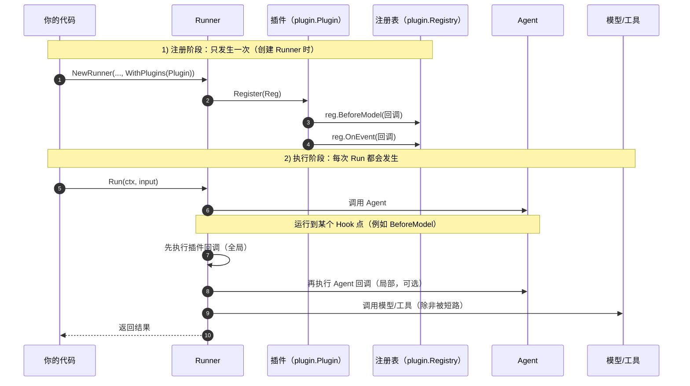

# 插件（Plugins）

## 概述

插件是一种 *Runner 作用域*（Runner-scoped）的扩展机制，可以在以下生命周期点插入
自定义逻辑：

- Agent 执行
- 模型调用（大语言模型（Large Language Model, LLM）请求）
- 工具（Tool）调用
- 事件（Event）发出

插件主要解决的是 **横切关注点**：也就是“你希望所有 Agent 都统一具备的能力”，而
不是某个 Agent 的业务逻辑。

常见场景：

- 统一日志与调试
- 安全与策略（policy）拦截
- 请求改写（例如统一追加 system instruction）
- 审计、事件打标

如果你的需求只针对某一个 Agent，通常用回调（Callbacks）会更合适。

## 名词解释（Glossary）

为了避免“插件 / 回调 / hook（钩子）”混在一起，先把几个词说清楚：

- **生命周期（lifecycle）**：Runner 处理一次输入的完整过程（创建 Invocation（一次运行
  的上下文）→ 调用 Agent → 触发模型调用/工具调用 → 发出事件 → 结束）。
- **Hook 点（Hook Point）**：生命周期里的一个“时机/插槽”。框架在这个时机会去调用
  你注册的函数（回调）。在本项目里，它对应 `BeforeModel`、`AfterTool`、`OnEvent`
  这类位置。
- **回调（callback）**：你提供给框架的函数。框架在某个 Hook 点被触发时，会调用这
  个函数。
- **hook（钩子）**：一个通用说法，通常指“Hook 点”或“挂在 Hook 点上的回调函数”。
  在这个仓库里，hook 是通过回调实现的，所以文档里有时会混用“hook/回调”，本质是
  同一件事：框架在某个时机调用你的函数。
- **插件（plugin）**：一个实现了 `plugin.Plugin` 的组件。它在
  `Register(reg *plugin.Registry)` 里把一组回调注册到多个 Hook 点，然后通过
  `runner.WithPlugins(...)` 在 Runner 上一次性启用。

一句话：

- Hook 点 = 框架预留的“时机/插槽”
- 回调 = 你写的函数，挂在 Hook 点上
- 插件 = 把一组回调打包，并全局生效

文档示例里常见的变量名：

- `runnerInstance`：Runner 实例（`*runner.Runner`）
- `reg`：注册表（registry），用于注册回调（`*plugin.Registry`）
- `ctx`：上下文（`context.Context`）

## 插件和回调有什么区别？

一句话：**插件跟着 Runner 走；回调跟着 Agent 走**。

如果你只用回调（callback）来实现“全局生效”的效果，你需要把同一套回调逻辑手动加到
这个 Runner 会用到的每一个 Agent 上；插件（plugin）就是把这件事“收拢到一个地方”，
让你只在 Runner 上注册一次，然后自动应用到该 Runner 管理的所有 Agent、工具（Tool）
和模型调用（大语言模型（Large Language Model, LLM）请求）。

回调（callback）是“一个函数”：框架在特定时机（before/after）去调用它。你需要把
它绑定到你想生效的地方（很多时候是某个 Agent 上）。

插件（plugin）是“一个组件”：它把“一组回调 + 配置 + 可选的生命周期管理”打包在
一起，然后 **只在 Runner 上注册一次**，就能自动对该 Runner 管理的所有 Invocation
（一次运行的上下文）生效。

换句话说：

- **Hook 点（Hook Point）**：生命周期中的“时机/插槽”。
- **回调（callback）**：挂在 Hook 点上的函数（也常被称为 hook）。
- **插件（plugin）**：把多组回调打包，并在 Runner 上一次注册让它全局生效。

## 插件和回调的关系（最关键）

插件不是“另一套新的回调系统”。插件的本质就是：**在 Runner 级别集中注册一批回调**。

具体来说：

- 插件通过 `Register(reg *plugin.Registry)` 把回调注册到各个 Hook 点；
- `reg.BeforeModel(...)` / `reg.AfterTool(...)` 这类方法注册的就是“回调函数”；
- 运行时框架仍然在对应的生命周期点执行回调：
  - 先执行“插件注册的全局回调”
  - 再执行“Agent 自己配置的回调”（如果有）

你可以把插件理解为：**一组回调（Callbacks）的打包与全局应用**。

如果你想了解“回调如何绑定到某一个 Agent（局部生效）”，可以参考 `callbacks.md`
页面。

## 一张图看懂：从注册到执行

插件生效分两步：**注册** 与 **执行**。



### 1) 注册：把回调挂到 Hook 点

你在创建 Runner 时启用插件：

```go
runnerInstance := runner.NewRunner(
	"my-app",
	agentInstance,
	runner.WithPlugins(&MyPlugin{}),
)
defer runnerInstance.Close()
```

其中 `MyPlugin` 是你自定义的插件类型（实现 `plugin.Plugin` 接口）。

然后框架会调用插件的 `Register(reg *plugin.Registry)`。在这个函数里，你通过
`reg.BeforeModel(...)` / `reg.OnEvent(...)` 等方法，把“回调函数”注册到对应的
Hook 点。

### 2) 执行：运行到 Hook 点时，框架调用你的回调

当运行过程中走到某个 Hook 点（例如 `BeforeModel`）时，框架会按顺序执行：

1) 插件注册的全局回调
2) Agent 自己配置的回调（如果有）

这就是为什么插件能“一次注册，全局生效”：它只是把同样的回调逻辑提前挂到了
Runner 统一管理的生命周期点上。

## 什么时候用插件？

当你希望“对一个 Runner 管理的所有执行都统一生效”时，用插件更合适：

- 想对所有 Agent 做统一策略（例如拦截某些输入）。
- 想统一做日志、指标（metrics）、链路追踪（tracing）。
- 想对每一次模型请求做统一改写（例如加 system instruction）。
- 想给所有事件统一打标，便于审计与排查。

## 什么时候用回调？

当你的需求只影响某个特定 Agent 时，用回调更合适：

- 只有一个 Agent 需要特殊的请求改写。
- 只有一个 Agent 的工具需要自定义参数处理。
- 你在快速试验，不希望全局影响其他 Agent。

你也可以混用：插件负责全局默认行为，回调负责单个 Agent 的定制。

## 快速开始

创建 Runner 时注册插件（只需要注册一次）：

```go
import (
	"trpc.group/trpc-go/trpc-agent-go/plugin"
	"trpc.group/trpc-go/trpc-agent-go/runner"
)

runnerInstance := runner.NewRunner(
	"my-app",
	agentInstance,
	runner.WithPlugins(
		plugin.NewLogging(),
		plugin.NewGlobalInstruction(
			"You must follow security policies.",
		),
	),
)
defer runnerInstance.Close()
```

## 插件是如何执行的？

### 作用域与传播

- 插件在 Runner 创建时初始化一次，并存放到 Invocation 的 `Invocation.Plugins` 中。
- 当 Invocation 被 Clone（例如子 Agent、AgentTool、transfer 等）时，同一个插件管理器
  会被带过去，所以插件在嵌套执行中仍然一致生效。

### 在回调里拿到 Invocation

在 `BeforeModel` / `AfterModel` / `BeforeTool` / `AfterTool` 这类回调里，你通常只拿到
`context.Context`。如果你需要当前 Invocation，可以从 context 里取出来。

下面示例用 `fmt.Printf` 打印（示例省略了 `import "fmt"`）：

```go
if inv, ok := agent.InvocationFromContext(ctx); ok && inv != nil {
	fmt.Printf("invocation id: %s\n", inv.InvocationID)
}
```

在工具回调里，框架还会把工具调用标识符（identifier, ID）注入 context：

```go
if toolCallID, ok := tool.ToolCallIDFromContext(ctx); ok {
	fmt.Printf("tool call id: %s\n", toolCallID)
}
```

### 执行顺序与短路（short-circuit）

插件会 **按注册顺序执行**。

某些 Before* 回调支持“短路”默认行为：

- **BeforeAgent**：可以返回自定义响应，直接跳过 Agent 执行。
- **BeforeModel**：可以返回自定义响应，直接跳过模型接口调用
  （应用程序编程接口（Application Programming Interface, API））。
- **BeforeTool**：可以返回自定义结果，直接跳过工具执行。

某些 After* 回调支持“覆盖”输出：

- **AfterModel**：可以返回自定义响应，替换模型响应。
- **AfterTool**：可以返回自定义结果，替换工具结果。

### 错误处理

- agent/model/tool 回调返回 error 会让本次运行失败（错误返回给调用方）。
- `OnEvent` 返回 error 时，Runner 会记录日志并继续使用原始事件。

### 并发（很重要）

工具可能并发执行，某些 Agent 也可能并发运行。如果你的插件会保存共享状态，请确保
并发安全（例如使用 `sync.Mutex` 或原子（atomic）类型）。

### Close（资源释放）

如果插件实现了 `plugin.Closer`，当你调用 `Runner.Close()` 时，Runner 会调用插件的
`Close()` 来释放资源。关闭顺序是 **按注册顺序的反向**（后注册的先关闭）。

## Hook 点（Hook Points）

### Agent Hook 点

- `BeforeAgent`：Agent 开始前
- `AfterAgent`：Agent 事件流结束后

### Model Hook 点

- `BeforeModel`：模型请求发出前
- `AfterModel`：模型响应产生后

### Tool Hook 点

- `BeforeTool`：工具调用前，可以修改工具参数（JSON（JavaScript Object Notation）
  字节）
- `AfterTool`：工具调用后，可以替换结果

### Event Hook 点

- `OnEvent`：Runner 发出每一个事件时都会调用（包括 runner completion 事件）。你可以
  原地修改事件，或者返回一个新的事件作为替代。

## 常见用法（Recipes）

### 1) 拦截输入并短路模型调用（策略）

用 `BeforeModel` 在模型调用前直接返回自定义响应：

```go
type PolicyPlugin struct{}

func (p *PolicyPlugin) Name() string { return "policy" }

func (p *PolicyPlugin) Register(reg *plugin.Registry) {
	const blockedKeyword = "/deny"

	reg.BeforeModel(func(
		ctx context.Context,
		args *model.BeforeModelArgs,
	) (*model.BeforeModelResult, error) {
		if args == nil || args.Request == nil {
			return nil, nil
		}
		for _, msg := range args.Request.Messages {
			if msg.Role == model.RoleUser &&
				strings.Contains(msg.Content, blockedKeyword) {
				return &model.BeforeModelResult{
					CustomResponse: &model.Response{
						Done: true,
						Choices: []model.Choice{{
							Index: 0,
							Message: model.NewAssistantMessage(
								"Blocked by plugin policy.",
							),
						}},
					},
				}, nil
			}
		}
		return nil, nil
	})
}
```

### 2) 给所有事件打标（审计/排查）

用 `OnEvent` 给事件追加 tag，便于 UI（User Interface）过滤或日志检索：

```go
type TagPlugin struct{}

func (p *TagPlugin) Name() string { return "tag" }

func (p *TagPlugin) Register(reg *plugin.Registry) {
	const demoTag = "plugin_demo"

	reg.OnEvent(func(
		ctx context.Context,
		inv *agent.Invocation,
		e *event.Event,
	) (*event.Event, error) {
		if e == nil {
			return nil, nil
		}
		if e.Tag == "" {
			e.Tag = demoTag
			return nil, nil
		}
		if !e.ContainsTag(demoTag) {
			e.Tag = e.Tag + event.TagDelimiter + demoTag
		}
		return nil, nil
	})
}
```

### 3) 改写工具参数（清洗/规范化）

用 `BeforeTool` 替换工具参数（JSON（JavaScript Object Notation）字节）：

```go
type ToolArgsPlugin struct{}

func (p *ToolArgsPlugin) Name() string { return "tool_args" }

func (p *ToolArgsPlugin) Register(reg *plugin.Registry) {
	reg.BeforeTool(func(
		ctx context.Context,
		args *tool.BeforeToolArgs,
	) (*tool.BeforeToolResult, error) {
		if args == nil {
			return nil, nil
		}
		if args.ToolName == "calculator" {
			return &tool.BeforeToolResult{
				ModifiedArguments: []byte(
					`{"operation":"add","a":1,"b":2}`,
				),
			}, nil
		}
		return nil, nil
	})
}
```

## 内置插件

### Logging

`plugin.NewLogging()` 会记录 agent/model/tool 的开始与结束信息，适合用于调试与
性能分析。

### GlobalInstruction

`plugin.NewGlobalInstruction(text)` 会在每一次模型请求前，统一追加一条 system
message。适合用来实现全局策略或统一行为（例如安全约束、风格要求）。

说明：目前仓库内置了以上两个基础插件，更多插件可通过自定义插件实现。

## 如何扩展：写一个自己的插件

### 1) 实现接口

自定义一个类型，实现：

- `Name() string`：同一个 Runner 内必须唯一
- `Register(reg *plugin.Registry)`：在这里注册回调（挂到 Hook 点）

### 2) 在 Register 里注册回调

可用的注册方法：

- `BeforeAgent`, `AfterAgent`
- `BeforeModel`, `AfterModel`
- `BeforeTool`, `AfterTool`
- `OnEvent`

注册回调的方式就是：在 `Register(reg *plugin.Registry)` 中调用这些方法。例如：

```go
type MyPlugin struct{}

func (p *MyPlugin) Name() string { return "my_plugin" }

func (p *MyPlugin) Register(reg *plugin.Registry) {
	reg.BeforeModel(func(
		ctx context.Context,
		args *model.BeforeModelArgs,
	) (*model.BeforeModelResult, error) {
		return nil, nil
	})
}
```

注册完插件后，需要在创建 Runner 时启用它：

```go
runnerInstance := runner.NewRunner(
	"my-app",
	agentInstance,
	runner.WithPlugins(&MyPlugin{}),
)
defer runnerInstance.Close()
```

### 3)（可选）实现 `plugin.Closer`

如果插件需要释放资源（文件、后台 goroutine、缓冲区等），实现 `Close(ctx)` 让 Runner
在关闭时统一清理。

### 完整示例

可运行的完整示例（包含一个自定义策略插件）见：

- `examples/plugin`
