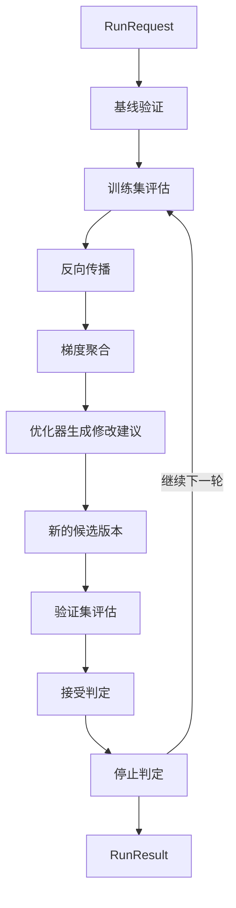
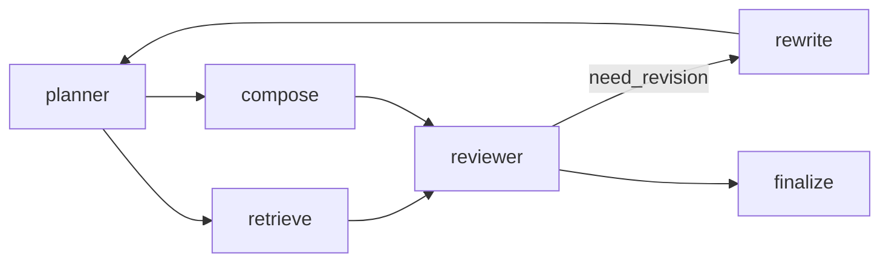
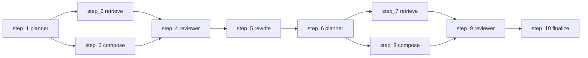

# PromptIter 使用文档

随着评估能力逐步完善，提示词优化不再只是手工修改一段提示词，再用少量样本做一次主观验证，而需要基于固定评估集、固定指标和稳定接受标准，持续得到可比较、可回归的优化结果。

Evaluation 用于评估当前版本的表现，PromptIter 用于基于训练集和验证集持续得到更好的提示词版本。它建立在 Evaluation 之上，复用评估集、评估指标和评估器体系，并在此基础上增加训练集与验证集分离、多轮优化、接受策略、停止策略、异步运行管理和 HTTP 接口等能力。

如果你还不熟悉评估集、评估指标和评估服务的基本概念，建议先阅读 [Evaluation 使用文档](evaluation.md)。

## 快速开始

本节给出一个最小使用示例，帮助读者先完成一次 PromptIter 运行，再继续理解后面的核心概念与使用方法。

PromptIter 提供以下三个示例：

- [examples/evaluation/promptiter/syncrun](https://github.com/trpc-group/trpc-agent-go/tree/main/examples/evaluation/promptiter/syncrun)，直接使用 `engine.Run(...)` 执行同步优化。
- [examples/evaluation/promptiter/asyncrun](https://github.com/trpc-group/trpc-agent-go/tree/main/examples/evaluation/promptiter/asyncrun)，通过 `manager.Start` 和 `manager.Get` 管理异步运行。
- [examples/evaluation/promptiter/server](https://github.com/trpc-group/trpc-agent-go/tree/main/examples/evaluation/promptiter/server)，通过 PromptIter HTTP 服务模块暴露接口。

本节以 `syncrun` 为例，说明最小接入方式。

### 环境准备

- Go 1.24+
- 可访问的 OpenAI 兼容模型服务
- 已准备好的训练集评估文件、验证集评估文件和指标文件

运行前需要设置模型服务环境变量。

```bash
export OPENAI_API_KEY="sk-xxx"
export OPENAI_BASE_URL="https://api.openai.com/v1"
```

### 基于本地文件的同步优化示例

本示例基于本地文件运行 PromptIter，完整代码见 [examples/evaluation/promptiter/syncrun](https://github.com/trpc-group/trpc-agent-go/tree/main/examples/evaluation/promptiter/syncrun)。

如需先完成一次运行并观察结果，可以直接进入示例目录执行 `go run .`。本节代码片段用于说明 PromptIter 依赖的组装方式，并不要求读者从零手写完整示例。

下面给出三段核心代码片段，分别用于准备评估依赖、构造 Engine 和发起运行。

#### Agent 与 Evaluator 代码片段

这段代码用于准备 PromptIter 运行依赖，主要包括三部分：

- 构建被优化的 candidate Agent，以及评估阶段使用的 judge Agent。
- 为 candidate Agent 和 judge Agent 创建 Runner。
- 复用 Evaluation 体系创建 `AgentEvaluator`，供 PromptIter 在训练集和验证集阶段执行评估。

示例中的 `candidateAgent` 是一个普通的 `llmagent`，被优化的目标是它的提示词内容。最小构造方式如下：

```go
import "trpc.group/trpc-go/trpc-agent-go/agent/llmagent"

candidateAgent, err := llmagent.New(
	candidateAgentName,
	llmagent.WithModel(candidateModel),
	llmagent.WithInstruction("You are a helpful assistant."),
)
if err != nil {
	return err
}
```

示例中的 `judgeAgent` 也是普通 Agent。下面的代码展示如何为 `candidateAgent` 和 `judgeAgent` 创建 Runner，并基于 Evaluation 体系组装 `AgentEvaluator`。

```go
import (
	"trpc.group/trpc-go/trpc-agent-go/evaluation"
	"trpc.group/trpc-go/trpc-agent-go/evaluation/evalresult"
	evalresultlocal "trpc.group/trpc-go/trpc-agent-go/evaluation/evalresult/local"
	"trpc.group/trpc-go/trpc-agent-go/evaluation/evalset"
	evalsetlocal "trpc.group/trpc-go/trpc-agent-go/evaluation/evalset/local"
	"trpc.group/trpc-go/trpc-agent-go/evaluation/evaluator/registry"
	"trpc.group/trpc-go/trpc-agent-go/evaluation/metric"
	metriclocal "trpc.group/trpc-go/trpc-agent-go/evaluation/metric/local"
	"trpc.group/trpc-go/trpc-agent-go/runner"
)

candidateRunner := runner.NewRunner(candidateAppName, candidateAgent)
judgeRunner := runner.NewRunner(judgeAppName, judgeAgent)

evalSetManager := evalsetlocal.New(evalset.WithBaseDir(cfg.DataDir))
metricManager := metriclocal.New(
	metric.WithBaseDir(cfg.DataDir),
	metric.WithLocator(&sharedMetricLocator{metricFileID: sharedMetricFileID}),
)
evalResultManager := evalresultlocal.New(evalresult.WithBaseDir(cfg.OutputDir))
registry := registry.New()

agentEvaluator, err := evaluation.New(
	appName,
	candidateRunner,
	evaluation.WithEvalSetManager(evalSetManager),
	evaluation.WithMetricManager(metricManager),
	evaluation.WithEvalResultManager(evalResultManager),
	evaluation.WithRegistry(registry),
	evaluation.WithJudgeRunner(judgeRunner),
)
if err != nil {
	return err
}
```

#### Engine 构造

这段代码为反向传播器、梯度聚合器和优化器三个工作流组件分别创建 Runner 与实例，再将这些实例与 `candidateAgent` 和 `AgentEvaluator` 一起组装为 `Engine`。

```go
import (
	"trpc.group/trpc-go/trpc-agent-go/evaluation/workflow/promptiter/aggregator"
	"trpc.group/trpc-go/trpc-agent-go/evaluation/workflow/promptiter/backwarder"
	"trpc.group/trpc-go/trpc-agent-go/evaluation/workflow/promptiter/engine"
	"trpc.group/trpc-go/trpc-agent-go/evaluation/workflow/promptiter/optimizer"
	"trpc.group/trpc-go/trpc-agent-go/runner"
)

backwarderRunner := runner.NewRunner(backwarderAppName, backwarderAgent)
aggregatorRunner := runner.NewRunner(aggregatorAppName, aggregatorAgent)
optimizerRunner := runner.NewRunner(optimizerAppName, optimizerAgent)

backwarderInstance, err := backwarder.New(ctx, backwarderRunner)
if err != nil {
	return err
}
aggregatorInstance, err := aggregator.New(ctx, aggregatorRunner)
if err != nil {
	return err
}
optimizerInstance, err := optimizer.New(ctx, optimizerRunner)
if err != nil {
	return err
}

engineInstance, err := engine.New(
	ctx,
	candidateAgent,
	agentEvaluator,
	backwarderInstance,
	aggregatorInstance,
	optimizerInstance,
)
if err != nil {
	return err
}
```

#### 构造请求并执行

这段代码构造 `RunRequest`，用于指定训练集、验证集、评估执行参数、接受策略、停止策略以及待优化的目标可编辑位置，然后调用 `engine.Run(...)` 发起一次多轮优化运行。

```go
import (
	astructure "trpc.group/trpc-go/trpc-agent-go/agent/structure"
	"trpc.group/trpc-go/trpc-agent-go/evaluation/workflow/promptiter/engine"
)

targetScore := 1.0
targetSurfaceID := astructure.SurfaceID(candidateAgentName, astructure.SurfaceTypeInstruction)

result, err := engineInstance.Run(ctx, &engine.RunRequest{
	TrainEvalSetIDs:      []string{"nba-commentary-train"},
	ValidationEvalSetIDs: []string{"nba-commentary-validation"},
	EvaluationOptions: engine.EvaluationOptions{
		EvalCaseParallelism:               8,
		EvalCaseParallelInferenceEnabled:  true,
		EvalCaseParallelEvaluationEnabled: true,
	},
	AcceptancePolicy: engine.AcceptancePolicy{
		MinScoreGain: 0.005,
	},
	StopPolicy: engine.StopPolicy{
		MaxRoundsWithoutAcceptance: 5,
		TargetScore:                &targetScore,
	},
	MaxRounds:        4,
	TargetSurfaceIDs: []string{targetSurfaceID},
})
if err != nil {
	return err
}
```

#### 评估文件

PromptIter 的评估数据沿用 Evaluation 的文件组织方式，只是在一次运行中会同时使用训练集和验证集。示例目录结构如下所示。

```bash
data/
  promptiter-nba-commentary-app/
    nba-commentary-train.evalset.json
    nba-commentary-validation.evalset.json
    sports-commentary.metrics.json
```

这三类文件的职责如下：

- `nba-commentary-train.evalset.json` 作为训练集，用于生成优化信号和修改建议。PromptIter 会在每一轮先基于训练集完成前向推理和指标评估，再从失败样本中提取 loss、做反向传播和梯度聚合。
- `nba-commentary-validation.evalset.json` 作为验证集，用于判断当前改动是否应该被接受。训练集负责提供优化信号，验证集负责判断当前改动是否真的更好。这两类评估集分工不同，不应混用。
- `sports-commentary.metrics.json` 作为评估指标文件，用于定义评估指标。PromptIter 直接复用 Evaluation 的评估指标。示例默认使用 `llm_rubric_reference_critic` 和 `final_response_length_compliance` 两条指标，前者负责与参考答案的内容对齐，后者负责长度约束。示例直接使用 EvalSet 中的静态参考答案完成参考答案对齐评估。

#### 执行运行

```bash
cd examples/evaluation/promptiter/syncrun
export OPENAI_API_KEY="sk-xxx"
export OPENAI_BASE_URL="https://api.openai.com/v1"
go run .
```

#### 查看结果

运行完成后，结果主要通过以下两处查看：

- 终端输出，用于查看初始提示词、最终接受的提示词、每轮分数和停止原因。
- 输出目录，用于查看每轮训练集和验证集评估结果及中间文件。

同步运行时，`engine.Run(...)` 会直接返回 `RunResult`。异步运行以及返回运行结果的 HTTP 接口也都使用 `RunResult` 作为结果数据结构。

## 核心概念

PromptIter 在 Evaluation 之上增加了一条多轮优化流程。它的核心输入包括训练集、验证集、目标可编辑位置和运行策略，核心输出是一次运行的结果 `RunResult`。

`Engine` 负责执行整条优化流程。这里的训练集评估和验证集评估都包含前向推理与指标评估两个子步骤。下图用于说明各个运行阶段之间的先后关系以及回到下一轮的循环路径。



一次 PromptIter 运行通常按以下顺序展开：

1. 读取 `RunRequest`，确定训练集、验证集、目标可编辑位置和运行策略。
2. 对当前候选版本执行一次基线验证。
3. 使用训练集完成前向推理与指标评估，并从失败样本中提取 loss。
4. 将 loss 交给反向传播器和梯度聚合器，得到聚合后的优化信号。
5. 由优化器根据聚合后的优化信号生成修改建议，形成新的候选版本。
6. 使用验证集对新的候选版本完成前向推理与指标评估。
7. 根据接受策略决定是否接受当前改动，并根据停止策略判断是否结束本次运行。
8. 未触发停止条件时，下一轮会从训练集评估重新开始。

PromptIter 由评估、归因、聚合、优化器生成修改建议、接受判定和停止判定组成一条多轮流程。下面从评估数据、目标可编辑位置、候选版本、修改建议、运行输入输出以及接入方式几个方面展开说明。

### 评估体系

PromptIter 直接建立在 Evaluation 之上，复用其中的评估数据与评估执行流程。

- `EvalSet` 用于定义训练集和验证集中的评估用例。
- `EvalMetric` 用于定义每条评估指标的打分规则。
- `Evaluator` 用于执行单条指标的评分逻辑。
- `EvalResult` 用于承载每次评估运行的结果明细。
- `AgentEvaluator` 用于组织一次完整评估，读取评估集、指标和评估器，并返回评估结果。

在 PromptIter 中，训练集评估和验证集评估都会通过 `AgentEvaluator` 执行。区别在于训练集评估的结果会继续进入 loss 提取、反向传播和梯度聚合流程，而验证集评估的结果主要用于接受判定与停止判定。

如需进一步了解评估集、评估指标、评估器和评估结果的定义，可参考 [评估集 EvalSet](evaluation.md#评估集-evalset)、[评估指标 EvalMetric](evaluation.md#评估指标-evalmetric)、[Evaluator](evaluation.md#evaluator)、[评估结果 EvalResult](evaluation.md#评估结果-evalresult) 与 [AgentEvaluator](evaluation.md#agentevaluator)。

### 训练集与验证集

PromptIter 一次运行中会同时使用两类评估集：

- 训练集用于产生优化信号。
- 验证集用于判断当前改动是否应该被接受。

训练集分数可以很高，但验证集仍然可能拒绝当前改动。因此，训练集提升只说明当前改动提供了更强的优化信号，是否接受该改动仍以验证集结果为准。

### 结构快照与 Surface

结构快照是对 Agent 静态结构的导出结果，其中包含节点、边以及可编辑的 `surface`。`Surface` 表示某个节点上的稳定可编辑基线面，例如 `instruction`、`model`、`tool`、`skill`。每个 `surface` 都有稳定的 `SurfaceID`，PromptIter 通过 `TargetSurfaceIDs` 指定本次运行允许优化的目标可编辑位置。

PromptIter 会先读取结构快照，再定位其中允许被优化的 `surface`。推荐做法是先通过结构快照获取可编辑位置，再将目标写入 `TargetSurfaceIDs`。不要假设所有 Agent 都只有一个 instruction surface，也不要直接在业务代码中硬编码结构之外的字段。

如需进一步了解结构导出和运行时 surface 覆盖方式，可参考 [静态结构导出](agent.md#静态结构导出) 与 [按 `nodeID` 覆盖运行时 surface](agent.md#按-nodeid-覆盖运行时-surface) 两节。

### 执行 Trace

执行 Trace 记录的是某次评估实际发生的执行步骤，以及这些步骤之间的真实依赖关系。这里的步骤表示某个静态节点在一次具体运行中的一次执行记录。同一个节点在不同分支、不同轮次或循环路径中可能被执行多次，因此一次 Trace 中可能出现多个对应同一 `NodeID` 的步骤。它用于描述一次具体运行的事实记录。

每个步骤通常关心这些信息：

- `NodeID`，表示该步骤对应的静态节点。
- `PredecessorStepIDs`，表示该步骤在本次运行中的直接前驱步骤。
- `Input` 和 `Output`，表示该步骤看到的输入输出快照。
- `Error`，表示该步骤执行失败时的错误信息。

PromptIter 使用执行 Trace 来定位问题出现在哪些步骤上，并决定 loss 和梯度应该沿哪条路径传播。

### 反向传播

训练集评估得到失败样本和执行 Trace 之后，PromptIter 会先进入反向传播环节。反向传播用于将失败样本转换为可传播的归因信号。它会结合步骤的输入输出快照、前驱步骤和可编辑位置，判断问题首先出现在哪里，以及这些问题是否需要继续向上游传播。

### 梯度聚合

梯度聚合用于将多个样本、多个步骤上的局部归因信号按 `SurfaceID` 合并，得到面向单个可编辑位置的统一优化信号。这个阶段负责把局部、分散的失败信号收敛成下一步可以消费的稳定输入。

### 优化

优化用于根据当前可编辑位置的基线值和聚合后的优化信号生成修改建议，最终形成新的候选版本。评估负责发现问题，反向传播负责归因与传播，梯度聚合负责收敛信号，优化负责生成新的修改建议。

### 工作原理示例

可以用一个更接近真实业务编排的例子，把静态结构图、执行 Trace、评估、反向传播、梯度聚合和优化器串起来理解。这个例子对应一类常见的多阶段工作流：先由 `planner` 规划处理方式，再由 `retrieve` 检索外部信息、`compose` 生成回答草稿，最后由 `reviewer` 统一审核；如果审核认为当前结果仍需修订，就进入 `rewrite` 并重新回到 `planner`，否则直接 `finalize`。

静态结构图可能如下：



这张图表达的是这个工作流的稳定结构：

- `planner` 负责拆解任务，因此它之后会 fan-out 到 `retrieve` 和 `compose` 两个分支。
- `reviewer` 是一个 fan-in 节点，表示它可能同时依赖前面的多个分支。
- `reviewer -> rewrite` 是条件边，表示满足修订条件时会回到上游节点继续处理。
- `rewrite -> planner` 表示图上允许再次回到上游节点，形成循环。
- 可编辑位置固定挂在静态节点上，例如 `planner#instruction` 和 `reviewer#instruction`。

某次评估实际跑出来的执行 Trace 可能如下：



这条 Trace 表达的是本次运行真实发生的步骤：

- `planner` 两次都触发了 `retrieve` 和 `compose` 两个下游分支，这是 fan-out。
- `reviewer` 两次都同时依赖 `retrieve` 和 `compose` 两个前驱步骤，这是 fan-in。
- 第一次经过 `reviewer` 时走向了 `rewrite`，随后又回到 `planner`，这是一次循环。
- 第二次经过 `reviewer` 时走向了 `finalize`，表示这次没有再进入修订分支。

基于这个例子，可以按以下顺序理解 PromptIter 的一轮运行：

1. 训练集评估先得到这次运行的实际输出、分数和执行 Trace。此时静态结构图不变，但系统已经知道这次真实走到了哪些步骤，以及哪些节点没有执行到。
2. 如果训练集评估发现 `step_9 reviewer` 的输出质量不够，loss 会落在这个步骤上。`Backwarder` 会基于 `step_9` 的输入输出快照、前驱步骤和可编辑位置，把问题转换为步骤级梯度。
3. 如果问题主要出在 `reviewer` 自身的表达方式，`Backwarder` 可能直接把梯度归因到 `reviewer#instruction`；如果问题来自上游信息不足，也可能继续向 `step_7 retrieve` 和 `step_8 compose` 传播，再进一步回到共享前驱 `step_6 planner`。
4. 不同样本、不同步骤、不同分支产生的梯度，最终会通过 `Aggregator` 按 `SurfaceID` 合并。例如，多个步骤都可能把问题归因到 `planner#instruction`，这些梯度会被合并成一个统一信号。
5. `Optimizer` 会面向单个 `surface` 的当前基线值和聚合后的梯度，生成对应的 `SurfacePatch`。
6. `Engine` 将 `SurfacePatch` 应用到当前候选版本，得到新的 `Profile`，再交给验证集评估。
7. 验证集负责判断这一轮修改是否真的更好。如果分数提升满足接受策略，则新的候选版本成为已接受版本；否则回退到上一版，并决定是否继续下一轮。

这个例子说明三层信息各自承担的职责：

- 静态结构图用于确定哪些位置可以修改。
- 执行 Trace 用于确定这次运行里问题出现在哪些步骤上，以及梯度应该沿哪条路径传播。
- `Backwarder`、`Aggregator` 和 `Optimizer` 负责把步骤级问题逐步转换成 `surface` 级修改建议。

关于执行图的导出方式，可参考 [执行图导出](agent.md#执行图导出) 一节；如需进一步了解 graph 中的 fan-out、join 和循环语义，可参考 [Graph 使用文档](graph.md) 中关于并行边、Join 和 BSP 超步屏障的说明。

### Profile

`Profile` 用于表示一组应用在结构快照之上的覆盖值。每接受一轮修改，PromptIter 就会生成新的候选配置版本，并将其作为下一轮输入。

```go
import astructure "trpc.group/trpc-go/trpc-agent-go/agent/structure"

type Profile struct {
	StructureID string            // StructureID 表示当前候选版本所属的结构版本。
	Overrides   []SurfaceOverride // Overrides 表示各个可编辑位置上的覆盖值。
}

type SurfaceOverride struct {
	SurfaceID string                  // SurfaceID 表示目标可编辑位置。
	Value     astructure.SurfaceValue // Value 表示该可编辑位置上的候选值。
}
```

### PatchSet

`PatchSet` 表示一轮优化器生成的候选修改建议集合。

```go
import astructure "trpc.group/trpc-go/trpc-agent-go/agent/structure"

type PatchSet struct {
	Patches []SurfacePatch // Patches 表示当前轮生成的修改建议列表。
}

type SurfacePatch struct {
	SurfaceID string                  // SurfaceID 表示该修改作用于哪个可编辑位置。
	Value     astructure.SurfaceValue // Value 表示新的候选值。
	Reason    string                  // Reason 表示生成该修改建议的原因说明。
}
```

优化器输出的是 `PatchSet`，engine 会将其中的修改应用到当前候选版本，形成新的候选版本，再交给验证集决定是否接受。

### RunRequest

`RunRequest` 描述一次 PromptIter 运行的输入。

```go
import (
	"trpc.group/trpc-go/trpc-agent-go/evaluation/workflow/promptiter"
	"trpc.group/trpc-go/trpc-agent-go/runner"
)

type RunRequest struct {
	TrainEvalSetIDs      []string            // TrainEvalSetIDs 表示训练集 EvalSet ID 列表。
	ValidationEvalSetIDs []string            // ValidationEvalSetIDs 表示验证集 EvalSet ID 列表。
	InitialProfile       *promptiter.Profile // InitialProfile 表示第一轮开始前的初始候选版本。
	Teacher              runner.Runner       // Teacher 表示按需动态生成参考答案时使用的 Runner。
	Judge                runner.Runner       // Judge 表示 Judge 类指标按需使用的 Runner。
	EvaluationOptions    EvaluationOptions   // EvaluationOptions 表示评估执行参数。
	AcceptancePolicy     AcceptancePolicy    // AcceptancePolicy 表示接受策略。
	StopPolicy           StopPolicy          // StopPolicy 表示停止策略。
	MaxRounds            int                 // MaxRounds 表示最大优化轮数。
	TargetSurfaceIDs     []string            // TargetSurfaceIDs 表示本次运行允许修改的可编辑位置列表。
}
```

#### EvaluationOptions

`EvaluationOptions` 用于控制评估阶段的并发方式。

```go
type EvaluationOptions struct {
	EvalCaseParallelism               int  // EvalCaseParallelism 表示评估样本并发数上限。
	EvalCaseParallelInferenceEnabled  bool // EvalCaseParallelInferenceEnabled 表示是否并行执行推理。
	EvalCaseParallelEvaluationEnabled bool // EvalCaseParallelEvaluationEnabled 表示是否并行执行评估。
}
```

它与 Evaluation 中的评估选项保持一致。PromptIter 直接复用 Evaluation 的并发执行方式，并在内部固定使用单次评估结果。

#### AcceptancePolicy 与 StopPolicy

`AcceptancePolicy` 与 `StopPolicy` 分别控制是否接受当前改动以及何时停止本次运行。

```go
type AcceptancePolicy struct {
	MinScoreGain float64 // MinScoreGain 表示接受当前改动所需的最小验证集分数增量。
}

type StopPolicy struct {
	MaxRoundsWithoutAcceptance int      // MaxRoundsWithoutAcceptance 表示连续未接受轮数的上限。
	TargetScore                *float64 // TargetScore 表示已接受分数达到该阈值后停止运行。
}
```

对应的判定结果会出现在每轮 `RoundResult` 中：

```go
type AcceptanceDecision struct {
	Accepted   bool    // Accepted 表示当前轮是否被接受。
	ScoreDelta float64 // ScoreDelta 表示相对已接受基线的验证集分数增量。
	Reason     string  // Reason 表示接受判定的原因说明。
}

type StopDecision struct {
	ShouldStop bool   // ShouldStop 表示当前轮结束后是否停止运行。
	Reason     string // Reason 表示停止判定的原因说明。
}
```

下面这些参数通常作为示例推荐值使用，并非框架强制默认值：

- `MinScoreGain = 0.005`
- `MaxRounds = 4`
- `MaxRoundsWithoutAcceptance = 5`
- `TargetScore = 1.0`

这些示例推荐值通常对应以下运行语义：

- 当验证集分数提升达到 `MinScoreGain` 时，当前轮改动才会被接受。
- 当达到 `MaxRounds`、连续多轮未接受，或已达到 `TargetScore` 时，本次运行停止。

如果希望减少抖动带来的误接受，可以适当提高 `MinScoreGain`。如果希望更早结束长时间无效迭代，可以降低 `MaxRoundsWithoutAcceptance`。如果希望在达到既定质量线后立即退出，可以设置 `TargetScore`。

### RunResult

`RunResult` 表示一次 PromptIter 运行的结果与状态快照。它既是同步运行的最终结果，也是异步运行查询时返回的状态快照。

```go
import (
	astructure "trpc.group/trpc-go/trpc-agent-go/agent/structure"
	"trpc.group/trpc-go/trpc-agent-go/evaluation/workflow/promptiter"
)

type RunResult struct {
	ID                 string               // ID 表示运行标识。
	Status             RunStatus            // Status 表示当前运行状态。
	CurrentRound       int                  // CurrentRound 表示当前执行到第几轮。
	Structure          *astructure.Snapshot // Structure 表示本次运行使用的结构快照。
	BaselineValidation *EvaluationResult    // BaselineValidation 表示优化开始前的基线验证结果。
	AcceptedProfile    *promptiter.Profile  // AcceptedProfile 表示当前已接受的最佳候选版本。
	Rounds             []RoundResult        // Rounds 表示每一轮的详细结果。
	ErrorMessage       string               // ErrorMessage 表示失败或取消时的错误信息。
}

type RoundResult struct {
	Round         int                   // Round 表示当前轮次。
	InputProfile  *promptiter.Profile   // InputProfile 表示当前轮输入的候选版本。
	Train         *EvaluationResult     // Train 表示训练集评估结果。
	Losses        []promptiter.CaseLoss // Losses 表示从失败样本中提取的 loss。
	Backward      *BackwardResult       // Backward 表示反向传播结果。
	Aggregation   *AggregationResult    // Aggregation 表示梯度聚合结果。
	Patches       *promptiter.PatchSet  // Patches 表示优化器生成的修改建议。
	OutputProfile *promptiter.Profile   // OutputProfile 表示应用修改建议后的候选版本。
	Validation    *EvaluationResult     // Validation 表示验证集评估结果。
	Acceptance    *AcceptanceDecision   // Acceptance 表示当前轮的接受判定。
	Stop          *StopDecision         // Stop 表示当前轮的停止判定。
}
```

#### 结果查看

结果通常从以下位置查看：

- `RunResult.BaselineValidation`，用于查看优化开始前的基线分数。
- `RunResult.AcceptedProfile`，用于查看当前已接受的最佳版本。
- `RunResult.Rounds`，用于查看每一轮的训练集评估结果、验证集评估结果、修改建议和判定结果。
- `RoundResult.Acceptance`，用于查看当前轮是否被接受以及分数增量。
- `RoundResult.Stop`，用于查看当前轮是否触发停止条件。

下面是一段典型的结果摘要：

```text
Initial validation score: 0.35
Final accepted validation score: 0.92
Round 1 -> train 0.25, validation 0.81, accepted true, delta 0.46
Round 2 -> train 0.88, validation 0.92, accepted true, delta 0.12
Round 3 -> train 1.00, validation 0.90, accepted false, delta -0.02
```

上述结果的含义如下：

- `Initial validation score` 表示基线分数。
- `Final accepted validation score` 表示本次运行最终接受版本的分数。
- `accepted true` 表示该轮修改被接受。
- `accepted false` 表示该轮修改被拒绝，已有最佳版本保持不变。
- `delta` 表示该轮相对当前已接受版本的验证集分数增量。

如需查看完整评估明细，可以继续查看每轮 `EvaluationResult` 中的 `EvalSets`、`Cases` 和各项 metric 分数。

### 反向传播 Backwarder

`Backwarder` 负责将失败样本、trace 和 loss 转换为逐样本梯度，用于确定问题主要出现在何处，以及这些问题应归因到哪些可编辑位置。

### 梯度聚合 Aggregator

`Aggregator` 负责将同一个可编辑位置上来自多个样本的梯度聚合为统一信号，用于提取跨样本重复出现的问题。

### 优化器 Optimizer

`Optimizer` 负责根据聚合后的梯度生成修改建议，用于确定当前可编辑位置应如何调整。

## 使用方法

PromptIter 的用户接入通常围绕四类对象展开：

- `RunRequest`，用于描述一次运行的输入。
- `RunResult`，用于查看一次运行的状态与结果。
- `Engine` 与工作流组件，用于执行同步优化并按需替换多轮优化链路中的关键组件。
- `Manager / Store`，用于选择异步和持久化接入方式。
- PromptIter HTTP 服务模块，用于通过 HTTP 暴露接口。

常见的接入顺序如下：

- 仅需本地同步运行时，优先使用 `engine`。对应示例见 [syncrun](https://github.com/trpc-group/trpc-agent-go/tree/main/examples/evaluation/promptiter/syncrun)。
- 需要异步运行生命周期管理时，引入 `manager`。对应示例见 [asyncrun](https://github.com/trpc-group/trpc-agent-go/tree/main/examples/evaluation/promptiter/asyncrun)。
- 需要远程触发和平台化接入时，再使用 PromptIter HTTP 服务模块。对应示例见 [server](https://github.com/trpc-group/trpc-agent-go/tree/main/examples/evaluation/promptiter/server)。

### 反向传播器 Backwarder

`Backwarder` 负责将失败样本、trace 和 loss 转换为逐样本梯度。

```go
type Backwarder interface {
	Backward(ctx context.Context, request *Request) (*Result, error)
}
```

默认实现通过 `backwarder.New(ctx, runner, opts...)` 创建。构造时支持以下选项：

- `WithRunOptions(...)`，用于向内部 Runner 调用继续附加 `agent.RunOption`。
- `WithMessageBuilder(...)`，用于自定义如何将 `Backwarder.Request` 编码成发送给 Runner 的消息。
- `WithUserIDSupplier(...)`，用于自定义每次反向传播调用使用的 `userID`。
- `WithSessionIDSupplier(...)`，用于自定义每次反向传播调用使用的 `sessionID`。

大多数场景直接使用默认构造即可。只有在需要复用统一的 Runner 选项、替换默认上下文组织方式，或与既有会话标识体系对齐时，才需要显式配置这些选项。

`Request` 中包含当前步骤的输入输出快照、关联的可编辑位置、前驱步骤和传入梯度，`Result` 中则包含两类输出：

- `Gradients`，表示当前步骤上归因到各个可编辑位置的梯度。
- `Upstream`，表示仍然需要继续传播到前驱步骤的梯度。

默认实现会将一条 `Backwarder.Request` 直接组织成单步上下文，再交给 Runner 执行。这个上下文主要包括：

- 当前评估样本标识，例如 `EvalSetID` 与 `EvalCaseID`。
- 当前步骤本身的信息，例如 `Node`、`StepID`、`Input`、`Output` 与 `Error`。
- 当前步骤可归因的可编辑位置，即 `Surfaces` 和 `AllowedGradientSurfaceIDs`。
- 当前步骤的直接前驱步骤，即 `Predecessors`。
- 从下游传回当前步骤的梯度包，即 `Incoming`。

默认 `Backwarder` 会将这些内容序列化为一条用户消息，并通过结构化输出约束结果只能返回两类内容：

- 当前步骤上归因到各个可编辑位置的 `Gradients`。
- 仍需继续传播到前驱步骤的 `Upstream`。

Backwarder 负责将失败样本转换为可传播的归因信号，用于确定失败主要应归因到哪些可编辑位置，以及这些问题如何继续向上游步骤传播。

### 梯度聚合器 Aggregator

`Aggregator` 负责将同一个可编辑位置上来自多个样本的梯度合并为统一信号。

```go
type Aggregator interface {
	Aggregate(ctx context.Context, request *Request) (*Result, error)
}
```

默认实现通过 `aggregator.New(ctx, runner, opts...)` 创建。构造时支持以下选项：

- `WithRunOptions(...)`，用于向内部 Runner 调用继续附加 `agent.RunOption`。
- `WithMessageBuilder(...)`，用于自定义如何将 `aggregator.Request` 编码成发送给 Runner 的消息。
- `WithUserIDSupplier(...)`，用于自定义每次梯度聚合调用使用的 `userID`。
- `WithSessionIDSupplier(...)`，用于自定义每次梯度聚合调用使用的 `sessionID`。

大多数场景直接使用默认构造即可。只有在需要复用统一的 Runner 选项、替换默认上下文组织方式，或与既有会话标识体系对齐时，才需要显式配置这些选项。

其中：

- `Request.SurfaceID` 表示当前要聚合的目标可编辑位置。
- `Request.Gradients` 表示该可编辑位置上所有样本产生的梯度。
- `Result.Gradient` 表示聚合后的单个可编辑位置级信号。

默认实现会将一条 `aggregator.Request` 直接组织成单个可编辑位置的聚合上下文，再交给 Runner 执行。这个上下文主要包括：

- 当前要聚合的目标可编辑位置，即 `SurfaceID`。
- 该可编辑位置所属的静态节点，即 `NodeID`。
- 该可编辑位置的类型，即 `Type`。
- 来自多个样本的原始梯度列表，即 `Gradients`。

默认 `Aggregator` 会将这些内容序列化为一条用户消息，并要求 Runner 返回一条聚合后的 `AggregatedSurfaceGradient`，供下一阶段优化器直接使用。

Aggregator 负责将多个样本上的局部梯度收敛为统一信号，用于提取跨样本重复出现的问题。

### 优化器 Optimizer

`Optimizer` 负责根据聚合后的梯度生成修改建议。

```go
type Optimizer interface {
	Optimize(ctx context.Context, request *Request) (*Result, error)
}
```

默认实现通过 `optimizer.New(ctx, runner, opts...)` 创建。构造时支持以下选项：

- `WithRunOptions(...)`，用于向内部 Runner 调用继续附加 `agent.RunOption`。
- `WithMessageBuilder(...)`，用于自定义如何将 `optimizer.Request` 编码成发送给 Runner 的消息。
- `WithUserIDSupplier(...)`，用于自定义每次优化调用使用的 `userID`。
- `WithSessionIDSupplier(...)`，用于自定义每次优化调用使用的 `sessionID`。

大多数场景直接使用默认构造即可。只有在需要复用统一的 Runner 选项、替换默认上下文组织方式，或与既有会话标识体系对齐时，才需要显式配置这些选项。

其中：

- `Request.Surface` 表示当前可编辑位置的基线值。
- `Request.Gradient` 表示该可编辑位置上的聚合梯度。
- `Result.Patch` 表示生成的修改建议。

默认实现会将一条 `optimizer.Request` 直接组织成单个可编辑位置的优化上下文，再交给 Runner 执行。这个上下文主要包括：

- 当前可编辑位置本身，即 `Surface`。
- 该可编辑位置的当前基线值。
- 针对该可编辑位置的聚合梯度，即 `Gradient`。

默认 `Optimizer` 会将这些内容序列化为一条用户消息，并要求 Runner 返回一条 `SurfacePatch`，其中包含新的候选值和对应的原因说明。

Optimizer 负责将聚合后的梯度转换为具体修改建议，用于确定当前可编辑位置应如何调整。

### 运行引擎 Engine

如果只需要直接执行一次 PromptIter 运行，推荐使用 `engine` 包。`Engine` 负责将反向传播器、梯度聚合器和优化器三个组件串成一次完整的多轮优化流程。

对应示例见 [syncrun](https://github.com/trpc-group/trpc-agent-go/tree/main/examples/evaluation/promptiter/syncrun)。

```go
import (
	astructure "trpc.group/trpc-go/trpc-agent-go/agent/structure"
)

type Engine interface {
	Describe(ctx context.Context) (*astructure.Snapshot, error)
	Run(ctx context.Context, request *RunRequest, opts ...Option) (*RunResult, error)
}
```

其中：

- `Describe` 用于返回当前结构快照。
- `Run` 用于执行多轮提示词优化。

默认实现通过 `engine.New(ctx, targetAgent, agentEvaluator, backwarder, aggregator, optimizer)` 创建。创建时需要显式注入五类依赖：被优化的目标 Agent、训练集和验证集评估使用的 `agentEvaluator`，以及反向传播器、梯度聚合器和优化器三个工作流组件。

其中，`targetAgent` 用于提供结构快照。`Engine` 会通过它导出静态结构图，用于确定可编辑位置、校验 `TargetSurfaceIDs`、规范化 `Profile`，并实现 `Describe()`。`agentEvaluator` 则负责执行训练集和验证集评估，两者分别对应结构描述与评估执行两类能力，职责并不重叠。

`Engine` 的 option 出现在 `Run(...)` 调用阶段。当前运行期只提供 `WithObserver(...)`，用于在单次运行期间接收阶段事件；除观察能力之外，`Engine` 不额外暴露其他运行期 option。

#### 运行观察 Observer

`engine.Run` 支持通过 `WithObserver(...)` 注入运行观察器，用于在单次运行中接收阶段事件。

```go
type Observer func(ctx context.Context, event *Event) error

type Event struct {
	Kind    EventKind
	Round   int
	Payload any
}
```

典型事件包括：

- `structure_snapshot`
- `baseline_validation`
- `round_train_evaluation`
- `round_losses`
- `round_backward`
- `round_aggregation`
- `round_patch_set`
- `round_output_profile`
- `round_validation`
- `round_completed`

如果仅需本地同步调试，通常直接查看 `RunResult` 即可；如果需要在运行过程中感知阶段变化，再引入 `Observer`。

### 运行管理器 Manager

如果需要异步运行的生命周期管理，可以使用 `manager` 包。

对应示例见 [asyncrun](https://github.com/trpc-group/trpc-agent-go/tree/main/examples/evaluation/promptiter/asyncrun)。

#### 接口定义

```go
import (
	"trpc.group/trpc-go/trpc-agent-go/evaluation/workflow/promptiter/engine"
)

type Manager interface {
	Start(ctx context.Context, request *engine.RunRequest) (*engine.RunResult, error)
	Get(ctx context.Context, runID string) (*engine.RunResult, error)
	Cancel(ctx context.Context, runID string) error
	Close() error
}
```

#### 使用方式

最小调用方式如下。

```go
import "trpc.group/trpc-go/trpc-agent-go/evaluation/workflow/promptiter/manager"

managerInstance, err := manager.New(engineInstance)
if err != nil {
	return err
}
defer managerInstance.Close()

run, err := managerInstance.Start(ctx, request)
if err != nil {
	return err
}

current, err := managerInstance.Get(ctx, run.ID)
if err != nil {
	return err
}
_ = current
```

Manager 适合以下场景：

- 后台任务
- 前端轮询进度
- 需要取消的长时间运行
- 需要跨请求查询运行状态

### 运行存储 Store

异步运行的结果持久化通过 `store` 包完成。

#### 接口定义

```go
import (
	"trpc.group/trpc-go/trpc-agent-go/evaluation/workflow/promptiter/engine"
)

type Store interface {
	Create(ctx context.Context, run *engine.RunResult) error
	Get(ctx context.Context, runID string) (*engine.RunResult, error)
	Update(ctx context.Context, run *engine.RunResult) error
	Close() error
}
```

#### InMemory 实现

`store/inmemory` 适合本地调试与测试。该实现不依赖外部存储，进程退出后数据会丢失。

#### MySQL 实现

`store/mysql` 适合跨进程持久化与平台查询。该实现会将 `RunResult` 序列化后存入 MySQL，并支持手工初始化 schema 或自动建表。

当前实现使用单表保存运行记录，核心字段包括 `run_id`、`status`、序列化后的 `run_result`，以及 `created_at`、`updated_at` 等时间字段。完整表结构可参考 [schema.sql](https://github.com/trpc-group/trpc-agent-go/tree/main/evaluation/workflow/promptiter/store/mysql/schema.sql)。

### HTTP 接口

如果需要通过 HTTP 触发 PromptIter，可以使用 PromptIter HTTP 服务模块。

对应示例见 [server](https://github.com/trpc-group/trpc-agent-go/tree/main/examples/evaluation/promptiter/server)。

#### 请求与响应

PromptIter HTTP 服务模块公开的核心 payload 如下：

```go
import (
	astructure "trpc.group/trpc-go/trpc-agent-go/agent/structure"
	"trpc.group/trpc-go/trpc-agent-go/evaluation/workflow/promptiter/engine"
)

type RunRequest struct {
	Run *engine.RunRequest `json:"run"`
}

type RunResponse struct {
	Result *engine.RunResult `json:"result"`
}

type GetStructureResponse struct {
	Structure *astructure.Snapshot `json:"structure"`
}
```

#### 服务构建

最小构建方式如下。

```go
import promptiterserver "trpc.group/trpc-go/trpc-agent-go/server/promptiter"

server, err := promptiterserver.New(
	promptiterserver.WithAppName(appName),
	promptiterserver.WithBasePath("/promptiter/v1/apps"),
	promptiterserver.WithEngine(engineInstance),
	promptiterserver.WithManager(managerInstance),
)
if err != nil {
	return err
}

return http.ListenAndServe(":8080", server.Handler())
```

#### 路由

当 `WithBasePath("/promptiter/v1/apps")` 与 `WithAppName(appName)` 同时生效时，完整接口路径如下：

- `GET /promptiter/v1/apps/{appName}/structure`
- `POST /promptiter/v1/apps/{appName}/runs`
- `POST /promptiter/v1/apps/{appName}/async-runs`
- `GET /promptiter/v1/apps/{appName}/async-runs/{run_id}`
- `POST /promptiter/v1/apps/{appName}/async-runs/{run_id}/cancel`

推荐的调用顺序如下：

1. 通过 `/promptiter/v1/apps/{appName}/structure` 获取结构快照和目标可编辑位置。
2. 构造 `RunRequest` 并写入 `TargetSurfaceIDs`。
3. 简单调用场景使用阻塞 `POST /promptiter/v1/apps/{appName}/runs`。
4. 需要生命周期管理时使用异步 `POST /promptiter/v1/apps/{appName}/async-runs` 与 `GET /promptiter/v1/apps/{appName}/async-runs/{run_id}`。
