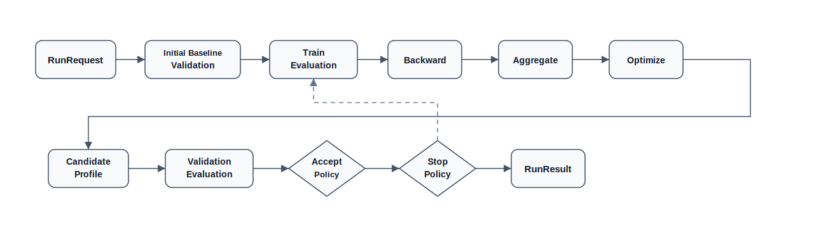
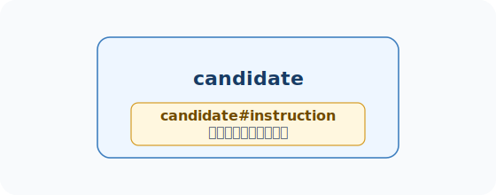
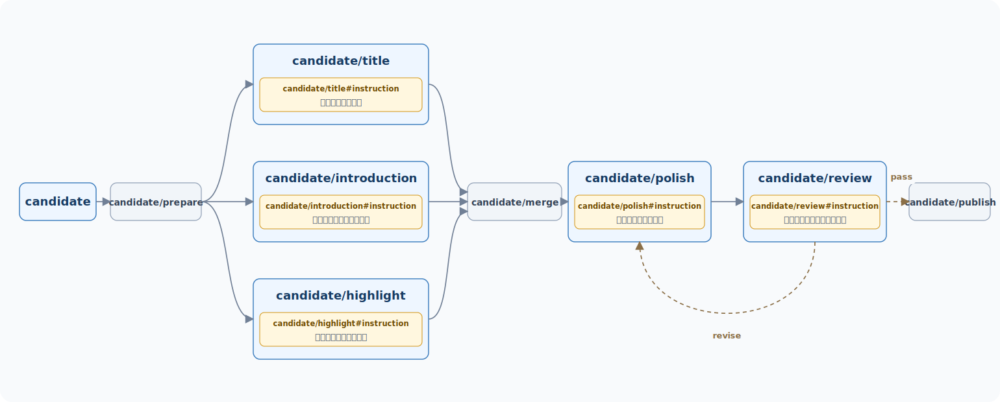
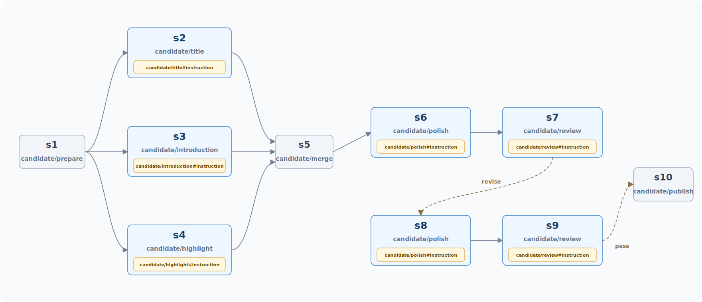
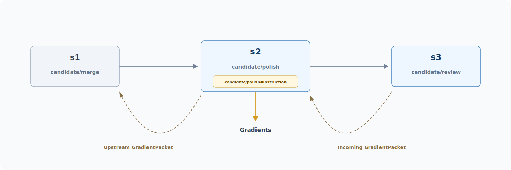

# PromptIter 使用文档

当 Agent 的提示词承载业务规则，版本风险不只来自显性失败，也来自改写后的行为漂移。一次手工改写可能修复某个失败样本，也可能降低其他场景的输出质量。训练集分数提升无法证明候选版本可被接受，验证集评估结果和接受策略共同形成候选版本的接受判定。PromptIter 将训练集、验证集、结构快照与执行轨迹组织为可复现的提示词迭代流程，并把每轮候选版本、分数、补丁和停止原因沉淀为结果快照。

tRPC-Agent-Go 框架在 Evaluation 的评估能力基础上提供 PromptIter，用于把 Agent 提示词优化从人工改写推进为受评估约束的自动化迭代流程。PromptIter 以训练集、验证集和评估指标为核心，将训练集暴露出的失败信号沿执行轨迹做反向传播归因，再通过文本梯度聚合和优化补丁生成形成候选提示词，并由验证集评估与接受策略决定候选提示词是否进入后续轮次。每次运行都会沉淀候选提示词、验证结果、接受判定和停止原因，使不同提示词版本可以在既定评估标准下被比较、审查和追踪，支持同步运行、异步运行、HTTP 迭代服务和多节点迭代。

## 背景

提示词优化在试验阶段通常依赖手工判断与改写，根据零散失败样本调整提示词，再用少量样本验证。该方式适用于探索，但难以支撑持续交付。同一处提示词改动可能同时影响任务理解、工具选择，以及最终回答的内容、结构和表达方式。单个样本上的改善只是局部信号，不能替代覆盖多场景的回归验证。

当 Agent 进入业务链路后，提示词优化的常见风险可分为四类。

1. 优化目标存在漂移风险。人工修复单个失败样本时，可能向提示词中加入过窄约束。约束范围若只覆盖当前样本，其他样本的输出质量可能下降
2. 训练信号和验收信号存在混用风险。同一批失败样本既用于产生修改建议，又用于评估候选提示词，会放大过拟合风险。更严谨的方式是让训练集负责暴露问题和产生优化信号，让验证集提供候选提示词接受判定所需的验证分数
3. 失败信号难以归因到具体节点。对于单 Agent，问题可能来自该 Agent 的提示词。对于图编排和多 Agent，问题可能来自规划、检索、草稿生成、编辑审核中的任一步。仅看最终回答，难以判断失败信号应归因到哪个节点
4. 提示词版本缺少结构化记录。手工替换提示词内容能够完成一次修改，但难以追踪候选提示词来自哪些失败信号、修改了哪些位置、因何被接受或拒绝

PromptIter 通过独立环节分别处理上述风险。Evaluation 提供可复现的评估输入和指标输出。结构快照描述待测 Agent 的静态组成，包括节点、边与节点关联的可迭代内容。执行轨迹记录本次运行实际的动态步骤路径。反向传播归因、文本梯度聚合和优化补丁生成三个阶段把失败信号逐步转成候选补丁。验证集评估结果和接受策略共同形成候选提示词的接受判定。

## 业界调研

提示词优化不只是对提示词文本进行直接改写。更稳定的方式是先定义评估标准，再从失败样本中提取修改方向，生成候选提示词，并通过独立样本验证候选提示词是否满足接受条件。业界在这个方向已有多种探索。

[ProTeGi](https://arxiv.org/abs/2305.03495) 面向单个任务提示词的自动搜索。该方法将数值优化中的梯度下降类比到自然语言场景。流程先运行当前提示词并收集错误样本，再让模型总结这些错误暴露出的提示词问题，形成自然语言梯度。随后根据自然语言梯度生成多条候选提示词，并在每轮保留得分较高的候选继续搜索，最终选择评估表现更优的版本。

[TextGrad](https://arxiv.org/abs/2406.07496) 面向复杂 AI 系统中的文本变量优化。它把系统表示为计算图，图中的变量可以是提示词、代码片段或其他文本对象。前向执行后，目标函数、评价器或下游损失信号产生反馈，LLM 将反馈写成自然语言梯度，再沿计算图反向传播到相关变量。

[DSPy](https://arxiv.org/abs/2310.03714) 面向由多个语言模型调用组成的处理流程。开发者用签名描述模块输入输出，再用程序组织模块调用关系，由编译器围绕给定指标优化示例、提示词等可学习部分。

上述方法说明，提示词优化可以围绕评估反馈、候选生成和指标验证形成自动化流程。但从业务落地看，ProTeGi 主要面向单段提示词搜索，难以直接适用于多节点 Agent 场景。TextGrad 提供通用文本变量优化抽象，但评估资产管理、候选版本验收和运行结果追踪等工程化实现仍需自行实现。DSPy 需要按其模块和签名重新组织语言模型调用流程，对已有 Agent 工程存在较高迁移成本。

tRPC-Agent-Go 通过 PromptIter 将这类优化流程落到已有 Agent 工程中，将训练集评估反馈、反向传播归因、文本梯度聚合、优化补丁生成、候选提示词构造、验证集接受判定和结果追踪组织成闭环。

## 快速开始

本节用 `examples/evaluation/promptiter/syncrun` 说明提示词同步迭代的最小接入方式。完整示例见 [examples/evaluation/promptiter/syncrun](https://github.com/trpc-group/trpc-agent-go/tree/main/examples/evaluation/promptiter/syncrun)。

示例代码覆盖以下接入方式。

- [examples/evaluation/promptiter/syncrun](https://github.com/trpc-group/trpc-agent-go/tree/main/examples/evaluation/promptiter/syncrun) 演示提示词同步迭代。
- [examples/evaluation/promptiter/asyncrun](https://github.com/trpc-group/trpc-agent-go/tree/main/examples/evaluation/promptiter/asyncrun) 演示提示词异步迭代。
- [examples/evaluation/promptiter/server](https://github.com/trpc-group/trpc-agent-go/tree/main/examples/evaluation/promptiter/server) 演示提示词迭代 HTTP 接入。
- [examples/evaluation/promptiter/multinode](https://github.com/trpc-group/trpc-agent-go/tree/main/examples/evaluation/promptiter/multinode) 演示多节点提示词迭代。

### 环境准备

运行示例前需要准备三类资源。

- 可访问的 OpenAI 兼容模型服务
- 训练集、验证集和指标文件
- 待测 Agent、裁判和 PromptIter 工作组件的模型名称

示例通过环境变量读取模型服务地址和密钥。

```bash
# 设置模型服务密钥
export OPENAI_API_KEY="sk-xxx"
# 可选，不设置时示例使用 OpenAI 兼容默认地址
export OPENAI_BASE_URL="https://api.openai.com/v1"
```

### 待测 Agent

`syncrun` 示例中的待测 Agent 名为 `candidate`，是由 `llmagent.New` 创建的 LLMAgent。示例通过 `newCandidateAgent` 创建该 Agent，并把起始提示词作为 `instruction` 传入。后续运行会把修改目标限定为 `candidate` 的 `instruction`。

默认起始提示词为 `生成一篇中文体育战报`。这段起始提示词用于展示 PromptIter 如何根据训练集失败信号生成候选补丁，并依据验证集评估结果和接受策略逐轮接受或拒绝候选提示词。

待测 Agent 和 Runner 的创建代码如下。

```go
import (
	"trpc.group/trpc-go/trpc-agent-go/agent"
	"trpc.group/trpc-go/trpc-agent-go/agent/llmagent"
	"trpc.group/trpc-go/trpc-agent-go/model"
	"trpc.group/trpc-go/trpc-agent-go/runner"
)

// newCandidateAgent 创建待测 Agent。
func newCandidateAgent(m model.Model) (agent.Agent, error) {
	// generationConfig 固定待测 Agent 的生成参数。
	generationConfig := model.GenerationConfig{
		// MaxTokens 给体育战报保留足够输出空间。
		MaxTokens:   intPtr(32768),
		// Temperature 降低同一评估用例上的随机波动。
		Temperature: floatPtr(0.0),
		// Stream 关闭流式输出，便于 Evaluation 收集完整回答。
		Stream:      false,
	}
	return llmagent.New(
		"candidate",
		llmagent.WithModel(m),
		// PromptIter 本次运行会迭代这段 instruction。
		llmagent.WithInstruction("生成一篇中文体育战报"),
		llmagent.WithGenerationConfig(generationConfig),
	), nil
}

candidateAgent, err := newCandidateAgent(candidateModel)
if err != nil {
	return nil, fmt.Errorf("create candidate agent: %w", err)
}
// Runner 是 Evaluation 执行待测 Agent 的入口。
candidateRunner := runner.NewRunner("promptiter-nba-commentary-candidate", candidateAgent)
```

### 构造 AgentEvaluator

评估阶段需要运行待测 Agent，并用训练集、验证集和指标文件计算分数。示例用 `candidateRunner` 表示待测 Agent 的运行入口，并通过 `evaluation.New` 创建 `AgentEvaluator`。使用 LLM Judge 类指标时，还需要提供作为裁判的 Judge Runner。随后示例创建本地 `EvalSetManager`、`MetricManager` 和 `EvalResultManager`，分别负责读取评估集、读取指标和保存评估结果。

```go
import (
	"trpc.group/trpc-go/trpc-agent-go/evaluation"
	"trpc.group/trpc-go/trpc-agent-go/evaluation/evalresult"
	evalresultlocal "trpc.group/trpc-go/trpc-agent-go/evaluation/evalresult/local"
	"trpc.group/trpc-go/trpc-agent-go/evaluation/evalset"
	evalsetlocal "trpc.group/trpc-go/trpc-agent-go/evaluation/evalset/local"
	"trpc.group/trpc-go/trpc-agent-go/evaluation/metric"
	metriclocal "trpc.group/trpc-go/trpc-agent-go/evaluation/metric/local"
	"trpc.group/trpc-go/trpc-agent-go/runner"
)

// 使用 LLM Judge 类指标时，需要提供裁判 Runner。
judgeRunner := runner.NewRunner(judgeAppName, judgeAgent)

// 评估集、指标和评估结果分别由对应 Manager 管理。
evalSetManager := evalsetlocal.New(evalset.WithBaseDir("./data"))
metricManager := metriclocal.New(metric.WithBaseDir("./data"))
evalResultManager := evalresultlocal.New(evalresult.WithBaseDir("./output"))

// AgentEvaluator 负责执行训练集和验证集评估。
agentEvaluator, err := evaluation.New(
	appName,
	candidateRunner,
	evaluation.WithEvalSetManager(evalSetManager),
	evaluation.WithMetricManager(metricManager),
	evaluation.WithEvalResultManager(evalResultManager),
	evaluation.WithJudgeRunner(judgeRunner),
)
if err != nil {
	return err
}
```

### 评估文件

本地 `EvalSetManager` 和 `MetricManager` 会从示例的数据目录读取评估集和指标文件。PromptIter 沿用 Evaluation 的本地文件组织方式。一次 PromptIter 运行通过评估集 ID 指定要使用的训练集和验证集。完整示例复用同一个指标文件，这属于 Evaluation 文件组织细节，本文不展开。

```text
# data 是示例评估文件目录。
data/
  promptiter-nba-commentary-app/
    nba-commentary-train.evalset.json
    nba-commentary-validation.evalset.json
    sports-commentary.metrics.json
```

这三类文件职责不同。

- `nba-commentary-train.evalset.json` 是训练集，用于产生失败信号和优化信号。
- `nba-commentary-validation.evalset.json` 是验证集，用于提供接受判定所需的评估结果。
- `sports-commentary.metrics.json` 是指标文件，用于定义训练集和验证集共用的评分规则。

本示例的训练集和验证集都使用同一种评估用例结构。`userContent.content` 是待测 Agent 的输入，内容是一段结构化比赛 JSON。`finalResponse.content` 是评估阶段使用的参考输出，内容是一篇预先写好的中文体育战报。

```json
{
  "evalId": "train_01_nba_nuggets_blowout",
  "conversation": [
    {
      "userContent": {
        "role": "user",
        "content": "{\"sport\":\"basketball\",\"league\":\"NBA\",\"teams\":{\"home\":{\"name\":\"丹佛掘金\",\"score\":128},\"away\":{\"name\":\"波特兰开拓者\",\"score\":104}},\"recapAngle\":\"丹佛外线和替补深度早早拉开比赛，主力末节无需久留\"}"
      },
      "finalResponse": {
        "role": "assistant",
        "content": "掘金128比104大胜开拓者 18记三分+替补52分让主力末节早收\n\n2026年1月12日，丹佛掘金在Ball Arena以128比104击败波特兰开拓者……"
      }
    }
  ]
}
```

运行评估时，Evaluation 会把 `userContent.content` 发送给待测 Agent，并用待测 Agent 的实际输出与 `finalResponse.content` 进行指标计算。固定参考输出使每次运行都对齐同一批评估基准，避免在线生成参考答案带来的额外波动。

指标文件包含两个指标，关键字段如下。

```json
[
  {
    "metricName": "final_response_avg_score",
    "threshold": 1.0,
    "criterion": {
      "finalResponse": {
        "text": {
          "length": {
            "min": 350,
            "max": 850
          },
          "matchStrategy": "skip"
        }
      }
    }
  },
  {
    "metricName": "llm_rubric_critic",
    "threshold": 0.98,
    "criterion": {
      "llmJudge": {
        "rubrics": [
          {
            "id": "source_grounding",
            "description": "战报必须完全基于用户输入。",
            "type": "FINAL_RESPONSE_QUALITY",
            "content": {
              "text": "实际战报只能使用用户输入和参考战报支持的事实。"
            }
          }
        ]
      }
    }
  }
]
```

`final_response_avg_score` 是 Evaluation 提供的最终回答评估器，示例用它约束战报长度。`llm_rubric_critic` 是 LLM Judge 类指标，示例用它结合参考战报和 rubric 检查事实依据、主线、决定性过程、数字、标题、数据解释和中文体育文案质量。

### 构造 Engine

构造 PromptIter 的 `Engine` 时，需要先提供待测 Agent 和 `AgentEvaluator`。待测 Agent 用于导出结构快照，`AgentEvaluator` 用于执行训练集和验证集评估。候选补丁还依赖 `Backwarder`、`Aggregator` 和 `Optimizer`。`Backwarder` 负责反向传播归因，把训练集失败信号转成文本梯度，即指向相关步骤和提示词的修改方向。`Aggregator` 负责文本梯度聚合，把同一段待修改提示词上的多条文本梯度合成聚合结果。`Optimizer` 负责优化补丁生成，根据聚合结果生成这段提示词的候选补丁。

```go
import (
	"trpc.group/trpc-go/trpc-agent-go/evaluation/workflow/promptiter/aggregator"
	"trpc.group/trpc-go/trpc-agent-go/evaluation/workflow/promptiter/backwarder"
	"trpc.group/trpc-go/trpc-agent-go/evaluation/workflow/promptiter/engine"
	"trpc.group/trpc-go/trpc-agent-go/evaluation/workflow/promptiter/optimizer"
	"trpc.group/trpc-go/trpc-agent-go/runner"
)

// backwarderRunner 调用模型完成反向传播归因。
backwarderRunner := runner.NewRunner(backwarderAppName, backwarderAgent)
// aggregatorRunner 调用模型完成文本梯度聚合。
aggregatorRunner := runner.NewRunner(aggregatorAppName, aggregatorAgent)
// optimizerRunner 调用模型完成优化补丁生成。
optimizerRunner := runner.NewRunner(optimizerAppName, optimizerAgent)

// Backwarder 负责反向传播归因。
backwarderInstance, err := backwarder.New(ctx, backwarderRunner)
if err != nil {
	return err
}
// Aggregator 负责文本梯度聚合。
aggregatorInstance, err := aggregator.New(ctx, aggregatorRunner)
if err != nil {
	return err
}
// Optimizer 负责优化补丁生成。
optimizerInstance, err := optimizer.New(ctx, optimizerRunner)
if err != nil {
	return err
}

// Engine 绑定待测 Agent、评估器和三个 PromptIter 工作组件。
engineInstance, err := engine.New(
	ctx,
	candidateAgent,
	agentEvaluator,
	backwarderInstance,
	aggregatorInstance,
	optimizerInstance,
)
if err != nil {
	return err
}
```

### 构造 RunRequest

`RunRequest` 指定一次 PromptIter 运行的训练集、验证集、迭代目标、最大轮数、接受策略和停止策略。

```go
import (
	astructure "trpc.group/trpc-go/trpc-agent-go/agent/structure"
	"trpc.group/trpc-go/trpc-agent-go/evaluation/workflow/promptiter/engine"
)

// targetScore 是本次运行的目标验证集分数。
targetScore := 1.0
// targetInstructionID 指向 candidate Agent 的 instruction，值为 candidate#instruction。
targetInstructionID := astructure.SurfaceID("candidate", astructure.SurfaceTypeInstruction)

result, err := engineInstance.Run(ctx, &engine.RunRequest{
	// Train 指定产生优化信号的训练集。
	Train: []engine.EvalSetInput{
		{
			// EvalSetID 指向用于产生优化信号的训练集。
			EvalSetID: trainEvalSetID,
		},
	},
	// Validation 指定接受判定使用的验证集。
	Validation: []engine.EvalSetInput{
		{
			// EvalSetID 指向用于接受判定的验证集。
			EvalSetID: validationEvalSetID,
		},
	},
	// 训练集和验证集评估阶段按评估用例并发。
	EvaluationOptions: engine.EvaluationOptions{
		// EvalCaseParallelism 限制评估用例并发数。
		EvalCaseParallelism:               16,
		// EvalCaseParallelInferenceEnabled 开启待测 Agent 并发推理。
		EvalCaseParallelInferenceEnabled:  true,
		// EvalCaseParallelEvaluationEnabled 开启指标并发计算。
		EvalCaseParallelEvaluationEnabled: true,
	},
	// 反向传播归因阶段默认按评估用例串行处理。
	BackwardOptions: engine.BackwardOptions{
		// CaseParallelismEnabled 控制是否并发处理训练集评估用例。
		CaseParallelismEnabled: false,
		// CaseParallelism 是开启并发后的评估用例并发上限。
		CaseParallelism:        16,
	},
	// 文本梯度聚合阶段按迭代目标并发。
	AggregationOptions: engine.AggregationOptions{
		// SurfaceParallelismEnabled 控制是否并发处理多个迭代目标。
		SurfaceParallelismEnabled: true,
		// SurfaceParallelism 是迭代目标并发上限。
		SurfaceParallelism:        16,
	},
	// 优化补丁生成阶段按迭代目标并发。
	OptimizerOptions: engine.OptimizerOptions{
		// SurfaceParallelismEnabled 控制是否并发为多个迭代目标生成补丁。
		SurfaceParallelismEnabled: true,
		// SurfaceParallelism 是迭代目标并发上限。
		SurfaceParallelism:        16,
	},
	// 候选提示词需要相对当前基准提示词提升至少 0.01 分。
	AcceptancePolicy: engine.AcceptancePolicy{
		// MinScoreGain 是接受候选提示词所需的最小验证分数增量。
		MinScoreGain: 0.01,
	},
	// 达到最大轮数、连续未接受轮数或目标分数时停止。
	MaxRounds: 4,
	StopPolicy: engine.StopPolicy{
		// MaxRoundsWithoutAcceptance 限制连续未接受候选提示词的轮数。
		MaxRoundsWithoutAcceptance: 3,
		// TargetScore 是达到后即可停止的目标验证分数。
		TargetScore:                &targetScore,
	},
	// 本次迭代目标是 candidate Agent 的 instruction。
	TargetSurfaceIDs: []string{targetInstructionID},
})
if err != nil {
	return err
}
```

示例中 `TargetSurfaceIDs` 设置为 `candidate#instruction`，因此本次运行的迭代目标是待测 Agent 的 instruction。接入多 Agent 或图编排场景时，应先通过 `engine.Describe(ctx)` 或 HTTP `/structure` 接口获取结构快照，再从返回结果中选择要迭代的目标，避免在业务代码中写死目标 ID。

### 执行同步迭代

```bash
# 设置模型服务密钥
export OPENAI_API_KEY="sk-xxx"
# 可选，不设置时示例使用 OpenAI 兼容默认地址
export OPENAI_BASE_URL="https://api.openai.com/v1"

# 运行提示词同步迭代示例
go -C examples/evaluation run ./promptiter/syncrun \
  -data-dir ./promptiter/syncrun/data \
  -output-dir ./promptiter/syncrun/output \
  -model "deepseek-v3.2" \
  -judge-model "gpt-5.2" \
  -worker-model "gpt-5.2"
```

示例默认开启训练集和验证集的评估用例级并发推理与并发评估，也默认开启文本梯度聚合和优化补丁生成阶段的迭代目标级并发。反向传播归因阶段默认按评估用例串行处理。如果模型服务限制并发，可调低 `-eval-case-parallelism`、`-aggregation-parallelism` 或 `-optimizer-parallelism`，也可关闭对应的并发开关。

### 查看结果

提示词同步迭代完成后，`engine.Run(...)` 返回 `RunResult`。示例会在终端打印结构 ID、迭代目标、起始提示词、最终采纳的基准提示词、验证分数和每轮判定结果。

示例输出如下表所示。

| 输出项 | 示例值 |
| --- | --- |
| Initial validation score | `0.49` |
| Final accepted validation score | `0.90` |
| Rounds executed | `4` |
| Round 1 | train `0.35`，validation `0.85`，accepted `true`，delta `0.36` |
| Round 2 | train `0.83`，validation `0.90`，accepted `true`，delta `0.05` |
| Round 3 | train `0.87`，validation `0.81`，accepted `false`，delta `-0.09` |
| Round 4 | train `0.89`，validation `0.80`，accepted `false`，delta `-0.10` |

该输出体现 PromptIter 的接受语义。第 1 轮和第 2 轮候选提示词通过接受判定，当前基准逐步更新到第 2 轮候选提示词。第 3 轮和第 4 轮虽然训练集分数较高，但候选提示词的验证分数没有超过当前基准提示词的验证分数，因此未被接受，最终基准停留在第 2 轮候选提示词。

## 核心概念

如下图所示，PromptIter 从起始提示词开始迭代。运行开始时，起始提示词形成起始基线，并作为第一轮的当前基准。每轮都会根据训练集失败信号生成候选提示词，再通过验证集评估和接受策略判断候选提示词是否优于当前基准。候选提示词通过接受判定后，才会更新当前基准并进入下一轮；未通过时，当前基准保持不变。迭代输入由 `RunRequest` 描述，迭代输出为 `RunResult`。



- **运行请求 RunRequest** 用于描述一次迭代运行的输入，包含训练集、验证集、迭代目标、最大轮数、接受策略和停止策略。
- **起始基线验证 Baseline Validation** 基于起始提示词执行验证集评估，记录起始基线的验证分数。
- **训练集评估 Train Evaluation** 基于当前基准提示词执行训练集评估，产出后续优化所需的失败信号。训练集不承担候选提示词验收职责。
- **反向传播 Backward** 结合训练集失败原因和动态执行轨迹执行反向传播归因，将失败信号关联到目标提示词，并生成文本梯度。
- **文本梯度聚合 Aggregate** 按目标提示词聚合文本梯度，形成面向该目标的聚合梯度。
- **优化补丁生成 Optimize** 基于聚合梯度生成候选补丁。
- **候选提示词快照 Candidate Profile** 表示将候选补丁应用到当前基准提示词后得到的提示词快照，是验证集评估的输入。
- **验证集评估 Validation Evaluation** 基于候选提示词快照执行验证集评估，输出验证分数和指标明细。
- **接受策略 Accept Policy** 对照候选提示词快照与当前基准的验证结果，判断是否更新当前基准。
- **停止策略 Stop Policy** 根据运行状态判断是否结束本次运行。未满足停止条件时，流程回到训练集评估并进入下一轮。
- **运行结果 RunResult** 汇总本次运行的结构快照、起始基线验证、训练评估、失败信号、反向传播归因、文本梯度聚合、候选补丁、候选提示词快照、验证评估和判定结果。

一次 PromptIter 运行通常包含以下步骤。

1. PromptIter 根据 `RunRequest` 确认训练集、验证集和本次允许迭代的提示词
2. Train Evaluation 在当前基准提示词上执行训练集评估，提取失败信号
3. Backward 根据失败原因和动态执行轨迹生成目标提示词上的文本梯度
4. Aggregate 聚合同一目标提示词上的文本梯度
5. Optimize 根据聚合梯度生成候选补丁，并形成候选 Profile
6. Validation Evaluation 在候选 Profile 上执行验证集评估
7. Accept Policy 判断是否将候选 Profile 接受为新的当前基准
8. Stop Policy 判断本次运行是否结束，未结束时进入下一轮
9. PromptIter 将过程和结果写入 `RunResult`

## 使用方法

### 评估体系

PromptIter 复用 Evaluation 的评估资产和执行能力。

- `EvalSet` 描述训练集和验证集中的评估用例。
- `EvalMetric` 描述每条评估指标，以及判断该指标是否通过的得分阈值。
- `Evaluator` 执行单条指标的评分逻辑。
- `AgentEvaluator` 组织一次评估，读取评估集和指标，通过注册中心调用评估器，并返回聚合结果。
- `EvalResultManager` 保存每次评估结果，local 模式会写入本地文件。

在 PromptIter 中，训练集评估结果用于提取优化信号，提取出的信号会进入反向传播归因、文本梯度聚合和优化补丁生成。验证集评估结果用于判断候选提示词是否满足接受策略，并为停止策略提供当前基准的验证分数。

### 训练验证分离

训练集用于产生优化信号，验证集用于提供候选提示词接受判定所需的评估结果。二者都通过 `EvalSetInput` 指定，既可指向整个评估集，也可通过 `EvalCaseIDs` 将指定粒度细化到评估用例。

```go
import (
	"trpc.group/trpc-go/trpc-agent-go/evaluation/workflow/promptiter"
)

// EvalSetInput 指定一次训练集或验证集输入。
type EvalSetInput struct {
	// EvalSetID 是要运行的评估集 ID。
	EvalSetID   string
	// EvalCaseIDs 将运行范围细化到指定评估用例，空列表表示运行全部评估用例。
	EvalCaseIDs []string
	// LossHints 为训练集失败指标补充业务侧已知的问题原因。
	LossHints   []LossHint
}

// LossHint 为单个评估用例上的单个失败指标补充问题原因。
type LossHint struct {
	// EvalCaseID 指定问题原因对应的评估用例。
	EvalCaseID string
	// MetricName 指定问题原因对应的评估指标。
	MetricName string
	// Severity 表示问题原因的优先级。
	Severity   promptiter.LossSeverity
	// Reason 是用于反向传播归因的问题原因文本。
	Reason     string
}
```

不指定 `EvalCaseIDs` 时，PromptIter 会运行对应评估集下的全部评估用例。指定非空列表时，只运行列出的评估用例。

当业务侧已经知道某个训练集评估用例的具体问题时，可以用 `LossHint` 补充问题原因。PromptIter 会把 `Reason` 并入对应失败指标的优化信号，使反向传播归因同时参考评估器给出的原因和业务侧补充原因。使用 `LossHint` 时，`EvalCaseID` 和 `MetricName` 必须能匹配本次训练评估结果中的失败指标，`Severity` 取值为 `P0`、`P1`、`P2` 或 `P3`。`LossHint` 不改变评估分数，也不参与验证集接受判定。

训练集和验证集需要分离使用。训练集分数提升只能说明候选补丁在参与优化的样本上更接近指标要求，不能证明未参与优化的样本也满足指标。验证集用于暴露过拟合风险，并参与接受判定。

### 静态结构快照

静态结构快照是待测 Agent 的结构导出结果，包含节点、边和可迭代槽位。结构快照中可作为迭代目标的内容在代码中称为 surface，每个 surface 都有稳定的 `SurfaceID`。本文只讨论 `instruction` 提示词迭代，PromptIter 通过结构快照确认本次指定的 `instruction` surface 是否存在。

本文只讨论 `instruction` 类型 surface，即节点上的 instruction 提示词。提示词迭代需要明确目标范围，接入代码需要把选中的 `SurfaceID` 写入迭代请求的 `TargetSurfaceIDs`。

`Describe` 可用于查看结构快照。确定需要迭代的 `instruction` surface 后，将对应 ID 写入迭代请求的 `TargetSurfaceIDs`。

```go
// Describe 返回待测 Agent 的静态结构快照。
snapshot, err := engineInstance.Describe(ctx)
if err != nil {
	return err
}
// Surfaces 列出当前结构中可作为迭代目标的 surface。
for _, surface := range snapshot.Surfaces {
	fmt.Println(surface.SurfaceID, surface.Type)
}
```

#### LLMAgent 示例

在 LLMAgent 场景中，待测 Agent 由 `llmagent.New` 创建。

```go
import (
	"trpc.group/trpc-go/trpc-agent-go/agent/llmagent"
)

// llmagent.New 创建待测 Agent。
llmagent.New(
	"candidate",
	llmagent.WithModel(candidateModel),
	// WithInstruction 写入 candidate#instruction 对应的起始提示词。
	llmagent.WithInstruction("生成一篇中文体育战报"),
)
```

该 Agent 的静态结构只有一个节点。`instruction` surface 是该节点上的可迭代提示词，ID 是 `candidate#instruction`。对应静态结构如下。



#### Graph Agent 示例

在 Graph Agent 场景中，静态结构包含根 Agent、图节点和边。代码通过 `AddAgentNode` 挂载子 Agent，这些节点导出各自的 `instruction` surface。流程从 `prepare` 分发到 `title`、`introduction` 和 `highlight`，再汇聚到 `merge`，最后由 `review` 根据结果选择发布或退回润色，同时覆盖 fan-out、fan-in 和条件边。

```go
import (
	"trpc.group/trpc-go/trpc-agent-go/agent"
	"trpc.group/trpc-go/trpc-agent-go/agent/graphagent"
	"trpc.group/trpc-go/trpc-agent-go/agent/llmagent"
	"trpc.group/trpc-go/trpc-agent-go/graph"
)

// newGraphAgent 创建包含 fan-out、fan-in 和条件边的 Graph Agent。
func newGraphAgent() (agent.Agent, error) {
	// subAgents 列出 Graph Agent 使用的子 Agent。
	subAgents := []agent.Agent{
		// title 对应 candidate/title#instruction。
		llmagent.New(
			"title",
			llmagent.WithModel(modelInstance),
			llmagent.WithInstruction("生成中文战报标题"),
		),
		// introduction 对应 candidate/introduction#instruction。
		llmagent.New(
			"introduction",
			llmagent.WithModel(modelInstance),
			llmagent.WithInstruction("写出比赛背景和开场导语"),
		),
		// highlight 对应 candidate/highlight#instruction。
		llmagent.New(
			"highlight",
			llmagent.WithModel(modelInstance),
			llmagent.WithInstruction("提取关键回合和转折点"),
		),
		// polish 对应 candidate/polish#instruction。
		llmagent.New(
			"polish",
			llmagent.WithModel(modelInstance),
			llmagent.WithInstruction("润色战报结构和表达"),
		),
		// review 对应 candidate/review#instruction。
		llmagent.New(
			"review",
			llmagent.WithModel(modelInstance),
			llmagent.WithInstruction("审核事实一致性和发布标准"),
		),
	}

	// StateGraph 连接普通函数节点和 AgentNode。
	sg := graph.NewStateGraph(graph.NewStateSchema())
	sg.AddNode("prepare", prepare)
	sg.AddAgentNode("title")
	sg.AddAgentNode("introduction")
	sg.AddAgentNode("highlight")
	sg.AddNode("merge", mergeDraft)
	sg.AddAgentNode("polish")
	sg.AddAgentNode("review")
	sg.AddNode("publish", publish)
	sg.SetEntryPoint("prepare")

	// fan-out 表示一个节点分发到三个 AgentNode。
	sg.AddEdge("prepare", "title")
	sg.AddEdge("prepare", "introduction")
	sg.AddEdge("prepare", "highlight")
	// fan-in 表示等待 title、introduction 和 highlight 都完成后再进入 merge。
	sg.AddJoinEdge([]string{"title", "introduction", "highlight"}, "merge")
	sg.AddEdge("merge", "polish")
	sg.AddEdge("polish", "review")
	// 条件边通过 routeAfterReview 根据状态选择发布或退回润色。
	sg.AddConditionalEdges("review", routeAfterReview, map[string]string{
		"pass":   "publish",
		"revise": "polish",
	})
	sg.SetFinishPoint("publish")

	// Compile 生成 graphagent.New 需要的图结构。
	g, err := sg.Compile()
	if err != nil {
		return nil, err
	}
	// graphagent.New 绑定图结构和子 Agent。
	return graphagent.New("candidate", g, graphagent.WithSubAgents(subAgents))
}
```

本例代码中的 `prepare`、`merge` 和 `publish` 是普通函数节点，不暴露 `instruction` surface。通过 `AddAgentNode` 挂载的节点导出子 Agent 的 `instruction` surface。

Graph Agent 导出的 `NodeID` 带有根 Agent 名称前缀，例如代码中的 `merge` 在结构快照中对应 `candidate/merge`。AgentNode 上 `instruction` surface 的 `SurfaceID` 形如 `<根 Agent>/<节点名>#instruction`。

本例包含五个 `instruction` surface，`SurfaceID` 分别如下。

- `candidate/title#instruction`
- `candidate/introduction#instruction`
- `candidate/highlight#instruction`
- `candidate/polish#instruction`
- `candidate/review#instruction`

对应静态结构如下。



### 动态执行轨迹

动态执行轨迹记录一次评估运行实际经过的步骤及其依赖关系。静态结构快照描述 Agent 可能包含的节点、边和 surface，动态执行轨迹记录本次运行实际经过的步骤。

每个执行步骤都有 `StepID`，并通过 `NodeID` 关联静态结构中的节点。`PredecessorStepIDs` 记录直接前驱，`AppliedSurfaceIDs` 记录当前步骤实际应用的 surface。轨迹还包含输入输出快照和错误信息。静态节点和执行步骤不是一一对应关系。一个静态节点在某次运行中可能不执行，也可能因为循环或条件回退执行多次。

#### LLMAgent 示例

在 LLMAgent 场景中，只有一个静态节点。一次评估运行对应一个执行步骤。实际轨迹中的 `StepID` 由运行时分配，`NodeID` 为 `candidate`，`PredecessorStepIDs` 为空。该步骤的 `AppliedSurfaceIDs` 记录实际应用过的 surface。如果该样本产生失败指标，反向传播归因会从这个步骤开始。

对应动态执行轨迹图如下。


#### Graph Agent 示例

在 Graph Agent 场景中，静态结构中的分支和条件边会体现在本次运行的步骤路径里。动态轨迹由 `StepID` 和 `NodeID` 共同描述一个执行步骤。`StepID` 是运行时分配的步骤标识，`NodeID` 指向静态结构中的节点。同一个 `NodeID` 可以对应多个不同的 `StepID`。

图中的 `s1`、`s2` 等表示 `StepID`，`candidate/prepare`、`candidate/title` 等表示 `NodeID`。本次运行中，`candidate/review` 第一次命中 `revise`，流程回到 `candidate/polish`。第二次命中 `pass` 后进入 `candidate/publish`。



`candidate/title`、`candidate/introduction`、`candidate/highlight`、`candidate/polish` 和 `candidate/review` 是带 `instruction` 的 AgentNode。对应步骤的 `AppliedSurfaceIDs` 会包含各自的 `instruction` surface，例如 `candidate/title#instruction`。`candidate/prepare`、`candidate/merge` 和 `candidate/publish` 是普通函数节点，不暴露 `instruction` surface。

如果条件路由命中 `revise`，轨迹会回到 `candidate/polish`。再次执行同一静态节点时，会产生新的执行步骤和新的 `StepID`。如果再次命中 `revise`，轨迹会继续追加新的步骤，新增步骤的 `NodeID` 仍然指向 `candidate/polish` 和 `candidate/review`。

反向传播归因需要同时参考静态结构和动态执行轨迹。训练集评估完成后，失败信号先关联到终端步骤。终端步骤是没有被其他步骤引用的步骤，通常对应本次运行的最后一个或最后一组输出步骤。随后，反向传播归因沿 `PredecessorStepIDs` 反向处理步骤。它会结合当前步骤的输入、输出、错误、实际应用的 surface 和后继步骤传回的问题信号，判断问题应归因到当前步骤的目标 `instruction` surface，还是继续传给前驱步骤。

### Loss 提取

训练集评估完成后，PromptIter 会从失败指标中提取 loss。只有状态为 `failed` 的指标会进入 loss 提取。通过的指标不会产生优化信号。

Evaluation 的指标结果包含 `Details.Reason` 字段，用于记录该指标的判定原因。对失败指标而言，该字段说明评估用例未通过的原因。自定义评估器接入 PromptIter 时，需要写入可用于构造 loss 的具体原因，例如缺少事实、长度过长、输出过于泛化或与参考答案偏离。

业务侧需要补充问题原因时，可在训练集 `EvalSetInput` 中设置 `LossHints`。

```go
import (
	"trpc.group/trpc-go/trpc-agent-go/evaluation/workflow/promptiter"
	"trpc.group/trpc-go/trpc-agent-go/evaluation/workflow/promptiter/engine"
)

// train 指定产生优化信号的训练集，并补充业务侧已知的问题原因。
train := []engine.EvalSetInput{
	{
		// EvalSetID 指向用于产生优化信号的训练集。
		EvalSetID: trainEvalSetID,
		// LossHints 只补充已失败指标的问题原因，不改变评估分数。
		LossHints: []engine.LossHint{
			{
				// EvalCaseID 指定问题原因对应的评估用例。
				EvalCaseID: "case_1",
				// MetricName 指定问题原因对应的评估指标。
				MetricName: "llm_rubric_critic",
				// Severity 表示该问题原因的优先级。
				Severity: promptiter.LossSeverityP1,
				// Reason 写入可供反向传播归因使用的具体问题原因。
				Reason: "回答遗漏了当前回合的决定性球员和比分状态。",
			},
		},
	},
}
```

`LossHints` 只补充训练阶段的优化信号，不改变评估分数，也不会影响验证集接受判定。只有对应 EvalCase 的对应 Metric 在本次训练评估中处于 `failed` 状态时，PromptIter 才会使用 `LossHint`。如果该指标本轮通过，`LossHint` 不会把该评估用例改判为失败。

### 反向传播器 Backwarder

`Backwarder` 的职责是根据失败样本、当前步骤上下文和传入梯度包生成两类输出。一类是归因到当前步骤 surface 的文本梯度，另一类是需要继续传给前驱步骤的梯度包。

```go
import (
	astructure "trpc.group/trpc-go/trpc-agent-go/agent/structure"
	atrace "trpc.group/trpc-go/trpc-agent-go/agent/trace"
	"trpc.group/trpc-go/trpc-agent-go/evaluation/workflow/promptiter"
)

// Backwarder 执行单个步骤上的反向传播归因。
type Backwarder interface {
	// Backward 根据步骤上下文生成文本梯度和上游梯度包。
	Backward(ctx context.Context, request *Request) (*Result, error)
}

// Request 描述单个执行步骤的反向传播归因输入。
type Request struct {
	// EvalSetID 标识当前评估集。
	EvalSetID string
	// EvalCaseID 标识当前评估用例。
	EvalCaseID string
	// Node 是当前步骤对应的静态节点。
	Node *astructure.Node
	// StepID 标识当前执行步骤。
	StepID string
	// Input 是当前步骤的输入快照。
	Input *atrace.Snapshot
	// Output 是当前步骤的输出快照。
	Output *atrace.Snapshot
	// Error 记录当前步骤的运行错误。
	Error string
	// Surfaces 是影响当前步骤的 surface。
	Surfaces []astructure.Surface
	// AllowedGradientSurfaceIDs 限定允许归因的 surface。
	AllowedGradientSurfaceIDs []string
	// Predecessors 是当前步骤的直接前驱步骤。
	Predecessors []Predecessor
	// Incoming 是后继步骤传入的梯度包。
	Incoming []GradientPacket
}

// Predecessor 描述当前步骤的一个直接前驱步骤。
type Predecessor struct {
	// StepID 标识前驱步骤。
	StepID string
	// NodeID 标识前驱步骤对应的静态节点。
	NodeID string
	// Output 是前驱步骤的输出快照。
	Output *atrace.Snapshot
	// Error 记录前驱步骤的运行错误。
	Error string
}

// GradientPacket 描述从后继步骤传回的一条问题信号。
type GradientPacket struct {
	// FromStepID 标识问题信号来自哪个后继步骤。
	FromStepID string
	// Severity 表示问题信号的优先级。
	Severity promptiter.LossSeverity
	// Gradient 保存问题信号的文本内容。
	Gradient string
}

// Result 描述当前步骤的反向传播归因结果。
type Result struct {
	// Gradients 是归因到当前步骤 surface 的文本梯度。
	Gradients []promptiter.SurfaceGradient
	// Upstream 是需要继续传给前驱步骤的问题信号。
	Upstream []Propagation
}

// Propagation 描述需要传给一个前驱步骤的问题信号集合。
type Propagation struct {
	// PredecessorStepID 标识接收问题信号的前驱步骤。
	PredecessorStepID string
	// Gradients 是传给该前驱步骤的问题信号。
	Gradients []GradientPacket
}
```

`Backwarder.Request` 描述当前评估集、评估用例、静态节点和步骤 ID。请求还携带归因上下文，包括输入输出快照与错误、当前步骤应用过的 surfaces、允许归因的 `SurfaceID`、前驱步骤和传入梯度包。默认实现会把上述归因上下文组织成一条用户消息，并通过结构化输出约束模型返回 `Gradients` 和 `Upstream`。

`Gradients` 表示归因到当前步骤 surface 的文本梯度。`Upstream` 表示需要继续传给前驱步骤的问题信号，由对应前驱步骤继续处理。

下图以 `s1`、`s2`、`s3` 三个执行步骤节点为例。反向传播时，`s3` 把 `Incoming` 梯度包传给 `s2`，`Backwarder` 读取 `s2` 的上下文后，输出归因到 `s2` surface 的 `Gradients`，并把 `Upstream` 梯度包继续传给 `s1`。



默认 `Backwarder` 实现通过 `backwarder.New` 创建，把当前步骤上下文、失败原因和后继步骤传回的问题信号组织为模型输入，并要求模型返回归因到当前 surface 的文本梯度和传给前驱步骤的 `Upstream`。

```go
import (
	"trpc.group/trpc-go/trpc-agent-go/runner"
)


// New 创建默认 Backwarder 实现。
func New(ctx context.Context, runner runner.Runner, opt ...Option) (Backwarder, error)
```

使用示例如下。

```go
import (
	"trpc.group/trpc-go/trpc-agent-go/evaluation/workflow/promptiter/backwarder"
	"trpc.group/trpc-go/trpc-agent-go/runner"
)

// backwarderRunner 调用模型完成反向传播归因。
backwarderRunner := runner.NewRunner("promptiter-backwarder", backwarderAgent)

// backwarder.New 创建默认 Backwarder 实现。
backwarderInstance, err := backwarder.New(ctx, backwarderRunner)
```

构造期 option 可以调整消息构造方法、Runner 参数和会话标识，定义如下。

```go
import (
	"trpc.group/trpc-go/trpc-agent-go/agent"
	"trpc.group/trpc-go/trpc-agent-go/model"
)

// Option 配置默认 Backwarder 实现。
type Option func(*options)

// MessageBuilder 把 Backwarder 请求编码成传给 Runner 的消息。
type MessageBuilder func(ctx context.Context, request *Request) (*model.Message, error)

// UserIDSupplier 为一次 Backwarder 内部 Runner 调用提供 user ID。
type UserIDSupplier func(ctx context.Context) string

// SessionIDSupplier 为一次 Backwarder 内部 Runner 调用提供 session ID。
type SessionIDSupplier func(ctx context.Context) string

// WithRunOptions 追加 Backwarder 内部 Runner 调用使用的 RunOption。
func WithRunOptions(runOptions ...agent.RunOption) Option

// WithMessageBuilder 替换默认消息构造逻辑。
func WithMessageBuilder(builder MessageBuilder) Option

// WithUserIDSupplier 替换默认 user ID 生成逻辑。
func WithUserIDSupplier(supplier UserIDSupplier) Option

// WithSessionIDSupplier 替换默认 session ID 生成逻辑。
func WithSessionIDSupplier(supplier SessionIDSupplier) Option
```

`WithRunOptions` 会透传给组件内部的 Runner 调用。`WithMessageBuilder` 可替换默认消息构造逻辑。`WithUserIDSupplier` 和 `WithSessionIDSupplier` 可指定内部调用使用的会话标识。

### 梯度聚合器 Aggregator

训练集中不同样本、不同步骤可能把问题归因到同一个 surface。`Aggregator` 的职责是按 `SurfaceID` 聚合局部文本梯度，输出面向单个 surface 的聚合结果。

```go
import (
	astructure "trpc.group/trpc-go/trpc-agent-go/agent/structure"
	"trpc.group/trpc-go/trpc-agent-go/evaluation/workflow/promptiter"
)

// Aggregator 聚合同一 surface 上的多条文本梯度。
type Aggregator interface {
	// Aggregate 将局部文本梯度合成为单个 surface 的聚合结果。
	Aggregate(ctx context.Context, request *Request) (*Result, error)
}

// Request 描述单个 surface 的文本梯度聚合输入。
type Request struct {
	// SurfaceID 标识本次聚合对应的 surface。
	SurfaceID string
	// NodeID 标识该 surface 所属的静态节点。
	NodeID string
	// Type 标识该 surface 的类型。
	Type astructure.SurfaceType
	// Gradients 是归因到该 surface 的全部局部文本梯度。
	Gradients []promptiter.SurfaceGradient
}

// Result 描述单个 surface 的文本梯度聚合结果。
type Result struct {
	// Gradient 是聚合后的 surface 级文本梯度。
	Gradient *promptiter.AggregatedSurfaceGradient
}

// SurfaceGradient 保存归因到单个 surface 的局部文本梯度。
type SurfaceGradient struct {
	// EvalSetID 标识产生该文本梯度的评估集。
	EvalSetID string
	// EvalCaseID 标识产生该文本梯度的评估用例。
	EvalCaseID string
	// StepID 标识产生该文本梯度的执行步骤。
	StepID string
	// SurfaceID 标识该文本梯度归因到的 surface。
	SurfaceID string
	// Severity 表示该文本梯度对应问题的优先级。
	Severity LossSeverity
	// Gradient 保存文本梯度内容。
	Gradient string
}

// AggregatedSurfaceGradient 保存单个 surface 的聚合文本梯度。
type AggregatedSurfaceGradient struct {
	// SurfaceID 标识聚合结果对应的 surface。
	SurfaceID string
	// NodeID 标识该 surface 所属的静态节点。
	NodeID string
	// Type 标识该 surface 的类型。
	Type astructure.SurfaceType
	// Gradients 保存聚合后的文本梯度。
	Gradients []SurfaceGradient
}
```

`Aggregator.Request` 包含目标 `SurfaceID`、所属 `NodeID`、surface 类型和该 surface 下的全部文本梯度。默认实现会把重复或相近的文本梯度交给模型聚合。模型返回合并后的文本梯度列表，默认实现再绑定目标 `SurfaceID`、`NodeID` 和 surface 类型，形成 `AggregatedSurfaceGradient`。

文本梯度聚合阶段不直接修改提示词。输出仍是面向单个 surface 的聚合文本梯度，供下一步 Optimizer 生成补丁。

默认 `Aggregator` 实现通过 `aggregator.New` 创建，把同一 surface 上来自不同样本或步骤的文本梯度组织为模型输入，并把模型返回的聚合文本梯度转换为 `AggregatedSurfaceGradient`。

```go
import (
	"trpc.group/trpc-go/trpc-agent-go/runner"
)


// New 创建默认 Aggregator 实现。
func New(ctx context.Context, runner runner.Runner, opt ...Option) (Aggregator, error)
```

使用示例如下。

```go
import (
	"trpc.group/trpc-go/trpc-agent-go/evaluation/workflow/promptiter/aggregator"
	"trpc.group/trpc-go/trpc-agent-go/runner"
)

// aggregatorRunner 调用模型完成文本梯度聚合。
aggregatorRunner := runner.NewRunner("promptiter-aggregator", aggregatorAgent)

// aggregator.New 创建默认 Aggregator 实现。
aggregatorInstance, err := aggregator.New(ctx, aggregatorRunner)
```

构造期 option 可以调整消息构造方法、Runner 参数和会话标识，定义如下。

```go
import (
	"trpc.group/trpc-go/trpc-agent-go/agent"
	"trpc.group/trpc-go/trpc-agent-go/model"
)

// Option 配置默认 Aggregator 实现。
type Option func(*options)

// MessageBuilder 把 Aggregator 请求编码成传给 Runner 的消息。
type MessageBuilder func(ctx context.Context, request *Request) (*model.Message, error)

// UserIDSupplier 为一次 Aggregator 内部 Runner 调用提供 user ID。
type UserIDSupplier func(ctx context.Context) string

// SessionIDSupplier 为一次 Aggregator 内部 Runner 调用提供 session ID。
type SessionIDSupplier func(ctx context.Context) string

// WithRunOptions 追加 Aggregator 内部 Runner 调用使用的 RunOption。
func WithRunOptions(runOptions ...agent.RunOption) Option

// WithMessageBuilder 替换默认消息构造逻辑。
func WithMessageBuilder(builder MessageBuilder) Option

// WithUserIDSupplier 替换默认 user ID 生成逻辑。
func WithUserIDSupplier(supplier UserIDSupplier) Option

// WithSessionIDSupplier 替换默认 session ID 生成逻辑。
func WithSessionIDSupplier(supplier SessionIDSupplier) Option
```

`WithRunOptions` 会透传给组件内部的 Runner 调用。`WithMessageBuilder` 可替换默认消息构造逻辑。`WithUserIDSupplier` 和 `WithSessionIDSupplier` 可指定内部调用使用的会话标识。

### 补丁优化器 Optimizer

`Optimizer` 的职责是根据当前 surface 值和聚合后的文本梯度生成 `SurfacePatch`。

```go
import (
	astructure "trpc.group/trpc-go/trpc-agent-go/agent/structure"
	"trpc.group/trpc-go/trpc-agent-go/evaluation/workflow/promptiter"
)

// Optimizer 根据聚合文本梯度生成候选补丁。
type Optimizer interface {
	// Optimize 为目标 surface 生成一个候选 SurfacePatch。
	Optimize(ctx context.Context, request *Request) (*Result, error)
}

// Request 描述单个 surface 的优化输入。
type Request struct {
	// Surface 保存当前基准 Profile 中的 surface 值。
	Surface *astructure.Surface
	// Gradient 保存该 surface 的聚合文本梯度。
	Gradient *promptiter.AggregatedSurfaceGradient
}

// Result 描述单个 surface 的优化结果。
type Result struct {
	// Patch 是为该 surface 生成的候选补丁。
	Patch *promptiter.SurfacePatch
}

// PatchSet 保存一轮优化得到的候选补丁集合。
type PatchSet struct {
	// Patches 是本轮所有候选 surface 补丁。
	Patches []SurfacePatch
}

// SurfacePatch 描述单个 surface 的候选修改。
type SurfacePatch struct {
	// SurfaceID 标识被修改的 surface。
	SurfaceID string
	// Value 保存候选 surface 值。
	Value     astructure.SurfaceValue
	// Reason 说明生成该补丁的原因。
	Reason    string
}
```

`Request.Surface` 提供当前基准 Profile 中的 surface 值，`Request.Gradient` 提供聚合后的修改方向。单次 `Optimize` 调用返回一个 `SurfacePatch`，一轮运行可能包含多个目标 surface，Engine 会把这些补丁汇总为 `PatchSet`。

默认 `Optimizer` 实现通过 `optimizer.New` 创建，把当前 surface 值和聚合文本梯度组织为模型输入，并要求模型返回候选 `SurfacePatch`。

```go
import (
	"trpc.group/trpc-go/trpc-agent-go/runner"
)


// New 创建默认 Optimizer 实现。
func New(ctx context.Context, runner runner.Runner, opt ...Option) (Optimizer, error)
```

使用示例如下。

```go
import (
	"trpc.group/trpc-go/trpc-agent-go/evaluation/workflow/promptiter/optimizer"
	"trpc.group/trpc-go/trpc-agent-go/runner"
)

// optimizerRunner 调用模型完成优化补丁生成。
optimizerRunner := runner.NewRunner("promptiter-optimizer", optimizerAgent)

// optimizer.New 创建默认 Optimizer 实现。
optimizerInstance, err := optimizer.New(ctx, optimizerRunner)
```

构造期 option 可以调整消息构造方法、Runner 参数和会话标识，定义如下。

```go
import (
	"trpc.group/trpc-go/trpc-agent-go/agent"
	"trpc.group/trpc-go/trpc-agent-go/model"
)

// Option 配置默认 Optimizer 实现。
type Option func(*options)

// MessageBuilder 把 Optimizer 请求编码成传给 Runner 的消息。
type MessageBuilder func(ctx context.Context, request *Request) (*model.Message, error)

// UserIDSupplier 为一次 Optimizer 内部 Runner 调用提供 user ID。
type UserIDSupplier func(ctx context.Context) string

// SessionIDSupplier 为一次 Optimizer 内部 Runner 调用提供 session ID。
type SessionIDSupplier func(ctx context.Context) string

// WithRunOptions 追加 Optimizer 内部 Runner 调用使用的 RunOption。
func WithRunOptions(runOptions ...agent.RunOption) Option

// WithMessageBuilder 替换默认消息构造逻辑。
func WithMessageBuilder(builder MessageBuilder) Option

// WithUserIDSupplier 替换默认 user ID 生成逻辑。
func WithUserIDSupplier(supplier UserIDSupplier) Option

// WithSessionIDSupplier 替换默认 session ID 生成逻辑。
func WithSessionIDSupplier(supplier SessionIDSupplier) Option
```

`WithRunOptions` 会透传给组件内部的 Runner 调用。`WithMessageBuilder` 可替换默认补丁生成消息，适合接入业务自己的补丁约束或输出风格要求。`WithUserIDSupplier` 和 `WithSessionIDSupplier` 可指定内部调用使用的会话标识。

### 覆盖配置 Profile

`Profile` 表示一组绑定到结构快照的 surface 覆盖值。

```go
import (
	astructure "trpc.group/trpc-go/trpc-agent-go/agent/structure"
)


// Profile 保存绑定到某个结构快照的 surface 覆盖值。
type Profile struct {
	// StructureID 标识该 Profile 适用的结构快照。
	StructureID string
	// Overrides 保存相对结构快照原始值的覆盖项。
	Overrides   []SurfaceOverride
}

// SurfaceOverride 描述单个 surface 的覆盖值。
type SurfaceOverride struct {
	// SurfaceID 标识被覆盖的 surface。
	SurfaceID string
	// Value 保存该 surface 的新值。
	Value     astructure.SurfaceValue
}
```

Engine 会把 `PatchSet` 应用到当前基准 `Profile` 上，得到候选 `Profile`。接受判定通过后，候选 `Profile` 才会成为新的当前基准。

### 运行判定策略

`AcceptancePolicy` 控制是否接受当前候选 `Profile`。

```go
// AcceptancePolicy 控制候选 Profile 是否被接受。
type AcceptancePolicy struct {
	// MinScoreGain 是候选 Profile 相对当前基准 Profile 的最小验证分数增量。
	MinScoreGain float64
}
```

实现会计算 `candidateScore - baselineScore`，其中 `baselineScore` 表示当前基准 Profile 的验证分数，`candidateScore` 是本轮候选 Profile 的验证分数。只有分数增量不小于 `MinScoreGain`，本轮候选 Profile 才会被接受。

`StopPolicy` 控制何时结束本次运行。

```go
// StopPolicy 控制一次 PromptIter 运行何时停止。
type StopPolicy struct {
	// MaxRoundsWithoutAcceptance 限制连续未接受候选 Profile 的轮数。
	MaxRoundsWithoutAcceptance int
	// TargetScore 是达到后即可停止的目标验证分数，nil 表示不启用。
	TargetScore                *float64
}
```

停止判定按以下顺序执行。

1. 当前轮数达到 `MaxRounds`，停止
2. 连续未接受轮数达到 `MaxRoundsWithoutAcceptance`，停止
3. 当前基准的验证分数达到 `TargetScore`，停止
4. 否则继续下一轮

`MaxRounds` 本身是 `RunRequest` 的必填约束，必须大于 0。`TargetScore` 为 `nil` 时不会触发目标分数停止条件。

### RunRequest

`RunRequest` 描述一次 PromptIter 运行的全部输入，用于指定训练集、验证集、初始版本、迭代目标、阶段配置和停止条件。

```go
import (
	"trpc.group/trpc-go/trpc-agent-go/evaluation/workflow/promptiter"
	"trpc.group/trpc-go/trpc-agent-go/runner"
)

// RunRequest 描述一次 PromptIter 运行的全部输入。
type RunRequest struct {
	// Train 指定用于产生优化信号的训练集。
	Train              []EvalSetInput
	// Validation 指定用于接受判定的验证集。
	Validation         []EvalSetInput
	// InitialProfile 指定初始版本，nil 时使用结构快照原始值。
	InitialProfile     *promptiter.Profile
	// Teacher 是传给 Evaluation 的可选预期 Runner。
	Teacher            runner.Runner
	// Judge 是传给 LLM Judge 类指标的可选裁判 Runner。
	Judge              runner.Runner
	// EvaluationOptions 配置训练集和验证集评估阶段。
	EvaluationOptions  EvaluationOptions
	// BackwardOptions 配置反向传播归因阶段。
	BackwardOptions    BackwardOptions
	// AggregationOptions 配置文本梯度聚合阶段。
	AggregationOptions AggregationOptions
	// OptimizerOptions 配置优化补丁生成阶段。
	OptimizerOptions   OptimizerOptions
	// AcceptancePolicy 控制候选 Profile 接受条件。
	AcceptancePolicy   AcceptancePolicy
	// StopPolicy 控制运行停止条件。
	StopPolicy         StopPolicy
	// MaxRounds 限制最大迭代轮数。
	MaxRounds          int
	// TargetSurfaceIDs 限制本次允许迭代的 surface。
	TargetSurfaceIDs   []string
}

// EvalSetInput 指定一次训练集或验证集输入。
type EvalSetInput struct {
	// EvalSetID 是要运行的评估集 ID。
	EvalSetID   string
	// EvalCaseIDs 将运行范围细化到指定评估用例，空列表表示运行全部评估用例。
	EvalCaseIDs []string
	// LossHints 为训练集失败指标补充业务侧已知的问题原因。
	LossHints   []LossHint
}

// LossHint 为单个评估用例上的单个失败指标补充问题原因。
type LossHint struct {
	// EvalCaseID 指定问题原因对应的评估用例。
	EvalCaseID string
	// MetricName 指定问题原因对应的评估指标。
	MetricName string
	// Severity 表示问题原因的优先级。
	Severity   promptiter.LossSeverity
	// Reason 是用于反向传播归因的问题原因文本。
	Reason     string
}

// EvaluationOptions 配置训练集和验证集评估阶段。
type EvaluationOptions struct {
	// EvalCaseParallelism 限制评估用例级并发数。
	EvalCaseParallelism               int
	// EvalCaseParallelInferenceEnabled 开启评估用例级并发推理。
	EvalCaseParallelInferenceEnabled  bool
	// EvalCaseParallelEvaluationEnabled 开启评估用例级并发指标计算。
	EvalCaseParallelEvaluationEnabled bool
}

// BackwardOptions 配置反向传播归因阶段。
type BackwardOptions struct {
	// CaseParallelismEnabled 开启训练集评估用例级并发反向传播归因。
	CaseParallelismEnabled bool
	// CaseParallelism 限制反向传播归因阶段的评估用例并发数。
	CaseParallelism        int
}

// AggregationOptions 配置文本梯度聚合阶段。
type AggregationOptions struct {
	// SurfaceParallelismEnabled 开启多个 surface 的并发聚合。
	SurfaceParallelismEnabled bool
	// SurfaceParallelism 限制文本梯度聚合阶段的 surface 并发数。
	SurfaceParallelism        int
}

// OptimizerOptions 配置优化补丁生成阶段。
type OptimizerOptions struct {
	// SurfaceParallelismEnabled 开启多个 surface 的并发补丁生成。
	SurfaceParallelismEnabled bool
	// SurfaceParallelism 限制优化补丁生成阶段的 surface 并发数。
	SurfaceParallelism        int
}
```

`RunRequest` 首先指定训练集和验证集。`Train` 用于产生优化信号，`Validation` 用于接受判定，二者均不能为空。每个 `EvalSetInput` 可以指向完整评估集，也可以通过 `EvalCaseIDs` 只运行其中部分评估用例。`LossHints` 只服务于训练集，用于补充业务侧已知的问题原因。

`InitialProfile` 用于指定本次迭代的起始 Profile。未传入时，PromptIter 使用结构快照中的原始 surface 值作为起始基线。传入 `InitialProfile` 时，如果 `StructureID` 非空，需要与当前结构快照 ID 一致。

`Teacher` 和 `Judge` 会传给 Evaluation。`Teacher` 用于在评估需要时生成预期轨迹或参考答案。如果 EvalSet 已包含这些预期信息，`Teacher` 可以不传入。`Judge` 用于支撑 LLM Judge 类指标打分。未使用这类指标时，`Judge` 可以不传入。

`TargetSurfaceIDs` 用于设置本次允许迭代的 surface。单 Agent 场景通常指向 `candidate#instruction`，多节点 Agent 场景可指向多个节点的 `instruction` surface。

`EvaluationOptions` 配置训练集和验证集评估阶段。`Train` 和 `Validation` 都可以包含多个 EvalSet，每个 EvalSet 又包含多个 EvalCase，因此一次评估可能需要运行多个评估用例。`EvalCaseParallelism` 设置并发评估用例数，`EvalCaseParallelInferenceEnabled` 控制是否并发运行多个评估用例中的 Agent，`EvalCaseParallelEvaluationEnabled` 控制是否并发对多个评估用例打分。

`BackwardOptions` 配置反向传播归因阶段。`Train` 可以包含多个 EvalSet，每个 EvalSet 又包含多个 EvalCase。训练集评估完成后，PromptIter 会按失败信号所在的评估用例执行归因。`CaseParallelismEnabled` 控制是否并发处理多个训练集评估用例，`CaseParallelism` 限制并发评估用例数。

`AggregationOptions` 配置文本梯度聚合阶段。一次运行可以通过 `TargetSurfaceIDs` 指定多个迭代目标，训练集失败信号也可能归因到多个 surface。`SurfaceParallelismEnabled` 控制是否并发聚合多个 surface，`SurfaceParallelism` 限制并发 surface 数。

`OptimizerOptions` 配置优化补丁生成阶段。文本梯度聚合后可能得到多个 surface 的聚合结果，每个 surface 都需要生成对应候选补丁。`SurfaceParallelismEnabled` 控制是否并发为多个 surface 生成候选补丁，`SurfaceParallelism` 限制并发 surface 数。

### RunResult

`RunResult` 保存一次 PromptIter 运行的状态和历史结果。同步迭代直接返回该结构。异步启动返回初始 `RunResult`，后续查询返回最新 `RunResult`。

```go
import (
	astructure "trpc.group/trpc-go/trpc-agent-go/agent/structure"
	"trpc.group/trpc-go/trpc-agent-go/evaluation/workflow/promptiter"
)

// RunResult 保存一次 PromptIter 运行的状态和历史结果。
type RunResult struct {
	// AppName 标识所属应用。
	AppName            string
	// ID 标识本次 PromptIter 运行。
	ID                 string
	// Status 保存当前运行状态。
	Status             RunStatus
	// CurrentRound 记录当前或最后执行到的轮次。
	CurrentRound       int
	// Structure 保存待测 Agent 的结构快照。
	Structure          *astructure.Snapshot
	// BaselineValidation 保存起始基线的验证结果。
	BaselineValidation *EvaluationResult
	// AcceptedProfile 保存当前基准 Profile。
	AcceptedProfile    *promptiter.Profile
	// Rounds 保存每轮训练、补丁和验证结果。
	Rounds             []RoundResult
	// ErrorMessage 保存失败或取消时的错误信息。
	ErrorMessage       string
}

// RoundResult 保存单轮迭代的完整结果。
type RoundResult struct {
	// Round 是当前轮次编号。
	Round         int
	// InputProfile 是本轮开始时的当前基准 Profile。
	InputProfile  *promptiter.Profile
	// Train 保存本轮训练集评估结果。
	Train         *EvaluationResult
	// Losses 保存从训练集失败指标提取的 loss。
	Losses        []promptiter.CaseLoss
	// Backward 保存反向传播归因结果。
	Backward      *BackwardResult
	// Aggregation 保存文本梯度聚合结果。
	Aggregation   *AggregationResult
	// Patches 保存 Optimizer 生成的候选补丁集合。
	Patches       *promptiter.PatchSet
	// OutputProfile 是应用候选补丁后的候选 Profile。
	OutputProfile *promptiter.Profile
	// Validation 保存候选 Profile 的验证集评估结果。
	Validation    *EvaluationResult
	// Acceptance 保存本轮接受判定。
	Acceptance    *AcceptanceDecision
	// Stop 保存本轮停止判定。
	Stop          *StopDecision
}
```

定位一次运行时，可按以下顺序查看结果。

1. 查看 `BaselineValidation.OverallScore`，确认起始基线的验证分数
2. 查看 `Rounds[n].Train`，确认训练集是否暴露预期问题
3. 查看 `Rounds[n].Losses`，确认失败指标是否给出可用原因
4. 查看 `Rounds[n].Patches`，确认 Optimizer 修改了哪些 surface 以及修改原因
5. 查看 `Rounds[n].Validation`，确认候选 Profile 的验证分数和未通过指标
6. 查看 `Rounds[n].Acceptance`，确认本轮是否被接受以及分数增量
7. 查看 `AcceptedProfile`，确认最终基准 Profile

`RunStatus` 包括 `queued`、`running`、`succeeded`、`failed` 和 `canceled`。同步 `engine.Run` 成功返回时状态为 `succeeded`。异步运行会先创建 `queued` 状态，再由 `Manager` 更新为 `running` 和终态。

### Engine

`Engine` 是提示词同步迭代入口，负责在当前调用中执行完整 PromptIter 流程，并在运行结束后返回 `RunResult`。本地调试、脚本化任务和需要阻塞等待结果的接入方式通常直接使用 `Engine`。

```go
import (
	astructure "trpc.group/trpc-go/trpc-agent-go/agent/structure"
)

// Engine 提供提示词同步迭代能力。
type Engine interface {
	// Describe 返回待测 Agent 的结构快照。
	Describe(ctx context.Context) (*astructure.Snapshot, error)
	// Run 执行一次多轮提示词迭代。
	Run(ctx context.Context, request *RunRequest, opts ...Option) (*RunResult, error)
}
```

默认实现通过 `engine.New` 创建，需要注入待测 Agent、`AgentEvaluator`、`Backwarder`、`Aggregator` 和 `Optimizer`，定义如下。

```go
import (
	"trpc.group/trpc-go/trpc-agent-go/agent"
	"trpc.group/trpc-go/trpc-agent-go/evaluation"
	"trpc.group/trpc-go/trpc-agent-go/evaluation/workflow/promptiter/aggregator"
	"trpc.group/trpc-go/trpc-agent-go/evaluation/workflow/promptiter/backwarder"
	"trpc.group/trpc-go/trpc-agent-go/evaluation/workflow/promptiter/optimizer"
)

// New 创建默认 Engine 实现。
func New(
	ctx context.Context,
	targetAgent agent.Agent,
	agentEvaluator evaluation.AgentEvaluator,
	backwarder backwarder.Backwarder,
	aggregator aggregator.Aggregator,
	optimizer optimizer.Optimizer,
) (Engine, error)
```

使用示例如下。

```go
import (
	"trpc.group/trpc-go/trpc-agent-go/evaluation/workflow/promptiter/engine"
)


// engine.New 组装 PromptIter 同步迭代入口。
engineInstance, err := engine.New(
	ctx,
	candidateAgent,
	agentEvaluator,
	backwarderInstance,
	aggregatorInstance,
	optimizerInstance,
)
if err != nil {
	return err
}
```

创建后可通过 `Describe` 查看结构快照，并通过 `Run` 执行同步迭代。

```go
// Describe 返回待测 Agent 的结构快照。
snapshot, err := engineInstance.Describe(ctx)
if err != nil {
	return err
}

// Run 执行一次同步提示词迭代，并在完成后返回 RunResult。
result, err := engineInstance.Run(ctx, request)
if err != nil {
	return err
}
```

`WithObserver(...)` 用于接收运行事件，观察迭代进度。

```go
import (
	"trpc.group/trpc-go/trpc-agent-go/evaluation/workflow/promptiter/engine"
)


// WithObserver 注册运行事件回调。
result, err := engineInstance.Run(ctx, request, engine.WithObserver(
	func(ctx context.Context, event *engine.Event) error {
		// event.Kind 是事件类型，event.Round 是所属轮次。
		fmt.Println(event.Kind, event.Round)
		return nil
	},
))
```

可观察事件如下。

| 事件类型 | 含义 |
| --- | --- |
| `structure_snapshot` | 本次运行使用的结构快照。 |
| `baseline_validation` | 起始基线 Profile 的验证结果。 |
| `round_started` | 单轮迭代开始。 |
| `round_train_evaluation` | 本轮训练集评估结果。 |
| `round_losses` | 从训练集失败指标提取出的 loss。 |
| `round_backward` | 本轮反向传播归因结果。 |
| `round_aggregation` | 本轮文本梯度聚合结果。 |
| `round_patch_set` | 本轮候选补丁集合。 |
| `round_output_profile` | 应用候选补丁后得到的候选 Profile。 |
| `round_validation` | 候选 Profile 的验证集评估结果。 |
| `round_completed` | 本轮接受判定和停止判定摘要。 |

### Manager

`Manager` 在 `Engine` 之上提供提示词异步迭代能力，负责提交后台运行、查询 `RunResult`、取消运行和释放资源。

```go
import (
	"trpc.group/trpc-go/trpc-agent-go/evaluation/workflow/promptiter/engine"
)

// Manager 管理异步 PromptIter 运行。
type Manager interface {
	// Start 创建异步运行并返回初始 RunResult。
	Start(ctx context.Context, request *engine.RunRequest) (*engine.RunResult, error)
	// Get 按 runID 查询当前 RunResult。
	Get(ctx context.Context, runID string) (*engine.RunResult, error)
	// Cancel 请求取消指定运行。
	Cancel(ctx context.Context, runID string) error
	// Close 释放 Manager 持有的资源。
	Close() error
}
```

默认实现通过 `manager.New` 创建，需要注入应用名和同步 `Engine`。`New` 方法定义如下。

```go
import (
	"trpc.group/trpc-go/trpc-agent-go/evaluation/workflow/promptiter/engine"
)


// New 创建默认 Manager 实现。
func New(appName string, engine engine.Engine, opts ...Option) (Manager, error)
```

使用示例如下。

```go
import (
	"trpc.group/trpc-go/trpc-agent-go/evaluation/workflow/promptiter/manager"
)


// manager.New 创建使用默认存储的异步运行管理器。
managerInstance, err := manager.New(appName, engineInstance)
if err != nil {
	return err
}
defer managerInstance.Close()
```

创建后可通过 `Start` 提交异步迭代，并通过 `Get` 查询最新的 `RunResult`。

```go
// Start 提交一次异步提示词迭代。
run, err := managerInstance.Start(ctx, request)
if err != nil {
	return err
}

// Get 查询当前 RunResult。
current, err := managerInstance.Get(ctx, run.ID)
if err != nil {
	return err
}
```

`Start` 提交异步迭代任务并立即返回 `RunResult`，任务随后在后台执行。调用 `Get` 可查询最新的 `RunResult`。

构造期 option 可替换存储实现，也可配置写入存储前的结果精简策略，定义如下。

```go
import (
	"trpc.group/trpc-go/trpc-agent-go/evaluation/workflow/promptiter/engine"
	"trpc.group/trpc-go/trpc-agent-go/evaluation/workflow/promptiter/store"
)

// Option 配置默认 Manager 实现。
type Option func(*options)

// WithStore 指定异步运行状态使用的存储。
func WithStore(store store.Store) Option

// WithStoredResultSlimming 指定写入存储前的 RunResult 精简策略。
func WithStoredResultSlimming(slimming engine.RunResultSlimming) Option
```

`WithStore` 用于替换异步运行状态的存储实现。`WithStoredResultSlimming` 接收 `engine.RunResultSlimming`，用于在写入存储前精简 `RunResult`。`RunResultSlimming` 描述 `RunResult` 的字段省略策略。未配置任何省略项时，结果会完整保留。

```go
// RunResultSlimming 控制 RunResult 中哪些字段会在保存或返回前被省略。
type RunResultSlimming struct {
	// OmitStructure 省略导出的 Agent 结构快照。
	OmitStructure bool
	// OmitEvaluationCases 省略各阶段评估结果中的评估用例明细。
	OmitEvaluationCases bool
	// OmitBackward 省略每轮反向传播归因结果。
	OmitBackward bool
	// OmitAggregation 省略每轮文本梯度聚合结果。
	OmitAggregation bool
	// OmitPatches 省略每轮优化补丁结果。
	OmitPatches bool
	// OmitProfiles 省略输入 Profile、候选 Profile 和当前基准 Profile。
	OmitProfiles bool
	// OmitLosses 省略每轮 loss 明细。
	OmitLosses bool
}
```

### Store

`Store` 负责持久化异步迭代的 `RunResult`。`Manager.Start` 创建运行记录时调用 `Create`，后台运行过程中通过 `Update` 写入最新结果，`Manager.Get` 通过 `Get` 查询当前结果。

#### 接口定义

```go
import (
	"trpc.group/trpc-go/trpc-agent-go/evaluation/workflow/promptiter/engine"
)

// Store 持久化异步 PromptIter 运行的 RunResult。
type Store interface {
	// Create 保存新创建的运行记录。
	Create(ctx context.Context, appName string, run *engine.RunResult) error
	// Get 读取指定运行记录。
	Get(ctx context.Context, appName, runID string) (*engine.RunResult, error)
	// Update 覆盖指定运行记录的最新 RunResult。
	Update(ctx context.Context, appName string, run *engine.RunResult) error
	// Close 释放存储资源。
	Close() error
}
```

#### inmemory 实现

`Manager` 默认使用内存实现。内存实现通过 `inmemory.New` 创建，适合本地调试和测试，进程退出后记录会丢失。`New` 方法定义如下。

```go
import (
	"trpc.group/trpc-go/trpc-agent-go/evaluation/workflow/promptiter/store"
)


// New 创建内存 Store 实现。
func New() store.Store
```

使用示例如下。

```go
import (
	"trpc.group/trpc-go/trpc-agent-go/evaluation/workflow/promptiter/store/inmemory"
)


// inmemory.New 创建内存 Store。
store := inmemory.New()
```

#### mysql 实现

需要跨进程查询或长期保存时，可使用 MySQL 实现。MySQL 实现通过 `mysql.New` 创建，将 `RunResult` 序列化后写入单表。核心字段包括 `app_name`、`run_id`、`status`、`run_result`、`created_at` 和 `updated_at`。`app_name` 与 `run_id` 组成唯一键，用于隔离不同应用下的运行记录。`New` 方法定义如下。

```go
import (
	"trpc.group/trpc-go/trpc-agent-go/evaluation/workflow/promptiter/store"
)


// New 创建 MySQL Store 实现。
func New(opts ...Option) (store.Store, error)
```

使用示例如下。

```go
import (
	"trpc.group/trpc-go/trpc-agent-go/evaluation/workflow/promptiter/store/mysql"
)


// mysql.New 创建 MySQL Store。
store, err := mysql.New(
	// WithMySQLClientDSN 使用 DSN 初始化 MySQL 连接。
	mysql.WithMySQLClientDSN(dsn),
)
```

如果关闭自动初始化，或需要由外部系统提前建表，可使用下面的 SQL。表名默认是 `promptiter_runs`。配置 `WithTablePrefix` 后，实际表名会加上对应前缀。

```sql
CREATE TABLE IF NOT EXISTS promptiter_runs (
	id BIGINT NOT NULL AUTO_INCREMENT,
	app_name VARCHAR(255) NOT NULL,
	run_id VARCHAR(255) NOT NULL,
	status VARCHAR(32) NOT NULL DEFAULT '',
	run_result JSON NOT NULL,
	created_at TIMESTAMP(6) NOT NULL DEFAULT CURRENT_TIMESTAMP(6),
	updated_at TIMESTAMP(6) NOT NULL DEFAULT CURRENT_TIMESTAMP(6) ON UPDATE CURRENT_TIMESTAMP(6),
	PRIMARY KEY (id)
) ENGINE=InnoDB DEFAULT CHARSET=utf8mb4 COLLATE=utf8mb4_unicode_ci;

CREATE UNIQUE INDEX uniq_promptiter_runs_app_run ON promptiter_runs(app_name, run_id);
```

创建 Store 后，在构造 Manager 时通过 `WithStore` 传入。

```go
import (
	"trpc.group/trpc-go/trpc-agent-go/evaluation/workflow/promptiter/manager"
)


// WithStore 让 Manager 使用指定 Store 保存异步运行状态。
managerInstance, err := manager.New(
	appName,
	engineInstance,
	manager.WithStore(store),
)
```

MySQL 实现在构造期可以通过 Option 指定连接来源、初始化行为和表名前缀，定义如下。

```go
// Option 配置 MySQL Store 实现。
type Option func(*options)

// WithMySQLClientDSN 使用 DSN 初始化 MySQL 连接。
func WithMySQLClientDSN(dsn string) Option

// WithMySQLInstance 使用已注册的 MySQL 实例。
func WithMySQLInstance(instanceName string) Option

// WithExtraOptions 追加传给 MySQL 客户端构造逻辑的选项。
func WithExtraOptions(extraOptions ...any) Option

// WithSkipDBInit 指定是否跳过表结构和索引初始化。
func WithSkipDBInit(skip bool) Option

// WithTablePrefix 指定 PromptIter 表名前缀。
func WithTablePrefix(prefix string) Option

// WithInitTimeout 指定表结构初始化超时时间。
func WithInitTimeout(timeout time.Duration) Option
```

`WithMySQLClientDSN` 直接使用 DSN 创建连接。`WithMySQLInstance` 在未传入 DSN 时使用已注册的 MySQL 实例。`WithExtraOptions` 透传额外的客户端构造选项。`WithSkipDBInit` 可跳过表结构初始化，适合由外部系统提前建表的环境。`WithTablePrefix` 用于隔离不同部署的表名。`WithInitTimeout` 控制表结构初始化的超时时间。

### HTTP 服务

`server/promptiter` 将 PromptIter 的结构查询、同步迭代和异步迭代管理暴露为 HTTP API。

```go
import "net/http"

// New 构建 PromptIter HTTP 服务。
func New(opts ...Option) (*Server, error)

// Handler 返回 HTTP 处理器，供 net/http 挂载。
func (s *Server) Handler() http.Handler
```

如果调用方只读取结构快照并发起阻塞式同步迭代，服务端配置 `WithAppName` 和 `WithEngine` 即可。此配置会注册结构查询和同步迭代路由，不注册异步运行管理路由。

```go
import (
	"net/http"

	spromptiter "trpc.group/trpc-go/trpc-agent-go/server/promptiter"
)

const addr = ":8080"

// New 创建只暴露结构查询和同步迭代的 PromptIter 服务。
serverInstance, err := spromptiter.New(
	// WithAppName 指定服务处理的应用名。
	spromptiter.WithAppName(appName),
	// WithEngine 提供同步迭代和结构查询能力。
	spromptiter.WithEngine(engineInstance),
)
if err != nil {
	return err
}

// ListenAndServe 使用 net/http 启动 PromptIter HTTP 服务。
if err := http.ListenAndServe(addr, serverInstance.Handler()); err != nil {
	return err
}
```

如果调用方需要提交后台迭代任务，并在执行过程中查询状态或请求取消，服务端需要额外配置 `WithManager`。配置后会在结构查询和同步迭代路由之外，注册异步运行、异步查询和取消运行路由。

```go
import (
	"net/http"

	spromptiter "trpc.group/trpc-go/trpc-agent-go/server/promptiter"
)

const addr = ":8080"

// New 创建同时暴露同步迭代接口和异步迭代接口的 PromptIter 服务。
serverInstance, err := spromptiter.New(
	// WithAppName 指定服务处理的应用名。
	spromptiter.WithAppName(appName),
	// WithEngine 提供同步迭代和结构查询能力。
	spromptiter.WithEngine(engineInstance),
	// WithManager 提供异步运行、查询和取消能力。
	spromptiter.WithManager(managerInstance),
)
if err != nil {
	return err
}

// ListenAndServe 使用 net/http 启动 PromptIter HTTP 服务。
if err := http.ListenAndServe(addr, serverInstance.Handler()); err != nil {
	return err
}
```

除上面示例中的 `WithAppName`、`WithEngine` 和 `WithManager` 外，HTTP 服务还允许调整默认路由、单次请求超时和响应体精简策略。

```go
import (
	"trpc.group/trpc-go/trpc-agent-go/evaluation/workflow/promptiter/engine"
	"trpc.group/trpc-go/trpc-agent-go/evaluation/workflow/promptiter/manager"
)

// Option 配置 PromptIter HTTP 服务。
type Option func(*options)

// WithAppName 指定服务处理的应用名，必填。
func WithAppName(name string) Option

// WithBasePath 指定应用集合的基础路径，默认是 /promptiter/v1/apps。
func WithBasePath(path string) Option

// WithStructurePath 指定结构查询路径，默认是 /structure。
func WithStructurePath(path string) Option

// WithRunsPath 指定同步迭代路径，默认是 /runs。
func WithRunsPath(path string) Option

// WithAsyncRunsPath 指定异步迭代路径，默认是 /async-runs。
func WithAsyncRunsPath(path string) Option

// WithTimeout 指定单次 HTTP 请求的最大执行时间。
func WithTimeout(timeout time.Duration) Option

// WithEngine 指定结构查询和同步迭代使用的 Engine，必填。
func WithEngine(promptIterEngine engine.Engine) Option

// WithManager 指定异步运行管理使用的 Manager，配置后才会注册异步路由。
func WithManager(promptIterManager manager.Manager) Option

// WithResponseResultSlimming 指定 HTTP 返回前的 RunResult 精简策略。
func WithResponseResultSlimming(slimming engine.RunResultSlimming) Option
```

HTTP 服务默认注册下列路由，`{appName}` 对应 `WithAppName` 指定的应用名，异步路由仅在配置 `WithManager` 后注册。

| 方法 | 路径 | 行为 |
| --- | --- | --- |
| `GET` | `/promptiter/v1/apps/{appName}/structure` | 返回待测 Agent 的结构快照。 |
| `POST` | `/promptiter/v1/apps/{appName}/runs` | 执行同步提示词迭代，并在完成后返回 `RunResult`。 |
| `POST` | `/promptiter/v1/apps/{appName}/async-runs` | 提交异步提示词迭代，成功时返回 `201 Created` 和初始 `RunResult`，并在 `Location` 响应头写入运行查询路径。 |
| `GET` | `/promptiter/v1/apps/{appName}/async-runs/{runID}` | 查询异步运行当前的 `RunResult`。 |
| `POST` | `/promptiter/v1/apps/{appName}/async-runs/{runID}/cancel` | 请求取消指定异步运行，成功时返回 `202 Accepted`。 |

同步和异步运行接口使用相同的请求和响应结构，结构查询接口返回待测 Agent 的结构快照。

```go
import (
	astructure "trpc.group/trpc-go/trpc-agent-go/agent/structure"
	"trpc.group/trpc-go/trpc-agent-go/evaluation/workflow/promptiter/engine"
)

// RunRequest 表示一次 PromptIter 运行请求。
type RunRequest struct {
	// Run 保存传给 Engine 或 Manager 的运行配置。
	Run *engine.RunRequest `json:"run"`
}

// RunResponse 表示一次 PromptIter 运行结果。
type RunResponse struct {
	// Result 保存 Engine 或 Manager 返回的运行结果。
	Result *engine.RunResult `json:"result"`
}

// GetStructureResponse 表示结构查询结果。
type GetStructureResponse struct {
	// Structure 保存待测 Agent 的结构快照。
	Structure *astructure.Snapshot `json:"structure"`
}
```

业务侧接入 PromptIter 时通常先调用 `/structure` 读取结构快照，从中选择需要迭代的 surface，并把对应 ID 写入请求体的 `run.TargetSurfaceIDs`。需要同步结果时调用 `/runs`。需要后台运行时调用 `/async-runs`，再使用返回的运行 ID 查询当前 `RunResult`。

### 同步迭代

同步迭代通过 `Engine.Run` 在当前进程内完成，适合本地调试、脚本任务和阻塞等待结果的接入方式。关键步骤是创建待测 Runner、裁判 Runner、`AgentEvaluator`、三个 PromptIter 工作组件和 `Engine`，再提交 `RunRequest`。完整代码见 [examples/evaluation/promptiter/syncrun](https://github.com/trpc-group/trpc-agent-go/tree/main/examples/evaluation/promptiter/syncrun)。

```go
import (
	"trpc.group/trpc-go/trpc-agent-go/agent/llmagent"
	astructure "trpc.group/trpc-go/trpc-agent-go/agent/structure"
	"trpc.group/trpc-go/trpc-agent-go/evaluation"
	evalresultlocal "trpc.group/trpc-go/trpc-agent-go/evaluation/evalresult/local"
	evalsetlocal "trpc.group/trpc-go/trpc-agent-go/evaluation/evalset/local"
	metriclocal "trpc.group/trpc-go/trpc-agent-go/evaluation/metric/local"
	"trpc.group/trpc-go/trpc-agent-go/evaluation/workflow/promptiter/aggregator"
	"trpc.group/trpc-go/trpc-agent-go/evaluation/workflow/promptiter/backwarder"
	"trpc.group/trpc-go/trpc-agent-go/evaluation/workflow/promptiter/engine"
	"trpc.group/trpc-go/trpc-agent-go/evaluation/workflow/promptiter/optimizer"
	"trpc.group/trpc-go/trpc-agent-go/runner"
)

// candidateAgent 是本次迭代的待测 Agent。
candidateAgent := llmagent.New(
	candidateAgentName,
	llmagent.WithModel(candidateModel),
	// WithInstruction 写入 candidate#instruction 对应的起始提示词。
	llmagent.WithInstruction("生成一篇中文体育战报"),
)
// candidateRunner 是 Evaluation 执行待测 Agent 的入口。
candidateRunner := runner.NewRunner(candidateAppName, candidateAgent)

// judgeRunner 供 LLM Judge 类指标调用裁判模型。
judgeAgent := llmagent.New(judgeAppName, llmagent.WithModel(judgeModel))
judgeRunner := runner.NewRunner(judgeAppName, judgeAgent)

// 评估集、指标和评估结果分别由对应 Manager 管理。
evalSetManager := evalsetlocal.New()
metricManager := metriclocal.New()
evalResultManager := evalresultlocal.New()

// AgentEvaluator 负责执行训练集和验证集评估。
agentEvaluator, err := evaluation.New(
	appName,
	candidateRunner,
	evaluation.WithEvalSetManager(evalSetManager),
	evaluation.WithMetricManager(metricManager),
	evaluation.WithEvalResultManager(evalResultManager),
	evaluation.WithJudgeRunner(judgeRunner),
)
if err != nil {
	return err
}

// Backwarder 负责反向传播归因。
backwarderRunner := runner.NewRunner(
	backwarderAppName,
	llmagent.New(backwarderAppName, llmagent.WithModel(workerModel)),
)
backwarderInstance, err := backwarder.New(ctx, backwarderRunner)
if err != nil {
	return err
}

// Aggregator 负责文本梯度聚合。
aggregatorRunner := runner.NewRunner(
	aggregatorAppName,
	llmagent.New(aggregatorAppName, llmagent.WithModel(workerModel)),
)
aggregatorInstance, err := aggregator.New(ctx, aggregatorRunner)
if err != nil {
	return err
}

// Optimizer 负责优化补丁生成。
optimizerRunner := runner.NewRunner(
	optimizerAppName,
	llmagent.New(optimizerAppName, llmagent.WithModel(workerModel)),
)
optimizerInstance, err := optimizer.New(ctx, optimizerRunner)
if err != nil {
	return err
}

// Engine 绑定待测 Agent、评估器和三个 PromptIter 工作组件。
engineInstance, err := engine.New(
	ctx,
	candidateAgent,
	agentEvaluator,
	backwarderInstance,
	aggregatorInstance,
	optimizerInstance,
)
if err != nil {
	return err
}

// targetInstructionID 指向 candidate Agent 的 instruction，值为 candidate#instruction。
targetInstructionID := astructure.SurfaceID(candidateAgentName, astructure.SurfaceTypeInstruction)
// targetScore 是本次运行的目标验证集分数。
targetScore := 1.0

// RunRequest 指定训练集、验证集、迭代目标、并发选项、最大轮数、接受策略和停止策略。
// result 保存本次同步迭代的完整 RunResult。
result, err := engineInstance.Run(ctx, &engine.RunRequest{
	// Train 指定产生优化信号的训练集。
	Train: []engine.EvalSetInput{
		{
			// EvalSetID 指向用于产生优化信号的训练集。
			EvalSetID: trainEvalSetID,
		},
	},
	// Validation 指定接受判定使用的验证集。
	Validation: []engine.EvalSetInput{
		{
			// EvalSetID 指向用于接受判定的验证集。
			EvalSetID: validationEvalSetID,
		},
	},
	// 训练集和验证集评估阶段按评估用例并发。
	EvaluationOptions: engine.EvaluationOptions{
		// EvalCaseParallelism 限制评估用例并发数。
		EvalCaseParallelism:               16,
		// EvalCaseParallelInferenceEnabled 开启待测 Agent 并发推理。
		EvalCaseParallelInferenceEnabled:  true,
		// EvalCaseParallelEvaluationEnabled 开启指标并发计算。
		EvalCaseParallelEvaluationEnabled: true,
	},
	// 反向传播归因阶段默认按评估用例串行处理。
	BackwardOptions: engine.BackwardOptions{
		// CaseParallelismEnabled 控制是否并发处理训练集评估用例。
		CaseParallelismEnabled: false,
		// CaseParallelism 是开启并发后的评估用例并发上限。
		CaseParallelism:        16,
	},
	// 文本梯度聚合阶段按迭代目标并发。
	AggregationOptions: engine.AggregationOptions{
		// SurfaceParallelismEnabled 控制是否并发处理多个迭代目标。
		SurfaceParallelismEnabled: true,
		// SurfaceParallelism 是迭代目标并发上限。
		SurfaceParallelism:        16,
	},
	// 优化补丁生成阶段按迭代目标并发。
	OptimizerOptions: engine.OptimizerOptions{
		// SurfaceParallelismEnabled 控制是否并发为多个迭代目标生成补丁。
		SurfaceParallelismEnabled: true,
		// SurfaceParallelism 是迭代目标并发上限。
		SurfaceParallelism:        16,
	},
	// 候选提示词需要相对当前基准提示词提升至少 0.01 分。
	AcceptancePolicy: engine.AcceptancePolicy{
		// MinScoreGain 是接受候选提示词所需的最小验证分数增量。
		MinScoreGain: 0.01,
	},
	// 达到最大轮数、连续未接受轮数或目标分数时停止。
	StopPolicy: engine.StopPolicy{
		// MaxRoundsWithoutAcceptance 限制连续未接受候选提示词的轮数。
		MaxRoundsWithoutAcceptance: 3,
		// TargetScore 是达到后即可停止的目标验证分数。
		TargetScore:                &targetScore,
	},
	// MaxRounds 是本次运行的最大迭代轮数。
	MaxRounds: 4,
	// TargetSurfaceIDs 指定本次允许迭代的提示词。
	TargetSurfaceIDs: []string{targetInstructionID},
})
if err != nil {
	return err
}
```

`Engine.Run` 返回的 `RunResult` 会记录结构 ID、迭代目标、起始提示词、最终基准提示词、验证分数和每轮判定结果。

| 输出项 | 示例值 |
| --- | --- |
| Initial validation score | `0.49` |
| Final accepted validation score | `0.90` |
| Rounds executed | `4` |
| Round 1 | train `0.35`，validation `0.85`，accepted `true`，delta `0.36` |
| Round 2 | train `0.83`，validation `0.90`，accepted `true`，delta `0.05` |
| Round 3 | train `0.87`，validation `0.81`，accepted `false`，delta `-0.09` |
| Round 4 | train `0.89`，validation `0.80`，accepted `false`，delta `-0.10` |

该输出体现 PromptIter 的接受语义。第 1 轮和第 2 轮候选提示词通过接受判定，当前基准逐步更新到第 2 轮候选提示词。第 3 轮和第 4 轮虽然训练集分数较高，但候选提示词的验证分数没有超过当前基准提示词的验证分数，因此未被接受，最终基准停留在第 2 轮候选提示词。

### 异步迭代

异步迭代通过 `Manager` 管理 `Engine.Run` 的后台执行，适合调用方提交运行请求后再查询结果的接入方式。接入时仍需先完成待测 Agent、`AgentEvaluator` 和三个 PromptIter 工作组件的组装，再用这些依赖创建 `Engine` 和 `Manager`。完整代码见 [examples/evaluation/promptiter/asyncrun](https://github.com/trpc-group/trpc-agent-go/tree/main/examples/evaluation/promptiter/asyncrun)。

```go
import (
	"trpc.group/trpc-go/trpc-agent-go/agent/llmagent"
	astructure "trpc.group/trpc-go/trpc-agent-go/agent/structure"
	"trpc.group/trpc-go/trpc-agent-go/evaluation"
	evalresultlocal "trpc.group/trpc-go/trpc-agent-go/evaluation/evalresult/local"
	evalsetlocal "trpc.group/trpc-go/trpc-agent-go/evaluation/evalset/local"
	metriclocal "trpc.group/trpc-go/trpc-agent-go/evaluation/metric/local"
	"trpc.group/trpc-go/trpc-agent-go/evaluation/workflow/promptiter/aggregator"
	"trpc.group/trpc-go/trpc-agent-go/evaluation/workflow/promptiter/backwarder"
	"trpc.group/trpc-go/trpc-agent-go/evaluation/workflow/promptiter/engine"
	"trpc.group/trpc-go/trpc-agent-go/evaluation/workflow/promptiter/manager"
	"trpc.group/trpc-go/trpc-agent-go/evaluation/workflow/promptiter/optimizer"
	"trpc.group/trpc-go/trpc-agent-go/runner"
)

// candidateAgent 是本次迭代的待测 Agent。
candidateAgent := llmagent.New(
	candidateAgentName,
	llmagent.WithModel(candidateModel),
	// WithInstruction 写入 candidate#instruction 对应的起始提示词。
	llmagent.WithInstruction("生成一篇中文体育战报"),
)

// candidateRunner 是 Evaluation 执行待测 Agent 的入口。
candidateRunner := runner.NewRunner(candidateAppName, candidateAgent)

// judgeRunner 供 LLM Judge 类指标调用裁判模型。
judgeAgent := llmagent.New(judgeAppName, llmagent.WithModel(judgeModel))
judgeRunner := runner.NewRunner(judgeAppName, judgeAgent)

// 评估集、指标和评估结果分别由对应 Manager 管理。
evalSetManager := evalsetlocal.New()
metricManager := metriclocal.New()
evalResultManager := evalresultlocal.New()

// AgentEvaluator 负责执行训练集和验证集评估。
agentEvaluator, err := evaluation.New(
	appName,
	candidateRunner,
	evaluation.WithEvalSetManager(evalSetManager),
	evaluation.WithMetricManager(metricManager),
	evaluation.WithEvalResultManager(evalResultManager),
	evaluation.WithJudgeRunner(judgeRunner),
)
if err != nil {
	return err
}

// Backwarder 负责反向传播归因。
backwarderRunner := runner.NewRunner(
	backwarderAppName,
	llmagent.New(backwarderAppName, llmagent.WithModel(workerModel)),
)
backwarderInstance, err := backwarder.New(ctx, backwarderRunner)
if err != nil {
	return err
}

// Aggregator 负责文本梯度聚合。
aggregatorRunner := runner.NewRunner(
	aggregatorAppName,
	llmagent.New(aggregatorAppName, llmagent.WithModel(workerModel)),
)
aggregatorInstance, err := aggregator.New(ctx, aggregatorRunner)
if err != nil {
	return err
}

// Optimizer 负责优化补丁生成。
optimizerRunner := runner.NewRunner(
	optimizerAppName,
	llmagent.New(optimizerAppName, llmagent.WithModel(workerModel)),
)
optimizerInstance, err := optimizer.New(ctx, optimizerRunner)
if err != nil {
	return err
}

// Engine 绑定待测 Agent、评估器和三个 PromptIter 工作组件。
engineInstance, err := engine.New(
	ctx,
	candidateAgent,
	agentEvaluator,
	backwarderInstance,
	aggregatorInstance,
	optimizerInstance,
)
if err != nil {
	return err
}

// Manager 在 Engine 之上管理异步 PromptIter 运行。
managerInstance, err := manager.New(appName, engineInstance)
if err != nil {
	return err
}
defer managerInstance.Close()

// targetInstructionID 指向 candidate Agent 的 instruction，值为 candidate#instruction。
targetInstructionID := astructure.SurfaceID(candidateAgentName, astructure.SurfaceTypeInstruction)
// targetScore 是本次运行的目标验证集分数。
targetScore := 1.0

// RunRequest 指定训练集、验证集、迭代目标、并发选项、最大轮数、接受策略和停止策略。
runRequest := &engine.RunRequest{
	// Train 指定产生优化信号的训练集。
	Train: []engine.EvalSetInput{
		{
			// EvalSetID 指向用于产生优化信号的训练集。
			EvalSetID: trainEvalSetID,
		},
	},
	// Validation 指定接受判定使用的验证集。
	Validation: []engine.EvalSetInput{
		{
			// EvalSetID 指向用于接受判定的验证集。
			EvalSetID: validationEvalSetID,
		},
	},
	// 训练集和验证集评估阶段按评估用例并发。
	EvaluationOptions: engine.EvaluationOptions{
		// EvalCaseParallelism 限制评估用例并发数。
		EvalCaseParallelism:               16,
		// EvalCaseParallelInferenceEnabled 开启待测 Agent 并发推理。
		EvalCaseParallelInferenceEnabled:  true,
		// EvalCaseParallelEvaluationEnabled 开启指标并发计算。
		EvalCaseParallelEvaluationEnabled: true,
	},
	// 反向传播归因阶段默认按评估用例串行处理。
	BackwardOptions: engine.BackwardOptions{
		// CaseParallelismEnabled 控制是否并发处理训练集评估用例。
		CaseParallelismEnabled: false,
		// CaseParallelism 是开启并发后的评估用例并发上限。
		CaseParallelism:        16,
	},
	// 文本梯度聚合阶段按迭代目标并发。
	AggregationOptions: engine.AggregationOptions{
		// SurfaceParallelismEnabled 控制是否并发处理多个迭代目标。
		SurfaceParallelismEnabled: true,
		// SurfaceParallelism 是迭代目标并发上限。
		SurfaceParallelism:        16,
	},
	// 优化补丁生成阶段按迭代目标并发。
	OptimizerOptions: engine.OptimizerOptions{
		// SurfaceParallelismEnabled 控制是否并发为多个迭代目标生成补丁。
		SurfaceParallelismEnabled: true,
		// SurfaceParallelism 是迭代目标并发上限。
		SurfaceParallelism:        16,
	},
	// 候选提示词需要相对当前基准提示词提升至少 0.01 分。
	AcceptancePolicy: engine.AcceptancePolicy{
		// MinScoreGain 是接受候选提示词所需的最小验证分数增量。
		MinScoreGain: 0.01,
	},
	// 达到最大轮数、连续未接受轮数或目标分数时停止。
	StopPolicy: engine.StopPolicy{
		// MaxRoundsWithoutAcceptance 限制连续未接受候选提示词的轮数。
		MaxRoundsWithoutAcceptance: 3,
		// TargetScore 是达到后即可停止的目标验证分数。
		TargetScore:                &targetScore,
	},
	// MaxRounds 是本次运行的最大迭代轮数。
	MaxRounds: 4,
	// TargetSurfaceIDs 指定本次允许迭代的提示词。
	TargetSurfaceIDs: []string{targetInstructionID},
}

// Start 提交异步提示词迭代，并返回带运行 ID 的初始 RunResult。
run, err := managerInstance.Start(ctx, runRequest)
if err != nil {
	return err
}
runID := run.ID

// Get 按运行 ID 查询当前 RunResult。
current, err := managerInstance.Get(ctx, runID)
if err != nil {
	return err
}
```

`Start` 返回初始 `RunResult`，`Get` 返回后台执行过程中持续更新的 `RunResult`。运行过程中，`RunResult` 会随着后台执行逐步写入起始基线验证、当前轮次、训练集评估、反向传播归因、文本梯度聚合、候选补丁、验证集评估、接受判定和停止判定。运行进入 `succeeded`、`failed` 或 `canceled` 后，调用方可根据终态结果读取 `AcceptedProfile`、每轮分数和补丁原因。

### HTTP 迭代服务

HTTP 服务把结构查询、同步迭代和异步迭代暴露为远程接口，适合控制台页面、任务系统或其他后端服务调用。HTTP 层接收 `Engine` 和可选 `Manager`，并将请求转为本地 `Describe`、`Run`、`Start`、`Get` 和 `Cancel` 调用。完整代码见 [examples/evaluation/promptiter/server](https://github.com/trpc-group/trpc-agent-go/tree/main/examples/evaluation/promptiter/server)。

需要结构查询和同步迭代时，先按同步迭代接入方式创建 `Engine`，再配置 `WithAppName` 和 `WithEngine`。

```go
import (
	"net/http"

	"trpc.group/trpc-go/trpc-agent-go/evaluation/workflow/promptiter/engine"
	spromptiter "trpc.group/trpc-go/trpc-agent-go/server/promptiter"
)

// engineInstance 绑定待测 Agent、评估器和三个 PromptIter 工作组件。
engineInstance, err := engine.New(
	ctx,
	candidateAgent,
	agentEvaluator,
	backwarderInstance,
	aggregatorInstance,
	optimizerInstance,
)
if err != nil {
	return err
}

// serverInstance 暴露结构查询和同步迭代接口。
serverInstance, err := spromptiter.New(
	// WithAppName 指定服务处理的应用名。
	spromptiter.WithAppName(appName),
	// WithEngine 提供结构查询和同步迭代能力。
	spromptiter.WithEngine(engineInstance),
)
if err != nil {
	return err
}

// ListenAndServe 使用 net/http 启动 PromptIter HTTP 服务。
if err := http.ListenAndServe(":8080", serverInstance.Handler()); err != nil {
	return err
}
```

需要异步提交、查询和取消能力时，先基于同一个 `Engine` 创建 `Manager`，再额外配置 `WithManager`。`WithManager` 不改变同步接口，仅新增异步运行相关路由。

```go
import (
	"net/http"

	"trpc.group/trpc-go/trpc-agent-go/evaluation/workflow/promptiter/engine"
	"trpc.group/trpc-go/trpc-agent-go/evaluation/workflow/promptiter/manager"
	spromptiter "trpc.group/trpc-go/trpc-agent-go/server/promptiter"
)

// engineInstance 绑定待测 Agent、评估器和三个 PromptIter 工作组件。
engineInstance, err := engine.New(
	ctx,
	candidateAgent,
	agentEvaluator,
	backwarderInstance,
	aggregatorInstance,
	optimizerInstance,
)
if err != nil {
	return err
}

// managerInstance 管理异步 PromptIter 运行。
managerInstance, err := manager.New(appName, engineInstance)
if err != nil {
	return err
}
defer managerInstance.Close()

// serverInstance 同时暴露同步迭代接口和异步迭代接口。
serverInstance, err := spromptiter.New(
	// WithAppName 指定服务处理的应用名。
	spromptiter.WithAppName(appName),
	// WithEngine 提供结构查询和同步迭代能力。
	spromptiter.WithEngine(engineInstance),
	// WithManager 提供异步提交、查询和取消能力。
	spromptiter.WithManager(managerInstance),
)
if err != nil {
	return err
}

// ListenAndServe 使用 net/http 启动 PromptIter HTTP 服务。
if err := http.ListenAndServe(":8080", serverInstance.Handler()); err != nil {
	return err
}
```

默认路径由基础路径、应用名和操作路径组成。`{appName}` 来自 `WithAppName`，异步路由只有配置 `WithManager` 后才会注册。

| 方法 | 路径 | 行为 |
| --- | --- | --- |
| `GET` | `/promptiter/v1/apps/{appName}/structure` | 返回待测 Agent 的结构快照。 |
| `POST` | `/promptiter/v1/apps/{appName}/runs` | 执行同步提示词迭代，并在完成后返回 `RunResult`。 |
| `POST` | `/promptiter/v1/apps/{appName}/async-runs` | 提交异步提示词迭代，并返回带运行 ID 的初始 `RunResult`。 |
| `GET` | `/promptiter/v1/apps/{appName}/async-runs/{runID}` | 查询异步运行当前的 `RunResult`。 |
| `POST` | `/promptiter/v1/apps/{appName}/async-runs/{runID}/cancel` | 请求取消指定异步运行。 |

外部系统发起提示词迭代时，通常先调用 `/structure` 读取结构快照，从中确认本次允许迭代的 `SurfaceID`，再把这些 ID 写入请求体的 `run.TargetSurfaceIDs`。需要阻塞等待结果时调用 `/runs`。需要后台执行时调用 `/async-runs`，保存返回的运行 ID，并通过异步查询接口读取最新 `RunResult`。

### 多节点迭代

多节点迭代适用于待测对象是 Graph Agent，且多个子 Agent 提示词共同影响最终输出的场景。普通函数节点参与执行流程，但不导出可迭代提示词。通过 `AddAgentNode` 挂载的子 Agent 会导出各自的 `instruction surface`，这些 ID 可作为迭代目标写入 `RunRequest.TargetSurfaceIDs`。`multinode` 的完整代码见 [examples/evaluation/promptiter/multinode](https://github.com/trpc-group/trpc-agent-go/tree/main/examples/evaluation/promptiter/multinode)。

`multinode` 构造了一个体育战报 Graph Agent。流程先由 `prepare_game_input` 分发输入，分别生成标题、亮点和数据角度，三路结果在 `join_recap_parts` 汇聚后进入正文生成，再交给编辑润色节点生成最终结果。下面代码展示 Graph Agent 的节点关系和待测 Runner 创建过程。分支输入输出映射属于 Graph Agent 的业务逻辑，完整源码中已处理。

```go
import (
	"trpc.group/trpc-go/trpc-agent-go/agent"
	"trpc.group/trpc-go/trpc-agent-go/agent/graphagent"
	"trpc.group/trpc-go/trpc-agent-go/agent/llmagent"
	"trpc.group/trpc-go/trpc-agent-go/graph"
	"trpc.group/trpc-go/trpc-agent-go/runner"
)

// subAgents 是 Graph Agent 中可被 PromptIter 迭代的子 Agent。
subAgents := []agent.Agent{
	llmagent.New(
		headlineAgentName,
		llmagent.WithModel(candidateModel),
		// headlineInstruction 写入标题节点的 instruction surface。
		llmagent.WithInstruction(headlineInstruction),
	),
	llmagent.New(
		highlightsAgentName,
		llmagent.WithModel(candidateModel),
		// highlightsInstruction 写入亮点节点的 instruction surface。
		llmagent.WithInstruction(highlightsInstruction),
	),
	llmagent.New(
		statsAngleAgentName,
		llmagent.WithModel(candidateModel),
		// statsAngleInstruction 写入数据角度节点的 instruction surface。
		llmagent.WithInstruction(statsAngleInstruction),
	),
	llmagent.New(
		recapWriterAgentName,
		llmagent.WithModel(candidateModel),
		// recapWriterInstruction 写入正文生成节点的 instruction surface。
		llmagent.WithInstruction(recapWriterInstruction),
	),
	llmagent.New(
		sportsEditorAgentName,
		llmagent.WithModel(candidateModel),
		// sportsEditorInstruction 写入编辑润色节点的 instruction surface。
		llmagent.WithInstruction(sportsEditorInstruction),
	),
}

// sg 描述待测 Graph Agent 的静态节点和边。
sg := graph.NewStateGraph(graph.NewStateSchema())
// prepareGameInput 是普通函数节点，负责分发原始输入。
sg.AddNode(nodePrepareGameInput, prepareGameInput)
// 三个 AgentNode 并行生成标题、亮点和数据角度。
sg.AddAgentNode(headlineAgentName)
sg.AddAgentNode(highlightsAgentName)
sg.AddAgentNode(statsAngleAgentName)
// joinRecapParts 是普通函数节点，负责汇聚三个分支的中间结果。
sg.AddNode(nodeJoinRecapParts, joinRecapParts)
// recapWriterAgentName 和 sportsEditorAgentName 对应串行的正文生成与编辑润色节点。
sg.AddAgentNode(recapWriterAgentName)
sg.AddAgentNode(sportsEditorAgentName)
// SetEntryPoint 指定图执行入口。
sg.SetEntryPoint(nodePrepareGameInput)
// AddEdge 建立从输入准备节点到三个并行分支的 fan-out。
sg.AddEdge(nodePrepareGameInput, headlineAgentName)
sg.AddEdge(nodePrepareGameInput, highlightsAgentName)
sg.AddEdge(nodePrepareGameInput, statsAngleAgentName)
// AddJoinEdge 建立三个并行分支到汇聚节点的 fan-in。
sg.AddJoinEdge([]string{headlineAgentName, highlightsAgentName, statsAngleAgentName}, nodeJoinRecapParts)
// 后续边把汇聚结果交给正文生成和编辑润色节点。
sg.AddEdge(nodeJoinRecapParts, recapWriterAgentName)
sg.AddEdge(recapWriterAgentName, sportsEditorAgentName)
// SetFinishPoint 指定图执行终点。
sg.SetFinishPoint(sportsEditorAgentName)

// sportsGraph 是待测 Graph Agent 使用的编译后图结构。
sportsGraph, err := sg.Compile()
if err != nil {
	return err
}

// candidateAgent 是本次迭代的待测 Graph Agent。
candidateAgent, err := graphagent.New(
	rootAgentName,
	sportsGraph,
	graphagent.WithSubAgents(subAgents),
)
if err != nil {
	return err
}
// candidateRunner 是 Evaluation 执行待测 Graph Agent 的入口。
candidateRunner := runner.NewRunner(candidateAppName, candidateAgent)
```

下例省略 `Engine`、`AgentEvaluator`、`Manager` 和三个 PromptIter 工作组件的重复组装代码，重点展示多节点场景的 `TargetSurfaceIDs`。单 Agent 场景通常写入一个 `candidate#instruction`，Graph Agent 场景可以把多个 AgentNode 的 `instruction surface` 同时作为迭代目标。

```go
import (
	astructure "trpc.group/trpc-go/trpc-agent-go/agent/structure"
	"trpc.group/trpc-go/trpc-agent-go/evaluation/workflow/promptiter/engine"
	"trpc.group/trpc-go/trpc-agent-go/evaluation/workflow/promptiter/manager"
)

// targetSurfaceIDs 指定本次允许迭代的多个 AgentNode 的 instruction。
targetSurfaceIDs := []string{
	astructure.SurfaceID(rootAgentName+"/"+headlineAgentName, astructure.SurfaceTypeInstruction),
	astructure.SurfaceID(rootAgentName+"/"+highlightsAgentName, astructure.SurfaceTypeInstruction),
	astructure.SurfaceID(rootAgentName+"/"+statsAngleAgentName, astructure.SurfaceTypeInstruction),
	astructure.SurfaceID(rootAgentName+"/"+recapWriterAgentName, astructure.SurfaceTypeInstruction),
	astructure.SurfaceID(rootAgentName+"/"+sportsEditorAgentName, astructure.SurfaceTypeInstruction),
}

// runRequest 仍指定训练集、验证集、最大轮数和迭代目标。
runRequest := &engine.RunRequest{
	// Train 指定产生优化信号的训练集。
	Train: []engine.EvalSetInput{
		{
			// EvalSetID 指向用于产生优化信号的训练集。
			EvalSetID: trainEvalSetID,
		},
	},
	// Validation 指定接受判定使用的验证集。
	Validation: []engine.EvalSetInput{
		{
			// EvalSetID 指向用于接受判定的验证集。
			EvalSetID: validationEvalSetID,
		},
	},
	// MaxRounds 是本次运行的最大迭代轮数。
	MaxRounds: maxRounds,
	// TargetSurfaceIDs 指定本次允许迭代的多个提示词。
	TargetSurfaceIDs: targetSurfaceIDs,
}

// engineInstance 绑定待测 Graph Agent、评估器和三个 PromptIter 工作组件。
engineInstance, err := engine.New(
	ctx,
	candidateAgent,
	agentEvaluator,
	backwarderInstance,
	aggregatorInstance,
	optimizerInstance,
)
if err != nil {
	return err
}

// managerInstance 在 Engine 之上管理异步多节点迭代。
managerInstance, err := manager.New(appName, engineInstance)
if err != nil {
	return err
}
defer managerInstance.Close()

// Start 提交多节点提示词迭代，并返回带运行 ID 的初始 RunResult。
run, err := managerInstance.Start(ctx, runRequest)
if err != nil {
	return err
}
```

多节点迭代沿用 PromptIter 主流程，差异在于一次运行可以把多个 AgentNode 的 `instruction surface` 写入 `TargetSurfaceIDs`。训练集失败信号会结合实际执行轨迹做反向传播归因，后续文本梯度聚合和优化补丁生成都限定在这些目标提示词上。

## 实践经验

实践经验按 PromptIter 的接入顺序展开。先稳定评估口径和预期输出，再补足裁判上下文与失败原因，最后收敛迭代目标。

#### 评估指标对齐

训练集用于暴露问题并产生优化信号，验证集用于判断候选提示词是否可接受。两者可以包含不同评估用例，但评估指标应面向训练集和验证集都需要满足的质量要求。专门围绕训练样本编写的指标，会把优化信号收窄到训练集，使训练分数可能提升，但候选提示词无法通过验证集接受判定。

评估细则应拆成可观察、可独立验证的要求，例如事实有依据、关键过程不遗漏、标题准确。少数训练样本中的表达偏好，不应上升为训练集和验证集共用的评估指标要求。

#### 预期输出来源

使用需要预期输出的指标时，Evaluation 会将待测 Agent 的实际响应或轨迹与预期侧内容对照，并生成评分和判定结果。在这类指标中，训练集预期输出通过失败原因影响 loss、文本梯度和候选补丁；验证集预期输出通过验证分数和接受策略影响候选提示词是否被接受，不参与本轮补丁生成。预期输出的常见来源是人工金标和 Teacher 蒸馏。

人工金标指经过标注或审核的预期输出，适合输入分布稳定、评估口径明确、需要长期回归的任务。金标用于训练集时，事实错误或口径不一致可能产生错误失败原因；用于验证集时，可能导致候选提示词被误接收或误拒绝。因此，金标进入训练集或验证集前，应完成事实、格式与口径复核。

Teacher 蒸馏指在评估阶段用更强模型，或用包含更多规则、示例和上下文的提示词生成动态预期输出。Teacher 可以比待测 Agent 更重，因为它只用于生成评估对照，不直接进入待测 Agent 的生产调用路径。它适合样本规模较大、人工标注成本较高，或预期输出依赖实时上下文且可复现生成的场景。

Teacher 输出仍需抽样复核。若 Teacher 存在事实错误、格式漂移或口径不一致，训练集评估会把偏差转成错误优化信号，验证集评估会把偏差转成失真的接受判定。复杂提示词可以用于 Teacher，但不应直接迁移到待测 Agent。Teacher 提示词中的规则、示例和上下文不一定对待测 Agent 有效。提示词过长还会增加上下文占用、约束冲突和维护成本。Teacher 蒸馏的目标不是复刻 Teacher 的完整提示词，而是把高质量预期输出转成评估信号，再由 PromptIter 生成待测 Agent 可长期维护的提示词补丁。

#### 裁判上下文

裁判上下文用于构造 LLM Judge 的裁判输入，应围绕评估细则组织。评估细则只检查表达质量、结构完整性或与参考答案的一致性时，用户输入、实际最终回答和参考答案通常足够。评估细则涉及事实依据、检索结果、工具结果或业务规则时，相关证据也需要进入裁判输入。证据可以来自业务数据、关键检索结果、工具结果或评估样本；没有进入裁判输入的内容，不会参与 LLM Judge 判定。

补充裁判上下文时，只纳入与评估细则直接相关、可核验的材料，例如业务数据、关键检索结果、工具结果和规则说明。证据不足时，失败原因容易变得笼统。材料过多时，无关信息会稀释评估重点，增加判定波动。训练集和验证集应使用一致的上下文构造规则，避免训练阶段的失败原因和验证阶段的分数来自不同评估口径。

#### LossHint 补充原因

PromptIter 会从训练集失败指标中提取 loss。`LossHint` 用于在已有 loss 上补充业务侧已知的问题原因。它的作用位置是训练集优化信号，训练分数仍由评估指标产生，验证集接受判定仍由验证集评估结果和接受策略产生。`LossHint` 匹配本轮训练评估中已经失败的评估用例和指标后，会并入对应 loss，供 `Backward` 生成文本梯度。

`LossHint` 的收益来自增量问题信息。评估结果中的失败原因已经覆盖业务侧问题时，同义 `LossHint` 主要起记录作用，优化收益有限。它更适合用于裁判生成的失败原因不准、不全的训练样本。此时，`LossHint` 把人工确认的问题补进训练集 loss，作为后续反向传播归因和提示词补丁生成的优化方向。

#### 迭代目标选择

选择迭代目标时，需要先将失败信号与节点职责对齐。结构快照用于确认待测 Agent 中可迭代的节点提示词，执行轨迹用于还原本次运行经过的节点和步骤。结合失败原因和节点输出后，可以判断问题主要归因于哪些节点提示词。

失败原因集中于单个节点输出时，迭代目标可限定为该节点提示词。失败原因涉及多个协作节点时，可将职责相邻、共同影响同一类质量问题的节点提示词纳入同一轮。已有执行轨迹和评估结果显示质量稳定、优化空间有限的提示词，宜保持当前版本。目标数量过多会扩大补丁影响范围，降低验证结果的可解释性。

目标范围较集中时，候选补丁与验证结果的对应关系更清晰。扩大目标范围时，新增目标应承载本轮失败信号，并与同轮目标共同指向同一类质量问题。候选提示词通过接受判定后，需要在测试环境审查各目标的补丁内容、修改原因和验证结果，再进入业务发布流程。
