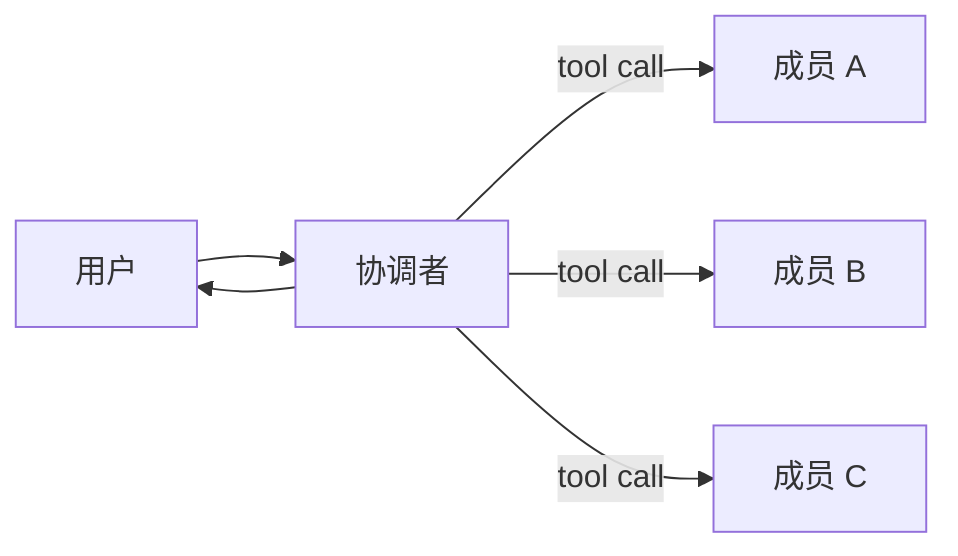
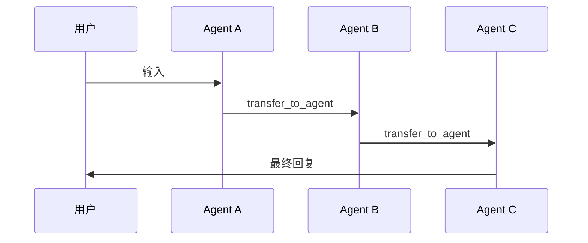

# Team（团队编排）

`team` 包提供了一种更高层、更易用的方式，把多个 Agent（智能体，Agent）组织在一起运行。

它提供两种最常见、最直观的协作方式：

- **协调者团队（Coordinator Team）**：由一个协调者 Agent 负责调用成员 Agent
  （以工具 Tool 的形式），最后由协调者统一回复用户。
- **群体协作（Swarm）**：没有“中心汇总循环”；当前 Agent 可以通过
  `transfer_to_agent` 把控制权移交给下一个 Agent，最终由最后一个 Agent
  回复用户。

本文示例里提到的 `LLMAgent` 指基于 Large Language Model (LLM，大语言模型)
的 Agent 实现。

## 为什么需要 Team？

单个 Agent 往往只擅长一个角色。真实应用里，我们通常需要多个角色协作，例如：

- 研究背景信息
- 编写代码
- 审查和纠错

Team 的目标是用一个小而清晰的 Application Programming Interface（API，应用程序编程接口）
把这些角色组合起来，且不引入难用的“多层抽象”。

## 协调者团队 vs Swarm

### 协调者团队（Coordinator Team）

- **适合场景**：需要“汇总多个成员输出”的任务（例如共识、总结、review 后再改）。
- **工作方式**：协调者通过 AgentTool（把 Agent 包装成 Tool）调用成员，
  可以在一次运行里调用多个成员，再合成最终答案。



### 群体协作（Swarm）

- **适合场景**：handoff（交接）链条：A 处理一部分后，决定交给 B；B 再决定交给 C……
- **工作方式**：entry（入口）成员先开始，之后每个成员可以使用
  `transfer_to_agent` 把控制权交给下一位成员；最后一个成员给用户最终回复。



## 快速上手：协调者团队

```go
import (
    "trpc.group/trpc-go/trpc-agent-go/agent"
    "trpc.group/trpc-go/trpc-agent-go/agent/llmagent"
    "trpc.group/trpc-go/trpc-agent-go/model/openai"
    "trpc.group/trpc-go/trpc-agent-go/runner"
    "trpc.group/trpc-go/trpc-agent-go/team"
)

modelInstance := openai.New("deepseek-chat")

coder := llmagent.New(
    "coder",
    llmagent.WithModel(modelInstance),
    llmagent.WithInstruction("Write Go code."),
)

reviewer := llmagent.New(
    "reviewer",
    llmagent.WithModel(modelInstance),
    llmagent.WithInstruction("Review for correctness."),
)

coordinator := llmagent.New(
    "team",
    llmagent.WithModel(modelInstance),
    llmagent.WithInstruction(
        "You are the coordinator. Call member agents as tools, "+
            "then produce the final answer.",
    ),
)

tm, err := team.New(
    "team",
    coordinator,
    []agent.Agent{coder, reviewer},
    team.WithDescription("A tiny coordinator team"),
)
if err != nil {
    panic(err)
}

r := runner.NewRunner("app", tm)
_ = r
```

注意：

- 协调者的名字必须与 Team 名字一致（这里都是 `"team"`），这样事件流里看起来更直观。
- 协调者需要支持动态 ToolSet（工具集，ToolSet）（LLMAgent 支持）。

## 快速上手：Swarm

```go
tm, err := team.NewSwarm(
    "team",
    "researcher", // entry 成员名称
    []agent.Agent{coder, researcher, reviewer},
)
if err != nil {
    panic(err)
}
```

注意：

- 成员需要支持 `SetSubAgents`（LLMAgent 支持）。Swarm 需要成员之间能“发现彼此”，
  才能正确 transfer。

## Swarm 的安全限制（Guardrails）

Swarm 的 handoff（交接）如果不加限制，可能会出现来回 transfer 的循环。
`team.SwarmConfig` 提供了一组可选的限制：

- `MaxHandoffs`：单次运行最多 transfer 次数
- `NodeTimeout`：单个成员在一次 transfer 后的最大运行时间
- `RepetitiveHandoffWindow` + `RepetitiveHandoffMinUnique`：循环检测

```go
import "time"

tm, err := team.NewSwarm(
    "team",
    "researcher",
    members,
    team.WithSwarmConfig(team.SwarmConfig{
        MaxHandoffs:                20,
        NodeTimeout:                300 * time.Second,
        RepetitiveHandoffWindow:    8,
        RepetitiveHandoffMinUnique: 3,
    }),
)
```

## 示例

可以直接参考 `examples/team`，它包含两个模式的可运行示例。

## 设计说明（简要）

- 协调者团队会把成员通过 AgentTool 包装成工具，并安装到协调者上。
- Swarm 会通过 `SetSubAgents` 把成员互相“连起来”，handoff（交接）走
  `transfer_to_agent`。
- `team.SwarmConfig` 的限制通过一次运行期间写入
  `RunOptions.RuntimeState` 的 transfer controller（控制器）来生效。
