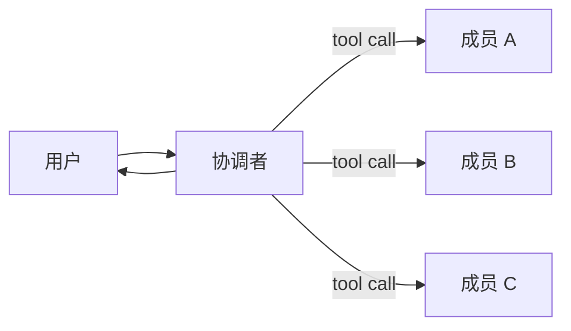
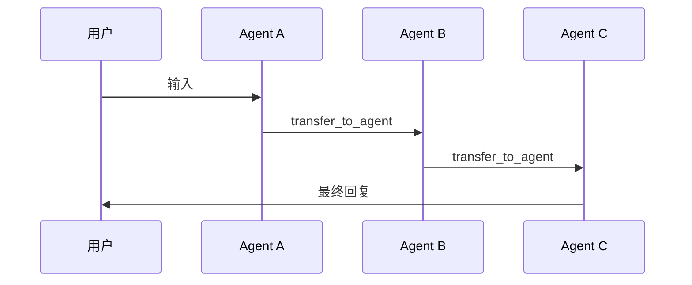

# Team（团队编排）

`team` 包提供了一种更高层、更易用的方式，把多个 Agent（智能体，Agent）组织在一起运行。

它提供两种最常见、最直观的协作方式：

- **协调者团队（Coordinator Team）**：由一个协调者 Agent 负责调用成员 Agent
  （以工具 Tool 的形式），最后由协调者统一回复用户。
- **群体协作（Swarm）**：没有“中心汇总循环”；当前 Agent 可以通过
  `transfer_to_agent` 把控制权移交给下一个 Agent，最终由最后一个 Agent
  回复用户。

本文示例里提到的 `LLMAgent` 指基于 Large Language Model (LLM，大语言模型)
的 Agent 实现。

## 为什么需要 Team？

单个 Agent 往往只擅长一个角色。真实应用里，我们通常需要多个角色协作，例如：

- 研究背景信息
- 编写代码
- 审查和纠错

Team 的目标是用一个小而清晰的 API
把这些角色组合起来，且不引入难用的“多层抽象”。

这里的 API 指 Application Programming Interface（应用程序编程接口）。

## 协调者团队 vs Swarm

### 协调者团队（Coordinator Team）

- **适合场景**：需要“汇总多个成员输出”的任务（例如共识、总结、review 后再改）。
- **工作方式**：协调者通过 AgentTool（把 Agent 包装成 Tool）调用成员，
  可以在一次运行里调用多个成员，再合成最终答案。



### 群体协作（Swarm）

- **适合场景**：handoff（交接）链条：A 处理一部分后，决定交给 B；B 再决定交给 C……
- **工作方式**：entry（入口）成员先开始，之后每个成员可以使用
  `transfer_to_agent` 把控制权交给下一位成员；最后一个成员给用户最终回复。
- **退出条件**：当某个成员不再调用 `transfer_to_agent`，而是直接输出最终回复时，
  Swarm 就结束。最后一个成员的回复就是这次运行的最终结果。
- **是否会自动总结**：Swarm 不会额外执行一次“统一总结”。如果你希望最终输出包含
  总结/结论/下一步，可以在成员的 `instruction`（指令）里明确要求，或增加一个专门
  “收尾（finalizer）”的成员并在最后 transfer 给它。



## 快速上手：协调者团队

```go
import (
    "trpc.group/trpc-go/trpc-agent-go/agent"
    "trpc.group/trpc-go/trpc-agent-go/agent/llmagent"
    "trpc.group/trpc-go/trpc-agent-go/model/openai"
    "trpc.group/trpc-go/trpc-agent-go/runner"
    "trpc.group/trpc-go/trpc-agent-go/team"
)

modelInstance := openai.New("deepseek-chat")

coder := llmagent.New(
    "coder",
    llmagent.WithModel(modelInstance),
    llmagent.WithInstruction("Write Go code."),
)

reviewer := llmagent.New(
    "reviewer",
    llmagent.WithModel(modelInstance),
    llmagent.WithInstruction("Review for correctness."),
)

coordinator := llmagent.New(
    "team",
    llmagent.WithModel(modelInstance),
    llmagent.WithInstruction(
        "You are the coordinator. Consult the right specialists, "+
            "then produce the final answer.",
    ),
)

tm, err := team.New(
    coordinator,
    []agent.Agent{coder, reviewer},
    team.WithDescription("A tiny coordinator team"),
)
if err != nil {
    panic(err)
}

r := runner.NewRunner("app", tm)
_ = r
```

注意：

- Team 的名字来自协调者的名字（这里都是 `"team"`，`team.New` 会直接复用
  `coordinator.Info().Name`），这样同一次会话（session）的事件（event）里不会出现
  两套作者名。
- 协调者需要支持动态 ToolSet（工具集，ToolSet）（LLMAgent 支持）。
- 一般不需要在协调者的 `instruction`（指令）里强调“把成员当作工具调用”。Team 会
  自动把 `members` 包装成工具并注入到协调者；更推荐把 `instruction` 写成“职责 +
  输出要求”，例如“你负责协调并产出最终答案”。
- 如果你想把成员（以工具调用）的输出流式展示到父流程里，需要确保协调者和成员都
  使用流式输出，然后通过成员工具配置开启（见下文）。

## Team 嵌套 Team（层级化团队）

因为 `team.Team` 自己也实现了 `agent.Agent` 接口，所以它可以像普通 Agent 一样
被复用：一个 Team 可以作为另一个 Team 的成员（member）。

这种“Team of Teams（团队套团队）”的结构，适合把复杂系统拆成多层角色，例如：

- `project_manager`（项目经理）
  - `dev_team`（开发团队：负责技术方案与实现）
    - `backend_dev`（后端开发）
    - `frontend_dev`（前端开发）
  - `doc_writer`（文档编写）

下面是一个最小示例：外层是 `project_manager` 协调者团队，它把 `dev_team`
（内层团队）当作一个成员来调用。

```go
import (
    "trpc.group/trpc-go/trpc-agent-go/agent"
    "trpc.group/trpc-go/trpc-agent-go/agent/llmagent"
    "trpc.group/trpc-go/trpc-agent-go/model/openai"
    "trpc.group/trpc-go/trpc-agent-go/runner"
    "trpc.group/trpc-go/trpc-agent-go/team"
)

modelInstance := openai.New("deepseek-chat")

backendDev := llmagent.New(
    "backend_dev",
    llmagent.WithModel(modelInstance),
    llmagent.WithInstruction("Design service interfaces and server-side logic."),
)

frontendDev := llmagent.New(
    "frontend_dev",
    llmagent.WithModel(modelInstance),
    llmagent.WithInstruction("Design user interfaces and client-side logic."),
)

devCoordinator := llmagent.New(
    "dev_team",
    llmagent.WithModel(modelInstance),
    llmagent.WithInstruction(
        "You lead dev_team. Collect input from your members when needed, "+
            "then return an integrated technical plan.",
    ),
)

devTeam, err := team.New(
    devCoordinator,
    []agent.Agent{backendDev, frontendDev},
)
if err != nil {
    panic(err)
}

docWriter := llmagent.New(
    "doc_writer",
    llmagent.WithModel(modelInstance),
    llmagent.WithInstruction("Write clear documentation."),
)

pmCoordinator := llmagent.New(
    "project_manager",
    llmagent.WithModel(modelInstance),
    llmagent.WithInstruction(
        "You are the project manager. Delegate technical work to dev_team "+
            "and docs to doc_writer, then produce the final answer.",
    ),
)

pmTeam, err := team.New(
    pmCoordinator,
    []agent.Agent{devTeam, docWriter}, // devTeam is a Team.
)
if err != nil {
    panic(err)
}

r := runner.NewRunner("app", pmTeam)
_ = r
```

注意：

- 同一个 Team 的 `members` 里，成员的 `Info().Name` 必须唯一。
- 名字最好只用字母、数字、下划线、短横线（`^[a-zA-Z0-9_-]+$`），这样更兼容
  各家模型对 Tool 名称的限制。
- Swarm 模式（`team.NewSwarm`）要求每个成员支持 `SetSubAgents`（用于把可交接的
  Agent 列表注入到成员上）。`team.Team` 本身不实现 `SetSubAgents`，因此
  “Swarm 里嵌 Team（把 Team 当作 Swarm 成员）”目前不支持。
  - 如果你需要“外层协调、内层 handoff（交接）”，推荐：外层用协调者团队
    `team.New`，内层用 Swarm 团队 `team.NewSwarm`，然后把内层 Team 当作外层成员。

## 成员工具配置（协调者团队）

在协调者团队里，每个成员都会被包装成 AgentTool（把 Agent 包装成 Tool），并作为
Tool（通过 ToolSet）安装到协调者上。`team.MemberToolConfig` 用来控制这个包装层的
行为。

在实现上，`team.MemberToolConfig` 会直接映射到 AgentTool 的选项：
`agenttool.WithStreamInner`、`agenttool.WithHistoryScope`、
`agenttool.WithSkipSummarization`。

### 快速上手

建议从默认配置开始，再按需覆盖：

```go
memberCfg := team.DefaultMemberToolConfig()
memberCfg.StreamInner = true
memberCfg.HistoryScope = team.HistoryScopeParentBranch
memberCfg.SkipSummarization = false

tm, err := team.New(
    coordinator,
    members,
    team.WithMemberToolConfig(memberCfg),
)
```

默认值（来自 `team.DefaultMemberToolConfig()`）：

- `StreamInner=false`
- `HistoryScope=team.HistoryScopeParentBranch`
- `SkipSummarization=false`

### 选项与使用场景

#### `StreamInner`

- **默认值**：`false`
- **作用**：把成员的流式事件转发到父流程。
- **适用场景**：你希望在终端/界面里看到成员的“实时输出过程”。
- **用法**：先让协调者和成员都启用流式输出（例如
  `GenerationConfig{Stream: true}`），再设置
  `MemberToolConfig.StreamInner=true`。

#### `HistoryScope`

`HistoryScope` 控制成员运行时是否能看到协调者的历史对话。

- `team.HistoryScopeParentBranch`（默认）
  - **作用**：成员会继承协调者的历史（用户输入、协调者消息、之前成员的工具结果），
    但成员自己的事件仍然写入一个子分支。
  - **适用场景**：成员需要共享上下文、并且存在“先研究再写作”这类交接链条。
- `team.HistoryScopeIsolated`
  - **作用**：成员运行更隔离，主要只看到本次工具输入，而不会看到协调者之前的历史。
  - **适用场景**：你希望更强隔离、更小的上下文，或避免把早期上下文泄露给某个成员。

#### `SkipSummarization`

- **默认值**：`false`
- **作用**：成员工具返回后，直接结束协调者本轮运行，跳过协调者的
  “工具后总结（post-tool）” LLM 调用。
- **适用场景**：你希望“成员直接回复用户”，而不是由协调者综合（例如纯路由/透传团队）。
- **不适用场景**：你需要协调者汇总多个成员输出并生成最终答案（这也是协调者团队的默认模式）。

## 成员并行调用（协调者团队）

由于成员是以工具的形式暴露给协调者的，你可以在协调者上开启并行工具执行：

```go
coordinator := llmagent.New(
    "team",
    llmagent.WithEnableParallelTools(true),
)
```

并行执行只有在 **模型在同一轮回复里输出了多个 tool call** 时才会生效。适用场景：

- 成员任务彼此独立（例如“市场分析 / 风险分析 / 竞品分析”）
- 你希望降低整体延迟

## 快速上手：Swarm

```go
tm, err := team.NewSwarm(
    "team",
    "researcher", // entrypoint（入口）成员名称
    []agent.Agent{coder, researcher, reviewer},
)
if err != nil {
    panic(err)
}
```

注意：

- `entryName` 是 Swarm 的 entrypoint（入口）成员：一次运行会从它开始；
  它必须出现在 `members` 里（必须匹配成员的 `Info().Name`）。
- 成员需要支持 `SetSubAgents`（LLMAgent 支持）。Swarm 需要成员之间能“发现彼此”，
  才能正确 transfer。

### 跨请求 transfer（可选）

默认情况下，每次新的用户输入都会从 Swarm 的 entry（入口）成员（`entryName`）开始，
即使上一轮已经发生过一次或多次 handoff（交接）。

如果你希望“当前接管会话的成员”在多次用户输入间保持不变，可以开启跨请求 transfer：

```go
tm, err := team.NewSwarm(
    "team",
    "researcher",
    members,
    team.WithCrossRequestTransfer(true),
)
```

开启后：当某个成员通过 `transfer_to_agent` 交接并产出最后一次回复时，
下一条用户输入将从该成员开始（直到再次发生 `transfer_to_agent`）。该能力通过
Session State 实现，因此需要复用同一个 session。

## Swarm 的安全限制

Swarm 的 handoff（交接）如果不加限制，可能会出现来回 transfer 的循环。
`team.SwarmConfig` 提供了一组可选的限制（字段为 0 表示不限制或关闭）：

- `MaxHandoffs`：单次运行里最多 transfer 次数（整个 Team 累计；每次
  `transfer_to_agent` 计 1 次）
- `NodeTimeout`：每次 transfer 后，目标成员这次运行的最大时长（只对 transfer 的目标成员生效）
- `RepetitiveHandoffWindow` + `RepetitiveHandoffMinUnique`：循环检测（滑动窗口）

提示：把 `RepetitiveHandoffWindow` 或 `RepetitiveHandoffMinUnique` 设为 0
就会关闭循环检测（不会做“最近 N 次 transfer”的判断）。

```go
import "time"

tm, err := team.NewSwarm(
    "team",
    "researcher",
    members,
    team.WithSwarmConfig(team.SwarmConfig{
        MaxHandoffs:                20,
        NodeTimeout:                300 * time.Second,
        RepetitiveHandoffWindow:    8,
        RepetitiveHandoffMinUnique: 3,
    }),
)
```

默认值来自 `team.DefaultSwarmConfig()`：`MaxHandoffs=20`、
`RepetitiveHandoffWindow=8`、`RepetitiveHandoffMinUnique=3`，
`NodeTimeout=0`（不限制）。

循环检测的含义：当窗口大小为 N 且最小唯一数为 M 时，如果最近 N 次
transfer 的目标成员（toAgent）中，不同成员数小于 M，就会拒绝这次
transfer。它是一种比较粗略但高效的判断：只看最近 N 次的“目标成员名字”，
不分析完整的 transfer 路径。

举例：如果 `RepetitiveHandoffWindow=8`、`RepetitiveHandoffMinUnique=3`，
而 transfer 一直在 A 和 B 之间来回（A => B、B => A、A => B……），那么最近
8 次 transfer 的目标成员只会包含 A 和 B 两个，不同成员数为 2，小于 3，
因此会被判定为循环并拒绝这次 transfer。

注意：如果把 M 设为 2，那么 A↔B 这种“两人来回”的情况不会被拦截
（因为不同成员数刚好等于 2，并不小于 2）。想要覆盖这种情况，通常需要
把 M 设为 3 或更大。

## 示例

可以直接参考 `examples/team/coord`（协调者团队）和 `examples/team/swarm`
（Swarm），它们分别提供可运行示例。

## 设计说明

- 协调者团队会把成员通过 AgentTool 包装成工具，并安装到协调者上。
- Swarm 会通过 `SetSubAgents` 把成员互相“连起来”，handoff（交接）走
  `transfer_to_agent`。
- `team.SwarmConfig` 的限制通过一次运行期间写入
  `RunOptions.RuntimeState` 的 transfer controller（控制器）来生效。
