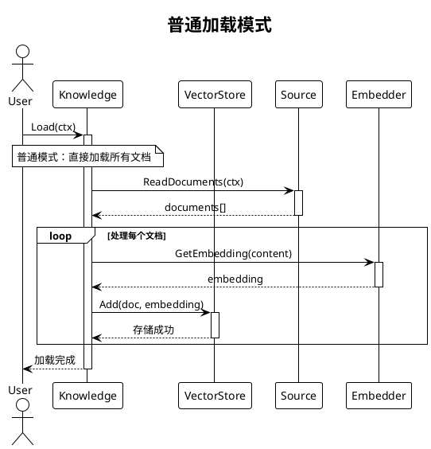
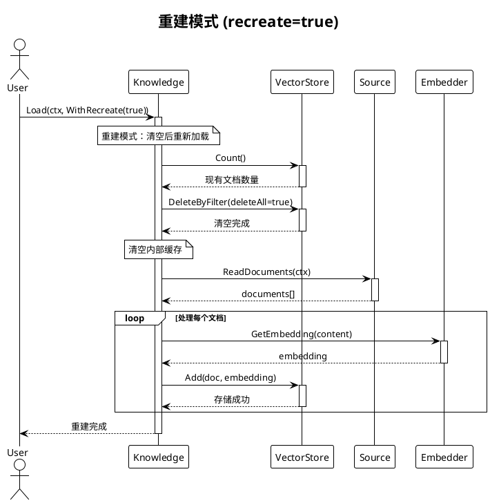
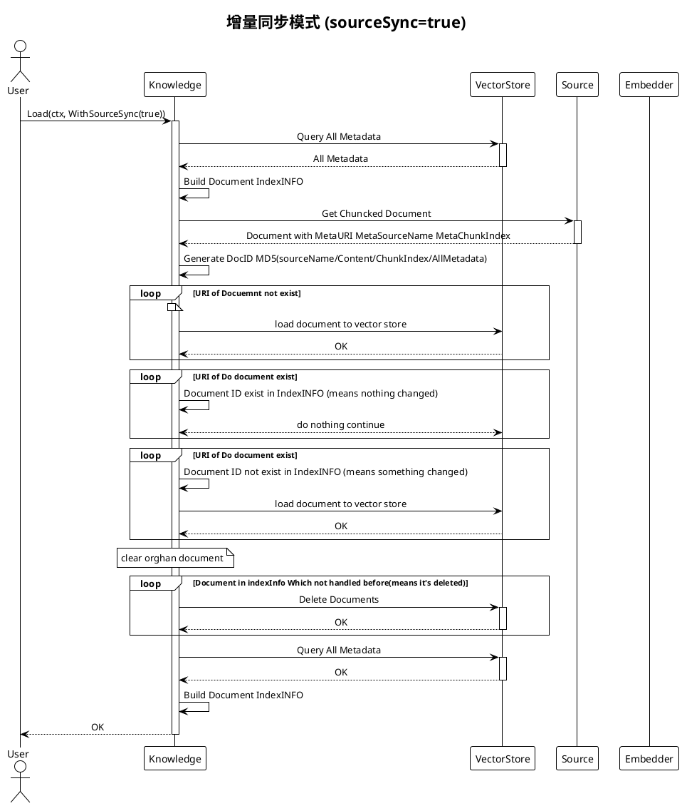

# Source 和 Document 管理方式

## 概述

本文档说明 trpc-agent-go 知识库中数据的管理方式、增量同步机制和执行流程。

## 核心概念

### Source（知识源）
- **定义**：实现了 `source.Source` 接口的数据源，如文件、URL、数据库等
- **职责**：提供文档内容和元数据信息
- **名称**：不要求唯一名称，但**建议使用唯一名称**以方便 `RemoveSource`/`ReloadSource` 等操作

### Document（文档）
- **定义**：知识库中的基本存储单元，包含内容、元数据和唯一ID
- **生命周期**：创建 → 向量化 → 存储 → 检索 → 更新/删除

## 文档唯一标识机制

### Document ID 生成规则
```go
Document ID = MD5(sourceName + content + chunkIndex + sourceMetadata)
```

**组成要素**：
1. **sourceName**：数据源名称
2. **content**：文档内容
3. **chunkIndex**：分块索引（默认为0）
4. **sourceMetadata**：数据源元数据（按key排序确保一致性）

**特点**：
- 内容相同 → ID相同 → 自动去重
- 内容变化 → ID变化 → 触发更新
- 128位哈希 → 32个十六进制字符
- MD5算法 → 计算快速，适合文档去重

### 核心元数据字段
系统使用标准元数据字段来标识和管理文档，主要包括：
- **MetaURI**: 资源URI标识
- **MetaSourceName**: 数据源名称
- **MetaChunkIndex**: 分块索引

## 执行流程

### 加载流程时序图

#### 1. 普通加载模式



#### 2. 重建模式



#### 3. 增量同步模式



### 数据状态变化图

```plantuml
@startuml
!theme plain
skinparam backgroundColor white

package "BuiltinKnowledge 内部状态" {
    class BuiltinKnowledge {
        + vectorStore: VectorStore
        + embedder: Embedder
        + sources: []Source
        --
        + cacheDocumentInfo: map[string][]DocumentInfo
        + cacheMetaInfo: map[string]DocumentMetadata  
        + processedDocIDs: sync.Map
    }
    
    class DocumentInfo {
        + DocumentID: string
        + SourceName: string
        + ChunkIndex: int
        + URI: string
        + AllMeta: map[string]interface{}
    }
}

package "VectorStore 数据" {
    class VectorDocument {
        + ID: string (DocumentID)
        + Content: string
        + Embedding: []float32
        + Metadata: map[string]interface{}
        + CreatedAt: time.Time
        + UpdatedAt: time.Time
    }
}

package "Source 数据" {
    class Document {
        + ID: string
        + Content: string
        + Metadata: map[string]interface{}
        + CreatedAt: time.Time
        + UpdatedAt: time.Time
    }
}

state "加载开始" as start
state "普通模式" as normal
state "Recreate模式" as recreate  
state "增量同步模式" as sync

state recreate {
    state "清空VectorStore" as clear_vs
    state "清空内部缓存" as clear_cache
    state "重新加载所有文档" as reload_all
    
    clear_vs --> clear_cache
    clear_cache --> reload_all
}

state sync {
    state "加载现有元数据" as load_meta
    state "缓存到cacheMetaInfo" as cache_meta
    state "按URI分组到cacheDocumentInfo" as group_uri
    state "处理新文档" as process_new
    state "判断文档是否需要处理" as check_doc
    state "清理孤儿文档" as cleanup_orphan
    state "更新缓存状态" as update_cache
    
    load_meta --> cache_meta
    cache_meta --> group_uri
    group_uri --> process_new
    process_new --> check_doc
    check_doc --> cleanup_orphan
    cleanup_orphan --> update_cache
}

start --> normal : recreate=false,sourceSync=false
start --> recreate : recreate=true
start --> sync : recreate=false,sourceSync=true

note top of BuiltinKnowledge
**缓存数据结构说明:**
• cacheDocumentInfo: 按URI分组的文档信息
• cacheMetaInfo: 所有文档的元数据缓存  
• processedDocIDs: 当前同步周期已处理的文档ID
end note

note top of VectorDocument
**VectorStore存储格式:**
• ID使用MD5(sourceName+content+chunkIndex+metadata)
• Metadata包含URI、SourceName、ChunkIndex等
• 支持按Metadata过滤和删除
end note

@enduml
```

### 执行逻辑说明

#### 1. Recreate 模式
```go
err := kb.Load(ctx, knowledge.WithRecreate(true))
```
- **作用**：完全重建知识库
- **执行**：清空 vectorstore 中所有文档，重新处理所有源文档
- **适用场景**：首次部署、数据修复、重大变更后

#### 2. 增量同步模式（默认）
```go
err := kb.Load(ctx) // 默认增量模式
```
- **作用**：智能增量更新，只处理变化的文档
- **执行**：对比文档ID，跳过未变化的文档，只处理新增/修改的文档
- **适用场景**：日常更新、定期同步

### 同步判断逻辑

对每个文档执行以下判断：

1. **生成Document ID**: 基于内容和元数据计算MD5哈希
2. **检查重复处理**: 避免同一文档在当前同步中重复处理
3. **检查文档存在性**: 
   - 新文档 → 直接处理
   - 现有文档且ID相同 → 跳过处理
   - 现有文档但ID不同 → 重新处理（内容已变化）

### 孤儿文档清理

**定义**：vectorstore中存在但当前所有source都不再包含的文档

**清理时机**：每次增量同步完成后自动执行

**清理逻辑**：
- 遍历所有现有文档
- 找出未被任何source处理的文档
- 逐个删除这些孤儿文档

### 性能优化

系统采用多种策略提升同步性能：

- **元数据缓存**：避免重复查询 vectorstore
- **并发处理**：支持多源和多文档并发处理
- **跳过未变化**：基于文档ID快速判断是否需要重新处理
- **分页支持**：大量文档时分批获取元数据

## 实际场景

### 场景示例
- **首次加载**：所有文档都会被向量化并存储
- **重复加载**：内容未变化的文档会被跳过，节省计算资源
- **文件修改**：只有变化的文档会被重新处理
- **文件删除**：系统会自动清理不再存在的文档

### 具体场景分析

#### 场景1：无变化重复加载
```
现有文档：100个
新增文档：100个（内容相同）
处理结果：跳过所有文档，0个添加，0个删除
```

#### 场景2：文件内容修改
```
现有文档：doc1(v1), doc2(v1), doc3(v1)
新增文档：doc1(v2), doc2(v1), doc3(v1)  # doc1内容变化
处理结果：
- 跳过：doc2(v1), doc3(v1)
- 添加：doc1(v2)
- 删除：doc1(v1)
```

#### 场景3：文件删除
```
现有文档：doc1, doc2, doc3
新增文档：doc1, doc2  # doc3被删除
处理结果：
- 跳过：doc1, doc2
- 删除：doc3（孤儿文档）
```

## 使用示例

### 基本用法

```go
// 1. 创建知识库
kb := knowledge.New(
    knowledge.WithVectorStore(vectorStore),
    knowledge.WithEmbedder(embedder),
)

// 2. 添加数据源
fileSource := file.New([]string{"/path/to/docs"})
kb.AddSource(fileSource)

// 3. 执行加载（默认增量同步）
err := kb.Load(ctx)
```

### 配置选项

```go
// 重建模式（清空后重新加载）
err := kb.Load(ctx, knowledge.WithRecreate(true))

// 并发控制
err := kb.Load(ctx,
    knowledge.WithSourceConcurrency(4),  // 4个source并发
    knowledge.WithDocConcurrency(8),     // 8个document并发
)

// 进度监控
err := kb.Load(ctx,
    knowledge.WithShowProgress(true),
    knowledge.WithProgressStepSize(10),
    knowledge.WithShowStats(true),
)
```

---

*本文档随代码更新而更新，如有疑问请参考最新源码或提交Issue。*
