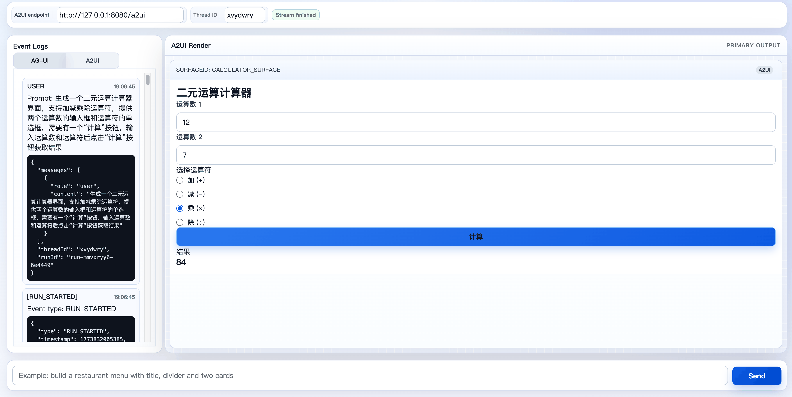

# A2UI Example

This example demonstrates how to wire the trpc-agent-go AG-UI server with the A2UI translator and render A2UI messages in a browser in real time.

## Example Structure

```text
a2ui/
├── server/
│   ├── README.md        # Server example index
│   ├── default/         # Basic A2UI server example
│   └── sbti/            # SBTI A2UI server example
├── client/
│   ├── index.html       # Demo frontend page
│   ├── client.js        # SSE stream consumer, logs, and A2UI renderer
│   └── README.md        # Frontend README
├── README.md            # This file
└── go.mod
```

## Highlights

- Runs an AG-UI server with A2UI translator enabled.
- Includes an additional graph-based SBTI example built as a two-agent-node graph, splitting state/scoring and A2UI rendering while keeping all business rules in static instruction assets. The example aligns with the official `sbti.ai` question content and scoring logic, but keeps a deterministic order instead of the site's random shuffle. The quiz UI uses standard `MultipleChoice` inputs with local data binding, and only `submit_test` / `restart_test` trigger new requests.
- In default mode, AG-UI control events (for example `RUN_*`) are forwarded while non-text events are dropped by default.
- Provides an interactive browser client that:
  - Shows AG-UI raw event stream and A2UI parsed event stream.
  - Renders A2UI `surfaceUpdate` payloads into an interactive UI.
  - Sends `userAction` events for explicit action components while keeping data-bound form state local in the browser.
- The client generates a 7-character alphabetic `threadId` by default; refreshing the page creates a new conversation id.

## Demo Screenshot



## Prerequisites

1. Configure model credentials (at least one valid LLM provider).

```bash
export OPENAI_API_KEY="your-api-key"
export OPENAI_BASE_URL="https://api.openai.com/v1"   # or your compatible endpoint
```

2. Ensure `go run` works in your environment.

## Run the default server example

```bash
cd examples/a2ui/server/default
go run .
```

Optional flags:

- `-model` (default: `gpt-5.4`): LLM model name.
- `-stream` (default: `true`): whether streaming is enabled.
- `-address` (default: `127.0.0.1:8080`): listen address.
- `-path` (default: `/a2ui`): AG-UI/A2UI HTTP path.

Default endpoint:

- `http://127.0.0.1:8080/a2ui`

## Run the client (SSE visualizer)

In a second terminal:

```bash
cd examples/a2ui/client
python3 -m http.server 4173
```

Open:

```text
http://127.0.0.1:4173
```

## Usage

1. Set `A2UI Endpoint` in the top panel (pre-filled with `http://127.0.0.1:8080/a2ui`).
2. Enter a `Thread ID` (or use the auto-generated one).
3. Type a prompt and click `Send`.
4. On the right side, observe:
  - AG-UI events (`run_started`, `run_finished`, `run_error`, `raw`, etc.)
  - A2UI parsed events
  - Rendered A2UI UI output
5. Use rendered action components to send `userAction` events back to the server. Data-bound inputs such as `MultipleChoice` update local bound state immediately and do not automatically trigger a new request.

## Log behavior

The client exposes both AG-UI and A2UI event streams and allows switching between them.
The server only logs error-level messages in this example and does not print every request or response payload.

## Troubleshooting

- No frontend response:
  - Verify endpoint URL and port match the server.
  - Make sure the `go run .` process in `examples/a2ui/server/default` is still running.
- Missing or incomplete rendering:
  - Verify the server emits valid A2UI events such as `surfaceUpdate` and `beginRendering`.
  - Check that AG-UI raw event payloads contain A2UI-compatible data and source.
- Unexpected cross-session behavior:
  - Keep using the same `Thread ID` for one conversation, or intentionally start a new one.

## Key files

- `server/default/main.go`: default server startup, path, and runner configuration.
- `server/default/agent.go`: default A2UI planner and LLM agent setup.
- `server/sbti/main.go`: two-agent graph SBTI example server.
- `server/sbti/agent.go`: graph assembly plus director/renderer agent setup.
- `client/index.html`: frontend layout.
- `client/client.js`: demo SSE parser, event rendering, local data binding, and action submission.

## Expected verification

- AG-UI stream and rendered UI update appears in sync.
- Initial surfaces (such as a menu, form, or quiz) are rendered on the right panel.
- Explicit action interactions trigger new requests and drive the next UI state, while bound input components can update local state without a request.
